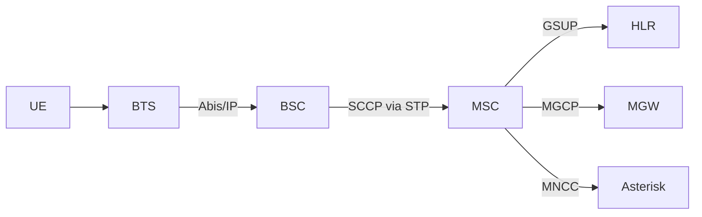
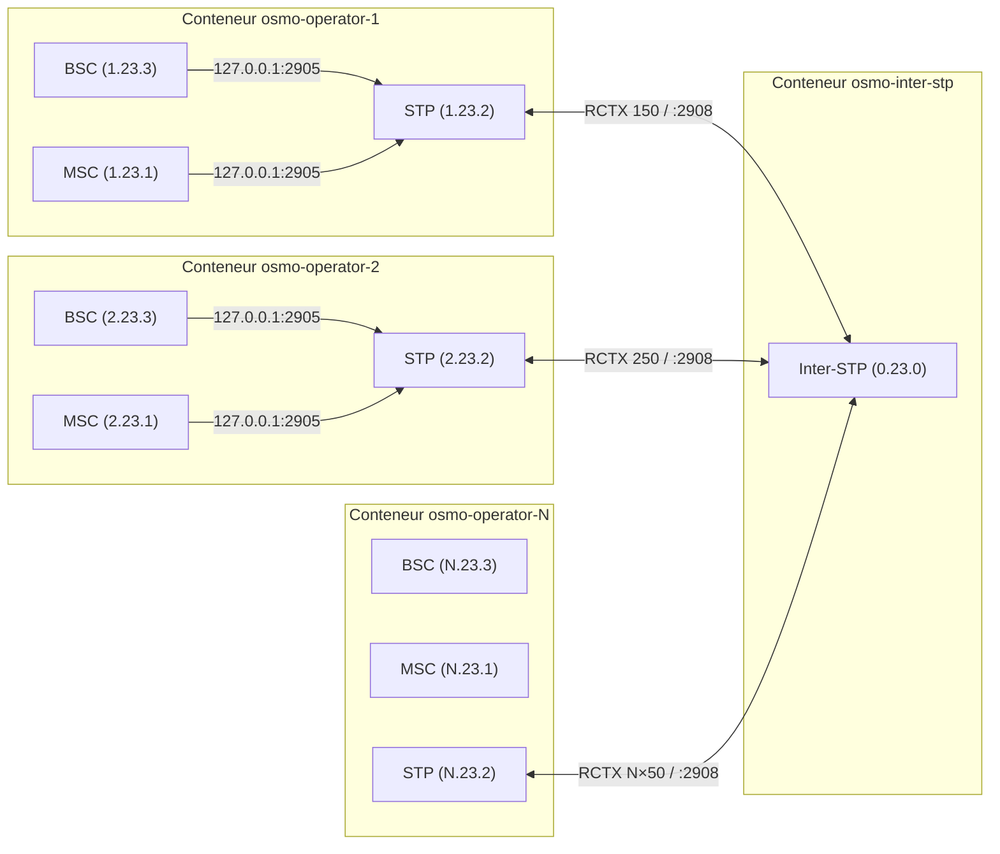
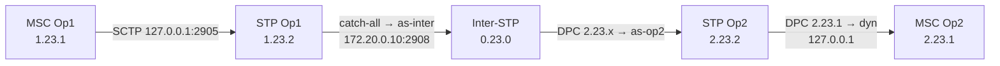
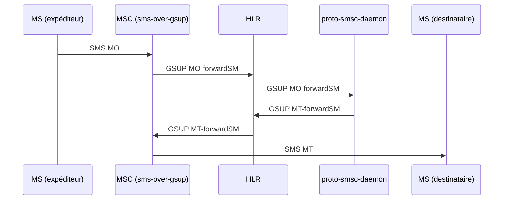
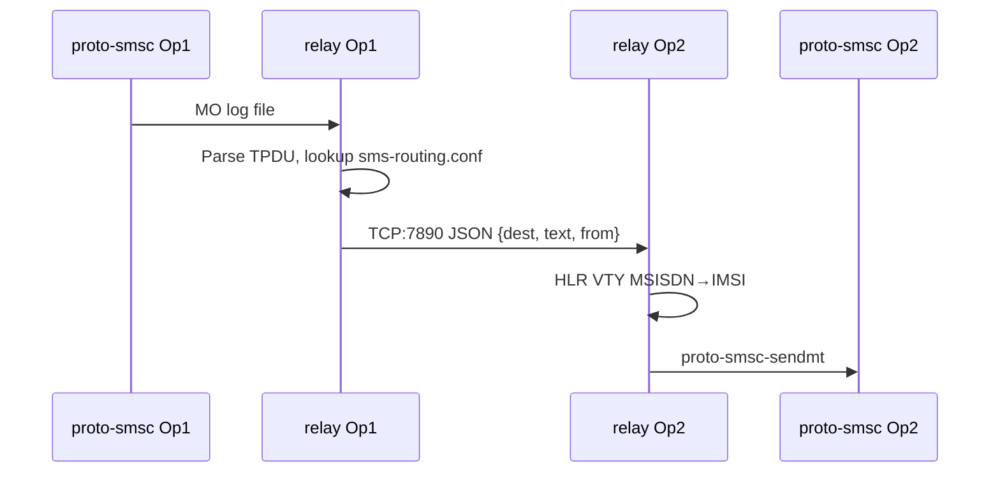
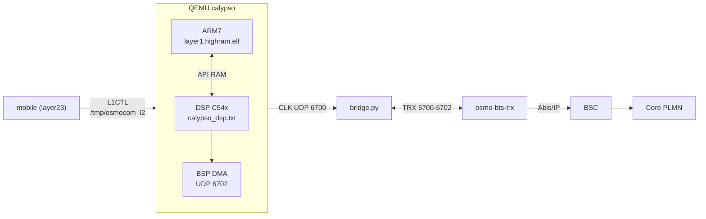

## `osmo-operator-qmd/osmo-operator-full.qmd` {#f-osmo-operator-qmd-osmo-operator-full-qmd}

::: {.file-meta}
[.qmd]{.tag} 35865 lignes - 1,6MB
:::

`````{.markdown .numberLines filename="osmo-operator-qmd/osmo-operator-full.qmd"}
---
title: "Calypso QEMU"
subtitle: "Full source bundle - DSP C54x / osmocom-bb / SHUNT_LEGIT"
date: "2026-09-02T21:08:59+02:00"
date-format: "YYYY-MM-DD HH:mm"
lang: fr
format:
  html:
    theme: [sketchy]
    css: sketchy.css
    toc: true
    toc-depth: 2
    toc-location: left
    toc-title: "Fichiers"
    toc-expand: 1
    number-sections: false
    anchor-sections: true
    smooth-scroll: true
    code-copy: true
    code-overflow: scroll
    code-block-bg: true
    highlight-style: arrow
    embed-resources: false
    include-after-body: sk-filter.html
    grid:
      sidebar-width: 340px
      body-width: 1150px
      margin-width: 140px
    mermaid:
      theme: neutral
---

::: {.sk-filter}
<input id="sk-filter" type="text" placeholder="filtrer les fichiers (ex: dsp, .c, shunt)..." autocomplete="off">
:::

::: {.callout-note appearance="simple" icon=false}
**Bundle plat du depot** - doc, tests, headers, sources, python, shell.
Scope `.` - git `main@77cd3b2` - genere 2026-09-02T21:08:59+02:00
- exclusions `subprojects|build|pc-bios|tests/functional|tests/qtest|tests/unit|tests/migration|tests/qemu-iotests|node_modules|\.git|\.pytest_cache` - troncature 512 ko/fichier.
:::


# 1 - Documentation {#sec-1}

::: {.section-count}
**6 fichiers**
:::

## `environment/README.md` {#f-environment-readme-md}

::: {.file-meta}
[.md]{.tag} 85 lignes - 3,7KB
:::

````{.markdown .numberLines filename="environment/README.md"}
# `environment/` — la configuration, par domaine

`calypso.env` mélangeait 312 variables : chemins d'installation, cadences du modèle, sondes de
mesure et contournements, sans distinction. Ce répertoire les sépare **par ce qu'elles font**,
pour qu'on sache ce qu'on a le droit de toucher.

| Fichier | Domaine | Touchez-y ? |
|---|---|---|
| `paths.env` | où sont les dépendances sur **votre** machine | **oui**, c'est le premier à régler |
| `modes.env` | les profils prêts à l'emploi (le mode qui campe, le mode natif…) | **oui**, choisissez-en un |
| `bsp.env` | BSP / DMA / DARAM / feed I-Q / horloge TDMA | si vous savez ce que vous faites |
| `dsp.env` | cœur c54x : interruptions, IMR, cadence d'exécution | idem |
| `fbsb.env` | FB / FBSB / corrélateur / démodulateur | idem |
| `shunt.env` | canaux shunt DL/UL, injections | idem |
| `rf.env` | TPU / TSP / RF / AFC | idem |
| `debug.env` | sondes et traces — **sans effet** sur l'émulation | **oui**, librement |
| `fixes.env` | le sas `CALYPSO_FIXES` : correctifs en attente de validation | temporairement |
| `crutches.env` | **les béquilles** — contournements de branches non implémentées | **non**, sauf pour diagnostiquer |

## Trois choses à savoir avant de modifier quoi que ce soit

**1. La vérité est le manifeste, pas la ligne de commande.**
```bash
grep "calypso-manifest" /root/qemu.log
```
Certaines variables en reposent d'autres silencieusement : `CALYPSO_NATIVE_HELPED=1` allume aussi
`FB_CORR_ENTRY`, `FB_ENERGY` et `FB_IQ_*`. Retirer l'une d'elles de la ligne de commande ne la
supprime pas — elle revient à son défaut.

**2. `=0` ne coupe pas tout.** Quatre idiomes de gate coexistent :

| Idiome | Actif quand | Comment couper |
|---|---|---|
| `getenv("X") ? 1 : 0` | la variable **existe**, même à `0` | **`unset X`** |
| `atoi(...) > 0` | valeur > 0 | `X=0` |
| `*e == '1'` | exactement `"1"` | toute autre valeur |
| défaut ON + `X_OFF` | par défaut | poser `X_OFF` |

**3. `:=` contre `=`.** Dans ces fichiers, `: "${VAR:=valeur}"` laisse la ligne de commande gagner ;
`VAR=valeur` la **verrouille**. N'utilisez `=` que pour ce qui ne doit jamais être surchargé.

## Référence complète

Les 312 variables, avec défaut, effet mesuré, mode, idiome, catégorie et dépendances :
`../hw/arm/calypso/doc/VARIABLES_ENVIRONNEMENT.md`.


## Comment ça se charge

Tout passe par `load.env`, sourcé par `start-clean.sh` :

```bash
set -a ; . ./environment/load.env ; set +a
```

L'ordre compte. Tous les fichiers utilisent `:=` (« si pas déjà défini »), donc **le premier qui
pose une valeur gagne** :

1. la **ligne de commande** — `VAR=x ./run.sh` gagne toujours ;
2. `modes.env` — le profil choisi ;
3. les fichiers par domaine — les défauts ;
4. `calypso.env` — l'ancien monolithe, conservé le temps de la migration. Il n'utilise que `:=`,
   donc il ne peut rien écraser : il ne fournit que ce qui n'a pas encore été réparti. À vider
   progressivement.

## Les fichiers hérités

`calypso.env`, `calypso_hack.env`, `calypso_native*.env`, `calypso_shunt_*.env`, `calypso_wire.env`
datent d'avant ce découpage. Ils sont conservés — on ne détruit pas ce qui marche — mais la
configuration nouvelle vit dans les fichiers par domaine.

## Ce que contient chaque domaine

| Fichier | Variables | dont béquilles |
|---|---|---|
| `bsp.env` | 52 | 10 |
| `dsp.env` | 52 | 15 |
| `fbsb.env` | 52 | 25 |
| `shunt.env` | 58 | 34 |
| `armdsp.env` | 47 | 16 |
| `opcodes.env` | 50 | 16 |

**116 béquilles sur 311 variables** — plus d'un tiers du projet est du contournement. Chacune est
annotée à son site de lecture dans le code (`grep -rn "@BEQUILLE" hw/arm/calypso/`), avec ce
qu'elle masque et la condition qui la rendrait inutile.

````

## `navigation/QUICKSTART.md` {#f-navigation-quickstart-md}

::: {.file-meta}
[.md]{.tag} 158 lignes - 6,9KB
:::

```{.markdown .numberLines filename="navigation/QUICKSTART.md"}
# Console SS7 - demarrage rapide

Tout vit dans `navigation/`. Aucune dependance : python3 de la distribution
suffit. Rien n'est ecrit en dur : point codes, hub, ports et abonnes sont lus
dans les conteneurs et dans les configurations du depot.

## 1. En trente secondes

    cd /home/nirvana/osmo-operator
    sudo ./start.sh --wan --operators 2 --hub-ip 192.168.1.49   # le lab
    ./ss7-console.py                                            # le schema

Le schema s'ouvre. On circule **aux fleches**, on ouvre avec **Entree**, on
revient avec **Echap**. `q` quitte.

## 2. Les touches

| Touche | Effet |
|---|---|
| fleches | se deplacer de boite en boite, dans l'espace du schema |
| Entree | ouvrir le menu de l'element selectionne |
| Echap | revenir en arriere ; **dans un VTY : fermer CE VTY** et revenir au schema |
| Tab | element suivant |
| `v` | ouvrir directement le VTY de l'element |
| `s` | scripts SS7 (operations MAP) |
| `a` | audit SS7 (DAUD) d'un point code |
| `c` | connecter / deconnecter le lien M3UA de la console |
| `j` | journal du lien M3UA |
| `r` | relire la topologie |
| `?` | aide |

Dans un VTY : `Entree` envoie, haut/bas rejouent l'historique,
PagePrec/PageSuiv font defiler, `Echap` ferme la session. Les autres VTY
restent ouverts : une session par port, independantes.

## 3. Ce que montre le schema

    CONSOLE SS7 ---M3UA--- INTER-STP (hub)
                                |
                +---------------+---------------+
             OP1 - STP                       OP2 - STP
             1.11.2                          1.21.2
                |                               |
       STP  MSC/VLR  HLR  BSC  BTS  MGW  SGSN  GGSN  ...

Chaque boite de service porte son port VTY. Les couleurs suivent la famille :
SS7, coeur, abonnes, radio, media, data.

## 4. Sans interface : la ligne de commande

    ./ss7-console.py list                 inventaire (PC, hub, SCCP, VTY)
    ./ss7-console.py ops                  catalogue des operations MAP
    ./ss7-console.py vty 1 4258 "show subscribers all"
    ./ss7-console.py audit 1.11.1         le "ping" SS7 (DAUD -> DAVA/DUNA)
    ./ss7-console.py map sri-sm --pc 1.11.6 msisdn=600101 sc_addr=600999
    ./ss7-console.py serve                repondeur MAP (HLR simule)

`vty <n>` accepte le numero d'operateur ou le nom du conteneur.

## 5. Les operations MAP

| Cle | Operation | Opcode | SSN vise |
|---|---|---|---|
| `sri-sm` | sendRoutingInfoForSM | 45 | 6 (HLR) |
| `sri` | sendRoutingInfo | 22 | 6 |
| `ati` | anyTimeInterrogation | 71 | 6 |
| `sai` | sendAuthenticationInfo | 56 | 6 |
| `send-imsi` | sendIMSI | 58 | 6 |
| `psi` | provideSubscriberInfo | 70 | 7 (VLR) |
| `ul` | updateLocation | 2 | 6 |
| `raw` | invoke brut (opcode + parametre hexa) | - | - |

La console est un **vrai** point SS7 : elle s'attache a l'inter-STP en M3UA sur
SCTP, enregistre dynamiquement une routing key pour son point code (RKM), passe
ASP_ACTIVE, puis emet du TCAP/MAP qui traverse le hub comme le trafic des
operateurs. Chaque envoi peut etre exporte en script Python autonome
(`navigation/scripts/<operation>-<horodatage>.py`).

## 6. Le repondeur : un aller-retour MAP complet

Osmocom fait dialoguer MSC et HLR en **GSUP**, pas en MAP : un SRI-SM envoye au
vrai HLR ne trouve personne. Le repondeur comble ce trou en repondant avec les
donnees du VRAI HLR (lues par VTY), a travers le vrai hub.

    # terminal A
    ./ss7-console.py serve
    # terminal B
    ./ss7-console.py map sri-sm --pc 1.11.6 msisdn=600101 sc_addr=600999

    resultat (opcode 45) :
       IMSI                         001010001000001
       Noeud de service             +600101

## 7. Diagnostic et tests

    ./navigation/ss7-diag.py             diagnostic SS7 complet
    ./navigation/ss7-diag.py --rapide    sans M3UA ni MAP
    ./navigation/test-console.sh         teste CHAQUE commande, un log par test

`ss7-diag.py` verifie, dans l'ordre ou une panne se lit : environnement (SCTP),
topologie heritee des configs, STP/MSC/BSC/HLR de chaque operateur, association
SCTP vers le hub, attachement de la console comme ASP, audit de tous les point
codes connus, puis un aller-retour MAP reel. Le code de sortie est le nombre
d'echecs.

`test-console.sh` ecrit un fichier par commande dans
`navigation/logs/<horodatage>/`, plus un `rapport.txt`.

## 8. A savoir sur ce lab

- **Le lien M3UA depuis l'hote ne vit que quelques secondes.** L'inter-STP
  cesse de servir une association venue de l'hote au bout de ~3 s, et
  l'association SCTP expire vers 35 s. La console la renouvelle toute seule
  avant chaque echange (~0,3 s) : c'est invisible, mais cela explique un
  eventuel "pas de reponse" suivi d'un second essai qui marche.
- **Le hub refuse le parametre "Service Indicators"** dans une routing key
  (registration status 9). Il est donc omis.
- **Il faut proposer son propre routing context** : sans cela le hub rend le
  meme contexte a deux ASP differents, et en `traffic-mode override` le dernier
  attache vole le trafic du premier (la destination du premier passe DUNA).
- **Le DATA part sur le flux SCTP 1** : le flux 0 est reserve a la gestion, et
  un DATA dessus est refuse ("Invalid Stream Identifier").
- **Les point codes sont au format ITU 3-8-3** : `a.b.c` avec a et c de 0 a 7,
  b de 0 a 255. `1.11.60` n'existe pas - il serait recu comme `1.15.4`.
- Les point codes de la console (`1.11.7`, `1.11.6`...) laissent des routes
  dynamiques `PROHIB` dans les STP operateur quand elle se ferme : c'est normal,
  elles repassent `avail` au retour.

## 9. Les modules

| Fichier | Role |
|---|---|
| `topo.py` | inventaire : conteneurs, env, `/etc/osmocom/*.cfg`, ports VTY |
| `vty.py` | sessions VTY persistantes par `docker exec` |
| `diagram.py` | le schema et la navigation spatiale aux fleches |
| `tui.py` | l'interface curses (schema, menus, formulaires, VTY) |
| `ber.py` | BER/DER minimal |
| `sccp.py` | SCCP UDT/UDTS, adresses, global titles, TBCD |
| `tcap.py` | TCAP begin/end, invoke, returnResult, returnError, AARQ/AARE |
| `mapops.py` | catalogue MAP : encodeurs, decodeurs, erreurs |
| `m3ua.py` | ASP M3UA sur SCTP : ASPUP, RKM, ASPAC, DATA, battement |
| `ss7.py` | la couche qui relie tout, et le compte rendu lisible |
| `responder.py` | repondeur MAP adosse au vrai HLR |
| `quickcmd.py` | commandes VTY utiles, par demon |
| `ss7-console.py` | point d'entree (schema + sous-commandes) |
| `ss7-diag.py` | diagnostic complet |
| `test-console.sh` | test de chaque commande, avec journaux |

## 10. Depannage

| Symptome | Cause probable |
|---|---|
| `aucun inter-STP connu` | lab arrete, ou `--hub-ip` jamais donne a `start.sh` |
| `le conteneur ... ne tourne pas` | `docker ps` ne le voit plus |
| `VTY ... injoignable` | le demon n'est pas lance dans ce conteneur |
| `Aucune reponse` a un MAP | personne n'ecoute ce SSN : lancez `serve` |
| fleches sans effet | terminal en mode curseur normal - deja gere, sinon `TERM=xterm` |
| `DUNA` sur un point code | l'ASP de cette destination n'est pas attache au hub |

```

## `navigation/STATUS.md` {#f-navigation-status-md}

::: {.file-meta}
[.md]{.tag} 122 lignes - 6,9KB
:::

```{.markdown .numberLines filename="navigation/STATUS.md"}
# Etat des lieux et reste a faire

Derniere mise a jour : 2026-08-26, lab a l'arret (conteneurs `Exited (127)`).

## 1. Ce qui est fait et verifie

### Correctifs du depot

| Fichier | Correctif | Verifie |
|---|---|---|
| `start.sh` | `asound.conf` : Docker avait cree un REPERTOIRE a la place du fichier, le mount echouait (`not a directory`). Le repertoire parasite est supprime avant la copie, la copie est verifiee, sinon repli propre sur `ALSA_*=default`. | oui, `bash -n` + repertoire nettoye |
| `start.sh` | `--hub-ip` et `--node-per-op` posent `WAN_MESH=1` : sans cela le plan de point codes retombait sur le plan LOCAL (1.1.2 / 1.2.2, rctx 150 / 250), identique sur chaque machine du WAN. | syntaxe ; **a rejouer sur le lab** |
| `start.sh` | le rang d'operateur passe a `start-direct.sh` (`--op N`) au lieu de `--op 1` fige : `set-node-id.sh` reecrivait les configs de l'operateur 2 avec l'identite de l'operateur 1. | syntaxe ; **a rejouer** |
| `start.sh` | garde-fou : `--node-per-op` refuse un numero de noeud hors de 1..9 avec un message qui dit quoi faire. | syntaxe ; **a rejouer** |
| `checks/_mode.sh` | decouverte du hub distant (env des conteneurs puis `osmo-stp.cfg`), point codes libres au format ITU 3-8-3, sonde d'association SCTP. | oui, sur le lab |
| `checks/ss7_check.sh` | mode WAN : « Container absent » remplace par « hub distant + lien M3UA/SCTP », matrice de connectivite reactivee, route par defaut enfin verifiee. | oui : 19 pass, 0 warn |
| `checks/wan_ss7_check.sh` | le hub parle SCTP : la sonde `nc -z 2908` (TCP) rendait « injoignable » sur un lien parfait. Remplacee par l'association SCTP reelle. `HUB_IP` lu dans les conteneurs. | oui : 25 ok, 0 echec |
| `checks/operator_summary.sh` | section « hub distant » quand il ne figure pas dans le dump. | oui |

### Console SS7 (`navigation/`)

14 modules, ~4300 lignes de Python, sans dependance. Schema navigable aux
fleches, VTY par noeud (Echap ferme la session), ASP M3UA reel sur le hub,
operations MAP, repondeur, diagnostic, tests.

Verifie sur le lab en marche :

- schema rendu et navigation spatiale (pilotage sous pty) ;
- VTY OsmoBSC ouvert, commande envoyee, sortie reelle, Echap ferme ;
- ASP M3UA : ASPUP / RKM / ASPAC -> `ASP_ACTIVE` sur `192.168.1.49:2908` ;
- DAUD : `DAVA` sur les 6 point codes du lab, `DUNA` sur un PC inexistant ;
- aller-retour MAP complet : `sendRoutingInfoForSM 600101` -> `IMSI
  001010001000001`, a travers le hub ;
- `ss7-diag.py` : 25 ok ;
- `test-console.sh` : 10 tests passes avec le lab a l'arret (3 ignores), un
  journal par commande.

### Ce que le lab nous a appris (garde dans le code, avec le pourquoi)

- le hub REFUSE le parametre « Service Indicators » d'une routing key ;
- il faut PROPOSER son routing context, sinon deux ASP recoivent le meme et,
  en `traffic-mode override`, le dernier vole le trafic du premier ;
- le DATA doit partir sur le flux SCTP 1 (le 0 est reserve a la gestion) ;
- une association venue de l'HOTE n'est servie que ~3 s, puis expire vers 35 s :
  la console renouvelle son lien avant chaque echange.

## 2. Ce que l'audit de la numerotation a trouve

Quatre cartographies (point codes, abonnes, indicatifs WAN, identifiants
reseau) confrontees aux sources. **12 problemes bloquants**, dont 3 corriges
ci-dessus. Les 9 autres, par ordre d'urgence :

### Bloquants, non corriges

1. **Le MSISDN n'encode aucun noeud** — `600000 + op*100 + rang`, et le Ki n'en
   depend pas non plus. Deux noeuds portent le meme `600101` avec le meme Ki ;
   seul l'IMSI (via le MCC) les separe. Des qu'un chemin oublie de prefixer
   l'indicatif, il tombe sur l'homonyme local. `start.sh:1436-1437`.
2. **ISO : meme IMSI, meme MSISDN, meme Ki sur tous les noeuds** — `build-iso.sh`
   fige `MCC=001 MNC=01 op_id=1`, ce qui contredit `op_mcc() = noeud`.
   `build-iso.sh:289-290,369-373`.
3. **`--node-per-op` : l'operateur 2 d'un noeud distant est injoignable** — ses
   MSISDN sont `600201` mais le maillage ne genere que `_<ind>6001XX`.
   `network/setup-wan-mesh.sh:602,763` vs `start.sh:1678`.
4. **`globals.conf` ecrase l'environnement** au lieu de le completer :
   `ARFCN=520 ./start-direct.sh` est remis a vide. `globals.conf:23-45`.
5. **ARFCN / BSIC / LAC / CI ne dependent que de l'operateur** — deux noeuds
   diffusent `ARFCN 514 / BSIC 7 / LAC 0x0001 / CI 6001`. `generate_configs.sh:287-306`.
6. **Le garde-fou `_gc_warn_perop` ne tourne jamais** sur le chemin reel (mode
   source) et teste `N_OPERATORS`, que `start.sh` ne lit nulle part.
7. **La plage RTP du MGW (4002-16001) recouvre tous les ports de service** du
   conteneur, VTY compris. `configs/osmo-mgw.cfg:70-71`.
8. **`node_nops` : repli mort** — `WAN_NOPS[id]=1` est toujours pose, donc un
   pair est toujours vu a 1 operateur. `network/wan-nodes.sh:109-120`.
9. **La grille d'AS du hub est indexee par RANG, pas par numero de noeud** — une
   table `1: 3: 5:` produit `as-n1 as-n2 as-n3`. `helpers/create_interop.sh:118-130`.

### Serieux, notables

- trois replis divergents pour MCC/MNC (`start-direct.sh`, `run_modules/21`,
  `scripts/sms-routing-setup.sh`) ;
- seules 2 routes SMS locales generees quel que soit `OP_MS` ;
- `checks/diag-stp-operator.sh` et `wan_ss7_check.sh` figent l'operateur a 1 ;
- deux identites de noeud pour la meme machine en `--node-per-op` ;
- aucun routage par global title (tout est en PC/SSN 254).

## 3. Reste a faire

### Priorite 1 — rejouer ce qui est corrige

- [ ] relancer le lab et verifier les 3 correctifs `start.sh` :
      `sudo ./start.sh --wan --operators 2 --hub-ip 192.168.1.49`
      puis `./navigation/ss7-diag.py` (attendu : 2 PC distincts par operateur,
      rctx distincts, aucun `DUNA` sur les PC du lab) ;
- [ ] `./navigation/test-console.sh` lab en marche (les 3 sections ignorees
      doivent passer).

### Priorite 2 — numerotation

- [ ] trancher le plan MSISDN : y encoder le noeud, ou assumer que l'indicatif
      est le seul discriminant et verifier CHAQUE chemin qui le retire ;
- [ ] `build-iso.sh` : deriver MCC/MNC/op_id du `--node`, comme `start.sh` ;
- [ ] `generate_configs.sh` : indexer ARFCN / BSIC / LAC / CI par noeud ;
- [ ] `globals.conf` : passer aux affectations `${VAR:=...}` pour tenir la
      promesse du commentaire, ou corriger le commentaire ;
- [ ] `network/wan-nodes.sh` : ne poser `WAN_NOPS` que si le champ existe.

### Priorite 3 — outillage

- [ ] `checks/diag-stp-operator.sh` : ne plus figer l'operateur 1 ;
- [ ] console : bornes du repondeur (plusieurs operateurs, choix du SSN) ;
- [ ] console : rejouer un script exporte (`navigation/scripts/`) depuis le
      schema.

## 4. Points d'attention

- `navigation/` appartient a `nirvana:nirvana` ; `start.sh` reste `root:root`
  comme avant.
- Sauvegardes : `start.sh.bak.20260826-221924` (asound) et
  `start.sh.bak.*-numerotation` (les 3 correctifs), `checks/*.bak`.
- L'audit complet (phase 2 et 3 du workflow) n'a pas ete rejoue : seules les
  quatre cartographies ont abouti. Leurs conclusions sont resumees ici.

```

## `pont/README.md` {#f-pont-readme-md}

::: {.file-meta}
[.md]{.tag} 507 lignes - 23KB
:::

````{.markdown .numberLines filename="pont/README.md"}
# Chiffrement A5, Kc et SACCH — ce qui a été mesuré, et pourquoi c'est écrit ainsi

Ce document est un **compte rendu de mesure**, pas une présentation. Il existe
parce que chacune des pannes ci-dessous s'est présentée comme « le pont a des
CRC » — un compteur global qui ne distingue rien — et qu'il a fallu à chaque
fois remonter d'un symptôme identique à des causes sans rapport entre elles.

Tout ce qui est chiffré ici vient des journaux du banc. Les hypothèses écartées
sont conservées : elles étaient plausibles, et les réécarter coûte moins cher que
les redécouvrir.

---

## 1. Le Kc — trois écrivains, aucun arbitrage

### Le symptôme

`/dev/shm/calypso_kc` à 32 zéros. `A5=non` sur la totalité du canal dédié.
`SOUS-VOIE ACTIVE : clair 50/277  chiffre 0/96` — **zéro** bloc chiffré décodé
sur 96. Tout ce qui suit le CIPHERING MODE COMMAND rate le CRC, SDCCH puis TCH
(qui conserve le chiffrement après l'ASSIGNMENT COMMAND). D'où des CRC qui
n'apparaissent qu'au deuxième appel : le premier passe en clair, le second
trouve un réseau qui chiffre.

### La cause

Trois producteurs écrivaient le même fichier, sans le moindre arbitrage :

| # | écrivain | état |
|---|---|---|
| 1 | `osmocon` | hors dépôt, **efface** le fichier sur `DM_EST_REQ` |
| 2 | `l1ctl_sock.c` (QEMU) | chemin mort — le socket l1ctl est orphelin, le mobile parle à osmocon |
| 3 | `calypso_dsp_shunt.c` | **n'existait pas** |

Le troisième est le point clé. `pont.py` documentait `shunt_publish_kc` depuis le
27/08 et avait mis `PONT_KC_RETENTION=0` *sur la foi de son existence*. Or
`grep shunt_publish_kc` ne rendait rien dans tout `qosmo-grgsm`. On avait donc
coupé le dernier filet en se fiant à un producteur imaginaire.

Le dernier qui écrit gagne — et c'est l'effaceur.

### Pourquoi osmocon effaçait

osmocon est le multiplexeur série entre le mobile et le firmware. Il
**espionnait** `L1CTL_CRYPTO_REQ` au passage et en profitait pour publier la clé.
C'était la seule façon de la sortir à l'époque.

Mais un espion voit passer la clé, pas sa fin de vie : il doit la **deviner**. Il
la devinait sur `DM_EST_REQ` et `DM_REL_REQ`. L'intention est juste pour le
RELEASE, **fausse pour l'ESTABLISH** : le mobile émet aussi un `DM_EST_REQ` pour
ouvrir un lien *supplémentaire* sur un canal **déjà chiffré** (le SAPI 3 du SMS,
un ré-établissement LAPDm). La clé disparaissait en pleine session.

### Le correctif

Un format commun ne règle pas une course — c'était l'erreur de la première passe.
Il faut séparer les **autorités** :

* **La source autoritaire a son propre fichier.** `calypso_dsp_shunt.c` publie
  `/dev/shm/calypso_kc_l1` depuis `d_a5mode` et `a_kc[4]` du NDB, c'est-à-dire ce
  que le **firmware** a réellement chargé dans le DSP
  (`calypso/dsp.c:dsp_load_ciph_param`). Aucun autre écrivain ne connaît ce
  chemin. La course disparaît au lieu d'être arbitrée.
* **Le patch osmocon est retiré** du `Dockerfile`, désappliqué, et osmocon
  reconstruit. Il n'écrit plus rien. Le patch reste dans `patches/` à titre
  documentaire.
* `pont.py` lit `calypso_kc_l1` en priorité et ne retombe sur l'historique que
  s'il est absent — **jamais un mélange des deux**, sous peine de réintroduire la
  course.

### Les offsets NDB ne se devinent pas

`d_a5mode` et `a_kc` sont résolus **du DWARF du firmware vivant**, via
`tools/ndb-offsets.py`, comme les six autres champs. Valeurs au 2026-08-30 :
`d_a5mode=0x1ce`, `a_kc=0x2ce`.

C'est ici que le repli par `#define` est le plus dangereux : un offset faux ne
produit pas d'erreur, il produit une **clé fausse**. `osmo_a5` accepte n'importe
quels 8 octets et rend un keystream. Le trafic se « déchiffre » alors en bruit,
et le CRC accuse la radio.

Même piège sur l'ordre des octets : le firmware range la clé **à l'envers, et par
mots** — `a_kc[0] = key[7] | key[6]<<8` … `a_kc[3] = key[1] | key[0]<<8`. Il faut
défaire les **deux** inversions.

### Preuve de fonctionnement

```
KC : couche 1 EN CLAIR (d_a5mode=0, seq=1)
KC : A5/1 actif, Kc=29365ddd5623c400 (NDB d_a5mode@0x1ce a_kc@0x2ce, seq=2)
KC : couche 1 EN CLAIR (d_a5mode=0, seq=3)
KC : A5/1 actif, Kc=29365ddd5623c400 (seq=4)   …
```

Côté pont : `clair 21/21`, `chiffre 62/69`.

---

## 2. La rétention du Kc — trois marqueurs faux, puis le bon critère

Quatre tentatives, dont **trois miennes ou héritées, et fausses**. Elles sont
listées parce que chacune paraît raisonnable jusqu'à la mesure qui la tue.

| marqueur de relâchement | pourquoi c'est faux |
|---|---|
| `seq` de `calypso_dcch_cfg` | ne bouge pas du LU à l'appel (`chan_nr` reste 0x41) → clé retenue **indéfiniment**, A5 appliqué à un canal qui démarre en clair → UA brouillée, T200 ×6, appel mort |
| SABM montante | une SABM ne veut **pas** dire « on repart en clair » : un ré-établissement LAPDm sur canal chiffré en est une, le SAPI 3 du SMS aussi. Mesuré : 11 lâchers en pleine session |
| `algo=0` d'un producteur autoritaire | `d_a5mode` décrit **notre** L1, pas le **réseau**. Le firmware appelle `dsp_load_ciph_param(0, NULL)` à chaque resynchronisation (`sync.c:419`), donc **pendant** la bascule SDCCH→TCH. Lâcher là, c'est cesser de déchiffrer l'ASSIGNMENT COMMAND elle-même |

Le troisième est instructif : il a produit, en une ligne de journal chacun, la
cause **et** l'effet.

```
Kc LACHE (la couche 1 declare le clair (seq=7))
TCH arme TN=2 depuis 5 s SANS ASSIGNMENT COMPLETE : le mobile n'a pas bascule
```

Le DSP étant shunté, **c'est le pont qui déchiffre pour le firmware**. Le mobile
ne recevait donc jamais l'ordre de basculer.

### La règle retenue

> La fin de vie d'une clé est un **événement réseau**, pas un état local.

Les trois marqueurs conservés le sont tous : `IMMEDIATE ASSIGNMENT` (seul octroi
d'un canal **neuf**, qui démarre toujours en clair), `CHANNEL RELEASE` sur SDCCH,
`CHANNEL RELEASE` sur FACCH. La rétention (`PONT_KC_RETENTION`, défaut `1`) ne
compense plus l'effaceur d'osmocon — il n'existe plus — mais la fenêtre pendant
laquelle notre L1 est en clair alors que le réseau chiffre encore.

---

## 3. `unsupported SAPI` — deux diagnostics faux, un vrai défaut trouvé en chemin

### Le symptôme

Côté mobile, en boucle :

```
DLLAPD lapdm.c Received frame for unsupported SAPI 6!
DRR    gsm48_rr.c:4390 Radio link is released
DMNCC  mnccms.c:714    Call has been released (cause 16)
```

SAPI 6 n'existe pas en LAPDm (0 = signalisation, 3 = SMS).

### Une fausse piste, gardée parce qu'elle était convaincante

Première explication : l'en-tête L1 du SACCH (2 octets) ne serait pas retiré, et
LAPDm lirait l'octet de **puissance ordonnée** comme octet d'adresse. Le
comptage collait parfaitement — 33 SAPI invalides pour exactement 33 blocs SACCH
tentés (`TS1/32 : 30/33`), et les quatre valeurs observées se rangeaient dans les
paliers de puissance.

**C'était faux.** Le tampon réellement présenté commence par `07` :
`(0x07 >> 2) & 7` = **SAPI 1** — une valeur jamais observée. Une corrélation de
comptage n'est pas une preuve tant que l'arithmétique du mécanisme ne suit pas.

Vérifié au passage, et négatif aussi : la table `mf_sdcch8_0` du firmware est
conforme au 05.02 (`MF_F_SACCH` bien posé à `fn%102 ∈ [32,35]`), et
`prim_rx_nb.c:122` en tire correctement `link_id = 0x40`. **Aucun patch firmware
n'était nécessaire** — c'est précisément ce que la mesure a évité.

### Deuxième explication : le SI du camp — réfutée elle aussi

`lapdm_rx_ph_data_ind` calcule `sapi = (l2h[0] >> 2) & 7`. Les valeurs observées
correspondent à des premiers octets dans `0x08–0x1B`, soit la forme d'un **octet
de pseudo-longueur** de bloc BCCH — `(L << 2) | 1`, donc `SAPI = L & 7` :

| SI | L | 1er octet | `L & 7` | SAPI observé |
|---|---|---|---|---|
| SI1 / SI2 | 21 | `0x55` | 5 | 5 (×2) |
| SI3 | 18 | `0x49` | 2 | 2 (×2) |
| SI4 | 12 | `0x31` | 4 | 4 (×1) |
| — | 22 | `0x59` | 6 | 6 (×28) |

Ce ne sont pas des blocs SACCH : ce sont les **SI du camp**, injectés dans `a_cd`
pendant le canal dédié. Le rapport de forces, mesuré :

| écrivain de `a_cd` | occurrences |
|---|---|
| `DCCH-SACCH #` (présentation légitime) | **3** |
| `DISPATCH ALLC → SI3 a_cd[3..14]` | **29 483** |

`DCCH-GARDE` doit empêcher exactement cela. Elle s'armait bien, mais se levait
sur un **TTL de fraîcheur de blocs** (`dcch_guard_tick`, ~2 s) rafraîchi
uniquement par le **descendant** — donc par notre chance de décodage. Trois blocs
sur tout le run : entre deux, le TTL expirait, la garde concluait « canal fini »,
et le camp reprenait `a_cd`.

```
DCCH-GARDE : ARMEE  -- SI du camp supprime dans a_cd
DCCH-GARDE : levee (peremption) -- SI du camp retabli     ← ×4, canal bien vivant
```

C'est **la même erreur de raisonnement** qu'aux §1 et §2 : déduire un événement de
cycle de vie (« le canal est fini ») d'un symptôme local (« je n'ai rien décodé
depuis 2 s »). Sur un banc où le décodage est imparfait, les deux sont confondus
en permanence, et la garde se retourne contre le canal qu'elle protège.

### Le correctif — et ce qu'il a prouvé, ce qu'il n'a pas prouvé

La garde est rafraîchie par le **montant dédié** (`d_task_u` ∈ {12 DUL, 13 TCHT,
14 TCHA}) : le mobile qui émet sur son canal dédié prouve que ce canal existe,
indépendamment de notre décodage.

**Mesuré, et le correctif fait ce qu'il annonce** — sonde du site de présentation
(`CAMP: a_cd<-SI`), et non celle du point d'injection, qui continue d'imprimer en
amont de la garde :

| | avant | après |
|---|---|---|
| `CAMP: a_cd<-SI` pendant le dédié | flot continu | **0** |
| `levee (peremption)` | ×4 | **0** |

**Mais les SAPI invalides ont AUGMENTÉ : 33 → 52.** Le SI du camp n'était donc
pas leur source. La cause reste **inconnue** — c'est le deuxième diagnostic faux
sur ce même symptôme, après celui des paliers de puissance. Le correctif de la
garde est conservé parce qu'il corrige un défaut réel et démontré ; il ne corrige
simplement pas celui-là.

### Entretenir n'est pas armer

La première version **armait** la garde depuis le montant. `task_u` vaut 12/13/14
bien au-delà du canal dédié (621 / 1954 / 81 sur le run) : la garde s'est armée à
6 % du journal et n'a **jamais** été levée — `CAMP: a_cd<-SI` = 0 sur les 94 %
restants, et 27 lignes de sélection de cellule côté mobile. C'est trait pour trait
la famine de SI que ce TTL existait pour éviter (commentaire du 2026-08-12), et
qu'on réintroduisait en croyant la contourner.

Corrigé : l'**armement** reste au descendant (`set_dcch_active`), seul signal lié
à un bloc dédié réel ; le montant ne fait que **repousser la péremption** d'une
garde déjà armée. Le TTL reste court (~2 s) — c'est lui qui rend le camp au mobile
dès la fin du canal, et l'allonger l'affame. Le montant couvre les trous *pendant*
le canal ; le TTL tranche *après*.

## 3bis. Identité n'est pas instance — un vrai défaut, mais pas LA cause

### La mesure

Un LU suivi de **deux appels**, tous trois sur SDCCH/8 SS0 :

```
DCCH #1 : chan_nr=0x41 -> SDCCH/8 SS=0 TN=1 (vu sur DATA_IND)     ← et c'est tout
/dev/shm/calypso_dcch_cfg : seq=1
```

**Trois canaux dédiés successifs, un seul appris.**

### La cause

```c
/* l1ctl_sock.c */
if (kind >= 0 && chan_nr != last_chan_nr) {
    dcch_seq++;
    ... écrit /dev/shm/calypso_dcch_cfg ...
    calypso_dsp_shunt_set_dcch(kind, ss);
}
```

La mise à jour ne se déclenche que si `chan_nr` **change**. Or le BSC réalloue
volontiers la même sous-voie : un second appel qui retombe sur SDCCH/8 SS0
présente le même `chan_nr = 0x41`. Rien ne se passe — ni nouveau `dcch_seq`, ni
`set_dcch()`. Le shunt reste configuré sur l'**instance précédente** : fenêtre de
présentation `a_cd` périmée pour le canal courant.

`chan_nr` **est** l'identité du canal ; il ne porte aucun numéro d'instance. On ne
peut donc pas comparer plus finement — il faut **oublier** l'identité quand le
canal se termine.

### Le correctif

`calypso_l1ctl_dcch_forget()` remet `last_chan_nr` à `0xFF`. Elle est appelée par
la garde `DCCH` au moment où celle-ci conclut à la fin du canal — et la mesure
montre que la garde, elle, cycle correctement (**4** paires `ARMEE`/`levee` sur ce
run). C'est donc elle qui sait, et c'est d'elle qu'on prévient.

La prochaine établissement redéclenche alors, même à `chan_nr` égal.

### Confirmation par le réseau, et par la mesure d'après

Le BSC voit la même chose par l'autre bout — il réutilise tout, jusqu'à l'objet :

```
lchan(0-0-2-TCH_F-0)[0x5e7e3da21f50]   ×7    (jamais TS3..TS7, sur six TCH/F)
lchan(0-0-1-SDCCH8-0)[0x5e7e3da21e20]  ×4    (jamais SS1..SS7, sur huit)
lchan(0-0-1-SDCCH8-0){ESTABLISHED}: ERROR INDICATION
    cause=SABM frame with information not allowed in this state   ×4
```

Le mobile réémet un SABM sur un lien que le BSC tient pour établi : il n'a jamais
vu l'UA. Puis `EQUIPMENT FAILURE: Timeout` et `rll_ready=no`.

**La réutilisation n'est pas le défaut, c'est le révélateur.** Rien dans le GSM ne
l'interdit, et l'allocateur reprend naturellement le premier canal libre : avec un
seul mobile, c'est toujours le même. Un réseau réel ferait pareil — donc ce défaut
frapperait *tous* les deuxièmes appels, partout. Ce n'est pas un artefact de banc.

Après correctif :

```
DCCH #1 : chan_nr=0x41 -> SDCCH/8 SS=0 TN=1
DCCH #2 : chan_nr=0x41 -> SDCCH/8 SS=0 TN=1     ← MEME chan_nr, et pourtant appris
dcch_cfg : seq=2      identite oubliee : x1      DCCH-GARDE : ARMEE x2, levee x1
```

### Le motif, pour la quatrième fois

Déduire un **événement** (« canal neuf ») d'une **comparaison d'état**
(« `chan_nr` a changé ») au lieu de l'événement lui-même. Exactement comme :
osmocon devinant la fin de vie du Kc sur `DM_EST_REQ` (§1), les trois marqueurs
de relâchement (§2), et la garde concluant « canal fini » sur un TTL de fraîcheur
de décodage (§3). Quand ce dépôt se trompe, c'est presque toujours de cette
façon-là.

---

## 3ter. Le DISC de l'appel précédent rejoué sur le canal suivant — LA cause

C'est le défaut qui produisait les échecs d'assignation intermittents. Trouvé par
un fan-out de 29 agents avec réfutation adversariale, après que quatre
hypothèses posées à la main se soient révélées fausses.

### Le mécanisme

`/dev/shm/calypso_tch_facch_ul` est un slot **unique**, dont le `seq` est de
portée-processus côté shunt : il n'a aucune notion d'époque de canal dédié.

1. Un appel se termine **normalement** → `tch_desarme()` met `_tch_tn = None`.
2. `ul_facch_from_sideband` part alors en `continue` sans jamais lire
   (`pont.py:941-942`) — et son curseur `last`, **local au thread**, gèle.
3. Le mobile émet ensuite son **DISC** LAPDm de libération. Le shunt le publie
   dans le slot avec un `seq` neuf. Le bloc y reste, avec `seq > last`.
4. À l'ASSIGNMENT COMMAND suivant, le thread se réveille, voit `seq != last`, et
   traite ce vieux DISC comme un montant frais : il pose `_tch_mobile_ok`
   **avant toute bascule réelle**, et l'ordonnanceur l'émet sur la FACCH du TCH
   tout neuf.
5. La LAPDm de la BTS, en `LAPD_STATE_IDLE` sur ce lchan fraîchement activé,
   répond **DM**.
6. Le mobile, qui vient d'envoyer son vrai SABM, reçoit ce DM en `SABM_SENT` →
   `ASSIGNMENT FAILURE`. Le BSC n'a jamais son ASSIGNMENT COMPLETE → `T10` →
   `EQUIPMENT FAILURE: Timeout`.

### La mesure qui l'établit

Capture GSMTAP, premier bloc FACCH montant réellement **émis par le pont** après
chaque ASSIGNMENT COMMAND — corrélation **6/6**, aux octets :

```
01 3f (SABM) -> 01 73 (UA)    => appel OK
01 53 (DISC) -> 01 1f (DM)    => appel ECHOUE
```

Et l'arithmétique de propagation exclut « le DM répondait au SABM » :
DISC fn 26340 → DM fn 26367 (Δ=27) ; SABM fn 26353 → UA fn 26380 (Δ=27). **Même
delta** — le DM répond au bloc émis 13 trames *avant* le SABM.

### Pourquoi c'était intermittent — et pas « le 2ᵉ appel »

Rien de positionnel : ce qui compte est le **mode de sortie de l'appel
précédent**.

| sortie précédente | effet | appel suivant |
|---|---|---|
| normale → `tch_desarme` (`_tch_tn = None`) | le thread cesse de lire, le DISC empoisonne le slot | **échoue** |
| en échec → `tch_suspend` (**conserve** `_tch_tn`) | le thread continue de vider la bande latérale | **réussit** |
| premier appel | slot à `seq=0`, la garde `if seq and ...` saute | réussit |

D'où des séries `ÉCHEC/OK/ÉCHEC` ou `OK/ÉCHEC/OK` selon l'amorce. Toute la
formulation « le 2ᵉ appel échoue », qui a orienté des heures d'enquête, était un
artefact d'échantillon.

### Le correctif

À chaque **nouvelle époque de canal**, resynchroniser `last` sur le `seq` courant
**sans consommer** le bloc : ce qui date d'avant l'armement n'appartient pas à ce
canal. C'est exactement l'idiome que ce fichier applique déjà à l'anneau voix
montant (`session precedente : on ignore`) et qui n'avait pas été porté sur ce
sideband-ci.

L'époque est suivie par `_tn_epoque`, remis à `None` au désarmement — car le BSC
réalloue toujours TS2, donc comparer les TN ne suffit pas : **identité n'est pas
instance**, encore (cf. §3bis).

### Validation

`scripts/banc-repro.sh --calls 4`, pile redémarrée :

| | avant | après |
|---|---|---|
| appels | ÉCHEC / OK / ÉCHEC | **OK / OK / OK / OK** |
| `Assignment failed` (BSC) | 20 | **0** |
| `unsupported SAPI` | 14 | 4 |

---

## 4. Le remplissage de C0 compté comme échec

`osmo-bts` remplit **tous** les timeslots de C0 avec le dummy burst
(`scheduler_trx.c`) pour tenir la puissance de la balise. Un canal dédié inactif
reçoit donc du remplissage en continu.

Le filtre `_is_dummy()` existait pour le xcch — avec sa mesure : *515 blocs de
remplissage comptés en `crc_fail`, 76 % d'échec annoncés sur une radio saine*.
**Le chemin TCH ne l'avait jamais eu** : `dl_dispatch` fait `return` sur la
branche TCH avant d'atteindre le filtre.

Le traçage `PONT_TCH_TRACE=1` a montré la même cause sous **deux signatures**,
selon que le Kc était disponible ou non :

| phase | entrée du Viterbi | `ne` |
|---|---|---|
| pas de Kc | dummy brut, motif **figé** | `0`, constant |
| Kc arrivé | dummy **chiffré**, clé variant par trame | ~50 |

`ne=0` avec `rc=-1` ne s'obtient pas sur du bruit : c'est la signature d'une
entrée constante. Le filtre est posé **avant** l'`a5_apply`, pour la même raison
que côté xcch — le dummy n'est jamais chiffré, et le passer au keystream le
rendrait méconnaissable.

---

## 5. `CALYPSO_CANNED=1` ne cannait rien

`shunt_parse_canned()` attend une **liste de jetons** :
`FBDET,TOA,PM,SNR,ANGLE,CRC | FULL | ALL | NONE`.

`start-direct.sh` posait `CALYPSO_CANNED=1` depuis toujours. `1` n'est aucun de
ces jetons : il tombait dans le `else`, sortait un `token inconnu '1' ignore`
noyé dans le démarrage, et le masque restait **vide** :

```
CALYPSO_CANNED (dette fabriquée EXPLICITE) : FBDET=0 TOA=0 PM=0 SNR=0 ANGLE=0 CRC=0
```

Le banc tournait avec **rien de canné** pendant que sa configuration affichait
l'inverse.

Corrigé des deux côtés — et les deux comptent : `start-direct.sh` pose désormais
`FULL`, **et** le parseur accepte `1/ON/YES/TRUE` et `0/OFF/NO/FALSE`. Une
variable booléenne qui veut dire « rien » au lieu de « tout » est un piège ;
changer la valeur sans changer le parseur l'aurait laissé armé.

---

## 6. Hypothèses écartées

Conservées pour ne pas être réexplorées.

| hypothèse | verdict |
|---|---|
| Plan SDCCH/8 mal implémenté | **non** — `PLAN_SD8` est conforme au 05.02 : blocs à `4·ss`, SACCH/C8 à 32/36/40/44 avec report `+51` pour SS4..7, UL à `+15` |
| Trame idle (`m26=25`) empoisonnant la fenêtre TCH | **non** — `tch_dl_burst` écarte `m26 in (12, 25)`, et `gap=0` sur tout le run |
| Alias SACCH 32/83 en `fn%51` | **non** — filtré sur la 102-multitrame : `(k[1] % 102) != plan.sacch_dl102[_act]` |
| TCH resté armé après l'appel | **non** — compteurs figés sur cinq intervalles après `DESARME` |
| `_TBL_SOFT` écrasant deux encodages | **non pour ce symptôme** — le DL TRXD arrive en bits durs `0x00/0x01`. La fragilité reste réelle (une table, deux encodages : `0x01` et `0xFF` donnent tous deux `-127`) mais n'est pas la cause |

---

## 7. Reste ouvert

* **`unsupported SAPI` côté mobile** — tombés de 64 à 4, mais pas à zéro.
  Source résiduelle inconnue. Ne bloque plus les appels (§3ter : 0 échec
  d'assignation sur 4 appels). Ni l'en-tête
  L1 du SACCH (§3, réfuté), ni le SI du camp (§3, réfuté par la mesure). Source
  toujours inconnue : chercher qui d'autre atteint `a_cd`, ou si le firmware
  relit un bloc périmé faute de rafraîchissement (`B_BLUD`).
* **CRC résiduels** — `chiffre 62/69`, soit 7 échecs sur le SDCCH chiffré, plus
  3 sur le SACCH. Non isolés.
* **TCH** — l'histogramme rend `octets[00:928]` : les 928 octets de la fenêtre
  sont à **zéro**. Ce ne sont ni des dummy bursts (motif non nul, désormais
  filtrés) ni du bruit : le timeslot ne porte rien. Vraisemblablement en aval du
  mobile qui ne bascule pas, donc à revoir **après** le correctif SACCH.

---

## Rejouer une experience

`scripts/banc-repro.sh` fige toute la sequence : demarrage detache
(`CALYPSO_NO_ATTACH=1`), attente du camp **interrogee** au VTY (`show ms` ->
`C3`) et non supposee par un `sleep`, N appels identiques, verdict par appel
calcule sur la seule tranche de `pont.log` de cet appel, collecte horodatee dans
`/root/repro-<stamp>/`.

```
scripts/banc-repro.sh --calls 4                 # avec redemarrage
scripts/banc-repro.sh --no-restart --calls 3    # sur la pile en cours
PONT_KC_RETENTION=0 scripts/banc-repro.sh       # A/B d'un reglage
```

C'est ce qui a permis de decouvrir que l'echec n'etait pas positionnel : trois
appels suffisent, et deux runs successifs donnent `ECHEC/OK/ECHEC` puis
`OK/ECHEC/OK`. Sans sequence figee, on compare des runs qui ne se comparent pas.

## Outils de diagnostic

| variable | effet |
|---|---|
| `PONT_TCH_TRACE=1` | une ligne par bloc TCH/F en échec : `fn/m26/idx/acc` (alignement), `A5` (déchiffrement et clé), `rc/ne/nb` (décodeur), et l'**histogramme des octets** de la fenêtre |
| `PONT_KC_RETENTION=0` | désactive la rétention, pour comparer |
| `PONT_A5=1..3` | force l'algorithme au lieu de suivre celui du Kc |
| `CALYPSO_CANNED=NONE` | rien de canné, tout réel |

Lecture des compteurs : `ne` est le nombre d'erreurs binaires, `nb` le nombre
**total** de bits (378 pour TCH/FS — constant, ce n'est pas un compteur
d'erreurs). `ne=0` avec `rc=-1` signale une entrée constante, pas une radio
saine.

````

## `README.md` {#f-readme-md}

::: {.file-meta}
[.md]{.tag} 587 lignes - 21KB
:::

````{.markdown .numberLines filename="README.md"}
# osmo-nitb-for-calypso — Architecture Multi-PLMN SS7/IP

Standalone mode (no interstp)
```bash
sudo docker pull bastienbaranoff/norf_gsm
sudo docker tag bastienbaranoff/norf_gsm osmocom-nitb
git clone https://github.com/bbaranoff/osmo-operator
cd osmo-operator
sudo ./start.sh
```
To go in container
```bash
sudo docker exec -ti osmo-operator-1 bash
``` 

then in docker container
```bash
cd /opt/GSM/osmo-operator
./start-direct.sh --regen
./start-direct.sh --stop
./start-direct.sh
```


Documentation d'architecture du projet **osmo-nitb-for-calypso** : simulation multi-opérateur GSM complète avec interconnexion SS7 sur IP, entièrement conteneurisée via Docker.

Ce projet réalise ce qui s'apparente à un « DHCP pour SS7 » — l'automatisation complète d'une configuration SS7 inter-opérateurs habituellement réalisée à la main, reproductible d'un simple `tools/make-docker-image.sh && start.sh`.

**Support N opérateurs** : le démarrage en mode bridge accepte de 1 à 9 opérateurs sans modifier aucune configuration. Tous les fichiers (pjsip, dialplan, SMS routing, inter-STP) sont générés dynamiquement selon N.

### Documents voisins

| document | sujet |
|---|---|
| [`pont/README.md`](pont/README.md) | **Chiffrement A5, Kc et SACCH** — compte rendu de mesure. À lire avant de chercher une panne radio dans un compteur de CRC : les causes documentées là (Kc écrasé, en-tête L1 du SACCH, remplissage de C0, `CALYPSO_CANNED` inopérant) se présentent **toutes** comme « le pont a des CRC ». |
| [`environment/README.md`](environment/README.md) | variables d'environnement et résolution des chemins |
| [`services/README.md`](services/README.md) | unités systemd livrées |
| [`navigation/QUICKSTART.md`](navigation/QUICKSTART.md) | prise en main |

---

## 1. Architecture d'un PLMN (Osmocom)

Chaque opérateur simulé repose sur la stack Osmocom standard, tous les composants dans un seul conteneur Docker.



Tous ces composants tournent dans le même conteneur et communiquent via `127.0.0.1`. Le STP local sert de hub de signalisation intra-PLMN.

---

## 2. Interconnexion Multi-PLMN

L'architecture centrale du projet. N opérateurs distincts, chacun avec son core network dans un conteneur dédié, reliés par un Inter-STP central qui route la signalisation M3UA/SCCP entre eux.



---

## 3. Topologie réseau Docker

### 3.1 Réseaux

| Réseau Docker | Plage | Rôle |
|---------------|-------|------|
| `gsm-inter` | `172.20.0.0/24` | Backbone interop (M3UA inter-STP) |
| `gsm-net-opN` | `172.20.N.0/24` | Réseau privé opérateur N (GSMTAP, GPRS) |

### 3.2 Adresses IP

| Composant | IP backbone (`gsm-inter`) | IP privée (`gsm-net-opN`) |
|-----------|--------------------------|--------------------------|
| Inter-STP | `172.20.0.10` | — |
| Conteneur OpN | `172.20.0.(10+N)` | `172.20.N.10` |

**Formule générale** : opérateur N → backbone `172.20.0.(10+N)`, privé `172.20.N.10`

### 3.3 Communication intra-conteneur

Tous les composants communiquent via `127.0.0.1` (fix de la race condition Docker) :

```
BSC ──(127.0.0.1:2905)──► STP local
MSC ──(127.0.0.1:2905)──► STP local
MSC ──(127.0.0.2:4222)──► HLR
MSC ──(127.0.0.1:2427)──► MGW
```

Le STP écoute sur `127.0.0.1:2905` immédiatement, sans dépendre de l'interface réseau Docker (attachée après démarrage du container via `docker network connect`).

### 3.4 Communication inter-conteneur

Uniquement le lien STP↔Inter-STP traverse le réseau Docker :

```
STP OpN (172.20.0.(10+N)) ──SCTP──► Inter-STP (172.20.0.10:2908)
```

---

## 4. Signalisation SS7

### 4.1 Point codes

Format ITU 14-bit (3.8.3 : `zone.network.node`)

| Nœud | Point Code | Formule |
|------|-----------|---------|
| Inter-STP | `0.23.0` | fixe |
| MSC OpN | `N.23.1` | zone=N |
| STP OpN | `N.23.2` | zone=N |
| BSC OpN | `N.23.3` | zone=N |

### 4.2 Routing Contexts (RCTX)

| RCTX | Formule | Usage |
|------|---------|-------|
| `N×100+10` | `rctx_msc` | MSC OpN → STP OpN |
| `N×100+20` | `rctx_stp` | STP OpN (registration) |
| `N×100+30` | `rctx_bsc` | BSC OpN → STP OpN |
| **`N×100+50`** | **`rctx_inter`** | **STP OpN → Inter-STP** |

Le RCTX inter (`N×100+50`) est le plus critique : il doit correspondre dans `osmo-stp.cfg` (STP opérateur) et être cohérent avec la connexion vers l'inter-STP.

### 4.3 Configuration inter-STP (générée)

L'inter-STP utilise des **AS sans routing-key** (catch-all par opérateur). Le routage se fait uniquement sur le DPC :

```
cs7 instance 0
 point-code 0.23.0
 listen m3ua 2908
  accept-asp-connections dynamic-permitted

 as as-opN m3ua
  traffic-mode override     ← PAS de routing-key

 route-table system
  update route N.23.1 7.255.7 linkset as-opN
  update route N.23.2 7.255.7 linkset as-opN
  update route N.23.3 7.255.7 linkset as-opN
```

### 4.4 Chemin complet d'un message SS7



---

## 5. Génération dynamique — N opérateurs

Toutes les configurations dépendant de N sont **générées au démarrage**. Aucun fichier template ne contient de valeur hardcodée pour un nombre spécifique d'opérateurs.

### 5.1 Template engine (placeholders)

`apply_config_templates()` dans `start.sh` résout en **1 seul passage `sed`** :

| Placeholder | Formule | Exemple N=2 |
|------------|---------|-------------|
| `__PC_MSC__` | `N.23.1` | `2.23.1` |
| `__PC_STP__` | `N.23.2` | `2.23.2` |
| `__PC_BSC__` | `N.23.3` | `2.23.3` |
| `__RCTX_MSC__` | `N×100+10` | `210` |
| `__RCTX_BSC__` | `N×100+30` | `230` |
| `__RCTX_INTER__` | `N×100+50` | `250` |
| `__ARFCN__` | `512+N×2` | `516` |
| `__INTER_LOCAL_IP__` | `172.20.0.(10+N)` | `172.20.0.12` |
| `__CONTAINER_IP__` | `172.20.N.10` | `172.20.2.10` |

### 5.2 Sections générées (dépendent de N total)

Après la substitution sed, `start.sh` **appende** à chaque opérateur :

| Section | Fichier | Contenu |
|---------|---------|---------|
| Trunks PJSIP | `pjsip.conf` | N-1 blocs `[interop_trunk_opX]` |
| Dialplan sortant | `extensions.conf` | Contexte `[interop_out]` avec N-1 extensions |
| Routage SMS | `sms-routing.conf` | Table complète pour N opérateurs |
| Config inter-STP | `osmo-stp-interop.cfg` | N AS + N×3 routes SS7 |

### 5.3 Séquence de démarrage

```
./start.sh  [bridge mode]
 ├── Saisie N opérateurs + MCC/MNC/nom par opérateur
 ├── Création réseau gsm-inter (172.20.0.0/24)
 ├── create_interop.sh N → osmo-stp-interop.cfg
 ├── Lancement osmo-inter-stp (doit écouter :2908 AVANT les opérateurs)
 └── Pour chaque opérateur N :
      ├── apply_config_templates (sed + génération sections dynamiques)
      ├── docker run sur gsm-inter @ 172.20.0.(10+N)
      ├── docker network connect gsm-net-opN @ 172.20.N.10
      └── Services via run.sh + tmux
```

L'ordre est critique : l'Inter-STP doit écouter avant que les STPs opérateurs tentent de s'y connecter.

---

## 6. SMS

### 6.1 SMS intra-opérateur



### 6.2 SMS inter-opérateur

`sms-interop-relay.py` surveille le log MO de `proto-smsc-daemon`, parse le TPDU GSM 03.40, consulte `sms-routing.conf` (longest-prefix match), et transfère via TCP port 7890 au relay de l'opérateur cible.



---

## 7. Voix

### 7.1 Intra-opérateur

```
MS → BTS → BSC → MSC → MNCC → Asterisk → MNCC → MSC → BSC → BTS → MS
                              ↕ MGCP
                            OsmoMGW (RTP)
```

### 7.2 Inter-opérateur

```
MS(OpX) → MSC(OpX) → MNCC → Asterisk(OpX)
              ─── SIP trunk 172.20.0.(10+X) ↔ 172.20.0.(10+Y) ───
                               Asterisk(OpY) → MNCC → MSC(OpY) → MS(OpY)
```

Le dialplan `[interop_out]` route automatiquement sur le premier chiffre du numéro composé (convention : chiffre N = opérateur N). Pour 3 opérateurs, Op1 a des trunks vers Op2 et Op3, etc.

---

## 8. Utilisation du lab

### 8.0 Installation native (sans Docker)

Le dépôt s'installe aussi directement sur une machine Ubuntu 22.04, sans conteneur :

```bash
sudo ./install.sh                  # toutes les étapes (deps, sources, build, binaires, configs, bureau)
./install.sh --list                # les étapes, sans rien faire
./install.sh --check               # ce qui est déjà en place
sudo ./install.sh --reinstall      # rejoue tout : sources mises à jour, configs et raccourcis réécrits
sudo ./install.sh --only bureau    # seulement les icônes et raccourcis du bureau
```

L'étape `bureau` pose les mêmes fichiers que l'ISO (`data/desktop/*.desktop`, `data/*.svg`) :
« Lancer le banc GSM » (`launch.sh`) et « multi-operator » (`start-multi.sh`), dans le menu
et sur le bureau de root et de l'utilisateur `sudo`. Le lancement natif reste `./start-direct.sh`,
qui délègue à `/opt/GSM/qosmo-grgsm/run.sh`.

Un paquet `.deb` par composant, pour installer sans git :

```bash
./packaging/build-debs.sh          # osmo-operator, pont, qemu-calypso, calypso-firmware -> packaging/dist/
sudo dpkg -i packaging/dist/*.deb  # refuse de s'installer par-dessus un clone git au même chemin
```

Les ISO construites par `build-iso.sh` embarquent ces paquets dans `/var/cache/osmo-debs`.

### 8.1 Démarrage et arrêt

```bash
sudo ./tools/make-docker-image.sh          # Build l'image Docker (1 fois)
sudo ./start.sh          # Lance tout (choisir bridge, saisir N opérateurs)
sudo ./start.sh stop     # Arrête tous les containers

sudo ./provision_hlr.sh  # Provisionne les abonnés de test dans les HLR
```

Trois modes PHY pour le côté MS, sélectionnés via `PHY_MODE` à l'intérieur du
container avant d'invoquer `run.sh` :

| `PHY_MODE` | Pile | Usage |
|------------|------|-------|
| `faketrx` (défaut) | `fake_trx` → `trxcon` → `mobile` | Multi-MS, rapide, pas de DSP |
| `virtphy` | `osmo-bts-virtual` ↔ `virtphy` ↔ `mobile` | Multi-MS via multicast UDP |
| `qemu` | `osmo-bts-trx` ↔ `bridge.py` ↔ QEMU Calypso ↔ `mobile` | Baseband émulé (ARM7+DSP), 1 MS |

Voir §11 pour le mode QEMU.

### 8.2 Accès aux containers

```bash
# Opérateur N — tmux avec STP/MSC/HLR/BSC/BTS/SMSC
sudo docker exec -ti osmo-operator-1 tmux attach
sudo docker exec -ti osmo-operator-2 tmux attach
sudo docker exec -ti osmo-operator-N tmux attach

# Inter-STP
sudo docker exec -ti osmo-inter-stp tmux attach -t stp
```

### 8.3 Navigation tmux

| Raccourci | Fenêtre |
|-----------|---------|
| `Ctrl-b 0` | faketrx |
| `Ctrl-b 1` | MS1 (trxcon + mobile) |
| `Ctrl-b 2` | Asterisk |
| `Ctrl-b 3` | SMSC (proto-smsc-daemon + relay) |
| `Ctrl-b w` | Liste toutes les fenêtres |
| `Ctrl-b d` | Détacher |

### 8.4 Interfaces VTY (telnet depuis le container)

| Port | Composant |
|------|-----------|
| `4239` | OsmoSTP |
| `4242` | OsmoBSC |
| `4243` | OsmoMGW |
| `4254` | OsmoMSC |
| `4258` | OsmoHLR |

### 8.5 Commandes VTY essentielles

```
# Sur STP (4239) — diagnostic SS7
OsmoSTP> show cs7 instance 0 asp          # État ASP (ACTIVE/DOWN)
OsmoSTP> show cs7 instance 0 as all       # État AS
OsmoSTP> show cs7 instance 0 route        # Table de routage — PROHIB ?

# Sortie saine STP OpN :
# N.23.1/14   as-dyn-…  avail  avail  dyn   ← MSC (dynamique)
# N.23.3/14   as-dyn-…  avail  avail  dyn   ← BSC (dynamique)
# 0.0.0/0     as-inter  avail  avail        ← catch-all inter-STP

# Sur MSC (4254)
OsmoMSC# subscriber msisdn 10001 sms sender msisdn 10002 send Bonjour
OsmoMSC# show subscriber all

# Sur HLR (4258)
OsmoHLR# subscriber imsi 001010000000001 show
OsmoHLR# show gsup-clients
```

### 8.6 Wireshark

Lancé automatiquement sur le bridge Docker avec filtre `sctp or udp port 4729`.

```
m3ua                      # Trafic M3UA uniquement
sccp                      # Messages SCCP
gsm_map                   # Messages MAP
gsmtap                    # Trafic radio (Um)
sctp.srcport == 2908      # Trafic vers/depuis l'inter-STP
```

---

## 9. Diagnostic — Résoudre les PROHIB

```bash
# 1. L'inter-STP tourne-t-il ?
sudo docker ps | grep inter-stp

# 2. L'ASP vers l'inter-STP est-il ACTIVE ?
sudo docker exec osmo-operator-1 sh -c \
  'echo "show cs7 instance 0 asp" | telnet 127.0.0.1 4239 2>/dev/null'

# 3. L'inter-STP voit-il les opérateurs ?
sudo docker exec osmo-inter-stp sh -c \
  'echo "show cs7 instance 0 asp" | telnet 127.0.0.1 4239 2>/dev/null'

# 4. Les routes locales (BSC/MSC) existent-elles ?
sudo docker exec osmo-operator-1 sh -c \
  'echo "show cs7 instance 0 route" | telnet 127.0.0.1 4239 2>/dev/null'

# 5. Connectivité backbone
sudo docker exec osmo-operator-1 ping -c1 172.20.0.10

# 6. Race condition → redémarrer l'opérateur
sudo docker restart osmo-operator-1
```

| Symptôme | Cause probable | Fix |
|----------|---------------|-----|
| Route 0.0.0/0 PROHIB | Inter-STP pas démarré ou IP incorrecte | Vérifier `INTER_STP_IP` et backbone IP |
| Pas de routes dynamiques | MSC/BSC ne se connectent pas au STP | Vérifier que les ASP pointent sur `127.0.0.1` |
| ASP DOWN sur inter-STP | Race condition Docker | `docker restart` de l'opérateur |

---

## 10. Plan de numérotation

Convention par défaut (modifiable) :

| Numéro | Usage |
|--------|-------|
| `N0001`…`N9999` | Abonnés GSM opérateur N |
| `100` | Linphone A (softphone local) |
| `200` | Linphone B (softphone local) |
| `600` | Echo test |
| `9XXXXX` | Sortie inter-op depuis softphone (9 + numéro complet) |

Le premier chiffre d'un numéro NXXXX identifie l'opérateur. Le dialplan `[gsm_in]` détecte automatiquement si la destination est locale ou inter-op.

---

## 11. RAN virtuel QEMU (PHY_MODE=qemu)

Le projet intègre [bbaranoff/qosmo-grgsm](https://github.com/bbaranoff/qosmo-grgsm) — un fork
de QEMU avec une machine `calypso` qui émule le SoC GSM TI Calypso (ARM7TDMI +
DSP TMS320C54x). Cela permet d'exécuter le **vrai firmware** OsmocomBB
`layer1.highram.elf` au-dessus d'un baseband virtualisé, sans aucun hardware.

### 11.1 Architecture



- **ARM7** exécute le firmware osmocom-bb compilé dans le conteneur.
- **DSP C54x** charge le ROM Calypso réel (`calypso_dsp.txt`, dumpé d'un téléphone).
- **`bridge.py`** (Python) relaie les bursts entre `osmo-bts-trx` (UDP 5700-5702)
  et la BSP du DSP (UDP 6702). QEMU est maître d'horloge TDMA et envoie des
  ticks sur UDP 6700 ; bridge synthétise des `IND CLOCK` à cadence wall-clock
  pour le BTS, en piochant le FN de QEMU.
- **`mobile`** se connecte au socket L1CTL `/tmp/osmocom_l2` publié par QEMU
  via la PTY série du firmware (sercomm DLCI 5).

### 11.2 Composants ajoutés au conteneur

| Composant | Path container | Source |
|-----------|---------------|--------|
| `qemu-system-arm` (machine `calypso`) | `/usr/local/bin/qemu-system-arm` | bbaranoff/qosmo-grgsm |
| Firmware Calypso layer1 | `${GSM_ROOT}/firmware/board/compal_e88/layer1.highram.elf` | osmocom-bb (build container) |
| ROM DSP | `${GSM_ROOT}/calypso_dsp.txt` | bbaranoff/qosmo-grgsm (symlink) |
| Bridge BTS↔BSP | `${OQC_ROOT}/bridge.py` | bbaranoff/qosmo-grgsm |
| `transceiver` (BTS soft-SDR Calypso) | `/usr/local/bin/transceiver` | osmocom-bb branche jolly/testing |
| `ccch_scan`, `bcch_scan`, `cell_log` | `/usr/local/bin/` | osmocom-bb branche fixeria/burst_ind |

Le Dockerfile installe le toolchain ARM (`gcc-arm-none-eabi`) avant la build
osmocom-bb pour produire le `.elf`. La build complète prend ~15-20 min selon
la machine.

### 11.3 Lancement

```bash
sudo ./tools/make-docker-image.sh
sudo ./start.sh        # mode opérateur unique (single)
docker exec -ti osmo-operator-1 bash
# dans le container :
PHY_MODE=qemu /root/run.sh
```

`run.sh` orchestre la séquence : `osmo-bts-trx` → QEMU (PTY+monitor) →
attente du socket `/tmp/osmocom_l2` → `bridge.py` → attente des ticks QEMU
sur UDP 6700 → `mobile`. Tout est lancé dans des fenêtres tmux distinctes.

| Variable | Défaut | Rôle |
|----------|--------|------|
| `QEMU_BIN` | `${GSM_ROOT}/qemu/build/qemu-system-arm` | Binaire QEMU |
| `QEMU_FW` | `${GSM_ROOT}/firmware/board/compal_e88/layer1.highram.elf` | Firmware ARM |
| `QEMU_DSP_ROM` | `${GSM_ROOT}/calypso_dsp.txt` | ROM DSP C54x |
| `QEMU_BRIDGE` | `${OQC_ROOT}/bridge.py` | Script bridge BTS↔BSP |
| `QEMU_L1CTL_SOCK` | `/tmp/osmocom_l2` | Socket L1CTL publié par QEMU |
| `QEMU_MON_SOCK` | `/tmp/qemu-calypso-mon.sock` | Monitor QEMU (HMP) |

`PHY_MODE=qemu` force `N_MS=1` : le bridge utilise des ports UDP fixes (un seul
Calypso émulé par conteneur). Pour faire tourner plusieurs MS virtuels, lancer
plusieurs conteneurs (un par opérateur, chacun avec son bridge).

### 11.4 Diagnostic

```bash
# tmux : fenêtres qemu / bridge / bts / ue_g1
docker exec -ti osmo-operator-1 tmux -S /tmp/osmocom_tmux attach -t osmocom

# Monitor QEMU (HMP)
docker exec -ti osmo-operator-1 socat - unix-connect:/tmp/qemu-calypso-mon.sock

# Logs
/var/log/osmocom/qemu.log     # Émulation ARM/DSP, BSP, MVPD, IRQ
/var/log/osmocom/bridge.log   # Ticks QEMU, IND CLOCK, DL/UL bursts
/var/log/osmocom/run.sh.log   # Orchestration
```

| Symptôme | Cause probable | Diagnostic |
|----------|---------------|------------|
| `bridge: timeout — vérifier que QEMU émet sur UDP 6700` | QEMU n'a pas démarré le TPU/DSP | `grep TINT0 /var/log/osmocom/qemu.log` |
| Mobile `FBSB result=255` (no cell) | DSP ne détecte pas le FB — voir `qemu/SESSION_STATUS.md` (bug IMR=0x0000 connu) | `grep "IMR change" /var/log/osmocom/qemu.log \| wc -l` |
| `osmo-bts-trx: PC clock skew too high` | bridge cesse d'envoyer `IND CLOCK` | redémarrer bridge.py |
| Socket `/tmp/osmocom_l2` jamais créé | Firmware ne boote pas | `head -50 /var/log/osmocom/qemu.log` (chercher MVPD/PROM0) |

L'intégration QEMU est en développement actif côté DSP (voir
`bbaranoff/qosmo-grgsm/CLAUDE.md` pour le statut courant des bugs C54x).

---

## 12. Autres extensions

**srsRAN (LTE)** — coexistence 2G/4G avec eNodeB virtuel, HLR/HSS partagé.

**VoWiFi / IMS** — passerelle SIP via Asterisk pour l'accès WiFi, pont vers le core GSM.

**Monitoring** — Prometheus/Grafana pour métriques M3UA, dashboards MAP, visualisation SCCP.

---

*Projet osmo-nitb-for-calypso — plateforme pédagogique télécom multi-PLMN, entièrement conteneurisée, support N opérateurs.*

````

## `services/README.md` {#f-services-readme-md}

::: {.file-meta}
[.md]{.tag} 20 lignes - 687B
:::

````{.markdown .numberLines filename="services/README.md"}
# `services/` — unités systemd

Les unités du projet, rassemblées ici plutôt que dispersées entre la racine et
`scripts/`. Elles sont installées par le `Dockerfile` (image) et par `build-iso.sh`
(support bootable) ; l'installation native ne les active pas.

| Unité | Rôle |
|---|---|
| `osmo-bts-trx.service` | station de base, transceiver TRX |
| `osmo-egprs-web.service` | console web d'exploitation |

Les unités sous `contrib/systemd/` appartiennent à QEMU en amont et ne relèvent
pas de ce dossier.

Installer à la main :

```bash
sudo cp services/osmo-bts-trx.service /etc/systemd/system/
sudo systemctl daemon-reload && sudo systemctl enable --now osmo-bts-trx
```

````


# 2 - Tests {#sec-2}

::: {.section-count}
**0 fichiers**
:::


# 3 - Headers {#sec-3}

::: {.section-count}
**0 fichiers**
:::


# 4 - Sources {#sec-4}

::: {.section-count}
**0 fichiers**
:::


# 5 - Python {#sec-5}

::: {.section-count}
**37 fichiers**
:::

## `fft-web/fft_web.py` {#f-fft-web-fft-web-py}

::: {.file-meta}
[.py]{.tag} 206 lignes - 11KB
:::

```{.python .numberLines filename="fft-web/fft_web.py"}
#!/usr/bin/env python3
# fft_web.py — 2 FFT (MS + BTS) sur UNE page, serveur web autonome (port 8081).
#
# Reprend la logique de tools/fft.sh / tools/fft2.sh (PSD Welch sur l'I/Q fc32) mais :
#   - NATIF : lit directement les sources de l'hôte, pas de docker exec.
#   - HEADLESS : pas de matplotlib/X. numpy calcule la PSD → JSON → le navigateur dessine (canvas).
#   - LIVE FIFO : le spectre BTS lit /tmp/iq_fft.fifo EN CONTINU (le tap FFT
#     dédié du relay DL osmo-trx) au lieu du ring record.cfile (128 Mo) qui
#     FIGEAIT une fois plein. La FIFO est ouverte O_RDWR|O_NONBLOCK (comme
#     grgsm_fft_live.py) : pas d'EOF, le write non-bloquant du relay trouve
#     toujours un lecteur, et on ne perturbe pas la boucle relay / le camping.
#
#   - MS  = iq_fft_ms.fifo (montant, ecrit par pont.py ; LIVE)
#   - BTS = iq_fft.fifo    (DL relay osmo-trx, LIVE)
#   Chaque source accepte indifféremment un .cfile (lecture tail) OU un .fifo
#   (lecture live) : auto-détecté. Override par env CFILE_MS / CFILE_BTS.
#
# Lancement :  python3 /opt/GSM/osmo-nitb-for-calypso/fft-web/fft_web.py
#   FFT_WEB_PORT=8081 RATE=1083333 NSAMP=262144 NFFT=4096 ...  (overridables par env)
import os, json, stat, threading
from http.server import BaseHTTPRequestHandler, ThreadingHTTPServer
from urllib.parse import urlparse, parse_qs
import numpy as np

# --- racine de l'installation, resolue sans chemin en dur --------------------
# GSM_ROOT si l'environnement le pose (c'est le cas quand on passe par run.sh),
# sinon le parent du depot : les deux depots vivent cote a cote.
import os as _os
GSM_ROOT = _os.environ.get(
    "GSM_ROOT",
    _os.path.dirname(_os.path.dirname(_os.path.abspath(__file__))))


PORT  = int(os.environ.get('FFT_WEB_PORT', '8081'))
RATE  = float(os.environ.get('RATE', '1083333'))   # 4 SPS natif = 26e6/24 (= Fs du relay/FIFO)
NSAMP = int(os.environ.get('NSAMP', '262144'))     # complex samples gardés (tail / fenêtre live)
NFFT  = int(os.environ.get('NFFT', '4096'))        # résolution FFT (segment Welch)
# Cadence d'affichage : 40 ms = 25 img/s. Le navigateur poll /psd à cet intervalle
# (2 fetch ms+bts par tick → ~50 req/s). On borne le nb de segments Welch par
# requête (NSEG_MAX) pour que le calcul tienne la cadence (NFFT*NSEG_MAX FFT/req).
REFRESH_MS = int(os.environ.get('REFRESH_MS', '40'))
NSEG_MAX   = int(os.environ.get('NSEG_MAX', '16'))

SRC = {
    # [2026-08-29] Le montant vient de pont.py (PONT_AIRREC_UL_FIFO), pas du
    # cfile DSP : en mode pont, /dev/shm/dsp_iq.cfile n'a aucun producteur et
    # le spectre MS restait vide - une seule FFT vivante sur les deux.
    'ms':  {'path': os.environ.get('CFILE_MS',  '/tmp/iq_fft_ms.fifo'),
            'arfcn': os.environ.get('ARFCN_MS', '514'),  'label': 'MS — montant (iq_fft_ms.fifo)'},
    'bts': {'path': os.environ.get('CFILE_BTS', '/tmp/iq_fft.fifo'),
            'arfcn': os.environ.get('ARFCN_BTS', '514'), 'label': 'BTS — DL relay LIVE (iq_fft.fifo)'},
}

# ── État live par source FIFO : fd O_RDWR|O_NONBLOCK + buffer roulant ────────
_state = {}                                        # src -> {'fd':int, 'buf':bytearray}
_locks = {k: threading.Lock() for k in SRC}
MAXB   = NSAMP * 8                                 # octets gardés (complex64 = 8 o/échantillon)

def _is_fifo(path):
    try:
        return stat.S_ISFIFO(os.stat(path).st_mode)
    except OSError:
        return path.endswith('.fifo')              # pas encore créé : on se fie au suffixe

def read_live_iq(src, path):
    """Draine la FIFO en non-bloquant et renvoie les NSAMP derniers échantillons
    (le plus frais). O_RDWR => jamais d'EOF, jamais de blocage du relay."""
    st = _state.get(src)
    if st is None:
        if not os.path.exists(path):
            os.mkfifo(path, 0o666)
        fd = os.open(path, os.O_RDWR | os.O_NONBLOCK)
        st = {'fd': fd, 'buf': bytearray()}
        _state[src] = st
    fd, buf = st['fd'], st['buf']
    while True:
        try:
            c = os.read(fd, 1 << 16)
        except BlockingIOError:
            break
        if not c:
            break
        buf += c
        if len(buf) > MAXB:
            del buf[:-MAXB]                         # borne la RAM, garde le frais
    if len(buf) > MAXB:
        del buf[:-MAXB]
    n = (len(buf) // 8) * 8
    if n < NFFT * 8:
        return np.array([], dtype=np.complex64)
    return np.frombuffer(bytes(buf[-n:]), dtype=np.complex64)

def read_tail_iq(path, nsamp):
    sz = os.path.getsize(path)
    nbytes = min(sz - (sz % 8), nsamp * 8)         # complex64 = 8 octets/échantillon
    with open(path, 'rb') as f:
        if sz > nbytes:
            f.seek(sz - nbytes)
        raw = f.read(nbytes)
    return np.frombuffer(raw, dtype=np.complex64)

def welch_psd(iq, nfft, rate):
    if iq.size < nfft:
        return None, None
    win = np.hanning(nfft).astype(np.float32)
    nseg = min(iq.size // nfft, NSEG_MAX)          # borne le coût pour tenir 25 img/s
    iq = iq[-nseg*nfft:]                            # garde les segments les plus frais
    acc = np.zeros(nfft, dtype=np.float64)
    for i in range(nseg):
        seg = iq[i*nfft:(i+1)*nfft] * win
        acc += np.abs(np.fft.fftshift(np.fft.fft(seg)))**2
    acc /= nseg
    psd_db = 10.0*np.log10(acc + 1e-12)
    freqs = np.fft.fftshift(np.fft.fftfreq(nfft, 1.0/rate)) / 1e3   # kHz
    return freqs, psd_db

def psd_json(src):
    s = SRC[src]
    path = s['path']
    try:
        with _locks[src]:
            iq = read_live_iq(src, path) if _is_fifo(path) else read_tail_iq(path, NSAMP)
        f, p = welch_psd(iq, NFFT, RATE)
        if f is None:
            return {'error': "flux pas encore prêt (pas assez d'échantillons)", 'label': s['label']}
        step = max(1, len(f)//1024)                # sous-échantillonne pour le transport
        return {'label': s['label'], 'arfcn': s['arfcn'], 'rate': RATE,
                'freqs': [round(x, 1) for x in f[::step].tolist()],
                'psd':   [round(x, 2) for x in p[::step].tolist()]}
    except FileNotFoundError:
        return {'error': 'source absente (%s) — lance la stack' % path, 'label': s['label']}
    except Exception as e:
        return {'error': str(e), 'label': s['label']}

PAGE = """<!doctype html><html><head><meta charset=utf-8><title>Calypso FFT — MS & BTS</title>
<style>body{background:#0b0f14;color:#cdd6e0;font-family:monospace;margin:0;padding:12px}
h1{font-size:15px;color:#2aa198;margin:0 0 10px} .row{display:flex;gap:12px;flex-wrap:wrap}
.card{flex:1;min-width:380px;background:#0e151c;border:1px solid #1d2a33;border-radius:8px;padding:8px}
.t{font-size:12px;color:#b58900;margin-bottom:4px} canvas{width:100%;background:#060a0e;border-radius:4px;display:block}
.psd{height:200px} .wf{height:150px;margin-top:6px;image-rendering:pixelated}
.err{color:#dc322f;font-size:12px;min-height:14px}</style></head><body>
<h1>\U0001F4E1 Calypso I/Q FFT — MS vs BTS <span id=st style="color:#586e75;font-size:11px"></span></h1>
<div class=row>
 <div class=card><div class=t id=t-ms>MS</div><canvas id=c-ms class=psd></canvas><canvas id=w-ms class=wf></canvas><div class=err id=e-ms></div></div>
 <div class=card><div class=t id=t-bts>BTS</div><canvas id=c-bts class=psd></canvas><canvas id=w-bts class=wf></canvas><div class=err id=e-bts></div></div>
</div>
<script>
function cmap(v){v=Math.max(0,Math.min(1,v));var h=(1-v)*240,l=0.12+0.5*v,a=1*Math.min(l,1-l);
 var f=function(n){var k=(n+h/30)%12;return Math.round(255*(l-a*Math.max(-1,Math.min(k-3,9-k,1))));};
 return [f(0),f(8),f(4)];}
function drawPsd(src,d){var c=document.getElementById('c-'+src),x=c.getContext('2d');
 var W=c.width=c.clientWidth*2,H=c.height=c.clientHeight*2;x.clearRect(0,0,W,H);
 var p=d.psd,n=p.length;if(!n)return;var mn=Math.min.apply(null,p),mx=Math.max.apply(null,p),rg=(mx-mn)||1;
 x.strokeStyle='#16222b';x.lineWidth=1;for(var g=0;g<=4;g++){var yy=H*g/4;x.beginPath();x.moveTo(0,yy);x.lineTo(W,yy);x.stroke();}
 x.beginPath();x.moveTo(W/2,0);x.lineTo(W/2,H);x.strokeStyle='#243845';x.stroke();
 x.strokeStyle='#2aa198';x.lineWidth=2;x.beginPath();
 for(var i=0;i<n;i++){var xx=W*i/(n-1),yy=H-(p[i]-mn)/rg*H*0.9-H*0.05;i?x.lineTo(xx,yy):x.moveTo(xx,yy);}
 x.stroke();}
function drawWf(src,d){var c=document.getElementById('w-'+src),x=c.getContext('2d');
 var p=d.psd,n=p.length;if(!n)return;
 if(c.width!==n){c.width=n;c.height=160;x.fillStyle='#060a0e';x.fillRect(0,0,n,c.height);}
 // [2026-08-09] SENS DE DEFILEMENT REMIS A L'ENDROIT. C'etait drawImage(c,0,-1)
 // + putImageData(...,c.height-1) : le plus recent en BAS, l'historique qui
 // monte. Toutes les cascades SDR (gqrx, GNU Radio, grgsm) font l'inverse — le
 // plus recent EN HAUT, l'historique qui descend — et l'oeil lit le temps de
 // haut en bas. On decale donc l'image vers le BAS et on ecrit la ligne neuve
 // sur la PREMIERE ligne.
 x.drawImage(c,0,1);                        // scroll vers le bas d'1px
 var mn=Math.min.apply(null,p),mx=Math.max.apply(null,p),rg=(mx-mn)||1;
 var row=x.createImageData(n,1);
 for(var i=0;i<n;i++){var col=cmap((p[i]-mn)/rg),o=i*4;row.data[o]=col[0];row.data[o+1]=col[1];row.data[o+2]=col[2];row.data[o+3]=255;}
 x.putImageData(row,0,0);}                  // nouvelle ligne en haut
function draw(src,d){var e=document.getElementById('e-'+src),tt=document.getElementById('t-'+src);
 if(d.error){e.textContent=d.error;tt.textContent=d.label||'';return;} e.textContent='';
 tt.textContent=d.label+'  •  ARFCN '+d.arfcn+'  •  Fs '+(d.rate/1e6).toFixed(3)+' MHz';
 drawPsd(src,d);drawWf(src,d);}
function tick(){['ms','bts'].forEach(function(s){
  fetch('/psd?src='+s+'&t='+Date.now()).then(function(r){return r.json();}).then(function(d){draw(s,d);}).catch(function(){});});
 document.getElementById('st').textContent='— '+new Date().toLocaleTimeString();}
tick();setInterval(tick,__REFRESH_MS__);
</script></body></html>"""

class Handler(BaseHTTPRequestHandler):
    def log_message(self, *a):
        pass
    def do_GET(self):
        u = urlparse(self.path)
        if u.path == '/psd':
            q = parse_qs(u.query); src = q.get('src', ['ms'])[0]
            if src not in SRC:
                src = 'ms'
            body = json.dumps(psd_json(src)).encode()
            self.send_response(200)
            self.send_header('Content-Type', 'application/json')
            self.send_header('Cache-Control', 'no-store')
            self.send_header('Content-Length', str(len(body)))
            self.end_headers(); self.wfile.write(body); return
        body = PAGE.replace('__REFRESH_MS__', str(REFRESH_MS)).encode('utf-8')
        self.send_response(200)
        self.send_header('Content-Type', 'text/html; charset=utf-8')
        self.send_header('Content-Length', str(len(body)))
        self.end_headers(); self.wfile.write(body)

if __name__ == '__main__':
    print('FFT web on :%d  MS=%s  BTS=%s' % (PORT, SRC['ms']['path'], SRC['bts']['path']))
    ThreadingHTTPServer(('0.0.0.0', PORT), Handler).serve_forever()

```

## `navigation/ber.py` {#f-navigation-ber-py}

::: {.file-meta}
[.py]{.tag} 181 lignes - 4,9KB
:::

```{.python .numberLines filename="navigation/ber.py"}
# ber.py - le strict minimum de BER (X.690) : de quoi ecrire et lire du TCAP
# et du MAP sans dependance externe.
#
# On reste volontairement petit : tags courts ou longs, longueurs courtes,
# longues et indefinies, primitifs et constructeurs. Rien de plus n'est
# necessaire pour les operations MAP que la console emet.

def enc_len(n):
    if n < 0x80:
        return bytes([n])
    out = b""
    while n:
        out = bytes([n & 0xFF]) + out
        n >>= 8
    return bytes([0x80 | len(out)]) + out


def tlv(tag, value):
    """tag : entier (0x30) ou sequence d'octets pour les tags longs."""
    if isinstance(tag, int):
        tag = bytes([tag])
    return bytes(tag) + enc_len(len(value)) + value


def enc_int(value, tag=0x02):
    if value == 0:
        return tlv(tag, b"\x00")
    neg = value < 0
    raw = b""
    v = value
    if neg:
        v = -value - 1
    while v:
        raw = bytes([v & 0xFF]) + raw
        v >>= 8
    if neg:
        raw = bytes([(~b) & 0xFF for b in raw])
        if not raw or not (raw[0] & 0x80):
            raw = b"\xff" + raw
    elif raw[0] & 0x80:
        raw = b"\x00" + raw
    return tlv(tag, raw)


def enc_bool(value, tag=0x01):
    return tlv(tag, b"\xff" if value else b"\x00")


def enc_null(tag=0x05):
    return tlv(tag, b"")


def enc_oid(dotted, tag=0x06):
    parts = [int(x) for x in dotted.split(".")]
    body = bytes([parts[0] * 40 + parts[1]])
    for p in parts[2:]:
        if p < 0x80:
            body += bytes([p])
            continue
        chunk = []
        while p:
            chunk.insert(0, (p & 0x7F) | 0x80)
            p >>= 7
        chunk[-1] &= 0x7F
        body += bytes(chunk)
    return tlv(tag, body)


def ctx(num, value, constructed=True):
    """Tag contexte [num], constructeur ou primitif."""
    tag = 0x80 | num | (0x20 if constructed else 0x00)
    return tlv(tag, value)


class Elem(object):
    __slots__ = ("tag", "constructed", "value", "children", "raw")

    def __init__(self, tag, constructed, value, children, raw):
        self.tag = tag
        self.constructed = constructed
        self.value = value
        self.children = children
        self.raw = raw

    @property
    def cls(self):
        return (self.tag[0] & 0xC0) >> 6      # 0 univ, 1 appli, 2 ctx, 3 priv

    @property
    def num(self):
        t = self.tag[0] & 0x1F
        if t != 0x1F:
            return t
        n = 0
        for b in self.tag[1:]:
            n = (n << 7) | (b & 0x7F)
        return n

    def find(self, cls, num, deep=True):
        """Premier element d'une classe/numero donnes."""
        for e in self.walk() if deep else self.children:
            if e.cls == cls and e.num == num:
                return e
        return None

    def walk(self):
        for c in self.children:
            yield c
            for sub in c.walk():
                yield sub

    def tagstr(self):
        names = {0: "univ", 1: "appl", 2: "ctx", 3: "priv"}
        return "%s[%d]%s" % (names[self.cls], self.num,
                             "c" if self.constructed else "p")

    def __repr__(self):
        return "<%s len=%d>" % (self.tagstr(), len(self.value))


def _read_tag(data, i):
    start = i
    b0 = data[i]
    i += 1
    if (b0 & 0x1F) == 0x1F:
        while i < len(data) and data[i] & 0x80:
            i += 1
        i += 1
    return data[start:i], i


def _read_len(data, i):
    b = data[i]
    i += 1
    if b < 0x80:
        return b, i
    if b == 0x80:
        return -1, i                      # longueur indefinie
    n = b & 0x7F
    val = int.from_bytes(data[i:i + n], "big")
    return val, i + n


def decode(data, limit=None):
    """Rend la liste des elements de premier niveau."""
    out = []
    i = 0
    end = len(data) if limit is None else min(limit, len(data))
    while i < end:
        try:
            tag, i = _read_tag(data, i)
            length, i = _read_len(data, i)
        except IndexError:
            break
        if length < 0:                    # indefinie : jusqu'au 00 00
            j = data.find(b"\x00\x00", i)
            if j < 0:
                j = end
            value = data[i:j]
            nxt = j + 2
        else:
            value = data[i:i + length]
            nxt = i + length
        constructed = bool(tag[0] & 0x20)
        children = decode(value) if constructed and value else []
        out.append(Elem(tag, constructed, value, children, data[:nxt]))
        i = nxt
    return out


def dump(elems, indent=0, out=None):
    """Arborescence lisible - utilisee pour montrer une reponse MAP brute."""
    out = [] if out is None else out
    for e in elems:
        head = "%s%s len=%d" % ("  " * indent, e.tagstr(), len(e.value))
        if e.constructed and e.children:
            out.append(head)
            dump(e.children, indent + 1, out)
        else:
            out.append("%s  %s" % (head, e.value.hex()))
    return out

```

## `navigation/diagram.py` {#f-navigation-diagram-py}

::: {.file-meta}
[.py]{.tag} 209 lignes - 7,8KB
:::

```{.python .numberLines filename="navigation/diagram.py"}
# diagram.py - le schema du lab, dessine en caracteres, et navigable.
#
# Chaque element du reseau devient une BOITE placee sur une grille de
# caracteres. Les fleches ne suivent pas une liste : elles se deplacent dans
# l'espace, vers la boite la plus proche dans la direction demandee. C'est ce
# qui fait qu'on "circule" dans le schema comme sur une carte.
#
# Les boites sont construites a partir de la topologie decouverte : rien
# n'est dessine qui n'existe pas dans le lab.

BOX_W = 20

# Ordre d'affichage des services : le coeur d'abord, la radio ensuite, le
# reste apres. Ce qui n'est pas liste garde son ordre de decouverte.
FAMILY_ORDER = {"SS7": 0, "coeur": 1, "abonnes": 2, "radio": 3, "media": 4,
                "data": 5, "voix": 6, "mobile": 7, "autre": 8}


class Box(object):
    __slots__ = ("key", "x", "y", "w", "h", "kind", "title", "lines", "ref",
                 "node", "color")

    def __init__(self, key, x, y, w, h, kind, title, lines, ref=None,
                 node=None, color=0):
        self.key = key
        self.x = x
        self.y = y
        self.w = w
        self.h = h
        self.kind = kind          # hub | stp | service | console | note
        self.title = title
        self.lines = lines
        self.ref = ref            # Service, Node, ou None
        self.node = node          # Node auquel la boite appartient
        self.color = color

    @property
    def cx(self):
        return self.x + self.w // 2

    @property
    def cy(self):
        return self.y + self.h // 2

    def contains(self, x, y):
        return self.x <= x < self.x + self.w and self.y <= y < self.y + self.h


class Canvas(object):
    def __init__(self, width, height):
        self.w = width
        self.h = height
        self.grid = [[" "] * width for _ in range(height)]

    def put(self, x, y, text):
        if y < 0 or y >= self.h:
            return
        for i, ch in enumerate(text):
            if 0 <= x + i < self.w:
                self.grid[y][x + i] = ch

    def hline(self, x1, x2, y, ch="─"):
        for x in range(min(x1, x2), max(x1, x2) + 1):
            if 0 <= x < self.w and 0 <= y < self.h:
                cur = self.grid[y][x]
                self.grid[y][x] = "┼" if cur in "│├┤" else ch

    def vline(self, y1, y2, x, ch="│"):
        for y in range(min(y1, y2), max(y1, y2) + 1):
            if 0 <= x < self.w and 0 <= y < self.h:
                cur = self.grid[y][x]
                self.grid[y][x] = "┼" if cur in "─┬┴" else ch

    def box(self, b):
        top = "┌" + "─" * (b.w - 2) + "┐"
        bot = "└" + "─" * (b.w - 2) + "┘"
        self.put(b.x, b.y, top)
        rows = [b.title] + b.lines
        for i in range(b.h - 2):
            text = rows[i] if i < len(rows) else ""
            self.put(b.x, b.y + 1 + i, "│" + text.ljust(b.w - 2)[:b.w - 2] + "│")
        self.put(b.x, b.y + b.h - 1, bot)

    def render(self):
        return ["".join(row).rstrip() for row in self.grid]


def _service_sort(service):
    return (FAMILY_ORDER.get(service.family, 9), service.port)


def build(topo, extra=None):
    """Rend (lignes, boites). extra : dict d'etat de la console SS7."""
    extra = extra or {}
    ops = topo.operators
    per_op_cols = 2
    svc_rows = max([1] + [(len(o.services) + per_op_cols - 1) // per_op_cols
                          for o in ops])

    col_w = per_op_cols * (BOX_W + 2) + 2
    width = max(80, len(ops) * col_w + 8)
    height = 12 + svc_rows * 4 + 8
    cv = Canvas(width, height)
    boxes = []

    # ── bandeau ──────────────────────────────────────────────────────────
    cv.put(2, 0, "RESEAU SS7 - %s" % ("docker" if topo.docker else "natif"))

    # ── hub inter-STP ────────────────────────────────────────────────────
    hub = topo.hub
    hub_x = max(2, width // 2 - BOX_W // 2)
    hub_y = 2
    hub_lines = []
    if hub:
        hub_lines.append("PC %s" % (hub.point_code or "?"))
        hub_lines.append("%s:%d" % (topo.hub_ip or "?", topo.hub_port))
        hub_lines.append("M3UA/SCTP" if not topo.hub_local else "local")
    else:
        hub_lines = ["aucun hub", "declare", ""]
    hb = Box("hub", hub_x, hub_y, BOX_W + 6, 6, "hub", " INTER-STP (hub) ",
             hub_lines, ref=hub, node=hub)
    cv.box(hb)
    boxes.append(hb)

    # ── console SS7 (nous) ───────────────────────────────────────────────
    con_x = max(2, hub_x - BOX_W - 10)
    con_lines = [
        "PC %s" % extra.get("local_pc", topo.free_point_code()),
        "SSN %s" % extra.get("local_ssn", 8),
        extra.get("state", "hors ligne"),
    ]
    cb = Box("console", con_x, hub_y, BOX_W + 4, 6, "console", " CONSOLE SS7 ",
             con_lines)
    cv.box(cb)
    boxes.append(cb)
    cv.hline(cb.x + cb.w, hb.x - 1, hub_y + 2)
    cv.put(cb.x + cb.w + 1, hub_y + 1, "M3UA")

    # ── bus vers les operateurs ──────────────────────────────────────────
    bus_y = hub_y + 7
    cv.vline(hub_y + 6, bus_y, hb.cx)
    if ops:
        first_x = 4
        xs = []
        for i, _ in enumerate(ops):
            xs.append(first_x + i * col_w + (col_w - BOX_W) // 2)
        cv.hline(min(xs) + BOX_W // 2, max(xs) + BOX_W // 2, bus_y)
        cv.put(hb.cx - 4, bus_y - 1, "")

        for i, node in enumerate(ops):
            x = xs[i]
            stp_y = bus_y + 2
            cv.vline(bus_y, stp_y, x + BOX_W // 2)
            lines = ["PC %s" % (node.point_code or "?"),
                     "M3UA %s" % node.local_m3ua,
                     "noeud WAN %s" % (node.wan_node or "-")]
            sb = Box("stp:%s" % node.name, x, stp_y, BOX_W + 4, 6, "stp",
                     " %s - STP " % node.title, lines, ref=node, node=node)
            cv.box(sb)
            boxes.append(sb)

            svc_y = stp_y + 7
            cv.vline(stp_y + 6, svc_y - 1, x + BOX_W // 2)
            services = sorted(node.services, key=_service_sort)
            for j, svc in enumerate(services):
                row, col = divmod(j, per_op_cols)
                bx = x - 2 + col * (BOX_W + 2)
                by = svc_y + row * 4
                lines = ["VTY %d  %s" % (svc.port, svc.family)]
                box = Box("svc:%s:%d" % (node.name, svc.port), bx, by,
                          BOX_W, 4, "service", " %s" % svc.label, lines,
                          ref=svc, node=node)
                cv.box(box)
                boxes.append(box)
    else:
        cv.put(4, bus_y + 2, "aucun operateur en cours d'execution")

    lines = cv.render()
    while lines and not lines[-1].strip():
        lines.pop()
    return lines, boxes


def navigate(boxes, current, direction):
    """Boite la plus proche dans une direction. dx/dy en {-1,0,1}."""
    if not boxes:
        return current
    cur = boxes[current]
    dx, dy = direction
    best = None
    best_score = None
    for i, b in enumerate(boxes):
        if i == current:
            continue
        vx = b.cx - cur.cx
        vy = b.cy - cur.cy
        if dx and (vx * dx) <= 0:
            continue
        if dy and (vy * dy) <= 0:
            continue
        # Distance dans l'axe demande, penalisee par l'ecart lateral : on
        # prefere ce qui est "droit devant" a ce qui est loin sur le cote.
        along = abs(vx) if dx else abs(vy)
        across = abs(vy) if dx else abs(vx)
        score = along + across * 2.5
        if best_score is None or score < best_score:
            best_score = score
            best = i
    return best if best is not None else current

```

## `navigation/__init__.py` {#f-navigation-init-py}

::: {.file-meta}
[.py]{.tag} 15 lignes - 767B
:::

```{.python .numberLines filename="navigation/__init__.py"}
# ss7console - console SS7 de osmo-operator.
#
# Le paquet est volontairement sans dependance : rien que la bibliotheque
# standard de Python 3. Il tourne sur l'HOTE, et parle au lab par deux
# chemins complementaires :
#
#   - les VTY Osmocom, atteints par "docker exec" (les VTY n'ecoutent que sur
#     la boucle locale DU NOEUD) - lecture et pilotage des demons ;
#   - un vrai lien M3UA/SCTP vers l'inter-STP, qui fait de la console un point
#     SS7 a part entiere : elle peut emettre du TCAP/MAP (sendRoutingInfo,
#     sendRoutingInfoForSM, anyTimeInterrogation...) et lire les reponses.
#
# Toute la topologie est HERITEE des configurations du depot et des noeuds :
# aucun point code, aucune adresse, aucun port n'est ecrit en dur ici.
__version__ = "1.0"

```

## `navigation/m3ua.py` {#f-navigation-m3ua-py}

::: {.file-meta}
[.py]{.tag} 463 lignes - 19KB
:::

```{.python .numberLines filename="navigation/m3ua.py"}
# m3ua.py - un ASP M3UA (RFC 4666) en Python, sur SCTP, sans dependance.
#
# La console devient un vrai point SS7 du lab : elle se connecte a l'inter-STP
# (ou au STP d'un operateur), s'annonce (ASPUP), enregistre dynamiquement une
# routing key pour SON point code (RKM - le hub du depot est configure en
# "routing-key-allocation dynamic-permitted", cf. helpers/create_interop.sh),
# passe active (ASPAC), puis emet et recoit du SCCP.
#
# Le lien est du SCTP : socket(AF_INET, SOCK_STREAM, IPPROTO_SCTP). Le PPID
# 3 (M3UA) est pose par sendmsg() - un STP qui filtre sur le PPID jetterait
# sinon nos messages.

import queue
import socket
import struct
import threading
import time

IPPROTO_SCTP = 132
SCTP_SNDRCV = 1          # cmsg type (linux/sctp.h) : 0 = INIT, 1 = SNDRCV
PPID_M3UA = 3

# Decalage des routing contexts de la console : hors de portee du plan du lab
# (n*1000 + o*100 + 50, donc au plus 9950 pour 9 noeuds et 9 operateurs).
CONSOLE_RCTX_BASE = 900000

# Classes et types de messages.
CLS_MGMT, CLS_TRANSFER, CLS_SSNM, CLS_ASPSM, CLS_ASPTM, CLS_RKM = 0, 1, 2, 3, 4, 9
ERR, NTFY = 0, 1
DATA = 1
DUNA, DAVA, DAUD, SCON, DUPU, DRST = 1, 2, 3, 4, 5, 6
ASPUP, ASPDN, BEAT, ASPUP_ACK, ASPDN_ACK, BEAT_ACK = 1, 2, 3, 4, 5, 6
ASPAC, ASPIA, ASPAC_ACK, ASPIA_ACK = 1, 2, 3, 4
REG_REQ, REG_RSP, DEREG_REQ, DEREG_RSP = 1, 2, 3, 4

# Parametres.
P_INFO = 0x0004
P_ROUTING_CTX = 0x0006
P_DIAG = 0x0007
P_HEARTBEAT = 0x0009
P_TRAFFIC_MODE = 0x000B
P_ERROR_CODE = 0x000C
P_STATUS = 0x000D
P_ASP_ID = 0x0011
P_AFFECTED_PC = 0x0012
P_NET_APPEARANCE = 0x0200
P_ROUTING_KEY = 0x0207
P_REG_RESULT = 0x0208
P_LOCAL_RK_ID = 0x020A
P_DPC = 0x020B
P_SERVICE_IND = 0x020C
P_OPC_LIST = 0x020E
P_PROTOCOL_DATA = 0x0210
P_REG_STATUS = 0x0212

MSG_NAMES = {
    (CLS_MGMT, ERR): "ERR", (CLS_MGMT, NTFY): "NTFY",
    (CLS_TRANSFER, DATA): "DATA",
    (CLS_SSNM, DUNA): "DUNA", (CLS_SSNM, DAVA): "DAVA", (CLS_SSNM, DAUD): "DAUD",
    (CLS_SSNM, SCON): "SCON", (CLS_SSNM, DUPU): "DUPU", (CLS_SSNM, DRST): "DRST",
    (CLS_ASPSM, ASPUP): "ASPUP", (CLS_ASPSM, ASPUP_ACK): "ASPUP_ACK",
    (CLS_ASPSM, ASPDN): "ASPDN", (CLS_ASPSM, ASPDN_ACK): "ASPDN_ACK",
    (CLS_ASPSM, BEAT): "BEAT", (CLS_ASPSM, BEAT_ACK): "BEAT_ACK",
    (CLS_ASPTM, ASPAC): "ASPAC", (CLS_ASPTM, ASPAC_ACK): "ASPAC_ACK",
    (CLS_ASPTM, ASPIA): "ASPIA", (CLS_ASPTM, ASPIA_ACK): "ASPIA_ACK",
    (CLS_RKM, REG_REQ): "REG_REQ", (CLS_RKM, REG_RSP): "REG_RSP",
    (CLS_RKM, DEREG_REQ): "DEREG_REQ", (CLS_RKM, DEREG_RSP): "DEREG_RSP",
}

# RFC 4666 3.6.2 - Registration Status.
REG_STATUS = {
    0: "enregistree", 1: "erreur inconnue", 2: "DPC invalide",
    3: "network appearance invalide", 4: "routing key invalide",
    5: "permission refusee", 6: "routage unique impossible",
    7: "routing key non provisionnee", 8: "ressources insuffisantes",
    9: "parametre de routing key non supporte",
    10: "mode de trafic non supporte", 11: "changement de RK refuse",
    12: "routing key deja enregistree",
}

ERROR_CODES = {
    0x01: "Invalid Version", 0x03: "Unsupported Message Class",
    0x04: "Unsupported Message Type", 0x05: "Unsupported Traffic Mode",
    0x06: "Unexpected Message", 0x07: "Protocol Error",
    0x09: "Invalid Stream Identifier", 0x0D: "Refused - Management Blocking",
    0x0E: "ASP Identifier Required", 0x0F: "Invalid ASP Identifier",
    0x11: "Invalid Parameter Value", 0x12: "Parameter Field Error",
    0x13: "Unexpected Parameter", 0x14: "Destination Status Unknown",
    0x15: "Invalid Network Appearance", 0x16: "Missing Parameter",
    0x19: "Invalid Routing Context", 0x1A: "No Configured AS for ASP",
}


def param(tag, value):
    body = struct.pack("!HH", tag, 4 + len(value)) + value
    pad = (-len(body)) % 4
    return body + b"\x00" * pad


def parse_params(raw):
    out = {}
    i = 0
    while i + 4 <= len(raw):
        tag, length = struct.unpack("!HH", raw[i:i + 4])
        if length < 4:
            break
        value = raw[i + 4:i + length]
        out.setdefault(tag, []).append(value)
        i += length + ((-length) % 4)
    return out


def message(cls, typ, params_bytes=b""):
    return struct.pack("!BBBBI", 1, 0, cls, typ, 8 + len(params_bytes)) + params_bytes


class M3uaMessage(object):
    def __init__(self, cls, typ, params):
        self.cls = cls
        self.typ = typ
        self.params = params

    @property
    def name(self):
        return MSG_NAMES.get((self.cls, self.typ), "cls%d/typ%d" % (self.cls, self.typ))

    def first(self, tag):
        vals = self.params.get(tag)
        return vals[0] if vals else None

    def __str__(self):
        return "M3UA %s (%d parametre(s))" % (self.name, len(self.params))


class M3uaError(Exception):
    pass


class Asp(object):
    """ASP M3UA client. Un fil de lecture, une file par usage."""

    def __init__(self, remote_ip, remote_port=2908, local_pc=None,
                 routing_ctx=None, traffic_mode=1, log=None):
        # Duree de vie observee d'une association depuis l'hote vers l'inter-STP
        # du lab : une trentaine de secondes. Passe ce delai, le hub cesse de
        # repondre et l'association SCTP expire cote noyau. On la remonte donc
        # au lieu de faire semblant de tenir un lien permanent (voir renew()).
        self.opened_at = 0.0
        self.remote = (remote_ip, int(remote_port))
        self.local_pc = local_pc
        self.routing_ctx = routing_ctx
        self.traffic_mode = traffic_mode
        self.sock = None
        self.rx = queue.Queue()          # DATA (SCCP) recus
        self.ctrl = queue.Queue()        # messages de controle
        self.events = []                 # journal lisible
        self.reader = None
        self.beater = None
        self.beat_interval = 15.0
        self.running = False
        self.state = "deconnecte"
        self._log = log

    # ── journal ──────────────────────────────────────────────────────────
    def log(self, text):
        stamp = time.strftime("%H:%M:%S")
        self.events.append("%s %s" % (stamp, text))
        del self.events[:-400]
        if self._log:
            try:
                self._log(text)
            except Exception:
                pass

    # ── transport ────────────────────────────────────────────────────────
    def connect(self, timeout=6.0):
        self.sock = socket.socket(socket.AF_INET, socket.SOCK_STREAM, IPPROTO_SCTP)
        self.sock.settimeout(timeout)
        self.sock.connect(self.remote)
        self.sock.settimeout(1.0)
        self.running = True
        self.opened_at = time.time()
        self.state = "connecte"
        self.reader = threading.Thread(target=self._read_loop, daemon=True)
        self.reader.start()
        # Battement de coeur M3UA. L'inter-STP ferme l'association d'un ASP
        # silencieux au bout d'une trentaine de secondes : sans ces BEAT, un
        # lien parfaitement etabli tombe tout seul entre deux commandes, et la
        # destination passe DUNA sans rien dans les journaux.
        self.beater = threading.Thread(target=self._beat_loop, daemon=True)
        self.beater.start()
        self.log("SCTP etabli vers %s:%d" % self.remote)

    def _send(self, data, stream=0):
        if not self.sock:
            raise M3uaError("pas de lien SCTP")
        info = struct.pack("HHHIIIIIi", stream, 0, 0, socket.htonl(PPID_M3UA),
                           0, 0, 0, 0, 0)
        try:
            self.sock.sendmsg([data], [(IPPROTO_SCTP, SCTP_SNDRCV, info)])
        except (OSError, ValueError):
            self.sock.sendall(data)

    def send_msg(self, cls, typ, params_bytes=b""):
        raw = message(cls, typ, params_bytes)
        # RFC 4666 1.4.4 : le flux SCTP 0 est RESERVE a la gestion. Le trafic
        # DATA emis dessus se fait refuser avec "Invalid Stream Identifier" -
        # le lien reste up, et les messages disparaissent en silence.
        self._send(raw, stream=(1 if cls == CLS_TRANSFER else 0))
        name = MSG_NAMES.get((cls, typ), "cls%d/typ%d" % (cls, typ))
        if name not in ("DATA", "BEAT"):
            self.log("-> %s" % name)
        return raw

    def _beat_loop(self):
        while self.running:
            for _ in range(int(self.beat_interval * 4)):
                if not self.running:
                    return
                time.sleep(0.25)
            if not self.running:
                return
            try:
                self.send_msg(CLS_ASPSM, BEAT)
            except Exception:
                return

    def _read_loop(self):
        buf = b""
        while self.running:
            try:
                data = self.sock.recv(65536)
            except socket.timeout:
                continue
            except OSError:
                break
            if not data:
                break
            buf += data
            while len(buf) >= 8:
                ver, res, cls, typ = buf[0], buf[1], buf[2], buf[3]
                length = struct.unpack("!I", buf[4:8])[0]
                if length < 8 or len(buf) < length:
                    break
                body = buf[8:length]
                buf = buf[length:]
                msg = M3uaMessage(cls, typ, parse_params(body))
                self._dispatch(msg)
        self.running = False
        self.state = "deconnecte"
        self.log("lien SCTP ferme")

    def _dispatch(self, msg):
        if msg.cls == CLS_TRANSFER and msg.typ == DATA:
            pd = msg.first(P_PROTOCOL_DATA)
            if pd and len(pd) >= 12:
                opc, dpc = struct.unpack("!II", pd[0:8])
                si, ni, mp, sls = pd[8], pd[9], pd[10], pd[11]
                self.rx.put({"opc": opc, "dpc": dpc, "si": si, "ni": ni,
                             "sls": sls, "data": pd[12:]})
                self.log("<- DATA opc=%s si=%d (%d octets)" %
                         (_pc(opc), si, len(pd) - 12))
            return
        if msg.cls == CLS_ASPSM and msg.typ == BEAT:
            self.send_msg(CLS_ASPSM, BEAT_ACK, param(P_HEARTBEAT,
                                                     msg.first(P_HEARTBEAT) or b""))
            return
        if msg.cls == CLS_ASPSM and msg.typ == BEAT_ACK:
            # Reponse a NOTRE battement : rien a en faire, et surtout pas a
            # laisser s'accumuler dans la file de controle.
            return
        name = msg.name
        detail = ""
        if msg.cls == CLS_MGMT and msg.typ == ERR:
            code = msg.first(P_ERROR_CODE)
            if code:
                val = struct.unpack("!I", code)[0]
                detail = " : %s" % ERROR_CODES.get(val, "code 0x%02x" % val)
        if msg.cls == CLS_SSNM:
            apc = msg.first(P_AFFECTED_PC)
            if apc and len(apc) >= 4:
                detail = " : PC %s" % _pc(struct.unpack("!I", apc[:4])[0])
        self.log("<- %s%s" % (name, detail))
        self.ctrl.put(msg)

    def wait_ctrl(self, wanted, timeout=5.0):
        """Attend un (classe, type) precis. Les autres sont conserves."""
        end = time.time() + timeout
        keep = []
        found = None
        while time.time() < end:
            try:
                msg = self.ctrl.get(timeout=0.2)
            except queue.Empty:
                continue
            if (msg.cls, msg.typ) in wanted:
                found = msg
                break
            keep.append(msg)
        for m in keep:
            self.ctrl.put(m)
        return found

    # ── sequence d'activation ────────────────────────────────────────────
    def asp_up(self, timeout=5.0):
        self.send_msg(CLS_ASPSM, ASPUP)
        msg = self.wait_ctrl({(CLS_ASPSM, ASPUP_ACK), (CLS_MGMT, ERR)}, timeout)
        if msg is None:
            raise M3uaError("pas d'ASPUP_ACK - le STP ne repond pas")
        if msg.cls == CLS_MGMT:
            raise M3uaError("ASPUP refuse par le STP")
        self.state = "ASP_INACTIVE"
        return True

    def register(self, point_code, service_ind=None, rk_id=None, timeout=5.0):
        """RKM : demande dynamique d'une routing key pour NOTRE point code.

        Le parametre "Service Indicators" est OMIS par defaut : l'inter-STP
        d'Osmocom le refuse (registration status 9, "parametre de routing key
        non supporte") et l'enregistrement echoue alors en entier, alors que
        la meme cle sans ce champ passe sans discuter."""
        # L'identifiant local de routing key DOIT etre propre a cette cle :
        # l'inter-STP s'en sert pour reconnaitre une re-registration. Deux ASP
        # qui envoient tous deux l'identifiant 1 se retrouvent dans LE MEME AS
        # (meme routing context), et en traffic-mode override le dernier arrive
        # vole le trafic du premier - la destination du premier devient DUNA.
        # On derive donc l'identifiant du point code demande.
        if rk_id is None:
            rk_id = point_code & 0x00FFFFFF
        # On PROPOSE aussi le routing context, derive du point code. Sans lui,
        # l'inter-STP alloue lui-meme un contexte et rend le MEME a deux ASP
        # differents : le second prend alors la place du premier dans l'AS
        # (traffic-mode override) et le point code du premier passe DUNA. Avec
        # un contexte propre a chaque point code, chacun garde son trafic.
        # Le contexte propose vit dans une plage que le lab n'utilise pas : les
        # noeuds calculent le leur par n*1000 + o*100 + 50 (au plus 9950), et
        # le hub ne distingue pas deux AS qui portent le meme contexte. On
        # ajoute donc un decalage franc au point code plutot que de risquer de
        # tomber sur la routing key d'un operateur.
        rctx = self.routing_ctx if self.routing_ctx is not None else \
            (CONSOLE_RCTX_BASE + (point_code & 0x00FFFFFF))
        dpc = struct.pack("!I", point_code & 0x00FFFFFF)
        rk = param(P_LOCAL_RK_ID, struct.pack("!I", rk_id))
        rk += param(P_ROUTING_CTX, struct.pack("!I", rctx))
        rk += param(P_TRAFFIC_MODE, struct.pack("!I", self.traffic_mode))
        rk += param(P_DPC, dpc)
        if service_ind is not None:
            rk += param(P_SERVICE_IND, bytes([service_ind]))
        self.send_msg(CLS_RKM, REG_REQ, param(P_ROUTING_KEY, rk))
        msg = self.wait_ctrl({(CLS_RKM, REG_RSP), (CLS_MGMT, ERR)}, timeout)
        if msg is None:
            raise M3uaError("pas de REG_RSP - RKM refuse ou non supporte")
        if msg.cls == CLS_MGMT:
            raise M3uaError("REG_REQ rejete (ERR)")
        result = msg.first(P_REG_RESULT)
        status = None
        if result:
            sub = parse_params(result)
            st = sub.get(P_REG_STATUS)
            if st:
                status = struct.unpack("!I", st[0])[0]
            rc = sub.get(P_ROUTING_CTX)
            if rc:
                self.routing_ctx = struct.unpack("!I", rc[0][:4])[0]
        if status not in (0, None):
            raise M3uaError("enregistrement refuse : %s" %
                            REG_STATUS.get(status, status))
        self.log("routing key enregistree : PC %s -> contexte %s (rk id %s)"
                 % (_pc(point_code), self.routing_ctx, rk_id))
        return self.routing_ctx

    def activate(self, timeout=5.0):
        body = param(P_TRAFFIC_MODE, struct.pack("!I", self.traffic_mode))
        if self.routing_ctx is not None:
            body += param(P_ROUTING_CTX, struct.pack("!I", self.routing_ctx))
        self.send_msg(CLS_ASPTM, ASPAC, body)
        msg = self.wait_ctrl({(CLS_ASPTM, ASPAC_ACK), (CLS_MGMT, ERR)}, timeout)
        if msg is None:
            raise M3uaError("pas d'ASPAC_ACK")
        if msg.cls == CLS_MGMT:
            raise M3uaError("ASPAC refuse")
        self.state = "ASP_ACTIVE"
        return True

    @property
    def age(self):
        return time.time() - self.opened_at if self.opened_at else 0.0

    def bring_up(self, point_code, register=True):
        self.last_pc = point_code
        self.last_register = register
        self.connect()
        self.asp_up()
        if register:
            try:
                self.register(point_code)
            except M3uaError as exc:
                # Un STP deja provisionne pour ce PC refuse le RKM : on garde
                # la main, l'activation peut tres bien passer sans.
                self.log("RKM : %s (on continue sans)" % exc)
        self.activate()
        return self.state

    def renew(self, max_age=3.0):
        """Rouvre le lien s'il est mort, ou s'il approche de sa duree de vie.

        Le seuil est court (3 s) : c'est la duree pendant laquelle l'inter-STP
        du lab repond effectivement a une association venue de l'hote. Une
        reconnexion coute environ 0,3 s (SCTP + ASPUP + RKM + ASPAC).

        Rend True si une reconnexion a eu lieu. Le point code et le contexte
        de routage sont les memes : de l'exterieur, rien ne bouge."""
        if self.state == "ASP_ACTIVE" and self.age < max_age:
            return False
        pc = getattr(self, "last_pc", None)
        if pc is None:
            return False
        try:
            self.close()
        except Exception:
            pass
        self.routing_ctx = None
        self.rx = queue.Queue()
        self.ctrl = queue.Queue()
        self.bring_up(pc, getattr(self, "last_register", True))
        self.log("lien renouvele (PC %s)" % _pc(pc))
        return True

    # ── donnees ──────────────────────────────────────────────────────────
    def send_data(self, opc, dpc, payload, si=3, ni=0, sls=0, mp=0):
        pd = struct.pack("!IIBBBB", opc & 0xFFFFFF, dpc & 0xFFFFFF, si, ni, mp, sls)
        pd += payload
        body = b""
        if self.routing_ctx is not None:
            body += param(P_ROUTING_CTX, struct.pack("!I", self.routing_ctx))
        body += param(P_PROTOCOL_DATA, pd)
        self.send_msg(CLS_TRANSFER, DATA, body)
        self.log("-> DATA vers %s (%d octets SCCP)" % (_pc(dpc), len(payload)))

    def recv_data(self, timeout=5.0):
        try:
            return self.rx.get(timeout=timeout)
        except queue.Empty:
            return None

    def close(self):
        self.running = False
        if self.sock:
            try:
                self.send_msg(CLS_ASPTM, ASPIA)
                self.send_msg(CLS_ASPSM, ASPDN)
            except Exception:
                pass
            try:
                self.sock.close()
            except Exception:
                pass
        self.sock = None
        self.state = "deconnecte"


def _pc(val):
    return "%d.%d.%d" % ((val >> 11) & 0x07, (val >> 3) & 0xFF, val & 0x07)

```

## `navigation/mapops.py` {#f-navigation-mapops-py}

::: {.file-meta}
[.py]{.tag} 302 lignes - 12KB
:::

```{.python .numberLines filename="navigation/mapops.py"}
# mapops.py - catalogue des operations MAP que la console sait emettre.
#
# Chaque operation declare : son opcode, son contexte applicatif, le SSN de la
# machine a qui elle s'adresse (HLR 6, VLR 7, MSC 8, gsmSCF 147), la liste de
# ses parametres - c'est cette liste que le formulaire de la console affiche -
# et la facon de lire la reponse.
#
# Les encodages suivent 3GPP TS 29.002 (MAP v3).

from . import ber
from . import sccp

# ── types elementaires ────────────────────────────────────────────────────────

def address_string(number, nai=1, npi=1):
    """ISDN-AddressString : un octet nature/plan, puis les chiffres en TBCD.
    nai 1 = international, npi 1 = E.164."""
    digits = "".join(c for c in str(number) if c.isdigit())
    head = 0x80 | ((nai & 0x07) << 4) | (npi & 0x0F)
    return bytes([head]) + sccp.tbcd(digits)


def read_address_string(raw):
    if not raw:
        return ""
    nai = (raw[0] >> 4) & 0x07
    num = sccp.untbcd(raw[1:])
    prefix = "+" if nai == 1 else ""
    return prefix + num


def imsi(value):
    return sccp.tbcd(value)


def read_imsi(raw):
    return sccp.untbcd(raw)


# ── contextes applicatifs MAP (0.4.0.0.1.0.<contexte>.<version>) ──────────────
AC = {
    "networkLocUp": "0.4.0.0.1.0.1.3",
    "roamingNumberEnquiry": "0.4.0.0.1.0.3.3",
    "locationInfoRetrieval": "0.4.0.0.1.0.5.3",
    "infoRetrieval": "0.4.0.0.1.0.14.3",
    "shortMsgGateway": "0.4.0.0.1.0.20.3",
    "shortMsgMT-Relay": "0.4.0.0.1.0.25.3",
    "imsiRetrieval": "0.4.0.0.1.0.26.3",
    "subscriberInfoEnquiry": "0.4.0.0.1.0.28.3",
    "anyTimeInfoEnquiry": "0.4.0.0.1.0.29.3",
}

# ── erreurs MAP ───────────────────────────────────────────────────────────────
MAP_ERRORS = {
    1: "unknownSubscriber", 3: "unknownMSC", 5: "unidentifiedSubscriber",
    6: "absentSubscriberSM", 7: "unknownEquipment", 8: "roamingNotAllowed",
    9: "illegalSubscriber", 10: "bearerServiceNotProvisioned",
    11: "teleserviceNotProvisioned", 12: "illegalEquipment", 13: "callBarred",
    21: "facilityNotSupported", 27: "absentSubscriber",
    31: "subscriberBusyForMT-SMS", 32: "sm-DeliveryFailure",
    33: "messageWaitingListFull", 34: "systemFailure", 35: "dataMissing",
    36: "unexpectedDataValue", 44: "numberChanged", 45: "busySubscriber",
    46: "noSubscriberReply", 49: "forwardingViolation",
    51: "resourceLimitation", 52: "noRoamingNumberAvailable",
    53: "subscriberBusyForMT-SMS", 71: "unknownAlphabet",
    74: "absentSubscriberSM",
}

SSN_HLR, SSN_VLR, SSN_MSC, SSN_SCF = 6, 7, 8, 147


class Param(object):
    """Un champ du formulaire."""

    def __init__(self, key, label, default="", kind="text", help=""):
        self.key = key
        self.label = label
        self.default = default
        self.kind = kind          # text | number | bool | choice
        self.help = help


class Operation(object):
    def __init__(self, key, name, opcode, ac, ssn, params, encoder,
                 decoder=None, summary=""):
        self.key = key
        self.name = name
        self.opcode = opcode
        self.ac = ac
        self.ssn = ssn
        self.params = params
        self.encoder = encoder
        self.decoder = decoder or (lambda elem: [])
        self.summary = summary

    def encode(self, values):
        return self.encoder(values)

    def defaults(self):
        return dict((p.key, p.default) for p in self.params)


# ── encodeurs ─────────────────────────────────────────────────────────────────

def _enc_sri_sm(v):
    body = ber.ctx(0, address_string(v["msisdn"]), constructed=False)
    body += ber.tlv(0x81, b"\xff" if str(v.get("sm_rp_pri", "1")) in
                    ("1", "true", "oui", "True") else b"\x00")
    body += ber.ctx(2, address_string(v.get("sc_addr") or "0"), constructed=False)
    return ber.tlv(0x30, body)


def _enc_sri(v):
    body = ber.ctx(0, address_string(v["msisdn"]), constructed=False)
    itype = {"basicCall": 0, "forwarding": 1}.get(v.get("interrogation", "basicCall"), 0)
    body += ber.tlv(0x83, bytes([itype]))
    body += ber.ctx(6, address_string(v.get("gmsc") or "0"), constructed=False)
    return ber.tlv(0x30, body)


def _enc_ati(v):
    ident = v.get("identity_type", "msisdn")
    if ident == "imsi":
        sub = ber.ctx(0, imsi(v["identity"]), constructed=False)
    else:
        sub = ber.ctx(1, address_string(v["identity"]), constructed=False)
    subscriber = ber.ctx(0, sub)
    req = b""
    if str(v.get("location", "1")) in ("1", "true", "oui"):
        req += ber.ctx(0, b"", constructed=False)          # locationInformation
    if str(v.get("state", "1")) in ("1", "true", "oui"):
        req += ber.ctx(1, b"", constructed=False)          # subscriberState
    requested = ber.ctx(1, req)
    scf = ber.ctx(3, address_string(v.get("scf") or "0"), constructed=False)
    return ber.tlv(0x30, subscriber + requested + scf)


def _enc_sai(v):
    body = ber.ctx(0, imsi(v["imsi"]), constructed=False)
    body += ber.ctx(1, bytes([int(v.get("vectors", 1) or 1)]), constructed=False)
    return ber.tlv(0x30, body)


def _enc_send_imsi(v):
    # L'argument est directement une ISDN-AddressString.
    return ber.tlv(0x04, address_string(v["msisdn"]))


def _enc_psi(v):
    body = ber.ctx(0, imsi(v["imsi"]), constructed=False)
    req = b""
    if str(v.get("location", "1")) in ("1", "true", "oui"):
        req += ber.ctx(0, b"", constructed=False)
    if str(v.get("state", "1")) in ("1", "true", "oui"):
        req += ber.ctx(1, b"", constructed=False)
    body += ber.ctx(2, req)
    return ber.tlv(0x30, body)


def _enc_ul(v):
    body = ber.tlv(0x04, imsi(v["imsi"]))
    body += ber.ctx(1, address_string(v.get("msc") or "0"), constructed=False)
    body += ber.tlv(0x04, address_string(v.get("vlr") or "0"))
    return ber.tlv(0x30, body)


def _enc_raw(v):
    txt = (v.get("hex") or "").replace(" ", "")
    return bytes.fromhex(txt) if txt else b""


# ── lecteurs de resultat ──────────────────────────────────────────────────────

def _walk_pairs(elem, out, path=""):
    """Extraction opportuniste : tout ce qui ressemble a un IMSI ou a un
    numero est rendu lisible, avec le chemin de tags qui l'a produit."""
    for child in (elem.children if elem else []):
        tag = "%s/%s" % (path, child.tagstr())
        if child.constructed:
            _walk_pairs(child, out, tag)
        else:
            raw = child.value
            if not raw:
                out.append((tag, "(vide)"))
                continue
            txt = raw.hex()
            digits = sccp.untbcd(raw)
            if len(raw) >= 3 and raw[0] & 0x80 and digits[1:].isdigit():
                out.append((tag, "numero %s" % read_address_string(raw)))
            elif digits.isdigit() and len(digits) >= 5:
                out.append((tag, "chiffres %s (hex %s)" % (digits, txt)))
            else:
                out.append((tag, txt))
    return out


def _dec_sri_sm(elem):
    res = []
    if elem is None:
        return res
    kids = elem.children
    if kids and not kids[0].constructed:
        res.append(("IMSI", read_imsi(kids[0].value)))
    for e in (elem.walk() if elem else []):
        if e.cls == 2 and e.num == 1 and not e.constructed and e.value:
            res.append(("Noeud de service (networkNode-Number)",
                        read_address_string(e.value)))
    if not res:
        res = _walk_pairs(elem, [])
    return res


def _dec_sri(elem):
    res = []
    for e in (elem.walk() if elem else []):
        if e.cls == 2 and e.num == 5 and not e.constructed and e.value:
            res.append(("MSRN (roamingNumber)", read_address_string(e.value)))
        if e.cls == 0 and e.num == 4 and len(e.value) > 3:
            res.append(("IMSI", read_imsi(e.value)))
    if not res:
        res = _walk_pairs(elem, [])
    return res


def _dec_generic(elem):
    return _walk_pairs(elem, [])


# ── catalogue ─────────────────────────────────────────────────────────────────

OPERATIONS = [
    Operation(
        "sri-sm", "sendRoutingInfoForSM", 45, AC["shortMsgGateway"], SSN_HLR,
        [Param("msisdn", "MSISDN de l'abonne", "", "text",
               "numero appele, en international sans +"),
         Param("sc_addr", "Adresse du SMSC (GT)", "", "text",
               "serviceCentreAddress - l'adresse qui recevra la reponse"),
         Param("sm_rp_pri", "Priorite SM-RP-PRI", "1", "bool", "")],
        _enc_sri_sm, _dec_sri_sm,
        "Demande au HLR ou joindre l'abonne pour lui remettre un SMS "
        "(IMSI + numero du MSC/VLR de service)."),
    Operation(
        "sri", "sendRoutingInfo", 22, AC["locationInfoRetrieval"], SSN_HLR,
        [Param("msisdn", "MSISDN appele", "", "text", ""),
         Param("gmsc", "Adresse du GMSC (GT)", "", "text", ""),
         Param("interrogation", "Type d'interrogation", "basicCall", "choice",
               "basicCall | forwarding")],
        _enc_sri, _dec_sri,
        "Interrogation d'acheminement d'appel : le HLR rend le MSRN, "
        "ou une erreur (absentSubscriber, unknownSubscriber...)."),
    Operation(
        "ati", "anyTimeInterrogation", 71, AC["anyTimeInfoEnquiry"], SSN_HLR,
        [Param("identity", "IMSI ou MSISDN", "", "text", ""),
         Param("identity_type", "Type d'identite", "msisdn", "choice",
               "msisdn | imsi"),
         Param("scf", "Adresse du gsmSCF (GT)", "", "text", ""),
         Param("location", "Demander la localisation", "1", "bool", ""),
         Param("state", "Demander l'etat de l'abonne", "1", "bool", "")],
        _enc_ati, _dec_generic,
        "Localisation a la demande : cellule, VLR, etat de l'abonne. "
        "Un HLR reel la refuse souvent (facilityNotSupported)."),
    Operation(
        "sai", "sendAuthenticationInfo", 56, AC["infoRetrieval"], SSN_HLR,
        [Param("imsi", "IMSI", "", "text", ""),
         Param("vectors", "Nombre de vecteurs", "1", "number", "")],
        _enc_sai, _dec_generic,
        "Demande de triplets/quintuplets d'authentification au HLR/AuC."),
    Operation(
        "send-imsi", "sendIMSI", 58, AC["imsiRetrieval"], SSN_HLR,
        [Param("msisdn", "MSISDN", "", "text", "")],
        _enc_send_imsi, _dec_generic,
        "Resolution MSISDN -> IMSI par le HLR."),
    Operation(
        "psi", "provideSubscriberInfo", 70, AC["subscriberInfoEnquiry"], SSN_VLR,
        [Param("imsi", "IMSI", "", "text", ""),
         Param("location", "Localisation", "1", "bool", ""),
         Param("state", "Etat de l'abonne", "1", "bool", "")],
        _enc_psi, _dec_generic,
        "Demande au VLR l'etat et la position d'un abonne."),
    Operation(
        "ul", "updateLocation", 2, AC["networkLocUp"], SSN_HLR,
        [Param("imsi", "IMSI", "", "text", ""),
         Param("msc", "Numero du MSC (GT)", "", "text", ""),
         Param("vlr", "Numero du VLR (GT)", "", "text", "")],
        _enc_ul, _dec_generic,
        "Mise a jour de localisation - la meme que celle d'un VLR reel. "
        "A n'emettre que sur un lab."),
    Operation(
        "raw", "invoke brut", 0, "", SSN_HLR,
        [Param("opcode", "Opcode MAP", "45", "number", ""),
         Param("ac", "Contexte applicatif (OID)", AC["shortMsgGateway"], "text", ""),
         Param("hex", "Parametre BER en hexa", "", "text",
               "colle tel quel apres l'opcode")],
        _enc_raw, _dec_generic,
        "Pour tout ce qui n'est pas au catalogue : opcode et parametre a la main."),
]

BY_KEY = dict((o.key, o) for o in OPERATIONS)


def error_name(code):
    return MAP_ERRORS.get(code, "erreur MAP %s" % code)

```

## `navigation/quickcmd.py` {#f-navigation-quickcmd-py}

::: {.file-meta}
[.py]{.tag} 72 lignes - 2,3KB
:::

```{.python .numberLines filename="navigation/quickcmd.py"}
# quickcmd.py - les commandes VTY qui servent tous les jours, par demon.
# Elles alimentent le menu "commandes rapides" de la console : on choisit a la
# fleche, la sortie s'affiche, et on reste dans le schema.

QUICK = {
    "OsmoSTP": [
        ("AS (application servers)", "show cs7 instance 0 as all"),
        ("ASP (points d'acces)", "show cs7 instance 0 asp"),
        ("Table de routage", "show cs7 instance 0 route"),
        ("Utilisateurs SCCP", "show cs7 instance 0 users"),
        ("Connexions SCCP", "show cs7 instance 0 sccp connections"),
        ("SSN locaux", "show cs7 instance 0 sccp ssn"),
    ],
    "OsmoMSC": [
        ("Abonnes en VLR", "show subscriber cache"),
        ("Connexions actives", "show connection"),
        ("Transactions", "show transaction"),
        ("Liens BSC", "show bsc"),
        ("Statistiques", "show statistics"),
    ],
    "OsmoHLR": [
        ("Connexions GSUP (VLR/SMSC)", "show gsup-connections"),
        ("Statistiques", "show stats"),
    ],
    "OsmoBSC": [
        ("Etat des BTS", "show bts"),
        ("Canaux logiques", "show lchan"),
        ("Canaux occupes", "show lchan summary"),
        ("Liens vers le MSC", "show msc connection"),
        ("Timeslots", "show timeslot"),
    ],
    "OsmoBTS": [
        ("Etat du BTS", "show bts 0"),
        ("Canaux logiques", "show lchan summary"),
        ("Liens PHY", "show phy"),
    ],
    "OsmoMGW": [
        ("Points d'extremite", "show mgcp"),
        ("Statistiques", "show mgcp stats"),
    ],
    "OsmoSGSN": [
        ("Abonnes GPRS", "show subscriber cache"),
        ("Contextes PDP", "show pdp-context all"),
        ("Liens BSSGP", "show ns"),
    ],
    "OsmoGGSN": [
        ("Contextes PDP", "show pdp-context all"),
        ("APN", "show apn"),
    ],
    "OsmoPCU": [
        ("Etat TBF", "show tbf all"),
        ("BTS PCU", "show bts"),
    ],
    "OsmoSIPConnector": [
        ("Appels en cours", "show calls"),
        ("Statistiques", "show stats"),
    ],
    "OsmoMobile": [
        ("Etat du mobile", "show ms"),
        ("Reseaux vus", "show subscriber"),
    ],
}

DEFAULT = [
    ("Version", "show version"),
    ("Journal en cours", "show logging vty"),
    ("Configuration en vigueur", "show running-config"),
]


def for_daemon(daemon):
    return QUICK.get(daemon, []) + DEFAULT

```

## `navigation/responder.py` {#f-navigation-responder-py}

::: {.file-meta}
[.py]{.tag} 270 lignes - 12KB
:::

```{.python .numberLines filename="navigation/responder.py"}
# responder.py - le repondeur MAP de la console.
#
# Pourquoi : dans ce lab, Osmocom fait dialoguer MSC et HLR en GSUP, pas en
# MAP. Un sendRoutingInfoForSM envoye vers le HLR reel ne trouve donc personne
# a l'ecoute, et le SS7 semble muet alors qu'il achemine parfaitement.
#
# Le repondeur comble ce trou : il s'attache au meme inter-STP, avec son propre
# point code et le SSN 6 (HLR), et repond aux interrogations MAP en puisant les
# donnees dans le VRAI HLR par son VTY. Le trajet, lui, est bien reel : le
# message traverse le hub SS7 comme n'importe quel trafic entre operateurs.
#
#   Terminal A :  ./navigation/ss7-console.py serve --pc 1.11.61
#   Terminal B :  ./navigation/ss7-console.py map sri-sm --pc 1.11.61 \
#                     msisdn=100101 sc_addr=600999

import threading
import time

from . import ber
from . import m3ua
from . import mapops
from . import sccp
from . import tcap
from . import vty as vty_mod

OP_SRI_SM = 45
OP_SRI = 22
OP_SEND_IMSI = 58
OP_SAI = 56
OP_ATI = 71


class Subscriber(object):
    def __init__(self, msisdn, imsi, imei="", nam=""):
        self.msisdn = msisdn
        self.imsi = imsi
        self.imei = imei
        self.nam = nam


class MapResponder(object):
    def __init__(self, topo, local_pc, local_ssn=mapops.SSN_HLR, node=None,
                 hlr_port=4258, msc_number=None, log=None):
        self.topo = topo
        self.local_pc = local_pc
        self.local_ssn = local_ssn
        self.node = node or (topo.operators[0].name if topo.operators else None)
        self.hlr_port = hlr_port
        self.msc_number = msc_number
        self.pool = vty_mod.VtyPool(docker=topo.docker)
        self.asp = None
        self.running = False
        self.thread = None
        self.events = []
        self._log = log
        self._cache = ([], 0.0)

    def log(self, text):
        line = "%s %s" % (time.strftime("%H:%M:%S"), text)
        self.events.append(line)
        del self.events[:-400]
        if self._log:
            self._log(line)

    # ── donnees d'abonnes, lues dans le vrai HLR ─────────────────────────
    def subscribers(self, max_age=10.0):
        rows, stamp = self._cache
        if rows and (time.time() - stamp) < max_age:
            return rows
        rows = []
        if self.node:
            try:
                out = self.pool.cmd(self.node, self.hlr_port, "show subscribers all")
            except vty_mod.VtyError as exc:
                self.log("HLR injoignable : %s" % exc)
                out = ""
            for line in out.split("\n"):
                parts = line.split()
                if len(parts) >= 3 and parts[0].isdigit() and parts[2].isdigit():
                    rows.append(Subscriber(parts[1], parts[2],
                                           parts[3] if len(parts) > 3 else "",
                                           parts[4] if len(parts) > 4 else ""))
        self._cache = (rows, time.time())
        return rows

    def find(self, msisdn=None, imsi=None):
        for sub in self.subscribers():
            if msisdn and sub.msisdn == str(msisdn).lstrip("+"):
                return sub
            if imsi and sub.imsi == str(imsi):
                return sub
        return None

    # ── lien ─────────────────────────────────────────────────────────────
    def start(self):
        self.asp = m3ua.Asp(self.topo.hub_ip, self.topo.hub_port, log=self.log)
        self.asp.bring_up(sccp.pc_to_int(self.local_pc))
        self.running = True
        self.thread = threading.Thread(target=self._loop, daemon=True)
        self.thread.start()
        # Le hub ne sert une association venue de l'hote que quelques secondes :
        # sans ce renouvellement, le repondeur serait injoignable au bout d'une
        # dizaine de secondes, sans que rien ne le signale.
        self.keeper = threading.Thread(target=self._keep_alive, daemon=True)
        self.keeper.start()
        self.log("repondeur MAP actif : PC %s, SSN %d, %d abonne(s) connus"
                 % (self.local_pc, self.local_ssn, len(self.subscribers())))
        return self.asp.state

    def stop(self):
        self.running = False
        if self.asp:
            self.asp.close()
        self.pool.close_all()

    def _keep_alive(self):
        while self.running:
            time.sleep(1.0)
            if not self.running:
                return
            try:
                self.asp.renew(max_age=2.5)
            except Exception as exc:
                self.log("renouvellement impossible : %s" % exc)
                time.sleep(2.0)

    def _loop(self):
        while self.running:
            data = self.asp.recv_data(timeout=0.5)
            if data is None:
                continue
            try:
                self._handle(data)
            except Exception as exc:
                self.log("erreur de traitement : %s: %s" % (type(exc).__name__, exc))

    # ── traitement ───────────────────────────────────────────────────────
    def _handle(self, data):
        dec = sccp.decode(data["data"])
        if dec is None or dec.kind not in ("UDT", "XUDT"):
            return
        if dec.called.ssn not in (None, self.local_ssn):
            self.log("recu pour SSN %s, ignore (je suis SSN %d)"
                     % (dec.called.ssn, self.local_ssn))
            return
        msg = tcap.parse(dec.data)
        if msg is None or not msg.components:
            return
        comp = msg.components[0]
        if comp.kind != "invoke":
            return
        self.log("<- %s opcode %s de %s" % (msg.kind, comp.opcode, dec.calling))
        answer = self._answer(comp, msg.app_context)
        if answer is None:
            return
        payload = tcap.end_response(msg.otid, answer, msg.app_context or None)
        called = sccp.Address(pc=dec.calling.pc, ssn=dec.calling.ssn,
                              gt=dec.calling.gt,
                              route_on_ssn=dec.calling.gt is None)
        calling = sccp.Address(pc=self.local_pc, ssn=self.local_ssn)
        udt = sccp.udt(called, calling, payload)
        self.asp.send_data(sccp.pc_to_int(self.local_pc),
                           data["opc"], udt)
        self.log("-> reponse envoyee vers PC %s" % m3ua._pc(data["opc"]))

    @staticmethod
    def _ctx(elem, num):
        """Fils portant le tag contexte [num], en surface puis en profondeur."""
        if elem is None:
            return None
        for child in elem.children:
            if child.cls == 2 and child.num == num:
                return child
        for child in elem.walk():
            if child.cls == 2 and child.num == num:
                return child
        return None

    def _param_values(self, comp):
        """Numeros et IMSI trouves dans le parametre de l'invoke, DANS L'ORDRE
        de la sequence : le premier champ d'un SRI-SM est le MSISDN, le
        troisieme l'adresse du SMSC - les confondre repondrait sur le mauvais
        abonne."""
        found = {"numbers": [], "digits": []}
        if comp.parameter is None:
            return found
        stack = [comp.parameter]
        while stack:
            elem = stack.pop(0)
            if elem.constructed:
                stack = list(elem.children) + stack
                continue
            raw = elem.value
            if not raw:
                continue
            if raw[0] & 0x80 and len(raw) >= 2:
                found["numbers"].append(mapops.read_address_string(raw))
            digits = sccp.untbcd(raw)
            if digits.isdigit():
                found["digits"].append(digits)
        return found

    def _answer(self, comp, app_context):
        op = comp.opcode
        vals = self._param_values(comp)
        wanted = (vals["numbers"] + vals["digits"] + [""])[0].lstrip("+")
        # Champ nomme quand la structure le permet : SRI-SM et SRI portent le
        # MSISDN en [0], l'ATI son identite d'abonne en [0]/[0-1].
        if op in (OP_SRI_SM, OP_SRI):
            champ = self._ctx(comp.parameter, 0)
            if champ is not None and champ.value:
                wanted = mapops.read_address_string(champ.value).lstrip("+")
        elif op == OP_ATI:
            ident = self._ctx(comp.parameter, 0)
            if ident is not None:
                imsi_champ = self._ctx(ident, 0)
                msisdn_champ = self._ctx(ident, 1)
                if msisdn_champ is not None and msisdn_champ.value:
                    wanted = mapops.read_address_string(msisdn_champ.value).lstrip("+")
                elif imsi_champ is not None and imsi_champ.value:
                    wanted = mapops.read_imsi(imsi_champ.value)

        if op == OP_SRI_SM:
            sub = self.find(msisdn=wanted)
            if sub is None:
                self.log("SRI-SM %s : abonne inconnu" % wanted)
                return tcap.return_error(comp.invoke_id, 1)      # unknownSubscriber
            node_number = self.msc_number or sub.msisdn
            info = ber.ctx(1, mapops.address_string(node_number), constructed=False)
            body = ber.tlv(0x04, mapops.imsi(sub.imsi)) + ber.ctx(0, info)
            self.log("SRI-SM %s -> IMSI %s" % (wanted, sub.imsi))
            return tcap.return_result_last(comp.invoke_id, op, ber.tlv(0x30, body))

        if op == OP_SRI:
            sub = self.find(msisdn=wanted)
            if sub is None:
                return tcap.return_error(comp.invoke_id, 1)
            msrn = self.msc_number or ("99" + sub.msisdn)
            body = ber.ctx(9, mapops.imsi(sub.imsi), constructed=False)
            body += ber.tlv(0x04, mapops.address_string(msrn))
            self.log("SRI %s -> MSRN %s" % (wanted, msrn))
            return tcap.return_result_last(comp.invoke_id, op, ber.tlv(0x30, body))

        if op == OP_SEND_IMSI:
            sub = self.find(msisdn=wanted)
            if sub is None:
                return tcap.return_error(comp.invoke_id, 1)
            self.log("sendIMSI %s -> %s" % (wanted, sub.imsi))
            return tcap.return_result_last(comp.invoke_id, op,
                                           ber.tlv(0x04, mapops.imsi(sub.imsi)))

        if op == OP_ATI:
            sub = self.find(msisdn=wanted) or self.find(imsi=wanted)
            if sub is None:
                return tcap.return_error(comp.invoke_id, 1)
            # locationInformation [0] { vlr-number [1] } - le minimum utile.
            loc = ber.ctx(1, mapops.address_string(self.msc_number or sub.msisdn),
                          constructed=False)
            body = ber.ctx(0, ber.ctx(0, loc))
            self.log("ATI %s -> localisation" % wanted)
            return tcap.return_result_last(comp.invoke_id, op, ber.tlv(0x30, body))

        if op == OP_SAI:
            # Pas d'AuC ici : on le dit franchement plutot que d'inventer des
            # vecteurs qui ne s'authentifieraient nulle part.
            self.log("sendAuthenticationInfo : refuse (pas d'AuC dans ce repondeur)")
            return tcap.return_error(comp.invoke_id, 34)          # systemFailure

        self.log("opcode %s non gere -> facilityNotSupported" % op)
        return tcap.return_error(comp.invoke_id, 21)

```

## `navigation/sccp.py` {#f-navigation-sccp-py}

::: {.file-meta}
[.py]{.tag} 222 lignes - 7,4KB
:::

```{.python .numberLines filename="navigation/sccp.py"}
# sccp.py - SCCP sans connexion (UDT / UDTS / XUDT), juste ce qu'il faut pour
# transporter du TCAP et pour COMPRENDRE un refus.
#
# Le "return cause" d'un UDTS est souvent la seule reponse qu'on obtient d'un
# reseau de labo : "no translation for this address", "unequipped user"...
# Le decoder proprement evite de conclure a tort a un silence.

MSG_UDT = 0x09
MSG_UDTS = 0x0A
MSG_XUDT = 0x11
MSG_XUDTS = 0x12

RETURN_CAUSE = {
    0x00: "no translation for an address of such nature",
    0x01: "no translation for this specific address",
    0x02: "subsystem congestion",
    0x03: "subsystem failure",
    0x04: "unequipped user (SSN absent)",
    0x05: "MTP failure",
    0x06: "network congestion",
    0x07: "unqualified",
    0x08: "error in message transport",
    0x09: "error in local processing",
    0x0A: "destination cannot perform reassembly",
    0x0B: "SCCP failure",
    0x0C: "hop counter violation",
    0x0D: "segmentation not supported",
    0x0E: "segmentation failure",
}

# SSN usuels (Q.713 + usages Osmocom).
SSN = {
    0: "inconnu", 1: "SCCP mgmt", 6: "HLR", 7: "VLR", 8: "MSC", 9: "EIR",
    10: "AUC", 142: "RANAP", 143: "RNSAP", 145: "GMLC", 146: "CAP",
    147: "gsmSCF", 148: "SIWF", 149: "SGSN", 150: "GGSN", 254: "BSSAP",
}

NAI = {0: "inconnu", 1: "abonne", 2: "reserve national", 3: "national",
       4: "international"}


def tbcd(digits):
    """Chiffres -> TBCD (demi-octets inverses, complement F)."""
    digits = "".join(c for c in str(digits) if c in "0123456789*#abc")
    out = bytearray()
    for i in range(0, len(digits), 2):
        lo = int(digits[i], 16)
        hi = int(digits[i + 1], 16) if i + 1 < len(digits) else 0x0F
        out.append((hi << 4) | lo)
    return bytes(out)


def untbcd(raw):
    out = []
    for b in raw:
        for nib in (b & 0x0F, (b >> 4) & 0x0F):
            if nib == 0x0F:
                continue
            out.append("%x" % nib)
    return "".join(out)


def pc_to_int(pc):
    """'1.11.2' (format ITU 3-8-3) ou entier -> entier 14 bits."""
    if isinstance(pc, int):
        return pc
    pc = str(pc).strip()
    if pc.isdigit():
        return int(pc)
    a, b, c = (int(x) for x in pc.split("."))
    return (a << 11) | (b << 3) | c


def int_to_pc(val):
    return "%d.%d.%d" % ((val >> 11) & 0x07, (val >> 3) & 0xFF, val & 0x07)


class Address(object):
    """Adresse SCCP : point code, SSN, et/ou global title (GTI 4)."""

    def __init__(self, pc=None, ssn=None, gt=None, tt=0, np=1, es=2, nai=4,
                 route_on_ssn=None):
        self.pc = pc
        self.ssn = ssn
        self.gt = gt
        self.tt = tt
        self.np = np          # 1 = ISDN/telephony E.164
        self.es = es          # 2 = BCD, nombre pair (ajuste a l'encodage)
        self.nai = nai        # 4 = international
        if route_on_ssn is None:
            route_on_ssn = gt is None
        self.route_on_ssn = route_on_ssn

    def encode(self):
        ai = 0
        body = b""
        if self.pc is not None:
            ai |= 0x01
            val = pc_to_int(self.pc)
            body += bytes([val & 0xFF, (val >> 8) & 0x3F])
        if self.ssn is not None:
            ai |= 0x02
            body += bytes([self.ssn & 0xFF])
        if self.gt:
            ai |= (4 << 2)                       # GTI = 4
            digits = "".join(c for c in str(self.gt) if c.isdigit())
            es = 1 if len(digits) % 2 else 2
            body += bytes([self.tt & 0xFF,
                           ((self.np & 0x0F) << 4) | (es & 0x0F),
                           self.nai & 0x7F]) + tbcd(digits)
        if self.route_on_ssn:
            ai |= 0x40
        return bytes([ai]) + body

    @classmethod
    def decode(cls, raw):
        if not raw:
            return cls()
        ai = raw[0]
        i = 1
        pc = ssn = gt = None
        tt = np = es = nai = 0
        if ai & 0x01:
            pc = int_to_pc(raw[i] | ((raw[i + 1] & 0x3F) << 8))
            i += 2
        if ai & 0x02:
            ssn = raw[i]
            i += 1
        gti = (ai >> 2) & 0x0F
        if gti == 4 and len(raw) > i + 2:
            tt = raw[i]
            np = (raw[i + 1] >> 4) & 0x0F
            es = raw[i + 1] & 0x0F
            nai = raw[i + 2] & 0x7F
            gt = untbcd(raw[i + 3:])
        elif gti == 1 and len(raw) > i:
            nai = raw[i] & 0x7F
            gt = untbcd(raw[i + 1:])
        elif gti == 2 and len(raw) > i:
            tt = raw[i]
            gt = untbcd(raw[i + 1:])
        addr = cls(pc=pc, ssn=ssn, gt=gt, tt=tt, np=np, es=es, nai=nai,
                   route_on_ssn=bool(ai & 0x40))
        return addr

    def __str__(self):
        bits = []
        if self.pc is not None:
            bits.append("PC %s" % self.pc)
        if self.ssn is not None:
            bits.append("SSN %d (%s)" % (self.ssn, SSN.get(self.ssn, "?")))
        if self.gt:
            bits.append("GT %s (nai %s)" % (self.gt, NAI.get(self.nai, self.nai)))
        bits.append("route sur %s" % ("SSN/PC" if self.route_on_ssn else "GT"))
        return ", ".join(bits)


def udt(called, calling, data, pclass=0):
    """UDT : 3 pointeurs relatifs, puis les trois champs de longueur variable."""
    c1 = called.encode()
    c2 = calling.encode()
    f1 = bytes([len(c1)]) + c1
    f2 = bytes([len(c2)]) + c2
    f3 = bytes([len(data)]) + data
    p1 = 3
    p2 = p1 + len(f1) - 1
    p3 = p2 + len(f2) - 1
    return bytes([MSG_UDT, pclass & 0xFF, p1, p2, p3]) + f1 + f2 + f3


class Decoded(object):
    def __init__(self, kind, called=None, calling=None, data=b"", cause=None):
        self.kind = kind
        self.called = called
        self.calling = calling
        self.data = data
        self.cause = cause

    @property
    def cause_text(self):
        if self.cause is None:
            return ""
        return RETURN_CAUSE.get(self.cause, "cause 0x%02x" % self.cause)

    def __str__(self):
        if self.kind == "UDTS":
            return "UDTS - refus SCCP : %s" % self.cause_text
        return "%s vers %s, de %s, %d octets utiles" % (
            self.kind, self.called, self.calling, len(self.data))


def decode(raw):
    if not raw:
        return None
    mtype = raw[0]
    if mtype == MSG_UDT:
        p1, p2, p3 = raw[2], raw[3], raw[4]
        o1, o2, o3 = 2 + p1, 3 + p2, 4 + p3
        called = Address.decode(raw[o1 + 1:o1 + 1 + raw[o1]])
        calling = Address.decode(raw[o2 + 1:o2 + 1 + raw[o2]])
        data = raw[o3 + 1:o3 + 1 + raw[o3]]
        return Decoded("UDT", called, calling, data)
    if mtype == MSG_UDTS:
        cause = raw[1]
        p1, p2, p3 = raw[2], raw[3], raw[4]
        o1, o2, o3 = 2 + p1, 3 + p2, 4 + p3
        called = Address.decode(raw[o1 + 1:o1 + 1 + raw[o1]])
        calling = Address.decode(raw[o2 + 1:o2 + 1 + raw[o2]])
        data = raw[o3 + 1:o3 + 1 + raw[o3]]
        return Decoded("UDTS", called, calling, data, cause)
    if mtype in (MSG_XUDT, MSG_XUDTS):
        # XUDT : classe, hop counter, puis 4 pointeurs. On ne lit que l'utile.
        off = 3
        p1, p2, p3 = raw[off], raw[off + 1], raw[off + 2]
        o1, o2, o3 = off + p1, off + 1 + p2, off + 2 + p3
        called = Address.decode(raw[o1 + 1:o1 + 1 + raw[o1]])
        calling = Address.decode(raw[o2 + 1:o2 + 1 + raw[o2]])
        data = raw[o3 + 1:o3 + 1 + raw[o3]]
        return Decoded("XUDT" if mtype == MSG_XUDT else "XUDTS",
                       called, calling, data,
                       raw[1] if mtype == MSG_XUDTS else None)
    return Decoded("SCCP 0x%02x" % mtype, data=raw[1:])

```

## `navigation/ss7-console.py` {#f-navigation-ss7-console-py}

::: {.file-meta}
[.py]{.tag} 254 lignes - 9,4KB
:::

```{.python .numberLines filename="navigation/ss7-console.py"}
#!/usr/bin/env python3
# ss7-console.py - point d'entree de la console SS7 de osmo-operator.
#
#   ./navigation/ss7-console.py                 le schema navigable (fleches)
#   ./navigation/ss7-console.py --list          l'inventaire, en texte
#   ./navigation/ss7-console.py audit 1.11.1    audit SS7 d'un point code
#   ./navigation/ss7-console.py vty 1 4258 "show gsup-connections"
#   ./navigation/ss7-console.py map sri-sm --pc 1.11.1 msisdn=112233445566
#
# Le mode texte sert aux scripts et aux machines sans terminal ; le mode
# schema est celui du quotidien.

import argparse
import os
import sys
import time

HERE = os.path.dirname(os.path.abspath(__file__))
REPO = os.path.dirname(HERE)
if REPO not in sys.path:
    sys.path.insert(0, REPO)

from navigation import mapops, responder as responder_mod, ss7   # noqa: E402
from navigation.ss7 import Ss7Error                                 # noqa: E402
from navigation import topo as topo_mod, vty as vty_mod             # noqa: E402


def cmd_list(topo, args):
    print("Mode          : %s" % ("docker" if topo.docker else "natif"))
    print("Hub inter-STP : %s:%s (%s)" % (
        topo.hub_ip or "-", topo.hub_port,
        "local" if topo.hub_local else "distant"))
    print("PC libre      : %s" % topo.free_point_code())
    for node in topo.operators:
        print("")
        print("%s (%s)" % (node.title, node.name))
        print("  point code  : %s   M3UA local %s   noeud WAN %s"
              % (node.point_code, node.local_m3ua, node.wan_node or "-"))
        print("  hub vu d'ici: %s:%s  routing key %s"
              % (node.hub_ip, node.hub_port, node.routing_ctx))
        for name, addr in sorted(node.sccp.items()):
            if name.startswith("_self_"):
                continue
            print("  sccp %-14s PC %-8s SSN %s" % (name, addr.get("pc") or "-",
                                                   addr.get("ssn") or "-"))
        if node.services:
            print("  VTY : " + ", ".join("%s:%d" % (s.label, s.port)
                                         for s in node.services))
    return 0


def _client(topo, args):
    local = getattr(args, "from_pc", None) or getattr(args, "global_pc", None) \
        or topo.free_point_code()
    client = ss7.Ss7Client(topo.hub_ip, topo.hub_port, local,
                           log=(lambda t: print("  [m3ua] %s" % t)) if args.verbose
                           else None)
    print("Lien M3UA vers %s:%s ..." % (topo.hub_ip or "?", topo.hub_port))
    try:
        print("  etat : %s" % client.connect())
    except (Ss7Error, OSError) as exc:
        raise SystemExit("  impossible : %s" % exc)
    return client


def cmd_audit(topo, args):
    client = _client(topo, args)
    try:
        for pc in args.point_code:
            print("")
            print(client.audit(pc))
    finally:
        client.close()
    return 0


def cmd_map(topo, args):
    if args.operation not in mapops.BY_KEY:
        print("operation inconnue. Disponibles : %s"
              % ", ".join(sorted(mapops.BY_KEY)))
        return 2
    op = mapops.BY_KEY[args.operation]
    values = op.defaults()
    for item in args.params:
        if "=" not in item:
            print("parametre attendu sous la forme cle=valeur : %s" % item)
            return 2
        key, val = item.split("=", 1)
        values[key] = val
    if not args.pc and not args.gt:
        print("il faut --pc (point code) ou --gt (global title)")
        return 2
    client = _client(topo, args)
    try:
        rep = client.send_map(op, values, args.pc or "0.0.0",
                              args.ssn, args.gt or "",
                              route_on_gt=bool(args.gt and not args.pc),
                              timeout=args.timeout)
        print("")
        print(rep)
    finally:
        client.close()
    return 0 if rep.ok else 1


def cmd_vty(topo, args):
    node = args.node
    if node.isdigit():
        node = "osmo-operator-%s" % node
    pool = vty_mod.VtyPool(docker=topo.docker)
    try:
        print(pool.cmd(node, args.port, " ".join(args.command)))
    except vty_mod.VtyError as exc:
        print("VTY %s:%s injoignable : %s" % (node, args.port, exc),
              file=sys.stderr)
        return 1
    finally:
        pool.close_all()
    return 0


def cmd_serve(topo, args):
    node = args.node
    if node and node.isdigit():
        node = "osmo-operator-%s" % node
    rep = responder_mod.MapResponder(
        topo, args.pc or getattr(args, "global_pc", None) or _second_pc(topo),
        args.ssn, node=node,
        msc_number=args.msc_number, log=lambda t: print("  %s" % t, flush=True))
    print("Repondeur MAP : PC %s, SSN %s, donnees du HLR de %s"
          % (rep.local_pc, rep.local_ssn,
             node or (topo.operators[0].name if topo.operators else "-")))
    try:
        print("Etat du lien : %s" % rep.start())
    except Exception as exc:
        print("  impossible de monter le repondeur : %s" % exc, file=sys.stderr)
        return 2
    print("Ctrl-C pour arreter.")
    try:
        while True:
            time.sleep(0.5)
            if rep.asp is not None and rep.asp.state == "deconnecte" \
                    and not rep.running:
                break
    except KeyboardInterrupt:
        print("")
    finally:
        rep.stop()
    return 0


def _second_pc(topo):
    """Un point code distinct de celui que prend la console emettrice : le
    deuxieme de la liste des libres, jamais un increment (le troisieme membre
    d'un point code ITU tient sur 3 bits, .8 n'existe pas)."""
    libres = topo.free_point_codes(2)
    return libres[1] if len(libres) > 1 else libres[0]


def cmd_ops(topo, args):
    for op in mapops.OPERATIONS:
        print("%-10s %-24s opcode %-3s SSN %-3s" % (op.key, op.name, op.opcode, op.ssn))
        print("           %s" % op.summary)
        print("           parametres : %s"
              % ", ".join(p.key for p in op.params))
    return 0


def main(argv=None):
    ap = argparse.ArgumentParser(
        description="Console SS7 de osmo-operator : schema navigable, VTY et MAP.")
    ap.add_argument("--pc", dest="global_pc",
                    help="point code de la console (avant la sous-commande)")
    ap.add_argument("--no-probe", action="store_true",
                    help="ne pas sonder les VTY a la decouverte (plus rapide)")
    ap.add_argument("-v", "--verbose", action="store_true",
                    help="journal du lien M3UA")
    sub = ap.add_subparsers(dest="cmd")

    sub.add_parser("list", help="inventaire du lab, en texte")
    sub.add_parser("ops", help="catalogue des operations MAP")

    p = sub.add_parser("audit", help="audit SS7 (DAUD) d'un ou plusieurs PC")
    p.add_argument("point_code", nargs="+")
    p.add_argument("--from-pc", dest="from_pc",
                   help="point code de la console (defaut : calcule)")

    p = sub.add_parser("map", help="emettre une operation MAP")
    p.add_argument("operation")
    p.add_argument("params", nargs="*", help="cle=valeur (n'importe ou)")
    p.add_argument("--from-pc", dest="from_pc",
                   help="point code de la console (defaut : calcule)")
    p.add_argument("--pc", dest="pc", help="point code destination")
    p.add_argument("--ssn", type=int, help="SSN destination")
    p.add_argument("--gt", help="global title destination")
    p.add_argument("--timeout", type=float, default=6.0)

    p = sub.add_parser("serve", help="repondeur MAP (HLR simule) sur le SS7 du lab")
    p.add_argument("--pc", dest="pc", help="point code du repondeur")
    p.add_argument("--ssn", type=int, default=mapops.SSN_HLR,
                   help="SSN ecoute (6 = HLR)")
    p.add_argument("--node", help="operateur dont le HLR fournit les donnees")
    p.add_argument("--msc-number", help="numero rendu comme noeud de service")

    p = sub.add_parser("vty", help="une commande VTY, sans interface")
    p.add_argument("node", help="numero d'operateur ou nom de conteneur")
    p.add_argument("port", type=int)
    p.add_argument("command", nargs="+")

    args, extra = ap.parse_known_args(argv)
    # "map sri-sm --pc 1.11.61 msisdn=100101" : argparse laisse les positionnels
    # qui suivent une option de cote. On les recupere plutot que de les perdre.
    leftovers = [x for x in extra if "=" in x and not x.startswith("-")]
    unknown = [x for x in extra if x not in leftovers]
    if unknown:
        ap.error("arguments inconnus : %s" % " ".join(unknown))
    if leftovers:
        if getattr(args, "cmd", None) == "map":
            args.params = list(getattr(args, "params", [])) + leftovers
        else:
            ap.error("arguments inconnus : %s" % " ".join(leftovers))
    if not hasattr(args, "pc"):
        args.pc = None

    probe = not args.no_probe and args.cmd in (None, "list")
    topo = topo_mod.discover(probe=probe)
    if topo.errors:
        for err in topo.errors:
            print("attention : %s" % err, file=sys.stderr)

    if args.cmd == "list":
        return cmd_list(topo, args)
    if args.cmd == "ops":
        return cmd_ops(topo, args)
    if args.cmd == "audit":
        return cmd_audit(topo, args)
    if args.cmd == "map":
        return cmd_map(topo, args)
    if args.cmd == "serve":
        return cmd_serve(topo, args)
    if args.cmd == "vty":
        return cmd_vty(topo, args)

    if not sys.stdout.isatty():
        print("pas de terminal : utilisez 'list', 'audit', 'map' ou 'vty'.",
              file=sys.stderr)
        return 2
    from navigation import tui
    tui.main(topo)
    return 0


if __name__ == "__main__":
    sys.exit(main())

```

## `navigation/ss7-diag.py` {#f-navigation-ss7-diag-py}

::: {.file-meta}
[.py]{.tag} 415 lignes - 17KB
:::

```{.python .numberLines filename="navigation/ss7-diag.py"}
#!/usr/bin/env python3
# ss7-diag.py - diagnostic SS7 complet du lab, depuis l'hote.
#
# Le script se situe TOUT SEUL : il deduit le depot de son propre chemin, et
# la topologie des conteneurs et de leurs configurations. Aucun argument n'est
# necessaire.
#
#   ./navigation/ss7-diag.py               diagnostic complet
#   ./navigation/ss7-diag.py --rapide      sans les tests M3UA/MAP
#   ./navigation/ss7-diag.py --log FICHIER copie integrale dans un fichier
#
# Ce qui est verifie, dans l'ordre ou une panne se lit :
#   1. l'environnement (docker, SCTP, modules) ;
#   2. la topologie heritee des configurations ;
#   3. par operateur : STP, MSC, BSC, HLR - VTY, AS, ASP, routes, SSN ;
#   4. le lien vers l'inter-STP : association SCTP, etat de l'AS ;
#   5. la console comme ASP M3UA : ASPUP, RKM, ASPAC, puis audit de chaque
#      point code connu ;
#   6. un aller-retour MAP reel (sendRoutingInfoForSM) a travers le hub.
#
# Code de sortie = nombre d'echecs.

import argparse
import os
import re
import subprocess
import sys
import time

HERE = os.path.dirname(os.path.abspath(__file__))
REPO = os.path.dirname(HERE)
if REPO not in sys.path:
    sys.path.insert(0, REPO)

from navigation import mapops, responder as responder_mod, sccp, ss7   # noqa: E402
from navigation import topo as topo_mod, vty as vty_mod                # noqa: E402

G, Y, R, C, B, N = ("\033[0;32m", "\033[1;33m", "\033[0;31m", "\033[0;36m",
                    "\033[1m", "\033[0m")

STATE = {"pass": 0, "warn": 0, "fail": 0, "skip": 0, "log": None}


def out(text=""):
    print(text, flush=True)
    if STATE["log"]:
        STATE["log"].write(re.sub(r"\033\[[0-9;]*m", "", text) + "\n")
        STATE["log"].flush()


def section(title):
    out("")
    out("%s%s%s" % (B, title, N))
    out("-" * 70)


def ok(text):
    STATE["pass"] += 1
    out("  %s✓%s %s" % (G, N, text))


def warn(text):
    STATE["warn"] += 1
    out("  %s!%s %s" % (Y, N, text))


def fail(text):
    STATE["fail"] += 1
    out("  %s✗%s %s" % (R, N, text))


def skip(text):
    STATE["skip"] += 1
    out("  %s-%s %s" % (Y, N, text))


def info(text):
    out("    %s" % text)


def sh(cmd):
    try:
        p = subprocess.run(cmd, shell=True, stdout=subprocess.PIPE,
                           stderr=subprocess.DEVNULL, timeout=30)
        return p.stdout.decode("utf-8", "replace")
    except Exception:
        return ""


# ── 1. environnement ─────────────────────────────────────────────────────────
def check_env():
    section("1. ENVIRONNEMENT")
    if sh("docker ps --format '{{.Names}}'").strip():
        ok("docker repond")
    else:
        warn("docker ne rend aucun conteneur - mode natif, ou docker arrete")
    import socket
    try:
        s = socket.socket(socket.AF_INET, socket.SOCK_STREAM, 132)
        s.close()
        ok("SCTP disponible sur l'hote (IPPROTO_SCTP)")
    except Exception as exc:
        fail("SCTP indisponible : %s - le lien M3UA sera impossible" % exc)
        info("modprobe sctp")
    out("    depot   : %s" % REPO)
    out("    python  : %s" % sys.version.split()[0])


# ── 2. topologie ─────────────────────────────────────────────────────────────
def check_topo(topo):
    section("2. TOPOLOGIE (heritee des configurations)")
    if not topo.operators:
        fail("aucun operateur trouve")
        return
    ok("%d operateur(s) : %s" % (len(topo.operators),
                                 ", ".join(n.name for n in topo.operators)))
    if topo.hub_ip:
        ok("inter-STP : %s:%s (%s)" % (topo.hub_ip, topo.hub_port,
                                       "local" if topo.hub_local else "distant"))
    else:
        fail("aucun inter-STP connu - ni conteneur local, ni OSMO_HUB_IP")
    vus = {}
    for node in topo.operators:
        if not node.point_code:
            fail("%s : aucun point code lu dans osmo-stp.cfg" % node.name)
            continue
        if node.point_code in vus:
            fail("%s et %s partagent le point code %s - collision SS7"
                 % (node.name, vus[node.point_code], node.point_code))
        else:
            vus[node.point_code] = node.name
            ok("%s : PC %s, routing key %s, noeud WAN %s"
               % (node.title, node.point_code, node.routing_ctx,
                  node.wan_node or "-"))
        for nom, addr in sorted(node.sccp.items()):
            if nom.startswith("_self_") or not addr.get("pc"):
                continue
            info("%-10s %-10s PC %-8s SSN %s" % (node.title, nom, addr["pc"],
                                                 addr.get("ssn")))
        # Format ITU 3-8-3 : le troisieme membre tient sur 3 bits.
        membres = node.point_code.split(".")
        if len(membres) == 3:
            a, b, c = (int(x) for x in membres)
            if a > 7 or b > 255 or c > 7:
                fail("%s : point code %s hors format ITU 3-8-3 (max 7.255.7)"
                     % (node.title, node.point_code))
    if topo.docker:
        libres = topo.free_point_codes(2)
        info("point codes libres pour la console : %s" % ", ".join(libres))


# ── 3. les demons, par operateur ─────────────────────────────────────────────
def check_nodes(topo, pool):
    for node in topo.operators:
        section("3. %s (%s)" % (node.title, node.name))
        stp = node.service("OsmoSTP") or type("S", (), {"port": 4239})()
        try:
            as_out = pool.cmd(node.name, stp.port, "show cs7 instance 0 as all")
        except vty_mod.VtyError as exc:
            fail("VTY STP (%s) inaccessible : %s" % (stp.port, exc))
            continue
        actifs = len(re.findall(r"AS_ACTIVE", as_out))
        inter = re.search(r"as-inter\s+(\S+)", as_out)
        if inter and inter.group(1) == "AS_ACTIVE":
            ok("as-inter -> hub : ACTIVE")
        elif inter:
            fail("as-inter : %s" % inter.group(1))
        else:
            warn("aucun as-inter declare (pas de lien vers un hub)")
        if actifs >= 2:
            ok("AS actifs sur le STP local : %d" % actifs)
        else:
            warn("AS actifs sur le STP local : %d" % actifs)

        asp_out = pool.cmd(node.name, stp.port, "show cs7 instance 0 asp")
        asp_actifs = len(re.findall(r"ASP_ACTIVE", asp_out))
        (ok if asp_actifs >= 2 else fail)("ASP actifs : %d" % asp_actifs)

        route_out = pool.cmd(node.name, stp.port, "show cs7 instance 0 route")
        if re.search(r"0\.0\.0/0.*avail", route_out):
            ok("route par defaut vers l'inter-STP : presente et avail")
        else:
            fail("route par defaut vers l'inter-STP absente ou indisponible")
        # PROHIB : on distingue une vraie panne (un noeud DU LAB devenu
        # inaccessible) d'une route dynamique laissee par un point code de
        # passage - une console SS7 arretee, un noeud WAN eteint. Les
        # confondre ferait crier au feu a chaque fois qu'on ferme la console.
        connus = set()
        for autre in topo.operators:
            if autre.point_code:
                connus.add(autre.point_code)
            for a in autre.sccp.values():
                if a.get("pc"):
                    connus.add(a["pc"])
        durs, mous = [], []
        for ligne in route_out.split("\n"):
            if "PROHIB" not in ligne:
                continue
            dest = ligne.split("/")[0].strip()
            (durs if dest in connus else mous).append(dest)
        if durs:
            fail("routes PROHIB vers des noeuds du lab : %s" % ", ".join(durs))
        elif mous:
            warn("%d route(s) PROHIB, toutes vers des point codes de passage : %s"
                 % (len(mous), ", ".join(mous)))
            info("dynamiques : elles repasseront avail des que ces PC reviendront")
        else:
            ok("aucune route PROHIB")

        users = pool.cmd(node.name, stp.port, "show cs7 instance 0 users")
        for ssn, nom in ((254, "BSSAP"), (6, "HLR"), (8, "MSC")):
            if re.search(r"\b%d\b" % ssn, users):
                info("SSN %s (%s) enregistre sur le STP" % (ssn, nom))

        # Sans sondage des VTY (--no-probe), on retombe sur les ports usuels
        # plutot que d'annoncer un MSC ou un HLR "absent" qui tourne tres bien.
        def service(daemon, defaut):
            svc = node.service(daemon)
            if svc:
                return svc
            return type("S", (), {"port": defaut, "label": daemon})()

        try:
            msc = service("OsmoMSC", 4254)
            cache = pool.cmd(node.name, msc.port, "show subscriber cache")
            n = len(re.findall(r"IMSI", cache))
            ok("MSC : VTY %s, %d abonne(s) en VLR" % (msc.port, n))
        except vty_mod.VtyError as exc:
            fail("MSC : VTY injoignable (%s)" % exc)

        try:
            hlr = service("OsmoHLR", 4258)
            subs = pool.cmd(node.name, hlr.port, "show subscribers all")
            n = len(re.findall(r"^\s*\d+\s+\d+", subs, re.M))
            gsup = pool.cmd(node.name, hlr.port, "show gsup-connections")
            vlr = "VLR" in gsup
            (ok if n else warn)("HLR : %d abonne(s) provisionne(s)" % n)
            (ok if vlr else fail)("HLR : VLR %s en GSUP"
                                  % ("connecte" if vlr else "absent"))
        except vty_mod.VtyError as exc:
            fail("HLR : VTY injoignable (%s)" % exc)

        try:
            bsc = service("OsmoBSC", 4242)
            bts = pool.cmd(node.name, bsc.port, "show bts")
            up = len(re.findall(r"(?i)OML.*Link.*connected|BTS is in service", bts))
            info("BSC : VTY %s%s" % (bsc.port,
                                     ", %d BTS en service" % up if up else ""))
        except vty_mod.VtyError as exc:
            warn("BSC : VTY injoignable (%s)" % exc)


# ── 4. lien vers le hub, vu des noeuds ───────────────────────────────────────
def check_hub_link(topo):
    section("4. LIEN VERS L'INTER-STP (vu des noeuds)")
    if not topo.hub_ip:
        skip("pas de hub connu")
        return
    port = topo.hub_port
    for node in topo.operators:
        out_ = sh("docker exec %s ss -an --sctp 2>/dev/null" % node.name) \
            if topo.docker else sh("ss -an --sctp")
        if not out_.strip():
            skip("%s : ss --sctp indisponible" % node.title)
            continue
        motif = re.escape("%s:%d" % (topo.hub_ip, port))
        if re.search(r"ESTAB.*%s" % motif, out_):
            ok("%s : association SCTP ETABLIE vers %s:%d"
               % (node.title, topo.hub_ip, port))
        else:
            fail("%s : aucune association SCTP vers %s:%d - l'ASP est DOWN"
                 % (node.title, topo.hub_ip, port))


# ── 5. la console comme ASP ──────────────────────────────────────────────────
def check_console_asp(topo):
    section("5. LA CONSOLE COMME ASP M3UA")
    if not topo.hub_ip:
        skip("pas de hub : aucun lien a monter")
        return None
    pc = topo.free_point_codes(2)[0]
    client = ss7.Ss7Client(topo.hub_ip, topo.hub_port, pc)
    try:
        etat = client.connect()
    except Exception as exc:
        fail("attachement impossible : %s" % exc)
        info("verifiez que %s:%s accepte les ASP dynamiques" % (topo.hub_ip,
                                                                topo.hub_port))
        return None
    if etat == "ASP_ACTIVE":
        ok("ASP actif sur le hub : PC %s, routing context %s"
           % (pc, client.asp.routing_ctx))
    else:
        fail("ASP dans l'etat %s" % etat)
        return client

    cibles = []
    for node in topo.operators:
        if node.point_code:
            cibles.append((node.title + " STP", node.point_code))
        for nom, addr in sorted(node.sccp.items()):
            if not nom.startswith("_self_") and addr.get("pc"):
                cibles.append(("%s %s" % (node.title, nom), addr["pc"]))
    vus = set()
    for label, cible in cibles:
        if cible in vus:
            continue
        vus.add(cible)
        rep = client.audit(cible)
        if rep.ok:
            ok("DAUD %-10s %-8s : joignable a travers le hub" % (label, cible))
        else:
            warn("DAUD %-10s %-8s : %s" % (label, cible, rep.lines[0]))
    return client


# ── 6. aller-retour MAP reel ─────────────────────────────────────────────────
def check_map(topo, client, pool):
    section("6. ALLER-RETOUR MAP (sendRoutingInfoForSM)")
    if client is None:
        skip("pas de lien M3UA")
        return
    if not topo.operators:
        skip("aucun operateur")
        return
    pc_rep = topo.free_point_codes(2)[1]
    node = topo.operators[0]
    rep = responder_mod.MapResponder(topo, pc_rep, mapops.SSN_HLR, node=node.name)
    try:
        rep.start()
    except Exception as exc:
        fail("repondeur MAP impossible a demarrer : %s" % exc)
        return
    abonnes = rep.subscribers()
    if not abonnes:
        skip("aucun abonne dans le HLR de %s : rien a interroger" % node.name)
        rep.stop()
        return
    ok("repondeur MAP en place : PC %s, SSN 6, %d abonne(s) du HLR reel"
       % (pc_rep, len(abonnes)))
    cible = abonnes[0]
    info("interrogation du MSISDN %s (IMSI attendu %s)" % (cible.msisdn, cible.imsi))
    time.sleep(0.5)
    rapport = client.send_map("sri-sm", {"msisdn": cible.msisdn,
                                         "sc_addr": cible.msisdn,
                                         "sm_rp_pri": "1"},
                              dest_pc=pc_rep, timeout=5.0)
    trouve = dict(rapport.result).get("IMSI", "")
    if trouve == cible.imsi:
        ok("MAP complet : SRI-SM -> IMSI %s (le TCAP a bien traverse le hub)"
           % trouve)
    elif rapport.ok:
        warn("reponse MAP recue, mais IMSI inattendu : %s" % trouve)
    else:
        fail("aucune reponse MAP exploitable")
        for ligne in rapport.lines[-6:]:
            info(ligne)
    rep.stop()


def main():
    ap = argparse.ArgumentParser(description="Diagnostic SS7 complet du lab.")
    ap.add_argument("--rapide", action="store_true",
                    help="sauter les tests M3UA et MAP")
    ap.add_argument("--log", help="ecrire aussi le rapport dans ce fichier")
    ap.add_argument("--no-probe", action="store_true",
                    help="ne pas sonder les ports VTY")
    args = ap.parse_args()

    if args.log:
        STATE["log"] = open(args.log, "w")

    out("")
    out("%s============================================================%s" % (C, N))
    out("%s  DIAGNOSTIC SS7 - osmo-operator - %s%s"
        % (C, time.strftime("%Y-%m-%d %H:%M:%S"), N))
    out("%s============================================================%s" % (C, N))

    check_env()
    topo = topo_mod.discover(probe=not args.no_probe)
    check_topo(topo)
    pool = vty_mod.VtyPool(docker=topo.docker)
    client = None
    try:
        check_nodes(topo, pool)
        check_hub_link(topo)
        if not args.rapide:
            client = check_console_asp(topo)
            check_map(topo, client, pool)
        else:
            section("5-6. M3UA ET MAP")
            skip("ignores (--rapide)")
    finally:
        pool.close_all()
        if client:
            client.close()

    section("RESUME")
    out("  %s%d ok%s   %s%d avertissement(s)%s   %s%d echec(s)%s   %d ignore(s)"
        % (G, STATE["pass"], N, Y, STATE["warn"], N, R, STATE["fail"], N,
           STATE["skip"]))
    if STATE["fail"] == 0 and STATE["warn"] == 0:
        out("  %sLe SS7 du lab est sain de bout en bout.%s" % (G, N))
    elif STATE["fail"] == 0:
        out("  %sPas de panne, mais des points a surveiller.%s" % (Y, N))
    else:
        out("  %sDes elements du SS7 sont en panne (voir ci-dessus).%s" % (R, N))
    out("")
    if STATE["log"]:
        STATE["log"].close()
    return STATE["fail"]


if __name__ == "__main__":
    sys.exit(main())

```

## `navigation/ss7.py` {#f-navigation-ss7-py}

::: {.file-meta}
[.py]{.tag} 225 lignes - 9,1KB
:::

```{.python .numberLines filename="navigation/ss7.py"}
# ss7.py - la couche qui relie tout : M3UA + SCCP + TCAP + MAP.
#
# C'est l'objet que manipulent la console et les scripts : on lui donne une
# operation du catalogue, une destination (point code, SSN, GT), il fabrique
# l'UDT, l'emet sur le lien M3UA et rend un compte rendu lisible de ce qui
# revient - resultat MAP, erreur MAP, ou refus SCCP.

import os
import random
import time

from . import m3ua
from . import mapops
from . import sccp
from . import tcap


class Ss7Error(Exception):
    pass


class Report(object):
    def __init__(self):
        self.lines = []
        self.ok = False
        self.raw_tx = b""
        self.raw_rx = b""
        self.result = []

    def add(self, text):
        self.lines.append(text)

    def __str__(self):
        return "\n".join(self.lines)


class Ss7Client(object):
    def __init__(self, hub_ip, hub_port=2908, local_pc="1.11.60",
                 local_ssn=mapops.SSN_MSC, local_gt="", log=None):
        self.hub_ip = hub_ip
        self.hub_port = int(hub_port)
        self.local_pc = local_pc
        self.local_ssn = local_ssn
        self.local_gt = local_gt
        self.asp = None
        self.invoke_id = 1
        self.log_cb = log

    # ── lien ─────────────────────────────────────────────────────────────
    @property
    def connected(self):
        return self.asp is not None and self.asp.state == "ASP_ACTIVE"

    @property
    def events(self):
        return self.asp.events if self.asp else []

    def connect(self, register=True):
        if not self.hub_ip:
            raise Ss7Error(
                "aucun inter-STP connu : ni conteneur osmo-inter-stp, ni "
                "OSMO_HUB_IP dans les noeuds. Demarrez le lab, ou donnez "
                "l'adresse du hub avec --hub-ip.")
        self.asp = m3ua.Asp(self.hub_ip, self.hub_port, log=self.log_cb)
        self.asp.bring_up(sccp.pc_to_int(self.local_pc), register=register)
        return self.asp.state

    def fresh(self):
        """Un lien jeune avant chaque echange.

        L'inter-STP du lab ne sert une association venue de l'hote qu'une
        trentaine de secondes ; au-dela, les messages partent dans le vide.
        Plutot que d'afficher un faux "pas de reponse", on remonte le lien -
        c'est invisible pour l'appelant, et le point code ne change pas."""
        if self.asp is None:
            self.connect()
            return True
        return self.asp.renew()

    def close(self):
        if self.asp:
            self.asp.close()
        self.asp = None

    # ── audit de destination (le "ping" du SS7) ──────────────────────────
    def audit(self, point_code, timeout=3.0):
        """DAUD : le STP repond DAVA (joignable) ou DUNA (inaccessible)."""
        rep = Report()
        if not self.asp:
            rep.add("pas de lien M3UA")
            return rep
        self.fresh()
        val = sccp.pc_to_int(point_code)
        body = m3ua.param(m3ua.P_AFFECTED_PC, bytes([0]) + val.to_bytes(3, "big"))
        if self.asp.routing_ctx is not None:
            body += m3ua.param(m3ua.P_ROUTING_CTX,
                               self.asp.routing_ctx.to_bytes(4, "big"))
        self.asp.send_msg(m3ua.CLS_SSNM, m3ua.DAUD, body)
        msg = self.asp.wait_ctrl({(m3ua.CLS_SSNM, m3ua.DAVA),
                                  (m3ua.CLS_SSNM, m3ua.DUNA),
                                  (m3ua.CLS_SSNM, m3ua.SCON),
                                  (m3ua.CLS_MGMT, m3ua.ERR)}, timeout)
        if msg is None:
            rep.add("DAUD %s : aucune reponse du STP" % point_code)
            return rep
        if msg.typ == m3ua.DAVA and msg.cls == m3ua.CLS_SSNM:
            rep.ok = True
            rep.add("DAVA - le point code %s est JOIGNABLE via le hub" % point_code)
        elif msg.typ == m3ua.DUNA:
            rep.add("DUNA - le point code %s est INACCESSIBLE" % point_code)
        elif msg.typ == m3ua.SCON:
            rep.add("SCON - congestion vers %s" % point_code)
        else:
            rep.add("reponse inattendue : %s" % msg.name)
        return rep

    # ── envoi d'une operation MAP ────────────────────────────────────────
    def send_map(self, op, values, dest_pc, dest_ssn=None, dest_gt="",
                 route_on_gt=False, timeout=6.0, essais=2):
        if isinstance(op, str):
            op = mapops.BY_KEY[op]
        rep = Report()
        if not self.asp:
            rep.add("pas de lien M3UA - connectez d'abord la console au STP")
            return rep
        self.fresh()

        ssn = int(dest_ssn if dest_ssn is not None else op.ssn)
        param_ber = op.encode(values)
        opcode = int(values.get("opcode", op.opcode) or op.opcode)
        ac = values.get("ac") or op.ac

        otid = os.urandom(4)
        comp = tcap.invoke(self.invoke_id, opcode, param_ber)
        self.invoke_id = (self.invoke_id % 127) + 1
        payload = tcap.begin(otid, comp, ac or None)

        called = sccp.Address(pc=None if route_on_gt else dest_pc, ssn=ssn,
                              gt=dest_gt or None, route_on_ssn=not route_on_gt)
        calling = sccp.Address(pc=self.local_pc, ssn=self.local_ssn,
                               gt=self.local_gt or None,
                               route_on_ssn=not self.local_gt)
        udt = sccp.udt(called, calling, payload)
        rep.raw_tx = udt

        rep.add("Emission")
        rep.add("  operation   : %s (opcode %d)" % (op.name, opcode))
        if ac:
            rep.add("  contexte    : %s" % ac)
        rep.add("  destination : %s" % called)
        rep.add("  origine     : %s" % calling)
        rep.add("  TCAP begin  : otid %s, %d octets" % (otid.hex(), len(payload)))

        self.asp.send_data(sccp.pc_to_int(self.local_pc),
                           sccp.pc_to_int(dest_pc if not route_on_gt else dest_pc),
                           udt)

        deadline = time.time() + timeout
        while time.time() < deadline:
            data = self.asp.recv_data(timeout=max(0.2, deadline - time.time()))
            if data is None:
                continue
            dec = sccp.decode(data["data"])
            rep.raw_rx = data["data"]
            if dec is None:
                continue
            rep.add("")
            rep.add("Reponse recue de PC %s" % m3ua._pc(data["opc"]))
            rep.add("  SCCP : %s" % dec)
            if dec.kind.endswith("UDTS"):
                rep.add("  -> le reseau refuse : %s" % dec.cause_text)
                return rep
            msg = tcap.parse(dec.data)
            if msg is None:
                rep.add("  charge non TCAP : %s" % dec.data.hex())
                return rep
            rep.add("  TCAP : %s" % msg)
            for comp in msg.components:
                if comp.kind == "returnResultLast":
                    rep.ok = True
                    rep.add("  resultat (opcode %s) :" % comp.opcode)
                    for label, value in op.decoder(comp.parameter):
                        rep.add("     %-28s %s" % (label, value))
                        rep.result.append((label, value))
                elif comp.kind == "returnError":
                    rep.add("  ERREUR MAP %s : %s" %
                            (comp.error, mapops.error_name(comp.error)))
                elif comp.kind == "reject":
                    rep.add("  REJECT TCAP : %s" %
                            (comp.parameter.value.hex() if comp.parameter else ""))
                else:
                    rep.add("  composant %s" % comp.kind)
            if msg.kind == "abort":
                rep.add("  ABORT TCAP : %s" % msg.abort_reason)
            return rep

        if essais > 1:
            # Le lien vers le hub ne vit que quelques secondes : un envoi peut
            # tomber pendant que l'un des deux bouts renouvelle son
            # association. Un second essai, sur un lien neuf, tranche entre
            # "personne n'ecoute" et "mauvais moment".
            rep.add("")
            rep.add("Pas de reponse - second essai sur un lien neuf ...")
            self.asp.renew(max_age=0)
            suite = self.send_map(op, values, dest_pc, dest_ssn, dest_gt,
                                  route_on_gt, timeout, essais=essais - 1)
            rep.lines.extend([""] + suite.lines)
            rep.ok = suite.ok
            rep.result = suite.result
            return rep
        rep.add("")
        rep.add("Aucune reponse au bout de %.0f s." % timeout)
        rep.add("Sur ce lab, un silence signifie en general qu'aucun demon")
        rep.add("n'ecoute ce SSN : Osmocom parle GSUP entre MSC et HLR, et")
        rep.add("reserve le SCCP a l'interface A (SSN 254).")
        return rep


def default_client(topo, local_pc=None, log=None):
    """Fabrique un client a partir de la topologie decouverte : hub, port et
    point code libre sortent tous de la configuration du lab."""
    pc = local_pc or topo.free_point_code()
    gt = ""
    return Ss7Client(topo.hub_ip or "127.0.0.1", topo.hub_port, pc,
                     local_gt=gt, log=log)

```

## `navigation/tcap.py` {#f-navigation-tcap-py}

::: {.file-meta}
[.py]{.tag} 188 lignes - 6,5KB
:::

```{.python .numberLines filename="navigation/tcap.py"}
# tcap.py - TCAP (Q.773) : begin / continue / end / abort, et les composants
# invoke / returnResultLast / returnError / reject.
#
# La console emet un begin contenant UN invoke, et lit ce qui revient. Le
# dialogue (AARQ/AARE) porte le contexte applicatif MAP : sans lui, un vrai
# HLR repond "abort" - on le met donc systematiquement.

from . import ber

# Tags applicatifs des messages TCAP.
BEGIN, END, CONTINUE, ABORT = 0x62, 0x64, 0x65, 0x67
TID_ORIG, TID_DEST = 0x48, 0x49
DIALOGUE, COMPONENTS = 0x6B, 0x6C

# Composants.
INVOKE, RET_RES_LAST, RET_ERROR, REJECT = 0xA1, 0xA2, 0xA3, 0xA4

DIALOGUE_AS_ID = "0.0.17.773.1.1.1"

MSG_NAME = {BEGIN: "begin", END: "end", CONTINUE: "continue", ABORT: "abort"}
COMP_NAME = {INVOKE: "invoke", RET_RES_LAST: "returnResultLast",
             RET_ERROR: "returnError", REJECT: "reject"}


def dialogue_request(app_context_oid):
    """dialoguePortion contenant un AARQ (demande d'ouverture)."""
    aarq = ber.tlv(0x60,
                   ber.tlv(0x80, b"\x07\x80") +               # version 1
                   ber.ctx(1, ber.enc_oid(app_context_oid)))
    external = ber.tlv(0x28,
                       ber.enc_oid(DIALOGUE_AS_ID) +
                       ber.ctx(0, aarq))
    return ber.tlv(DIALOGUE, external)


def invoke(invoke_id, opcode, parameter=b""):
    body = ber.enc_int(invoke_id) + ber.enc_int(opcode)
    if parameter:
        body += parameter
    return ber.tlv(INVOKE, body)


def begin(otid, components, app_context_oid=None):
    body = ber.tlv(TID_ORIG, otid)
    if app_context_oid:
        body += dialogue_request(app_context_oid)
    body += ber.tlv(COMPONENTS, components)
    return ber.tlv(BEGIN, body)


def end(dtid, components=b"", app_context_oid=None):
    body = ber.tlv(TID_DEST, dtid)
    if app_context_oid:
        body += dialogue_request(app_context_oid)
    if components:
        body += ber.tlv(COMPONENTS, components)
    return ber.tlv(END, body)


class Component(object):
    def __init__(self, kind, invoke_id=None, opcode=None, error=None,
                 parameter=None, raw=b""):
        self.kind = kind
        self.invoke_id = invoke_id
        self.opcode = opcode
        self.error = error
        self.parameter = parameter
        self.raw = raw


class Message(object):
    def __init__(self, kind="?", otid=b"", dtid=b"", components=None,
                 app_context="", abort_reason="", raw=b""):
        self.kind = kind
        self.otid = otid
        self.dtid = dtid
        self.components = components or []
        self.app_context = app_context
        self.abort_reason = abort_reason
        self.raw = raw

    def __str__(self):
        s = "TCAP %s" % self.kind
        if self.otid:
            s += " otid=%s" % self.otid.hex()
        if self.dtid:
            s += " dtid=%s" % self.dtid.hex()
        if self.app_context:
            s += " ac=%s" % self.app_context
        for c in self.components:
            s += " | %s" % c.kind
        return s


def _oid_str(raw):
    if not raw:
        return ""
    vals = [raw[0] // 40, raw[0] % 40]
    n = 0
    for b in raw[1:]:
        n = (n << 7) | (b & 0x7F)
        if not b & 0x80:
            vals.append(n)
            n = 0
    return ".".join(str(v) for v in vals)


def parse(data):
    """Rend un Message, ou None si ce n'est pas du TCAP."""
    top = ber.decode(data)
    if not top:
        return None
    e = top[0]
    kind = MSG_NAME.get(e.tag[0], "0x%02x" % e.tag[0])
    msg = Message(kind=kind, raw=data)
    for child in e.children:
        t = child.tag[0]
        if t == TID_ORIG:
            msg.otid = child.value
        elif t == TID_DEST:
            msg.dtid = child.value
        elif t == DIALOGUE:
            for sub in child.walk():
                if sub.cls == 0 and sub.num == 6 and len(sub.value) > 3:
                    oid = _oid_str(sub.value)
                    if oid != DIALOGUE_AS_ID:
                        msg.app_context = oid
        elif t == COMPONENTS:
            for comp in child.children:
                msg.components.append(_parse_component(comp))
        elif kind == "abort":
            msg.abort_reason = child.tagstr() + " " + child.value.hex()
    return msg


def _parse_component(comp):
    kind = COMP_NAME.get(comp.tag[0], comp.tagstr())
    invoke_id = opcode = error = None
    parameter = None
    kids = comp.children
    if kind == "invoke" and len(kids) >= 2:
        invoke_id = int.from_bytes(kids[0].value, "big", signed=True)
        opcode = int.from_bytes(kids[1].value, "big", signed=True)
        parameter = kids[2] if len(kids) > 2 else None
    elif kind == "returnResultLast" and kids:
        invoke_id = int.from_bytes(kids[0].value, "big", signed=True)
        if len(kids) > 1 and kids[1].constructed and kids[1].children:
            inner = kids[1].children
            opcode = int.from_bytes(inner[0].value, "big", signed=True)
            parameter = inner[1] if len(inner) > 1 else None
    elif kind == "returnError" and len(kids) >= 2:
        invoke_id = int.from_bytes(kids[0].value, "big", signed=True)
        error = int.from_bytes(kids[1].value, "big", signed=True)
        parameter = kids[2] if len(kids) > 2 else None
    elif kind == "reject" and kids:
        invoke_id = int.from_bytes(kids[0].value, "big", signed=True)
        parameter = kids[1] if len(kids) > 1 else None
    return Component(kind, invoke_id, opcode, error, parameter, comp.value)


def dialogue_response(app_context_oid, result=0, diagnostic=0):
    """dialoguePortion contenant un AARE (acceptation d'ouverture)."""
    aare = ber.tlv(0x61,
                   ber.tlv(0x80, b"\x07\x80") +
                   ber.ctx(1, ber.enc_oid(app_context_oid)) +
                   ber.ctx(2, ber.enc_int(result)) +
                   ber.ctx(3, ber.ctx(1, ber.enc_int(diagnostic))))
    external = ber.tlv(0x28, ber.enc_oid(DIALOGUE_AS_ID) + ber.ctx(0, aare))
    return ber.tlv(DIALOGUE, external)


def return_result_last(invoke_id, opcode, parameter=b""):
    inner = ber.enc_int(opcode) + parameter
    return ber.tlv(RET_RES_LAST, ber.enc_int(invoke_id) + ber.tlv(0x30, inner))


def return_error(invoke_id, error_code, parameter=b""):
    return ber.tlv(RET_ERROR,
                   ber.enc_int(invoke_id) + ber.enc_int(error_code) + parameter)


def end_response(dtid, components, app_context_oid=None):
    """end + AARE : la reponse complete a un begin."""
    body = ber.tlv(TID_DEST, dtid)
    if app_context_oid:
        body += dialogue_response(app_context_oid)
    body += ber.tlv(COMPONENTS, components)
    return ber.tlv(END, body)

```

## `navigation/topo.py` {#f-navigation-topo-py}

::: {.file-meta}
[.py]{.tag} 425 lignes - 15KB
:::

```{.python .numberLines filename="navigation/topo.py"}
# topo.py - inventaire du lab, HERITE des configurations.
#
# Rien n'est ecrit en dur : les point codes, les adresses, les ports et les
# services sont lus la ou ils font foi.
#
#   1. "docker ps"                      -> quels noeuds tournent ici ;
#   2. l'environnement du conteneur     -> OSMO_HUB_IP, WAN_NODE_ID (poses par
#                                          start.sh, cf. --hub-ip / --wan) ;
#   3. /etc/osmocom/*.cfg DANS le noeud -> point code, routing keys, listeners
#                                          M3UA, adresses SCCP, liens vers le
#                                          hub. C'est la configuration REELLE,
#                                          pas le gabarit du depot ;
#   4. /proc/net/tcp DANS le noeud      -> quels VTY ecoutent vraiment, et la
#                                          banniere de chacun dit QUEL demon
#                                          repond (OsmoMSC, OsmoHLR, ...).
#
# Les gabarits de configs/ ne servent que de repli quand aucun noeud ne tourne.

import json
import os
import re
import subprocess

REPO = os.path.dirname(os.path.dirname(os.path.dirname(os.path.abspath(__file__))))

# Sonde poussee dans le noeud : liste les VTY qui ecoutent et lit leur
# banniere. Une seule execution par noeud, tout en parallele.
_PROBE = r'''
import json, socket, sys, threading

def listening():
    ports = set()
    for path in ("/proc/net/tcp", "/proc/net/tcp6"):
        try:
            with open(path) as fh:
                next(fh, None)
                for line in fh:
                    f = line.split()
                    if len(f) < 4 or f[3] != "0A":
                        continue
                    try:
                        p = int(f[1].split(":")[1], 16)
                    except Exception:
                        continue
                    ports.add(p)
        except Exception:
            pass
    return sorted(p for p in ports if 4200 <= p <= 4299)

res = {}
lock = threading.Lock()

def probe(p):
    banner = ""
    try:
        s = socket.create_connection(("127.0.0.1", p), 1.5)
        s.settimeout(1.2)
        data = b""
        try:
            while len(data) < 4096:
                d = s.recv(4096)
                if not d:
                    break
                data += d
                if b"VTY interface" in data:
                    break
        except socket.timeout:
            pass
        s.close()
        for line in data.decode("utf-8", "replace").splitlines():
            if "VTY interface" in line:
                banner = line.strip()
                break
    except Exception:
        return
    with lock:
        res[p] = banner

th = [threading.Thread(target=probe, args=(p,)) for p in listening()]
for t in th:
    t.start()
for t in th:
    t.join(4)
print(json.dumps(res))
'''

# Nom court affiche dans le schema, deduit de la banniere ("OsmoMSC" -> MSC).
_PRETTY = {
    "OsmoSTP": ("STP", "SS7"),
    "OsmoMSC": ("MSC/VLR", "coeur"),
    "OsmoHLR": ("HLR", "abonnes"),
    "OsmoBSC": ("BSC", "radio"),
    "OsmoBTS": ("BTS", "radio"),
    "OsmoMGW": ("MGW", "media"),
    "OsmoPCU": ("PCU", "data"),
    "OsmoSGSN": ("SGSN", "data"),
    "OsmoGGSN": ("GGSN", "data"),
    "OsmoUPF": ("UPF", "data"),
    "OsmoTRX": ("TRX", "radio"),
    "OsmoSIPConnector": ("SIP-CONN", "voix"),
    "OsmoMobile": ("MS", "mobile"),
    "mobile": ("MS", "mobile"),
}

# Repli quand la banniere ne dit rien (VTY muet, demon en cours de demarrage).
_BY_PORT = {
    4238: "OsmoHNBGW", 4239: "OsmoSTP", 4240: "OsmoPCU", 4241: "OsmoBTS",
    4242: "OsmoBSC", 4243: "OsmoMGW", 4245: "OsmoSGSN", 4246: "OsmoGbProxy",
    4247: "OsmoMobile", 4248: "OsmoMobile", 4249: "OsmoSIPConnector",
    4250: "OsmoBTS", 4251: "OsmoMSC", 4254: "OsmoMSC", 4255: "OsmoMGW",
    4256: "OsmoUECUPS", 4257: "OsmoE1D", 4258: "OsmoHLR", 4259: "OsmoUPF",
    4260: "OsmoTRX", 4267: "OsmoGGSN",
}


def sh(args, timeout=20):
    try:
        out = subprocess.run(args, stdout=subprocess.PIPE,
                             stderr=subprocess.DEVNULL, timeout=timeout)
        return out.stdout.decode("utf-8", "replace")
    except Exception:
        return ""


class Service(object):
    """Un demon joignable par VTY sur un noeud."""

    def __init__(self, node, port, daemon, label, family):
        self.node = node
        self.port = int(port)
        self.daemon = daemon
        self.label = label
        self.family = family

    def __repr__(self):
        return "<Service %s:%s %s>" % (self.node, self.port, self.label)


class Node(object):
    """Un noeud du lab : conteneur operateur, ou hub inter-STP."""

    def __init__(self, name, role, index=None):
        self.name = name            # nom du conteneur, ou "local"
        self.role = role            # "operator" | "interstp"
        self.index = index          # numero d'operateur
        self.point_code = ""        # 1.11.2
        self.hub_ip = ""            # adresse de l'inter-STP vu par ce noeud
        self.hub_port = 2908
        self.local_m3ua = 2905
        self.routing_ctx = None     # routing key vers le hub
        self.wan_node = ""
        self.services = []          # [Service]
        self.sccp = {}              # nom -> {"pc":..., "ssn":..., "ri":...}
        self.env = {}
        self.cfg = {}               # fichier -> texte

    @property
    def title(self):
        if self.role == "interstp":
            return "INTER-STP"
        return "OP%s" % (self.index if self.index is not None else "?")

    def service(self, daemon):
        for s in self.services:
            if s.daemon == daemon:
                return s
        return None

    def __repr__(self):
        return "<Node %s pc=%s svc=%d>" % (self.name, self.point_code, len(self.services))


class Topology(object):
    def __init__(self):
        self.docker = True
        self.nodes = []
        self.hub_ip = ""
        self.hub_port = 2908
        self.hub_local = False
        self.repo = REPO
        self.errors = []

    @property
    def operators(self):
        return [n for n in self.nodes if n.role == "operator"]

    @property
    def hub(self):
        for n in self.nodes:
            if n.role == "interstp":
                return n
        return None

    def node(self, name):
        for n in self.nodes:
            if n.name == name:
                return n
        return None

    def free_point_codes(self, count=1):
        """Point codes libres pour la console, au FORMAT DU LAB (ITU 3-8-3).

        Le troisieme membre tient sur 3 bits : 0 a 7. Un "1.11.60" deborderait
        et serait recu comme un autre point code (1.15.4) - le message partirait
        vers un voisin, ou nulle part. On choisit donc dans les valeurs libres
        du meme groupe que les STP operateur (qui utilisent .1 a .3)."""
        used = set(n.point_code for n in self.nodes if n.point_code)
        for node in self.nodes:
            for addr in node.sccp.values():
                if addr.get("pc"):
                    used.add(addr["pc"])
        base = None
        for n in self.operators:
            if n.point_code:
                base = n.point_code
                break
        out = []
        heads = []
        if base and base.count(".") == 2:
            a, b, _ = base.split(".")
            heads.append((int(a), int(b)))
        heads.append((1, 11))
        for a, b in heads:
            for last in range(7, 0, -1):
                cand = "%d.%d.%d" % (a, b, last)
                if cand not in used and cand not in out:
                    out.append(cand)
                    if len(out) >= count:
                        return out
        while len(out) < count:
            out.append("1.11.7")
        return out

    def free_point_code(self):
        return self.free_point_codes(1)[0]


# ── lecture des configurations dans un noeud ──────────────────────────────────

_CFG_FILES = ["osmo-stp.cfg", "osmo-msc.cfg", "osmo-bsc.cfg", "osmo-hlr.cfg",
              "osmo-sgsn.cfg", "osmo-ggsn.cfg", "osmo-mgw.cfg"]


def _read_cfgs(name, docker):
    cfg = {}
    for f in _CFG_FILES:
        path = "/etc/osmocom/" + f
        if docker:
            txt = sh(["docker", "exec", name, "cat", path], timeout=10)
        else:
            try:
                txt = open(path).read()
            except Exception:
                txt = ""
        if txt.strip():
            cfg[f] = txt
    return cfg


def _parse_stp(node):
    txt = node.cfg.get("osmo-stp.cfg", "")
    if not txt:
        return
    m = re.search(r"^\s*point-code\s+(\S+)", txt, re.M)
    if m:
        node.point_code = m.group(1)
    m = re.search(r"^\s*listen\s+m3ua\s+(\d+)", txt, re.M)
    if m:
        node.local_m3ua = int(m.group(1))
    m = re.search(r"^\s*asp\s+asp-to-inter\s+(\d+)\s+(\d+)", txt, re.M)
    if m:
        node.hub_port = int(m.group(1))
    m = re.search(r"asp\s+asp-to-inter.*?^\s*remote-ip\s+(\S+)", txt, re.M | re.S)
    if m:
        node.hub_ip = m.group(1)
    m = re.search(r"as\s+as-inter.*?^\s*routing-key\s+(\d+)\s+(\S+)", txt, re.M | re.S)
    if m:
        node.routing_ctx = int(m.group(1))


def _parse_sccp(node):
    """Adresses SCCP declarees (osmo-bsc.cfg / osmo-msc.cfg) : c'est par la
    qu'on connait les SSN et les point codes des paires A-interface."""
    for fname in ("osmo-bsc.cfg", "osmo-msc.cfg"):
        txt = node.cfg.get(fname, "")
        if not txt:
            continue
        for blk in re.finditer(
                r"^\s*sccp-address\s+(\S+)\s*\n((?:\s+\S.*\n)*)", txt, re.M):
            name, body = blk.group(1), blk.group(2)
            entry = {"ssn": None, "pc": None, "ri": None, "source": fname}
            m = re.search(r"^\s*point-code\s+(\S+)", body, re.M)
            if m:
                entry["pc"] = m.group(1)
            m = re.search(r"^\s*subsystem-number\s+(\d+)", body, re.M)
            if m:
                entry["ssn"] = int(m.group(1))
            m = re.search(r"^\s*routing-indicator\s+(\S+)", body, re.M)
            if m:
                entry["ri"] = m.group(1)
            node.sccp[name] = entry
        # cs7 instance N / point-code du demon lui-meme
        m = re.search(r"^\s*point-code\s+(\S+)", txt, re.M)
        if m:
            node.sccp.setdefault("_self_" + fname, {"pc": m.group(1), "ssn": None,
                                                    "ri": None, "source": fname})


def _probe_vty(node, docker):
    if docker:
        raw = sh(["docker", "exec", "-i", node.name, "python3", "-c", _PROBE], timeout=30)
    else:
        raw = sh(["python3", "-c", _PROBE], timeout=30)
    try:
        found = json.loads(raw.strip().splitlines()[-1]) if raw.strip() else {}
    except Exception:
        found = {}
    for port, banner in sorted((int(p), b) for p, b in found.items()):
        daemon = ""
        m = re.search(r"Welcome to the (\S+) VTY interface", banner)
        if m:
            daemon = m.group(1)
        if not daemon:
            daemon = _BY_PORT.get(port, "VTY")
        label, family = _PRETTY.get(daemon, (daemon.replace("Osmo", ""), "autre"))
        node.services.append(Service(node.name, port, daemon, label, family))


def _env(name):
    raw = sh(["docker", "inspect", "-f", "{{json .Config.Env}}", name], timeout=10)
    env = {}
    try:
        for item in json.loads(raw or "[]"):
            if "=" in item:
                k, v = item.split("=", 1)
                env[k] = v
    except Exception:
        pass
    return env


def _native_present():
    """Cette machine porte-t-elle une pile Osmocom native ?"""
    if os.path.isdir("/etc/osmocom") and os.listdir("/etc/osmocom"):
        return True
    return bool(sh(["pgrep", "-f", "osmo-stp"]).strip())


def discover(docker=None, probe=True):
    topo = Topology()
    if docker is None:
        docker = bool(sh(["docker", "ps", "--format", "{{.Names}}"]).strip())
    topo.docker = docker

    names = []
    if docker:
        names = [n for n in sh(["docker", "ps", "--format", "{{.Names}}"]).split()
                 if n.startswith("osmo-")]
    if docker and not names:
        topo.errors.append("aucun conteneur osmo-* en cours d'execution")

    for name in sorted(names):
        if name == "osmo-inter-stp":
            node = Node(name, "interstp")
            topo.hub_local = True
        else:
            m = re.match(r"osmo-operator-(\d+)$", name)
            if not m:
                continue
            node = Node(name, "operator", int(m.group(1)))
        node.env = _env(name)
        node.cfg = _read_cfgs(name, True)
        _parse_stp(node)
        _parse_sccp(node)
        if probe:
            _probe_vty(node, True)
        node.wan_node = node.env.get("OSMO_WAN_NODE", node.env.get("WAN_NODE_ID", ""))
        if not node.hub_ip:
            node.hub_ip = node.env.get("OSMO_HUB_IP", "")
        topo.nodes.append(node)

    # Repli natif : SEULEMENT si cette machine porte vraiment une pile Osmocom.
    # Sans cette verification, un lab docker eteint se presentait comme un
    # "operateur natif" sans point code ni service - un inventaire imaginaire,
    # plus trompeur qu'un franc "il n'y a rien ici".
    if not docker and not _native_present():
        topo.errors.append(
            "aucun noeud : ni conteneur osmo-* en cours, ni /etc/osmocom sur "
            "cette machine (le lab est arrete ?)")
    elif not docker:
        node = Node("local", "operator", 1)
        node.cfg = _read_cfgs("local", False)
        _parse_stp(node)
        _parse_sccp(node)
        if probe:
            _probe_vty(node, False)
        # Un repertoire /etc/osmocom peut n'etre qu'un reste d'installation :
        # sans point code lisible ni VTY qui repond, il n'y a pas de noeud.
        if node.point_code or node.services:
            topo.nodes.append(node)
        else:
            topo.errors.append(
                "/etc/osmocom existe mais aucun demon Osmocom ne repond ici "
                "(ni point code, ni VTY) : rien a inventorier")

    for n in topo.operators:
        if n.hub_ip:
            topo.hub_ip = n.hub_ip
            topo.hub_port = n.hub_port
            break
    if topo.hub_local and not topo.hub_ip:
        topo.hub_ip = "172.20.0.10"

    hub = topo.hub
    if hub is None and topo.hub_ip:
        # Hub distant (WAN) : il ne tourne pas ici, mais il fait partie du
        # schema - c'est par lui que passe tout le SS7 inter-operateur.
        hub = Node("hub-distant", "interstp")
        hub.point_code = "0.0.0"
        hub.hub_ip = topo.hub_ip
        hub.hub_port = topo.hub_port
        topo.nodes.append(hub)
    elif hub is not None and not hub.point_code:
        hub.point_code = "0.0.0"
    return topo

```

## `navigation/tui.py` {#f-navigation-tui-py}

::: {.file-meta}
[.py]{.tag} 916 lignes - 40KB
:::

```{.python .numberLines filename="navigation/tui.py"}
# tui.py - la console : un schema du reseau ou l'on circule aux fleches, et
# d'ou l'on ouvre soit un VTY, soit un script SS7.
#
# Principes de navigation, tenus partout :
#   fleches      se deplacer (dans le schema : de boite en boite, dans l'espace)
#   Entree       ouvrir / valider
#   Echap        revenir en arriere ; DANS UN VTY, Echap ferme la session et
#                rend la main au schema - les autres VTY restent disponibles
#   q            quitter (depuis le schema)
#
# Le reste (v, s, a, c, r, ?) est du raccourci : tout est aussi atteignable a
# la fleche depuis le menu d'une boite.

import curses
import locale
import os
import time

from . import diagram
from . import mapops
from . import quickcmd
from . import sccp
from . import ss7
from . import topo as topo_mod
from . import vty as vty_mod

locale.setlocale(locale.LC_ALL, "")

C_DEFAULT, C_HUB, C_STP, C_CORE, C_RADIO, C_DATA, C_CONSOLE, C_BAR, C_WARN, C_OK = range(1, 11)

FAMILY_COLOR = {
    "SS7": C_STP, "coeur": C_CORE, "abonnes": C_CORE, "radio": C_RADIO,
    "media": C_DATA, "data": C_DATA, "voix": C_CORE, "mobile": C_RADIO,
}

HELP = [
    "NAVIGATION",
    "  fleches            se deplacer dans le schema (haut/bas/gauche/droite)",
    "  Entree             ouvrir le menu de l'element selectionne",
    "  Echap              revenir en arriere ; dans un VTY : fermer la session",
    "  Tab                element suivant, Maj-Tab precedent",
    "",
    "RACCOURCIS",
    "  v                  ouvrir directement le VTY de l'element",
    "  s                  scripts SS7 (operations MAP) sur l'element",
    "  a                  audit SS7 (DAUD) d'un point code",
    "  c                  connecter / deconnecter le lien M3UA de la console",
    "  j                  journal du lien M3UA",
    "  r                  relire la topologie (redecouverte complete)",
    "  ?                  cette aide            q  quitter",
    "",
    "DANS UN VTY",
    "  Entree             envoyer la commande",
    "  fleches haut/bas   historique des commandes",
    "  PagePrec/PageSuiv  faire defiler la sortie",
    "  Echap              fermer CE VTY et revenir au schema",
    "",
    "SCRIPTS SS7",
    "  La console s'enregistre sur l'inter-STP comme un ASP M3UA a part",
    "  entiere (RKM dynamique), avec son propre point code. Elle emet du",
    "  TCAP/MAP reel : sendRoutingInfoForSM, sendRoutingInfo, ATI, SAI...",
    "  Chaque envoi peut etre exporte en script Python autonome.",
]


# ── lecture des touches ───────────────────────────────────────────────────────
# ncurses ne reconnait les fleches que dans la forme prevue par le terminfo du
# terminal (ici "\x1bOB", mode curseur applicatif). Un multiplexeur, un SSH mal
# configure ou un terminal qui reste en mode normal envoient "\x1b[B" : ncurses
# rend alors trois touches brutes et la navigation semble morte. On decode donc
# nous-memes les deux formes. Echap seul reste Echap : c'est l'absence de suite
# dans les 40 ms qui le distingue d'un debut de sequence.
_CSI_FINAL = {
    "A": curses.KEY_UP, "B": curses.KEY_DOWN, "C": curses.KEY_RIGHT,
    "D": curses.KEY_LEFT, "H": curses.KEY_HOME, "F": curses.KEY_END,
    "Z": curses.KEY_BTAB, "P": curses.KEY_F1, "Q": curses.KEY_F2,
    "R": curses.KEY_F3, "S": curses.KEY_F4,
}
_CSI_TILDE = {1: curses.KEY_HOME, 2: curses.KEY_IC, 3: curses.KEY_DC,
              4: curses.KEY_END, 5: curses.KEY_PPAGE, 6: curses.KEY_NPAGE,
              15: curses.KEY_F5, 17: curses.KEY_F6, 18: curses.KEY_F7,
              19: curses.KEY_F8, 20: curses.KEY_F9, 21: curses.KEY_F10}


def read_key(win):
    key = win.getch()
    if key != 27:
        return key
    win.timeout(40)
    try:
        nxt = win.getch()
        if nxt == -1:
            return 27
        if nxt not in (ord("["), ord("O")):
            return 27
        params = ""
        for _ in range(8):
            ch = win.getch()
            if ch == -1:
                return 27
            c = chr(ch)
            if c.isdigit() or c == ";":
                params += c
                continue
            if c == "~":
                try:
                    return _CSI_TILDE.get(int(params.split(";")[0]), 27)
                except ValueError:
                    return 27
            return _CSI_FINAL.get(c, 27)
        return 27
    finally:
        win.timeout(-1)


def init_colors():
    curses.start_color()
    curses.use_default_colors()
    pairs = {
        C_DEFAULT: (curses.COLOR_WHITE, -1),
        C_HUB: (curses.COLOR_MAGENTA, -1),
        C_STP: (curses.COLOR_CYAN, -1),
        C_CORE: (curses.COLOR_GREEN, -1),
        C_RADIO: (curses.COLOR_YELLOW, -1),
        C_DATA: (curses.COLOR_BLUE, -1),
        C_CONSOLE: (curses.COLOR_WHITE, -1),
        C_BAR: (curses.COLOR_BLACK, curses.COLOR_CYAN),
        C_WARN: (curses.COLOR_RED, -1),
        C_OK: (curses.COLOR_GREEN, -1),
    }
    for idx, (fg, bg) in pairs.items():
        try:
            curses.init_pair(idx, fg, bg)
        except curses.error:
            pass


class App(object):
    def __init__(self, stdscr, topo):
        self.scr = stdscr
        self.topo = topo
        self.pool = vty_mod.VtyPool(docker=topo.docker)
        self.client = None
        self.local_pc = topo.free_point_code()
        self.local_ssn = mapops.SSN_MSC
        self.sel = 0
        self.top = 0
        self.left = 0
        self.status = "Bienvenue. Fleches pour circuler, Entree pour ouvrir, ? pour l'aide."
        self.status_attr = C_DEFAULT
        self.rebuild()

    # ── etat ─────────────────────────────────────────────────────────────
    def rebuild(self):
        extra = {"local_pc": self.local_pc, "local_ssn": self.local_ssn,
                 "state": (self.client.asp.state if self.client and self.client.asp
                           else "hors ligne")}
        self.lines, self.boxes = diagram.build(self.topo, extra)
        self.sel = min(self.sel, max(0, len(self.boxes) - 1))

    def say(self, text, attr=C_DEFAULT):
        self.status = text
        self.status_attr = attr

    # ── dessin ───────────────────────────────────────────────────────────
    def draw(self):
        self.scr.erase()
        h, w = self.scr.getmaxyx()
        title = " CONSOLE SS7 - osmo-operator "
        link = "M3UA %s" % (self.client.asp.state if self.client and self.client.asp
                            else "hors ligne")
        head = "%s| %s operateur(s) | hub %s:%s | console PC %s | %s" % (
            title, len(self.topo.operators), self.topo.hub_ip or "?",
            self.topo.hub_port, self.local_pc, link)
        self.scr.attron(curses.color_pair(C_BAR))
        self.scr.addstr(0, 0, head.ljust(w - 1)[:w - 1])
        self.scr.attroff(curses.color_pair(C_BAR))

        view_h = h - 3
        self.draw_map(1, view_h, w)

        foot = ("fleches:circuler  Entree:ouvrir  v:VTY  s:script SS7  "
                "a:audit  c:lien M3UA  r:relire  ?:aide  q:quitter")
        self.scr.attron(curses.color_pair(C_BAR))
        self.scr.addstr(h - 1, 0, foot.ljust(w - 1)[:w - 1])
        self.scr.attroff(curses.color_pair(C_BAR))
        self.scr.attron(curses.color_pair(self.status_attr))
        self.scr.addstr(h - 2, 0, self.status.ljust(w - 1)[:w - 1])
        self.scr.attroff(curses.color_pair(self.status_attr))
        self.scr.noutrefresh()
        curses.doupdate()

    def _scroll_to_selection(self, view_h, view_w):
        if not self.boxes:
            return
        b = self.boxes[self.sel]
        if b.y < self.top:
            self.top = max(0, b.y - 1)
        if b.y + b.h > self.top + view_h:
            self.top = b.y + b.h - view_h
        if b.x < self.left:
            self.left = max(0, b.x - 2)
        if b.x + b.w > self.left + view_w:
            self.left = b.x + b.w - view_w + 2
        self.top = max(0, self.top)
        self.left = max(0, self.left)

    def draw_map(self, y0, view_h, view_w):
        self._scroll_to_selection(view_h, view_w)
        for row in range(view_h):
            src = self.top + row
            if src >= len(self.lines):
                break
            text = self.lines[src][self.left:self.left + view_w - 1]
            try:
                self.scr.addstr(y0 + row, 0, text)
            except curses.error:
                pass
        for i, b in enumerate(self.boxes):
            attr = curses.color_pair(self._box_color(b))
            if i == self.sel:
                attr = curses.color_pair(self._box_color(b)) | curses.A_REVERSE | curses.A_BOLD
            for row in range(b.h):
                src = b.y + row
                if src < self.top or src >= self.top + view_h:
                    continue
                if src >= len(self.lines):
                    continue
                line = self.lines[src]
                seg = line[b.x:b.x + b.w].ljust(b.w)
                sx = b.x - self.left
                if sx < 0 or sx + b.w > view_w - 1:
                    seg = seg[max(0, -sx):max(0, view_w - 1 - max(sx, 0))]
                    sx = max(sx, 0)
                try:
                    self.scr.addstr(y0 + src - self.top, sx, seg, attr)
                except curses.error:
                    pass

    def _box_color(self, b):
        if b.kind == "hub":
            return C_HUB
        if b.kind == "console":
            return C_CONSOLE
        if b.kind == "stp":
            return C_STP
        if b.ref is not None and getattr(b.ref, "family", None):
            return FAMILY_COLOR.get(b.ref.family, C_DEFAULT)
        return C_DEFAULT

    # ── fenetres generiques ──────────────────────────────────────────────
    def _win(self, height, width, title):
        h, w = self.scr.getmaxyx()
        height = min(height, h - 2)
        width = min(width, w - 2)
        y = max(0, (h - height) // 2)
        x = max(0, (w - width) // 2)
        win = curses.newwin(height, width, y, x)
        win.keypad(True)
        win.box()
        win.addstr(0, 2, " %s " % title[:width - 6], curses.A_BOLD)
        return win

    def menu(self, title, items, footer="fleches + Entree, Echap pour revenir"):
        """items : liste de (etiquette, valeur). Rend la valeur, ou None."""
        if not items:
            self.show_text(title, ["(rien a proposer ici)"])
            return None
        idx = 0
        width = max([len(title) + 8] + [len(i[0]) + 8 for i in items] + [len(footer) + 6])
        win = self._win(len(items) + 4, min(width, 100), title)
        while True:
            win.erase()
            win.box()
            win.addstr(0, 2, " %s " % title, curses.A_BOLD)
            for i, (label, _val) in enumerate(items):
                attr = curses.A_REVERSE if i == idx else curses.A_NORMAL
                try:
                    win.addstr(1 + i, 2, ("%-*s" % (win.getmaxyx()[1] - 4, label))[
                        :win.getmaxyx()[1] - 4], attr)
                except curses.error:
                    pass
            try:
                win.addstr(win.getmaxyx()[0] - 2, 2, footer[:win.getmaxyx()[1] - 4],
                           curses.A_DIM)
            except curses.error:
                pass
            win.refresh()
            key = read_key(win)
            if key in (curses.KEY_UP, ord("k")):
                idx = (idx - 1) % len(items)
            elif key in (curses.KEY_DOWN, ord("j")):
                idx = (idx + 1) % len(items)
            elif key in (curses.KEY_HOME,):
                idx = 0
            elif key in (curses.KEY_END,):
                idx = len(items) - 1
            elif key in (10, 13, curses.KEY_ENTER, curses.KEY_RIGHT):
                return items[idx][1]
            elif key in (27, curses.KEY_LEFT, ord("q")):
                return None
            elif key == curses.KEY_RESIZE:
                self.draw()

    def show_text(self, title, lines, wrap=True):
        """Zone de texte defilante. Echap ou q pour revenir."""
        h, w = self.scr.getmaxyx()
        win = self._win(h - 2, w - 2, title)
        inner_h = win.getmaxyx()[0] - 3
        inner_w = win.getmaxyx()[1] - 4
        flat = []
        for line in lines:
            line = line.replace("\t", "    ")
            if wrap:
                while len(line) > inner_w:
                    flat.append(line[:inner_w])
                    line = line[inner_w:]
            flat.append(line[:inner_w])
        pos = 0
        while True:
            win.erase()
            win.box()
            win.addstr(0, 2, " %s " % title[:inner_w], curses.A_BOLD)
            for i in range(inner_h):
                if pos + i >= len(flat):
                    break
                try:
                    win.addstr(1 + i, 2, flat[pos + i])
                except curses.error:
                    pass
            hint = "fleches/PagePrec/PageSuiv pour defiler - Echap pour revenir"
            if len(flat) > inner_h:
                hint = "%d/%d - %s" % (pos + 1, len(flat), hint)
            try:
                win.addstr(win.getmaxyx()[0] - 2, 2, hint[:inner_w], curses.A_DIM)
            except curses.error:
                pass
            win.refresh()
            key = read_key(win)
            if key in (27, ord("q")):
                return
            elif key == curses.KEY_DOWN:
                pos = min(max(0, len(flat) - inner_h), pos + 1)
            elif key == curses.KEY_UP:
                pos = max(0, pos - 1)
            elif key == curses.KEY_NPAGE:
                pos = min(max(0, len(flat) - inner_h), pos + inner_h)
            elif key == curses.KEY_PPAGE:
                pos = max(0, pos - inner_h)
            elif key == curses.KEY_HOME:
                pos = 0
            elif key == curses.KEY_END:
                pos = max(0, len(flat) - inner_h)
            elif key == curses.KEY_RESIZE:
                self.draw()
                return

    def form(self, title, fields, note=""):
        """fields : liste de dicts {key,label,value,help}. Rend un dict ou None.

        Navigation : haut/bas entre les champs, frappe pour editer, Entree sur
        [ Envoyer ] pour valider, Echap pour abandonner."""
        idx = 0
        rows = fields + [{"key": "__submit__", "label": "[ Envoyer ]", "value": "",
                          "help": "Entree pour lancer"}]
        height = len(rows) + (6 if note else 5)
        width = 78
        win = self._win(height, width, title)
        inner_w = win.getmaxyx()[1] - 4
        while True:
            win.erase()
            win.box()
            win.addstr(0, 2, " %s " % title, curses.A_BOLD)
            y = 1
            if note:
                win.addstr(y, 2, note[:inner_w], curses.A_DIM)
                y += 1
            for i, f in enumerate(rows):
                attr = curses.A_REVERSE if i == idx else curses.A_NORMAL
                if f["key"] == "__submit__":
                    win.addstr(y + i, 2, ("%-*s" % (inner_w, f["label"]))[:inner_w],
                               attr | curses.A_BOLD)
                else:
                    label = "%-26s" % f["label"][:26]
                    val = str(f.get("value", ""))
                    win.addstr(y + i, 2, label, curses.A_NORMAL)
                    win.addstr(y + i, 2 + len(label),
                               ("%-*s" % (inner_w - len(label), val))[:inner_w - len(label)],
                               attr)
            cur = rows[idx]
            hint = cur.get("help") or "haut/bas : champ suivant - Echap : abandonner"
            try:
                win.addstr(win.getmaxyx()[0] - 2, 2, hint[:inner_w], curses.A_DIM)
            except curses.error:
                pass
            win.refresh()
            key = read_key(win)
            if key == 27:
                return None
            if key in (curses.KEY_UP,):
                idx = (idx - 1) % len(rows)
            elif key in (curses.KEY_DOWN, 9):
                idx = (idx + 1) % len(rows)
            elif key in (10, 13, curses.KEY_ENTER):
                if rows[idx]["key"] == "__submit__":
                    return dict((f["key"], f.get("value", "")) for f in fields)
                idx = (idx + 1) % len(rows)
            elif key in (curses.KEY_BACKSPACE, 127, 8):
                if cur["key"] != "__submit__":
                    cur["value"] = str(cur.get("value", ""))[:-1]
            elif key == 21:                      # Ctrl-U
                if cur["key"] != "__submit__":
                    cur["value"] = ""
            elif key == curses.KEY_RESIZE:
                self.draw()
            elif 32 <= key < 127 and cur["key"] != "__submit__":
                cur["value"] = str(cur.get("value", "")) + chr(key)

    def confirm(self, question):
        return self.menu(question, [("Oui", True), ("Non", False)]) is True

    # ── VTY ──────────────────────────────────────────────────────────────
    def vty_view(self, node, port, label):
        try:
            sess = self.pool.get(node, port)
        except vty_mod.VtyError as exc:
            self.say("VTY %s:%s - %s" % (node, port, exc), C_WARN)
            return
        lines = [l for l in (sess.banner or "").split("\n") if l.strip()]
        lines.append("")
        lines.append("--- Echap ferme cette session et revient au schema ---")
        history = []
        hpos = 0
        current = ""
        scroll = None
        h, w = self.scr.getmaxyx()
        win = curses.newwin(h, w, 0, 0)
        win.keypad(True)
        while True:
            win.erase()
            head = " VTY %s - %s (port %d) " % (label, node, port)
            win.attron(curses.color_pair(C_BAR))
            win.addstr(0, 0, head.ljust(w - 1)[:w - 1])
            win.attroff(curses.color_pair(C_BAR))
            body_h = h - 3
            view = lines if scroll is None else lines[:scroll + body_h]
            start = max(0, len(view) - body_h)
            for i, line in enumerate(view[start:start + body_h]):
                try:
                    win.addstr(1 + i, 0, line[:w - 1])
                except curses.error:
                    pass
            foot = ("Entree:envoyer  haut/bas:historique  PagePrec/Suiv:defiler  "
                    "Echap:fermer ce VTY")
            win.attron(curses.color_pair(C_BAR))
            win.addstr(h - 2, 0, foot.ljust(w - 1)[:w - 1])
            win.attroff(curses.color_pair(C_BAR))
            prompt = "%s> " % label
            win.addstr(h - 1, 0, (prompt + current)[:w - 1], curses.A_BOLD)
            win.move(h - 1, min(w - 1, len(prompt) + len(current)))
            win.refresh()
            key = read_key(win)
            if key == 27:
                self.pool.drop(node, port)
                self.say("VTY %s:%s ferme - les autres VTY restent ouverts."
                         % (node, port), C_OK)
                return
            if key in (10, 13, curses.KEY_ENTER):
                cmd = current.strip()
                current = ""
                if not cmd:
                    continue
                if cmd in ("quit", "exit"):
                    self.pool.drop(node, port)
                    return
                history.append(cmd)
                hpos = len(history)
                lines.append("")
                lines.append("%s> %s" % (label, cmd))
                try:
                    out = sess.cmd(cmd)
                except vty_mod.VtyError as exc:
                    out = "[session perdue : %s]" % exc
                rows = out.split("\n")
                # Le VTY renvoie la commande en echo : elle est deja affichee
                # au-dessus, on ne la montre pas deux fois.
                if rows and rows[0].strip() == cmd:
                    rows = rows[1:]
                lines.extend(rows)
                scroll = None
            elif key in (curses.KEY_BACKSPACE, 127, 8):
                current = current[:-1]
            elif key == 21:
                current = ""
            elif key == curses.KEY_UP:
                if history:
                    hpos = max(0, hpos - 1)
                    current = history[hpos]
            elif key == curses.KEY_DOWN:
                if history:
                    hpos = min(len(history), hpos + 1)
                    current = history[hpos] if hpos < len(history) else ""
            elif key == curses.KEY_PPAGE:
                base = len(lines) if scroll is None else scroll
                scroll = max(0, base - (h - 3))
            elif key == curses.KEY_NPAGE:
                if scroll is not None:
                    scroll += h - 3
                    if scroll >= len(lines):
                        scroll = None
            elif key == curses.KEY_RESIZE:
                h, w = self.scr.getmaxyx()
                win = curses.newwin(h, w, 0, 0)
                win.keypad(True)
            elif 32 <= key < 127:
                current += chr(key)

    # ── lien SS7 ─────────────────────────────────────────────────────────
    def ensure_link(self):
        if self.client and self.client.connected:
            return True
        if not self.topo.hub_ip:
            self.say("aucun hub SS7 connu : pas de lien M3UA possible", C_WARN)
            return False
        self.say("connexion M3UA vers %s:%s ..." % (self.topo.hub_ip, self.topo.hub_port))
        self.draw()
        try:
            self.client = ss7.Ss7Client(self.topo.hub_ip, self.topo.hub_port,
                                        self.local_pc, self.local_ssn)
            state = self.client.connect()
        except Exception as exc:
            self.say("lien M3UA impossible : %s" % exc, C_WARN)
            self.client = None
            return False
        self.rebuild()
        self.say("lien M3UA %s - la console est un ASP du hub (PC %s)"
                 % (state, self.local_pc), C_OK)
        return True

    def toggle_link(self):
        if self.client and self.client.connected:
            self.client.close()
            self.client = None
            self.rebuild()
            self.say("lien M3UA ferme", C_WARN)
        else:
            self.ensure_link()

    def audit_dialog(self, default_pc=""):
        if not self.ensure_link():
            return
        vals = self.form("Audit SS7 (DAUD)", [
            {"key": "pc", "label": "Point code a auditer", "value": default_pc,
             "help": "ex 1.11.1 - le STP repond DAVA (joignable) ou DUNA"},
        ])
        if not vals or not vals["pc"].strip():
            return
        rep = self.client.audit(vals["pc"].strip())
        self.show_text("Audit %s" % vals["pc"], rep.lines + [""] +
                       ["Journal du lien :"] + self.client.events[-12:])

    def map_dialog(self, default_pc="", default_ssn=None):
        if not self.ensure_link():
            return
        items = [("%-22s %s" % (o.key, o.name), o.key) for o in mapops.OPERATIONS]
        key = self.menu("Operations MAP - schema %s" % self.local_pc, items)
        if key is None:
            return
        op = mapops.BY_KEY[key]
        fields = []
        for p in op.params:
            fields.append({"key": p.key, "label": p.label, "value": p.default,
                           "help": p.help})
        fields.append({"key": "__pc", "label": "Point code destination",
                       "value": default_pc or (self.topo.operators[0].sccp.get(
                           "addr-msc", {}).get("pc", "") if self.topo.operators else ""),
                       "help": "ou vide si routage sur GT"})
        fields.append({"key": "__ssn", "label": "SSN destination",
                       "value": str(default_ssn if default_ssn else op.ssn),
                       "help": "6 HLR, 7 VLR, 8 MSC, 147 gsmSCF, 254 BSSAP"})
        fields.append({"key": "__gt", "label": "Global title destination",
                       "value": "", "help": "laisser vide pour router sur PC/SSN"})
        vals = self.form("%s (opcode %d)" % (op.name, op.opcode), fields,
                         note=op.summary[:74])
        if vals is None:
            return
        dest_pc = vals.pop("__pc").strip()
        dest_ssn = vals.pop("__ssn").strip()
        dest_gt = vals.pop("__gt").strip()
        if not dest_pc and not dest_gt:
            self.say("il faut au moins un point code ou un global title", C_WARN)
            return
        self.say("emission de %s ..." % op.name)
        self.draw()
        try:
            rep = self.client.send_map(op, vals, dest_pc or "0.0.0",
                                       int(dest_ssn) if dest_ssn else None,
                                       dest_gt, route_on_gt=bool(dest_gt and not dest_pc))
        except Exception as exc:
            self.show_text("Echec", ["%s : %s" % (type(exc).__name__, exc)])
            return
        lines = rep.lines + ["", "Journal du lien :"] + self.client.events[-10:]
        lines += ["", "e : exporter cet envoi en script Python autonome",
                  "Echap : revenir"]
        self.show_text("%s -> %s" % (op.name, dest_gt or dest_pc), lines)
        if self.confirm("Exporter cet envoi en script Python ?"):
            path = export_script(op, vals, dest_pc, dest_ssn, dest_gt,
                                 self.local_pc, self.topo)
            self.show_text("Script ecrit", [
                "Le script autonome est ecrit dans :", "", "  %s" % path, "",
                "Il rejoue exactement cet envoi :",
                "  python3 %s" % os.path.relpath(path, topo_mod.REPO)])

    # ── menus des boites ─────────────────────────────────────────────────
    def open_box(self, box):
        if box.kind == "console":
            self.console_menu()
        elif box.kind == "hub":
            self.hub_menu(box)
        elif box.kind == "stp":
            self.stp_menu(box)
        elif box.kind == "service":
            self.service_menu(box)

    def console_menu(self):
        connected = bool(self.client and self.client.connected)
        items = [
            ("Deconnecter le lien M3UA" if connected else "Connecter le lien M3UA",
             "link"),
            ("Operations MAP (sendRoutingInfo, SRI-SM, ATI...)", "map"),
            ("Audit d'un point code (DAUD)", "audit"),
            ("Journal du lien M3UA", "log"),
            ("Changer le point code de la console", "pc"),
            ("Informations", "info"),
        ]
        action = self.menu("CONSOLE SS7 (PC %s)" % self.local_pc, items)
        if action == "link":
            self.toggle_link()
        elif action == "map":
            self.map_dialog()
        elif action == "audit":
            self.audit_dialog()
        elif action == "log":
            self.show_text("Journal M3UA",
                           self.client.events if self.client else ["(pas de lien)"])
        elif action == "pc":
            vals = self.form("Point code de la console", [
                {"key": "pc", "label": "Point code", "value": self.local_pc,
                 "help": "il sera enregistre sur le hub par RKM dynamique"},
                {"key": "ssn", "label": "SSN local", "value": str(self.local_ssn),
                 "help": "identite SCCP de la console"}])
            if vals:
                self.local_pc = vals["pc"].strip() or self.local_pc
                try:
                    self.local_ssn = int(vals["ssn"])
                except ValueError:
                    pass
                if self.client:
                    self.client.close()
                    self.client = None
                self.rebuild()
                self.say("console : PC %s, SSN %d" % (self.local_pc, self.local_ssn))
        elif action == "info":
            self.show_text("Console SS7", [
                "La console se connecte a l'inter-STP en M3UA sur SCTP et",
                "enregistre dynamiquement une routing key pour son point code.",
                "",
                "  hub          : %s:%s" % (self.topo.hub_ip, self.topo.hub_port),
                "  point code   : %s" % self.local_pc,
                "  SSN local    : %s" % self.local_ssn,
                "  etat         : %s" % (self.client.asp.state if self.client
                                         and self.client.asp else "hors ligne"),
                "",
                "Tout ce qu'elle emet passe par le meme chemin SS7 que le trafic",
                "des operateurs : c'est le lab qui route, pas une simulation.",
            ])

    def hub_menu(self, box):
        node = box.ref
        items = [("Etat du lien M3UA de la console", "link"),
                 ("Auditer un point code a travers le hub", "audit"),
                 ("Journal M3UA", "log")]
        if node and node.name != "hub-distant":
            items.insert(0, ("Ouvrir le VTY du hub (STP)", "vty"))
        else:
            items.append(("Pourquoi le hub n'a pas de VTY ici", "why"))
        action = self.menu("INTER-STP %s" % (self.topo.hub_ip or ""), items)
        if action == "vty":
            self.vty_view(node.name, 4239, "hub-STP")
        elif action == "audit":
            self.audit_dialog()
        elif action == "link":
            self.console_menu()
        elif action == "log":
            self.show_text("Journal M3UA",
                           self.client.events if self.client else ["(pas de lien)"])
        elif action == "why":
            self.show_text("Hub distant", [
                "Le hub tourne sur %s : ce n'est pas cette machine." % self.topo.hub_ip,
                "",
                "Le VTY d'Osmocom n'ecoute que sur la boucle locale de SON noeud :",
                "il n'est donc pas interrogeable d'ici. Ce qui l'est, en revanche :",
                "",
                "  - le lien M3UA/SCTP de chaque operateur vers le hub ;",
                "  - l'etat des AS et ASP vus du cote operateur (VTY du STP local) ;",
                "  - l'audit DAUD d'un point code a travers le hub.",
                "",
                "Sur le noeud du hub : ./start-interstp.sh --status",
            ])

    def stp_menu(self, box):
        node = box.ref
        items = [("Ouvrir le VTY du STP (4239)", "vty"),
                 ("AS / ASP / routes (vue rapide)", "quick"),
                 ("Auditer le point code %s" % node.point_code, "audit"),
                 ("Cibler ce noeud en MAP", "map"),
                 ("Configuration heritee (osmo-stp.cfg)", "cfg"),
                 ("Informations", "info")]
        action = self.menu("%s - STP %s" % (node.title, node.point_code), items)
        if action == "vty":
            self.vty_view(node.name, 4239, "%s-STP" % node.title)
        elif action == "quick":
            self.quick_menu(node, "OsmoSTP", 4239)
        elif action == "audit":
            self.audit_dialog(node.point_code)
        elif action == "map":
            self.map_dialog(node.point_code)
        elif action == "cfg":
            self.show_text("osmo-stp.cfg (%s)" % node.name,
                           node.cfg.get("osmo-stp.cfg", "(non lu)").split("\n"),
                           wrap=False)
        elif action == "info":
            lines = ["noeud        : %s" % node.name,
                     "point code   : %s" % node.point_code,
                     "M3UA local   : %s" % node.local_m3ua,
                     "hub          : %s:%s" % (node.hub_ip, node.hub_port),
                     "routing key  : %s" % node.routing_ctx,
                     "noeud WAN    : %s" % (node.wan_node or "-"),
                     "", "Adresses SCCP heritees des configurations :"]
            for name, addr in sorted(node.sccp.items()):
                lines.append("  %-22s PC %-8s SSN %-4s (%s)" % (
                    name, addr.get("pc") or "-", addr.get("ssn") or "-",
                    addr.get("source")))
            lines += ["", "Services VTY decouverts :"]
            for s in node.services:
                lines.append("  %-12s port %s" % (s.label, s.port))
            self.show_text("Informations %s" % node.title, lines)

    def service_menu(self, box):
        svc = box.ref
        node = box.node
        items = [("Ouvrir le VTY (%d)" % svc.port, "vty"),
                 ("Commandes rapides", "quick"),
                 ("Informations", "info")]
        if svc.daemon in ("OsmoMSC", "OsmoHLR", "OsmoSGSN"):
            items.insert(2, ("Cibler ce demon en MAP", "map"))
        action = self.menu("%s - %s" % (node.title, svc.label), items)
        if action == "vty":
            self.vty_view(node.name, svc.port, "%s-%s" % (node.title, svc.label))
        elif action == "quick":
            self.quick_menu(node, svc.daemon, svc.port)
        elif action == "map":
            ssn = {"OsmoHLR": mapops.SSN_HLR, "OsmoMSC": mapops.SSN_MSC,
                   "OsmoSGSN": 149}.get(svc.daemon, mapops.SSN_HLR)
            pc = ""
            for key in ("addr-msc", "addr-bsc"):
                if key in node.sccp and node.sccp[key].get("pc"):
                    pc = node.sccp[key]["pc"]
                    break
            if svc.daemon == "OsmoMSC" and node.sccp.get("_self_osmo-msc.cfg"):
                pc = node.sccp["_self_osmo-msc.cfg"].get("pc") or pc
            self.map_dialog(pc or node.point_code, ssn)
        elif action == "info":
            self.show_text("%s sur %s" % (svc.label, node.name), [
                "demon        : %s" % svc.daemon,
                "port VTY     : %s" % svc.port,
                "famille      : %s" % svc.family,
                "noeud        : %s (%s)" % (node.name, node.point_code),
                "",
                "Echap ferme un VTY sans fermer les autres : la console garde",
                "une session par port, et le schema reste accessible.",
            ])

    def quick_menu(self, node, daemon, port):
        cmds = quickcmd.for_daemon(daemon)
        items = [("%-32s %s" % (label, cmd), cmd) for label, cmd in cmds]
        cmd = self.menu("Commandes rapides - %s" % daemon, items)
        if cmd is None:
            return
        try:
            out = self.pool.cmd(node.name, port, cmd)
        except vty_mod.VtyError as exc:
            out = "[VTY indisponible : %s]" % exc
        self.show_text("%s : %s" % (node.name, cmd), out.split("\n"), wrap=False)

    # ── boucle principale ────────────────────────────────────────────────
    # Les raccourcis sont en MINUSCULES uniquement : les sequences de fleches
    # se terminent par A, B, C ou D, et une sequence mal decoupee par le
    # terminal arriverait sinon comme un raccourci - une fleche fermerait le
    # lien M3UA. Avec des minuscules seules, le pire cas ne fait rien.
    def run(self):
        while True:
            self.draw()
            key = read_key(self.scr)
            if key == ord("q"):
                if self.pool.sessions and not self.confirm(
                        "Des sessions VTY sont ouvertes. Quitter ?"):
                    continue
                return
            elif key == curses.KEY_RESIZE:
                continue
            elif key == curses.KEY_UP:
                self.sel = diagram.navigate(self.boxes, self.sel, (0, -1))
            elif key == curses.KEY_DOWN:
                self.sel = diagram.navigate(self.boxes, self.sel, (0, 1))
            elif key == curses.KEY_LEFT:
                self.sel = diagram.navigate(self.boxes, self.sel, (-1, 0))
            elif key == curses.KEY_RIGHT:
                self.sel = diagram.navigate(self.boxes, self.sel, (1, 0))
            elif key == 9:
                self.sel = (self.sel + 1) % max(1, len(self.boxes))
            elif key == curses.KEY_BTAB:
                self.sel = (self.sel - 1) % max(1, len(self.boxes))
            elif key in (10, 13, curses.KEY_ENTER):
                if self.boxes:
                    self.open_box(self.boxes[self.sel])
            elif key == ord("v"):
                self.direct_vty()
            elif key == ord("s"):
                box = self.boxes[self.sel] if self.boxes else None
                pc = box.node.point_code if box and box.node else ""
                self.map_dialog(pc)
            elif key == ord("a"):
                box = self.boxes[self.sel] if self.boxes else None
                self.audit_dialog(box.node.point_code if box and box.node else "")
            elif key == ord("c"):
                self.toggle_link()
            elif key == ord("j"):
                self.show_text("Journal M3UA",
                               self.client.events if self.client else ["(pas de lien)"])
            elif key == ord("r"):
                self.say("redecouverte de la topologie ...")
                self.draw()
                self.pool.close_all()
                self.topo = topo_mod.discover()
                self.rebuild()
                self.say("topologie relue : %d operateur(s), hub %s"
                         % (len(self.topo.operators), self.topo.hub_ip or "-"), C_OK)
            elif key in (ord("?"), ord("h")):
                self.show_text("Aide", HELP)
            elif key == 27:
                self.say("Echap : deja au schema. q pour quitter, ? pour l'aide.")

    def direct_vty(self):
        if not self.boxes:
            return
        box = self.boxes[self.sel]
        if box.kind == "service":
            self.vty_view(box.node.name, box.ref.port,
                          "%s-%s" % (box.node.title, box.ref.label))
        elif box.kind == "stp":
            self.vty_view(box.ref.name, 4239, "%s-STP" % box.ref.title)
        elif box.kind == "hub" and box.ref and box.ref.name != "hub-distant":
            self.vty_view(box.ref.name, 4239, "hub-STP")
        else:
            self.say("cet element n'a pas de VTY joignable depuis ici", C_WARN)


def export_script(op, values, dest_pc, dest_ssn, dest_gt, local_pc, topo):
    """Ecrit un script Python autonome qui rejoue exactement cet envoi."""
    out_dir = os.path.join(topo_mod.REPO, "navigation", "scripts")
    os.makedirs(out_dir, exist_ok=True)
    stamp = time.strftime("%Y%m%d-%H%M%S")
    path = os.path.join(out_dir, "%s-%s.py" % (op.key, stamp))
    body = '''#!/usr/bin/env python3
# Genere par la console SS7 (navigation/) le {stamp}.
# Rejoue un envoi MAP {name} vers {dest}.
import sys, os
sys.path.insert(0, os.path.join(os.path.dirname(os.path.abspath(__file__)), "..", ".."))
from navigation import ss7

client = ss7.Ss7Client({hub!r}, {port!r}, local_pc={local!r})
print("lien M3UA :", client.connect())
rapport = client.send_map({op!r}, {values!r},
                          dest_pc={pc!r}, dest_ssn={ssn!r}, dest_gt={gt!r},
                          route_on_gt={rogt!r})
print(rapport)
client.close()
'''.format(stamp=stamp, name=op.name, dest=dest_gt or dest_pc,
           hub=topo.hub_ip, port=topo.hub_port, local=local_pc, op=op.key,
           values=values, pc=dest_pc or "0.0.0",
           ssn=int(dest_ssn) if dest_ssn else op.ssn, gt=dest_gt,
           rogt=bool(dest_gt and not dest_pc))
    with open(path, "w") as fh:
        fh.write(body)
    os.chmod(path, 0o755)
    return path


def main(topo):
    def _run(stdscr):
        curses.curs_set(0)
        try:
            curses.set_escdelay(60)
        except Exception:
            pass
        init_colors()
        stdscr.keypad(True)
        app = App(stdscr, topo)
        try:
            app.run()
        finally:
            app.pool.close_all()
            if app.client:
                app.client.close()
    curses.wrapper(_run)

```

## `navigation/vty.py` {#f-navigation-vty-py}

::: {.file-meta}
[.py]{.tag} 272 lignes - 9,3KB
:::

```{.python .numberLines filename="navigation/vty.py"}
# vty.py - acces aux VTY Osmocom depuis l'hote.
#
# Les VTY du lab n'ecoutent que sur 127.0.0.1 A L'INTERIEUR du noeud : depuis
# l'hote, on passe donc par "docker exec". Les conteneurs n'ont pas tous nc ;
# ils ont python3, telnet et socat. On pousse donc un petit relais python dans
# le conteneur, ce qui donne en prime une session PERSISTANTE : le VTY garde
# son contexte (enable, node de config) d'une commande a l'autre, exactement
# comme un telnet a la main.
#
# En natif (pas de docker), la meme classe parle directement au socket local.

import os
import re
import shutil
import socket
import subprocess
import threading
import time

EOC = b"\x01EOC\x01"

# Relais execute DANS le noeud. Protocole : une commande par ligne sur stdin,
# la sortie brute du VTY sur stdout, terminee par le marqueur EOC.
_RELAY = r'''
import socket, sys, time
port = int(sys.argv[1])
EOC = b"\x01EOC\x01\n"
try:
    s = socket.create_connection(("127.0.0.1", port), 5)
except Exception as e:
    sys.stdout.buffer.write(("__ERR__ %s\n" % e).encode()); sys.stdout.buffer.write(EOC)
    sys.stdout.buffer.flush(); sys.exit(0)
s.settimeout(0.35)
def pump(idle=0.35, hard=8.0):
    out = b""; t0 = time.time(); last = time.time()
    while True:
        try:
            d = s.recv(65536)
            if not d:
                break
            out += d; last = time.time()
        except socket.timeout:
            if out and (time.time() - last) >= idle:
                break
            if (time.time() - t0) > hard:
                break
    return out
sys.stdout.buffer.write(pump()); sys.stdout.buffer.write(EOC); sys.stdout.buffer.flush()
for line in sys.stdin:
    cmd = line.rstrip("\n")
    try:
        s.sendall(cmd.encode() + b"\r\n")
    except Exception as e:
        sys.stdout.buffer.write(("__ERR__ %s\n" % e).encode())
        sys.stdout.buffer.write(EOC); sys.stdout.buffer.flush(); break
    sys.stdout.buffer.write(pump()); sys.stdout.buffer.write(EOC); sys.stdout.buffer.flush()
'''

_IAC = re.compile(rb"\xff[\xfb-\xfe].|\xff[\xf0-\xfa]")


def clean(raw):
    """Sortie VTY lisible : negociation telnet, CR et invites en moins."""
    if isinstance(raw, str):
        raw = raw.encode("utf-8", "replace")
    raw = _IAC.sub(b"", raw)
    txt = raw.decode("utf-8", "replace").replace("\r", "")
    out = []
    for line in txt.split("\n"):
        # L'invite ("OsmoSTP> ", "OsmoHLR# ") revient a chaque commande : elle
        # n'apporte rien dans un panneau, et le prompt reel est affiche par la
        # console elle-meme.
        line = re.sub(r"^Osmo[A-Za-z0-9_-]*[#>]\s?", "", line)
        line = line.replace("\x00", "")
        out.append(line.rstrip())
    while out and not out[0].strip():
        out.pop(0)
    while out and not out[-1].strip():
        out.pop()
    return "\n".join(out)


class VtyError(Exception):
    pass


class VtySession(object):
    """Session VTY persistante vers un (noeud, port)."""

    def __init__(self, node, port, docker=True, timeout=12.0):
        self.node = node
        self.port = int(port)
        self.docker = docker
        self.timeout = timeout
        self.proc = None
        self.sock = None
        self.banner = ""
        self.lock = threading.Lock()
        self.alive = False

    # ── ouverture / fermeture ────────────────────────────────────────────
    def open(self):
        if self.alive:
            return self
        if self.docker and not _container_up(self.node):
            raise VtyError("le conteneur %s ne tourne pas" % self.node)
        if self.docker:
            self.proc = subprocess.Popen(
                ["docker", "exec", "-i", self.node, "python3", "-", str(self.port)],
                stdin=subprocess.PIPE, stdout=subprocess.PIPE,
                stderr=subprocess.DEVNULL,
            )
            self.proc.stdin.write(_RELAY.encode())
            self.proc.stdin.flush()
            self.proc.stdin.close()
            # Le relais lit ensuite ses commandes sur... stdin, que l'on vient
            # de fermer. On repasse donc par un second canal : docker exec ne
            # sait pas rouvrir stdin, alors le relais est relance en mode
            # "script sur la ligne de commande" (voir _open_docker).
            self.proc.kill()
            self.proc = None
            return self._open_docker()
        try:
            self.sock = socket.create_connection(("127.0.0.1", self.port), 5)
        except OSError as exc:
            raise VtyError("VTY 127.0.0.1:%s injoignable (%s)"
                           % (self.port, exc.strerror or exc))
        self.sock.settimeout(0.35)
        self.banner = clean(self._pump_socket())
        self.alive = True
        return self

    def _open_docker(self):
        # -c : le relais arrive en argument, stdin reste libre pour les
        # commandes. C'est ce qui donne la session persistante.
        self.proc = subprocess.Popen(
            ["docker", "exec", "-i", self.node, "python3", "-c", _RELAY, str(self.port)],
            stdin=subprocess.PIPE, stdout=subprocess.PIPE,
            stderr=subprocess.DEVNULL, bufsize=0,
        )
        try:
            self.banner = clean(self._read_until_eoc())
        except Exception as exc:
            self.close()
            raise VtyError("VTY %s:%s injoignable (%s)" % (self.node, self.port, exc))
        if "__ERR__" in self.banner:
            msg = self.banner.strip()
            self.close()
            raise VtyError(msg.replace("__ERR__", "").strip())
        self.alive = True
        return self

    def close(self):
        self.alive = False
        if self.proc:
            try:
                self.proc.stdin.close()
            except Exception:
                pass
            try:
                self.proc.terminate()
                self.proc.wait(timeout=2)
            except Exception:
                try:
                    self.proc.kill()
                except Exception:
                    pass
            self.proc = None
        if self.sock:
            try:
                self.sock.close()
            except Exception:
                pass
            self.sock = None

    # ── dialogue ─────────────────────────────────────────────────────────
    def _read_until_eoc(self):
        buf = b""
        deadline = time.time() + self.timeout
        while EOC not in buf:
            if time.time() > deadline:
                raise VtyError("delai depasse en lisant le VTY")
            chunk = self.proc.stdout.read(1)
            if not chunk:
                raise VtyError("relais VTY termine")
            buf += chunk
        return buf.split(EOC)[0]

    def _pump_socket(self, idle=0.35, hard=8.0):
        out = b""
        t0 = last = time.time()
        while True:
            try:
                d = self.sock.recv(65536)
                if not d:
                    break
                out += d
                last = time.time()
            except socket.timeout:
                if out and (time.time() - last) >= idle:
                    break
                if (time.time() - t0) > hard:
                    break
        return out

    def cmd(self, command):
        """Envoie une commande, rend la sortie nettoyee."""
        with self.lock:
            if not self.alive:
                self.open()
            if self.docker:
                try:
                    self.proc.stdin.write(command.encode() + b"\n")
                    self.proc.stdin.flush()
                    raw = self._read_until_eoc()
                except (BrokenPipeError, VtyError):
                    self.close()
                    raise VtyError("session VTY perdue (%s:%s)" % (self.node, self.port))
            else:
                self.sock.sendall(command.encode() + b"\r\n")
                raw = self._pump_socket()
            return clean(raw)


class VtyPool(object):
    """Sessions ouvertes, une par (noeud, port). Ferme a la demande - c'est
    ce que fait Echap dans la console : on quitte CE VTY, les autres restent
    disponibles."""

    def __init__(self, docker=True):
        self.docker = docker
        self.sessions = {}

    def get(self, node, port):
        key = (node, int(port))
        sess = self.sessions.get(key)
        if sess is None or not sess.alive:
            sess = VtySession(node, port, docker=self.docker)
            sess.open()
            self.sessions[key] = sess
        return sess

    def cmd(self, node, port, command):
        return self.get(node, port).cmd(command)

    def drop(self, node, port):
        key = (node, int(port))
        sess = self.sessions.pop(key, None)
        if sess:
            sess.close()
            return True
        return False

    def close_all(self):
        for sess in list(self.sessions.values()):
            sess.close()
        self.sessions.clear()


def _container_up(name):
    try:
        out = subprocess.run(["docker", "ps", "--format", "{{.Names}}"],
                             stdout=subprocess.PIPE, stderr=subprocess.DEVNULL,
                             timeout=10).stdout.decode()
    except Exception:
        return False
    return name in out.split()


def docker_available():
    return shutil.which("docker") is not None and os.system(
        "docker ps >/dev/null 2>&1") == 0

```

## `opt-gsm/grgsm_fft_live.py` {#f-opt-gsm-grgsm-fft-live-py}

::: {.file-meta}
[.py]{.tag} 62 lignes - 2,8KB
:::

```{.python .numberLines filename="opt-gsm/grgsm_fft_live.py"}
#!/usr/bin/env python3
# grgsm_fft_live.py — FFT EN DIRECT (spectre ASCII). Lit le FIFO live
# (defaut /tmp/iq_asciifft.fifo, fc32 4 SPS) que qemu pousse trame-par-trame,
# OU un cfile fichier (seek-tail) en fallback. Marque le pic FCCH.
#
# FIFO : ouvert O_RDWR|O_NONBLOCK -> open non-bloquant + pas d'EOF (on garde un
# write-end) => le write non-bloquant de qemu trouve toujours un lecteur. A
# chaque tour on DRAINE le backlog et on ne garde que les N derniers samples
# (le plus frais), donc pas de lag qui s'accumule.
import numpy as np, time, os, stat
CFILE=os.environ.get("CFILE","/tmp/iq_asciifft.fifo")
FS=float(os.environ.get("FS","1083333"))    # 4 SPS relay (FIFO). cfile BSP 1 SPS=270833
N=int(os.environ.get("NFFT","4096"))
COLS=70
FCCH=1625000.0/24                            # +67708 Hz

def _is_fifo(p):
    try: return stat.S_ISFIFO(os.stat(p).st_mode)
    except OSError: return False

fifo_fd=None
if _is_fifo(CFILE) or CFILE.endswith(".fifo"):
    if not os.path.exists(CFILE): os.mkfifo(CFILE,0o666)
    fifo_fd=os.open(CFILE, os.O_RDWR|os.O_NONBLOCK)

def _read_iq():
    if fifo_fd is not None:
        buf=b""
        while True:
            try: c=os.read(fifo_fd, 1<<16)
            except BlockingIOError: break
            if not c: break
            buf+=c
            if len(buf) > N*8*4: buf=buf[-(N*8):]     # garde le frais, borne la RAM
        buf=buf[-(N*8):]
        if len(buf) < N*8: return np.array([],dtype=np.complex64)
        return np.frombuffer(buf[:(len(buf)//8)*8], dtype=np.complex64)
    try: sz=os.path.getsize(CFILE)
    except OSError: sz=0
    if sz < N*8: return np.array([],dtype=np.complex64)
    with open(CFILE,"rb") as f:
        f.seek(max(0,(sz//8-N)*8)); return np.frombuffer(f.read(N*8),dtype=np.complex64)

while True:
    iq=_read_iq()
    os.system("clear")
    print("== FFT LIVE %s (%s, fs=%.0f, N=%d) ==  FCCH attendu %+.0f Hz"%(
        CFILE, "FIFO" if fifo_fd is not None else "file", FS, N, FCCH))
    if len(iq) < N:
        print("\n  pas (encore) de donnees -> qemu ecrit-il le FIFO ? (relance ./run.sh)")
        time.sleep(1); continue
    sp=np.abs(np.fft.fftshift(np.fft.fft(iq*np.hanning(len(iq)))))
    fr=np.fft.fftshift(np.fft.fftfreq(len(iq),1/FS))
    pk=fr[np.argmax(sp)]; mag=np.abs(iq)
    print("  ampl moy=%.5f max=%.4f | PIC %+.0f Hz | dphi std=%.2f (GMSK~1.57)\n"%(
        mag.mean(),mag.max(),pk,np.std(np.angle(iq[1:]*np.conj(iq[:-1])))))
    B=24; step=len(sp)//B; spb=np.array([sp[i*step:(i+1)*step].max() for i in range(B)])
    frb=np.array([fr[i*step] for i in range(B)]); m=spb.max()+1e-9
    for i in range(B):
        bar=int(COLS*spb[i]/m); tag=" <-FCCH" if abs(frb[i]-FCCH)<FS/B else ""
        print("%+7.0f|%s%s"%(frb[i],"#"*bar,tag))
    time.sleep(0.5)

```

## `opt-gsm/record_drain.py` {#f-opt-gsm-record-drain-py}

::: {.file-meta}
[.py]{.tag} 119 lignes - 5,6KB
:::

```{.python .numberLines filename="opt-gsm/record_drain.py"}
#!/usr/bin/env python3
# record_drain.py — draine le FIFO live iq_record.fifo -> record.cfile en RING
# (128 MB, fseek wrap), HORS du hot-path qemu. C'est l'EXTERNALISATION du ring
# cfile que qemu ecrivait avant dans son hot-path DL (= ce qui causait les
# underruns). Ici qemu ne fait qu'un write() non-bloquant vers le FIFO ; ce
# process (independant) absorbe le flux et l'ecrit sur disque a son rythme.
# grgsm_decode -c relit record.cfile offline comme avant => SI preserve.
#
# Ouverture du FIFO en O_RDWR : ne bloque pas a l'ouverture ET ne voit jamais
# d'EOF (on garde nous-memes un write-end), donc qemu (O_WRONLY|O_NONBLOCK)
# trouve toujours un lecteur => son open reussit et le flux coule.
#
# =============================================================================
# [2026-08-11] CAPTURE COMPLETE, DECLENCHABLE — a cote du ring, pas a sa place
# =============================================================================
# Le ring ci-dessus rembobine tous les 128 Mo (~15,5 s) : parfait pour rejouer
# le passe immediat, inutilisable pour capturer un appel entier. La capture
# complete ci-dessous ne rembobine JAMAIS.
#
# POURQUOI UN TUBE DEDIE, et pas une lecture de iq_record.fifo : un FIFO n'est
# pas diffusable — deux lecteurs se PARTAGENT les octets, ils ne les voient pas
# chacun en entier. Draîner iq_record.fifo ici volerait donc une partie du flux
# au ring et casserait le decodage SI. On ajoute un 8e tube au relai
# (CALYPSO_RELAY_FIFOS), que qemu alimente comme les autres.
# ⚠️ RELAY_NFIFO_MAX vaut 8 dans qemu_wrap.c et 7 tubes etaient deja declares :
# ce tube consomme LA DERNIERE PLACE. En ajouter un 9e exige de relever la
# constante ET de recompiler, sinon il est ignore EN SILENCE.
#
# ⚠️ PAS SUR TMPFS. /dev/shm et /tmp sont de la RAM. Le flux fait 1083333 ech/s
# x 8 o = 8,7 Mo/s = 520 Mo/min = 31 Go/h : une capture complete sur tmpfs
# epuise la memoire de la machine en quelques minutes. Le defaut pointe donc sur
# l'overlay (disque). Verifier `df -h` avant une longue capture.
#
# DECLENCHEMENT : la capture n'ecrit que TANT QUE le fichier declencheur existe.
#     touch /tmp/iq_full.trigger    -> demarre (ouvre/tronque le .cfile)
#     rm    /tmp/iq_full.trigger    -> arrete et FERME proprement le fichier
# Hors declenchement le tube est quand meme LU et jete : sinon l'anneau memoire
# du relai se remplit et qemu se met a jeter des trames entieres pour TOUS les
# tubes.
#
# PLAFOND : a CALYPSO_RECORD_FULL_MAX octets la capture S'ARRETE et le DIT. Elle
# ne rembobine pas — un fichier qui se remord la queue en silence est exactement
# ce qu'on veut eviter ici.
import os, sys, threading

FIFO = os.environ.get("CALYPSO_RECORD_FIFO", "/tmp/iq_record.fifo")
OUT  = os.environ.get("CALYPSO_RECORD_FILE", "/tmp/record.cfile")
RING = int(os.environ.get("CALYPSO_RECORD_RING", str(128 << 20)))   # 128 MB

FULL_ON      = os.environ.get("CALYPSO_RECORD_FULL", "0") == "1"
FULL_FIFO    = os.environ.get("CALYPSO_RECORD_FULL_FIFO", "/tmp/iq_full.fifo")
FULL_FILE    = os.environ.get("CALYPSO_RECORD_FULL_FILE", "/opt/GSM/captures/full.cfile")
FULL_TRIGGER = os.environ.get("CALYPSO_RECORD_FULL_TRIGGER", "/tmp/iq_full.trigger")
FULL_MAX     = int(os.environ.get("CALYPSO_RECORD_FULL_MAX", str(8 << 30)))   # 8 GB

def log(msg):
    sys.stderr.write(msg + "\n")
    sys.stderr.flush()

def full_drain():
    """Capture complete : lit toujours, n'ecrit que sous declencheur, ne wrap jamais."""
    if not os.path.exists(FULL_FIFO):
        os.mkfifo(FULL_FIFO, 0o666)
    os.makedirs(os.path.dirname(FULL_FILE) or ".", exist_ok=True)
    fd = os.open(FULL_FIFO, os.O_RDWR)       # meme idiome que le ring : ni blocage ni EOF
    log("[record-full] %s -> %s (plafond %d MB) — declencheur : %s"
        % (FULL_FIFO, FULL_FILE, FULL_MAX >> 20, FULL_TRIGGER))
    out = None
    w = 0
    plafond_dit = False
    while True:
        b = os.read(fd, 1 << 16)
        if not b:
            continue
        armed = os.path.exists(FULL_TRIGGER)
        if armed and out is None:
            out = open(FULL_FILE, "wb", buffering=1 << 20)
            w = 0
            plafond_dit = False
            log("[record-full] DEMARRE -> %s" % FULL_FILE)
        elif not armed and out is not None:
            out.flush(); out.close(); out = None
            log("[record-full] ARRETE : %s, %.1f MB (%.1f s d'IQ)"
                % (FULL_FILE, w / 1048576.0, w / 8666664.0))
        if out is None:
            continue                          # on jette, mais on a LU : le relai ne bouche pas
        if w + len(b) > FULL_MAX:
            if not plafond_dit:
                log("[record-full] PLAFOND %d MB atteint : capture ARRETEE (pas de "
                    "rembobinage). Retirer %s, vider %s, puis relancer."
                    % (FULL_MAX >> 20, FULL_TRIGGER, FULL_FILE))
                plafond_dit = True
            out.flush(); out.close(); out = None
            continue
        out.write(b)
        w += len(b)
        out.flush()

if not os.path.exists(FIFO):
    os.mkfifo(FIFO, 0o666)

if FULL_ON:
    threading.Thread(target=full_drain, daemon=True).start()
else:
    log("[record-full] inactif (CALYPSO_RECORD_FULL != 1)")

fd = os.open(FIFO, os.O_RDWR)            # O_RDWR : pas de blocage / pas d'EOF
out = open(OUT, "wb", buffering=1 << 20)
w = 0
log("[record-drain] %s -> %s (ring %d MB)" % (FIFO, OUT, RING >> 20))
while True:
    b = os.read(fd, 1 << 16)            # 64 KB
    if not b:
        continue
    out.write(b)
    w += len(b)
    if w >= RING:                        # RING : rembobine (grgsm relit depuis 0)
        out.seek(0); w = 0
    out.flush()

```

## `opt-gsm/si_bridge.py` {#f-opt-gsm-si-bridge-py}

::: {.file-meta}
[.py]{.tag} 389 lignes - 19KB
:::

```{.python .numberLines filename="opt-gsm/si_bridge.py"}
#!/usr/bin/env python3
# Bridge : grgsm_decode -v (DECODE le vrai SI du flux continu) -> parse les
# lignes SI (PD=0x06) -> GSMTAP 16B + L2 -> 4730 (shunt feed_si -> DATA_IND ->
# mobile). Le SCH reel (patch grgsm) -> UDP 4731 (feed_sb).
#
# GESTION DU FN (corrige le bug "GSMTAP frame_number=0") :
#   - le FN reel vient des lignes SCHBSIC <bsic> <fn> <toa> (horloge fiable),
#     ou d'un "FN: <n>" explicite si grgsm -v en imprime un.
#   - on l'ecrit dans le champ frame_number du GSMTAP envoye a feed_si.
#   - rappel 51-multiframe BCCH non-combine TS0 DL (FN % 51) :
#       0,10,20,30,40 = FCCH | 1,11,21,31,41 = SCH | 2-5 = BCCH
#       6-9,12-19,22-29,32-39,42-49 = CCCH (PCH/AGCH) | 50 = idle
#     -> 31 = position SCH, 32 = debut d'un bloc CCCH, 51 = longueur multiframe.
import subprocess, socket, struct, re, sys, os, threading, time

ARFCN = int(os.environ.get("CALYPSO_CCCH_ARFCN", "514"))
CF = sys.argv[1] if len(sys.argv) > 1 else "/tmp/iq_grgsm.fifo"
s = socket.socket(socket.AF_INET, socket.SOCK_DGRAM)

SI = {0x1b:"SI3",0x1a:"SI2",0x1c:"SI4",0x19:"SI1",0x1d:"SI2bis",0x1e:"SI2ter",0x06:"RR"}  # NB: 0x21 = PAGING (pas SI13=0x00)
# CCCH/AGCH downlink (PORTE 3a) : l'IMM ASSIGN doit etre forwarde au mobile, pas
# seulement les SI. gr-gsm le decode (06 3f) mais si_bridge ne forwardait que les SI.
CCCH = {0x3f:"IMM-ASSIGN", 0x39:"IMM-ASSIGN-EXT", 0x3a:"IMM-ASSIGN-REJ"}
# Paging Request (PCH) : type1=0x21 (== GSM48_MT_RR_PAG_REQ_1, PAS SI13), type2=0x22, type3=0x24.
PAGING = {0x21:"PAG-REQ-1", 0x22:"PAG-REQ-2", 0x24:"PAG-REQ-3"}
GSMTAP_BCCH = 0x01
GSMTAP_AGCH = 0x04
GSMTAP_SDCCH4 = 0x07
GSMTAP_SACCH  = 0x07 | 0x80   # SDCCH/4 + ACCH = SACCH dediee SS0 (SI5/SI6 reels)

def fn51_role(fn):
    m = fn % 51
    if m in (0,10,20,30,40): return "FCCH"
    if m in (1,11,21,31,41): return "SCH"
    if m in (2,3,4,5):       return "BCCH"
    if m == 50:              return "idle"
    return "CCCH"

def gsmtap(fn, chan, l2):
    # v2, hdr_len=4 (16B), type=UM(1), ts=0, arfcn, signal_dbm=0 (RIEN d'injecte),
    # snr=0, frame_number=fn (REEL, decode), sub_type=chan, antenna=0, sub_slot=0, res=0
    hdr = struct.pack(">BBBBHbbIBBBB", 2, 4, 0x01, 0, ARFCN & 0xffff,
                      0, 0, fn & 0xffffffff, chan, 0, 0, 0)
    return hdr + l2

n = 0; nsch = 0; nsd = 0; nsa = 0; last_fn = 0; last_sd_fn = -1; last_sa_fn = -1

def handle_line(line):
    global n, nsch, nsd, nsa, last_fn, last_sd_fn, last_sa_fn
    # --- SCH reel : "SCHBSIC <bsic> <fn> <toa>" -> 4731 + horloge FN ---
    msch = re.search(r"SCHBSIC\s+(\d+)\s+(\d+)\s+(-?\d+)", line)
    if msch:
        bsic, fn, toa = int(msch.group(1)), int(msch.group(2)), int(msch.group(3))
        last_fn = fn
        s.sendto(b"SCH1" + struct.pack("<iii", bsic, fn, toa), ("127.0.0.1", 4731))
        nsch += 1
        if nsch <= 10 or nsch % 100 == 0:
            print("[si-bridge] SCH -> 4731 : BSIC=%d (ncc=%d bcc=%d) FN=%d (%%51=%d %s) TOA=%d  #%d"
                  % (bsic,(bsic>>3)&7,bsic&7,fn,fn%51,fn51_role(fn),toa,nsch), flush=True)
        return
    # --- FN explicite eventuel dans la ligne -v ---
    mfn = re.search(r"\bFN[:=]?\s*(\d+)", line)
    if mfn: last_fn = int(mfn.group(1))
    # --- ligne SI hexa ---
    lstr = line.strip()
    m = re.search(r":\s+([0-9a-fA-F][0-9a-fA-F ]+)$", lstr)
    if not m: return
    try: by = bytes(int(x,16) for x in m.group(1).split())
    except: return
    if len(by) >= 3 and by[1] == 0x06 and (by[2] in SI or by[2] in CCCH or by[2] in PAGING):
        mline_fn = re.match(r"^\s*(\d+)\b", lstr)
        si_fn = int(mline_fn.group(1)) if mline_fn else last_fn
        L2 = (by[:23] + b"\x2b"*23)[:23]
        # IMM ASSIGN (AGCH) ET Paging Request (PCH) -> meme chemin AGCH/PCH cote shunt
        # (feed_agch -> bloc CCCH -> firmware chan_nr=0x90 -> gsm48_rr_rx_pch_agch qui
        # dispatch IMM-ASS vs PAGING par msg type). SI -> BCCH.
        is_ccch = (by[2] in CCCH) or (by[2] in PAGING)
        chan = GSMTAP_AGCH if is_ccch else GSMTAP_BCCH
        s.sendto(gsmtap(si_fn, chan, L2), ("127.0.0.1", 4730))
        n += 1
        name = CCCH.get(by[2]) or PAGING.get(by[2]) or SI.get(by[2])
        if is_ccch or n <= 20 or n % 50 == 0:
            print("[si-bridge] %s (mt=0x%02x) FN=%d (%%51=%d %s) -> %s (4730)  #%d"
                  % (name, by[2], si_fn, si_fn%51, fn51_role(si_fn),
                     "feed_agch/PCH" if is_ccch else "feed_si", n), flush=True)
    # --- SDCCH/4 SS0 DL (#2) : LAPDm (UA/AUTH), pas du RR -> gate fn%51 in {22-25} ---
    mfn_sd = re.match(r"^\s*(\d+)\b", lstr)
    sd_fn = int(mfn_sd.group(1)) if mfn_sd else last_fn
    if len(by) >= 3 and (sd_fn % 51) in (22, 23, 24, 25):
        L2 = (by[:23] + b"\x2b"*23)[:23]
        # DEDUP PAR FN (corrige) : gr-gsm peut re-decoder le MEME bloc on-air (meme FN)
        # -> il faut sauter ce doublon (re-decode). MAIS la BTS RE-EMET legitimement le
        # MEME contenu (UA byte-identique) sur un FN DIFFERENT en reponse a une
        # retransmission SABM T200 du mobile : ce re-UA DOIT etre forwarde sinon le
        # mobile ne confirme jamais (UA rate -> boucle SABM -> "SABM not expected in
        # timer recovery"). L'ancien dedup-par-contenu (L2 != last_sd_l2) DROPPAIT ce
        # re-UA legitime. On dedup donc par FN decode (sd_fn) : grgsm emet chaque FN
        # on-air UNE seule fois (FN monotone, verifie) -> dedup-par-FN supprime le
        # re-decode (meme FN) ET forwarde le re-envoi BTS (FN distinct, meme contenu).
        # On saute toujours le bourrage LAPDm (UI c=0x03).
        ctrl = by[1] if len(by) > 1 else 0
        is_fill = (ctrl == 0x03)
        if (not is_fill) and sd_fn != last_sd_fn:
            last_sd_fn = sd_fn
            s.sendto(gsmtap(sd_fn, GSMTAP_SDCCH4, L2), ("127.0.0.1", 4730))
            nsd += 1
            if nsd <= 20 or nsd % 50 == 0:
                print("[si-bridge] SDCCH/4 SS0 DL (a0=0x%02x c=0x%02x) FN=%d (%%51=%d) -> feed_sdcch (4730)  #%d [new]"
                      % (by[0], ctrl, sd_fn, sd_fn%51, nsd), flush=True)
            # ARMEMENT DU TCH : l'ASSIGNMENT COMMAND passe par ce meme bloc DL.
            check_assignment(by, sd_fn)
    # --- SACCH (SDCCH/4 SS0) DL : SI5(0x1d)/SI6(0x1e) REELS -> feed_sacch ---
    # Slots SACCH SS0 (combine CCCH+SDCCH/4) : fn%51 in {42-45}. grgsm donne le
    # bloc 23o = [L1 hdr 2][LAPDm: 03 03 len 06 mt L3...]. On detecte le RR header
    # "06 1d"/"06 1e" et on forwarde le bloc TEL QUEL au shunt (sub_type 0x87 =
    # SDCCH4|ACCH) -> feed_sacch REEL, remplace la fabrication SI3->SI6.
    if len(by) >= 8 and (sd_fn % 51) in (42, 43, 44, 45):
        mt_sa = None
        for off in range(2, min(9, len(by) - 1)):
            if by[off] == 0x06 and by[off + 1] in (0x1d, 0x1e):
                mt_sa = by[off + 1]; break
        if mt_sa is not None and sd_fn != last_sa_fn:
            last_sa_fn = sd_fn
            L2 = (by[:23] + b"\x2b" * 23)[:23]
            s.sendto(gsmtap(sd_fn, GSMTAP_SACCH, L2), ("127.0.0.1", 4730))
            nsa += 1
            if nsa <= 20 or nsa % 50 == 0:
                print("[si-bridge] SACCH SI%d (mt=0x%02x) FN=%d (%%51=%d) -> feed_sacch REEL (4730)  #%d"
                      % (5 if mt_sa == 0x1d else 6, mt_sa, sd_fn, sd_fn % 51, nsa), flush=True)

# === STAGE 3 : DECHIFFREMENT DL — DEUX grgsm QUI SE DELEGUENT ================
# PROBLEME resolu : tuer grgsm pour le relancer avec -k au CIPHER MODE retirait
# le lecteur de la FIFO -> l'ipc-device se figeait (DL FIFO plein -> osmo-trx
# SETPOWER no-response -> feed_iq gele -> pas de LU accept).
# SOLUTION (design B) : on ne tue JAMAIS le grgsm CLAIR. Deux process tournent
# en parallele, chacun sur SA FIFO (les deux alimentees par l'ipc-device relay) :
#   - grgsm CLAIR  sur CF (iq_grgsm.fifo)  : decode etablissement/ID/AUTH(RAND)/
#     CIPHER MODE COMMAND. Ne sort QUE des trames CRC-valides -> se tait tout seul
#     sur le dedie une fois le DL chiffre.
#   - grgsm CHIFFRE sur CIPH_CF (-e -k)    : spawne des qu'un Kc apparait (fenetre
#     RAND->cipher : il a le temps de locker FCCH/SCH AVANT que le DL passe chiffre),
#     decode le dedie chiffre (LU ACCEPT...). Tue seulement au release (Kc efface).
# Les deux sorties sont fusionnees par handle_line (sous lock) : le CRC de grgsm
# fait le tri, le dedup par FN evite les doublons. ZERO trou de lecteur sur la
# FIFO clair -> l'ipc-device ne gele plus. Le churn (spawn/kill) du grgsm chiffre
# est inoffensif grace au writer ipc-device non-bloquant (relay_fifo_writer).
CIPH_CF = os.environ.get("CALYPSO_CIPH_FIFO", "/tmp/iq_grgsm_ciph.fifo")
_hl_lock = threading.Lock()

# grgsm_decode HARDCODE le port GSMTAP UDP 4729 (socket_pdu UDP_SERVER+CLIENT, pas
# d'option). Deux instances -> "bind: Address already in use" -> le 2e crash
# (silencieux car stderr=DEVNULL) -> jamais de decode chiffre. On lit le STDOUT
# (-v), pas le 4729 -> on patche une COPIE pour le grgsm chiffre sur un port libre
# (4799). Genere au demarrage -> reproductible, survit au reclone du conteneur.
import shutil
def make_ciph_binary():
    src = shutil.which("grgsm_decode")
    if not src:
        return "grgsm_decode"
    dst = "/tmp/grgsm_decode_ciph"
    try:
        with open(src) as f:
            code = f.read()
        code = code.replace('"4729"', '"4799"')   # port GSMTAP unique (pas de conflit avec le clair)
        with open(dst, "w") as f:
            f.write(code)
        os.chmod(dst, 0o755)
        print("[si-bridge] grgsm chiffre patche -> %s (GSMTAP 4729->4799)" % dst, flush=True)
        return dst
    except Exception as e:
        print("[si-bridge] patch grgsm chiffre echoue (%s) -> fallback partage 4729" % e, flush=True)
        return src
GRGSM_CIPH = make_ciph_binary()

def spawn_grgsm(fifo, algo=0, kc_hex=None, binary="grgsm_decode", errlog=None):
    cmd = [binary, "-m", "BCCH_SDCCH4", "-t", "0", "-a", str(ARFCN),
           "-c", fifo, "-s", "1083333", "-v"]
    if kc_hex and algo in (1, 2, 3):
        cmd += ["-e", str(algo), "-k", kc_hex]
    err = open(errlog, "w") if errlog else subprocess.DEVNULL
    return subprocess.Popen(cmd, stdout=subprocess.PIPE, stderr=err, text=True)

# =============================================================================
# ARMEMENT DU TCH : ASSIGNMENT COMMAND -> calypso_tch_cfg -> 3e grgsm_decode
# =============================================================================
# [2026-08-11] RECONSTRUIT. Cette logique existait (08/08) et a disparu de
# l'arbre le 11/08. Sans elle la panne est en cascade et SILENCIEUSE :
#   calypso_tch_cfg reste a 0 octet -> aucun `grgsm_decode -m TCHF` -> aucun
#   GSMTAP dedie -> feed_tch_sacch JAMAIS appele -> la SACCH du TCH n'est pas
#   alimentee -> le MS y lit le SI5/SI6 du camp (a_cd est PARTAGE camp<->TCH,
#   avec DEUX conventions d'en-tete) -> "Short header message type 0x07
#   unsupported" une fois par seconde, a partir de ~30 s apres l'ASSIGNMENT.
#
# CONTRAT DU FICHIER — lu chez son CONSOMMATEUR (qemu_wrap.c
# calypso_tch_cfg_read), jamais devine :
#   0..3 seq uint32 LE (≠0)   4 TN   5 TSC   6..7 ARFCN uint16 LE   (16 o)
# Le seq est ecrit EN DERNIER : publication atomique, le lecteur ne voit jamais
# un demi-enregistrement.
#
# JUGES : calypso_tch_cfg non vide ; un process `-m TCHF` vivant ;
#         `feed_tch_sacch` > 0 dans qemu.log ; `Short header 0x07` = 0.
TCH_CFG_PATH = "/dev/shm/calypso_tch_cfg"
TCH_FIFO     = os.environ.get("CALYPSO_TCH_FIFO", "/tmp/iq_grgsm_tch.fifo")
TCH_SPEECH   = "/dev/shm/calypso_tch_speech.gsm"
_tch_proc = None
_tch_cur  = None          # (tn, tsc, arfcn) actuellement arme
_tch_seq  = 0

def _tch_write_cfg(tn, tsc, arfcn):
    """Publie TN/TSC/ARFCN. seq en dernier = publication atomique."""
    global _tch_seq
    _tch_seq += 1
    buf = bytearray(16)
    buf[4] = tn & 0xff
    buf[5] = tsc & 0xff
    buf[6:8] = int(arfcn).to_bytes(2, "little")
    buf[0:4] = _tch_seq.to_bytes(4, "little")
    fd = os.open(TCH_CFG_PATH, os.O_CREAT | os.O_WRONLY, 0o644)
    try:
        os.pwrite(fd, bytes(buf), 0)
    finally:
        os.close(fd)

def make_tch_binary():
    """Copie patchee de grgsm_decode pour le TCH — DEUX ports a corriger.

    grgsm_decode code en dur 127.0.0.1:4729 DEUX fois (l.122-123) :
      - l.122 UDP_SERVER : ne sert QU'A eviter les ICMP port-unreachable. Deux
        instances -> « bind: Address already in use » -> la 2e MEURT. C'est ce
        qui faisait mourir le decodeur TCH aussitot lance (14 reamorcages
        mesures le 11/08), donc feed_tch_sacch = 0, donc SACCH dediee muette.
      - l.123 UDP_CLIENT : c'est la VRAIE sortie GSMTAP. En mode TCHF,
        tch_f_decoder ET cch_decoder y publient (l.213-214).
    On bind donc le serveur sur un port libre, et on pointe le client droit sur
    4730, que le shunt ecoute : il dispatche par sub_type — TCH_F (0x02) ->
    feed_facch, TCH_ACCH (0x82) -> feed_tch_sacch (calypso_dsp_shunt.c:3126-3134).
    Pas de parsing de stdout : les donnees vont du decodeur au shunt en direct.
    ⚠️ Remplacements CIBLES ligne par ligne : un `replace("4729","4730")` global
    ferait binder le serveur sur 4730 et entrerait en conflit avec le shunt.
    """
    src = shutil.which("grgsm_decode")
    if not src:
        return "grgsm_decode"
    dst = "/tmp/grgsm_decode_tch"
    try:
        with open(src) as f:
            code = f.read()
        a = '"UDP_SERVER", "127.0.0.1", "4729"'
        b = '"UDP_CLIENT", "127.0.0.1", "4729"'
        if a not in code or b not in code:
            print("[si-bridge] grgsm TCH : motifs de port introuvables -> "
                  "fallback non patche (conflit 4729 probable)", flush=True)
            return src
        code = code.replace(a, '"UDP_SERVER", "127.0.0.1", "4739"')
        code = code.replace(b, '"UDP_CLIENT", "127.0.0.1", "4730"')
        with open(dst, "w") as f:
            f.write(code)
        os.chmod(dst, 0o755)
        print("[si-bridge] grgsm TCH patche -> %s (bind 4739, GSMTAP -> 4730)" % dst,
              flush=True)
        return dst
    except Exception as e:
        print("[si-bridge] patch grgsm TCH echoue (%s)" % e, flush=True)
        return src
GRGSM_TCH = make_tch_binary()

def _tch_spawn(tn, arfcn):
    """3e decodeur, sur le tube IQ dedie (alimente par CALYPSO_RELAY_FIFOS)."""
    cmd = [GRGSM_TCH, "-m", "TCHF", "-t", str(tn), "-a", str(arfcn),
           "-c", TCH_FIFO, "-s", "1083333", "-v", "-d", "FR", "-o", TCH_SPEECH]
    try:
        err = open("/tmp/osmo-nitb/logs/grgsm_decode_tch.log", "w")
    except Exception:
        err = subprocess.DEVNULL
    return subprocess.Popen(cmd, stdout=subprocess.DEVNULL, stderr=err, text=True)

def arm_tch(tn, tsc, arfcn):
    global _tch_proc, _tch_cur
    cfg = (tn, tsc, arfcn)
    vivant = _tch_proc is not None and _tch_proc.poll() is None
    if cfg == _tch_cur and vivant:
        return                                   # deja arme sur cette config
    if _tch_proc is not None and vivant:
        try: _tch_proc.terminate()
        except Exception: pass
    _tch_write_cfg(tn, tsc, arfcn)
    _tch_proc = _tch_spawn(tn, arfcn)
    _tch_cur = cfg
    print("[si-bridge] TCH arme : TN=%d TSC=%d ARFCN=%d -> %s + grgsm -m TCHF (pid %s)"
          % (tn, tsc, arfcn, TCH_CFG_PATH, _tch_proc.pid), flush=True)

def check_assignment(by, fn):
    """Detecte un ASSIGNMENT COMMAND (RR PD=0x06, MT=0x2e) sur le SDCCH DL.

    Channel Description 2 (GSM 04.08 10.5.2.5), 3 octets, decodage aligne sur
    `struct gsm48_chan_desc` de libosmocore :
        b0 : chan_nr           -> TN = b0 & 0x07
        b1 : tsc(3) h(1) arfcn_high(2) spare(2)
             TSC = (b1>>5)&7   H = (b1>>4)&1   ARFCN_high = b1 & 0x03
        b2 : ARFCN_low         -> ARFCN = (ARFCN_high<<8) | b2   [si H=0]
    """
    for off in range(2, min(7, len(by) - 5)):
        if by[off] != 0x06 or by[off + 1] != 0x2e:
            continue
        b0, b1, b2 = by[off + 2], by[off + 3], by[off + 4]
        tn  = b0 & 0x07
        tsc = (b1 >> 5) & 0x07
        h   = (b1 >> 4) & 0x01
        if h:
            # ⚠️ REFUS EXPLICITE. Cette chaine ne gere PAS le saut de frequence
            # (cf. la meme limite cote injection UL). Fabriquer une ARFCN a
            # partir des champs MAIO/HSN donnerait un nombre FAUX en silence,
            # et le decodeur ecouterait a cote sans que rien ne le signale.
            print("[si-bridge] ASSIGNMENT COMMAND avec SAUT DE FREQUENCE (H=1) : "
                  "TCH NON arme (chaine sans hopping). FN=%d" % fn, flush=True)
            return
        arfcn = ((b1 & 0x03) << 8) | b2
        print("[si-bridge] ASSIGNMENT COMMAND FN=%d -> chan_nr=0x%02x TN=%d TSC=%d ARFCN=%d"
              % (fn, b0, tn, tsc, arfcn), flush=True)
        arm_tch(tn, tsc, arfcn)
        return

def reader_loop(proc, tag):
    # log brut par grgsm (diagnostic decipher) : /root/grgsm_clair.raw / _ciph.raw
    try: raw = open("/root/grgsm_%s.raw" % tag, "w")
    except Exception: raw = None
    for line in proc.stdout:
        if raw:
            try: raw.write(line); raw.flush()
            except Exception: pass
        with _hl_lock:
            handle_line(line)
    if raw:
        try: raw.close()
        except Exception: pass
    print("[si-bridge] grgsm %s termine (n=%d nsch=%d nsd=%d nsa=%d)"
          % (tag, n, nsch, nsd, nsa), flush=True)

def read_kc():
    try:
        with open("/dev/shm/calypso_kc", "rb") as f:
            b = f.read(32)
    except OSError:
        return (0, 0, None)
    if len(b) < 14:
        return (0, 0, None)
    seq = int.from_bytes(b[0:4], "little")
    if seq == 0:
        return (0, 0, None)
    return (seq, b[4], b[6:14].hex())

# --- grgsm CLAIR : toujours vivant (watchdog respawn si crash), JAMAIS tue au cipher ---
clear = {"proc": None}
def ensure_clear():
    p = clear["proc"]
    if p is None or p.poll() is not None:
        clear["proc"] = spawn_grgsm(CF)
        threading.Thread(target=reader_loop, args=(clear["proc"], "clair"),
                         daemon=True).start()
        print("[si-bridge] grgsm CLAIR spawn sur %s (jamais tue au cipher)" % CF, flush=True)

ensure_clear()

# --- grgsm CHIFFRE : spawne/tue selon le Kc, TOUJOURS sur CIPH_CF (jamais sur CF) ---
ciph = {"applied": (0, None), "proc": None}
while True:
    time.sleep(0.5)
    ensure_clear()                     # watchdog du grgsm clair
    seq, algo, kc = read_kc()
    want = (algo, kc) if (seq and algo in (1, 2, 3)) else (0, None)
    if want == ciph["applied"]:
        continue
    # etat Kc change -> on (re)cycle UNIQUEMENT le grgsm chiffre (sur CIPH_CF)
    p = ciph["proc"]
    if p is not None:
        try: p.kill(); p.wait(timeout=2)
        except Exception: pass
        ciph["proc"] = None
    ciph["applied"] = want
    if want[0]:
        np = spawn_grgsm(CIPH_CF, algo=want[0], kc_hex=want[1], binary=GRGSM_CIPH,
                         errlog="/root/grgsm_ciph.err")
        ciph["proc"] = np
        threading.Thread(target=reader_loop, args=(np, "chiffre"),
                         daemon=True).start()
        print("[si-bridge] grgsm CHIFFRE spawn sur %s : A5/%d kc=%s (decipher DL)"
              % (CIPH_CF, want[0], want[1]), flush=True)
    else:
        print("[si-bridge] Kc efface -> grgsm chiffre arrete (clair seul)", flush=True)

```

## `pont/airmesh.py` {#f-pont-airmesh-py}

::: {.file-meta}
[.py]{.tag} 595 lignes - 29KB
:::

```{.python .numberLines filename="pont/airmesh.py"}
#!/usr/bin/env python3
# -*- coding: utf-8 -*-
#
# airmesh.py - le maillage se fait SUR LES BURSTS, plus sur les appels.
#
# ─────────────────────────────────────────────────────────────────────────────
# CE QUE CA CHANGE
#
# Jusqu'ici deux noeuds du banc se parlaient tout en haut de la pile : un trunk
# SIP entre deux Asterisk, un relais SMS en TCP, et du M3UA vers un hub. Chaque
# noeud avait sa propre radio, hermetique : le mobile de l'operateur 1 ne
# POUVAIT PAS entendre la BTS de l'operateur 2, parce que les bursts des deux
# ne se croisaient nulle part. Ce qu'on appelait "roaming" etait un
# raccordement telephonique entre deux reseaux qui s'ignoraient.
#
# Ici, ce qui traverse le reseau, c'est le burst. Le milieu radio devient
# commun : la BTS du noeud 2 emet, le mobile du noeud 1 l'entend, se cale
# dessus, lit ses SI, et fait sa mise a jour de localisation POUR DE VRAI. Tout
# le reste - BSC, MSC, HLR, MGW, Asterisk - reste enferme dans son noeud. Seul
# l'air est partage.
#
# ─────────────────────────────────────────────────────────────────────────────
# QUI FAIT QUOI : QEMU emet les bursts, fake_trx traduit, airmesh transporte
#
# Les bursts ne sont pas fabriques ici. Ils viennent du Calypso qui tourne dans
# QEMU : le firmware module, pont.py recupere ce que l'ARM depose dans ses
# sidebands, l'encode en bursts et le pose en TRXD. Dans l'autre sens il decode
# le descendant de la BTS et le rend au firmware. C'est LA la radio.
#
# fake_trx.py est le TRADUCTEUR de noeud : un commutateur de bursts qui relie N
# transceivers et distribue ce que l'un EMET a tous ceux dont la frequence de
# RECEPTION correspond (burst_fwd.py, forward_msg). Il ne fabrique rien, il
# aiguille.
#
# airmesh est le transport entre noeuds. Il se branche sur le traducteur, prend
# ce qui y passe, l'envoie aux pairs, et injecte ce qui en revient.
#
#     ┌──────────────────────── un noeud ─────────────────────────┐
#     │   QEMU/Calypso ──sidebands── pont.py ──TRXD 5700──┐       │
#     │   osmo-bts-trx ───────────────────────TRXD 5700───┤       │
#     │   trxcon/mobile ──────────────────────TRXD 6700───┤ fake  │
#     │   airmesh(cote mobile) ───────────────TRXD 6706───┤ _trx  │
#     │   airmesh(cote BTS) ──────────────────TRXD 6709───┘       │
#     └───────────────────────────┬───────────────────────────────┘
#                                 │  UDP AIRM (defaut 4739)
#                 ┌───────────────┴───────────────┐
#              noeud 2                         noeud 3
#
# POURQUOI DEUX BRANCHEMENTS. fake_trx apparie sur la FREQUENCE : un
# transceiver n'entend que ce qui est emis sur sa frequence de reception. Un
# seul point d'accroche n'entendrait donc qu'un sens, et un mobile qui n'entend
# pas la BTS ne s'y attache jamais.
#   - cote mobile : rx = descendant, tx = montant. Il ENTEND ce que la BTS
#     locale emet, et INJECTE le montant des mobiles distants vers elle.
#   - cote BTS    : rx = montant, tx = descendant. Il ENTEND ce que les mobiles
#     locaux emettent, et INJECTE le descendant des BTS distantes vers eux.
#
# ─────────────────────────────────────────────────────────────────────────────
# COMMENT ON S'Y BRANCHE SANS MODIFIER UNE LIGNE DE QEMU-SRC
#
# fake_trx cree un transceiver de plus par mobile declare (60-fake-trx.sh :
# --trx ue<n>@127.0.0.<g>:<port>, port = 6700 + (n-1) * 3). Ces transceivers ne
# sont "des mobiles" que par leur nom : fake_trx ne leur connait ni role ni
# bande tant qu'ils n'ont pas envoye RXTUNE et TXTUNE.
#
# On declare donc DEUX mobiles de plus que le banc n'en a - N_MS + 2 - et
# airmesh prend leurs deux places. Il accorde la premiere comme un mobile et la
# seconde a l'envers, comme une BTS. Aucune modification du lanceur, aucun
# fichier de qosmo-grgsm touche : deux emplacements deja prevus, occupes autrement.
#
# CE QU'IL FAUT SAVOIR EN LES LISANT : `pgrep -a fake_trx` montrera deux
# mobiles qui n'existent pas, et le journal de fake_trx annoncera ue3 et ue4.
# C'est voulu. Le nom vient du lanceur, pas de nous.
#
# ─────────────────────────────────────────────────────────────────────────────
# LES TROIS DIFFICULTES, ET CE QUI EST FAIT DE CHACUNE
#
# 1. L'HORLOGE. Une trame TDMA dure 4,615 ms et porte un numero (FN) sur 22
#    bits qui reboucle toutes les 3 h 28. Deux noeuds ont deux horloges sans
#    rapport : un burst etiquete fn=12345 chez l'un ne designe aucun instant
#    chez l'autre.
#    CE QUI EST FAIT : un suivi d'ECART. airmesh mesure en continu la difference
#    entre le FN local et le FN annonce par chaque pair, et REECRIT le FN a
#    l'injection. Les deux horloges avancent au meme rythme nominal (un timer
#    logiciel de 4,615 ms des deux cotes), l'ecart est donc quasi constant et
#    la derive se rattrape a chaque burst recu.
#    CE QUI SERAIT MIEUX : un noeud maitre qui DIFFUSE le FN, les autres
#    n'ayant plus d'horloge propre. C'est la bonne reponse, elle demande de
#    prendre la main sur clck_gen ; l'ecart suffit tant que les noeuds sont sur
#    le meme LAN. La fonction _fn_offset() est le seul endroit a remplacer.
#
# 2. LE DELAI. Un burst doit arriver AVANT que l'ordonnanceur local n'en ait
#    besoin. On l'injecte donc en avance de LOOKAHEAD trames (defaut 6, soit
#    ~28 ms) : un aller-retour LAN tient largement dedans, une liaison a 30 ms
#    de latence non. Les bursts arrives trop tard sont COMPTES, jamais jetes en
#    silence - un maillage radio qui perd 5 % de ses bursts se voit dans les
#    statistiques, pas dans les journaux du BSC.
#
# 3. QUI ENTEND QUI. Sans graphe, chaque mobile entendrait toutes les BTS du
#    banc a pleine puissance : plus de cellule, plus de reselection, plus rien
#    a demontrer. data/air-mesh.txt donne l'attenuation entre noeuds, en dB.
#    Au-dela d'un plancher, le burst n'est pas transmis - c'est ce qui fait un
#    MAILLAGE et non un bus.
#
# ─────────────────────────────────────────────────────────────────────────────
# LES DEUX MODES (AIRMESH_MODE)
#
#   fake  (defaut) - le burst traverse tel quel. C'est du commutation pure :
#                    aucune demodulation, aucun codage canal, le train de bits
#                    ressort identique. Exact et peu couteux.
#   pont           - le burst passe par la chaine du Calypso : demodulation en
#                    L2 (libosmocoding), remise a QEMU par les sidebands, et ce
#                    que l'ARM repond est re-module en bursts avant de repartir
#                    sur le maillage. C'est pont.py qui tient cette chaine ;
#                    airmesh lui passe la main par une FIFO et n'y touche pas.
#
# ─────────────────────────────────────────────────────────────────────────────
# CE QUI N'EST PAS VALIDE
#
# Ce fichier est ecrit contre les formats et les conventions de port lus dans
# osmocom-bb (trx_toolkit : transceiver.py, data_msg.py, burst_fwd.py) et
# contre le TRXDv0 deja implemente des deux cotes par pont.py. Il n'a PAS
# encore tourne sur le banc : la partie a eprouver en premier est le suivi
# d'ecart d'horloge (point 1), qui est la seule qui repose sur une hypothese -
# que les deux clck_gen avancent au meme rythme. Les compteurs sont la pour
# ca : "hors fenetre" qui monte, c'est le point 1 ou le point 2 qui lache.

import argparse, os, socket, struct, sys, threading, time, collections

# ── TRXD v0, tel qu'osmocom-bb l'ecrit ───────────────────────────────────────
# En-tete commun : octet 0 = (version << 4) | numero de slot, puis FN sur 4
# octets gros-boutiste.  (data_msg.py, parse_hdr / append_hdr_to)
#   TxMsg (L1 -> transceiver) : en-tete commun + pwr(1)            = 6 octets
#   RxMsg (transceiver -> L1) : en-tete commun + rssi(1) + toa(2)  = 8 octets
# Puis 148 octets, un par bit (durs a l'emission, souples a la reception).
TRXD_VER      = 0
CHDR_LEN      = 5
TX_HDR_LEN    = CHDR_LEN + 1
RX_HDR_LEN    = CHDR_LEN + 3
BURST_LEN     = 148

# ── Notre protocole entre noeuds ─────────────────────────────────────────────
# Volontairement plat et lisible au tcpdump : on debogue un maillage radio en
# regardant passer les paquets, pas en relisant un schema de serialisation.
#   magie(4) ver(1) sens(1) noeud(2) arfcn(2) tn(1) reserve(1)
#   fn(4) pwr(1) rssi(1) toa(2 signe) nbits(2)   = 22 octets, puis nbits octets
AIRM_MAGIC    = b"AIRM"
AIRM_VER      = 1
AIRM_HDR      = ">4sBBHHBBIbbhH"
AIRM_HDR_LEN  = struct.calcsize(AIRM_HDR)
DIR_DL        = 0      # ce qu'une BTS emet
DIR_UL        = 1      # ce qu'un mobile emet

FN_MAX        = 2715648          # 26 * 51 * 2048, le rebouclage du FN GSM
FRAME_S       = 4.615e-3


def arfcn_to_khz(arfcn, uplink=False):
    """Frequence en kHz. GSM900 / DCS1800, les deux bandes du banc.

    fake_trx n'apparie pas sur l'ARFCN mais sur la FREQUENCE : se tromper de
    bande ne donne pas une erreur, cela donne un transceiver qui n'entend
    simplement jamais rien - la panne la plus longue a trouver.
    """
    if 512 <= arfcn <= 885:                      # DCS 1800
        dl = 1805200 + 200 * (arfcn - 512)
        return dl - 95000 if uplink else dl
    if 0 <= arfcn <= 124:                        # GSM 900
        dl = 935000 + 200 * arfcn
        return dl - 45000 if uplink else dl
    if 975 <= arfcn <= 1023:                     # E-GSM 900
        dl = 935000 + 200 * (arfcn - 1024)
        return dl - 45000 if uplink else dl
    raise ValueError("ARFCN hors des bandes connues : %d" % arfcn)


class Stats:
    """Ce qu'on regarde quand le maillage "marche a moitie"."""
    def __init__(self):
        self.lock = threading.Lock()
        self.c = collections.Counter()

    def bump(self, k, n=1):
        with self.lock:
            self.c[k] += n

    def render(self):
        with self.lock:
            return " ".join("%s=%d" % (k, v) for k, v in sorted(self.c.items()))


ST = Stats()


class Topologie:
    """Qui entend qui, et a quel prix.

    data/air-mesh.txt, une arete par ligne :
        <noeud a> <noeud b> <attenuation dB> [uni]
    Sans le mot "uni" l'arete vaut dans les deux sens. Une paire absente du
    fichier ne s'entend pas : c'est un maillage, pas un bus - deux noeuds ne se
    voient que si quelqu'un l'a ecrit.
    """

    def __init__(self, chemin, defaut_db):
        self.aretes = {}
        self.defaut = defaut_db
        self.ouvert = False
        if chemin and os.path.isfile(chemin):
            self._charger(chemin)
            self.ouvert = True

    def _charger(self, chemin):
        with open(chemin, "r", encoding="utf-8", errors="replace") as f:
            for ligne in f:
                ligne = ligne.split("#", 1)[0].strip()
                if not ligne:
                    continue
                ch = ligne.split()
                if len(ch) < 3:
                    continue
                try:
                    a, b, att = int(ch[0]), int(ch[1]), float(ch[2])
                except ValueError:
                    continue
                self.aretes[(a, b)] = att
                if len(ch) < 4 or ch[3] != "uni":
                    self.aretes[(b, a)] = att

    def attenuation(self, src, dst):
        """dB entre deux noeuds, ou None si l'un n'entend pas l'autre.

        Sans fichier, tout le monde s'entend a l'attenuation par defaut : c'est
        le comportement d'un bus, utile pour un premier essai a deux noeuds, et
        il est ANNONCE au demarrage pour qu'on ne le prenne pas pour une
        topologie.
        """
        if not self.ouvert:
            return self.defaut
        return self.aretes.get((src, dst))


class TrxLien:
    """Une L1 vue de fake_trx : CTRL et DATA, exactement comme trxcon.

    Conventions de port lues dans transceiver.py (Transceiver.__init__) :
    le transceiver BINDE base+1 (CTRL) et base+2 (DATA) ; la L1 binde base+101
    et base+102 et emet vers les premiers. On est du cote L1.
    """

    def __init__(self, nom, host, base, arfcn, rx_uplink):
        self.nom  = nom
        self.host = host
        self.base = base
        self.arfcn = arfcn
        self.rx_uplink = rx_uplink        # True : on ecoute le montant
        self.ctrl = self._sock(base + 101)
        self.data = self._sock(base + 102)
        self.ctrl_seq = 0
        self.slots = set()

    @staticmethod
    def _sock(port):
        s = socket.socket(socket.AF_INET, socket.SOCK_DGRAM)
        s.setsockopt(socket.SOL_SOCKET, socket.SO_REUSEADDR, 1)
        s.bind(("127.0.0.1", port))
        return s

    # ── CTRL ────────────────────────────────────────────────────────────────
    def cmd(self, texte, attente=1.0):
        """Envoie une commande CTRL et attend sa reponse.

        On ATTEND la reponse plutot que de tirer les commandes a la suite :
        fake_trx repond RSP <cmd> <code>, et un code non nul (frequence hors
        bande, slot refuse) passait inapercu. Un transceiver mal accorde
        n'emet aucune erreur ensuite - il se tait, simplement.
        """
        self.ctrl.sendto(("CMD " + texte + "\0").encode(), (self.host, self.base + 1))
        self.ctrl.settimeout(attente)
        try:
            rep, _ = self.ctrl.recvfrom(512)
        except socket.timeout:
            return None
        finally:
            self.ctrl.settimeout(None)
        return rep.rstrip(b"\0").decode(errors="replace")

    def accorder(self, slots):
        """POWERON complet : accord des deux frequences puis ouverture des slots.

        L'ordre compte. fake_trx refuse SETSLOT sur un transceiver qui n'a pas
        de frequence, et POWERON sur un transceiver sans slot ne sert a rien :
        il tourne et n'entend rien.
        """
        rx = arfcn_to_khz(self.arfcn, uplink=self.rx_uplink)
        tx = arfcn_to_khz(self.arfcn, uplink=not self.rx_uplink)
        for cmd in ("RXTUNE %d" % rx, "TXTUNE %d" % tx):
            rep = self.cmd(cmd)
            if rep is None or " 0" not in rep:
                raise RuntimeError("%s : %s refuse (%s)" % (self.nom, cmd, rep))
        for tn in slots:
            # type 1 = TCH/F pour fake_trx ; ce qui compte ici est que le slot
            # soit ACTIF, le contenu reel est porte par les bursts eux-memes.
            self.cmd("SETSLOT %d 1" % tn)
            self.slots.add(tn)
        rep = self.cmd("POWERON")
        if rep is None or " 0" not in rep:
            raise RuntimeError("%s : POWERON refuse (%s)" % (self.nom, rep))

    def eteindre(self):
        try:
            self.cmd("POWEROFF", attente=0.3)
        except OSError:
            pass

    # ── DATA ────────────────────────────────────────────────────────────────
    def lire(self):
        """Un burst que fake_trx nous livre : ce que le voisin local a EMIS."""
        paquet, _ = self.data.recvfrom(1024)
        if len(paquet) < RX_HDR_LEN + BURST_LEN:
            ST.bump("rx_court")
            return None
        ver = paquet[0] >> 4
        if ver != TRXD_VER:
            ST.bump("rx_version_inattendue")
            return None
        tn   = paquet[0] & 0x0F
        fn   = struct.unpack(">L", paquet[1:5])[0]
        rssi = -paquet[5]
        toa  = struct.unpack(">h", paquet[6:8])[0]
        bits = paquet[RX_HDR_LEN:RX_HDR_LEN + BURST_LEN]
        return tn, fn, rssi, toa, bits

    def ecrire(self, tn, fn, pwr, bits):
        """Injecte un burst : fake_trx le distribuera a qui est accorde dessus."""
        hdr = bytearray(TX_HDR_LEN)
        hdr[0] = (TRXD_VER << 4) | (tn & 0x0F)
        hdr[1:5] = struct.pack(">L", fn % FN_MAX)
        hdr[5] = pwr & 0xFF
        self.data.sendto(bytes(hdr) + bytes(bits), (self.host, self.base + 2))


class Maillage:
    def __init__(self, cfg):
        self.cfg = cfg
        self.noeud = cfg.node
        self.topo = Topologie(cfg.topologie, cfg.attenuation_defaut)
        self.pairs = cfg.pairs                      # [(id, ip, port)]
        self.stop = threading.Event()

        # L'horloge : FN local vu en dernier, et ecart estime par pair.
        self._fn_local = 0
        self._fn_vu_a  = time.monotonic()
        self._ecart    = {}                         # id pair -> ecart en trames
        self._verrou   = threading.Lock()

        self.sock = socket.socket(socket.AF_INET, socket.SOCK_DGRAM)
        self.sock.setsockopt(socket.SOL_SOCKET, socket.SO_REUSEADDR, 1)
        self.sock.bind((cfg.bind, cfg.port))

        # Cote mobile : entend le descendant local, injecte le montant distant.
        self.ms  = TrxLien("airmesh-ms",  "127.0.0.1", cfg.trx_ms,
                           cfg.arfcn, rx_uplink=False)
        # Cote BTS : entend le montant local, injecte le descendant distant.
        self.bts = TrxLien("airmesh-bts", "127.0.0.1", cfg.trx_bts,
                           cfg.arfcn, rx_uplink=True)

    # ── Horloge ─────────────────────────────────────────────────────────────
    def _note_fn_local(self, fn):
        with self._verrou:
            self._fn_local = fn
            self._fn_vu_a  = time.monotonic()

    def _fn_maintenant(self):
        """Le FN local, extrapole depuis le dernier burst vu.

        On n'a pas d'horloge a nous : le seul FN de reference est celui que
        fake_trx nous livre avec chaque burst. Entre deux bursts on avance a la
        montre - 4,615 ms par trame. C'est suffisant pour une avance de six
        trames ; ce serait insuffisant pour dater quoi que ce soit.
        """
        with self._verrou:
            base, quand = self._fn_local, self._fn_vu_a
        return (base + int((time.monotonic() - quand) / FRAME_S)) % FN_MAX

    def _fn_offset(self, pair, fn_distant):
        """Ecart entre l'horloge d'un pair et la notre, lisse.

        C'est LE point fragile du maillage, et le seul endroit a remplacer le
        jour ou un noeud maitre diffusera le FN : ici, on suppose seulement que
        les deux horloges avancent au meme rythme.
        """
        vu = (self._fn_maintenant() - fn_distant) % FN_MAX
        with self._verrou:
            ancien = self._ecart.get(pair)
            if ancien is None:
                self._ecart[pair] = vu
                return vu
            # Moyenne glissante sur l'ecart circulaire : sans le repliement,
            # un rebouclage du FN ferait sauter l'ecart de deux millions de
            # trames et le maillage se tairait pendant trois heures.
            d = (vu - ancien + FN_MAX // 2) % FN_MAX - FN_MAX // 2
            neuf = (ancien + d // 8) % FN_MAX
            self._ecart[pair] = neuf
            return neuf

    # ── Emission vers les pairs ─────────────────────────────────────────────
    def _diffuser(self, sens, tn, fn, rssi, toa, bits):
        for (pid, ip, port) in self.pairs:
            att = self.topo.attenuation(self.noeud, pid)
            if att is None:
                ST.bump("hors_portee")
                continue
            r = max(-120, min(-1, int(rssi - att)))
            if r <= self.cfg.plancher:
                ST.bump("sous_plancher")
                continue
            paquet = struct.pack(AIRM_HDR, AIRM_MAGIC, AIRM_VER, sens,
                                 self.noeud, self.cfg.arfcn, tn, 0,
                                 fn % FN_MAX, 0, r, toa, len(bits)) + bytes(bits)
            try:
                self.sock.sendto(paquet, (ip, port))
                ST.bump("emis_dl" if sens == DIR_DL else "emis_ul")
            except OSError:
                ST.bump("emission_echec")

    def _boucle_locale(self, lien, sens):
        """Ce que le voisin LOCAL emet part vers les pairs."""
        while not self.stop.is_set():
            try:
                lu = lien.lire()
            except OSError:
                break
            if lu is None:
                continue
            tn, fn, rssi, toa, bits = lu
            self._note_fn_local(fn)
            self._diffuser(sens, tn, fn, rssi, toa, bits)

    # ── Reception depuis les pairs ──────────────────────────────────────────
    def _boucle_maillage(self):
        while not self.stop.is_set():
            try:
                paquet, _ = self.sock.recvfrom(2048)
            except OSError:
                break
            if len(paquet) < AIRM_HDR_LEN:
                ST.bump("mesh_court")
                continue
            (magie, ver, sens, src, arfcn, tn, _res,
             fn, _pwr, rssi, toa, nbits) = struct.unpack(AIRM_HDR, paquet[:AIRM_HDR_LEN])
            if magie != AIRM_MAGIC or ver != AIRM_VER:
                ST.bump("mesh_etranger")
                continue
            bits = paquet[AIRM_HDR_LEN:AIRM_HDR_LEN + nbits]
            if len(bits) != nbits or nbits != BURST_LEN:
                ST.bump("mesh_tronque")
                continue
            if arfcn != self.cfg.arfcn:
                # Un pair sur une autre porteuse : c'est normal et c'est meme
                # le but - deux operateurs voisins n'occupent pas le meme
                # canal. On ne le compte pas comme une erreur.
                ST.bump("autre_arfcn")
                continue

            # Ou ce burst tombe-t-il dans NOTRE temps.
            fn_local = (fn + self._fn_offset(src, fn)) % FN_MAX
            cible    = (self._fn_maintenant() + self.cfg.lookahead) % FN_MAX
            retard   = (cible - fn_local + FN_MAX // 2) % FN_MAX - FN_MAX // 2
            if retard > self.cfg.tolerance:
                ST.bump("hors_fenetre_tard")
                continue
            fn_inj = cible

            if sens == DIR_DL:
                # Un descendant distant : c'est une BTS d'ailleurs. On l'injecte
                # par le cote BTS, celui dont les mobiles locaux ecoutent le tx.
                self.bts.ecrire(tn, fn_inj, self._pwr(rssi), bits)
                ST.bump("injecte_dl")
            else:
                self.ms.ecrire(tn, fn_inj, self._pwr(rssi), bits)
                ST.bump("injecte_ul")

    @staticmethod
    def _pwr(rssi):
        """TxMsg porte une attenuation (0 = pleine puissance), pas un RSSI.

        On reporte donc l'attenuation deja appliquee par la topologie, bornee
        a l'octet : c'est ce qui donne au mobile une raison de preferer une
        cellule a une autre.
        """
        return max(0, min(255, -rssi - 40))

    # ── Vie du processus ────────────────────────────────────────────────────
    def _boucle_stats(self):
        while not self.stop.wait(self.cfg.stats_s):
            ecarts = " ".join("n%d:%+d" % (k, v if v < FN_MAX // 2 else v - FN_MAX)
                              for k, v in sorted(self._ecart.items()))
            print("[airmesh] fn=%d %s | ecarts %s" %
                  (self._fn_maintenant(), ST.render(), ecarts or "aucun"),
                  flush=True)

    def demarrer(self):
        print("[airmesh] noeud %d  arfcn %d  pairs %s" %
              (self.noeud, self.cfg.arfcn,
               ", ".join("%d@%s:%d" % p for p in self.pairs) or "aucun"), flush=True)
        if not self.topo.ouvert:
            print("[airmesh] AUCUNE topologie (%s) : tous les pairs s'entendent "
                  "a %.0f dB - c'est un bus, pas un maillage."
                  % (self.cfg.topologie, self.cfg.attenuation_defaut), flush=True)
        if self.cfg.mode != "fake":
            print("[airmesh] mode '%s' : les bursts passent par la chaine "
                  "Calypso de pont.py (FIFO %s)" % (self.cfg.mode, self.cfg.fifo),
                  flush=True)

        slots = [int(x) for x in self.cfg.slots.split(",") if x != ""]
        self.ms.accorder(slots)
        self.bts.accorder(slots)

        fils = [
            threading.Thread(target=self._boucle_locale, args=(self.ms, DIR_DL),
                             name="local-dl", daemon=True),
            threading.Thread(target=self._boucle_locale, args=(self.bts, DIR_UL),
                             name="local-ul", daemon=True),
            threading.Thread(target=self._boucle_maillage, name="maillage", daemon=True),
            threading.Thread(target=self._boucle_stats, name="stats", daemon=True),
        ]
        for f in fils:
            f.start()
        try:
            while not self.stop.is_set():
                time.sleep(0.5)
        except KeyboardInterrupt:
            pass
        finally:
            self.stop.set()
            self.ms.eteindre()
            self.bts.eteindre()
            print("[airmesh] arret. %s" % ST.render(), flush=True)


def paire(txt):
    """--pair 2:192.168.1.12:4739"""
    ch = txt.split(":")
    if len(ch) != 3:
        raise argparse.ArgumentTypeError("attendu <noeud>:<ip>:<port>, recu %r" % txt)
    return (int(ch[0]), ch[1], int(ch[2]))


def main():
    p = argparse.ArgumentParser(
        prog="airmesh",
        description="Maillage de bursts GSM entre noeuds : le milieu radio devient commun.")
    p.add_argument("--node", type=int, required=True, help="numero de CE noeud")
    p.add_argument("--arfcn", type=int, default=int(os.environ.get("AIRMESH_ARFCN", "514")))
    p.add_argument("--pair", dest="pairs", action="append", type=paire, default=[],
                   metavar="NOEUD:IP:PORT", help="un pair du maillage (repetable)")
    p.add_argument("--bind", default=os.environ.get("AIRMESH_BIND", "0.0.0.0"))
    p.add_argument("--port", type=int, default=int(os.environ.get("AIRMESH_PORT", "4739")))
    # 6700 + (n-1)*3 : les deux emplacements de mobile qui suivent les vrais.
    # Avec deux MS reels, le banc doit tourner en N_MS=4 et airmesh prend 3 et 4.
    p.add_argument("--trx-ms", type=int, default=int(os.environ.get("AIRMESH_TRX_MS", "6706")),
                   help="base TRXD de l'emplacement pris cote mobile (defaut : MS 3)")
    p.add_argument("--trx-bts", type=int, default=int(os.environ.get("AIRMESH_TRX_BTS", "6709")),
                   help="base TRXD de l'emplacement pris cote BTS (defaut : MS 4)")
    p.add_argument("--slots", default=os.environ.get("AIRMESH_SLOTS", "0,1,2,3,4,5,6,7"))
    p.add_argument("--lookahead", type=int, default=int(os.environ.get("AIRMESH_LOOKAHEAD", "6")),
                   help="trames d'avance a l'injection (6 = ~28 ms)")
    p.add_argument("--tolerance", type=int, default=int(os.environ.get("AIRMESH_TOL", "2")),
                   help="trames de retard tolerees avant de compter le burst perdu")
    p.add_argument("--topologie", default=os.environ.get("AIRMESH_TOPO", "data/air-mesh.txt"))
    p.add_argument("--attenuation-defaut", type=float,
                   default=float(os.environ.get("AIRMESH_ATT", "20")))
    p.add_argument("--plancher", type=int, default=int(os.environ.get("AIRMESH_PLANCHER", "-110")),
                   help="dBm sous lesquels le burst n'est pas transmis")
    # fake : le burst traverse tel quel, airmesh n'est qu'un transport.
    # pont : il passe par la chaine Calypso de pont.py - demodulation, remise a
    # QEMU, remodulation - avant de repartir. C'est le mode qui fait vraiment
    # emettre le firmware pour le compte du maillage.
    p.add_argument("--mode", choices=("fake", "pont"),
                   default=os.environ.get("AIRMESH_MODE", "fake"))
    p.add_argument("--fifo", default=os.environ.get("AIRMESH_FIFO", "/dev/shm/airmesh_pont"))
    p.add_argument("--stats-s", type=float, default=float(os.environ.get("AIRMESH_STATS", "10")))
    cfg = p.parse_args()

    try:
        Maillage(cfg).demarrer()
    except RuntimeError as e:
        print("[airmesh] %s" % e, file=sys.stderr)
        return 1
    return 0


if __name__ == "__main__":
    sys.exit(main())

```

## `pont/cipher.py` {#f-pont-cipher-py}

::: {.file-meta}
[.py]{.tag} 86 lignes - 2,4KB
:::

```{.python .numberLines filename="pont/cipher.py"}
import logging
import os
import struct
import threading
import time

from . import gsm

log = logging.getLogger("pont")

KC_PATH = "/dev/shm/calypso_kc_l1"
KC_TTL = 0.1


class Cipher:
    def __init__(self, retention, stats):
        self.retention = retention
        self.stats = stats
        self._lock = threading.Lock()
        self._fd = None
        self._cache = None
        self._next = 0.0
        self._held = None
        # La BTS ne chiffre le descendant qu'apres avoir recu la premiere trame
        # montante chiffree (osmo-bts l1sap.c check_for_first_ciphrd). Tant que
        # ce n'est pas constate, le descendant du canal dedie est en clair.
        self.dl_active = False

    def _read(self):
        now = time.monotonic()
        if now < self._next:
            return self._cache
        self._next = now + KC_TTL
        try:
            if self._fd is None:
                self._fd = os.open(KC_PATH, os.O_RDONLY)
            b = os.pread(self._fd, 32, 0)
        except OSError:
            if self._fd is not None:
                os.close(self._fd)
                self._fd = None
            self._cache = None
            return None
        if len(b) < 14:
            self._cache = None
            return None
        algo = b[4]
        kc = b[6:14]
        self._cache = (algo, kc) if 1 <= algo <= 3 and any(kc) else None
        return self._cache

    def current(self):
        with self._lock:
            key = self._read()
            if key:
                self._held = key
                return key
            if self.retention and self._held:
                return self._held
            return None

    def release(self, reason):
        with self._lock:
            if self._held is None:
                return
            self._held = None
            self.dl_active = False
        log.info("Kc lache (%s) : le lien repart en clair", reason)

    def confirm_dl(self, fn):
        with self._lock:
            if self.dl_active:
                return
            self.dl_active = True
        log.info("chiffrement descendant confirme par la BTS (fn=%u)", fn)

    def apply(self, burst, fn, uplink):
        key = self.current()
        if key is None:
            return burst
        dl, ul = gsm.a5_keystream(key[0], key[1], fn)
        if uplink:
            self.stats.a5_ul += 1
        else:
            self.stats.a5_dl += 1
        return gsm.a5_xor(burst, ul if uplink else dl)

```

## `pont/config.py` {#f-pont-config-py}

::: {.file-meta}
[.py]{.tag} 75 lignes - 2,6KB
:::

```{.python .numberLines filename="pont/config.py"}
import argparse
import os
from dataclasses import dataclass


def _env(name, default):
    return os.environ.get(name, default)


def _flag(name, default):
    return _env(name, default) not in ("0", "", "no")


@dataclass(frozen=True)
class Config:
    trx_bind: str
    trx_base: int
    arfcn: int
    bsic: int
    ul_fn_advance: int
    window_tol: int
    rssi: int
    gsmtap_port: int
    sch_port: int
    tap: bool
    tap_port: int
    bsc_cfg: str
    clock_period: int
    kc_retention: bool
    record: bool
    record_ul: bool
    record_dl_path: str
    record_ul_path: str
    record_dl_fifo: str
    record_ul_fifo: str
    record_max_mb: int
    record_min_free_mb: int
    record_osr: int


def parse(argv=None):
    p = argparse.ArgumentParser(prog="pont", description="Pont TRX entre le BTS et la couche 1 gr-gsm de QEMU")
    p.add_argument("--arfcn", type=int, default=int(_env("PONT_ARFCN", "514")))
    p.add_argument("--bsic", type=int, default=int(_env("PONT_BSIC", "7")))
    p.add_argument("--trx-bind", default=_env("PONT_TRX_BIND", "127.0.0.1"))
    p.add_argument("--trx-base", type=int, default=int(_env("PONT_TRX_BASE", "5700")))
    p.add_argument("--bsc-cfg", default=_env("PONT_BSC_CFG", "/etc/osmocom/osmo-bsc.cfg"))
    p.add_argument("--no-tap", action="store_true", default=not _flag("PONT_TAP", "1"))
    p.add_argument("--no-record", action="store_true", default=not _flag("PONT_AIRREC", "1"))
    a = p.parse_args(argv)
    return Config(
        trx_bind=a.trx_bind,
        trx_base=a.trx_base,
        arfcn=a.arfcn,
        bsic=a.bsic,
        ul_fn_advance=int(_env("PONT_UL_FN_ADVANCE", "3")),
        window_tol=int(_env("PONT_WINDOW_TOL", "1")),
        rssi=int(_env("PONT_RSSI", "60")),
        gsmtap_port=4730,
        sch_port=4731,
        tap=not a.no_tap,
        tap_port=int(_env("PONT_TAP_PORT", "4729")),
        bsc_cfg=a.bsc_cfg,
        clock_period=int(_env("PONT_CLCK_PERIOD_FN", "51")),
        kc_retention=_flag("PONT_KC_RETENTION", "1"),
        record=not a.no_record,
        record_ul=_flag("PONT_AIRREC_UL", "1"),
        record_dl_path=_env("PONT_AIRREC_DL_PATH", "/root/record.cfile"),
        record_ul_path=_env("PONT_AIRREC_UL_PATH", "/root/record_ul.cfile"),
        record_dl_fifo=_env("PONT_AIRREC_DL_FIFO", "/tmp/iq_fft.fifo"),
        record_ul_fifo=_env("PONT_AIRREC_UL_FIFO", "/tmp/iq_fft_ms.fifo"),
        record_max_mb=int(_env("PONT_AIRREC_MAX_MB", "4096")),
        record_min_free_mb=int(_env("PONT_AIRREC_MINFREE_MB", "8192")),
        record_osr=int(_env("PONT_AIRREC_OSR", "4")),
    )

```

## `pont/downlink.py` {#f-pont-downlink-py}

::: {.file-meta}
[.py]{.tag} 257 lignes - 9,2KB
:::

```{.python .numberLines filename="pont/downlink.py"}
import logging
import os
import socket
import struct

from . import gsm

log = logging.getLogger("pont")

TCH_DL_PATH = "/dev/shm/calypso_tch_dl"
TCH_DL_SLOTS = 16
TCH_DL_SLOT = 48
GSMTAP_HOST = "127.0.0.1"


class Feeder:
    def __init__(self, cfg, stats):
        self.cfg = cfg
        self.stats = stats
        self.sock = socket.socket(socket.AF_INET, socket.SOCK_DGRAM)

    def l2(self, fn, chan, l2, tn=0, uplink=False):
        pkt = gsm.gsmtap_header(self.cfg.arfcn, fn, chan, tn, uplink) + bytes(l2)
        if not uplink:
            self.sock.sendto(pkt, (GSMTAP_HOST, self.cfg.gsmtap_port))
        if self.cfg.tap:
            self.sock.sendto(pkt, (GSMTAP_HOST, self.cfg.tap_port))

    def sch(self, fn):
        self.sock.sendto(b"SCH2" + struct.pack("<iii", self.cfg.bsic, fn, self.cfg.arfcn), (GSMTAP_HOST, self.cfg.sch_port))


class TchRing:
    def __init__(self):
        self.fd = None
        self.w = 0

    def publish(self, fr33, fn):
        if self.fd is None:
            self.fd = os.open(TCH_DL_PATH, os.O_CREAT | os.O_RDWR, 0o644)
            os.ftruncate(self.fd, 8 + TCH_DL_SLOTS * TCH_DL_SLOT)
            os.pwrite(self.fd, (0).to_bytes(4, "little") + TCH_DL_SLOTS.to_bytes(4, "little"), 0)
            self.w = 0
        self.w += 1
        rec = self.w.to_bytes(4, "little") + (fn & 0xffffffff).to_bytes(4, "little") + bytes(fr33)[:gsm.FR_BYTES]
        rec += bytes(TCH_DL_SLOT - len(rec))
        os.pwrite(self.fd, rec, 8 + ((self.w - 1) % TCH_DL_SLOTS) * TCH_DL_SLOT)
        os.pwrite(self.fd, self.w.to_bytes(4, "little"), 0)


class Downlink:
    def __init__(self, cfg, stats, cipher, dedicated, tch, feeder, record, timeslots):
        self.cfg = cfg
        self.stats = stats
        self.cipher = cipher
        self.dedicated = dedicated
        self.tch = tch
        self.feed = feeder
        self.record = record
        self.timeslots = timeslots
        self.blocks = {}
        self.ring = TchRing()
        self.tch_acc = []
        self.tch_last_fn = None
        self.sacch_acc = {}
        self._deciphered = {}
        tch.on_close.append(self._tch_reset)

    def _tch_reset(self):
        self.tch_acc = []
        self.tch_last_fn = None
        self.sacch_acc = {}
        self._deciphered = {}

    def dispatch(self, tn, fn, burst):
        if self.record:
            self.record.feed_dl(fn, tn, burst)
        if tn == 0 and fn % 51 in gsm.SCH_SLOTS_51:
            if gsm.sch_decode(burst):
                self.feed.sch(fn)
            return
        if tn == self.tch.active_tn():
            self._tch(tn, fn, burst)
            return
        phys = self.timeslots.get(tn, "")
        plan = gsm.plan_for(phys)
        if plan is not None:
            self._signalling(tn, fn, burst, plan)

    def _active_subchannel(self, tn, plan):
        ded = self.dedicated.plan()
        if ded is None:
            return None, False
        dplan, ss, dtn = ded
        if dtn != tn:
            return None, True
        if dplan is not plan:
            return None, False
        return ss % plan.n_sub, False

    def _signalling(self, tn, fn, burst, plan):
        m51 = fn % 51
        base = next((b for b in plan.block_bases if b <= m51 <= b + 3), None)
        if base is None:
            return
        fn0 = fn - (m51 - base)
        ss, elsewhere = self._active_subchannel(tn, plan)
        if elsewhere and base in plan.ded_bases:
            self.stats.dl_skipped += 1
            return
        if ss is not None:
            if base in plan.sdcch_dl and base != plan.sdcch_dl[ss]:
                return
            if base in plan.sacch_dl and (fn0 % 102) != plan.sacch_dl102[ss]:
                return
        if len(self.blocks) > 64:
            self.blocks.clear()
        if gsm.is_dummy(burst):
            self.stats.dl_dummy += 1
            return
        acc = self.blocks.setdefault((tn, fn0), [])
        acc.append((fn, burst))
        self.stats.dl_bursts += 1
        if len(acc) < 4:
            return
        del self.blocks[(tn, fn0)]
        l2 = self._decode(acc, base in plan.ded_bases)
        self.stats.block(tn, base, l2 is not None)
        if l2 is None:
            self.stats.dl_crc_fail += 1
            return
        self.stats.dl_blocks += 1
        if base in plan.sdcch_dl:
            self.feed.l2(fn0, gsm.GSMTAP_SDCCH4, l2, tn)
            self._rr_downlink(l2, fn0)
            return
        if base in plan.sacch_dl:
            self.feed.l2(fn0, gsm.GSMTAP_SACCH, l2, tn)
            return
        mt = None
        if len(l2) >= 3 and l2[1] == gsm.RR_PD:
            mt = l2[2]
        elif len(l2) >= 5 and l2[3] == gsm.RR_PD:
            mt = l2[4]
        if mt in (gsm.RR_IMMEDIATE_ASSIGNMENT, gsm.RR_IMMEDIATE_ASSIGNMENT_EXT):
            self.cipher.release("IMMEDIATE ASSIGNMENT")
        if mt in gsm.SI_TYPES:
            self.feed.l2(fn0, gsm.GSMTAP_BCCH, l2, tn)
        elif mt in gsm.CCCH_TYPES:
            self.feed.l2(fn0, gsm.GSMTAP_CCCH, l2, tn)

    def _clear(self, bursts):
        return [gsm.coded_from_burst(b) for _, b in bursts]

    def _ciphered(self, bursts):
        if len(self._deciphered) > 64:
            self._deciphered.clear()
        out = []
        for fn, b in bursts:
            d = self._deciphered.get(fn)
            if d is None:
                d = self._deciphered[fn] = gsm.coded_from_burst(self.cipher.apply(b, fn, False))
            out.append(d)
        return out

    def _decode(self, bursts, dedicated):
        # Comme dans un vrai reseau : clair, puis chiffre. La BTS n'active le
        # chiffrement descendant qu'apres la premiere trame montante chiffree,
        # donc SI5/SI6 et les premieres trames du SDCCH arrivent en clair meme
        # quand le Kc est deja connu. On decode en clair tant que ca passe, et
        # on verrouille l'etat global "descendant chiffre" des qu'un bloc ne
        # decode qu'une fois dechiffre. Tous les canaux suivent cet etat.
        if not dedicated or self.cipher.current() is None:
            return gsm.xcch_decode(self._clear(bursts))
        if not self.cipher.dl_active:
            l2 = gsm.xcch_decode(self._clear(bursts))
            if l2 is not None:
                return l2
        l2 = gsm.xcch_decode(self._ciphered(bursts))
        if l2 is not None:
            self.cipher.confirm_dl(bursts[0][0])
        return l2

    def _decode_tch(self, bursts):
        # Meme regle pour le TCH : la parole suit l'etat global, une FACCH
        # valide (CRC Fire) sert de preuve pour basculer l'etat.
        if self.cipher.current() is None:
            return gsm.tch_fr_decode(self._clear(bursts))
        if self.cipher.dl_active:
            return gsm.tch_fr_decode(self._ciphered(bursts))
        rc, fr = gsm.tch_fr_decode(self._clear(bursts))
        if rc == gsm.MACBLOCK_LEN:
            return rc, fr
        rc2, fr2 = gsm.tch_fr_decode(self._ciphered(bursts))
        if rc2 == gsm.MACBLOCK_LEN:
            self.cipher.confirm_dl(bursts[0][0])
            return rc2, fr2
        return rc, fr

    def _rr_downlink(self, l2, fn):
        off, mt = gsm.rr_message_type(l2)
        if mt == gsm.RR_ASSIGNMENT_COMMAND and len(l2) > off + 4:
            b0, b1, b2 = l2[off + 2], l2[off + 3], l2[off + 4]
            if (b1 >> 4) & 1:
                log.warning("ASSIGNMENT COMMAND avec saut de frequence : TCH non arme (fn=%u)", fn)
                return
            self.tch.arm(b0 & 0x07, (b1 >> 5) & 0x07, ((b1 & 0x03) << 8) | b2)
        elif mt == gsm.RR_CHANNEL_RELEASE:
            self.tch.release_requested("CHANNEL RELEASE")

    def _tch(self, tn, fn, burst):
        if gsm.is_dummy(burst):
            self.stats.dl_dummy += 1
            return
        if fn % 26 == gsm.sacch_tf_frame(tn):
            self._tch_sacch(tn, fn, burst)
            return
        if not gsm.is_tch_carrier(fn):
            return
        if self.tch_last_fn is not None and fn != gsm.next_tch_carrier(self.tch_last_fn):
            self.tch_acc = []
        self.tch_last_fn = fn
        self.tch_acc.append((fn, burst))
        if len(self.tch_acc) > 8:
            del self.tch_acc[0]
        if len(self.tch_acc) < 8 or gsm.tch_burst_index(fn) % 4 != 3:
            return
        rc, fr = self._decode_tch(self.tch_acc)
        if rc == gsm.FR_BYTES:
            self.stats.tch_dl += 1
            self.ring.publish(fr, fn)
        elif rc == gsm.MACBLOCK_LEN:
            self.stats.tch_facch_dl += 1
            l2 = fr[:gsm.MACBLOCK_LEN]
            self.feed.l2(fn, gsm.GSMTAP_TCH_F, l2, tn)
            if gsm.rr_message_type(l2)[1] == gsm.RR_CHANNEL_RELEASE:
                self.tch.release_requested("CHANNEL RELEASE (FACCH)")
        else:
            self.stats.tch_crc += 1

    def _tch_sacch(self, tn, fn, burst):
        start = gsm.sacch_tf_block_base(tn)
        block = fn - ((fn % 104 - start) % 104)
        acc = self.sacch_acc.setdefault(block, [])
        acc.append((fn, burst))
        if len(self.sacch_acc) > 4:
            for k in sorted(self.sacch_acc)[:-2]:
                del self.sacch_acc[k]
        if len(acc) < 4:
            return
        del self.sacch_acc[block]
        l2 = self._decode(acc, True)
        if l2 is None:
            self.stats.tch_crc += 1
            return
        self.stats.tch_sacch_dl += 1
        self.feed.l2(block, gsm.GSMTAP_TCH_ACCH, l2, tn)

```

## `pont/gsm.py` {#f-pont-gsm-py}

::: {.file-meta}
[.py]{.tag} 234 lignes - 7,5KB
:::

```{.python .numberLines filename="pont/gsm.py"}
import ctypes
import struct

HYPERFRAME = 26 * 51 * 2048
FRAME_DUR = 60.0 / 13000.0
MACBLOCK_LEN = 23
FR_BYTES = 33

GSMTAP_BCCH = 0x01
GSMTAP_CCCH = 0x04
GSMTAP_SDCCH4 = 0x07
GSMTAP_TCH_F = 0x09
GSMTAP_ACCH = 0x80
GSMTAP_SACCH = GSMTAP_SDCCH4 | GSMTAP_ACCH
GSMTAP_TCH_ACCH = GSMTAP_TCH_F | GSMTAP_ACCH

RR_PD = 0x06
RR_ASSIGNMENT_COMMAND = 0x2e
RR_ASSIGNMENT_COMPLETE = 0x29
RR_CHANNEL_RELEASE = 0x0d
RR_IMMEDIATE_ASSIGNMENT = 0x3f
RR_IMMEDIATE_ASSIGNMENT_EXT = 0x39
SI_TYPES = frozenset((0x19, 0x1a, 0x1b, 0x1c, 0x1d, 0x1e))
CCCH_TYPES = frozenset((0x3f, 0x39, 0x3a, 0x21, 0x22, 0x24))

TSC7 = bytes((1, 1, 1, 0, 1, 1, 1, 1, 0, 0, 0, 1, 0, 0, 1, 0, 1, 1, 1, 0, 1, 1, 1, 1, 0, 0))
RACH_SYNC = bytes(int(c) for c in "01001011011111111001100110101010001111000")
RACH_SLOTS_51 = frozenset([4, 5] + list(range(14, 37)) + [45, 46])
SCH_SLOTS_51 = frozenset((1, 11, 21, 31, 41))
DUMMY_BURST = bytes((
    0, 0, 0, 1, 1, 1, 1, 1, 0, 1, 1, 0, 1, 1, 1, 0, 1, 1, 0, 0, 0, 0, 0, 1, 0, 1, 0, 0, 1, 0, 0, 1, 1, 1, 0, 0, 0,
    0, 0, 1, 0, 0, 1, 0, 0, 0, 1, 0, 0, 0, 0, 0, 0, 0, 1, 1, 1, 1, 1, 0, 0, 0, 1, 1, 1, 0, 0, 0, 1, 0, 1, 1, 1, 0,
    0, 0, 1, 0, 1, 1, 1, 0, 0, 0, 1, 0, 1, 0, 1, 1, 1, 0, 1, 0, 0, 1, 0, 1, 0, 0, 0, 1, 1, 0, 0, 1, 1, 0, 0, 1, 1,
    1, 0, 0, 1, 1, 1, 1, 0, 1, 0, 0, 1, 1, 1, 1, 1, 0, 0, 0, 1, 0, 0, 1, 0, 1, 1, 1, 1, 1, 0, 1, 0, 1, 0, 0, 0, 0))
DUMMY_TOLERANCE = 8

_SOFT = bytes([127, 129] + [129] * 254)
_ONEBIT = bytes([0] + [1] * 255)

ubit = ctypes.c_int8
sbit = ctypes.c_int8
_cod = ctypes.CDLL("libosmocoding.so", use_errno=True)
_cod.gsm0503_xcch_encode.argtypes = [ctypes.POINTER(ubit), ctypes.POINTER(ctypes.c_uint8)]
_cod.gsm0503_xcch_decode.argtypes = [ctypes.POINTER(ctypes.c_uint8), ctypes.POINTER(sbit),
                                     ctypes.POINTER(ctypes.c_int), ctypes.POINTER(ctypes.c_int)]
_cod.gsm0503_rach_ext_encode.argtypes = [ctypes.POINTER(ubit), ctypes.c_uint16, ctypes.c_uint8, ctypes.c_bool]
_cod.gsm0503_sch_decode.argtypes = [ctypes.POINTER(ctypes.c_uint8), ctypes.POINTER(sbit)]
_cod.gsm0503_tch_fr_encode.argtypes = [ctypes.POINTER(ubit), ctypes.POINTER(ctypes.c_uint8), ctypes.c_int, ctypes.c_int]
_cod.gsm0503_tch_fr_decode.argtypes = [ctypes.POINTER(ctypes.c_uint8), ctypes.POINTER(sbit), ctypes.c_int,
                                       ctypes.c_int, ctypes.POINTER(ctypes.c_int), ctypes.POINTER(ctypes.c_int)]
_gsm = ctypes.CDLL("libosmogsm.so", use_errno=True)
_gsm.osmo_a5.argtypes = [ctypes.c_int, ctypes.POINTER(ctypes.c_uint8), ctypes.c_uint32,
                         ctypes.POINTER(ubit), ctypes.POINTER(ubit)]


def normalize_bits(raw148):
    return raw148.translate(_ONEBIT)


def is_dummy(burst):
    errors = 0
    for a, b in zip(burst, DUMMY_BURST):
        if a != b:
            errors += 1
            if errors > DUMMY_TOLERANCE:
                return False
    return True


def coded_from_burst(burst):
    return burst[3:61] + burst[87:145]


def burst_from_coded(coded):
    return bytes(3) + bytes(coded[:58]) + TSC7 + bytes(coded[58:116]) + bytes(3)


def _soft(bursts):
    return b"".join(bytes(b).translate(_SOFT) for b in bursts)


def xcch_decode(bursts4):
    buf = (sbit * (4 * 116)).from_buffer_copy(_soft(bursts4))
    l2 = (ctypes.c_uint8 * MACBLOCK_LEN)()
    ne = ctypes.c_int()
    nb = ctypes.c_int()
    rc = _cod.gsm0503_xcch_decode(l2, buf, ctypes.byref(ne), ctypes.byref(nb))
    return bytes(l2) if rc == 0 else None


def xcch_encode(l2):
    data = (ctypes.c_uint8 * MACBLOCK_LEN)(*l2[:MACBLOCK_LEN])
    e = (ubit * (4 * 116))()
    _cod.gsm0503_xcch_encode(e, data)
    raw = bytes(e)
    return [burst_from_coded(raw[k * 116:(k + 1) * 116]) for k in range(4)]


def tch_fr_decode(bursts8):
    buf = (sbit * (8 * 116)).from_buffer_copy(_soft(bursts8))
    out = (ctypes.c_uint8 * FR_BYTES)()
    ne = ctypes.c_int()
    nb = ctypes.c_int()
    rc = _cod.gsm0503_tch_fr_decode(out, buf, 1, 0, ctypes.byref(ne), ctypes.byref(nb))
    return rc, bytes(out)


def tch_fr_encode_into(buf24, payload):
    if payload:
        data = (ctypes.c_uint8 * len(payload))(*payload)
        _cod.gsm0503_tch_fr_encode(buf24, data, len(payload), 1)
    else:
        _cod.gsm0503_tch_fr_encode(buf24, None, 0, 1)


def sch_decode(burst):
    d78 = burst[3:42] + burst[106:145]
    buf = (sbit * 78)(*[-127 if b else 127 for b in d78])
    sb = (ctypes.c_uint8 * 4)()
    return _cod.gsm0503_sch_decode(sb, buf) == 0


def rach_burst(ra, bsic):
    coded = (ubit * 40)()
    _cod.gsm0503_rach_ext_encode(coded, ctypes.c_uint16(ra), ctypes.c_uint8(bsic), False)
    return bytes(8) + RACH_SYNC + bytes(coded)[:36] + bytes(148 - 8 - 41 - 36)


def a5_keystream(algo, kc, fn):
    key = (ctypes.c_uint8 * 8)(*kc)
    dl = (ubit * 114)()
    ul = (ubit * 114)()
    _gsm.osmo_a5(algo, key, ctypes.c_uint32(fn & 0xffffffff), dl, ul)
    return bytes(dl), bytes(ul)


def a5_xor(burst, ks):
    b = bytearray(burst)
    for i in range(57):
        b[3 + i] ^= ks[i]
        b[88 + i] ^= ks[57 + i]
    return bytes(b)


def gsmtap_header(arfcn, fn, chan, tn, uplink):
    a = arfcn | (0x4000 if uplink else 0)
    return struct.pack(">BBBBHbBIBBBB", 2, 4, 0x01, tn, a, 0, 0, fn, chan, 0, 0, 0)


def rr_message_type(l2):
    for off in (0, 3):
        if len(l2) > off + 1 and l2[off] == RR_PD:
            if off == 3 and (l2[2] >> 2) < 2:
                continue
            return off, l2[off + 1]
    return None, None


def tch_burst_index(fn):
    m = fn % 26
    return m if m < 12 else m - 1


def is_tch_carrier(fn):
    return fn % 26 not in (12, 25)


def next_tch_carrier(fn):
    n = (fn + 1) % HYPERFRAME
    while not is_tch_carrier(n):
        n = (n + 1) % HYPERFRAME
    return n


def sacch_tf_frame(tn):
    return 12 if tn % 2 == 0 else 25


def sacch_tf_block_base(tn):
    # 45.002 table 5 : le bloc SACCH/TF du TN commence a la trame 12 + 13*TN de la 104-multitrame
    return (12 + 13 * tn) % 104


def sacch_tf_block_start(fn, tn):
    return fn % 104 == sacch_tf_block_base(tn)


class SlotPlan:
    def __init__(self, name, sdcch_dl, sacch_dl, other_dl):
        self.name = name
        self.n_sub = len(sdcch_dl)
        self.sdcch_dl = tuple(sdcch_dl)
        self.sacch_dl = tuple(sacch_dl)
        half = len(sacch_dl)
        self.sacch_dl102 = tuple(sacch_dl[i % half] + (51 if i >= half else 0) for i in range(self.n_sub))
        self.ded_bases = tuple(sorted(set(self.sdcch_dl + self.sacch_dl)))
        self.block_bases = tuple(sorted(set(self.sdcch_dl + self.sacch_dl + tuple(other_dl))))

    def ul_base(self, ss):
        return (self.sdcch_dl[ss % self.n_sub] + 15) % 51


PLAN_SDCCH4 = SlotPlan("CCCH+SDCCH4", (22, 26, 32, 36), (42, 46), (2, 6, 12, 16))
PLAN_SDCCH8 = SlotPlan("SDCCH8", (0, 4, 8, 12, 16, 20, 24, 28), (32, 36, 40, 44), ())


def plan_for(phys):
    if phys.startswith("SDCCH8"):
        return PLAN_SDCCH8
    if phys.startswith("CCCH"):
        return PLAN_SDCCH4
    return None


def load_timeslots(path):
    ts = {}
    try:
        cur = None
        n_bts = 0
        for line in open(path, encoding="utf-8", errors="ignore"):
            s = line.strip()
            if s.startswith("bts "):
                n_bts += 1
                if n_bts > 1:
                    break
                cur = None
            elif s.startswith("timeslot "):
                cur = int(s.split()[1])
            elif s.startswith("phys_chan_config") and cur is not None:
                ts[cur] = s.split(None, 1)[1].strip()
                cur = None
    except OSError:
        pass
    return ts or {0: "CCCH+SDCCH4", 1: "SDCCH8", 2: "TCH/F", 3: "TCH/F"}

```

## `pont/__init__.py` {#f-pont-init-py}

::: {.file-meta}
[.py]{.tag} 76 lignes - 2,6KB
:::

```{.python .numberLines filename="pont/__init__.py"}
import gc
import logging
import signal
import sys
import threading
import time

from . import config as _config
from .cipher import Cipher
from .downlink import Downlink, Feeder
from .gsm import load_timeslots, plan_for
from .record import Recorder
from .state import Dedicated, Tch
from .stats import Reporter, Stats
from .trx import Clock, Transmitter, Trx
from .uplink import TchScheduler, Uplink

log = logging.getLogger("pont")


def _guarded(name, fn):
    def run():
        while True:
            try:
                fn()
                log.warning("thread %s termine", name)
                return
            except Exception:
                log.exception("thread %s : exception, relance dans 1 s", name)
                time.sleep(1)
    return threading.Thread(target=run, name=name, daemon=True)


def main(argv=None):
    cfg = _config.parse(argv)
    logging.basicConfig(stream=sys.stdout, level=logging.INFO,
                        format="%(asctime)s [pont] %(message)s", datefmt="%H:%M:%S")
    gc.disable()
    gc.freeze()

    stats = Stats()
    clock = Clock()
    cipher = Cipher(cfg.kc_retention, stats)
    dedicated = Dedicated()
    tch = Tch(stats)
    record = Recorder(cfg, clock) if cfg.record else None
    trx = Trx(cfg, clock, stats, cipher, record)
    transmitter = Transmitter(cfg, clock, trx, stats)
    feeder = Feeder(cfg, stats)
    timeslots = load_timeslots(cfg.bsc_cfg)
    downlink = Downlink(cfg, stats, cipher, dedicated, tch, feeder, record, timeslots)
    uplink = Uplink(cfg, clock, stats, dedicated, tch, transmitter, feeder, cipher)
    scheduler = TchScheduler(cfg, clock, stats, tch, uplink, transmitter)

    log.info("pont TRX : ports %d/%d/%d, ARFCN %d, BSIC %d, avance UL %d trames",
             cfg.trx_base, cfg.trx_base + 1, cfg.trx_base + 2, cfg.arfcn, cfg.bsic, cfg.ul_fn_advance)
    for tn in sorted(timeslots):
        plan = plan_for(timeslots[tn])
        log.info("TS%d %-12s %s", tn, timeslots[tn], ("plan %s, %d sous-voies" % (plan.name, plan.n_sub)) if plan else "")
    log.info("QEMU : GSMTAP udp/%d, SCH udp/%d ; tap GSMTAP %s", cfg.gsmtap_port, cfg.sch_port,
             ("udp/%d" % cfg.tap_port) if cfg.tap else "coupe")

    threads = [
        _guarded("ctrl", trx.run_ctrl),
        _guarded("clock", trx.run_clock),
        _guarded("data", lambda: trx.run_data(downlink.dispatch)),
        transmitter, uplink, scheduler,
        Reporter(stats, clock, dedicated, record),
    ]
    if record:
        signal.signal(signal.SIGUSR1, record.split)
        threads.append(record)
    for t in threads:
        t.start()
    while True:
        time.sleep(3600)

```

## `pont/pont.py` {#f-pont-pont-py}

::: {.file-meta}
[.py]{.tag} 9 lignes - 180B
:::

```{.python .numberLines filename="pont/pont.py"}
#!/usr/bin/env python3
import os
import sys

sys.path[0] = os.path.dirname(os.path.dirname(os.path.abspath(__file__)))
from pont import main

if __name__ == "__main__":
    main()

```

## `pont/record.py` {#f-pont-record-py}

::: {.file-meta}
[.py]{.tag} 192 lignes - 6,6KB
:::

```{.python .numberLines filename="pont/record.py"}
import logging
import os
import threading
import time

import numpy as np

from . import gsm

log = logging.getLogger("pont")

SAMPLES_PER_FRAME = 1250
SAMPLES_PER_SLOT_X4 = 625


class Direction:
    def __init__(self, name, path, fifo_path, max_bytes, min_free, osr, taps):
        self.name = name
        self.path = path
        self.fifo_path = fifo_path
        self.max_bytes = max_bytes
        self.min_free = min_free
        self.osr = osr
        self.taps = taps
        self.lock = threading.Lock()
        self.frames = {}
        self.fh = None
        self.bytes = 0
        self.off = False
        self.restart = False
        self.fifo_fd = None
        self.fifo_pending = b""
        self.fifo_retry = 0
        self.n_frames = 0
        self.n_bursts = 0
        self.n_fifo_drop = 0

    def feed(self, fn, tn, burst):
        if self.off:
            return
        with self.lock:
            self.frames.setdefault(fn, {})[tn] = burst

    def open(self):
        if self.fh is not None:
            self.fh.close()
            self.fh = None
        try:
            os.makedirs(os.path.dirname(self.path) or ".", exist_ok=True)
            st = os.statvfs(os.path.dirname(self.path) or ".")
            if st.f_bavail * st.f_frsize < self.min_free:
                log.warning("enregistrement %s coupe : moins de %d Mo libres", self.name, self.min_free // 1048576)
                return False
            self.fh = open(self.path, "wb", buffering=1024 * 1024)
        except OSError as e:
            log.warning("enregistrement %s impossible (%s)", self.name, e)
            return False
        self.bytes = 0
        log.info("enregistrement %s -> %s (buffer roulant de %d Mo)", self.name, self.path, self.max_bytes // 1048576)
        return True

    def modulate(self, burst):
        nrz = 2.0 * np.frombuffer(bytes(burst), dtype=np.uint8).astype(np.float64) - 1.0
        prev = np.concatenate(([nrz[0]], nrz[:-1]))
        up = np.zeros(len(nrz) * self.osr)
        up[::self.osr] = nrz * prev
        phase = np.cumsum(np.convolve(up, self.taps, mode="same")) * (np.pi / 2.0)
        return np.exp(1j * phase).astype(np.complex64)

    def _fifo(self, octets):
        if not self.fifo_path:
            return
        if self.fifo_fd is None:
            if self.n_frames < self.fifo_retry:
                return
            self.fifo_retry = self.n_frames + 217
            try:
                if not os.path.exists(self.fifo_path):
                    os.mkfifo(self.fifo_path, 0o644)
                self.fifo_fd = os.open(self.fifo_path, os.O_WRONLY | os.O_NONBLOCK)
            except OSError:
                return
        data = self.fifo_pending + octets
        maxq = 3 * len(octets)
        if len(data) > maxq:
            data = data[len(data) - maxq:]
            self.n_fifo_drop += 1
        try:
            n = os.write(self.fifo_fd, data)
            self.fifo_pending = data[n:]
        except BlockingIOError:
            self.fifo_pending = data
        except OSError:
            os.close(self.fifo_fd)
            self.fifo_fd = None
            self.fifo_pending = b""

    def write_frame(self, fn, spf, step, blen, silence):
        if self.off or self.fh is None:
            return
        with self.lock:
            slots = self.frames.pop(fn, None)
            if len(self.frames) > 512:
                self.frames.clear()
        if slots:
            frame = np.zeros(spf, dtype=np.complex64)
            for tn, burst in slots.items():
                o = tn * step
                frame[o:o + blen] = self.modulate(burst)
                self.n_bursts += 1
        else:
            frame = silence
        octets = frame.tobytes()
        self._fifo(octets)
        try:
            self.fh.write(octets)
        except OSError as e:
            log.warning("enregistrement %s : ecriture echouee (%s), coupe", self.name, e)
            self.off = True
            return
        self.bytes += len(octets)
        self.n_frames += 1
        if self.restart or self.bytes >= self.max_bytes:
            self.restart = False
            self.fh.flush()
            self.fh.seek(0)
            self.fh.truncate(0)
            self.bytes = 0


class Recorder(threading.Thread):
    def __init__(self, cfg, clock):
        super().__init__(name="record", daemon=True)
        self.cfg = cfg
        self.clock = clock
        osr = cfg.record_osr
        n = 4 * osr
        t = np.arange(-n, n + 1) / float(osr)
        g = np.exp(-2.0 * (np.pi ** 2) * (0.3 ** 2) * t ** 2 / np.log(2.0))
        taps = g / g.sum()
        max_bytes = cfg.record_max_mb * 1024 * 1024
        min_free = cfg.record_min_free_mb * 1024 * 1024
        self.dl = Direction("descendant", cfg.record_dl_path, cfg.record_dl_fifo, max_bytes, min_free, osr, taps)
        self.ul = Direction("montant", cfg.record_ul_path, cfg.record_ul_fifo, max_bytes, min_free, osr, taps)
        self.ul.off = not cfg.record_ul

    def feed_dl(self, fn, tn, burst):
        self.dl.feed(fn, tn, burst)

    def feed_ul(self, fn, tn, burst):
        self.ul.feed(fn, tn, burst)

    def split(self, *_):
        self.dl.restart = True
        self.ul.restart = True

    def summary(self):
        return " | IQ dl=%dtr/%dbu ul=%dtr/%dbu fifo_drop=%d/%d" % (
            self.dl.n_frames, self.dl.n_bursts, self.ul.n_frames, self.ul.n_bursts,
            self.dl.n_fifo_drop, self.ul.n_fifo_drop)

    def run(self):
        osr = self.cfg.record_osr
        if osr % 4:
            log.warning("enregistrement refuse : OSR=%d doit etre multiple de 4", osr)
            return
        if not self.dl.open():
            self.dl.off = True
        if not self.ul.off and not self.ul.open():
            self.ul.off = True
        if self.dl.off and self.ul.off:
            return
        spf = SAMPLES_PER_FRAME * osr
        step = (SAMPLES_PER_SLOT_X4 * osr) // 4
        blen = 148 * osr
        silence = np.zeros(spf, dtype=np.complex64)
        nxt = (self.clock.fn() + 2) % gsm.HYPERFRAME
        while True:
            d = (self.clock.fn() - nxt) % gsm.HYPERFRAME
            if d > gsm.HYPERFRAME // 2 or d < 2:
                time.sleep(gsm.FRAME_DUR / 2.0)
                continue
            if d > 650:
                with self.dl.lock:
                    self.dl.frames.clear()
                with self.ul.lock:
                    self.ul.frames.clear()
                nxt = (self.clock.fn() + 2) % gsm.HYPERFRAME
                continue
            self.dl.write_frame(nxt, spf, step, blen, silence)
            self.ul.write_frame(nxt, spf, step, blen, silence)
            nxt = (nxt + 1) % gsm.HYPERFRAME

```

## `pont/state.py` {#f-pont-state-py}

::: {.file-meta}
[.py]{.tag} 128 lignes - 3,6KB
:::

```{.python .numberLines filename="pont/state.py"}
import logging
import os
import struct
import threading
import time

from . import gsm

log = logging.getLogger("pont")

DCCH_CFG = "/dev/shm/calypso_dcch_cfg"
TCH_CFG = "/dev/shm/calypso_tch_cfg"
DCCH_TTL = 0.1
DCCH_RELEASED = 0xFF


class Dedicated:
    def __init__(self):
        self._fd = None
        self._next = 0.0
        self._value = None
        self._seq = 0

    def read(self):
        now = time.monotonic()
        if now < self._next:
            return self._value
        self._next = now + DCCH_TTL
        try:
            if self._fd is None:
                self._fd = os.open(DCCH_CFG, os.O_RDONLY)
            b = os.pread(self._fd, 16, 0)
        except OSError:
            if self._fd is not None:
                os.close(self._fd)
                self._fd = None
            return self._value
        if len(b) < 8:
            return self._value
        seq = struct.unpack_from("<I", b, 0)[0]
        if not seq or seq == self._seq:
            return self._value
        self._seq = seq
        self._value = None if b[4] == DCCH_RELEASED else (b[4] & 1, b[5] & 7, b[6] & 7)
        return self._value

    def plan(self):
        v = self.read()
        if v is None:
            return None
        kind, ss, tn = v
        return (gsm.PLAN_SDCCH8 if kind else gsm.PLAN_SDCCH4), ss, tn


class Tch:
    def __init__(self, stats):
        self.stats = stats
        self.lock = threading.Lock()
        self.tn = None
        self.tsc = 0
        self.open = False
        self.seq = 0
        self.on_close = []
        self.release_seen = None

    def arm(self, tn, tsc, arfcn):
        with self.lock:
            self.seq += 1
            self.tn = tn
            self.tsc = tsc
            self.open = False
            self._write_cfg(tn, tsc, arfcn, self.seq)
        log.info("ASSIGNMENT COMMAND : TCH TN=%d TSC=%d ARFCN=%d arme, en attente du mobile", tn, tsc, arfcn)

    def prove(self, source):
        with self.lock:
            if self.tn is None or self.open:
                return
            self.open = True
            tn = self.tn
        log.info("le mobile est sur le TCH TN=%d (%s) : montant TCH ouvert", tn, source)

    def release_requested(self, reason):
        with self.lock:
            if self.release_seen is not None:
                return
            self.release_seen = time.monotonic()
            tn = self.tn
        if tn is None:
            log.info("%s : en attente de la liberation du canal par le mobile", reason)
        else:
            log.info("%s : TCH TN=%d maintenu jusqu'a la liberation par le mobile", reason, tn)

    def release_overdue(self, delay):
        with self.lock:
            return self.release_seen is not None and time.monotonic() - self.release_seen > delay

    def close(self, reason):
        with self.lock:
            self.release_seen = None
            if self.tn is None:
                return
            tn = self.tn
            self.tn = None
            self.open = False
            self._write_cfg(0, 0, 0, 0)
        log.info("TCH TN=%d ferme (%s)", tn, reason)
        for cb in self.on_close:
            cb()

    def active_tn(self):
        return self.tn

    def is_open(self):
        return self.open and self.tn is not None

    @staticmethod
    def _write_cfg(tn, tsc, arfcn, seq):
        buf = bytearray(16)
        buf[4] = tn & 0xff
        buf[5] = tsc & 0xff
        buf[6:8] = int(arfcn).to_bytes(2, "little")
        buf[0:4] = int(seq).to_bytes(4, "little")
        fd = os.open(TCH_CFG, os.O_CREAT | os.O_WRONLY, 0o644)
        try:
            os.pwrite(fd, bytes(buf), 0)
        finally:
            os.close(fd)

```

## `pont/stats.py` {#f-pont-stats-py}

::: {.file-meta}
[.py]{.tag} 63 lignes - 2,3KB
:::

```{.python .numberLines filename="pont/stats.py"}
import logging
import threading
import time

log = logging.getLogger("pont")


class Stats:
    def __init__(self):
        self.dl_bursts = 0
        self.dl_blocks = 0
        self.dl_crc_fail = 0
        self.dl_dummy = 0
        self.dl_skipped = 0
        self.ul_sent = 0
        self.ul_late = 0
        self.rach = 0
        self.tch_dl = 0
        self.tch_facch_dl = 0
        self.tch_sacch_dl = 0
        self.tch_crc = 0
        self.tch_ul = 0
        self.tch_ul_bursts = 0
        self.tch_ul_dropped = 0
        self.facch_ul = 0
        self.sacch_ul = 0
        self.a5_dl = 0
        self.a5_ul = 0
        self.by_base = {}

    def block(self, tn, base, ok):
        st = self.by_base.setdefault((tn, base), [0, 0])
        st[0 if ok else 1] += 1


class Reporter(threading.Thread):
    def __init__(self, stats, clock, dedicated, record, period=5.0):
        super().__init__(name="stats", daemon=True)
        self.stats = stats
        self.clock = clock
        self.dedicated = dedicated
        self.record = record
        self.period = period

    def run(self):
        s = self.stats
        while True:
            time.sleep(self.period)
            log.info("STATS fn=%u | DL bursts=%d blocs=%d crc=%d dummy=%d hors_voie=%d | UL bursts=%d tard=%d rach=%d"
                     " | TCH dl=%d facch=%d sacch=%d crc=%d ul=%d bursts=%d perdus=%d | FACCH ul=%d SACCH ul=%d"
                     " | A5 dl=%d ul=%d%s",
                     self.clock.fn(), s.dl_bursts, s.dl_blocks, s.dl_crc_fail, s.dl_dummy, s.dl_skipped,
                     s.ul_sent, s.ul_late, s.rach, s.tch_dl, s.tch_facch_dl, s.tch_sacch_dl, s.tch_crc,
                     s.tch_ul, s.tch_ul_bursts, s.tch_ul_dropped, s.facch_ul, s.sacch_ul, s.a5_dl, s.a5_ul,
                     self.record.summary() if self.record else "")
            ded = self.dedicated.plan()
            if ded:
                plan, ss, tn = ded
                log.info("canal dedie : %s SS=%d TS=%d (DL fn%%51=%d, UL fn%%51=%d)",
                         plan.name, ss, tn, plan.sdcch_dl[ss % plan.n_sub], plan.ul_base(ss))
            if s.by_base:
                log.info("blocs par TS/base51 (ok/echec) : %s",
                         " ".join("TS%d/%d:%d/%d" % (k[0], k[1], v[0], v[1]) for k, v in sorted(s.by_base.items())))

```

## `pont/trx.py` {#f-pont-trx-py}

::: {.file-meta}
[.py]{.tag} 130 lignes - 4,4KB
:::

```{.python .numberLines filename="pont/trx.py"}
import heapq
import logging
import socket
import struct
import threading
import time

from . import gsm

log = logging.getLogger("pont")


class Clock:
    def __init__(self):
        self.t0 = time.monotonic()

    def fn(self):
        return int((time.monotonic() - self.t0) / gsm.FRAME_DUR) % gsm.HYPERFRAME

    def time_of(self, fn):
        cur = self.fn()
        delta = (fn - cur) % gsm.HYPERFRAME
        if delta > gsm.HYPERFRAME // 2:
            delta -= gsm.HYPERFRAME
        return self.t0 + (cur + delta) * gsm.FRAME_DUR

    def sleep_until_fn(self, fn):
        dt = self.time_of(fn) - time.monotonic()
        if dt > 0:
            time.sleep(dt)


def _udp(bind_host, port):
    s = socket.socket(socket.AF_INET, socket.SOCK_DGRAM)
    s.bind((bind_host, port))
    return s


class Trx:
    def __init__(self, cfg, clock, stats, cipher, record):
        self.cfg = cfg
        self.clock = clock
        self.stats = stats
        self.cipher = cipher
        self.record = record
        self.sk_clck = _udp(cfg.trx_bind, cfg.trx_base)
        self.sk_ctrl = _udp(cfg.trx_bind, cfg.trx_base + 1)
        self.sk_data = _udp(cfg.trx_bind, cfg.trx_base + 2)
        self.bts_data = None
        self.bts_clck = None

    def run_ctrl(self):
        while True:
            data, addr = self.sk_ctrl.recvfrom(1500)
            req = data.decode("latin1").strip("\0").strip()
            if not req.startswith("CMD"):
                continue
            parts = req.split()
            cmd = parts[1] if len(parts) > 1 else ""
            args = (" " + " ".join(parts[2:])) if len(parts) > 2 else ""
            self.sk_ctrl.sendto(("RSP %s 0%s" % (cmd, args)).encode() + b"\0", addr)
            if self.bts_clck is None:
                self.bts_clck = (addr[0], self.cfg.trx_base + 100)
                log.info("BTS %s : horloge armee vers le port %d", addr[0], self.bts_clck[1])
            if cmd not in ("SETPOWER", "NOHANDOVER"):
                log.info("CTRL %s%s", cmd, args)

    def run_clock(self):
        while True:
            if self.bts_clck:
                self.sk_clck.sendto(("IND CLOCK %u" % self.clock.fn()).encode() + b"\0", self.bts_clck)
            time.sleep(gsm.FRAME_DUR * self.cfg.clock_period)

    def run_data(self, on_burst):
        while True:
            data, addr = self.sk_data.recvfrom(2000)
            self.bts_data = addr
            if len(data) < 6 + 148:
                continue
            tn = data[0] & 0x07
            fn = struct.unpack_from(">L", data, 1)[0]
            on_burst(tn, fn, gsm.normalize_bits(data[6:154]))

    def send_ul(self, tn, fn, burst, cipher):
        if self.bts_data is None:
            return
        if cipher:
            burst = self.cipher.apply(burst, fn, True)
        hdr = bytes([tn & 0x07]) + struct.pack(">L", fn) + bytes([self.cfg.rssi & 0xFF]) + struct.pack(">h", 0)
        self.sk_data.sendto(hdr + bytes(255 if b else 0 for b in burst), self.bts_data)
        self.stats.ul_sent += 1
        if self.record:
            self.record.feed_ul(fn, tn, burst)


class Transmitter(threading.Thread):
    def __init__(self, cfg, clock, trx, stats):
        super().__init__(name="tx", daemon=True)
        self.cfg = cfg
        self.clock = clock
        self.trx = trx
        self.stats = stats
        self.cond = threading.Condition()
        self.heap = []
        self.seq = 0

    def schedule(self, tn, fn_air, burst, cipher):
        post = self.clock.time_of((fn_air - self.cfg.ul_fn_advance) % gsm.HYPERFRAME)
        with self.cond:
            self.seq += 1
            heapq.heappush(self.heap, (post, self.seq, tn, fn_air, burst, cipher))
            self.cond.notify()

    def run(self):
        while True:
            with self.cond:
                while not self.heap:
                    self.cond.wait()
                post = self.heap[0][0]
                dt = post - time.monotonic()
                if dt > 0:
                    self.cond.wait(dt)
                    continue
                _, _, tn, fn_air, burst, cipher = heapq.heappop(self.heap)
            cur = self.clock.fn()
            off = (fn_air - (cur + self.cfg.ul_fn_advance) + gsm.HYPERFRAME // 2) % gsm.HYPERFRAME - gsm.HYPERFRAME // 2
            if abs(off) > self.cfg.window_tol:
                self.stats.ul_late += 1
                continue
            self.trx.send_ul(tn, fn_air, burst, cipher)

```

## `pont/uplink.py` {#f-pont-uplink-py}

::: {.file-meta}
[.py]{.tag} 293 lignes - 9,6KB
:::

```{.python .numberLines filename="pont/uplink.py"}
import collections
import ctypes
import logging
import os
import struct
import threading
import time

from . import gsm

log = logging.getLogger("pont")

SB_RACH = "/dev/shm/calypso_rach"
SB_SDCCH_UL = "/dev/shm/calypso_sdcch_ul"
SB_FACCH_UL = "/dev/shm/calypso_tch_facch_ul"
SB_SACCH_UL = "/dev/shm/calypso_tch_sacch_ul"
SB_TCH_UL = "/dev/shm/calypso_tch_ul"
TCH_UL_SLOT = 64
TCH_UL_FR_OFS = 16
POLL = gsm.FRAME_DUR / 8
TX_BURSTS = 24
BPLEN = 116
RELEASE_FALLBACK = 20.0


class Sideband:
    def __init__(self, path, size):
        self.path = path
        self.size = size
        self.fd = None
        self.seq = 0

    def read(self):
        try:
            if self.fd is None:
                self.fd = os.open(self.path, os.O_RDONLY)
            return os.pread(self.fd, self.size, 0)
        except OSError:
            if self.fd is not None:
                os.close(self.fd)
                self.fd = None
            return b""

    def new_record(self):
        b = self.read()
        if len(b) < self.size:
            return None
        seq = struct.unpack_from("<I", b, 0)[0]
        if not seq or seq == self.seq:
            return None
        self.seq = seq
        return b

    def skip_pending(self):
        b = self.read()
        if len(b) >= 4:
            self.seq = struct.unpack_from("<I", b, 0)[0]


class TchUplinkRing:
    def __init__(self):
        self.fd = None
        self.last = 0

    def drain(self):
        try:
            if self.fd is None:
                self.fd = os.open(SB_TCH_UL, os.O_RDONLY)
            hdr = os.pread(self.fd, 8, 0)
        except OSError:
            if self.fd is not None:
                os.close(self.fd)
                self.fd = None
            return [], 0
        if len(hdr) < 8:
            return [], 0
        w, n = struct.unpack("<II", hdr)
        if not w or not n:
            return [], 0
        lost = 0
        if self.last == 0:
            self.last = w
        elif (w - self.last) > n:
            lost = (w - self.last) - n
            self.last = w - n
        frames = []
        while self.last < w:
            self.last += 1
            sl = os.pread(self.fd, TCH_UL_SLOT, 8 + ((self.last - 1) % n) * TCH_UL_SLOT)
            if len(sl) >= TCH_UL_FR_OFS + gsm.FR_BYTES:
                frames.append(sl[TCH_UL_FR_OFS:TCH_UL_FR_OFS + gsm.FR_BYTES])
        return frames, lost


class Uplink(threading.Thread):
    def __init__(self, cfg, clock, stats, dedicated, tch, transmitter, feeder, cipher):
        super().__init__(name="uplink", daemon=True)
        self.cfg = cfg
        self.clock = clock
        self.stats = stats
        self.dedicated = dedicated
        self.tch = tch
        self.cipher = cipher
        self.ded_active = False
        self.tx = transmitter
        self.feed = feeder
        self.sb_rach = Sideband(SB_RACH, 12)
        self.sb_sdcch = Sideband(SB_SDCCH_UL, 39)
        self.sb_facch = Sideband(SB_FACCH_UL, 39)
        self.sb_sacch = Sideband(SB_SACCH_UL, 39)
        self.ring = TchUplinkRing()
        self.q_lock = threading.Lock()
        self.q_facch = collections.deque(maxlen=8)
        self.q_voice = collections.deque(maxlen=4)
        self.sacch_l2 = None
        self.tch_epoch = -1
        for sb in (self.sb_rach, self.sb_sdcch, self.sb_facch, self.sb_sacch):
            sb.skip_pending()

    def _next_fn(self, min_advance, accept):
        start = self.clock.fn() + min_advance
        for k in range(104):
            fn = (start + k) % gsm.HYPERFRAME
            if accept(fn):
                return fn
        return start % gsm.HYPERFRAME

    def _queue_facch(self, l2):
        with self.q_lock:
            self.q_facch.append(bytes(l2[:gsm.MACBLOCK_LEN]))
        self.stats.facch_ul += 1
        self.feed.l2(self.clock.fn(), gsm.GSMTAP_TCH_F, l2[:gsm.MACBLOCK_LEN], self.tch.active_tn() or 0, True)

    def _poll_rach(self):
        b = self.sb_rach.new_record()
        if b is None:
            return
        _, ra, bsic, fn = struct.unpack_from("<IBBxxI", b, 0)
        burst = gsm.rach_burst(ra, bsic)
        self.tx.schedule(0, self._next_fn(4, lambda f: f % 51 in gsm.RACH_SLOTS_51), burst, False)
        self.stats.rach += 1

    def _poll_sdcch(self):
        b = self.sb_sdcch.new_record()
        if b is None:
            return
        l2 = b[16:39]
        tn_tch = self.tch.active_tn()
        if tn_tch is not None and not self.tch.is_open():
            if gsm.rr_message_type(l2)[1] == gsm.RR_ASSIGNMENT_COMPLETE:
                self.tch.prove("ASSIGNMENT COMPLETE")
                self._queue_facch(l2)
                return
        elif self.tch.is_open():
            self._queue_facch(l2)
            return
        ded = self.dedicated.plan()
        if ded is None:
            return
        plan, ss, tn = ded
        self.feed.l2(self.clock.fn(), gsm.GSMTAP_SDCCH4, l2, tn, True)
        base = plan.ul_base(ss)
        fn0 = self._next_fn(4, lambda f: f % 51 == base)
        for j, burst in enumerate(gsm.xcch_encode(l2)):
            self.tx.schedule(tn, (fn0 + j) % gsm.HYPERFRAME, burst, True)

    def _poll_facch(self):
        tn = self.tch.active_tn()
        if tn is None:
            self.tch_epoch = -1
            return
        if self.tch_epoch != self.tch.seq:
            self.tch_epoch = self.tch.seq
            self.sb_facch.skip_pending()
            self.sb_sacch.skip_pending()
            return
        b = self.sb_facch.new_record()
        if b is None:
            return
        l2 = b[16:39]
        self.tch.prove("FACCH montante%s" % (", ASSIGNMENT COMPLETE" if gsm.rr_message_type(l2)[1] == gsm.RR_ASSIGNMENT_COMPLETE else ""))
        self._queue_facch(l2)

    def _poll_sacch(self):
        b = self.sb_sacch.new_record()
        if b is None:
            return
        self.sacch_l2 = bytes(b[16:39])
        self.stats.sacch_ul += 1

    def _poll_release(self):
        active = self.dedicated.plan() is not None
        if self.ded_active and not active:
            reason = "canal libere par le mobile"
        elif self.tch.release_overdue(RELEASE_FALLBACK):
            reason = "CHANNEL RELEASE sans liberation du mobile depuis %ds" % RELEASE_FALLBACK
        else:
            self.ded_active = active
            return
        self.ded_active = active
        self.tch.close(reason)
        self.cipher.release(reason)

    def _poll_voice(self):
        if not self.tch.is_open():
            return
        frames, lost = self.ring.drain()
        self.stats.tch_ul_dropped += lost
        for fr in frames:
            with self.q_lock:
                if len(self.q_voice) == self.q_voice.maxlen:
                    self.stats.tch_ul_dropped += 1
                self.q_voice.append(bytes(fr))
            self.stats.tch_ul += 1

    def run(self):
        while True:
            self._poll_release()
            self._poll_rach()
            self._poll_sdcch()
            self._poll_facch()
            self._poll_sacch()
            self._poll_voice()
            time.sleep(POLL)


class TchScheduler(threading.Thread):
    def __init__(self, cfg, clock, stats, tch, uplink, transmitter):
        super().__init__(name="tch-tx", daemon=True)
        self.cfg = cfg
        self.clock = clock
        self.stats = stats
        self.tch = tch
        self.uplink = uplink
        self.tx = transmitter
        self.buf = (gsm.ubit * (TX_BURSTS * BPLEN))()
        self.mask = 0
        self.sent_sacch_block = None
        tch.on_close.append(self._reset)

    def _reset(self):
        ctypes.memset(self.buf, 0, TX_BURSTS * BPLEN)
        self.mask = 0
        self.sent_sacch_block = None
        with self.uplink.q_lock:
            self.uplink.q_facch.clear()
            self.uplink.q_voice.clear()

    def _load_block(self):
        ctypes.memmove(self.buf, ctypes.byref(self.buf, 4 * BPLEN), 20 * BPLEN)
        ctypes.memset(ctypes.byref(self.buf, 20 * BPLEN), 0, 4 * BPLEN)
        self.mask = (self.mask << 4) & 0xFFFFFFFF
        with self.uplink.q_lock:
            facch = self.uplink.q_facch.popleft() if self.uplink.q_facch else None
            voice = self.uplink.q_voice.popleft() if self.uplink.q_voice else None
        gsm.tch_fr_encode_into(self.buf, facch if facch is not None else voice)

    def _sacch(self, tn, fn_air):
        if not gsm.sacch_tf_block_start(fn_air, tn):
            return
        block = fn_air - (fn_air % 104)
        if self.uplink.sacch_l2 is None or self.sent_sacch_block == block:
            return
        self.sent_sacch_block = block
        for j, burst in enumerate(gsm.xcch_encode(self.uplink.sacch_l2)):
            self.tx.schedule(tn, (fn_air + 26 * j) % gsm.HYPERFRAME, burst, True)

    def run(self):
        fn_air = None
        while True:
            tn = self.tch.active_tn()
            if tn is None or not self.tch.is_open():
                fn_air = None
                time.sleep(0.05)
                continue
            if fn_air is None:
                fn_air = (self.clock.fn() + self.cfg.ul_fn_advance + 1) % gsm.HYPERFRAME
            else:
                fn_air = (fn_air + 1) % gsm.HYPERFRAME
            self.clock.sleep_until_fn((fn_air - self.cfg.ul_fn_advance) % gsm.HYPERFRAME)
            self._sacch(tn, fn_air)
            if not gsm.is_tch_carrier(fn_air):
                continue
            bid = gsm.tch_burst_index(fn_air) % 4
            if bid == 0:
                self._load_block()
            elif not (self.mask & 0x01):
                continue
            base = bid * BPLEN
            burst = gsm.burst_from_coded(bytes(self.buf)[base:base + BPLEN])
            self.mask |= 1 << bid
            self.tx.schedule(tn, fn_air, burst, True)
            self.stats.tch_ul_bursts += 1

```

## `scripts/l1ctl_bridge.py` {#f-scripts-l1ctl-bridge-py}

::: {.file-meta}
[.py]{.tag} 309 lignes - 14KB
:::

```{.python .numberLines filename="scripts/l1ctl_bridge.py"}
#!/usr/bin/env python3
"""
l1ctl_bridge.py — Pure sercomm ↔ UDP bridge.

The bridge is a translator/forwarder:
  mobile ←L1CTL→ bridge ←sercomm/UART→ firmware ARM (L1 processing)
  BTS ←TRXD/TRXC/CLK→ bridge (built-in TRX server)

The firmware ARM does ALL L1 processing. The bridge just forwards.
Bursts from BTS arrive via TRXD → bridge sends to firmware via sercomm (new DLCI).
TX bursts from firmware arrive via sercomm → bridge sends to BTS via TRXD.
"""

import errno, fcntl, os, select, signal, socket, struct, sys, termios, threading, time

# ═══════════════════════════════════════════════════════════════════════════════
# Constants
# ═══════════════════════════════════════════════════════════════════════════════

GSM_HYPERFRAME = 2715648
GSM_FRAME_US   = 4615.0
L1CTL_SOCK     = "/tmp/osmocom_l2"
SERCOMM_FLAG   = 0x7E; SERCOMM_ESCAPE = 0x7D; SERCOMM_XOR = 0x20
DLCI_L1CTL     = 5
DLCI_BURST     = 6   # New DLCI for burst data (firmware ↔ bridge)

# ═══════════════════════════════════════════════════════════════════════════════
# Helpers
# ═══════════════════════════════════════════════════════════════════════════════

def udp_bind_connect(bind_port, dst_addr, dst_port):
    s = socket.socket(socket.AF_INET, socket.SOCK_DGRAM)
    s.setsockopt(socket.SOL_SOCKET, socket.SO_REUSEADDR, 1)
    s.bind(("127.0.0.1", bind_port))
    s.connect((dst_addr, dst_port))
    s.setblocking(False); return s

def sercomm_wrap(dlci, payload):
    out = bytearray([SERCOMM_FLAG])
    for b in bytes([dlci, 0x03]) + payload:
        if b in (SERCOMM_FLAG, SERCOMM_ESCAPE):
            out.append(SERCOMM_ESCAPE); out.append(b ^ SERCOMM_XOR)
        else: out.append(b)
    out.append(SERCOMM_FLAG); return bytes(out)

class SercommParser:
    def __init__(self): self.buf = bytearray()
    def feed(self, data):
        self.buf.extend(data); frames = []
        while True:
            try: s = self.buf.index(SERCOMM_FLAG)
            except ValueError: self.buf.clear(); break
            if s > 0: del self.buf[:s]
            try: e = self.buf.index(SERCOMM_FLAG, 1)
            except ValueError: break
            raw = bytes(self.buf[1:e]); del self.buf[:e+1]
            if not raw: continue
            out = bytearray(); i = 0
            while i < len(raw):
                if raw[i] == SERCOMM_ESCAPE: i += 1; out.append(raw[i] ^ SERCOMM_XOR) if i < len(raw) else None
                else: out.append(raw[i])
                i += 1
            if len(out) >= 2: frames.append((out[0], bytes(out[2:])))
        return frames

class LPReader:
    def __init__(self): self.buf = bytearray()
    def feed(self, data):
        self.buf.extend(data); msgs = []
        while len(self.buf) >= 2:
            ml = struct.unpack(">H", self.buf[:2])[0]
            if len(self.buf) < 2 + ml: break
            msgs.append(bytes(self.buf[2:2+ml])); del self.buf[:2+ml]
        return msgs


# ═══════════════════════════════════════════════════════════════════════════════
# BTS TRX Server — built-in virtual TRX for the BTS
# ═══════════════════════════════════════════════════════════════════════════════

class BTSTrx:
    """Virtual TRX for the BTS. Provides CLK, TRXC, TRXD."""

    def __init__(self, bts_base=5700):
        self.bts_base = bts_base
        self.clk_sock = socket.socket(socket.AF_INET, socket.SOCK_DGRAM)
        self.clk_sock.setsockopt(socket.SOL_SOCKET, socket.SO_REUSEADDR, 1)
        self.clk_sock.bind(("127.0.0.1", bts_base)); self.clk_sock.setblocking(False)

        self.trxc_sock = socket.socket(socket.AF_INET, socket.SOCK_DGRAM)
        self.trxc_sock.setsockopt(socket.SOL_SOCKET, socket.SO_REUSEADDR, 1)
        self.trxc_sock.bind(("127.0.0.1", bts_base + 1)); self.trxc_sock.setblocking(False)

        self.trxd_sock = socket.socket(socket.AF_INET, socket.SOCK_DGRAM)
        self.trxd_sock.setsockopt(socket.SOL_SOCKET, socket.SO_REUSEADDR, 1)
        self.trxd_sock.bind(("127.0.0.1", bts_base + 2)); self.trxd_sock.setblocking(False)

        self.bts_trxd_addr = None
        self.clk_fn = 0
        self.running = False
        self.stats = {"dl": 0, "ul": 0}

        self._stop = threading.Event()
        self._clk_thread = threading.Thread(target=self._clock_run, daemon=True)
        self._clk_thread.start()
        print(f"bts-trx: listening on {bts_base}-{bts_base+2}", flush=True)

    def _clock_run(self):
        tick_ns = int(GSM_FRAME_US * 1000)
        t_next = time.monotonic_ns()
        while not self._stop.is_set():
            t_next += tick_ns
            dt = t_next - time.monotonic_ns()
            if dt > 0: time.sleep(dt / 1e9)
            elif dt < -tick_ns * 10: t_next = time.monotonic_ns()
            self.clk_fn = (self.clk_fn + 1) % GSM_HYPERFRAME
            if self.clk_fn % 102 == 0:
                try: self.clk_sock.sendto(f"IND CLOCK {self.clk_fn}\0".encode(),
                                           ("127.0.0.1", self.bts_base + 100))
                except: pass

    def handle_trxc(self):
        try: data, addr = self.trxc_sock.recvfrom(256)
        except: return
        cmd = data.strip(b'\x00').decode(errors='replace')
        parts = cmd.split()
        if len(parts) < 2 or parts[0] != "CMD": return
        verb = parts[1]
        params = " ".join(parts[2:])
        if verb != "SETPOWER":
            print(f"  [TRXC] {cmd}", flush=True)

        if verb == "POWERON":
            self.running = True; rsp = "RSP POWERON 0"
        elif verb == "POWEROFF":
            self.running = False; rsp = "RSP POWEROFF 0"
        elif verb == "SETFORMAT":
            rsp = "RSP SETFORMAT 0"
        elif params:
            rsp = f"RSP {verb} 0 {params}"
        else:
            rsp = f"RSP {verb} 0"
        self.trxc_sock.sendto(rsp.encode(), addr)

    def recv_dl_burst(self):
        """Receive DL burst from BTS. Returns raw TRXD packet or None."""
        try: data, addr = self.trxd_sock.recvfrom(512)
        except: return None
        self.bts_trxd_addr = addr
        self.stats["dl"] += 1
        return data

    def send_ul_burst(self, data):
        """Send UL burst to BTS. Data is raw TRXD packet."""
        if not self.bts_trxd_addr: return
        self.trxd_sock.sendto(data, self.bts_trxd_addr)
        self.stats["ul"] += 1

    def sockets(self):
        return [self.trxc_sock, self.trxd_sock]

    def close(self):
        self._stop.set()
        for s in [self.clk_sock, self.trxc_sock, self.trxd_sock]:
            try: s.close()
            except: pass


# ═══════════════════════════════════════════════════════════════════════════════
# Main — pure forwarder
# ═══════════════════════════════════════════════════════════════════════════════

def send_to_mobile(client, payload):
    if client:
        try: client.sendall(struct.pack(">H", len(payload)) + payload); return True
        except: return False
    return False

def main():
    if len(sys.argv) < 2:
        print(f"Usage: {sys.argv[0]} <uart-sock> [l1ctl-sock] [bts-base]"); sys.exit(1)

    pty_path = sys.argv[1]
    global L1CTL_SOCK
    if len(sys.argv) > 2 and not sys.argv[2].startswith("-"):
        L1CTL_SOCK = sys.argv[2]
    nums = [a for a in sys.argv[2:] if a.isdigit()]
    bts_base = int(nums[0]) if len(nums) > 0 else 5700

    try: os.unlink(L1CTL_SOCK)
    except FileNotFoundError: pass

    # QEMU UART
    import stat as stat_mod
    qemu_sock = None
    if os.path.exists(pty_path) and stat_mod.S_ISSOCK(os.stat(pty_path).st_mode):
        qemu_sock = socket.socket(socket.AF_UNIX, socket.SOCK_STREAM)
        qemu_sock.connect(pty_path); qemu_sock.setblocking(False)
        pty_fd = qemu_sock.fileno()
    else:
        pty_fd = os.open(pty_path, os.O_RDWR | os.O_NOCTTY)
        attrs = termios.tcgetattr(pty_fd)
        attrs[0] = attrs[1] = attrs[3] = 0
        attrs[2] = termios.CS8 | termios.CLOCAL | termios.CREAD
        attrs[4] = attrs[5] = termios.B115200
        attrs[6][termios.VMIN] = 1; attrs[6][termios.VTIME] = 0
        termios.tcsetattr(pty_fd, termios.TCSANOW, attrs)
        fl = fcntl.fcntl(pty_fd, fcntl.F_GETFL)
        fcntl.fcntl(pty_fd, fcntl.F_SETFL, fl | os.O_NONBLOCK)

    # L1CTL server
    srv = socket.socket(socket.AF_UNIX, socket.SOCK_STREAM)
    srv.bind(L1CTL_SOCK); srv.listen(1); srv.setblocking(False)

    # BTS TRX server
    trx = BTSTrx(bts_base)

    print(f"bridge: uart={pty_path} l1ctl={L1CTL_SOCK} bts={bts_base}", flush=True)
    print(f"  sercomm DLCI {DLCI_L1CTL}=L1CTL, DLCI {DLCI_BURST}=bursts", flush=True)

    parser = SercommParser(); lp = LPReader()
    client = None; running = True
    stats = {"l1ctl_tx": 0, "l1ctl_rx": 0, "burst_dl": 0, "burst_ul": 0}

    def shutdown(s, f): nonlocal running; running = False
    signal.signal(signal.SIGINT, shutdown); signal.signal(signal.SIGTERM, shutdown)

    try:
        while running:
            rlist = [srv, pty_fd] + trx.sockets()
            if client: rlist.append(client)
            try: readable, _, _ = select.select(rlist, [], [], 0.5)
            except (OSError, ValueError): break

            # ── Accept mobile ──
            if srv in readable:
                conn, _ = srv.accept(); conn.setblocking(False)
                if client:
                    try: client.close()
                    except: pass
                client = conn; lp = LPReader()
                print("mobile connected", flush=True)

            # ── L1CTL: mobile → firmware (pure forward via sercomm) ──
            if client and client in readable:
                try: raw = client.recv(4096)
                except BlockingIOError: raw = b""
                if not raw:
                    print("mobile disconnected", flush=True)
                    try: client.close()
                    except: pass
                    client = None
                else:
                    for payload in lp.feed(raw):
                        stats["l1ctl_tx"] += 1
                        frame = sercomm_wrap(DLCI_L1CTL, payload)
                        try: os.write(pty_fd, frame)
                        except OSError: pass
                        if stats["l1ctl_tx"] <= 10:
                            mt = payload[0] if payload else 0
                            print(f"  [L1CTL→fw] type=0x{mt:02x} len={len(payload)}", flush=True)

            # ── UART: firmware → mobile/bridge ──
            if pty_fd in readable:
                try: raw = os.read(pty_fd, 4096)
                except OSError as e:
                    if e.errno in (errno.EAGAIN, errno.EWOULDBLOCK): raw = b""
                    else: raise
                if raw:
                    for dlci, payload in parser.feed(raw):
                        if dlci == DLCI_L1CTL and client:
                            # L1CTL from firmware → mobile
                            stats["l1ctl_rx"] += 1
                            send_to_mobile(client, payload)
                        elif dlci == DLCI_BURST:
                            # TX burst from firmware → BTS
                            trx.send_ul_burst(payload)
                            stats["burst_ul"] += 1

            # ── BTS TRXC ──
            if trx.trxc_sock in readable:
                trx.handle_trxc()

            # ── BTS TRXD: DL burst → firmware via sercomm (TS0, 1 per multiframe) ──
            if trx.trxd_sock in readable:
                data = trx.recv_dl_burst()
                if data and len(data) >= 6 and client:
                    tn = data[0] & 0x07
                    fn = struct.unpack(">I", data[1:5])[0]
                    mf = fn % 51
                    # Forward FCCH(0,10,20,30,40), SCH(1,11,21,31,41), BCCH(2-5), CCCH(6-9)
                    if tn == 0 and mf <= 9:
                        frame = sercomm_wrap(DLCI_BURST, data)
                        try: os.write(pty_fd, frame)
                        except OSError: pass
                        stats["burst_dl"] += 1

    finally:
        if client: client.close()
        srv.close(); trx.close()
        if qemu_sock: qemu_sock.close()
        else: os.close(pty_fd)
        try: os.unlink(L1CTL_SOCK)
        except: pass
        print(f"done l1ctl={stats['l1ctl_tx']}/{stats['l1ctl_rx']} "
              f"burst={stats['burst_dl']}/{stats['burst_ul']}", flush=True)

if __name__ == "__main__":
    main()

```

## `scripts/sms-interop-relay.py` {#f-scripts-sms-interop-relay-py}

::: {.file-meta}
[.py]{.tag} 824 lignes - 33KB
:::

```{.python .numberLines filename="scripts/sms-interop-relay.py"}
#!/usr/bin/env python3
"""
sms-interop-relay.py — Relay SMS inter-opérateur via proto-smsc-proto

Fixes par rapport à la version précédente :
  - Retry HLR VTY lookup avec backoff (race condition au démarrage)
  - Retry TCP relay send (3 tentatives avec délai)
  - Timeout TCP configurable (connect_timeout dans sms-routing.conf)
  - Support N opérateurs distants (pas de limite hardcodée)
  - Meilleure gestion des erreurs TPDU
  - Log structuré avec contexte opérateur
"""

import os
import sys
import json
import time
import socket
import struct
import select
import signal
import logging
import argparse
import threading
import subprocess
from pathlib import Path
from typing import Optional, Dict, Tuple

# ═══════════════════════════════════════════════════════════════════════════════
# Configuration
# ═══════════════════════════════════════════════════════════════════════════════

RELAY_TCP_PORT = 7890
MO_LOG_POLL_INTERVAL = 0.5
HLR_VTY_HOST = "127.0.0.1"
HLR_VTY_PORT = 4258
SENDMT_SOCKET = "/tmp/sendmt_socket"

# Retry config
HLR_LOOKUP_RETRIES = 3
HLR_LOOKUP_DELAY = 2.0
RELAY_SEND_RETRIES = 3
RELAY_SEND_DELAY = 3.0
RELAY_CONNECT_TIMEOUT = 10

logging.basicConfig(
    level=logging.INFO,
    format='%(asctime)s [RELAY-OP%(operator_id)s] %(levelname)s %(message)s',
    datefmt='%Y-%m-%dT%H:%M:%S'
)

# ═══════════════════════════════════════════════════════════════════════════════
# TPDU Parser
# ═══════════════════════════════════════════════════════════════════════════════

def decode_bcd_number(hex_bytes: bytes, num_digits: int) -> str:
    number = ""
    for byte in hex_bytes:
        lo = byte & 0x0F
        hi = (byte >> 4) & 0x0F
        if lo <= 9:
            number += str(lo)
        if hi <= 9 and len(number) < num_digits:
            number += str(hi)
    return number[:num_digits]


def parse_sms_submit_tpdu(hex_str: str) -> Optional[Dict]:
    try:
        data = bytes.fromhex(hex_str.strip())
    except ValueError:
        return None
    if len(data) < 4:
        return None

    first_octet = data[0]
    mti = first_octet & 0x03
    if mti != 0x01:
        return None

    vpf = (first_octet >> 3) & 0x03
    mr = data[1]
    da_len = data[2]
    da_toa = data[3]
    da_bytes = (da_len + 1) // 2

    if len(data) < 4 + da_bytes:
        return None

    da_digits = decode_bcd_number(data[4:4 + da_bytes], da_len)
    ton = (da_toa >> 4) & 0x07
    prefix = "+" if ton == 1 else ""

    offset = 4 + da_bytes
    result = {
        "mti": "SMS-SUBMIT",
        "mr": mr,
        "da_number": f"{prefix}{da_digits}",
        "da_ton": ton,
        "da_npi": da_toa & 0x0F,
        "da_raw": da_digits,
    }

    if offset < len(data):
        result["tp_pid"] = data[offset]; offset += 1
    if offset < len(data):
        result["tp_dcs"] = data[offset]; offset += 1

    if vpf == 2 and offset < len(data): offset += 1
    elif vpf == 3 and offset + 7 <= len(data): offset += 7
    elif vpf == 1 and offset + 7 <= len(data): offset += 7

    if offset < len(data):
        udl = data[offset]; result["tp_udl"] = udl; offset += 1
        dcs = result.get("tp_dcs", 0)
        if dcs == 0x00 and offset < len(data):
            result["user_data_hex"] = data[offset:].hex()

    return result


# ═══════════════════════════════════════════════════════════════════════════════
# MO SMS Log Parser
# ═══════════════════════════════════════════════════════════════════════════════

class MOLogEntry:
    def __init__(self):
        self.timestamp = ""
        self.imsi = ""
        self.sm_rp_mr = ""
        self.sm_rp_da = ""
        self.sm_rp_oa = ""
        self.sm_rp_oa_number = ""
        self.sm_rp_ui_len = 0
        self.tpdu_hex = ""
        self.parsed_tpdu = None

    @property
    def destination_number(self) -> str:
        if self.parsed_tpdu:
            return self.parsed_tpdu.get("da_raw", "")
        return ""

    @property
    def sender_number(self) -> str:
        return self.sm_rp_oa_number

    def __repr__(self):
        return f"MOLogEntry(from={self.sender_number}, to={self.destination_number}, imsi={self.imsi})"


def parse_mo_log_block(lines: list) -> Optional[MOLogEntry]:
    entry = MOLogEntry()
    for line in lines:
        line = line.strip()
        if not line: continue
        if line.endswith("Rx MO SM"):
            entry.timestamp = line.replace(" Rx MO SM", "")
        elif line.startswith("IMSI:"):
            entry.imsi = line.split(":", 1)[1].strip()
        elif line.startswith("SM-RP-MR:"):
            entry.sm_rp_mr = line.split(":", 1)[1].strip()
        elif line.startswith("SM-RP-DA:"):
            entry.sm_rp_da = line.split(":", 1)[1].strip()
        elif line.startswith("SM-RP-OA:"):
            parts = line.split()
            entry.sm_rp_oa = line.split(":", 1)[1].strip()
            if parts:
                entry.sm_rp_oa_number = parts[-1]
        elif line.startswith("SM-RP-UI:"):
            try:
                entry.sm_rp_ui_len = int(line.split(":")[1].strip().split()[0])
            except (ValueError, IndexError):
                pass
        elif all(c in "0123456789abcdefABCDEF" for c in line) and len(line) >= 4:
            entry.tpdu_hex = line
            entry.parsed_tpdu = parse_sms_submit_tpdu(line)

    if entry.imsi and entry.tpdu_hex:
        return entry
    return None


# ═══════════════════════════════════════════════════════════════════════════════
# Routing Table — support N opérateurs
# ═══════════════════════════════════════════════════════════════════════════════

class RoutingTable:
    def __init__(self, config_path: str):
        self.operators: Dict[str, str] = {}
        self.routes: list = []
        self.local_operator_id = "1"
        self.connect_timeout = RELAY_CONNECT_TIMEOUT
        self.retry_count = RELAY_SEND_RETRIES
        self.retry_delay = RELAY_SEND_DELAY
        self._load(config_path)

    def _load(self, path: str):
        section = None
        try:
            with open(path, 'r') as f:
                for line in f:
                    line = line.strip()
                    if not line or line.startswith('#'): continue
                    if line.startswith('[') and line.endswith(']'):
                        section = line[1:-1].lower(); continue
                    if '=' not in line: continue
                    key, val = line.split('=', 1)
                    key = key.strip()
                    val = val.split('#')[0].strip()

                    if section == 'operators':
                        # « ip » ou « ip:port ». Le port explicite sert au WAN :
                        # sur un noeud distant, un seul port public par
                        # opérateur peut atteindre le relais du bon container.
                        self.operators[key] = val
                    elif section == 'routes':
                        # « op_id » ou « op_id strip=N ». strip = nombre de
                        # chiffres d'INDICATIF a retirer avant de transmettre :
                        # le HLR du noeud d'arrivee ne connait que le numero nu.
                        parts = val.split()
                        op_id = parts[0] if parts else val
                        strip = 0
                        for extra in parts[1:]:
                            if extra.startswith('strip='):
                                try:
                                    strip = int(extra.split('=', 1)[1])
                                except ValueError:
                                    strip = 0
                        self.routes.append((key, op_id, strip))
                    elif section == 'local':
                        if key == 'operator_id': self.local_operator_id = val
                    elif section == 'relay':
                        if key == 'connect_timeout':
                            self.connect_timeout = int(val)
                        elif key == 'retry_count':
                            self.retry_count = int(val)
                        elif key == 'retry_delay':
                            self.retry_delay = int(val)

            self.routes.sort(key=lambda x: len(x[0]), reverse=True)
        except FileNotFoundError:
            logging.warning(f"Routing config not found: {path}, using defaults")

    def lookup(self, msisdn: str) -> Optional[str]:
        clean = msisdn.lstrip('+')
        for prefix, op_id, _strip in self.routes:
            if clean.startswith(prefix):
                return op_id
        return None

    def lookup_strip(self, msisdn: str) -> int:
        """Chiffres d'indicatif a retirer pour cette destination (0 = aucun)."""
        clean = msisdn.lstrip('+')
        for prefix, _op_id, strip in self.routes:
            if clean.startswith(prefix):
                return strip
        return 0

    def is_local(self, msisdn: str) -> bool:
        op = self.lookup(msisdn)
        return op == self.local_operator_id or op is None

    def get_operator_ip(self, op_id: str) -> Optional[str]:
        """IP seule (compatibilite : le port se lit avec get_operator_target)."""
        target = self.operators.get(op_id)
        return target.split(':', 1)[0] if target else None

    def get_operator_target(self, op_id: str) -> Optional[Tuple[str, int]]:
        """(ip, port) — port par defaut RELAY_TCP_PORT si non precise."""
        target = self.operators.get(op_id)
        if not target:
            return None
        if ':' in target:
            host, _, port = target.partition(':')
            try:
                return host, int(port)
            except ValueError:
                return host, RELAY_TCP_PORT
        return target, RELAY_TCP_PORT


# ═══════════════════════════════════════════════════════════════════════════════
# HLR VTY — MSISDN → IMSI avec retry
# ═══════════════════════════════════════════════════════════════════════════════

def hlr_msisdn_to_imsi(msisdn: str,
                       hlr_host: str = HLR_VTY_HOST,
                       hlr_port: int = HLR_VTY_PORT,
                       retries: int = HLR_LOOKUP_RETRIES,
                       delay: float = HLR_LOOKUP_DELAY) -> Optional[str]:
    """Lookup MSISDN→IMSI via HLR VTY with retry on failure."""
    clean = msisdn.lstrip('+')

    for attempt in range(retries):
        try:
            s = socket.socket(socket.AF_INET, socket.SOCK_STREAM)
            s.settimeout(5)
            s.connect((hlr_host, hlr_port))

            def recv_until_prompt(timeout=3):
                data = b""
                deadline = time.time() + timeout
                while time.time() < deadline:
                    try:
                        chunk = s.recv(4096)
                        if not chunk: break
                        data += chunk
                        decoded = data.decode("ascii", errors="replace")
                        lines = decoded.strip().splitlines()
                        if lines:
                            last = lines[-1].strip()
                            if last.endswith(">") or last.endswith("#"):
                                break
                    except socket.timeout:
                        break
                return data.decode("ascii", errors="replace")

            recv_until_prompt()
            s.sendall(b"enable\r\n")
            recv_until_prompt()

            cmd = f"show subscriber msisdn {clean}\r\n"
            s.sendall(cmd.encode())
            response = recv_until_prompt()
            s.close()

            for line in response.splitlines():
                stripped = line.strip()
                if stripped.startswith("IMSI:"):
                    imsi = stripped.split(":", 1)[1].strip()
                    if imsi.isdigit():
                        logging.info(f"HLR match: MSISDN {clean} → IMSI {imsi}")
                        return imsi

            # IMSI not found (not a connection error) — don't retry
            logging.warning(f"MSISDN {clean} not found in HLR (attempt {attempt+1})")
            if attempt < retries - 1:
                time.sleep(delay)
            continue

        except (ConnectionRefusedError, socket.timeout, OSError) as e:
            logging.warning(f"HLR VTY connection failed (attempt {attempt+1}/{retries}): {e}")
            try: s.close()
            except: pass
            if attempt < retries - 1:
                time.sleep(delay)
            continue
        except Exception as e:
            logging.error(f"HLR VTY unexpected error: {e}")
            try: s.close()
            except: pass
            if attempt < retries - 1:
                time.sleep(delay)

    logging.error(f"HLR lookup failed for MSISDN {clean} after {retries} attempts")
    return None


# ═══════════════════════════════════════════════════════════════════════════════
# MT SMS Injection (local)
# ═══════════════════════════════════════════════════════════════════════════════

def inject_mt_sms(dest_imsi: str, message_text: str, from_number: str,
                  sc_address: str, sendmt_socket: str = SENDMT_SOCKET) -> bool:
    # Wait for socket if not present yet (race at startup)
    for _ in range(5):
        if os.path.exists(sendmt_socket):
            break
        logging.warning(f"sendmt socket {sendmt_socket} not found, waiting 2s...")
        time.sleep(2)

    if not os.path.exists(sendmt_socket):
        logging.error(f"sendmt socket {sendmt_socket} still missing after wait")
        return False

    try:
        # Escape single quotes in message
        safe_msg = message_text.replace("'", "'\\''")
        cmd = (
            f"sms-encode-text '{safe_msg}' "
            f"| gen-sms-deliver-pdu {from_number} "
            f"| proto-smsc-sendmt {sc_address} {dest_imsi} {sendmt_socket}"
        )
        result = subprocess.run(cmd, shell=True, capture_output=True, text=True, timeout=10)
        if result.returncode == 0:
            logging.info(f"MT SMS injected: IMSI={dest_imsi}")
            return True
        else:
            logging.error(f"MT SMS injection failed (rc={result.returncode}): {result.stderr}")
            return False
    except Exception as e:
        logging.error(f"MT SMS injection error: {e}")
        return False


# ═══════════════════════════════════════════════════════════════════════════════
# TCP Relay Server
# ═══════════════════════════════════════════════════════════════════════════════

class RelayServer(threading.Thread):
    def __init__(self, port: int, operator_id: str, sc_address: str):
        super().__init__(daemon=True)
        self.port = port
        self.operator_id = operator_id
        self.sc_address = sc_address
        self.running = True

    def run(self):
        server = socket.socket(socket.AF_INET, socket.SOCK_STREAM)
        server.setsockopt(socket.SOL_SOCKET, socket.SO_REUSEADDR, 1)
        server.bind(('0.0.0.0', self.port))
        server.listen(5)
        server.settimeout(1.0)
        logging.info(f"Relay server listening on port {self.port}")

        while self.running:
            try:
                conn, addr = server.accept()
                threading.Thread(target=self._handle_client, args=(conn, addr), daemon=True).start()
            except socket.timeout:
                continue
            except Exception as e:
                logging.error(f"Server error: {e}")
        server.close()

    def _handle_client(self, conn: socket.socket, addr: tuple):
        try:
            conn.settimeout(10)
            data = b""
            while True:
                chunk = conn.recv(4096)
                if not chunk: break
                data += chunk
                if b'\n' in data: break

            if not data:
                conn.close(); return

            msg = json.loads(data.decode('utf-8').strip())
            if msg.get("type") == "mt_sms":
                self._handle_mt_sms(msg, conn)
            else:
                response = {"status": "error", "reason": "unknown message type"}
                conn.sendall((json.dumps(response) + '\n').encode())
        except Exception as e:
            logging.error(f"Client handler error from {addr}: {e}")
        finally:
            conn.close()

    def _handle_mt_sms(self, msg: dict, conn: socket.socket):
        dest_msisdn = msg.get("dest_msisdn", "")
        from_number = msg.get("from_number", "")
        message_text = msg.get("message_text", "")

        logging.info(f"Incoming interop MT: {from_number} → {dest_msisdn}")

        # Resolve with retries
        dest_imsi = hlr_msisdn_to_imsi(dest_msisdn)
        if not dest_imsi:
            response = {"status": "error", "reason": f"MSISDN {dest_msisdn} not found in HLR"}
            conn.sendall((json.dumps(response) + '\n').encode())
            return

        success = inject_mt_sms(
            dest_imsi=dest_imsi,
            message_text=message_text,
            from_number=from_number,
            sc_address=self.sc_address
        )

        response = {
            "status": "ok" if success else "error",
            "dest_imsi": dest_imsi,
            "reason": "" if success else "injection failed"
        }
        conn.sendall((json.dumps(response) + '\n').encode())


# ═══════════════════════════════════════════════════════════════════════════════
# TCP Relay Client — avec retry
# ═══════════════════════════════════════════════════════════════════════════════

def send_interop_mt(target_ip: str, target_port: int, dest_msisdn: str,
                    from_number: str, message_text: str, sc_address: str,
                    sender_imsi: str = "",
                    retries: int = RELAY_SEND_RETRIES,
                    delay: float = RELAY_SEND_DELAY,
                    connect_timeout: int = RELAY_CONNECT_TIMEOUT) -> bool:
    """Send interop MT SMS with retry on TCP failure."""
    msg = {
        "type": "mt_sms",
        "dest_msisdn": dest_msisdn,
        "from_number": from_number,
        "message_text": message_text,
        "sc_address": sc_address,
        "sender_imsi": sender_imsi,
    }

    for attempt in range(retries):
        try:
            s = socket.socket(socket.AF_INET, socket.SOCK_STREAM)
            s.settimeout(connect_timeout)
            s.connect((target_ip, target_port))
            s.sendall((json.dumps(msg) + '\n').encode())

            data = b""
            while True:
                chunk = s.recv(4096)
                if not chunk: break
                data += chunk
                if b'\n' in data: break
            s.close()

            if data:
                response = json.loads(data.decode('utf-8').strip())
                if response.get("status") == "ok":
                    logging.info(f"Interop MT delivered: {from_number} → {dest_msisdn}")
                    return True
                else:
                    logging.error(f"Interop MT rejected: {response.get('reason')}")
                    # Don't retry if the remote explicitly rejected
                    return False
            else:
                logging.warning(f"Empty response from relay (attempt {attempt+1})")

        except (ConnectionRefusedError, socket.timeout, OSError) as e:
            logging.warning(f"Relay send to {target_ip}:{target_port} failed "
                          f"(attempt {attempt+1}/{retries}): {e}")
            try: s.close()
            except: pass

        if attempt < retries - 1:
            logging.info(f"Retrying in {delay}s...")
            time.sleep(delay)

    logging.error(f"Interop send failed after {retries} attempts to {target_ip}")
    return False


# ═══════════════════════════════════════════════════════════════════════════════
# GSM 7-bit Decoder
# ═══════════════════════════════════════════════════════════════════════════════

GSM7_BASIC = (
    "@£$¥èéùìòÇ\nØø\rÅå"
    "Δ_ΦΓΛΩΠΨΣΘΞ\x1bÆæßÉ"
    " !\"#¤%&'()*+,-./"
    "0123456789:;<=>?"
    "¡ABCDEFGHIJKLMNO"
    "PQRSTUVWXYZÄÖÑܧ"
    "¿abcdefghijklmno"
    "pqrstuvwxyzäöñüà"
)

def decode_gsm7(data: bytes, num_chars: int) -> str:
    chars = []
    for i in range(num_chars):
        byte_offset = (i * 7) // 8
        bit_offset = (i * 7) % 8
        if byte_offset >= len(data): break
        val = (data[byte_offset] >> bit_offset) & 0x7F
        if bit_offset > 1 and byte_offset + 1 < len(data):
            val = ((data[byte_offset] >> bit_offset) |
                   (data[byte_offset + 1] << (8 - bit_offset))) & 0x7F
        if val < len(GSM7_BASIC):
            chars.append(GSM7_BASIC[val])
        else:
            chars.append('?')
    return ''.join(chars)


def extract_text_from_tpdu(tpdu_hex: str) -> str:
    parsed = parse_sms_submit_tpdu(tpdu_hex)
    if not parsed: return ""
    dcs = parsed.get("tp_dcs", 0)
    udl = parsed.get("tp_udl", 0)
    ud_hex = parsed.get("user_data_hex", "")
    if dcs == 0x00 and ud_hex:
        try:
            return decode_gsm7(bytes.fromhex(ud_hex), udl)
        except: pass
    return ""


def extract_text_via_sms_decode(tpdu_hex: str) -> str:
    try:
        result = subprocess.run(
            ['sms-pdu-decode', '-n'],
            input=tpdu_hex + '\n',
            capture_output=True, text=True, timeout=5
        )
        if result.returncode == 0:
            lines = result.stdout.strip().split('\n')
            text_lines = []
            found_length = False
            for line in lines:
                if found_length and line.strip():
                    text_lines.append(line)
                if line.strip().startswith('Length:'):
                    found_length = True
            if text_lines:
                return '\n'.join(text_lines).strip()
    except (FileNotFoundError, subprocess.TimeoutExpired):
        pass
    return extract_text_from_tpdu(tpdu_hex)


# ═══════════════════════════════════════════════════════════════════════════════
# MO Log Watcher
# ═══════════════════════════════════════════════════════════════════════════════

class MOLogWatcher(threading.Thread):
    def __init__(self, log_path: str, routing: RoutingTable,
                 operator_id: str, sc_address: str):
        super().__init__(daemon=True)
        self.log_path = log_path
        self.routing = routing
        self.operator_id = operator_id
        self.sc_address = sc_address
        self.running = True
        self._position = 0

    def run(self):
        logging.info(f"Watching MO log: {self.log_path}")
        while self.running and not Path(self.log_path).exists():
            time.sleep(2)
        if not self.running: return

        with open(self.log_path, 'r') as f:
            f.seek(0, 2)
            self._position = f.tell()

        logging.info(f"MO log watcher started (pos={self._position})")
        while self.running:
            try:
                self._check_new_entries()
            except Exception as e:
                logging.error(f"MO watcher error: {e}")
            time.sleep(MO_LOG_POLL_INTERVAL)

    def _check_new_entries(self):
        try:
            with open(self.log_path, 'r') as f:
                f.seek(self._position)
                new_data = f.read()
                self._position = f.tell()
        except FileNotFoundError:
            return
        if not new_data: return

        blocks = []
        current_block = []
        for line in new_data.split('\n'):
            if "Rx MO SM" in line and current_block:
                blocks.append(current_block)
                current_block = [line]
            else:
                current_block.append(line)
        if current_block:
            blocks.append(current_block)

        for block in blocks:
            entry = parse_mo_log_block(block)
            if entry:
                self._route_mo_sms(entry)

    def _route_mo_sms(self, entry: MOLogEntry):
        dest = entry.destination_number
        sender = entry.sender_number
        if not dest:
            logging.warning(f"MO SMS without parsable destination: {entry}")
            return

        logging.info(f"MO SMS: {sender} → {dest} (from IMSI {entry.imsi})")
        target_op = self.routing.lookup(dest)

        if target_op is None:
            logging.warning(f"No route for destination {dest}")
            return

        if target_op == self.operator_id:
            logging.info(f"Local delivery for {dest}")
            self._deliver_local(entry, dest)
            return

        target = self.routing.get_operator_target(target_op)
        if not target:
            logging.error(f"No IP for operator {target_op}")
            return
        target_ip, target_port = target

        # Indicatif WAN : on le retire ICI, cote emetteur. Le noeud d'arrivee
        # recoit le numero nu, celui que son HLR connait ; sans ce retrait il
        # cherche « 3310001 » et repond « MSISDN not found in HLR ».
        strip = self.routing.lookup_strip(dest)
        dest_out = dest.lstrip('+')[strip:] if strip else dest
        if strip:
            logging.info(f"WAN strip {strip}: {dest} → {dest_out}")

        logging.info(f"Interop route: {dest} → Op{target_op} ({target_ip}:{target_port})")

        message_text = extract_text_via_sms_decode(entry.tpdu_hex)
        if not message_text:
            message_text = extract_text_from_tpdu(entry.tpdu_hex)
        if not message_text:
            logging.warning(f"Could not decode text from TPDU: {entry.tpdu_hex[:40]}...")
            message_text = "[undecoded]"

        success = send_interop_mt(
            target_ip=target_ip,
            target_port=target_port,
            dest_msisdn=dest_out,
            from_number=sender,
            message_text=message_text,
            sc_address=self.sc_address,
            sender_imsi=entry.imsi,
            retries=self.routing.retry_count,
            delay=self.routing.retry_delay,
            connect_timeout=self.routing.connect_timeout,
        )

        if success:
            logging.info(f"✓ Interop SMS: {sender} → {dest} (Op{target_op})")
        else:
            logging.error(f"✗ Interop SMS failed: {sender} → {dest} (Op{target_op})")

    def _deliver_local(self, entry: MOLogEntry, dest_msisdn: str):
        dest_imsi = hlr_msisdn_to_imsi(dest_msisdn)
        if not dest_imsi:
            logging.warning(f"Local MSISDN {dest_msisdn} not found in HLR")
            return

        message_text = extract_text_via_sms_decode(entry.tpdu_hex)
        if not message_text:
            message_text = extract_text_from_tpdu(entry.tpdu_hex)
        if not message_text:
            message_text = "[undecoded]"

        inject_mt_sms(
            dest_imsi=dest_imsi,
            message_text=message_text,
            from_number=entry.sender_number,
            sc_address=self.sc_address
        )


# ═══════════════════════════════════════════════════════════════════════════════
# Main
# ═══════════════════════════════════════════════════════════════════════════════

def main():
    parser = argparse.ArgumentParser(description='SMS Interop Relay')
    parser.add_argument('--config', '-c', default='/etc/osmocom/sms-routing.conf')
    parser.add_argument('--port', '-p', type=int, default=RELAY_TCP_PORT)
    parser.add_argument('--mo-log')
    parser.add_argument('--operator-id', default=os.environ.get('OPERATOR_ID', '1'))
    # --node-id : LA CLE DE ROUTAGE, et elle n'est pas l'operateur.
    #
    # local_operator_id etait ecrase par --operator-id juste apres la lecture du
    # fichier, donc la cle du relais valait toujours le numero d'OPERATEUR. Avec
    # des MSISDN qui commencent par le noeud (<noeud>00<op><ms>), sms-routing.conf
    # est desormais indexe par NOEUD : l'operateur 1 du noeud 1 et celui du noeud
    # 2 portaient sinon la meme cle "1", et chacun tenait les numeros de l'autre
    # pour locaux - un SMS interop n'etait jamais emis, il etait injecte dans le
    # HLR local qui ne connait pas l'abonne.
    #
    # L'operateur, lui, garde ce qui le concerne : la SC-address (le numero du
    # centre SMS, qu'un abonne voit) et le chemin du journal MO. Les changer
    # renommerait un fichier que d'autres outils suivent, et un numero que des
    # mobiles ont deja en memoire.
    parser.add_argument('--node-id',
                        default=os.environ.get('OSMO_WAN_NODE',
                                os.environ.get('WAN_NODE_ID', '')))
    args = parser.parse_args()

    op_id = args.operator_id
    node_id = args.node_id if args.node_id not in ('', '0') else op_id
    sc_address = f"1999001{op_id}444"
    mo_log = args.mo_log or f"/var/log/osmocom/mo-sms-op{op_id}.log"

    old_factory = logging.getLogRecordFactory()
    def record_factory(*a, **kw):
        record = old_factory(*a, **kw)
        record.operator_id = op_id
        return record
    logging.setLogRecordFactory(record_factory)

    logging.info(f"SMS Interop Relay starting")
    logging.info(f"  Operator   : {op_id}")
    logging.info(f"  Node       : {node_id}   (cle de routage dans sms-routing.conf)")
    logging.info(f"  SC-address : {sc_address}")
    logging.info(f"  MO log     : {mo_log}")
    logging.info(f"  TCP port   : {args.port}")

    routing = RoutingTable(args.config)
    routing.local_operator_id = node_id

    logging.info(f"  Operators  : {routing.operators}")
    logging.info(f"  Routes     : {len(routing.routes)} entries")
    logging.info(f"  Retry      : {routing.retry_count}x, delay={routing.retry_delay}s, timeout={routing.connect_timeout}s")

    server = RelayServer(port=args.port, operator_id=op_id, sc_address=sc_address)
    server.start()

    watcher = MOLogWatcher(log_path=mo_log, routing=routing, operator_id=op_id, sc_address=sc_address)
    watcher.start()

    def signal_handler(sig, frame):
        logging.info("Shutting down...")
        watcher.running = False
        server.running = False
        sys.exit(0)

    signal.signal(signal.SIGINT, signal_handler)
    signal.signal(signal.SIGTERM, signal_handler)

    logging.info("Relay running. Ctrl+C to stop.")
    while True:
        time.sleep(1)


if __name__ == '__main__':
    main()

```

## `ss7-console.py` {#f-ss7-console-py}

::: {.file-meta}
[.py]{.tag} 10 lignes - 307B
:::

```{.python .numberLines filename="ss7-console.py"}
#!/usr/bin/env python3
# Raccourci vers la console SS7 : le code vit dans navigation/.
import os
import runpy
import sys

target = os.path.join(os.path.dirname(os.path.abspath(__file__)),
                      "navigation", "ss7-console.py")
sys.argv[0] = target
runpy.run_path(target, run_name="__main__")

```

## `tools/grgsm_relay_decode.py` {#f-tools-grgsm-relay-decode-py}

::: {.file-meta}
[.py]{.tag} 70 lignes - 3,1KB
:::

```{.python .numberLines filename="tools/grgsm_relay_decode.py"}
#!/usr/bin/env python3
# -*- coding: utf-8 -*-
#
# tools/grgsm_relay_decode.py — décodeur gr-gsm sur l'I/Q CONTINU relayée (mode
# full-grgsm). Lit l'I/Q du BTS relayée par calypso-ipc-device (UDP 5810,
# fc32), la passe dans le receiver gr-gsm complet (gsm.receiver : FCCH/SCH
# sync + démod GMSK), décode le BCCH/CCCH, et envoie le L2 en GSMTAP au
# listener du shunt (4730) → feed_si → a_cd → le mobile (sur osmocon) campe.
#
# C'est un DÉCODEUR (pas un transceiver) : pas besoin de trxcon. La chaîne
# est celle de grgsm_decode mais avec une source UDP au lieu d'un fichier.
#
#   udp_source(5810, fc32) → lpf → gsm.receiver(osr) → C0 bursts →
#       gsm_bcch_ccch_demapper → control_channels_decoder → GSMTAP(4730)
#
# osr DOIT matcher le SPS d'osmo-trx (tx-sps=1 → osr=1). Si la sync n'accroche
# pas à osr=1, passer osmo-trx en SPS=4 et CALYPSO_TRX_OSR=4.
import os, sys

from gnuradio import gr, network, filter
from gnuradio.filter import firdes
from gnuradio.fft import window
from gnuradio import gsm

# OSR = oversampling vu par gsm.receiver. Il a besoin de ~4 pour locker la
# FCCH/SCH et la récupération de timing GMSK. L'I/Q relayée est à 1 SPS
# (osmo-trx tx-sps=1) → on RESAMPLE 1→OSR dans le flowgraph (pas de chirurgie
# device, pas de SPS=4 côté osmo-trx).
OSR        = int(os.environ.get("CALYPSO_TRX_OSR", "4"))
IN_SPS     = int(os.environ.get("CALYPSO_TRX_IN_SPS", "1"))   # SPS du relais (osmo-trx)
SYM_RATE   = 1625000.0 / 6.0                       # 270833.33 Hz
SAMP_RATE  = SYM_RATE * OSR                         # rate après resampling
RX_PORT    = int(os.environ.get("CALYPSO_TRX_IQ_RX_PORT", "5810"))
GSMTAP_HOST = os.environ.get("GSMTAP_HOST", "127.0.0.1")
GSMTAP_PORT = int(os.environ.get("CALYPSO_SHUNT_GSMTAP_PORT", "4730"))
TS         = int(os.environ.get("TS", "0"))

tb = gr.top_block("grgsm relay decode")

# Source : I/Q continu relayé (fc32, 625 samples/datagram = 5000 o). src_zeros
# → flux continu si pas de data (le receiver ne stalle pas).
src = network.udp_source(gr.sizeof_gr_complex, 1, RX_PORT,
                         0, 5000, False, True, False)

# Resampling 1→OSR (IN_SPS→OSR) : donne à gsm.receiver les ~4 SPS qu'il attend.
resamp = filter.rational_resampler_ccc(interpolation=OSR, decimation=IN_SPS)

lpf = filter.fir_filter_ccf(1, firdes.low_pass(
    1, SAMP_RATE, 125e3, 5e3, window.WIN_HAMMING, 6.76))

rx  = gsm.receiver(OSR, [0], [])              # cell_allocation [0], tseq []
dm  = gsm.gsm_bcch_ccch_demapper(TS)
dec = gsm.control_channels_decoder()
snk = network.socket_pdu("UDP_CLIENT", GSMTAP_HOST, str(GSMTAP_PORT), 10000)

tb.connect((src, 0), (resamp, 0))
tb.connect((resamp, 0), (lpf, 0))
tb.connect((lpf, 0), (rx, 0))
tb.msg_connect((rx, 'C0'), (dm, 'bursts'))
tb.msg_connect((dm, 'bursts'), (dec, 'bursts'))
tb.msg_connect((dec, 'msgs'), (snk, 'pdus'))

print("[grgsm-relay-decode] I/Q udp:%d (osr=%d, %.0f Hz) -> GSMTAP %s:%d -> feed_si"
      % (RX_PORT, OSR, SAMP_RATE, GSMTAP_HOST, GSMTAP_PORT), flush=True)

tb.start()
try:
    tb.wait()
except KeyboardInterrupt:
    tb.stop(); tb.wait()

```

## `tools/qemu_bcch_grgsm.py` {#f-tools-qemu-bcch-grgsm-py}

::: {.file-meta}
[.py]{.tag} 171 lignes - 8,0KB
:::

```{.python .numberLines filename="tools/qemu_bcch_grgsm.py"}
#!/usr/bin/env python3
"""
tools/qemu_bcch_grgsm.py — pont gr-gsm : I/Q DL du BTS (tee qemu) → bursts → demapper
+ decoder gr-gsm → GSMTAP → le shunt qemu (4730) → a_cd → le mobile campe.

ZÉRO hack : le VRAI signal du BTS, démodulé et décodé par la chaîne gr-gsm
officielle (gsm_bcch_ccch_demapper + control_channels_decoder, le même code
que grgsm_decode).

Chaîne :
  UDP I/Q (tee BSP qemu, port 6703)  ──parse TRXD (8 hdr + 148 cs16)──>
    ──GMSK demod différentiel (1 SPS)──>  148 bits durs
    ──gsmtap_hdr(UM_BURST) + 148 octets──>  post au demapper gr-gsm
    ──gsm_bcch_ccch_demapper (assemble 4 bursts du 51-MF)──>
    ──control_channels_decoder (deinterleave+Viterbi+FIRE)──>  GSMTAP L2
    ──network.socket_pdu(UDP_CLIENT 127.0.0.1:4730)──>  shunt feed_si → a_cd

Le démod produit les 148 bits du burst complet (3 tail | 57 | 1 | 26 train |
1 | 57 | 3 tail) ; le decoder gr-gsm extrait/corrige tout seul. Si décode jamais
(le decoder est silencieux sur CRC fail), inverser BIT_SIGN.

Usage : source /root/.env/bin/activate ; python tools/qemu_bcch_grgsm.py
Env   : IQ_TEE_PORT(6703) GSMTAP_HOST/PORT(127.0.0.1/4730) ARFCN(514)
        TS(0) BIT_SIGN(1)
"""
import os, socket, struct
import numpy as np
from gnuradio import gr, gsm, network

IQ_TEE_PORT = int(os.environ.get("IQ_TEE_PORT", "6703"))
GSMTAP_HOST = os.environ.get("GSMTAP_HOST", "127.0.0.1")
GSMTAP_PORT = int(os.environ.get("GSMTAP_PORT", "4730"))
ARFCN       = int(os.environ.get("ARFCN", "514"))
TS          = int(os.environ.get("TS", "0"))
BIT_SIGN    = int(os.environ.get("BIT_SIGN", "1"))

# --- gsmtap.h (gr-gsm) ---
GSMTAP_VERSION       = 0x02
GSMTAP_TYPE_UM_BURST = 0x03
GSMTAP_BURST_NORMAL  = 0x06
BURST_SIZE           = 148

# Les 8 training sequences GSM (26 bits) — pour valider le démod live.
ALL_TSC = [
    "00100101110000100010010111", "00101101110111100010110111",
    "01000011101110100100001110", "01000111101101000100011110",
    "00011010111001000001101011", "01001110101100000100111010",
    "10100111110110001010011111", "11101111000100101110111100",
]
dbg_tsc = [0]   # compteur de bursts BCCH instrumentés (mutable)
# [2026-08-04] Manquait : le bloc de dump I/Q plus bas (udp_loop) faisait
# dbg_dump.append(...) sans que la liste existe -> NameError a la PREMIERE
# rafale BCCH (fn%51 dans 2..5), donc pont demarre puis mort aussitot.
dbg_dump = []   # bursts BCCH bruts en attente de vidage (mutable)

def demod_burst(iq):
    """iq : np.complex (>=148) -> string de 148 bits durs '0'/'1', ou None.

    Démod GMSK validé bout-en-bout sur capture réelle (26/26 TSC, FIRE CRC ok) :
      - dérotation -pi/2 par sample  (y = s * exp(-j pi/2 k))
      - slicer sur imag(y)>0
      - inversion de polarité (BIT_SIGN=1 -> invert ; -1 -> non)
      - décalage gauche d'1 bit : le burst osmo-trx arrive avec TSC@62,
        gr-gsm attend TSC@61 (3 tail|57|1|26 TSC@61..86|1|57|3 tail).
    """
    if len(iq) < BURST_SIZE:
        return None
    s = iq[:BURST_SIZE].astype(np.complex64)
    k = np.arange(BURST_SIZE)
    y = s * np.exp(-1j * np.pi / 2.0 * k)  # dérotation -pi/2
    bits = (y.imag > 0).astype(int)
    if BIT_SIGN > 0:
        bits = 1 - bits                    # polarité (capture réelle: inversée)
    bits = np.concatenate([bits[1:], [bits[-1]]])  # shift -1 -> TSC@61
    return "".join(str(b) for b in bits)

def decode_block(fns, datas):
    """Run one-shot : burst_source(4 bursts BCCH) -> demapper -> decoder ->
    socket_pdu(GSMTAP 4730). gr-gsm officiel, pas de _post. fns/datas = listes
    parallèles (frame numbers + strings de 148 bits)."""
    tb  = gr.top_block("bcch block")
    src = gsm.burst_source(fns, [TS] * len(fns), datas)
    src.set_arfcn(ARFCN)
    dm  = gsm.gsm_bcch_ccch_demapper(TS)
    dec = gsm.control_channels_decoder()
    snk = network.socket_pdu("UDP_CLIENT", GSMTAP_HOST, str(GSMTAP_PORT), 10000)
    tb.msg_connect((src, "out"), (dm, "bursts"))
    tb.msg_connect((dm, "bursts"), (dec, "bursts"))
    tb.msg_connect((dec, "msgs"), (snk, "pdus"))
    tb.start()
    tb.wait()                              # burst_source émet puis poste 'done'

def udp_loop():
    rx = socket.socket(socket.AF_INET, socket.SOCK_DGRAM)
    rx.setsockopt(socket.SOL_SOCKET, socket.SO_REUSEADDR, 1)
    rx.bind(("0.0.0.0", IQ_TEE_PORT))
    print(f"[grgsm] I/Q in udp:{IQ_TEE_PORT} -> GSMTAP {GSMTAP_HOST}:{GSMTAP_PORT} "
          f"arfcn={ARFCN} ts={TS}", flush=True)
    # On NE filtre PAS par mf : on nourrit le demapper avec un 51-multiframe
    # COMPLET (toutes positions). Le demapper gr-gsm mappe lui-même BCCH/CCCH
    # selon fn%51 et extrait SI1/2/3/4 à la vraie position planifiée (TC).
    # (Le démod produit du bruit aux positions FCCH/SCH, que le demapper ignore.)
    # On décode par FENÊTRE de WINDOW_MF multiframes (pas 1 seul) : le demapper
    # gr-gsm a besoin d'un run CONTIGU de plusieurs 51-multiframes pour locker
    # son compteur TC et extraire les blocs BCCH. 1 multiframe isolé → 0 décode
    # (régression). 12 mf couvrent un cycle TC complet (0..7) → SI1/2/3/4 inclus.
    WINDOW_MF = int(os.environ.get("WINDOW_MF", "12"))
    cur_mf  = None                         # index multiframe courant (fn//51)
    fns, datas = [], []
    mf_count = 0
    npkt = nfed = ndec = 0
    while True:
        pkt, _ = rx.recvfrom(4096)
        npkt += 1
        if len(pkt) < 8 + BURST_SIZE * 4:
            if npkt <= 3:
                print(f"[grgsm] paquet court len={len(pkt)} (attendu>={8+BURST_SIZE*4})", flush=True)
            continue
        fn  = struct.unpack(">I", pkt[1:5])[0]
        raw = np.frombuffer(pkt[8:8 + BURST_SIZE * 4], dtype="<i2").astype(np.float32)
        bits = demod_burst(raw[0::2] + 1j * raw[1::2])
        if bits is None:
            continue
        nfed += 1
        if nfed <= 5 or nfed % 1000 == 0:
            print(f"[grgsm] burst #{nfed} fn={fn} mf={fn%51} pwr={np.mean(np.abs(raw)):.0f}", flush=True)
        # DEBUG : valide le démod sur les bursts BCCH live (TSC7 @61). Si le
        # match n'est pas ~26/26, le démod est faux sur le signal courant →
        # explique 0 GSMTAP. Compare aussi les 8 TSC pour repérer un décalage.
        if (fn % 51) in (2, 3, 4, 5) and dbg_tsc[0] < 24:
            dbg_tsc[0] += 1
            mid = bits[61:87]
            best = max((sum(a == b for a, b in zip(mid, t)), i)
                       for i, t in enumerate(ALL_TSC))
            print(f"[grgsm][TSC] fn={fn} mf={fn%51} best TSC{best[1]}={best[0]}/26 "
                  f"(TSC7={sum(a==b for a,b in zip(mid, ALL_TSC[7]))}/26) mid={mid}", flush=True)
            # DUMP I/Q brut des bursts BCCH pour brute-force offline du démod.
            dbg_dump.append((int(fn), raw.copy()))
            if len(dbg_dump) >= 8:
                import numpy as _np
                d = {}
                for i, (f, r) in enumerate(dbg_dump):
                    d[f"b{i}_iq"] = r.astype(_np.int16); d[f"b{i}_fn"] = f
                _np.savez("/opt/GSM/live_bursts.npz", **d)
                print(f"[grgsm][DUMP] 8 bursts BCCH live -> /opt/GSM/live_bursts.npz", flush=True)
                dbg_dump.clear()
        mfi = fn // 51
        if cur_mf is None:
            cur_mf = mfi
        if mfi != cur_mf:                  # nouvelle frontière de multiframe
            mf_count += 1
            cur_mf = mfi
            if mf_count >= WINDOW_MF and fns:   # assez de contexte -> décode le lot
                ndec += 1
                try:
                    decode_block(fns, datas)    # demapper -> GSMTAP (SI) si CRC ok
                    if ndec <= 5 or ndec % 20 == 0:
                        print(f"[grgsm] décode #{ndec} ({len(fns)} bursts / {mf_count} mf, "
                              f"fn {fns[0]}..{fns[-1]})", flush=True)
                except Exception as e:
                    print(f"[grgsm] decode_block err: {e}", flush=True)
                fns, datas = [], []
                mf_count = 0
        fns.append(fn)
        datas.append(bits)

def main():
    udp_loop()

if __name__ == "__main__":
    main()

```

## `tools/si.py` {#f-tools-si-py}

::: {.file-meta}
[.py]{.tag} 36 lignes - 2,1KB
:::

```{.python .numberLines filename="tools/si.py"}
#!/usr/bin/env python3
# Bridge : grgsm_decode -v (qui DECODE le vrai SI du cfile continu) -> parse les
# lignes SI (PD=0x06) -> GSMTAP 16B + L2 -> 4730 (shunt feed_si -> DATA_IND -> mobile).
import subprocess, socket, struct, re, sys
GSMTAP = struct.pack(">BBBBHbbIBBBB", 2,4,0x01,0,0,0,0,0,0x01,0,0,0)  # 16B, type UM, BCCH
s = socket.socket(socket.AF_INET, socket.SOCK_DGRAM)
CF = sys.argv[1] if len(sys.argv)>1 else "/tmp/iq_grgsm.fifo"
p = subprocess.Popen(["grgsm_decode","-m","BCCH","-t","0","-a","514","-c",CF,"-s","1083333","-v"],
                     stdout=subprocess.PIPE, stderr=subprocess.DEVNULL, text=True)
SI={0x1b:"SI3",0x1a:"SI2",0x1c:"SI4",0x21:"SI13",0x19:"SI1",0x1d:"SI2bis",0x1e:"SI2ter",0x06:"RR"}
n=0; nsch=0
for line in p.stdout:
    # SCH REEL : le receiver gr-gsm patche imprime "SCHBSIC <bsic> <fn> <toa>" sur
    # stdout (le port measurements est avale par le CLI grgsm_decode). On le
    # forwarde au shunt en UDP 4731 {magic 'SCH1', int32 bsic, int32 fn, int32 toa}
    # -> feed_sb -> shunt_dispatch_sb (BSIC reel; TOA reel si hors CALYPSO_CANNED).
    msch = re.search(r"SCHBSIC\s+(\d+)\s+(\d+)\s+(-?\d+)", line)
    if msch:
        bsic, fn, toa = int(msch.group(1)), int(msch.group(2)), int(msch.group(3))
        s.sendto(b"SCH1" + struct.pack("<iii", bsic, fn, toa), ("127.0.0.1", 4731))
        nsch += 1
        if nsch<=10 or nsch%100==0:
            print("[si-bridge] SCH -> shunt 4731 : BSIC=%d (ncc=%d bcc=%d) FN=%d TOA=%d  #%d"
                  %(bsic,(bsic>>3)&7,bsic&7,fn,toa,nsch),flush=True)
        continue
    m = re.search(r":\s+([0-9a-fA-F][0-9a-fA-F ]+)$", line.strip())
    if not m: continue
    try: by = bytes(int(x,16) for x in m.group(1).split())
    except: continue
    if len(by) >= 3 and by[1]==0x06 and by[2] in SI:   # RR PD + SI type
        L2 = (by[:23] + b"\x2b"*23)[:23]
        s.sendto(GSMTAP + L2, ("127.0.0.1",4730))
        n+=1
        if n<=20 or n%50==0:
            print("[si-bridge] %s (mt=0x%02x) -> feed_si (4730)  #%d"%(SI[by[2]],by[2],n),flush=True)
print("[si-bridge] fini, %d SI transmis"%n,flush=True)

```


# 6 - Shell {#sec-6}

::: {.section-count}
**76 fichiers**
:::

## `addition.sh` {#f-addition-sh}

::: {.file-meta}
[.sh]{.tag} 830 lignes - 47KB
:::

```{.bash .numberLines filename="addition.sh"}
#!/bin/bash
# =============================================================================
# addition.sh - LES SUPPLEMENTS QUI NE SONT PAS DANS L ISO
#
# Jumelle d update.sh, et lancee comme elle : une icone GTK sur le bureau
# (osmo-addition-anim), ou a la main.
#
# POURQUOI DOCKER N EST PAS DANS L IMAGE
# L ISO est un noeud NATIF : elle porte le banc complet sans conteneur, et
# n a donc besoin de docker pour rien. L y embarquer couterait ~500 Mo et le
# demon tournerait en permanence sur un banc qui ne s en sert pas - avec son
# bridge, ses regles iptables et sa MASQUERADE, au milieu d une machine dont
# tout l interet est de router du GSM a la main.
# Docker ne sert qu a UN scenario : le multi-operateur (start-multi.sh), ou les
# operateurs 2 et 3 et l inter-STP tournent en conteneurs a cote du natif.
# C est un supplement, il s installe comme tel - ici.
#
# Usage :
#   sudo ./addition.sh            fenetre GTK : "Docker container and SS7
#                                 multioperator", puis une seconde fenetre en
#                                 boutons radio : image TELECHARGEE ou COMPILEE
#                                 (exclusif). osmocom-run est derivee dans la
#                                 foulee : start-multi.sh demarre juste apres.
#   sudo ./addition.sh --multi    le meme, sans la fenetre : image TELECHARGEE
#                                 (docker pull bastienbaranoff/norf_gsm, taguee
#                                 osmocom-nitb)
#   sudo ./addition.sh --multi-build
#                                 le meme, image COMPILEE sur place (build.sh,
#                                 plusieurs dizaines de minutes)
#   sudo ./addition.sh --docker   le moteur de conteneurs seul   (depannage)
#   sudo ./addition.sh --image    l image operateur seule, telechargee (depannage)
#   sudo ./addition.sh --build    l image operateur seule, compilee  (depannage)
#   sudo ./addition.sh --opencl   la pile OpenCL seule (calcul GPU)
#   sudo ./addition.sh --claude   Claude Code (CLI de l assistant) seul
#   sudo ./addition.sh --status   dit seulement ce qui est present
# =============================================================================
set -uo pipefail

RED='\033[0;31m'; GREEN='\033[0;32m'; YELLOW='\033[1;33m'
CYAN='\033[0;36m'; BOLD='\033[1m'; NC='\033[0m'

DIR="$(cd "$(dirname "$(readlink -f "$0")")" && pwd)"
MULTI_CONF="${MULTI_CONF:-/etc/osmocom/osmo-multi.conf}"
# NOM DE L IMAGE : osmocom-run, PAS "osmo-operator".
# build.sh produit osmocom-nitb (Dockerfile, ~11 Go) puis Dockerfile.run en
# derive osmocom-run, et c est CELLE-LA que start.sh lance - verifie sur le
# banc : `docker inspect osmo-operator-1 --format {{.Config.Image}}` rend
# osmocom-run. Chercher "osmo-operator" (le nom du DEPOT, pas de l image)
# rendait la sonde toujours negative : "image absente" en permanence, et une
# recompilation Osmocom de 40 minutes relancee pour rien a chaque passage.
MULTI_IMAGE="${MULTI_IMAGE:-osmocom-run}"
# IMAGE DE BASE ET SON ORIGINE. osmocom-nitb est ce que build.sh COMPILE
# (~40 min) ; la meme pile est publiee sur le hub sous bastienbaranoff/norf_gsm.
# Par defaut on la TIRE et on la tague osmocom-nitb : start.sh en derive ensuite
# osmocom-run via Dockerfile.run exactement comme apres un build local.
# Les deux chemins sont EXCLUSIFS et choisis explicitement (fenetre ou
# drapeau) : pas de repli silencieux de l un vers l autre.
BASE_IMAGE="${BASE_IMAGE:-osmocom-nitb}"
HUB_IMAGE="${HUB_IMAGE:-bastienbaranoff/norf_gsm}"

# ── _trust_desktop : rendre un raccourci du bureau VISIBLE par DING ──────────
# DING n affiche un .desktop avec son nom et son icone que s il est executable,
# possede par l utilisateur du bureau, ET porteur de metadata::trusted. Cet
# attribut ne vit PAS dans le fichier : il est ecrit dans les metadonnees gvfs
# de la SESSION, donc gio doit parler au bus de CET utilisateur.
#
# LE PIEGE QUI RENDAIT L ICONE INVISIBLE. addition.sh est lance par
# `pkexec env DISPLAY=... XAUTHORITY=... ` (osmo-addition-anim) : pkexec NETTOIE
# l environnement et ne transmet ni XDG_RUNTIME_DIR ni DBUS_SESSION_BUS_ADDRESS.
# `gio set metadata::trusted` n avait alors aucun bus a joindre, echouait en
# silence (2>/dev/null), et le fichier restait pose mais jamais approuve - donc
# absent du bureau. On reconstruit l env a partir de l UID proprietaire du
# bureau et on lance gio SOUS cet utilisateur.
_trust_desktop() {
    local f="$1" home="$2" pos="${3:-}" owner uid bus
    [ -f "$f" ] || return 1
    owner="$(stat -c '%U' "$home" 2>/dev/null)"; [ -n "$owner" ] || owner=root
    uid="$(id -u "$owner" 2>/dev/null)" || return 1
    chown "$owner" "$f" 2>/dev/null || true
    chmod +x "$f" 2>/dev/null || true
    bus="/run/user/$uid/bus"
    # Session active pour ce proprietaire : on pose les attributs TOUT DE SUITE.
    # Sinon (pas de bus), osmo-trust-desktop (autostart) posera trusted au
    # prochain login - l icone apparait alors sans intervention.
    # pos "x,y" (optionnel) : place l icone sur le bureau via DING.
    if [ -S "$bus" ] && command -v runuser >/dev/null 2>&1; then
        runuser -u "$owner" -- env XDG_RUNTIME_DIR="/run/user/$uid" \
            DBUS_SESSION_BUS_ADDRESS="unix:path=$bus" \
            gio set -t string "$f" metadata::trusted true 2>/dev/null || true
        [ -n "$pos" ] && runuser -u "$owner" -- env XDG_RUNTIME_DIR="/run/user/$uid" \
            DBUS_SESSION_BUS_ADDRESS="unix:path=$bus" \
            gio set -t string "$f" metadata::nautilus-icon-position "$pos" 2>/dev/null || true
    fi
    return 0
}

DO_DOCKER=0; DO_IMAGE=0; DO_MULTI=0; DO_OPENCL=0; DO_CLAUDE=0; STATUS_ONLY=0; ANY_FLAG=0
DO_BUILD=0
for a in "$@"; do
    case "$a" in
        --docker) DO_DOCKER=1; ANY_FLAG=1 ;;
        --image)  DO_IMAGE=1;  ANY_FLAG=1 ;;
        --build)  DO_IMAGE=1;  DO_BUILD=1; ANY_FLAG=1 ;;
        --multi)  DO_MULTI=1;  ANY_FLAG=1 ;;
        --multi-build) DO_MULTI=1; DO_BUILD=1; ANY_FLAG=1 ;;
        --opencl) DO_OPENCL=1; ANY_FLAG=1 ;;
        --claude) DO_CLAUDE=1; ANY_FLAG=1 ;;
        --all)    DO_DOCKER=1; DO_IMAGE=1; DO_MULTI=1; DO_OPENCL=1; DO_CLAUDE=1; ANY_FLAG=1 ;;
        --status) STATUS_ONLY=1; ANY_FLAG=1 ;;
        -h|--help) sed -n '2,35p' "$0"; exit 0 ;;
    esac
done

echo -e "${CYAN}${BOLD}"
echo "╔══════════════════════════════════════════════════════╗"
echo "║   osmo-operator - supplements (hors ISO)             ║"
echo "╚══════════════════════════════════════════════════════╝"
echo -e "${NC}"

etat() {
    local ok_d=0 ok_r=0 ok_i=0 ok_m=0
    command -v docker >/dev/null 2>&1 && ok_d=1
    [ "$ok_d" = "1" ] && docker info >/dev/null 2>&1 && ok_r=1
    [ "$ok_r" = "1" ] && docker image inspect "$MULTI_IMAGE" >/dev/null 2>&1 && ok_i=1
    [ -f "$MULTI_CONF" ] && ok_m=1
    local ok_cl=0
    # clinfo qui rend au moins une plateforme : c est la seule preuve qu une
    # pile OpenCL est UTILISABLE. Les paquets poses ne prouvent rien - un ICD
    # sans pilote derriere laisse "Number of platforms 0".
    command -v clinfo >/dev/null 2>&1 \
        && [ "$(clinfo -l 2>/dev/null | grep -c Platform)" -gt 0 ] && ok_cl=1
    local ok_cc=0
    # claude qui repond --version : la seule preuve qu il est UTILISABLE. Le
    # binaire pose sans node derriere (installation npm cassee) sort en erreur.
    command -v claude >/dev/null 2>&1 \
        && claude --version >/dev/null 2>&1 && ok_cc=1
    [ "$ok_d" = "1" ] && echo -e "  docker installe      : ${GREEN}oui${NC}"      || echo -e "  docker installe      : ${YELLOW}non${NC}"
    [ "$ok_r" = "1" ] && echo -e "  demon actif          : ${GREEN}oui${NC}"      || echo -e "  demon actif          : ${YELLOW}non${NC}"
    [ "$ok_i" = "1" ] && echo -e "  image operateur      : ${GREEN}presente${NC}" || echo -e "  image operateur      : ${YELLOW}absente${NC}"
    [ "$ok_m" = "1" ] && echo -e "  topologie SS7        : ${GREEN}posee${NC}"    || echo -e "  topologie SS7        : ${YELLOW}absente${NC}"
    [ "$ok_cl" = "1" ] && echo -e "  OpenCL               : ${GREEN}operationnel${NC}" || echo -e "  OpenCL               : ${YELLOW}absent${NC}"
    [ "$ok_cc" = "1" ] && echo -e "  Claude Code          : ${GREEN}operationnel${NC}" || echo -e "  Claude Code          : ${YELLOW}absent${NC}"
}

[ "$STATUS_ONLY" = "1" ] && { etat; exit 0; }

# ── LE CHOIX ────────────────────────────────────────────────────────────────
# Lancee par l icone, cette fenetre est la SEULE interface : sans elle, un
# double-clic partait droit sur un apt-get de plusieurs centaines de Mo et une
# compilation Osmocom, sans rien demander.
#
# [2026-08-31] UN SEUL CHOIX, ET C EST VOULU.
# La liste a cocher en offrait trois - "multi-operateur SS7", "docker", "image
# operateur" - alors qu il n y a jamais eu qu un scenario : le multi-operateur,
# qui ENTRAINE les deux autres (l implication, juste en dessous, remettait
# DO_DOCKER=1 et DO_IMAGE=1 des que la premiere ligne etait cochee). Les deux
# dernieres cases n etaient donc decochables qu en apparence : les decocher ne
# changeait rien tant que la premiere restait cochee, et les cocher seules
# donnait un demi-supplement dont rien ne se sert - docker sans image, ou une
# image de 11 Go sans la topologie qui l emploie.
# Une fenetre qui propose des choix sans effet ment sur ce que fait le script.
#
# [2026-09-02] DEUX CHOIX MAINTENANT - ET LA REGLE N A PAS CHANGE.
# Ce qui etait reproche aux trois cases d avant, ce n est pas leur nombre :
# c est qu elles etaient FAUSSES (cocher "docker" seul ne donnait rien
# d utilisable, et le decocher ne l empechait pas d etre installe). OpenCL,
# lui, est un supplement REELLEMENT independant : il n entraine rien, rien ne
# l entraine, on peut le vouloir sans le multi-operateur et l inverse. Une case
# qui commande quelque chose a le droit d exister ; une case decorative, non.
# Les drapeaux --docker / --image / --opencl restent pour le depannage console.
if [ "$ANY_FLAG" = "0" ]; then
    if command -v zenity >/dev/null 2>&1 && [ -n "${DISPLAY:-}" ]; then
        # --print-column=2 N EST PAS FACULTATIF : le defaut de zenity est la
        # colonne 1, qui pour un --checklist est la CASE A COCHER - on
        # recupererait une liste de "TRUE" au lieu des choix. On imprime donc
        # la colonne 2, cachee, qui porte la CLE ("multi", "opencl") : le
        # libelle affiche peut alors changer sans casser les tests.
        # --separator : le defaut "|" traverse mal les tests ci-dessous ; on
        # prend un caractere qui n apparait dans aucun libelle.
        _choix=$(zenity --list --checklist --width=680 --height=340 \
            --title="osmo-operator - supplements" \
            --text="Supplements qui ne sont PAS dans l ISO.\nUne connexion Internet est necessaire." \
            --ok-label="Installer" --cancel-label="Fermer" \
            --separator="~" \
            --column="" --column="cle" --column="Supplement" \
            --hide-column=2 --print-column=2 \
            TRUE  multi  "Docker container and SS7 multioperator - docker.io, l image operateur (telechargee du hub OU compilee sur place : le choix vient ensuite), et la topologie op1 natif + op2/op3 docker + inter-STP" \
            FALSE opencl "OpenCL (calcul GPU) - runtime ICD, clinfo, le pilote de la carte detectee (Intel / Mesa-AMD, pocl en repli), et les outils deka / a51_tools / dst80_reversing / tea1-cracker clones dans /root" \
            FALSE claude "Claude Code (CLI de l assistant IA) - installeur natif claude.ai/install.sh (binaire autonome, sans npm) ; lance ensuite avec la commande claude" \
            2>/dev/null) || { echo "Annule."; exit 0; }
        [ -n "$_choix" ] || { echo "Rien de selectionne."; exit 0; }
        case "$_choix" in *multi*)  DO_MULTI=1  ;; esac
        # L ORIGINE DE L IMAGE : une seconde fenetre, en BOUTONS RADIO.
        # Telecharger et compiler sont exclusifs par construction - un radiolist
        # ne rend qu une valeur, il n y a pas de "les deux" a rattraper apres
        # coup comme avec des cases a cocher.
        if [ "$DO_MULTI" = "1" ]; then
            _orig=$(zenity --list --radiolist --width=680 --height=260 \
                --title="osmo-operator - image operateur" \
                --text="D ou vient l image operateur (osmocom-nitb, ~11 Go) ?" \
                --ok-label="Continuer" --cancel-label="Fermer" \
                --column="" --column="cle" --column="Origine" \
                --hide-column=2 --print-column=2 \
                TRUE  dl    "TELECHARGER - docker pull ${HUB_IMAGE} (quelques minutes selon le debit)" \
                FALSE build "COMPILER sur place - build.sh, compilation Osmocom (plusieurs dizaines de minutes)" \
                2>/dev/null) || { echo "Annule."; exit 0; }
            case "$_orig" in
                build) DO_BUILD=1 ;;
                dl)    DO_BUILD=0 ;;
                *)     echo "Aucune origine choisie."; exit 0 ;;
            esac
        fi
        case "$_choix" in *opencl*) DO_OPENCL=1 ;; esac
        case "$_choix" in *claude*) DO_CLAUDE=1 ;; esac
    else
        # Console sans zenity : le supplement historique, celui de l icone.
        DO_MULTI=1
    fi
fi

# Le multi-operateur ENTRAINE ses dependances : sans moteur ni image, la
# topologie posee ne servirait a rien et start-multi.sh renverrait ici.
if [ "$DO_MULTI" = "1" ]; then DO_DOCKER=1; DO_IMAGE=1; fi

[ "$(id -u)" -eq 0 ] || { echo -e "${RED}Root requis : sudo $0${NC}"; exit 1; }

# ── OPENCL ──────────────────────────────────────────────────────────────────
# Supplement independant : rien ici n entraine docker, et docker n entraine pas
# ceci. Il sert au calcul GPU - les traitements lourds du cote SDR (correlation,
# FFT larges) et tout ce qu un utilisateur voudra faire tourner a cote.
#
# UNE PILE OPENCL, C EST DEUX MOITIES, ET L ERREUR CLASSIQUE EST DE N EN POSER
# QU UNE. Le "runtime" (ocl-icd) n est qu un aiguilleur : il lit
# /etc/OpenCL/vendors/*.icd et charge la bibliotheque du VENDEUR qui y est
# nommee. Sans ICD de vendeur, tout s installe sans une erreur et clinfo rend
#     Number of platforms   0
# ce qui ressemble a un materiel non supporte alors qu il ne manque qu un
# paquet. On pose donc l aiguilleur ET le pilote de la carte reellement
# presente, lue dans lspci.
#
# pocl est pose dans tous les cas : c est une implementation PROCESSEUR. Elle
# ne remplace pas un GPU, mais elle garantit qu un programme OpenCL trouve
# toujours une plateforme - y compris en machine virtuelle, ou dans un banc
# sans carte graphique dediee, ou l absence totale de plateforme fait echouer
# le code avec un CL_PLATFORM_NOT_FOUND_KHR que personne ne sait lire.
#
# NVIDIA est le cas a part : son ICD OpenCL n est pas un paquet separe
# installable seul, il voyage avec le pilote proprietaire (le paquet
# libnvidia-compute-xxx, tire par nvidia-driver-xxx). On l installe donc via
# ubuntu-drivers, qui choisit le pilote recommande pour la carte. C est un
# pilote graphique proprietaire, sur une machine dont l ecran depend : il faut
# le plus souvent REDEMARRER pour qu il prenne - on le dit clairement.
if [ "$DO_OPENCL" = "1" ]; then
    echo -e "  ${CYAN}→${NC} installation de la pile OpenCL ..."
    export DEBIAN_FRONTEND=noninteractive

    # lvm2 : PAS de l OpenCL, mais deka (installe avec ce supplement) monte ses
    # tables sur des volumes LVM - sans vgchange, deka-start.sh ne monte rien.
    # On le pose donc ici, avec deka.
    # swig + python3-dev : compilation des modules natifs de deka (_delta.so,
    # _libvankus.so) plus bas. build-essential est deja tire ailleurs.
    _cl_pkgs="ocl-icd-libopencl1 ocl-icd-opencl-dev opencl-headers clinfo pocl-opencl-icd lvm2 swig python3-dev"
    _vga="$(lspci 2>/dev/null | grep -iE 'vga|3d controller|display' || true)"
    _nvidia=0
    case "$_vga" in
        *[Ii]ntel*)   _cl_pkgs="$_cl_pkgs intel-opencl-icd" ;;
    esac
    case "$_vga" in
        *AMD*|*ATI*|*[Rr]adeon*) _cl_pkgs="$_cl_pkgs mesa-opencl-icd" ;;
    esac
    case "$_vga" in
        *NVIDIA*|*nVidia*) _nvidia=1 ;;
    esac
    echo -e "      paquets : ${BOLD}${_cl_pkgs}${NC}"

    apt-get update || { echo -e "  ${RED}✗ apt-get update a echoue - pas de reseau ?${NC}"
                        echo -e "    Ce supplement a BESOIN d Internet : rien n est pre-telecharge dans l ISO."
                        exit 1; }
    # Paquet par paquet, et non fatal : un ICD de vendeur absent du miroir
    # (cela arrive) ne doit pas emporter le runtime avec lui - la pile
    # processeur reste utilisable, et c est mieux que rien du tout.
    for _p in $_cl_pkgs; do
        apt-get install -y "$_p" >/dev/null 2>&1 \
            && echo -e "      ${GREEN}✓${NC} $_p" \
            || echo -e "      ${YELLOW}!${NC} $_p non installe (absent du miroir ?)"
    done

    # pyopencl : le binding Python d OpenCL, POSE DANS LE VENV /root/.env - le
    # meme que start-clean.sh (qosmo-grgsm) et le profil de root activent, et ou
    # vit deja gr-gsm. On l installe avec le pip DU VENV (/root/.env/bin/python3)
    # et pas le pip systeme : sinon le module ne serait pas visible du code qui
    # tourne sous ce venv. opencl-headers + ocl-icd-opencl-dev (poses au-dessus)
    # fournissent les en-tetes et libOpenCL.so dont pyopencl a besoin. Non fatal.
    if [ -x /root/.env/bin/python3 ]; then
        echo -e "  ${CYAN}→${NC} pyopencl dans le venv ${BOLD}/root/.env${NC} ..."
        if /root/.env/bin/python3 -m pip install --no-cache-dir --disable-pip-version-check pyopencl >/dev/null 2>&1; then
            echo -e "      ${GREEN}✓${NC} pyopencl"
        else
            echo -e "      ${YELLOW}!${NC} pyopencl non installe (voir : /root/.env/bin/python3 -m pip install pyopencl)"
        fi
    else
        echo -e "  ${YELLOW}!${NC} venv /root/.env absent - pyopencl non pose (attendu sur l ISO)"
    fi

    # LA SEULE VERIFICATION QUI VAUT : est-ce qu une plateforme repond ?
    if command -v clinfo >/dev/null 2>&1; then
        _np="$(clinfo -l 2>/dev/null | grep -c Platform || true)"
        if [ "${_np:-0}" -gt 0 ]; then
            echo -e "  ${GREEN}✓${NC} OpenCL operationnel - ${BOLD}${_np}${NC} plateforme(s) :"
            clinfo -l 2>/dev/null | sed 's/^/      /'
        else
            echo -e "  ${YELLOW}!${NC} paquets poses, mais aucune plateforme OpenCL ne repond."
            echo -e "      Voir : ${BOLD}ls /etc/OpenCL/vendors/${NC} puis ${BOLD}clinfo${NC}"
        fi
    fi

    if [ "$_nvidia" = "1" ]; then
        echo -e "  ${CYAN}→${NC} carte ${BOLD}NVIDIA${NC} detectee : installation du pilote (ICD OpenCL inclus) ..."
        # LES HEADERS DU NOYAU D ABORD. Le pilote NVIDIA compile son module par
        # DKMS contre le noyau EN COURS : sans linux-headers-$(uname -r), dkms
        # et build-essential, le build du module echoue et l installation part
        # en erreur (souvent muette : le paquet s installe, mais nvidia.ko
        # n existe pas, et OpenCL reste absent). On les pose avant.
        _kver="$(uname -r)"
        echo -e "      ${CYAN}→${NC} pre-requis DKMS : linux-headers-${_kver}, dkms, build-essential"
        apt-get install -y "linux-headers-${_kver}" dkms build-essential >/dev/null 2>&1 \
            || echo -e "      ${YELLOW}!${NC} headers/dkms : installation partielle (headers absents du miroir ?)"
        # linux-headers-generic en filet : garde les headers alignes sur le
        # meta-noyau pour les mises a jour de noyau suivantes.
        apt-get install -y linux-headers-generic >/dev/null 2>&1 || true
        apt-get install -y ubuntu-drivers-common >/dev/null 2>&1 || true
        if command -v ubuntu-drivers >/dev/null 2>&1; then
            if ubuntu-drivers install; then
                echo -e "  ${GREEN}✓${NC} pilote NVIDIA installe"
            else
                echo -e "  ${YELLOW}!${NC} ubuntu-drivers install a echoue - repli : ${BOLD}nvidia-driver + nvidia-opencl-icd${NC}"
                apt-get install -y  nvidia-driver-610 nvidia-opencl-icd >/dev/null 2>&1 \
                    || echo -e "  ${YELLOW}!${NC} pilote NVIDIA non installe (voir : ubuntu-drivers devices)"
            fi
        else
            echo -e "  ${YELLOW}!${NC} ubuntu-drivers absent - installez a la main : ${BOLD}sudo ubuntu-drivers install${NC}"
        fi
        echo -e "  ${YELLOW}!${NC} un ${BOLD}redemarrage${NC} est generalement necessaire pour que le pilote"
        echo -e "      NVIDIA (et donc son OpenCL) soit actif - ${BOLD}clinfo${NC} le confirmera ensuite."
    fi

    # ── LES OUTILS QUI TOURNENT SUR OPENCL ───────────────────────────────────
    # deka, a51_tools, dst80_reversing, tea1-cracker : quatre depots de calcul
    # qui se servent du GPU. Ils VONT AVEC OpenCL - c est pour eux qu on le
    # pose - donc ils s installent ici, avec lui, et pas dans l ISO : l image
    # reste un noeud GSM, ces outils sont un supplement de calcul.
    # Clones dans /root. Idempotent : si le depot est deja la, on met a jour
    # (git pull) au lieu de recloner. Non fatal - un depot injoignable (prive,
    # reseau) n arrete pas le reste.
    echo -e "  ${CYAN}→${NC} outils OpenCL (deka, a51_tools, dst80_reversing, tea1-cracker) dans /root ..."
    # NON-INTERACTIF, SINON LA FENETRE FIGE. Sur un depot prive ou absent, git
    # reclame un identifiant sur le terminal et attend INDEFINIMENT - lance par
    # l icone, il n y a personne pour repondre. GIT_TERMINAL_PROMPT=0 le fait
    # echouer net (pas de prompt), et le message plus bas dit quoi faire.
    export GIT_TERMINAL_PROMPT=0
    for _rt in "deka=https://github.com/bbaranoff/deka" \
               "a51_tools=https://github.com/bbaranoff/a51_tools" \
               "dst80_reversing=https://github.com/bbaranoff/dst80_reversing" \
               "tea1-cracker=https://github.com/bbaranoff/tea1-cracker"; do
        _name="${_rt%%=*}"; _url="${_rt#*=}"; _dst="/root/$_name"
        # http.version=HTTP/1.1 : "expected flush after ref listing" vient d un
        # flux git corrompu par HTTP/2 (proxy/antivirus qui s intercale) - le
        # symptome depend de la taille, d ou certains depots qui passent et
        # d autres non. Forcer HTTP/1.1 est le remede de cette erreur exacte.
        # On CAPTURE la sortie de git et on la MONTRE en cas d echec.
        GIT="git -c http.version=HTTP/1.1"
        if [ -d "$_dst/.git" ]; then
            if _err=$($GIT -C "$_dst" pull --ff-only 2>&1); then
                echo -e "      ${GREEN}✓${NC} $_name a jour ($(git -C "$_dst" log -1 --format='%h'))"
            else
                echo -e "      ${YELLOW}!${NC} $_name : git pull a echoue - $(echo "$_err" | tail -1)"
            fi
        elif _err=$($GIT clone --depth 1 "$_url" "$_dst" 2>&1); then
            echo -e "      ${GREEN}✓${NC} $_name clone ($(git -C "$_dst" log -1 --format='%h'))"
        else
            echo -e "      ${YELLOW}!${NC} $_name : clone impossible - $_url"
            echo -e "        ${YELLOW}git:${NC} $(echo "$_err" | tail -1)"
        fi
    done

    # ── deka : compilation des modules natifs (make) ─────────────────────────
    # deka importe _delta.so et _libvankus.so, produits par SWIG + gcc depuis
    # delta.c / libvankus.c (voir son Makefile). Sans ce make, les workers
    # importent des modules absents et deka ne calcule rien. Pre-requis : swig
    # et les entetes python3. Non fatal : un echec le dit, sans stopper le reste.
    if [ -f /root/deka/Makefile ]; then
        echo -e "  ${CYAN}→${NC} deka : compilation des modules natifs (make) ..."
        apt-get install -y --no-install-recommends swig python3-dev build-essential >/dev/null 2>&1 || true
        if ( cd /root/deka && make >/dev/null 2>&1 ) \
           && [ -e /root/deka/_delta.so ] && [ -e /root/deka/_libvankus.so ]; then
            echo -e "      ${GREEN}✓${NC} _delta.so + _libvankus.so construits"
        else
            echo -e "      ${YELLOW}!${NC} make deka a echoue (swig / python3-dev ?) - voir : cd /root/deka && make"
        fi
    fi

    # ── deka : une ICONE d appli (pas un service) ────────────────────────────
    # deka monte des tables et lance des workers - ca ne doit PAS partir a
    # chaque boot dans le dos de l utilisateur (le montage suppose le groupe de
    # volumes present). On pose donc une icone : l utilisateur la clique quand
    # il veut demarrer deka. deka-start.sh reste le moteur ; l icone l appelle
    # avec les droits root (pkexec) dans un terminal, pour voir la sortie.
    if [ -d /root/deka ]; then
        echo -e "  ${CYAN}→${NC} deka : pose de l icone d application ..."
        # deka-start.sh vit dans le depot : s il est la (clone a jour), on n y
        # touche pas. On ne l ecrit qu en SECOURS, pour un clone qui ne l aurait
        # pas encore.
        if [ ! -f /root/deka/deka-start.sh ]; then
        cat > /root/deka/deka-start.sh <<'DEKASTART'
#!/bin/bash
# deka-start.sh - montage des tables deka et lancement des workers.
# Pose par addition.sh (supplement OpenCL). Lance par l icone deka (pkexec), ou
# a la main : sudo /root/deka/deka-start.sh
#   1. vgchange -ay : active le groupe de volumes (sinon /dev/tables/* absent).
#   2. les 4 points de montage, puis les 4 volumes (1_10..31_40).
#   3. les 3 workers python, depuis /root/deka (delta.pyc y vit).
set -u
DIR="$(cd "$(dirname "$(readlink -f "$0")")" && pwd)"
LOG=/var/log/deka.log
# Sortie a l ECRAN + copie dans le log (tee) : on veut VOIR les montages et les
# PID des workers, pas les chercher dans un fichier.
exec > >(tee -a "$LOG") 2>&1
echo "=== $(date -Is) deka-start ==="
[ "$(id -u)" -eq 0 ] || { echo "root requis : sudo $0"; exit 1; }
PY="$(command -v python3.7 || command -v python3)"
[ -n "$PY" ] || { echo "aucun python3 trouve"; exit 1; }
vgchange -ay || echo "ATTENTION: vgchange -ay a echoue (groupe absent ?)"
mkdir -p /mnt1 /mnt2 /mnt3
monter() {
    local dev="$1" pt="$2"
    if mountpoint -q "$pt"; then echo "deja monte: $pt"; return 0; fi
    if [ ! -e "$dev" ]; then echo "ABSENT: $dev - non monte sur $pt"; return 1; fi
    mount "$dev" "$pt" && echo "monte: $dev -> $pt" || echo "ECHEC montage: $dev -> $pt"
}
monter /dev/tables/1_10  /mnt
monter /dev/tables/11_20 /mnt1
monter /dev/tables/21_30 /mnt2
monter /dev/tables/31_40 /mnt3
cd "$DIR" || exit 1
for w in paplon.py oclvankus.py delta_client.py; do
    [ -f "$w" ] || { echo "worker absent: $w"; continue; }
    echo "lancement: $PY $DIR/$w"
    "$PY" "$DIR/$w" >>"/var/log/deka-${w%.py}.log" 2>&1 &
    echo "  pid $!"
done
echo "deka-start termine."
DEKASTART
        chmod 755 /root/deka/deka-start.sh
        fi

        # LE LANCEUR : deka-start.sh a besoin de root (vgchange, mount). Depuis
        # une icone on n est pas root : pkexec eleve, et un terminal reste
        # ouvert pour lire la sortie (montages, PID des workers). Meme facture
        # que osmo-addition-anim.
        cat > /usr/local/bin/osmo-deka-anim <<'DEKAGUI'
#!/bin/bash
set -u
SCRIPT=/root/deka/deka-start.sh
if [ ! -x "$SCRIPT" ]; then
    command -v zenity >/dev/null 2>&1 && \
        zenity --error --text="deka-start.sh introuvable : $SCRIPT" 2>/dev/null
    exit 1
fi
RUNNER="$SCRIPT"
if [ "$(id -u)" -ne 0 ]; then
    if command -v pkexec >/dev/null 2>&1; then
        RUNNER="pkexec env DISPLAY=${DISPLAY:-} XAUTHORITY=${XAUTHORITY:-} $SCRIPT"
    else
        RUNNER="sudo -E $SCRIPT"
    fi
fi
CMD="$RUNNER; echo; read -n1 -rsp 'deka lance - une touche pour fermer...'"
for term in x-terminal-emulator gnome-terminal xterm; do
    command -v "$term" >/dev/null 2>&1 || continue
    case "$term" in
        gnome-terminal) exec "$term" --title="deka" -- bash -c "$CMD" ;;
        *)              exec "$term" -T "deka" -e bash -c "$CMD" ;;
    esac
done
exec bash -c "$RUNNER"
DEKAGUI
        chmod 755 /usr/local/bin/osmo-deka-anim

        # ICONE DEDIEE : la mandala de connecteurs (data/deka.svg, facon BRMLAB),
        # posee en CHEMIN ABSOLU dans Icon= - un nom de theme arrive apres
        # icon-theme.cache s afficherait en page blanche (cf. update.sh).
        install -d /usr/share/osmo-operator/icons /usr/share/icons/hicolor/scalable/apps
        if [ -f "$DIR/data/deka.svg" ]; then
            install -m644 "$DIR/data/deka.svg" /usr/share/osmo-operator/icons/deka.svg
            install -m644 "$DIR/data/deka.svg" /usr/share/icons/hicolor/scalable/apps/deka.svg
        fi
        _deka_desktop=/usr/share/applications/deka.desktop
        cat > "$_deka_desktop" <<'DEKADSK'
[Desktop Entry]
Type=Application
Name=deka
Name[fr]=deka
Comment=Monte les tables et lance les workers deka
Comment[fr]=Monte les tables et lance les workers deka
Exec=/usr/local/bin/osmo-deka-anim
Icon=/usr/share/osmo-operator/icons/deka.svg
Terminal=false
Categories=System;Utility;
Keywords=deka;tables;workers;opencl;
DEKADSK
        chmod 644 "$_deka_desktop"
        command -v gtk-update-icon-cache >/dev/null 2>&1 && gtk-update-icon-cache -f -q /usr/share/icons/hicolor 2>/dev/null || true
        update-desktop-database /usr/share/applications 2>/dev/null || true

        # Sur les bureaux : DING n affiche un .desktop avec son nom et son icone
        # que s il est executable ET porteur de metadata::trusted (voir la meme
        # mecanique dans update.sh). On le pose sous chaque bureau existant.
        _posee=0
        for _h in /root /home/*; do
            for _dir in Bureau Desktop; do
                [ -d "$_h/$_dir" ] || continue
                cp -f "$_deka_desktop" "$_h/$_dir/deka.desktop" 2>/dev/null || continue
                _trust_desktop "$_h/$_dir/deka.desktop" "$_h" "0,0"
                touch "$_h/$_dir" 2>/dev/null || true
                _posee=1
            done
        done
        [ "$_posee" = "1" ] \
            && echo -e "  ${GREEN}✓${NC} icone ${BOLD}deka${NC} posee sur le bureau (clic pour monter + lancer)" \
            || echo -e "  ${GREEN}✓${NC} icone ${BOLD}deka${NC} dans le menu des applications"
    fi
fi

# ── CLAUDE CODE ──────────────────────────────────────────────────────────────
# Supplement independant : Claude Code, la CLI de l assistant. Rien ici
# n entraine docker ni OpenCL, et rien ne l entraine - on peut le vouloir seul.
#
# ON PREND L INSTALLEUR NATIF (claude.ai/install.sh), PAS npm, ET C EST VOULU.
# @anthropic-ai/claude-code par npm exige node >= 18 ; or le node des depots
# Ubuntu 22.04 est une v12, trop vieille - l installation npm casserait, ou
# reclamerait un depot tiers (NodeSource) qu on evite ici comme on evite
# get.docker.com plus bas. L installeur natif pose un binaire autonome (node
# embarque), sans toucher au systeme : c est le chemin le plus sur.
#
# Il pose dans ~/.local/bin (donc /root/.local/bin, lance en sudo). On lie ce
# binaire dans /usr/local/bin pour qu il soit sur le PATH de tout le monde et
# que la sonde `command -v claude` le voie.
if [ "$DO_CLAUDE" = "1" ]; then
    echo -e "  ${CYAN}→${NC} installation de Claude Code ..."
    export DEBIAN_FRONTEND=noninteractive

    # curl + certificats : l installeur les exige. Non fatal en soi, mais on
    # previent tot si le reseau manque - rien n est pre-telecharge dans l ISO.
    command -v curl >/dev/null 2>&1 || apt-get install -y curl ca-certificates >/dev/null 2>&1 || true
    if ! command -v curl >/dev/null 2>&1; then
        echo -e "  ${RED}✗ curl absent et non installable - pas de reseau ?${NC}"
        echo -e "    Ce supplement a BESOIN d Internet : rien n est pre-telecharge dans l ISO."
        exit 1
    fi

    # HOME explicite : lance par pkexec/sudo, $HOME peut manquer ou pointer
    # ailleurs ; l installeur pose dans $HOME/.local/bin, on veut savoir ou.
    _cc_home="${HOME:-/root}"
    if _out=$(HOME="$_cc_home" bash -c 'curl -fsSL https://claude.ai/install.sh | bash' 2>&1); then
        echo -e "      ${GREEN}✓${NC} installeur natif termine"
    else
        echo -e "      ${YELLOW}!${NC} installeur natif en echec - $(echo "$_out" | tail -1)"
    fi

    # Trouver le binaire pose et le lier sur le PATH global. On regarde les
    # emplacements connus de l installeur (~/.local/bin, puis repli /root).
    _cc_bin=""
    for _c in "$_cc_home/.local/bin/claude" /root/.local/bin/claude "$_cc_home/.claude/bin/claude"; do
        [ -x "$_c" ] && { _cc_bin="$_c"; break; }
    done
    if [ -n "$_cc_bin" ] && [ ! -e /usr/local/bin/claude ]; then
        ln -sf "$_cc_bin" /usr/local/bin/claude
        echo -e "      ${GREEN}✓${NC} lien /usr/local/bin/claude -> $_cc_bin"
    fi

    # LA SEULE VERIFICATION QUI VAUT : est-ce que claude repond ?
    if command -v claude >/dev/null 2>&1 && _ver=$(claude --version 2>/dev/null); then
        echo -e "  ${GREEN}✓${NC} Claude Code operationnel - ${BOLD}${_ver}${NC}"
        echo -e "      lancez-le avec la commande ${BOLD}claude${NC}"
    else
        echo -e "  ${YELLOW}!${NC} Claude Code pose, mais ne repond pas encore."
        echo -e "      Ouvrez un nouveau terminal (PATH), ou lancez ${BOLD}$_cc_home/.local/bin/claude${NC}"
    fi

    # ── ICONE CLAUDE : tuile clay + sunburst Anthropic (data/claude.svg) ──────
    # Lanceur osmo-claude-anim : ouvre un terminal qui lance claude ; s il n est
    # pas installe, il enchaine ce meme supplement (--claude) puis le lance.
    install -d /usr/share/osmo-operator/icons /usr/share/icons/hicolor/scalable/apps
    if [ -f "$DIR/data/claude.svg" ]; then
        install -m644 "$DIR/data/claude.svg" /usr/share/osmo-operator/icons/claude.svg
        install -m644 "$DIR/data/claude.svg" /usr/share/icons/hicolor/scalable/apps/claude.svg
    fi
    cat > /usr/local/bin/osmo-claude-anim <<'CLA'
#!/bin/bash
set -u
if ! command -v claude >/dev/null 2>&1; then
    ADD=/opt/GSM/osmo-operator/addition.sh
    if [ -x "$ADD" ]; then
        if [ "$(id -u)" -ne 0 ] && command -v pkexec >/dev/null 2>&1; then
            pkexec env DISPLAY="${DISPLAY:-}" XAUTHORITY="${XAUTHORITY:-}" "$ADD" --claude
        else
            "$ADD" --claude
        fi
    fi
fi
CMD='if command -v claude >/dev/null 2>&1; then claude; else echo "Claude non installe - lancez le supplement (--claude)."; fi; echo; read -n1 -rsp "Une touche pour fermer..."'
for term in x-terminal-emulator gnome-terminal xterm; do
    command -v "$term" >/dev/null 2>&1 || continue
    case "$term" in
        gnome-terminal) exec "$term" --title="Claude" -- bash -lc "$CMD" ;;
        *)              exec "$term" -T "Claude" -e bash -lc "$CMD" ;;
    esac
done
exec bash -lc "$CMD"
CLA
    chmod 755 /usr/local/bin/osmo-claude-anim
    if [ -f "$DIR/data/desktop/claude.desktop" ]; then
        install -m644 "$DIR/data/desktop/claude.desktop" /usr/share/applications/claude.desktop
        sed -i "s|^Icon=.*|Icon=/usr/share/osmo-operator/icons/claude.svg|" /usr/share/applications/claude.desktop
        command -v gtk-update-icon-cache >/dev/null 2>&1 && gtk-update-icon-cache -f -q /usr/share/icons/hicolor 2>/dev/null || true
        update-desktop-database /usr/share/applications 2>/dev/null || true
        _homes=(/root)
        if [ -n "${SUDO_USER:-}" ] && [ "$SUDO_USER" != root ]; then
            _uh="$(getent passwd "$SUDO_USER" | cut -d: -f6)"
            [ -n "$_uh" ] && [ -d "$_uh" ] && _homes+=("$_uh")
        fi
        _cposee=0
        for _h in "${_homes[@]}"; do
            for _dir in Bureau Desktop; do
                [ -d "$_h/$_dir" ] || continue
                cp -f /usr/share/applications/claude.desktop "$_h/$_dir/claude.desktop" 2>/dev/null || continue
                _trust_desktop "$_h/$_dir/claude.desktop" "$_h" "110,0"
                touch "$_h/$_dir" 2>/dev/null || true
                _cposee=1
            done
        done
        [ "$_cposee" = "1" ] \
            && echo -e "  ${GREEN}✓${NC} icone ${BOLD}Claude${NC} posee sur le bureau (en haut a gauche)" \
            || echo -e "  ${GREEN}✓${NC} icone ${BOLD}Claude${NC} dans le menu des applications"
    fi
fi

# ── DOCKER ──────────────────────────────────────────────────────────────────
# docker.io des depots Ubuntu, PAS le script get.docker.com : celui-ci ajoute un
# depot tiers et remplace containerd, ce qui sur une image figee se paie au
# premier apt-get upgrade. La version des depots suffit : on ne fait tourner
# que nos propres conteneurs.
if [ "$DO_DOCKER" = "1" ]; then
    if command -v docker >/dev/null 2>&1; then
        echo -e "  ${GREEN}✓${NC} docker deja installe ($(docker --version 2>/dev/null | head -1))"
    else
        echo -e "  ${CYAN}→${NC} installation de docker.io ..."
        export DEBIAN_FRONTEND=noninteractive
        apt-get update || { echo -e "  ${RED}✗ apt-get update a echoue - pas de reseau ?${NC}"
                            echo -e "    Ce supplement a BESOIN d Internet : rien n est pre-telecharge dans l ISO."
                            exit 1; }
        apt-get install -y docker.io || { echo -e "  ${RED}✗ installation de docker.io echouee${NC}"; exit 1; }
        echo -e "  ${GREEN}✓${NC} docker.io installe"
    fi
    systemctl enable --now docker 2>/dev/null || true
    # Le socket met un instant a repondre apres un premier demarrage : sans
    # cette attente, le `docker info` suivant echoue et l on croit
    # l installation ratee.
    for _i in $(seq 1 30); do docker info >/dev/null 2>&1 && break; sleep 1; done
    docker info >/dev/null 2>&1 \
        && echo -e "  ${GREEN}✓${NC} demon docker actif" \
        || { echo -e "  ${RED}✗ le demon docker ne repond pas${NC} - voir : systemctl status docker"; exit 1; }
fi

# ── IMAGE OPERATEUR ─────────────────────────────────────────────────────────
# Deux chemins pour obtenir osmocom-nitb :
#   1. docker pull ${HUB_IMAGE} && docker tag ... osmocom-nitb  (defaut)
#      La pile Osmocom deja compilee, publiee sur le hub : le telechargement
#      remplace 40 minutes de compilation. Le tag donne au resultat le nom que
#      start.sh (Dockerfile.run : FROM osmocom-nitb) et start-nitb.sh attendent.
#   2. build.sh --no-cache  (--build / --multi-build / case "compiler")
#      --no-cache : le supplement rebatit l image PROPRE. Le cache docker
#      gardait des couches d une pile Osmocom a moitie compilee (ex. le clone
#      github casse de libosmocore) et les rejouait a l identique - un build
#      deja casse restait casse a chaque passage. On force la reconstruction.
_build_image() {
    [ -x "$DIR/build.sh" ] || { echo -e "  ${RED}✗ build.sh introuvable dans $DIR${NC}"; return 1; }
    echo -e "  ${CYAN}→${NC} construction de l image : ${BOLD}${DIR}/build.sh --no-cache${NC}"
    echo -e "      compilation Osmocom - comptez plusieurs dizaines de minutes."
    "$DIR/build.sh" --no-cache || { echo -e "  ${RED}✗ ${DIR}/build.sh a echoue${NC}"; return 1; }
    echo -e "  ${GREEN}✓${NC} image operateur construite (${BASE_IMAGE})"
}
_pull_image() {
    echo -e "  ${CYAN}→${NC} telechargement de l image : ${BOLD}docker pull ${HUB_IMAGE}${NC}"
    echo -e "      ~11 Go depuis le hub - selon le debit, quelques minutes a une heure."
    docker pull "$HUB_IMAGE" || { echo -e "  ${RED}✗ docker pull ${HUB_IMAGE} a echoue${NC} - reseau, ou image absente du hub"
                                  echo -e "    Alternative : compiler sur place avec ${BOLD}$0 --multi-build${NC}"; return 1; }
    docker tag "$HUB_IMAGE" "$BASE_IMAGE" || { echo -e "  ${RED}✗ docker tag ${HUB_IMAGE} ${BASE_IMAGE} a echoue${NC}"; return 1; }
    echo -e "  ${GREEN}✓${NC} image operateur tiree du hub et taguee ${BASE_IMAGE}"
}
# L IMAGE QUE LE MULTI-OPERATEUR LANCE EST osmocom-run, PAS osmocom-nitb.
# Ni le pull ni build.sh ne la produisent : c est Dockerfile.run (FROM
# osmocom-nitb) qui la derive, en quelques secondes. start-multi.sh sonde
# osmocom-run et renvoie ici si elle manque : sans cette derivation, un
# supplement "reussi" laissait le multi-operateur incapable de demarrer.
# Meme commande que start.sh (build_run_image, mode quick).
_derive_run_image() {
    echo -e "  ${CYAN}→${NC} derivation de l image d execution : ${BOLD}docker build -f Dockerfile.run -t ${MULTI_IMAGE}${NC}"
    ( cd "$DIR" && docker build --build-arg QEMU_CACHE_BUST=$(date +%s) \
                       -f Dockerfile.run -t "$MULTI_IMAGE" . ) \
        || { echo -e "  ${RED}✗ derivation de ${MULTI_IMAGE} echouee${NC}"; return 1; }
    echo -e "  ${GREEN}✓${NC} image d execution prete (${MULTI_IMAGE})"
}
if [ "$DO_IMAGE" = "1" ]; then
    if [ "$DO_BUILD" = "1" ]; then
        _build_image || exit 1
        _derive_run_image || exit 1
    elif docker image inspect "$MULTI_IMAGE" >/dev/null 2>&1; then
        echo -e "  ${GREEN}✓${NC} image operateur deja presente (${MULTI_IMAGE})"
    elif docker image inspect "$BASE_IMAGE" >/dev/null 2>&1; then
        echo -e "  ${GREEN}✓${NC} image de base deja presente (${BASE_IMAGE})"
        _derive_run_image || exit 1
    else
        _pull_image || exit 1
        _derive_run_image || exit 1
    fi
fi

# ── TOPOLOGIE MULTI-OPERATEUR ───────────────────────────────────────────────
# Ecrite ICI, une fois, et relue par start-multi.sh. Elle n est pas recalculee
# des deux cotes : deux formules jumelles finissent toujours par diverger, et le
# depot en porte deja la trace (start.sh et lib/gabarits.sh tiennent les MEMES
# fonctions en double).
#
# LE PLAN SS7, tel que start-interstp.sh le definit :
#     PC   = 1.<noeud><op>.<role>      role 1=MSC 2=STP 3=BSC
#     RCTX = noeud*1000 + op*100 + 50
# Sur une seule machine le noeud vaut 1, donc PC = 1.<op>.<role>.
#
#   op 1  NATIF   - PC 1.1.2, celui de start-direct.sh, laisse tel quel
#   op 2  DOCKER  - PC 1.2.2, backbone 172.20.0.12
#   op 3  DOCKER  - PC 1.3.2, backbone 172.20.0.13
#
# ⚠️ LES CONTENEURS COMMENCENT A 2, ET CELA SE PILOTE.
# start.sh numerotait ses conteneurs 1..N en dur : avec --operators 2 il creait
# osmo-operator-1 en point code 1.1.2, celui du natif. Deux equipements a la
# meme adresse SS7 - "pas un conflit de nom, du routage faux"
# (checks/wan_ss7_check.sh). OP_ID_BASE=2 (start.sh) fait demarrer les
# conteneurs au rang 2 et laisse le 1 au natif ; nom, backbone, point code,
# RCTX, segment prive et ports publies en decoulent tous.
# Le natif joint le hub par la passerelle du bridge : l hote atteint
# 172.20.0.10 directement, sans NAT ni route a ajouter.
if [ "$DO_MULTI" = "1" ]; then
    install -d "$(dirname "$MULTI_CONF")"
    cat > "$MULTI_CONF" <<CONF
# osmo-multi.conf - topologie multi-operateur, ecrite par addition.sh.
# Relue par start-multi.sh. Ne pas editer a la main sans relire les deux.
MULTI_NODE=1
MULTI_HUB_NAME=osmo-inter-stp
MULTI_HUB_IP=172.20.0.10
MULTI_HUB_PC=0.0.0
MULTI_M3UA_PORT=2908
MULTI_NET_NAME=osmo-ss7
MULTI_NET_SUBNET=172.20.0.0/24
MULTI_NET_GW=172.20.0.1
MULTI_IMAGE=osmocom-run
# operateurs : "index:mode:backbone_ip:point_code:rctx"
MULTI_OPS="1:native::1.1.2:150 2:docker:172.20.0.12:1.2.2:250 3:docker:172.20.0.13:1.3.2:350"
CONF
    echo -e "  ${GREEN}✓${NC} topologie SS7 ecrite : ${CYAN}${MULTI_CONF}${NC}"
    echo -e "      op1 ${BOLD}natif${NC} (1.1.2) + op2/op3 ${BOLD}docker${NC} (1.2.2 / 1.3.2) → hub 172.20.0.10"

    # ── L ICONE MULTI-OPERATOR : POSEE ICI, A LA FIN, ET PAS AVANT ────────────
    # L antenne bleue lance start-multi.sh, qui suppose docker, l image et la
    # topologie ci-dessus. La poser au build ISO (comme le telephone ou le
    # tutoriel) la faisait apparaitre sur le bureau des le premier boot, AVANT
    # que ce supplement n existe : un clic ne donnait rien. On la pose donc
    # seulement maintenant, une fois l install SS7 reellement faite - build-iso
    # et install_modules/80-bureau.sh ne la posent plus.
    _ico_dir=/usr/share/osmo-operator/icons
    _svg="$DIR/data/osmo-multi.svg"
    _dsk="$DIR/data/desktop/osmo-multi.desktop"
    if [ -f "$_dsk" ]; then
        install -d "$_ico_dir" /usr/share/icons/hicolor/scalable/apps /usr/share/applications
        # SVG en CHEMIN ABSOLU dans Icon= (voir build-iso.sh) : un nom de theme
        # arrive apres icon-theme.cache s affiche en page blanche.
        if [ -f "$_svg" ]; then
            install -m644 "$_svg" "$_ico_dir/osmo-multi.svg"
            install -m644 "$_svg" /usr/share/icons/hicolor/scalable/apps/osmo-multi.svg
        fi
        install -m644 "$_dsk" /usr/share/applications/osmo-multi.desktop
        # Exec= et Icon= suivent l arbre reel ($DIR), pas /opt/GSM en dur.
        sed -i -e "s|^Exec=/opt/GSM/osmo-operator/|Exec=$DIR/|" \
               -e "s|^Icon=.*|Icon=$_ico_dir/osmo-multi.svg|" \
               /usr/share/applications/osmo-multi.desktop

        # Sur les bureaux de root et de l utilisateur sudo, en Bureau/ et
        # Desktop/. metadata::trusted pour que DING l affiche sans pastille ;
        # osmo-trust-desktop (au login) la repositionne et la trust aussi.
        _homes=(/root)
        if [ -n "${SUDO_USER:-}" ] && [ "$SUDO_USER" != root ]; then
            _uh="$(getent passwd "$SUDO_USER" | cut -d: -f6)"
            [ -n "$_uh" ] && [ -d "$_uh" ] && _homes+=("$_uh")
        fi
        _posee=0
        for _h in "${_homes[@]}"; do
            for _dir in Bureau Desktop; do
                [ -d "$_h/$_dir" ] || continue
                cp -f /usr/share/applications/osmo-multi.desktop "$_h/$_dir/osmo-multi.desktop" 2>/dev/null || continue
                _trust_desktop "$_h/$_dir/osmo-multi.desktop" "$_h"
                touch "$_h/$_dir" 2>/dev/null || true
                _posee=1
            done
        done
        command -v gtk-update-icon-cache >/dev/null 2>&1 && gtk-update-icon-cache -f -q /usr/share/icons/hicolor 2>/dev/null || true
        command -v update-desktop-database >/dev/null 2>&1 && update-desktop-database /usr/share/applications 2>/dev/null || true
        [ "$_posee" = "1" ] \
            && echo -e "  ${GREEN}✓${NC} icone ${BOLD}multi-operator${NC} (antenne) posee sur le bureau" \
            || echo -e "  ${GREEN}✓${NC} icone ${BOLD}multi-operator${NC} dans le menu des applications"
    fi
fi

echo
etat
echo
[ "$DO_MULTI" = "1" ] && \
    echo -e "  ${CYAN}→${NC} lancer : ${BOLD}sudo $DIR/start-multi.sh${NC}  (ou l antenne bleue du bureau)"
[ "$DO_OPENCL" = "1" ] && \
    echo -e "  ${CYAN}→${NC} verifier OpenCL : ${BOLD}clinfo${NC}"
exit 0

```

## `checks/annuaire.sh` {#f-checks-annuaire-sh}

::: {.file-meta}
[.sh]{.tag} 202 lignes - 11KB
:::

```{.bash .numberLines filename="checks/annuaire.sh"}
#!/bin/bash
# =============================================================================
# checks/annuaire.sh -- l'annuaire du banc, confronte a ce que le reseau en sait
#
# Le banc ne rend que des nombres : 001020002000001, 20001, 1.21.2, rctx 2150.
# Chacun est juste, aucun ne se retient, et il faut trois fenetres pour savoir
# si l'abonne 20001 existe, s'il a une cle, s'il est attache, et sur quelle
# machine. Ce script rassemble les quatre sources en une page :
#
#   data/*.txt  -> annuaire.csv    l'etat civil invente au lancement
#   hlr.db                          l'abonne existe-t-il, a-t-il une cle
#   VTY osmo-msc                    est-il ATTACHE, maintenant
#   annuaire-ss7.csv + VTY stp      quelle machine le sert, et sous quel PC
#
# CE QU'IL MONTRE
#   1. les abonnes : IMSI, MSISDN, nom, operateur, pays, cle, attachement
#   2. les incoherences : une fiche sans abonne, un abonne sans fiche, un
#      abonne sans cle - ce dernier etant le plus couteux, parce qu'il n'a
#      l'air de rien : osmo-msc le trouve, reclame ses vecteurs, n'obtient
#      rien, et rejette le mobile en accusant la carte SIM
#   3. l'annuaire SS7 : quel point code, quel routing context, quel hub, et
#      ce que le STP en dit en ce moment
#
# Ne modifie rien. Ne redemarre rien. Lecture seule.
#
# Usage : ./checks/annuaire.sh [--op N] [--ss7] [--no-color]
#   --op N      un seul operateur (defaut : tous ceux qui tournent)
#   --ss7       la section SS7 seule
#   --abo       la section abonnes seule
# =============================================================================
set -uo pipefail

ONLY_OP=""; WANT_ABO=1; WANT_SS7=1; USE_COLOR=1

# Les fiches ne sont pas au meme endroit selon d'ou l'on regarde : start.sh les
# ecrit sur l'HOTE dans /var/tmp, et en pose une copie dans /etc/osmocom de
# chaque conteneur (elle voyage avec la pile). Lance depuis un conteneur, ce
# script ne trouvait donc rien et annoncait "pas de fiches" sur un banc qui en
# avait. On prend la premiere qui existe.
_premier(){ for f in "$@"; do [ -r "$f" ] && { printf '%s' "$f"; return 0; }; done; printf '%s' "$1"; }
ANNU="${OSMO_ANNUAIRE:-$(_premier /var/tmp/osmo-annuaire.csv /etc/osmocom/annuaire.csv)}"
ANNU_SS7="${OSMO_ANNUAIRE_SS7:-$(_premier /var/tmp/osmo-annuaire-ss7.csv /etc/osmocom/annuaire-ss7.csv)}"

while [ $# -gt 0 ]; do
  case "$1" in
    --op)       ONLY_OP="${2:-}"; shift ;;
    --op=*)     ONLY_OP="${1#*=}" ;;
    --ss7)      WANT_ABO=0 ;;
    --abo)      WANT_SS7=0 ;;
    --no-color) USE_COLOR=0 ;;
    -h|--help)  sed -n '2,29p' "$0" | sed 's/^# \{0,1\}//'; exit 0 ;;
  esac
  shift
done

if [ "$USE_COLOR" = 1 ] && [ -t 1 ]; then
  G=$'\033[0;32m'; R=$'\033[0;31m'; Y=$'\033[1;33m'; C=$'\033[0;36m'; B=$'\033[1m'; D=$'\033[2m'; Z=$'\033[0m'
else G=; R=; Y=; C=; B=; D=; Z=; fi
OK="${G}[ OK ]${Z}"; KO="${R}[FAIL]${Z}"; WARN="${Y}[WARN]${Z}"
head(){ printf '\n%s== %s ==%s\n' "$B" "$1" "$Z"; }

# ── Ou tourne-t-on ? ─────────────────────────────────────────────────────────
# Sur l'hote on interroge les conteneurs ; dans un conteneur, soi-meme. Le
# meme script sert donc des deux cotes, et c'est voulu : un diagnostic qu'on ne
# peut lancer que d'un seul endroit ne sert qu'a la moitie des pannes.
if [ -f /.dockerenv ]; then
  MODE=local
  IN(){ shift; bash -c "$*" 2>/dev/null; }          # $1 ignore
  OPS="${OPERATOR_ID:-1}"
else
  MODE=docker
  IN(){ local c="$1"; shift; docker exec "$c" bash -c "$*" 2>/dev/null; }
  OPS="$(docker ps --format '{{.Names}}' 2>/dev/null | sed -n 's/^osmo-operator-\([0-9]\+\)$/\1/p' | sort -n | tr '\n' ' ')"
fi
[ -n "$ONLY_OP" ] && OPS="$ONLY_OP"
[ -n "${OPS// /}" ] || { printf '%s aucun operateur en service\n' "$KO"; exit 1; }
ct(){ [ "$MODE" = docker ] && echo "osmo-operator-$1" || echo local; }

# ── Les fiches, lues une fois ───────────────────────────────────────────────
# Absent n'est pas une erreur : l'annuaire nait au lancement de start.sh, et un
# banc monte a la main n'en a pas. On le dit et on continue - la partie HLR et
# la partie SS7 restent lisibles sans lui.
if [ -r "$ANNU" ]; then
  printf '%s fiches abonnes : %s (%s lignes)\n' "$OK" "$ANNU" "$(( $(wc -l < "$ANNU") - 1 ))"
else
  printf '%s pas de fiches abonnes (%s) - les noms manqueront\n' "$WARN" "$ANNU"
fi
if [ -r "$ANNU_SS7" ]; then
  printf '%s annuaire SS7    : %s (%s lignes)\n' "$OK" "$ANNU_SS7" "$(( $(wc -l < "$ANNU_SS7") - 1 ))"
else
  printf '%s pas d annuaire SS7 (%s)\n' "$WARN" "$ANNU_SS7"
fi

fiche(){   # $1 = msisdn, $2 = champ (7=nom 3=operateur 4=pays 8=adresse 1=imsi)
  [ -r "$ANNU" ] || return 1
  awk -F';' -v n="$1" -v f="$2" 'NR>1 && $2==n {print $f; exit}' "$ANNU"
}

# ═══════════════════════════ 1. LES ABONNES ═════════════════════════════════
if [ "$WANT_ABO" = 1 ]; then
for op in $OPS; do
  C_NAME="$(ct "$op")"
  head "ABONNES - operateur ${op} (${C_NAME})"

  # Le HLR fait foi sur l'existence et sur la cle. On lit la base plutot que le
  # VTY : "subscriber show" ne parle que d'un abonne a la fois, et il en faut
  # la liste. La colonne cle vient de auc_2g - un abonne sans ligne la-dedans
  # ne peut pas s'authentifier, quoi qu'en dise sa fiche.
  rows="$(IN "$C_NAME" 'command -v sqlite3 >/dev/null 2>&1 || exit 0
      sqlite3 -separator "|" /var/lib/osmocom/hlr.db "
        select s.imsi, coalesce(s.msisdn,\"\"),
               case when a.subscriber_id is null then \"non\" else \"oui\" end
        from subscriber s left join auc_2g a on a.subscriber_id = s.id
        order by s.imsi;"')"
  if [ -z "$rows" ]; then
    printf '  %s HLR illisible (sqlite3 absent, ou base vide)\n' "$KO"
    continue
  fi

  # Qui est ATTACHE, maintenant. C'est le cache d'abonnes du VLR : il ne
  # contient que ce qui s'est presente au reseau. Un abonne provisionne mais
  # jamais vu n'y figure pas - et c'est exactement l'information qui manque
  # quand "tout a l'air bon" dans le HLR.
  # "show subscriber all" n'existe PAS sur osmo-msc (il repond "% Unknown
  # command." et la sortie, non vide, passait pour une liste : tout le monde
  # ressortait non attache). Les formes valides sont : cache, imsi, msisdn, tmsi.
  att="$(IN "$C_NAME" 'exec 9<>/dev/tcp/127.0.0.1/4254 2>/dev/null || exit 0
      { printf "enable\n"; printf "show subscriber cache\n"; sleep 0.5; } >&9
      timeout 3 cat <&9' | tr -d '\r' | sed 's/\x1b\[[0-9;]*m//g')"
  case "$att" in *"Unknown command"*) att="" ;; esac

  # Les codes ANSI comptent dans la largeur d'un %-Ns : on remplit d'abord le
  # texte nu, on colore ensuite. Sans cela chaque cellule coloree decale la
  # ligne d'une dizaine de caracteres et la table devient illisible.
  col(){ local t; printf -v t '%-*s' "$2" "$1"; printf '%s%s%s' "${3:-}" "$t" "${Z}"; }
  printf '  %-16s %-7s %-4s %-8s %-20s %-15s %s\n' \
         IMSI MSISDN CLE ETAT NOM OPERATEUR PAYS
  n_sans_cle=0; n_sans_fiche=0
  while IFS='|' read -r imsi msisdn cle; do
    [ -n "$imsi" ] || continue
    nom="$(fiche "$msisdn" 7)"; ope="$(fiche "$msisdn" 3)"; pays="$(fiche "$msisdn" 4)"
    if [ -z "$nom" ]; then nom="(pas de fiche)"; n_sans_fiche=$((n_sans_fiche+1)); nom_c="$D"; else nom_c=""; fi
    if printf '%s' "$att" | grep -q "$imsi"; then etat="attache"; etat_c="$G"; else etat="-"; etat_c="$D"; fi
    if [ "$cle" = non ]; then cle="NON"; cle_c="$R"; n_sans_cle=$((n_sans_cle+1)); else cle="oui"; cle_c="$G"; fi
    printf '  %-16s %-7s %s %s %s %-15s %s\n' \
           "$imsi" "${msisdn:-(aucun)}" \
           "$(col "$cle" 4 "$cle_c")" "$(col "$etat" 8 "$etat_c")" \
           "$(col "$nom" 20 "$nom_c")" "${ope:--}" "${pays:--}"
  done <<< "$rows"

  if [ "$n_sans_cle" -gt 0 ]; then
    printf '  %s %s abonne(s) SANS CLE : osmo-msc les trouve, reclame leurs vecteurs\n' "$KO" "$n_sans_cle"
    printf '         d authentification, n obtient rien, et rejette le mobile en\n'
    printf '         accusant la carte SIM. Reprovisionner : %ssubscriber imsi X update aud2g comp128v1 ki ...%s\n' "$C" "$Z"
  fi
  [ "$n_sans_fiche" -gt 0 ] && \
    printf '  %s %s abonne(s) sans fiche : le HLR les connait, l annuaire non (banc relance sans start.sh ?)\n' "$WARN" "$n_sans_fiche"

  # Le mobile presente-t-il un IMSI que le HLR connait ? C'est la question que
  # personne ne pose, et la reponse est non plus souvent qu'on ne croit : les
  # deux valeurs sont ecrites par deux scripts differents.
  for f in /root/.osmocom/bb/mobile.cfg /root/.osmocom/bb/mobile_faketrx_bts1.cfg; do
    msi="$(IN "$C_NAME" "awk '\$1==\"imsi\"{print \$2; exit}' $f")"
    [ -n "$msi" ] || continue
    if printf '%s\n' "$rows" | cut -d'|' -f1 | grep -qx "$msi"; then
      printf '  %s %-28s presente %s - connu du HLR\n' "$OK" "$(basename "$f")" "$msi"
    else
      printf '  %s %-28s presente %s - INCONNU du HLR : pas d attachement possible\n' "$KO" "$(basename "$f")" "$msi"
    fi
  done
done
fi

# ═══════════════════════════ 2. L ANNUAIRE SS7 ══════════════════════════════
if [ "$WANT_SS7" = 1 ] && [ -r "$ANNU_SS7" ]; then
  head "ANNUAIRE SS7"
  printf '  %-5s %-16s %-12s %-9s %-9s %-9s %-6s %s\n' \
         NOEUD OPERATEUR PAYS PC_MSC PC_STP PC_BSC RCTX HUB
  awk -F';' 'NR>1 {printf "  %-5s %-16s %-12s %-9s %-9s %-9s %-6s %s\n", $1,$2,$3,$6,$7,$8,$12,$13}' "$ANNU_SS7"

  # Et ce que le STP en dit MAINTENANT. Un point code ecrit dans un fichier ne
  # prouve rien : c'est l'AS actif qui prouve que la machine parle.
  for op in $OPS; do
    C_NAME="$(ct "$op")"
    as_out="$(IN "$C_NAME" 'exec 9<>/dev/tcp/127.0.0.1/4239 2>/dev/null || exit 0
        { printf "enable\n"; printf "show cs7 instance 0 as all\n"; sleep 0.5; } >&9
        timeout 3 cat <&9' | tr -d '\r' | sed 's/\x1b\[[0-9;]*m//g')"
    if [ -z "$as_out" ]; then
      printf '  %s operateur %s : VTY STP (4239) muet\n' "$KO" "$op"
      continue
    fi
    act="$(printf '%s\n' "$as_out" | grep -c 'AS_ACTIVE' || true)"
    tot="$(printf '%s\n' "$as_out" | grep -cE '^as-' || true)"
    if [ "${act:-0}" -gt 0 ]; then
      printf '  %s operateur %s : %s/%s AS actifs\n' "$OK" "$op" "$act" "$tot"
    else
      printf '  %s operateur %s : aucun AS actif (%s declares)\n' "$KO" "$op" "$tot"
    fi
  done
fi

exit 0

```

## `checks/check_all.sh` {#f-checks-check-all-sh}

::: {.file-meta}
[.sh]{.tag} 484 lignes - 24KB
:::

```{.bash .numberLines filename="checks/check_all.sh"}
#!/bin/bash
# =============================================================================
# checks/check_all.sh -- lance TOUS les checks du banc, dans le bon ordre,
#                        et rend UN verdict.
#
# POURQUOI CE FICHIER EXISTE
# --------------------------
# checks/ contient huit scripts qui ne se recouvrent pas : global_check voit
# les demons, ss7_check voit la signalisation, diag-* voit l'interco d'un cote
# ou de l'autre, wan_ss7_check voit ce qui passe entre machines, annuaire voit
# les abonnes. Pris un par un ils sont justes ; pris a la main ils sont
# oublies, lances dans le desordre, ou lances sur le mauvais noeud - et le
# diagnostic finit par dependre de qui tape la commande.
#
# Ce script tape la commande. Il choisit CE QUI A UN SENS ICI (le mode et le
# role decident), execute dans l'ordre du plus general au plus fin, garde tout
# dans un journal, et termine par un tableau : une ligne par check, un verdict,
# un code de retour.
#
# CE QU'IL NE FAIT PAS
#   - il ne modifie rien, ne redemarre rien : tous les checks appeles sont en
#     lecture seule (seul --dump touche au niveau de log des demons, et il est
#     donc optionnel, jamais par defaut) ;
#   - il ne reimplemente aucun test : chaque verdict vient du script d'origine,
#     jamais d'une seconde lecture des VTY faite ici.
#
# CHOIX DES CHECKS - CE QUI EST LANCE, ET QUAND
#   mode           tous les checks respectent --docker/--native ; l'option est
#                  transmise telle quelle, donc un seul monde est regarde.
#   diag-interstp  seulement si un inter-STP est INTERROGEABLE ICI (conteneur
#                  osmo-inter-stp, ou OSMO_ROLE=interstp) : sur un noeud
#                  operateur le hub est une autre machine, son VTY n'ecoute que
#                  sur sa boucle locale, et le lancer produirait un "hub muet"
#                  qui se lit comme une panne.
#   diag-stp-oper. l'exact symetrique : seulement quand ce noeud n'est PAS le
#                  hub et qu'il a un /etc/osmo-role (donc un montage WAN).
#   wan_ss7_check  seulement si /etc/osmo-wan.conf existe : sans plan WAN il
#                  n'y a pas de "entre noeuds" a verifier.
#   annuaire       seulement si les fiches existent (var/tmp ou /etc/osmocom).
#   dump + resume  jamais par defaut : vty-debug-dump.sh passe les demons en
#                  DEBUG et ecrit plusieurs Mo. --dump les active tous les deux,
#                  le resume relisant le dump que le premier vient d'ecrire.
#
# COMMENT EST RENDU LE VERDICT D'UN CHECK
# Les scripts de checks/ n'ont pas tous la meme convention, et on ne la leur
# impose pas apres coup :
#   rc    global_check.sh / ss7_check.sh rendent le NOMBRE d'echecs ;
#   rcb   wan_ss7_check.sh rend 0 ou 1 ;
#   motif diag-*.sh et annuaire.sh rendent toujours 0 - leur verdict est dans
#         leur derniere section ("INTERCO SS7 : DOWN"), on l'y lit, sur la
#         sortie DEBARRASSEE des couleurs.
#
# Usage :
#   sudo ./checks/check_all.sh [options]
#     --quick|-q        transmis a global_check / ss7_check (passage rapide)
#     --verbose|-v      transmis aux checks qui le comprennent
#     --op=N            limiter a un operateur (global_check, annuaire)
#     --docker|--native forcer le monde ; sans option, detection automatique
#     --dump            ajouter vty-debug-dump.sh puis operator_summary.sh
#     --only=a,b        ne lancer que ces checks (voir --list)
#     --skip=a,b        lancer tous les checks sauf ceux-la
#     --list            afficher les checks, leur cle et leur applicabilite
#     --out FICHIER     journal complet (defaut /tmp/osmo-check-all-<date>.txt)
#     --no-log          ne rien ecrire sur disque
#     --timeout N       delai maximum par check, en secondes (defaut 300)
#     --no-color        sortie sans couleur
#
# Code de retour : nombre de checks en echec (0 = tout va bien), 125 au plus.
# =============================================================================

set -u

# ── Bibliotheque commune (detection docker/natif, inventaire, VTY) ────────────
# Chemin RELATIF a CE fichier : le depot vit en /home/.../osmo-operator pendant le
# developpement et en /opt/GSM/osmo-operator sur l'ISO ; un chemin absolu casserait
# l'un des deux.
_here="$(cd "$(dirname "${BASH_SOURCE[0]}")" && pwd)"
for _c in "$_here/_mode.sh" /opt/GSM/osmo-operator/checks/_mode.sh; do
    [ -r "$_c" ] && { . "$_c"; break; }
done
command -v osmo_mode >/dev/null || { echo "checks/_mode.sh introuvable" >&2; exit 1; }

# ── Options ───────────────────────────────────────────────────────────────────
QUICK=0; VERBOSE=0; SPECIFIC_OP=""; WANT_DUMP=0
ONLY=""; SKIP_LIST=""; LIST_ONLY=0
LOGFILE=""; NO_LOG=0; TIMEOUT=300; USE_COLOR=1
MODE_FORCED=0; MODE_OPT=""

# OSMO_MODE pose dans l'environnement est deja une forme de forcage
# ("OSMO_MODE=native ./checks/check_all.sh") : on le signale comme tel, et on
# le transmet aux fils sous forme d'option pour qu'aucun d'eux ne redetecte.
case "${OSMO_MODE:-}" in docker|native) MODE_FORCED=1 ;; esac

while [ $# -gt 0 ]; do
    case "$1" in
        --quick|-q)   QUICK=1 ;;
        --verbose|-v) VERBOSE=1 ;;
        --op)         SPECIFIC_OP="${2:-}"; shift ;;
        --op=*)       SPECIFIC_OP="${1#*=}" ;;
        --dump)       WANT_DUMP=1 ;;
        --only)       ONLY="${2:-}"; shift ;;
        --only=*)     ONLY="${1#*=}" ;;
        --skip)       SKIP_LIST="${2:-}"; shift ;;
        --skip=*)     SKIP_LIST="${1#*=}" ;;
        --list)       LIST_ONLY=1 ;;
        --out)        LOGFILE="${2:-}"; shift ;;
        --out=*)      LOGFILE="${1#*=}" ;;
        --no-log)     NO_LOG=1 ;;
        --timeout)    TIMEOUT="${2:-}"; shift ;;
        --timeout=*)  TIMEOUT="${1#*=}" ;;
        --no-color)   USE_COLOR=0 ;;
        --docker|--native|--mode=*)
            osmo_mode_force "$1" || { echo "mode inconnu : $1" >&2; exit 1; }
            MODE_FORCED=1 ;;
        -h|--help)    sed -n '2,69p' "$0" | sed 's/^# \{0,1\}//'; exit 0 ;;
        *)            echo "option inconnue : $1 (voir --help)" >&2; exit 1 ;;
    esac
    shift
done

case "$TIMEOUT" in ''|*[!0-9]*) echo "--timeout attend un entier" >&2; exit 1 ;; esac

# ── Couleurs ──────────────────────────────────────────────────────────────────
if [ "$USE_COLOR" = 1 ] && [ -t 1 ]; then
    GREEN=$'\033[0;32m'; CYAN=$'\033[0;36m'; YELLOW=$'\033[1;33m'
    RED=$'\033[0;31m';   BOLD=$'\033[1m';    DIM=$'\033[2m'; NC=$'\033[0m'
else
    GREEN=; CYAN=; YELLOW=; RED=; BOLD=; DIM=; NC=
fi

banner() {
    echo ""
    echo "${BOLD}$*${NC}"
    printf '%s\n' "$(printf '─%.0s' $(seq 1 74))"
}

# ── Mode, role, inventaire ────────────────────────────────────────────────────
MODE="$(osmo_mode)"
[ "$MODE_FORCED" -eq 1 ] && MODE_SRC="force" || MODE_SRC="detecte"

# L'option de mode transmise aux fils. On la transmet TOUJOURS, meme quand elle
# a ete detectee ici : sans elle chaque fils refait la detection, et deux
# detections successives sur un hote qui a docker installe mais fait tourner le
# lab en natif peuvent ne pas tomber d'accord. Un rapport dont les moities
# regardent deux mondes differents n'est pas un rapport.
MODE_OPT="--$MODE"

HUB_LOCAL=0; HUB_LABEL=""
if HUB_LABEL="$(osmo_hub 2>/dev/null)"; then HUB_LOCAL=1; else HUB_LABEL=""; fi

ROLE=""
[ -r /etc/osmo-role ] && \
    ROLE="$(awk -F= '/^OSMO_ROLE=/ { gsub(/[ \r\t]/, "", $2); print $2 }' /etc/osmo-role 2>/dev/null | tail -1)"

OPS="$(osmo_ops 2>/dev/null | tr '\n' ' ' | sed 's/ *$//')"
N_OPS="$(printf '%s\n' "$OPS" | wc -w | tr -d ' ')"

# Les fiches d'abonnes ne sont pas au meme endroit selon d'ou l'on regarde :
# start.sh les ecrit sur l'HOTE dans /var/tmp et en pose une copie dans
# /etc/osmocom de chaque conteneur. Meme regle que checks/annuaire.sh.
ANNU_FOUND=0
for f in "${OSMO_ANNUAIRE:-}" /var/tmp/osmo-annuaire.csv /etc/osmocom/annuaire.csv; do
    [ -n "$f" ] && [ -r "$f" ] && { ANNU_FOUND=1; break; }
done

# ── Journal ───────────────────────────────────────────────────────────────────
# Le journal recoit la sortie SANS les couleurs : un rapport qu'on envoie par
# mail ou qu'on relit six mois plus tard ne doit pas etre truffe d'echappements.
# Le terminal, lui, garde les siennes.
STRIP_ANSI='s/\x1b\[[0-9;]*[a-zA-Z]//g'
if [ "$NO_LOG" -eq 0 ]; then
    [ -n "$LOGFILE" ] || LOGFILE="/tmp/osmo-check-all-$(date '+%Y%m%d-%H%M%S').txt"
    if : >"$LOGFILE" 2>/dev/null; then :; else
        echo "${YELLOW}journal impossible a ecrire (${LOGFILE}) - on continue sans${NC}" >&2
        NO_LOG=1; LOGFILE=""
    fi
else
    LOGFILE=""
fi
journal() { [ -n "$LOGFILE" ] && printf '%s\n' "$*" | sed "$STRIP_ANSI" >>"$LOGFILE"; return 0; }

# ── Le catalogue ──────────────────────────────────────────────────────────────
# Un enregistrement par check :  cle | script | verdict | description
#   verdict = rc     le script rend le NOMBRE d'echecs (global_check, ss7_check)
#             rcb    le script rend 0 ou non-0 (wan_ss7_check)
#             motif  le script rend toujours 0 : le verdict se lit dans sa
#                    sortie, motif donne apres ':' (diag-*, annuaire)
#             info   sortie informative, jamais en echec (dump, resume)
# L'ordre est celui du diagnostic : d'abord ce qui tourne, puis la
# signalisation locale, puis l'interco, puis le WAN, puis les abonnes.
CATALOGUE=(
  "global|global_check.sh|rc|etat de tous les demons (STP, HLR, MSC, BSC, BTS, PCU, SGSN, GGSN, MGW)"
  "ss7|ss7_check.sh|rc|signalisation SS7 : AS, ASP, routes, catch-all vers l inter-STP"
  "interstp|diag-interstp.sh|motif:INTERCO SS7 : (DOWN|PARTIELLE)|indeterminable|interco vue du HUB : qui est attache, qui manque"
  "operator|diag-stp-operator.sh|motif:INTERCO SS7 : DOWN|interco vue du NOEUD : conf disque vs demon, SCTP vers le hub"
  "wan|wan_ss7_check.sh|rcb|entre noeuds : SIP/RTP, relais SMS, point codes, iptables"
  "annuaire|annuaire.sh|motif:\\[FAIL\\]|abonnes : IMSI, MSISDN, cles Ki, attachement, annuaire SS7"
  "dump|vty-debug-dump.sh|info|dump DEBUG de tous les VTY (--dump seulement)"
  "resume|operator_summary.sh|info|resume par operateur, lu sur le dump (--dump seulement)"
)

champ() { printf '%s' "$1" | cut -d'|' -f"$2"; }
# Le motif peut contenir des '|' (alternative regex) : il occupe donc tout ce
# qui est entre le 3e champ et le DERNIER, la description etant le dernier.
verdict_de()     { printf '%s' "${1#*|*|}" | sed 's/|[^|]*$//'; }
description_de() { printf '%s' "$1" | awk -F'|' '{print $NF}'; }

# applicable <cle> - ce check a-t-il un sens ici ? Ecrit la raison si non.
applicable() {
    case "$1" in
        global|ss7) return 0 ;;
        interstp)
            [ "$HUB_LOCAL" -eq 1 ] && return 0
            printf 'aucun inter-STP interrogeable ici (%s)' "$(osmo_hub_hint 2>/dev/null || echo 'hub distant ou absent')"
            return 1 ;;
        operator)
            [ "$HUB_LOCAL" -eq 1 ] && { printf 'ce noeud EST le hub - voir le check interstp'; return 1; }
            [ -r /etc/osmo-role ] && return 0
            printf '/etc/osmo-role absent : pas de montage WAN sur ce noeud'
            return 1 ;;
        wan)
            [ -r /etc/osmo-wan.conf ] && return 0
            printf '/etc/osmo-wan.conf absent : aucun plan WAN a verifier'
            return 1 ;;
        annuaire)
            [ "$ANNU_FOUND" -eq 1 ] && return 0
            printf 'aucune fiche (osmo-annuaire.csv) : banc lance sans annuaire'
            return 1 ;;
        dump|resume)
            [ "$WANT_DUMP" -eq 1 ] && return 0
            printf 'non demande (--dump)'
            return 1 ;;
    esac
    return 0
}

# args_de <cle> - les options a passer, chaque script n'ayant pas les memes.
args_de() {
    local a=("$MODE_OPT")
    case "$1" in
        global)
            [ "$QUICK" -eq 1 ]        && a+=(--quick)
            [ "$VERBOSE" -eq 1 ]      && a+=(--verbose)
            [ -n "$SPECIFIC_OP" ]     && a+=("--op=$SPECIFIC_OP") ;;
        ss7)
            [ "$QUICK" -eq 1 ]        && a+=(--quick)
            [ "$VERBOSE" -eq 1 ]      && a+=(--verbose) ;;
        interstp)
            # diag-interstp.sh et diag-stp-operator.sh sont anterieurs a
            # _mode.sh : ils lisent /etc/osmo-role et les VTY locaux, et ne
            # connaissent ni --docker ni --native. Leur passer MODE_OPT les
            # ferait sortir en "option inconnue".
            a=()
            [ "$USE_COLOR" -eq 0 ]    && a+=(--no-color) ;;
        operator)
            a=()
            [ "$USE_COLOR" -eq 0 ]    && a+=(--no-color) ;;
        wan)
            a=()
            [ "$VERBOSE" -eq 1 ]      && a+=(--verbose) ;;
        annuaire)
            a=()
            [ -n "$SPECIFIC_OP" ]     && a+=(--op "$SPECIFIC_OP")
            [ "$USE_COLOR" -eq 0 ]    && a+=(--no-color) ;;
        dump)
            a+=(--out "$DUMP_OUT") ;;
        resume)
            a+=("--dump=$DUMP_OUT") ;;
    esac
    printf '%s\n' "${a[@]:-}"
}

# ── --list : dire ce qui serait fait, sans rien faire ─────────────────────────
if [ "$LIST_ONLY" -eq 1 ]; then
    echo "${BOLD}checks disponibles${NC}   (mode ${MODE}, ${MODE_SRC})"
    echo ""
    printf '  %-10s %-24s %s\n' CLE SCRIPT ETAT
    printf '  %s\n' "$(printf '─%.0s' $(seq 1 72))"
    for e in "${CATALOGUE[@]}"; do
        k="$(champ "$e" 1)"; s="$(champ "$e" 2)"
        if raison="$(applicable "$k")"; then
            printf '  %-10s %-24s %slance%s\n' "$k" "$s" "$GREEN" "$NC"
        else
            printf '  %-10s %-24s %signore%s - %s\n' "$k" "$s" "$DIM" "$NC" "$raison"
        fi
        printf '  %-10s %-24s %s%s%s\n' "" "" "$DIM" "$(description_de "$e")" "$NC"
    done
    echo ""
    exit 0
fi

# ── En-tete ───────────────────────────────────────────────────────────────────
DUMP_OUT="/tmp/osmo-check-all-dump-$(date '+%Y%m%d-%H%M%S').txt"
DATE_DEB="$(date '+%Y-%m-%d %H:%M:%S')"

en_tete() {
    echo "${CYAN}${BOLD}"
    echo "╔══════════════════════════════════════════════════════════════════════════╗"
    echo "║   osmo-operator - CHECK COMPLET du banc                                     ║"
    echo "╚══════════════════════════════════════════════════════════════════════════╝"
    echo "${NC}"
    printf '  date       : %s\n' "$DATE_DEB"
    printf '  machine    : %s\n' "$(hostname 2>/dev/null || echo '?')"
    printf '  mode       : %s%s%s (%s)\n' "$CYAN" "$MODE" "$NC" "$MODE_SRC"
    printf '  operateurs : %s   (%s)\n' "${N_OPS:-0}" "${OPS:-aucun}"
    if [ "$HUB_LOCAL" -eq 1 ]; then
        printf '  inter-STP  : %s%s%s (interrogeable ici)\n' "$GREEN" "$HUB_LABEL" "$NC"
    else
        printf '  inter-STP  : %s\n' "$(osmo_hub_hint 2>/dev/null || echo 'non interrogeable ici')"
    fi
    [ -n "$ROLE" ] && printf '  role       : %s\n' "$ROLE"
    [ -n "$LOGFILE" ] && printf '  journal    : %s\n' "$LOGFILE"
    # Les VTY Osmocom ecoutent sur la boucle locale et docker exige le socket :
    # sans droits, la moitie des checks rendront "muet" pour une raison qui n'a
    # rien a voir avec le reseau. On le dit AVANT, pas apres.
    [ "$(id -u)" -ne 0 ] && printf '  %s! lance sans root : certains checks seront incomplets (sudo recommande)%s\n' "$YELLOW" "$NC"
}
en_tete
en_tete_txt="$(en_tete 2>&1)"
journal "$en_tete_txt"

# ── Execution ─────────────────────────────────────────────────────────────────
NB_OK=0; NB_KO=0; NB_IGN=0
RES_CLE=(); RES_ETAT=(); RES_RC=(); RES_DUREE=(); RES_NOTE=()

dans_liste() {   # dans_liste <aiguille> <a,b,c>
    local x; local IFS=','
    for x in $2; do [ "$x" = "$1" ] && return 0; done
    return 1
}

enregistre() {   # enregistre <cle> <etat> <rc> <duree> <note>
    RES_CLE+=("$1"); RES_ETAT+=("$2"); RES_RC+=("$3"); RES_DUREE+=("$4"); RES_NOTE+=("${5:-}")
}

for entree in "${CATALOGUE[@]}"; do
    cle="$(champ "$entree" 1)"
    script="$(champ "$entree" 2)"
    verdict="$(verdict_de "$entree")"
    desc="$(description_de "$entree")"
    chemin="$_here/$script"

    # --only / --skip d'abord : ce que l'utilisateur a exclu n'est meme pas
    # evalue, et n'apparait pas comme "ignore par le banc" - la distinction
    # compte, l'un est un choix, l'autre un constat.
    [ -n "$ONLY" ]      && { dans_liste "$cle" "$ONLY"      || continue; }
    [ -n "$SKIP_LIST" ] && { dans_liste "$cle" "$SKIP_LIST" && continue; }

    if ! raison="$(applicable "$cle")"; then
        banner "[$cle] $script"
        echo "  ${DIM}ignore${NC} - $raison"
        journal ""; journal "== [$cle] $script =="; journal "  ignore - $raison"
        NB_IGN=$((NB_IGN+1)); enregistre "$cle" IGNORE "-" "-" "$raison"
        continue
    fi

    if [ ! -x "$chemin" ]; then
        banner "[$cle] $script"
        echo "  ${RED}absent ou non executable${NC} : $chemin"
        journal ""; journal "== [$cle] $script =="; journal "  absent : $chemin"
        NB_KO=$((NB_KO+1)); enregistre "$cle" ABSENT "-" "-" "$chemin introuvable"
        continue
    fi

    mapfile -t opts < <(args_de "$cle")
    # args_de rend une ligne vide quand il n'y a aucune option : le tableau
    # contiendrait alors un argument vide, que certains scripts refusent.
    [ "${#opts[@]}" -eq 1 ] && [ -z "${opts[0]}" ] && opts=()

    banner "[$cle] $script ${DIM}${opts[*]:-}${NC}"
    echo "  ${DIM}${desc}${NC}"
    echo ""
    journal ""
    journal "════════════════════════════════════════════════════════════════════════"
    journal "== [$cle] $script ${opts[*]:-}"
    journal "   $desc"
    journal "════════════════════════════════════════════════════════════════════════"

    tmp="$(mktemp "${TMPDIR:-/tmp}/osmo-check-$cle-XXXXXX")"
    debut=$SECONDS
    # timeout : un VTY qui ne repond jamais (demon fige, docker exec suspendu)
    # bloquerait tout le rapport. On coupe, on le dit, on continue.
    # PIPESTATUS et non "set -o pipefail" : sous pipefail un "grep -q" en fin
    # de tube, dans l'un des fils, rendrait 141 (voir checks/_mode.sh).
    timeout "$TIMEOUT" "$chemin" "${opts[@]}" 2>&1 | tee "$tmp"
    rc="${PIPESTATUS[0]}"
    duree=$((SECONDS - debut))

    [ -n "$LOGFILE" ] && sed "$STRIP_ANSI" "$tmp" >>"$LOGFILE"
    propre="$(sed "$STRIP_ANSI" "$tmp")"
    rm -f "$tmp"

    etat=OK; note=""
    if [ "$rc" -eq 124 ]; then
        etat=TIMEOUT; note="coupe apres ${TIMEOUT}s"
    else
        case "$verdict" in
            rc)
                # global_check.sh et ss7_check.sh rendent le nombre d'echecs.
                if [ "$rc" -ne 0 ]; then etat=ECHEC; note="$rc test(s) en echec"; fi ;;
            rcb)
                if [ "$rc" -ne 0 ]; then etat=ECHEC; note="code de retour $rc"; fi ;;
            motif:*)
                # Le script rend toujours 0 : son verdict est dans sa sortie.
                # On retient la LIGNE entiere, pas le motif : "[FAIL]" tout seul
                # dans le bilan n'apprend rien, "[FAIL] operateur 1 : VTY STP
                # (4239) muet" dispense d'aller rouvrir le journal.
                m="${verdict#motif:}"
                nb="$(printf '%s\n' "$propre" | grep -Ec -- "$m")"
                if [ "${nb:-0}" -gt 0 ]; then
                    etat=ECHEC
                    note="$(printf '%s\n' "$propre" | grep -Em1 -- "$m" | sed 's/^[[:space:]]*//; s/[[:space:]]*$//' | cut -c1-60)"
                    [ "$nb" -gt 1 ] && note="$note (+$((nb-1)))"
                fi ;;
            info)
                etat=INFO ;;
        esac
    fi

    case "$etat" in
        OK)      NB_OK=$((NB_OK+1));  echo ""; echo "  ${GREEN}→ $cle : OK${NC} (${duree}s)" ;;
        INFO)    NB_OK=$((NB_OK+1));  echo ""; echo "  ${CYAN}→ $cle : termine${NC} (${duree}s)" ;;
        TIMEOUT) NB_KO=$((NB_KO+1));  echo ""; echo "  ${RED}→ $cle : TIMEOUT${NC} - $note" ;;
        *)       NB_KO=$((NB_KO+1));  echo ""; echo "  ${RED}→ $cle : PROBLEMES${NC} - $note (${duree}s)" ;;
    esac
    journal "  → $cle : $etat ${note} (${duree}s, rc=$rc)"

    enregistre "$cle" "$etat" "$rc" "${duree}s" "$note"
done

# ── Bilan ─────────────────────────────────────────────────────────────────────
bilan() {
    echo ""
    printf '%s\n' "$(printf '═%.0s' $(seq 1 74))"
    echo "  ${BOLD}BILAN - $(date '+%Y-%m-%d %H:%M:%S')${NC}"
    printf '%s\n' "$(printf '═%.0s' $(seq 1 74))"
    printf '  %-10s %-9s %-6s %-7s %s\n' CHECK ETAT RC DUREE COMMENTAIRE
    printf '  %s\n' "$(printf '─%.0s' $(seq 1 72))"
    local i coul
    for i in "${!RES_CLE[@]}"; do
        case "${RES_ETAT[$i]}" in
            OK)                coul="$GREEN" ;;
            INFO)              coul="$CYAN" ;;
            IGNORE)            coul="$DIM" ;;
            ECHEC|TIMEOUT|ABSENT) coul="$RED" ;;
            *)                 coul="$YELLOW" ;;
        esac
        printf '  %-10s %s%-9s%s %-6s %-7s %s\n' \
            "${RES_CLE[$i]}" "$coul" "${RES_ETAT[$i]}" "$NC" \
            "${RES_RC[$i]}" "${RES_DUREE[$i]}" "${RES_NOTE[$i]}"
    done
    printf '  %s\n' "$(printf '─%.0s' $(seq 1 72))"
    printf '  %s%d ok%s   %s%d en echec%s   %s%d ignore%s   (mode %s)\n' \
        "$GREEN" "$NB_OK" "$NC" "$RED" "$NB_KO" "$NC" "$DIM" "$NB_IGN" "$NC" "$MODE"
    echo ""
    if [ "$NB_KO" -eq 0 ] && [ "$NB_OK" -eq 0 ]; then
        # Tout ignore ou tout exclu : dire "BANC OK" ici serait un mensonge par
        # omission - rien n'a ete regarde.
        echo "  ${YELLOW}${BOLD}AUCUN CHECK N A TOURNE${NC} - tout etait ignore ou exclu (--list pour savoir pourquoi)"
    elif [ "$NB_KO" -eq 0 ]; then
        echo "  ${GREEN}${BOLD}BANC OK${NC} - ${NB_OK} check(s) passes, aucun en echec"
    else
        echo "  ${RED}${BOLD}PROBLEMES DETECTES${NC} - ${NB_KO} check(s) en echec"
        echo ""
        echo "  ${DIM}rejouer un seul check en detail :${NC}"
        for i in "${!RES_CLE[@]}"; do
            case "${RES_ETAT[$i]}" in
                ECHEC|TIMEOUT) echo "    ./checks/check_all.sh --only=${RES_CLE[$i]} --verbose" ;;
            esac
        done
    fi
    [ -n "$LOGFILE" ] && { echo ""; echo "  ${CYAN}journal complet :${NC} $LOGFILE"; }
    [ "$WANT_DUMP" -eq 1 ] && [ -s "$DUMP_OUT" ] && echo "  ${CYAN}dump VTY        :${NC} $DUMP_OUT"
    printf '%s\n' "$(printf '═%.0s' $(seq 1 74))"
    echo ""
}
bilan
journal "$(bilan)"

# Meme convention que global_check.sh / ss7_check.sh : le code de retour est le
# nombre d'echecs. Plafonne a 125 - au-dela, un code de sortie shell change de
# sens (126, 127 et 128+n sont reserves).
[ "$NB_KO" -gt 125 ] && NB_KO=125
exit "$NB_KO"

```

## `checks/diag-interstp.sh` {#f-checks-diag-interstp-sh}

::: {.file-meta}
[.sh]{.tag} 255 lignes - 12KB
:::

```{.bash .numberLines filename="checks/diag-interstp.sh"}
#!/bin/bash
# =============================================================================
# checks/diag-interstp.sh -- diagnostic SS7 vu du HUB (inter-STP)
#
# Repond a une seule question : QUI est attache, et qui manque ?
# L'identite de ce qui est attache vient du hub lui-meme (colonne AS Name et
# adresse distante de "show cs7 instance 0 asp"). La table /etc/osmo-wan.conf
# ne sert plus qu'a l'appel des absents : un noeud absent de la table reste
# indiscernable d'un noeud eteint.
#
# CE QU'IL VERIFIE
#   1. role et adresse d'ecoute (le multi-homing 0.0.0.0 est signale)
#   2. le demon tourne, le port M3UA ecoute
#   3. chaque AS declare par le hub : AS_ACTIVE / AS_DOWN, et les ASP rattaches
#   4. l'appel de la table WAN : quelle adresse attendue n'est vue nulle part
#   5. les routes : PROHIB / UNAVAIL signales
#   6. le flapping : deux mesures espacees, les ASP dynamiques renumerotes
#      trahissent des associations qui se reetablissent en boucle
#
# Ne modifie rien. Ne redemarre rien. Lecture seule.
#
# Usage : sudo ./checks/diag-interstp.sh [--watch] [--no-color]
#   --watch     seconde mesure a +10 s pour detecter le flapping
# =============================================================================
set -uo pipefail

ROLE_FILE=/etc/osmo-role
WAN_FILE=/etc/osmo-wan.conf
CFG=/etc/osmocom/osmo-stp-interop.cfg
VTY_PORT=4239
M3UA_PORT=2908
WATCH=0; USE_COLOR=1

while [ $# -gt 0 ]; do
  case "$1" in
    --watch)    WATCH=1 ;;
    --no-color) USE_COLOR=0 ;;
    -h|--help)  sed -n '2,23p' "$0" | sed 's/^# \{0,1\}//'; exit 0 ;;
  esac
  shift
done

if [ "$USE_COLOR" = 1 ] && [ -t 1 ]; then
  G=$'\033[0;32m'; R=$'\033[0;31m'; Y=$'\033[1;33m'; C=$'\033[0;36m'; B=$'\033[1m'; Z=$'\033[0m'
else G=; R=; Y=; C=; B=; Z=; fi
OK="${G}[ OK ]${Z}"; KO="${R}[FAIL]${Z}"; WARN="${Y}[WARN]${Z}"
head(){ printf '\n%s== %s ==%s\n' "$B" "$1" "$Z"; }

vty(){ { printf 'enable\n'; for c in "$@"; do printf '%s\n' "$c"; done; sleep 0.6; } \
       | timeout 8 nc -q1 127.0.0.1 "$VTY_PORT" 2>/dev/null | tr -d '\r' | sed 's/\x1b\[[0-9;]*m//g'; }

getv(){ awk -F= -v k="$1" '$1==k{gsub(/[ \r\t]/,"",$2);v=$2} END{print v}' "$ROLE_FILE" 2>/dev/null; }

# ---- identite ---------------------------------------------------------------
head "IDENTITE"
ROLE="$(getv OSMO_ROLE)"; SELF="$(getv OSMO_HUB_IP)"
printf '  hostname : %s\n' "$(hostname)"
printf '  role     : %s%s%s   adresse annoncee : %s%s%s\n' "$C" "${ROLE:-?}" "$Z" "$C" "${SELF:-?}" "$Z"
[ "$ROLE" = "interstp" ] || printf '  %s role=%s : ce script vise le HUB (voir diag-stp-operator.sh)\n' "$WARN" "${ROLE:-?}"

# adresse d'ecoute effective
LISTEN_IP="$(awk '/listen m3ua/{f=1} f&&/local-ip/{print $2; exit}' "$CFG" 2>/dev/null)"
LISTEN_PORT="$(awk '/listen m3ua/{print $3; exit}' "$CFG" 2>/dev/null)"
printf '  ecoute   : %s:%s\n' "${LISTEN_IP:-?}" "${LISTEN_PORT:-?}"
if [ "$LISTEN_IP" = "0.0.0.0" ]; then
  printf '  %s local-ip 0.0.0.0 : SCTP annonce TOUTES les adresses de la machine\n' "$WARN"
  printf '         dans son INIT (NAT, alias 172.20.x, host-only). Les noeuds tentent\n'
  printf '         des chemins morts et les ASP montent puis retombent, en boucle.\n'
  printf '         Corriger : set_stp_ip.sh --inter --ip <adresse du hub>\n'
fi

# ---- demon ------------------------------------------------------------------
head "DEMON"
ST="$(systemctl is-active osmo-interstp 2>/dev/null)"
[ -z "$ST" ] && ST="$(systemctl is-active osmo-stp 2>/dev/null)"
if [ "$ST" = active ]; then printf '  %s service actif (%s)\n' "$OK" "$ST"
else printf '  %s service inactif (%s)\n' "$KO" "${ST:-inconnu}"; fi
if ss -Sanl 2>/dev/null | grep -q ":${LISTEN_PORT:-$M3UA_PORT} "; then
  printf '  %s port M3UA %s en ecoute (SCTP)\n' "$OK" "${LISTEN_PORT:-$M3UA_PORT}"
else
  printf '  %s port M3UA %s PAS en ecoute\n' "$KO" "${LISTEN_PORT:-$M3UA_PORT}"
fi

# ---- table WAN (sert seulement a l appel des absents) -----------------------
declare -A EXP_IP=()
NODES=""
if [ -r "$WAN_FILE" ]; then
  # Ancre en debut de ligne : la ligne de commentaire du fichier rappelle le
  # format WAN_NODES="id:ip:indicatif ..." et etait lue comme une entree, d ou
  # deux noeuds fantomes ("id", "...") toujours portes manquants a l appel.
  spec="$(awk -F\" '/^WAN_NODES=/{print $2}' "$WAN_FILE" 2>/dev/null)"
  for tok in $spec; do
    id="${tok%%:*}"; rest="${tok#*:}"; ip="${rest%%:*}"
    EXP_IP[$id]="$ip"; NODES="$NODES $id"
  done
fi

# ---- AS / ASP ---------------------------------------------------------------
head "AS DECLARES PAR LE HUB"
AS_OUT="$(vty 'show cs7 instance 0 as all')"
ASP_OUT="$(vty 'show cs7 instance 0 asp')"

# Le hub construit ses AS a partir du seul NOMBRE de noeuds et apparie les ASP
# par routing context. Apparier ici as-n<n>op1 avec l'adresse attendue du noeud
# n, lue dans une table locale rangee autrement que celle en service, donnait
# l'etat d'une machine a sa voisine : un noeud sain sortait en panne et l'autre
# en marche. On lit donc le rattachement la ou le hub le declare : colonne
# AS Name et adresse distante de sa propre sortie.
# Ces colonnes ont bouge selon les versions de libosmo-sigtran : l'etat et
# l'adresse sont reperes a leur forme, pas a leur rang.
ASP_ROWS="$(printf '%s\n' "$ASP_OUT" | awk '
  /ASP_/ {
    st = ""; rem = ""
    for (i = 2; i <= NF; i++) {
      if ($i ~ /^ASP_/) st = $i
      if ($i ~ /^[0-9]+\.[0-9]+\.[0-9]+\.[0-9]+(:[0-9]+)?$/) rem = $i
    }
    sub(/:[0-9]+$/, "", rem)
    printf "%s|%s|%s|%s\n", $1, $2, (st == "" ? "?" : st), (rem == "" ? "?" : rem)
  }')"
AS_ROWS="$(printf '%s\n' "$AS_OUT" | awk '$1 ~ /^as-/ {print $1 "|" $2}')"

if [ -z "$AS_OUT" ]; then
  printf '  %s VTY injoignable sur 127.0.0.1:%s -- nc absent, ou demon arrete\n' "$KO" "$VTY_PORT"
elif [ -z "$AS_ROWS" ]; then
  printf '  %s aucun AS declare : conf du hub vide, ou autre instance cs7\n' "$KO"
else
  while IFS='|' read -r as_name as_state; do
    [ -n "$as_name" ] || continue
    if [ "$as_state" = AS_ACTIVE ]; then m="$OK"; else m="$KO"; fi
    printf '  %s %-12s %s\n' "$m" "$as_name" "${as_state:-?}"
    attache=0
    while IFS='|' read -r asp_name asp_as asp_state asp_rem; do
      [ "$asp_as" = "$as_name" ] || continue
      attache=1
      printf '         %-12s %-12s depuis %s\n' "$asp_name" "$asp_state" "$asp_rem"
    done <<< "$ASP_ROWS"
    [ "$attache" = 0 ] && printf '         aucun ASP rattache : noeud eteint, asp en shutdown, ou SCTP bloque\n'
  done <<< "$AS_ROWS"
  # NF : sans aucun ASP, printf emet quand meme une ligne vide, dont le champ
  # 2 (vide) ne matche pas /^as-/. Le bloc annoncait alors un orphelin "()" et
  # un desaccord de routing context - dans l'etat ou il n'y a tout simplement
  # rien d'attache, celui-la meme pour lequel on lance ce diagnostic.
  orph="$(printf '%s\n' "$ASP_ROWS" | awk -F'|' 'NF && $2 !~ /^as-/ {printf "%s(%s) ", $1, $4}')"
  if [ -n "$orph" ]; then
    printf '  %s ASP connecte mais rattache a aucun AS : %s\n' "$WARN" "${orph% }"
    printf '         son routing context ne correspond a aucun AS du hub\n'
  fi
fi

head "APPEL DE LA TABLE WAN (${WAN_FILE})"
if [ -z "$ASP_OUT" ]; then
  printf '  %s pas de reponse VTY : rien a confronter a la table\n' "$KO"
elif [ -z "$NODES" ]; then
  printf '  %s table absente ou vide : impossible de dire qui manque a l appel,\n' "$WARN"
  printf '         la liste ci-dessus reste complete pour ce qui est attache\n'
else
  # Une adresse attachee absente de la table = noeud masque (NAT) : le hub voit
  # alors l'adresse du routeur et pas celle du noeud. Sans ce rappel on declare
  # absent un noeud qui parle, au seul motif qu'il est masque.
  tab=" "
  for n in $NODES; do tab="$tab${EXP_IP[$n]} "; done
  hors=""
  for ip in $(printf '%s\n' "$ASP_ROWS" | awk -F'|' '$4 ~ /^[0-9]/ {print $4}' | sort -u); do
    case "$tab" in *" $ip "*) ;; *) hors="$hors $ip" ;; esac
  done
  # Une adresse hors table ne peut masquer QU'UN seul noeud. Sans ce compte,
  # un unique ASP masque - l'etat permanent d'un conteneur derriere le NAT -
  # degradait en WARN tous les noeuds reellement absents, et le FAIL "aucune
  # association" ne pouvait plus jamais sortir.
  n_hors=0
  for _ in $hors; do n_hors=$(( n_hors + 1 )); done
  for n in $NODES; do
    if printf '%s\n' "$ASP_ROWS" | awk -F'|' -v ip="${EXP_IP[$n]}" '$4 == ip {f = 1} END {exit !f}'; then
      printf '  %s %-15s %-20s (noeud %s de la table)\n' "$OK" "${EXP_IP[$n]}" "attachee" "$n"
    elif [ "$n_hors" -gt 0 ]; then
      n_hors=$(( n_hors - 1 ))
      printf '  %s %-15s %-20s (noeud %s de la table)\n' "$WARN" "${EXP_IP[$n]}" "pas vue telle quelle" "$n"
    else
      printf '  %s %-15s %-20s (noeud %s de la table)\n' "$KO" "${EXP_IP[$n]}" "aucune association" "$n"
    fi
  done
  [ -n "$hors" ] && printf '  %s attachees hors table :%s -- masquage NAT probable\n' "$WARN" "$hors"
fi

head "ASP ATTACHES"
if [ -n "$ASP_OUT" ]; then
  printf '%s\n' "$ASP_OUT" | grep -E 'asp-|ASP Name' | sed 's/^/  /' | cut -c1-160
else
  printf '  %s pas de reponse VTY\n' "$KO"
fi

# ---- routes -----------------------------------------------------------------
head "ROUTES"
RT="$(vty 'show cs7 instance 0 route')"
if [ -n "$RT" ]; then
  bad="$(printf '%s\n' "$RT" | grep -E 'PROHIB|UNAVAIL|INACC' || true)"
  n_ok="$(printf '%s\n' "$RT" | grep -cE '^[0-9]+\.[0-9]+\.[0-9]+/' || true)"
  printf '  %s routes declarees\n' "${n_ok:-0}"
  if [ -n "$bad" ]; then
    printf '  %s destinations interdites ou injoignables :\n' "$WARN"
    printf '%s\n' "$bad" | sed 's/^/    /'
    printf '    (TFP herite d un flapping : relancer osmo-stp sur le noeud concerne)\n'
  else
    printf '  %s aucune route PROHIB/UNAVAIL\n' "$OK"
  fi
else
  printf '  %s pas de reponse VTY\n' "$KO"
fi

# ---- flapping ---------------------------------------------------------------
if [ "$WATCH" = 1 ]; then
  head "FLAPPING (2e mesure a +10 s)"
  first="$(printf '%s\n' "$ASP_OUT" | grep -oE 'asp-dyn-[0-9]+' | sort -u | tr '\n' ' ')"
  printf '  t0    : %s\n' "${first:-aucun}"
  sleep 10
  second="$(vty 'show cs7 instance 0 asp' | grep -oE 'asp-dyn-[0-9]+' | sort -u | tr '\n' ' ')"
  printf '  t+10s : %s\n' "${second:-aucun}"
  if [ "$first" = "$second" ]; then
    printf '  %s ASP stables - pas de reetablissement en boucle\n' "$OK"
  else
    printf '  %s les ASP dynamiques ont change de numero : les associations se\n' "$KO"
    printf '         reetablissent en boucle. Cause habituelle : local-ip 0.0.0.0\n'
    printf '         cote hub (multi-homing vers des adresses injoignables).\n'
  fi
fi

# ---- verdict ----------------------------------------------------------------
head "VERDICT"
if [ -n "${AS_OUT:-}" ]; then
  # Deux conventions de nom coexistent : as-n<noeud>op<op> en mode WAN, et
  # as-op<i> hors mode WAN (helpers/create_interop.sh). Le verdict ne comptait
  # que la premiere : la section ci-dessus listait trois AS_ACTIVE et le verdict
  # concluait juste en dessous "aucun AS actif". Une sortie qui se dement
  # elle-meme fait chercher une panne qui n'existe pas.
  tot="$(printf '%s\n' "$AS_OUT" | grep -cE 'as-(n[0-9]+)?op[0-9]+' || true)"
  act="$(printf '%s\n' "$AS_OUT" | grep -E 'as-(n[0-9]+)?op[0-9]+' | grep -c 'AS_ACTIVE' || true)"
  if [ "${act:-0}" -gt 0 ] && [ "${act:-0}" = "${tot:-0}" ]; then
    printf '  %sINTERCO SS7 : UP%s  - %s/%s AS actifs\n' "$G$B" "$Z" "$act" "$tot"
  elif [ "${act:-0}" -gt 0 ]; then
    printf '  %sINTERCO SS7 : PARTIELLE%s - %s/%s AS actifs\n' "$Y$B" "$Z" "$act" "$tot"
    echo   "  les noeuds manquants : demon arrete, ASP en shutdown, ou adresse fausse."
    echo   "  sur le noeud : checks/diag-stp-operator.sh"
  else
    printf '  %sINTERCO SS7 : DOWN%s - aucun AS actif\n' "$R$B" "$Z"
    echo   "  a verifier, dans l ordre :"
    echo   "    - local-ip du hub (0.0.0.0 = multi-homing, voir plus haut)"
    echo   "    - les noeuds pointent-ils la bonne adresse ? (remote-ip)"
    echo   "    - leur ASP est-il en 'no shutdown' ?"
  fi
else
  printf '  %sindeterminable%s : le VTY du hub ne repond pas\n' "$R$B" "$Z"
fi
echo "-------------------------------------------------------------------------"
exit 0

```

## `checks/diag-stp-operator.sh` {#f-checks-diag-stp-operator-sh}

::: {.file-meta}
[.sh]{.tag} 159 lignes - 7,5KB
:::

```{.bash .numberLines filename="checks/diag-stp-operator.sh"}
#!/bin/bash
# =============================================================================
# diag-stp-operator.sh -- diagnostic SS7/interco vu d'un noeud operateur
#
# Lit le role et le plan WAN, compare la conf sur disque a ce que le demon
# osmo-stp fait tourner reellement (VTY), teste le transport SCTP vers
# l'inter-STP, et rend un verdict clair : interco UP / DOWN + la cause.
#
# Ne modifie rien. Ne redemarre rien. Lecture seule.
#
# Usage : sudo ./diag-stp-operator.sh [--node N] [--hub-ip IP] [--no-color]
# =============================================================================
set -uo pipefail

ROLE_FILE=/etc/osmo-role
WAN_FILE=/etc/osmo-wan.conf
CONF_DIR=/etc/osmocom
STP_CFG="$CONF_DIR/osmo-stp.cfg"
MSC_CFG="$CONF_DIR/osmo-msc.cfg"
BSC_CFG="$CONF_DIR/osmo-bsc.cfg"
VTY_PORT=4239
M3UA_PORT=2908

NODE=""; HUB_IP=""; USE_COLOR=1
while [ $# -gt 0 ]; do
  case "$1" in
    --node) NODE="${2:-}"; shift ;;
    --hub-ip) HUB_IP="${2:-}"; shift ;;
    --no-color) USE_COLOR=0 ;;
    -h|--help) sed -n '2,14p' "$0" | sed 's/^# \{0,1\}//'; exit 0 ;;
  esac
  shift
done

if [ "$USE_COLOR" = 1 ] && [ -t 1 ]; then
  G=$'\033[0;32m'; R=$'\033[0;31m'; Y=$'\033[1;33m'; C=$'\033[0;36m'; B=$'\033[1m'; Z=$'\033[0m'
else G=; R=; Y=; C=; B=; Z=; fi
OK="${G}[ OK ]${Z}"; KO="${R}[FAIL]${Z}"; WARN="${Y}[WARN]${Z}"; NA="[ -- ]"
PROB=0
hr(){ printf '%s\n' "-------------------------------------------------------------------------"; }
head(){ printf '\n%s== %s ==%s\n' "$B" "$1" "$Z"; }

# ---- identite ---------------------------------------------------------------
getv(){ awk -F= -v k="$1" '$1==k{gsub(/[ \r\t]/,"",$2);v=$2} END{print v}' "$ROLE_FILE" 2>/dev/null; }
[ -z "$NODE" ]   && NODE="$(getv OSMO_WAN_NODE)"
[ -z "$HUB_IP" ] && HUB_IP="$(getv OSMO_HUB_IP)"
ROLE="$(getv OSMO_ROLE)"
[ -z "$NODE" ] && NODE="?"

# IP locale de ce noeud, depuis la table WAN si dispo
SELF_IP=""
if [ -r "$WAN_FILE" ]; then
  wl="$(awk -F\" '/WAN_NODES=/{print $2}' "$WAN_FILE" 2>/dev/null)"
  for tok in $wl; do
    id="${tok%%:*}"; rest="${tok#*:}"; ip="${rest%%:*}"
    [ "$id" = "$NODE" ] && SELF_IP="$ip"
  done
fi

head "IDENTITE"
printf '  hostname     : %s\n' "$(hostname)"
printf '  role         : %s%s%s   noeud : %s%s%s\n' "$C" "${ROLE:-?}" "$Z" "$C" "$NODE" "$Z"
printf '  inter-STP    : %s%s%s   ce noeud (WAN) : %s%s%s\n' "$C" "${HUB_IP:-?}" "$Z" "$C" "${SELF_IP:-?}" "$Z"
if [ "$ROLE" != "operator" ]; then
  printf '  %s ce n est pas un noeud operateur (role=%s) -- utilise diag-interstp.sh\n' "$WARN" "${ROLE:-?}"
fi

# plan attendu pour ce noeud
if [ "$NODE" != "?" ]; then
  EXP_PC="1.${NODE}1.2"; EXP_MSC="1.${NODE}1.1"; EXP_BSC="1.${NODE}1.3"
  EXP_RK=$(( NODE*1000 + 150 ))
else
  EXP_PC=""; EXP_MSC=""; EXP_BSC=""; EXP_RK=""
fi

# ---- conf sur disque --------------------------------------------------------
head "CONF SUR DISQUE ($STP_CFG)"
f_pc="$(awk '/^cs7 instance/{c=1} c&&/^ *point-code /{print $2; exit}' "$STP_CFG" 2>/dev/null)"
f_rip="$(awk '/asp asp-to-inter/{f=1} f&&/remote-ip/{print $2; exit}' "$STP_CFG" 2>/dev/null)"
f_lip="$(awk '/asp asp-to-inter/{f=1} f&&/local-ip/{print $2; exit}' "$STP_CFG" 2>/dev/null)"
f_rk="$(awk '/as as-inter/{f=1} f&&/routing-key/{print $2; exit}' "$STP_CFG" 2>/dev/null)"
f_shut="$(awk '/asp asp-to-inter/{f=1} f&&/^ *no shutdown/{print "no"; exit} f&&/^ *shutdown/{print "yes"; exit} f&&/^ *as /{exit}' "$STP_CFG" 2>/dev/null)"
m_pc="$(awk '/^cs7 instance/{c=1} c&&/^ *point-code /{print $2; exit}' "$MSC_CFG" 2>/dev/null)"
b_pc="$(awk '/^cs7 instance/{c=1} c&&/^ *point-code /{print $2; exit}' "$BSC_CFG" 2>/dev/null)"

chk(){ # label got exp
  local label="$1" got="$2" exp="$3" m="$OK"
  if [ -n "$exp" ] && [ "$got" != "$exp" ]; then m="$KO"; PROB=$((PROB+1)); fi
  if [ -z "$got" ]; then m="$WARN"; got="(vide)"; fi
  printf '  %-26s %-16s %s\n' "$label" "$got" "$m$( [ -n "$exp" ]&&[ "$got" != "$exp" ]&&printf ' attendu %s' "$exp")"
}
chk "point-code STP"        "$f_pc"  "$EXP_PC"
chk "asp remote-ip (hub)"   "$f_rip" "$HUB_IP"
chk "asp local-ip (self)"   "$f_lip" "$SELF_IP"
chk "routing-key inter"     "$f_rk"  "$EXP_RK"
if [ "$f_shut" = "no" ]; then printf '  %-26s %-16s %s\n' "asp administratif" "no shutdown" "$OK"
elif [ "$f_shut" = "yes" ]; then printf '  %-26s %-16s %s\n' "asp administratif" "shutdown" "$KO"; PROB=$((PROB+1))
else printf '  %-26s %-16s %s\n' "asp administratif" "(indetermine)" "$WARN"; fi
chk "point-code MSC"        "$m_pc"  "$EXP_MSC"
chk "point-code BSC"        "$b_pc"  "$EXP_BSC"

# ---- services ---------------------------------------------------------------
head "SERVICES (systemd)"
for s in osmo-stp osmo-msc osmo-bsc osmo-hlr; do
  st="$(systemctl is-active "$s" 2>/dev/null)"
  m="$OK"; [ "$st" = active ] || { m="$KO"; PROB=$((PROB+1)); }
  printf '  %-14s %-10s %s\n' "$s" "${st:-inconnu}" "$m"
done

# ---- VTY : ce que le demon fait tourner reellement --------------------------
vty(){ # commands...
  { printf 'enable\n'; for c in "$@"; do printf '%s\n' "$c"; done; sleep 0.5; } \
    | timeout 6 nc -q1 127.0.0.1 "$VTY_PORT" 2>/dev/null | tr -d '\r' | sed 's/\x1b\[[0-9;]*m//g'
}
head "VTY osmo-stp (etat RUNTIME, port $VTY_PORT)"
ASP="$(vty 'show cs7 instance 0 asp')"
if [ -z "$ASP" ]; then
  printf '  %s VTY injoignable -- osmo-stp est-il lance ?\n' "$KO"; PROB=$((PROB+1))
  r_state=""; r_rem=""
else
  line="$(printf '%s\n' "$ASP" | grep -E 'asp-to-inter' | head -1)"
  r_

... [TRONQUE a 512 ko - 1,6MB au total] ...

`````
