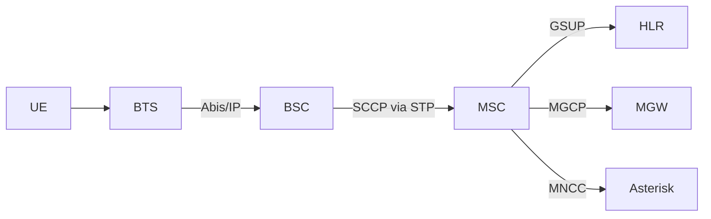
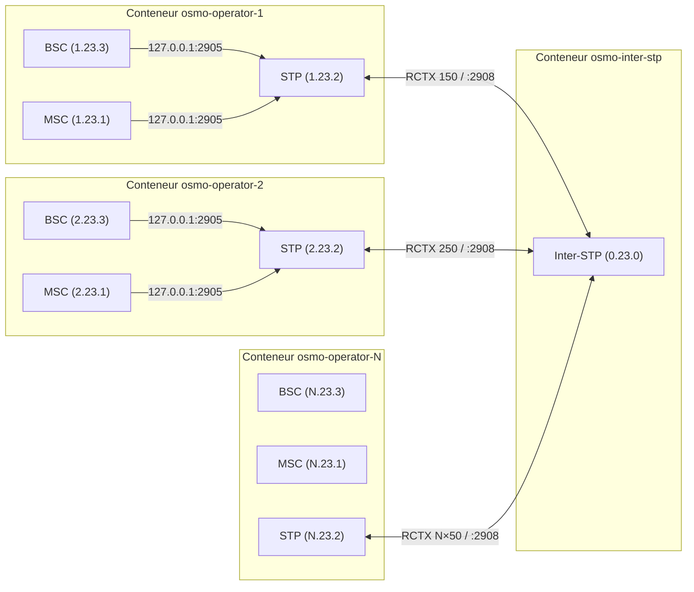
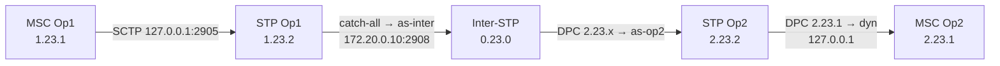
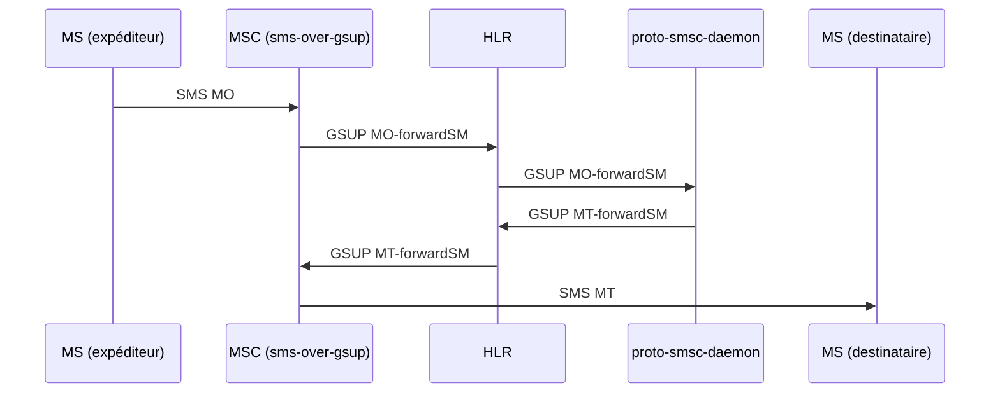
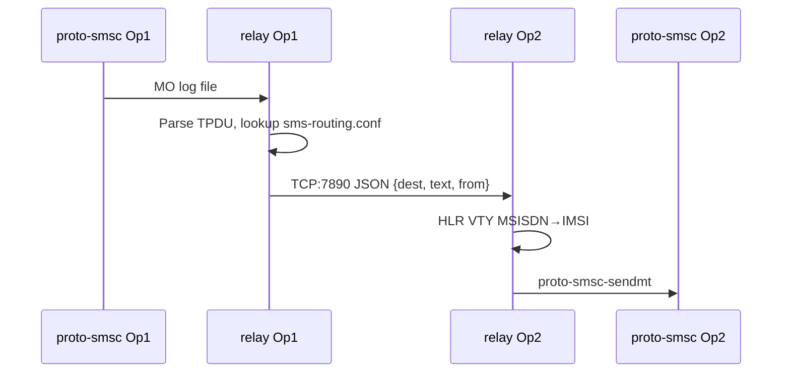
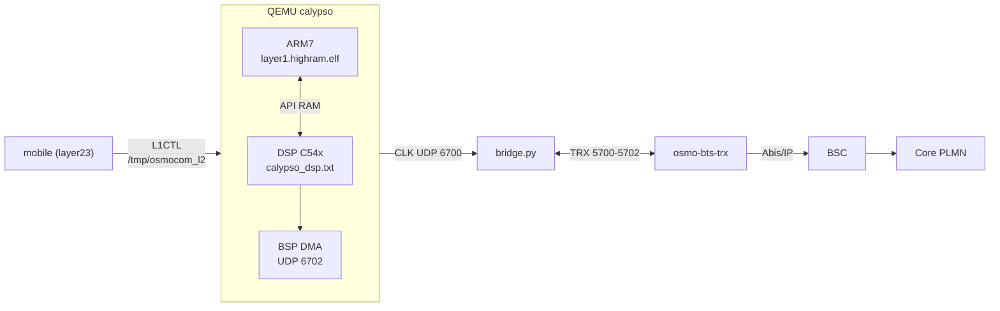

## `pont/README.md` {#f-pont-readme-md}

::: {.file-meta}
[.md]{.tag} 507 lignes - 23KB
:::

````{.markdown .numberLines filename="pont/README.md"}
# Chiffrement A5, Kc et SACCH — ce qui a été mesuré, et pourquoi c'est écrit ainsi

Ce document est un **compte rendu de mesure**, pas une présentation. Il existe
parce que chacune des pannes ci-dessous s'est présentée comme « le pont a des
CRC » — un compteur global qui ne distingue rien — et qu'il a fallu à chaque
fois remonter d'un symptôme identique à des causes sans rapport entre elles.

Tout ce qui est chiffré ici vient des journaux du banc. Les hypothèses écartées
sont conservées : elles étaient plausibles, et les réécarter coûte moins cher que
les redécouvrir.

---

## 1. Le Kc — trois écrivains, aucun arbitrage

### Le symptôme

`/dev/shm/calypso_kc` à 32 zéros. `A5=non` sur la totalité du canal dédié.
`SOUS-VOIE ACTIVE : clair 50/277  chiffre 0/96` — **zéro** bloc chiffré décodé
sur 96. Tout ce qui suit le CIPHERING MODE COMMAND rate le CRC, SDCCH puis TCH
(qui conserve le chiffrement après l'ASSIGNMENT COMMAND). D'où des CRC qui
n'apparaissent qu'au deuxième appel : le premier passe en clair, le second
trouve un réseau qui chiffre.

### La cause

Trois producteurs écrivaient le même fichier, sans le moindre arbitrage :

| # | écrivain | état |
|---|---|---|
| 1 | `osmocon` | hors dépôt, **efface** le fichier sur `DM_EST_REQ` |
| 2 | `l1ctl_sock.c` (QEMU) | chemin mort — le socket l1ctl est orphelin, le mobile parle à osmocon |
| 3 | `calypso_dsp_shunt.c` | **n'existait pas** |

Le troisième est le point clé. `pont.py` documentait `shunt_publish_kc` depuis le
27/08 et avait mis `PONT_KC_RETENTION=0` *sur la foi de son existence*. Or
`grep shunt_publish_kc` ne rendait rien dans tout `qosmo-grgsm`. On avait donc
coupé le dernier filet en se fiant à un producteur imaginaire.

Le dernier qui écrit gagne — et c'est l'effaceur.

### Pourquoi osmocon effaçait

osmocon est le multiplexeur série entre le mobile et le firmware. Il
**espionnait** `L1CTL_CRYPTO_REQ` au passage et en profitait pour publier la clé.
C'était la seule façon de la sortir à l'époque.

Mais un espion voit passer la clé, pas sa fin de vie : il doit la **deviner**. Il
la devinait sur `DM_EST_REQ` et `DM_REL_REQ`. L'intention est juste pour le
RELEASE, **fausse pour l'ESTABLISH** : le mobile émet aussi un `DM_EST_REQ` pour
ouvrir un lien *supplémentaire* sur un canal **déjà chiffré** (le SAPI 3 du SMS,
un ré-établissement LAPDm). La clé disparaissait en pleine session.

### Le correctif

Un format commun ne règle pas une course — c'était l'erreur de la première passe.
Il faut séparer les **autorités** :

* **La source autoritaire a son propre fichier.** `calypso_dsp_shunt.c` publie
  `/dev/shm/calypso_kc_l1` depuis `d_a5mode` et `a_kc[4]` du NDB, c'est-à-dire ce
  que le **firmware** a réellement chargé dans le DSP
  (`calypso/dsp.c:dsp_load_ciph_param`). Aucun autre écrivain ne connaît ce
  chemin. La course disparaît au lieu d'être arbitrée.
* **Le patch osmocon est retiré** du `Dockerfile`, désappliqué, et osmocon
  reconstruit. Il n'écrit plus rien. Le patch reste dans `patches/` à titre
  documentaire.
* `pont.py` lit `calypso_kc_l1` en priorité et ne retombe sur l'historique que
  s'il est absent — **jamais un mélange des deux**, sous peine de réintroduire la
  course.

### Les offsets NDB ne se devinent pas

`d_a5mode` et `a_kc` sont résolus **du DWARF du firmware vivant**, via
`tools/ndb-offsets.py`, comme les six autres champs. Valeurs au 2026-08-30 :
`d_a5mode=0x1ce`, `a_kc=0x2ce`.

C'est ici que le repli par `#define` est le plus dangereux : un offset faux ne
produit pas d'erreur, il produit une **clé fausse**. `osmo_a5` accepte n'importe
quels 8 octets et rend un keystream. Le trafic se « déchiffre » alors en bruit,
et le CRC accuse la radio.

Même piège sur l'ordre des octets : le firmware range la clé **à l'envers, et par
mots** — `a_kc[0] = key[7] | key[6]<<8` … `a_kc[3] = key[1] | key[0]<<8`. Il faut
défaire les **deux** inversions.

### Preuve de fonctionnement

```
KC : couche 1 EN CLAIR (d_a5mode=0, seq=1)
KC : A5/1 actif, Kc=29365ddd5623c400 (NDB d_a5mode@0x1ce a_kc@0x2ce, seq=2)
KC : couche 1 EN CLAIR (d_a5mode=0, seq=3)
KC : A5/1 actif, Kc=29365ddd5623c400 (seq=4)   …
```

Côté pont : `clair 21/21`, `chiffre 62/69`.

---

## 2. La rétention du Kc — trois marqueurs faux, puis le bon critère

Quatre tentatives, dont **trois miennes ou héritées, et fausses**. Elles sont
listées parce que chacune paraît raisonnable jusqu'à la mesure qui la tue.

| marqueur de relâchement | pourquoi c'est faux |
|---|---|
| `seq` de `calypso_dcch_cfg` | ne bouge pas du LU à l'appel (`chan_nr` reste 0x41) → clé retenue **indéfiniment**, A5 appliqué à un canal qui démarre en clair → UA brouillée, T200 ×6, appel mort |
| SABM montante | une SABM ne veut **pas** dire « on repart en clair » : un ré-établissement LAPDm sur canal chiffré en est une, le SAPI 3 du SMS aussi. Mesuré : 11 lâchers en pleine session |
| `algo=0` d'un producteur autoritaire | `d_a5mode` décrit **notre** L1, pas le **réseau**. Le firmware appelle `dsp_load_ciph_param(0, NULL)` à chaque resynchronisation (`sync.c:419`), donc **pendant** la bascule SDCCH→TCH. Lâcher là, c'est cesser de déchiffrer l'ASSIGNMENT COMMAND elle-même |

Le troisième est instructif : il a produit, en une ligne de journal chacun, la
cause **et** l'effet.

```
Kc LACHE (la couche 1 declare le clair (seq=7))
TCH arme TN=2 depuis 5 s SANS ASSIGNMENT COMPLETE : le mobile n'a pas bascule
```

Le DSP étant shunté, **c'est le pont qui déchiffre pour le firmware**. Le mobile
ne recevait donc jamais l'ordre de basculer.

### La règle retenue

> La fin de vie d'une clé est un **événement réseau**, pas un état local.

Les trois marqueurs conservés le sont tous : `IMMEDIATE ASSIGNMENT` (seul octroi
d'un canal **neuf**, qui démarre toujours en clair), `CHANNEL RELEASE` sur SDCCH,
`CHANNEL RELEASE` sur FACCH. La rétention (`PONT_KC_RETENTION`, défaut `1`) ne
compense plus l'effaceur d'osmocon — il n'existe plus — mais la fenêtre pendant
laquelle notre L1 est en clair alors que le réseau chiffre encore.

---

## 3. `unsupported SAPI` — deux diagnostics faux, un vrai défaut trouvé en chemin

### Le symptôme

Côté mobile, en boucle :

```
DLLAPD lapdm.c Received frame for unsupported SAPI 6!
DRR    gsm48_rr.c:4390 Radio link is released
DMNCC  mnccms.c:714    Call has been released (cause 16)
```

SAPI 6 n'existe pas en LAPDm (0 = signalisation, 3 = SMS).

### Une fausse piste, gardée parce qu'elle était convaincante

Première explication : l'en-tête L1 du SACCH (2 octets) ne serait pas retiré, et
LAPDm lirait l'octet de **puissance ordonnée** comme octet d'adresse. Le
comptage collait parfaitement — 33 SAPI invalides pour exactement 33 blocs SACCH
tentés (`TS1/32 : 30/33`), et les quatre valeurs observées se rangeaient dans les
paliers de puissance.

**C'était faux.** Le tampon réellement présenté commence par `07` :
`(0x07 >> 2) & 7` = **SAPI 1** — une valeur jamais observée. Une corrélation de
comptage n'est pas une preuve tant que l'arithmétique du mécanisme ne suit pas.

Vérifié au passage, et négatif aussi : la table `mf_sdcch8_0` du firmware est
conforme au 05.02 (`MF_F_SACCH` bien posé à `fn%102 ∈ [32,35]`), et
`prim_rx_nb.c:122` en tire correctement `link_id = 0x40`. **Aucun patch firmware
n'était nécessaire** — c'est précisément ce que la mesure a évité.

### Deuxième explication : le SI du camp — réfutée elle aussi

`lapdm_rx_ph_data_ind` calcule `sapi = (l2h[0] >> 2) & 7`. Les valeurs observées
correspondent à des premiers octets dans `0x08–0x1B`, soit la forme d'un **octet
de pseudo-longueur** de bloc BCCH — `(L << 2) | 1`, donc `SAPI = L & 7` :

| SI | L | 1er octet | `L & 7` | SAPI observé |
|---|---|---|---|---|
| SI1 / SI2 | 21 | `0x55` | 5 | 5 (×2) |
| SI3 | 18 | `0x49` | 2 | 2 (×2) |
| SI4 | 12 | `0x31` | 4 | 4 (×1) |
| — | 22 | `0x59` | 6 | 6 (×28) |

Ce ne sont pas des blocs SACCH : ce sont les **SI du camp**, injectés dans `a_cd`
pendant le canal dédié. Le rapport de forces, mesuré :

| écrivain de `a_cd` | occurrences |
|---|---|
| `DCCH-SACCH #` (présentation légitime) | **3** |
| `DISPATCH ALLC → SI3 a_cd[3..14]` | **29 483** |

`DCCH-GARDE` doit empêcher exactement cela. Elle s'armait bien, mais se levait
sur un **TTL de fraîcheur de blocs** (`dcch_guard_tick`, ~2 s) rafraîchi
uniquement par le **descendant** — donc par notre chance de décodage. Trois blocs
sur tout le run : entre deux, le TTL expirait, la garde concluait « canal fini »,
et le camp reprenait `a_cd`.

```
DCCH-GARDE : ARMEE  -- SI du camp supprime dans a_cd
DCCH-GARDE : levee (peremption) -- SI du camp retabli     ← ×4, canal bien vivant
```

C'est **la même erreur de raisonnement** qu'aux §1 et §2 : déduire un événement de
cycle de vie (« le canal est fini ») d'un symptôme local (« je n'ai rien décodé
depuis 2 s »). Sur un banc où le décodage est imparfait, les deux sont confondus
en permanence, et la garde se retourne contre le canal qu'elle protège.

### Le correctif — et ce qu'il a prouvé, ce qu'il n'a pas prouvé

La garde est rafraîchie par le **montant dédié** (`d_task_u` ∈ {12 DUL, 13 TCHT,
14 TCHA}) : le mobile qui émet sur son canal dédié prouve que ce canal existe,
indépendamment de notre décodage.

**Mesuré, et le correctif fait ce qu'il annonce** — sonde du site de présentation
(`CAMP: a_cd<-SI`), et non celle du point d'injection, qui continue d'imprimer en
amont de la garde :

| | avant | après |
|---|---|---|
| `CAMP: a_cd<-SI` pendant le dédié | flot continu | **0** |
| `levee (peremption)` | ×4 | **0** |

**Mais les SAPI invalides ont AUGMENTÉ : 33 → 52.** Le SI du camp n'était donc
pas leur source. La cause reste **inconnue** — c'est le deuxième diagnostic faux
sur ce même symptôme, après celui des paliers de puissance. Le correctif de la
garde est conservé parce qu'il corrige un défaut réel et démontré ; il ne corrige
simplement pas celui-là.

### Entretenir n'est pas armer

La première version **armait** la garde depuis le montant. `task_u` vaut 12/13/14
bien au-delà du canal dédié (621 / 1954 / 81 sur le run) : la garde s'est armée à
6 % du journal et n'a **jamais** été levée — `CAMP: a_cd<-SI` = 0 sur les 94 %
restants, et 27 lignes de sélection de cellule côté mobile. C'est trait pour trait
la famine de SI que ce TTL existait pour éviter (commentaire du 2026-08-12), et
qu'on réintroduisait en croyant la contourner.

Corrigé : l'**armement** reste au descendant (`set_dcch_active`), seul signal lié
à un bloc dédié réel ; le montant ne fait que **repousser la péremption** d'une
garde déjà armée. Le TTL reste court (~2 s) — c'est lui qui rend le camp au mobile
dès la fin du canal, et l'allonger l'affame. Le montant couvre les trous *pendant*
le canal ; le TTL tranche *après*.

## 3bis. Identité n'est pas instance — un vrai défaut, mais pas LA cause

### La mesure

Un LU suivi de **deux appels**, tous trois sur SDCCH/8 SS0 :

```
DCCH #1 : chan_nr=0x41 -> SDCCH/8 SS=0 TN=1 (vu sur DATA_IND)     ← et c'est tout
/dev/shm/calypso_dcch_cfg : seq=1
```

**Trois canaux dédiés successifs, un seul appris.**

### La cause

```c
/* l1ctl_sock.c */
if (kind >= 0 && chan_nr != last_chan_nr) {
    dcch_seq++;
    ... écrit /dev/shm/calypso_dcch_cfg ...
    calypso_dsp_shunt_set_dcch(kind, ss);
}
```

La mise à jour ne se déclenche que si `chan_nr` **change**. Or le BSC réalloue
volontiers la même sous-voie : un second appel qui retombe sur SDCCH/8 SS0
présente le même `chan_nr = 0x41`. Rien ne se passe — ni nouveau `dcch_seq`, ni
`set_dcch()`. Le shunt reste configuré sur l'**instance précédente** : fenêtre de
présentation `a_cd` périmée pour le canal courant.

`chan_nr` **est** l'identité du canal ; il ne porte aucun numéro d'instance. On ne
peut donc pas comparer plus finement — il faut **oublier** l'identité quand le
canal se termine.

### Le correctif

`calypso_l1ctl_dcch_forget()` remet `last_chan_nr` à `0xFF`. Elle est appelée par
la garde `DCCH` au moment où celle-ci conclut à la fin du canal — et la mesure
montre que la garde, elle, cycle correctement (**4** paires `ARMEE`/`levee` sur ce
run). C'est donc elle qui sait, et c'est d'elle qu'on prévient.

La prochaine établissement redéclenche alors, même à `chan_nr` égal.

### Confirmation par le réseau, et par la mesure d'après

Le BSC voit la même chose par l'autre bout — il réutilise tout, jusqu'à l'objet :

```
lchan(0-0-2-TCH_F-0)[0x5e7e3da21f50]   ×7    (jamais TS3..TS7, sur six TCH/F)
lchan(0-0-1-SDCCH8-0)[0x5e7e3da21e20]  ×4    (jamais SS1..SS7, sur huit)
lchan(0-0-1-SDCCH8-0){ESTABLISHED}: ERROR INDICATION
    cause=SABM frame with information not allowed in this state   ×4
```

Le mobile réémet un SABM sur un lien que le BSC tient pour établi : il n'a jamais
vu l'UA. Puis `EQUIPMENT FAILURE: Timeout` et `rll_ready=no`.

**La réutilisation n'est pas le défaut, c'est le révélateur.** Rien dans le GSM ne
l'interdit, et l'allocateur reprend naturellement le premier canal libre : avec un
seul mobile, c'est toujours le même. Un réseau réel ferait pareil — donc ce défaut
frapperait *tous* les deuxièmes appels, partout. Ce n'est pas un artefact de banc.

Après correctif :

```
DCCH #1 : chan_nr=0x41 -> SDCCH/8 SS=0 TN=1
DCCH #2 : chan_nr=0x41 -> SDCCH/8 SS=0 TN=1     ← MEME chan_nr, et pourtant appris
dcch_cfg : seq=2      identite oubliee : x1      DCCH-GARDE : ARMEE x2, levee x1
```

### Le motif, pour la quatrième fois

Déduire un **événement** (« canal neuf ») d'une **comparaison d'état**
(« `chan_nr` a changé ») au lieu de l'événement lui-même. Exactement comme :
osmocon devinant la fin de vie du Kc sur `DM_EST_REQ` (§1), les trois marqueurs
de relâchement (§2), et la garde concluant « canal fini » sur un TTL de fraîcheur
de décodage (§3). Quand ce dépôt se trompe, c'est presque toujours de cette
façon-là.

---

## 3ter. Le DISC de l'appel précédent rejoué sur le canal suivant — LA cause

C'est le défaut qui produisait les échecs d'assignation intermittents. Trouvé par
un fan-out de 29 agents avec réfutation adversariale, après que quatre
hypothèses posées à la main se soient révélées fausses.

### Le mécanisme

`/dev/shm/calypso_tch_facch_ul` est un slot **unique**, dont le `seq` est de
portée-processus côté shunt : il n'a aucune notion d'époque de canal dédié.

1. Un appel se termine **normalement** → `tch_desarme()` met `_tch_tn = None`.
2. `ul_facch_from_sideband` part alors en `continue` sans jamais lire
   (`pont.py:941-942`) — et son curseur `last`, **local au thread**, gèle.
3. Le mobile émet ensuite son **DISC** LAPDm de libération. Le shunt le publie
   dans le slot avec un `seq` neuf. Le bloc y reste, avec `seq > last`.
4. À l'ASSIGNMENT COMMAND suivant, le thread se réveille, voit `seq != last`, et
   traite ce vieux DISC comme un montant frais : il pose `_tch_mobile_ok`
   **avant toute bascule réelle**, et l'ordonnanceur l'émet sur la FACCH du TCH
   tout neuf.
5. La LAPDm de la BTS, en `LAPD_STATE_IDLE` sur ce lchan fraîchement activé,
   répond **DM**.
6. Le mobile, qui vient d'envoyer son vrai SABM, reçoit ce DM en `SABM_SENT` →
   `ASSIGNMENT FAILURE`. Le BSC n'a jamais son ASSIGNMENT COMPLETE → `T10` →
   `EQUIPMENT FAILURE: Timeout`.

### La mesure qui l'établit

Capture GSMTAP, premier bloc FACCH montant réellement **émis par le pont** après
chaque ASSIGNMENT COMMAND — corrélation **6/6**, aux octets :

```
01 3f (SABM) -> 01 73 (UA)    => appel OK
01 53 (DISC) -> 01 1f (DM)    => appel ECHOUE
```

Et l'arithmétique de propagation exclut « le DM répondait au SABM » :
DISC fn 26340 → DM fn 26367 (Δ=27) ; SABM fn 26353 → UA fn 26380 (Δ=27). **Même
delta** — le DM répond au bloc émis 13 trames *avant* le SABM.

### Pourquoi c'était intermittent — et pas « le 2ᵉ appel »

Rien de positionnel : ce qui compte est le **mode de sortie de l'appel
précédent**.

| sortie précédente | effet | appel suivant |
|---|---|---|
| normale → `tch_desarme` (`_tch_tn = None`) | le thread cesse de lire, le DISC empoisonne le slot | **échoue** |
| en échec → `tch_suspend` (**conserve** `_tch_tn`) | le thread continue de vider la bande latérale | **réussit** |
| premier appel | slot à `seq=0`, la garde `if seq and ...` saute | réussit |

D'où des séries `ÉCHEC/OK/ÉCHEC` ou `OK/ÉCHEC/OK` selon l'amorce. Toute la
formulation « le 2ᵉ appel échoue », qui a orienté des heures d'enquête, était un
artefact d'échantillon.

### Le correctif

À chaque **nouvelle époque de canal**, resynchroniser `last` sur le `seq` courant
**sans consommer** le bloc : ce qui date d'avant l'armement n'appartient pas à ce
canal. C'est exactement l'idiome que ce fichier applique déjà à l'anneau voix
montant (`session precedente : on ignore`) et qui n'avait pas été porté sur ce
sideband-ci.

L'époque est suivie par `_tn_epoque`, remis à `None` au désarmement — car le BSC
réalloue toujours TS2, donc comparer les TN ne suffit pas : **identité n'est pas
instance**, encore (cf. §3bis).

### Validation

`scripts/banc-repro.sh --calls 4`, pile redémarrée :

| | avant | après |
|---|---|---|
| appels | ÉCHEC / OK / ÉCHEC | **OK / OK / OK / OK** |
| `Assignment failed` (BSC) | 20 | **0** |
| `unsupported SAPI` | 14 | 4 |

---

## 4. Le remplissage de C0 compté comme échec

`osmo-bts` remplit **tous** les timeslots de C0 avec le dummy burst
(`scheduler_trx.c`) pour tenir la puissance de la balise. Un canal dédié inactif
reçoit donc du remplissage en continu.

Le filtre `_is_dummy()` existait pour le xcch — avec sa mesure : *515 blocs de
remplissage comptés en `crc_fail`, 76 % d'échec annoncés sur une radio saine*.
**Le chemin TCH ne l'avait jamais eu** : `dl_dispatch` fait `return` sur la
branche TCH avant d'atteindre le filtre.

Le traçage `PONT_TCH_TRACE=1` a montré la même cause sous **deux signatures**,
selon que le Kc était disponible ou non :

| phase | entrée du Viterbi | `ne` |
|---|---|---|
| pas de Kc | dummy brut, motif **figé** | `0`, constant |
| Kc arrivé | dummy **chiffré**, clé variant par trame | ~50 |

`ne=0` avec `rc=-1` ne s'obtient pas sur du bruit : c'est la signature d'une
entrée constante. Le filtre est posé **avant** l'`a5_apply`, pour la même raison
que côté xcch — le dummy n'est jamais chiffré, et le passer au keystream le
rendrait méconnaissable.

---

## 5. `CALYPSO_CANNED=1` ne cannait rien

`shunt_parse_canned()` attend une **liste de jetons** :
`FBDET,TOA,PM,SNR,ANGLE,CRC | FULL | ALL | NONE`.

`start-direct.sh` posait `CALYPSO_CANNED=1` depuis toujours. `1` n'est aucun de
ces jetons : il tombait dans le `else`, sortait un `token inconnu '1' ignore`
noyé dans le démarrage, et le masque restait **vide** :

```
CALYPSO_CANNED (dette fabriquée EXPLICITE) : FBDET=0 TOA=0 PM=0 SNR=0 ANGLE=0 CRC=0
```

Le banc tournait avec **rien de canné** pendant que sa configuration affichait
l'inverse.

Corrigé des deux côtés — et les deux comptent : `start-direct.sh` pose désormais
`FULL`, **et** le parseur accepte `1/ON/YES/TRUE` et `0/OFF/NO/FALSE`. Une
variable booléenne qui veut dire « rien » au lieu de « tout » est un piège ;
changer la valeur sans changer le parseur l'aurait laissé armé.

---

## 6. Hypothèses écartées

Conservées pour ne pas être réexplorées.

| hypothèse | verdict |
|---|---|
| Plan SDCCH/8 mal implémenté | **non** — `PLAN_SD8` est conforme au 05.02 : blocs à `4·ss`, SACCH/C8 à 32/36/40/44 avec report `+51` pour SS4..7, UL à `+15` |
| Trame idle (`m26=25`) empoisonnant la fenêtre TCH | **non** — `tch_dl_burst` écarte `m26 in (12, 25)`, et `gap=0` sur tout le run |
| Alias SACCH 32/83 en `fn%51` | **non** — filtré sur la 102-multitrame : `(k[1] % 102) != plan.sacch_dl102[_act]` |
| TCH resté armé après l'appel | **non** — compteurs figés sur cinq intervalles après `DESARME` |
| `_TBL_SOFT` écrasant deux encodages | **non pour ce symptôme** — le DL TRXD arrive en bits durs `0x00/0x01`. La fragilité reste réelle (une table, deux encodages : `0x01` et `0xFF` donnent tous deux `-127`) mais n'est pas la cause |

---

## 7. Reste ouvert

* **`unsupported SAPI` côté mobile** — tombés de 64 à 4, mais pas à zéro.
  Source résiduelle inconnue. Ne bloque plus les appels (§3ter : 0 échec
  d'assignation sur 4 appels). Ni l'en-tête
  L1 du SACCH (§3, réfuté), ni le SI du camp (§3, réfuté par la mesure). Source
  toujours inconnue : chercher qui d'autre atteint `a_cd`, ou si le firmware
  relit un bloc périmé faute de rafraîchissement (`B_BLUD`).
* **CRC résiduels** — `chiffre 62/69`, soit 7 échecs sur le SDCCH chiffré, plus
  3 sur le SACCH. Non isolés.
* **TCH** — l'histogramme rend `octets[00:928]` : les 928 octets de la fenêtre
  sont à **zéro**. Ce ne sont ni des dummy bursts (motif non nul, désormais
  filtrés) ni du bruit : le timeslot ne porte rien. Vraisemblablement en aval du
  mobile qui ne bascule pas, donc à revoir **après** le correctif SACCH.

---

## Rejouer une experience

`scripts/banc-repro.sh` fige toute la sequence : demarrage detache
(`CALYPSO_NO_ATTACH=1`), attente du camp **interrogee** au VTY (`show ms` ->
`C3`) et non supposee par un `sleep`, N appels identiques, verdict par appel
calcule sur la seule tranche de `pont.log` de cet appel, collecte horodatee dans
`/root/repro-<stamp>/`.

```
scripts/banc-repro.sh --calls 4                 # avec redemarrage
scripts/banc-repro.sh --no-restart --calls 3    # sur la pile en cours
PONT_KC_RETENTION=0 scripts/banc-repro.sh       # A/B d'un reglage
```

C'est ce qui a permis de decouvrir que l'echec n'etait pas positionnel : trois
appels suffisent, et deux runs successifs donnent `ECHEC/OK/ECHEC` puis
`OK/ECHEC/OK`. Sans sequence figee, on compare des runs qui ne se comparent pas.

## Outils de diagnostic

| variable | effet |
|---|---|
| `PONT_TCH_TRACE=1` | une ligne par bloc TCH/F en échec : `fn/m26/idx/acc` (alignement), `A5` (déchiffrement et clé), `rc/ne/nb` (décodeur), et l'**histogramme des octets** de la fenêtre |
| `PONT_KC_RETENTION=0` | désactive la rétention, pour comparer |
| `PONT_A5=1..3` | force l'algorithme au lieu de suivre celui du Kc |
| `CALYPSO_CANNED=NONE` | rien de canné, tout réel |

Lecture des compteurs : `ne` est le nombre d'erreurs binaires, `nb` le nombre
**total** de bits (378 pour TCH/FS — constant, ce n'est pas un compteur
d'erreurs). `ne=0` avec `rc=-1` signale une entrée constante, pas une radio
saine.

````

## `README.md` {#f-readme-md}

::: {.file-meta}
[.md]{.tag} 587 lignes - 21KB
:::

````{.markdown .numberLines filename="README.md"}
# osmo-nitb-for-calypso — Architecture Multi-PLMN SS7/IP

Standalone mode (no interstp)
```bash
sudo docker pull bastienbaranoff/norf_gsm
sudo docker tag bastienbaranoff/norf_gsm osmocom-nitb
git clone https://github.com/bbaranoff/osmo-operator
cd osmo-operator
sudo ./start.sh
```
To go in container
```bash
sudo docker exec -ti osmo-operator-1 bash
``` 

then in docker container
```bash
cd /opt/GSM/osmo-operator
./start-direct.sh --regen
./start-direct.sh --stop
./start-direct.sh
```


Documentation d'architecture du projet **osmo-nitb-for-calypso** : simulation multi-opérateur GSM complète avec interconnexion SS7 sur IP, entièrement conteneurisée via Docker.

Ce projet réalise ce qui s'apparente à un « DHCP pour SS7 » — l'automatisation complète d'une configuration SS7 inter-opérateurs habituellement réalisée à la main, reproductible d'un simple `tools/make-docker-image.sh && start.sh`.

**Support N opérateurs** : le démarrage en mode bridge accepte de 1 à 9 opérateurs sans modifier aucune configuration. Tous les fichiers (pjsip, dialplan, SMS routing, inter-STP) sont générés dynamiquement selon N.

### Documents voisins

| document | sujet |
|---|---|
| [`pont/README.md`](pont/README.md) | **Chiffrement A5, Kc et SACCH** — compte rendu de mesure. À lire avant de chercher une panne radio dans un compteur de CRC : les causes documentées là (Kc écrasé, en-tête L1 du SACCH, remplissage de C0, `CALYPSO_CANNED` inopérant) se présentent **toutes** comme « le pont a des CRC ». |
| [`environment/README.md`](environment/README.md) | variables d'environnement et résolution des chemins |
| [`services/README.md`](services/README.md) | unités systemd livrées |
| [`navigation/QUICKSTART.md`](navigation/QUICKSTART.md) | prise en main |

---

## 1. Architecture d'un PLMN (Osmocom)

Chaque opérateur simulé repose sur la stack Osmocom standard, tous les composants dans un seul conteneur Docker.



Tous ces composants tournent dans le même conteneur et communiquent via `127.0.0.1`. Le STP local sert de hub de signalisation intra-PLMN.

---

## 2. Interconnexion Multi-PLMN

L'architecture centrale du projet. N opérateurs distincts, chacun avec son core network dans un conteneur dédié, reliés par un Inter-STP central qui route la signalisation M3UA/SCCP entre eux.



---

## 3. Topologie réseau Docker

### 3.1 Réseaux

| Réseau Docker | Plage | Rôle |
|---------------|-------|------|
| `gsm-inter` | `172.20.0.0/24` | Backbone interop (M3UA inter-STP) |
| `gsm-net-opN` | `172.20.N.0/24` | Réseau privé opérateur N (GSMTAP, GPRS) |

### 3.2 Adresses IP

| Composant | IP backbone (`gsm-inter`) | IP privée (`gsm-net-opN`) |
|-----------|--------------------------|--------------------------|
| Inter-STP | `172.20.0.10` | — |
| Conteneur OpN | `172.20.0.(10+N)` | `172.20.N.10` |

**Formule générale** : opérateur N → backbone `172.20.0.(10+N)`, privé `172.20.N.10`

### 3.3 Communication intra-conteneur

Tous les composants communiquent via `127.0.0.1` (fix de la race condition Docker) :

```
BSC ──(127.0.0.1:2905)──► STP local
MSC ──(127.0.0.1:2905)──► STP local
MSC ──(127.0.0.2:4222)──► HLR
MSC ──(127.0.0.1:2427)──► MGW
```

Le STP écoute sur `127.0.0.1:2905` immédiatement, sans dépendre de l'interface réseau Docker (attachée après démarrage du container via `docker network connect`).

### 3.4 Communication inter-conteneur

Uniquement le lien STP↔Inter-STP traverse le réseau Docker :

```
STP OpN (172.20.0.(10+N)) ──SCTP──► Inter-STP (172.20.0.10:2908)
```

---

## 4. Signalisation SS7

### 4.1 Point codes

Format ITU 14-bit (3.8.3 : `zone.network.node`)

| Nœud | Point Code | Formule |
|------|-----------|---------|
| Inter-STP | `0.23.0` | fixe |
| MSC OpN | `N.23.1` | zone=N |
| STP OpN | `N.23.2` | zone=N |
| BSC OpN | `N.23.3` | zone=N |

### 4.2 Routing Contexts (RCTX)

| RCTX | Formule | Usage |
|------|---------|-------|
| `N×100+10` | `rctx_msc` | MSC OpN → STP OpN |
| `N×100+20` | `rctx_stp` | STP OpN (registration) |
| `N×100+30` | `rctx_bsc` | BSC OpN → STP OpN |
| **`N×100+50`** | **`rctx_inter`** | **STP OpN → Inter-STP** |

Le RCTX inter (`N×100+50`) est le plus critique : il doit correspondre dans `osmo-stp.cfg` (STP opérateur) et être cohérent avec la connexion vers l'inter-STP.

### 4.3 Configuration inter-STP (générée)

L'inter-STP utilise des **AS sans routing-key** (catch-all par opérateur). Le routage se fait uniquement sur le DPC :

```
cs7 instance 0
 point-code 0.23.0
 listen m3ua 2908
  accept-asp-connections dynamic-permitted

 as as-opN m3ua
  traffic-mode override     ← PAS de routing-key

 route-table system
  update route N.23.1 7.255.7 linkset as-opN
  update route N.23.2 7.255.7 linkset as-opN
  update route N.23.3 7.255.7 linkset as-opN
```

### 4.4 Chemin complet d'un message SS7



---

## 5. Génération dynamique — N opérateurs

Toutes les configurations dépendant de N sont **générées au démarrage**. Aucun fichier template ne contient de valeur hardcodée pour un nombre spécifique d'opérateurs.

### 5.1 Template engine (placeholders)

`apply_config_templates()` dans `start.sh` résout en **1 seul passage `sed`** :

| Placeholder | Formule | Exemple N=2 |
|------------|---------|-------------|
| `__PC_MSC__` | `N.23.1` | `2.23.1` |
| `__PC_STP__` | `N.23.2` | `2.23.2` |
| `__PC_BSC__` | `N.23.3` | `2.23.3` |
| `__RCTX_MSC__` | `N×100+10` | `210` |
| `__RCTX_BSC__` | `N×100+30` | `230` |
| `__RCTX_INTER__` | `N×100+50` | `250` |
| `__ARFCN__` | `512+N×2` | `516` |
| `__INTER_LOCAL_IP__` | `172.20.0.(10+N)` | `172.20.0.12` |
| `__CONTAINER_IP__` | `172.20.N.10` | `172.20.2.10` |

### 5.2 Sections générées (dépendent de N total)

Après la substitution sed, `start.sh` **appende** à chaque opérateur :

| Section | Fichier | Contenu |
|---------|---------|---------|
| Trunks PJSIP | `pjsip.conf` | N-1 blocs `[interop_trunk_opX]` |
| Dialplan sortant | `extensions.conf` | Contexte `[interop_out]` avec N-1 extensions |
| Routage SMS | `sms-routing.conf` | Table complète pour N opérateurs |
| Config inter-STP | `osmo-stp-interop.cfg` | N AS + N×3 routes SS7 |

### 5.3 Séquence de démarrage

```
./start.sh  [bridge mode]
 ├── Saisie N opérateurs + MCC/MNC/nom par opérateur
 ├── Création réseau gsm-inter (172.20.0.0/24)
 ├── create_interop.sh N → osmo-stp-interop.cfg
 ├── Lancement osmo-inter-stp (doit écouter :2908 AVANT les opérateurs)
 └── Pour chaque opérateur N :
      ├── apply_config_templates (sed + génération sections dynamiques)
      ├── docker run sur gsm-inter @ 172.20.0.(10+N)
      ├── docker network connect gsm-net-opN @ 172.20.N.10
      └── Services via run.sh + tmux
```

L'ordre est critique : l'Inter-STP doit écouter avant que les STPs opérateurs tentent de s'y connecter.

---

## 6. SMS

### 6.1 SMS intra-opérateur



### 6.2 SMS inter-opérateur

`sms-interop-relay.py` surveille le log MO de `proto-smsc-daemon`, parse le TPDU GSM 03.40, consulte `sms-routing.conf` (longest-prefix match), et transfère via TCP port 7890 au relay de l'opérateur cible.



---

## 7. Voix

### 7.1 Intra-opérateur

```
MS → BTS → BSC → MSC → MNCC → Asterisk → MNCC → MSC → BSC → BTS → MS
                              ↕ MGCP
                            OsmoMGW (RTP)
```

### 7.2 Inter-opérateur

```
MS(OpX) → MSC(OpX) → MNCC → Asterisk(OpX)
              ─── SIP trunk 172.20.0.(10+X) ↔ 172.20.0.(10+Y) ───
                               Asterisk(OpY) → MNCC → MSC(OpY) → MS(OpY)
```

Le dialplan `[interop_out]` route automatiquement sur le premier chiffre du numéro composé (convention : chiffre N = opérateur N). Pour 3 opérateurs, Op1 a des trunks vers Op2 et Op3, etc.

---

## 8. Utilisation du lab

### 8.0 Installation native (sans Docker)

Le dépôt s'installe aussi directement sur une machine Ubuntu 22.04, sans conteneur :

```bash
sudo ./install.sh                  # toutes les étapes (deps, sources, build, binaires, configs, bureau)
./install.sh --list                # les étapes, sans rien faire
./install.sh --check               # ce qui est déjà en place
sudo ./install.sh --reinstall      # rejoue tout : sources mises à jour, configs et raccourcis réécrits
sudo ./install.sh --only bureau    # seulement les icônes et raccourcis du bureau
```

L'étape `bureau` pose les mêmes fichiers que l'ISO (`data/desktop/*.desktop`, `data/*.svg`) :
« Lancer le banc GSM » (`launch.sh`) et « multi-operator » (`start-multi.sh`), dans le menu
et sur le bureau de root et de l'utilisateur `sudo`. Le lancement natif reste `./start-direct.sh`,
qui délègue à `/opt/GSM/qosmo-grgsm/run.sh`.

Un paquet `.deb` par composant, pour installer sans git :

```bash
./packaging/build-debs.sh          # osmo-operator, pont, qemu-calypso, calypso-firmware -> packaging/dist/
sudo dpkg -i packaging/dist/*.deb  # refuse de s'installer par-dessus un clone git au même chemin
```

Les ISO construites par `build-iso.sh` embarquent ces paquets dans `/var/cache/osmo-debs`.

### 8.1 Démarrage et arrêt

```bash
sudo ./tools/make-docker-image.sh          # Build l'image Docker (1 fois)
sudo ./start.sh          # Lance tout (choisir bridge, saisir N opérateurs)
sudo ./start.sh stop     # Arrête tous les containers

sudo ./provision_hlr.sh  # Provisionne les abonnés de test dans les HLR
```

Trois modes PHY pour le côté MS, sélectionnés via `PHY_MODE` à l'intérieur du
container avant d'invoquer `run.sh` :

| `PHY_MODE` | Pile | Usage |
|------------|------|-------|
| `faketrx` (défaut) | `fake_trx` → `trxcon` → `mobile` | Multi-MS, rapide, pas de DSP |
| `virtphy` | `osmo-bts-virtual` ↔ `virtphy` ↔ `mobile` | Multi-MS via multicast UDP |
| `qemu` | `osmo-bts-trx` ↔ `bridge.py` ↔ QEMU Calypso ↔ `mobile` | Baseband émulé (ARM7+DSP), 1 MS |

Voir §11 pour le mode QEMU.

### 8.2 Accès aux containers

```bash
# Opérateur N — tmux avec STP/MSC/HLR/BSC/BTS/SMSC
sudo docker exec -ti osmo-operator-1 tmux attach
sudo docker exec -ti osmo-operator-2 tmux attach
sudo docker exec -ti osmo-operator-N tmux attach

# Inter-STP
sudo docker exec -ti osmo-inter-stp tmux attach -t stp
```

### 8.3 Navigation tmux

| Raccourci | Fenêtre |
|-----------|---------|
| `Ctrl-b 0` | faketrx |
| `Ctrl-b 1` | MS1 (trxcon + mobile) |
| `Ctrl-b 2` | Asterisk |
| `Ctrl-b 3` | SMSC (proto-smsc-daemon + relay) |
| `Ctrl-b w` | Liste toutes les fenêtres |
| `Ctrl-b d` | Détacher |

### 8.4 Interfaces VTY (telnet depuis le container)

| Port | Composant |
|------|-----------|
| `4239` | OsmoSTP |
| `4242` | OsmoBSC |
| `4243` | OsmoMGW |
| `4254` | OsmoMSC |
| `4258` | OsmoHLR |

### 8.5 Commandes VTY essentielles

```
# Sur STP (4239) — diagnostic SS7
OsmoSTP> show cs7 instance 0 asp          # État ASP (ACTIVE/DOWN)
OsmoSTP> show cs7 instance 0 as all       # État AS
OsmoSTP> show cs7 instance 0 route        # Table de routage — PROHIB ?

# Sortie saine STP OpN :
# N.23.1/14   as-dyn-…  avail  avail  dyn   ← MSC (dynamique)
# N.23.3/14   as-dyn-…  avail  avail  dyn   ← BSC (dynamique)
# 0.0.0/0     as-inter  avail  avail        ← catch-all inter-STP

# Sur MSC (4254)
OsmoMSC# subscriber msisdn 10001 sms sender msisdn 10002 send Bonjour
OsmoMSC# show subscriber all

# Sur HLR (4258)
OsmoHLR# subscriber imsi 001010000000001 show
OsmoHLR# show gsup-clients
```

### 8.6 Wireshark

Lancé automatiquement sur le bridge Docker avec filtre `sctp or udp port 4729`.

```
m3ua                      # Trafic M3UA uniquement
sccp                      # Messages SCCP
gsm_map                   # Messages MAP
gsmtap                    # Trafic radio (Um)
sctp.srcport == 2908      # Trafic vers/depuis l'inter-STP
```

---

## 9. Diagnostic — Résoudre les PROHIB

```bash
# 1. L'inter-STP tourne-t-il ?
sudo docker ps | grep inter-stp

# 2. L'ASP vers l'inter-STP est-il ACTIVE ?
sudo docker exec osmo-operator-1 sh -c \
  'echo "show cs7 instance 0 asp" | telnet 127.0.0.1 4239 2>/dev/null'

# 3. L'inter-STP voit-il les opérateurs ?
sudo docker exec osmo-inter-stp sh -c \
  'echo "show cs7 instance 0 asp" | telnet 127.0.0.1 4239 2>/dev/null'

# 4. Les routes locales (BSC/MSC) existent-elles ?
sudo docker exec osmo-operator-1 sh -c \
  'echo "show cs7 instance 0 route" | telnet 127.0.0.1 4239 2>/dev/null'

# 5. Connectivité backbone
sudo docker exec osmo-operator-1 ping -c1 172.20.0.10

# 6. Race condition → redémarrer l'opérateur
sudo docker restart osmo-operator-1
```

| Symptôme | Cause probable | Fix |
|----------|---------------|-----|
| Route 0.0.0/0 PROHIB | Inter-STP pas démarré ou IP incorrecte | Vérifier `INTER_STP_IP` et backbone IP |
| Pas de routes dynamiques | MSC/BSC ne se connectent pas au STP | Vérifier que les ASP pointent sur `127.0.0.1` |
| ASP DOWN sur inter-STP | Race condition Docker | `docker restart` de l'opérateur |

---

## 10. Plan de numérotation

Convention par défaut (modifiable) :

| Numéro | Usage |
|--------|-------|
| `N0001`…`N9999` | Abonnés GSM opérateur N |
| `100` | Linphone A (softphone local) |
| `200` | Linphone B (softphone local) |
| `600` | Echo test |
| `9XXXXX` | Sortie inter-op depuis softphone (9 + numéro complet) |

Le premier chiffre d'un numéro NXXXX identifie l'opérateur. Le dialplan `[gsm_in]` détecte automatiquement si la destination est locale ou inter-op.

---

## 11. RAN virtuel QEMU (PHY_MODE=qemu)

Le projet intègre [bbaranoff/qosmo-grgsm](https://github.com/bbaranoff/qosmo-grgsm) — un fork
de QEMU avec une machine `calypso` qui émule le SoC GSM TI Calypso (ARM7TDMI +
DSP TMS320C54x). Cela permet d'exécuter le **vrai firmware** OsmocomBB
`layer1.highram.elf` au-dessus d'un baseband virtualisé, sans aucun hardware.

### 11.1 Architecture



- **ARM7** exécute le firmware osmocom-bb compilé dans le conteneur.
- **DSP C54x** charge le ROM Calypso réel (`calypso_dsp.txt`, dumpé d'un téléphone).
- **`bridge.py`** (Python) relaie les bursts entre `osmo-bts-trx` (UDP 5700-5702)
  et la BSP du DSP (UDP 6702). QEMU est maître d'horloge TDMA et envoie des
  ticks sur UDP 6700 ; bridge synthétise des `IND CLOCK` à cadence wall-clock
  pour le BTS, en piochant le FN de QEMU.
- **`mobile`** se connecte au socket L1CTL `/tmp/osmocom_l2` publié par QEMU
  via la PTY série du firmware (sercomm DLCI 5).

### 11.2 Composants ajoutés au conteneur

| Composant | Path container | Source |
|-----------|---------------|--------|
| `qemu-system-arm` (machine `calypso`) | `/usr/local/bin/qemu-system-arm` | bbaranoff/qosmo-grgsm |
| Firmware Calypso layer1 | `${GSM_ROOT}/firmware/board/compal_e88/layer1.highram.elf` | osmocom-bb (build container) |
| ROM DSP | `${GSM_ROOT}/calypso_dsp.txt` | bbaranoff/qosmo-grgsm (symlink) |
| Bridge BTS↔BSP | `${OQC_ROOT}/bridge.py` | bbaranoff/qosmo-grgsm |
| `transceiver` (BTS soft-SDR Calypso) | `/usr/local/bin/transceiver` | osmocom-bb branche jolly/testing |
| `ccch_scan`, `bcch_scan`, `cell_log` | `/usr/local/bin/` | osmocom-bb branche fixeria/burst_ind |

Le Dockerfile installe le toolchain ARM (`gcc-arm-none-eabi`) avant la build
osmocom-bb pour produire le `.elf`. La build complète prend ~15-20 min selon
la machine.

### 11.3 Lancement

```bash
sudo ./tools/make-docker-image.sh
sudo ./start.sh        # mode opérateur unique (single)
docker exec -ti osmo-operator-1 bash
# dans le container :
PHY_MODE=qemu /root/run.sh
```

`run.sh` orchestre la séquence : `osmo-bts-trx` → QEMU (PTY+monitor) →
attente du socket `/tmp/osmocom_l2` → `bridge.py` → attente des ticks QEMU
sur UDP 6700 → `mobile`. Tout est lancé dans des fenêtres tmux distinctes.

| Variable | Défaut | Rôle |
|----------|--------|------|
| `QEMU_BIN` | `${GSM_ROOT}/qemu/build/qemu-system-arm` | Binaire QEMU |
| `QEMU_FW` | `${GSM_ROOT}/firmware/board/compal_e88/layer1.highram.elf` | Firmware ARM |
| `QEMU_DSP_ROM` | `${GSM_ROOT}/calypso_dsp.txt` | ROM DSP C54x |
| `QEMU_BRIDGE` | `${OQC_ROOT}/bridge.py` | Script bridge BTS↔BSP |
| `QEMU_L1CTL_SOCK` | `/tmp/osmocom_l2` | Socket L1CTL publié par QEMU |
| `QEMU_MON_SOCK` | `/tmp/qemu-calypso-mon.sock` | Monitor QEMU (HMP) |

`PHY_MODE=qemu` force `N_MS=1` : le bridge utilise des ports UDP fixes (un seul
Calypso émulé par conteneur). Pour faire tourner plusieurs MS virtuels, lancer
plusieurs conteneurs (un par opérateur, chacun avec son bridge).

### 11.4 Diagnostic

```bash
# tmux : fenêtres qemu / bridge / bts / ue_g1
docker exec -ti osmo-operator-1 tmux -S /tmp/osmocom_tmux attach -t osmocom

# Monitor QEMU (HMP)
docker exec -ti osmo-operator-1 socat - unix-connect:/tmp/qemu-calypso-mon.sock

# Logs
/var/log/osmocom/qemu.log     # Émulation ARM/DSP, BSP, MVPD, IRQ
/var/log/osmocom/bridge.log   # Ticks QEMU, IND CLOCK, DL/UL bursts
/var/log/osmocom/run.sh.log   # Orchestration
```

| Symptôme | Cause probable | Diagnostic |
|----------|---------------|------------|
| `bridge: timeout — vérifier que QEMU émet sur UDP 6700` | QEMU n'a pas démarré le TPU/DSP | `grep TINT0 /var/log/osmocom/qemu.log` |
| Mobile `FBSB result=255` (no cell) | DSP ne détecte pas le FB — voir `qemu/SESSION_STATUS.md` (bug IMR=0x0000 connu) | `grep "IMR change" /var/log/osmocom/qemu.log \| wc -l` |
| `osmo-bts-trx: PC clock skew too high` | bridge cesse d'envoyer `IND CLOCK` | redémarrer bridge.py |
| Socket `/tmp/osmocom_l2` jamais créé | Firmware ne boote pas | `head -50 /var/log/osmocom/qemu.log` (chercher MVPD/PROM0) |

L'intégration QEMU est en développement actif côté DSP (voir
`bbaranoff/qosmo-grgsm/CLAUDE.md` pour le statut courant des bugs C54x).

---

## 12. Autres extensions

**srsRAN (LTE)** — coexistence 2G/4G avec eNodeB virtuel, HLR/HSS partagé.

**VoWiFi / IMS** — passerelle SIP via Asterisk pour l'accès WiFi, pont vers le core GSM.

**Monitoring** — Prometheus/Grafana pour métriques M3UA, dashboards MAP, visualisation SCCP.

---

*Projet osmo-nitb-for-calypso — plateforme pédagogique télécom multi-PLMN, entièrement conteneurisée, support N opérateurs.*

````

## `services/README.md` {#f-services-readme-md}

::: {.file-meta}
[.md]{.tag} 20 lignes - 687B
:::

````{.markdown .numberLines filename="services/README.md"}
# `services/` — unités systemd

Les unités du projet, rassemblées ici plutôt que dispersées entre la racine et
`scripts/`. Elles sont installées par le `Dockerfile` (image) et par `build-iso.sh`
(support bootable) ; l'installation native ne les active pas.

| Unité | Rôle |
|---|---|
| `osmo-bts-trx.service` | station de base, transceiver TRX |
| `osmo-egprs-web.service` | console web d'exploitation |

Les unités sous `contrib/systemd/` appartiennent à QEMU en amont et ne relèvent
pas de ce dossier.

Installer à la main :

```bash
sudo cp services/osmo-bts-trx.service /etc/systemd/system/
sudo systemctl daemon-reload && sudo systemctl enable --now osmo-bts-trx
```

````
