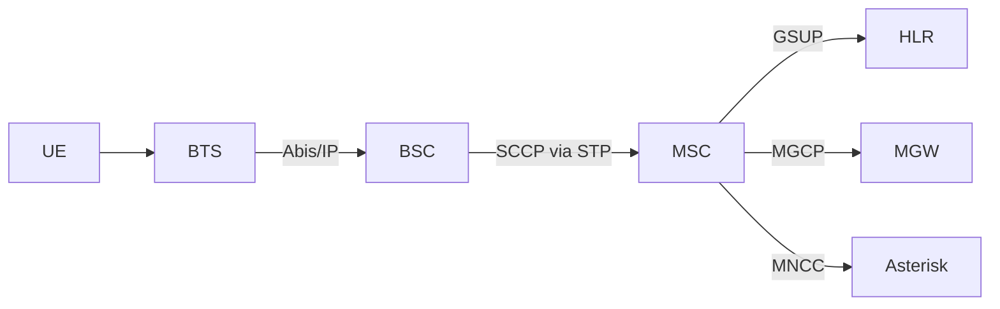
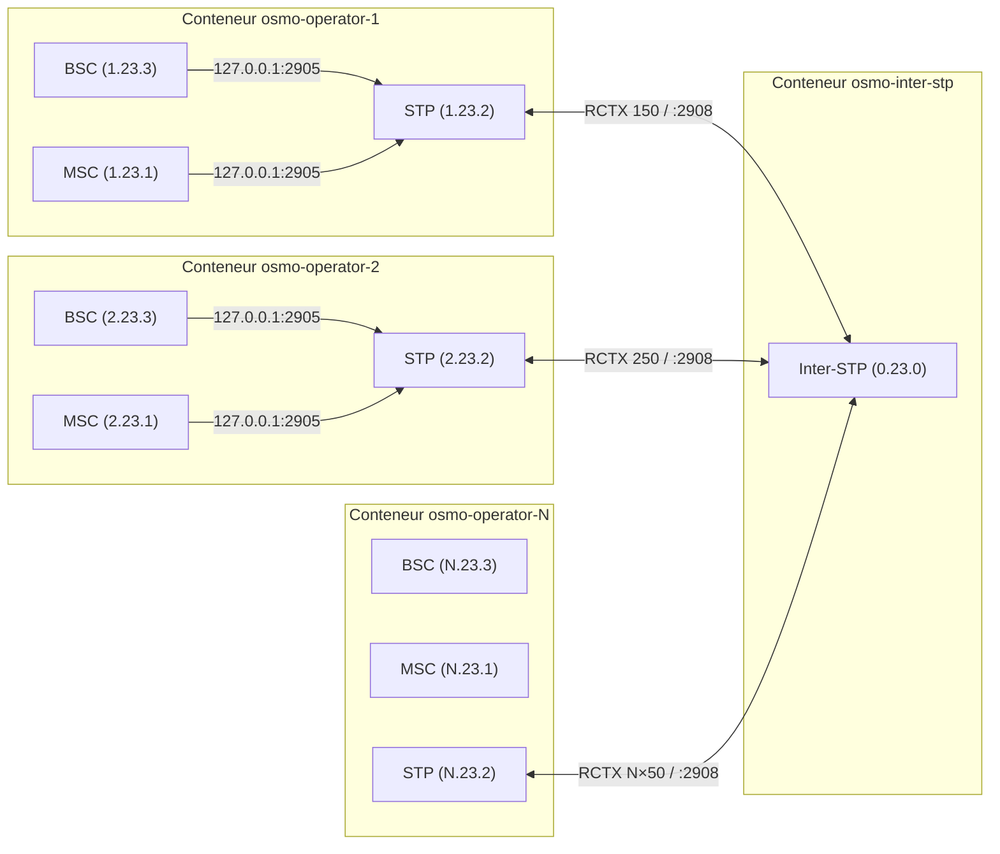
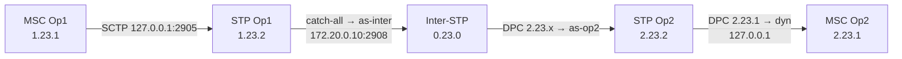
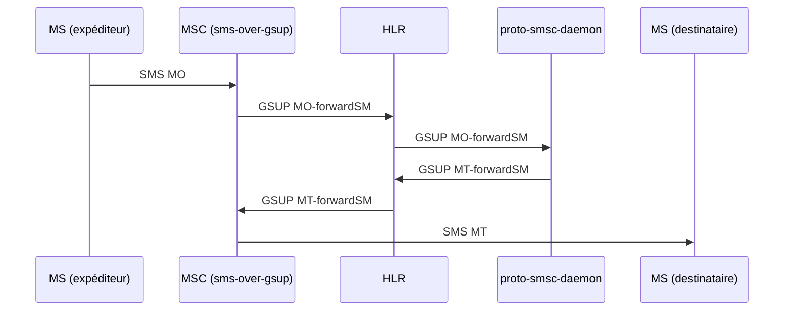
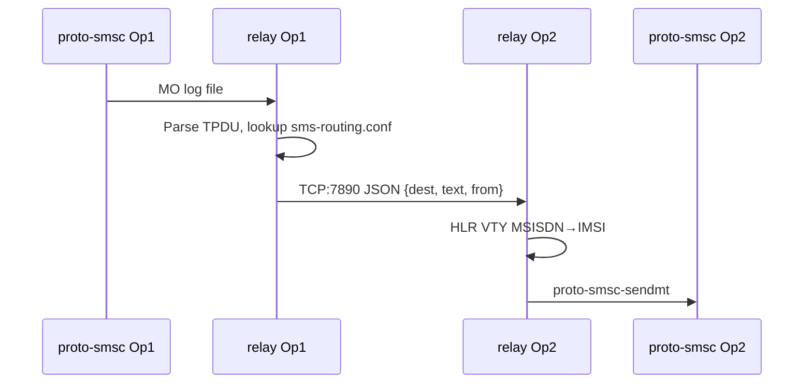
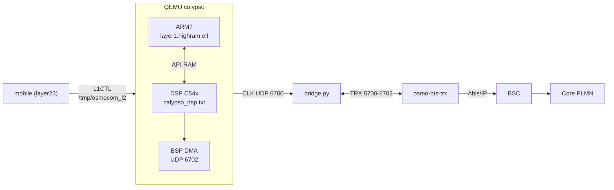

## `environment/README.md` {#f-environment-readme-md}

::: {.file-meta}
[.md]{.tag} 85 lignes - 3,7KB
:::

````{.markdown .numberLines filename="environment/README.md"}
# `environment/` — la configuration, par domaine

`calypso.env` mélangeait 312 variables : chemins d'installation, cadences du modèle, sondes de
mesure et contournements, sans distinction. Ce répertoire les sépare **par ce qu'elles font**,
pour qu'on sache ce qu'on a le droit de toucher.

| Fichier | Domaine | Touchez-y ? |
|---|---|---|
| `paths.env` | où sont les dépendances sur **votre** machine | **oui**, c'est le premier à régler |
| `modes.env` | les profils prêts à l'emploi (le mode qui campe, le mode natif…) | **oui**, choisissez-en un |
| `bsp.env` | BSP / DMA / DARAM / feed I-Q / horloge TDMA | si vous savez ce que vous faites |
| `dsp.env` | cœur c54x : interruptions, IMR, cadence d'exécution | idem |
| `fbsb.env` | FB / FBSB / corrélateur / démodulateur | idem |
| `shunt.env` | canaux shunt DL/UL, injections | idem |
| `rf.env` | TPU / TSP / RF / AFC | idem |
| `debug.env` | sondes et traces — **sans effet** sur l'émulation | **oui**, librement |
| `fixes.env` | le sas `CALYPSO_FIXES` : correctifs en attente de validation | temporairement |
| `crutches.env` | **les béquilles** — contournements de branches non implémentées | **non**, sauf pour diagnostiquer |

## Trois choses à savoir avant de modifier quoi que ce soit

**1. La vérité est le manifeste, pas la ligne de commande.**
```bash
grep "calypso-manifest" /root/qemu.log
```
Certaines variables en reposent d'autres silencieusement : `CALYPSO_NATIVE_HELPED=1` allume aussi
`FB_CORR_ENTRY`, `FB_ENERGY` et `FB_IQ_*`. Retirer l'une d'elles de la ligne de commande ne la
supprime pas — elle revient à son défaut.

**2. `=0` ne coupe pas tout.** Quatre idiomes de gate coexistent :

| Idiome | Actif quand | Comment couper |
|---|---|---|
| `getenv("X") ? 1 : 0` | la variable **existe**, même à `0` | **`unset X`** |
| `atoi(...) > 0` | valeur > 0 | `X=0` |
| `*e == '1'` | exactement `"1"` | toute autre valeur |
| défaut ON + `X_OFF` | par défaut | poser `X_OFF` |

**3. `:=` contre `=`.** Dans ces fichiers, `: "${VAR:=valeur}"` laisse la ligne de commande gagner ;
`VAR=valeur` la **verrouille**. N'utilisez `=` que pour ce qui ne doit jamais être surchargé.

## Référence complète

Les 312 variables, avec défaut, effet mesuré, mode, idiome, catégorie et dépendances :
`../hw/arm/calypso/doc/VARIABLES_ENVIRONNEMENT.md`.


## Comment ça se charge

Tout passe par `load.env`, sourcé par `start-clean.sh` :

```bash
set -a ; . ./environment/load.env ; set +a
```

L'ordre compte. Tous les fichiers utilisent `:=` (« si pas déjà défini »), donc **le premier qui
pose une valeur gagne** :

1. la **ligne de commande** — `VAR=x ./run.sh` gagne toujours ;
2. `modes.env` — le profil choisi ;
3. les fichiers par domaine — les défauts ;
4. `calypso.env` — l'ancien monolithe, conservé le temps de la migration. Il n'utilise que `:=`,
   donc il ne peut rien écraser : il ne fournit que ce qui n'a pas encore été réparti. À vider
   progressivement.

## Les fichiers hérités

`calypso.env`, `calypso_hack.env`, `calypso_native*.env`, `calypso_shunt_*.env`, `calypso_wire.env`
datent d'avant ce découpage. Ils sont conservés — on ne détruit pas ce qui marche — mais la
configuration nouvelle vit dans les fichiers par domaine.

## Ce que contient chaque domaine

| Fichier | Variables | dont béquilles |
|---|---|---|
| `bsp.env` | 52 | 10 |
| `dsp.env` | 52 | 15 |
| `fbsb.env` | 52 | 25 |
| `shunt.env` | 58 | 34 |
| `armdsp.env` | 47 | 16 |
| `opcodes.env` | 50 | 16 |

**116 béquilles sur 311 variables** — plus d'un tiers du projet est du contournement. Chacune est
annotée à son site de lecture dans le code (`grep -rn "@BEQUILLE" hw/arm/calypso/`), avec ce
qu'elle masque et la condition qui la rendrait inutile.

````

## `navigation/QUICKSTART.md` {#f-navigation-quickstart-md}

::: {.file-meta}
[.md]{.tag} 158 lignes - 6,9KB
:::

```{.markdown .numberLines filename="navigation/QUICKSTART.md"}
# Console SS7 - demarrage rapide

Tout vit dans `navigation/`. Aucune dependance : python3 de la distribution
suffit. Rien n'est ecrit en dur : point codes, hub, ports et abonnes sont lus
dans les conteneurs et dans les configurations du depot.

## 1. En trente secondes

    cd /home/nirvana/osmo_egprs
    sudo ./start.sh --wan --operators 2 --hub-ip 192.168.1.49   # le lab
    ./ss7-console.py                                            # le schema

Le schema s'ouvre. On circule **aux fleches**, on ouvre avec **Entree**, on
revient avec **Echap**. `q` quitte.

## 2. Les touches

| Touche | Effet |
|---|---|
| fleches | se deplacer de boite en boite, dans l'espace du schema |
| Entree | ouvrir le menu de l'element selectionne |
| Echap | revenir en arriere ; **dans un VTY : fermer CE VTY** et revenir au schema |
| Tab | element suivant |
| `v` | ouvrir directement le VTY de l'element |
| `s` | scripts SS7 (operations MAP) |
| `a` | audit SS7 (DAUD) d'un point code |
| `c` | connecter / deconnecter le lien M3UA de la console |
| `j` | journal du lien M3UA |
| `r` | relire la topologie |
| `?` | aide |

Dans un VTY : `Entree` envoie, haut/bas rejouent l'historique,
PagePrec/PageSuiv font defiler, `Echap` ferme la session. Les autres VTY
restent ouverts : une session par port, independantes.

## 3. Ce que montre le schema

    CONSOLE SS7 ---M3UA--- INTER-STP (hub)
                                |
                +---------------+---------------+
             OP1 - STP                       OP2 - STP
             1.11.2                          1.21.2
                |                               |
       STP  MSC/VLR  HLR  BSC  BTS  MGW  SGSN  GGSN  ...

Chaque boite de service porte son port VTY. Les couleurs suivent la famille :
SS7, coeur, abonnes, radio, media, data.

## 4. Sans interface : la ligne de commande

    ./ss7-console.py list                 inventaire (PC, hub, SCCP, VTY)
    ./ss7-console.py ops                  catalogue des operations MAP
    ./ss7-console.py vty 1 4258 "show subscribers all"
    ./ss7-console.py audit 1.11.1         le "ping" SS7 (DAUD -> DAVA/DUNA)
    ./ss7-console.py map sri-sm --pc 1.11.6 msisdn=600101 sc_addr=600999
    ./ss7-console.py serve                repondeur MAP (HLR simule)

`vty <n>` accepte le numero d'operateur ou le nom du conteneur.

## 5. Les operations MAP

| Cle | Operation | Opcode | SSN vise |
|---|---|---|---|
| `sri-sm` | sendRoutingInfoForSM | 45 | 6 (HLR) |
| `sri` | sendRoutingInfo | 22 | 6 |
| `ati` | anyTimeInterrogation | 71 | 6 |
| `sai` | sendAuthenticationInfo | 56 | 6 |
| `send-imsi` | sendIMSI | 58 | 6 |
| `psi` | provideSubscriberInfo | 70 | 7 (VLR) |
| `ul` | updateLocation | 2 | 6 |
| `raw` | invoke brut (opcode + parametre hexa) | - | - |

La console est un **vrai** point SS7 : elle s'attache a l'inter-STP en M3UA sur
SCTP, enregistre dynamiquement une routing key pour son point code (RKM), passe
ASP_ACTIVE, puis emet du TCAP/MAP qui traverse le hub comme le trafic des
operateurs. Chaque envoi peut etre exporte en script Python autonome
(`navigation/scripts/<operation>-<horodatage>.py`).

## 6. Le repondeur : un aller-retour MAP complet

Osmocom fait dialoguer MSC et HLR en **GSUP**, pas en MAP : un SRI-SM envoye au
vrai HLR ne trouve personne. Le repondeur comble ce trou en repondant avec les
donnees du VRAI HLR (lues par VTY), a travers le vrai hub.

    # terminal A
    ./ss7-console.py serve
    # terminal B
    ./ss7-console.py map sri-sm --pc 1.11.6 msisdn=600101 sc_addr=600999

    resultat (opcode 45) :
       IMSI                         001010001000001
       Noeud de service             +600101

## 7. Diagnostic et tests

    ./navigation/ss7-diag.py             diagnostic SS7 complet
    ./navigation/ss7-diag.py --rapide    sans M3UA ni MAP
    ./navigation/test-console.sh         teste CHAQUE commande, un log par test

`ss7-diag.py` verifie, dans l'ordre ou une panne se lit : environnement (SCTP),
topologie heritee des configs, STP/MSC/BSC/HLR de chaque operateur, association
SCTP vers le hub, attachement de la console comme ASP, audit de tous les point
codes connus, puis un aller-retour MAP reel. Le code de sortie est le nombre
d'echecs.

`test-console.sh` ecrit un fichier par commande dans
`navigation/logs/<horodatage>/`, plus un `rapport.txt`.

## 8. A savoir sur ce lab

- **Le lien M3UA depuis l'hote ne vit que quelques secondes.** L'inter-STP
  cesse de servir une association venue de l'hote au bout de ~3 s, et
  l'association SCTP expire vers 35 s. La console la renouvelle toute seule
  avant chaque echange (~0,3 s) : c'est invisible, mais cela explique un
  eventuel "pas de reponse" suivi d'un second essai qui marche.
- **Le hub refuse le parametre "Service Indicators"** dans une routing key
  (registration status 9). Il est donc omis.
- **Il faut proposer son propre routing context** : sans cela le hub rend le
  meme contexte a deux ASP differents, et en `traffic-mode override` le dernier
  attache vole le trafic du premier (la destination du premier passe DUNA).
- **Le DATA part sur le flux SCTP 1** : le flux 0 est reserve a la gestion, et
  un DATA dessus est refuse ("Invalid Stream Identifier").
- **Les point codes sont au format ITU 3-8-3** : `a.b.c` avec a et c de 0 a 7,
  b de 0 a 255. `1.11.60` n'existe pas - il serait recu comme `1.15.4`.
- Les point codes de la console (`1.11.7`, `1.11.6`...) laissent des routes
  dynamiques `PROHIB` dans les STP operateur quand elle se ferme : c'est normal,
  elles repassent `avail` au retour.

## 9. Les modules

| Fichier | Role |
|---|---|
| `topo.py` | inventaire : conteneurs, env, `/etc/osmocom/*.cfg`, ports VTY |
| `vty.py` | sessions VTY persistantes par `docker exec` |
| `diagram.py` | le schema et la navigation spatiale aux fleches |
| `tui.py` | l'interface curses (schema, menus, formulaires, VTY) |
| `ber.py` | BER/DER minimal |
| `sccp.py` | SCCP UDT/UDTS, adresses, global titles, TBCD |
| `tcap.py` | TCAP begin/end, invoke, returnResult, returnError, AARQ/AARE |
| `mapops.py` | catalogue MAP : encodeurs, decodeurs, erreurs |
| `m3ua.py` | ASP M3UA sur SCTP : ASPUP, RKM, ASPAC, DATA, battement |
| `ss7.py` | la couche qui relie tout, et le compte rendu lisible |
| `responder.py` | repondeur MAP adosse au vrai HLR |
| `quickcmd.py` | commandes VTY utiles, par demon |
| `ss7-console.py` | point d'entree (schema + sous-commandes) |
| `ss7-diag.py` | diagnostic complet |
| `test-console.sh` | test de chaque commande, avec journaux |

## 10. Depannage

| Symptome | Cause probable |
|---|---|
| `aucun inter-STP connu` | lab arrete, ou `--hub-ip` jamais donne a `start.sh` |
| `le conteneur ... ne tourne pas` | `docker ps` ne le voit plus |
| `VTY ... injoignable` | le demon n'est pas lance dans ce conteneur |
| `Aucune reponse` a un MAP | personne n'ecoute ce SSN : lancez `serve` |
| fleches sans effet | terminal en mode curseur normal - deja gere, sinon `TERM=xterm` |
| `DUNA` sur un point code | l'ASP de cette destination n'est pas attache au hub |

```

## `navigation/STATUS.md` {#f-navigation-status-md}

::: {.file-meta}
[.md]{.tag} 122 lignes - 6,9KB
:::

```{.markdown .numberLines filename="navigation/STATUS.md"}
# Etat des lieux et reste a faire

Derniere mise a jour : 2026-08-26, lab a l'arret (conteneurs `Exited (127)`).

## 1. Ce qui est fait et verifie

### Correctifs du depot

| Fichier | Correctif | Verifie |
|---|---|---|
| `start.sh` | `asound.conf` : Docker avait cree un REPERTOIRE a la place du fichier, le mount echouait (`not a directory`). Le repertoire parasite est supprime avant la copie, la copie est verifiee, sinon repli propre sur `ALSA_*=default`. | oui, `bash -n` + repertoire nettoye |
| `start.sh` | `--hub-ip` et `--node-per-op` posent `WAN_MESH=1` : sans cela le plan de point codes retombait sur le plan LOCAL (1.1.2 / 1.2.2, rctx 150 / 250), identique sur chaque machine du WAN. | syntaxe ; **a rejouer sur le lab** |
| `start.sh` | le rang d'operateur passe a `start-direct.sh` (`--op N`) au lieu de `--op 1` fige : `set-node-id.sh` reecrivait les configs de l'operateur 2 avec l'identite de l'operateur 1. | syntaxe ; **a rejouer** |
| `start.sh` | garde-fou : `--node-per-op` refuse un numero de noeud hors de 1..9 avec un message qui dit quoi faire. | syntaxe ; **a rejouer** |
| `checks/_mode.sh` | decouverte du hub distant (env des conteneurs puis `osmo-stp.cfg`), point codes libres au format ITU 3-8-3, sonde d'association SCTP. | oui, sur le lab |
| `checks/ss7_check.sh` | mode WAN : « Container absent » remplace par « hub distant + lien M3UA/SCTP », matrice de connectivite reactivee, route par defaut enfin verifiee. | oui : 19 pass, 0 warn |
| `checks/wan_ss7_check.sh` | le hub parle SCTP : la sonde `nc -z 2908` (TCP) rendait « injoignable » sur un lien parfait. Remplacee par l'association SCTP reelle. `HUB_IP` lu dans les conteneurs. | oui : 25 ok, 0 echec |
| `checks/operator_summary.sh` | section « hub distant » quand il ne figure pas dans le dump. | oui |

### Console SS7 (`navigation/`)

14 modules, ~4300 lignes de Python, sans dependance. Schema navigable aux
fleches, VTY par noeud (Echap ferme la session), ASP M3UA reel sur le hub,
operations MAP, repondeur, diagnostic, tests.

Verifie sur le lab en marche :

- schema rendu et navigation spatiale (pilotage sous pty) ;
- VTY OsmoBSC ouvert, commande envoyee, sortie reelle, Echap ferme ;
- ASP M3UA : ASPUP / RKM / ASPAC -> `ASP_ACTIVE` sur `192.168.1.49:2908` ;
- DAUD : `DAVA` sur les 6 point codes du lab, `DUNA` sur un PC inexistant ;
- aller-retour MAP complet : `sendRoutingInfoForSM 600101` -> `IMSI
  001010001000001`, a travers le hub ;
- `ss7-diag.py` : 25 ok ;
- `test-console.sh` : 10 tests passes avec le lab a l'arret (3 ignores), un
  journal par commande.

### Ce que le lab nous a appris (garde dans le code, avec le pourquoi)

- le hub REFUSE le parametre « Service Indicators » d'une routing key ;
- il faut PROPOSER son routing context, sinon deux ASP recoivent le meme et,
  en `traffic-mode override`, le dernier vole le trafic du premier ;
- le DATA doit partir sur le flux SCTP 1 (le 0 est reserve a la gestion) ;
- une association venue de l'HOTE n'est servie que ~3 s, puis expire vers 35 s :
  la console renouvelle son lien avant chaque echange.

## 2. Ce que l'audit de la numerotation a trouve

Quatre cartographies (point codes, abonnes, indicatifs WAN, identifiants
reseau) confrontees aux sources. **12 problemes bloquants**, dont 3 corriges
ci-dessus. Les 9 autres, par ordre d'urgence :

### Bloquants, non corriges

1. **Le MSISDN n'encode aucun noeud** — `600000 + op*100 + rang`, et le Ki n'en
   depend pas non plus. Deux noeuds portent le meme `600101` avec le meme Ki ;
   seul l'IMSI (via le MCC) les separe. Des qu'un chemin oublie de prefixer
   l'indicatif, il tombe sur l'homonyme local. `start.sh:1436-1437`.
2. **ISO : meme IMSI, meme MSISDN, meme Ki sur tous les noeuds** — `build-iso.sh`
   fige `MCC=001 MNC=01 op_id=1`, ce qui contredit `op_mcc() = noeud`.
   `build-iso.sh:289-290,369-373`.
3. **`--node-per-op` : l'operateur 2 d'un noeud distant est injoignable** — ses
   MSISDN sont `600201` mais le maillage ne genere que `_<ind>6001XX`.
   `network/setup-wan-mesh.sh:602,763` vs `start.sh:1678`.
4. **`globals.conf` ecrase l'environnement** au lieu de le completer :
   `ARFCN=520 ./start-direct.sh` est remis a vide. `globals.conf:23-45`.
5. **ARFCN / BSIC / LAC / CI ne dependent que de l'operateur** — deux noeuds
   diffusent `ARFCN 514 / BSIC 7 / LAC 0x0001 / CI 6001`. `generate_configs.sh:287-306`.
6. **Le garde-fou `_gc_warn_perop` ne tourne jamais** sur le chemin reel (mode
   source) et teste `N_OPERATORS`, que `start.sh` ne lit nulle part.
7. **La plage RTP du MGW (4002-16001) recouvre tous les ports de service** du
   conteneur, VTY compris. `configs/osmo-mgw.cfg:70-71`.
8. **`node_nops` : repli mort** — `WAN_NOPS[id]=1` est toujours pose, donc un
   pair est toujours vu a 1 operateur. `network/wan-nodes.sh:109-120`.
9. **La grille d'AS du hub est indexee par RANG, pas par numero de noeud** — une
   table `1: 3: 5:` produit `as-n1 as-n2 as-n3`. `helpers/create_interop.sh:118-130`.

### Serieux, notables

- trois replis divergents pour MCC/MNC (`start-direct.sh`, `run_modules/21`,
  `scripts/sms-routing-setup.sh`) ;
- seules 2 routes SMS locales generees quel que soit `OP_MS` ;
- `checks/diag-stp-operator.sh` et `wan_ss7_check.sh` figent l'operateur a 1 ;
- deux identites de noeud pour la meme machine en `--node-per-op` ;
- aucun routage par global title (tout est en PC/SSN 254).

## 3. Reste a faire

### Priorite 1 — rejouer ce qui est corrige

- [ ] relancer le lab et verifier les 3 correctifs `start.sh` :
      `sudo ./start.sh --wan --operators 2 --hub-ip 192.168.1.49`
      puis `./navigation/ss7-diag.py` (attendu : 2 PC distincts par operateur,
      rctx distincts, aucun `DUNA` sur les PC du lab) ;
- [ ] `./navigation/test-console.sh` lab en marche (les 3 sections ignorees
      doivent passer).

### Priorite 2 — numerotation

- [ ] trancher le plan MSISDN : y encoder le noeud, ou assumer que l'indicatif
      est le seul discriminant et verifier CHAQUE chemin qui le retire ;
- [ ] `build-iso.sh` : deriver MCC/MNC/op_id du `--node`, comme `start.sh` ;
- [ ] `generate_configs.sh` : indexer ARFCN / BSIC / LAC / CI par noeud ;
- [ ] `globals.conf` : passer aux affectations `${VAR:=...}` pour tenir la
      promesse du commentaire, ou corriger le commentaire ;
- [ ] `network/wan-nodes.sh` : ne poser `WAN_NOPS` que si le champ existe.

### Priorite 3 — outillage

- [ ] `checks/diag-stp-operator.sh` : ne plus figer l'operateur 1 ;
- [ ] console : bornes du repondeur (plusieurs operateurs, choix du SSN) ;
- [ ] console : rejouer un script exporte (`navigation/scripts/`) depuis le
      schema.

## 4. Points d'attention

- `navigation/` appartient a `nirvana:nirvana` ; `start.sh` reste `root:root`
  comme avant.
- Sauvegardes : `start.sh.bak.20260826-221924` (asound) et
  `start.sh.bak.*-numerotation` (les 3 correctifs), `checks/*.bak`.
- L'audit complet (phase 2 et 3 du workflow) n'a pas ete rejoue : seules les
  quatre cartographies ont abouti. Leurs conclusions sont resumees ici.

```

## `README.md` {#f-readme-md}

::: {.file-meta}
[.md]{.tag} 552 lignes - 19KB
:::

````{.markdown .numberLines filename="README.md"}
# osmo-nitb-for-calypso — Architecture Multi-PLMN SS7/IP

Standalone mode (no interstp)
```bash
sudo docker pull bastienbaranoff/norf_gsm
sudo docker tag bastienbaranoff/norf_gsm osmocom-nitb
git clone https://github.com/bbaranoff/osmo_egprs
cd osmo_egprs
sudo ./start.sh
```
To go in container
```bash
sudo docker exec -ti osmo-operator-1 bash
``` 

then in docker container
```bash
cd /opt/GSM/osmo_egprs
./start-direct.sh --regen
./start-direct.sh --stop
./start-direct.sh
```


Documentation d'architecture du projet **osmo-nitb-for-calypso** : simulation multi-opérateur GSM complète avec interconnexion SS7 sur IP, entièrement conteneurisée via Docker.

Ce projet réalise ce qui s'apparente à un « DHCP pour SS7 » — l'automatisation complète d'une configuration SS7 inter-opérateurs habituellement réalisée à la main, reproductible d'un simple `tools/make-docker-image.sh && start.sh`.

**Support N opérateurs** : le démarrage en mode bridge accepte de 1 à 9 opérateurs sans modifier aucune configuration. Tous les fichiers (pjsip, dialplan, SMS routing, inter-STP) sont générés dynamiquement selon N.

---

## 1. Architecture d'un PLMN (Osmocom)

Chaque opérateur simulé repose sur la stack Osmocom standard, tous les composants dans un seul conteneur Docker.



Tous ces composants tournent dans le même conteneur et communiquent via `127.0.0.1`. Le STP local sert de hub de signalisation intra-PLMN.

---

## 2. Interconnexion Multi-PLMN

L'architecture centrale du projet. N opérateurs distincts, chacun avec son core network dans un conteneur dédié, reliés par un Inter-STP central qui route la signalisation M3UA/SCCP entre eux.



---

## 3. Topologie réseau Docker

### 3.1 Réseaux

| Réseau Docker | Plage | Rôle |
|---------------|-------|------|
| `gsm-inter` | `172.20.0.0/24` | Backbone interop (M3UA inter-STP) |
| `gsm-net-opN` | `172.20.N.0/24` | Réseau privé opérateur N (GSMTAP, GPRS) |

### 3.2 Adresses IP

| Composant | IP backbone (`gsm-inter`) | IP privée (`gsm-net-opN`) |
|-----------|--------------------------|--------------------------|
| Inter-STP | `172.20.0.10` | — |
| Conteneur OpN | `172.20.0.(10+N)` | `172.20.N.10` |

**Formule générale** : opérateur N → backbone `172.20.0.(10+N)`, privé `172.20.N.10`

### 3.3 Communication intra-conteneur

Tous les composants communiquent via `127.0.0.1` (fix de la race condition Docker) :

```
BSC ──(127.0.0.1:2905)──► STP local
MSC ──(127.0.0.1:2905)──► STP local
MSC ──(127.0.0.2:4222)──► HLR
MSC ──(127.0.0.1:2427)──► MGW
```

Le STP écoute sur `127.0.0.1:2905` immédiatement, sans dépendre de l'interface réseau Docker (attachée après démarrage du container via `docker network connect`).

### 3.4 Communication inter-conteneur

Uniquement le lien STP↔Inter-STP traverse le réseau Docker :

```
STP OpN (172.20.0.(10+N)) ──SCTP──► Inter-STP (172.20.0.10:2908)
```

---

## 4. Signalisation SS7

### 4.1 Point codes

Format ITU 14-bit (3.8.3 : `zone.network.node`)

| Nœud | Point Code | Formule |
|------|-----------|---------|
| Inter-STP | `0.23.0` | fixe |
| MSC OpN | `N.23.1` | zone=N |
| STP OpN | `N.23.2` | zone=N |
| BSC OpN | `N.23.3` | zone=N |

### 4.2 Routing Contexts (RCTX)

| RCTX | Formule | Usage |
|------|---------|-------|
| `N×100+10` | `rctx_msc` | MSC OpN → STP OpN |
| `N×100+20` | `rctx_stp` | STP OpN (registration) |
| `N×100+30` | `rctx_bsc` | BSC OpN → STP OpN |
| **`N×100+50`** | **`rctx_inter`** | **STP OpN → Inter-STP** |

Le RCTX inter (`N×100+50`) est le plus critique : il doit correspondre dans `osmo-stp.cfg` (STP opérateur) et être cohérent avec la connexion vers l'inter-STP.

### 4.3 Configuration inter-STP (générée)

L'inter-STP utilise des **AS sans routing-key** (catch-all par opérateur). Le routage se fait uniquement sur le DPC :

```
cs7 instance 0
 point-code 0.23.0
 listen m3ua 2908
  accept-asp-connections dynamic-permitted

 as as-opN m3ua
  traffic-mode override     ← PAS de routing-key

 route-table system
  update route N.23.1 7.255.7 linkset as-opN
  update route N.23.2 7.255.7 linkset as-opN
  update route N.23.3 7.255.7 linkset as-opN
```

### 4.4 Chemin complet d'un message SS7



---

## 5. Génération dynamique — N opérateurs

Toutes les configurations dépendant de N sont **générées au démarrage**. Aucun fichier template ne contient de valeur hardcodée pour un nombre spécifique d'opérateurs.

### 5.1 Template engine (placeholders)

`apply_config_templates()` dans `start.sh` résout en **1 seul passage `sed`** :

| Placeholder | Formule | Exemple N=2 |
|------------|---------|-------------|
| `__PC_MSC__` | `N.23.1` | `2.23.1` |
| `__PC_STP__` | `N.23.2` | `2.23.2` |
| `__PC_BSC__` | `N.23.3` | `2.23.3` |
| `__RCTX_MSC__` | `N×100+10` | `210` |
| `__RCTX_BSC__` | `N×100+30` | `230` |
| `__RCTX_INTER__` | `N×100+50` | `250` |
| `__ARFCN__` | `512+N×2` | `516` |
| `__INTER_LOCAL_IP__` | `172.20.0.(10+N)` | `172.20.0.12` |
| `__CONTAINER_IP__` | `172.20.N.10` | `172.20.2.10` |

### 5.2 Sections générées (dépendent de N total)

Après la substitution sed, `start.sh` **appende** à chaque opérateur :

| Section | Fichier | Contenu |
|---------|---------|---------|
| Trunks PJSIP | `pjsip.conf` | N-1 blocs `[interop_trunk_opX]` |
| Dialplan sortant | `extensions.conf` | Contexte `[interop_out]` avec N-1 extensions |
| Routage SMS | `sms-routing.conf` | Table complète pour N opérateurs |
| Config inter-STP | `osmo-stp-interop.cfg` | N AS + N×3 routes SS7 |

### 5.3 Séquence de démarrage

```
./start.sh  [bridge mode]
 ├── Saisie N opérateurs + MCC/MNC/nom par opérateur
 ├── Création réseau gsm-inter (172.20.0.0/24)
 ├── create_interop.sh N → osmo-stp-interop.cfg
 ├── Lancement osmo-inter-stp (doit écouter :2908 AVANT les opérateurs)
 └── Pour chaque opérateur N :
      ├── apply_config_templates (sed + génération sections dynamiques)
      ├── docker run sur gsm-inter @ 172.20.0.(10+N)
      ├── docker network connect gsm-net-opN @ 172.20.N.10
      └── Services via run.sh + tmux
```

L'ordre est critique : l'Inter-STP doit écouter avant que les STPs opérateurs tentent de s'y connecter.

---

## 6. SMS

### 6.1 SMS intra-opérateur



### 6.2 SMS inter-opérateur

`sms-interop-relay.py` surveille le log MO de `proto-smsc-daemon`, parse le TPDU GSM 03.40, consulte `sms-routing.conf` (longest-prefix match), et transfère via TCP port 7890 au relay de l'opérateur cible.



---

## 7. Voix

### 7.1 Intra-opérateur

```
MS → BTS → BSC → MSC → MNCC → Asterisk → MNCC → MSC → BSC → BTS → MS
                              ↕ MGCP
                            OsmoMGW (RTP)
```

### 7.2 Inter-opérateur

```
MS(OpX) → MSC(OpX) → MNCC → Asterisk(OpX)
              ─── SIP trunk 172.20.0.(10+X) ↔ 172.20.0.(10+Y) ───
                               Asterisk(OpY) → MNCC → MSC(OpY) → MS(OpY)
```

Le dialplan `[interop_out]` route automatiquement sur le premier chiffre du numéro composé (convention : chiffre N = opérateur N). Pour 3 opérateurs, Op1 a des trunks vers Op2 et Op3, etc.

---

## 8. Utilisation du lab

### 8.1 Démarrage et arrêt

```bash
sudo ./tools/make-docker-image.sh          # Build l'image Docker (1 fois)
sudo ./start.sh          # Lance tout (choisir bridge, saisir N opérateurs)
sudo ./start.sh stop     # Arrête tous les containers

sudo ./provision_hlr.sh  # Provisionne les abonnés de test dans les HLR
```

Trois modes PHY pour le côté MS, sélectionnés via `PHY_MODE` à l'intérieur du
container avant d'invoquer `run.sh` :

| `PHY_MODE` | Pile | Usage |
|------------|------|-------|
| `faketrx` (défaut) | `fake_trx` → `trxcon` → `mobile` | Multi-MS, rapide, pas de DSP |
| `virtphy` | `osmo-bts-virtual` ↔ `virtphy` ↔ `mobile` | Multi-MS via multicast UDP |
| `qemu` | `osmo-bts-trx` ↔ `bridge.py` ↔ QEMU Calypso ↔ `mobile` | Baseband émulé (ARM7+DSP), 1 MS |

Voir §11 pour le mode QEMU.

### 8.2 Accès aux containers

```bash
# Opérateur N — tmux avec STP/MSC/HLR/BSC/BTS/SMSC
sudo docker exec -ti osmo-operator-1 tmux attach
sudo docker exec -ti osmo-operator-2 tmux attach
sudo docker exec -ti osmo-operator-N tmux attach

# Inter-STP
sudo docker exec -ti osmo-inter-stp tmux attach -t stp
```

### 8.3 Navigation tmux

| Raccourci | Fenêtre |
|-----------|---------|
| `Ctrl-b 0` | faketrx |
| `Ctrl-b 1` | MS1 (trxcon + mobile) |
| `Ctrl-b 2` | Asterisk |
| `Ctrl-b 3` | SMSC (proto-smsc-daemon + relay) |
| `Ctrl-b w` | Liste toutes les fenêtres |
| `Ctrl-b d` | Détacher |

### 8.4 Interfaces VTY (telnet depuis le container)

| Port | Composant |
|------|-----------|
| `4239` | OsmoSTP |
| `4242` | OsmoBSC |
| `4243` | OsmoMGW |
| `4254` | OsmoMSC |
| `4258` | OsmoHLR |

### 8.5 Commandes VTY essentielles

```
# Sur STP (4239) — diagnostic SS7
OsmoSTP> show cs7 instance 0 asp          # État ASP (ACTIVE/DOWN)
OsmoSTP> show cs7 instance 0 as all       # État AS
OsmoSTP> show cs7 instance 0 route        # Table de routage — PROHIB ?

# Sortie saine STP OpN :
# N.23.1/14   as-dyn-…  avail  avail  dyn   ← MSC (dynamique)
# N.23.3/14   as-dyn-…  avail  avail  dyn   ← BSC (dynamique)
# 0.0.0/0     as-inter  avail  avail        ← catch-all inter-STP

# Sur MSC (4254)
OsmoMSC# subscriber msisdn 10001 sms sender msisdn 10002 send Bonjour
OsmoMSC# show subscriber all

# Sur HLR (4258)
OsmoHLR# subscriber imsi 001010000000001 show
OsmoHLR# show gsup-clients
```

### 8.6 Wireshark

Lancé automatiquement sur le bridge Docker avec filtre `sctp or udp port 4729`.

```
m3ua                      # Trafic M3UA uniquement
sccp                      # Messages SCCP
gsm_map                   # Messages MAP
gsmtap                    # Trafic radio (Um)
sctp.srcport == 2908      # Trafic vers/depuis l'inter-STP
```

---

## 9. Diagnostic — Résoudre les PROHIB

```bash
# 1. L'inter-STP tourne-t-il ?
sudo docker ps | grep inter-stp

# 2. L'ASP vers l'inter-STP est-il ACTIVE ?
sudo docker exec osmo-operator-1 sh -c \
  'echo "show cs7 instance 0 asp" | telnet 127.0.0.1 4239 2>/dev/null'

# 3. L'inter-STP voit-il les opérateurs ?
sudo docker exec osmo-inter-stp sh -c \
  'echo "show cs7 instance 0 asp" | telnet 127.0.0.1 4239 2>/dev/null'

# 4. Les routes locales (BSC/MSC) existent-elles ?
sudo docker exec osmo-operator-1 sh -c \
  'echo "show cs7 instance 0 route" | telnet 127.0.0.1 4239 2>/dev/null'

# 5. Connectivité backbone
sudo docker exec osmo-operator-1 ping -c1 172.20.0.10

# 6. Race condition → redémarrer l'opérateur
sudo docker restart osmo-operator-1
```

| Symptôme | Cause probable | Fix |
|----------|---------------|-----|
| Route 0.0.0/0 PROHIB | Inter-STP pas démarré ou IP incorrecte | Vérifier `INTER_STP_IP` et backbone IP |
| Pas de routes dynamiques | MSC/BSC ne se connectent pas au STP | Vérifier que les ASP pointent sur `127.0.0.1` |
| ASP DOWN sur inter-STP | Race condition Docker | `docker restart` de l'opérateur |

---

## 10. Plan de numérotation

Convention par défaut (modifiable) :

| Numéro | Usage |
|--------|-------|
| `N0001`…`N9999` | Abonnés GSM opérateur N |
| `100` | Linphone A (softphone local) |
| `200` | Linphone B (softphone local) |
| `600` | Echo test |
| `9XXXXX` | Sortie inter-op depuis softphone (9 + numéro complet) |

Le premier chiffre d'un numéro NXXXX identifie l'opérateur. Le dialplan `[gsm_in]` détecte automatiquement si la destination est locale ou inter-op.

---

## 11. RAN virtuel QEMU (PHY_MODE=qemu)

Le projet intègre [bbaranoff/qemu](https://github.com/bbaranoff/qemu) — un fork
de QEMU avec une machine `calypso` qui émule le SoC GSM TI Calypso (ARM7TDMI +
DSP TMS320C54x). Cela permet d'exécuter le **vrai firmware** OsmocomBB
`layer1.highram.elf` au-dessus d'un baseband virtualisé, sans aucun hardware.

### 11.1 Architecture



- **ARM7** exécute le firmware osmocom-bb compilé dans le conteneur.
- **DSP C54x** charge le ROM Calypso réel (`calypso_dsp.txt`, dumpé d'un téléphone).
- **`bridge.py`** (Python) relaie les bursts entre `osmo-bts-trx` (UDP 5700-5702)
  et la BSP du DSP (UDP 6702). QEMU est maître d'horloge TDMA et envoie des
  ticks sur UDP 6700 ; bridge synthétise des `IND CLOCK` à cadence wall-clock
  pour le BTS, en piochant le FN de QEMU.
- **`mobile`** se connecte au socket L1CTL `/tmp/osmocom_l2` publié par QEMU
  via la PTY série du firmware (sercomm DLCI 5).

### 11.2 Composants ajoutés au conteneur

| Composant | Path container | Source |
|-----------|---------------|--------|
| `qemu-system-arm` (machine `calypso`) | `/usr/local/bin/qemu-system-arm` | bbaranoff/qemu |
| Firmware Calypso layer1 | `${GSM_ROOT}/firmware/board/compal_e88/layer1.highram.elf` | osmocom-bb (build container) |
| ROM DSP | `${GSM_ROOT}/calypso_dsp.txt` | bbaranoff/qemu (symlink) |
| Bridge BTS↔BSP | `${OQC_ROOT}/bridge.py` | bbaranoff/qemu |
| `transceiver` (BTS soft-SDR Calypso) | `/usr/local/bin/transceiver` | osmocom-bb branche jolly/testing |
| `ccch_scan`, `bcch_scan`, `cell_log` | `/usr/local/bin/` | osmocom-bb branche fixeria/burst_ind |

Le Dockerfile installe le toolchain ARM (`gcc-arm-none-eabi`) avant la build
osmocom-bb pour produire le `.elf`. La build complète prend ~15-20 min selon
la machine.

### 11.3 Lancement

```bash
sudo ./tools/make-docker-image.sh
sudo ./start.sh        # mode opérateur unique (single)
docker exec -ti osmo-operator-1 bash
# dans le container :
PHY_MODE=qemu /root/run.sh
```

`run.sh` orchestre la séquence : `osmo-bts-trx` → QEMU (PTY+monitor) →
attente du socket `/tmp/osmocom_l2` → `bridge.py` → attente des ticks QEMU
sur UDP 6700 → `mobile`. Tout est lancé dans des fenêtres tmux distinctes.

| Variable | Défaut | Rôle |
|----------|--------|------|
| `QEMU_BIN` | `${GSM_ROOT}/qemu/build/qemu-system-arm` | Binaire QEMU |
| `QEMU_FW` | `${GSM_ROOT}/firmware/board/compal_e88/layer1.highram.elf` | Firmware ARM |
| `QEMU_DSP_ROM` | `${GSM_ROOT}/calypso_dsp.txt` | ROM DSP C54x |
| `QEMU_BRIDGE` | `${OQC_ROOT}/bridge.py` | Script bridge BTS↔BSP |
| `QEMU_L1CTL_SOCK` | `/tmp/osmocom_l2` | Socket L1CTL publié par QEMU |
| `QEMU_MON_SOCK` | `/tmp/qemu-calypso-mon.sock` | Monitor QEMU (HMP) |

`PHY_MODE=qemu` force `N_MS=1` : le bridge utilise des ports UDP fixes (un seul
Calypso émulé par conteneur). Pour faire tourner plusieurs MS virtuels, lancer
plusieurs conteneurs (un par opérateur, chacun avec son bridge).

### 11.4 Diagnostic

```bash
# tmux : fenêtres qemu / bridge / bts / ue_g1
docker exec -ti osmo-operator-1 tmux -S /tmp/osmocom_tmux attach -t osmocom

# Monitor QEMU (HMP)
docker exec -ti osmo-operator-1 socat - unix-connect:/tmp/qemu-calypso-mon.sock

# Logs
/var/log/osmocom/qemu.log     # Émulation ARM/DSP, BSP, MVPD, IRQ
/var/log/osmocom/bridge.log   # Ticks QEMU, IND CLOCK, DL/UL bursts
/var/log/osmocom/run.sh.log   # Orchestration
```

| Symptôme | Cause probable | Diagnostic |
|----------|---------------|------------|
| `bridge: timeout — vérifier que QEMU émet sur UDP 6700` | QEMU n'a pas démarré le TPU/DSP | `grep TINT0 /var/log/osmocom/qemu.log` |
| Mobile `FBSB result=255` (no cell) | DSP ne détecte pas le FB — voir `qemu/SESSION_STATUS.md` (bug IMR=0x0000 connu) | `grep "IMR change" /var/log/osmocom/qemu.log \| wc -l` |
| `osmo-bts-trx: PC clock skew too high` | bridge cesse d'envoyer `IND CLOCK` | redémarrer bridge.py |
| Socket `/tmp/osmocom_l2` jamais créé | Firmware ne boote pas | `head -50 /var/log/osmocom/qemu.log` (chercher MVPD/PROM0) |

L'intégration QEMU est en développement actif côté DSP (voir
`bbaranoff/qemu/CLAUDE.md` pour le statut courant des bugs C54x).

---

## 12. Autres extensions

**srsRAN (LTE)** — coexistence 2G/4G avec eNodeB virtuel, HLR/HSS partagé.

**VoWiFi / IMS** — passerelle SIP via Asterisk pour l'accès WiFi, pont vers le core GSM.

**Monitoring** — Prometheus/Grafana pour métriques M3UA, dashboards MAP, visualisation SCCP.

---

*Projet osmo-nitb-for-calypso — plateforme pédagogique télécom multi-PLMN, entièrement conteneurisée, support N opérateurs.*

````

## `services/README.md` {#f-services-readme-md}

::: {.file-meta}
[.md]{.tag} 20 lignes - 687B
:::

````{.markdown .numberLines filename="services/README.md"}
# `services/` — unités systemd

Les unités du projet, rassemblées ici plutôt que dispersées entre la racine et
`scripts/`. Elles sont installées par le `Dockerfile` (image) et par `build-iso.sh`
(support bootable) ; l'installation native ne les active pas.

| Unité | Rôle |
|---|---|
| `osmo-bts-trx.service` | station de base, transceiver TRX |
| `osmo-egprs-web.service` | console web d'exploitation |

Les unités sous `contrib/systemd/` appartiennent à QEMU en amont et ne relèvent
pas de ce dossier.

Installer à la main :

```bash
sudo cp services/osmo-bts-trx.service /etc/systemd/system/
sudo systemctl daemon-reload && sudo systemctl enable --now osmo-bts-trx
```

````
