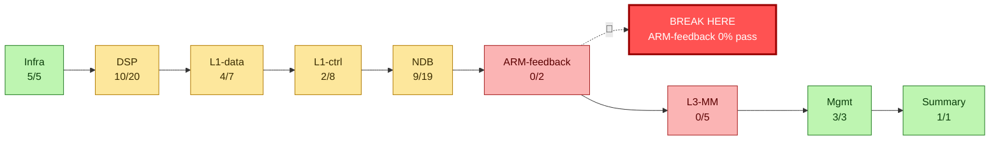

```mermaid
graph TD
  classDef pass    fill:#bef5b1,stroke:#1f7a1f,color:#0a3d0a;
  classDef partial fill:#fde79c,stroke:#b07a00,color:#3a2c00;
  classDef fail    fill:#fbb4b4,stroke:#a31a1a,color:#5a0000;
  classDef skip    fill:#e0e0e0,stroke:#6a6a6a,color:#333;
  classDef xfail   fill:#fde79c,stroke:#b07a00,color:#3a2c00;
  C_Injection["Injection<br/>9/21"]
  class C_Injection partial;
  C_Injection_L_ARM_feedback["ARM-feedback<br/>0/2"]
  class C_Injection_L_ARM_feedback fail;
  C_Injection --> C_Injection_L_ARM_feedback
  C_Injection_L_ARM_feedback --> T_001_test_efficacy_arm_reads_d_fb_det_1["test_efficacy_arm_reads_d_fb_det_1<br/>inject_efficacy<br/>3.15s"]
  class T_001_test_efficacy_arm_reads_d_fb_det_1 fail;
  C_Injection_L_ARM_feedback --> T_002_test_efficacy_arm_reads_a_cd["test_efficacy_arm_reads_a_cd<br/>inject_efficacy<br/>3.11s"]
  class T_002_test_efficacy_arm_reads_a_cd xfail;
  C_Injection_L_NDB["NDB<br/>9/19"]
  class C_Injection_L_NDB partial;
  C_Injection --> C_Injection_L_NDB
  C_Injection_L_NDB --> T_003_test_probe_ndb["test_probe_ndb<br/>inject_frames<br/>0.29s"]
  class T_003_test_probe_ndb pass;
  C_Injection_L_NDB --> T_004_test_clear_ndb["test_clear_ndb<br/>inject_frames<br/>0.29s"]
  class T_004_test_clear_ndb pass;
  C_Injection_L_NDB --> T_005_test_inject_fbsb_fb_found["test_inject_fbsb_fb_found<br/>inject_frames<br/>0.62s"]
  class T_005_test_inject_fbsb_fb_found fail;
  C_Injection_L_NDB --> T_006_test_inject_fbsb_sb_found["test_inject_fbsb_sb_found<br/>inject_frames<br/>0.54s"]
  class T_006_test_inject_fbsb_sb_found pass;
  C_Injection_L_NDB --> T_007_test_inject_si_1_["test_inject_si(1)<br/>inject_frames<br/>0.33s"]
  class T_007_test_inject_si_1_ fail;
  C_Injection_L_NDB --> T_008_test_inject_si_2_["test_inject_si(2)<br/>inject_frames<br/>0.33s"]
  class T_008_test_inject_si_2_ fail;
  C_Injection_L_NDB --> T_009_test_inject_si_3_["test_inject_si(3)<br/>inject_frames<br/>0.33s"]
  class T_009_test_inject_si_3_ fail;
  C_Injection_L_NDB --> T_010_test_inject_si_4_["test_inject_si(4)<br/>inject_frames<br/>0.33s"]
  class T_010_test_inject_si_4_ fail;
  C_Injection_L_NDB --> T_011_test_inject_si_5_["test_inject_si(5)<br/>inject_frames<br/>0.37s"]
  class T_011_test_inject_si_5_ fail;
  C_Injection_L_NDB --> T_012_test_inject_si_6_["test_inject_si(6)<br/>inject_frames<br/>0.33s"]
  class T_012_test_inject_si_6_ fail;
  C_Injection_L_NDB --> T_013_test_inject_a_cd_pattern_23B["test_inject_a_cd_pattern_23B<br/>inject_frames<br/>0.33s"]
  class T_013_test_inject_a_cd_pattern_23B fail;
  C_Injection_L_NDB --> T_014_test_inject_a_cd_pattern_30B["test_inject_a_cd_pattern_30B<br/>inject_frames<br/>0.33s"]
  class T_014_test_inject_a_cd_pattern_30B fail;
  C_Injection_L_NDB --> T_015_test_inject_a_cd_invalid_length["test_inject_a_cd_invalid_length<br/>inject_frames<br/>0.00s"]
  class T_015_test_inject_a_cd_invalid_length pass;
  C_Injection_L_NDB --> T_016_test_inject_d_task_5_0_["test_inject_d_task(5-0)<br/>inject_frames<br/>0.04s"]
  class T_016_test_inject_d_task_5_0_ pass;
  C_Injection_L_NDB --> T_017_test_inject_d_task_6_1_["test_inject_d_task(6-1)<br/>inject_frames<br/>0.04s"]
  class T_017_test_inject_d_task_6_1_ pass;
  C_Injection_L_NDB --> T_018_test_inject_d_task_24_0_["test_inject_d_task(24-0)<br/>inject_frames<br/>0.04s"]
  class T_018_test_inject_d_task_24_0_ pass;
  C_Injection_L_NDB --> T_019_test_inject_d_task_28_1_["test_inject_d_task(28-1)<br/>inject_frames<br/>0.04s"]
  class T_019_test_inject_d_task_28_1_ fail;
  C_Injection_L_NDB --> T_020_test_inject_d_burst_0_["test_inject_d_burst(0)<br/>inject_frames<br/>0.04s"]
  class T_020_test_inject_d_burst_0_ pass;
  C_Injection_L_NDB --> T_021_test_inject_d_burst_1_["test_inject_d_burst(1)<br/>inject_frames<br/>0.04s"]
  class T_021_test_inject_d_burst_1_ pass;
  C_Milestone["Milestone<br/>6/21"]
  class C_Milestone partial;
  C_Milestone_L_DSP["DSP<br/>4/10"]
  class C_Milestone_L_DSP partial;
  C_Milestone --> C_Milestone_L_DSP
  C_Milestone_L_DSP --> T_022_test_popm_decoder_active["test_popm_decoder_active<br/>milestone_dsp_decoder<br/>0.00s"]
  class T_022_test_popm_decoder_active pass;
  C_Milestone_L_DSP --> T_023_test_tier_a_decoder_fixes_present["test_tier_a_decoder_fixes_present<br/>milestone_dsp_decoder<br/>0.00s"]
  class T_023_test_tier_a_decoder_fixes_present pass;
  C_Milestone_L_DSP --> T_024_test_intm_dwell_no_regression["test_intm_dwell_no_regression<br/>milestone_dsp_decoder<br/>30.57s"]
  class T_024_test_intm_dwell_no_regression pass;
  C_Milestone_L_DSP --> T_025_test_dsp_throughput_5x["test_dsp_throughput_5x<br/>milestone_dsp_decoder<br/>0.13s"]
  class T_025_test_dsp_throughput_5x pass;
  C_Milestone_L_DSP --> T_026_test_fb0_att_nonzero["test_fb0_att_nonzero<br/>milestone_fb_det<br/>0.00s"]
  class T_026_test_fb0_att_nonzero xfail;
  C_Milestone_L_DSP --> T_027_test_synth_zero_path_active["test_synth_zero_path_active<br/>milestone_fb_det<br/>0.11s"]
  class T_027_test_synth_zero_path_active skip;
  C_Milestone_L_DSP --> T_028_test_c54x_interrupt_ex_called_nonzero["test_c54x_interrupt_ex_called_nonzero<br/>milestone_irq<br/>0.00s"]
  class T_028_test_c54x_interrupt_ex_called_nonzero xfail;
  C_Milestone_L_DSP --> T_029_test_isr_entered_implies_rete["test_isr_entered_implies_rete<br/>milestone_irq<br/>0.00s"]
  class T_029_test_isr_entered_implies_rete xfail;
  C_Milestone_L_DSP --> T_030_test_no_pending_irq_gated["test_no_pending_irq_gated<br/>milestone_irq<br/>0.00s"]
  class T_030_test_no_pending_irq_gated xfail;
  C_Milestone_L_DSP --> T_031_test_rxdoneflag_no_longer_blocks["test_rxdoneflag_no_longer_blocks<br/>milestone_dsp_decoder<br/>0.00s"]
  class T_031_test_rxdoneflag_no_longer_blocks xfail;
  C_Milestone_L_L1_ctrl["L1-ctrl<br/>0/2"]
  class C_Milestone_L_L1_ctrl fail;
  C_Milestone --> C_Milestone_L_L1_ctrl
  C_Milestone_L_L1_ctrl --> T_032_test_l1ctl_data_ind_received["test_l1ctl_data_ind_received<br/>milestone_l1ctl<br/>0.16s"]
  class T_032_test_l1ctl_data_ind_received fail;
  C_Milestone_L_L1_ctrl --> T_033_test_neigh_pm_req_response_unchanged["test_neigh_pm_req_response_unchanged<br/>milestone_l1ctl<br/>0.00s"]
  class T_033_test_neigh_pm_req_response_unchanged xfail;
  C_Milestone_L_L1_data["L1-data<br/>2/4"]
  class C_Milestone_L_L1_data partial;
  C_Milestone --> C_Milestone_L_L1_data
  C_Milestone_L_L1_data --> T_034_test_ar3_init_source_identified["test_ar3_init_source_identified<br/>milestone_bsp_dma<br/>0.01s"]
  class T_034_test_ar3_init_source_identified skip;
  C_Milestone_L_L1_data --> T_035_test_ar4_init_source_identified["test_ar4_init_source_identified<br/>milestone_bsp_dma<br/>0.01s"]
  class T_035_test_ar4_init_source_identified skip;
  C_Milestone_L_L1_data --> T_036_test_bsp_dma_target_matches_correlator_read_zone["test_bsp_dma_target_matches_correlator<br/>milestone_bsp_dma<br/>0.06s"]
  class T_036_test_bsp_dma_target_matches_correlator_read_zone pass;
  C_Milestone_L_L1_data --> T_037_test_no_d_fb_det_wr_site_anomaly["test_no_d_fb_det_wr_site_anomaly<br/>milestone_bsp_dma<br/>0.17s"]
  class T_037_test_no_d_fb_det_wr_site_anomaly pass;
  C_Milestone_L_L3_MM["L3-MM<br/>0/5"]
  class C_Milestone_L_L3_MM fail;
  C_Milestone --> C_Milestone_L_L3_MM
  C_Milestone_L_L3_MM --> T_038_test_rach_emitted["test_rach_emitted<br/>milestone_mm_lu<br/>0.00s"]
  class T_038_test_rach_emitted xfail;
  C_Milestone_L_L3_MM --> T_039_test_immediate_assignment_decoded["test_immediate_assignment_decoded<br/>milestone_mm_lu<br/>0.00s"]
  class T_039_test_immediate_assignment_decoded xfail;
  C_Milestone_L_L3_MM --> T_040_test_rr_sdcch_established["test_rr_sdcch_established<br/>milestone_mm_lu<br/>0.00s"]
  class T_040_test_rr_sdcch_established xfail;
  C_Milestone_L_L3_MM --> T_041_test_location_updating_request_sent["test_location_updating_request_sent<br/>milestone_mm_lu<br/>0.00s"]
  class T_041_test_location_updating_request_sent xfail;
  C_Milestone_L_L3_MM --> T_042_test_location_updating_accept_received["test_location_updating_accept_received<br/>milestone_mm_lu<br/>0.00s"]
  class T_042_test_location_updating_accept_received xfail;
  C_Runtime["Runtime<br/>19/28"]
  class C_Runtime partial;
  C_Runtime_L_DSP["DSP<br/>6/10"]
  class C_Runtime_L_DSP partial;
  C_Runtime --> C_Runtime_L_DSP
  C_Runtime_L_DSP --> T_043_test_no_wait_a21a_on_window["test_no_wait_a21a_on_window<br/>runtime_dsp<br/>0.07s"]
  class T_043_test_no_wait_a21a_on_window pass;
  C_Runtime_L_DSP --> T_044_test_no_enter_7740_dwell["test_no_enter_7740_dwell<br/>runtime_dsp<br/>0.08s"]
  class T_044_test_no_enter_7740_dwell pass;
  C_Runtime_L_DSP --> T_045_test_intm_reaches_zero["test_intm_reaches_zero<br/>runtime_dsp<br/>0.07s"]
  class T_045_test_intm_reaches_zero pass;
  C_Runtime_L_DSP --> T_046_test_dsp_throughput_above_threshold["test_dsp_throughput_above_threshold<br/>runtime_dsp<br/>0.07s"]
  class T_046_test_dsp_throughput_above_threshold pass;
  C_Runtime_L_DSP --> T_047_test_d_fb_det_pattern_unchanged["test_d_fb_det_pattern_unchanged<br/>runtime_dsp<br/>0.06s"]
  class T_047_test_d_fb_det_pattern_unchanged xfail;
  C_Runtime_L_DSP --> T_048_test_bsp_daram_write_distribution["test_bsp_daram_write_distribution<br/>runtime_dsp<br/>0.08s"]
  class T_048_test_bsp_daram_write_distribution pass;
  C_Runtime_L_DSP --> T_049_test_d_fb_det_data_no_longer_zero["test_d_fb_det_data_no_longer_zero<br/>runtime_dsp<br/>0.08s"]
  class T_049_test_d_fb_det_data_no_longer_zero pass;
  C_Runtime_L_DSP --> T_050_test_interrupt_ex_called_counter_exposed["test_interrupt_ex_called_counter_expos<br/>runtime_irq<br/>0.06s"]
  class T_050_test_interrupt_ex_called_counter_exposed xfail;
  C_Runtime_L_DSP --> T_051_test_isr_entered_matches_rete["test_isr_entered_matches_rete<br/>runtime_irq<br/>0.13s"]
  class T_051_test_isr_entered_matches_rete xfail;
  C_Runtime_L_DSP --> T_052_test_no_pending_irq_gating["test_no_pending_irq_gating<br/>runtime_irq<br/>0.16s"]
  class T_052_test_no_pending_irq_gating xfail;
  C_Runtime_L_Infra["Infra<br/>5/5"]
  class C_Runtime_L_Infra pass;
  C_Runtime --> C_Runtime_L_Infra
  C_Runtime_L_Infra --> T_053_test_all_expected_processes_present["test_all_expected_processes_present<br/>runtime_health<br/>0.12s"]
  class T_053_test_all_expected_processes_present pass;
  C_Runtime_L_Infra --> T_054_test_no_zombie_or_defunct["test_no_zombie_or_defunct<br/>runtime_health<br/>0.05s"]
  class T_054_test_no_zombie_or_defunct pass;
  C_Runtime_L_Infra --> T_055_test_qemu_log_is_fresh["test_qemu_log_is_fresh<br/>runtime_health<br/>3.11s"]
  class T_055_test_qemu_log_is_fresh pass;
  C_Runtime_L_Infra --> T_056_test_mobile_pcap_growing["test_mobile_pcap_growing<br/>runtime_health<br/>10.00s"]
  class T_056_test_mobile_pcap_growing pass;
  C_Runtime_L_Infra --> T_057_test_volumes_mounted["test_volumes_mounted<br/>runtime_health<br/>0.08s"]
  class T_057_test_volumes_mounted pass;
  C_Runtime_L_L1_ctrl["L1-ctrl<br/>2/6"]
  class C_Runtime_L_L1_ctrl partial;
  C_Runtime --> C_Runtime_L_L1_ctrl
  C_Runtime_L_L1_ctrl --> T_058_test_neigh_pm_req_loop_alive["test_neigh_pm_req_loop_alive<br/>runtime_l1ctl<br/>0.19s"]
  class T_058_test_neigh_pm_req_loop_alive pass;
  C_Runtime_L_L1_ctrl --> T_059_test_l1ctl_data_ind_received["test_l1ctl_data_ind_received<br/>runtime_l1ctl<br/>0.17s"]
  class T_059_test_l1ctl_data_ind_received fail;
  C_Runtime_L_L1_ctrl --> T_060_test_a_cd_writes_nonzero["test_a_cd_writes_nonzero<br/>runtime_l1ctl<br/>0.09s"]
  class T_060_test_a_cd_writes_nonzero pass;
  C_Runtime_L_L1_ctrl --> T_061_test_a_cd_write_pc_includes_ccch_demod["test_a_cd_write_pc_includes_ccch_demod<br/>runtime_l1ctl<br/>0.19s"]
  class T_061_test_a_cd_write_pc_includes_ccch_demod xfail;
  C_Runtime_L_L1_ctrl --> T_062_test_l1ctl_data_ind_rate_vs_alc["test_l1ctl_data_ind_rate_vs_alc<br/>runtime_l1ctl<br/>0.24s"]
  class T_062_test_l1ctl_data_ind_rate_vs_alc fail;
  C_Runtime_L_L1_ctrl --> T_063_test_rach_attempted["test_rach_attempted<br/>runtime_l1ctl<br/>0.00s"]
  class T_063_test_rach_attempted xfail;
  C_Runtime_L_L1_data["L1-data<br/>2/3"]
  class C_Runtime_L_L1_data partial;
  C_Runtime --> C_Runtime_L_L1_data
  C_Runtime_L_L1_data --> T_064_test_bridge_log_shows_traffic["test_bridge_log_shows_traffic<br/>runtime_bridge<br/>0.05s"]
  class T_064_test_bridge_log_shows_traffic pass;
  C_Runtime_L_L1_data --> T_065_test_bridge_fn_drift_under_threshold["test_bridge_fn_drift_under_threshold<br/>runtime_bridge<br/>0.00s"]
  class T_065_test_bridge_fn_drift_under_threshold xfail;
  C_Runtime_L_L1_data --> T_066_test_bridge_dl_lookahead_respected["test_bridge_dl_lookahead_respected<br/>runtime_bridge<br/>0.05s"]
  class T_066_test_bridge_dl_lookahead_respected pass;
  C_Runtime_L_Mgmt["Mgmt<br/>3/3"]
  class C_Runtime_L_Mgmt pass;
  C_Runtime --> C_Runtime_L_Mgmt
  C_Runtime_L_Mgmt --> T_067_test_mobile_vty_reachable["test_mobile_vty_reachable<br/>runtime_vty<br/>1.61s"]
  class T_067_test_mobile_vty_reachable pass;
  C_Runtime_L_Mgmt --> T_068_test_mobile_imsi_loaded["test_mobile_imsi_loaded<br/>runtime_vty<br/>1.62s"]
  class T_068_test_mobile_imsi_loaded pass;
  C_Runtime_L_Mgmt --> T_069_test_mobile_mm_state_is_null_or_idle["test_mobile_mm_state_is_null_or_idle<br/>runtime_vty<br/>1.73s"]
  class T_069_test_mobile_mm_state_is_null_or_idle pass;
  C_Runtime_L_Summary["Summary<br/>1/1"]
  class C_Runtime_L_Summary pass;
  C_Runtime --> C_Runtime_L_Summary
  C_Runtime_L_Summary --> T_070_test_run_summary_snapshot["test_run_summary_snapshot<br/>runtime_summary<br/>30.68s"]
  class T_070_test_run_summary_snapshot pass;
```

## `QUICK_START.md` {#f-quick-start-md}

::: {.file-meta}
[.md]{.tag} 619 lignes - 34KB
:::

````{.markdown .numberLines filename="QUICK_START.md"}
# QUICK START — QEMU-Calypso

Lancer et **vérifier**. Ce fichier ne décrit que ce qui est mesuré aujourd'hui
(2026-07-30). Chaque affirmation nomme son instrument. Vérité de fond :
[`hw/arm/calypso/doc/ETAT_ACTUEL.md`](hw/arm/calypso/doc/ETAT_ACTUEL.md).

Distinction employée partout : **MESURE** (relevé, avec sa commande) /
**HYPOTHÈSE** (déduite du code, pas encore relevée) / **INVALIDE** (affirmation
retirée, ne pas réintroduire).

## Les profils, en une ligne chacun

`CALYPSO_MODE=…` — un profil = **qui fait quoi**, et rien d'autre :

| profil | FB / SB | SI | à quoi il sert |
|---|---|---|---|
| `shunt_legit` | hôte | gr-gsm | la pile de bout en bout : camp, LU, SMS (§2) |
| `native_twl` | hôte / TWL | **DSP** | **le DSP traite-t-il le SI ?** (§3bis) |
| `native` | DSP | DSP | la vérité sur l'acquisition (§3) |
| `native_helped` | DSP, entrée reroutée | DSP | observer le corrélateur — **sous béquille** |
| `empty` | rien de posé | rien de posé | construire un banc gate par gate |

Un profil ne pose que des `:=` : **la CLI garde toujours le dernier mot**, et
c'est le **manifeste** qui dit ce que vous avez réellement obtenu (§5).

---

## 1. Prérequis

1. Tout tourne **dans le conteneur `osmo-operator-1`** ; on y entre par
   `docker exec -it osmo-operator-1 bash`. Depuis l'hôte, tout accès prend la
   forme `docker exec osmo-operator-1 bash -lc '...'`.
2. Le **runtime est `${QEMU_TREE}`** (build + `calypso.env` + `run.sh` +
   `start-clean.sh`). `${GSM_ROOT}/qemu-calypso` est un **overlay mort au
   runtime** : n'y écrire jamais (§5).
3. Build : `ninja -C build qemu-system-arm` puis `./make-overlay.sh` (back-port
   du working tree vers l'overlay git ; ne change rien au runtime).

```bash
docker exec osmo-operator-1 bash -lc '
  cd ${QEMU_TREE} &&
  ninja -C build qemu-system-arm &&
  ./make-overlay.sh
'
```

Vérifier **quel binaire tourne** — `BUILD-STAMP` **ment** : la macro
`__DATE__/__TIME__` vit dans `calypso_dsp_shunt.c:107` et date **son propre**
translation-unit, pas celui qu'on vient de modifier. Instrument correct = mtime
du `.o` de l'unité modifiée + `lstart` du process :

```bash
docker exec osmo-operator-1 bash -lc '
  cd ${QEMU_TREE} &&
  stat -c "%y %n" build/qemu-system-arm &&
  find build -name "*calypso_c54x*.o" -printf "%T+ %p\n" &&
  ps -eo pid,lstart,cmd | grep [q]emu-system-arm
'
```

---

## 2. Le mode qui MARCHE : `SHUNT_LEGIT`

C'est le mode fiable : il campe, fait la Location Update et les SMS. Le FBSB y
est produit **côté hôte** (détecteur FCCH cohérence+dφ + gr-gsm) et présenté à
l'ARM par intercept de lecture (`calypso_dsp_shunt.c:1463-1490`, appelé depuis
`calypso_trx.c:297`).

### Lancer

```bash
docker exec -it osmo-operator-1 bash -lc '
  cd ${QEMU_TREE} && CALYPSO_SHUNT_LEGIT=1 ./start-clean.sh
'
```

Variantes utiles (mêmes vérifications) :

| But | Commande |
|---|---|
| Injections nommées une par une, sans le parapluie | `CALYPSO_SHUNT_NO_LEGIT=1 ./start-clean.sh` |
| Camp **et** c54x qui tourne en parallèle (plus réaliste, plus flaky) | `CALYPSO_SHUNT_LEGIT=DSP,NO_CANNED ./start-clean.sh` |

`CALYPSO_SHUNT_LEGIT` est une **value-list résolue dans QEMU** par un
constructeur exécuté avant `main()` (`calypso_dsp_shunt.c:86-105`) : `DSP` pose
`CALYPSO_DSP_RUN_C54X=1` avec `overwrite=1`. Conséquence : `env | grep
RUN_C54X` côté shell **ment**. L'instrument est le manifeste imprimé par ce même
constructeur, ou l'environnement réel du process :

```bash
docker exec osmo-operator-1 bash -lc 'grep -a "calypso-manifest]" /root/qemu.log | head -40'
docker exec osmo-operator-1 bash -lc 'tr "\0" "\n" < /proc/$(pgrep -f qemu-system-arm | head -1)/environ | grep ^CALYPSO_'
```

### Les 4 vérifications

```bash
# V1 — le FBSB hôte détecte (coh proche de 1, det=1)
docker exec osmo-operator-1 bash -lc 'grep -a "REAL-FB" /root/qemu.log | tail -3'

# V2 — le mobile campe : SI décodés + BSIC réel (7), pas BSIC=0
docker exec osmo-operator-1 bash -lc '
  grep -ac sysinfo /root/mobile.log ;
  grep -aoE "BSIC=[0-9]+" /root/mobile.log | sort | uniq -c ;
  grep -a "MON: f=" /root/mobile.log | tail -2'

# V3 — Location Update acceptée + TMSI attribué
docker exec osmo-operator-1 bash -lc '
  grep -aicE "LOCATION UPDATING ACCEPT" /root/mobile.log ;
  grep -aiE "TMSI|TMSI REALLOC" /root/mobile.log | tail -5 ;
  grep -ac T3211 /root/mobile.log'

# V4 — SMS
docker exec osmo-operator-1 bash -lc 'grep -aiE "sms|SMSC" /root/smsc-op1.log | tail -10'
```

| # | Ce qu'on doit voir | Valeur de référence **mesurée** | Instrument |
|---|---|---|---|
| V1 | `REAL-FB fn=… coh=0.999 dphi=0.387 det=1 SNR=0x735b AFC=-186` | 280 lignes `det=1` sur les **300 premières lignes loguées** | `grep "REAL-FB" /root/qemu.log` |
| V2 | `sysinfo` non nul, `BSIC=7`, `MON: f=… -47 dBm` | 20 SI décodés ; BSIC **7** (le vrai) ; rxlev −47/−56 dBm | `/root/mobile.log` |
| V3 | `LOCATION UPDATING ACCEPT` ≥ 1, `lai=001-01-1`, TMSI `0x3dbeb85f`, `TMSI REALLOC COMPLETE` | RACH→ACCEPT en **2,70 s**, 0 retry T3211 (run A5) | `/root/mobile.log` |
| V4 | MO et MT délivrés | DONE en `SHUNT_LEGIT` et `SHUNT_NO_LEGIT` ; **flaky** en `DSP,NO_CANNED` | `/root/smsc-op1.log` |

**Piège de comptage sur V1.** Le logger `REAL-FB` est plafonné
(`calypso_dsp_shunt.c:1670` : `rfl < 20 || (det && rfl < 300)`). « 280/300 »
est le contenu des 300 premières **lignes loguées**, pas un taux de détection
sur tout le run. Ne pas l'écrire autrement.

**Réserve ouverte sur V3.** `doc/SHUNT_LEGIT_ADDRESS_MAP.md` §9 (26/07,
antérieur au fix sous-voie SDCCH/8) mesure « LU ACCEPT intermittent, ~1 succès
pour 19 retries T3211 », alors que `run_results.md` run A5 mesure « 2,70 s, 0
retry » (n=2). **Non départagé.** Pour trancher : rejouer 5 runs `SHUNT_LEGIT`
consécutifs et relever `grep -c T3211 /root/mobile.log`.

**Oracle réseau.** Le cœur Osmocom est prouvé bon indépendamment de QEMU : la
pile témoin `bts1` (mobile osmocom-bb sur `trxcon` + `fake_trx`) obtient un LU
ACCEPT sur le même cœur — `grep -c "LOCATION UPDATING ACCEPT"
/root/mobile-bts1.log` = 1. Tout échec côté Calypso est donc imputable à
l'émulation.

---

## 3. Le mode NATIF, en cours d'investigation

Objectif : que ce soit le **DSP c54x** qui produise `d_fb_det`, au lieu du
détecteur hôte. **Ce mode ne campe pas** aujourd'hui.

### Run de référence (chaîne d'entrée mesurée correcte)

```bash
docker exec -it osmo-operator-1 bash -lc '
  cd ${QEMU_TREE} && rm -f /dev/shm/daram_2a00.cfile /dev/shm/bursts.cfile &&
  CALYPSO_NATIVE_HELPED=1 CALYPSO_FB_CORR_ENTRY=0x94f5 CALYPSO_DSP_RUN_C54X=1 \
  CALYPSO_BSP_DARAM_FORCE=1 CALYPSO_BSP_DARAM_ADDR=0x4c00 CALYPSO_BSP_DARAM_LEN=296 \
  CALYPSO_BSP_IQ_DECIM=4 CALYPSO_SHUNT_REAL_FB=1 CALYPSO_DEBUG=BSP ./start-clean.sh
'
```

Deux réglages de ce run à connaître avant d'interpréter quoi que ce soit :

- `CALYPSO_SHUNT_REAL_FB=1` **masque le natif à l'observateur ARM** : l'intercept
  de lecture sert le `d_fb_det` **hôte** sur l'offset `0x01F0`. La seule cellule
  qui mesure le natif est `data[0x08f8]`, imprimée par la ligne `DETECTOR-RUN`.
  Pour un natif nu : `CALYPSO_SHUNT_REAL_FB=0 CALYPSO_DECAN=0`.
- `CALYPSO_DEBUG=BSP` est **obligatoire** pour que les sondes BSP parlent. Sans
  lui, `DMA fn=` / `BURST fn=` sont absents **parce que la sonde est muette**,
  pas parce que le BSP est inerte (§5).

### Vérifications, dans l'ordre

```bash
# N1 — les 3 gates BSP sont levées, aucun burst jeté
docker exec osmo-operator-1 bash -lc '
  grep -ac "deliver: gate shunt LEVE" /root/qemu.log ;
  grep -ac "dropping fn=" /root/qemu.log ;
  grep -a "DMA fn=" /root/qemu.log | tail -2'

# N2 — ce qui est déposé en DARAM est bien de la FCCH à 1 SPS
docker exec osmo-operator-1 bash -lc '
  cd ${QEMU_TREE}/tools && python3 corr_iq.py --src bursts | tail -8'

# N3 — ce que le détecteur LIT réellement (dump interne, non-racy)
#      exige CALYPSO_DARAM_DUMP=1 dans le run
docker exec osmo-operator-1 bash -lc '
  cd ${QEMU_TREE}/tools && python3 corr_iq.py --src ddump | tail -6 ;
  grep -a "DARAM-SANITY" /root/qemu.log | tail -3'

# N4 — le résultat natif
docker exec osmo-operator-1 bash -lc '
  grep -a "DETECTOR-RUN" /root/qemu.log | tail -2 ;
  grep -a "DETECTOR-RUN" /root/qemu.log | grep -vc "d_fb_det\[08f8\]=0x0000"'
```

| # | Question | ATTENDU | ACTUEL (mesuré) |
|---|---|---|---|
| N1 | les bursts atteignent-ils `data[]` ? | `deliver: gate shunt LEVE (rxw=1)` présent, `dropping fn=` = **0** | **conforme** : gate levée, 0 drop. *(Les 3 gates sont `calypso_bsp.c:474`, `:997`, et `:1359` = la LIVRAISON, alignée le 28/07 sur `DARAM_FORCE` ; auparavant elle ne connaissait que `TPU_RX_WIRE`, d'où 2 verrous ouverts sur 3 et « rien n'arrive ».)* |
| N2 | le feed est-il conforme ? | `VERDICT: FCCH @1SPS PROPRE (dphi=+1.00x pi/2)` | **conforme** : `coh=0.998`, `rms=3.25e4`, `\|DC\|=379`, `zeros=0%`, FFT `+67 708 Hz` |
| N3 | la SORTIE du démod est-elle exploitable ? | `coh > 0.90`, `dphi ≈ +1.571` | **KO** : DC quasi pur et **figé** — `\|DC\|=2.86e4` pour `rms=2.94e4`, `dphi=+0.004` ; cellule témoin invariante sur 157–203 bursts (`0x9fb8@0x2a00=0x0000`, `0x9fe2@0x2a00=0x52ed`). Identique avec `DECIM=1` **et** `DECIM=4` |
| N4 | `d_fb_det` passe-t-il à 1 ? | ≥ 1 ligne `DETECTOR-RUN` avec `d_fb_det[08f8]` ≠ `0x0000` | **KO** : `0` sur 3 600 exécutions (run 44 s) et sur 32 200 (run 437 s). Le détecteur **est armé** : `d_fb_mode[08f9]=0x0001` |

Autrement dit : **entrée vivante, sortie morte**. C'est N3 (et non N4) qui est le
critère de tranche — `d_fb_det` est trop en aval pour arbitrer un correctif.

### État des pistes

| Piste | Statut |
|---|---|
| Décodage d'opcode `0x1800/1A00/1C00/1E00` (`AND/OR/XOR/SUBC`) exécuté comme un `LD` → `T=31` → `LD Smem,TS` décale de 31 → `A=0x80000000` saturé → sortie indépendante des opérandes | **corrigé en source** (`calypso_c54x.c:9365-9389`), **non validé au run** : premier run post-correctif → `d_fb_det` toujours 0. Re-mesurer par N3, pas par N4 |
| `DSP Error Status: 32` (`DMA_PEND`) permanent — 723 occurrences | ouvert. **HYPOTHÈSE** : le BSP écrit `data[]` en direct sans passer par la machinerie DMA, le drapeau n'est jamais effacé. `grep -oE "DSP Error Status: [0-9]+" /root/osmocon.log \| sort \| uniq -c` |
| Le démod lit en **stride 5** (`0x4c00/05/0a/0f/15/1a`, polyphase 6 taps) alors que le BSP dépose 296 int16 contigus | ouvert, non tranché : le stride peut être correct et le **layout de remplissage** faux |
| Même avec `d_fb_det=1`, le natif ne camperait pas : ni SCH ni SI (`dispatch_allc`=0, `feed_agch`=0, `sb_valid`=0) | connu. Ordre du plan : FB → SCH → SI |

---

## 3bis. `native_twl` — la question du SI, sans attendre le FB/SB

Le FB/SB natif n'arrive pas (§3, critère N4 = 0 sur tous les runs depuis le
28/07). Ce profil retourne le problème au lieu de l'attendre : **on donne la
synchro au DSP, et on regarde s'il traite le SI.** C'est la dernière ligne du
tableau des pistes de §3 (« ni SCH ni SI »), prise par l'autre bout.

| profil | FB / SB (acquisition) | SI (décodage) | campe ? |
|---|---|---|---|
| `shunt_legit` | hôte | **gr-gsm** — le DSP est shunté | oui |
| `native_twl` | hôte / TWL | **DSP** | oui (synchro fournie) |
| `native` | DSP | DSP | non, aujourd'hui |

**Règle de frontière** : *si les SI viennent de gr-gsm, ce n'est pas ce mode,
c'est `shunt_legit`.* Les deux seules portes par lesquelles un bloc gr-gsm entre
dans `a_cd` sont `CALYPSO_SHUNT_FEED_SI` et `CALYPSO_INJECT_ACD` — le profil les
pose à 0, et `run_modules/01-profil.sh` proteste si on les rallume.

⚠️ **BÉQUILLE assumée** : FB et SB sont **substitués** par l'hôte
(`SHUNT_REAL_FB` + `INJECT_SB` + le transport `SHUNT_PUBLISH_FB`). Ce qu'elle
masque : l'incapacité actuelle du corrélateur natif à publier `d_fb_det` — donc
`data[0x08f8]` **n'est pas un verdict dans ce mode**, et ne doit jamais être cité
comme tel ; le seul mode qui juge l'acquisition est `native` (§3). À retirer
quand `native` sort un `d_fb_det` positif : ce profil se dissout alors dans
`native`.

### Lancer

```bash
docker exec -it osmo-operator-1 bash -lc '
  cd /opt/GSM/osmo-qemu-calypso &&
  CALYPSO_MODE=native_twl CALYPSO_DEBUG=BSP,A_CD-BY-BURST ./run.sh --restart'
```

Le profil pose lui-même, côté DSP : `DSP_RUN_C54X=1 DSP_SHUNT=0
FRAME_IT_NATIVE=1 TPU_DSP_FRAME_IT=1 BSP_DARAM_FORCE=1 BSP_DARAM_ADDR=0x4c00
BSP_DARAM_LEN=296 BSP_IQ_DECIM=4` ; côté synchro : `SHUNT_REAL_FB=1 INJECT_SB=1
SHUNT_PUBLISH_FB=1 SHUNT_NO_GRGSM=0 SHUNT_NO_CANNED=1` ; côté SI : les cinq
gates d'injection à `0` ; et l'instrument `WATCH_ACD=1`. Vérifiez-le **au
manifeste**, jamais à la ligne de commande (§5).

`CALYPSO_DEBUG` est obligatoire pour que les sondes BSP et les totaux `a_cd`
parlent : leur silence ne veut alors rien dire (§5).

### Les 3 vérifications, dans l'ordre

```bash
# T1 — la synchro est bien fournie : le mobile se cale sur un BSIC réel
docker exec osmo-operator-1 bash -lc '
  grep -a "BSIC" /root/qemu.log | tail -3 ;
  grep -a "ALLC task=24" /root/qemu.log'

# T2 — le DSP est alimenté en bursts, aucun jeté
docker exec osmo-operator-1 bash -lc '
  grep -ac "deliver: gate shunt LEVE" /root/qemu.log ;
  grep -ac "dropping fn=" /root/qemu.log'

# T3 — LE critère du mode : le DSP écrit-il a_cd de son propre opcode ?
docker exec osmo-operator-1 bash -lc '
  grep -a "WATCH-ACD" /root/qemu.log | head -10 ;
  grep -a "A_CD-BY-BURST" /root/qemu.log | tail -2'

# T3bis — contrôle d'honnêteté : AUCUNE injection au manifeste
docker exec osmo-operator-1 bash -lc '
  grep -aoE "CALYPSO_(SHUNT_FEED_SI|INJECT_ACD)=[0-9]" /root/qemu.log | sort -u'
```

| # | Question | Critère de décision, posé d'avance |
|---|---|---|
| T1 | la synchro est-elle fournie ? | un `BSIC` ≠ 0. Sinon le mode n'a pas démarré et **rien d'autre ne se lit** — on ne conclut pas sur le SI d'un DSP non synchronisé. `ALLC task=24` dit en plus que l'ARM a confié le CCCH au DSP (`calypso_fbsb.c:85`) |
| T2 | le DSP est-il alimenté ? | `deliver: gate shunt LEVE` > 0 **et** `dropping fn=` = 0 |
| T3 | **le DSP traite-t-il le SI ?** | ≥ 1 ligne `WATCH-ACD DSP-opcode-write data[0x09d2..0x09e0]` (`calypso_c54x.c:2563`, écriture **opcode**, plafonnée à 60). **Zéro est une réponse — négative — pas un échec de run.** |
| T3bis | la réponse est-elle honnête ? | `FEED_SI=0` **et** `INJECT_ACD=0` au manifeste. Si l'un vaut 1, T3 est un artefact : c'est gr-gsm qui a rempli `a_cd` (`calypso_dsp_shunt.c:2249`) |

`a_cd` = `data[0x09D0..0x09DE]`. Une écriture **opcode** dans cette plage est du
DSP ; une écriture directe du shunt n'en est pas — c'est précisément ce que
`WATCH-ACD` distingue, et pourquoi la sonde a été écrite le 27/07.

---
## 4. Boîte à outils de diagnostic

### 4.1 Sondes (toutes gatées par variable d'environnement, **défaut OFF**)

Trois familles seulement dans ce tableau : **M** = mesure pure (lecture seule,
le run est identique sans elle) ; **W** = wire (écrit une donnée que le matériel
produit mais que l'émulation ne propageait pas) ; **B** = béquille (falsifie un
état — invalide toute conclusion en aval).

| Variable | T | Ce qu'elle donne |
|---|---|---|
| `CALYPSO_DEBUG=BSP` | M | logs du BSP : `DMA fn=`, `DARAM after write`, `RX tn= fn= delta=`. **Sans elle, les sondes BSP sont muettes** |
| `CALYPSO_WATCH_9F00_RD` | M | adresses **lues** par l'étage démod (PC `0x9f00..0x9fb8`). **À lancer avant tout feed** : c'est elle qui dit où feeder |
| `CALYPSO_RMAP` (+`_PCLO`/`_PCHI`) | M | carte **agrégée** des adresses lues par une plage de PC |
| `CALYPSO_WMAP` (+`_LO`/`_HI`/`_LO2`/`_HI2`) | M | carte **agrégée** des **écrivains** d'une plage `data[]`, avec **heartbeat** (témoin de saturation) |
| `CALYPSO_DEMODIO` (+`_AFTER`/`_PCLO`/`_PCHI`) | M | corrèle lectures/écritures + `A`/`B`/`T`/`AR` sur une fenêtre de PC. C'est elle qui a exposé `T=31` |
| `CALYPSO_DARAM_DUMP` | M | dump binaire **interne, non-racy** du buffer lu par le détecteur → `/dev/shm/daram_2a00.cfile`, filtré sur `d_fb_mode≠0` |
| `CALYPSO_B2IN` | M | énergie du ring `FB_STREAM` (max\|I\|, max\|Q\|, fenêtre 296) |
| `CALYPSO_B2` / `_B2SEQ` / `_B2AR` | M | à `0x9ac0` : \|A\|/\|B\| ; 16 paires (I,Q) ; `AR2..AR5` avec verdict `IN`/`OOB` |
| `CALYPSO_WATCH_RESULT` | M | écritures `0x08F8..0x08FD` nommées (`d_fb_det`, `d_fb_mode`, TOA, PM, ANGLE, SNR) |
| `CALYPSO_FBDET_API` | M | le résultat FB au **format natif** `api_ram[0xF8..0xFD]` — c'est ce que lit le firmware, **pas** `data[]` |
| `CALYPSO_TRACEFROM` (+`_N`) | M | dump d'opcodes + trace de flux depuis un PC ; marque `0xa076` (noyau MAC), `0x79e4` (publisher `d_fb_det`), `0x9ac0` (détecteur) |
| `CALYPSO_ORPHAN` | M | shadow-stack : appariement push/pop, **nomme** le retour orphelin |
| `CALYPSO_BSP_DARAM_FORCE` | W | leve les 3 gates BSP (`calypso_bsp.c:474`, `:997`, `:1359`) — les trois testent **aussi** `CALYPSO_DSP_RUN_C54X=1` (`:470`, `:993`, `:1352`), poser les deux. **Obligatoire** pour nourrir le correlateur natif |
| `CALYPSO_ARM2DSP_BGEN` | W | l'ARM pose `d_background_enable/_state` → sortie de la wait-loop DSP |
| `CALYPSO_FB_ENERGY` / `_FB_CORR_ENTRY` | B | reroute la `CALA @0xb01e` vers le corrélateur énergie. `FB_ENERGY=0` = **chemin natif pur** (test décisif) |
| `CALYPSO_FB_STREAM` / `CALYPSO_FB_IQ_DARAM` | B | deux façons de feeder le démod (intercept de lecture / écriture DARAM directe) |
| `CALYPSO_SHUNT_REAL_FB`, `CALYPSO_DECAN`, `CALYPSO_INJECT_*`, `CALYPSO_FORCE_*` | B | injections. Toute conclusion FB tirée avec l'une d'elles est nulle |

**Sémantique des gates** — c'est la source d'erreur n°1 quand on désactive une
variable :

| Idiome dans le code | `VAR=0` | Désactivation correcte |
|---|---|---|
| `getenv(X) ? 1 : 0` (majorité des sondes) | **reste ON** | `unset X` |
| `atoi(e) > 0` / `*e == '1'` | OFF | `X=0` |
| `!e \|\| *e != '0'` (défaut **ON**) | OFF | `X=0` |
| `getenv(X_OFF) ? 0 : 1` (défaut ON) | sans effet | poser `X_OFF=1` |

### 4.2 `tools/corr_iq.py` — l'instrument de référence de la chaîne I/Q

Métrique : `coh = |Σ iq[k+1]·conj(iq[k])| / Σ|iq[k+1]||iq[k]|` (1.0 = ton pur
FCCH, ~0 = bruit ou GMSK) et `dphi` exprimé **en unités de π/2**.

```bash
docker exec osmo-operator-1 bash -lc 'cd ${QEMU_TREE}/tools && python3 corr_iq.py --src bursts'
docker exec osmo-operator-1 bash -lc 'cd ${QEMU_TREE}/tools && python3 corr_iq.py --src ddump'
docker exec osmo-operator-1 bash -lc 'cd ${QEMU_TREE}/tools && python3 corr_iq.py --src shunt'
docker exec osmo-operator-1 bash -lc 'cd ${QEMU_TREE}/tools && python3 corr_iq.py --src all'
```

| `--src` | Fichier | Ce que ça mesure | Confiance |
|---|---|---|---|
| `shunt` | `/dev/shm/dsp_iq.cfile` (fc32) | I/Q d'entrée du shunt — **référence propre** amont | fiable |
| `bursts` | `/dev/shm/bursts.cfile` (IQ16, `BSP_DUMP_RX_FILE`) | ce que le BSP **dépose** en DARAM, avec `fn`/`tn` | fiable |
| `rxdump` | `/tmp/iq_rx_*.bin` (`CALYPSO_IQDUMP`) | idem, en fichiers séparés par burst | fiable |
| `ddump` | `/dev/shm/daram_2a00.cfile` (`CALYPSO_DARAM_DUMP`) | **le même buffer, dumpé de l'intérieur au moment où le détecteur le lit** — atomique | **la mesure de la destination** |
| `daram` | `0x2a00` via le monitor QMP | best-effort | **racy et hors fenêtre API RAM — à éviter** |

| `dphi / (π/2)` | Interprétation |
|---|---|
| `+1.00` | FCCH @1 SPS — ce que le corrélateur attend |
| `+0.25` | FCCH @4 SPS non décimé → décimer ÷4 (`CALYPSO_BSP_IQ_DECIM=4`) |
| négatif | miroir spectral → `CALYPSO_DL_IQ_CONJ=1` |

**Le piège des lectures hors fenêtre API RAM.** Toute mesure prise par le
monitor QMP (`--src daram`, lecture d'une adresse physique) tombe **hors** de la
fenêtre API RAM et est **racy**. C'est cette voie qui a produit l'affirmation
**INVALIDE** « `0x4c00` est gelé » : la lecture avait été faite à
`0xFFD08800`. Sa signature est reconnaissable — **peak exactement `0x8000` et
54 % de zéros**. Les mesures valides se prennent **à l'intérieur** : `BSP_LOG`
au point d'écriture, ou le dump interne `ddump`.

**Hygiène de fichier.** `/dev/shm/*.cfile` survit aux runs. Comparer
systématiquement leur mtime au `lstart` du process avant d'interpréter, et les
supprimer **avant** le run :

```bash
docker exec osmo-operator-1 bash -lc '
  ls -l --time-style=+%H:%M:%S /dev/shm/*.cfile ;
  ps -eo lstart,cmd | grep [q]emu-system-arm'
```

---

### 4.3 Les captures I/Q sont ON par défaut dans tous les modes (2026-07-30)

Motif : `corr_iq.py` ne sert à rien si le run n'a rien écrit, et on ne s'en
aperçoit qu'après. Sauf en `CALYPSO_MODE=empty`, tout run produit donc :

| fichier | posé par | plafond | `corr_iq --src` |
|---|---|---|---|
| `/dev/shm/dsp_iq.cfile` | défaut C (`calypso_dsp_shunt.c:1637`) | non | `shunt` |
| `/dev/shm/bursts.cfile` | `BSP_DUMP_RX_FILE` (`calypso.env:36`) | **non** — ~600 o/burst FCCH | `bursts` |
| `/tmp/iq_rx_*.bin` | `CALYPSO_IQDUMP` | 24 fichiers | `rxdump` |
| `/dev/shm/daram_2a00.cfile` | `CALYPSO_DARAM_DUMP` | 200 captures | `ddump` — ⚠️ **conditionnel, voir ci-dessous** |
| `/dev/shm/dsp_iq_fn.cfile` | `CALYPSO_SHUNT_IQ_CFILE2` | **512 Mo** | — (voir 4.4) |

Le shunt s'arme même en natif (sur `CALYPSO_DSP=c54x`), donc `dsp_iq.cfile`
existe dans tous les modes sans qu'on pose quoi que ce soit.

⚠️ `BSP_DUMP_RX_FILE` ne porte pas le préfixe `CALYPSO_` : il **n'apparaît pas au
manifeste**. C'est la seule de ces variables dont le manifeste ne dit rien.

⚠️ **`daram_2a00.cfile` fait souvent 0 ko, et ce n'est pas un bug d'activation.**
Mesuré le 30/07 en `native_twl` : la sonde est bien armée (`[c54x] DARAM-DUMP
armed pc=0x9ac0 max=200 -> … (ok)` — c'est ce fopen qui crée le fichier vide),
mais elle n'écrit que si **deux** conditions tombent, et aucune des deux n'est
garantie :
1. `exec_pc == CALYPSO_DARAM_DUMP_PC` (défaut **0x9ac0**). Dans ce run, la seule
   occurrence de `0x9ac0` dans tout le journal est la ligne d'armement, et
   **aucun `PC=0x9xxx`** n'apparaît : la banque 0x9xxx appartient au banc
   `native_helped`, dont l'entrée corrélateur est reroutée (`FB_CORR_ENTRY`).
2. `d_fb_mode[0x08f9] != 0`, sauf `CALYPSO_DARAM_DUMP_ANYMODE=1`.

De plus la base filmée est **codée en dur à `0x2a00`** (aucune variable pour la
changer), alors que ces profils livrent en **`0x4c00`** (`BSP_DARAM_ADDR`) : même
déclenchée, la sonde filmerait l'autre tampon. `--src ddump` est donc un
instrument pointé sur le banc du 27/07, pas une capture universelle. Pour l'I/Q
réellement livrée à ce DSP : `--src bursts`. Pour la faire tirer ici :
`CALYPSO_DARAM_DUMP_PC=<un PC réellement exécuté> CALYPSO_DARAM_DUMP_ANYMODE=1`.

⚠️ `CALYPSO_DARAM_DUMP_ANYMODE` reste à 0 par défaut, exprès : sans ce garde-fou (27/07) le
plafond de 200 est consommé dès le boot pendant que `d_fb_mode[0x08f9]==0`, et on
en conclut à tort « le buffer ne contient jamais de FCCH ».

### 4.4 Décoder l'I/Q d'un run avec `grgsm_decode`

**La pile décode DÉJÀ cet I/Q avec gr-gsm, en direct.** Le module
`66-grgsm-decode.sh` lance :

```
grgsm_decode -m BCCH_SDCCH4 -t 0 -a 514 -c /tmp/iq_grgsm.fifo -s 1083333 -v
```

et ça marche : 2 000+ `PAGING REQUEST 1` dans `$LOG_DIR/grgsm_decode.log` (mesuré
le 30/07). Donc l'I/Q du shunt **est** décodable ; c'est le chemin FIFO live, à
4 SPS, mode C0 combiné.

⚠️ **Une seule instance à la fois** : `grgsm_decode` bind `UDP 127.0.0.1:4729`, et
le décodeur live le tient déjà. Toute invocation offline échoue sur
`RuntimeError: bind: Address already in use` — et si vous filtrez la sortie, ça
ressemble à « rien décodé ». J'ai fait exactement cette erreur le 30/07 et j'en
ai tiré une fausse conclusion. Isolez le réseau :

```bash
docker exec osmo-operator-1 bash -lc '
  unshare -rn bash -c "ip link set lo up
    /root/.env/bin/grgsm_decode -c /tmp/snap.cfile -s 1083333 -a 514 -m BCCH_SDCCH4 -t 0 -v"'
```

⚠️ `/tmp` est un **tmpfs de 512 Mo** : un snapshot de cfile le remplit vite, et un
`/tmp` plein peut casser la pile en cours. Snapshottez dans `/dev/shm` (8 Go) ou
par tranches, et supprimez après.

⚠️ **Le cfile #2 (`dsp_iq_fn.cfile`) est incohérent avec lui-même** : `spf=2500`
floats = 1250 complexes = une trame à **1 SPS**, alors que le contenu des bursts y
est écrit à **4 SPS**. Rien ne peut s'y verrouiller — vérifié, 0 message à 270833
comme à 1083333. C'est probablement pourquoi `CALYPSO_IQ_CFILE_SPF` avait été
rendu « sweepable » ; la valeur cohérente avec du 4 SPS serait **10000**. À
trancher par un run, pas par déduction.

Le cfile #2 rejoue chaque burst à sa position de FN et comble les trous
(`calypso_dsp_shunt.c:2076`) — c'est l'idée juste, mal cadencée :

```bash
# 1. snapshot — le run écrit dans le fichier pendant que vous le lisez
docker exec osmo-operator-1 bash -lc '
  cp /dev/shm/dsp_iq_fn.cfile /tmp/snap_fn.cfile && ls -l /tmp/snap_fn.cfile'

# 2. décodage (fs = 270833 : spf=2500 floats/trame = 1250 complexes / 4,615 ms = 1 SPS)
docker exec osmo-operator-1 bash -lc '
  /root/.env/bin/grgsm_decode -c /tmp/snap_fn.cfile -s 270833 -a 514 -m BCCH -t 0 -v'
```

- `-a` doit être l'ARFCN **du run** : `CALYPSO_CCCH_ARFCN` (défaut 514).
- `-s 270833` vient de `spf` (`CALYPSO_IQ_CFILE_SPF`, défaut 2500). Si vous
  changez `spf`, la cadence change : `fs = spf / 2 / 4.615e-3`.
- Rien ne sort ? `-p` (print-bursts) sépare les deux cas : des bursts mais pas de
  messages = démod OK / décodage KO ; **rien du tout** = pas de verrouillage, donc
  un problème de cadence, d'ARFCN, ou un fichier trop court.
- Le plafond de 512 Mo (`CALYPSO_IQ_CFILE2_MAX_MB`) ferme le fichier proprement :
  il reste décodable. `=0` pour illimité — 7,8 Go/h en temps réel, dans la RAM.

Pour `bursts.cfile` / `daram_2a00.cfile`, l'instrument n'est pas `grgsm_decode`
mais `corr_iq.py` (§4.2) : ce sont des captures IQ16 par burst, pas un flux.
---

## 5. Les pièges connus

1. **`CALYPSO_BSP_IQ_DECIM=1` est une RÉGRESSION.** Le feed part alors à 4 SPS
   (`dphi = +0.25×π/2`). La valeur correcte est **4** ; `corr_iq.py --src
   bursts` doit répondre `VERDICT: FCCH @1SPS PROPRE`. Corollaire :
   `CALYPSO_BSP_DARAM_LEN=296` (638 ne valait que pour le 4 SPS non décimé).
2. **Ne jamais feeder `data[0x2a00]`.** C'est la **workzone de SORTIE** du
   démod, écrite par le DSP lui-même (PC `0x9fb8` pour I, `0x9fe2` pour Q),
   mesuré par `CALYPSO_WMAP`. Y écrire n'alimente rien et détruit la mesure.
3. **L'adresse d'entrée du démod n'est pas une constante : elle dépend du point
   d'entrée du corrélateur.** Toujours mesurer avec `CALYPSO_WATCH_9F00_RD`
   **avant** de feeder.

   | Configuration | Le démod LIT | Outil qui sert | Outil INERTE |
   |---|---|---|---|
   | `FB_ENERGY=1` + `FB_CORR_ENTRY=0x9500` | `data[0x9213]`/`[0x9215]` | `CALYPSO_FB_STREAM` | `BSP_DARAM_ADDR` |
   | `FB_CORR_ENTRY=0x94f5` + `BSP_DARAM_ADDR=0x4c00` | `data[0x4c00]` (stride 5) | BSP + `DARAM_FORCE` | `FB_STREAM` |

   `0x9500` n'apparaît **nulle part** dans les 28 672 mots de PROM (instrument : scan
   statique des 4 banks, sonde `CALYPSO_SCANREF=0x9500`) ; `0x94f5`
   est l'entrée référencée en ROM (`@0x87e7 f930 94f5`) et le défaut du code.
   Les deux `.env` natifs livrés posent encore `0x9500` : le run de référence le
   corrige en CLI (§3).
4. **L'overlay ne sert à rien au runtime.** Le runtime est
   `${QEMU_TREE}` **uniquement** ; `${GSM_ROOT}/qemu-calypso` est un overlay
   git alimenté par `./make-overlay.sh` **après** coup. Patcher l'overlay n'a
   aucun effet sur ce qui tourne. Les répertoires `bak`/`bak2` sont de vieilles
   sources.
5. **« Pas de log » n'est jamais « pas d'événement »** tant que la sonde n'est
   pas vérifiée VIVANTE et sa fenêtre COUVRANTE. Causes déjà rencontrées, toutes
   présentes dans ce code :
   - plafond saturé (le PC le plus bruyant mange le cap global) ;
   - seuil de dump trop haut — `DARAM_DUMP` capé au boot avec `d_fb_mode=0`, ce
     qui a produit le faux « 0 FCCH sur 200 dumps » (artefact de fenêtre, pas
     une absence de FCCH) ;
   - plage écrite **côté hôte** — `feed_iq` écrit `s->data[]` en direct, donc
     **invisible depuis `data_write_locked`** ;
   - variable absente du run (`CALYPSO_DEBUG` sans `BSP` → `DMA fn=` muet) ;
   - variable **inerte** : `CALYPSO_CORRELATOR_TRACE`, `CALYPSO_FORCE_3F92`,
     `CALYPSO_FORCE_0810`, `CALYPSO_FIX_MVDM` n'ont **aucun `getenv`** dans le
     code — le vrai gate est ailleurs (`CALYPSO_DEBUG=CORRELATOR`,
     `CALYPSO_FIX_MVDM_OFF`, …).

### Corollaires de méthode

- Une sonde se conçoit par sa **condition de déclenchement**, pas par son
  adresse.
- Préférer un **agrégat** (compte tout le run, imprime un tableau, avec témoin
  de saturation) à un flux plafonné.
- Distinguer « varie dans **l'espace** » (une courbe sur N cellules) de « varie
  dans le **temps** » (à cellule figée) : seule la variation temporelle est un
  signal.
- Le résultat FB natif se lit dans **`api_ram[0xF8..0xFD]`**
  (`CALYPSO_FBDET_API`), pas dans `data[]` : c'est cette cellule que le firmware
  lit.

### Affirmations INVALIDÉES — ne pas réintroduire

| Affirmation retirée | Pourquoi |
|---|---|
| « `0x4c00` est gelé » | lecture à `0xFFD08800` via le monitor QMP, **hors** fenêtre API RAM. Signature : peak `0x8000` + 54 % de zéros |
| « `Q == 0` » | conclu sur les 2 premiers mots d'un burst (amplitude faible par construction) ; sur le burst entier, `zeros=0%` |
| « `0xa042` détruit le signal avant lecture du noyau » | `0x2c00` est du **scratch** : il n'y avait pas de signal à détruire. `0x9fd5` y dépose une table de coefficients **constante** |
| « 0 FCCH sur 200 dumps » | artefact de fenêtre : `DARAM_DUMP` capé au boot avec `d_fb_mode=0` |
| « `BUILD-STAMP` indique la fraîcheur du binaire » | il date le TU `calypso_dsp_shunt.c`, pas celui qu'on a modifié (§1) |

---

## 6. Ne pas faire

- Ne pas écrire dans `${GSM_ROOT}/qemu-calypso` (overlay mort au runtime).
- Ne pas modifier un **défaut** de configuration pour faire passer un test : les
  overrides se posent **en CLI** (l'idiome `: "${X:=…}"` du projet garantit que
  la CLI gagne sur le profil, qui gagne sur `calypso.env`).
- Ne pas tirer de conclusion sur le natif avec `CALYPSO_SHUNT_REAL_FB=1` ou
  `CALYPSO_DECAN=1` : la valeur `d_fb_det` vue par l'ARM est alors celle du
  détecteur **hôte**.
- Ne pas lancer `run.sh` directement : `start-clean.sh` source `calypso.env`
  **avant** `exec ./run.sh`, et c'est cet ordre qui donne la bonne précédence
  (`CALYPSO_DSP_SHUNT=0` en natif malgré le preset `full-grgsm`).


---

## ⚠️ `CALYPSO_NATIVE_HELPED=1` n'est PAS le mode natif (mesure 2026-07-28)

C'est un **paquet de béquilles**. Le manifeste du run le montre : poser `NATIVE_HELPED=1`
**repose automatiquement** le reroute du corrélateur et l'injection d'IQ :

```
[calypso-manifest] CALYPSO_FB_CORR_ENTRY=0x9500     <- reroute REPOSÉ (valeur par défaut)
[calypso-manifest] CALYPSO_FB_ENERGY=1              <- imposé
[calypso-manifest] CALYPSO_FB_IQ_DARAM=1
[calypso-manifest] CALYPSO_FB_IQ_BASE=0x9210
```

**Conséquence pratique, vérifiée à nos dépens** : retirer `CALYPSO_FB_CORR_ENTRY=0x94f5` de la
ligne de commande ne supprime pas le reroute — il revient simplement à `0x9500`. Un run qui
garde `NATIVE_HELPED` ne teste donc **jamais** le chemin natif ; il compare deux béquilles.

Pour tester réellement le natif, tout enlever :
```bash
CALYPSO_DSP_RUN_C54X=1 CALYPSO_BSP_DARAM_FORCE=1 \
CALYPSO_BSP_DARAM_ADDR=0x4c00 CALYPSO_BSP_DARAM_LEN=296 CALYPSO_BSP_IQ_DECIM=4 \
CALYPSO_DARAM_DUMP=1 CALYPSO_WATCH_9F00_RD=1 ./start-clean.sh
```
et **contrôler le manifeste AVANT de lire quoi que ce soit** :
```bash
grep -E "calypso-manifest.*(CORR_ENTRY|FB_ENERGY|REAL_FB|NATIVE_HELPED|FB_IQ)" /root/qemu.log
```
Règle générale : **lire le manifeste, jamais la ligne de commande**. La ligne de commande dit
ce qu'on a demandé ; le manifeste dit ce qui s'applique.

## Sources d'autorité pour les opcodes C54x (posées le 2026-07-28)

1. **`doc/opcodes/tic54x-opc.c`** — la table binutils, désormais **copiée dans le dépôt**.
   Format : `{ "mnémo", MOTS, cycles, classe, OPCODE, MASQUE, {opérandes}, flags }`.
   Le champ **MOTS** fait foi : une longueur fausse ne donne pas un résultat faux, elle
   **désynchronise tout le décodage en aval**.
2. **`doc/spru172c.pdf`** — manuel TI, autorité pour la **sémantique** d'exécution.
   (Pas d'extracteur dans le conteneur : le copier dehors et décompresser les flux avec zlib.
   Les tableaux d'encodage perdent leur mise en page à l'extraction — d'où la primauté de
   binutils sur l'encodage.)
3. le code, puis les tableaux de synthèse.

**Deux erreurs de nos propres tables, corrigées le 2026-07-28** (chacune a coûté une fausse
piste) :

| Ce qui était écrit | Ce que dit binutils | Où |
|---|---|---|
| `0xF4..0xF7` = « add (**2-mot**) » | `{ "add", **1**,1,3, 0xF400, 0xFCE0 }` = **1 mot**, registre-registre. Les formes à long immédiat (2 mots) sont en `0xF0..0xF3` (`0xF000/0xFCF0`). | `opcodes/tic54x_hi8_map.md` |
| `0xEA` = « BANZ (confirmed) » | `{ "ld", 1,2,2, **0xEA00**, 0xFE00, {OP_k9,OP_DP} }` = **`LD #k9, DP`**, chargement du Data Page pointer. `banz` est en `0x6C00`, `banzd` en `0x6E00`, 2 mots. | `C54X_INSTRUCTIONS.md` |

Dans les deux cas **le code de `calypso_c54x.c` était correct** et c'est la doc qui égarait.
Corollaire de méthode : **ne jamais conclure depuis un commentaire de code** — plusieurs se
sont avérés périmés, dont un `[TODO]` sur `STL/STH … ASM` alors que `asm_shift()` est bien
appliqué.

````

## `README.md` {#f-readme-md}

::: {.file-meta}
[.md]{.tag} 311 lignes - 16KB
:::

````{.markdown .numberLines filename="README.md"}
# QEMU-Calypso

Émulation du **baseband GSM TI Calypso** (Compal E88 / Motorola C1xx) sous QEMU.
Deux cœurs tournent ensemble, reliés par la mailbox API RAM du vrai SoC :

- **ARM** — exécute le firmware [osmocom-bb](https://osmocom.org/projects/baseband)
  **d'origine, non patché** (Layer 1 temps réel).
- **TMS320C54x** — exécute la **vraie mask-ROM DSP** de TI.

À ma connaissance, aucun autre émulateur de baseband ne fait tourner à la fois le
firmware constructeur non modifié *et* le DSP de couche 1. FirmWire (Shannon,
MediaTek) émule le cœur applicatif et stubbe la L1 ; `virt_phy` d'osmocom-bb
n'exécute aucun code ARM et injecte au-dessus de la couche 1. Ici les deux cœurs
sont émulés et se parlent par la mailbox `0xFFD00000`.

> **Le firmware est interchangeable.** N'importe quel `layer1.highram.elf` issu de
> l'arbre osmocom-bb boote sans adaptation — aucune version précise requise, aucun
> patch. C'est le test qui distingue « j'émule la plateforme » de « j'ai fait
> marcher *ce* binaire-là ». Voir [Vérifier soi-même](#vérifier-soi-même).

---

## Où en est le projet, honnêtement

Le statut **dépend entièrement du mode**, et c'est le point le plus important de ce
README. Deux familles :

| | qui acquiert FB/SB | qui décode les SI | ce que ça prouve |
|---|---|---|---|
| **shunt** | hôte | gr-gsm | la pile de bout en bout, jusqu'à l'audio. **Rien sur le DSP.** |
| **natif** | DSP | DSP | la vérité sur l'acquisition. **Ne campe pas aujourd'hui.** |

En famille **shunt**, le mobile campe, fait sa Location Update
(`LOCATION UPDATING ACCEPT` + `TMSI REALLOC COMPLETE`), s'authentifie en
COMP128v1, chiffre en **A5/1**, échange des SMS et tient un **appel voix entre
deux abonnés** avec audio. Mais c'est gr-gsm qui démodule : le firmware ARM
tourne pour de vrai, le DSP non.

En mode **natif**, l'état a changé le **2026-08-24** et ce README a été corrigé en
conséquence :

- ✅ **le FB est acquis par le vrai DSP.** `d_fb_det[0x08f8]` passe à 1 — mesuré
  **437 fois**, toutes écrites par la mask-ROM elle-même à `PC=0x79e4`. L'ARM
  reçoit des `FB0`/`FB1` avec TOA, puissance et angle **réels et variables**,
  calcule son `fn_offset` et appelle `Synchronize_TDMA`.
- ✅ **l'IMR n'est plus à zéro**, les interruptions sont vectorisées, le DSP
  tourne stable (~500 k instructions/s, aucun opcode non implémenté).
- 🔧 **le mur est maintenant le décodage du SCH.** La tâche SB s'exécute, mesure
  un TOA plausible, écrit ses slots — mais `a_sch[0] = 0x8100`
  (`B_BLUD | B_SCH_CRC`), donc `prim_fbsb.c:181` abandonne avant même
  d'assembler le mot SB. Et `a_sch[3]` sort **`0xf8d8`, constant sur 21/21
  écritures**, alors que 10 contenus de burst distincts lui ont été présentés.
  Un décodeur dont la sortie ne dépend pas de l'entrée ne décode pas.
- ⚠️ `d_error_status` vaut **8 = `DSP_ERR_DMA_PROG`** en permanence (404
  occurrences), y compris quand la tâche SB ne tourne quasiment pas. Cause
  documentée dans `hw/arm/calypso/calypso_dma.h` : la file DMA du firmware DSP
  sature parce que le modèle accepte la programmation mais n'exécute aucun
  transfert et ne lève jamais `DMAC0..5`. Module `calypso_dma.c` présent, gaté
  `CALYPSO_DMA=1`, **défaut OFF**.

Autre limite à connaître : l'ARM est modélisé par un cœur ARM946 (ARMv5TE) là où le
Calypso a un ARM7TDMI (ARMv4T). Choix assumé, voir `hw/arm/calypso/calypso_mb.c:303`.

### Matrice détaillée

| # | Objectif | shunt | natif | preuve |
|---|---|---|---|---|
| 1 | **FB (sync)** | ✅ | **✅** | natif : `FBDET-WR 0x0000 -> 0x0001` ×437 à `PC=0x79e4`, `FB1 (…): TOA=39, Power=-52dBm` |
| 1b | **SB / SCH** | ✅ | 🔧 WIP | shunt : `=> SB 0x0125011c: BSIC=7` ; natif : `a_sch[0]=0x8100`, CRC toujours faux |
| 2 | RXLEV serving | ✅ | ✅ | `RLA_C -53 dBm`, C1/C2 > 0 |
| 3 | Camp (C3) | ✅ | ⬜ | `C3 camped normally` |
| 4 | Location Update | ✅ | ⬜ | `LOCATION UPDATING ACCEPT (lai=001-01-1)` |
| 5 | Authentification | ✅ | ⬜ | COMP128v1, `gsup:rx:auth_tuples = 10` |
| 6 | **Chiffrement A5/1** | ✅ | ⬜ | `CIPHERING MODE COMMAND (sc=1, algo=A5/1 cr=1)` ×7 |
| 7 | SMS MO / MT | ✅ | ⬜ | `SMS from 10002` |
| 8 | Ctrl-C / re-camp | ✅ | ⬜ | reset L1 câblé (`d_dsp_page=0`) |
| 9 | Union SDCCH SS0-7 | ✅ | — | LU quelle que soit la sous-voie |
| 10 | **Voix TCH/F** | ✅ | ⬜ | appel **10001 ↔ 10002** abouti, état `ACTIVE`, GAPK codec `fr` des deux côtés |
| 11 | FB-STREAM `0x9213/0x9215` | ✅ | ✅ | rampe relue par le démod |
| 12 | `d_fb_det` natif | — | **✅** | **résolu 2026-08-24** |
| 13 | Décodage SCH natif | — | ⬜ | sortie constante `0xf8d8`, indépendante de l'entrée |
| 14 | DMA du DSP | — | ⬜ | `DSP_ERR_DMA_PROG` permanent ; `calypso_dma.c` gaté, défaut OFF |

Source de vérité par mode :
**[`ETAT_ACTUEL.md`](hw/arm/calypso/doc/ETAT_ACTUEL.md)**. En cas de conflit entre
docs, c'est lui qui prime.

---

## Démarrer

```bash
git clone https://github.com/bbaranoff/osmo_egprs
cd osmo_egprs
./build.sh
```

Puis, **et c'est la seule porte d'entrée correcte** :

```bash
cd /opt/GSM/osmo_egprs
CALYPSO_BRIDGE=pont ENCRYPTION='a5 1' ./start-direct.sh --no-attach   # demarrer
CALYPSO_BRIDGE=pont ENCRYPTION='a5 1' ./start-direct.sh --stop        # arreter
```

> ⚠️ **Le lancement n'est pas cosmétique.** Le même mode `shunt_legit` démarré par
> `run.sh --restart` sans `CALYPSO_BRIDGE=pont` ne monte pas : la BTS n'atteint
> pas le transceiver (`send() failed on TRXD … Connection refused`, mesuré 1268
> fois), le réseau ne répond jamais et la Location Update **expire** (`T3211`
> ×74) au lieu d'être acceptée. Par la bonne porte : 3 erreurs BTS, LU acceptée.

> ⚠️ **Les deux lanceurs n'écrivent pas au même endroit.**
> `run.sh` → `/tmp/calypso/logs` · `start-direct.sh` → **`/tmp/osmo-nitb/logs`**.
> Analyser le mauvais répertoire donne des compteurs périmés qui ressemblent à
> des pannes.

Build seul : `cd build && ninja qemu-system-arm`.
Détail des modes et commandes : **[QUICK_START.md](QUICK_START.md)**.

## Vérifier soi-même

Ce projet fait des affirmations vérifiables en quelques minutes. Elles sont faites
pour être cassées :

**1. Le firmware est le vrai, non modifié.** Prenez un `layer1.highram.elf`
construit depuis n'importe quel commit d'osmocom-bb, remplacez celui fourni,
relancez. S'il ne boote pas, l'affirmation est fausse — ouvrez une issue.

**2. Les ✅ shunt ne prouvent rien sur le DSP.** Passez en `CALYPSO_MODE=native` :
le mobile ne campe pas.

**3. Le FB natif est bien produit par le DSP, pas injecté.** En `native`, comptez
les écritures de la mask-ROM elle-même :

```bash
grep -c 'FBDET-WR .*0x0000 -> 0x0001' /tmp/calypso/logs/qemu.log   # ~437
grep    'FBDET-WR .*0x0000 -> 0x0001' /tmp/calypso/logs/qemu.log | \
  grep -oE 'PC=0x[0-9a-f]+' | sort -u                              # PC=0x79e4
```

Aucune gate d'injection n'est posée (`CALYPSO_INJECT_*=0`, `CALYPSO_CANNED`
annonce `FBDET=0 TOA=0 PM=0 SNR=0 ANGLE=0`). Si vous trouvez une béquille qui
produit ce compteur, l'affirmation est fausse.

## Rapport de run

`tools/rapport-run.sh` produit un état complet d'un run, en lecture seule,
pendant que la pile tourne :

```bash
tools/rapport-run.sh                        # run courant, LOG_DIR auto-detecte
tools/rapport-run.sh /tmp/ref-shunt-legit   # une photo archivee
tools/rapport-run.sh <dir> <sortie.txt>
```

Sa règle de conception : **un compteur nul n'est jamais une absence prouvée**. Il
affiche pour chaque grandeur la valeur et une ligne témoin, et annonce un zéro
comme « motif jamais vu ». Il signale aussi un journal qui ne grossit pas alors
que QEMU tourne — signe qu'on regarde le mauvais répertoire.

## Résultats chiffrés

- **[`RAPPORT_COMPLET_20260824.md`](hw/arm/calypso/doc/RAPPORT_COMPLET_20260824.md)**
  — relevé complet du banc `shunt_legit` : chaîne de bout en bout, valeurs
  d'authentification HLR/MSC (Ki, RAND, SRES, **Kc**), A5/1, appel voix
  10001 ↔ 10002 avec les deux machines à états CC.
- [`run_results.md`](run_results.md) — mesures reproductibles (profondeur ring,
  débits, temps LU, éviction), chaque chiffre confronté à une règle de décision
  posée d'avance.
- [`RAPPORT_DFBDET.md`](RAPPORT_DFBDET.md) — enquête historique sur `d_fb_det = 0`.
  ⚠️ **Le symptôme qu'il analyse est résolu depuis le 2026-08-24** ; le document
  reste pour sa méthode et ses hypothèses écartées.

---

## Sondes de diagnostic DSP

Toutes en lecture seule, inertes par défaut, dans `calypso_c54x.c` :

| gate | sonde | ce qu'elle répond |
|---|---|---|
| `CALYPSO_SBFN=1` | `SBFN-PROBE` | quelle trame est en DARAM quand la tâche SB la lit (`fn`, `fn%51`, dépôts depuis le SB précédent, amplitude) |
| `CALYPSO_SUBC=1` | `SUBC-PROBE` | dividende, quotient et `T` de la division qui alimente les coefficients — **avec un contrôle armé sur `0x989f`** pour attester que la sonde est vivante |
| `CALYPSO_SUBC=1` | `MVDD-PROBE` | la garde `0x7ccd` et les copies `0x7ce0`/`0x7ce4` qui remplissent les blocs 3 et 4 |

### Sas ISA ouvert : `CALYPSO_FIX_LK_SHFT`

Défaut **OFF**. Le décodeur applique au champ de décalage des formes
`ADD/SUB/LD/AND/OR/XOR #lk` — **4 bits** (`op & 0xF`) — la règle de signe d'un
champ de **5 bits**. On ne représente pas −16..15 sur 4 bits : la conversion est
incohérente en soi, et la table binutils versée au dépôt
(`doc/opcodes/tic54x-opc.c`) donne bien `OP_SHFT` (non signé) pour `ld`.

Effet mesuré en `0x7d19` (`f02f 0001` = `LD #1, SHFT=15, A`) :

| | sas OFF | sas ON |
|---|---|---|
| `A` avant le `SFTA` | `0x0000000000` | `0x0000008000` |
| quotient en `0x7d1e` | `0x0000` | `0xfff4` |
| `T` au `MPY` `0x81e4` | `0x0000` (27/27) | `0xfff4` |
| `Synchronize_TDMA` | 8 | 13 (pas de régression) |

Validé aux niveaux 1 (formel) et 2 (grandeur physique) de
`environnement/fixes.env` ; le niveau 3 reste à faire. La portée est
volontairement étroite (sous-codes 1–5, `ADD` non touché) pour que la mesure
reste interprétable.

---

## Architecture

```
   osmo-bts / fake_trx / osmo-trx  ──►  downlink GSM réel (I/Q 4 SPS)
                                          │
                    ┌─────────────────────┴───────────────────┐
                    │  QEMU-Calypso (machine `calypso`)        │
                    │                                          │
                    │   ARM ◄────API RAM (0xFFD00000)────► DSP │
                    │   (osmocom-bb, non patché)        (C54x) │
                    │        ▲                                 │
                    │        │ real_fb_read (intercept MMIO)   │
                    │   gr-gsm + twl3025/DECAN + trf6151       │
                    └──────────────────────────────────────────┘
```

**Chaîne host** (modes shunt) : gr-gsm décode SB/SI, les modèles RF (twl3025/DECAN,
gain trf6151) produisent AFC/PM/rxlev, le tout injecté dans l'API RAM → l'ARM campe.

**DSP natif** : le vrai corrélateur mask-ROM acquiert le FB depuis la DARAM
`0x2a00`. ⚠️ **L'écrivain effectif de ce tampon est le DSP lui-même** (il recopie
depuis son port BSP par `PORTR`, `writer_kind=10`), et non l'hôte : une écriture
hôte y est écrasée. Conséquence directe, `CALYPSO_BSP_IQ_SHIFT` **n'a aucun effet
sur le chemin vivant** — toute lecture d'amplitude passant par cette gate est
fausse.

### Composants (`hw/arm/calypso/`)

| Fichier | Rôle |
|---|---|
| `calypso_c54x.c` | Cœur DSP TMS320C54x (décodeur ISA, MMIO, IT) + sondes de diagnostic |
| `calypso_dsp_shunt.c` | Chaîne host FBSB : real_fb_read, feed_iq, feed_si |
| `calypso_bsp.c` | BSP : livraison bursts DARAM, tee IQ, BRINT0 |
| `calypso_dma.c` | Contrôleur DMA interne du C54x — **gaté `CALYPSO_DMA=1`, défaut OFF** |
| `calypso_trx.c` | Horloge/FN, miroir MMIO ARM↔DSP |
| `calypso_arm2dsp.c` | Pont ARM→DSP (go-live, `d_ctrl_system`) |
| `calypso_tpu.c` / `calypso_tsp.c` | Séquenceur TPU + protocole TSP (frontend RF) |

---

## Modes

| profil | FB/SB | SI | ce qu'il prouve |
|---|---|---|---|
| `shunt_legit` | hôte | gr-gsm | **le défaut.** La pile de bout en bout : camp, LU, auth, A5/1, SMS, appel voix + audio |
| `native_twl` | hôte / TWL | **DSP** | le DSP traite-t-il le SI ? On lui donne la synchro pour poser la question |
| `native` | DSP | DSP | la vérité sur l'acquisition. **FB acquis**, SCH pas encore décodé |
| `native_helped` | DSP, entrée reroutée | DSP | ⚠️ **sous béquille** — toute mesure prise ici doit être citée comme telle |
| `empty` | rien | rien | banc gate par gate ; neutralise `modes.env`, et lui seul |

**Frontière à ne pas franchir sans changer de nom** : dès que les SI viennent de
gr-gsm, on shunte le DSP — c'est `shunt_legit`, pas un mode natif. Les deux seules
portes sont `CALYPSO_SHUNT_FEED_SI` et `CALYPSO_INJECT_ACD` ;
`run_modules/01-profil.sh` proteste si elles sont rallumées sous un profil natif.

### Piège connu : notation en prose ≠ valeur

La combinaison « SHUNT_LEGIT + DSP natif + NO_CANNED » est une **description**, pas
une valeur d'environnement. Posé littéralement,
`CALYPSO_SHUNT_LEGIT=DSP,NO_CANNED` **ne fait rien** : les 16 tests du modèle
comparent `*e == '1'` et `calypso.env:19` teste `= "1"`. Toute autre valeur est
fausse partout — on croit tourner en famille shunt alors qu'on est en natif nu.

La combinaison se pose par `CALYPSO_MODE=shunt_legit_no_inject` ou `native_twl`,
qui la traduisent en gates individuelles (vérifié le 30/07).

### Variables

Tout se pilote par `CALYPSO_*` (voir `environnement/`), **toutes overridables en
CLI**. Un profil ne pose que des `:=` : la CLI garde le dernier mot, et **la seule
source de vérité sur ce qu'un run a réellement obtenu est le manifeste imprimé par
le modèle** (`qemu-manifest.log`), jamais la ligne de commande.

Corollaire mesuré : `calypso_shunt_legit.env` pose `CALYPSO_DSP_RUN_C54X:=0`, donc
un `CALYPSO_DSP_RUN_C54X=1` en CLI **réveille le c54x dans le banc shunt** — c'est
le seul moyen aujourd'hui de réunir « c54x actif » et « chaîne complète ».

---

## Documentation

Toute la doc vit sous `hw/arm/calypso/doc/`.

| Doc | Contenu |
|---|---|
| **[ETAT_ACTUEL.md](hw/arm/calypso/doc/ETAT_ACTUEL.md)** | ⭐ Source de vérité : ce qui marche par mode, l'architecture réelle, les fausses pistes |
| **[RAPPORT_COMPLET_20260824.md](hw/arm/calypso/doc/RAPPORT_COMPLET_20260824.md)** | Relevé complet du banc shunt_legit : chaîne, Kc/HLR/MSC, A5/1, appel voix |
| [QUICK_START.md](QUICK_START.md) | Build, lancer, modes, vérifications |
| [TODO.md](hw/arm/calypso/doc/TODO.md) | TODO consolidé (P0/P1/P2), cadré par mode |
| [SHUNT_LEGIT_ADDRESS_MAP.md](hw/arm/calypso/doc/SHUNT_LEGIT_ADDRESS_MAP.md) | Mapping canonique des cellules DSP, chaîne FB/SB/rxlev/a_cd |
| [DSP_ADDRESS_MAP.md](hw/arm/calypso/doc/DSP_ADDRESS_MAP.md) · [DSP_ARM_LINKAGE.md](hw/arm/calypso/doc/DSP_ARM_LINKAGE.md) | Cartes d'adresses DSP + correspondance ARM↔DSP |
| [VOIX_PLAN.md](hw/arm/calypso/doc/VOIX_PLAN.md) | Plan d'implémentation TCH/F host-side |
| [CALYPSO_HW.md](hw/arm/calypso/doc/CALYPSO_HW.md) · [hardware-map.md](hw/arm/calypso/doc/hardware-map.md) | Carte matérielle du SoC |
| [C54X_INSTRUCTIONS.md](hw/arm/calypso/doc/C54X_INSTRUCTIONS.md) · [opcodes/](hw/arm/calypso/doc/opcodes/) | Jeu d'instructions TMS320C54x |
| [DSP_ROM_MAP.md](hw/arm/calypso/doc/DSP_ROM_MAP.md) | Carte de la mask-ROM DSP |
| [SERCOMM_GATE_ARCHITECTURE.md](hw/arm/calypso/doc/SERCOMM_GATE_ARCHITECTURE.md) | Canal Sercomm/L1CTL |
| [datasheets/](hw/arm/calypso/doc/datasheets/README.md) | PDF constructeur (TI SPRU, FreeCalypso) |
| [archive/](hw/arm/calypso/doc/archive/README.md) | Doc historique, pistes closes |

---

*Basé sur QEMU. La documentation amont d'origine est conservée sous `docs/`.*

````

## `tests/detail.mmd` {#f-tests-detail-mmd}

::: {.file-meta}
[.mmd]{.tag} 187 lignes - 14KB
:::

```{.mermaid .numberLines filename="tests/detail.mmd"}
graph TD
  classDef pass    fill:#bef5b1,stroke:#1f7a1f,color:#0a3d0a;
  classDef partial fill:#fde79c,stroke:#b07a00,color:#3a2c00;
  classDef fail    fill:#fbb4b4,stroke:#a31a1a,color:#5a0000;
  classDef skip    fill:#e0e0e0,stroke:#6a6a6a,color:#333;
  classDef xfail   fill:#fde79c,stroke:#b07a00,color:#3a2c00;
  C_Injection["Injection<br/>9/21"]
  class C_Injection partial;
  C_Injection_L_ARM_feedback["ARM-feedback<br/>0/2"]
  class C_Injection_L_ARM_feedback fail;
  C_Injection --> C_Injection_L_ARM_feedback
  C_Injection_L_ARM_feedback --> T_001_test_efficacy_arm_reads_d_fb_det_1["test_efficacy_arm_reads_d_fb_det_1<br/>inject_efficacy<br/>3.15s"]
  class T_001_test_efficacy_arm_reads_d_fb_det_1 fail;
  C_Injection_L_ARM_feedback --> T_002_test_efficacy_arm_reads_a_cd["test_efficacy_arm_reads_a_cd<br/>inject_efficacy<br/>3.11s"]
  class T_002_test_efficacy_arm_reads_a_cd xfail;
  C_Injection_L_NDB["NDB<br/>9/19"]
  class C_Injection_L_NDB partial;
  C_Injection --> C_Injection_L_NDB
  C_Injection_L_NDB --> T_003_test_probe_ndb["test_probe_ndb<br/>inject_frames<br/>0.29s"]
  class T_003_test_probe_ndb pass;
  C_Injection_L_NDB --> T_004_test_clear_ndb["test_clear_ndb<br/>inject_frames<br/>0.29s"]
  class T_004_test_clear_ndb pass;
  C_Injection_L_NDB --> T_005_test_inject_fbsb_fb_found["test_inject_fbsb_fb_found<br/>inject_frames<br/>0.62s"]
  class T_005_test_inject_fbsb_fb_found fail;
  C_Injection_L_NDB --> T_006_test_inject_fbsb_sb_found["test_inject_fbsb_sb_found<br/>inject_frames<br/>0.54s"]
  class T_006_test_inject_fbsb_sb_found pass;
  C_Injection_L_NDB --> T_007_test_inject_si_1_["test_inject_si(1)<br/>inject_frames<br/>0.33s"]
  class T_007_test_inject_si_1_ fail;
  C_Injection_L_NDB --> T_008_test_inject_si_2_["test_inject_si(2)<br/>inject_frames<br/>0.33s"]
  class T_008_test_inject_si_2_ fail;
  C_Injection_L_NDB --> T_009_test_inject_si_3_["test_inject_si(3)<br/>inject_frames<br/>0.33s"]
  class T_009_test_inject_si_3_ fail;
  C_Injection_L_NDB --> T_010_test_inject_si_4_["test_inject_si(4)<br/>inject_frames<br/>0.33s"]
  class T_010_test_inject_si_4_ fail;
  C_Injection_L_NDB --> T_011_test_inject_si_5_["test_inject_si(5)<br/>inject_frames<br/>0.37s"]
  class T_011_test_inject_si_5_ fail;
  C_Injection_L_NDB --> T_012_test_inject_si_6_["test_inject_si(6)<br/>inject_frames<br/>0.33s"]
  class T_012_test_inject_si_6_ fail;
  C_Injection_L_NDB --> T_013_test_inject_a_cd_pattern_23B["test_inject_a_cd_pattern_23B<br/>inject_frames<br/>0.33s"]
  class T_013_test_inject_a_cd_pattern_23B fail;
  C_Injection_L_NDB --> T_014_test_inject_a_cd_pattern_30B["test_inject_a_cd_pattern_30B<br/>inject_frames<br/>0.33s"]
  class T_014_test_inject_a_cd_pattern_30B fail;
  C_Injection_L_NDB --> T_015_test_inject_a_cd_invalid_length["test_inject_a_cd_invalid_length<br/>inject_frames<br/>0.00s"]
  class T_015_test_inject_a_cd_invalid_length pass;
  C_Injection_L_NDB --> T_016_test_inject_d_task_5_0_["test_inject_d_task(5-0)<br/>inject_frames<br/>0.04s"]
  class T_016_test_inject_d_task_5_0_ pass;
  C_Injection_L_NDB --> T_017_test_inject_d_task_6_1_["test_inject_d_task(6-1)<br/>inject_frames<br/>0.04s"]
  class T_017_test_inject_d_task_6_1_ pass;
  C_Injection_L_NDB --> T_018_test_inject_d_task_24_0_["test_inject_d_task(24-0)<br/>inject_frames<br/>0.04s"]
  class T_018_test_inject_d_task_24_0_ pass;
  C_Injection_L_NDB --> T_019_test_inject_d_task_28_1_["test_inject_d_task(28-1)<br/>inject_frames<br/>0.04s"]
  class T_019_test_inject_d_task_28_1_ fail;
  C_Injection_L_NDB --> T_020_test_inject_d_burst_0_["test_inject_d_burst(0)<br/>inject_frames<br/>0.04s"]
  class T_020_test_inject_d_burst_0_ pass;
  C_Injection_L_NDB --> T_021_test_inject_d_burst_1_["test_inject_d_burst(1)<br/>inject_frames<br/>0.04s"]
  class T_021_test_inject_d_burst_1_ pass;
  C_Milestone["Milestone<br/>6/21"]
  class C_Milestone partial;
  C_Milestone_L_DSP["DSP<br/>4/10"]
  class C_Milestone_L_DSP partial;
  C_Milestone --> C_Milestone_L_DSP
  C_Milestone_L_DSP --> T_022_test_popm_decoder_active["test_popm_decoder_active<br/>milestone_dsp_decoder<br/>0.00s"]
  class T_022_test_popm_decoder_active pass;
  C_Milestone_L_DSP --> T_023_test_tier_a_decoder_fixes_present["test_tier_a_decoder_fixes_present<br/>milestone_dsp_decoder<br/>0.00s"]
  class T_023_test_tier_a_decoder_fixes_present pass;
  C_Milestone_L_DSP --> T_024_test_intm_dwell_no_regression["test_intm_dwell_no_regression<br/>milestone_dsp_decoder<br/>30.57s"]
  class T_024_test_intm_dwell_no_regression pass;
  C_Milestone_L_DSP --> T_025_test_dsp_throughput_5x["test_dsp_throughput_5x<br/>milestone_dsp_decoder<br/>0.13s"]
  class T_025_test_dsp_throughput_5x pass;
  C_Milestone_L_DSP --> T_026_test_fb0_att_nonzero["test_fb0_att_nonzero<br/>milestone_fb_det<br/>0.00s"]
  class T_026_test_fb0_att_nonzero xfail;
  C_Milestone_L_DSP --> T_027_test_synth_zero_path_active["test_synth_zero_path_active<br/>milestone_fb_det<br/>0.11s"]
  class T_027_test_synth_zero_path_active skip;
  C_Milestone_L_DSP --> T_028_test_c54x_interrupt_ex_called_nonzero["test_c54x_interrupt_ex_called_nonzero<br/>milestone_irq<br/>0.00s"]
  class T_028_test_c54x_interrupt_ex_called_nonzero xfail;
  C_Milestone_L_DSP --> T_029_test_isr_entered_implies_rete["test_isr_entered_implies_rete<br/>milestone_irq<br/>0.00s"]
  class T_029_test_isr_entered_implies_rete xfail;
  C_Milestone_L_DSP --> T_030_test_no_pending_irq_gated["test_no_pending_irq_gated<br/>milestone_irq<br/>0.00s"]
  class T_030_test_no_pending_irq_gated xfail;
  C_Milestone_L_DSP --> T_031_test_rxdoneflag_no_longer_blocks["test_rxdoneflag_no_longer_blocks<br/>milestone_dsp_decoder<br/>0.00s"]
  class T_031_test_rxdoneflag_no_longer_blocks xfail;
  C_Milestone_L_L1_ctrl["L1-ctrl<br/>0/2"]
  class C_Milestone_L_L1_ctrl fail;
  C_Milestone --> C_Milestone_L_L1_ctrl
  C_Milestone_L_L1_ctrl --> T_032_test_l1ctl_data_ind_received["test_l1ctl_data_ind_received<br/>milestone_l1ctl<br/>0.16s"]
  class T_032_test_l1ctl_data_ind_received fail;
  C_Milestone_L_L1_ctrl --> T_033_test_neigh_pm_req_response_unchanged["test_neigh_pm_req_response_unchanged<br/>milestone_l1ctl<br/>0.00s"]
  class T_033_test_neigh_pm_req_response_unchanged xfail;
  C_Milestone_L_L1_data["L1-data<br/>2/4"]
  class C_Milestone_L_L1_data partial;
  C_Milestone --> C_Milestone_L_L1_data
  C_Milestone_L_L1_data --> T_034_test_ar3_init_source_identified["test_ar3_init_source_identified<br/>milestone_bsp_dma<br/>0.01s"]
  class T_034_test_ar3_init_source_identified skip;
  C_Milestone_L_L1_data --> T_035_test_ar4_init_source_identified["test_ar4_init_source_identified<br/>milestone_bsp_dma<br/>0.01s"]
  class T_035_test_ar4_init_source_identified skip;
  C_Milestone_L_L1_data --> T_036_test_bsp_dma_target_matches_correlator_read_zone["test_bsp_dma_target_matches_correlator<br/>milestone_bsp_dma<br/>0.06s"]
  class T_036_test_bsp_dma_target_matches_correlator_read_zone pass;
  C_Milestone_L_L1_data --> T_037_test_no_d_fb_det_wr_site_anomaly["test_no_d_fb_det_wr_site_anomaly<br/>milestone_bsp_dma<br/>0.17s"]
  class T_037_test_no_d_fb_det_wr_site_anomaly pass;
  C_Milestone_L_L3_MM["L3-MM<br/>0/5"]
  class C_Milestone_L_L3_MM fail;
  C_Milestone --> C_Milestone_L_L3_MM
  C_Milestone_L_L3_MM --> T_038_test_rach_emitted["test_rach_emitted<br/>milestone_mm_lu<br/>0.00s"]
  class T_038_test_rach_emitted xfail;
  C_Milestone_L_L3_MM --> T_039_test_immediate_assignment_decoded["test_immediate_assignment_decoded<br/>milestone_mm_lu<br/>0.00s"]
  class T_039_test_immediate_assignment_decoded xfail;
  C_Milestone_L_L3_MM --> T_040_test_rr_sdcch_established["test_rr_sdcch_established<br/>milestone_mm_lu<br/>0.00s"]
  class T_040_test_rr_sdcch_established xfail;
  C_Milestone_L_L3_MM --> T_041_test_location_updating_request_sent["test_location_updating_request_sent<br/>milestone_mm_lu<br/>0.00s"]
  class T_041_test_location_updating_request_sent xfail;
  C_Milestone_L_L3_MM --> T_042_test_location_updating_accept_received["test_location_updating_accept_received<br/>milestone_mm_lu<br/>0.00s"]
  class T_042_test_location_updating_accept_received xfail;
  C_Runtime["Runtime<br/>19/28"]
  class C_Runtime partial;
  C_Runtime_L_DSP["DSP<br/>6/10"]
  class C_Runtime_L_DSP partial;
  C_Runtime --> C_Runtime_L_DSP
  C_Runtime_L_DSP --> T_043_test_no_wait_a21a_on_window["test_no_wait_a21a_on_window<br/>runtime_dsp<br/>0.07s"]
  class T_043_test_no_wait_a21a_on_window pass;
  C_Runtime_L_DSP --> T_044_test_no_enter_7740_dwell["test_no_enter_7740_dwell<br/>runtime_dsp<br/>0.08s"]
  class T_044_test_no_enter_7740_dwell pass;
  C_Runtime_L_DSP --> T_045_test_intm_reaches_zero["test_intm_reaches_zero<br/>runtime_dsp<br/>0.07s"]
  class T_045_test_intm_reaches_zero pass;
  C_Runtime_L_DSP --> T_046_test_dsp_throughput_above_threshold["test_dsp_throughput_above_threshold<br/>runtime_dsp<br/>0.07s"]
  class T_046_test_dsp_throughput_above_threshold pass;
  C_Runtime_L_DSP --> T_047_test_d_fb_det_pattern_unchanged["test_d_fb_det_pattern_unchanged<br/>runtime_dsp<br/>0.06s"]
  class T_047_test_d_fb_det_pattern_unchanged xfail;
  C_Runtime_L_DSP --> T_048_test_bsp_daram_write_distribution["test_bsp_daram_write_distribution<br/>runtime_dsp<br/>0.08s"]
  class T_048_test_bsp_daram_write_distribution pass;
  C_Runtime_L_DSP --> T_049_test_d_fb_det_data_no_longer_zero["test_d_fb_det_data_no_longer_zero<br/>runtime_dsp<br/>0.08s"]
  class T_049_test_d_fb_det_data_no_longer_zero pass;
  C_Runtime_L_DSP --> T_050_test_interrupt_ex_called_counter_exposed["test_interrupt_ex_called_counter_expos<br/>runtime_irq<br/>0.06s"]
  class T_050_test_interrupt_ex_called_counter_exposed xfail;
  C_Runtime_L_DSP --> T_051_test_isr_entered_matches_rete["test_isr_entered_matches_rete<br/>runtime_irq<br/>0.13s"]
  class T_051_test_isr_entered_matches_rete xfail;
  C_Runtime_L_DSP --> T_052_test_no_pending_irq_gating["test_no_pending_irq_gating<br/>runtime_irq<br/>0.16s"]
  class T_052_test_no_pending_irq_gating xfail;
  C_Runtime_L_Infra["Infra<br/>5/5"]
  class C_Runtime_L_Infra pass;
  C_Runtime --> C_Runtime_L_Infra
  C_Runtime_L_Infra --> T_053_test_all_expected_processes_present["test_all_expected_processes_present<br/>runtime_health<br/>0.12s"]
  class T_053_test_all_expected_processes_present pass;
  C_Runtime_L_Infra --> T_054_test_no_zombie_or_defunct["test_no_zombie_or_defunct<br/>runtime_health<br/>0.05s"]
  class T_054_test_no_zombie_or_defunct pass;
  C_Runtime_L_Infra --> T_055_test_qemu_log_is_fresh["test_qemu_log_is_fresh<br/>runtime_health<br/>3.11s"]
  class T_055_test_qemu_log_is_fresh pass;
  C_Runtime_L_Infra --> T_056_test_mobile_pcap_growing["test_mobile_pcap_growing<br/>runtime_health<br/>10.00s"]
  class T_056_test_mobile_pcap_growing pass;
  C_Runtime_L_Infra --> T_057_test_volumes_mounted["test_volumes_mounted<br/>runtime_health<br/>0.08s"]
  class T_057_test_volumes_mounted pass;
  C_Runtime_L_L1_ctrl["L1-ctrl<br/>2/6"]
  class C_Runtime_L_L1_ctrl partial;
  C_Runtime --> C_Runtime_L_L1_ctrl
  C_Runtime_L_L1_ctrl --> T_058_test_neigh_pm_req_loop_alive["test_neigh_pm_req_loop_alive<br/>runtime_l1ctl<br/>0.19s"]
  class T_058_test_neigh_pm_req_loop_alive pass;
  C_Runtime_L_L1_ctrl --> T_059_test_l1ctl_data_ind_received["test_l1ctl_data_ind_received<br/>runtime_l1ctl<br/>0.17s"]
  class T_059_test_l1ctl_data_ind_received fail;
  C_Runtime_L_L1_ctrl --> T_060_test_a_cd_writes_nonzero["test_a_cd_writes_nonzero<br/>runtime_l1ctl<br/>0.09s"]
  class T_060_test_a_cd_writes_nonzero pass;
  C_Runtime_L_L1_ctrl --> T_061_test_a_cd_write_pc_includes_ccch_demod["test_a_cd_write_pc_includes_ccch_demod<br/>runtime_l1ctl<br/>0.19s"]
  class T_061_test_a_cd_write_pc_includes_ccch_demod xfail;
  C_Runtime_L_L1_ctrl --> T_062_test_l1ctl_data_ind_rate_vs_alc["test_l1ctl_data_ind_rate_vs_alc<br/>runtime_l1ctl<br/>0.24s"]
  class T_062_test_l1ctl_data_ind_rate_vs_alc fail;
  C_Runtime_L_L1_ctrl --> T_063_test_rach_attempted["test_rach_attempted<br/>runtime_l1ctl<br/>0.00s"]
  class T_063_test_rach_attempted xfail;
  C_Runtime_L_L1_data["L1-data<br/>2/3"]
  class C_Runtime_L_L1_data partial;
  C_Runtime --> C_Runtime_L_L1_data
  C_Runtime_L_L1_data --> T_064_test_bridge_log_shows_traffic["test_bridge_log_shows_traffic<br/>runtime_bridge<br/>0.05s"]
  class T_064_test_bridge_log_shows_traffic pass;
  C_Runtime_L_L1_data --> T_065_test_bridge_fn_drift_under_threshold["test_bridge_fn_drift_under_threshold<br/>runtime_bridge<br/>0.00s"]
  class T_065_test_bridge_fn_drift_under_threshold xfail;
  C_Runtime_L_L1_data --> T_066_test_bridge_dl_lookahead_respected["test_bridge_dl_lookahead_respected<br/>runtime_bridge<br/>0.05s"]
  class T_066_test_bridge_dl_lookahead_respected pass;
  C_Runtime_L_Mgmt["Mgmt<br/>3/3"]
  class C_Runtime_L_Mgmt pass;
  C_Runtime --> C_Runtime_L_Mgmt
  C_Runtime_L_Mgmt --> T_067_test_mobile_vty_reachable["test_mobile_vty_reachable<br/>runtime_vty<br/>1.61s"]
  class T_067_test_mobile_vty_reachable pass;
  C_Runtime_L_Mgmt --> T_068_test_mobile_imsi_loaded["test_mobile_imsi_loaded<br/>runtime_vty<br/>1.62s"]
  class T_068_test_mobile_imsi_loaded pass;
  C_Runtime_L_Mgmt --> T_069_test_mobile_mm_state_is_null_or_idle["test_mobile_mm_state_is_null_or_idle<br/>runtime_vty<br/>1.73s"]
  class T_069_test_mobile_mm_state_is_null_or_idle pass;
  C_Runtime_L_Summary["Summary<br/>1/1"]
  class C_Runtime_L_Summary pass;
  C_Runtime --> C_Runtime_L_Summary
  C_Runtime_L_Summary --> T_070_test_run_summary_snapshot["test_run_summary_snapshot<br/>runtime_summary<br/>30.68s"]
  class T_070_test_run_summary_snapshot pass;
```

## `tests/detail.qmd.mmd` {#f-tests-detail-qmd-mmd}

::: {.file-meta}
[.mmd]{.tag} 392 lignes - 26KB
:::

```{.mermaid .numberLines filename="tests/detail.qmd.mmd"}
flowchart TB
  classDef pass    fill:#bef5b1,stroke:#1f7a1f,color:#0a3d0a;
  classDef partial fill:#fde79c,stroke:#b07a00,color:#3a2c00;
  classDef fail    fill:#fbb4b4,stroke:#a31a1a,color:#5a0000;
  classDef skip    fill:#e0e0e0,stroke:#6a6a6a,color:#333;
  classDef xfail   fill:#fde79c,stroke:#b07a00,color:#3a2c00;
  subgraph SG_C_Ar ["Ar 4/8"]
    direction TB
    C_Ar_L__["— 4/8"]
    C_Ar_L__ --> T_001_pass_grp__["PASS 4 0.0s"]
    C_Ar_L__ --> T_002_test_reset_sp_silicon["test_reset_sp_silicon ar_imr_invariant 0.01s"]
    C_Ar_L__ --> T_003_test_reset_pmst_silicon["test_reset_pmst_silicon ar_imr_invariant 0.01s"]
    C_Ar_L__ --> T_004_test_irq_servicing_imr_nonzero["test_irq_servicing_imr_nonzero ar_imr_invariant 0.01s"]
    C_Ar_L__ --> T_005_test_tpu_frame_irq_delivered["test_tpu_frame_irq_delivered ar_imr_invariant 0.01s"]
  end

  subgraph SG_C_Injection ["Injection 19/21"]
    direction TB
    C_Injection_L_ARM_feedback["ARM-feedback 0/2"]
    C_Injection_L_ARM_feedback --> T_006_test_efficacy_arm_reads_d_fb_det_1["test_efficacy_arm_reads_d_fb_det_1 inject_efficacy 3.01s"]
    C_Injection_L_ARM_feedback --> T_007_test_efficacy_arm_reads_a_cd["test_efficacy_arm_reads_a_cd inject_efficacy 2.59s"]
    C_Injection_L_NDB["NDB 19/19"]
    C_Injection_L_ARM_feedback -.-> C_Injection_L_NDB
    C_Injection_L_NDB --> T_008_pass_grp_NDB["PASS 19 5.4s"]
  end
  SG_C_Ar -.-> SG_C_Injection

  subgraph SG_C_Milestone ["Milestone 3/21"]
    direction TB
    C_Milestone_L_DSP["DSP 3/10"]
    C_Milestone_L_DSP --> T_009_pass_grp_DSP["PASS 3 30.3s"]
    C_Milestone_L_DSP --> T_010_test_dsp_throughput_5x["test_dsp_throughput_5x milestone_dsp_decoder 0.01s"]
    C_Milestone_L_DSP --> T_011_test_fb0_att_nonzero["test_fb0_att_nonzero milestone_fb_det 0.00s"]
    C_Milestone_L_DSP --> T_012_test_synth_zero_path_active["test_synth_zero_path_active milestone_fb_det 0.01s"]
    C_Milestone_L_DSP --> T_013_test_c54x_interrupt_ex_called_nonzero["test_c54x_interrupt_ex_called_nonzero milestone_irq 0.00s"]
    C_Milestone_L_DSP --> T_014_test_isr_entered_implies_rete["test_isr_entered_implies_rete milestone_irq 0.00s"]
    C_Milestone_L_DSP --> T_015_test_no_pending_irq_gated["test_no_pending_irq_gated milestone_irq 0.00s"]
    C_Milestone_L_DSP --> T_016_test_rxdoneflag_no_longer_blocks["test_rxdoneflag_no_longer_blocks milestone_dsp_decoder 0.00s"]
    C_Milestone_L_L1_ctrl["L1-ctrl 0/2"]
    C_Milestone_L_DSP -.-> C_Milestone_L_L1_ctrl
    C_Milestone_L_L1_ctrl --> T_017_test_l1ctl_data_ind_received["test_l1ctl_data_ind_received milestone_l1ctl 0.02s"]
    C_Milestone_L_L1_ctrl --> T_018_test_neigh_pm_req_response_unchanged["test_neigh_pm_req_response_unchanged milestone_l1ctl 0.00s"]
    C_Milestone_L_L1_data["L1-data 0/4"]
    C_Milestone_L_L1_ctrl -.-> C_Milestone_L_L1_data
    C_Milestone_L_L1_data --> T_019_test_ar3_init_source_identified["test_ar3_init_source_identified milestone_bsp_dma 0.01s"]
    C_Milestone_L_L1_data --> T_020_test_ar4_init_source_identified["test_ar4_init_source_identified milestone_bsp_dma 0.01s"]
    C_Milestone_L_L1_data --> T_021_test_bsp_dma_target_matches_correlator_read_zone["test_bsp_dma_target_matches_correlator milestone_bsp_dma 0.01s"]
    C_Milestone_L_L1_data --> T_022_test_no_d_fb_det_wr_site_anomaly["test_no_d_fb_det_wr_site_anomaly milestone_bsp_dma 0.01s"]
    C_Milestone_L_L3_MM["L3-MM 0/5"]
    C_Milestone_L_L1_data -.-> C_Milestone_L_L3_MM
    C_Milestone_L_L3_MM --> T_023_test_rach_emitted["test_rach_emitted milestone_mm_lu 0.00s"]
    C_Milestone_L_L3_MM --> T_024_test_immediate_assignment_decoded["test_immediate_assignment_decoded milestone_mm_lu 0.00s"]
    C_Milestone_L_L3_MM --> T_025_test_rr_sdcch_established["test_rr_sdcch_established milestone_mm_lu 0.00s"]
    C_Milestone_L_L3_MM --> T_026_test_location_updating_request_sent["test_location_updating_request_sent milestone_mm_lu 0.00s"]
    C_Milestone_L_L3_MM --> T_027_test_location_updating_accept_received["test_location_updating_accept_received milestone_mm_lu 0.00s"]
  end
  SG_C_Injection -.-> SG_C_Milestone

  subgraph SG_C_Osmocom ["Osmocom 12/13"]
    direction TB
    C_Osmocom_L__["— 12/13"]
    C_Osmocom_L__ --> T_028_pass_grp__["PASS 12 0.0s"]
    C_Osmocom_L__ --> T_029_test_bridge_clock_from_qemu_defaultX["test_bridge_clock_from_qemu_default osmocom_bridge 0.00s"]
  end
  SG_C_Milestone -.-> SG_C_Osmocom

  subgraph SG_C_Other ["Other 3/18"]
    direction TB
    C_Other_L_unmarked["unmarked 3/18"]
    C_Other_L_unmarked --> T_030_pass_grp_unmarked["PASS 3 0.0s"]
    C_Other_L_unmarked --> T_031_test_verdict_shunt_works["test_verdict_shunt_works  0.00s"]
    C_Other_L_unmarked --> T_032_test_verdict_shunt_silent["test_verdict_shunt_silent  0.00s"]
    C_Other_L_unmarked --> T_033_test_verdict_bts_dead["test_verdict_bts_dead  0.00s"]
    C_Other_L_unmarked --> T_034_test_verdict_ipc_chan_mismatch["test_verdict_ipc_chan_mismatch  0.00s"]
    C_Other_L_unmarked --> T_035_test_bissection_fbsb_shunt_vs_full["test_bissection_fbsb_shunt_vs_full  0.00s"]
    C_Other_L_unmarked --> T_036_test_bridge_vs_ipc_radio_chain["test_bridge_vs_ipc_radio_chain  0.00s"]
    C_Other_L_unmarked --> T_037_test_lost_frames_consistency["test_lost_frames_consistency  0.00s"]
    C_Other_L_unmarked --> T_038_test_errors_quiet["test_errors_quiet  0.00s"]
    C_Other_L_unmarked --> T_039_test_verdict_dsp_wall_confirmed["test_verdict_dsp_wall_confirmed  0.00s"]
    C_Other_L_unmarked --> T_040_test_verdict_arm_bug["test_verdict_arm_bug  0.00s"]
    C_Other_L_unmarked --> T_041_test_verdict_pipeline_works["test_verdict_pipeline_works  0.00s"]
    C_Other_L_unmarked --> T_042_test_verdict_radio_chain_broken["test_verdict_radio_chain_broken  0.00s"]
    C_Other_L_unmarked --> T_043_test_verdict_instability["test_verdict_instability  0.00s"]
    C_Other_L_unmarked --> T_044_test_verdict_bridge_vs_ipc["test_verdict_bridge_vs_ipc  0.00s"]
    C_Other_L_unmarked --> T_045_test_zz_final_report["test_zz_final_report  0.00s"]
  end
  SG_C_Osmocom -.-> SG_C_Other

  subgraph SG_C_Parametrize ["Parametrize 1/34"]
    direction TB
    C_Parametrize_L__["— 1/34"]
    C_Parametrize_L__ --> T_046_pass_grp__["PASS 1 0.1s"]
    C_Parametrize_L__ --> T_047_test_mode_executed_full_["test_mode_executed(full) parametrize 0.00s"]
    C_Parametrize_L__ --> T_048_test_mode_executed_shunt_["test_mode_executed(shunt) parametrize 0.00s"]
    C_Parametrize_L__ --> T_049_test_mode_executed_shunt_ipc_["test_mode_executed(shunt-ipc) parametrize 0.00s"]
    C_Parametrize_L__ --> T_050_test_mode_executed_bridge_["test_mode_executed(bridge) parametrize 0.00s"]
    C_Parametrize_L__ --> T_051_test_mode_executed_bare_["test_mode_executed(bare) parametrize 0.00s"]
    C_Parametrize_L__ --> T_052_test_mode_invariant_full_bts_ok___0_osmo_bts_trx["test_mode_invariant(full-bts_ok->-0-os parametrize 0.00s"]
    C_Parametrize_L__ --> T_053_test_mode_invariant_full_ipc_ok___0_calypso_ipc_["test_mode_invariant(full-ipc_ok->-0-ca parametrize 0.00s"]
    C_Parametrize_L__ --> T_054_test_mode_invariant_full_err_q____0_qemu_log_san["test_mode_invariant(full-err_q-==-0-qe parametrize 0.00s"]
    C_Parametrize_L__ --> T_055_test_mode_invariant_shunt_shunt_latch___0_ARM_do["test_mode_invariant(shunt-shunt_latch- parametrize 0.00s"]
    C_Parametrize_L__ --> T_056_test_mode_invariant_shunt_shunt_disp___0_le_mock["test_mode_invariant(shunt-shunt_disp-> parametrize 0.00s"]
    C_Parametrize_L__ --> T_057_test_mode_invariant_shunt_err_q____0_qemu_log_sa["test_mode_invariant(shunt-err_q-==-0-q parametrize 0.00s"]
    C_Parametrize_L__ --> T_058_test_mode_invariant_shunt_bts_ok____0_BTS_doit__["test_mode_invariant(shunt-bts_ok-==-0- parametrize 0.00s"]
    C_Parametrize_L__ --> T_059_test_mode_invariant_shunt_ipc_ok____0_IPC_doit__["test_mode_invariant(shunt-ipc_ok-==-0- parametrize 0.00s"]
    C_Parametrize_L__ --> T_060_test_mode_invariant_shunt_ipc_shunt_latch___0_AR["test_mode_invariant(shunt-ipc-shunt_la parametrize 0.00s"]
    C_Parametrize_L__ --> T_061_test_mode_invariant_shunt_ipc_shunt_disp___0_le_["test_mode_invariant(shunt-ipc-shunt_di parametrize 0.00s"]
    C_Parametrize_L__ --> T_062_test_mode_invariant_shunt_ipc_bts_ok___0_BTS_ali["test_mode_invariant(shunt-ipc-bts_ok-> parametrize 0.00s"]
    C_Parametrize_L__ --> T_063_test_mode_invariant_shunt_ipc_ipc_ok___0_IPC_han["test_mode_invariant(shunt-ipc-ipc_ok-> parametrize 0.00s"]
    C_Parametrize_L__ --> T_064_test_mode_invariant_bridge_bts_ok___0_BTS_alive_["test_mode_invariant(bridge-bts_ok->-0- parametrize 0.00s"]
    C_Parametrize_L__ --> T_065_test_mode_invariant_bridge_ipc_ok____0_IPC_skipp["test_mode_invariant(bridge-ipc_ok-==-0 parametrize 0.00s"]
    C_Parametrize_L__ --> T_066_test_mode_invariant_bare_bts_ok____0_pas_de_BTS_["test_mode_invariant(bare-bts_ok-==-0-p parametrize 0.00s"]
    C_Parametrize_L__ --> T_067_test_mode_invariant_bare_ipc_ok____0_pas_d_IPC_e["test_mode_invariant(bare-ipc_ok-==-0-p parametrize 0.00s"]
    C_Parametrize_L__ --> T_068_test_mode_invariant_bare_rr_est____0_pas_de_mobi["test_mode_invariant(bare-rr_est-==-0-p parametrize 0.00s"]
    C_Parametrize_L__ --> T_069_test_payload_coverage_FB_detect_["test_payload_coverage(FB_detect) parametrize 0.00s"]
    C_Parametrize_L__ --> T_070_test_payload_coverage_SB_decode_["test_payload_coverage(SB_decode) parametrize 0.00s"]
    C_Parametrize_L__ --> T_071_test_payload_coverage_Mock_LATCH_["test_payload_coverage(Mock_LATCH) parametrize 0.00s"]
    C_Parametrize_L__ --> T_072_test_payload_coverage_Mock_DISP_["test_payload_coverage(Mock_DISP) parametrize 0.00s"]
    C_Parametrize_L__ --> T_073_test_payload_coverage_RR_EST_REQ_["test_payload_coverage(RR_EST_REQ) parametrize 0.00s"]
    C_Parametrize_L__ --> T_074_test_payload_coverage_BTS_alive_["test_payload_coverage(BTS_alive) parametrize 0.00s"]
    C_Parametrize_L__ --> T_075_test_payload_coverage_IPC_handsh_["test_payload_coverage(IPC_handsh) parametrize 0.00s"]
    C_Parametrize_L__ --> T_076_test_timer_runtime_period_kick_["test_timer_runtime_period(kick) parametrize 0.10s"]
    C_Parametrize_L__ --> T_077_test_timer_runtime_period_bridge_clk_ind_["test_timer_runtime_period(bridge_clk_i parametrize 0.00s"]
    C_Parametrize_L__ --> T_078_test_timer_runtime_period_bts_clk_ind_["test_timer_runtime_period(bts_clk_ind) parametrize 0.00s"]
    C_Parametrize_L__ --> T_079_test_timer_runtime_period_bsp_burst_["test_timer_runtime_period(bsp_burst) parametrize 0.10s"]
  end
  SG_C_Other -.-> SG_C_Parametrize

  subgraph SG_C_Runtime ["Runtime 64/96"]
    direction TB
    C_Runtime_L_DSP["DSP 2/10"]
    C_Runtime_L_DSP --> T_080_pass_grp_DSP["PASS 2 0.0s"]
    C_Runtime_L_DSP --> T_081_test_intm_reaches_zero["test_intm_reaches_zero runtime_dsp 0.02s"]
    C_Runtime_L_DSP --> T_082_test_dsp_throughput_above_threshold["test_dsp_throughput_above_threshold runtime_dsp 0.02s"]
    C_Runtime_L_DSP --> T_083_test_d_fb_det_pattern_unchanged["test_d_fb_det_pattern_unchanged runtime_dsp 0.03s"]
    C_Runtime_L_DSP --> T_084_test_bsp_daram_write_distribution["test_bsp_daram_write_distribution runtime_dsp 0.02s"]
    C_Runtime_L_DSP --> T_085_test_d_fb_det_data_no_longer_zero["test_d_fb_det_data_no_longer_zero runtime_dsp 0.01s"]
    C_Runtime_L_DSP --> T_086_test_interrupt_ex_called_counter_exposed["test_interrupt_ex_called_counter_expos runtime_irq 0.00s"]
    C_Runtime_L_DSP --> T_087_test_isr_entered_matches_rete["test_isr_entered_matches_rete runtime_irq 0.00s"]
    C_Runtime_L_DSP --> T_088_test_no_pending_irq_gating["test_no_pending_irq_gating runtime_irq 0.00s"]
    C_Runtime_L_FS["FS 3/3"]
    C_Runtime_L_DSP -.-> C_Runtime_L_FS
    C_Runtime_L_FS --> T_089_pass_grp_FS["PASS 3 0.0s"]
    C_Runtime_L_Firmware_state["Firmware-state 5/5"]
    C_Runtime_L_FS -.-> C_Runtime_L_Firmware_state
    C_Runtime_L_Firmware_state --> T_090_pass_grp_Firmware_state["PASS 5 0.2s"]
    C_Runtime_L_GDB_introspect["GDB-introspect 8/8"]
    C_Runtime_L_Firmware_state -.-> C_Runtime_L_GDB_introspect
    C_Runtime_L_GDB_introspect --> T_091_pass_grp_GDB_introspect["PASS 8 0.3s"]
    C_Runtime_L_Infra["Infra 5/5"]
    C_Runtime_L_GDB_introspect -.-> C_Runtime_L_Infra
    C_Runtime_L_Infra --> T_092_pass_grp_Infra["PASS 5 13.0s"]
    C_Runtime_L_IrDA_channel["IrDA-channel 3/8"]
    C_Runtime_L_Infra -.-> C_Runtime_L_IrDA_channel
    C_Runtime_L_IrDA_channel --> T_093_pass_grp_IrDA_channel["PASS 3 0.1s"]
    C_Runtime_L_IrDA_channel --> T_094_test_irda_boot_marker_present["test_irda_boot_marker_present runtime_irda 0.00s"]
    C_Runtime_L_IrDA_channel --> T_095_test_irda_channel_produces_bytes["test_irda_channel_produces_bytes runtime_irda 5.03s"]
    C_Runtime_L_IrDA_channel --> T_096_test_irda_log_has_timestamp_prefix["test_irda_log_has_timestamp_prefix runtime_irda 0.00s"]
    C_Runtime_L_IrDA_channel --> T_097_test_irda_capture_process_alive["test_irda_capture_process_alive runtime_irda 0.00s"]
    C_Runtime_L_IrDA_channel --> T_098_test_irda_throughput_below_saturation["test_irda_throughput_below_saturation runtime_irda 10.07s"]
    C_Runtime_L_L1_ctrl["L1-ctrl 1/6"]
    C_Runtime_L_IrDA_channel -.-> C_Runtime_L_L1_ctrl
    C_Runtime_L_L1_ctrl --> T_099_pass_grp_L1_ctrl["PASS 1 0.1s"]
    C_Runtime_L_L1_ctrl --> T_100_test_l1ctl_data_ind_received["test_l1ctl_data_ind_received runtime_l1ctl 0.01s"]
    C_Runtime_L_L1_ctrl --> T_101_test_a_cd_writes_nonzero["test_a_cd_writes_nonzero runtime_l1ctl 0.01s"]
    C_Runtime_L_L1_ctrl --> T_102_test_a_cd_write_pc_includes_ccch_demod["test_a_cd_write_pc_includes_ccch_demod runtime_l1ctl 0.02s"]
    C_Runtime_L_L1_ctrl --> T_103_test_l1ctl_data_ind_rate_vs_alc["test_l1ctl_data_ind_rate_vs_alc runtime_l1ctl 0.02s"]
    C_Runtime_L_L1_ctrl --> T_104_test_rach_attempted["test_rach_attempted runtime_l1ctl 0.00s"]
    C_Runtime_L_L1_data["L1-data 1/3"]
    C_Runtime_L_L1_ctrl -.-> C_Runtime_L_L1_data
    C_Runtime_L_L1_data --> T_105_pass_grp_L1_data["PASS 1 0.0s"]
    C_Runtime_L_L1_data --> T_106_test_bridge_fn_drift_under_threshold["test_bridge_fn_drift_under_threshold runtime_bridge 0.00s"]
    C_Runtime_L_L1_data --> T_107_test_bridge_dl_lookahead_respected["test_bridge_dl_lookahead_respected runtime_bridge 0.00s"]
    C_Runtime_L_Log_grep["Log-grep 19/30"]
    C_Runtime_L_L1_data -.-> C_Runtime_L_Log_grep
    C_Runtime_L_Log_grep --> T_108_pass_grp_Log_grep["PASS 19 0.2s"]
    C_Runtime_L_Log_grep --> T_109_test_grep_qemu_task24_dispatched["test_grep_qemu_task24_dispatched runtime_log_grep 0.01s"]
    C_Runtime_L_Log_grep --> T_110_test_grep_bridge_dl_bursts_received["test_grep_bridge_dl_bursts_received runtime_log_grep 0.00s"]
    C_Runtime_L_Log_grep --> T_111_test_grep_bridge_fb_pattern_dominant["test_grep_bridge_fb_pattern_dominant runtime_log_grep 0.00s"]
    C_Runtime_L_Log_grep --> T_112_test_grep_bridge_no_clock_skew_shutdown["test_grep_bridge_no_clock_skew_shutdow runtime_log_grep 0.00s"]
    C_Runtime_L_Log_grep --> T_113_test_grep_fwirda_log_present_or_skip["test_grep_fwirda_log_present_or_skip runtime_log_grep 0.00s"]
    C_Runtime_L_Log_grep --> T_114_test_grep_fwirda_boot_marker["test_grep_fwirda_boot_marker runtime_log_grep 0.00s"]
    C_Runtime_L_Log_grep --> T_115_test_blocker_bridge_no_bts_shutdown["test_blocker_bridge_no_bts_shutdown runtime_log_grep 0.00s"]
    C_Runtime_L_Log_grep --> T_116_test_blocker_bridge_no_rach_parity["test_blocker_bridge_no_rach_parity runtime_log_grep 0.00s"]
    C_Runtime_L_Log_grep --> T_117_test_blocker_bridge_no_socket_error["test_blocker_bridge_no_socket_error runtime_log_grep 0.00s"]
    C_Runtime_L_Log_grep --> T_118_test_blocker_fwirda_no_panic["test_blocker_fwirda_no_panic runtime_log_grep 0.00s"]
    C_Runtime_L_Log_grep --> T_119_test_grep_qemu_a_cd_wr_vs_task24["test_grep_qemu_a_cd_wr_vs_task24 runtime_log_grep 0.02s"]
    C_Runtime_L_Mgmt["Mgmt 3/3"]
    C_Runtime_L_Log_grep -.-> C_Runtime_L_Mgmt
    C_Runtime_L_Mgmt --> T_120_pass_grp_Mgmt["PASS 3 4.5s"]
    C_Runtime_L_Monitor_extended["Monitor-extended 9/9"]
    C_Runtime_L_Mgmt -.-> C_Runtime_L_Monitor_extended
    C_Runtime_L_Monitor_extended --> T_121_pass_grp_Monitor_extended["PASS 9 27.0s"]
    C_Runtime_L_Net["Net 2/2"]
    C_Runtime_L_Monitor_extended -.-> C_Runtime_L_Net
    C_Runtime_L_Net --> T_122_pass_grp_Net["PASS 2 0.0s"]
    C_Runtime_L_Osmocon["Osmocon 2/3"]
    C_Runtime_L_Net -.-> C_Runtime_L_Osmocon
    C_Runtime_L_Osmocon --> T_123_pass_grp_Osmocon["PASS 2 0.1s"]
    C_Runtime_L_Osmocon --> T_124_test_osmocon_no_recent_lost_spam["test_osmocon_no_recent_lost_spam runtime_osmocon 0.03s"]
    C_Runtime_L_Summary["Summary 1/1"]
    C_Runtime_L_Osmocon -.-> C_Runtime_L_Summary
    C_Runtime_L_Summary --> T_125_pass_grp_Summary["PASS 1 30.2s"]
  end
  SG_C_Parametrize -.-> SG_C_Runtime

  subgraph SG_C_Timer ["Timer 2/2"]
    direction TB
    C_Timer_L__["— 2/2"]
    C_Timer_L__ --> T_126_pass_grp__["PASS 2 0.5s"]
  end
  SG_C_Runtime -.-> SG_C_Timer

  subgraph SG_C_Timing ["Timing 11/19"]
    direction TB
    C_Timing_L_Drift["Drift 4/10"]
    C_Timing_L_Drift --> T_127_pass_grp_Drift["PASS 4 0.1s"]
    C_Timing_L_Drift --> T_128_test_qemu_insn_rate_cv_below_0_4["test_qemu_insn_rate_cv_below_0_4 drift 0.10s"]
    C_Timing_L_Drift --> T_129_test_qemu_insn_rate_p1_above_1m["test_qemu_insn_rate_p1_above_1m drift 0.06s"]
    C_Timing_L_Drift --> T_130_test_bridge_qfn_tracks_qemu_fn["test_bridge_qfn_tracks_qemu_fn drift 0.04s"]
    C_Timing_L_Drift --> T_131_test_bridge_qfn_advances_steadily["test_bridge_qfn_advances_steadily drift 0.00s"]
    C_Timing_L_Drift --> T_132_test_log_still_growing_bridge__root_bridge_py_lo["test_log_still_growing(bridge-/root/br drift 0.00s"]
    C_Timing_L_Drift --> T_133_test_no_long_gap_bridge__root_bridge_py_log_10_0["test_no_long_gap(bridge-/root/bridge.p drift 0.00s"]
    C_Timing_L_Timers["Timers 7/9"]
    C_Timing_L_Drift -.-> C_Timing_L_Timers
    C_Timing_L_Timers --> T_134_pass_grp_Timers["PASS 7 0.0s"]
    C_Timing_L_Timers --> T_135_test_frame_irq_per_tdma_ratio["test_frame_irq_per_tdma_ratio timer_invariant 0.05s"]
    C_Timing_L_Timers --> T_136_test_kick_realtime_cadence["test_kick_realtime_cadence timer_invariant 0.04s"]
  end
  SG_C_Timer -.-> SG_C_Timing
  class C_Ar_L__ partial;
  class T_001_pass_grp__ pass;
  class T_002_test_reset_sp_silicon skip;
  class T_003_test_reset_pmst_silicon skip;
  class T_004_test_irq_servicing_imr_nonzero skip;
  class T_005_test_tpu_frame_irq_delivered skip;
  class C_Injection_L_ARM_feedback fail;
  class T_006_test_efficacy_arm_reads_d_fb_det_1 xfail;
  class T_007_test_efficacy_arm_reads_a_cd xfail;
  class C_Injection_L_NDB pass;
  class T_008_pass_grp_NDB pass;
  class C_Milestone_L_DSP partial;
  class T_009_pass_grp_DSP pass;
  class T_010_test_dsp_throughput_5x skip;
  class T_011_test_fb0_att_nonzero xfail;
  class T_012_test_synth_zero_path_active xfail;
  class T_013_test_c54x_interrupt_ex_called_nonzero xfail;
  class T_014_test_isr_entered_implies_rete xfail;
  class T_015_test_no_pending_irq_gated xfail;
  class T_016_test_rxdoneflag_no_longer_blocks xfail;
  class C_Milestone_L_L1_ctrl fail;
  class T_017_test_l1ctl_data_ind_received xfail;
  class T_018_test_neigh_pm_req_response_unchanged xfail;
  class C_Milestone_L_L1_data fail;
  class T_019_test_ar3_init_source_identified skip;
  class T_020_test_ar4_init_source_identified skip;
  class T_021_test_bsp_dma_target_matches_correlator_read_zone skip;
  class T_022_test_no_d_fb_det_wr_site_anomaly xfail;
  class C_Milestone_L_L3_MM fail;
  class T_023_test_rach_emitted xfail;
  class T_024_test_immediate_assignment_decoded xfail;
  class T_025_test_rr_sdcch_established xfail;
  class T_026_test_location_updating_request_sent xfail;
  class T_027_test_location_updating_accept_received xfail;
  class C_Osmocom_L__ partial;
  class T_028_pass_grp__ pass;
  class T_029_test_bridge_clock_from_qemu_defaultX xfail;
  class C_Other_L_unmarked partial;
  class T_030_pass_grp_unmarked pass;
  class T_031_test_verdict_shunt_works skip;
  class T_032_test_verdict_shunt_silent skip;
  class T_033_test_verdict_bts_dead skip;
  class T_034_test_verdict_ipc_chan_mismatch skip;
  class T_035_test_bissection_fbsb_shunt_vs_full skip;
  class T_036_test_bridge_vs_ipc_radio_chain skip;
  class T_037_test_lost_frames_consistency skip;
  class T_038_test_errors_quiet skip;
  class T_039_test_verdict_dsp_wall_confirmed skip;
  class T_040_test_verdict_arm_bug skip;
  class T_041_test_verdict_pipeline_works skip;
  class T_042_test_verdict_radio_chain_broken skip;
  class T_043_test_verdict_instability skip;
  class T_044_test_verdict_bridge_vs_ipc skip;
  class T_045_test_zz_final_report skip;
  class C_Parametrize_L__ partial;
  class T_046_pass_grp__ pass;
  class T_047_test_mode_executed_full_ skip;
  class T_048_test_mode_executed_shunt_ skip;
  class T_049_test_mode_executed_shunt_ipc_ skip;
  class T_050_test_mode_executed_bridge_ skip;
  class T_051_test_mode_executed_bare_ skip;
  class T_052_test_mode_invariant_full_bts_ok___0_osmo_bts_trx skip;
  class T_053_test_mode_invariant_full_ipc_ok___0_calypso_ipc_ skip;
  class T_054_test_mode_invariant_full_err_q____0_qemu_log_san skip;
  class T_055_test_mode_invariant_shunt_shunt_latch___0_ARM_do skip;
  class T_056_test_mode_invariant_shunt_shunt_disp___0_le_mock skip;
  class T_057_test_mode_invariant_shunt_err_q____0_qemu_log_sa skip;
  class T_058_test_mode_invariant_shunt_bts_ok____0_BTS_doit__ skip;
  class T_059_test_mode_invariant_shunt_ipc_ok____0_IPC_doit__ skip;
  class T_060_test_mode_invariant_shunt_ipc_shunt_latch___0_AR skip;
  class T_061_test_mode_invariant_shunt_ipc_shunt_disp___0_le_ skip;
  class T_062_test_mode_invariant_shunt_ipc_bts_ok___0_BTS_ali skip;
  class T_063_test_mode_invariant_shunt_ipc_ipc_ok___0_IPC_han skip;
  class T_064_test_mode_invariant_bridge_bts_ok___0_BTS_alive_ skip;
  class T_065_test_mode_invariant_bridge_ipc_ok____0_IPC_skipp skip;
  class T_066_test_mode_invariant_bare_bts_ok____0_pas_de_BTS_ skip;
  class T_067_test_mode_invariant_bare_ipc_ok____0_pas_d_IPC_e skip;
  class T_068_test_mode_invariant_bare_rr_est____0_pas_de_mobi skip;
  class T_069_test_payload_coverage_FB_detect_ skip;
  class T_070_test_payload_coverage_SB_decode_ skip;
  class T_071_test_payload_coverage_Mock_LATCH_ skip;
  class T_072_test_payload_coverage_Mock_DISP_ skip;
  class T_073_test_payload_coverage_RR_EST_REQ_ skip;
  class T_074_test_payload_coverage_BTS_alive_ skip;
  class T_075_test_payload_coverage_IPC_handsh_ skip;
  class T_076_test_timer_runtime_period_kick_ skip;
  class T_077_test_timer_runtime_period_bridge_clk_ind_ skip;
  class T_078_test_timer_runtime_period_bts_clk_ind_ skip;
  class T_079_test_timer_runtime_period_bsp_burst_ skip;
  class C_Runtime_L_DSP partial;
  class T_080_pass_grp_DSP pass;
  class T_081_test_intm_reaches_zero xfail;
  class T_082_test_dsp_throughput_above_threshold skip;
  class T_083_test_d_fb_det_pattern_unchanged skip;
  class T_084_test_bsp_daram_write_distribution skip;
  class T_085_test_d_fb_det_data_no_longer_zero skip;
  class T_086_test_interrupt_ex_called_counter_exposed xfail;
  class T_087_test_isr_entered_matches_rete xfail;
  class T_088_test_no_pending_irq_gating xfail;
  class C_Runtime_L_FS pass;
  class T_089_pass_grp_FS pass;
  class C_Runtime_L_Firmware_state pass;
  class T_090_pass_grp_Firmware_state pass;
  class C_Runtime_L_GDB_introspect pass;
  class T_091_pass_grp_GDB_introspect pass;
  class C_Runtime_L_Infra pass;
  class T_092_pass_grp_Infra pass;
  class C_Runtime_L_IrDA_channel partial;
  class T_093_pass_grp_IrDA_channel pass;
  class T_094_test_irda_boot_marker_present xfail;
  class T_095_test_irda_channel_produces_bytes xfail;
  class T_096_test_irda_log_has_timestamp_prefix skip;
  class T_097_test_irda_capture_process_alive xfail;
  class T_098_test_irda_throughput_below_saturation skip;
  class C_Runtime_L_L1_ctrl partial;
  class T_099_pass_grp_L1_ctrl pass;
  class T_100_test_l1ctl_data_ind_received xfail;
  class T_101_test_a_cd_writes_nonzero skip;
  class T_102_test_a_cd_write_pc_includes_ccch_demod xfail;
  class T_103_test_l1ctl_data_ind_rate_vs_alc skip;
  class T_104_test_rach_attempted xfail;
  class C_Runtime_L_L1_data partial;
  class T_105_pass_grp_L1_data pass;
  class T_106_test_bridge_fn_drift_under_threshold xfail;
  class T_107_test_bridge_dl_lookahead_respected skip;
  class C_Runtime_L_Log_grep partial;
  class T_108_pass_grp_Log_grep pass;
  class T_109_test_grep_qemu_task24_dispatched xfail;
  class T_110_test_grep_bridge_dl_bursts_received skip;
  class T_111_test_grep_bridge_fb_pattern_dominant skip;
  class T_112_test_grep_bridge_no_clock_skew_shutdown skip;
  class T_113_test_grep_fwirda_log_present_or_skip skip;
  class T_114_test_grep_fwirda_boot_marker skip;
  class T_115_test_blocker_bridge_no_bts_shutdown skip;
  class T_116_test_blocker_bridge_no_rach_parity skip;
  class T_117_test_blocker_bridge_no_socket_error skip;
  class T_118_test_blocker_fwirda_no_panic skip;
  class T_119_test_grep_qemu_a_cd_wr_vs_task24 skip;
  class C_Runtime_L_Mgmt pass;
  class T_120_pass_grp_Mgmt pass;
  class C_Runtime_L_Monitor_extended pass;
  class T_121_pass_grp_Monitor_extended pass;
  class C_Runtime_L_Net pass;
  class T_122_pass_grp_Net pass;
  class C_Runtime_L_Osmocon partial;
  class T_123_pass_grp_Osmocon pass;
  class T_124_test_osmocon_no_recent_lost_spam xfail;
  class C_Runtime_L_Summary pass;
  class T_125_pass_grp_Summary pass;
  class C_Timer_L__ pass;
  class T_126_pass_grp__ pass;
  class C_Timing_L_Drift partial;
  class T_127_pass_grp_Drift pass;
  class T_128_test_qemu_insn_rate_cv_below_0_4 skip;
  class T_129_test_qemu_insn_rate_p1_above_1m skip;
  class T_130_test_bridge_qfn_tracks_qemu_fn skip;
  class T_131_test_bridge_qfn_advances_steadily skip;
  class T_132_test_log_still_growing_bridge__root_bridge_py_lo skip;
  class T_133_test_no_long_gap_bridge__root_bridge_py_log_10_0 skip;
  class C_Timing_L_Timers partial;
  class T_134_pass_grp_Timers pass;
  class T_135_test_frame_irq_per_tdma_ratio skip;
  class T_136_test_kick_realtime_cadence skip;
```

## `tests/full.mmd` {#f-tests-full-mmd}

::: {.file-meta}
[.mmd]{.tag} 225 lignes - 15KB
:::

```{.mermaid .numberLines filename="tests/full.mmd"}
%% Generated by tests/conftest.py at 2026-05-15T23:28:30
graph TD
  classDef pass    fill:#bef5b1,stroke:#1f7a1f,color:#0a3d0a;
  classDef partial fill:#fde79c,stroke:#b07a00,color:#3a2c00;
  classDef fail    fill:#fbb4b4,stroke:#a31a1a,color:#5a0000;
  classDef skip    fill:#e0e0e0,stroke:#6a6a6a,color:#333;
  classDef xfail   fill:#fde79c,stroke:#b07a00,color:#3a2c00;
  classDef break_  fill:#ff5252,stroke:#990000,color:#fff,stroke-width:3px;
  ROOT[Test Run]
  subgraph PIPELINE ["Pipeline — où ça casse"]
    direction LR
    P_Infra["Infra<br/>5/5"]
    class P_Infra pass;
    P_DSP["DSP<br/>10/20"]
    class P_DSP partial;
    P_Infra --> P_DSP
    P_L1_data["L1-data<br/>4/7"]
    class P_L1_data partial;
    P_DSP --> P_L1_data
    P_L1_ctrl["L1-ctrl<br/>2/8"]
    class P_L1_ctrl partial;
    P_L1_data --> P_L1_ctrl
    P_NDB["NDB<br/>9/19"]
    class P_NDB partial;
    P_L1_ctrl --> P_NDB
    P_ARM_feedback["ARM-feedback<br/>0/2"]
    class P_ARM_feedback fail;
    P_NDB --> P_ARM_feedback
    P_ARM_feedback -.->|🛑| BREAK_ARM_feedback["BREAK HERE<br/>ARM-feedback 0% pass"]
    class BREAK_ARM_feedback break_;
    P_L3_MM["L3-MM<br/>0/5"]
    class P_L3_MM fail;
    P_ARM_feedback --> P_L3_MM
    P_Mgmt["Mgmt<br/>3/3"]
    class P_Mgmt pass;
    P_L3_MM --> P_Mgmt
    P_Summary["Summary<br/>1/1"]
    class P_Summary pass;
    P_Mgmt --> P_Summary
  end
  ROOT --> PIPELINE
  subgraph DETAIL ["Détail — catégorie / couche / test"]
    C_Injection["Injection<br/>9/21"]
    class C_Injection partial;
    C_Injection_L_ARM_feedback["ARM-feedback<br/>0/2"]
    class C_Injection_L_ARM_feedback fail;
    C_Injection --> C_Injection_L_ARM_feedback
    C_Injection_L_ARM_feedback --> T_001_test_efficacy_arm_reads_d_fb_det_1["test_efficacy_arm_reads_d_fb_det_1<br/>inject_efficacy<br/>3.15s"]
    class T_001_test_efficacy_arm_reads_d_fb_det_1 fail;
    C_Injection_L_ARM_feedback --> T_002_test_efficacy_arm_reads_a_cd["test_efficacy_arm_reads_a_cd<br/>inject_efficacy<br/>3.11s"]
    class T_002_test_efficacy_arm_reads_a_cd xfail;
    C_Injection_L_NDB["NDB<br/>9/19"]
    class C_Injection_L_NDB partial;
    C_Injection --> C_Injection_L_NDB
    C_Injection_L_NDB --> T_003_test_probe_ndb["test_probe_ndb<br/>inject_frames<br/>0.29s"]
    class T_003_test_probe_ndb pass;
    C_Injection_L_NDB --> T_004_test_clear_ndb["test_clear_ndb<br/>inject_frames<br/>0.29s"]
    class T_004_test_clear_ndb pass;
    C_Injection_L_NDB --> T_005_test_inject_fbsb_fb_found["test_inject_fbsb_fb_found<br/>inject_frames<br/>0.62s"]
    class T_005_test_inject_fbsb_fb_found fail;
    C_Injection_L_NDB --> T_006_test_inject_fbsb_sb_found["test_inject_fbsb_sb_found<br/>inject_frames<br/>0.54s"]
    class T_006_test_inject_fbsb_sb_found pass;
    C_Injection_L_NDB --> T_007_test_inject_si_1_["test_inject_si(1)<br/>inject_frames<br/>0.33s"]
    class T_007_test_inject_si_1_ fail;
    C_Injection_L_NDB --> T_008_test_inject_si_2_["test_inject_si(2)<br/>inject_frames<br/>0.33s"]
    class T_008_test_inject_si_2_ fail;
    C_Injection_L_NDB --> T_009_test_inject_si_3_["test_inject_si(3)<br/>inject_frames<br/>0.33s"]
    class T_009_test_inject_si_3_ fail;
    C_Injection_L_NDB --> T_010_test_inject_si_4_["test_inject_si(4)<br/>inject_frames<br/>0.33s"]
    class T_010_test_inject_si_4_ fail;
    C_Injection_L_NDB --> T_011_test_inject_si_5_["test_inject_si(5)<br/>inject_frames<br/>0.37s"]
    class T_011_test_inject_si_5_ fail;
    C_Injection_L_NDB --> T_012_test_inject_si_6_["test_inject_si(6)<br/>inject_frames<br/>0.33s"]
    class T_012_test_inject_si_6_ fail;
    C_Injection_L_NDB --> T_013_test_inject_a_cd_pattern_23B["test_inject_a_cd_pattern_23B<br/>inject_frames<br/>0.33s"]
    class T_013_test_inject_a_cd_pattern_23B fail;
    C_Injection_L_NDB --> T_014_test_inject_a_cd_pattern_30B["test_inject_a_cd_pattern_30B<br/>inject_frames<br/>0.33s"]
    class T_014_test_inject_a_cd_pattern_30B fail;
    C_Injection_L_NDB --> T_015_test_inject_a_cd_invalid_length["test_inject_a_cd_invalid_length<br/>inject_frames<br/>0.00s"]
    class T_015_test_inject_a_cd_invalid_length pass;
    C_Injection_L_NDB --> T_016_test_inject_d_task_5_0_["test_inject_d_task(5-0)<br/>inject_frames<br/>0.04s"]
    class T_016_test_inject_d_task_5_0_ pass;
    C_Injection_L_NDB --> T_017_test_inject_d_task_6_1_["test_inject_d_task(6-1)<br/>inject_frames<br/>0.04s"]
    class T_017_test_inject_d_task_6_1_ pass;
    C_Injection_L_NDB --> T_018_test_inject_d_task_24_0_["test_inject_d_task(24-0)<br/>inject_frames<br/>0.04s"]
    class T_018_test_inject_d_task_24_0_ pass;
    C_Injection_L_NDB --> T_019_test_inject_d_task_28_1_["test_inject_d_task(28-1)<br/>inject_frames<br/>0.04s"]
    class T_019_test_inject_d_task_28_1_ fail;
    C_Injection_L_NDB --> T_020_test_inject_d_burst_0_["test_inject_d_burst(0)<br/>inject_frames<br/>0.04s"]
    class T_020_test_inject_d_burst_0_ pass;
    C_Injection_L_NDB --> T_021_test_inject_d_burst_1_["test_inject_d_burst(1)<br/>inject_frames<br/>0.04s"]
    class T_021_test_inject_d_burst_1_ pass;
    C_Milestone["Milestone<br/>6/21"]
    class C_Milestone partial;
    C_Milestone_L_DSP["DSP<br/>4/10"]
    class C_Milestone_L_DSP partial;
    C_Milestone --> C_Milestone_L_DSP
    C_Milestone_L_DSP --> T_022_test_popm_decoder_active["test_popm_decoder_active<br/>milestone_dsp_decoder<br/>0.00s"]
    class T_022_test_popm_decoder_active pass;
    C_Milestone_L_DSP --> T_023_test_tier_a_decoder_fixes_present["test_tier_a_decoder_fixes_present<br/>milestone_dsp_decoder<br/>0.00s"]
    class T_023_test_tier_a_decoder_fixes_present pass;
    C_Milestone_L_DSP --> T_024_test_intm_dwell_no_regression["test_intm_dwell_no_regression<br/>milestone_dsp_decoder<br/>30.57s"]
    class T_024_test_intm_dwell_no_regression pass;
    C_Milestone_L_DSP --> T_025_test_dsp_throughput_5x["test_dsp_throughput_5x<br/>milestone_dsp_decoder<br/>0.13s"]
    class T_025_test_dsp_throughput_5x pass;
    C_Milestone_L_DSP --> T_026_test_fb0_att_nonzero["test_fb0_att_nonzero<br/>milestone_fb_det<br/>0.00s"]
    class T_026_test_fb0_att_nonzero xfail;
    C_Milestone_L_DSP --> T_027_test_synth_zero_path_active["test_synth_zero_path_active<br/>milestone_fb_det<br/>0.11s"]
    class T_027_test_synth_zero_path_active skip;
    C_Milestone_L_DSP --> T_028_test_c54x_interrupt_ex_called_nonzero["test_c54x_interrupt_ex_called_nonzero<br/>milestone_irq<br/>0.00s"]
    class T_028_test_c54x_interrupt_ex_called_nonzero xfail;
    C_Milestone_L_DSP --> T_029_test_isr_entered_implies_rete["test_isr_entered_implies_rete<br/>milestone_irq<br/>0.00s"]
    class T_029_test_isr_entered_implies_rete xfail;
    C_Milestone_L_DSP --> T_030_test_no_pending_irq_gated["test_no_pending_irq_gated<br/>milestone_irq<br/>0.00s"]
    class T_030_test_no_pending_irq_gated xfail;
    C_Milestone_L_DSP --> T_031_test_rxdoneflag_no_longer_blocks["test_rxdoneflag_no_longer_blocks<br/>milestone_dsp_decoder<br/>0.00s"]
    class T_031_test_rxdoneflag_no_longer_blocks xfail;
    C_Milestone_L_L1_ctrl["L1-ctrl<br/>0/2"]
    class C_Milestone_L_L1_ctrl fail;
    C_Milestone --> C_Milestone_L_L1_ctrl
    C_Milestone_L_L1_ctrl --> T_032_test_l1ctl_data_ind_received["test_l1ctl_data_ind_received<br/>milestone_l1ctl<br/>0.16s"]
    class T_032_test_l1ctl_data_ind_received fail;
    C_Milestone_L_L1_ctrl --> T_033_test_neigh_pm_req_response_unchanged["test_neigh_pm_req_response_unchanged<br/>milestone_l1ctl<br/>0.00s"]
    class T_033_test_neigh_pm_req_response_unchanged xfail;
    C_Milestone_L_L1_data["L1-data<br/>2/4"]
    class C_Milestone_L_L1_data partial;
    C_Milestone --> C_Milestone_L_L1_data
    C_Milestone_L_L1_data --> T_034_test_ar3_init_source_identified["test_ar3_init_source_identified<br/>milestone_bsp_dma<br/>0.01s"]
    class T_034_test_ar3_init_source_identified skip;
    C_Milestone_L_L1_data --> T_035_test_ar4_init_source_identified["test_ar4_init_source_identified<br/>milestone_bsp_dma<br/>0.01s"]
    class T_035_test_ar4_init_source_identified skip;
    C_Milestone_L_L1_data --> T_036_test_bsp_dma_target_matches_correlator_read_zone["test_bsp_dma_target_matches_correlator<br/>milestone_bsp_dma<br/>0.06s"]
    class T_036_test_bsp_dma_target_matches_correlator_read_zone pass;
    C_Milestone_L_L1_data --> T_037_test_no_d_fb_det_wr_site_anomaly["test_no_d_fb_det_wr_site_anomaly<br/>milestone_bsp_dma<br/>0.17s"]
    class T_037_test_no_d_fb_det_wr_site_anomaly pass;
    C_Milestone_L_L3_MM["L3-MM<br/>0/5"]
    class C_Milestone_L_L3_MM fail;
    C_Milestone --> C_Milestone_L_L3_MM
    C_Milestone_L_L3_MM --> T_038_test_rach_emitted["test_rach_emitted<br/>milestone_mm_lu<br/>0.00s"]
    class T_038_test_rach_emitted xfail;
    C_Milestone_L_L3_MM --> T_039_test_immediate_assignment_decoded["test_immediate_assignment_decoded<br/>milestone_mm_lu<br/>0.00s"]
    class T_039_test_immediate_assignment_decoded xfail;
    C_Milestone_L_L3_MM --> T_040_test_rr_sdcch_established["test_rr_sdcch_established<br/>milestone_mm_lu<br/>0.00s"]
    class T_040_test_rr_sdcch_established xfail;
    C_Milestone_L_L3_MM --> T_041_test_location_updating_request_sent["test_location_updating_request_sent<br/>milestone_mm_lu<br/>0.00s"]
    class T_041_test_location_updating_request_sent xfail;
    C_Milestone_L_L3_MM --> T_042_test_location_updating_accept_received["test_location_updating_accept_received<br/>milestone_mm_lu<br/>0.00s"]
    class T_042_test_location_updating_accept_received xfail;
    C_Runtime["Runtime<br/>19/28"]
    class C_Runtime partial;
    C_Runtime_L_DSP["DSP<br/>6/10"]
    class C_Runtime_L_DSP partial;
    C_Runtime --> C_Runtime_L_DSP
    C_Runtime_L_DSP --> T_043_test_no_wait_a21a_on_window["test_no_wait_a21a_on_window<br/>runtime_dsp<br/>0.07s"]
    class T_043_test_no_wait_a21a_on_window pass;
    C_Runtime_L_DSP --> T_044_test_no_enter_7740_dwell["test_no_enter_7740_dwell<br/>runtime_dsp<br/>0.08s"]
    class T_044_test_no_enter_7740_dwell pass;
    C_Runtime_L_DSP --> T_045_test_intm_reaches_zero["test_intm_reaches_zero<br/>runtime_dsp<br/>0.07s"]
    class T_045_test_intm_reaches_zero pass;
    C_Runtime_L_DSP --> T_046_test_dsp_throughput_above_threshold["test_dsp_throughput_above_threshold<br/>runtime_dsp<br/>0.07s"]
    class T_046_test_dsp_throughput_above_threshold pass;
    C_Runtime_L_DSP --> T_047_test_d_fb_det_pattern_unchanged["test_d_fb_det_pattern_unchanged<br/>runtime_dsp<br/>0.06s"]
    class T_047_test_d_fb_det_pattern_unchanged xfail;
    C_Runtime_L_DSP --> T_048_test_bsp_daram_write_distribution["test_bsp_daram_write_distribution<br/>runtime_dsp<br/>0.08s"]
    class T_048_test_bsp_daram_write_distribution pass;
    C_Runtime_L_DSP --> T_049_test_d_fb_det_data_no_longer_zero["test_d_fb_det_data_no_longer_zero<br/>runtime_dsp<br/>0.08s"]
    class T_049_test_d_fb_det_data_no_longer_zero pass;
    C_Runtime_L_DSP --> T_050_test_interrupt_ex_called_counter_exposed["test_interrupt_ex_called_counter_expos<br/>runtime_irq<br/>0.06s"]
    class T_050_test_interrupt_ex_called_counter_exposed xfail;
    C_Runtime_L_DSP --> T_051_test_isr_entered_matches_rete["test_isr_entered_matches_rete<br/>runtime_irq<br/>0.13s"]
    class T_051_test_isr_entered_matches_rete xfail;
    C_Runtime_L_DSP --> T_052_test_no_pending_irq_gating["test_no_pending_irq_gating<br/>runtime_irq<br/>0.16s"]
    class T_052_test_no_pending_irq_gating xfail;
    C_Runtime_L_Infra["Infra<br/>5/5"]
    class C_Runtime_L_Infra pass;
    C_Runtime --> C_Runtime_L_Infra
    C_Runtime_L_Infra --> T_053_test_all_expected_processes_present["test_all_expected_processes_present<br/>runtime_health<br/>0.12s"]
    class T_053_test_all_expected_processes_present pass;
    C_Runtime_L_Infra --> T_054_test_no_zombie_or_defunct["test_no_zombie_or_defunct<br/>runtime_health<br/>0.05s"]
    class T_054_test_no_zombie_or_defunct pass;
    C_Runtime_L_Infra --> T_055_test_qemu_log_is_fresh["test_qemu_log_is_fresh<br/>runtime_health<br/>3.11s"]
    class T_055_test_qemu_log_is_fresh pass;
    C_Runtime_L_Infra --> T_056_test_mobile_pcap_growing["test_mobile_pcap_growing<br/>runtime_health<br/>10.00s"]
    class T_056_test_mobile_pcap_growing pass;
    C_Runtime_L_Infra --> T_057_test_volumes_mounted["test_volumes_mounted<br/>runtime_health<br/>0.08s"]
    class T_057_test_volumes_mounted pass;
    C_Runtime_L_L1_ctrl["L1-ctrl<br/>2/6"]
    class C_Runtime_L_L1_ctrl partial;
    C_Runtime --> C_Runtime_L_L1_ctrl
    C_Runtime_L_L1_ctrl --> T_058_test_neigh_pm_req_loop_alive["test_neigh_pm_req_loop_alive<br/>runtime_l1ctl<br/>0.19s"]
    class T_058_test_neigh_pm_req_loop_alive pass;
    C_Runtime_L_L1_ctrl --> T_059_test_l1ctl_data_ind_received["test_l1ctl_data_ind_received<br/>runtime_l1ctl<br/>0.17s"]
    class T_059_test_l1ctl_data_ind_received fail;
    C_Runtime_L_L1_ctrl --> T_060_test_a_cd_writes_nonzero["test_a_cd_writes_nonzero<br/>runtime_l1ctl<br/>0.09s"]
    class T_060_test_a_cd_writes_nonzero pass;
    C_Runtime_L_L1_ctrl --> T_061_test_a_cd_write_pc_includes_ccch_demod["test_a_cd_write_pc_includes_ccch_demod<br/>runtime_l1ctl<br/>0.19s"]
    class T_061_test_a_cd_write_pc_includes_ccch_demod xfail;
    C_Runtime_L_L1_ctrl --> T_062_test_l1ctl_data_ind_rate_vs_alc["test_l1ctl_data_ind_rate_vs_alc<br/>runtime_l1ctl<br/>0.24s"]
    class T_062_test_l1ctl_data_ind_rate_vs_alc fail;
    C_Runtime_L_L1_ctrl --> T_063_test_rach_attempted["test_rach_attempted<br/>runtime_l1ctl<br/>0.00s"]
    class T_063_test_rach_attempted xfail;
    C_Runtime_L_L1_data["L1-data<br/>2/3"]
    class C_Runtime_L_L1_data partial;
    C_Runtime --> C_Runtime_L_L1_data
    C_Runtime_L_L1_data --> T_064_test_bridge_log_shows_traffic["test_bridge_log_shows_traffic<br/>runtime_bridge<br/>0.05s"]
    class T_064_test_bridge_log_shows_traffic pass;
    C_Runtime_L_L1_data --> T_065_test_bridge_fn_drift_under_threshold["test_bridge_fn_drift_under_threshold<br/>runtime_bridge<br/>0.00s"]
    class T_065_test_bridge_fn_drift_under_threshold xfail;
    C_Runtime_L_L1_data --> T_066_test_bridge_dl_lookahead_respected["test_bridge_dl_lookahead_respected<br/>runtime_bridge<br/>0.05s"]
    class T_066_test_bridge_dl_lookahead_respected pass;
    C_Runtime_L_Mgmt["Mgmt<br/>3/3"]
    class C_Runtime_L_Mgmt pass;
    C_Runtime --> C_Runtime_L_Mgmt
    C_Runtime_L_Mgmt --> T_067_test_mobile_vty_reachable["test_mobile_vty_reachable<br/>runtime_vty<br/>1.61s"]
    class T_067_test_mobile_vty_reachable pass;
    C_Runtime_L_Mgmt --> T_068_test_mobile_imsi_loaded["test_mobile_imsi_loaded<br/>runtime_vty<br/>1.62s"]
    class T_068_test_mobile_imsi_loaded pass;
    C_Runtime_L_Mgmt --> T_069_test_mobile_mm_state_is_null_or_idle["test_mobile_mm_state_is_null_or_idle<br/>runtime_vty<br/>1.73s"]
    class T_069_test_mobile_mm_state_is_null_or_idle pass;
    C_Runtime_L_Summary["Summary<br/>1/1"]
    class C_Runtime_L_Summary pass;
    C_Runtime --> C_Runtime_L_Summary
    C_Runtime_L_Summary --> T_070_test_run_summary_snapshot["test_run_summary_snapshot<br/>runtime_summary<br/>30.68s"]
    class T_070_test_run_summary_snapshot pass;
  end
  ROOT --> DETAIL
```

## `tests/pipeline.mmd` {#f-tests-pipeline-mmd}

::: {.file-meta}
[.mmd]{.tag} 33 lignes - 1,1KB
:::

```{.mermaid .numberLines filename="tests/pipeline.mmd"}
graph LR
  classDef pass    fill:#bef5b1,stroke:#1f7a1f,color:#0a3d0a;
  classDef partial fill:#fde79c,stroke:#b07a00,color:#3a2c00;
  classDef fail    fill:#fbb4b4,stroke:#a31a1a,color:#5a0000;
  classDef skip    fill:#e0e0e0,stroke:#6a6a6a,color:#333;
  classDef break_  fill:#ff5252,stroke:#990000,color:#fff,stroke-width:3px;
  P_Infra["Infra<br/>5/5"]
  class P_Infra pass;
  P_DSP["DSP<br/>10/20"]
  class P_DSP partial;
  P_Infra --> P_DSP
  P_L1_data["L1-data<br/>4/7"]
  class P_L1_data partial;
  P_DSP --> P_L1_data
  P_L1_ctrl["L1-ctrl<br/>2/8"]
  class P_L1_ctrl partial;
  P_L1_data --> P_L1_ctrl
  P_NDB["NDB<br/>9/19"]
  class P_NDB partial;
  P_L1_ctrl --> P_NDB
  P_ARM_feedback["ARM-feedback<br/>0/2"]
  class P_ARM_feedback fail;
  P_NDB --> P_ARM_feedback
  P_ARM_feedback -.->|🛑| BREAK_ARM_feedback["BREAK HERE<br/>ARM-feedback 0% pass"]
  class BREAK_ARM_feedback break_;
  P_L3_MM["L3-MM<br/>0/5"]
  class P_L3_MM fail;
  P_ARM_feedback --> P_L3_MM
  P_Mgmt["Mgmt<br/>3/3"]
  class P_Mgmt pass;
  P_L3_MM --> P_Mgmt
  P_Summary["Summary<br/>1/1"]
  class P_Summary pass;
  P_Mgmt --> P_Summary
```

## `tests/pipeline.qmd.mmd` {#f-tests-pipeline-qmd-mmd}

::: {.file-meta}
[.mmd]{.tag} 63 lignes - 1,9KB
:::

```{.mermaid .numberLines filename="tests/pipeline.qmd.mmd"}
graph LR
  classDef pass    fill:#bef5b1,stroke:#1f7a1f,color:#0a3d0a;
  classDef partial fill:#fde79c,stroke:#b07a00,color:#3a2c00;
  classDef fail    fill:#fbb4b4,stroke:#a31a1a,color:#5a0000;
  classDef skip    fill:#e0e0e0,stroke:#6a6a6a,color:#333;
  classDef brk  fill:#ff5252,stroke:#990000,color:#fff,stroke-width:3px;
  P_Infra["Infra 5/5"]
  class P_Infra pass;
  P_GDB_introspect["GDB-introspect 8/8"]
  class P_GDB_introspect pass;
  P_Infra --> P_GDB_introspect
  P_Monitor_extended["Monitor-extended 9/9"]
  class P_Monitor_extended pass;
  P_GDB_introspect --> P_Monitor_extended
  P_Firmware_state["Firmware-state 5/5"]
  class P_Firmware_state pass;
  P_Monitor_extended --> P_Firmware_state
  P_Osmocon["Osmocon 2/3"]
  class P_Osmocon partial;
  P_Firmware_state --> P_Osmocon
  P_DSP["DSP 5/20"]
  class P_DSP partial;
  P_Osmocon --> P_DSP
  P_L1_data["L1-data 1/7"]
  class P_L1_data partial;
  P_DSP --> P_L1_data
  P_L1_ctrl["L1-ctrl 1/8"]
  class P_L1_ctrl partial;
  P_L1_data --> P_L1_ctrl
  P_Timers["Timers 7/9"]
  class P_Timers partial;
  P_L1_ctrl --> P_Timers
  P_Drift["Drift 4/10"]
  class P_Drift partial;
  P_Timers --> P_Drift
  P_NDB["NDB 19/19"]
  class P_NDB pass;
  P_Drift --> P_NDB
  P_ARM_feedback["ARM-feedback 0/2"]
  class P_ARM_feedback fail;
  P_NDB --> P_ARM_feedback
  P_ARM_feedback -.->|BREAK| BREAK_ARM_feedback["BREAK HERE ARM-feedback 0% pass"]
  class BREAK_ARM_feedback brk;
  P_IrDA_channel["IrDA-channel 3/8"]
  class P_IrDA_channel partial;
  P_ARM_feedback --> P_IrDA_channel
  P_L3_MM["L3-MM 0/5"]
  class P_L3_MM fail;
  P_IrDA_channel --> P_L3_MM
  P_Mgmt["Mgmt 3/3"]
  class P_Mgmt pass;
  P_L3_MM --> P_Mgmt
  P_Net["Net 2/2"]
  class P_Net pass;
  P_Mgmt --> P_Net
  P_FS["FS 3/3"]
  class P_FS pass;
  P_Net --> P_FS
  P_Log_grep["Log-grep 19/30"]
  class P_Log_grep partial;
  P_FS --> P_Log_grep
  P_Summary["Summary 1/1"]
  class P_Summary pass;
  P_Log_grep --> P_Summary
```

## `tests/report.md` {#f-tests-report-md}

::: {.file-meta}
[.md]{.tag} 168 lignes - 11KB
:::

```{.markdown .numberLines filename="tests/report.md"}
> _Rapport condensé (machine-friendly) extrait de `test_results.md`. Pour la version complète : voir le `.md` ou `.qmd` à côté._

# Calypso test report — 2026-07-03T16:20:59

> Auto-generated by `tests/conftest.py::pytest_sessionfinish`.
> Pasteable directly in a GitHub issue/PR (Mermaid blocks render natively).

## Status global

> [!TIP]
> ✅ **ALL PASS** — 119/232 (51 %)

| métrique | valeur | interprétation |
|---|---:|---|
| pct brut       | 51 % | `passed / total` (inclut xfail+skip — minore) |
| **pct fonctionnel** | **100 %** | `passed / (passed+failed)` — vrai taux des tests qui prétendent valider |
| pct actionnable | 51 % | `(passed+failed) / total` — non-xfailed/non-skipped |

| résultat | nombre |
|---|---:|
| ✅ passed | 119 |
| ❌ failed | 0 |
| ⏭️ skipped | 83 |
| ⚠️ xfailed | 30 |
| **total** | **232** |


## Variables d'environnement du run

Toutes les variables Calypso/pipeline manipulées par `run.sh` (extraites du
script + os.environ). `env` = passée explicitement au lancement ; `default` =
valeur fallback de `run.sh`.

_Aucune variable Calypso/pipeline détectée._


## Pipeline — où ça casse

Le pipeline ci-dessous trace le flux logique GSM Calypso, étape par étape.
Chaque étape est colorée selon le ratio de tests qui passent. **Si une étape
est rouge (0% pass), c'est le premier blocker** — tout ce qui vient après
ne peut pas être validé tant qu'elle n'est pas verte.


➡️ **Première rupture (linéaire) : `ARM-feedback`** (0/2 tests passent).

Les étapes jusqu'à `NDB` sont OK ; le bug à investiguer côté pipeline linéaire est dans la transition `NDB` → `ARM-feedback`.

## Blockers

_Aucun test en échec._

## Couches — ce qui marche, ce qui casse

### ✅ `Infra` — 5/5
Tous les tests passent dans cette couche.

### ✅ `GDB-introspect` — 8/8
Tous les tests passent dans cette couche.

### ✅ `Monitor-extended` — 9/9
Tous les tests passent dans cette couche.

### ✅ `Firmware-state` — 5/5
Tous les tests passent dans cette couche.

### 🟡 `Osmocon` — 2/3
⏭️ **Skipped :** `test_osmocon_no_recent_lost_spam`
⚠️ **xfail :** `test_osmocon_no_recent_lost_spam`

### 🟡 `DSP` — 5/20
⏭️ **Skipped :** `test_dsp_throughput_5x`, `test_fb0_att_nonzero`, `test_synth_zero_path_active`, `test_c54x_interrupt_ex_called_nonzero`, `test_isr_entered_implies_rete`, `test_no_pending_irq_gated`, `test_rxdoneflag_no_longer_blocks`, `test_intm_reaches_zero`, `test_dsp_throughput_above_threshold`, `test_d_fb_det_pattern_unchanged`, `test_bsp_daram_write_distribution`, `test_d_fb_det_data_no_longer_zero`, `test_interrupt_ex_called_counter_exposed`, `test_isr_entered_matches_rete`, `test_no_pending_irq_gating`
⚠️ **xfail :** `test_fb0_att_nonzero`, `test_synth_zero_path_active`, `test_c54x_interrupt_ex_called_nonzero`, `test_isr_entered_implies_rete`, `test_no_pending_irq_gated`, `test_rxdoneflag_no_longer_blocks`, `test_intm_reaches_zero`, `test_interrupt_ex_called_counter_exposed`, `test_isr_entered_matches_rete`, `test_no_pending_irq_gating`

### 🟡 `L1-data` — 1/7
⏭️ **Skipped :** `test_ar3_init_source_identified`, `test_ar4_init_source_identified`, `test_bsp_dma_target_matches_correlator_read_zone`, `test_no_d_fb_det_wr_site_anomaly`, `test_bridge_fn_drift_under_threshold`, `test_bridge_dl_lookahead_respected`
⚠️ **xfail :** `test_no_d_fb_det_wr_site_anomaly`, `test_bridge_fn_drift_under_threshold`

### 🟡 `L1-ctrl` — 1/8
⏭️ **Skipped :** `test_l1ctl_data_ind_received`, `test_neigh_pm_req_response_unchanged`, `test_l1ctl_data_ind_received`, `test_a_cd_writes_nonzero`, `test_a_cd_write_pc_includes_ccch_demod`, `test_l1ctl_data_ind_rate_vs_alc`, `test_rach_attempted`
⚠️ **xfail :** `test_l1ctl_data_ind_received`, `test_neigh_pm_req_response_unchanged`, `test_l1ctl_data_ind_received`, `test_a_cd_write_pc_includes_ccch_demod`, `test_rach_attempted`

### 🟡 `Timers` — 7/9
⏭️ **Skipped :** `test_frame_irq_per_tdma_ratio`, `test_kick_realtime_cadence`

### 🟡 `Drift` — 4/10
⏭️ **Skipped :** `test_qemu_insn_rate_cv_below_0_4`, `test_qemu_insn_rate_p1_above_1m`, `test_bridge_qfn_tracks_qemu_fn`, `test_bridge_qfn_advances_steadily`, `test_log_still_growing[bridge-/root/bridge.py.log-10]`, `test_no_long_gap[bridge-/root/bridge.py.log-10.0]`

### ✅ `NDB` — 19/19
Tous les tests passent dans cette couche.

### 🛑 `ARM-feedback` — 0/2
⏭️ **Skipped :** `test_efficacy_arm_reads_d_fb_det_1`, `test_efficacy_arm_reads_a_cd`
⚠️ **xfail :** `test_efficacy_arm_reads_d_fb_det_1`, `test_efficacy_arm_reads_a_cd`

### 🟡 `IrDA-channel` — 3/8
⏭️ **Skipped :** `test_irda_boot_marker_present`, `test_irda_channel_produces_bytes`, `test_irda_log_has_timestamp_prefix`, `test_irda_capture_process_alive`, `test_irda_throughput_below_saturation`
⚠️ **xfail :** `test_irda_boot_marker_present`, `test_irda_channel_produces_bytes`, `test_irda_capture_process_alive`

### 🛑 `L3-MM` — 0/5
⏭️ **Skipped :** `test_rach_emitted`, `test_immediate_assignment_decoded`, `test_rr_sdcch_established`, `test_location_updating_request_sent`, `test_location_updating_accept_received`
⚠️ **xfail :** `test_rach_emitted`, `test_immediate_assignment_decoded`, `test_rr_sdcch_established`, `test_location_updating_request_sent`, `test_location_updating_accept_received`

### ✅ `Mgmt` — 3/3
Tous les tests passent dans cette couche.

### ✅ `Net` — 2/2
Tous les tests passent dans cette couche.

### ✅ `FS` — 3/3
Tous les tests passent dans cette couche.

### 🟡 `Log-grep` — 19/30
⏭️ **Skipped :** `test_grep_qemu_task24_dispatched`, `test_grep_bridge_dl_bursts_received`, `test_grep_bridge_fb_pattern_dominant`, `test_grep_bridge_no_clock_skew_shutdown`, `test_grep_fwirda_log_present_or_skip`, `test_grep_fwirda_boot_marker`, `test_blocker_bridge_no_bts_shutdown`, `test_blocker_bridge_no_rach_parity`, `test_blocker_bridge_no_socket_error`, `test_blocker_fwirda_no_panic`, `test_grep_qemu_a_cd_wr_vs_task24`
⚠️ **xfail :** `test_grep_qemu_task24_dispatched`

### ✅ `Summary` — 1/1
Tous les tests passent dans cette couche.

### 🟡 `—` — 19/57
⏭️ **Skipped :** `test_reset_sp_silicon`, `test_reset_pmst_silicon`, `test_irq_servicing_imr_nonzero`, `test_tpu_frame_irq_delivered`, `test_bridge_clock_from_qemu_default`, `test_mode_executed[full]`, `test_mode_executed[shunt]`, `test_mode_executed[shunt-ipc]`, `test_mode_executed[bridge]`, `test_mode_executed[bare]`, `test_mode_invariant[full-bts_ok->-0-osmo-bts-trx doit \xeatre online]`, `test_mode_invariant[full-ipc_ok->-0-calypso-ipc-device doit avoir handshake-\xe9]`, `test_mode_invariant[full-err_q-==-0-qemu.log sans erreur]`, `test_mode_invariant[shunt-shunt_latch->-0-ARM doit poser au moins une t\xe2che (sinon firmware boot fail)]`, `test_mode_invariant[shunt-shunt_disp->-0-le mock doit dispatch au moins une fois (sinon frame_irq hook cass\xe9)]`, `test_mode_invariant[shunt-err_q-==-0-qemu.log sans erreur]`, `test_mode_invariant[shunt-bts_ok-==-0-BTS doit \xeatre skipped en shunt mode]`, `test_mode_invariant[shunt-ipc_ok-==-0-IPC doit \xeatre skipped en shunt mode]`, `test_mode_invariant[shunt-ipc-shunt_latch->-0-ARM doit poser au moins une t\xe2che]`, `test_mode_invariant[shunt-ipc-shunt_disp->-0-le mock doit dispatch]`, `test_mode_invariant[shunt-ipc-bts_ok->-0-BTS alive en shunt-ipc (radio chain cosmetic)]`, `test_mode_invariant[shunt-ipc-ipc_ok->-0-IPC handshake (devrait passer avec cfg 1-chan)]`, `test_mode_invariant[bridge-bts_ok->-0-BTS alive avec bridge.py legacy]`, `test_mode_invariant[bridge-ipc_ok-==-0-IPC skipped en bridge mode (mutex)]`, `test_mode_invariant[bare-bts_ok-==-0-pas de BTS en bare]`, `test_mode_invariant[bare-ipc_ok-==-0-pas d'IPC en bare]`, `test_mode_invariant[bare-rr_est-==-0-pas de mobile en bare]`, `test_payload_coverage[FB_detect]`, `test_payload_coverage[SB_decode]`, `test_payload_coverage[Mock_LATCH]`, `test_payload_coverage[Mock_DISP]`, `test_payload_coverage[RR_EST_REQ]`, `test_payload_coverage[BTS_alive]`, `test_payload_coverage[IPC_handsh]`, `test_timer_runtime_period[kick]`, `test_timer_runtime_period[bridge_clk_ind]`, `test_timer_runtime_period[bts_clk_ind]`, `test_timer_runtime_period[bsp_burst]`
⚠️ **xfail :** `test_bridge_clock_from_qemu_default`

### 🟡 `unmarked` — 3/18
⏭️ **Skipped :** `test_verdict_shunt_works`, `test_verdict_shunt_silent`, `test_verdict_bts_dead`, `test_verdict_ipc_chan_mismatch`, `test_bissection_fbsb_shunt_vs_full`, `test_bridge_vs_ipc_radio_chain`, `test_lost_frames_consistency`, `test_errors_quiet`, `test_verdict_dsp_wall_confirmed`, `test_verdict_arm_bug`, `test_verdict_pipeline_works`, `test_verdict_radio_chain_broken`, `test_verdict_instability`, `test_verdict_bridge_vs_ipc`, `test_zz_final_report`


## Plan IrDA debug channel (Phase 2)

Statut auto-détecté depuis l'état du run.

| Phase | Objectif | Statut | Action / notes |
|---|---|---|---|
| **Phase 0** | Reconnaissance UART_IRDA mapped + fw driver | ✅ done | QEMU `calypso_soc.c:231-247`, fw `compal_e88/init.c:105` |
| **Phase 0.5** | Smoke test cons_puts boot marker | 🔧 à faire | ajouter `cons_puts("=== fw-irda boot OK ===\r\n")` après `cons_bind_uart(UART_IRDA)` |
| **Phase 1** | QEMU side mapping chardev → UART_IRDA | ⏸️ caduc | déjà en place via `-serial pty -serial pty` + `serial_hd(1)` |
| **Phase 2** | Firmware side wrapper IrDA | ⏸️ caduc | déjà en place via driver osmocom-bb existant |
| **Phase 3** | Capture host `irda_capture.py` → `/tmp/fw-irda.log` | ✅ | `python3 tools/irda_capture.py /dev/pts/3 &` (auto-lancé par run.sh à terme) |
| **Phase 4** | Tests integration (`test_irda_channel.py`, marker runtime_irda) | ✅ | 8 tests gradés selon état (boot/produces/throughput/...) |
| **Phase 5** | Instrumentation fw `cons_puts(UART_IRDA, ...)` dans hot path | 🔧 à faire | diagnostiquer le mur `task=24 → DATA_IND=0` — events `EVT_TASK24_*` |
| **Phase 6** | Plot Quarto stacked area des events fw | 🔧 manuel | extension R chunk dans `log_timeline.csv` parser fw-irda events |

_Détection auto basée sur : `/tmp/fw-irda.log` (absent, 0 bytes), `irda_capture.pid` (oui), boot marker (absent)._

Réf. `PLAN_CLAUDE_CODE_20260516_IRDA_DEBUG_CHANNEL.md`.

## Chapitre — Blockers détaillés

Pour chaque test en échec : catégorie, couche, marker, message d'assertion,
audit Python dynamique (greps des keywords du message contre tous les logs
container), et stack trace complet dépliable.

_Aucun test en échec — pas de chapitre à générer._


## Annexe — Audit indépendant (`abstract.py`)

Re-compute peer-level produit par `abstract.py` (script racine du repo) à
partir de `results.json` + `log_timeline.csv` du dossier de run. Ne fait pas
confiance au markdown généré — donne une 2ème lecture indépendante des
mêmes données.


## Annexe — Diag snapshot (état runtime au moment des tests)

Snapshot rapide produit par `make_diag.sh` au cours de la session pytest.
Pour un bundle complet (tar.gz avec tous les logs filtrés + dumps DSP), utiliser
`./make_diag_bundle.sh`.

```

## `tests/test_results.md` {#f-tests-test-results-md}

::: {.file-meta}
[.md]{.tag} 476 lignes - 28KB
:::

````{.markdown .numberLines filename="tests/test_results.md"}
# Calypso test report — 2026-05-15T23:28:30

> Auto-generated by `tests/conftest.py::pytest_sessionfinish`.
> Pasteable directly in a GitHub issue/PR (Mermaid blocks render natively).

## Status global

> [!WARNING]
> ⚠️ **PARTIAL** — 14 échec(s), 34/70 passent (49 %)

| résultat | nombre |
|---|---:|
| ✅ passed | 34 |
| ❌ failed | 14 |
| ⏭️ skipped | 3 |
| ⚠️ xfailed | 19 |
| **total** | **70** |


## Pipeline — où ça casse

Le pipeline ci-dessous trace le flux logique GSM Calypso, étape par étape.
Chaque étape est colorée selon le ratio de tests qui passent. **Si une étape
est rouge (0% pass), c'est le premier blocker** — tout ce qui vient après
ne peut pas être validé tant qu'elle n'est pas verte.



➡️ **Première rupture : `ARM-feedback`** (0/2 tests passent).

Les étapes jusqu'à `Infra` sont OK ; le bug à investiguer est dans la transition `Infra` → `ARM-feedback`.

## Blockers

**14 test(s) en échec** :

🔴 **1. `test_l1ctl_data_ind_received`** — Milestone / L1-ctrl — marker(s): milestone_l1ctl — durée 0.16s
  - `test_calypso_milestones.py::test_l1ctl_data_ind_received`
🔻 **2. `test_l1ctl_data_ind_rate_vs_alc`** — Runtime / L1-ctrl — marker(s): runtime_l1ctl — durée 0.24s
  - `test_run_observability.py::test_l1ctl_data_ind_rate_vs_alc`
🔻 **3. `test_l1ctl_data_ind_received`** — Runtime / L1-ctrl — marker(s): runtime_l1ctl — durée 0.17s
  - `test_run_observability.py::test_l1ctl_data_ind_received`
🔻 **4. `test_inject_a_cd_pattern_23B`** — Injection / NDB — marker(s): inject_frames — durée 0.33s
  - `test_inject_frames.py::test_inject_a_cd_pattern_23B`
🔻 **5. `test_inject_a_cd_pattern_30B`** — Injection / NDB — marker(s): inject_frames — durée 0.33s
  - `test_inject_frames.py::test_inject_a_cd_pattern_30B`
🔻 **6. `test_inject_d_task[28-1]`** — Injection / NDB — marker(s): inject_frames,parametrize — durée 0.04s
  - `test_inject_frames.py::test_inject_d_task[28-1]`
🔻 **7. `test_inject_fbsb_fb_found`** — Injection / NDB — marker(s): inject_frames — durée 0.62s
  - `test_inject_frames.py::test_inject_fbsb_fb_found`
🔻 **8. `test_inject_si[1]`** — Injection / NDB — marker(s): inject_frames,parametrize — durée 0.33s
  - `test_inject_frames.py::test_inject_si[1]`
🔻 **9. `test_inject_si[2]`** — Injection / NDB — marker(s): inject_frames,parametrize — durée 0.33s
  - `test_inject_frames.py::test_inject_si[2]`
🔻 **10. `test_inject_si[3]`** — Injection / NDB — marker(s): inject_frames,parametrize — durée 0.33s
  - `test_inject_frames.py::test_inject_si[3]`
🔻 **11. `test_inject_si[4]`** — Injection / NDB — marker(s): inject_frames,parametrize — durée 0.33s
  - `test_inject_frames.py::test_inject_si[4]`
🔻 **12. `test_inject_si[5]`** — Injection / NDB — marker(s): inject_frames,parametrize — durée 0.37s
  - `test_inject_frames.py::test_inject_si[5]`
🔻 **13. `test_inject_si[6]`** — Injection / NDB — marker(s): inject_frames,parametrize — durée 0.33s
  - `test_inject_frames.py::test_inject_si[6]`
🔻 **14. `test_efficacy_arm_reads_d_fb_det_1`** — Injection / ARM-feedback — marker(s): inject_efficacy,inject_frames — durée 3.15s
  - `test_inject_frames.py::test_efficacy_arm_reads_d_fb_det_1`

## Couches — ce qui marche, ce qui casse

### ✅ `Infra` — 5/5
Tous les tests passent dans cette couche.

### 🟡 `DSP` — 10/20
⏭️ **Skipped :** `test_fb0_att_nonzero`, `test_synth_zero_path_active`, `test_c54x_interrupt_ex_called_nonzero`, `test_isr_entered_implies_rete`, `test_no_pending_irq_gated`, `test_rxdoneflag_no_longer_blocks`, `test_d_fb_det_pattern_unchanged`, `test_interrupt_ex_called_counter_exposed`, `test_isr_entered_matches_rete`, `test_no_pending_irq_gating`
⚠️ **xfail :** `test_fb0_att_nonzero`, `test_c54x_interrupt_ex_called_nonzero`, `test_isr_entered_implies_rete`, `test_no_pending_irq_gated`, `test_rxdoneflag_no_longer_blocks`, `test_d_fb_det_pattern_unchanged`, `test_interrupt_ex_called_counter_exposed`, `test_isr_entered_matches_rete`, `test_no_pending_irq_gating`

### 🟡 `L1-data` — 4/7
⏭️ **Skipped :** `test_ar3_init_source_identified`, `test_ar4_init_source_identified`, `test_bridge_fn_drift_under_threshold`
⚠️ **xfail :** `test_bridge_fn_drift_under_threshold`

### 🟡 `L1-ctrl` — 2/8
❌ **Échecs :** `test_l1ctl_data_ind_received`, `test_l1ctl_data_ind_received`, `test_l1ctl_data_ind_rate_vs_alc`
⏭️ **Skipped :** `test_neigh_pm_req_response_unchanged`, `test_a_cd_write_pc_includes_ccch_demod`, `test_rach_attempted`
⚠️ **xfail :** `test_neigh_pm_req_response_unchanged`, `test_a_cd_write_pc_includes_ccch_demod`, `test_rach_attempted`

### 🟡 `NDB` — 9/19
❌ **Échecs :** `test_inject_fbsb_fb_found`, `test_inject_si[1]`, `test_inject_si[2]`, `test_inject_si[3]`, `test_inject_si[4]`, `test_inject_si[5]`, `test_inject_si[6]`, `test_inject_a_cd_pattern_23B`, `test_inject_a_cd_pattern_30B`, `test_inject_d_task[28-1]`

### 🛑 `ARM-feedback` — 0/2
❌ **Échecs :** `test_efficacy_arm_reads_d_fb_det_1`
⏭️ **Skipped :** `test_efficacy_arm_reads_a_cd`
⚠️ **xfail :** `test_efficacy_arm_reads_a_cd`

### 🛑 `L3-MM` — 0/5
⏭️ **Skipped :** `test_rach_emitted`, `test_immediate_assignment_decoded`, `test_rr_sdcch_established`, `test_location_updating_request_sent`, `test_location_updating_accept_received`
⚠️ **xfail :** `test_rach_emitted`, `test_immediate_assignment_decoded`, `test_rr_sdcch_established`, `test_location_updating_request_sent`, `test_location_updating_accept_received`

### ✅ `Mgmt` — 3/3
Tous les tests passent dans cette couche.

### ✅ `Summary` — 1/1
Tous les tests passent dans cette couche.


## Diagramme détaillé (catégorie → couche → test)



## Skipped / xfailed

### 22 skipped
- `test_ar3_init_source_identified` — milestone_bsp_dma
- `test_ar4_init_source_identified` — milestone_bsp_dma
- `test_fb0_att_nonzero` — milestone_fb_det
- `test_synth_zero_path_active` — milestone_fb_det
- `test_c54x_interrupt_ex_called_nonzero` — milestone_irq
- `test_isr_entered_implies_rete` — milestone_irq
- `test_no_pending_irq_gated` — milestone_irq
- `test_neigh_pm_req_response_unchanged` — milestone_l1ctl
- `test_rach_emitted` — milestone_mm_lu
- `test_immediate_assignment_decoded` — milestone_mm_lu
- `test_rr_sdcch_established` — milestone_mm_lu
- `test_location_updating_request_sent` — milestone_mm_lu
- `test_location_updating_accept_received` — milestone_mm_lu
- `test_rxdoneflag_no_longer_blocks` — milestone_dsp_decoder
- `test_efficacy_arm_reads_a_cd` — inject_efficacy,inject_frames
- `test_d_fb_det_pattern_unchanged` — runtime_dsp
- `test_bridge_fn_drift_under_threshold` — runtime_bridge
- `test_a_cd_write_pc_includes_ccch_demod` — runtime_l1ctl
- `test_rach_attempted` — runtime_l1ctl
- `test_interrupt_ex_called_counter_exposed` — runtime_irq
- `test_isr_entered_matches_rete` — runtime_irq
- `test_no_pending_irq_gating` — runtime_irq

### 19 xfailed
- `test_fb0_att_nonzero` — milestone_fb_det
- `test_c54x_interrupt_ex_called_nonzero` — milestone_irq
- `test_isr_entered_implies_rete` — milestone_irq
- `test_no_pending_irq_gated` — milestone_irq
- `test_neigh_pm_req_response_unchanged` — milestone_l1ctl
- `test_rach_emitted` — milestone_mm_lu
- `test_immediate_assignment_decoded` — milestone_mm_lu
- `test_rr_sdcch_established` — milestone_mm_lu
- `test_location_updating_request_sent` — milestone_mm_lu
- `test_location_updating_accept_received` — milestone_mm_lu
- `test_rxdoneflag_no_longer_blocks` — milestone_dsp_decoder
- `test_efficacy_arm_reads_a_cd` — inject_efficacy,inject_frames
- `test_d_fb_det_pattern_unchanged` — runtime_dsp
- `test_bridge_fn_drift_under_threshold` — runtime_bridge
- `test_a_cd_write_pc_includes_ccch_demod` — runtime_l1ctl
- `test_rach_attempted` — runtime_l1ctl
- `test_interrupt_ex_called_counter_exposed` — runtime_irq
- `test_isr_entered_matches_rete` — runtime_irq
- `test_no_pending_irq_gating` — runtime_irq

## Résultats bruts pytest

<details>
<summary>Cliquer pour déplier — sortie verbatim type <code>pytest -v</code></summary>

```
PASSED   test_calypso_milestones.py::test_popm_decoder_active (0.001s)
PASSED   test_calypso_milestones.py::test_tier_a_decoder_fixes_present (0.002s)
PASSED   test_calypso_milestones.py::test_intm_dwell_no_regression (30.572s)
PASSED   test_calypso_milestones.py::test_dsp_throughput_5x (0.132s)
SKIPPED  test_calypso_milestones.py::test_ar3_init_source_identified (0.007s)
SKIPPED  test_calypso_milestones.py::test_ar4_init_source_identified (0.005s)
PASSED   test_calypso_milestones.py::test_bsp_dma_target_matches_correlator_read_zone (0.065s)
PASSED   test_calypso_milestones.py::test_no_d_fb_det_wr_site_anomaly (0.169s)
XFAIL    test_calypso_milestones.py::test_fb0_att_nonzero (0.000s)
SKIPPED  test_calypso_milestones.py::test_synth_zero_path_active (0.111s)
XFAIL    test_calypso_milestones.py::test_c54x_interrupt_ex_called_nonzero (0.000s)
XFAIL    test_calypso_milestones.py::test_isr_entered_implies_rete (0.000s)
XFAIL    test_calypso_milestones.py::test_no_pending_irq_gated (0.000s)
FAILED   test_calypso_milestones.py::test_l1ctl_data_ind_received (0.164s)
XFAIL    test_calypso_milestones.py::test_neigh_pm_req_response_unchanged (0.000s)
XFAIL    test_calypso_milestones.py::test_rach_emitted (0.000s)
XFAIL    test_calypso_milestones.py::test_immediate_assignment_decoded (0.000s)
XFAIL    test_calypso_milestones.py::test_rr_sdcch_established (0.000s)
XFAIL    test_calypso_milestones.py::test_location_updating_request_sent (0.000s)
XFAIL    test_calypso_milestones.py::test_location_updating_accept_received (0.000s)
XFAIL    test_calypso_milestones.py::test_rxdoneflag_no_longer_blocks (0.000s)
PASSED   test_inject_frames.py::test_probe_ndb (0.289s)
PASSED   test_inject_frames.py::test_clear_ndb (0.289s)
FAILED   test_inject_frames.py::test_inject_fbsb_fb_found (0.617s)
PASSED   test_inject_frames.py::test_inject_fbsb_sb_found (0.535s)
FAILED   test_inject_frames.py::test_inject_si[1] (0.329s)
FAILED   test_inject_frames.py::test_inject_si[2] (0.329s)
FAILED   test_inject_frames.py::test_inject_si[3] (0.331s)
FAILED   test_inject_frames.py::test_inject_si[4] (0.330s)
FAILED   test_inject_frames.py::test_inject_si[5] (0.371s)
FAILED   test_inject_frames.py::test_inject_si[6] (0.329s)
FAILED   test_inject_frames.py::test_inject_a_cd_pattern_23B (0.331s)
FAILED   test_inject_frames.py::test_inject_a_cd_pattern_30B (0.330s)
PASSED   test_inject_frames.py::test_inject_a_cd_invalid_length (0.001s)
PASSED   test_inject_frames.py::test_inject_d_task[5-0] (0.041s)
PASSED   test_inject_frames.py::test_inject_d_task[6-1] (0.041s)
PASSED   test_inject_frames.py::test_inject_d_task[24-0] (0.042s)
FAILED   test_inject_frames.py::test_inject_d_task[28-1] (0.043s)
PASSED   test_inject_frames.py::test_inject_d_burst[0] (0.043s)
PASSED   test_inject_frames.py::test_inject_d_burst[1] (0.042s)
FAILED   test_inject_frames.py::test_efficacy_arm_reads_d_fb_det_1 (3.151s)
XFAIL    test_inject_frames.py::test_efficacy_arm_reads_a_cd (3.112s)
PASSED   test_run_observability.py::test_all_expected_processes_present (0.122s)
PASSED   test_run_observability.py::test_no_zombie_or_defunct (0.054s)
PASSED   test_run_observability.py::test_qemu_log_is_fresh (3.109s)
PASSED   test_run_observability.py::test_mobile_pcap_growing (10.000s)
PASSED   test_run_observability.py::test_volumes_mounted (0.079s)
PASSED   test_run_observability.py::test_no_wait_a21a_on_window (0.071s)
PASSED   test_run_observability.py::test_no_enter_7740_dwell (0.079s)
PASSED   test_run_observability.py::test_intm_reaches_zero (0.066s)
PASSED   test_run_observability.py::test_dsp_throughput_above_threshold (0.066s)
XFAIL    test_run_observability.py::test_d_fb_det_pattern_unchanged (0.064s)
PASSED   test_run_observability.py::test_bsp_daram_write_distribution (0.083s)
PASSED   test_run_observability.py::test_d_fb_det_data_no_longer_zero (0.076s)
PASSED   test_run_observability.py::test_bridge_log_shows_traffic (0.051s)
XFAIL    test_run_observability.py::test_bridge_fn_drift_under_threshold (0.000s)
PASSED   test_run_observability.py::test_bridge_dl_lookahead_respected (0.051s)
PASSED   test_run_observability.py::test_neigh_pm_req_loop_alive (0.189s)
FAILED   test_run_observability.py::test_l1ctl_data_ind_received (0.173s)
PASSED   test_run_observability.py::test_a_cd_writes_nonzero (0.088s)
XFAIL    test_run_observability.py::test_a_cd_write_pc_includes_ccch_demod (0.193s)
FAILED   test_run_observability.py::test_l1ctl_data_ind_rate_vs_alc (0.240s)
XFAIL    test_run_observability.py::test_rach_attempted (0.000s)
PASSED   test_run_observability.py::test_mobile_vty_reachable (1.612s)
PASSED   test_run_observability.py::test_mobile_imsi_loaded (1.621s)
PASSED   test_run_observability.py::test_mobile_mm_state_is_null_or_idle (1.731s)
XFAIL    test_run_observability.py::test_interrupt_ex_called_counter_exposed (0.063s)
XFAIL    test_run_observability.py::test_isr_entered_matches_rete (0.130s)
XFAIL    test_run_observability.py::test_no_pending_irq_gating (0.160s)
PASSED   test_run_observability.py::test_run_summary_snapshot (30.677s)

============================================================
34 passed, 14 failed, 3 skipped, 19 xfailed in 93.00s
```

</details>

## Reproduction

```bash
cd /home/nirvana/qemu-calypso/tests
/tmp/calypso-venv/bin/pytest -v --tb=short
# Filtrer par marker :
/tmp/calypso-venv/bin/pytest -v -m inject_frames
/tmp/calypso-venv/bin/pytest -v -m 'not inject_efficacy'
```

Le diagramme et ce rapport sont régénérés à chaque run et écrits dans
`/tmp/test_results_20260515_232830/test_results.{mmd,md}` (override via `CALYPSO_TEST_OUT`).

---

_Run finished at 2026-05-15T23:28:30._

````

## `tests/test_results.qmd` {#f-tests-test-results-qmd}

::: {.file-meta}
[.qmd]{.tag} 499 lignes - 29KB
:::

````{.markdown .numberLines filename="tests/test_results.qmd"}
---
title: "Calypso test report"
author: "auto-generated (tests/conftest.py)"
date: today
date-format: "YYYY-MM-DD HH:mm"
format:
  html:
    toc: true
    toc-depth: 3
    toc-location: left
    code-fold: true
    code-tools: true
    theme:
      light: cosmo
      dark: darkly
    embed-resources: true
  gfm:
    preview-mode: raw
mermaid:
  theme: default
execute:
  echo: false
  warning: false
---

> Auto-generated by `tests/conftest.py::pytest_sessionfinish`.
> Pasteable directly in a GitHub issue/PR (Mermaid blocks render natively).

## Status global

> [!WARNING]
> ⚠️ **PARTIAL** — 14 échec(s), 34/70 passent (49 %)

| résultat | nombre |
|---|---:|
| ✅ passed | 34 |
| ❌ failed | 14 |
| ⏭️ skipped | 3 |
| ⚠️ xfailed | 19 |
| **total** | **70** |


## Pipeline — où ça casse

Le pipeline ci-dessous trace le flux logique GSM Calypso, étape par étape.
Chaque étape est colorée selon le ratio de tests qui passent. **Si une étape
est rouge (0% pass), c'est le premier blocker** — tout ce qui vient après
ne peut pas être validé tant qu'elle n'est pas verte.

```{mermaid}
graph LR
  classDef pass    fill:#bef5b1,stroke:#1f7a1f,color:#0a3d0a;
  classDef partial fill:#fde79c,stroke:#b07a00,color:#3a2c00;
  classDef fail    fill:#fbb4b4,stroke:#a31a1a,color:#5a0000;
  classDef skip    fill:#e0e0e0,stroke:#6a6a6a,color:#333;
  classDef break_  fill:#ff5252,stroke:#990000,color:#fff,stroke-width:3px;
  P_Infra["Infra<br/>5/5"]
  class P_Infra pass;
  P_DSP["DSP<br/>10/20"]
  class P_DSP partial;
  P_Infra --> P_DSP
  P_L1_data["L1-data<br/>4/7"]
  class P_L1_data partial;
  P_DSP --> P_L1_data
  P_L1_ctrl["L1-ctrl<br/>2/8"]
  class P_L1_ctrl partial;
  P_L1_data --> P_L1_ctrl
  P_NDB["NDB<br/>9/19"]
  class P_NDB partial;
  P_L1_ctrl --> P_NDB
  P_ARM_feedback["ARM-feedback<br/>0/2"]
  class P_ARM_feedback fail;
  P_NDB --> P_ARM_feedback
  P_ARM_feedback -.->|🛑| BREAK_ARM_feedback["BREAK HERE<br/>ARM-feedback 0% pass"]
  class BREAK_ARM_feedback break_;
  P_L3_MM["L3-MM<br/>0/5"]
  class P_L3_MM fail;
  P_ARM_feedback --> P_L3_MM
  P_Mgmt["Mgmt<br/>3/3"]
  class P_Mgmt pass;
  P_L3_MM --> P_Mgmt
  P_Summary["Summary<br/>1/1"]
  class P_Summary pass;
  P_Mgmt --> P_Summary
```

➡️ **Première rupture : `ARM-feedback`** (0/2 tests passent).

Les étapes jusqu'à `Infra` sont OK ; le bug à investiguer est dans la transition `Infra` → `ARM-feedback`.

## Blockers

**14 test(s) en échec** :

🔴 **1. `test_l1ctl_data_ind_received`** — Milestone / L1-ctrl — marker(s): milestone_l1ctl — durée 0.16s
  - `test_calypso_milestones.py::test_l1ctl_data_ind_received`
🔻 **2. `test_l1ctl_data_ind_rate_vs_alc`** — Runtime / L1-ctrl — marker(s): runtime_l1ctl — durée 0.24s
  - `test_run_observability.py::test_l1ctl_data_ind_rate_vs_alc`
🔻 **3. `test_l1ctl_data_ind_received`** — Runtime / L1-ctrl — marker(s): runtime_l1ctl — durée 0.17s
  - `test_run_observability.py::test_l1ctl_data_ind_received`
🔻 **4. `test_inject_a_cd_pattern_23B`** — Injection / NDB — marker(s): inject_frames — durée 0.33s
  - `test_inject_frames.py::test_inject_a_cd_pattern_23B`
🔻 **5. `test_inject_a_cd_pattern_30B`** — Injection / NDB — marker(s): inject_frames — durée 0.33s
  - `test_inject_frames.py::test_inject_a_cd_pattern_30B`
🔻 **6. `test_inject_d_task[28-1]`** — Injection / NDB — marker(s): inject_frames,parametrize — durée 0.04s
  - `test_inject_frames.py::test_inject_d_task[28-1]`
🔻 **7. `test_inject_fbsb_fb_found`** — Injection / NDB — marker(s): inject_frames — durée 0.62s
  - `test_inject_frames.py::test_inject_fbsb_fb_found`
🔻 **8. `test_inject_si[1]`** — Injection / NDB — marker(s): inject_frames,parametrize — durée 0.33s
  - `test_inject_frames.py::test_inject_si[1]`
🔻 **9. `test_inject_si[2]`** — Injection / NDB — marker(s): inject_frames,parametrize — durée 0.33s
  - `test_inject_frames.py::test_inject_si[2]`
🔻 **10. `test_inject_si[3]`** — Injection / NDB — marker(s): inject_frames,parametrize — durée 0.33s
  - `test_inject_frames.py::test_inject_si[3]`
🔻 **11. `test_inject_si[4]`** — Injection / NDB — marker(s): inject_frames,parametrize — durée 0.33s
  - `test_inject_frames.py::test_inject_si[4]`
🔻 **12. `test_inject_si[5]`** — Injection / NDB — marker(s): inject_frames,parametrize — durée 0.37s
  - `test_inject_frames.py::test_inject_si[5]`
🔻 **13. `test_inject_si[6]`** — Injection / NDB — marker(s): inject_frames,parametrize — durée 0.33s
  - `test_inject_frames.py::test_inject_si[6]`
🔻 **14. `test_efficacy_arm_reads_d_fb_det_1`** — Injection / ARM-feedback — marker(s): inject_efficacy,inject_frames — durée 3.15s
  - `test_inject_frames.py::test_efficacy_arm_reads_d_fb_det_1`

## Couches — ce qui marche, ce qui casse

### ✅ `Infra` — 5/5
Tous les tests passent dans cette couche.

### 🟡 `DSP` — 10/20
⏭️ **Skipped :** `test_fb0_att_nonzero`, `test_synth_zero_path_active`, `test_c54x_interrupt_ex_called_nonzero`, `test_isr_entered_implies_rete`, `test_no_pending_irq_gated`, `test_rxdoneflag_no_longer_blocks`, `test_d_fb_det_pattern_unchanged`, `test_interrupt_ex_called_counter_exposed`, `test_isr_entered_matches_rete`, `test_no_pending_irq_gating`
⚠️ **xfail :** `test_fb0_att_nonzero`, `test_c54x_interrupt_ex_called_nonzero`, `test_isr_entered_implies_rete`, `test_no_pending_irq_gated`, `test_rxdoneflag_no_longer_blocks`, `test_d_fb_det_pattern_unchanged`, `test_interrupt_ex_called_counter_exposed`, `test_isr_entered_matches_rete`, `test_no_pending_irq_gating`

### 🟡 `L1-data` — 4/7
⏭️ **Skipped :** `test_ar3_init_source_identified`, `test_ar4_init_source_identified`, `test_bridge_fn_drift_under_threshold`
⚠️ **xfail :** `test_bridge_fn_drift_under_threshold`

### 🟡 `L1-ctrl` — 2/8
❌ **Échecs :** `test_l1ctl_data_ind_received`, `test_l1ctl_data_ind_received`, `test_l1ctl_data_ind_rate_vs_alc`
⏭️ **Skipped :** `test_neigh_pm_req_response_unchanged`, `test_a_cd_write_pc_includes_ccch_demod`, `test_rach_attempted`
⚠️ **xfail :** `test_neigh_pm_req_response_unchanged`, `test_a_cd_write_pc_includes_ccch_demod`, `test_rach_attempted`

### 🟡 `NDB` — 9/19
❌ **Échecs :** `test_inject_fbsb_fb_found`, `test_inject_si[1]`, `test_inject_si[2]`, `test_inject_si[3]`, `test_inject_si[4]`, `test_inject_si[5]`, `test_inject_si[6]`, `test_inject_a_cd_pattern_23B`, `test_inject_a_cd_pattern_30B`, `test_inject_d_task[28-1]`

### 🛑 `ARM-feedback` — 0/2
❌ **Échecs :** `test_efficacy_arm_reads_d_fb_det_1`
⏭️ **Skipped :** `test_efficacy_arm_reads_a_cd`
⚠️ **xfail :** `test_efficacy_arm_reads_a_cd`

### 🛑 `L3-MM` — 0/5
⏭️ **Skipped :** `test_rach_emitted`, `test_immediate_assignment_decoded`, `test_rr_sdcch_established`, `test_location_updating_request_sent`, `test_location_updating_accept_received`
⚠️ **xfail :** `test_rach_emitted`, `test_immediate_assignment_decoded`, `test_rr_sdcch_established`, `test_location_updating_request_sent`, `test_location_updating_accept_received`

### ✅ `Mgmt` — 3/3
Tous les tests passent dans cette couche.

### ✅ `Summary` — 1/1
Tous les tests passent dans cette couche.


## Diagramme détaillé (catégorie → couche → test)

```{mermaid}
graph TD
  classDef pass    fill:#bef5b1,stroke:#1f7a1f,color:#0a3d0a;
  classDef partial fill:#fde79c,stroke:#b07a00,color:#3a2c00;
  classDef fail    fill:#fbb4b4,stroke:#a31a1a,color:#5a0000;
  classDef skip    fill:#e0e0e0,stroke:#6a6a6a,color:#333;
  classDef xfail   fill:#fde79c,stroke:#b07a00,color:#3a2c00;
  C_Injection["Injection<br/>9/21"]
  class C_Injection partial;
  C_Injection_L_ARM_feedback["ARM-feedback<br/>0/2"]
  class C_Injection_L_ARM_feedback fail;
  C_Injection --> C_Injection_L_ARM_feedback
  C_Injection_L_ARM_feedback --> T_001_test_efficacy_arm_reads_d_fb_det_1["test_efficacy_arm_reads_d_fb_det_1<br/>inject_efficacy<br/>3.15s"]
  class T_001_test_efficacy_arm_reads_d_fb_det_1 fail;
  C_Injection_L_ARM_feedback --> T_002_test_efficacy_arm_reads_a_cd["test_efficacy_arm_reads_a_cd<br/>inject_efficacy<br/>3.11s"]
  class T_002_test_efficacy_arm_reads_a_cd xfail;
  C_Injection_L_NDB["NDB<br/>9/19"]
  class C_Injection_L_NDB partial;
  C_Injection --> C_Injection_L_NDB
  C_Injection_L_NDB --> T_003_test_probe_ndb["test_probe_ndb<br/>inject_frames<br/>0.29s"]
  class T_003_test_probe_ndb pass;
  C_Injection_L_NDB --> T_004_test_clear_ndb["test_clear_ndb<br/>inject_frames<br/>0.29s"]
  class T_004_test_clear_ndb pass;
  C_Injection_L_NDB --> T_005_test_inject_fbsb_fb_found["test_inject_fbsb_fb_found<br/>inject_frames<br/>0.62s"]
  class T_005_test_inject_fbsb_fb_found fail;
  C_Injection_L_NDB --> T_006_test_inject_fbsb_sb_found["test_inject_fbsb_sb_found<br/>inject_frames<br/>0.54s"]
  class T_006_test_inject_fbsb_sb_found pass;
  C_Injection_L_NDB --> T_007_test_inject_si_1_["test_inject_si(1)<br/>inject_frames<br/>0.33s"]
  class T_007_test_inject_si_1_ fail;
  C_Injection_L_NDB --> T_008_test_inject_si_2_["test_inject_si(2)<br/>inject_frames<br/>0.33s"]
  class T_008_test_inject_si_2_ fail;
  C_Injection_L_NDB --> T_009_test_inject_si_3_["test_inject_si(3)<br/>inject_frames<br/>0.33s"]
  class T_009_test_inject_si_3_ fail;
  C_Injection_L_NDB --> T_010_test_inject_si_4_["test_inject_si(4)<br/>inject_frames<br/>0.33s"]
  class T_010_test_inject_si_4_ fail;
  C_Injection_L_NDB --> T_011_test_inject_si_5_["test_inject_si(5)<br/>inject_frames<br/>0.37s"]
  class T_011_test_inject_si_5_ fail;
  C_Injection_L_NDB --> T_012_test_inject_si_6_["test_inject_si(6)<br/>inject_frames<br/>0.33s"]
  class T_012_test_inject_si_6_ fail;
  C_Injection_L_NDB --> T_013_test_inject_a_cd_pattern_23B["test_inject_a_cd_pattern_23B<br/>inject_frames<br/>0.33s"]
  class T_013_test_inject_a_cd_pattern_23B fail;
  C_Injection_L_NDB --> T_014_test_inject_a_cd_pattern_30B["test_inject_a_cd_pattern_30B<br/>inject_frames<br/>0.33s"]
  class T_014_test_inject_a_cd_pattern_30B fail;
  C_Injection_L_NDB --> T_015_test_inject_a_cd_invalid_length["test_inject_a_cd_invalid_length<br/>inject_frames<br/>0.00s"]
  class T_015_test_inject_a_cd_invalid_length pass;
  C_Injection_L_NDB --> T_016_test_inject_d_task_5_0_["test_inject_d_task(5-0)<br/>inject_frames<br/>0.04s"]
  class T_016_test_inject_d_task_5_0_ pass;
  C_Injection_L_NDB --> T_017_test_inject_d_task_6_1_["test_inject_d_task(6-1)<br/>inject_frames<br/>0.04s"]
  class T_017_test_inject_d_task_6_1_ pass;
  C_Injection_L_NDB --> T_018_test_inject_d_task_24_0_["test_inject_d_task(24-0)<br/>inject_frames<br/>0.04s"]
  class T_018_test_inject_d_task_24_0_ pass;
  C_Injection_L_NDB --> T_019_test_inject_d_task_28_1_["test_inject_d_task(28-1)<br/>inject_frames<br/>0.04s"]
  class T_019_test_inject_d_task_28_1_ fail;
  C_Injection_L_NDB --> T_020_test_inject_d_burst_0_["test_inject_d_burst(0)<br/>inject_frames<br/>0.04s"]
  class T_020_test_inject_d_burst_0_ pass;
  C_Injection_L_NDB --> T_021_test_inject_d_burst_1_["test_inject_d_burst(1)<br/>inject_frames<br/>0.04s"]
  class T_021_test_inject_d_burst_1_ pass;
  C_Milestone["Milestone<br/>6/21"]
  class C_Milestone partial;
  C_Milestone_L_DSP["DSP<br/>4/10"]
  class C_Milestone_L_DSP partial;
  C_Milestone --> C_Milestone_L_DSP
  C_Milestone_L_DSP --> T_022_test_popm_decoder_active["test_popm_decoder_active<br/>milestone_dsp_decoder<br/>0.00s"]
  class T_022_test_popm_decoder_active pass;
  C_Milestone_L_DSP --> T_023_test_tier_a_decoder_fixes_present["test_tier_a_decoder_fixes_present<br/>milestone_dsp_decoder<br/>0.00s"]
  class T_023_test_tier_a_decoder_fixes_present pass;
  C_Milestone_L_DSP --> T_024_test_intm_dwell_no_regression["test_intm_dwell_no_regression<br/>milestone_dsp_decoder<br/>30.57s"]
  class T_024_test_intm_dwell_no_regression pass;
  C_Milestone_L_DSP --> T_025_test_dsp_throughput_5x["test_dsp_throughput_5x<br/>milestone_dsp_decoder<br/>0.13s"]
  class T_025_test_dsp_throughput_5x pass;
  C_Milestone_L_DSP --> T_026_test_fb0_att_nonzero["test_fb0_att_nonzero<br/>milestone_fb_det<br/>0.00s"]
  class T_026_test_fb0_att_nonzero xfail;
  C_Milestone_L_DSP --> T_027_test_synth_zero_path_active["test_synth_zero_path_active<br/>milestone_fb_det<br/>0.11s"]
  class T_027_test_synth_zero_path_active skip;
  C_Milestone_L_DSP --> T_028_test_c54x_interrupt_ex_called_nonzero["test_c54x_interrupt_ex_called_nonzero<br/>milestone_irq<br/>0.00s"]
  class T_028_test_c54x_interrupt_ex_called_nonzero xfail;
  C_Milestone_L_DSP --> T_029_test_isr_entered_implies_rete["test_isr_entered_implies_rete<br/>milestone_irq<br/>0.00s"]
  class T_029_test_isr_entered_implies_rete xfail;
  C_Milestone_L_DSP --> T_030_test_no_pending_irq_gated["test_no_pending_irq_gated<br/>milestone_irq<br/>0.00s"]
  class T_030_test_no_pending_irq_gated xfail;
  C_Milestone_L_DSP --> T_031_test_rxdoneflag_no_longer_blocks["test_rxdoneflag_no_longer_blocks<br/>milestone_dsp_decoder<br/>0.00s"]
  class T_031_test_rxdoneflag_no_longer_blocks xfail;
  C_Milestone_L_L1_ctrl["L1-ctrl<br/>0/2"]
  class C_Milestone_L_L1_ctrl fail;
  C_Milestone --> C_Milestone_L_L1_ctrl
  C_Milestone_L_L1_ctrl --> T_032_test_l1ctl_data_ind_received["test_l1ctl_data_ind_received<br/>milestone_l1ctl<br/>0.16s"]
  class T_032_test_l1ctl_data_ind_received fail;
  C_Milestone_L_L1_ctrl --> T_033_test_neigh_pm_req_response_unchanged["test_neigh_pm_req_response_unchanged<br/>milestone_l1ctl<br/>0.00s"]
  class T_033_test_neigh_pm_req_response_unchanged xfail;
  C_Milestone_L_L1_data["L1-data<br/>2/4"]
  class C_Milestone_L_L1_data partial;
  C_Milestone --> C_Milestone_L_L1_data
  C_Milestone_L_L1_data --> T_034_test_ar3_init_source_identified["test_ar3_init_source_identified<br/>milestone_bsp_dma<br/>0.01s"]
  class T_034_test_ar3_init_source_identified skip;
  C_Milestone_L_L1_data --> T_035_test_ar4_init_source_identified["test_ar4_init_source_identified<br/>milestone_bsp_dma<br/>0.01s"]
  class T_035_test_ar4_init_source_identified skip;
  C_Milestone_L_L1_data --> T_036_test_bsp_dma_target_matches_correlator_read_zone["test_bsp_dma_target_matches_correlator<br/>milestone_bsp_dma<br/>0.06s"]
  class T_036_test_bsp_dma_target_matches_correlator_read_zone pass;
  C_Milestone_L_L1_data --> T_037_test_no_d_fb_det_wr_site_anomaly["test_no_d_fb_det_wr_site_anomaly<br/>milestone_bsp_dma<br/>0.17s"]
  class T_037_test_no_d_fb_det_wr_site_anomaly pass;
  C_Milestone_L_L3_MM["L3-MM<br/>0/5"]
  class C_Milestone_L_L3_MM fail;
  C_Milestone --> C_Milestone_L_L3_MM
  C_Milestone_L_L3_MM --> T_038_test_rach_emitted["test_rach_emitted<br/>milestone_mm_lu<br/>0.00s"]
  class T_038_test_rach_emitted xfail;
  C_Milestone_L_L3_MM --> T_039_test_immediate_assignment_decoded["test_immediate_assignment_decoded<br/>milestone_mm_lu<br/>0.00s"]
  class T_039_test_immediate_assignment_decoded xfail;
  C_Milestone_L_L3_MM --> T_040_test_rr_sdcch_established["test_rr_sdcch_established<br/>milestone_mm_lu<br/>0.00s"]
  class T_040_test_rr_sdcch_established xfail;
  C_Milestone_L_L3_MM --> T_041_test_location_updating_request_sent["test_location_updating_request_sent<br/>milestone_mm_lu<br/>0.00s"]
  class T_041_test_location_updating_request_sent xfail;
  C_Milestone_L_L3_MM --> T_042_test_location_updating_accept_received["test_location_updating_accept_received<br/>milestone_mm_lu<br/>0.00s"]
  class T_042_test_location_updating_accept_received xfail;
  C_Runtime["Runtime<br/>19/28"]
  class C_Runtime partial;
  C_Runtime_L_DSP["DSP<br/>6/10"]
  class C_Runtime_L_DSP partial;
  C_Runtime --> C_Runtime_L_DSP
  C_Runtime_L_DSP --> T_043_test_no_wait_a21a_on_window["test_no_wait_a21a_on_window<br/>runtime_dsp<br/>0.07s"]
  class T_043_test_no_wait_a21a_on_window pass;
  C_Runtime_L_DSP --> T_044_test_no_enter_7740_dwell["test_no_enter_7740_dwell<br/>runtime_dsp<br/>0.08s"]
  class T_044_test_no_enter_7740_dwell pass;
  C_Runtime_L_DSP --> T_045_test_intm_reaches_zero["test_intm_reaches_zero<br/>runtime_dsp<br/>0.07s"]
  class T_045_test_intm_reaches_zero pass;
  C_Runtime_L_DSP --> T_046_test_dsp_throughput_above_threshold["test_dsp_throughput_above_threshold<br/>runtime_dsp<br/>0.07s"]
  class T_046_test_dsp_throughput_above_threshold pass;
  C_Runtime_L_DSP --> T_047_test_d_fb_det_pattern_unchanged["test_d_fb_det_pattern_unchanged<br/>runtime_dsp<br/>0.06s"]
  class T_047_test_d_fb_det_pattern_unchanged xfail;
  C_Runtime_L_DSP --> T_048_test_bsp_daram_write_distribution["test_bsp_daram_write_distribution<br/>runtime_dsp<br/>0.08s"]
  class T_048_test_bsp_daram_write_distribution pass;
  C_Runtime_L_DSP --> T_049_test_d_fb_det_data_no_longer_zero["test_d_fb_det_data_no_longer_zero<br/>runtime_dsp<br/>0.08s"]
  class T_049_test_d_fb_det_data_no_longer_zero pass;
  C_Runtime_L_DSP --> T_050_test_interrupt_ex_called_counter_exposed["test_interrupt_ex_called_counter_expos<br/>runtime_irq<br/>0.06s"]
  class T_050_test_interrupt_ex_called_counter_exposed xfail;
  C_Runtime_L_DSP --> T_051_test_isr_entered_matches_rete["test_isr_entered_matches_rete<br/>runtime_irq<br/>0.13s"]
  class T_051_test_isr_entered_matches_rete xfail;
  C_Runtime_L_DSP --> T_052_test_no_pending_irq_gating["test_no_pending_irq_gating<br/>runtime_irq<br/>0.16s"]
  class T_052_test_no_pending_irq_gating xfail;
  C_Runtime_L_Infra["Infra<br/>5/5"]
  class C_Runtime_L_Infra pass;
  C_Runtime --> C_Runtime_L_Infra
  C_Runtime_L_Infra --> T_053_test_all_expected_processes_present["test_all_expected_processes_present<br/>runtime_health<br/>0.12s"]
  class T_053_test_all_expected_processes_present pass;
  C_Runtime_L_Infra --> T_054_test_no_zombie_or_defunct["test_no_zombie_or_defunct<br/>runtime_health<br/>0.05s"]
  class T_054_test_no_zombie_or_defunct pass;
  C_Runtime_L_Infra --> T_055_test_qemu_log_is_fresh["test_qemu_log_is_fresh<br/>runtime_health<br/>3.11s"]
  class T_055_test_qemu_log_is_fresh pass;
  C_Runtime_L_Infra --> T_056_test_mobile_pcap_growing["test_mobile_pcap_growing<br/>runtime_health<br/>10.00s"]
  class T_056_test_mobile_pcap_growing pass;
  C_Runtime_L_Infra --> T_057_test_volumes_mounted["test_volumes_mounted<br/>runtime_health<br/>0.08s"]
  class T_057_test_volumes_mounted pass;
  C_Runtime_L_L1_ctrl["L1-ctrl<br/>2/6"]
  class C_Runtime_L_L1_ctrl partial;
  C_Runtime --> C_Runtime_L_L1_ctrl
  C_Runtime_L_L1_ctrl --> T_058_test_neigh_pm_req_loop_alive["test_neigh_pm_req_loop_alive<br/>runtime_l1ctl<br/>0.19s"]
  class T_058_test_neigh_pm_req_loop_alive pass;
  C_Runtime_L_L1_ctrl --> T_059_test_l1ctl_data_ind_received["test_l1ctl_data_ind_received<br/>runtime_l1ctl<br/>0.17s"]
  class T_059_test_l1ctl_data_ind_received fail;
  C_Runtime_L_L1_ctrl --> T_060_test_a_cd_writes_nonzero["test_a_cd_writes_nonzero<br/>runtime_l1ctl<br/>0.09s"]
  class T_060_test_a_cd_writes_nonzero pass;
  C_Runtime_L_L1_ctrl --> T_061_test_a_cd_write_pc_includes_ccch_demod["test_a_cd_write_pc_includes_ccch_demod<br/>runtime_l1ctl<br/>0.19s"]
  class T_061_test_a_cd_write_pc_includes_ccch_demod xfail;
  C_Runtime_L_L1_ctrl --> T_062_test_l1ctl_data_ind_rate_vs_alc["test_l1ctl_data_ind_rate_vs_alc<br/>runtime_l1ctl<br/>0.24s"]
  class T_062_test_l1ctl_data_ind_rate_vs_alc fail;
  C_Runtime_L_L1_ctrl --> T_063_test_rach_attempted["test_rach_attempted<br/>runtime_l1ctl<br/>0.00s"]
  class T_063_test_rach_attempted xfail;
  C_Runtime_L_L1_data["L1-data<br/>2/3"]
  class C_Runtime_L_L1_data partial;
  C_Runtime --> C_Runtime_L_L1_data
  C_Runtime_L_L1_data --> T_064_test_bridge_log_shows_traffic["test_bridge_log_shows_traffic<br/>runtime_bridge<br/>0.05s"]
  class T_064_test_bridge_log_shows_traffic pass;
  C_Runtime_L_L1_data --> T_065_test_bridge_fn_drift_under_threshold["test_bridge_fn_drift_under_threshold<br/>runtime_bridge<br/>0.00s"]
  class T_065_test_bridge_fn_drift_under_threshold xfail;
  C_Runtime_L_L1_data --> T_066_test_bridge_dl_lookahead_respected["test_bridge_dl_lookahead_respected<br/>runtime_bridge<br/>0.05s"]
  class T_066_test_bridge_dl_lookahead_respected pass;
  C_Runtime_L_Mgmt["Mgmt<br/>3/3"]
  class C_Runtime_L_Mgmt pass;
  C_Runtime --> C_Runtime_L_Mgmt
  C_Runtime_L_Mgmt --> T_067_test_mobile_vty_reachable["test_mobile_vty_reachable<br/>runtime_vty<br/>1.61s"]
  class T_067_test_mobile_vty_reachable pass;
  C_Runtime_L_Mgmt --> T_068_test_mobile_imsi_loaded["test_mobile_imsi_loaded<br/>runtime_vty<br/>1.62s"]
  class T_068_test_mobile_imsi_loaded pass;
  C_Runtime_L_Mgmt --> T_069_test_mobile_mm_state_is_null_or_idle["test_mobile_mm_state_is_null_or_idle<br/>runtime_vty<br/>1.73s"]
  class T_069_test_mobile_mm_state_is_null_or_idle pass;
  C_Runtime_L_Summary["Summary<br/>1/1"]
  class C_Runtime_L_Summary pass;
  C_Runtime --> C_Runtime_L_Summary
  C_Runtime_L_Summary --> T_070_test_run_summary_snapshot["test_run_summary_snapshot<br/>runtime_summary<br/>30.68s"]
  class T_070_test_run_summary_snapshot pass;
```

## Skipped / xfailed

### 22 skipped
- `test_ar3_init_source_identified` — milestone_bsp_dma
- `test_ar4_init_source_identified` — milestone_bsp_dma
- `test_fb0_att_nonzero` — milestone_fb_det
- `test_synth_zero_path_active` — milestone_fb_det
- `test_c54x_interrupt_ex_called_nonzero` — milestone_irq
- `test_isr_entered_implies_rete` — milestone_irq
- `test_no_pending_irq_gated` — milestone_irq
- `test_neigh_pm_req_response_unchanged` — milestone_l1ctl
- `test_rach_emitted` — milestone_mm_lu
- `test_immediate_assignment_decoded` — milestone_mm_lu
- `test_rr_sdcch_established` — milestone_mm_lu
- `test_location_updating_request_sent` — milestone_mm_lu
- `test_location_updating_accept_received` — milestone_mm_lu
- `test_rxdoneflag_no_longer_blocks` — milestone_dsp_decoder
- `test_efficacy_arm_reads_a_cd` — inject_efficacy,inject_frames
- `test_d_fb_det_pattern_unchanged` — runtime_dsp
- `test_bridge_fn_drift_under_threshold` — runtime_bridge
- `test_a_cd_write_pc_includes_ccch_demod` — runtime_l1ctl
- `test_rach_attempted` — runtime_l1ctl
- `test_interrupt_ex_called_counter_exposed` — runtime_irq
- `test_isr_entered_matches_rete` — runtime_irq
- `test_no_pending_irq_gating` — runtime_irq

### 19 xfailed
- `test_fb0_att_nonzero` — milestone_fb_det
- `test_c54x_interrupt_ex_called_nonzero` — milestone_irq
- `test_isr_entered_implies_rete` — milestone_irq
- `test_no_pending_irq_gated` — milestone_irq
- `test_neigh_pm_req_response_unchanged` — milestone_l1ctl
- `test_rach_emitted` — milestone_mm_lu
- `test_immediate_assignment_decoded` — milestone_mm_lu
- `test_rr_sdcch_established` — milestone_mm_lu
- `test_location_updating_request_sent` — milestone_mm_lu
- `test_location_updating_accept_received` — milestone_mm_lu
- `test_rxdoneflag_no_longer_blocks` — milestone_dsp_decoder
- `test_efficacy_arm_reads_a_cd` — inject_efficacy,inject_frames
- `test_d_fb_det_pattern_unchanged` — runtime_dsp
- `test_bridge_fn_drift_under_threshold` — runtime_bridge
- `test_a_cd_write_pc_includes_ccch_demod` — runtime_l1ctl
- `test_rach_attempted` — runtime_l1ctl
- `test_interrupt_ex_called_counter_exposed` — runtime_irq
- `test_isr_entered_matches_rete` — runtime_irq
- `test_no_pending_irq_gating` — runtime_irq

## Résultats bruts pytest

<details>
<summary>Cliquer pour déplier — sortie verbatim type <code>pytest -v</code></summary>

```
PASSED   test_calypso_milestones.py::test_popm_decoder_active (0.001s)
PASSED   test_calypso_milestones.py::test_tier_a_decoder_fixes_present (0.002s)
PASSED   test_calypso_milestones.py::test_intm_dwell_no_regression (30.572s)
PASSED   test_calypso_milestones.py::test_dsp_throughput_5x (0.132s)
SKIPPED  test_calypso_milestones.py::test_ar3_init_source_identified (0.007s)
SKIPPED  test_calypso_milestones.py::test_ar4_init_source_identified (0.005s)
PASSED   test_calypso_milestones.py::test_bsp_dma_target_matches_correlator_read_zone (0.065s)
PASSED   test_calypso_milestones.py::test_no_d_fb_det_wr_site_anomaly (0.169s)
XFAIL    test_calypso_milestones.py::test_fb0_att_nonzero (0.000s)
SKIPPED  test_calypso_milestones.py::test_synth_zero_path_active (0.111s)
XFAIL    test_calypso_milestones.py::test_c54x_interrupt_ex_called_nonzero (0.000s)
XFAIL    test_calypso_milestones.py::test_isr_entered_implies_rete (0.000s)
XFAIL    test_calypso_milestones.py::test_no_pending_irq_gated (0.000s)
FAILED   test_calypso_milestones.py::test_l1ctl_data_ind_received (0.164s)
XFAIL    test_calypso_milestones.py::test_neigh_pm_req_response_unchanged (0.000s)
XFAIL    test_calypso_milestones.py::test_rach_emitted (0.000s)
XFAIL    test_calypso_milestones.py::test_immediate_assignment_decoded (0.000s)
XFAIL    test_calypso_milestones.py::test_rr_sdcch_established (0.000s)
XFAIL    test_calypso_milestones.py::test_location_updating_request_sent (0.000s)
XFAIL    test_calypso_milestones.py::test_location_updating_accept_received (0.000s)
XFAIL    test_calypso_milestones.py::test_rxdoneflag_no_longer_blocks (0.000s)
PASSED   test_inject_frames.py::test_probe_ndb (0.289s)
PASSED   test_inject_frames.py::test_clear_ndb (0.289s)
FAILED   test_inject_frames.py::test_inject_fbsb_fb_found (0.617s)
PASSED   test_inject_frames.py::test_inject_fbsb_sb_found (0.535s)
FAILED   test_inject_frames.py::test_inject_si[1] (0.329s)
FAILED   test_inject_frames.py::test_inject_si[2] (0.329s)
FAILED   test_inject_frames.py::test_inject_si[3] (0.331s)
FAILED   test_inject_frames.py::test_inject_si[4] (0.330s)
FAILED   test_inject_frames.py::test_inject_si[5] (0.371s)
FAILED   test_inject_frames.py::test_inject_si[6] (0.329s)
FAILED   test_inject_frames.py::test_inject_a_cd_pattern_23B (0.331s)
FAILED   test_inject_frames.py::test_inject_a_cd_pattern_30B (0.330s)
PASSED   test_inject_frames.py::test_inject_a_cd_invalid_length (0.001s)
PASSED   test_inject_frames.py::test_inject_d_task[5-0] (0.041s)
PASSED   test_inject_frames.py::test_inject_d_task[6-1] (0.041s)
PASSED   test_inject_frames.py::test_inject_d_task[24-0] (0.042s)
FAILED   test_inject_frames.py::test_inject_d_task[28-1] (0.043s)
PASSED   test_inject_frames.py::test_inject_d_burst[0] (0.043s)
PASSED   test_inject_frames.py::test_inject_d_burst[1] (0.042s)
FAILED   test_inject_frames.py::test_efficacy_arm_reads_d_fb_det_1 (3.151s)
XFAIL    test_inject_frames.py::test_efficacy_arm_reads_a_cd (3.112s)
PASSED   test_run_observability.py::test_all_expected_processes_present (0.122s)
PASSED   test_run_observability.py::test_no_zombie_or_defunct (0.054s)
PASSED   test_run_observability.py::test_qemu_log_is_fresh (3.109s)
PASSED   test_run_observability.py::test_mobile_pcap_growing (10.000s)
PASSED   test_run_observability.py::test_volumes_mounted (0.079s)
PASSED   test_run_observability.py::test_no_wait_a21a_on_window (0.071s)
PASSED   test_run_observability.py::test_no_enter_7740_dwell (0.079s)
PASSED   test_run_observability.py::test_intm_reaches_zero (0.066s)
PASSED   test_run_observability.py::test_dsp_throughput_above_threshold (0.066s)
XFAIL    test_run_observability.py::test_d_fb_det_pattern_unchanged (0.064s)
PASSED   test_run_observability.py::test_bsp_daram_write_distribution (0.083s)
PASSED   test_run_observability.py::test_d_fb_det_data_no_longer_zero (0.076s)
PASSED   test_run_observability.py::test_bridge_log_shows_traffic (0.051s)
XFAIL    test_run_observability.py::test_bridge_fn_drift_under_threshold (0.000s)
PASSED   test_run_observability.py::test_bridge_dl_lookahead_respected (0.051s)
PASSED   test_run_observability.py::test_neigh_pm_req_loop_alive (0.189s)
FAILED   test_run_observability.py::test_l1ctl_data_ind_received (0.173s)
PASSED   test_run_observability.py::test_a_cd_writes_nonzero (0.088s)
XFAIL    test_run_observability.py::test_a_cd_write_pc_includes_ccch_demod (0.193s)
FAILED   test_run_observability.py::test_l1ctl_data_ind_rate_vs_alc (0.240s)
XFAIL    test_run_observability.py::test_rach_attempted (0.000s)
PASSED   test_run_observability.py::test_mobile_vty_reachable (1.612s)
PASSED   test_run_observability.py::test_mobile_imsi_loaded (1.621s)
PASSED   test_run_observability.py::test_mobile_mm_state_is_null_or_idle (1.731s)
XFAIL    test_run_observability.py::test_interrupt_ex_called_counter_exposed (0.063s)
XFAIL    test_run_observability.py::test_isr_entered_matches_rete (0.130s)
XFAIL    test_run_observability.py::test_no_pending_irq_gating (0.160s)
PASSED   test_run_observability.py::test_run_summary_snapshot (30.677s)

============================================================
34 passed, 14 failed, 3 skipped, 19 xfailed in 93.00s
```

</details>

## Reproduction

```bash
cd /home/nirvana/qemu-calypso/tests
/tmp/calypso-venv/bin/pytest -v --tb=short
# Filtrer par marker :
/tmp/calypso-venv/bin/pytest -v -m inject_frames
/tmp/calypso-venv/bin/pytest -v -m 'not inject_efficacy'
```

Le diagramme et ce rapport sont régénérés à chaque run et écrits dans
`/tmp/test_results_20260515_232830/test_results.{mmd,md}` (override via `CALYPSO_TEST_OUT`).

---

_Run finished at 2026-05-15T23:28:30._

````

## `tmux_modules/README.md` {#f-tmux-modules-readme-md}

::: {.file-meta}
[.md]{.tag} 39 lignes - 1,8KB
:::

````{.markdown .numberLines filename="tmux_modules/README.md"}
# tmux_modules — une disposition par profil

`run_modules/35-tmux.sh` ne décrit plus aucune fenêtre : il charge
`_commun.sh` puis le fichier du profil courant, et appelle `tmux_layout`.

```
_commun.sh    couleurs, _w / _split / _tail, fenêtres coeur/voix/shell, habillage
calypso.sh    un téléphone émulé (QEMU) + le cœur
hybrid.sh     DEUX téléphones : MS#1 sur QEMU, MS#2 sur fake_trx — un seul cœur
faketrx.sh    pas de QEMU : téléphone logiciel, radio simulée
defaut.sh     repli (profil « core », ou tout profil sans fichier dédié)
```

## Ajouter un profil

Créer `<profil>.sh` définissant trois choses :

| | |
|---|---|
| `TMUX_FENETRE_PREMIERE` | nom de la fenêtre créée avec la session |
| `tmux_layout_premiere()` | la commande qu'elle exécute |
| `tmux_layout()` | toutes les autres fenêtres, via `_w` / `_split` |

Rien d'autre à modifier : le chargeur trouve le fichier par le nom du profil, et
retombe sur `defaut.sh` s'il n'existe pas.

## Règles

- **La couleur porte le rôle**, pas la position — voir l'en-tête de `_commun.sh`.
  Quatre `tail` côte à côte sont indiscernables sans elle.
- **Les panes du cœur suivent `/var/log/osmocom/osmo-*.log`**, les journaux des
  SERVICES. Suivre `$LOG_DIR/mod/*.log` ne montrerait que les traces de
  démarrage des modules — l'erreur qui a rendu ces fenêtres inutiles longtemps.
- **`tail -F`**, jamais `-f` : le journal peut ne pas exister encore, et le
  garde-fou de `40-qemu` tronque `qemu.log` au-delà du plafond.
- **`|| sleep infinity`** en repli : sans lui, un journal absent ferait mourir le
  pane et refermerait la fenêtre en emportant les autres.
- Une disposition ne lance **aucun service**. tmux ne sert qu'à REGARDER ; sa
  session est cosmétique et son absence n'empêche rien de tourner.

````
