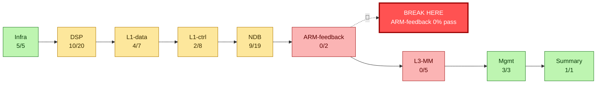

```mermaid
graph TD
  classDef pass    fill:#bef5b1,stroke:#1f7a1f,color:#0a3d0a;
  classDef partial fill:#fde79c,stroke:#b07a00,color:#3a2c00;
  classDef fail    fill:#fbb4b4,stroke:#a31a1a,color:#5a0000;
  classDef skip    fill:#e0e0e0,stroke:#6a6a6a,color:#333;
  classDef xfail   fill:#fde79c,stroke:#b07a00,color:#3a2c00;
  C_Injection["Injection<br/>9/21"]
  class C_Injection partial;
  C_Injection_L_ARM_feedback["ARM-feedback<br/>0/2"]
  class C_Injection_L_ARM_feedback fail;
  C_Injection --> C_Injection_L_ARM_feedback
  C_Injection_L_ARM_feedback --> T_001_test_efficacy_arm_reads_d_fb_det_1["test_efficacy_arm_reads_d_fb_det_1<br/>inject_efficacy<br/>3.15s"]
  class T_001_test_efficacy_arm_reads_d_fb_det_1 fail;
  C_Injection_L_ARM_feedback --> T_002_test_efficacy_arm_reads_a_cd["test_efficacy_arm_reads_a_cd<br/>inject_efficacy<br/>3.11s"]
  class T_002_test_efficacy_arm_reads_a_cd xfail;
  C_Injection_L_NDB["NDB<br/>9/19"]
  class C_Injection_L_NDB partial;
  C_Injection --> C_Injection_L_NDB
  C_Injection_L_NDB --> T_003_test_probe_ndb["test_probe_ndb<br/>inject_frames<br/>0.29s"]
  class T_003_test_probe_ndb pass;
  C_Injection_L_NDB --> T_004_test_clear_ndb["test_clear_ndb<br/>inject_frames<br/>0.29s"]
  class T_004_test_clear_ndb pass;
  C_Injection_L_NDB --> T_005_test_inject_fbsb_fb_found["test_inject_fbsb_fb_found<br/>inject_frames<br/>0.62s"]
  class T_005_test_inject_fbsb_fb_found fail;
  C_Injection_L_NDB --> T_006_test_inject_fbsb_sb_found["test_inject_fbsb_sb_found<br/>inject_frames<br/>0.54s"]
  class T_006_test_inject_fbsb_sb_found pass;
  C_Injection_L_NDB --> T_007_test_inject_si_1_["test_inject_si(1)<br/>inject_frames<br/>0.33s"]
  class T_007_test_inject_si_1_ fail;
  C_Injection_L_NDB --> T_008_test_inject_si_2_["test_inject_si(2)<br/>inject_frames<br/>0.33s"]
  class T_008_test_inject_si_2_ fail;
  C_Injection_L_NDB --> T_009_test_inject_si_3_["test_inject_si(3)<br/>inject_frames<br/>0.33s"]
  class T_009_test_inject_si_3_ fail;
  C_Injection_L_NDB --> T_010_test_inject_si_4_["test_inject_si(4)<br/>inject_frames<br/>0.33s"]
  class T_010_test_inject_si_4_ fail;
  C_Injection_L_NDB --> T_011_test_inject_si_5_["test_inject_si(5)<br/>inject_frames<br/>0.37s"]
  class T_011_test_inject_si_5_ fail;
  C_Injection_L_NDB --> T_012_test_inject_si_6_["test_inject_si(6)<br/>inject_frames<br/>0.33s"]
  class T_012_test_inject_si_6_ fail;
  C_Injection_L_NDB --> T_013_test_inject_a_cd_pattern_23B["test_inject_a_cd_pattern_23B<br/>inject_frames<br/>0.33s"]
  class T_013_test_inject_a_cd_pattern_23B fail;
  C_Injection_L_NDB --> T_014_test_inject_a_cd_pattern_30B["test_inject_a_cd_pattern_30B<br/>inject_frames<br/>0.33s"]
  class T_014_test_inject_a_cd_pattern_30B fail;
  C_Injection_L_NDB --> T_015_test_inject_a_cd_invalid_length["test_inject_a_cd_invalid_length<br/>inject_frames<br/>0.00s"]
  class T_015_test_inject_a_cd_invalid_length pass;
  C_Injection_L_NDB --> T_016_test_inject_d_task_5_0_["test_inject_d_task(5-0)<br/>inject_frames<br/>0.04s"]
  class T_016_test_inject_d_task_5_0_ pass;
  C_Injection_L_NDB --> T_017_test_inject_d_task_6_1_["test_inject_d_task(6-1)<br/>inject_frames<br/>0.04s"]
  class T_017_test_inject_d_task_6_1_ pass;
  C_Injection_L_NDB --> T_018_test_inject_d_task_24_0_["test_inject_d_task(24-0)<br/>inject_frames<br/>0.04s"]
  class T_018_test_inject_d_task_24_0_ pass;
  C_Injection_L_NDB --> T_019_test_inject_d_task_28_1_["test_inject_d_task(28-1)<br/>inject_frames<br/>0.04s"]
  class T_019_test_inject_d_task_28_1_ fail;
  C_Injection_L_NDB --> T_020_test_inject_d_burst_0_["test_inject_d_burst(0)<br/>inject_frames<br/>0.04s"]
  class T_020_test_inject_d_burst_0_ pass;
  C_Injection_L_NDB --> T_021_test_inject_d_burst_1_["test_inject_d_burst(1)<br/>inject_frames<br/>0.04s"]
  class T_021_test_inject_d_burst_1_ pass;
  C_Milestone["Milestone<br/>6/21"]
  class C_Milestone partial;
  C_Milestone_L_DSP["DSP<br/>4/10"]
  class C_Milestone_L_DSP partial;
  C_Milestone --> C_Milestone_L_DSP
  C_Milestone_L_DSP --> T_022_test_popm_decoder_active["test_popm_decoder_active<br/>milestone_dsp_decoder<br/>0.00s"]
  class T_022_test_popm_decoder_active pass;
  C_Milestone_L_DSP --> T_023_test_tier_a_decoder_fixes_present["test_tier_a_decoder_fixes_present<br/>milestone_dsp_decoder<br/>0.00s"]
  class T_023_test_tier_a_decoder_fixes_present pass;
  C_Milestone_L_DSP --> T_024_test_intm_dwell_no_regression["test_intm_dwell_no_regression<br/>milestone_dsp_decoder<br/>30.57s"]
  class T_024_test_intm_dwell_no_regression pass;
  C_Milestone_L_DSP --> T_025_test_dsp_throughput_5x["test_dsp_throughput_5x<br/>milestone_dsp_decoder<br/>0.13s"]
  class T_025_test_dsp_throughput_5x pass;
  C_Milestone_L_DSP --> T_026_test_fb0_att_nonzero["test_fb0_att_nonzero<br/>milestone_fb_det<br/>0.00s"]
  class T_026_test_fb0_att_nonzero xfail;
  C_Milestone_L_DSP --> T_027_test_synth_zero_path_active["test_synth_zero_path_active<br/>milestone_fb_det<br/>0.11s"]
  class T_027_test_synth_zero_path_active skip;
  C_Milestone_L_DSP --> T_028_test_c54x_interrupt_ex_called_nonzero["test_c54x_interrupt_ex_called_nonzero<br/>milestone_irq<br/>0.00s"]
  class T_028_test_c54x_interrupt_ex_called_nonzero xfail;
  C_Milestone_L_DSP --> T_029_test_isr_entered_implies_rete["test_isr_entered_implies_rete<br/>milestone_irq<br/>0.00s"]
  class T_029_test_isr_entered_implies_rete xfail;
  C_Milestone_L_DSP --> T_030_test_no_pending_irq_gated["test_no_pending_irq_gated<br/>milestone_irq<br/>0.00s"]
  class T_030_test_no_pending_irq_gated xfail;
  C_Milestone_L_DSP --> T_031_test_rxdoneflag_no_longer_blocks["test_rxdoneflag_no_longer_blocks<br/>milestone_dsp_decoder<br/>0.00s"]
  class T_031_test_rxdoneflag_no_longer_blocks xfail;
  C_Milestone_L_L1_ctrl["L1-ctrl<br/>0/2"]
  class C_Milestone_L_L1_ctrl fail;
  C_Milestone --> C_Milestone_L_L1_ctrl
  C_Milestone_L_L1_ctrl --> T_032_test_l1ctl_data_ind_received["test_l1ctl_data_ind_received<br/>milestone_l1ctl<br/>0.16s"]
  class T_032_test_l1ctl_data_ind_received fail;
  C_Milestone_L_L1_ctrl --> T_033_test_neigh_pm_req_response_unchanged["test_neigh_pm_req_response_unchanged<br/>milestone_l1ctl<br/>0.00s"]
  class T_033_test_neigh_pm_req_response_unchanged xfail;
  C_Milestone_L_L1_data["L1-data<br/>2/4"]
  class C_Milestone_L_L1_data partial;
  C_Milestone --> C_Milestone_L_L1_data
  C_Milestone_L_L1_data --> T_034_test_ar3_init_source_identified["test_ar3_init_source_identified<br/>milestone_bsp_dma<br/>0.01s"]
  class T_034_test_ar3_init_source_identified skip;
  C_Milestone_L_L1_data --> T_035_test_ar4_init_source_identified["test_ar4_init_source_identified<br/>milestone_bsp_dma<br/>0.01s"]
  class T_035_test_ar4_init_source_identified skip;
  C_Milestone_L_L1_data --> T_036_test_bsp_dma_target_matches_correlator_read_zone["test_bsp_dma_target_matches_correlator<br/>milestone_bsp_dma<br/>0.06s"]
  class T_036_test_bsp_dma_target_matches_correlator_read_zone pass;
  C_Milestone_L_L1_data --> T_037_test_no_d_fb_det_wr_site_anomaly["test_no_d_fb_det_wr_site_anomaly<br/>milestone_bsp_dma<br/>0.17s"]
  class T_037_test_no_d_fb_det_wr_site_anomaly pass;
  C_Milestone_L_L3_MM["L3-MM<br/>0/5"]
  class C_Milestone_L_L3_MM fail;
  C_Milestone --> C_Milestone_L_L3_MM
  C_Milestone_L_L3_MM --> T_038_test_rach_emitted["test_rach_emitted<br/>milestone_mm_lu<br/>0.00s"]
  class T_038_test_rach_emitted xfail;
  C_Milestone_L_L3_MM --> T_039_test_immediate_assignment_decoded["test_immediate_assignment_decoded<br/>milestone_mm_lu<br/>0.00s"]
  class T_039_test_immediate_assignment_decoded xfail;
  C_Milestone_L_L3_MM --> T_040_test_rr_sdcch_established["test_rr_sdcch_established<br/>milestone_mm_lu<br/>0.00s"]
  class T_040_test_rr_sdcch_established xfail;
  C_Milestone_L_L3_MM --> T_041_test_location_updating_request_sent["test_location_updating_request_sent<br/>milestone_mm_lu<br/>0.00s"]
  class T_041_test_location_updating_request_sent xfail;
  C_Milestone_L_L3_MM --> T_042_test_location_updating_accept_received["test_location_updating_accept_received<br/>milestone_mm_lu<br/>0.00s"]
  class T_042_test_location_updating_accept_received xfail;
  C_Runtime["Runtime<br/>19/28"]
  class C_Runtime partial;
  C_Runtime_L_DSP["DSP<br/>6/10"]
  class C_Runtime_L_DSP partial;
  C_Runtime --> C_Runtime_L_DSP
  C_Runtime_L_DSP --> T_043_test_no_wait_a21a_on_window["test_no_wait_a21a_on_window<br/>runtime_dsp<br/>0.07s"]
  class T_043_test_no_wait_a21a_on_window pass;
  C_Runtime_L_DSP --> T_044_test_no_enter_7740_dwell["test_no_enter_7740_dwell<br/>runtime_dsp<br/>0.08s"]
  class T_044_test_no_enter_7740_dwell pass;
  C_Runtime_L_DSP --> T_045_test_intm_reaches_zero["test_intm_reaches_zero<br/>runtime_dsp<br/>0.07s"]
  class T_045_test_intm_reaches_zero pass;
  C_Runtime_L_DSP --> T_046_test_dsp_throughput_above_threshold["test_dsp_throughput_above_threshold<br/>runtime_dsp<br/>0.07s"]
  class T_046_test_dsp_throughput_above_threshold pass;
  C_Runtime_L_DSP --> T_047_test_d_fb_det_pattern_unchanged["test_d_fb_det_pattern_unchanged<br/>runtime_dsp<br/>0.06s"]
  class T_047_test_d_fb_det_pattern_unchanged xfail;
  C_Runtime_L_DSP --> T_048_test_bsp_daram_write_distribution["test_bsp_daram_write_distribution<br/>runtime_dsp<br/>0.08s"]
  class T_048_test_bsp_daram_write_distribution pass;
  C_Runtime_L_DSP --> T_049_test_d_fb_det_data_no_longer_zero["test_d_fb_det_data_no_longer_zero<br/>runtime_dsp<br/>0.08s"]
  class T_049_test_d_fb_det_data_no_longer_zero pass;
  C_Runtime_L_DSP --> T_050_test_interrupt_ex_called_counter_exposed["test_interrupt_ex_called_counter_expos<br/>runtime_irq<br/>0.06s"]
  class T_050_test_interrupt_ex_called_counter_exposed xfail;
  C_Runtime_L_DSP --> T_051_test_isr_entered_matches_rete["test_isr_entered_matches_rete<br/>runtime_irq<br/>0.13s"]
  class T_051_test_isr_entered_matches_rete xfail;
  C_Runtime_L_DSP --> T_052_test_no_pending_irq_gating["test_no_pending_irq_gating<br/>runtime_irq<br/>0.16s"]
  class T_052_test_no_pending_irq_gating xfail;
  C_Runtime_L_Infra["Infra<br/>5/5"]
  class C_Runtime_L_Infra pass;
  C_Runtime --> C_Runtime_L_Infra
  C_Runtime_L_Infra --> T_053_test_all_expected_processes_present["test_all_expected_processes_present<br/>runtime_health<br/>0.12s"]
  class T_053_test_all_expected_processes_present pass;
  C_Runtime_L_Infra --> T_054_test_no_zombie_or_defunct["test_no_zombie_or_defunct<br/>runtime_health<br/>0.05s"]
  class T_054_test_no_zombie_or_defunct pass;
  C_Runtime_L_Infra --> T_055_test_qemu_log_is_fresh["test_qemu_log_is_fresh<br/>runtime_health<br/>3.11s"]
  class T_055_test_qemu_log_is_fresh pass;
  C_Runtime_L_Infra --> T_056_test_mobile_pcap_growing["test_mobile_pcap_growing<br/>runtime_health<br/>10.00s"]
  class T_056_test_mobile_pcap_growing pass;
  C_Runtime_L_Infra --> T_057_test_volumes_mounted["test_volumes_mounted<br/>runtime_health<br/>0.08s"]
  class T_057_test_volumes_mounted pass;
  C_Runtime_L_L1_ctrl["L1-ctrl<br/>2/6"]
  class C_Runtime_L_L1_ctrl partial;
  C_Runtime --> C_Runtime_L_L1_ctrl
  C_Runtime_L_L1_ctrl --> T_058_test_neigh_pm_req_loop_alive["test_neigh_pm_req_loop_alive<br/>runtime_l1ctl<br/>0.19s"]
  class T_058_test_neigh_pm_req_loop_alive pass;
  C_Runtime_L_L1_ctrl --> T_059_test_l1ctl_data_ind_received["test_l1ctl_data_ind_received<br/>runtime_l1ctl<br/>0.17s"]
  class T_059_test_l1ctl_data_ind_received fail;
  C_Runtime_L_L1_ctrl --> T_060_test_a_cd_writes_nonzero["test_a_cd_writes_nonzero<br/>runtime_l1ctl<br/>0.09s"]
  class T_060_test_a_cd_writes_nonzero pass;
  C_Runtime_L_L1_ctrl --> T_061_test_a_cd_write_pc_includes_ccch_demod["test_a_cd_write_pc_includes_ccch_demod<br/>runtime_l1ctl<br/>0.19s"]
  class T_061_test_a_cd_write_pc_includes_ccch_demod xfail;
  C_Runtime_L_L1_ctrl --> T_062_test_l1ctl_data_ind_rate_vs_alc["test_l1ctl_data_ind_rate_vs_alc<br/>runtime_l1ctl<br/>0.24s"]
  class T_062_test_l1ctl_data_ind_rate_vs_alc fail;
  C_Runtime_L_L1_ctrl --> T_063_test_rach_attempted["test_rach_attempted<br/>runtime_l1ctl<br/>0.00s"]
  class T_063_test_rach_attempted xfail;
  C_Runtime_L_L1_data["L1-data<br/>2/3"]
  class C_Runtime_L_L1_data partial;
  C_Runtime --> C_Runtime_L_L1_data
  C_Runtime_L_L1_data --> T_064_test_bridge_log_shows_traffic["test_bridge_log_shows_traffic<br/>runtime_bridge<br/>0.05s"]
  class T_064_test_bridge_log_shows_traffic pass;
  C_Runtime_L_L1_data --> T_065_test_bridge_fn_drift_under_threshold["test_bridge_fn_drift_under_threshold<br/>runtime_bridge<br/>0.00s"]
  class T_065_test_bridge_fn_drift_under_threshold xfail;
  C_Runtime_L_L1_data --> T_066_test_bridge_dl_lookahead_respected["test_bridge_dl_lookahead_respected<br/>runtime_bridge<br/>0.05s"]
  class T_066_test_bridge_dl_lookahead_respected pass;
  C_Runtime_L_Mgmt["Mgmt<br/>3/3"]
  class C_Runtime_L_Mgmt pass;
  C_Runtime --> C_Runtime_L_Mgmt
  C_Runtime_L_Mgmt --> T_067_test_mobile_vty_reachable["test_mobile_vty_reachable<br/>runtime_vty<br/>1.61s"]
  class T_067_test_mobile_vty_reachable pass;
  C_Runtime_L_Mgmt --> T_068_test_mobile_imsi_loaded["test_mobile_imsi_loaded<br/>runtime_vty<br/>1.62s"]
  class T_068_test_mobile_imsi_loaded pass;
  C_Runtime_L_Mgmt --> T_069_test_mobile_mm_state_is_null_or_idle["test_mobile_mm_state_is_null_or_idle<br/>runtime_vty<br/>1.73s"]
  class T_069_test_mobile_mm_state_is_null_or_idle pass;
  C_Runtime_L_Summary["Summary<br/>1/1"]
  class C_Runtime_L_Summary pass;
  C_Runtime --> C_Runtime_L_Summary
  C_Runtime_L_Summary --> T_070_test_run_summary_snapshot["test_run_summary_snapshot<br/>runtime_summary<br/>30.68s"]
  class T_070_test_run_summary_snapshot pass;
```

## `tests/detail.qmd.mmd` {#f-tests-detail-qmd-mmd}

::: {.file-meta}
[.mmd]{.tag} 392 lignes - 26KB
:::

```{mermaid}
flowchart TB
  classDef pass    fill:#bef5b1,stroke:#1f7a1f,color:#0a3d0a;
  classDef partial fill:#fde79c,stroke:#b07a00,color:#3a2c00;
  classDef fail    fill:#fbb4b4,stroke:#a31a1a,color:#5a0000;
  classDef skip    fill:#e0e0e0,stroke:#6a6a6a,color:#333;
  classDef xfail   fill:#fde79c,stroke:#b07a00,color:#3a2c00;
  subgraph SG_C_Ar ["Ar 4/8"]
    direction TB
    C_Ar_L__["— 4/8"]
    C_Ar_L__ --> T_001_pass_grp__["PASS 4 0.0s"]
    C_Ar_L__ --> T_002_test_reset_sp_silicon["test_reset_sp_silicon ar_imr_invariant 0.01s"]
    C_Ar_L__ --> T_003_test_reset_pmst_silicon["test_reset_pmst_silicon ar_imr_invariant 0.01s"]
    C_Ar_L__ --> T_004_test_irq_servicing_imr_nonzero["test_irq_servicing_imr_nonzero ar_imr_invariant 0.01s"]
    C_Ar_L__ --> T_005_test_tpu_frame_irq_delivered["test_tpu_frame_irq_delivered ar_imr_invariant 0.01s"]
  end

  subgraph SG_C_Injection ["Injection 19/21"]
    direction TB
    C_Injection_L_ARM_feedback["ARM-feedback 0/2"]
    C_Injection_L_ARM_feedback --> T_006_test_efficacy_arm_reads_d_fb_det_1["test_efficacy_arm_reads_d_fb_det_1 inject_efficacy 3.01s"]
    C_Injection_L_ARM_feedback --> T_007_test_efficacy_arm_reads_a_cd["test_efficacy_arm_reads_a_cd inject_efficacy 2.59s"]
    C_Injection_L_NDB["NDB 19/19"]
    C_Injection_L_ARM_feedback -.-> C_Injection_L_NDB
    C_Injection_L_NDB --> T_008_pass_grp_NDB["PASS 19 5.4s"]
  end
  SG_C_Ar -.-> SG_C_Injection

  subgraph SG_C_Milestone ["Milestone 3/21"]
    direction TB
    C_Milestone_L_DSP["DSP 3/10"]
    C_Milestone_L_DSP --> T_009_pass_grp_DSP["PASS 3 30.3s"]
    C_Milestone_L_DSP --> T_010_test_dsp_throughput_5x["test_dsp_throughput_5x milestone_dsp_decoder 0.01s"]
    C_Milestone_L_DSP --> T_011_test_fb0_att_nonzero["test_fb0_att_nonzero milestone_fb_det 0.00s"]
    C_Milestone_L_DSP --> T_012_test_synth_zero_path_active["test_synth_zero_path_active milestone_fb_det 0.01s"]
    C_Milestone_L_DSP --> T_013_test_c54x_interrupt_ex_called_nonzero["test_c54x_interrupt_ex_called_nonzero milestone_irq 0.00s"]
    C_Milestone_L_DSP --> T_014_test_isr_entered_implies_rete["test_isr_entered_implies_rete milestone_irq 0.00s"]
    C_Milestone_L_DSP --> T_015_test_no_pending_irq_gated["test_no_pending_irq_gated milestone_irq 0.00s"]
    C_Milestone_L_DSP --> T_016_test_rxdoneflag_no_longer_blocks["test_rxdoneflag_no_longer_blocks milestone_dsp_decoder 0.00s"]
    C_Milestone_L_L1_ctrl["L1-ctrl 0/2"]
    C_Milestone_L_DSP -.-> C_Milestone_L_L1_ctrl
    C_Milestone_L_L1_ctrl --> T_017_test_l1ctl_data_ind_received["test_l1ctl_data_ind_received milestone_l1ctl 0.02s"]
    C_Milestone_L_L1_ctrl --> T_018_test_neigh_pm_req_response_unchanged["test_neigh_pm_req_response_unchanged milestone_l1ctl 0.00s"]
    C_Milestone_L_L1_data["L1-data 0/4"]
    C_Milestone_L_L1_ctrl -.-> C_Milestone_L_L1_data
    C_Milestone_L_L1_data --> T_019_test_ar3_init_source_identified["test_ar3_init_source_identified milestone_bsp_dma 0.01s"]
    C_Milestone_L_L1_data --> T_020_test_ar4_init_source_identified["test_ar4_init_source_identified milestone_bsp_dma 0.01s"]
    C_Milestone_L_L1_data --> T_021_test_bsp_dma_target_matches_correlator_read_zone["test_bsp_dma_target_matches_correlator milestone_bsp_dma 0.01s"]
    C_Milestone_L_L1_data --> T_022_test_no_d_fb_det_wr_site_anomaly["test_no_d_fb_det_wr_site_anomaly milestone_bsp_dma 0.01s"]
    C_Milestone_L_L3_MM["L3-MM 0/5"]
    C_Milestone_L_L1_data -.-> C_Milestone_L_L3_MM
    C_Milestone_L_L3_MM --> T_023_test_rach_emitted["test_rach_emitted milestone_mm_lu 0.00s"]
    C_Milestone_L_L3_MM --> T_024_test_immediate_assignment_decoded["test_immediate_assignment_decoded milestone_mm_lu 0.00s"]
    C_Milestone_L_L3_MM --> T_025_test_rr_sdcch_established["test_rr_sdcch_established milestone_mm_lu 0.00s"]
    C_Milestone_L_L3_MM --> T_026_test_location_updating_request_sent["test_location_updating_request_sent milestone_mm_lu 0.00s"]
    C_Milestone_L_L3_MM --> T_027_test_location_updating_accept_received["test_location_updating_accept_received milestone_mm_lu 0.00s"]
  end
  SG_C_Injection -.-> SG_C_Milestone

  subgraph SG_C_Osmocom ["Osmocom 12/13"]
    direction TB
    C_Osmocom_L__["— 12/13"]
    C_Osmocom_L__ --> T_028_pass_grp__["PASS 12 0.0s"]
    C_Osmocom_L__ --> T_029_test_bridge_clock_from_qemu_defaultX["test_bridge_clock_from_qemu_default osmocom_bridge 0.00s"]
  end
  SG_C_Milestone -.-> SG_C_Osmocom

  subgraph SG_C_Other ["Other 3/18"]
    direction TB
    C_Other_L_unmarked["unmarked 3/18"]
    C_Other_L_unmarked --> T_030_pass_grp_unmarked["PASS 3 0.0s"]
    C_Other_L_unmarked --> T_031_test_verdict_shunt_works["test_verdict_shunt_works  0.00s"]
    C_Other_L_unmarked --> T_032_test_verdict_shunt_silent["test_verdict_shunt_silent  0.00s"]
    C_Other_L_unmarked --> T_033_test_verdict_bts_dead["test_verdict_bts_dead  0.00s"]
    C_Other_L_unmarked --> T_034_test_verdict_ipc_chan_mismatch["test_verdict_ipc_chan_mismatch  0.00s"]
    C_Other_L_unmarked --> T_035_test_bissection_fbsb_shunt_vs_full["test_bissection_fbsb_shunt_vs_full  0.00s"]
    C_Other_L_unmarked --> T_036_test_bridge_vs_ipc_radio_chain["test_bridge_vs_ipc_radio_chain  0.00s"]
    C_Other_L_unmarked --> T_037_test_lost_frames_consistency["test_lost_frames_consistency  0.00s"]
    C_Other_L_unmarked --> T_038_test_errors_quiet["test_errors_quiet  0.00s"]
    C_Other_L_unmarked --> T_039_test_verdict_dsp_wall_confirmed["test_verdict_dsp_wall_confirmed  0.00s"]
    C_Other_L_unmarked --> T_040_test_verdict_arm_bug["test_verdict_arm_bug  0.00s"]
    C_Other_L_unmarked --> T_041_test_verdict_pipeline_works["test_verdict_pipeline_works  0.00s"]
    C_Other_L_unmarked --> T_042_test_verdict_radio_chain_broken["test_verdict_radio_chain_broken  0.00s"]
    C_Other_L_unmarked --> T_043_test_verdict_instability["test_verdict_instability  0.00s"]
    C_Other_L_unmarked --> T_044_test_verdict_bridge_vs_ipc["test_verdict_bridge_vs_ipc  0.00s"]
    C_Other_L_unmarked --> T_045_test_zz_final_report["test_zz_final_report  0.00s"]
  end
  SG_C_Osmocom -.-> SG_C_Other

  subgraph SG_C_Parametrize ["Parametrize 1/34"]
    direction TB
    C_Parametrize_L__["— 1/34"]
    C_Parametrize_L__ --> T_046_pass_grp__["PASS 1 0.1s"]
    C_Parametrize_L__ --> T_047_test_mode_executed_full_["test_mode_executed(full) parametrize 0.00s"]
    C_Parametrize_L__ --> T_048_test_mode_executed_shunt_["test_mode_executed(shunt) parametrize 0.00s"]
    C_Parametrize_L__ --> T_049_test_mode_executed_shunt_ipc_["test_mode_executed(shunt-ipc) parametrize 0.00s"]
    C_Parametrize_L__ --> T_050_test_mode_executed_bridge_["test_mode_executed(bridge) parametrize 0.00s"]
    C_Parametrize_L__ --> T_051_test_mode_executed_bare_["test_mode_executed(bare) parametrize 0.00s"]
    C_Parametrize_L__ --> T_052_test_mode_invariant_full_bts_ok___0_osmo_bts_trx["test_mode_invariant(full-bts_ok->-0-os parametrize 0.00s"]
    C_Parametrize_L__ --> T_053_test_mode_invariant_full_ipc_ok___0_calypso_ipc_["test_mode_invariant(full-ipc_ok->-0-ca parametrize 0.00s"]
    C_Parametrize_L__ --> T_054_test_mode_invariant_full_err_q____0_qemu_log_san["test_mode_invariant(full-err_q-==-0-qe parametrize 0.00s"]
    C_Parametrize_L__ --> T_055_test_mode_invariant_shunt_shunt_latch___0_ARM_do["test_mode_invariant(shunt-shunt_latch- parametrize 0.00s"]
    C_Parametrize_L__ --> T_056_test_mode_invariant_shunt_shunt_disp___0_le_mock["test_mode_invariant(shunt-shunt_disp-> parametrize 0.00s"]
    C_Parametrize_L__ --> T_057_test_mode_invariant_shunt_err_q____0_qemu_log_sa["test_mode_invariant(shunt-err_q-==-0-q parametrize 0.00s"]
    C_Parametrize_L__ --> T_058_test_mode_invariant_shunt_bts_ok____0_BTS_doit__["test_mode_invariant(shunt-bts_ok-==-0- parametrize 0.00s"]
    C_Parametrize_L__ --> T_059_test_mode_invariant_shunt_ipc_ok____0_IPC_doit__["test_mode_invariant(shunt-ipc_ok-==-0- parametrize 0.00s"]
    C_Parametrize_L__ --> T_060_test_mode_invariant_shunt_ipc_shunt_latch___0_AR["test_mode_invariant(shunt-ipc-shunt_la parametrize 0.00s"]
    C_Parametrize_L__ --> T_061_test_mode_invariant_shunt_ipc_shunt_disp___0_le_["test_mode_invariant(shunt-ipc-shunt_di parametrize 0.00s"]
    C_Parametrize_L__ --> T_062_test_mode_invariant_shunt_ipc_bts_ok___0_BTS_ali["test_mode_invariant(shunt-ipc-bts_ok-> parametrize 0.00s"]
    C_Parametrize_L__ --> T_063_test_mode_invariant_shunt_ipc_ipc_ok___0_IPC_han["test_mode_invariant(shunt-ipc-ipc_ok-> parametrize 0.00s"]
    C_Parametrize_L__ --> T_064_test_mode_invariant_bridge_bts_ok___0_BTS_alive_["test_mode_invariant(bridge-bts_ok->-0- parametrize 0.00s"]
    C_Parametrize_L__ --> T_065_test_mode_invariant_bridge_ipc_ok____0_IPC_skipp["test_mode_invariant(bridge-ipc_ok-==-0 parametrize 0.00s"]
    C_Parametrize_L__ --> T_066_test_mode_invariant_bare_bts_ok____0_pas_de_BTS_["test_mode_invariant(bare-bts_ok-==-0-p parametrize 0.00s"]
    C_Parametrize_L__ --> T_067_test_mode_invariant_bare_ipc_ok____0_pas_d_IPC_e["test_mode_invariant(bare-ipc_ok-==-0-p parametrize 0.00s"]
    C_Parametrize_L__ --> T_068_test_mode_invariant_bare_rr_est____0_pas_de_mobi["test_mode_invariant(bare-rr_est-==-0-p parametrize 0.00s"]
    C_Parametrize_L__ --> T_069_test_payload_coverage_FB_detect_["test_payload_coverage(FB_detect) parametrize 0.00s"]
    C_Parametrize_L__ --> T_070_test_payload_coverage_SB_decode_["test_payload_coverage(SB_decode) parametrize 0.00s"]
    C_Parametrize_L__ --> T_071_test_payload_coverage_Mock_LATCH_["test_payload_coverage(Mock_LATCH) parametrize 0.00s"]
    C_Parametrize_L__ --> T_072_test_payload_coverage_Mock_DISP_["test_payload_coverage(Mock_DISP) parametrize 0.00s"]
    C_Parametrize_L__ --> T_073_test_payload_coverage_RR_EST_REQ_["test_payload_coverage(RR_EST_REQ) parametrize 0.00s"]
    C_Parametrize_L__ --> T_074_test_payload_coverage_BTS_alive_["test_payload_coverage(BTS_alive) parametrize 0.00s"]
    C_Parametrize_L__ --> T_075_test_payload_coverage_IPC_handsh_["test_payload_coverage(IPC_handsh) parametrize 0.00s"]
    C_Parametrize_L__ --> T_076_test_timer_runtime_period_kick_["test_timer_runtime_period(kick) parametrize 0.10s"]
    C_Parametrize_L__ --> T_077_test_timer_runtime_period_bridge_clk_ind_["test_timer_runtime_period(bridge_clk_i parametrize 0.00s"]
    C_Parametrize_L__ --> T_078_test_timer_runtime_period_bts_clk_ind_["test_timer_runtime_period(bts_clk_ind) parametrize 0.00s"]
    C_Parametrize_L__ --> T_079_test_timer_runtime_period_bsp_burst_["test_timer_runtime_period(bsp_burst) parametrize 0.10s"]
  end
  SG_C_Other -.-> SG_C_Parametrize

  subgraph SG_C_Runtime ["Runtime 64/96"]
    direction TB
    C_Runtime_L_DSP["DSP 2/10"]
    C_Runtime_L_DSP --> T_080_pass_grp_DSP["PASS 2 0.0s"]
    C_Runtime_L_DSP --> T_081_test_intm_reaches_zero["test_intm_reaches_zero runtime_dsp 0.02s"]
    C_Runtime_L_DSP --> T_082_test_dsp_throughput_above_threshold["test_dsp_throughput_above_threshold runtime_dsp 0.02s"]
    C_Runtime_L_DSP --> T_083_test_d_fb_det_pattern_unchanged["test_d_fb_det_pattern_unchanged runtime_dsp 0.03s"]
    C_Runtime_L_DSP --> T_084_test_bsp_daram_write_distribution["test_bsp_daram_write_distribution runtime_dsp 0.02s"]
    C_Runtime_L_DSP --> T_085_test_d_fb_det_data_no_longer_zero["test_d_fb_det_data_no_longer_zero runtime_dsp 0.01s"]
    C_Runtime_L_DSP --> T_086_test_interrupt_ex_called_counter_exposed["test_interrupt_ex_called_counter_expos runtime_irq 0.00s"]
    C_Runtime_L_DSP --> T_087_test_isr_entered_matches_rete["test_isr_entered_matches_rete runtime_irq 0.00s"]
    C_Runtime_L_DSP --> T_088_test_no_pending_irq_gating["test_no_pending_irq_gating runtime_irq 0.00s"]
    C_Runtime_L_FS["FS 3/3"]
    C_Runtime_L_DSP -.-> C_Runtime_L_FS
    C_Runtime_L_FS --> T_089_pass_grp_FS["PASS 3 0.0s"]
    C_Runtime_L_Firmware_state["Firmware-state 5/5"]
    C_Runtime_L_FS -.-> C_Runtime_L_Firmware_state
    C_Runtime_L_Firmware_state --> T_090_pass_grp_Firmware_state["PASS 5 0.2s"]
    C_Runtime_L_GDB_introspect["GDB-introspect 8/8"]
    C_Runtime_L_Firmware_state -.-> C_Runtime_L_GDB_introspect
    C_Runtime_L_GDB_introspect --> T_091_pass_grp_GDB_introspect["PASS 8 0.3s"]
    C_Runtime_L_Infra["Infra 5/5"]
    C_Runtime_L_GDB_introspect -.-> C_Runtime_L_Infra
    C_Runtime_L_Infra --> T_092_pass_grp_Infra["PASS 5 13.0s"]
    C_Runtime_L_IrDA_channel["IrDA-channel 3/8"]
    C_Runtime_L_Infra -.-> C_Runtime_L_IrDA_channel
    C_Runtime_L_IrDA_channel --> T_093_pass_grp_IrDA_channel["PASS 3 0.1s"]
    C_Runtime_L_IrDA_channel --> T_094_test_irda_boot_marker_present["test_irda_boot_marker_present runtime_irda 0.00s"]
    C_Runtime_L_IrDA_channel --> T_095_test_irda_channel_produces_bytes["test_irda_channel_produces_bytes runtime_irda 5.03s"]
    C_Runtime_L_IrDA_channel --> T_096_test_irda_log_has_timestamp_prefix["test_irda_log_has_timestamp_prefix runtime_irda 0.00s"]
    C_Runtime_L_IrDA_channel --> T_097_test_irda_capture_process_alive["test_irda_capture_process_alive runtime_irda 0.00s"]
    C_Runtime_L_IrDA_channel --> T_098_test_irda_throughput_below_saturation["test_irda_throughput_below_saturation runtime_irda 10.07s"]
    C_Runtime_L_L1_ctrl["L1-ctrl 1/6"]
    C_Runtime_L_IrDA_channel -.-> C_Runtime_L_L1_ctrl
    C_Runtime_L_L1_ctrl --> T_099_pass_grp_L1_ctrl["PASS 1 0.1s"]
    C_Runtime_L_L1_ctrl --> T_100_test_l1ctl_data_ind_received["test_l1ctl_data_ind_received runtime_l1ctl 0.01s"]
    C_Runtime_L_L1_ctrl --> T_101_test_a_cd_writes_nonzero["test_a_cd_writes_nonzero runtime_l1ctl 0.01s"]
    C_Runtime_L_L1_ctrl --> T_102_test_a_cd_write_pc_includes_ccch_demod["test_a_cd_write_pc_includes_ccch_demod runtime_l1ctl 0.02s"]
    C_Runtime_L_L1_ctrl --> T_103_test_l1ctl_data_ind_rate_vs_alc["test_l1ctl_data_ind_rate_vs_alc runtime_l1ctl 0.02s"]
    C_Runtime_L_L1_ctrl --> T_104_test_rach_attempted["test_rach_attempted runtime_l1ctl 0.00s"]
    C_Runtime_L_L1_data["L1-data 1/3"]
    C_Runtime_L_L1_ctrl -.-> C_Runtime_L_L1_data
    C_Runtime_L_L1_data --> T_105_pass_grp_L1_data["PASS 1 0.0s"]
    C_Runtime_L_L1_data --> T_106_test_bridge_fn_drift_under_threshold["test_bridge_fn_drift_under_threshold runtime_bridge 0.00s"]
    C_Runtime_L_L1_data --> T_107_test_bridge_dl_lookahead_respected["test_bridge_dl_lookahead_respected runtime_bridge 0.00s"]
    C_Runtime_L_Log_grep["Log-grep 19/30"]
    C_Runtime_L_L1_data -.-> C_Runtime_L_Log_grep
    C_Runtime_L_Log_grep --> T_108_pass_grp_Log_grep["PASS 19 0.2s"]
    C_Runtime_L_Log_grep --> T_109_test_grep_qemu_task24_dispatched["test_grep_qemu_task24_dispatched runtime_log_grep 0.01s"]
    C_Runtime_L_Log_grep --> T_110_test_grep_bridge_dl_bursts_received["test_grep_bridge_dl_bursts_received runtime_log_grep 0.00s"]
    C_Runtime_L_Log_grep --> T_111_test_grep_bridge_fb_pattern_dominant["test_grep_bridge_fb_pattern_dominant runtime_log_grep 0.00s"]
    C_Runtime_L_Log_grep --> T_112_test_grep_bridge_no_clock_skew_shutdown["test_grep_bridge_no_clock_skew_shutdow runtime_log_grep 0.00s"]
    C_Runtime_L_Log_grep --> T_113_test_grep_fwirda_log_present_or_skip["test_grep_fwirda_log_present_or_skip runtime_log_grep 0.00s"]
    C_Runtime_L_Log_grep --> T_114_test_grep_fwirda_boot_marker["test_grep_fwirda_boot_marker runtime_log_grep 0.00s"]
    C_Runtime_L_Log_grep --> T_115_test_blocker_bridge_no_bts_shutdown["test_blocker_bridge_no_bts_shutdown runtime_log_grep 0.00s"]
    C_Runtime_L_Log_grep --> T_116_test_blocker_bridge_no_rach_parity["test_blocker_bridge_no_rach_parity runtime_log_grep 0.00s"]
    C_Runtime_L_Log_grep --> T_117_test_blocker_bridge_no_socket_error["test_blocker_bridge_no_socket_error runtime_log_grep 0.00s"]
    C_Runtime_L_Log_grep --> T_118_test_blocker_fwirda_no_panic["test_blocker_fwirda_no_panic runtime_log_grep 0.00s"]
    C_Runtime_L_Log_grep --> T_119_test_grep_qemu_a_cd_wr_vs_task24["test_grep_qemu_a_cd_wr_vs_task24 runtime_log_grep 0.02s"]
    C_Runtime_L_Mgmt["Mgmt 3/3"]
    C_Runtime_L_Log_grep -.-> C_Runtime_L_Mgmt
    C_Runtime_L_Mgmt --> T_120_pass_grp_Mgmt["PASS 3 4.5s"]
    C_Runtime_L_Monitor_extended["Monitor-extended 9/9"]
    C_Runtime_L_Mgmt -.-> C_Runtime_L_Monitor_extended
    C_Runtime_L_Monitor_extended --> T_121_pass_grp_Monitor_extended["PASS 9 27.0s"]
    C_Runtime_L_Net["Net 2/2"]
    C_Runtime_L_Monitor_extended -.-> C_Runtime_L_Net
    C_Runtime_L_Net --> T_122_pass_grp_Net["PASS 2 0.0s"]
    C_Runtime_L_Osmocon["Osmocon 2/3"]
    C_Runtime_L_Net -.-> C_Runtime_L_Osmocon
    C_Runtime_L_Osmocon --> T_123_pass_grp_Osmocon["PASS 2 0.1s"]
    C_Runtime_L_Osmocon --> T_124_test_osmocon_no_recent_lost_spam["test_osmocon_no_recent_lost_spam runtime_osmocon 0.03s"]
    C_Runtime_L_Summary["Summary 1/1"]
    C_Runtime_L_Osmocon -.-> C_Runtime_L_Summary
    C_Runtime_L_Summary --> T_125_pass_grp_Summary["PASS 1 30.2s"]
  end
  SG_C_Parametrize -.-> SG_C_Runtime

  subgraph SG_C_Timer ["Timer 2/2"]
    direction TB
    C_Timer_L__["— 2/2"]
    C_Timer_L__ --> T_126_pass_grp__["PASS 2 0.5s"]
  end
  SG_C_Runtime -.-> SG_C_Timer

  subgraph SG_C_Timing ["Timing 11/19"]
    direction TB
    C_Timing_L_Drift["Drift 4/10"]
    C_Timing_L_Drift --> T_127_pass_grp_Drift["PASS 4 0.1s"]
    C_Timing_L_Drift --> T_128_test_qemu_insn_rate_cv_below_0_4["test_qemu_insn_rate_cv_below_0_4 drift 0.10s"]
    C_Timing_L_Drift --> T_129_test_qemu_insn_rate_p1_above_1m["test_qemu_insn_rate_p1_above_1m drift 0.06s"]
    C_Timing_L_Drift --> T_130_test_bridge_qfn_tracks_qemu_fn["test_bridge_qfn_tracks_qemu_fn drift 0.04s"]
    C_Timing_L_Drift --> T_131_test_bridge_qfn_advances_steadily["test_bridge_qfn_advances_steadily drift 0.00s"]
    C_Timing_L_Drift --> T_132_test_log_still_growing_bridge__root_bridge_py_lo["test_log_still_growing(bridge-/root/br drift 0.00s"]
    C_Timing_L_Drift --> T_133_test_no_long_gap_bridge__root_bridge_py_log_10_0["test_no_long_gap(bridge-/root/bridge.p drift 0.00s"]
    C_Timing_L_Timers["Timers 7/9"]
    C_Timing_L_Drift -.-> C_Timing_L_Timers
    C_Timing_L_Timers --> T_134_pass_grp_Timers["PASS 7 0.0s"]
    C_Timing_L_Timers --> T_135_test_frame_irq_per_tdma_ratio["test_frame_irq_per_tdma_ratio timer_invariant 0.05s"]
    C_Timing_L_Timers --> T_136_test_kick_realtime_cadence["test_kick_realtime_cadence timer_invariant 0.04s"]
  end
  SG_C_Timer -.-> SG_C_Timing
  class C_Ar_L__ partial;
  class T_001_pass_grp__ pass;
  class T_002_test_reset_sp_silicon skip;
  class T_003_test_reset_pmst_silicon skip;
  class T_004_test_irq_servicing_imr_nonzero skip;
  class T_005_test_tpu_frame_irq_delivered skip;
  class C_Injection_L_ARM_feedback fail;
  class T_006_test_efficacy_arm_reads_d_fb_det_1 xfail;
  class T_007_test_efficacy_arm_reads_a_cd xfail;
  class C_Injection_L_NDB pass;
  class T_008_pass_grp_NDB pass;
  class C_Milestone_L_DSP partial;
  class T_009_pass_grp_DSP pass;
  class T_010_test_dsp_throughput_5x skip;
  class T_011_test_fb0_att_nonzero xfail;
  class T_012_test_synth_zero_path_active xfail;
  class T_013_test_c54x_interrupt_ex_called_nonzero xfail;
  class T_014_test_isr_entered_implies_rete xfail;
  class T_015_test_no_pending_irq_gated xfail;
  class T_016_test_rxdoneflag_no_longer_blocks xfail;
  class C_Milestone_L_L1_ctrl fail;
  class T_017_test_l1ctl_data_ind_received xfail;
  class T_018_test_neigh_pm_req_response_unchanged xfail;
  class C_Milestone_L_L1_data fail;
  class T_019_test_ar3_init_source_identified skip;
  class T_020_test_ar4_init_source_identified skip;
  class T_021_test_bsp_dma_target_matches_correlator_read_zone skip;
  class T_022_test_no_d_fb_det_wr_site_anomaly xfail;
  class C_Milestone_L_L3_MM fail;
  class T_023_test_rach_emitted xfail;
  class T_024_test_immediate_assignment_decoded xfail;
  class T_025_test_rr_sdcch_established xfail;
  class T_026_test_location_updating_request_sent xfail;
  class T_027_test_location_updating_accept_received xfail;
  class C_Osmocom_L__ partial;
  class T_028_pass_grp__ pass;
  class T_029_test_bridge_clock_from_qemu_defaultX xfail;
  class C_Other_L_unmarked partial;
  class T_030_pass_grp_unmarked pass;
  class T_031_test_verdict_shunt_works skip;
  class T_032_test_verdict_shunt_silent skip;
  class T_033_test_verdict_bts_dead skip;
  class T_034_test_verdict_ipc_chan_mismatch skip;
  class T_035_test_bissection_fbsb_shunt_vs_full skip;
  class T_036_test_bridge_vs_ipc_radio_chain skip;
  class T_037_test_lost_frames_consistency skip;
  class T_038_test_errors_quiet skip;
  class T_039_test_verdict_dsp_wall_confirmed skip;
  class T_040_test_verdict_arm_bug skip;
  class T_041_test_verdict_pipeline_works skip;
  class T_042_test_verdict_radio_chain_broken skip;
  class T_043_test_verdict_instability skip;
  class T_044_test_verdict_bridge_vs_ipc skip;
  class T_045_test_zz_final_report skip;
  class C_Parametrize_L__ partial;
  class T_046_pass_grp__ pass;
  class T_047_test_mode_executed_full_ skip;
  class T_048_test_mode_executed_shunt_ skip;
  class T_049_test_mode_executed_shunt_ipc_ skip;
  class T_050_test_mode_executed_bridge_ skip;
  class T_051_test_mode_executed_bare_ skip;
  class T_052_test_mode_invariant_full_bts_ok___0_osmo_bts_trx skip;
  class T_053_test_mode_invariant_full_ipc_ok___0_calypso_ipc_ skip;
  class T_054_test_mode_invariant_full_err_q____0_qemu_log_san skip;
  class T_055_test_mode_invariant_shunt_shunt_latch___0_ARM_do skip;
  class T_056_test_mode_invariant_shunt_shunt_disp___0_le_mock skip;
  class T_057_test_mode_invariant_shunt_err_q____0_qemu_log_sa skip;
  class T_058_test_mode_invariant_shunt_bts_ok____0_BTS_doit__ skip;
  class T_059_test_mode_invariant_shunt_ipc_ok____0_IPC_doit__ skip;
  class T_060_test_mode_invariant_shunt_ipc_shunt_latch___0_AR skip;
  class T_061_test_mode_invariant_shunt_ipc_shunt_disp___0_le_ skip;
  class T_062_test_mode_invariant_shunt_ipc_bts_ok___0_BTS_ali skip;
  class T_063_test_mode_invariant_shunt_ipc_ipc_ok___0_IPC_han skip;
  class T_064_test_mode_invariant_bridge_bts_ok___0_BTS_alive_ skip;
  class T_065_test_mode_invariant_bridge_ipc_ok____0_IPC_skipp skip;
  class T_066_test_mode_invariant_bare_bts_ok____0_pas_de_BTS_ skip;
  class T_067_test_mode_invariant_bare_ipc_ok____0_pas_d_IPC_e skip;
  class T_068_test_mode_invariant_bare_rr_est____0_pas_de_mobi skip;
  class T_069_test_payload_coverage_FB_detect_ skip;
  class T_070_test_payload_coverage_SB_decode_ skip;
  class T_071_test_payload_coverage_Mock_LATCH_ skip;
  class T_072_test_payload_coverage_Mock_DISP_ skip;
  class T_073_test_payload_coverage_RR_EST_REQ_ skip;
  class T_074_test_payload_coverage_BTS_alive_ skip;
  class T_075_test_payload_coverage_IPC_handsh_ skip;
  class T_076_test_timer_runtime_period_kick_ skip;
  class T_077_test_timer_runtime_period_bridge_clk_ind_ skip;
  class T_078_test_timer_runtime_period_bts_clk_ind_ skip;
  class T_079_test_timer_runtime_period_bsp_burst_ skip;
  class C_Runtime_L_DSP partial;
  class T_080_pass_grp_DSP pass;
  class T_081_test_intm_reaches_zero xfail;
  class T_082_test_dsp_throughput_above_threshold skip;
  class T_083_test_d_fb_det_pattern_unchanged skip;
  class T_084_test_bsp_daram_write_distribution skip;
  class T_085_test_d_fb_det_data_no_longer_zero skip;
  class T_086_test_interrupt_ex_called_counter_exposed xfail;
  class T_087_test_isr_entered_matches_rete xfail;
  class T_088_test_no_pending_irq_gating xfail;
  class C_Runtime_L_FS pass;
  class T_089_pass_grp_FS pass;
  class C_Runtime_L_Firmware_state pass;
  class T_090_pass_grp_Firmware_state pass;
  class C_Runtime_L_GDB_introspect pass;
  class T_091_pass_grp_GDB_introspect pass;
  class C_Runtime_L_Infra pass;
  class T_092_pass_grp_Infra pass;
  class C_Runtime_L_IrDA_channel partial;
  class T_093_pass_grp_IrDA_channel pass;
  class T_094_test_irda_boot_marker_present xfail;
  class T_095_test_irda_channel_produces_bytes xfail;
  class T_096_test_irda_log_has_timestamp_prefix skip;
  class T_097_test_irda_capture_process_alive xfail;
  class T_098_test_irda_throughput_below_saturation skip;
  class C_Runtime_L_L1_ctrl partial;
  class T_099_pass_grp_L1_ctrl pass;
  class T_100_test_l1ctl_data_ind_received xfail;
  class T_101_test_a_cd_writes_nonzero skip;
  class T_102_test_a_cd_write_pc_includes_ccch_demod xfail;
  class T_103_test_l1ctl_data_ind_rate_vs_alc skip;
  class T_104_test_rach_attempted xfail;
  class C_Runtime_L_L1_data partial;
  class T_105_pass_grp_L1_data pass;
  class T_106_test_bridge_fn_drift_under_threshold xfail;
  class T_107_test_bridge_dl_lookahead_respected skip;
  class C_Runtime_L_Log_grep partial;
  class T_108_pass_grp_Log_grep pass;
  class T_109_test_grep_qemu_task24_dispatched xfail;
  class T_110_test_grep_bridge_dl_bursts_received skip;
  class T_111_test_grep_bridge_fb_pattern_dominant skip;
  class T_112_test_grep_bridge_no_clock_skew_shutdown skip;
  class T_113_test_grep_fwirda_log_present_or_skip skip;
  class T_114_test_grep_fwirda_boot_marker skip;
  class T_115_test_blocker_bridge_no_bts_shutdown skip;
  class T_116_test_blocker_bridge_no_rach_parity skip;
  class T_117_test_blocker_bridge_no_socket_error skip;
  class T_118_test_blocker_fwirda_no_panic skip;
  class T_119_test_grep_qemu_a_cd_wr_vs_task24 skip;
  class C_Runtime_L_Mgmt pass;
  class T_120_pass_grp_Mgmt pass;
  class C_Runtime_L_Monitor_extended pass;
  class T_121_pass_grp_Monitor_extended pass;
  class C_Runtime_L_Net pass;
  class T_122_pass_grp_Net pass;
  class C_Runtime_L_Osmocon partial;
  class T_123_pass_grp_Osmocon pass;
  class T_124_test_osmocon_no_recent_lost_spam xfail;
  class C_Runtime_L_Summary pass;
  class T_125_pass_grp_Summary pass;
  class C_Timer_L__ pass;
  class T_126_pass_grp__ pass;
  class C_Timing_L_Drift partial;
  class T_127_pass_grp_Drift pass;
  class T_128_test_qemu_insn_rate_cv_below_0_4 skip;
  class T_129_test_qemu_insn_rate_p1_above_1m skip;
  class T_130_test_bridge_qfn_tracks_qemu_fn skip;
  class T_131_test_bridge_qfn_advances_steadily skip;
  class T_132_test_log_still_growing_bridge__root_bridge_py_lo skip;
  class T_133_test_no_long_gap_bridge__root_bridge_py_log_10_0 skip;
  class C_Timing_L_Timers partial;
  class T_134_pass_grp_Timers pass;
  class T_135_test_frame_irq_per_tdma_ratio skip;
  class T_136_test_kick_realtime_cadence skip;
```

## `tests/full.mmd` {#f-tests-full-mmd}

::: {.file-meta}
[.mmd]{.tag} 225 lignes - 15KB
:::

```{mermaid}
%% Generated by tests/conftest.py at 2026-05-15T23:28:30
graph TD
  classDef pass    fill:#bef5b1,stroke:#1f7a1f,color:#0a3d0a;
  classDef partial fill:#fde79c,stroke:#b07a00,color:#3a2c00;
  classDef fail    fill:#fbb4b4,stroke:#a31a1a,color:#5a0000;
  classDef skip    fill:#e0e0e0,stroke:#6a6a6a,color:#333;
  classDef xfail   fill:#fde79c,stroke:#b07a00,color:#3a2c00;
  classDef break_  fill:#ff5252,stroke:#990000,color:#fff,stroke-width:3px;
  ROOT[Test Run]
  subgraph PIPELINE ["Pipeline — où ça casse"]
    direction LR
    P_Infra["Infra<br/>5/5"]
    class P_Infra pass;
    P_DSP["DSP<br/>10/20"]
    class P_DSP partial;
    P_Infra --> P_DSP
    P_L1_data["L1-data<br/>4/7"]
    class P_L1_data partial;
    P_DSP --> P_L1_data
    P_L1_ctrl["L1-ctrl<br/>2/8"]
    class P_L1_ctrl partial;
    P_L1_data --> P_L1_ctrl
    P_NDB["NDB<br/>9/19"]
    class P_NDB partial;
    P_L1_ctrl --> P_NDB
    P_ARM_feedback["ARM-feedback<br/>0/2"]
    class P_ARM_feedback fail;
    P_NDB --> P_ARM_feedback
    P_ARM_feedback -.->|🛑| BREAK_ARM_feedback["BREAK HERE<br/>ARM-feedback 0% pass"]
    class BREAK_ARM_feedback break_;
    P_L3_MM["L3-MM<br/>0/5"]
    class P_L3_MM fail;
    P_ARM_feedback --> P_L3_MM
    P_Mgmt["Mgmt<br/>3/3"]
    class P_Mgmt pass;
    P_L3_MM --> P_Mgmt
    P_Summary["Summary<br/>1/1"]
    class P_Summary pass;
    P_Mgmt --> P_Summary
  end
  ROOT --> PIPELINE
  subgraph DETAIL ["Détail — catégorie / couche / test"]
    C_Injection["Injection<br/>9/21"]
    class C_Injection partial;
    C_Injection_L_ARM_feedback["ARM-feedback<br/>0/2"]
    class C_Injection_L_ARM_feedback fail;
    C_Injection --> C_Injection_L_ARM_feedback
    C_Injection_L_ARM_feedback --> T_001_test_efficacy_arm_reads_d_fb_det_1["test_efficacy_arm_reads_d_fb_det_1<br/>inject_efficacy<br/>3.15s"]
    class T_001_test_efficacy_arm_reads_d_fb_det_1 fail;
    C_Injection_L_ARM_feedback --> T_002_test_efficacy_arm_reads_a_cd["test_efficacy_arm_reads_a_cd<br/>inject_efficacy<br/>3.11s"]
    class T_002_test_efficacy_arm_reads_a_cd xfail;
    C_Injection_L_NDB["NDB<br/>9/19"]
    class C_Injection_L_NDB partial;
    C_Injection --> C_Injection_L_NDB
    C_Injection_L_NDB --> T_003_test_probe_ndb["test_probe_ndb<br/>inject_frames<br/>0.29s"]
    class T_003_test_probe_ndb pass;
    C_Injection_L_NDB --> T_004_test_clear_ndb["test_clear_ndb<br/>inject_frames<br/>0.29s"]
    class T_004_test_clear_ndb pass;
    C_Injection_L_NDB --> T_005_test_inject_fbsb_fb_found["test_inject_fbsb_fb_found<br/>inject_frames<br/>0.62s"]
    class T_005_test_inject_fbsb_fb_found fail;
    C_Injection_L_NDB --> T_006_test_inject_fbsb_sb_found["test_inject_fbsb_sb_found<br/>inject_frames<br/>0.54s"]
    class T_006_test_inject_fbsb_sb_found pass;
    C_Injection_L_NDB --> T_007_test_inject_si_1_["test_inject_si(1)<br/>inject_frames<br/>0.33s"]
    class T_007_test_inject_si_1_ fail;
    C_Injection_L_NDB --> T_008_test_inject_si_2_["test_inject_si(2)<br/>inject_frames<br/>0.33s"]
    class T_008_test_inject_si_2_ fail;
    C_Injection_L_NDB --> T_009_test_inject_si_3_["test_inject_si(3)<br/>inject_frames<br/>0.33s"]
    class T_009_test_inject_si_3_ fail;
    C_Injection_L_NDB --> T_010_test_inject_si_4_["test_inject_si(4)<br/>inject_frames<br/>0.33s"]
    class T_010_test_inject_si_4_ fail;
    C_Injection_L_NDB --> T_011_test_inject_si_5_["test_inject_si(5)<br/>inject_frames<br/>0.37s"]
    class T_011_test_inject_si_5_ fail;
    C_Injection_L_NDB --> T_012_test_inject_si_6_["test_inject_si(6)<br/>inject_frames<br/>0.33s"]
    class T_012_test_inject_si_6_ fail;
    C_Injection_L_NDB --> T_013_test_inject_a_cd_pattern_23B["test_inject_a_cd_pattern_23B<br/>inject_frames<br/>0.33s"]
    class T_013_test_inject_a_cd_pattern_23B fail;
    C_Injection_L_NDB --> T_014_test_inject_a_cd_pattern_30B["test_inject_a_cd_pattern_30B<br/>inject_frames<br/>0.33s"]
    class T_014_test_inject_a_cd_pattern_30B fail;
    C_Injection_L_NDB --> T_015_test_inject_a_cd_invalid_length["test_inject_a_cd_invalid_length<br/>inject_frames<br/>0.00s"]
    class T_015_test_inject_a_cd_invalid_length pass;
    C_Injection_L_NDB --> T_016_test_inject_d_task_5_0_["test_inject_d_task(5-0)<br/>inject_frames<br/>0.04s"]
    class T_016_test_inject_d_task_5_0_ pass;
    C_Injection_L_NDB --> T_017_test_inject_d_task_6_1_["test_inject_d_task(6-1)<br/>inject_frames<br/>0.04s"]
    class T_017_test_inject_d_task_6_1_ pass;
    C_Injection_L_NDB --> T_018_test_inject_d_task_24_0_["test_inject_d_task(24-0)<br/>inject_frames<br/>0.04s"]
    class T_018_test_inject_d_task_24_0_ pass;
    C_Injection_L_NDB --> T_019_test_inject_d_task_28_1_["test_inject_d_task(28-1)<br/>inject_frames<br/>0.04s"]
    class T_019_test_inject_d_task_28_1_ fail;
    C_Injection_L_NDB --> T_020_test_inject_d_burst_0_["test_inject_d_burst(0)<br/>inject_frames<br/>0.04s"]
    class T_020_test_inject_d_burst_0_ pass;
    C_Injection_L_NDB --> T_021_test_inject_d_burst_1_["test_inject_d_burst(1)<br/>inject_frames<br/>0.04s"]
    class T_021_test_inject_d_burst_1_ pass;
    C_Milestone["Milestone<br/>6/21"]
    class C_Milestone partial;
    C_Milestone_L_DSP["DSP<br/>4/10"]
    class C_Milestone_L_DSP partial;
    C_Milestone --> C_Milestone_L_DSP
    C_Milestone_L_DSP --> T_022_test_popm_decoder_active["test_popm_decoder_active<br/>milestone_dsp_decoder<br/>0.00s"]
    class T_022_test_popm_decoder_active pass;
    C_Milestone_L_DSP --> T_023_test_tier_a_decoder_fixes_present["test_tier_a_decoder_fixes_present<br/>milestone_dsp_decoder<br/>0.00s"]
    class T_023_test_tier_a_decoder_fixes_present pass;
    C_Milestone_L_DSP --> T_024_test_intm_dwell_no_regression["test_intm_dwell_no_regression<br/>milestone_dsp_decoder<br/>30.57s"]
    class T_024_test_intm_dwell_no_regression pass;
    C_Milestone_L_DSP --> T_025_test_dsp_throughput_5x["test_dsp_throughput_5x<br/>milestone_dsp_decoder<br/>0.13s"]
    class T_025_test_dsp_throughput_5x pass;
    C_Milestone_L_DSP --> T_026_test_fb0_att_nonzero["test_fb0_att_nonzero<br/>milestone_fb_det<br/>0.00s"]
    class T_026_test_fb0_att_nonzero xfail;
    C_Milestone_L_DSP --> T_027_test_synth_zero_path_active["test_synth_zero_path_active<br/>milestone_fb_det<br/>0.11s"]
    class T_027_test_synth_zero_path_active skip;
    C_Milestone_L_DSP --> T_028_test_c54x_interrupt_ex_called_nonzero["test_c54x_interrupt_ex_called_nonzero<br/>milestone_irq<br/>0.00s"]
    class T_028_test_c54x_interrupt_ex_called_nonzero xfail;
    C_Milestone_L_DSP --> T_029_test_isr_entered_implies_rete["test_isr_entered_implies_rete<br/>milestone_irq<br/>0.00s"]
    class T_029_test_isr_entered_implies_rete xfail;
    C_Milestone_L_DSP --> T_030_test_no_pending_irq_gated["test_no_pending_irq_gated<br/>milestone_irq<br/>0.00s"]
    class T_030_test_no_pending_irq_gated xfail;
    C_Milestone_L_DSP --> T_031_test_rxdoneflag_no_longer_blocks["test_rxdoneflag_no_longer_blocks<br/>milestone_dsp_decoder<br/>0.00s"]
    class T_031_test_rxdoneflag_no_longer_blocks xfail;
    C_Milestone_L_L1_ctrl["L1-ctrl<br/>0/2"]
    class C_Milestone_L_L1_ctrl fail;
    C_Milestone --> C_Milestone_L_L1_ctrl
    C_Milestone_L_L1_ctrl --> T_032_test_l1ctl_data_ind_received["test_l1ctl_data_ind_received<br/>milestone_l1ctl<br/>0.16s"]
    class T_032_test_l1ctl_data_ind_received fail;
    C_Milestone_L_L1_ctrl --> T_033_test_neigh_pm_req_response_unchanged["test_neigh_pm_req_response_unchanged<br/>milestone_l1ctl<br/>0.00s"]
    class T_033_test_neigh_pm_req_response_unchanged xfail;
    C_Milestone_L_L1_data["L1-data<br/>2/4"]
    class C_Milestone_L_L1_data partial;
    C_Milestone --> C_Milestone_L_L1_data
    C_Milestone_L_L1_data --> T_034_test_ar3_init_source_identified["test_ar3_init_source_identified<br/>milestone_bsp_dma<br/>0.01s"]
    class T_034_test_ar3_init_source_identified skip;
    C_Milestone_L_L1_data --> T_035_test_ar4_init_source_identified["test_ar4_init_source_identified<br/>milestone_bsp_dma<br/>0.01s"]
    class T_035_test_ar4_init_source_identified skip;
    C_Milestone_L_L1_data --> T_036_test_bsp_dma_target_matches_correlator_read_zone["test_bsp_dma_target_matches_correlator<br/>milestone_bsp_dma<br/>0.06s"]
    class T_036_test_bsp_dma_target_matches_correlator_read_zone pass;
    C_Milestone_L_L1_data --> T_037_test_no_d_fb_det_wr_site_anomaly["test_no_d_fb_det_wr_site_anomaly<br/>milestone_bsp_dma<br/>0.17s"]
    class T_037_test_no_d_fb_det_wr_site_anomaly pass;
    C_Milestone_L_L3_MM["L3-MM<br/>0/5"]
    class C_Milestone_L_L3_MM fail;
    C_Milestone --> C_Milestone_L_L3_MM
    C_Milestone_L_L3_MM --> T_038_test_rach_emitted["test_rach_emitted<br/>milestone_mm_lu<br/>0.00s"]
    class T_038_test_rach_emitted xfail;
    C_Milestone_L_L3_MM --> T_039_test_immediate_assignment_decoded["test_immediate_assignment_decoded<br/>milestone_mm_lu<br/>0.00s"]
    class T_039_test_immediate_assignment_decoded xfail;
    C_Milestone_L_L3_MM --> T_040_test_rr_sdcch_established["test_rr_sdcch_established<br/>milestone_mm_lu<br/>0.00s"]
    class T_040_test_rr_sdcch_established xfail;
    C_Milestone_L_L3_MM --> T_041_test_location_updating_request_sent["test_location_updating_request_sent<br/>milestone_mm_lu<br/>0.00s"]
    class T_041_test_location_updating_request_sent xfail;
    C_Milestone_L_L3_MM --> T_042_test_location_updating_accept_received["test_location_updating_accept_received<br/>milestone_mm_lu<br/>0.00s"]
    class T_042_test_location_updating_accept_received xfail;
    C_Runtime["Runtime<br/>19/28"]
    class C_Runtime partial;
    C_Runtime_L_DSP["DSP<br/>6/10"]
    class C_Runtime_L_DSP partial;
    C_Runtime --> C_Runtime_L_DSP
    C_Runtime_L_DSP --> T_043_test_no_wait_a21a_on_window["test_no_wait_a21a_on_window<br/>runtime_dsp<br/>0.07s"]
    class T_043_test_no_wait_a21a_on_window pass;
    C_Runtime_L_DSP --> T_044_test_no_enter_7740_dwell["test_no_enter_7740_dwell<br/>runtime_dsp<br/>0.08s"]
    class T_044_test_no_enter_7740_dwell pass;
    C_Runtime_L_DSP --> T_045_test_intm_reaches_zero["test_intm_reaches_zero<br/>runtime_dsp<br/>0.07s"]
    class T_045_test_intm_reaches_zero pass;
    C_Runtime_L_DSP --> T_046_test_dsp_throughput_above_threshold["test_dsp_throughput_above_threshold<br/>runtime_dsp<br/>0.07s"]
    class T_046_test_dsp_throughput_above_threshold pass;
    C_Runtime_L_DSP --> T_047_test_d_fb_det_pattern_unchanged["test_d_fb_det_pattern_unchanged<br/>runtime_dsp<br/>0.06s"]
    class T_047_test_d_fb_det_pattern_unchanged xfail;
    C_Runtime_L_DSP --> T_048_test_bsp_daram_write_distribution["test_bsp_daram_write_distribution<br/>runtime_dsp<br/>0.08s"]
    class T_048_test_bsp_daram_write_distribution pass;
    C_Runtime_L_DSP --> T_049_test_d_fb_det_data_no_longer_zero["test_d_fb_det_data_no_longer_zero<br/>runtime_dsp<br/>0.08s"]
    class T_049_test_d_fb_det_data_no_longer_zero pass;
    C_Runtime_L_DSP --> T_050_test_interrupt_ex_called_counter_exposed["test_interrupt_ex_called_counter_expos<br/>runtime_irq<br/>0.06s"]
    class T_050_test_interrupt_ex_called_counter_exposed xfail;
    C_Runtime_L_DSP --> T_051_test_isr_entered_matches_rete["test_isr_entered_matches_rete<br/>runtime_irq<br/>0.13s"]
    class T_051_test_isr_entered_matches_rete xfail;
    C_Runtime_L_DSP --> T_052_test_no_pending_irq_gating["test_no_pending_irq_gating<br/>runtime_irq<br/>0.16s"]
    class T_052_test_no_pending_irq_gating xfail;
    C_Runtime_L_Infra["Infra<br/>5/5"]
    class C_Runtime_L_Infra pass;
    C_Runtime --> C_Runtime_L_Infra
    C_Runtime_L_Infra --> T_053_test_all_expected_processes_present["test_all_expected_processes_present<br/>runtime_health<br/>0.12s"]
    class T_053_test_all_expected_processes_present pass;
    C_Runtime_L_Infra --> T_054_test_no_zombie_or_defunct["test_no_zombie_or_defunct<br/>runtime_health<br/>0.05s"]
    class T_054_test_no_zombie_or_defunct pass;
    C_Runtime_L_Infra --> T_055_test_qemu_log_is_fresh["test_qemu_log_is_fresh<br/>runtime_health<br/>3.11s"]
    class T_055_test_qemu_log_is_fresh pass;
    C_Runtime_L_Infra --> T_056_test_mobile_pcap_growing["test_mobile_pcap_growing<br/>runtime_health<br/>10.00s"]
    class T_056_test_mobile_pcap_growing pass;
    C_Runtime_L_Infra --> T_057_test_volumes_mounted["test_volumes_mounted<br/>runtime_health<br/>0.08s"]
    class T_057_test_volumes_mounted pass;
    C_Runtime_L_L1_ctrl["L1-ctrl<br/>2/6"]
    class C_Runtime_L_L1_ctrl partial;
    C_Runtime --> C_Runtime_L_L1_ctrl
    C_Runtime_L_L1_ctrl --> T_058_test_neigh_pm_req_loop_alive["test_neigh_pm_req_loop_alive<br/>runtime_l1ctl<br/>0.19s"]
    class T_058_test_neigh_pm_req_loop_alive pass;
    C_Runtime_L_L1_ctrl --> T_059_test_l1ctl_data_ind_received["test_l1ctl_data_ind_received<br/>runtime_l1ctl<br/>0.17s"]
    class T_059_test_l1ctl_data_ind_received fail;
    C_Runtime_L_L1_ctrl --> T_060_test_a_cd_writes_nonzero["test_a_cd_writes_nonzero<br/>runtime_l1ctl<br/>0.09s"]
    class T_060_test_a_cd_writes_nonzero pass;
    C_Runtime_L_L1_ctrl --> T_061_test_a_cd_write_pc_includes_ccch_demod["test_a_cd_write_pc_includes_ccch_demod<br/>runtime_l1ctl<br/>0.19s"]
    class T_061_test_a_cd_write_pc_includes_ccch_demod xfail;
    C_Runtime_L_L1_ctrl --> T_062_test_l1ctl_data_ind_rate_vs_alc["test_l1ctl_data_ind_rate_vs_alc<br/>runtime_l1ctl<br/>0.24s"]
    class T_062_test_l1ctl_data_ind_rate_vs_alc fail;
    C_Runtime_L_L1_ctrl --> T_063_test_rach_attempted["test_rach_attempted<br/>runtime_l1ctl<br/>0.00s"]
    class T_063_test_rach_attempted xfail;
    C_Runtime_L_L1_data["L1-data<br/>2/3"]
    class C_Runtime_L_L1_data partial;
    C_Runtime --> C_Runtime_L_L1_data
    C_Runtime_L_L1_data --> T_064_test_bridge_log_shows_traffic["test_bridge_log_shows_traffic<br/>runtime_bridge<br/>0.05s"]
    class T_064_test_bridge_log_shows_traffic pass;
    C_Runtime_L_L1_data --> T_065_test_bridge_fn_drift_under_threshold["test_bridge_fn_drift_under_threshold<br/>runtime_bridge<br/>0.00s"]
    class T_065_test_bridge_fn_drift_under_threshold xfail;
    C_Runtime_L_L1_data --> T_066_test_bridge_dl_lookahead_respected["test_bridge_dl_lookahead_respected<br/>runtime_bridge<br/>0.05s"]
    class T_066_test_bridge_dl_lookahead_respected pass;
    C_Runtime_L_Mgmt["Mgmt<br/>3/3"]
    class C_Runtime_L_Mgmt pass;
    C_Runtime --> C_Runtime_L_Mgmt
    C_Runtime_L_Mgmt --> T_067_test_mobile_vty_reachable["test_mobile_vty_reachable<br/>runtime_vty<br/>1.61s"]
    class T_067_test_mobile_vty_reachable pass;
    C_Runtime_L_Mgmt --> T_068_test_mobile_imsi_loaded["test_mobile_imsi_loaded<br/>runtime_vty<br/>1.62s"]
    class T_068_test_mobile_imsi_loaded pass;
    C_Runtime_L_Mgmt --> T_069_test_mobile_mm_state_is_null_or_idle["test_mobile_mm_state_is_null_or_idle<br/>runtime_vty<br/>1.73s"]
    class T_069_test_mobile_mm_state_is_null_or_idle pass;
    C_Runtime_L_Summary["Summary<br/>1/1"]
    class C_Runtime_L_Summary pass;
    C_Runtime --> C_Runtime_L_Summary
    C_Runtime_L_Summary --> T_070_test_run_summary_snapshot["test_run_summary_snapshot<br/>runtime_summary<br/>30.68s"]
    class T_070_test_run_summary_snapshot pass;
  end
  ROOT --> DETAIL
```

## `tests/pipeline.mmd` {#f-tests-pipeline-mmd}

::: {.file-meta}
[.mmd]{.tag} 33 lignes - 1,1KB
:::

```{mermaid}
graph LR
  classDef pass    fill:#bef5b1,stroke:#1f7a1f,color:#0a3d0a;
  classDef partial fill:#fde79c,stroke:#b07a00,color:#3a2c00;
  classDef fail    fill:#fbb4b4,stroke:#a31a1a,color:#5a0000;
  classDef skip    fill:#e0e0e0,stroke:#6a6a6a,color:#333;
  classDef break_  fill:#ff5252,stroke:#990000,color:#fff,stroke-width:3px;
  P_Infra["Infra<br/>5/5"]
  class P_Infra pass;
  P_DSP["DSP<br/>10/20"]
  class P_DSP partial;
  P_Infra --> P_DSP
  P_L1_data["L1-data<br/>4/7"]
  class P_L1_data partial;
  P_DSP --> P_L1_data
  P_L1_ctrl["L1-ctrl<br/>2/8"]
  class P_L1_ctrl partial;
  P_L1_data --> P_L1_ctrl
  P_NDB["NDB<br/>9/19"]
  class P_NDB partial;
  P_L1_ctrl --> P_NDB
  P_ARM_feedback["ARM-feedback<br/>0/2"]
  class P_ARM_feedback fail;
  P_NDB --> P_ARM_feedback
  P_ARM_feedback -.->|🛑| BREAK_ARM_feedback["BREAK HERE<br/>ARM-feedback 0% pass"]
  class BREAK_ARM_feedback break_;
  P_L3_MM["L3-MM<br/>0/5"]
  class P_L3_MM fail;
  P_ARM_feedback --> P_L3_MM
  P_Mgmt["Mgmt<br/>3/3"]
  class P_Mgmt pass;
  P_L3_MM --> P_Mgmt
  P_Summary["Summary<br/>1/1"]
  class P_Summary pass;
  P_Mgmt --> P_Summary
```

## `tests/pipeline.qmd.mmd` {#f-tests-pipeline-qmd-mmd}

::: {.file-meta}
[.mmd]{.tag} 63 lignes - 1,9KB
:::

```{mermaid}
graph LR
  classDef pass    fill:#bef5b1,stroke:#1f7a1f,color:#0a3d0a;
  classDef partial fill:#fde79c,stroke:#b07a00,color:#3a2c00;
  classDef fail    fill:#fbb4b4,stroke:#a31a1a,color:#5a0000;
  classDef skip    fill:#e0e0e0,stroke:#6a6a6a,color:#333;
  classDef brk  fill:#ff5252,stroke:#990000,color:#fff,stroke-width:3px;
  P_Infra["Infra 5/5"]
  class P_Infra pass;
  P_GDB_introspect["GDB-introspect 8/8"]
  class P_GDB_introspect pass;
  P_Infra --> P_GDB_introspect
  P_Monitor_extended["Monitor-extended 9/9"]
  class P_Monitor_extended pass;
  P_GDB_introspect --> P_Monitor_extended
  P_Firmware_state["Firmware-state 5/5"]
  class P_Firmware_state pass;
  P_Monitor_extended --> P_Firmware_state
  P_Osmocon["Osmocon 2/3"]
  class P_Osmocon partial;
  P_Firmware_state --> P_Osmocon
  P_DSP["DSP 5/20"]
  class P_DSP partial;
  P_Osmocon --> P_DSP
  P_L1_data["L1-data 1/7"]
  class P_L1_data partial;
  P_DSP --> P_L1_data
  P_L1_ctrl["L1-ctrl 1/8"]
  class P_L1_ctrl partial;
  P_L1_data --> P_L1_ctrl
  P_Timers["Timers 7/9"]
  class P_Timers partial;
  P_L1_ctrl --> P_Timers
  P_Drift["Drift 4/10"]
  class P_Drift partial;
  P_Timers --> P_Drift
  P_NDB["NDB 19/19"]
  class P_NDB pass;
  P_Drift --> P_NDB
  P_ARM_feedback["ARM-feedback 0/2"]
  class P_ARM_feedback fail;
  P_NDB --> P_ARM_feedback
  P_ARM_feedback -.->|BREAK| BREAK_ARM_feedback["BREAK HERE ARM-feedback 0% pass"]
  class BREAK_ARM_feedback brk;
  P_IrDA_channel["IrDA-channel 3/8"]
  class P_IrDA_channel partial;
  P_ARM_feedback --> P_IrDA_channel
  P_L3_MM["L3-MM 0/5"]
  class P_L3_MM fail;
  P_IrDA_channel --> P_L3_MM
  P_Mgmt["Mgmt 3/3"]
  class P_Mgmt pass;
  P_L3_MM --> P_Mgmt
  P_Net["Net 2/2"]
  class P_Net pass;
  P_Mgmt --> P_Net
  P_FS["FS 3/3"]
  class P_FS pass;
  P_Net --> P_FS
  P_Log_grep["Log-grep 19/30"]
  class P_Log_grep partial;
  P_FS --> P_Log_grep
  P_Summary["Summary 1/1"]
  class P_Summary pass;
  P_Log_grep --> P_Summary
```

## `tests/report.md` {#f-tests-report-md}

::: {.file-meta}
[.md]{.tag} 168 lignes - 11KB
:::

```{.markdown .numberLines filename="tests/report.md"}
> _Rapport condensé (machine-friendly) extrait de `test_results.md`. Pour la version complète : voir le `.md` ou `.qmd` à côté._

# Calypso test report — 2026-07-03T16:20:59

> Auto-generated by `tests/conftest.py::pytest_sessionfinish`.
> Pasteable directly in a GitHub issue/PR (Mermaid blocks render natively).

## Status global

> [!TIP]
> ✅ **ALL PASS** — 119/232 (51 %)

| métrique | valeur | interprétation |
|---|---:|---|
| pct brut       | 51 % | `passed / total` (inclut xfail+skip — minore) |
| **pct fonctionnel** | **100 %** | `passed / (passed+failed)` — vrai taux des tests qui prétendent valider |
| pct actionnable | 51 % | `(passed+failed) / total` — non-xfailed/non-skipped |

| résultat | nombre |
|---|---:|
| ✅ passed | 119 |
| ❌ failed | 0 |
| ⏭️ skipped | 83 |
| ⚠️ xfailed | 30 |
| **total** | **232** |


## Variables d'environnement du run

Toutes les variables Calypso/pipeline manipulées par `run.sh` (extraites du
script + os.environ). `env` = passée explicitement au lancement ; `default` =
valeur fallback de `run.sh`.

_Aucune variable Calypso/pipeline détectée._


## Pipeline — où ça casse

Le pipeline ci-dessous trace le flux logique GSM Calypso, étape par étape.
Chaque étape est colorée selon le ratio de tests qui passent. **Si une étape
est rouge (0% pass), c'est le premier blocker** — tout ce qui vient après
ne peut pas être validé tant qu'elle n'est pas verte.


➡️ **Première rupture (linéaire) : `ARM-feedback`** (0/2 tests passent).

Les étapes jusqu'à `NDB` sont OK ; le bug à investiguer côté pipeline linéaire est dans la transition `NDB` → `ARM-feedback`.

## Blockers

_Aucun test en échec._

## Couches — ce qui marche, ce qui casse

### ✅ `Infra` — 5/5
Tous les tests passent dans cette couche.

### ✅ `GDB-introspect` — 8/8
Tous les tests passent dans cette couche.

### ✅ `Monitor-extended` — 9/9
Tous les tests passent dans cette couche.

### ✅ `Firmware-state` — 5/5
Tous les tests passent dans cette couche.

### 🟡 `Osmocon` — 2/3
⏭️ **Skipped :** `test_osmocon_no_recent_lost_spam`
⚠️ **xfail :** `test_osmocon_no_recent_lost_spam`

### 🟡 `DSP` — 5/20
⏭️ **Skipped :** `test_dsp_throughput_5x`, `test_fb0_att_nonzero`, `test_synth_zero_path_active`, `test_c54x_interrupt_ex_called_nonzero`, `test_isr_entered_implies_rete`, `test_no_pending_irq_gated`, `test_rxdoneflag_no_longer_blocks`, `test_intm_reaches_zero`, `test_dsp_throughput_above_threshold`, `test_d_fb_det_pattern_unchanged`, `test_bsp_daram_write_distribution`, `test_d_fb_det_data_no_longer_zero`, `test_interrupt_ex_called_counter_exposed`, `test_isr_entered_matches_rete`, `test_no_pending_irq_gating`
⚠️ **xfail :** `test_fb0_att_nonzero`, `test_synth_zero_path_active`, `test_c54x_interrupt_ex_called_nonzero`, `test_isr_entered_implies_rete`, `test_no_pending_irq_gated`, `test_rxdoneflag_no_longer_blocks`, `test_intm_reaches_zero`, `test_interrupt_ex_called_counter_exposed`, `test_isr_entered_matches_rete`, `test_no_pending_irq_gating`

### 🟡 `L1-data` — 1/7
⏭️ **Skipped :** `test_ar3_init_source_identified`, `test_ar4_init_source_identified`, `test_bsp_dma_target_matches_correlator_read_zone`, `test_no_d_fb_det_wr_site_anomaly`, `test_bridge_fn_drift_under_threshold`, `test_bridge_dl_lookahead_respected`
⚠️ **xfail :** `test_no_d_fb_det_wr_site_anomaly`, `test_bridge_fn_drift_under_threshold`

### 🟡 `L1-ctrl` — 1/8
⏭️ **Skipped :** `test_l1ctl_data_ind_received`, `test_neigh_pm_req_response_unchanged`, `test_l1ctl_data_ind_received`, `test_a_cd_writes_nonzero`, `test_a_cd_write_pc_includes_ccch_demod`, `test_l1ctl_data_ind_rate_vs_alc`, `test_rach_attempted`
⚠️ **xfail :** `test_l1ctl_data_ind_received`, `test_neigh_pm_req_response_unchanged`, `test_l1ctl_data_ind_received`, `test_a_cd_write_pc_includes_ccch_demod`, `test_rach_attempted`

### 🟡 `Timers` — 7/9
⏭️ **Skipped :** `test_frame_irq_per_tdma_ratio`, `test_kick_realtime_cadence`

### 🟡 `Drift` — 4/10
⏭️ **Skipped :** `test_qemu_insn_rate_cv_below_0_4`, `test_qemu_insn_rate_p1_above_1m`, `test_bridge_qfn_tracks_qemu_fn`, `test_bridge_qfn_advances_steadily`, `test_log_still_growing[bridge-/root/bridge.py.log-10]`, `test_no_long_gap[bridge-/root/bridge.py.log-10.0]`

### ✅ `NDB` — 19/19
Tous les tests passent dans cette couche.

### 🛑 `ARM-feedback` — 0/2
⏭️ **Skipped :** `test_efficacy_arm_reads_d_fb_det_1`, `test_efficacy_arm_reads_a_cd`
⚠️ **xfail :** `test_efficacy_arm_reads_d_fb_det_1`, `test_efficacy_arm_reads_a_cd`

### 🟡 `IrDA-channel` — 3/8
⏭️ **Skipped :** `test_irda_boot_marker_present`, `test_irda_channel_produces_bytes`, `test_irda_log_has_timestamp_prefix`, `test_irda_capture_process_alive`, `test_irda_throughput_below_saturation`
⚠️ **xfail :** `test_irda_boot_marker_present`, `test_irda_channel_produces_bytes`, `test_irda_capture_process_alive`

### 🛑 `L3-MM` — 0/5
⏭️ **Skipped :** `test_rach_emitted`, `test_immediate_assignment_decoded`, `test_rr_sdcch_established`, `test_location_updating_request_sent`, `test_location_updating_accept_received`
⚠️ **xfail :** `test_rach_emitted`, `test_immediate_assignment_decoded`, `test_rr_sdcch_established`, `test_location_updating_request_sent`, `test_location_updating_accept_received`

### ✅ `Mgmt` — 3/3
Tous les tests passent dans cette couche.

### ✅ `Net` — 2/2
Tous les tests passent dans cette couche.

### ✅ `FS` — 3/3
Tous les tests passent dans cette couche.

### 🟡 `Log-grep` — 19/30
⏭️ **Skipped :** `test_grep_qemu_task24_dispatched`, `test_grep_bridge_dl_bursts_received`, `test_grep_bridge_fb_pattern_dominant`, `test_grep_bridge_no_clock_skew_shutdown`, `test_grep_fwirda_log_present_or_skip`, `test_grep_fwirda_boot_marker`, `test_blocker_bridge_no_bts_shutdown`, `test_blocker_bridge_no_rach_parity`, `test_blocker_bridge_no_socket_error`, `test_blocker_fwirda_no_panic`, `test_grep_qemu_a_cd_wr_vs_task24`
⚠️ **xfail :** `test_grep_qemu_task24_dispatched`

### ✅ `Summary` — 1/1
Tous les tests passent dans cette couche.

### 🟡 `—` — 19/57
⏭️ **Skipped :** `test_reset_sp_silicon`, `test_reset_pmst_silicon`, `test_irq_servicing_imr_nonzero`, `test_tpu_frame_irq_delivered`, `test_bridge_clock_from_qemu_default`, `test_mode_executed[full]`, `test_mode_executed[shunt]`, `test_mode_executed[shunt-ipc]`, `test_mode_executed[bridge]`, `test_mode_executed[bare]`, `test_mode_invariant[full-bts_ok->-0-osmo-bts-trx doit \xeatre online]`, `test_mode_invariant[full-ipc_ok->-0-calypso-ipc-device doit avoir handshake-\xe9]`, `test_mode_invariant[full-err_q-==-0-qemu.log sans erreur]`, `test_mode_invariant[shunt-shunt_latch->-0-ARM doit poser au moins une t\xe2che (sinon firmware boot fail)]`, `test_mode_invariant[shunt-shunt_disp->-0-le mock doit dispatch au moins une fois (sinon frame_irq hook cass\xe9)]`, `test_mode_invariant[shunt-err_q-==-0-qemu.log sans erreur]`, `test_mode_invariant[shunt-bts_ok-==-0-BTS doit \xeatre skipped en shunt mode]`, `test_mode_invariant[shunt-ipc_ok-==-0-IPC doit \xeatre skipped en shunt mode]`, `test_mode_invariant[shunt-ipc-shunt_latch->-0-ARM doit poser au moins une t\xe2che]`, `test_mode_invariant[shunt-ipc-shunt_disp->-0-le mock doit dispatch]`, `test_mode_invariant[shunt-ipc-bts_ok->-0-BTS alive en shunt-ipc (radio chain cosmetic)]`, `test_mode_invariant[shunt-ipc-ipc_ok->-0-IPC handshake (devrait passer avec cfg 1-chan)]`, `test_mode_invariant[bridge-bts_ok->-0-BTS alive avec bridge.py legacy]`, `test_mode_invariant[bridge-ipc_ok-==-0-IPC skipped en bridge mode (mutex)]`, `test_mode_invariant[bare-bts_ok-==-0-pas de BTS en bare]`, `test_mode_invariant[bare-ipc_ok-==-0-pas d'IPC en bare]`, `test_mode_invariant[bare-rr_est-==-0-pas de mobile en bare]`, `test_payload_coverage[FB_detect]`, `test_payload_coverage[SB_decode]`, `test_payload_coverage[Mock_LATCH]`, `test_payload_coverage[Mock_DISP]`, `test_payload_coverage[RR_EST_REQ]`, `test_payload_coverage[BTS_alive]`, `test_payload_coverage[IPC_handsh]`, `test_timer_runtime_period[kick]`, `test_timer_runtime_period[bridge_clk_ind]`, `test_timer_runtime_period[bts_clk_ind]`, `test_timer_runtime_period[bsp_burst]`
⚠️ **xfail :** `test_bridge_clock_from_qemu_default`

### 🟡 `unmarked` — 3/18
⏭️ **Skipped :** `test_verdict_shunt_works`, `test_verdict_shunt_silent`, `test_verdict_bts_dead`, `test_verdict_ipc_chan_mismatch`, `test_bissection_fbsb_shunt_vs_full`, `test_bridge_vs_ipc_radio_chain`, `test_lost_frames_consistency`, `test_errors_quiet`, `test_verdict_dsp_wall_confirmed`, `test_verdict_arm_bug`, `test_verdict_pipeline_works`, `test_verdict_radio_chain_broken`, `test_verdict_instability`, `test_verdict_bridge_vs_ipc`, `test_zz_final_report`


## Plan IrDA debug channel (Phase 2)

Statut auto-détecté depuis l'état du run.

| Phase | Objectif | Statut | Action / notes |
|---|---|---|---|
| **Phase 0** | Reconnaissance UART_IRDA mapped + fw driver | ✅ done | QEMU `calypso_soc.c:231-247`, fw `compal_e88/init.c:105` |
| **Phase 0.5** | Smoke test cons_puts boot marker | 🔧 à faire | ajouter `cons_puts("=== fw-irda boot OK ===\r\n")` après `cons_bind_uart(UART_IRDA)` |
| **Phase 1** | QEMU side mapping chardev → UART_IRDA | ⏸️ caduc | déjà en place via `-serial pty -serial pty` + `serial_hd(1)` |
| **Phase 2** | Firmware side wrapper IrDA | ⏸️ caduc | déjà en place via driver osmocom-bb existant |
| **Phase 3** | Capture host `irda_capture.py` → `/tmp/fw-irda.log` | ✅ | `python3 tools/irda_capture.py /dev/pts/3 &` (auto-lancé par run.sh à terme) |
| **Phase 4** | Tests integration (`test_irda_channel.py`, marker runtime_irda) | ✅ | 8 tests gradés selon état (boot/produces/throughput/...) |
| **Phase 5** | Instrumentation fw `cons_puts(UART_IRDA, ...)` dans hot path | 🔧 à faire | diagnostiquer le mur `task=24 → DATA_IND=0` — events `EVT_TASK24_*` |
| **Phase 6** | Plot Quarto stacked area des events fw | 🔧 manuel | extension R chunk dans `log_timeline.csv` parser fw-irda events |

_Détection auto basée sur : `/tmp/fw-irda.log` (absent, 0 bytes), `irda_capture.pid` (oui), boot marker (absent)._

Réf. `PLAN_CLAUDE_CODE_20260516_IRDA_DEBUG_CHANNEL.md`.

## Chapitre — Blockers détaillés

Pour chaque test en échec : catégorie, couche, marker, message d'assertion,
audit Python dynamique (greps des keywords du message contre tous les logs
container), et stack trace complet dépliable.

_Aucun test en échec — pas de chapitre à générer._


## Annexe — Audit indépendant (`abstract.py`)

Re-compute peer-level produit par `abstract.py` (script racine du repo) à
partir de `results.json` + `log_timeline.csv` du dossier de run. Ne fait pas
confiance au markdown généré — donne une 2ème lecture indépendante des
mêmes données.


## Annexe — Diag snapshot (état runtime au moment des tests)

Snapshot rapide produit par `make_diag.sh` au cours de la session pytest.
Pour un bundle complet (tar.gz avec tous les logs filtrés + dumps DSP), utiliser
`./make_diag_bundle.sh`.

```

## `tests/test_results.md` {#f-tests-test-results-md}

::: {.file-meta}
[.md]{.tag} 476 lignes - 28KB
:::

````{.markdown .numberLines filename="tests/test_results.md"}
# Calypso test report — 2026-05-15T23:28:30

> Auto-generated by `tests/conftest.py::pytest_sessionfinish`.
> Pasteable directly in a GitHub issue/PR (Mermaid blocks render natively).

## Status global

> [!WARNING]
> ⚠️ **PARTIAL** — 14 échec(s), 34/70 passent (49 %)

| résultat | nombre |
|---|---:|
| ✅ passed | 34 |
| ❌ failed | 14 |
| ⏭️ skipped | 3 |
| ⚠️ xfailed | 19 |
| **total** | **70** |


## Pipeline — où ça casse

Le pipeline ci-dessous trace le flux logique GSM Calypso, étape par étape.
Chaque étape est colorée selon le ratio de tests qui passent. **Si une étape
est rouge (0% pass), c'est le premier blocker** — tout ce qui vient après
ne peut pas être validé tant qu'elle n'est pas verte.



➡️ **Première rupture : `ARM-feedback`** (0/2 tests passent).

Les étapes jusqu'à `Infra` sont OK ; le bug à investiguer est dans la transition `Infra` → `ARM-feedback`.

## Blockers

**14 test(s) en échec** :

🔴 **1. `test_l1ctl_data_ind_received`** — Milestone / L1-ctrl — marker(s): milestone_l1ctl — durée 0.16s
  - `test_calypso_milestones.py::test_l1ctl_data_ind_received`
🔻 **2. `test_l1ctl_data_ind_rate_vs_alc`** — Runtime / L1-ctrl — marker(s): runtime_l1ctl — durée 0.24s
  - `test_run_observability.py::test_l1ctl_data_ind_rate_vs_alc`
🔻 **3. `test_l1ctl_data_ind_received`** — Runtime / L1-ctrl — marker(s): runtime_l1ctl — durée 0.17s
  - `test_run_observability.py::test_l1ctl_data_ind_received`
🔻 **4. `test_inject_a_cd_pattern_23B`** — Injection / NDB — marker(s): inject_frames — durée 0.33s
  - `test_inject_frames.py::test_inject_a_cd_pattern_23B`
🔻 **5. `test_inject_a_cd_pattern_30B`** — Injection / NDB — marker(s): inject_frames — durée 0.33s
  - `test_inject_frames.py::test_inject_a_cd_pattern_30B`
🔻 **6. `test_inject_d_task[28-1]`** — Injection / NDB — marker(s): inject_frames,parametrize — durée 0.04s
  - `test_inject_frames.py::test_inject_d_task[28-1]`
🔻 **7. `test_inject_fbsb_fb_found`** — Injection / NDB — marker(s): inject_frames — durée 0.62s
  - `test_inject_frames.py::test_inject_fbsb_fb_found`
🔻 **8. `test_inject_si[1]`** — Injection / NDB — marker(s): inject_frames,parametrize — durée 0.33s
  - `test_inject_frames.py::test_inject_si[1]`
🔻 **9. `test_inject_si[2]`** — Injection / NDB — marker(s): inject_frames,parametrize — durée 0.33s
  - `test_inject_frames.py::test_inject_si[2]`
🔻 **10. `test_inject_si[3]`** — Injection / NDB — marker(s): inject_frames,parametrize — durée 0.33s
  - `test_inject_frames.py::test_inject_si[3]`
🔻 **11. `test_inject_si[4]`** — Injection / NDB — marker(s): inject_frames,parametrize — durée 0.33s
  - `test_inject_frames.py::test_inject_si[4]`
🔻 **12. `test_inject_si[5]`** — Injection / NDB — marker(s): inject_frames,parametrize — durée 0.37s
  - `test_inject_frames.py::test_inject_si[5]`
🔻 **13. `test_inject_si[6]`** — Injection / NDB — marker(s): inject_frames,parametrize — durée 0.33s
  - `test_inject_frames.py::test_inject_si[6]`
🔻 **14. `test_efficacy_arm_reads_d_fb_det_1`** — Injection / ARM-feedback — marker(s): inject_efficacy,inject_frames — durée 3.15s
  - `test_inject_frames.py::test_efficacy_arm_reads_d_fb_det_1`

## Couches — ce qui marche, ce qui casse

### ✅ `Infra` — 5/5
Tous les tests passent dans cette couche.

### 🟡 `DSP` — 10/20
⏭️ **Skipped :** `test_fb0_att_nonzero`, `test_synth_zero_path_active`, `test_c54x_interrupt_ex_called_nonzero`, `test_isr_entered_implies_rete`, `test_no_pending_irq_gated`, `test_rxdoneflag_no_longer_blocks`, `test_d_fb_det_pattern_unchanged`, `test_interrupt_ex_called_counter_exposed`, `test_isr_entered_matches_rete`, `test_no_pending_irq_gating`
⚠️ **xfail :** `test_fb0_att_nonzero`, `test_c54x_interrupt_ex_called_nonzero`, `test_isr_entered_implies_rete`, `test_no_pending_irq_gated`, `test_rxdoneflag_no_longer_blocks`, `test_d_fb_det_pattern_unchanged`, `test_interrupt_ex_called_counter_exposed`, `test_isr_entered_matches_rete`, `test_no_pending_irq_gating`

### 🟡 `L1-data` — 4/7
⏭️ **Skipped :** `test_ar3_init_source_identified`, `test_ar4_init_source_identified`, `test_bridge_fn_drift_under_threshold`
⚠️ **xfail :** `test_bridge_fn_drift_under_threshold`

### 🟡 `L1-ctrl` — 2/8
❌ **Échecs :** `test_l1ctl_data_ind_received`, `test_l1ctl_data_ind_received`, `test_l1ctl_data_ind_rate_vs_alc`
⏭️ **Skipped :** `test_neigh_pm_req_response_unchanged`, `test_a_cd_write_pc_includes_ccch_demod`, `test_rach_attempted`
⚠️ **xfail :** `test_neigh_pm_req_response_unchanged`, `test_a_cd_write_pc_includes_ccch_demod`, `test_rach_attempted`

### 🟡 `NDB` — 9/19
❌ **Échecs :** `test_inject_fbsb_fb_found`, `test_inject_si[1]`, `test_inject_si[2]`, `test_inject_si[3]`, `test_inject_si[4]`, `test_inject_si[5]`, `test_inject_si[6]`, `test_inject_a_cd_pattern_23B`, `test_inject_a_cd_pattern_30B`, `test_inject_d_task[28-1]`

### 🛑 `ARM-feedback` — 0/2
❌ **Échecs :** `test_efficacy_arm_reads_d_fb_det_1`
⏭️ **Skipped :** `test_efficacy_arm_reads_a_cd`
⚠️ **xfail :** `test_efficacy_arm_reads_a_cd`

### 🛑 `L3-MM` — 0/5
⏭️ **Skipped :** `test_rach_emitted`, `test_immediate_assignment_decoded`, `test_rr_sdcch_established`, `test_location_updating_request_sent`, `test_location_updating_accept_received`
⚠️ **xfail :** `test_rach_emitted`, `test_immediate_assignment_decoded`, `test_rr_sdcch_established`, `test_location_updating_request_sent`, `test_location_updating_accept_received`

### ✅ `Mgmt` — 3/3
Tous les tests passent dans cette couche.

### ✅ `Summary` — 1/1
Tous les tests passent dans cette couche.


## Diagramme détaillé (catégorie → couche → test)



## Skipped / xfailed

### 22 skipped
- `test_ar3_init_source_identified` — milestone_bsp_dma
- `test_ar4_init_source_identified` — milestone_bsp_dma
- `test_fb0_att_nonzero` — milestone_fb_det
- `test_synth_zero_path_active` — milestone_fb_det
- `test_c54x_interrupt_ex_called_nonzero` — milestone_irq
- `test_isr_entered_implies_rete` — milestone_irq
- `test_no_pending_irq_gated` — milestone_irq
- `test_neigh_pm_req_response_unchanged` — milestone_l1ctl
- `test_rach_emitted` — milestone_mm_lu
- `test_immediate_assignment_decoded` — milestone_mm_lu
- `test_rr_sdcch_established` — milestone_mm_lu
- `test_location_updating_request_sent` — milestone_mm_lu
- `test_location_updating_accept_received` — milestone_mm_lu
- `test_rxdoneflag_no_longer_blocks` — milestone_dsp_decoder
- `test_efficacy_arm_reads_a_cd` — inject_efficacy,inject_frames
- `test_d_fb_det_pattern_unchanged` — runtime_dsp
- `test_bridge_fn_drift_under_threshold` — runtime_bridge
- `test_a_cd_write_pc_includes_ccch_demod` — runtime_l1ctl
- `test_rach_attempted` — runtime_l1ctl
- `test_interrupt_ex_called_counter_exposed` — runtime_irq
- `test_isr_entered_matches_rete` — runtime_irq
- `test_no_pending_irq_gating` — runtime_irq

### 19 xfailed
- `test_fb0_att_nonzero` — milestone_fb_det
- `test_c54x_interrupt_ex_called_nonzero` — milestone_irq
- `test_isr_entered_implies_rete` — milestone_irq
- `test_no_pending_irq_gated` — milestone_irq
- `test_neigh_pm_req_response_unchanged` — milestone_l1ctl
- `test_rach_emitted` — milestone_mm_lu
- `test_immediate_assignment_decoded` — milestone_mm_lu
- `test_rr_sdcch_established` — milestone_mm_lu
- `test_location_updating_request_sent` — milestone_mm_lu
- `test_location_updating_accept_received` — milestone_mm_lu
- `test_rxdoneflag_no_longer_blocks` — milestone_dsp_decoder
- `test_efficacy_arm_reads_a_cd` — inject_efficacy,inject_frames
- `test_d_fb_det_pattern_unchanged` — runtime_dsp
- `test_bridge_fn_drift_under_threshold` — runtime_bridge
- `test_a_cd_write_pc_includes_ccch_demod` — runtime_l1ctl
- `test_rach_attempted` — runtime_l1ctl
- `test_interrupt_ex_called_counter_exposed` — runtime_irq
- `test_isr_entered_matches_rete` — runtime_irq
- `test_no_pending_irq_gating` — runtime_irq

## Résultats bruts pytest

<details>
<summary>Cliquer pour déplier — sortie verbatim type <code>pytest -v</code></summary>

```
PASSED   test_calypso_milestones.py::test_popm_decoder_active (0.001s)
PASSED   test_calypso_milestones.py::test_tier_a_decoder_fixes_present (0.002s)
PASSED   test_calypso_milestones.py::test_intm_dwell_no_regression (30.572s)
PASSED   test_calypso_milestones.py::test_dsp_throughput_5x (0.132s)
SKIPPED  test_calypso_milestones.py::test_ar3_init_source_identified (0.007s)
SKIPPED  test_calypso_milestones.py::test_ar4_init_source_identified (0.005s)
PASSED   test_calypso_milestones.py::test_bsp_dma_target_matches_correlator_read_zone (0.065s)
PASSED   test_calypso_milestones.py::test_no_d_fb_det_wr_site_anomaly (0.169s)
XFAIL    test_calypso_milestones.py::test_fb0_att_nonzero (0.000s)
SKIPPED  test_calypso_milestones.py::test_synth_zero_path_active (0.111s)
XFAIL    test_calypso_milestones.py::test_c54x_interrupt_ex_called_nonzero (0.000s)
XFAIL    test_calypso_milestones.py::test_isr_entered_implies_rete (0.000s)
XFAIL    test_calypso_milestones.py::test_no_pending_irq_gated (0.000s)
FAILED   test_calypso_milestones.py::test_l1ctl_data_ind_received (0.164s)
XFAIL    test_calypso_milestones.py::test_neigh_pm_req_response_unchanged (0.000s)
XFAIL    test_calypso_milestones.py::test_rach_emitted (0.000s)
XFAIL    test_calypso_milestones.py::test_immediate_assignment_decoded (0.000s)
XFAIL    test_calypso_milestones.py::test_rr_sdcch_established (0.000s)
XFAIL    test_calypso_milestones.py::test_location_updating_request_sent (0.000s)
XFAIL    test_calypso_milestones.py::test_location_updating_accept_received (0.000s)
XFAIL    test_calypso_milestones.py::test_rxdoneflag_no_longer_blocks (0.000s)
PASSED   test_inject_frames.py::test_probe_ndb (0.289s)
PASSED   test_inject_frames.py::test_clear_ndb (0.289s)
FAILED   test_inject_frames.py::test_inject_fbsb_fb_found (0.617s)
PASSED   test_inject_frames.py::test_inject_fbsb_sb_found (0.535s)
FAILED   test_inject_frames.py::test_inject_si[1] (0.329s)
FAILED   test_inject_frames.py::test_inject_si[2] (0.329s)
FAILED   test_inject_frames.py::test_inject_si[3] (0.331s)
FAILED   test_inject_frames.py::test_inject_si[4] (0.330s)
FAILED   test_inject_frames.py::test_inject_si[5] (0.371s)
FAILED   test_inject_frames.py::test_inject_si[6] (0.329s)
FAILED   test_inject_frames.py::test_inject_a_cd_pattern_23B (0.331s)
FAILED   test_inject_frames.py::test_inject_a_cd_pattern_30B (0.330s)
PASSED   test_inject_frames.py::test_inject_a_cd_invalid_length (0.001s)
PASSED   test_inject_frames.py::test_inject_d_task[5-0] (0.041s)
PASSED   test_inject_frames.py::test_inject_d_task[6-1] (0.041s)
PASSED   test_inject_frames.py::test_inject_d_task[24-0] (0.042s)
FAILED   test_inject_frames.py::test_inject_d_task[28-1] (0.043s)
PASSED   test_inject_frames.py::test_inject_d_burst[0] (0.043s)
PASSED   test_inject_frames.py::test_inject_d_burst[1] (0.042s)
FAILED   test_inject_frames.py::test_efficacy_arm_reads_d_fb_det_1 (3.151s)
XFAIL    test_inject_frames.py::test_efficacy_arm_reads_a_cd (3.112s)
PASSED   test_run_observability.py::test_all_expected_processes_present (0.122s)
PASSED   test_run_observability.py::test_no_zombie_or_defunct (0.054s)
PASSED   test_run_observability.py::test_qemu_log_is_fresh (3.109s)
PASSED   test_run_observability.py::test_mobile_pcap_growing (10.000s)
PASSED   test_run_observability.py::test_volumes_mounted (0.079s)
PASSED   test_run_observability.py::test_no_wait_a21a_on_window (0.071s)
PASSED   test_run_observability.py::test_no_enter_7740_dwell (0.079s)
PASSED   test_run_observability.py::test_intm_reaches_zero (0.066s)
PASSED   test_run_observability.py::test_dsp_throughput_above_threshold (0.066s)
XFAIL    test_run_observability.py::test_d_fb_det_pattern_unchanged (0.064s)
PASSED   test_run_observability.py::test_bsp_daram_write_distribution (0.083s)
PASSED   test_run_observability.py::test_d_fb_det_data_no_longer_zero (0.076s)
PASSED   test_run_observability.py::test_bridge_log_shows_traffic (0.051s)
XFAIL    test_run_observability.py::test_bridge_fn_drift_under_threshold (0.000s)
PASSED   test_run_observability.py::test_bridge_dl_lookahead_respected (0.051s)
PASSED   test_run_observability.py::test_neigh_pm_req_loop_alive (0.189s)
FAILED   test_run_observability.py::test_l1ctl_data_ind_received (0.173s)
PASSED   test_run_observability.py::test_a_cd_writes_nonzero (0.088s)
XFAIL    test_run_observability.py::test_a_cd_write_pc_includes_ccch_demod (0.193s)
FAILED   test_run_observability.py::test_l1ctl_data_ind_rate_vs_alc (0.240s)
XFAIL    test_run_observability.py::test_rach_attempted (0.000s)
PASSED   test_run_observability.py::test_mobile_vty_reachable (1.612s)
PASSED   test_run_observability.py::test_mobile_imsi_loaded (1.621s)
PASSED   test_run_observability.py::test_mobile_mm_state_is_null_or_idle (1.731s)
XFAIL    test_run_observability.py::test_interrupt_ex_called_counter_exposed (0.063s)
XFAIL    test_run_observability.py::test_isr_entered_matches_rete (0.130s)
XFAIL    test_run_observability.py::test_no_pending_irq_gating (0.160s)
PASSED   test_run_observability.py::test_run_summary_snapshot (30.677s)

============================================================
34 passed, 14 failed, 3 skipped, 19 xfailed in 93.00s
```

</details>

## Reproduction

```bash
cd /home/nirvana/qemu-calypso/tests
/tmp/calypso-venv/bin/pytest -v --tb=short
# Filtrer par marker :
/tmp/calypso-venv/bin/pytest -v -m inject_frames
/tmp/calypso-venv/bin/pytest -v -m 'not inject_efficacy'
```

Le diagramme et ce rapport sont régénérés à chaque run et écrits dans
`/tmp/test_results_20260515_232830/test_results.{mmd,md}` (override via `CALYPSO_TEST_OUT`).

---

_Run finished at 2026-05-15T23:28:30._

````

## `tests/test_results.qmd` {#f-tests-test-results-qmd}

::: {.file-meta}
[.qmd]{.tag} 499 lignes - 29KB
:::

````{.markdown .numberLines filename="tests/test_results.qmd"}
---
title: "Calypso test report"
author: "auto-generated (tests/conftest.py)"
date: today
date-format: "YYYY-MM-DD HH:mm"
format:
  html:
    toc: true
    toc-depth: 3
    toc-location: left
    code-fold: true
    code-tools: true
    theme:
      light: cosmo
      dark: darkly
    embed-resources: true
  gfm:
    preview-mode: raw
mermaid:
  theme: default
execute:
  echo: false
  warning: false
---

> Auto-generated by `tests/conftest.py::pytest_sessionfinish`.
> Pasteable directly in a GitHub issue/PR (Mermaid blocks render natively).

## Status global

> [!WARNING]
> ⚠️ **PARTIAL** — 14 échec(s), 34/70 passent (49 %)

| résultat | nombre |
|---|---:|
| ✅ passed | 34 |
| ❌ failed | 14 |
| ⏭️ skipped | 3 |
| ⚠️ xfailed | 19 |
| **total** | **70** |


## Pipeline — où ça casse

Le pipeline ci-dessous trace le flux logique GSM Calypso, étape par étape.
Chaque étape est colorée selon le ratio de tests qui passent. **Si une étape
est rouge (0% pass), c'est le premier blocker** — tout ce qui vient après
ne peut pas être validé tant qu'elle n'est pas verte.

```{mermaid}
graph LR
  classDef pass    fill:#bef5b1,stroke:#1f7a1f,color:#0a3d0a;
  classDef partial fill:#fde79c,stroke:#b07a00,color:#3a2c00;
  classDef fail    fill:#fbb4b4,stroke:#a31a1a,color:#5a0000;
  classDef skip    fill:#e0e0e0,stroke:#6a6a6a,color:#333;
  classDef break_  fill:#ff5252,stroke:#990000,color:#fff,stroke-width:3px;
  P_Infra["Infra<br/>5/5"]
  class P_Infra pass;
  P_DSP["DSP<br/>10/20"]
  class P_DSP partial;
  P_Infra --> P_DSP
  P_L1_data["L1-data<br/>4/7"]
  class P_L1_data partial;
  P_DSP --> P_L1_data
  P_L1_ctrl["L1-ctrl<br/>2/8"]
  class P_L1_ctrl partial;
  P_L1_data --> P_L1_ctrl
  P_NDB["NDB<br/>9/19"]
  class P_NDB partial;
  P_L1_ctrl --> P_NDB
  P_ARM_feedback["ARM-feedback<br/>0/2"]
  class P_ARM_feedback fail;
  P_NDB --> P_ARM_feedback
  P_ARM_feedback -.->|🛑| BREAK_ARM_feedback["BREAK HERE<br/>ARM-feedback 0% pass"]
  class BREAK_ARM_feedback break_;
  P_L3_MM["L3-MM<br/>0/5"]
  class P_L3_MM fail;
  P_ARM_feedback --> P_L3_MM
  P_Mgmt["Mgmt<br/>3/3"]
  class P_Mgmt pass;
  P_L3_MM --> P_Mgmt
  P_Summary["Summary<br/>1/1"]
  class P_Summary pass;
  P_Mgmt --> P_Summary
```

➡️ **Première rupture : `ARM-feedback`** (0/2 tests passent).

Les étapes jusqu'à `Infra` sont OK ; le bug à investiguer est dans la transition `Infra` → `ARM-feedback`.

## Blockers

**14 test(s) en échec** :

🔴 **1. `test_l1ctl_data_ind_received`** — Milestone / L1-ctrl — marker(s): milestone_l1ctl — durée 0.16s
  - `test_calypso_milestones.py::test_l1ctl_data_ind_received`
🔻 **2. `test_l1ctl_data_ind_rate_vs_alc`** — Runtime / L1-ctrl — marker(s): runtime_l1ctl — durée 0.24s
  - `test_run_observability.py::test_l1ctl_data_ind_rate_vs_alc`
🔻 **3. `test_l1ctl_data_ind_received`** — Runtime / L1-ctrl — marker(s): runtime_l1ctl — durée 0.17s
  - `test_run_observability.py::test_l1ctl_data_ind_received`
🔻 **4. `test_inject_a_cd_pattern_23B`** — Injection / NDB — marker(s): inject_frames — durée 0.33s
  - `test_inject_frames.py::test_inject_a_cd_pattern_23B`
🔻 **5. `test_inject_a_cd_pattern_30B`** — Injection / NDB — marker(s): inject_frames — durée 0.33s
  - `test_inject_frames.py::test_inject_a_cd_pattern_30B`
🔻 **6. `test_inject_d_task[28-1]`** — Injection / NDB — marker(s): inject_frames,parametrize — durée 0.04s
  - `test_inject_frames.py::test_inject_d_task[28-1]`
🔻 **7. `test_inject_fbsb_fb_found`** — Injection / NDB — marker(s): inject_frames — durée 0.62s
  - `test_inject_frames.py::test_inject_fbsb_fb_found`
🔻 **8. `test_inject_si[1]`** — Injection / NDB — marker(s): inject_frames,parametrize — durée 0.33s
  - `test_inject_frames.py::test_inject_si[1]`
🔻 **9. `test_inject_si[2]`** — Injection / NDB — marker(s): inject_frames,parametrize — durée 0.33s
  - `test_inject_frames.py::test_inject_si[2]`
🔻 **10. `test_inject_si[3]`** — Injection / NDB — marker(s): inject_frames,parametrize — durée 0.33s
  - `test_inject_frames.py::test_inject_si[3]`
🔻 **11. `test_inject_si[4]`** — Injection / NDB — marker(s): inject_frames,parametrize — durée 0.33s
  - `test_inject_frames.py::test_inject_si[4]`
🔻 **12. `test_inject_si[5]`** — Injection / NDB — marker(s): inject_frames,parametrize — durée 0.37s
  - `test_inject_frames.py::test_inject_si[5]`
🔻 **13. `test_inject_si[6]`** — Injection / NDB — marker(s): inject_frames,parametrize — durée 0.33s
  - `test_inject_frames.py::test_inject_si[6]`
🔻 **14. `test_efficacy_arm_reads_d_fb_det_1`** — Injection / ARM-feedback — marker(s): inject_efficacy,inject_frames — durée 3.15s
  - `test_inject_frames.py::test_efficacy_arm_reads_d_fb_det_1`

## Couches — ce qui marche, ce qui casse

### ✅ `Infra` — 5/5
Tous les tests passent dans cette couche.

### 🟡 `DSP` — 10/20
⏭️ **Skipped :** `test_fb0_att_nonzero`, `test_synth_zero_path_active`, `test_c54x_interrupt_ex_called_nonzero`, `test_isr_entered_implies_rete`, `test_no_pending_irq_gated`, `test_rxdoneflag_no_longer_blocks`, `test_d_fb_det_pattern_unchanged`, `test_interrupt_ex_called_counter_exposed`, `test_isr_entered_matches_rete`, `test_no_pending_irq_gating`
⚠️ **xfail :** `test_fb0_att_nonzero`, `test_c54x_interrupt_ex_called_nonzero`, `test_isr_entered_implies_rete`, `test_no_pending_irq_gated`, `test_rxdoneflag_no_longer_blocks`, `test_d_fb_det_pattern_unchanged`, `test_interrupt_ex_called_counter_exposed`, `test_isr_entered_matches_rete`, `test_no_pending_irq_gating`

### 🟡 `L1-data` — 4/7
⏭️ **Skipped :** `test_ar3_init_source_identified`, `test_ar4_init_source_identified`, `test_bridge_fn_drift_under_threshold`
⚠️ **xfail :** `test_bridge_fn_drift_under_threshold`

### 🟡 `L1-ctrl` — 2/8
❌ **Échecs :** `test_l1ctl_data_ind_received`, `test_l1ctl_data_ind_received`, `test_l1ctl_data_ind_rate_vs_alc`
⏭️ **Skipped :** `test_neigh_pm_req_response_unchanged`, `test_a_cd_write_pc_includes_ccch_demod`, `test_rach_attempted`
⚠️ **xfail :** `test_neigh_pm_req_response_unchanged`, `test_a_cd_write_pc_includes_ccch_demod`, `test_rach_attempted`

### 🟡 `NDB` — 9/19
❌ **Échecs :** `test_inject_fbsb_fb_found`, `test_inject_si[1]`, `test_inject_si[2]`, `test_inject_si[3]`, `test_inject_si[4]`, `test_inject_si[5]`, `test_inject_si[6]`, `test_inject_a_cd_pattern_23B`, `test_inject_a_cd_pattern_30B`, `test_inject_d_task[28-1]`

### 🛑 `ARM-feedback` — 0/2
❌ **Échecs :** `test_efficacy_arm_reads_d_fb_det_1`
⏭️ **Skipped :** `test_efficacy_arm_reads_a_cd`
⚠️ **xfail :** `test_efficacy_arm_reads_a_cd`

### 🛑 `L3-MM` — 0/5
⏭️ **Skipped :** `test_rach_emitted`, `test_immediate_assignment_decoded`, `test_rr_sdcch_established`, `test_location_updating_request_sent`, `test_location_updating_accept_received`
⚠️ **xfail :** `test_rach_emitted`, `test_immediate_assignment_decoded`, `test_rr_sdcch_established`, `test_location_updating_request_sent`, `test_location_updating_accept_received`

### ✅ `Mgmt` — 3/3
Tous les tests passent dans cette couche.

### ✅ `Summary` — 1/1
Tous les tests passent dans cette couche.


## Diagramme détaillé (catégorie → couche → test)

```{mermaid}
graph TD
  classDef pass    fill:#bef5b1,stroke:#1f7a1f,color:#0a3d0a;
  classDef partial fill:#fde79c,stroke:#b07a00,color:#3a2c00;
  classDef fail    fill:#fbb4b4,stroke:#a31a1a,color:#5a0000;
  classDef skip    fill:#e0e0e0,stroke:#6a6a6a,color:#333;
  classDef xfail   fill:#fde79c,stroke:#b07a00,color:#3a2c00;
  C_Injection["Injection<br/>9/21"]
  class C_Injection partial;
  C_Injection_L_ARM_feedback["ARM-feedback<br/>0/2"]
  class C_Injection_L_ARM_feedback fail;
  C_Injection --> C_Injection_L_ARM_feedback
  C_Injection_L_ARM_feedback --> T_001_test_efficacy_arm_reads_d_fb_det_1["test_efficacy_arm_reads_d_fb_det_1<br/>inject_efficacy<br/>3.15s"]
  class T_001_test_efficacy_arm_reads_d_fb_det_1 fail;
  C_Injection_L_ARM_feedback --> T_002_test_efficacy_arm_reads_a_cd["test_efficacy_arm_reads_a_cd<br/>inject_efficacy<br/>3.11s"]
  class T_002_test_efficacy_arm_reads_a_cd xfail;
  C_Injection_L_NDB["NDB<br/>9/19"]
  class C_Injection_L_NDB partial;
  C_Injection --> C_Injection_L_NDB
  C_Injection_L_NDB --> T_003_test_probe_ndb["test_probe_ndb<br/>inject_frames<br/>0.29s"]
  class T_003_test_probe_ndb pass;
  C_Injection_L_NDB --> T_004_test_clear_ndb["test_clear_ndb<br/>inject_frames<br/>0.29s"]
  class T_004_test_clear_ndb pass;
  C_Injection_L_NDB --> T_005_test_inject_fbsb_fb_found["test_inject_fbsb_fb_found<br/>inject_frames<br/>0.62s"]
  class T_005_test_inject_fbsb_fb_found fail;
  C_Injection_L_NDB --> T_006_test_inject_fbsb_sb_found["test_inject_fbsb_sb_found<br/>inject_frames<br/>0.54s"]
  class T_006_test_inject_fbsb_sb_found pass;
  C_Injection_L_NDB --> T_007_test_inject_si_1_["test_inject_si(1)<br/>inject_frames<br/>0.33s"]
  class T_007_test_inject_si_1_ fail;
  C_Injection_L_NDB --> T_008_test_inject_si_2_["test_inject_si(2)<br/>inject_frames<br/>0.33s"]
  class T_008_test_inject_si_2_ fail;
  C_Injection_L_NDB --> T_009_test_inject_si_3_["test_inject_si(3)<br/>inject_frames<br/>0.33s"]
  class T_009_test_inject_si_3_ fail;
  C_Injection_L_NDB --> T_010_test_inject_si_4_["test_inject_si(4)<br/>inject_frames<br/>0.33s"]
  class T_010_test_inject_si_4_ fail;
  C_Injection_L_NDB --> T_011_test_inject_si_5_["test_inject_si(5)<br/>inject_frames<br/>0.37s"]
  class T_011_test_inject_si_5_ fail;
  C_Injection_L_NDB --> T_012_test_inject_si_6_["test_inject_si(6)<br/>inject_frames<br/>0.33s"]
  class T_012_test_inject_si_6_ fail;
  C_Injection_L_NDB --> T_013_test_inject_a_cd_pattern_23B["test_inject_a_cd_pattern_23B<br/>inject_frames<br/>0.33s"]
  class T_013_test_inject_a_cd_pattern_23B fail;
  C_Injection_L_NDB --> T_014_test_inject_a_cd_pattern_30B["test_inject_a_cd_pattern_30B<br/>inject_frames<br/>0.33s"]
  class T_014_test_inject_a_cd_pattern_30B fail;
  C_Injection_L_NDB --> T_015_test_inject_a_cd_invalid_length["test_inject_a_cd_invalid_length<br/>inject_frames<br/>0.00s"]
  class T_015_test_inject_a_cd_invalid_length pass;
  C_Injection_L_NDB --> T_016_test_inject_d_task_5_0_["test_inject_d_task(5-0)<br/>inject_frames<br/>0.04s"]
  class T_016_test_inject_d_task_5_0_ pass;
  C_Injection_L_NDB --> T_017_test_inject_d_task_6_1_["test_inject_d_task(6-1)<br/>inject_frames<br/>0.04s"]
  class T_017_test_inject_d_task_6_1_ pass;
  C_Injection_L_NDB --> T_018_test_inject_d_task_24_0_["test_inject_d_task(24-0)<br/>inject_frames<br/>0.04s"]
  class T_018_test_inject_d_task_24_0_ pass;
  C_Injection_L_NDB --> T_019_test_inject_d_task_28_1_["test_inject_d_task(28-1)<br/>inject_frames<br/>0.04s"]
  class T_019_test_inject_d_task_28_1_ fail;
  C_Injection_L_NDB --> T_020_test_inject_d_burst_0_["test_inject_d_burst(0)<br/>inject_frames<br/>0.04s"]
  class T_020_test_inject_d_burst_0_ pass;
  C_Injection_L_NDB --> T_021_test_inject_d_burst_1_["test_inject_d_burst(1)<br/>inject_frames<br/>0.04s"]
  class T_021_test_inject_d_burst_1_ pass;
  C_Milestone["Milestone<br/>6/21"]
  class C_Milestone partial;
  C_Milestone_L_DSP["DSP<br/>4/10"]
  class C_Milestone_L_DSP partial;
  C_Milestone --> C_Milestone_L_DSP
  C_Milestone_L_DSP --> T_022_test_popm_decoder_active["test_popm_decoder_active<br/>milestone_dsp_decoder<br/>0.00s"]
  class T_022_test_popm_decoder_active pass;
  C_Milestone_L_DSP --> T_023_test_tier_a_decoder_fixes_present["test_tier_a_decoder_fixes_present<br/>milestone_dsp_decoder<br/>0.00s"]
  class T_023_test_tier_a_decoder_fixes_present pass;
  C_Milestone_L_DSP --> T_024_test_intm_dwell_no_regression["test_intm_dwell_no_regression<br/>milestone_dsp_decoder<br/>30.57s"]
  class T_024_test_intm_dwell_no_regression pass;
  C_Milestone_L_DSP --> T_025_test_dsp_throughput_5x["test_dsp_throughput_5x<br/>milestone_dsp_decoder<br/>0.13s"]
  class T_025_test_dsp_throughput_5x pass;
  C_Milestone_L_DSP --> T_026_test_fb0_att_nonzero["test_fb0_att_nonzero<br/>milestone_fb_det<br/>0.00s"]
  class T_026_test_fb0_att_nonzero xfail;
  C_Milestone_L_DSP --> T_027_test_synth_zero_path_active["test_synth_zero_path_active<br/>milestone_fb_det<br/>0.11s"]
  class T_027_test_synth_zero_path_active skip;
  C_Milestone_L_DSP --> T_028_test_c54x_interrupt_ex_called_nonzero["test_c54x_interrupt_ex_called_nonzero<br/>milestone_irq<br/>0.00s"]
  class T_028_test_c54x_interrupt_ex_called_nonzero xfail;
  C_Milestone_L_DSP --> T_029_test_isr_entered_implies_rete["test_isr_entered_implies_rete<br/>milestone_irq<br/>0.00s"]
  class T_029_test_isr_entered_implies_rete xfail;
  C_Milestone_L_DSP --> T_030_test_no_pending_irq_gated["test_no_pending_irq_gated<br/>milestone_irq<br/>0.00s"]
  class T_030_test_no_pending_irq_gated xfail;
  C_Milestone_L_DSP --> T_031_test_rxdoneflag_no_longer_blocks["test_rxdoneflag_no_longer_blocks<br/>milestone_dsp_decoder<br/>0.00s"]
  class T_031_test_rxdoneflag_no_longer_blocks xfail;
  C_Milestone_L_L1_ctrl["L1-ctrl<br/>0/2"]
  class C_Milestone_L_L1_ctrl fail;
  C_Milestone --> C_Milestone_L_L1_ctrl
  C_Milestone_L_L1_ctrl --> T_032_test_l1ctl_data_ind_received["test_l1ctl_data_ind_received<br/>milestone_l1ctl<br/>0.16s"]
  class T_032_test_l1ctl_data_ind_received fail;
  C_Milestone_L_L1_ctrl --> T_033_test_neigh_pm_req_response_unchanged["test_neigh_pm_req_response_unchanged<br/>milestone_l1ctl<br/>0.00s"]
  class T_033_test_neigh_pm_req_response_unchanged xfail;
  C_Milestone_L_L1_data["L1-data<br/>2/4"]
  class C_Milestone_L_L1_data partial;
  C_Milestone --> C_Milestone_L_L1_data
  C_Milestone_L_L1_data --> T_034_test_ar3_init_source_identified["test_ar3_init_source_identified<br/>milestone_bsp_dma<br/>0.01s"]
  class T_034_test_ar3_init_source_identified skip;
  C_Milestone_L_L1_data --> T_035_test_ar4_init_source_identified["test_ar4_init_source_identified<br/>milestone_bsp_dma<br/>0.01s"]
  class T_035_test_ar4_init_source_identified skip;
  C_Milestone_L_L1_data --> T_036_test_bsp_dma_target_matches_correlator_read_zone["test_bsp_dma_target_matches_correlator<br/>milestone_bsp_dma<br/>0.06s"]
  class T_036_test_bsp_dma_target_matches_correlator_read_zone pass;
  C_Milestone_L_L1_data --> T_037_test_no_d_fb_det_wr_site_anomaly["test_no_d_fb_det_wr_site_anomaly<br/>milestone_bsp_dma<br/>0.17s"]
  class T_037_test_no_d_fb_det_wr_site_anomaly pass;
  C_Milestone_L_L3_MM["L3-MM<br/>0/5"]
  class C_Milestone_L_L3_MM fail;
  C_Milestone --> C_Milestone_L_L3_MM
  C_Milestone_L_L3_MM --> T_038_test_rach_emitted["test_rach_emitted<br/>milestone_mm_lu<br/>0.00s"]
  class T_038_test_rach_emitted xfail;
  C_Milestone_L_L3_MM --> T_039_test_immediate_assignment_decoded["test_immediate_assignment_decoded<br/>milestone_mm_lu<br/>0.00s"]
  class T_039_test_immediate_assignment_decoded xfail;
  C_Milestone_L_L3_MM --> T_040_test_rr_sdcch_established["test_rr_sdcch_established<br/>milestone_mm_lu<br/>0.00s"]
  class T_040_test_rr_sdcch_established xfail;
  C_Milestone_L_L3_MM --> T_041_test_location_updating_request_sent["test_location_updating_request_sent<br/>milestone_mm_lu<br/>0.00s"]
  class T_041_test_location_updating_request_sent xfail;
  C_Milestone_L_L3_MM --> T_042_test_location_updating_accept_received["test_location_updating_accept_received<br/>milestone_mm_lu<br/>0.00s"]
  class T_042_test_location_updating_accept_received xfail;
  C_Runtime["Runtime<br/>19/28"]
  class C_Runtime partial;
  C_Runtime_L_DSP["DSP<br/>6/10"]
  class C_Runtime_L_DSP partial;
  C_Runtime --> C_Runtime_L_DSP
  C_Runtime_L_DSP --> T_043_test_no_wait_a21a_on_window["test_no_wait_a21a_on_window<br/>runtime_dsp<br/>0.07s"]
  class T_043_test_no_wait_a21a_on_window pass;
  C_Runtime_L_DSP --> T_044_test_no_enter_7740_dwell["test_no_enter_7740_dwell<br/>runtime_dsp<br/>0.08s"]
  class T_044_test_no_enter_7740_dwell pass;
  C_Runtime_L_DSP --> T_045_test_intm_reaches_zero["test_intm_reaches_zero<br/>runtime_dsp<br/>0.07s"]
  class T_045_test_intm_reaches_zero pass;
  C_Runtime_L_DSP --> T_046_test_dsp_throughput_above_threshold["test_dsp_throughput_above_threshold<br/>runtime_dsp<br/>0.07s"]
  class T_046_test_dsp_throughput_above_threshold pass;
  C_Runtime_L_DSP --> T_047_test_d_fb_det_pattern_unchanged["test_d_fb_det_pattern_unchanged<br/>runtime_dsp<br/>0.06s"]
  class T_047_test_d_fb_det_pattern_unchanged xfail;
  C_Runtime_L_DSP --> T_048_test_bsp_daram_write_distribution["test_bsp_daram_write_distribution<br/>runtime_dsp<br/>0.08s"]
  class T_048_test_bsp_daram_write_distribution pass;
  C_Runtime_L_DSP --> T_049_test_d_fb_det_data_no_longer_zero["test_d_fb_det_data_no_longer_zero<br/>runtime_dsp<br/>0.08s"]
  class T_049_test_d_fb_det_data_no_longer_zero pass;
  C_Runtime_L_DSP --> T_050_test_interrupt_ex_called_counter_exposed["test_interrupt_ex_called_counter_expos<br/>runtime_irq<br/>0.06s"]
  class T_050_test_interrupt_ex_called_counter_exposed xfail;
  C_Runtime_L_DSP --> T_051_test_isr_entered_matches_rete["test_isr_entered_matches_rete<br/>runtime_irq<br/>0.13s"]
  class T_051_test_isr_entered_matches_rete xfail;
  C_Runtime_L_DSP --> T_052_test_no_pending_irq_gating["test_no_pending_irq_gating<br/>runtime_irq<br/>0.16s"]
  class T_052_test_no_pending_irq_gating xfail;
  C_Runtime_L_Infra["Infra<br/>5/5"]
  class C_Runtime_L_Infra pass;
  C_Runtime --> C_Runtime_L_Infra
  C_Runtime_L_Infra --> T_053_test_all_expected_processes_present["test_all_expected_processes_present<br/>runtime_health<br/>0.12s"]
  class T_053_test_all_expected_processes_present pass;
  C_Runtime_L_Infra --> T_054_test_no_zombie_or_defunct["test_no_zombie_or_defunct<br/>runtime_health<br/>0.05s"]
  class T_054_test_no_zombie_or_defunct pass;
  C_Runtime_L_Infra --> T_055_test_qemu_log_is_fresh["test_qemu_log_is_fresh<br/>runtime_health<br/>3.11s"]
  class T_055_test_qemu_log_is_fresh pass;
  C_Runtime_L_Infra --> T_056_test_mobile_pcap_growing["test_mobile_pcap_growing<br/>runtime_health<br/>10.00s"]
  class T_056_test_mobile_pcap_growing pass;
  C_Runtime_L_Infra --> T_057_test_volumes_mounted["test_volumes_mounted<br/>runtime_health<br/>0.08s"]
  class T_057_test_volumes_mounted pass;
  C_Runtime_L_L1_ctrl["L1-ctrl<br/>2/6"]
  class C_Runtime_L_L1_ctrl partial;
  C_Runtime --> C_Runtime_L_L1_ctrl
  C_Runtime_L_L1_ctrl --> T_058_test_neigh_pm_req_loop_alive["test_neigh_pm_req_loop_alive<br/>runtime_l1ctl<br/>0.19s"]
  class T_058_test_neigh_pm_req_loop_alive pass;
  C_Runtime_L_L1_ctrl --> T_059_test_l1ctl_data_ind_received["test_l1ctl_data_ind_received<br/>runtime_l1ctl<br/>0.17s"]
  class T_059_test_l1ctl_data_ind_received fail;
  C_Runtime_L_L1_ctrl --> T_060_test_a_cd_writes_nonzero["test_a_cd_writes_nonzero<br/>runtime_l1ctl<br/>0.09s"]
  class T_060_test_a_cd_writes_nonzero pass;
  C_Runtime_L_L1_ctrl --> T_061_test_a_cd_write_pc_includes_ccch_demod["test_a_cd_write_pc_includes_ccch_demod<br/>runtime_l1ctl<br/>0.19s"]
  class T_061_test_a_cd_write_pc_includes_ccch_demod xfail;
  C_Runtime_L_L1_ctrl --> T_062_test_l1ctl_data_ind_rate_vs_alc["test_l1ctl_data_ind_rate_vs_alc<br/>runtime_l1ctl<br/>0.24s"]
  class T_062_test_l1ctl_data_ind_rate_vs_alc fail;
  C_Runtime_L_L1_ctrl --> T_063_test_rach_attempted["test_rach_attempted<br/>runtime_l1ctl<br/>0.00s"]
  class T_063_test_rach_attempted xfail;
  C_Runtime_L_L1_data["L1-data<br/>2/3"]
  class C_Runtime_L_L1_data partial;
  C_Runtime --> C_Runtime_L_L1_data
  C_Runtime_L_L1_data --> T_064_test_bridge_log_shows_traffic["test_bridge_log_shows_traffic<br/>runtime_bridge<br/>0.05s"]
  class T_064_test_bridge_log_shows_traffic pass;
  C_Runtime_L_L1_data --> T_065_test_bridge_fn_drift_under_threshold["test_bridge_fn_drift_under_threshold<br/>runtime_bridge<br/>0.00s"]
  class T_065_test_bridge_fn_drift_under_threshold xfail;
  C_Runtime_L_L1_data --> T_066_test_bridge_dl_lookahead_respected["test_bridge_dl_lookahead_respected<br/>runtime_bridge<br/>0.05s"]
  class T_066_test_bridge_dl_lookahead_respected pass;
  C_Runtime_L_Mgmt["Mgmt<br/>3/3"]
  class C_Runtime_L_Mgmt pass;
  C_Runtime --> C_Runtime_L_Mgmt
  C_Runtime_L_Mgmt --> T_067_test_mobile_vty_reachable["test_mobile_vty_reachable<br/>runtime_vty<br/>1.61s"]
  class T_067_test_mobile_vty_reachable pass;
  C_Runtime_L_Mgmt --> T_068_test_mobile_imsi_loaded["test_mobile_imsi_loaded<br/>runtime_vty<br/>1.62s"]
  class T_068_test_mobile_imsi_loaded pass;
  C_Runtime_L_Mgmt --> T_069_test_mobile_mm_state_is_null_or_idle["test_mobile_mm_state_is_null_or_idle<br/>runtime_vty<br/>1.73s"]
  class T_069_test_mobile_mm_state_is_null_or_idle pass;
  C_Runtime_L_Summary["Summary<br/>1/1"]
  class C_Runtime_L_Summary pass;
  C_Runtime --> C_Runtime_L_Summary
  C_Runtime_L_Summary --> T_070_test_run_summary_snapshot["test_run_summary_snapshot<br/>runtime_summary<br/>30.68s"]
  class T_070_test_run_summary_snapshot pass;
```

## Skipped / xfailed

### 22 skipped
- `test_ar3_init_source_identified` — milestone_bsp_dma
- `test_ar4_init_source_identified` — milestone_bsp_dma
- `test_fb0_att_nonzero` — milestone_fb_det
- `test_synth_zero_path_active` — milestone_fb_det
- `test_c54x_interrupt_ex_called_nonzero` — milestone_irq
- `test_isr_entered_implies_rete` — milestone_irq
- `test_no_pending_irq_gated` — milestone_irq
- `test_neigh_pm_req_response_unchanged` — milestone_l1ctl
- `test_rach_emitted` — milestone_mm_lu
- `test_immediate_assignment_decoded` — milestone_mm_lu
- `test_rr_sdcch_established` — milestone_mm_lu
- `test_location_updating_request_sent` — milestone_mm_lu
- `test_location_updating_accept_received` — milestone_mm_lu
- `test_rxdoneflag_no_longer_blocks` — milestone_dsp_decoder
- `test_efficacy_arm_reads_a_cd` — inject_efficacy,inject_frames
- `test_d_fb_det_pattern_unchanged` — runtime_dsp
- `test_bridge_fn_drift_under_threshold` — runtime_bridge
- `test_a_cd_write_pc_includes_ccch_demod` — runtime_l1ctl
- `test_rach_attempted` — runtime_l1ctl
- `test_interrupt_ex_called_counter_exposed` — runtime_irq
- `test_isr_entered_matches_rete` — runtime_irq
- `test_no_pending_irq_gating` — runtime_irq

### 19 xfailed
- `test_fb0_att_nonzero` — milestone_fb_det
- `test_c54x_interrupt_ex_called_nonzero` — milestone_irq
- `test_isr_entered_implies_rete` — milestone_irq
- `test_no_pending_irq_gated` — milestone_irq
- `test_neigh_pm_req_response_unchanged` — milestone_l1ctl
- `test_rach_emitted` — milestone_mm_lu
- `test_immediate_assignment_decoded` — milestone_mm_lu
- `test_rr_sdcch_established` — milestone_mm_lu
- `test_location_updating_request_sent` — milestone_mm_lu
- `test_location_updating_accept_received` — milestone_mm_lu
- `test_rxdoneflag_no_longer_blocks` — milestone_dsp_decoder
- `test_efficacy_arm_reads_a_cd` — inject_efficacy,inject_frames
- `test_d_fb_det_pattern_unchanged` — runtime_dsp
- `test_bridge_fn_drift_under_threshold` — runtime_bridge
- `test_a_cd_write_pc_includes_ccch_demod` — runtime_l1ctl
- `test_rach_attempted` — runtime_l1ctl
- `test_interrupt_ex_called_counter_exposed` — runtime_irq
- `test_isr_entered_matches_rete` — runtime_irq
- `test_no_pending_irq_gating` — runtime_irq

## Résultats bruts pytest

<details>
<summary>Cliquer pour déplier — sortie verbatim type <code>pytest -v</code></summary>

```
PASSED   test_calypso_milestones.py::test_popm_decoder_active (0.001s)
PASSED   test_calypso_milestones.py::test_tier_a_decoder_fixes_present (0.002s)
PASSED   test_calypso_milestones.py::test_intm_dwell_no_regression (30.572s)
PASSED   test_calypso_milestones.py::test_dsp_throughput_5x (0.132s)
SKIPPED  test_calypso_milestones.py::test_ar3_init_source_identified (0.007s)
SKIPPED  test_calypso_milestones.py::test_ar4_init_source_identified (0.005s)
PASSED   test_calypso_milestones.py::test_bsp_dma_target_matches_correlator_read_zone (0.065s)
PASSED   test_calypso_milestones.py::test_no_d_fb_det_wr_site_anomaly (0.169s)
XFAIL    test_calypso_milestones.py::test_fb0_att_nonzero (0.000s)
SKIPPED  test_calypso_milestones.py::test_synth_zero_path_active (0.111s)
XFAIL    test_calypso_milestones.py::test_c54x_interrupt_ex_called_nonzero (0.000s)
XFAIL    test_calypso_milestones.py::test_isr_entered_implies_rete (0.000s)
XFAIL    test_calypso_milestones.py::test_no_pending_irq_gated (0.000s)
FAILED   test_calypso_milestones.py::test_l1ctl_data_ind_received (0.164s)
XFAIL    test_calypso_milestones.py::test_neigh_pm_req_response_unchanged (0.000s)
XFAIL    test_calypso_milestones.py::test_rach_emitted (0.000s)
XFAIL    test_calypso_milestones.py::test_immediate_assignment_decoded (0.000s)
XFAIL    test_calypso_milestones.py::test_rr_sdcch_established (0.000s)
XFAIL    test_calypso_milestones.py::test_location_updating_request_sent (0.000s)
XFAIL    test_calypso_milestones.py::test_location_updating_accept_received (0.000s)
XFAIL    test_calypso_milestones.py::test_rxdoneflag_no_longer_blocks (0.000s)
PASSED   test_inject_frames.py::test_probe_ndb (0.289s)
PASSED   test_inject_frames.py::test_clear_ndb (0.289s)
FAILED   test_inject_frames.py::test_inject_fbsb_fb_found (0.617s)
PASSED   test_inject_frames.py::test_inject_fbsb_sb_found (0.535s)
FAILED   test_inject_frames.py::test_inject_si[1] (0.329s)
FAILED   test_inject_frames.py::test_inject_si[2] (0.329s)
FAILED   test_inject_frames.py::test_inject_si[3] (0.331s)
FAILED   test_inject_frames.py::test_inject_si[4] (0.330s)
FAILED   test_inject_frames.py::test_inject_si[5] (0.371s)
FAILED   test_inject_frames.py::test_inject_si[6] (0.329s)
FAILED   test_inject_frames.py::test_inject_a_cd_pattern_23B (0.331s)
FAILED   test_inject_frames.py::test_inject_a_cd_pattern_30B (0.330s)
PASSED   test_inject_frames.py::test_inject_a_cd_invalid_length (0.001s)
PASSED   test_inject_frames.py::test_inject_d_task[5-0] (0.041s)
PASSED   test_inject_frames.py::test_inject_d_task[6-1] (0.041s)
PASSED   test_inject_frames.py::test_inject_d_task[24-0] (0.042s)
FAILED   test_inject_frames.py::test_inject_d_task[28-1] (0.043s)
PASSED   test_inject_frames.py::test_inject_d_burst[0] (0.043s)
PASSED   test_inject_frames.py::test_inject_d_burst[1] (0.042s)
FAILED   test_inject_frames.py::test_efficacy_arm_reads_d_fb_det_1 (3.151s)
XFAIL    test_inject_frames.py::test_efficacy_arm_reads_a_cd (3.112s)
PASSED   test_run_observability.py::test_all_expected_processes_present (0.122s)
PASSED   test_run_observability.py::test_no_zombie_or_defunct (0.054s)
PASSED   test_run_observability.py::test_qemu_log_is_fresh (3.109s)
PASSED   test_run_observability.py::test_mobile_pcap_growing (10.000s)
PASSED   test_run_observability.py::test_volumes_mounted (0.079s)
PASSED   test_run_observability.py::test_no_wait_a21a_on_window (0.071s)
PASSED   test_run_observability.py::test_no_enter_7740_dwell (0.079s)
PASSED   test_run_observability.py::test_intm_reaches_zero (0.066s)
PASSED   test_run_observability.py::test_dsp_throughput_above_threshold (0.066s)
XFAIL    test_run_observability.py::test_d_fb_det_pattern_unchanged (0.064s)
PASSED   test_run_observability.py::test_bsp_daram_write_distribution (0.083s)
PASSED   test_run_observability.py::test_d_fb_det_data_no_longer_zero (0.076s)
PASSED   test_run_observability.py::test_bridge_log_shows_traffic (0.051s)
XFAIL    test_run_observability.py::test_bridge_fn_drift_under_threshold (0.000s)
PASSED   test_run_observability.py::test_bridge_dl_lookahead_respected (0.051s)
PASSED   test_run_observability.py::test_neigh_pm_req_loop_alive (0.189s)
FAILED   test_run_observability.py::test_l1ctl_data_ind_received (0.173s)
PASSED   test_run_observability.py::test_a_cd_writes_nonzero (0.088s)
XFAIL    test_run_observability.py::test_a_cd_write_pc_includes_ccch_demod (0.193s)
FAILED   test_run_observability.py::test_l1ctl_data_ind_rate_vs_alc (0.240s)
XFAIL    test_run_observability.py::test_rach_attempted (0.000s)
PASSED   test_run_observability.py::test_mobile_vty_reachable (1.612s)
PASSED   test_run_observability.py::test_mobile_imsi_loaded (1.621s)
PASSED   test_run_observability.py::test_mobile_mm_state_is_null_or_idle (1.731s)
XFAIL    test_run_observability.py::test_interrupt_ex_called_counter_exposed (0.063s)
XFAIL    test_run_observability.py::test_isr_entered_matches_rete (0.130s)
XFAIL    test_run_observability.py::test_no_pending_irq_gating (0.160s)
PASSED   test_run_observability.py::test_run_summary_snapshot (30.677s)

============================================================
34 passed, 14 failed, 3 skipped, 19 xfailed in 93.00s
```

</details>

## Reproduction

```bash
cd /home/nirvana/qemu-calypso/tests
/tmp/calypso-venv/bin/pytest -v --tb=short
# Filtrer par marker :
/tmp/calypso-venv/bin/pytest -v -m inject_frames
/tmp/calypso-venv/bin/pytest -v -m 'not inject_efficacy'
```

Le diagramme et ce rapport sont régénérés à chaque run et écrits dans
`/tmp/test_results_20260515_232830/test_results.{mmd,md}` (override via `CALYPSO_TEST_OUT`).

---

_Run finished at 2026-05-15T23:28:30._

````

## `tmux_modules/README.md` {#f-tmux-modules-readme-md}

::: {.file-meta}
[.md]{.tag} 39 lignes - 1,8KB
:::

````{.markdown .numberLines filename="tmux_modules/README.md"}
# tmux_modules — une disposition par profil

`run_modules/35-tmux.sh` ne décrit plus aucune fenêtre : il charge
`_commun.sh` puis le fichier du profil courant, et appelle `tmux_layout`.

```
_commun.sh    couleurs, _w / _split / _tail, fenêtres coeur/voix/shell, habillage
calypso.sh    un téléphone émulé (QEMU) + le cœur
hybrid.sh     DEUX téléphones : MS#1 sur QEMU, MS#2 sur fake_trx — un seul cœur
faketrx.sh    pas de QEMU : téléphone logiciel, radio simulée
defaut.sh     repli (profil « core », ou tout profil sans fichier dédié)
```

## Ajouter un profil

Créer `<profil>.sh` définissant trois choses :

| | |
|---|---|
| `TMUX_FENETRE_PREMIERE` | nom de la fenêtre créée avec la session |
| `tmux_layout_premiere()` | la commande qu'elle exécute |
| `tmux_layout()` | toutes les autres fenêtres, via `_w` / `_split` |

Rien d'autre à modifier : le chargeur trouve le fichier par le nom du profil, et
retombe sur `defaut.sh` s'il n'existe pas.

## Règles

- **La couleur porte le rôle**, pas la position — voir l'en-tête de `_commun.sh`.
  Quatre `tail` côte à côte sont indiscernables sans elle.
- **Les panes du cœur suivent `/var/log/osmocom/osmo-*.log`**, les journaux des
  SERVICES. Suivre `$LOG_DIR/mod/*.log` ne montrerait que les traces de
  démarrage des modules — l'erreur qui a rendu ces fenêtres inutiles longtemps.
- **`tail -F`**, jamais `-f` : le journal peut ne pas exister encore, et le
  garde-fou de `40-qemu` tronque `qemu.log` au-delà du plafond.
- **`|| sleep infinity`** en repli : sans lui, un journal absent ferait mourir le
  pane et refermerait la fenêtre en emportant les autres.
- Une disposition ne lance **aucun service**. tmux ne sert qu'à REGARDER ; sa
  session est cosmétique et son absence n'empêche rien de tourner.

````

## `TODO.md` {#f-todo-md}

::: {.file-meta}
[.md]{.tag} 1380 lignes - 80KB
:::

````{.markdown .numberLines filename="TODO.md"}
# TODO — osmo-qemu-calypso

> Écrit le 2026-07-29 en fin de session. Chaque entrée dit **ce qu'il faut faire**,
> **pourquoi**, et **comment on saura que c'est fait**. Statut de référence :
> `hw/arm/calypso/doc/ETAT_ACTUEL.md` §11.
>
> **Mise à jour 2026-07-30 (fin de journée)** : §1.1 soldée. **§2 entièrement
> réécrite** : la chaîne FB est cartographiée de l'ordre ARM jusqu'au kernel
> corrélateur, étape par étape, et le maillon manquant est nommé — l'invocation
> du **slot d'interruption 30**. Une racine a été trouvée ET corrigée dans la
> journée (l'overlay 2 octets du shunt sur `d_dsp_page`, qui latchait la valeur
> sans la stocker). Quatre pistes éliminées par la mesure (§2.3), et **quatre
> conclusions à moi retirées** (§4, règles 2 à 2quater) — dont une qui a orienté
> deux runs. Détail : `doc/ETAT_ACTUEL.md` §12.

---

---

# MISE A JOUR 2026-08-03 — la chaine RX est saine, le blocage est en amont

> Statut de reference : `doc/ETAT_ACTUEL.md` **§13** (prime sur la §12).
> Documents materiels acquis ce jour : `doc/ti-calypso1.pdf` (CAL000) et
> `doc/ti-calypso2.pdf` (CAL207), index dans `doc/DOC_TI_INDEX.md`.
>
> **CE QUI CHANGE POUR LA SUITE DU TODO** : la §2 (chaine FB, « le maillon
> manquant est l'invocation du slot 30 ») est **PERIMEE**. Il n'y a pas de maillon
> manquant : la chaine RX complete existe dans le ROM, elle est saine, et elle
> n'est jamais demandee. Ne pas repartir de la §2 sans lire d'abord la §13.

## A. ~~LE SEUL VERROU RESTANT~~ — **PERIMEE le 03/08 au soir, cf. §14**

> ⚠️ **NE PAS FAIRE.** Mesure `CALYPSO_FBROUTE=1` (24 M d'instructions, 54
> tentatives FB) : la zone `0x7700-0x79f0` **n'est jamais executee**. La garde
> `data[@0x7e]==4` n'est donc pas « jamais satisfaite », elle n'est **jamais
> evaluee**. Resoudre DP ne donnera rien. Contrôle positif de la sonde et detail :
> `doc/ETAT_ACTUEL.md` §14.4.

### A-bis. ~~la commande RX s'evapore~~ — 🛑 **REFUTEE le 03/08 a 19:08, SOLDEE**

> **Mesuree, puis refutee par la mesure meme qui devait la confirmer.** La sonde
> `CALYPSO_DTASKD_WATCH=1` (trois pattes, `doc/ETAT_ACTUEL.md` §14.6) montre :
> l'ARM ecrit `db_w->d_task_d` non nul **760 fois**, le DSP ecrit `db_r->d_task_d`
> = `0x0018` (ALLC_DSP_TASK) **19 409 fois** depuis `PC=0xb001`, et l'ARM relit
> `0x0018` **492 fois sur 500**. La chaine est SAINE. Les `EMPTY` sont
> **sporadiques** (10 occurrences, noyees dans un flux continu de `hdlc_recv`),
> pas un mur — je les avais pris pour un etat permanent sans les compter.
>
> **Ne pas rouvrir cette piste.** Ne pas non plus soupconner la bequille
> `val = 24` du chemin de lecture : elle est ETEINTE ici (`SHUNT_LEGIT` et
> `SHUNT_NO_LEGIT` a 0 au manifeste), c'est bien le DSP qui ecrit 24.

### A-ter. LA VRAIE QUESTION — le CONTENU des bursts, pas leur ordonnancement

**Ce qu'on sait.** Le mobile se synchronise (`Channel synched. ARFCN=514, snr=28,
BSIC=7`, rxlev 63) puis : `Starting CS timer with 4 seconds` → `Cell search
finished without result` → boucle. **Zero `SYSTEM INFORMATION`** dans `mobile.log`.
L'ordonnancement RX etant mesure sain (A-bis), ce qui manque est ce que les bursts
CONTIENNENT — donc `a_cd` et la chaine de demodulation.

**⚠ Avant de conclure quoi que ce soit** : ce run a `CALYPSO_INJECT_ACD=0` et
`CALYPSO_SHUNT_FEED_SI=0`, c'est-a-dire **sans** la recette du 30/07 qui faisait
remonter les SI jusqu'a la couche 3. L'absence de SI y est donc **attendue** et ne
prouve rien de neuf. Premier geste : refaire le point avec la recette connue
(`INJECT_ACD=1 SHUNT_FEED_SI=1 SHUNT_SI_ROT_MASK=0`) pour savoir si on regarde une
regression ou la configuration nue.

### ~~A-bis (texte d'origine, conserve)~~ — la commande RX s'evapore entre `db_w` et `db_r`

**Ce qu'on sait** (instrument : `osmocon.log`, la console du firmware — jamais
lue jusqu'au 03/08 au soir, cf. §14.1) : la L1 **depasse la synchro** (FB0, FB1,
SB, BSIC=7) et **commande bien une reception** — `l1s_nb_cmd()` s'execute et
ecrit `db_w->d_task_d` NON NUL via `dsp_load_rx_task()`. Puis `l1s_nb_resp()`
relit `db_r->d_task_d` et y trouve **0**, d'ou son `EMPTY`. Le firmware annote
lui-meme ce test : `/* just for debugging, d_task_d should not be 0 */`.

**Ce qu'il faut faire.** Une sonde sur la **CELLULE** `d_task_d` — les deux pages,
en ECRITURE et en LECTURE, avec le numero de page effectif a chaque acces. Pas sur
un PC : le §13.6 rappelle que surveiller une cellule est insensible aux erreurs
d'adresse, et c'est exactement le piege dans lequel la §13.4 est tombee.

**Hypothese a tester en premier** (la plus economique) : le mecanisme de page W/R.
Le firmware bascule ses index (`sync.c` : `r_page ^= 1`) et publie
`d_dsp_page = B_GSM_TASK|w_page`. Le modele a un historique documente sur cette
cellule — overlay 2 octets du shunt qui latchait la page a 0 (§12) et page R
ecrasee avant lecture. Si W et R ne designent pas la meme moitie de la fenetre
API, l'ecriture atterrit la ou la lecture ne va pas : `EMPTY` en decoule
mecaniquement.

**Comment on saura que c'est fait.** La sonde montre, pour une meme trame, l'adresse
ecrite par `l1s_nb_cmd` et l'adresse lue par `l1s_nb_resp`. Soit elles coincident
(et l'hypothese page tombe, il faut chercher qui remet la cellule a zero entre les
deux), soit elles different — et on a la racine.

**⚠ MODE.** Tout ceci est mesure en `native_twl`, ou `PUBLISH_FB=1` **substitue**
le resultat FB : c'est le TWL qui fournit le FBSB, **pas le DSP**. Le manque « le
DSP ne publie jamais la FB » (A d'origine) reste entier, il est seulement masque
par la bequille. Les deux manques sont **distincts** (§14.5) — celui-ci n'est
observable QUE parce que la bequille porte la L1 au-dela de la synchro.

### A-ter. Cabler ou retirer les temoins morts — FAIT pour `fb0_ret`

`fb0_retries` / `afc_retries` etaient declares, remis a 0, imprimes, et
**incrementes nulle part**. Le `fb0_ret=0` qui en sortait a ete cite comme mesure
dans six endroits, dont le statut de reference. **Supprimes le 03/08** (§14.3).
Meme classe de defaut, non corrigee : `CALYPSO_IRDA_CAPTURE` est declare dans
`environnement/calypso.env:28` et n'a **aucun consommateur** dans tout l'arbre
(`.c`, `.h`, `.sh`, `.py`) — `fw-irda.log` est cree vide et personne ne l'ecrit.
Le commentaire du fichier en donne la raison : « firmware IrDA perdu au reclone ».
**A faire** : soit retirer le gate, soit dire au manifeste qu'il est inerte.

---

### A (texte d'origine, conserve pour memoire)

**Ce qu'il faut faire.** Resoudre l'adresse reelle de `@0x7e` et observer sa valeur.

```
0x79e0  ld  @0x7e, A
0x79e1  sub #0x0004, A
0x79e3  rc  ANEQ                 ; retourne si data[@0x7e] != 4
0x79e4  orm *(0x08f8), #0x0001   ; sinon : d_fb_det = 1
```

**Pourquoi.** C'est le dernier maillon non explique. Tout l'aval est verifie sain
(§13.2) et n'attend que cette publication : pas de `d_fb_det` -> la L1 reste en
synchro -> elle ne commande jamais de reception (`d_task_d` = 0, 913 fois mesure)
-> l'armement RX (index 41) n'est jamais dispatche.

**Comment on saura que c'est fait.** Une sonde imprime, a chaque passage en
`0x79e3`, la valeur de DP, l'adresse effective, et le contenu de la cellule. On
saura alors si la condition `==4` est proche d'etre remplie ou jamais approchee.

**Piege.** `@0x7e` est un adressage DIRECT relatif a DP : l'adresse n'est PAS
`0x007e`. Ne pas sonder `data[0x007e]` en croyant sonder le gate — c'est
exactement le type d'erreur qui a coute trois iterations le 03/08 (§13.6).

## B. Retirer les gates devenus inutiles

`CALYPSO_BSP_RX_VEC` et `CALYPSO_BSP_VEC30` injectent une interruption de
reception que le firmware **masque par conception** (`RINT_MASK`/`RDMA_MASK`
restent a 1, le RX du DSP est du polling). Ils n'ont plus d'objet.

**Comment on saura que c'est fait.** Ils ne figurent plus au manifeste et
`doc/VARIABLES_ENVIRONNEMENT.md` ne les liste plus.

## C. Sas a vider — `CALYPSO_IT_TABLE_DOC`

Le correctif TINT (bit3/vec19 au lieu de bit4/vec20) attend une validation SOUS
CHARGE (camp + LU + SMS). Non inerte : l'IMR mesuree a le bit 3 demasque et le
bit 4 masque, donc l'IT passe de « jetee » a « dispatchee ».

**Comment on saura que c'est fait.** Un run de charge complet sans regression ->
on efface **la condition**, pas le correctif (protocole `fixes.env`).

## D. Arbitrage SAM/HOM — decider

**MESURE** : le firmware bascule `API_HOM` (XIO:F900 bit1) a **chaque trame**. En
HOM, le DSP n'a normalement plus acces a la fenetre API (CAL000 §7.2.1). Le modele
l'ignore : les deux cotes ecrivent sans arbitre.

`CALYPSO_API_HOM_WATCH=1` (defaut) compte les ecritures DSP pendant HOM sans rien
changer. Si le compteur est non nul, `CALYPSO_API_HOM_STRICT=1` les abandonne —
c'est un vrai changement de comportement, a valider sous charge.

**Candidat d'explication** pour les ecrasements de page R deja documentes.

## E. Implementer le transfert DMA — ✅ **FAIT le 03/08** (`CALYPSO_RHEA_DMA_XFER=1`)

> 🏁 **Implemente et mesure** : 4 000 transferts en `native` PUR, burst complet de
> 296 mots en 4 pages, contenu = **vrai IQ** (128/296 mots non nuls), destination
> `0x0cce` = celle que le firmware programme lui-meme et que lit le handler RX
> installe par `0xa5cd`. Detail : `doc/ETAT_ACTUEL.md` §14.13.
>
> **Et le DSP demodule** : `A_CD-WR = 915` en `native_twl` sans aucune injection.
> Premiere demodulation du DSP emule du projet.
>
> ⚠️ Le mur natif RESTE : la zone FB `0x7700-0x79f0` n'est toujours jamais
> executee (§14.13.3). Le DSP n'essaie pas de detecter la FB — c'est un verrou
> distinct, en AMONT de tout ce qui a ete debloque aujourd'hui.
>
> ⚠️ `overrun` a 84 % NON resolu, et probablement NORMAL : le firmware masque son
> recepteur la plupart du temps pendant que l'hote injecte en continu. Ne pas le
> traiter comme un bug sans l'avoir etabli.

### E (contexte du matin)

## E. Implementer le transfert DMA — condition remplie

> 🏁 **Le « si A debloque » est acquis.** `0xa5cd` (armement RX) s'execute pour la
> premiere fois : le tremplin `data[0x0158]` est installe et `DMA2_AAD`/`ALGTH`/
> `CTRL` sont programmes avec `ENABLE=1`. Il y a donc enfin quelque chose a
> transferer. Deux defauts du MODELE le bloquaient (`doc/ETAT_ACTUEL.md` §14.12) :
> `FORCE_TASK` ecrivait `data[]` au lieu d'`api_ram[]` (corrige), et la famille
> `0xF1xx` ALU n'etait pas decodee (sas `FIX_F1XX_ALU_LK`).
>
> **Preuve que c'est bien le mur suivant** : le firmware imprime `DSP Error Status:
> 24` a chaque trame = `DSP_ERR_DMA_PROG | DSP_ERR_DMA_TASK`. Ce n'est pas une
> erreur mais un **temoin** (`doc/DSP_ARM_LINKAGE.md`) : le DSP a arme son DMA, et
> `calypso_rhea_dma.c` n'execute aucun transfert. `A_CD-WR` reste donc a 0.
>
> ⚠️ Avant de coder : `FIX_F1XX_ALU_LK` est encore dans le SAS. Le valider sous
> charge (camp -> LU -> SMS) AVANT d'empiler un changement de nature par-dessus,
> sinon on ne saura plus lequel des deux a casse quoi.

### E (texte d'origine)

## E. Implementer le transfert DMA — SEULEMENT si A debloque

`calypso_rhea_dma.c` enregistre et journalise mais **n'execute aucun transfert**.
Le jour ou `DMA2_AAD` est reellement ecrit (donc apres A), il faudra lire `DRR` en
boucle vers l'API, poser `IRQ_STATE` et lever `INT10n` si `IRQ_MODE` le demande.
C'est un changement de nature : d'instrument a piece de materiel. Ne pas le faire
avant, il n'y aurait rien a transferer.

## F. Le mode « signal synthetique » (idee reprise du fork DCT3)

`nokia-dct3-emulator` fabrique la porteuse cote hote : tonalite FCCH, burst SB
reellement code puis module en GMSK au bon FN/BSIC, bloc BCCH. Le DSP demodule
donc une onde vraie, sans SDR ni derive.

**Pourquoi ca vaut le coup.** Il manque un mode entre le shunt (le DSP ne fait
rien) et le natif (le DSP doit tout faire avec une chaine RF incertaine). Avec un
signal parfait et connu, un echec devient imputable au DSP sans discussion.

**Comment on saura que c'est fait.** Un profil `synth` injecte par
`c54x_bsp_load()`, sans toucher au shunt ni au natif.

---

## 0. ⚠️ LE RENDU DU DÉSASSEMBLEUR EST LE PREMIER PRODUCTEUR D'ERREURS DU PROJET

**Devant le DSP lui-même.** Le 30/07, **3 fausses pistes sur 3** viennent de là, pas
du silicium. `tools/tic54x-dis.py` imprime les **mots supplémentaires comme des
opérandes**, sans les distinguer :

| affiché | réel | conséquence vécue |
|---|---|---|
| `bitf *AR1(0x0010), #0x0010` | `bitf *AR1(0x0010), #0x8000` — `0x0010` est l'**offset**, `0x8000` le masque | lu comme « bit 4 » → conclusion « le gate B_TASK_ABORT est derrière nous ». Faux : c'est **bit 15** |
| `sth *AR4+, A` | `STH src, **ASM**, Smem` (variante à décalage, cf. `calypso_c54x.c:10528`) | « le store écrit la mauvaise valeur » → 2 runs perdus. Avait **déjà** coûté une fausse piste le 28/07 |
| `banz *AR6(0x0001), 0x0001` | `banz` MOD 0xC : `0x0001` est le **lk**, la cible est le mot suivant, **`0xde46`** | site cru cassé → priorité #1 injustifiée |

**Le correctif utile n'est pas d'auditer opcode par opcode** (`RAPPORT_OPCODES.md`
compte ≥ 16 familles qui confondent 1-mot/2-mots). C'est de **cesser d'imprimer les
mots supplémentaires comme des opérandes** : les marquer `+lk` / `+pmad` / `+mask`
explicitement, ou ne rien imprimer et laisser les mots bruts. Une demi-journée de
travail, trois heures récupérées sur la seule journée du 30/07.

**Règle en attendant** : avant de conclure « cette instruction fait la mauvaise
chose », vérifier la **forme exacte de l'opcode dans `calypso_c54x.c`**, jamais le
seul rendu du désassembleur.

---

## 0. NON-REGRESSION SOLDEE — serie du 2026-07-30 (mesure 16h22)

`CALYPSO_MODE=shunt_legit` nu. **Les quatre verifications passent** :

    V1  REAL-FB … coh=0.999 det=1                              FB hote OK
    V2  « Received relevant sysinfo »
        « Camping normally on cell (ARFCN=514(DCS) mcc-mnc=001-0…) »
        'C1 normal cell selection' -> 'C3 camped normally'      CAMPE
    V3  location updating initiated -> TMSI-0x81386D78 matches
        sending paging response with TMSI -> Using TMSI         LU + TMSI
    V4  16:22:24 RX SMS RP-DATA (MT)  src_len=7 ud_len=20       SMS MT
        16:22:29 _sms_submit() -> TX: SMS DELIVER -> TX RP-DATA SMS MO
        16:22:36 RX SMS RP-ACK                                  acquitte
        CP-DATA=2  RP-ACK=2  DELIVER=1  SUBMIT=1

**Ce que cette non-regression couvre** (tout le 30/07) :
· racine de l'overlay `d_dsp_page` + `calypso_trx_api_commit_w()` ;
· IT trame TPU->DSP (`calypso_tpu.c`, CALYPSO_TPU_DSP_FRAME_IT) ;
· decouplage `CALYPSO_SHUNT_PUBLISH_FB` + correctif `(legit || publish)` ;
· gardes `SHUNT_FEED_SI` et `INJECT_ACD` converties a `calypso_gate` (un `=0`
  explicite coupe enfin — c'etait le bug qui faisait repondre le banc a sa
  propre question avec les SI de gr-gsm) ;
· plafonds BSP : `BSP_IQ_MAX_I16=384`, `iq_count<=294` leve, `CALYPSO_BSP_RX_WINDOW` ;
· `CALYPSO_DARAM_DUMP_ADDR`, `CALYPSO_IQ_CFILE2_MAX_MB`, `DISPATCH_INSTALL_AT=init` ;
· consommateurs TSPACT (`calypso_asm4532.c`, `calypso_rf3166.c`, `tspact_notify`) ;
· `40-qemu.sh` consomme les drapeaux accel/icount, defaut `CALYPSO_ICOUNT=off` ;
· re-etiquetage DPLL (`0xFFFF9800`), correctif du commentaire `a_pm` (0x08FB) ;
· `BSP_DUMP_RX_FILE` passe a l'idiome `:=` ;
· profils `native_twl` / `native` / `empty`, garde-fous `01-profil.sh`.

Regle appliquee : le parcours une fois pour la SERIE, pas a chaque correctif.

## 0nonies. 🏁 SECOND MUR, ENTIEREMENT DE NOTRE COTE : le burst-id (30/07, 18h)

Trouve en suivant une intuition de l'utilisateur : « si on shunte, il faut que
l'ARM donne l'ack du shunt au DSP, et ca on le fait pas ».

**Mesure 1 — deux ecrivains sur les cellules d'acquittement**, dans les DEUX modes :

    0x0829 d_burst_d/rp0   368 ARM>WR   vs   434 DSP>WR
    0x083d d_burst_d/rp1    98 ARM>WR   vs   101 DSP>WR

et l'entrelacement est deterministe — l'hote pose, le DSP efface **91 instructions
plus tard**, a chaque fois :

    insn=54002113  ARM>WR 0x0829  0x0000 -> 0x0002  @0x0052
    insn=54002204  DSP>WR 0x0829  0x0002 -> 0x0000  @0xb007

**Mesure 2 — la valeur servie est CONSTANTE** :

    l'hote pose : 0x0002 x516  contre 0x0000 x16, 0x0001 x3, 0x0003 x4   (96 %)
    le firmware : BURST ID 2!=0 x3   2!=1 x3   2!=3 x2
                  -> la valeur LUE est toujours 2, l'ATTENDUE tourne

Or `prim_rx_nb.c:80` fait un early return quand `d_burst_d != burst_id`, et la doc
DSP dit que RX NB « should be called four times (for the 4 bursts) and the final
data can be retrieved on the fourth call response ». **Trois rapports sur quatre
sont donc jetes, le bloc de 4 n'est JAMAIS assemble, aucun CCCH ne remonte** —
independamment du DSP.

**Mesure 3 — le desaliasage existe, et il est ETEINT la ou il faut.**
`calypso_trx.c:388` porte un dispositif complet (latch du burst-id par PAGE indexe
par parite + anneau FIFO remis a zero sur discontinuite de trame), commente
« SOURCE UNIQUE […] deterministe, sans s->fn, sans OFS, sans compteur ». Il est gate :

    _cb = (SHUNT_LEGIT=='1' || SHUNT_NO_LEGIT=='1') ? 1 : 0;
    if (_cb && calypso_dsp_shunt_si_valid()) { ...desaliasage... }

En `native_twl` aucun parapluie n'est pose -> `_cb = 0` -> **le desaliasage ne tourne
pas**, et le firmware lit ce qui traine.

⚠️ **ERREUR DE CATEGORIE** : le desaliasage du burst-id n'est PAS une bequille de
shunt, c'est une NECESSITE DE MODELISATION — le firmware exige la sequence 0,1,2,3
quel que soit qui produit les bursts. Le mettre sous le parapluie condamne tout
profil natif a un burst-id incoherent par construction. C'est une 3e categorie que
la taxonomie du projet n'avait pas : ni « supplee un bloc absent », ni « ecrase un
resultat », mais **usurpe le handshake**.

- [ ] **TEST, un run** : `CALYPSO_SHUNT_LEGIT=1` AVEC `FEED_SI=0` et `INJECT_ACD=0`
      — possible depuis le 30/07, les gardes respectent enfin un `=0` explicite.
      Ca rallume le desaliasage SANS rallumer l'injection des SI.
      Regle posee d'avance : si `BURST ID` disparait et que des blocs CCCH remontent,
      le diagnostic est confirme et le correctif est de sortir le desaliasage de sous
      le parapluie (le gater sur « le firmware lit d_burst_d », pas sur le shunt).
- [ ] Puis donner un PROPRIETAIRE aux cellules d'acquittement : quand le DSP tourne,
      c'est lui qui acquitte ; l'ecriture hote doit avoir sa gate, comme la
      substitution du resultat en a une.

## 0decies. ETAT DE CLOTURE DU 30/07 — le handshake est complet, le DSP ne produit rien

Configuration `native_twl`, journaux desormais sous `/root/calypso/logs` :

    EMPTY     : 0        garde d_task_d franchie      (TWL_ACK_ARM)
    BURST ID  : aucune   garde du burst-id franchie   (desaliasage decouple)
    task=24   : commandee
    data[] et api[] : det=1 toa=23 pm=20697 ang=-186  (TWL_ACK_DSP)
    feed_si reel : 0     aucune porte gr-gsm
    WATCH-ACD : 0        LE DSP N'ECRIT RIEN DANS a_cd

**Ce qu'il a fallu reparer pour que ce « rien » veuille dire quelque chose :**
1. les gardes `FEED_SI` / `INJECT_ACD` ignoraient un `=0` explicite (repli sur le
   parapluie) -> le banc repondait avec les SI de gr-gsm ;
2. le transport hote etait sous `legit &&` -> `native_twl` ne publiait rien ;
3. le desaliasage du burst-id etait sous le parapluie ET sous `si_valid()`, en
   TROIS morceaux (push, pop, lecture) -> burst-id constant, rapports rejetes ;
4. la FB n'etait acquittee qu'a l'ARM -> le DSP cherchait la FB indefiniment ;
5. la completion `d_task_d` n'etait posee par personne -> « EMPTY » avant tout.

**Protocole du firmware, releve dans osmocom-bb (source autoritaire) :**
`dsp_end_scenario()` (dsp.c:466) pose `d_dsp_page = B_GSM_TASK | w_page`, bascule
`w_page`, puis demande l'IT de trame. Chaque trame (sync.c:225+) : `r_page_used=0`,
`db_w`/`db_r` repointes, **`memset(db_w)`**. Et surtout : `prim_rx_nb.c` pose
`r_page_used = 1` a la ligne **164**, donc APRES ses deux gardes (72 `d_task_d==0`
-> EMPTY, 80 burst-id). **Un rapport rejete ne fait donc PAS basculer la page de
lecture** : elle n'est ni effacee ni echangee, et l'ARM relit la meme page perimee.
Mecanisme AUTO-ENTRETENU — ca explique pourquoi le burst-id restait CONSTANT au
lieu de deriver, et pourquoi il a saute de 2 a 3 d'un bloc.
Corollaire de conception : poser l'acquittement sur LES DEUX pages de lecture et
a CHAQUE tick n'est pas une approximation — `r_page` est une variable en RAM ARM
que le modele ne peut pas observer, et le firmware fait `memset(db_r)` des qu'il
a consomme la page.

**Ce qui reste, et c'est le meme point que ce matin** : `data[0x43d8]` porte
`0xab38`, un RET PARTAGE voulu par la ROM (init par litteraux a `0xbb00`, verifie
a l'OPDUMP). La table `0x4380..0x43cf` est remplie par `0xb4bd` avec de VRAIES
adresses (`0x43a9 <- 0xc30c`, `0x43ac <- 0xb5a1`) — donc elle n'est ni morte ni
vide. `0x43a9` n'est jamais lue ; `0x43ac` l'est (son contenu `0xb5a1` apparait
dans les traces sous `A=0xffb5a1`).

- [ ] **PROCHAINE MESURE** : `CALYPSO_WATCH_RD_ADDR=0x43ac` — qui lit cette entree,
      et l'appel aboutit-il ? C'est le seul maillon de la chaine de dispatch qu'on
      n'ait pas encore observe.

## 0bis. LE DSP TRAITE-T-IL LE SI ? — banc `native_twl` (ouvert le 2026-07-30)

Le FB/SB natif est bloque depuis le 28/07 (`d_fb_det` = 0 sur tous les runs).
Plutot que d'attendre, on pose la question SUIVANTE avec la synchro fournie :

    native_twl  ==  FB/SB = TWL (hote)   |   SI = DSP
    native      ==  FB/SB = DSP          |   SI = DSP

- [ ] **Lancer** : `CALYPSO_MODE=native_twl CALYPSO_DEBUG=BSP,A_CD-BY-BURST ./run.sh --restart`
- [ ] **Critere** : >= 1 ligne `WATCH-ACD DSP-opcode-write data[0x09d2..0x09e0]`
      (`calypso_c54x.c:2563`, ecriture OPCODE = du DSP, plafonnee a 60).
      **Zero est une reponse, negative — pas un echec de run.**
- [ ] **Controle d'honnetete** : `FEED_SI=0` ET `INJECT_ACD=0` AU MANIFESTE. Si
      l'un vaut 1, `a_cd` a ete rempli par gr-gsm et la mesure ne vaut rien.
- [ ] ⚠️ Ne PAS lire `data[0x08f8]` dans ce mode : le FB y est substitue
      (`REAL_FB`+`INJECT_SB`+`PUBLISH_FB`). Le verdict d'acquisition est `native`.

### Le mur, formule le 30/07 : trois maillons sur quatre

- **boot** ✓ le DSP demarre, la boucle de fond tourne
- **L1** ✓ handshake ARM<->DSP sain, commandes lues en 0x0800..0x0806
- **correlation** ✗ **jamais dispatchee** — `data[0x43d8]` ne recoit QUE le bouchon
  `0xab38` (= RET), pose une fois par `0xbb00`, jamais reecrit (verifie
  statiquement : 2 references dans les 5 ROM, et au runtime). `0xb01c` le relit a
  chaque trame, `0xb01e` l'appelle : le DSP **acquitte chaque tache sans rien faire**.
- **publication** ✓ **mais vide** — le chemin de report s'execute
  INCONDITIONNELLEMENT. Mesure du 30/07 : `0x0828` 6783 ecritures, `0x0829` 3308,
  `0x082c` 707, `0x082e` 191, et `0x08dc` 14486 fois avec `0x0074 -> 0x0074`
  (valeur INCHANGEE), `d_error_status` 7244 fois avec `0x0000 -> 0x0000`.

**La publication ne depend pas de la correlation.** L'ARM recoit donc des rapports
bien formes et vides : ni timeout, ni erreur, ni plainte — juste
`EVENT_NO_CELL_FOUND` en boucle. Un pipeline qui publie du vide proprement est
plus dur a diagnostiquer qu'un pipeline qui plante ; c'est pour ca que le mur a
tenu. **Corollaire de methode : ne JAMAIS juger ce banc sur le chemin de report**
(`d_burst_d`, `0x0828..0x082e`) — il est vrai quoi qu'il arrive. Les seuls juges
sont les ecritures DSP vers `0x08f8` / `0x08fb` / `0x09d2+`, toutes a **0**.

Et ce qui est en amont est desormais innocente : l'I/Q est presente et propre dans
la memoire du DSP lui-meme, mot `0x4c00` lu en live (`coh=0.998`, `dphi=+1.567`
= FCCH@1SPS exact, pic +67708 Hz). Ce n'est plus un probleme de remplissage.

#### RESULTAT du 30/07, 13h : le raccordement MARCHE, et le mur s'est deplace

`CALYPSO_DISPATCH_INSTALL=0xab77 CALYPSO_DISPATCH_INSTALL_TASK=5 CALYPSO_DISPCALL=1`
en `native_twl`. DISPCALL donne la preuve AVANT/APRES, sur le meme run :

    avant : 0xb01c 0xab38 0xb01f 0xb01f 0xb020 ...   <- une seule insn dans le slot = le RET
    apres : 0xb01c 0xab77 0xab77 0xab79 0xab7a 0xab7c 0xab7e 0xab80 0xab86 0xaa6c

Le DSP execute donc une VRAIE routine, de facon deterministe (chaine identique a
chaque passage, « x81 identiques avant »). Le maillon « correlation jamais
dispatchee » est LEVE.

**Et pourtant rien n'est publie** : `d_fb_det` = 445 ecritures, TOUTES
`0x0000 -> 0x0000` depuis `@0xb2cc` ; `a_pm` = 25, toutes `0x0000 -> 0x0000`
depuis `@0xb2d2` ; `a_cd` = 0, `WATCH-ACD` = 0.

**Toutes les excuses en amont sont mortes, mesurees :**
| ce qu'on pouvait soupconner | mesure |
|---|---|
| la tache FB n'arrive pas | le DSP lit `d_task_md = 0x0005` **3 771 fois** |
| le detecteur est desarme | le DSP lit `d_fb_mode = 0x0001` **1 183 fois** (et 0 : 2 605) |
| la bequille FB desarme la recherche | **INFIRME** : l'ARM arme et desarme `d_fb_mode` **19 fois chacun**, par cycles de centaines de trames — c'est une boucle de recherche normale, pas un effet de la substitution. J'avais commence a affirmer le contraire, la chronologie le refute |
| le remplissage est fautif | mot `0x4c00` lu en live dans la memoire du DSP : `coh=0.998`, `dphi=+1.567` = FCCH@1SPS exact, pic +67708 Hz |
| le rapport ne part pas | il part, et vide — c'est le maillon 4, inconditionnel |

**Le trou est desormais STRICTEMENT dans la chaine** `0xab77 -> 0xab79 -> 0xab7a
-> 0xab7c -> 0xab7e -> 0xab80 -> 0xab86 -> 0xaa6c -> ?`. Et `0xb2cc`, qui pose le
zero, n'est PAS dans les 10 PC traces : il faut voir la suite.

#### FAIT — la chaine complete, et ce qu'elle dit (30/07, DISPCALL_N=40)

    0xb01c -> 0xab77 0xab79 0xab7a 0xab7c 0xab7e 0xab80 0xab86
           -> 0xaa6c 0xaa75 0xaa77 0xaa79 0xaa7b 0xaa7c 0xaa7d 0xaa7e 0xaa7f
           -> [0xaa81 0xaa83] OU [0xaa86]     <- branchement, les DEUX sorties arrivent
           -> 0xab88 -> retour 0xb01f

**~24 instructions, puis retour.** Un correlateur d'energie sur 148 echantillons
en demanderait des MILLIERS. Donc `0xab77` n'est PAS le correlateur : c'est une
petite routine de tache/drapeau. Le candidat venait du commentaire de
`calypso_c54x.c:16058` (« 0xab77 = table[5] ... le plus plausible pour la tache
FB ») — une hypothese issue du DESASSEMBLAGE, donc exactement la categorie que le
§0 met en garde. Le gate a fait son travail : il repond « non » proprement.
Juges inchanges : `d_fb_det` 209 ecritures toutes `0x0000`, `a_pm` 13 idem, `a_cd` 0.

#### REPONSE (30/07, 14h) : PERSONNE ne lit les echantillons

`CALYPSO_WATCH_RD_ADDR=0x4c40 CALYPSO_DEBUG=WATCH-RD,BSP`, 26,8 M d'instructions :
**zero ligne WATCH-RD**. Le mot vise est au milieu du tampon (0x4c00+0x40, dans
les 296 mots ecrits) et il contient de la FCCH propre.

**Deux controles avant de l'affirmer, tous deux passes :**
1. la sonde est-elle sur le chemin des opcodes ? OUI — `data_read()` (le chemin
   d'operande memoire, calypso_c54x.c:1653) appelle `data_read_locked()` a la
   ligne 1757, et la sonde est dedans (:1946). Ce n'etait pas acquis : il y a 362
   acces directs a `s->data[` dans le fichier, un correlateur en MAC/RPT aurait pu
   contourner. Verifie, il ne contourne pas.
2. pourquoi mailbox.log ne disait rien de 0x4c00 ? Parce que le moniteur ne couvre
   que la fenetre **0x0800..0x0FFF** (calypso_mailbox.c:6). Son silence sur la
   DARAM ne prouvait rien — et ne le prouvera jamais.

**Donc le corps du correlateur ne s'execute JAMAIS.** Ce n'est pas « il correle
mal », c'est « il ne correle pas ». Toute discussion sur le stride 5, le format
polyphase ou la calibration est prematuree : elle porte sur du code qui ne tourne pas.

#### Et le tableau se referme : DEUX cellules que personne ne peuple

| cellule | role | mesure |
|---|---|---|
| `data[0x43d8]` | slot de handler que `0xb01e` appelle a chaque trame | ne recoit QUE le bouchon `0xab38` (=RET) |
| `d[3f92]` | drapeau polle par la boucle noyau `a53c/a53f` | `0x0000` sur **2447/2447** relevés CYCLE-TRACE |

`0x3f92` est hors de la fenetre API (qui s'arrete a 0x17FF) : l'ARM ne peut donc
PAS l'ecrire. Seul le DSP, ou un bloc du modele, peut le poser. Meme forme de
defaut que `0x43d8` : un ecrivain manquant, pas un calcul faux.
A noter, la cellule voisine bouge, elle : `data[0x0810]` prend `0x8000` 31 fois et
`0x0007` 38 fois sur le meme run — donc le polling n'est pas mort, il attend 0x3f92.

#### PREUVE RUNTIME COMPLETE (30/07, 15h) — `CALYPSO_WATCH_WR_ADDR=0x08f8,0x08fb,0x43d8`

Sur 86 M d'instructions, `CALYPSO_DEBUG=WATCH-WR` :

| cellule | ecritures | valeurs | ecrivains |
|---|---|---|---|
| `data[0x43d8]` | **2, en tout** | `0xab38` (le RET) | `0xbb00`, a insn **2166** et **3093** — donc au boot, et plus jamais |
| `data[0x08f8]` d_fb_det | 1396 | **100 % `0x0000`** | `0xb2cc` (1351) + `0x778a` (45) |
| `data[0x08fb]` a_pm | 1351 | **100 % `0x0000`** | `0xb2d2` |

**Aucun publieur d'une valeur non nulle n'existe dans le code execute.** Les deux
seuls ecrivains de `d_fb_det` sont des clears — ce qui confirme au runtime deux
affirmations deja retirees par ailleurs : `0x778a` est un clear (`andm #0xfffe`),
pas un publieur ; et `0x9fb8` ne tire pas (le `DARAM_DUMP_PC=0x9fb8` de ce run n'a
jamais declenche).

C'est la preuve RUNTIME de ce qui n'etait qu'une lecture statique : `0x43d8` recoit
son bouchon deux fois au boot et rien d'autre pendant tout le run.

**Note d'outillage** : `CALYPSO_WATCH_WR_ADDR` accepte une LISTE separee par des
virgules (`wr_list[]`, calypso_c54x.c:3806-3821) — c'est ce qui permet de surveiller
les trois cellules en un run. `CALYPSO_WATCH_RD_ADDR` (:1946), lui, est
MONO-ADRESSE (un seul `strtol`). Ne pas confondre.

**Note** : `--src ddump` restait vide dans ce run parce que `CALYPSO_DARAM_DUMP_ADDR`
n'etait pas pose — la ligne `[c54x] DARAM-DUMP base=0x2a00`, ajoutee le 30/07, le
dit desormais explicitement au lieu de laisser deviner.

#### FAIT (30/07, 15h30) — la chaine d'entree est SOLDEE, par un instrument non racy

`CALYPSO_DARAM_DUMP_ADDR=0x4c00 CALYPSO_DARAM_DUMP_PC=0xb530 ANYMODE=1` : 200
captures, 120 800 o, prises **depuis le thread CPU au moment ou le noyau tourne**.
`corr_iq --src ddump` : de nombreux enregistrements a `coh=0.998 dphi=+1.567`
(FCCH@1SPS exact), et son verdict de conformite :

    CONFORMITE KERNEL (attendu FCCH @1SPS, dphi=+1.00x pi/2) : OK
    -- le buffer contient ce que le correlateur cherche ; le probleme est EN AVAL

⚠️ Ne pas se laisser piéger par `DARAM-SANITY` : elle n'echantillonne QUE les
records 0/50/100/150 et y voit `coh=0.34..0.51 BRUIT/DATA`. Ce n'est pas une
contradiction : la capture n'est atomique que vis-a-vis des LECTURES du DSP, pas
des ECRITURES du BSP (autre thread), donc certains records attrapent une fenetre a
moitie reecrite. L'analyse record par record tranche, la moyenne de 4 records non.
La regle : juger par `--src ddump`, pas par les 4 lignes SANITY.

#### Et le motif se repete sur les QUATRE cellules bloquantes

`CALYPSO_WATCH_WR_ADDR=0x3f92,0x3fad,0x43d8` (la variable accepte une LISTE) :

| cellule | ecritures | valeur | ecrivains |
|---|---|---|---|
| `data[0x3f92]` | 241 | **toutes `0x0000`** | `0xb04c` (234), `0xa566` (6), `0xa4c3` (1) |
| `data[0x3fad]` | 1 | `0x0000` | `0xb4df` |
| `data[0x43d8]` | 2 | `0xab38` (RET) | `0xbb00`, au boot |
| `0x08f8` / `0x08fb` | 1396 / 1351 | **toutes `0x0000`** | `0xb2cc`, `0x778a` / `0xb2d2` |

**Tout ce que le code execute fait a ces cellules, c'est les EFFACER.** Aucune ne
recoit jamais de valeur. Corrige une lecture precedente : `0x3f92` n'est pas « une
cellule que personne n'ecrit », c'est **une cellule que 3 PC maintiennent a zero**.
Meme conclusion, mecanisme different — et le mecanisme compte pour la suite.

#### 🏁 RETRACTATION MAJEURE (30/07, 16h) — `0xab38` N'EST PAS UN BOUCHON

`CALYPSO_TRACEFROM=0xbb00` donne l'OPDUMP des mots programme :

    0xbb00: 76f8 43d8 ab38    -> data[0x43d8] <- 0xab38
            76f8 43d9 bb0e    -> data[0x43d9] <- 0xbb0e
            76f8 08d5 0000    -> data[0x08d5] <- 0x0000
    0xbb08: 76f8 3f6c ab38    -> data[0x3f6c] <- 0xab38

Ce n'est PAS une lecture de desassembleur (regle §0) : l'ecriture
`data[0x43d8] <- 0xab38 PC=0xbb00` a ete OBSERVEE par WATCH-WR, et l'adresse et la
valeur correspondent mot pour mot aux litteraux `43d8 ab38`. La correspondance est
mesuree.

**Consequence : `0xbb00` est une routine d'initialisation par litteraux, et
`data[0x43d8] = 0xab38` est LA VALEUR VOULUE PAR LA ROM.** Exactement au meme titre
que `data[0x43d9] = 0xbb0e`, le slot jumeau qu'on disait « correctement installe » :
les deux sont ecrits par deux stores litteraux consecutifs, au meme PC, au boot.

**Ce qui tombe :** « `data[0x43d8]` n'est jamais installe, il manque un ecrivain »,
et le mot « bouchon » lui-meme. Il y a un installateur, il fonctionne, il installe
la bonne valeur. Le gate `CALYPSO_DISPATCH_INSTALL` reposait sur cette lecture : il
reste utile comme test (il a montre que 0xab77 n'est pas le correlateur) mais son
commentaire d'en-tete est a corriger.

**La question se deplace, et elle change de nature :** pourquoi la routine a
`0xab38` se comporte-t-elle comme un RET ? Deux familles, et une seule est du cote
firmware :
  (a) la memoire programme a `0xab38` n'est pas correctement chargee/mappee
      (banque/page) — cf. la carte des banques et `XPCWATCH` ;
  (b) l'instruction a `0xab38` est DECODEE comme un RET alors qu'elle n'en est pas
      une. C'est la famille de bugs qui a deja produit TROIS correctifs confirmes
      dans ce projet (AND/OR/XOR/SUBC executes comme LD, LDK8_SHIFT16, base du
      tampon circulaire). C'est l'hypothese la plus probable a priori, et la moins
      chere a tester.

#### FAIT — et l'hypothese est maintenant TRES precise (30/07, 16h30)

`CALYPSO_TRACEFROM=0xab38` :

    0xab38: fc00  f020 b356 f074 aa6c  f020 b356 f074 aa6c  f020 b356 f074 aa6c ...

Decode par NOTRE decodeur (lire notre C est legitime, c'est le rendu du
desassembleur qui est proscrit — regle §0) :
  · `fc00`      = RET
  · `f020 b356` = LD   ((op & 0xFCF0) == 0xF020, calypso_c54x.c:7796)
  · `f074 aa6c` = CALL (0xF074 mask 0xFFFF, :7533, per tic54x-opc.c)

Donc la strophe repetee est **`LD #0xb356 ; CALL 0xaa6c`**, alignee sur 4 mots et
repetee a l'identique. Et `0xaa6c` EST executable : mesure dans la chaine 0xab77
(`... 0xab86 -> 0xaa6c -> 0xaa75 -> ... -> 0xab88 -> retour`).

**Le `RET` est a `0xab38`, la table de strophes commence a `0xab39`.** Un RET isole
juste avant une table parfaitement alignee, avec notre pointeur qui atterrit
dessus : c'est la signature d'un DECALAGE D'UN MOT. Formule par l'utilisateur :
« le DSP dit je veux faire f020 b356 f074 aa6c, l'emulateur repond non ».

Controle deja passe : `OPDUMP` et l'execution utilisent tous deux `prog_fetch()`,
donc il n'y a pas d'ecart entre ce qu'on imprime et ce qu'on execute. Le decalage,
s'il existe, est en amont : base de chargement de l'image (⚠️ rappel : base
PROM0.bin = **0x7000**, pas 0x8000) ou indexation de la table.

#### RESULTAT (30/07, 17h) — l'entree 0xab39 EXECUTE du vrai code, mais ne revient jamais

`CALYPSO_DISPATCH_INSTALL=0xab39 CALYPSO_DISPCALL=1` :

    0xb01c 0xab39 0xab39 0xaa6c 0xaa6c 0xaa6e 0xb356 0xb356 0xb358 0xb35a
    -> *** ENTRE DANS LE SLOT ***      (25 passages sur 40)

**GAIN, mesure** : `0xb356` — l'operande exacte du `LD` de la strophe — est atteint
pour la PREMIERE fois. La table `f020 b356 f074 aa6c` est donc du VRAI CODE
executable, pas un remplissage. L'entree a `0xab38` (un RET seul) etait bien un
cul-de-sac : le decalage d'un mot est REEL.

**COUT, mesure** : ca ne revient jamais au dispatcheur.

    POST-BOOTSTUB-RET #363200 PC=0x0000 -> task=0x0000 SP_new=0x8f79 INTM=1

  · **363 200** occurrences (la sonde n'avait plus parle depuis longtemps) ;
  · `PC=0x0000` : le DSP deraille a l'adresse 0 ;
  · `SP_new` MONTE de facon monotone (0x8ee3 -> 0x8f15 -> 0x8f47 -> 0x8f79, +0x32
    toutes les 50 occurrences) = **fuite de pile**, l'adresse de retour du
    dispatcheur n'est jamais depilee ;
  · consequences en cascade : SB perdu (mobile : `BSIC=0 snr=0 No sysinfo yet`),
    storm de **31 481** transitions INTM, `d_fb_det` plus ecrit du tout (0, contre
    946) — le chemin de clear ne tourne meme plus.
  · a noter : plus AUCUNE erreur `BURST ID` (0, contre 12). A ne pas lire comme une
    amelioration : le firmware ne recoit plus de rapport a refuser.

**Lecture** : les strophes identiques forment une chaine a FALL-THROUGH (chaque
strophe appelle 0xaa6c, revient, puis tombe dans la suivante). Rien dans la table ne
rend la main. Donc le `RET` de `0xab38` n'est pas « avant la table » : il en est
vraisemblablement le TERMINATEUR, atteint autrement que par une entree directe.
La question n'est plus « quelle entree ? » mais « **quelle est la convention
d'appel de cette table ?** ».

#### LA CONVENTION EST NOMMEE (30/07, 17h30) — `TRACEFROM=0xab39 N=200`

Premiere strophe, et elle TRAVAILLE :

    0xab39 -> 0xaa6c -> 0xaa6e -> 0xb356 -> 0xb35c -> 0xa9ea -> 0xa5cd -> 0xa5dd
           -> 0xa609 -> 0xa62a  (RET, op=0xfc00) -> 0xb35f -> 0xaa71 -> 0xab3d
    accumulateurs en route : A=0x29, 0xffa5cd, 0x727d, 0x06  (de vraies valeurs)

Elle entre dans le NOYAU (`0xa5cd`/`0xa609`/`0xa62a`), revient par RET, puis part sur
l'entree suivante. Entrees parcourues : **0xab39, 3d, 41, 45, 49, 4d, 51, 55, 59, 5d**
= 10 entrees de 4 mots, en FALL-THROUGH. A partir de la 2e, `0xaa6c` prend un chemin
COURT (`0xaa75 -> 0xaa7f -> 0xaa86`) sans repasser par 0xb356 : `0xaa6c` est donc
STATEFUL (meme argument A=0xffb356, comportement different) — il ne refait pas le
travail deja fait.

**Et la chaine finit sur une BOUCLE A COMPTEUR DECROISSANT, du jamais vu ici :**

    0x8022 -> 0x801e  op=0xf010  A=0x173, 0x172, 0x171 ... 0x169   (371 iterations)

C'est la forme d'une boucle de TRAITEMENT, pas d'un dispatcher qui acquitte. La trace
s'arrete la sur le plafond dur de 4000 insn (`_tfn > 4000`, non parametrable par
TRACEFROM_N) : on ne sait pas encore ce qu'il y a apres.

**Bilan honnete du meme run** : `POST-BOOTSTUB-RET` = 3304 (le deraillement est
revenu), juges toujours a zero (`d_fb_det` non nul 0, `a_pm` 0, `a_cd` 0, WATCH-ACD 0),
mobile a `BSIC=0 / No sysinfo`. Donc : plus de code reel execute, L1 casse. C'est le
prix attendu d'une bequille qui saute un RET, pas une surprise.

#### 🏁 LA CHAINE COMPLETE DU STORM EST MESUREE (30/07, 18h)

⚠️ **RETRACTATION PARTIELLE, 18h30 — lire AVANT le tableau ci-dessous.** Deux de ses
maillons sont FAUX, mesures sur le run suivant (DSP_YIELD=0, sans SEED5AC8) :

    IMR=0x52ed  IFR=0x0000        <- IMR SAINE, aucune IT en attente
    clobber 0x435b -> 0x0002 : 0  <- la cellule reste a 0x52ed
    POST-BOOTSTUB-RET +90/s, premier a insn=15 009 620, SP 0x59ef -> 0x5a7d
    BSIC=7 x1 PENDANT le storm    <- observe par l'utilisateur

1. **Le storm n'a pas besoin d'une IMR masquee ni du clobber de 0x435b** : il tourne
   a +90/s avec `IMR=0x52ed`, `IFR=0x0000` et `0x435b` intacte. L'ecrasement
   `0x52ed -> 0x0002` par `0xff67` (insn 68,9M du run precedent) etait un evenement
   TARDIF et DISTINCT, pas le mecanisme. Maillons 4/5 retires.
2. **Le storm ne bloque pas strictement le SB** : un `BSIC=7` est passe PENDANT le
   storm. La formule « des que le storm passe on a un BSIC », que j'avais validee sur
   l'alternance 10x BSIC=7 / 16x BSIC=0, est trop forte. Maillon 7 affaibli : les deux
   phenomenes se genent, ils ne s'excluent pas.

**Ce qui SURVIT et se renforce** : le premier POST-BOOTSTUB-RET tombe a insn 15,0M,
juste APRES l'installation (14,2M). Le deraillement est lie au **parcours de table**,
pas a l'etat des interruptions. C'est la seule cause qui resiste aux deux runs.

Piste secondaire, correlation NON prouvee : `CALYPSO_DSP_YIELD=0` (throttle OFF)
coincide avec une IMR qui reste saine. A trancher par un A/B dedie, pas a citer.


Observation de l'utilisateur, verifiee : « des que le storm passe on a un BSIC ».
`mobile.log` : **BSIC=7 avec snr=28 dix fois**, BSIC=0 seize fois — ca ALTERNE. Le
storm n'est donc pas un effet de bord, c'est LE bloqueur du SB.

Et la sonde `STATE435B-WR` (calypso_c54x.c:3209, **non gatee**, plafond 40) donne le
coupable, sans qu'on ait eu a l'armer :

    STATE435B-WR data[0x435b] 0x52ed -> 0x52ed  PC=0xc420   (x4, insn 14,4M -> 27,4M)
    STATE435B-WR data[0x435b] 0x52ed -> 0x0002  PC=0xff67   insn=68 991 809

`data[0x435b]` — le mot d'etat de la SM go-live 0xa4e4, dont les bits gatent la
progression ET l'enable INTM — valait **0x52ed**, la bonne valeur, pendant 68 M
d'instructions. Puis `0xff67` l'a ecrase avec **0x0002**. Et 0x0002 est exactement
l'IMR mesuree pendant le storm (`IFR=0x5020` en attente, `IMR=0x0002`).

| # | maillon | mesure |
|---|---|---|
| 1 | on entre dans la table | DISPCALL : 25/40 |
| 2 | fall-through, 10 entrees, aucun terminateur | 0xab39..0xab5d |
| 3 | l'execution atteint `0xff67` | (voisin du `SP-CORRUPT pc=0xff80` connu) |
| 4 | ce PC ecrase le mot d'etat | `0x52ed -> 0x0002` |
| 5 | l'enable INTM/IMR se ferme | `IFR=0x5020` vs `IMR=0x0002` |
| 6 | le DSP tourne en PC=0 | POST-BOOTSTUB-RET **+84/s**, #363200 |
| 7 | le SB ne passe plus | BSIC=0 ; BSIC=7 snr=28 des que ca retombe |

⚠️ **Ne PAS ecrire « deraille hors ROM »** : `calypso_c54x.c:1591` traite tout
`pc >= 0x7000` comme de la memoire programme VALIDE (PROM0 + miroir PROM1). `0xff67`
est donc dans la zone valide ; savoir si son contenu est du vrai code ou la queue de
l'image est justement la question ouverte. (J'ai failli l'affirmer — regle §0.)

**Ce qui est PERIME** : « racine go-live = IMR shadow `data[0x435b]`=0 ecrit par
0xa582 ». Ici la cellule n'est pas a 0, elle est a 0x52ed (correcte), et le
destructeur est `0xff67`. Meme cellule, mecanisme different.

- [ ] **PROCHAIN PAS, le plus court chemin vers la cause** :
        CALYPSO_DISPATCH_INSTALL=0xab39 CALYPSO_DISPATCH_INSTALL_TASK=5 \
        CALYPSO_TRACEFROM=0xff67 CALYPSO_TRACEFROM_N=40 CALYPSO_MAILBOX=0
      L'OPDUMP dira ce qu'il y a a `0xff67..+23` et la trace, comment on y arrive.
      Regle posee d'avance : si ce sont de vraies instructions, c'est une routine
      legitime de MASQUAGE atteinte par erreur (et il faut borner le parcours de
      table) ; si c'est de la queue d'image, c'est le parcours lui-meme qui doit
      etre borne, et le vrai terminateur reste a trouver.

- [ ] **Puis, la mesure du mur** (inchangee, A/B propre avec le temoin a zero) :
        CALYPSO_DISPATCH_INSTALL=0xab39 CALYPSO_DISPATCH_INSTALL_TASK=5 \
        CALYPSO_WATCH_RD_ADDR=0x4c40 CALYPSO_DEBUG=WATCH-RD,BSP CALYPSO_MAILBOX=0
      Regle posee d'avance :
      · UNE SEULE ligne WATCH-RD -> le correlateur consomme enfin les echantillons,
        le mur de 3 jours est franchi, et la boucle 0x801e/0x8022 est le traitement ;
      · zero -> le nouveau code n'atteint toujours pas la donnee, et la boucle
        decroissante est autre chose (delai, init, table).
      Temoin deja mesure le 30/07 : **zero** lecture en 26,8 M insn sans cette entree.
      ⚠️ `CALYPSO_MAILBOX=0` : a 230 ko/s sur un tmpfs de 512 Mo, on sature en ~30 min.

- [ ] **PROCHAIN PAS** : `CALYPSO_TRACEFROM=0xab39 CALYPSO_TRACEFROM_N=200`
      (garder `DISPATCH_INSTALL=0xab39` : sans lui on n'y entre pas). Ca donne le
      chemin COMPLET : combien de strophes traversees, ou la chaine se termine, et
      quel PC casse le retour. C'est la mesure qui nomme la convention.
      ⚠️ **Y AJOUTER `CALYPSO_MAILBOX=0`** : sous cette charge, mailbox.log grossit a
      **231 ko/s** et les journaux sont sur un tmpfs de **512 Mo** -> sature en ~30 min,
      et un /tmp plein casse la pile en cours (vecu le 30/07).

- [ ] **TEST DECISIF, une variable** : `CALYPSO_DISPATCH_INSTALL=0xab39`
      (sans `_TASK`, ou avec `_TASK=5`). Regle posee d'avance :
      · la strophe s'execute et `0xaa6c` est appele depuis le dispatcher
        -> le decalage d'un mot est REEL, et le mur de 3 jours est un off-by-one ;
      · rien ne change -> le RET a 0xab38 est voulu, et c'est l'INDEXATION de la
        table qu'il faut chercher (entree k a 0xab39+4k : essayer 0xab3d, 0xab41).
      ⚠️ Ne PAS y ajouter d'autre bequille : ce test doit etre lisible seul.

#### Au passage : pourquoi le firmware JETTE les rapports (mesure, meme run)

`prim_rx_nb.c:80` (`l1s_nb_resp`) fait un **early return** quand
`dsp_api.db_r->d_burst_d != burst_id` — donc TOA, PM, freq_err, SNR, l'entree de la
boucle AFC, la boucle TA, le gain et l'assemblage du bloc de 4 bursts sont TOUS
sautes. Les 12 lignes `BURST ID 2!=1 / 2!=3 / 2!=0` d'osmocon.log sont ce refus.
Mesure cote modele : `d_burst_d` (0x0829) est ecrit 1017 fois depuis `@0xb007`,
valeurs `0x0002 -> 0x0000` (967x), et le firmware, lui, LIT 2 quand il attend 1.
Donc le compteur de burst du modele n'est pas en phase avec celui du firmware.
C'est un DEUXIEME defaut, independant du correlateur, et il a sa propre piste.

- [ ] **PROCHAIN PAS** : `CALYPSO_TRACEFROM=0xab38 CALYPSO_TRACEFROM_N=40`.
      L'OPDUMP imprimera les mots a `0xab38..+23` ET la trace executee. Regle posee
      d'avance : si les mots forment une vraie routine mais qu'on n'execute qu'une
      instruction avant de revenir, le defaut est dans NOTRE modele (decodage ou
      mapping), pas dans le firmware — et le mur de 3 jours est un bug d'ISA.
      ⚠️ Retirer `CALYPSO_DISPATCH_INSTALL` : il ecrase `0x43d8` a chaque dispatch de
      la tache 5, et il ecrit en direct (`s->data[...] =`) donc WATCH-WR ne le voit
      MEME PAS. Sa presence falsifierait ce test.

- [ ] **PROCHAIN PAS, tres etroit et tres bon marche** : `0xbb00` est l'INSTALLATEUR,
      et il installe un RET. Il ne tourne que DEUX fois, a insn 2166 et 3093. Donc :
        CALYPSO_TRACEFROM=0xbb00 CALYPSO_TRACEFROM_N=40
      (`calypso_c54x.c:15666`, defaut N=24) donne la trace complete de sa decision
      pour un cout nul. Question : sur QUOI se base-t-il pour choisir `0xab38` ?
      S'il lit une cellule qui vaut 0 alors qu'elle devrait valoir autre chose, on a
      l'ecrivain manquant en amont — et c'est du wiring, pas du DSP.

- [ ] **Reste a faire** : `CALYPSO_WATCH_WR_ADDR=0x3f92 CALYPSO_DEBUG=WATCH-WR` (`calypso_c54x.c:3806`).
      Regle posee d'avance : aucune ligne = ecrivain manquant, et la question devient
      « quel bloc doit poser ce drapeau » — c'est du WIRING, cf. la roadmap d'audit
      poke<->wiring. Des lignes = on a le PC qui le pose et on remonte pourquoi il
      ne suffit pas.

- [ ] **Question qui reste, et elle est etroite : QUI lit les echantillons ?**
      Instrument existant (ne pas en ecrire un) : `CALYPSO_WATCH_RD_ADDR`
      (`calypso_c54x.c:1946`) + `CALYPSO_DEBUG=WATCH-RD`. Il nomme le PC de chaque
      LECTURE d'un mot data. Viser **un mot au milieu du tampon**, pas la base :
        CALYPSO_WATCH_RD_ADDR=0x4c40 CALYPSO_DEBUG=WATCH-RD,BSP
      (0x4c00 lui-meme = 148 lectures par burst x ~22 bursts/s = inondation du
      journal, qui a un plafond de 64 Mo ; un seul mot = ~22 lignes/s.)
      **Regle de decision posee d'avance** : si AUCUNE ligne WATCH-RD n'apparait,
      personne ne lit les echantillons — le correlateur ne touche jamais la donnee,
      et la question devient « qui devrait le lancer », pas « pourquoi echoue-t-il ».
      Si des lignes apparaissent, leur PC EST l'entree du correlateur, mesuree.
      A faire SANS DISPATCH_INSTALL : la question ne depend pas de la bequille.

- [ ] **Prochain pas, un seul run** : `CALYPSO_DISPCALL_N=40` pour suivre la chaine
      au-dela de `0xaa6c` et voir ou elle se termine — sortie normale, ou sortie sur
      un drapeau. C'est de la lecture, pas du developpement.
      ⚠️ Ne PAS lire le desassembleur pour deviner ce que fait `0xab7a` : regle §0.

- [ ] **Raccorder la correlation, SANS toucher a la publication** :
      `CALYPSO_DISPATCH_INSTALL=0xab77 CALYPSO_DISPATCH_INSTALL_TASK=5`
      (`0xab77` = table[5], lit `d_task_md` et teste son bit 15 = le candidat FB ;
      la tache 5 est bien celle que l'ARM commande le plus, 34x mesure).
      ⚠️ Ne PAS prendre `0xb284` pour ce test : c'est l'entree de la banque du
      publieur, donc exactement la moitie qu'on ne veut pas rebrancher.
      **BEQUILLE** : (1) c'en est une ; (2) elle masque la routine qui devrait
      peupler `0x43d8` ; (3) a retirer des qu'on sait QUI doit la peupler — le gate
      se retire d'ailleurs tout seul si un vrai handler apparait.
- [ ] Instrument non-racy du tampon, disponible depuis le 30/07 (base rendue
      configurable, avant elle etait codee en dur sur `0x2a00`) :
      `CALYPSO_DARAM_DUMP_ADDR=0x4c00 CALYPSO_DARAM_DUMP_PC=0xb530 CALYPSO_DARAM_DUMP_ANYMODE=1`
      — `0xb530` est mesure a 2168 passages, contrairement au defaut `0x9ac0` qui
      n'est jamais execute hors `native_helped`.

Frontiere : des que les SI viennent de gr-gsm, on shunte le DSP — c'est
`shunt_legit`, pas un mode natif. Details : QUICK_START.md §3bis,
doc/ETAT_ACTUEL.md §12.9.


## 0octies. 🏁 L'OVER-POP EST PERMANENT, ET IL N'EST PAS DU A LA BEQUILLE (30/07, 17h)

`CALYPSO_ORPHAN=1` sur le banc de REFERENCE (aucun `DISPATCH_INSTALL`, aucun storm,
`bootstub=0`), fenetre elargie a 190 echantillons :

    ORPHAN-RETURN #1 insn=10 421 848 pc=0x0107 op=0xf4eb SP=0x5aa8 -> ret_tgt=0xddfb
      lastPUSH=(pc=0x0137 op=0x4bf8) net_words=-18880
      — over-pop (pile vierge au-dessus de SP_base)

**Trois faits mesures :**
1. l'over-pop existe **SANS la bequille** — memes PC, meme derive qu'hier soir ;
2. les evenements sont espaces de **65 536 instructions a l'unite pres**, soit une
   fois par trame : systematique et periodique, ni aleatoire ni accidentel ;
3. la derive est de **-4 mots par trame** (-18880, -18884, -18888...), et « pile
   vierge au-dessus de SP_base » = le mot depile **n'a jamais ete ecrit**.

⚠️ **RETRACTATION** : hier j'ai attribue l'over-pop a l'entree `0xab39`. **Faux.** La
bequille ne faisait que l'AMPLIFIER jusqu'a `PC=0x0000`. Le defaut est en dessous.

**Le code connait deja ce bug.** `0xF4EB` = **RETE** (retour d'IT), et
`calypso_c54x.c:6688` porte un correctif ANTERIEUR, heuristique :

> « RETE ne depile XPC QUE si le sommet est un XPC valide (<=3) -> pop 1 quand PC
>   seul pousse (xpc=0), pop 2 en mode etendu. Corrige le drift SP +1/IT (over-pop)
>   qui faisait deriver SP -> **RETE @0x0107** lisait PC-comme-XPC + garbage-comme-PC »

Le PC nomme dans ce commentaire est EXACTEMENT celui que la sonde designe : le
correctif ne suffit pas.

**L'asymetrie de principe** : l'entree d'IT empile **toujours 2 mots**
(`calypso_c54x.c:17694` et `:17755` : `data_write(sp, pc)` puis `data_write(sp, xpc)`,
commentaire « save XPC inconditionnel », `net_words += 2`), alors que la RETE en
depile **1 ou 2 selon une devinette faite au retour**. Un push inconditionnel face a
un pop conditionnel ne peut pas s'equilibrer dans tous les cas.

- [ ] **Ce qu'il NE faut PAS faire** : bricoler l'heuristique a l'aveugle. Ce serait
      la 4e supposition de la journee, et les trois precedentes etaient fausses.
- [ ] **Ce qu'il faut faire, dans l'ordre** :
      1. determiner ce que fait le SILICIUM : APTS decide-t-il du nombre de mots
         empiles a l'ENTREE, ou depiles au RETOUR ? Source : manuel TMS320C54x
         (SPRU172), section interruptions/pile — **pas** le desassembleur (regle §0) ;
      2. rendre l'entree et le retour SYMETRIQUES sur le meme critere : si l'entree
         empile 2 inconditionnellement, la RETE doit en depiler 2 inconditionnellement ;
      3. verifier par `CALYPSO_ORPHAN=1` — la sonde doit se TAIRE et `net_words`
         rester borne au lieu de deriver de -4/trame.
      C'est un correctif d'ISA : il declenche le parcours de non-regression complet
      (camp -> LU -> SMS en `shunt_legit`).

**Ce que ce fil n'explique PAS** : le DSP ne publie toujours rien, meme sans storm.
L'over-pop derive lentement (18 880 mots sur ~10 M d'insn) et ne casse la machine
qu'une fois amplifie. C'est un vrai bug ; ce n'est pas forcement LE bug.

## 0sexies. LE CONFLIT N'ETAIT PAS LA CAUSE — mesure du mode greffe (30/07, 13h30)

`CALYPSO_DISPATCH_INSTALL=0xab39 CALYPSO_DISPATCH_INSTALL_AT=init`. La greffe marche
exactement comme concue : `DISPATCH-GRAFT #1..#20`, une par ecriture d'init
(`PC=0xbb00` a insn 2166, 3093, puis 13 577 673, 13 578 600). **Plus aucune lutte.**

| | mode dispatch | mode init (greffe) |
|---|---|---|
| `POST-BOOTSTUB-RET` | 3324 | **1057 — toujours la** |
| re-inits `0xbb00` | 2894 | 826 |
| `0x3f92 <- 0x0008` | 5 | **1995** |
| `ALLC task=24` | 0 (run nu) | **1** |
| BSIC | — | `BSIC=0` x4, plus de 7 |

**Donc le storm n'etait PAS le conflit bequille/init.** Le conflit en etait un
SYMPTOME : chaque reset relance l'init, ce qui relancait la lutte. C'est l'ENTREE a
`0xab39` elle-meme qui provoque les resets. Hypothese formulee par l'utilisateur,
implementee par moi, refusee par la mesure — la greffe reste utile (elle supprime le
bruit et rend le test lisible), mais elle ne soigne pas.

**Le gain, lui, est reel** : le drapeau `0x3f92` passe de 5 a **1995** ecritures
`0x0008`, et `task=24` est enfin confiee au DSP.

**Piste suivante, et l'instrument existe** : le commentaire de DSP_YIELD
(calypso_c54x.c:17033) decrit deja ce mode de panne — « over-pop SP -> DP garbage ->
self-CALA 0x70c3 ». Un `RET` non apparie renvoie a une adresse garbage, ici 0x0000.
Or `SP-RING` (calypso_c54x.c:11623) a pour declencheur PAR DEFAUT `bootstub` : il vide
son anneau `(insn, PC, SP, op)` au moment exact du retour bootstub.

- [ ] **PROCHAIN RUN** : nommer l'instruction qui depile en trop.
        CALYPSO_MODE=native_twl \
        CALYPSO_DISPATCH_INSTALL=0xab39 CALYPSO_DISPATCH_INSTALL_AT=init \
        CALYPSO_SP_RING=1 CALYPSO_SP_RING_MAX=8 CALYPSO_SP_RING_INSN_MIN=13000000 \
        CALYPSO_DEBUG=BSP CALYPSO_MAILBOX=0
      (`INSN_MIN` cale le declencheur juste avant le 1er reset, mesure a ~13,5M.)
      Regle posee d'avance : l'anneau montre les derniers PC avant `PC=0x0000`. Si un
      `RET`/`RETD` y apparait sans `CALL` apparie dans la fenetre, c'est un over-pop
      et l'entree `0xab39` saute un push -> il faut entrer AUTREMENT (pas au premier
      mot du corps). Sinon, c'est autre chose et l'anneau le nommera.

## 0quinquies. RUN DE REFERENCE SANS BEQUILLE (30/07, 13h20) + LE PIEGE DSP_YIELD=0

`CALYPSO_MODE=native_twl CALYPSO_DEBUG=BSP CALYPSO_MAILBOX=0` — aucune bequille de
dispatch. **C'est la reference honnete du profil**, et elle est SAINE :

| indicateur | valeur |
|---|---|
| contrat au manifeste | FEED_SI=0, INJECT_ACD=0, REAL_FB=1, INJECT_SB=1, PUBLISH_FB=1, SHUNT_LEGIT=0 |
| `POST-BOOTSTUB-RET` | **0** (contre 3324 avec la bequille) |
| `BURST ID` (rejets firmware) | **0** |
| mobile | **BSIC=7, snr=28, cinq fois, aucun BSIC=0** |
| FB hote | `REAL-FB fn=68166 nc=160 coh=0.999 det=1 AFC=-186` |
| `SCH reel` | 56 |

**Cote DSP, tout est a zero** : `WATCH-ACD`=0, et surtout **`ALLC task=24` = 0**.

### ⚠️ PIEGE : `CALYPSO_DSP_YIELD=0` ne ralentit pas, il CHANGE LE COMPORTEMENT

Le code le dit (calypso_c54x.c:17033) : « tous les N insns on sort de `c54x_run` ->
la mainloop pompe l'I/O (osmocon) puis **delivre les IT au DSP**. 0 = OFF (legacy, le
DSP garde tout le budget) ». Defaut **32768**, « valeur trouvee empiriquement, ON par
defaut ». Mesure du 30/07 avec `=0` :

  · `bursts.cfile` +201 o/s = ~0,33 burst/s, contre ~22/s en defaut -> **66x plus lent** ;
  · un run precedent avec `=0` a eu `fn` FIGE a 48 et 2 min de silence cote mobile ;
  · et surtout **`task=24` n'est PLUS dispatchee du tout** (19x task5, 12x task6, 6x
    task1, zero task24), alors qu'elle l'etait 62x et 17x dans les runs a yield defaut.

Consequence de methode : sous `DSP_YIELD=0`, le mobile reste en recherche de cellule
(« No sysinfo yet », timer CS de 4 s qui reboucle), donc l'ARM ne demande JAMAIS le
CCCH au DSP — et **la question du banc (« le DSP traite-t-il le SI ? ») ne peut meme
pas etre posee**. Ce n'est pas un reglage de vitesse, c'est un changement de regime.
⚠️ Ne jamais poser `CALYPSO_DSP_YIELD=0`. Et se souvenir que la faute de frappe
`ALYPSO_DSP_YIELD` protegeait involontairement les runs precedents.

### La greffe, posee ce soir (code, pas mesure encore)

`CALYPSO_DISPATCH_INSTALL_AT=init` : la bequille n'ecrase plus `data[0x43d8]` a chaque
passage du dispatcheur ; elle intercepte l'ECRITURE de `0xab38` par la routine d'init
et y substitue la valeur demandee, juste avant le store — donc APRES que le moniteur
mailbox et WATCH-WR aient vu la vraie valeur (trace honnete). Une ecriture par init,
plus de lutte. Les deux modes s'excluent mutuellement. Compile, PAS ENCORE MESURE.

## 0quater. LE STORM — TROIS EXPLICATIONS FAUSSES, ET L'A/B QUI MANQUE (30/07 soir)

`POST-BOOTSTUB-RET` a `PC=0x0000` : +67/s, compteur interne **#156 550**, et
**2 894 reecritures de `data[0x43d8]` par `0xbb00`** = ~1447 RE-INITIALISATIONS.
`SP_new` oscille (0x59ef..0x5a95), donc c'est bien une boucle de reset, pas une fuite.

**Trois explications que j'ai avancees et qui sont TOUTES fausses, mesurees :**

1. « clobber de `0x435b` -> IMR masquee -> storm » — **faux** : storm a +90/s avec
   `IMR=0x52ed`, `IFR=0x0000`, `0x435b` intacte a 0x52ed.
2. « le storm bloque le SB » — **trop fort** : un `BSIC=7` est passe PENDANT le storm.
3. « le parcours de table part dans le vide, sans terminateur » — **faux**. L'OPDUMP a
   `0xab5d` donne la structure : `80f8 4350 | fc00 | f020 b356 f074 aa6c (xN) | ...`
   soit `[strophes][store 0x4350][RET]`. Et la trace le confirme : `0xab5d -> 0xb01f`
   puis un cycle dispatcheur normal (`0xb023 -> 0xb535 -> ... -> 0xc221`). La chaine
   TERMINE et rend la main. Corollaire : entrer a `0xab39` est une entree de CORPS
   legitime, dont le terminateur est le `fc00` de `0xab5f`.

**La question jamais posee proprement, et c'est la prochaine mesure :**

- [ ] **A/B : le storm a-t-il besoin de la bequille ?** Un run `native_twl` NU, aucun
      `DISPATCH_INSTALL`, et on compte :
        CALYPSO_MODE=native_twl CALYPSO_DEBUG=BSP CALYPSO_MAILBOX=0 \
        CALYPSO_DSP_YIELD=0 CALYPSO_TDMA_REALTIME=0 ./run.sh --restart
        grep -ac POST-BOOTSTUB-RET /root/qemu.log
      Regle posee d'avance :
      · le storm est LA aussi -> il est PREEXISTANT, independant de l'entree 0xab39, et
        toute la traque de ce soir portait sur une co-occurrence. Il faut alors le
        traiter comme un defaut a part entiere (et le `0xff67` du run de 68M en fait
        peut-etre partie) ;
      · il disparait -> l'entree 0xab39 le cause, et la piste est le cycle
        `install (bequille) / 0xbb00 restaure 0xab38 / reinstall`, c'est-a-dire un
        conflit ENTRE la bequille et la routine d'init — pas un defaut du firmware.
      Le seul indice actuel est temporel et vu UNE fois : 1er bootstub a insn 15,0M,
      install a 14,2M. Une co-occurrence unique ne vaut pas une cause.

## 0ter. ETAT AU 30/07 SOIR — ce que l'entree 0xab39 a debloque, chiffre

**La chaine d'entree est SOLDEE.** Instrument non racy (`DARAM_DUMP_ADDR=0x4c00`,
`PC=0xb530`, `DUMP_MAX=4000`, capture depuis le thread CPU) : **389 bursts non nuls,
40 coherents a `coh=0.998 dphi=+1.567 rms=32533`** = FCCH pure, au moment ou le noyau
tourne. Les lignes `DARAM-SANITY` qui disaient « VIDE » puis « BRUIT/DATA » etaient des
artefacts d'echantillonnage (records 0/50 avant livraison ; 250/300 sur des raccords).
⚠️ Ne JAMAIS juger le tampon sur les lignes SANITY : juger sur `--src ddump`.
⚠️ Et ne PAS mettre `DARAM_DUMP_ANYMODE=1` avec un PC qui tire des le boot : le plafond
   est consomme avant la livraison (mon erreur de recommandation, 30/07).

**Le mot de drapeau `data[0x3f92]` VIT.** Il valait `0x0000` sur 2447/2447 relevés
pendant trois jours. Depuis l'entree `0xab39` :

| ecriture | PC | commentaire |
|---|---|---|
| `0x0000 -> 0x0008` | `0xaa83` | dans la chaine des strophes |
| `0x0008 -> 0x0808` | `0xa539` | le NOYAU pose le bit 11 (et ce PC, j'avais affirme a tort qu'il ne tournait jamais) |
| `0x0808 -> 0x0008` | `0xb04c` | `ANDM #0x07ff` -> masque le bit 11, 213 insn apres |
| `0x0000 -> 0x2000` | `0xb2a7` | bit 13 |
| `0x2000 -> 0x0000` | `0xb2bd` | efface, **61 insn** apres |

`0xb04c` = `68f8 3f92 07ff` = `ANDM #0x07ff, data[0x3f92]`. **Notre decodage est
CORRECT** ((op & 0xFF00) == 0x6800, calypso_c54x.c:9592) : `0x0808 & 0x07FF = 0x0008`
au bit pres. Ce n'est PAS un bug d'ISA — piste ecartee par mesure, pas par lecture.

**Le motif general** : chaque bit pose est efface quelques dizaines d'instructions plus
tard, par une routine du voisinage `0xb2a7..0xb2d2` — le MEME voisinage qui met
`d_fb_det` (`0xb2cc`) et `a_pm` (`0xb2d2`) a zero. Le chemin de report NETTOIE les
cellules de resultat dans son propre cycle.

**Ce n'est pas une fuite de pile, c'est une BOUCLE DE RESET** : `0xbb00` (la routine
d'init par litteraux) re-tourne **186 fois** apres le boot = ~93 re-initialisations, et
`SP_new` oscille dans une bande (0x59ef..0x5a9a) au lieu de monter. `PC=0x0000` est le
vecteur de redemarrage. Je retire ma lecture « fuite de pile ».

**Et `0xab38` est un RET PARTAGE, utilise volontairement** : trace du chemin normal
(task_md=1) : `0xb0eb -> 0xab38 (op=0xfc00) -> 0xb0ed`. La ROM s'en sert comme
handler « ne rien faire » pour les taches qu'elle ne traite pas. Cela confirme la
retractation : `0xab38` dans `0x43d8` n'est pas un bouchon accidentel.

- [ ] **LA MESURE SUIVANTE, une seule variable** : qui LIT `data[0x3f92]` ?
        CALYPSO_WATCH_RD_ADDR=0x3f92 CALYPSO_DEBUG=WATCH-RD,BSP
      (`WATCH_RD_ADDR` est MONO-adresse, contrairement a `WATCH_WR_ADDR`.)
      Regle posee d'avance :
      · un lecteur apparait ENTRE le set (0xa539/0xaa83/0xb2a7) et le clear
        (0xb04c/0xb2bd) -> le handshake fonctionne, le bit est consomme, chercher
        ailleurs ;
      · aucun lecteur dans la fenetre -> le bit est pose puis DETRUIT sans etre lu,
        et la question devient « qui devrait le lire », c'est-a-dire du wiring.

## 1. Dettes — à solder avant d'ouvrir un nouveau front

### 1.1 Non-régression de la série de correctifs ISA — ✅ SOLDÉE le 2026-07-30
Trois correctifs d'ISA ont été posés le 29/07, tous à effet **global** sur le
firmware DSP :

| correctif | bascule A/B | vérifié |
|---|---|---|
| `LD #k8u` — immédiat en bits bas | `CALYPSO_LDK8_SHIFT16=1` | ✅ camp + LU + SMS le 29/07 18:13 |
| base du tampon circulaire | `CALYPSO_CIRC_BASE_MOD=1` | ✅ run `shunt_legit` du 30/07 |
| `AND/OR/XOR/SUBC` (23/07) | — | ✅ antérieur |

Les trois correctifs d'ISA sont donc couverts par au moins un parcours complet
en `shunt_legit`. Le défaut `CALYPSO_CIRC_BASE_MOD=0` (nouveau calcul de base
du tampon circulaire, `calypso_c54x.c:4701`) est **acquis** ; la bascule `=1` ne
sert plus qu'à comparer, comme `LDK8_SHIFT16=1`.

**Pas de non-régression par correctif.** Cette entrée était un solde de dette
sur une série d'ISA à effet global, pas une routine : on ne repasse pas un
parcours camp → LU → SMS derrière chaque fix. Les bascules A/B (`LDK8_SHIFT16`,
`CIRC_BASE_MOD`) restent là pour départager **si** un jour le chemin
`shunt_legit` casse — c'est leur seul rôle désormais.

### 1.2 Retirer `CALYPSO_DISPATCH_INSTALL` — et `CALYPSO_FORCE_VEC`
Béquille (`@BEQUILLE` dans `calypso_c54x.c`) qui installe un handler dans
`data[0x43d8]`. Sa condition de retrait est écrite dans le code : **dès qu'on
sait quelle routine doit peupler cette cellule**. Elle se retire d'elle-même si
un vrai handler apparaît (message dédié).

⚠️ **[30/07] La valeur compte** : `CALYPSO_DISPATCH_INSTALL` prend une **adresse**,
pas un booléen. `=1` installe littéralement `data[0x43d8]=0x0001` et le DSP part
dans les vecteurs. La bonne valeur est **`0xab77`** = `table[5]` (base `0xaae8`,
index = numéro de tâche ; `0xab9b` pour le SB, tâche 6), et il faut **aussi**
`CALYPSO_DISPATCH_INSTALL_TASK=5`, sinon la tâche 1 (PM) arrive avant la 5 (FB)
et le test ne mesure pas ce qu'on croit.

⚠️ **Nouvelle béquille du 30/07, `CALYPSO_FORCE_VEC`** (`crutches.env:61`) : injecte
un vecteur d'IT DSP que le modèle ne produit pas. Elle n'injecte que quand le
handler FB est réellement armé (`data[0x0159]==0x728a`), plafond 200. Retrait :
dès qu'on sait quelle ligne matérielle porte le vecteur 30. **Avec `SEED5AC8` et
`DISPATCH_INSTALL` ça fait trois béquilles** — un run qui les porte toutes ne
mesure plus le natif, il mesure ce que le natif ferait si trois trous étaient
bouchés. Valide pour répondre à « l'aval est-il sain ? », nul comme état des lieux.

### 1.3 Nettoyer les sondes subsumées par le moniteur mailbox
Déjà retirées : `TASKMD`, `ARM-WRITE-0810`, `ARM-API-WR`.
Restent, après confirmation au run : `DSP-API-WR`, `WATCH-READ`,
`WATCH_WR_ADDR` (couvert par `CALYPSO_MAILBOX_CELLS`).
⚠️ **Garder** `TASKGO`, `FBCALL`, `AB38` : elles tracent des fenêtres de PC, pas
la mailbox — le moniteur ne les remplace pas.

---

## 2. Le front natif — RÉÉCRIT LE 2026-07-30

> Les §2.1 et §2.2 du 29/07 sont **périmées**. Elles posaient deux questions
> séparées (« qui installe `data[0x43d8]` », « qui dépile `0x4330` ») ; la mesure
> du 30/07 montre que c'était **une seule chaîne**, et elle est maintenant
> cartographiée de bout en bout, chaque étape comptée. Détail complet en
> `doc/ETAT_ACTUEL.md` §12.

### 2.1 La chaîne, mesurée

```
ARM d_task_md=5 → 0xb01c lit data[0x43d8] → 0xab77 (tremplin, table[5] base 0xaae8)
  → 0xaa6c (répartiteur sur d[0x3fde]) → cala (45×) → 0xb313 lève d[0x3f92] bit13 (13×)
  → 0xb332 le teste → call 0xb75e (13×) → ARME data[0x0158..0159] = « call 0x728a »
  → slot d'IT 30 (data 0x00F8-0x00FB = « fb 0x0158 »)   ← LE MAILLON MANQUANT
  → 0x728a → … → kernel corrélateur 0xa076 (1503 exéc., COEFFS-WR 11 620)
```

`data[0x43d8]=0xab38` n'était donc pas la racine : c'est **l'entrée vide de la
table de handlers** (base `0xaae8` dans PROM0 : `… ab60 [ab77] ab9b …`, index
5 = FB, 6 = SB), posée par le bloc idle `0xbb00`. Et la file `0x4330` n'est pas
un verrou : le répartiteur `0xaa6c` **contourne la file** quand `d[0x3fde]` dit
« DSP libre », et c'est ce chemin immédiat qui sert (45 `cala`).

### 2.2 IT trame TPU→DSP : ✅ CÂBLÉE — ❌ et elle ne réarme PAS le dispatch

> **Le verdict est en deux moitiés, et il faut lire les deux.**

#### ✅ Moitié 1 — le câblage était juste. `CALYPSO_FORCE_VEC` est morte.

L'IT trame TPU→DSP **manquait bien au modèle**. `calypso_tpu.c` n'avait qu'un seul
point d'émission (`seq_exec_move` → vec21/bit5, sur un `MOVE TPUI_DSP_INT_PG` que le
firmware n'enfile jamais) : **aucune IT de fin de trame n'existait**. Câblée le 30/07
dans `calypso_tpu_sequencer_tick()` via `tpu_frame_irq_to_dsp()`, sous la seule
condition des **deux registres que le firmware arme lui-même** dans
`dsp_end_scenario()` :

```
TPU_CTRL.DSP_EN      posé par tpu_dsp_frameirq_enable()       (actif-haut)
INT_CTRL.DSP_FRAME   EFFACÉ par tpu_frame_irq_en(mcu,dsp=1)   (actif-BAS)
```

MESURE : `IT trame -> DSP #1 vec30/bit14 (TPU_CTRL=0x0410 INT_CTRL=0x02) fn=210`. Le
firmware arme donc bien les deux bits depuis toujours ; **personne ne délivrait la
ligne**. Et avec `DISPATCH_INSTALL`, `0x728a` s'exécute **sans `CALYPSO_FORCE_VEC`** :
`TRACEFROM === entree 0x728a #1 (task_md=5)`.

C'est du **wiring fidèle**, pas un poke : un firmware qui n'arme pas l'IT ne la reçoit
pas. Gate `CALYPSO_TPU_DSP_FRAME_IT` (défaut 0 le temps de valider ; à passer à 1 et
à supprimer ensuite). Numéro de vecteur réglable par `CALYPSO_TPU_DSP_FRAME_VEC`
(défaut 30) — **le numéro reste une HYPOTHÈSE**, la table des IT du DSP Calypso n'est
nulle part dans le dépôt.
➡️ **`CALYPSO_FORCE_VEC` est retirée** : née et morte le 30/07, remplacée par du
câblage.

#### ❌ Moitié 2 — le couplage était FAUX. À ne jamais repayer.

**Mon hypothèse** : « `DISPATCH_INSTALL` compense peut-être aussi un dispatch jamais
réarmé faute d'IT ; câbler l'IT devrait faire tomber les deux béquilles. »
**INFIRMÉE en un run.** Sans `DISPATCH_INSTALL`, avec l'IT câblée et émise 20 fois :

```
data[0x43d8] : 0xab38, deux fois, PC=0xbb00, insn 2166 et 3093 — RIEN D'AUTRE
0x728a       : 0 entrée      WMAP : dans plages=0      data[] et api[] à zéro
```
> ⚠️ **[2026-08-03]** `fb0_ret=0` retiré de cette trace : compteur mort
> (`doc/ETAT_ACTUEL.md` §14.3). `data[]`/`api[] à zéro` porte seul la démonstration.

Reproduit à l'identique en `MODE=shunt_legit` (63 s, 20 émissions, mêmes zéros) : le
mode n'y change rien.

**L'IT trame et l'installateur de handler sont deux trous INDÉPENDANTS.** Le premier
est bouché, le second est intact. Et l'enchaînement se lit : `0x43d8` = `RET` → la
tâche FB n'arme jamais `data[0x0158]` → le tremplin garde ce que la boucle principale
y a mis → le vecteur arrive et **n'a rien à invoquer**.

#### Zone grise assumée

`0x7242` (le handler léger que `0xa5ce` installe) est à **0 occurrence** alors que le
vecteur part 20 fois. Je ne conclus pas : soit le vecteur 30 n'atteint pas le tremplin
`0x0158`, soit aucune sonde armée ne couvre `0x7242` — le piège qui m'a eu trois fois
le 30/07 (cf. §0). Ce qui est sûr : `OVLD-WR data[0x0154]/[0x0155] PC=0x7213`, donc la
fenêtre `OVLY` **est** écrite au boot et la zone vit.

**Mesure qui la lève, sans risque** : ne pas instrumenter la destination,
**instrumenter le mécanisme**. Dans la séquence d'interruption de `calypso_c54x.c`, au
moment où le modèle calcule l'adresse de vecteur et saute, logger : **numéro de slot,
adresse de vecteur calculée, mot lu à cette adresse, PC effectivement chargé**. 20
lignes qui disent où l'IT envoie le DSP, sans dépendre d'aucune sonde de PC ni du
rendu du désassembleur. Même correctif que les trois pièges du jour : cesser de croire
un rendu, mesurer la source.

---

**Contexte firmware (vérifié, inchangé).** Que `tpu_enq_dsp_irq()` et
`tpu_force_dsp_frame_irq()` n'aient **aucun appelant** n'est pas un défaut
d'`osmocom-bb` : sur silicium, rien dans le code ARM ne « lève » l'IT trame du DSP —
**c'est le TPU qui la génère seul**, quand son séquenceur atteint le point programmé.
Ces deux fonctions sont des trappes de debug, sans appelant *par construction*.

Donc le trou n'est ni dans `layer1.highram.elf`, ni dans la ROM DSP : il est dans
**`calypso_tpu.c`**. MESURE : un **seul** point d'émission d'IT DSP dans tout le
fichier — `l.118 c54x_interrupt_ex(seq.dsp, 21, 5)` — et il ne tire que sur un `MOVE`
`TPUI_DSP_INT_PG` dans le scénario, c'est-à-dire jamais. **Aucune IT de fin de trame
vers le DSP n'existe dans le modèle.**

Ça recolle exactement au verdict du 28/07 (la ROM arme `IMR |= 0x3000` = bits 12/13 =
vec 28/29, le modèle émet sur vec19/bit3 → condition auto-fausse) : **même bug, vu du
bon côté**. Et bit 14 (vec 30) démasqué en permanence est la signature d'une source
**matérielle**, pas logicielle.

⚠️ **Manque documentaire réel** : la table des interruptions du DSP Calypso n'est
nulle part dans le dépôt. La correspondance « vec 30 ↔ fin de trame TPU » reste une
HYPOTHÈSE, même si le câblage la valide fonctionnellement.

### 2.2bis Qui écrit `data[0x43d8]` — les angles restants, dans l'ordre

Ce qui est **éliminé** : le DMA, la banque programme (XPC voit les pages 0 et 1),
l'IT trame (§2.2 moitié 2), et une écriture directe depuis les ROM (deux références
seulement dans les 4 ROM programme : la lecture `0xb01d` et le bouchon `0xbb01`).
`WATCH_WR_ADDR` verrait une écriture indirecte `stl *ARn` — elle ne voit rien.

1. **Le mécanisme d'interruption** (§2.2, zone grise) : 20 lignes, lève la zone grise
   et dit où l'IT envoie réellement le DSP. À faire d'abord, c'est le moins cher.
2. **Qui lit le tableau `0xaae8`** (base des handlers, `table[5]=0xab77`,
   `table[6]=0xab9b`). S'il n'a **aucun lecteur** non plus, alors ce n'est pas
   « la routine n'est jamais atteinte » : c'est que **l'installateur n'est pas dans
   l'image**.
3. **Y a-t-il une banque d'OVERLAY que le modèle ne charge jamais ?** Le témoin existe :
   `OVLD-WR data[0x0154]/[0x0155] PC=0x7213` prouve qu'un mécanisme d'overlay tourne au
   boot. Une banque absente expliquerait **d'un coup** les deux références orphelines à
   `0x43d8`, l'absence d'écriture indirecte, et le tableau `0xaae8` sans lecteur.
   Tranchable par un `grep` des chargements OVLY au boot contre la liste des banques
   présentes dans le dump.

`SEED5AC8` (la plus ancienne béquille) reste **derrière** ces trois-là.

### 2.2ter Rappel de la mécanique (mesurée)

**IMR bit = vec − 16** (règle de `calypso_dma.c:185`, validée par la mesure :
IT trame vue à `PC=0x00f0` = slot 28 = bit 12). Donc slot 30 ↔ **IMR bit 14**.

MESURE : bit 14 **démasqué en permanence** (IMR = 0x72ed/0x72ef/0x52ed/0x70ed/
0x70ef), IFR ne prend **jamais** que 0x0020/0x0008, et dans le modèle les seules
mises à 1 de l'IFR sont bit 12 (`calypso_c54x.c:5108`) et bit 5 (BSP). **Rien ne
lève le bit 14.**

Côté firmware, `osmocom-bb` n'a que trois façons de signaler le DSP et **deux
sont mortes** : `tpu_force_dsp_frame_irq()` (`calypso/tpu.c:313`) et
`tpu_enq_dsp_irq()` (`include/calypso/tpu.h:114` → `TPUI_DSP_INT_PG`) n'ont
**aucun appelant** ; seul le frame-IT est utilisé. Notre modèle mappe
`DSP_INT_PG` → BRINT0/vec21/bit5 (`calypso_tpu.c:103`).

**Fait quand** : le slot 30 est pris sans `CALYPSO_FORCE_VEC`.
**Manque réel** : la table des interruptions du DSP Calypso n'est **nulle part
dans le dépôt**. C'est une lacune documentaire, pas un bug à chercher au grep.

### 2.3 Sept pistes ÉLIMINÉES par la mesure — ne pas les rechasser

| piste | verdict |
|---|---|
| course entre la tâche et la boucle principale | ✗ `0x728a` reste armé **~36 trames** en médiane (min 1, max 90, sur 76 fenêtres) ; `0xa5d1` ne remet `0x7242` que **44 insn** avant la ré-installation |
| IMR bit 14 masqué | ✗ démasqué dans tous les IMR mesurés |
| IT de fin de DMA | ✗ `CALYPSO_DMA=1` s'arme et ne fait **rien** : le DSP ne programme jamais le DMA (re-confirme les 0 accès aux MMR 0x54-0x57) |
| banque programme jamais commutée | ✗ `CALYPSO_XPCWATCH=1` : pages **0 ET 1** vues, `fcall`/`fret` lointains fonctionnels — 3 excursions, toutes à l'amorçage (insn 3034→5339), puis plus jamais |
| **`BANZ *ARx(lk)` cassé à `0xde5a`** (note de `PLAN_APPLICATION.md`) | ✗ **INNOCENTÉ**. Le site est réel (`6ce6 0001 de46` → ARx=6, MOD=0xC, lk=0x0001, cible **0xde46**) mais l'exécuteur (`calypso_c54x.c:9629`) est conforme : AR sélectionné par `op & 7`, test **pré-modification**, `pmad` lu à `pc+2` en sautant le `lk`, 3 mots consommés. Le commentaire y note que le bug off-by-ARP a **déjà** été corrigé. **La note de `PLAN_APPLICATION.md` est PÉRIMÉE** — elle a failli coûter une priorité #1 entière |
| `bitf` de `0xa53c` teste le bit 4 → « B_TASK_ABORT derrière nous » | ✗ c'est le **bit 15**. `61e1 0010 8000` : `0x0010` = offset (`*AR1+0x10`), `0x8000` = masque. Le gate n'est pas derrière nous, il est simplement **à 0** — le bon cas. Cf. §0 |
| les 11,7 M lectures à `0xde86` polluent tous les compteurs | ✗ `ld *(0x098c),A ; bc 0xddf5, ANEQ` = **attente légitime** sur `d_backgnd_st` (cohérent avec « 0x098a/0x098c = background, red herring »). Le ratio 5000:1 décrit un DSP qui **attend faute de tâche**, pas un DSP cassé. **Les compteurs natifs sont interprétables tels quels** — pas besoin de reprofiler |

### 2.4 Après le kernel : où se prend la décision ?

Le kernel `0xa076-0xa09f` est un **bloc de calcul feuille** : 8 taps déroulés
(`3060/5a85/5f95/8e94/8f93` ×8) puis `RET`, **aucun branchement conditionnel**.
Il est le corps d'un `rptb 0xa09e` (`0xa045`), et son appelant `0xa04a-0xa057`
calcule 4 coefficients (papillon add/sub → `sth @0x60..0x62`) avant un
`bd 0xa076`. La décision « détecté » ne peut donc pas s'y prendre : elle est
**hors du `rptb`**. C'est là qu'il faut chercher le chemin vers `0x79e4`
(`ORM #1,*(0x08f8)`), qui reste à 0 occurrence.

État du résultat : `d_fb_det` n'est jamais que **remis à zéro** — `0xb2cc`
(`st *(0x08f8),#0x0000`, prologue de tâche, 115×) — jamais posé.

---

## 3. Chantiers ouverts, non urgents

- **Conflit de mapping DMA** : SPRU131 place `DMPREC` en `0x54`, `calypso_c54x.c`
  y met `DMSA`. Trancher par la mesure ; `CALYPSO_DMA=1` implémente le manuel.
- **`calypso_dma.c`** : contrôleur écrit et branché, **inerte par défaut**.
  ⚠️ [30/07] La phrase « adresse une étape que le firmware n'atteint pas » est
  **périmée** : le firmware l'atteint (le handler est armé 13×). Testé avec
  `CALYPSO_DMA=1` : le module s'annonce et ne fait **rien**, parce que le DSP ne
  programme jamais les MMR du DMA. Le DMA est donc hors du tableau, et
  `CALYPSO_DMA_VEC_BASE` ne sert à rien tant qu'aucun transfert n'est programmé.
- **`corr_iq.py` a disparu** : cité dans un commentaire de `calypso_c54x.c`,
  absent de `osmo-qemu-calypso`, `qemu-src` et `qemu-calypso`. Les métriques du
  dump (non-nuls, rms, |DC|/rms, dphi) ont été recalculées à la main le 30/07 ;
  à réécrire dans `tools/` pour ne pas refaire le calcul chaque fois.
- **Stabilité RF** : `rxlev` alterne `-47` / `≤-110` en natif ; `snr=0` quand
  aucun SCH n'est décodé. Chaîne RX hôte, distincte du DSP.
- **`BURST ID n!=m`** : `prim_rx_nb.c` jette le bloc. Compteur **gelé**, pas
  décalé — balayer `CALYPSO_SHUNT_BURST_OFS` ne peut rien y faire, seul
  `CALYPSO_SHUNT_BURST_FN=1` fait varier le compteur. Impact modeste (16 blocs).
- **`make-overlay.sh`** : synchronisation non lancée (contrainte git), décision
  en attente — dont l'inclusion des 1,2 Mo de firmware.

---

## 4. Règles apprises — à relire avant de conclure quoi que ce soit

1. **Le moniteur mailbox REPLIE.** « 6 lignes » n'est pas 6 événements,
   « dernière valeur lue » n'est pas « toujours cette valeur ». Chercher les
   **changements** : `grep "ARM>WR" | grep -v -- "-> 0x0000"`.
2. **Un `grep` sur un PC ne prouve rien** tant qu'on n'a pas vérifié qu'une
   sonde armée couvre ce PC. Cinq conclusions fausses le 29/07 viennent de là —
   et **quatre de plus le 30/07**, dont trois qui cachaient un résultat POSITIF :
   « le kernel `0xa076` n'est jamais atteint » (les sondes impriment `0xa077`, la
   chaîne `0xa076` n'apparaît jamais → 1503 exécutions), « aucun `DSP>WR 0x08f8` »
   (115), « `0xa539` jamais exécuté » (1243). Corollaire : **un grep négatif sur
   une adresse est une non-information**, jamais une preuve d'absence.
2bis. **Ne jamais croiser un chiffre échantillonné par une AUTRE sonde à un AUTRE
   PC.** Le 30/07 j'ai bâti une théorie entière sur un `ASM=-12` relevé par
   `SHADOW-DADST` à `0xa077` pour raisonner sur un store à `0x9fb8`. Il fallait
   le mesurer là — ce que j'ai fini par faire, et il valait bien −12, mais par
   chance. Même piège avec `d[0x3fde]=1` (relevé par `AFC-GATE` à un PC de boot)
   et `d[0x3f92]=0` (relevé par `CYCLE-TRACE` à `0xa53c`, **après** que `0xb339`
   l'ait effacé — le mot prend en réalité 0x2000 et 0x0008).
2ter. **Le désassembleur peut CACHER un opérande.** `0x8694` s'affiche
   `sth *AR4+, A` alors que c'est **`STH src, ASM, Smem`** — la variante à
   décalage. Cette confusion a coûté une fausse piste le 28/07 **et de nouveau le
   30/07**. Avant de conclure « ce store écrit la mauvaise valeur », vérifier la
   forme exacte de l'opcode dans `calypso_c54x.c`, pas seulement le rendu.
2quater. **Ne pas comparer un objet généré à un objet reçu.** Le buffer `0x2a00`
   est, selon le point du code, l'**entrée** du corrélateur *ou* une **table
   polyphase générée** (boucle `0x9fab-0x9fb8`). J'ai comparé les statistiques de
   la seconde (|DC|/rms = 0,60) à ce qu'on attend d'une FCCH reçue, et j'en ai
   tiré un faux défaut de signal qui a orienté deux runs. Nommer l'objet avant de
   le juger.
3. **Une sonde se conçoit par sa condition de déclenchement, pas par son
   adresse.** Une sonde non plafonnée tronque le journal et efface les autres.
4. **Lire le manifeste, jamais la ligne de commande** — et savoir d'où vient ce
   que le manifeste montre (cf. le fossile d'environnement tmux, corrigé par
   `--reset`/`--restart`).
5. **Jamais `pkill -f` sur un motif** qui peut figurer dans la commande
   courante : le shell se tue lui-même (SIGTERM, exit 143). Cibler des PID.

````
