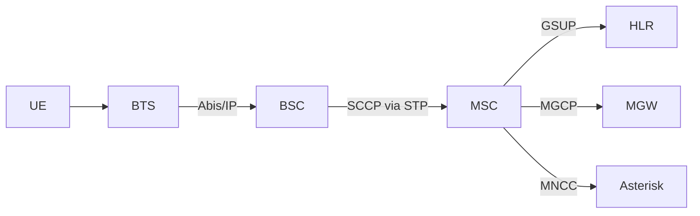
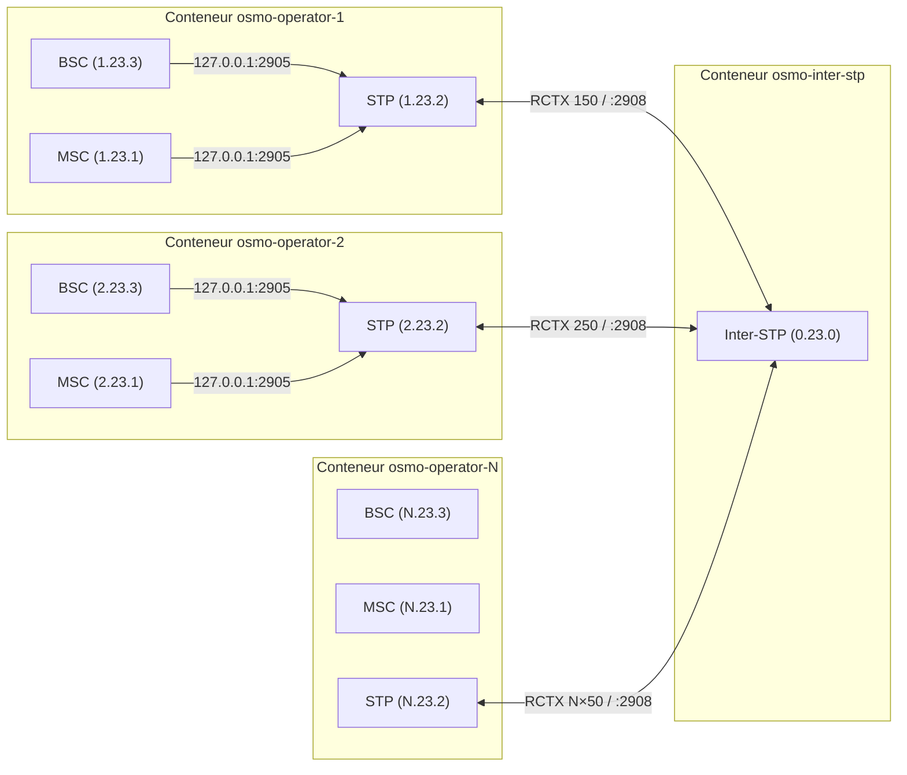
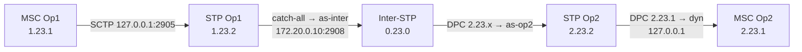
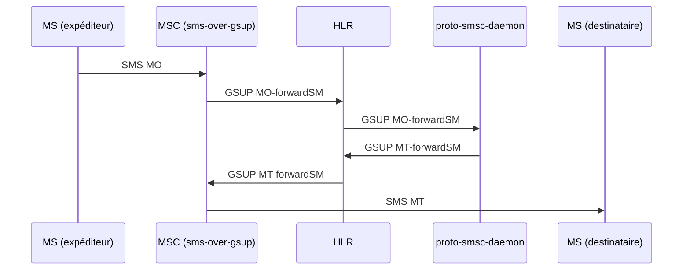
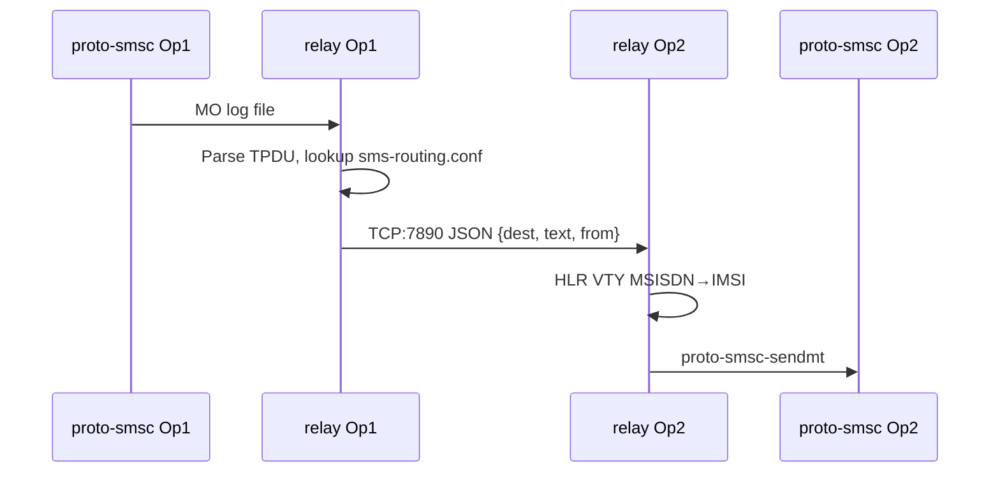
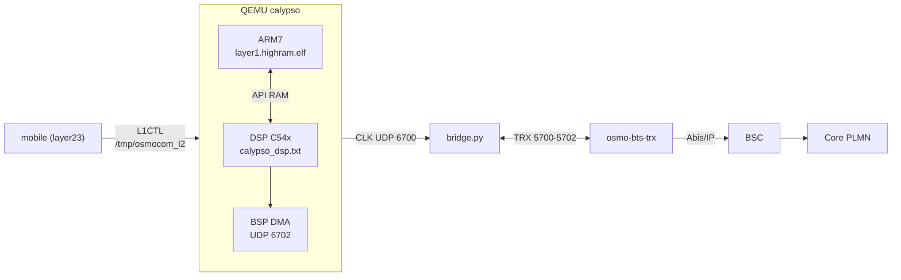

::: {.sk-filter}
<input id="sk-filter" type="text" placeholder="filtrer les fichiers (ex: dsp, .c, shunt)..." autocomplete="off">
:::

::: {.callout-note appearance="simple" icon=false}
**Bundle plat du depot** - doc, tests, headers, sources, python, shell.
Scope `.` - git `RELEASE-0.1@55d1e4a` - genere 2026-08-28T15:18:45+02:00
- exclusions `subprojects|build|pc-bios|tests/functional|tests/qtest|tests/unit|tests/migration|tests/qemu-iotests|node_modules|\.git|\.pytest_cache` - troncature 512 ko/fichier.
:::


# 1 - Documentation {#sec-1}

::: {.section-count}
**5 fichiers**
:::

## `environment/README.md` {#f-environment-readme-md}

::: {.file-meta}
[.md]{.tag} 85 lignes - 3,7KB
:::

````{.markdown .numberLines filename="environment/README.md"}
# `environment/` — la configuration, par domaine

`calypso.env` mélangeait 312 variables : chemins d'installation, cadences du modèle, sondes de
mesure et contournements, sans distinction. Ce répertoire les sépare **par ce qu'elles font**,
pour qu'on sache ce qu'on a le droit de toucher.

| Fichier | Domaine | Touchez-y ? |
|---|---|---|
| `paths.env` | où sont les dépendances sur **votre** machine | **oui**, c'est le premier à régler |
| `modes.env` | les profils prêts à l'emploi (le mode qui campe, le mode natif…) | **oui**, choisissez-en un |
| `bsp.env` | BSP / DMA / DARAM / feed I-Q / horloge TDMA | si vous savez ce que vous faites |
| `dsp.env` | cœur c54x : interruptions, IMR, cadence d'exécution | idem |
| `fbsb.env` | FB / FBSB / corrélateur / démodulateur | idem |
| `shunt.env` | canaux shunt DL/UL, injections | idem |
| `rf.env` | TPU / TSP / RF / AFC | idem |
| `debug.env` | sondes et traces — **sans effet** sur l'émulation | **oui**, librement |
| `fixes.env` | le sas `CALYPSO_FIXES` : correctifs en attente de validation | temporairement |
| `crutches.env` | **les béquilles** — contournements de branches non implémentées | **non**, sauf pour diagnostiquer |

## Trois choses à savoir avant de modifier quoi que ce soit

**1. La vérité est le manifeste, pas la ligne de commande.**
```bash
grep "calypso-manifest" /root/qemu.log
```
Certaines variables en reposent d'autres silencieusement : `CALYPSO_NATIVE_HELPED=1` allume aussi
`FB_CORR_ENTRY`, `FB_ENERGY` et `FB_IQ_*`. Retirer l'une d'elles de la ligne de commande ne la
supprime pas — elle revient à son défaut.

**2. `=0` ne coupe pas tout.** Quatre idiomes de gate coexistent :

| Idiome | Actif quand | Comment couper |
|---|---|---|
| `getenv("X") ? 1 : 0` | la variable **existe**, même à `0` | **`unset X`** |
| `atoi(...) > 0` | valeur > 0 | `X=0` |
| `*e == '1'` | exactement `"1"` | toute autre valeur |
| défaut ON + `X_OFF` | par défaut | poser `X_OFF` |

**3. `:=` contre `=`.** Dans ces fichiers, `: "${VAR:=valeur}"` laisse la ligne de commande gagner ;
`VAR=valeur` la **verrouille**. N'utilisez `=` que pour ce qui ne doit jamais être surchargé.

## Référence complète

Les 312 variables, avec défaut, effet mesuré, mode, idiome, catégorie et dépendances :
`../hw/arm/calypso/doc/VARIABLES_ENVIRONNEMENT.md`.


## Comment ça se charge

Tout passe par `load.env`, sourcé par `start-clean.sh` :

```bash
set -a ; . ./environment/load.env ; set +a
```

L'ordre compte. Tous les fichiers utilisent `:=` (« si pas déjà défini »), donc **le premier qui
pose une valeur gagne** :

1. la **ligne de commande** — `VAR=x ./run.sh` gagne toujours ;
2. `modes.env` — le profil choisi ;
3. les fichiers par domaine — les défauts ;
4. `calypso.env` — l'ancien monolithe, conservé le temps de la migration. Il n'utilise que `:=`,
   donc il ne peut rien écraser : il ne fournit que ce qui n'a pas encore été réparti. À vider
   progressivement.

## Les fichiers hérités

`calypso.env`, `calypso_hack.env`, `calypso_native*.env`, `calypso_shunt_*.env`, `calypso_wire.env`
datent d'avant ce découpage. Ils sont conservés — on ne détruit pas ce qui marche — mais la
configuration nouvelle vit dans les fichiers par domaine.

## Ce que contient chaque domaine

| Fichier | Variables | dont béquilles |
|---|---|---|
| `bsp.env` | 52 | 10 |
| `dsp.env` | 52 | 15 |
| `fbsb.env` | 52 | 25 |
| `shunt.env` | 58 | 34 |
| `armdsp.env` | 47 | 16 |
| `opcodes.env` | 50 | 16 |

**116 béquilles sur 311 variables** — plus d'un tiers du projet est du contournement. Chacune est
annotée à son site de lecture dans le code (`grep -rn "@BEQUILLE" hw/arm/calypso/`), avec ce
qu'elle masque et la condition qui la rendrait inutile.

````

## `navigation/QUICKSTART.md` {#f-navigation-quickstart-md}

::: {.file-meta}
[.md]{.tag} 158 lignes - 6,9KB
:::

```{.markdown .numberLines filename="navigation/QUICKSTART.md"}
# Console SS7 - demarrage rapide

Tout vit dans `navigation/`. Aucune dependance : python3 de la distribution
suffit. Rien n'est ecrit en dur : point codes, hub, ports et abonnes sont lus
dans les conteneurs et dans les configurations du depot.

## 1. En trente secondes

    cd /home/nirvana/osmo_egprs
    sudo ./start.sh --wan --operators 2 --hub-ip 192.168.1.49   # le lab
    ./ss7-console.py                                            # le schema

Le schema s'ouvre. On circule **aux fleches**, on ouvre avec **Entree**, on
revient avec **Echap**. `q` quitte.

## 2. Les touches

| Touche | Effet |
|---|---|
| fleches | se deplacer de boite en boite, dans l'espace du schema |
| Entree | ouvrir le menu de l'element selectionne |
| Echap | revenir en arriere ; **dans un VTY : fermer CE VTY** et revenir au schema |
| Tab | element suivant |
| `v` | ouvrir directement le VTY de l'element |
| `s` | scripts SS7 (operations MAP) |
| `a` | audit SS7 (DAUD) d'un point code |
| `c` | connecter / deconnecter le lien M3UA de la console |
| `j` | journal du lien M3UA |
| `r` | relire la topologie |
| `?` | aide |

Dans un VTY : `Entree` envoie, haut/bas rejouent l'historique,
PagePrec/PageSuiv font defiler, `Echap` ferme la session. Les autres VTY
restent ouverts : une session par port, independantes.

## 3. Ce que montre le schema

    CONSOLE SS7 ---M3UA--- INTER-STP (hub)
                                |
                +---------------+---------------+
             OP1 - STP                       OP2 - STP
             1.11.2                          1.21.2
                |                               |
       STP  MSC/VLR  HLR  BSC  BTS  MGW  SGSN  GGSN  ...

Chaque boite de service porte son port VTY. Les couleurs suivent la famille :
SS7, coeur, abonnes, radio, media, data.

## 4. Sans interface : la ligne de commande

    ./ss7-console.py list                 inventaire (PC, hub, SCCP, VTY)
    ./ss7-console.py ops                  catalogue des operations MAP
    ./ss7-console.py vty 1 4258 "show subscribers all"
    ./ss7-console.py audit 1.11.1         le "ping" SS7 (DAUD -> DAVA/DUNA)
    ./ss7-console.py map sri-sm --pc 1.11.6 msisdn=600101 sc_addr=600999
    ./ss7-console.py serve                repondeur MAP (HLR simule)

`vty <n>` accepte le numero d'operateur ou le nom du conteneur.

## 5. Les operations MAP

| Cle | Operation | Opcode | SSN vise |
|---|---|---|---|
| `sri-sm` | sendRoutingInfoForSM | 45 | 6 (HLR) |
| `sri` | sendRoutingInfo | 22 | 6 |
| `ati` | anyTimeInterrogation | 71 | 6 |
| `sai` | sendAuthenticationInfo | 56 | 6 |
| `send-imsi` | sendIMSI | 58 | 6 |
| `psi` | provideSubscriberInfo | 70 | 7 (VLR) |
| `ul` | updateLocation | 2 | 6 |
| `raw` | invoke brut (opcode + parametre hexa) | - | - |

La console est un **vrai** point SS7 : elle s'attache a l'inter-STP en M3UA sur
SCTP, enregistre dynamiquement une routing key pour son point code (RKM), passe
ASP_ACTIVE, puis emet du TCAP/MAP qui traverse le hub comme le trafic des
operateurs. Chaque envoi peut etre exporte en script Python autonome
(`navigation/scripts/<operation>-<horodatage>.py`).

## 6. Le repondeur : un aller-retour MAP complet

Osmocom fait dialoguer MSC et HLR en **GSUP**, pas en MAP : un SRI-SM envoye au
vrai HLR ne trouve personne. Le repondeur comble ce trou en repondant avec les
donnees du VRAI HLR (lues par VTY), a travers le vrai hub.

    # terminal A
    ./ss7-console.py serve
    # terminal B
    ./ss7-console.py map sri-sm --pc 1.11.6 msisdn=600101 sc_addr=600999

    resultat (opcode 45) :
       IMSI                         001010001000001
       Noeud de service             +600101

## 7. Diagnostic et tests

    ./navigation/ss7-diag.py             diagnostic SS7 complet
    ./navigation/ss7-diag.py --rapide    sans M3UA ni MAP
    ./navigation/test-console.sh         teste CHAQUE commande, un log par test

`ss7-diag.py` verifie, dans l'ordre ou une panne se lit : environnement (SCTP),
topologie heritee des configs, STP/MSC/BSC/HLR de chaque operateur, association
SCTP vers le hub, attachement de la console comme ASP, audit de tous les point
codes connus, puis un aller-retour MAP reel. Le code de sortie est le nombre
d'echecs.

`test-console.sh` ecrit un fichier par commande dans
`navigation/logs/<horodatage>/`, plus un `rapport.txt`.

## 8. A savoir sur ce lab

- **Le lien M3UA depuis l'hote ne vit que quelques secondes.** L'inter-STP
  cesse de servir une association venue de l'hote au bout de ~3 s, et
  l'association SCTP expire vers 35 s. La console la renouvelle toute seule
  avant chaque echange (~0,3 s) : c'est invisible, mais cela explique un
  eventuel "pas de reponse" suivi d'un second essai qui marche.
- **Le hub refuse le parametre "Service Indicators"** dans une routing key
  (registration status 9). Il est donc omis.
- **Il faut proposer son propre routing context** : sans cela le hub rend le
  meme contexte a deux ASP differents, et en `traffic-mode override` le dernier
  attache vole le trafic du premier (la destination du premier passe DUNA).
- **Le DATA part sur le flux SCTP 1** : le flux 0 est reserve a la gestion, et
  un DATA dessus est refuse ("Invalid Stream Identifier").
- **Les point codes sont au format ITU 3-8-3** : `a.b.c` avec a et c de 0 a 7,
  b de 0 a 255. `1.11.60` n'existe pas - il serait recu comme `1.15.4`.
- Les point codes de la console (`1.11.7`, `1.11.6`...) laissent des routes
  dynamiques `PROHIB` dans les STP operateur quand elle se ferme : c'est normal,
  elles repassent `avail` au retour.

## 9. Les modules

| Fichier | Role |
|---|---|
| `topo.py` | inventaire : conteneurs, env, `/etc/osmocom/*.cfg`, ports VTY |
| `vty.py` | sessions VTY persistantes par `docker exec` |
| `diagram.py` | le schema et la navigation spatiale aux fleches |
| `tui.py` | l'interface curses (schema, menus, formulaires, VTY) |
| `ber.py` | BER/DER minimal |
| `sccp.py` | SCCP UDT/UDTS, adresses, global titles, TBCD |
| `tcap.py` | TCAP begin/end, invoke, returnResult, returnError, AARQ/AARE |
| `mapops.py` | catalogue MAP : encodeurs, decodeurs, erreurs |
| `m3ua.py` | ASP M3UA sur SCTP : ASPUP, RKM, ASPAC, DATA, battement |
| `ss7.py` | la couche qui relie tout, et le compte rendu lisible |
| `responder.py` | repondeur MAP adosse au vrai HLR |
| `quickcmd.py` | commandes VTY utiles, par demon |
| `ss7-console.py` | point d'entree (schema + sous-commandes) |
| `ss7-diag.py` | diagnostic complet |
| `test-console.sh` | test de chaque commande, avec journaux |

## 10. Depannage

| Symptome | Cause probable |
|---|---|
| `aucun inter-STP connu` | lab arrete, ou `--hub-ip` jamais donne a `start.sh` |
| `le conteneur ... ne tourne pas` | `docker ps` ne le voit plus |
| `VTY ... injoignable` | le demon n'est pas lance dans ce conteneur |
| `Aucune reponse` a un MAP | personne n'ecoute ce SSN : lancez `serve` |
| fleches sans effet | terminal en mode curseur normal - deja gere, sinon `TERM=xterm` |
| `DUNA` sur un point code | l'ASP de cette destination n'est pas attache au hub |

```

## `navigation/STATUS.md` {#f-navigation-status-md}

::: {.file-meta}
[.md]{.tag} 122 lignes - 6,9KB
:::

```{.markdown .numberLines filename="navigation/STATUS.md"}
# Etat des lieux et reste a faire

Derniere mise a jour : 2026-08-26, lab a l'arret (conteneurs `Exited (127)`).

## 1. Ce qui est fait et verifie

### Correctifs du depot

| Fichier | Correctif | Verifie |
|---|---|---|
| `start.sh` | `asound.conf` : Docker avait cree un REPERTOIRE a la place du fichier, le mount echouait (`not a directory`). Le repertoire parasite est supprime avant la copie, la copie est verifiee, sinon repli propre sur `ALSA_*=default`. | oui, `bash -n` + repertoire nettoye |
| `start.sh` | `--hub-ip` et `--node-per-op` posent `WAN_MESH=1` : sans cela le plan de point codes retombait sur le plan LOCAL (1.1.2 / 1.2.2, rctx 150 / 250), identique sur chaque machine du WAN. | syntaxe ; **a rejouer sur le lab** |
| `start.sh` | le rang d'operateur passe a `start-direct.sh` (`--op N`) au lieu de `--op 1` fige : `set-node-id.sh` reecrivait les configs de l'operateur 2 avec l'identite de l'operateur 1. | syntaxe ; **a rejouer** |
| `start.sh` | garde-fou : `--node-per-op` refuse un numero de noeud hors de 1..9 avec un message qui dit quoi faire. | syntaxe ; **a rejouer** |
| `checks/_mode.sh` | decouverte du hub distant (env des conteneurs puis `osmo-stp.cfg`), point codes libres au format ITU 3-8-3, sonde d'association SCTP. | oui, sur le lab |
| `checks/ss7_check.sh` | mode WAN : « Container absent » remplace par « hub distant + lien M3UA/SCTP », matrice de connectivite reactivee, route par defaut enfin verifiee. | oui : 19 pass, 0 warn |
| `checks/wan_ss7_check.sh` | le hub parle SCTP : la sonde `nc -z 2908` (TCP) rendait « injoignable » sur un lien parfait. Remplacee par l'association SCTP reelle. `HUB_IP` lu dans les conteneurs. | oui : 25 ok, 0 echec |
| `checks/operator_summary.sh` | section « hub distant » quand il ne figure pas dans le dump. | oui |

### Console SS7 (`navigation/`)

14 modules, ~4300 lignes de Python, sans dependance. Schema navigable aux
fleches, VTY par noeud (Echap ferme la session), ASP M3UA reel sur le hub,
operations MAP, repondeur, diagnostic, tests.

Verifie sur le lab en marche :

- schema rendu et navigation spatiale (pilotage sous pty) ;
- VTY OsmoBSC ouvert, commande envoyee, sortie reelle, Echap ferme ;
- ASP M3UA : ASPUP / RKM / ASPAC -> `ASP_ACTIVE` sur `192.168.1.49:2908` ;
- DAUD : `DAVA` sur les 6 point codes du lab, `DUNA` sur un PC inexistant ;
- aller-retour MAP complet : `sendRoutingInfoForSM 600101` -> `IMSI
  001010001000001`, a travers le hub ;
- `ss7-diag.py` : 25 ok ;
- `test-console.sh` : 10 tests passes avec le lab a l'arret (3 ignores), un
  journal par commande.

### Ce que le lab nous a appris (garde dans le code, avec le pourquoi)

- le hub REFUSE le parametre « Service Indicators » d'une routing key ;
- il faut PROPOSER son routing context, sinon deux ASP recoivent le meme et,
  en `traffic-mode override`, le dernier vole le trafic du premier ;
- le DATA doit partir sur le flux SCTP 1 (le 0 est reserve a la gestion) ;
- une association venue de l'HOTE n'est servie que ~3 s, puis expire vers 35 s :
  la console renouvelle son lien avant chaque echange.

## 2. Ce que l'audit de la numerotation a trouve

Quatre cartographies (point codes, abonnes, indicatifs WAN, identifiants
reseau) confrontees aux sources. **12 problemes bloquants**, dont 3 corriges
ci-dessus. Les 9 autres, par ordre d'urgence :

### Bloquants, non corriges

1. **Le MSISDN n'encode aucun noeud** — `600000 + op*100 + rang`, et le Ki n'en
   depend pas non plus. Deux noeuds portent le meme `600101` avec le meme Ki ;
   seul l'IMSI (via le MCC) les separe. Des qu'un chemin oublie de prefixer
   l'indicatif, il tombe sur l'homonyme local. `start.sh:1436-1437`.
2. **ISO : meme IMSI, meme MSISDN, meme Ki sur tous les noeuds** — `build-iso.sh`
   fige `MCC=001 MNC=01 op_id=1`, ce qui contredit `op_mcc() = noeud`.
   `build-iso.sh:289-290,369-373`.
3. **`--node-per-op` : l'operateur 2 d'un noeud distant est injoignable** — ses
   MSISDN sont `600201` mais le maillage ne genere que `_<ind>6001XX`.
   `network/setup-wan-mesh.sh:602,763` vs `start.sh:1678`.
4. **`globals.conf` ecrase l'environnement** au lieu de le completer :
   `ARFCN=520 ./start-direct.sh` est remis a vide. `globals.conf:23-45`.
5. **ARFCN / BSIC / LAC / CI ne dependent que de l'operateur** — deux noeuds
   diffusent `ARFCN 514 / BSIC 7 / LAC 0x0001 / CI 6001`. `generate_configs.sh:287-306`.
6. **Le garde-fou `_gc_warn_perop` ne tourne jamais** sur le chemin reel (mode
   source) et teste `N_OPERATORS`, que `start.sh` ne lit nulle part.
7. **La plage RTP du MGW (4002-16001) recouvre tous les ports de service** du
   conteneur, VTY compris. `configs/osmo-mgw.cfg:70-71`.
8. **`node_nops` : repli mort** — `WAN_NOPS[id]=1` est toujours pose, donc un
   pair est toujours vu a 1 operateur. `network/wan-nodes.sh:109-120`.
9. **La grille d'AS du hub est indexee par RANG, pas par numero de noeud** — une
   table `1: 3: 5:` produit `as-n1 as-n2 as-n3`. `helpers/create_interop.sh:118-130`.

### Serieux, notables

- trois replis divergents pour MCC/MNC (`start-direct.sh`, `run_modules/21`,
  `scripts/sms-routing-setup.sh`) ;
- seules 2 routes SMS locales generees quel que soit `OP_MS` ;
- `checks/diag-stp-operator.sh` et `wan_ss7_check.sh` figent l'operateur a 1 ;
- deux identites de noeud pour la meme machine en `--node-per-op` ;
- aucun routage par global title (tout est en PC/SSN 254).

## 3. Reste a faire

### Priorite 1 — rejouer ce qui est corrige

- [ ] relancer le lab et verifier les 3 correctifs `start.sh` :
      `sudo ./start.sh --wan --operators 2 --hub-ip 192.168.1.49`
      puis `./navigation/ss7-diag.py` (attendu : 2 PC distincts par operateur,
      rctx distincts, aucun `DUNA` sur les PC du lab) ;
- [ ] `./navigation/test-console.sh` lab en marche (les 3 sections ignorees
      doivent passer).

### Priorite 2 — numerotation

- [ ] trancher le plan MSISDN : y encoder le noeud, ou assumer que l'indicatif
      est le seul discriminant et verifier CHAQUE chemin qui le retire ;
- [ ] `build-iso.sh` : deriver MCC/MNC/op_id du `--node`, comme `start.sh` ;
- [ ] `generate_configs.sh` : indexer ARFCN / BSIC / LAC / CI par noeud ;
- [ ] `globals.conf` : passer aux affectations `${VAR:=...}` pour tenir la
      promesse du commentaire, ou corriger le commentaire ;
- [ ] `network/wan-nodes.sh` : ne poser `WAN_NOPS` que si le champ existe.

### Priorite 3 — outillage

- [ ] `checks/diag-stp-operator.sh` : ne plus figer l'operateur 1 ;
- [ ] console : bornes du repondeur (plusieurs operateurs, choix du SSN) ;
- [ ] console : rejouer un script exporte (`navigation/scripts/`) depuis le
      schema.

## 4. Points d'attention

- `navigation/` appartient a `nirvana:nirvana` ; `start.sh` reste `root:root`
  comme avant.
- Sauvegardes : `start.sh.bak.20260826-221924` (asound) et
  `start.sh.bak.*-numerotation` (les 3 correctifs), `checks/*.bak`.
- L'audit complet (phase 2 et 3 du workflow) n'a pas ete rejoue : seules les
  quatre cartographies ont abouti. Leurs conclusions sont resumees ici.

```

## `README.md` {#f-readme-md}

::: {.file-meta}
[.md]{.tag} 552 lignes - 19KB
:::

````{.markdown .numberLines filename="README.md"}
# osmo-nitb-for-calypso — Architecture Multi-PLMN SS7/IP

Standalone mode (no interstp)
```bash
sudo docker pull bastienbaranoff/norf_gsm
sudo docker tag bastienbaranoff/norf_gsm osmocom-nitb
git clone https://github.com/bbaranoff/osmo_egprs
cd osmo_egprs
sudo ./start.sh
```
To go in container
```bash
sudo docker exec -ti osmo-operator-1 bash
``` 

then in docker container
```bash
cd /opt/GSM/osmo_egprs
./start-direct.sh --regen
./start-direct.sh --stop
./start-direct.sh
```


Documentation d'architecture du projet **osmo-nitb-for-calypso** : simulation multi-opérateur GSM complète avec interconnexion SS7 sur IP, entièrement conteneurisée via Docker.

Ce projet réalise ce qui s'apparente à un « DHCP pour SS7 » — l'automatisation complète d'une configuration SS7 inter-opérateurs habituellement réalisée à la main, reproductible d'un simple `tools/make-docker-image.sh && start.sh`.

**Support N opérateurs** : le démarrage en mode bridge accepte de 1 à 9 opérateurs sans modifier aucune configuration. Tous les fichiers (pjsip, dialplan, SMS routing, inter-STP) sont générés dynamiquement selon N.

---

## 1. Architecture d'un PLMN (Osmocom)

Chaque opérateur simulé repose sur la stack Osmocom standard, tous les composants dans un seul conteneur Docker.



Tous ces composants tournent dans le même conteneur et communiquent via `127.0.0.1`. Le STP local sert de hub de signalisation intra-PLMN.

---

## 2. Interconnexion Multi-PLMN

L'architecture centrale du projet. N opérateurs distincts, chacun avec son core network dans un conteneur dédié, reliés par un Inter-STP central qui route la signalisation M3UA/SCCP entre eux.



---

## 3. Topologie réseau Docker

### 3.1 Réseaux

| Réseau Docker | Plage | Rôle |
|---------------|-------|------|
| `gsm-inter` | `172.20.0.0/24` | Backbone interop (M3UA inter-STP) |
| `gsm-net-opN` | `172.20.N.0/24` | Réseau privé opérateur N (GSMTAP, GPRS) |

### 3.2 Adresses IP

| Composant | IP backbone (`gsm-inter`) | IP privée (`gsm-net-opN`) |
|-----------|--------------------------|--------------------------|
| Inter-STP | `172.20.0.10` | — |
| Conteneur OpN | `172.20.0.(10+N)` | `172.20.N.10` |

**Formule générale** : opérateur N → backbone `172.20.0.(10+N)`, privé `172.20.N.10`

### 3.3 Communication intra-conteneur

Tous les composants communiquent via `127.0.0.1` (fix de la race condition Docker) :

```
BSC ──(127.0.0.1:2905)──► STP local
MSC ──(127.0.0.1:2905)──► STP local
MSC ──(127.0.0.2:4222)──► HLR
MSC ──(127.0.0.1:2427)──► MGW
```

Le STP écoute sur `127.0.0.1:2905` immédiatement, sans dépendre de l'interface réseau Docker (attachée après démarrage du container via `docker network connect`).

### 3.4 Communication inter-conteneur

Uniquement le lien STP↔Inter-STP traverse le réseau Docker :

```
STP OpN (172.20.0.(10+N)) ──SCTP──► Inter-STP (172.20.0.10:2908)
```

---

## 4. Signalisation SS7

### 4.1 Point codes

Format ITU 14-bit (3.8.3 : `zone.network.node`)

| Nœud | Point Code | Formule |
|------|-----------|---------|
| Inter-STP | `0.23.0` | fixe |
| MSC OpN | `N.23.1` | zone=N |
| STP OpN | `N.23.2` | zone=N |
| BSC OpN | `N.23.3` | zone=N |

### 4.2 Routing Contexts (RCTX)

| RCTX | Formule | Usage |
|------|---------|-------|
| `N×100+10` | `rctx_msc` | MSC OpN → STP OpN |
| `N×100+20` | `rctx_stp` | STP OpN (registration) |
| `N×100+30` | `rctx_bsc` | BSC OpN → STP OpN |
| **`N×100+50`** | **`rctx_inter`** | **STP OpN → Inter-STP** |

Le RCTX inter (`N×100+50`) est le plus critique : il doit correspondre dans `osmo-stp.cfg` (STP opérateur) et être cohérent avec la connexion vers l'inter-STP.

### 4.3 Configuration inter-STP (générée)

L'inter-STP utilise des **AS sans routing-key** (catch-all par opérateur). Le routage se fait uniquement sur le DPC :

```
cs7 instance 0
 point-code 0.23.0
 listen m3ua 2908
  accept-asp-connections dynamic-permitted

 as as-opN m3ua
  traffic-mode override     ← PAS de routing-key

 route-table system
  update route N.23.1 7.255.7 linkset as-opN
  update route N.23.2 7.255.7 linkset as-opN
  update route N.23.3 7.255.7 linkset as-opN
```

### 4.4 Chemin complet d'un message SS7



---

## 5. Génération dynamique — N opérateurs

Toutes les configurations dépendant de N sont **générées au démarrage**. Aucun fichier template ne contient de valeur hardcodée pour un nombre spécifique d'opérateurs.

### 5.1 Template engine (placeholders)

`apply_config_templates()` dans `start.sh` résout en **1 seul passage `sed`** :

| Placeholder | Formule | Exemple N=2 |
|------------|---------|-------------|
| `__PC_MSC__` | `N.23.1` | `2.23.1` |
| `__PC_STP__` | `N.23.2` | `2.23.2` |
| `__PC_BSC__` | `N.23.3` | `2.23.3` |
| `__RCTX_MSC__` | `N×100+10` | `210` |
| `__RCTX_BSC__` | `N×100+30` | `230` |
| `__RCTX_INTER__` | `N×100+50` | `250` |
| `__ARFCN__` | `512+N×2` | `516` |
| `__INTER_LOCAL_IP__` | `172.20.0.(10+N)` | `172.20.0.12` |
| `__CONTAINER_IP__` | `172.20.N.10` | `172.20.2.10` |

### 5.2 Sections générées (dépendent de N total)

Après la substitution sed, `start.sh` **appende** à chaque opérateur :

| Section | Fichier | Contenu |
|---------|---------|---------|
| Trunks PJSIP | `pjsip.conf` | N-1 blocs `[interop_trunk_opX]` |
| Dialplan sortant | `extensions.conf` | Contexte `[interop_out]` avec N-1 extensions |
| Routage SMS | `sms-routing.conf` | Table complète pour N opérateurs |
| Config inter-STP | `osmo-stp-interop.cfg` | N AS + N×3 routes SS7 |

### 5.3 Séquence de démarrage

```
./start.sh  [bridge mode]
 ├── Saisie N opérateurs + MCC/MNC/nom par opérateur
 ├── Création réseau gsm-inter (172.20.0.0/24)
 ├── create_interop.sh N → osmo-stp-interop.cfg
 ├── Lancement osmo-inter-stp (doit écouter :2908 AVANT les opérateurs)
 └── Pour chaque opérateur N :
      ├── apply_config_templates (sed + génération sections dynamiques)
      ├── docker run sur gsm-inter @ 172.20.0.(10+N)
      ├── docker network connect gsm-net-opN @ 172.20.N.10
      └── Services via run.sh + tmux
```

L'ordre est critique : l'Inter-STP doit écouter avant que les STPs opérateurs tentent de s'y connecter.

---

## 6. SMS

### 6.1 SMS intra-opérateur



### 6.2 SMS inter-opérateur

`sms-interop-relay.py` surveille le log MO de `proto-smsc-daemon`, parse le TPDU GSM 03.40, consulte `sms-routing.conf` (longest-prefix match), et transfère via TCP port 7890 au relay de l'opérateur cible.



---

## 7. Voix

### 7.1 Intra-opérateur

```
MS → BTS → BSC → MSC → MNCC → Asterisk → MNCC → MSC → BSC → BTS → MS
                              ↕ MGCP
                            OsmoMGW (RTP)
```

### 7.2 Inter-opérateur

```
MS(OpX) → MSC(OpX) → MNCC → Asterisk(OpX)
              ─── SIP trunk 172.20.0.(10+X) ↔ 172.20.0.(10+Y) ───
                               Asterisk(OpY) → MNCC → MSC(OpY) → MS(OpY)
```

Le dialplan `[interop_out]` route automatiquement sur le premier chiffre du numéro composé (convention : chiffre N = opérateur N). Pour 3 opérateurs, Op1 a des trunks vers Op2 et Op3, etc.

---

## 8. Utilisation du lab

### 8.1 Démarrage et arrêt

```bash
sudo ./tools/make-docker-image.sh          # Build l'image Docker (1 fois)
sudo ./start.sh          # Lance tout (choisir bridge, saisir N opérateurs)
sudo ./start.sh stop     # Arrête tous les containers

sudo ./provision_hlr.sh  # Provisionne les abonnés de test dans les HLR
```

Trois modes PHY pour le côté MS, sélectionnés via `PHY_MODE` à l'intérieur du
container avant d'invoquer `run.sh` :

| `PHY_MODE` | Pile | Usage |
|------------|------|-------|
| `faketrx` (défaut) | `fake_trx` → `trxcon` → `mobile` | Multi-MS, rapide, pas de DSP |
| `virtphy` | `osmo-bts-virtual` ↔ `virtphy` ↔ `mobile` | Multi-MS via multicast UDP |
| `qemu` | `osmo-bts-trx` ↔ `bridge.py` ↔ QEMU Calypso ↔ `mobile` | Baseband émulé (ARM7+DSP), 1 MS |

Voir §11 pour le mode QEMU.

### 8.2 Accès aux containers

```bash
# Opérateur N — tmux avec STP/MSC/HLR/BSC/BTS/SMSC
sudo docker exec -ti osmo-operator-1 tmux attach
sudo docker exec -ti osmo-operator-2 tmux attach
sudo docker exec -ti osmo-operator-N tmux attach

# Inter-STP
sudo docker exec -ti osmo-inter-stp tmux attach -t stp
```

### 8.3 Navigation tmux

| Raccourci | Fenêtre |
|-----------|---------|
| `Ctrl-b 0` | faketrx |
| `Ctrl-b 1` | MS1 (trxcon + mobile) |
| `Ctrl-b 2` | Asterisk |
| `Ctrl-b 3` | SMSC (proto-smsc-daemon + relay) |
| `Ctrl-b w` | Liste toutes les fenêtres |
| `Ctrl-b d` | Détacher |

### 8.4 Interfaces VTY (telnet depuis le container)

| Port | Composant |
|------|-----------|
| `4239` | OsmoSTP |
| `4242` | OsmoBSC |
| `4243` | OsmoMGW |
| `4254` | OsmoMSC |
| `4258` | OsmoHLR |

### 8.5 Commandes VTY essentielles

```
# Sur STP (4239) — diagnostic SS7
OsmoSTP> show cs7 instance 0 asp          # État ASP (ACTIVE/DOWN)
OsmoSTP> show cs7 instance 0 as all       # État AS
OsmoSTP> show cs7 instance 0 route        # Table de routage — PROHIB ?

# Sortie saine STP OpN :
# N.23.1/14   as-dyn-…  avail  avail  dyn   ← MSC (dynamique)
# N.23.3/14   as-dyn-…  avail  avail  dyn   ← BSC (dynamique)
# 0.0.0/0     as-inter  avail  avail        ← catch-all inter-STP

# Sur MSC (4254)
OsmoMSC# subscriber msisdn 10001 sms sender msisdn 10002 send Bonjour
OsmoMSC# show subscriber all

# Sur HLR (4258)
OsmoHLR# subscriber imsi 001010000000001 show
OsmoHLR# show gsup-clients
```

### 8.6 Wireshark

Lancé automatiquement sur le bridge Docker avec filtre `sctp or udp port 4729`.

```
m3ua                      # Trafic M3UA uniquement
sccp                      # Messages SCCP
gsm_map                   # Messages MAP
gsmtap                    # Trafic radio (Um)
sctp.srcport == 2908      # Trafic vers/depuis l'inter-STP
```

---

## 9. Diagnostic — Résoudre les PROHIB

```bash
# 1. L'inter-STP tourne-t-il ?
sudo docker ps | grep inter-stp

# 2. L'ASP vers l'inter-STP est-il ACTIVE ?
sudo docker exec osmo-operator-1 sh -c \
  'echo "show cs7 instance 0 asp" | telnet 127.0.0.1 4239 2>/dev/null'

# 3. L'inter-STP voit-il les opérateurs ?
sudo docker exec osmo-inter-stp sh -c \
  'echo "show cs7 instance 0 asp" | telnet 127.0.0.1 4239 2>/dev/null'

# 4. Les routes locales (BSC/MSC) existent-elles ?
sudo docker exec osmo-operator-1 sh -c \
  'echo "show cs7 instance 0 route" | telnet 127.0.0.1 4239 2>/dev/null'

# 5. Connectivité backbone
sudo docker exec osmo-operator-1 ping -c1 172.20.0.10

# 6. Race condition → redémarrer l'opérateur
sudo docker restart osmo-operator-1
```

| Symptôme | Cause probable | Fix |
|----------|---------------|-----|
| Route 0.0.0/0 PROHIB | Inter-STP pas démarré ou IP incorrecte | Vérifier `INTER_STP_IP` et backbone IP |
| Pas de routes dynamiques | MSC/BSC ne se connectent pas au STP | Vérifier que les ASP pointent sur `127.0.0.1` |
| ASP DOWN sur inter-STP | Race condition Docker | `docker restart` de l'opérateur |

---

## 10. Plan de numérotation

Convention par défaut (modifiable) :

| Numéro | Usage |
|--------|-------|
| `N0001`…`N9999` | Abonnés GSM opérateur N |
| `100` | Linphone A (softphone local) |
| `200` | Linphone B (softphone local) |
| `600` | Echo test |
| `9XXXXX` | Sortie inter-op depuis softphone (9 + numéro complet) |

Le premier chiffre d'un numéro NXXXX identifie l'opérateur. Le dialplan `[gsm_in]` détecte automatiquement si la destination est locale ou inter-op.

---

## 11. RAN virtuel QEMU (PHY_MODE=qemu)

Le projet intègre [bbaranoff/qemu](https://github.com/bbaranoff/qemu) — un fork
de QEMU avec une machine `calypso` qui émule le SoC GSM TI Calypso (ARM7TDMI +
DSP TMS320C54x). Cela permet d'exécuter le **vrai firmware** OsmocomBB
`layer1.highram.elf` au-dessus d'un baseband virtualisé, sans aucun hardware.

### 11.1 Architecture



- **ARM7** exécute le firmware osmocom-bb compilé dans le conteneur.
- **DSP C54x** charge le ROM Calypso réel (`calypso_dsp.txt`, dumpé d'un téléphone).
- **`bridge.py`** (Python) relaie les bursts entre `osmo-bts-trx` (UDP 5700-5702)
  et la BSP du DSP (UDP 6702). QEMU est maître d'horloge TDMA et envoie des
  ticks sur UDP 6700 ; bridge synthétise des `IND CLOCK` à cadence wall-clock
  pour le BTS, en piochant le FN de QEMU.
- **`mobile`** se connecte au socket L1CTL `/tmp/osmocom_l2` publié par QEMU
  via la PTY série du firmware (sercomm DLCI 5).

### 11.2 Composants ajoutés au conteneur

| Composant | Path container | Source |
|-----------|---------------|--------|
| `qemu-system-arm` (machine `calypso`) | `/usr/local/bin/qemu-system-arm` | bbaranoff/qemu |
| Firmware Calypso layer1 | `${GSM_ROOT}/firmware/board/compal_e88/layer1.highram.elf` | osmocom-bb (build container) |
| ROM DSP | `${GSM_ROOT}/calypso_dsp.txt` | bbaranoff/qemu (symlink) |
| Bridge BTS↔BSP | `${OQC_ROOT}/bridge.py` | bbaranoff/qemu |
| `transceiver` (BTS soft-SDR Calypso) | `/usr/local/bin/transceiver` | osmocom-bb branche jolly/testing |
| `ccch_scan`, `bcch_scan`, `cell_log` | `/usr/local/bin/` | osmocom-bb branche fixeria/burst_ind |

Le Dockerfile installe le toolchain ARM (`gcc-arm-none-eabi`) avant la build
osmocom-bb pour produire le `.elf`. La build complète prend ~15-20 min selon
la machine.

### 11.3 Lancement

```bash
sudo ./tools/make-docker-image.sh
sudo ./start.sh        # mode opérateur unique (single)
docker exec -ti osmo-operator-1 bash
# dans le container :
PHY_MODE=qemu /root/run.sh
```

`run.sh` orchestre la séquence : `osmo-bts-trx` → QEMU (PTY+monitor) →
attente du socket `/tmp/osmocom_l2` → `bridge.py` → attente des ticks QEMU
sur UDP 6700 → `mobile`. Tout est lancé dans des fenêtres tmux distinctes.

| Variable | Défaut | Rôle |
|----------|--------|------|
| `QEMU_BIN` | `${GSM_ROOT}/qemu/build/qemu-system-arm` | Binaire QEMU |
| `QEMU_FW` | `${GSM_ROOT}/firmware/board/compal_e88/layer1.highram.elf` | Firmware ARM |
| `QEMU_DSP_ROM` | `${GSM_ROOT}/calypso_dsp.txt` | ROM DSP C54x |
| `QEMU_BRIDGE` | `${OQC_ROOT}/bridge.py` | Script bridge BTS↔BSP |
| `QEMU_L1CTL_SOCK` | `/tmp/osmocom_l2` | Socket L1CTL publié par QEMU |
| `QEMU_MON_SOCK` | `/tmp/qemu-calypso-mon.sock` | Monitor QEMU (HMP) |

`PHY_MODE=qemu` force `N_MS=1` : le bridge utilise des ports UDP fixes (un seul
Calypso émulé par conteneur). Pour faire tourner plusieurs MS virtuels, lancer
plusieurs conteneurs (un par opérateur, chacun avec son bridge).

### 11.4 Diagnostic

```bash
# tmux : fenêtres qemu / bridge / bts / ue_g1
docker exec -ti osmo-operator-1 tmux -S /tmp/osmocom_tmux attach -t osmocom

# Monitor QEMU (HMP)
docker exec -ti osmo-operator-1 socat - unix-connect:/tmp/qemu-calypso-mon.sock

# Logs
/var/log/osmocom/qemu.log     # Émulation ARM/DSP, BSP, MVPD, IRQ
/var/log/osmocom/bridge.log   # Ticks QEMU, IND CLOCK, DL/UL bursts
/var/log/osmocom/run.sh.log   # Orchestration
```

| Symptôme | Cause probable | Diagnostic |
|----------|---------------|------------|
| `bridge: timeout — vérifier que QEMU émet sur UDP 6700` | QEMU n'a pas démarré le TPU/DSP | `grep TINT0 /var/log/osmocom/qemu.log` |
| Mobile `FBSB result=255` (no cell) | DSP ne détecte pas le FB — voir `qemu/SESSION_STATUS.md` (bug IMR=0x0000 connu) | `grep "IMR change" /var/log/osmocom/qemu.log \| wc -l` |
| `osmo-bts-trx: PC clock skew too high` | bridge cesse d'envoyer `IND CLOCK` | redémarrer bridge.py |
| Socket `/tmp/osmocom_l2` jamais créé | Firmware ne boote pas | `head -50 /var/log/osmocom/qemu.log` (chercher MVPD/PROM0) |

L'intégration QEMU est en développement actif côté DSP (voir
`bbaranoff/qemu/CLAUDE.md` pour le statut courant des bugs C54x).

---

## 12. Autres extensions

**srsRAN (LTE)** — coexistence 2G/4G avec eNodeB virtuel, HLR/HSS partagé.

**VoWiFi / IMS** — passerelle SIP via Asterisk pour l'accès WiFi, pont vers le core GSM.

**Monitoring** — Prometheus/Grafana pour métriques M3UA, dashboards MAP, visualisation SCCP.

---

*Projet osmo-nitb-for-calypso — plateforme pédagogique télécom multi-PLMN, entièrement conteneurisée, support N opérateurs.*

````

## `services/README.md` {#f-services-readme-md}

::: {.file-meta}
[.md]{.tag} 20 lignes - 687B
:::

````{.markdown .numberLines filename="services/README.md"}
# `services/` — unités systemd

Les unités du projet, rassemblées ici plutôt que dispersées entre la racine et
`scripts/`. Elles sont installées par le `Dockerfile` (image) et par `build-iso.sh`
(support bootable) ; l'installation native ne les active pas.

| Unité | Rôle |
|---|---|
| `osmo-bts-trx.service` | station de base, transceiver TRX |
| `osmo-egprs-web.service` | console web d'exploitation |

Les unités sous `contrib/systemd/` appartiennent à QEMU en amont et ne relèvent
pas de ce dossier.

Installer à la main :

```bash
sudo cp services/osmo-bts-trx.service /etc/systemd/system/
sudo systemctl daemon-reload && sudo systemctl enable --now osmo-bts-trx
```

````


# 2 - Tests {#sec-2}

::: {.section-count}
**0 fichiers**
:::


# 3 - Headers {#sec-3}

::: {.section-count}
**0 fichiers**
:::


# 4 - Sources {#sec-4}

::: {.section-count}
**0 fichiers**
:::


# 5 - Python {#sec-5}

::: {.section-count}
**27 fichiers**
:::

## `fft-web/fft_web.py` {#f-fft-web-fft-web-py}

::: {.file-meta}
[.py]{.tag} 203 lignes - 11KB
:::

```{.python .numberLines filename="fft-web/fft_web.py"}
#!/usr/bin/env python3
# fft_web.py — 2 FFT (MS + BTS) sur UNE page, serveur web autonome (port 8081).
#
# Reprend la logique de tools/fft.sh / tools/fft2.sh (PSD Welch sur l'I/Q fc32) mais :
#   - NATIF : lit directement les sources de l'hôte, pas de docker exec.
#   - HEADLESS : pas de matplotlib/X. numpy calcule la PSD → JSON → le navigateur dessine (canvas).
#   - LIVE FIFO : le spectre BTS lit /tmp/iq_fft.fifo EN CONTINU (le tap FFT
#     dédié du relay DL osmo-trx) au lieu du ring record.cfile (128 Mo) qui
#     FIGEAIT une fois plein. La FIFO est ouverte O_RDWR|O_NONBLOCK (comme
#     grgsm_fft_live.py) : pas d'EOF, le write non-bloquant du relay trouve
#     toujours un lecteur, et on ne perturbe pas la boucle relay / le camping.
#
#   - MS  = dsp_iq.cfile  (entrée DSP Calypso ; fichier qui grandit, pas le ring → pas de freeze)
#   - BTS = iq_fft.fifo   (DL relay osmo-trx, LIVE)
#   Chaque source accepte indifféremment un .cfile (lecture tail) OU un .fifo
#   (lecture live) : auto-détecté. Override par env CFILE_MS / CFILE_BTS.
#
# Lancement :  python3 /opt/GSM/osmo-nitb-for-calypso/fft-web/fft_web.py
#   FFT_WEB_PORT=8081 RATE=1083333 NSAMP=262144 NFFT=4096 ...  (overridables par env)
import os, json, stat, threading
from http.server import BaseHTTPRequestHandler, ThreadingHTTPServer
from urllib.parse import urlparse, parse_qs
import numpy as np

# --- racine de l'installation, resolue sans chemin en dur --------------------
# GSM_ROOT si l'environnement le pose (c'est le cas quand on passe par run.sh),
# sinon le parent du depot : les deux depots vivent cote a cote.
import os as _os
GSM_ROOT = _os.environ.get(
    "GSM_ROOT",
    _os.path.dirname(_os.path.dirname(_os.path.abspath(__file__))))


PORT  = int(os.environ.get('FFT_WEB_PORT', '8081'))
RATE  = float(os.environ.get('RATE', '1083333'))   # 4 SPS natif = 26e6/24 (= Fs du relay/FIFO)
NSAMP = int(os.environ.get('NSAMP', '262144'))     # complex samples gardés (tail / fenêtre live)
NFFT  = int(os.environ.get('NFFT', '4096'))        # résolution FFT (segment Welch)
# Cadence d'affichage : 40 ms = 25 img/s. Le navigateur poll /psd à cet intervalle
# (2 fetch ms+bts par tick → ~50 req/s). On borne le nb de segments Welch par
# requête (NSEG_MAX) pour que le calcul tienne la cadence (NFFT*NSEG_MAX FFT/req).
REFRESH_MS = int(os.environ.get('REFRESH_MS', '40'))
NSEG_MAX   = int(os.environ.get('NSEG_MAX', '16'))

SRC = {
    'ms':  {'path': os.environ.get('CFILE_MS',  '/dev/shm/dsp_iq.cfile'),
            'arfcn': os.environ.get('ARFCN_MS', '514'),  'label': 'MS — Calypso DSP (dsp_iq.cfile)'},
    'bts': {'path': os.environ.get('CFILE_BTS', '/tmp/iq_fft.fifo'),
            'arfcn': os.environ.get('ARFCN_BTS', '514'), 'label': 'BTS — DL relay LIVE (iq_fft.fifo)'},
}

# ── État live par source FIFO : fd O_RDWR|O_NONBLOCK + buffer roulant ────────
_state = {}                                        # src -> {'fd':int, 'buf':bytearray}
_locks = {k: threading.Lock() for k in SRC}
MAXB   = NSAMP * 8                                 # octets gardés (complex64 = 8 o/échantillon)

def _is_fifo(path):
    try:
        return stat.S_ISFIFO(os.stat(path).st_mode)
    except OSError:
        return path.endswith('.fifo')              # pas encore créé : on se fie au suffixe

def read_live_iq(src, path):
    """Draine la FIFO en non-bloquant et renvoie les NSAMP derniers échantillons
    (le plus frais). O_RDWR => jamais d'EOF, jamais de blocage du relay."""
    st = _state.get(src)
    if st is None:
        if not os.path.exists(path):
            os.mkfifo(path, 0o666)
        fd = os.open(path, os.O_RDWR | os.O_NONBLOCK)
        st = {'fd': fd, 'buf': bytearray()}
        _state[src] = st
    fd, buf = st['fd'], st['buf']
    while True:
        try:
            c = os.read(fd, 1 << 16)
        except BlockingIOError:
            break
        if not c:
            break
        buf += c
        if len(buf) > MAXB:
            del buf[:-MAXB]                         # borne la RAM, garde le frais
    if len(buf) > MAXB:
        del buf[:-MAXB]
    n = (len(buf) // 8) * 8
    if n < NFFT * 8:
        return np.array([], dtype=np.complex64)
    return np.frombuffer(bytes(buf[-n:]), dtype=np.complex64)

def read_tail_iq(path, nsamp):
    sz = os.path.getsize(path)
    nbytes = min(sz - (sz % 8), nsamp * 8)         # complex64 = 8 octets/échantillon
    with open(path, 'rb') as f:
        if sz > nbytes:
            f.seek(sz - nbytes)
        raw = f.read(nbytes)
    return np.frombuffer(raw, dtype=np.complex64)

def welch_psd(iq, nfft, rate):
    if iq.size < nfft:
        return None, None
    win = np.hanning(nfft).astype(np.float32)
    nseg = min(iq.size // nfft, NSEG_MAX)          # borne le coût pour tenir 25 img/s
    iq = iq[-nseg*nfft:]                            # garde les segments les plus frais
    acc = np.zeros(nfft, dtype=np.float64)
    for i in range(nseg):
        seg = iq[i*nfft:(i+1)*nfft] * win
        acc += np.abs(np.fft.fftshift(np.fft.fft(seg)))**2
    acc /= nseg
    psd_db = 10.0*np.log10(acc + 1e-12)
    freqs = np.fft.fftshift(np.fft.fftfreq(nfft, 1.0/rate)) / 1e3   # kHz
    return freqs, psd_db

def psd_json(src):
    s = SRC[src]
    path = s['path']
    try:
        with _locks[src]:
            iq = read_live_iq(src, path) if _is_fifo(path) else read_tail_iq(path, NSAMP)
        f, p = welch_psd(iq, NFFT, RATE)
        if f is None:
            return {'error': "flux pas encore prêt (pas assez d'échantillons)", 'label': s['label']}
        step = max(1, len(f)//1024)                # sous-échantillonne pour le transport
        return {'label': s['label'], 'arfcn': s['arfcn'], 'rate': RATE,
                'freqs': [round(x, 1) for x in f[::step].tolist()],
                'psd':   [round(x, 2) for x in p[::step].tolist()]}
    except FileNotFoundError:
        return {'error': 'source absente (%s) — lance la stack' % path, 'label': s['label']}
    except Exception as e:
        return {'error': str(e), 'label': s['label']}

PAGE = """<!doctype html><html><head><meta charset=utf-8><title>Calypso FFT — MS & BTS</title>
<style>body{background:#0b0f14;color:#cdd6e0;font-family:monospace;margin:0;padding:12px}
h1{font-size:15px;color:#2aa198;margin:0 0 10px} .row{display:flex;gap:12px;flex-wrap:wrap}
.card{flex:1;min-width:380px;background:#0e151c;border:1px solid #1d2a33;border-radius:8px;padding:8px}
.t{font-size:12px;color:#b58900;margin-bottom:4px} canvas{width:100%;background:#060a0e;border-radius:4px;display:block}
.psd{height:200px} .wf{height:150px;margin-top:6px;image-rendering:pixelated}
.err{color:#dc322f;font-size:12px;min-height:14px}</style></head><body>
<h1>\U0001F4E1 Calypso I/Q FFT — MS vs BTS <span id=st style="color:#586e75;font-size:11px"></span></h1>
<div class=row>
 <div class=card><div class=t id=t-ms>MS</div><canvas id=c-ms class=psd></canvas><canvas id=w-ms class=wf></canvas><div class=err id=e-ms></div></div>
 <div class=card><div class=t id=t-bts>BTS</div><canvas id=c-bts class=psd></canvas><canvas id=w-bts class=wf></canvas><div class=err id=e-bts></div></div>
</div>
<script>
function cmap(v){v=Math.max(0,Math.min(1,v));var h=(1-v)*240,l=0.12+0.5*v,a=1*Math.min(l,1-l);
 var f=function(n){var k=(n+h/30)%12;return Math.round(255*(l-a*Math.max(-1,Math.min(k-3,9-k,1))));};
 return [f(0),f(8),f(4)];}
function drawPsd(src,d){var c=document.getElementById('c-'+src),x=c.getContext('2d');
 var W=c.width=c.clientWidth*2,H=c.height=c.clientHeight*2;x.clearRect(0,0,W,H);
 var p=d.psd,n=p.length;if(!n)return;var mn=Math.min.apply(null,p),mx=Math.max.apply(null,p),rg=(mx-mn)||1;
 x.strokeStyle='#16222b';x.lineWidth=1;for(var g=0;g<=4;g++){var yy=H*g/4;x.beginPath();x.moveTo(0,yy);x.lineTo(W,yy);x.stroke();}
 x.beginPath();x.moveTo(W/2,0);x.lineTo(W/2,H);x.strokeStyle='#243845';x.stroke();
 x.strokeStyle='#2aa198';x.lineWidth=2;x.beginPath();
 for(var i=0;i<n;i++){var xx=W*i/(n-1),yy=H-(p[i]-mn)/rg*H*0.9-H*0.05;i?x.lineTo(xx,yy):x.moveTo(xx,yy);}
 x.stroke();}
function drawWf(src,d){var c=document.getElementById('w-'+src),x=c.getContext('2d');
 var p=d.psd,n=p.length;if(!n)return;
 if(c.width!==n){c.width=n;c.height=160;x.fillStyle='#060a0e';x.fillRect(0,0,n,c.height);}
 // [2026-08-09] SENS DE DEFILEMENT REMIS A L'ENDROIT. C'etait drawImage(c,0,-1)
 // + putImageData(...,c.height-1) : le plus recent en BAS, l'historique qui
 // monte. Toutes les cascades SDR (gqrx, GNU Radio, grgsm) font l'inverse — le
 // plus recent EN HAUT, l'historique qui descend — et l'oeil lit le temps de
 // haut en bas. On decale donc l'image vers le BAS et on ecrit la ligne neuve
 // sur la PREMIERE ligne.
 x.drawImage(c,0,1);                        // scroll vers le bas d'1px
 var mn=Math.min.apply(null,p),mx=Math.max.apply(null,p),rg=(mx-mn)||1;
 var row=x.createImageData(n,1);
 for(var i=0;i<n;i++){var col=cmap((p[i]-mn)/rg),o=i*4;row.data[o]=col[0];row.data[o+1]=col[1];row.data[o+2]=col[2];row.data[o+3]=255;}
 x.putImageData(row,0,0);}                  // nouvelle ligne en haut
function draw(src,d){var e=document.getElementById('e-'+src),tt=document.getElementById('t-'+src);
 if(d.error){e.textContent=d.error;tt.textContent=d.label||'';return;} e.textContent='';
 tt.textContent=d.label+'  •  ARFCN '+d.arfcn+'  •  Fs '+(d.rate/1e6).toFixed(3)+' MHz';
 drawPsd(src,d);drawWf(src,d);}
function tick(){['ms','bts'].forEach(function(s){
  fetch('/psd?src='+s+'&t='+Date.now()).then(function(r){return r.json();}).then(function(d){draw(s,d);}).catch(function(){});});
 document.getElementById('st').textContent='— '+new Date().toLocaleTimeString();}
tick();setInterval(tick,__REFRESH_MS__);
</script></body></html>"""

class Handler(BaseHTTPRequestHandler):
    def log_message(self, *a):
        pass
    def do_GET(self):
        u = urlparse(self.path)
        if u.path == '/psd':
            q = parse_qs(u.query); src = q.get('src', ['ms'])[0]
            if src not in SRC:
                src = 'ms'
            body = json.dumps(psd_json(src)).encode()
            self.send_response(200)
            self.send_header('Content-Type', 'application/json')
            self.send_header('Cache-Control', 'no-store')
            self.send_header('Content-Length', str(len(body)))
            self.end_headers(); self.wfile.write(body); return
        body = PAGE.replace('__REFRESH_MS__', str(REFRESH_MS)).encode('utf-8')
        self.send_response(200)
        self.send_header('Content-Type', 'text/html; charset=utf-8')
        self.send_header('Content-Length', str(len(body)))
        self.end_headers(); self.wfile.write(body)

if __name__ == '__main__':
    print('FFT web on :%d  MS=%s  BTS=%s' % (PORT, SRC['ms']['path'], SRC['bts']['path']))
    ThreadingHTTPServer(('0.0.0.0', PORT), Handler).serve_forever()

```

## `navigation/ber.py` {#f-navigation-ber-py}

::: {.file-meta}
[.py]{.tag} 181 lignes - 4,9KB
:::

```{.python .numberLines filename="navigation/ber.py"}
# ber.py - le strict minimum de BER (X.690) : de quoi ecrire et lire du TCAP
# et du MAP sans dependance externe.
#
# On reste volontairement petit : tags courts ou longs, longueurs courtes,
# longues et indefinies, primitifs et constructeurs. Rien de plus n'est
# necessaire pour les operations MAP que la console emet.

def enc_len(n):
    if n < 0x80:
        return bytes([n])
    out = b""
    while n:
        out = bytes([n & 0xFF]) + out
        n >>= 8
    return bytes([0x80 | len(out)]) + out


def tlv(tag, value):
    """tag : entier (0x30) ou sequence d'octets pour les tags longs."""
    if isinstance(tag, int):
        tag = bytes([tag])
    return bytes(tag) + enc_len(len(value)) + value


def enc_int(value, tag=0x02):
    if value == 0:
        return tlv(tag, b"\x00")
    neg = value < 0
    raw = b""
    v = value
    if neg:
        v = -value - 1
    while v:
        raw = bytes([v & 0xFF]) + raw
        v >>= 8
    if neg:
        raw = bytes([(~b) & 0xFF for b in raw])
        if not raw or not (raw[0] & 0x80):
            raw = b"\xff" + raw
    elif raw[0] & 0x80:
        raw = b"\x00" + raw
    return tlv(tag, raw)


def enc_bool(value, tag=0x01):
    return tlv(tag, b"\xff" if value else b"\x00")


def enc_null(tag=0x05):
    return tlv(tag, b"")


def enc_oid(dotted, tag=0x06):
    parts = [int(x) for x in dotted.split(".")]
    body = bytes([parts[0] * 40 + parts[1]])
    for p in parts[2:]:
        if p < 0x80:
            body += bytes([p])
            continue
        chunk = []
        while p:
            chunk.insert(0, (p & 0x7F) | 0x80)
            p >>= 7
        chunk[-1] &= 0x7F
        body += bytes(chunk)
    return tlv(tag, body)


def ctx(num, value, constructed=True):
    """Tag contexte [num], constructeur ou primitif."""
    tag = 0x80 | num | (0x20 if constructed else 0x00)
    return tlv(tag, value)


class Elem(object):
    __slots__ = ("tag", "constructed", "value", "children", "raw")

    def __init__(self, tag, constructed, value, children, raw):
        self.tag = tag
        self.constructed = constructed
        self.value = value
        self.children = children
        self.raw = raw

    @property
    def cls(self):
        return (self.tag[0] & 0xC0) >> 6      # 0 univ, 1 appli, 2 ctx, 3 priv

    @property
    def num(self):
        t = self.tag[0] & 0x1F
        if t != 0x1F:
            return t
        n = 0
        for b in self.tag[1:]:
            n = (n << 7) | (b & 0x7F)
        return n

    def find(self, cls, num, deep=True):
        """Premier element d'une classe/numero donnes."""
        for e in self.walk() if deep else self.children:
            if e.cls == cls and e.num == num:
                return e
        return None

    def walk(self):
        for c in self.children:
            yield c
            for sub in c.walk():
                yield sub

    def tagstr(self):
        names = {0: "univ", 1: "appl", 2: "ctx", 3: "priv"}
        return "%s[%d]%s" % (names[self.cls], self.num,
                             "c" if self.constructed else "p")

    def __repr__(self):
        return "<%s len=%d>" % (self.tagstr(), len(self.value))


def _read_tag(data, i):
    start = i
    b0 = data[i]
    i += 1
    if (b0 & 0x1F) == 0x1F:
        while i < len(data) and data[i] & 0x80:
            i += 1
        i += 1
    return data[start:i], i


def _read_len(data, i):
    b = data[i]
    i += 1
    if b < 0x80:
        return b, i
    if b == 0x80:
        return -1, i                      # longueur indefinie
    n = b & 0x7F
    val = int.from_bytes(data[i:i + n], "big")
    return val, i + n


def decode(data, limit=None):
    """Rend la liste des elements de premier niveau."""
    out = []
    i = 0
    end = len(data) if limit is None else min(limit, len(data))
    while i < end:
        try:
            tag, i = _read_tag(data, i)
            length, i = _read_len(data, i)
        except IndexError:
            break
        if length < 0:                    # indefinie : jusqu'au 00 00
            j = data.find(b"\x00\x00", i)
            if j < 0:
                j = end
            value = data[i:j]
            nxt = j + 2
        else:
            value = data[i:i + length]
            nxt = i + length
        constructed = bool(tag[0] & 0x20)
        children = decode(value) if constructed and value else []
        out.append(Elem(tag, constructed, value, children, data[:nxt]))
        i = nxt
    return out


def dump(elems, indent=0, out=None):
    """Arborescence lisible - utilisee pour montrer une reponse MAP brute."""
    out = [] if out is None else out
    for e in elems:
        head = "%s%s len=%d" % ("  " * indent, e.tagstr(), len(e.value))
        if e.constructed and e.children:
            out.append(head)
            dump(e.children, indent + 1, out)
        else:
            out.append("%s  %s" % (head, e.value.hex()))
    return out

```

## `navigation/diagram.py` {#f-navigation-diagram-py}

::: {.file-meta}
[.py]{.tag} 209 lignes - 7,8KB
:::

```{.python .numberLines filename="navigation/diagram.py"}
# diagram.py - le schema du lab, dessine en caracteres, et navigable.
#
# Chaque element du reseau devient une BOITE placee sur une grille de
# caracteres. Les fleches ne suivent pas une liste : elles se deplacent dans
# l'espace, vers la boite la plus proche dans la direction demandee. C'est ce
# qui fait qu'on "circule" dans le schema comme sur une carte.
#
# Les boites sont construites a partir de la topologie decouverte : rien
# n'est dessine qui n'existe pas dans le lab.

BOX_W = 20

# Ordre d'affichage des services : le coeur d'abord, la radio ensuite, le
# reste apres. Ce qui n'est pas liste garde son ordre de decouverte.
FAMILY_ORDER = {"SS7": 0, "coeur": 1, "abonnes": 2, "radio": 3, "media": 4,
                "data": 5, "voix": 6, "mobile": 7, "autre": 8}


class Box(object):
    __slots__ = ("key", "x", "y", "w", "h", "kind", "title", "lines", "ref",
                 "node", "color")

    def __init__(self, key, x, y, w, h, kind, title, lines, ref=None,
                 node=None, color=0):
        self.key = key
        self.x = x
        self.y = y
        self.w = w
        self.h = h
        self.kind = kind          # hub | stp | service | console | note
        self.title = title
        self.lines = lines
        self.ref = ref            # Service, Node, ou None
        self.node = node          # Node auquel la boite appartient
        self.color = color

    @property
    def cx(self):
        return self.x + self.w // 2

    @property
    def cy(self):
        return self.y + self.h // 2

    def contains(self, x, y):
        return self.x <= x < self.x + self.w and self.y <= y < self.y + self.h


class Canvas(object):
    def __init__(self, width, height):
        self.w = width
        self.h = height
        self.grid = [[" "] * width for _ in range(height)]

    def put(self, x, y, text):
        if y < 0 or y >= self.h:
            return
        for i, ch in enumerate(text):
            if 0 <= x + i < self.w:
                self.grid[y][x + i] = ch

    def hline(self, x1, x2, y, ch="─"):
        for x in range(min(x1, x2), max(x1, x2) + 1):
            if 0 <= x < self.w and 0 <= y < self.h:
                cur = self.grid[y][x]
                self.grid[y][x] = "┼" if cur in "│├┤" else ch

    def vline(self, y1, y2, x, ch="│"):
        for y in range(min(y1, y2), max(y1, y2) + 1):
            if 0 <= x < self.w and 0 <= y < self.h:
                cur = self.grid[y][x]
                self.grid[y][x] = "┼" if cur in "─┬┴" else ch

    def box(self, b):
        top = "┌" + "─" * (b.w - 2) + "┐"
        bot = "└" + "─" * (b.w - 2) + "┘"
        self.put(b.x, b.y, top)
        rows = [b.title] + b.lines
        for i in range(b.h - 2):
            text = rows[i] if i < len(rows) else ""
            self.put(b.x, b.y + 1 + i, "│" + text.ljust(b.w - 2)[:b.w - 2] + "│")
        self.put(b.x, b.y + b.h - 1, bot)

    def render(self):
        return ["".join(row).rstrip() for row in self.grid]


def _service_sort(service):
    return (FAMILY_ORDER.get(service.family, 9), service.port)


def build(topo, extra=None):
    """Rend (lignes, boites). extra : dict d'etat de la console SS7."""
    extra = extra or {}
    ops = topo.operators
    per_op_cols = 2
    svc_rows = max([1] + [(len(o.services) + per_op_cols - 1) // per_op_cols
                          for o in ops])

    col_w = per_op_cols * (BOX_W + 2) + 2
    width = max(80, len(ops) * col_w + 8)
    height = 12 + svc_rows * 4 + 8
    cv = Canvas(width, height)
    boxes = []

    # ── bandeau ──────────────────────────────────────────────────────────
    cv.put(2, 0, "RESEAU SS7 - %s" % ("docker" if topo.docker else "natif"))

    # ── hub inter-STP ────────────────────────────────────────────────────
    hub = topo.hub
    hub_x = max(2, width // 2 - BOX_W // 2)
    hub_y = 2
    hub_lines = []
    if hub:
        hub_lines.append("PC %s" % (hub.point_code or "?"))
        hub_lines.append("%s:%d" % (topo.hub_ip or "?", topo.hub_port))
        hub_lines.append("M3UA/SCTP" if not topo.hub_local else "local")
    else:
        hub_lines = ["aucun hub", "declare", ""]
    hb = Box("hub", hub_x, hub_y, BOX_W + 6, 6, "hub", " INTER-STP (hub) ",
             hub_lines, ref=hub, node=hub)
    cv.box(hb)
    boxes.append(hb)

    # ── console SS7 (nous) ───────────────────────────────────────────────
    con_x = max(2, hub_x - BOX_W - 10)
    con_lines = [
        "PC %s" % extra.get("local_pc", topo.free_point_code()),
        "SSN %s" % extra.get("local_ssn", 8),
        extra.get("state", "hors ligne"),
    ]
    cb = Box("console", con_x, hub_y, BOX_W + 4, 6, "console", " CONSOLE SS7 ",
             con_lines)
    cv.box(cb)
    boxes.append(cb)
    cv.hline(cb.x + cb.w, hb.x - 1, hub_y + 2)
    cv.put(cb.x + cb.w + 1, hub_y + 1, "M3UA")

    # ── bus vers les operateurs ──────────────────────────────────────────
    bus_y = hub_y + 7
    cv.vline(hub_y + 6, bus_y, hb.cx)
    if ops:
        first_x = 4
        xs = []
        for i, _ in enumerate(ops):
            xs.append(first_x + i * col_w + (col_w - BOX_W) // 2)
        cv.hline(min(xs) + BOX_W // 2, max(xs) + BOX_W // 2, bus_y)
        cv.put(hb.cx - 4, bus_y - 1, "")

        for i, node in enumerate(ops):
            x = xs[i]
            stp_y = bus_y + 2
            cv.vline(bus_y, stp_y, x + BOX_W // 2)
            lines = ["PC %s" % (node.point_code or "?"),
                     "M3UA %s" % node.local_m3ua,
                     "noeud WAN %s" % (node.wan_node or "-")]
            sb = Box("stp:%s" % node.name, x, stp_y, BOX_W + 4, 6, "stp",
                     " %s - STP " % node.title, lines, ref=node, node=node)
            cv.box(sb)
            boxes.append(sb)

            svc_y = stp_y + 7
            cv.vline(stp_y + 6, svc_y - 1, x + BOX_W // 2)
            services = sorted(node.services, key=_service_sort)
            for j, svc in enumerate(services):
                row, col = divmod(j, per_op_cols)
                bx = x - 2 + col * (BOX_W + 2)
                by = svc_y + row * 4
                lines = ["VTY %d  %s" % (svc.port, svc.family)]
                box = Box("svc:%s:%d" % (node.name, svc.port), bx, by,
                          BOX_W, 4, "service", " %s" % svc.label, lines,
                          ref=svc, node=node)
                cv.box(box)
                boxes.append(box)
    else:
        cv.put(4, bus_y + 2, "aucun operateur en cours d'execution")

    lines = cv.render()
    while lines and not lines[-1].strip():
        lines.pop()
    return lines, boxes


def navigate(boxes, current, direction):
    """Boite la plus proche dans une direction. dx/dy en {-1,0,1}."""
    if not boxes:
        return current
    cur = boxes[current]
    dx, dy = direction
    best = None
    best_score = None
    for i, b in enumerate(boxes):
        if i == current:
            continue
        vx = b.cx - cur.cx
        vy = b.cy - cur.cy
        if dx and (vx * dx) <= 0:
            continue
        if dy and (vy * dy) <= 0:
            continue
        # Distance dans l'axe demande, penalisee par l'ecart lateral : on
        # prefere ce qui est "droit devant" a ce qui est loin sur le cote.
        along = abs(vx) if dx else abs(vy)
        across = abs(vy) if dx else abs(vx)
        score = along + across * 2.5
        if best_score is None or score < best_score:
            best_score = score
            best = i
    return best if best is not None else current

```

## `navigation/__init__.py` {#f-navigation-init-py}

::: {.file-meta}
[.py]{.tag} 15 lignes - 764B
:::

```{.python .numberLines filename="navigation/__init__.py"}
# ss7console - console SS7 de osmo_egprs.
#
# Le paquet est volontairement sans dependance : rien que la bibliotheque
# standard de Python 3. Il tourne sur l'HOTE, et parle au lab par deux
# chemins complementaires :
#
#   - les VTY Osmocom, atteints par "docker exec" (les VTY n'ecoutent que sur
#     la boucle locale DU NOEUD) - lecture et pilotage des demons ;
#   - un vrai lien M3UA/SCTP vers l'inter-STP, qui fait de la console un point
#     SS7 a part entiere : elle peut emettre du TCAP/MAP (sendRoutingInfo,
#     sendRoutingInfoForSM, anyTimeInterrogation...) et lire les reponses.
#
# Toute la topologie est HERITEE des configurations du depot et des noeuds :
# aucun point code, aucune adresse, aucun port n'est ecrit en dur ici.
__version__ = "1.0"

```

## `navigation/m3ua.py` {#f-navigation-m3ua-py}

::: {.file-meta}
[.py]{.tag} 463 lignes - 19KB
:::

```{.python .numberLines filename="navigation/m3ua.py"}
# m3ua.py - un ASP M3UA (RFC 4666) en Python, sur SCTP, sans dependance.
#
# La console devient un vrai point SS7 du lab : elle se connecte a l'inter-STP
# (ou au STP d'un operateur), s'annonce (ASPUP), enregistre dynamiquement une
# routing key pour SON point code (RKM - le hub du depot est configure en
# "routing-key-allocation dynamic-permitted", cf. helpers/create_interop.sh),
# passe active (ASPAC), puis emet et recoit du SCCP.
#
# Le lien est du SCTP : socket(AF_INET, SOCK_STREAM, IPPROTO_SCTP). Le PPID
# 3 (M3UA) est pose par sendmsg() - un STP qui filtre sur le PPID jetterait
# sinon nos messages.

import queue
import socket
import struct
import threading
import time

IPPROTO_SCTP = 132
SCTP_SNDRCV = 1          # cmsg type (linux/sctp.h) : 0 = INIT, 1 = SNDRCV
PPID_M3UA = 3

# Decalage des routing contexts de la console : hors de portee du plan du lab
# (n*1000 + o*100 + 50, donc au plus 9950 pour 9 noeuds et 9 operateurs).
CONSOLE_RCTX_BASE = 900000

# Classes et types de messages.
CLS_MGMT, CLS_TRANSFER, CLS_SSNM, CLS_ASPSM, CLS_ASPTM, CLS_RKM = 0, 1, 2, 3, 4, 9
ERR, NTFY = 0, 1
DATA = 1
DUNA, DAVA, DAUD, SCON, DUPU, DRST = 1, 2, 3, 4, 5, 6
ASPUP, ASPDN, BEAT, ASPUP_ACK, ASPDN_ACK, BEAT_ACK = 1, 2, 3, 4, 5, 6
ASPAC, ASPIA, ASPAC_ACK, ASPIA_ACK = 1, 2, 3, 4
REG_REQ, REG_RSP, DEREG_REQ, DEREG_RSP = 1, 2, 3, 4

# Parametres.
P_INFO = 0x0004
P_ROUTING_CTX = 0x0006
P_DIAG = 0x0007
P_HEARTBEAT = 0x0009
P_TRAFFIC_MODE = 0x000B
P_ERROR_CODE = 0x000C
P_STATUS = 0x000D
P_ASP_ID = 0x0011
P_AFFECTED_PC = 0x0012
P_NET_APPEARANCE = 0x0200
P_ROUTING_KEY = 0x0207
P_REG_RESULT = 0x0208
P_LOCAL_RK_ID = 0x020A
P_DPC = 0x020B
P_SERVICE_IND = 0x020C
P_OPC_LIST = 0x020E
P_PROTOCOL_DATA = 0x0210
P_REG_STATUS = 0x0212

MSG_NAMES = {
    (CLS_MGMT, ERR): "ERR", (CLS_MGMT, NTFY): "NTFY",
    (CLS_TRANSFER, DATA): "DATA",
    (CLS_SSNM, DUNA): "DUNA", (CLS_SSNM, DAVA): "DAVA", (CLS_SSNM, DAUD): "DAUD",
    (CLS_SSNM, SCON): "SCON", (CLS_SSNM, DUPU): "DUPU", (CLS_SSNM, DRST): "DRST",
    (CLS_ASPSM, ASPUP): "ASPUP", (CLS_ASPSM, ASPUP_ACK): "ASPUP_ACK",
    (CLS_ASPSM, ASPDN): "ASPDN", (CLS_ASPSM, ASPDN_ACK): "ASPDN_ACK",
    (CLS_ASPSM, BEAT): "BEAT", (CLS_ASPSM, BEAT_ACK): "BEAT_ACK",
    (CLS_ASPTM, ASPAC): "ASPAC", (CLS_ASPTM, ASPAC_ACK): "ASPAC_ACK",
    (CLS_ASPTM, ASPIA): "ASPIA", (CLS_ASPTM, ASPIA_ACK): "ASPIA_ACK",
    (CLS_RKM, REG_REQ): "REG_REQ", (CLS_RKM, REG_RSP): "REG_RSP",
    (CLS_RKM, DEREG_REQ): "DEREG_REQ", (CLS_RKM, DEREG_RSP): "DEREG_RSP",
}

# RFC 4666 3.6.2 - Registration Status.
REG_STATUS = {
    0: "enregistree", 1: "erreur inconnue", 2: "DPC invalide",
    3: "network appearance invalide", 4: "routing key invalide",
    5: "permission refusee", 6: "routage unique impossible",
    7: "routing key non provisionnee", 8: "ressources insuffisantes",
    9: "parametre de routing key non supporte",
    10: "mode de trafic non supporte", 11: "changement de RK refuse",
    12: "routing key deja enregistree",
}

ERROR_CODES = {
    0x01: "Invalid Version", 0x03: "Unsupported Message Class",
    0x04: "Unsupported Message Type", 0x05: "Unsupported Traffic Mode",
    0x06: "Unexpected Message", 0x07: "Protocol Error",
    0x09: "Invalid Stream Identifier", 0x0D: "Refused - Management Blocking",
    0x0E: "ASP Identifier Required", 0x0F: "Invalid ASP Identifier",
    0x11: "Invalid Parameter Value", 0x12: "Parameter Field Error",
    0x13: "Unexpected Parameter", 0x14: "Destination Status Unknown",
    0x15: "Invalid Network Appearance", 0x16: "Missing Parameter",
    0x19: "Invalid Routing Context", 0x1A: "No Configured AS for ASP",
}


def param(tag, value):
    body = struct.pack("!HH", tag, 4 + len(value)) + value
    pad = (-len(body)) % 4
    return body + b"\x00" * pad


def parse_params(raw):
    out = {}
    i = 0
    while i + 4 <= len(raw):
        tag, length = struct.unpack("!HH", raw[i:i + 4])
        if length < 4:
            break
        value = raw[i + 4:i + length]
        out.setdefault(tag, []).append(value)
        i += length + ((-length) % 4)
    return out


def message(cls, typ, params_bytes=b""):
    return struct.pack("!BBBBI", 1, 0, cls, typ, 8 + len(params_bytes)) + params_bytes


class M3uaMessage(object):
    def __init__(self, cls, typ, params):
        self.cls = cls
        self.typ = typ
        self.params = params

    @property
    def name(self):
        return MSG_NAMES.get((self.cls, self.typ), "cls%d/typ%d" % (self.cls, self.typ))

    def first(self, tag):
        vals = self.params.get(tag)
        return vals[0] if vals else None

    def __str__(self):
        return "M3UA %s (%d parametre(s))" % (self.name, len(self.params))


class M3uaError(Exception):
    pass


class Asp(object):
    """ASP M3UA client. Un fil de lecture, une file par usage."""

    def __init__(self, remote_ip, remote_port=2908, local_pc=None,
                 routing_ctx=None, traffic_mode=1, log=None):
        # Duree de vie observee d'une association depuis l'hote vers l'inter-STP
        # du lab : une trentaine de secondes. Passe ce delai, le hub cesse de
        # repondre et l'association SCTP expire cote noyau. On la remonte donc
        # au lieu de faire semblant de tenir un lien permanent (voir renew()).
        self.opened_at = 0.0
        self.remote = (remote_ip, int(remote_port))
        self.local_pc = local_pc
        self.routing_ctx = routing_ctx
        self.traffic_mode = traffic_mode
        self.sock = None
        self.rx = queue.Queue()          # DATA (SCCP) recus
        self.ctrl = queue.Queue()        # messages de controle
        self.events = []                 # journal lisible
        self.reader = None
        self.beater = None
        self.beat_interval = 15.0
        self.running = False
        self.state = "deconnecte"
        self._log = log

    # ── journal ──────────────────────────────────────────────────────────
    def log(self, text):
        stamp = time.strftime("%H:%M:%S")
        self.events.append("%s %s" % (stamp, text))
        del self.events[:-400]
        if self._log:
            try:
                self._log(text)
            except Exception:
                pass

    # ── transport ────────────────────────────────────────────────────────
    def connect(self, timeout=6.0):
        self.sock = socket.socket(socket.AF_INET, socket.SOCK_STREAM, IPPROTO_SCTP)
        self.sock.settimeout(timeout)
        self.sock.connect(self.remote)
        self.sock.settimeout(1.0)
        self.running = True
        self.opened_at = time.time()
        self.state = "connecte"
        self.reader = threading.Thread(target=self._read_loop, daemon=True)
        self.reader.start()
        # Battement de coeur M3UA. L'inter-STP ferme l'association d'un ASP
        # silencieux au bout d'une trentaine de secondes : sans ces BEAT, un
        # lien parfaitement etabli tombe tout seul entre deux commandes, et la
        # destination passe DUNA sans rien dans les journaux.
        self.beater = threading.Thread(target=self._beat_loop, daemon=True)
        self.beater.start()
        self.log("SCTP etabli vers %s:%d" % self.remote)

    def _send(self, data, stream=0):
        if not self.sock:
            raise M3uaError("pas de lien SCTP")
        info = struct.pack("HHHIIIIIi", stream, 0, 0, socket.htonl(PPID_M3UA),
                           0, 0, 0, 0, 0)
        try:
            self.sock.sendmsg([data], [(IPPROTO_SCTP, SCTP_SNDRCV, info)])
        except (OSError, ValueError):
            self.sock.sendall(data)

    def send_msg(self, cls, typ, params_bytes=b""):
        raw = message(cls, typ, params_bytes)
        # RFC 4666 1.4.4 : le flux SCTP 0 est RESERVE a la gestion. Le trafic
        # DATA emis dessus se fait refuser avec "Invalid Stream Identifier" -
        # le lien reste up, et les messages disparaissent en silence.
        self._send(raw, stream=(1 if cls == CLS_TRANSFER else 0))
        name = MSG_NAMES.get((cls, typ), "cls%d/typ%d" % (cls, typ))
        if name not in ("DATA", "BEAT"):
            self.log("-> %s" % name)
        return raw

    def _beat_loop(self):
        while self.running:
            for _ in range(int(self.beat_interval * 4)):
                if not self.running:
                    return
                time.sleep(0.25)
            if not self.running:
                return
            try:
                self.send_msg(CLS_ASPSM, BEAT)
            except Exception:
                return

    def _read_loop(self):
        buf = b""
        while self.running:
            try:
                data = self.sock.recv(65536)
            except socket.timeout:
                continue
            except OSError:
                break
            if not data:
                break
            buf += data
            while len(buf) >= 8:
                ver, res, cls, typ = buf[0], buf[1], buf[2], buf[3]
                length = struct.unpack("!I", buf[4:8])[0]
                if length < 8 or len(buf) < length:
                    break
                body = buf[8:length]
                buf = buf[length:]
                msg = M3uaMessage(cls, typ, parse_params(body))
                self._dispatch(msg)
        self.running = False
        self.state = "deconnecte"
        self.log("lien SCTP ferme")

    def _dispatch(self, msg):
        if msg.cls == CLS_TRANSFER and msg.typ == DATA:
            pd = msg.first(P_PROTOCOL_DATA)
            if pd and len(pd) >= 12:
                opc, dpc = struct.unpack("!II", pd[0:8])
                si, ni, mp, sls = pd[8], pd[9], pd[10], pd[11]
                self.rx.put({"opc": opc, "dpc": dpc, "si": si, "ni": ni,
                             "sls": sls, "data": pd[12:]})
                self.log("<- DATA opc=%s si=%d (%d octets)" %
                         (_pc(opc), si, len(pd) - 12))
            return
        if msg.cls == CLS_ASPSM and msg.typ == BEAT:
            self.send_msg(CLS_ASPSM, BEAT_ACK, param(P_HEARTBEAT,
                                                     msg.first(P_HEARTBEAT) or b""))
            return
        if msg.cls == CLS_ASPSM and msg.typ == BEAT_ACK:
            # Reponse a NOTRE battement : rien a en faire, et surtout pas a
            # laisser s'accumuler dans la file de controle.
            return
        name = msg.name
        detail = ""
        if msg.cls == CLS_MGMT and msg.typ == ERR:
            code = msg.first(P_ERROR_CODE)
            if code:
                val = struct.unpack("!I", code)[0]
                detail = " : %s" % ERROR_CODES.get(val, "code 0x%02x" % val)
        if msg.cls == CLS_SSNM:
            apc = msg.first(P_AFFECTED_PC)
            if apc and len(apc) >= 4:
                detail = " : PC %s" % _pc(struct.unpack("!I", apc[:4])[0])
        self.log("<- %s%s" % (name, detail))
        self.ctrl.put(msg)

    def wait_ctrl(self, wanted, timeout=5.0):
        """Attend un (classe, type) precis. Les autres sont conserves."""
        end = time.time() + timeout
        keep = []
        found = None
        while time.time() < end:
            try:
                msg = self.ctrl.get(timeout=0.2)
            except queue.Empty:
                continue
            if (msg.cls, msg.typ) in wanted:
                found = msg
                break
            keep.append(msg)
        for m in keep:
            self.ctrl.put(m)
        return found

    # ── sequence d'activation ────────────────────────────────────────────
    def asp_up(self, timeout=5.0):
        self.send_msg(CLS_ASPSM, ASPUP)
        msg = self.wait_ctrl({(CLS_ASPSM, ASPUP_ACK), (CLS_MGMT, ERR)}, timeout)
        if msg is None:
            raise M3uaError("pas d'ASPUP_ACK - le STP ne repond pas")
        if msg.cls == CLS_MGMT:
            raise M3uaError("ASPUP refuse par le STP")
        self.state = "ASP_INACTIVE"
        return True

    def register(self, point_code, service_ind=None, rk_id=None, timeout=5.0):
        """RKM : demande dynamique d'une routing key pour NOTRE point code.

        Le parametre "Service Indicators" est OMIS par defaut : l'inter-STP
        d'Osmocom le refuse (registration status 9, "parametre de routing key
        non supporte") et l'enregistrement echoue alors en entier, alors que
        la meme cle sans ce champ passe sans discuter."""
        # L'identifiant local de routing key DOIT etre propre a cette cle :
        # l'inter-STP s'en sert pour reconnaitre une re-registration. Deux ASP
        # qui envoient tous deux l'identifiant 1 se retrouvent dans LE MEME AS
        # (meme routing context), et en traffic-mode override le dernier arrive
        # vole le trafic du premier - la destination du premier devient DUNA.
        # On derive donc l'identifiant du point code demande.
        if rk_id is None:
            rk_id = point_code & 0x00FFFFFF
        # On PROPOSE aussi le routing context, derive du point code. Sans lui,
        # l'inter-STP alloue lui-meme un contexte et rend le MEME a deux ASP
        # differents : le second prend alors la place du premier dans l'AS
        # (traffic-mode override) et le point code du premier passe DUNA. Avec
        # un contexte propre a chaque point code, chacun garde son trafic.
        # Le contexte propose vit dans une plage que le lab n'utilise pas : les
        # noeuds calculent le leur par n*1000 + o*100 + 50 (au plus 9950), et
        # le hub ne distingue pas deux AS qui portent le meme contexte. On
        # ajoute donc un decalage franc au point code plutot que de risquer de
        # tomber sur la routing key d'un operateur.
        rctx = self.routing_ctx if self.routing_ctx is not None else \
            (CONSOLE_RCTX_BASE + (point_code & 0x00FFFFFF))
        dpc = struct.pack("!I", point_code & 0x00FFFFFF)
        rk = param(P_LOCAL_RK_ID, struct.pack("!I", rk_id))
        rk += param(P_ROUTING_CTX, struct.pack("!I", rctx))
        rk += param(P_TRAFFIC_MODE, struct.pack("!I", self.traffic_mode))
        rk += param(P_DPC, dpc)
        if service_ind is not None:
            rk += param(P_SERVICE_IND, bytes([service_ind]))
        self.send_msg(CLS_RKM, REG_REQ, param(P_ROUTING_KEY, rk))
        msg = self.wait_ctrl({(CLS_RKM, REG_RSP), (CLS_MGMT, ERR)}, timeout)
        if msg is None:
            raise M3uaError("pas de REG_RSP - RKM refuse ou non supporte")
        if msg.cls == CLS_MGMT:
            raise M3uaError("REG_REQ rejete (ERR)")
        result = msg.first(P_REG_RESULT)
        status = None
        if result:
            sub = parse_params(result)
            st = sub.get(P_REG_STATUS)
            if st:
                status = struct.unpack("!I", st[0])[0]
            rc = sub.get(P_ROUTING_CTX)
            if rc:
                self.routing_ctx = struct.unpack("!I", rc[0][:4])[0]
        if status not in (0, None):
            raise M3uaError("enregistrement refuse : %s" %
                            REG_STATUS.get(status, status))
        self.log("routing key enregistree : PC %s -> contexte %s (rk id %s)"
                 % (_pc(point_code), self.routing_ctx, rk_id))
        return self.routing_ctx

    def activate(self, timeout=5.0):
        body = param(P_TRAFFIC_MODE, struct.pack("!I", self.traffic_mode))
        if self.routing_ctx is not None:
            body += param(P_ROUTING_CTX, struct.pack("!I", self.routing_ctx))
        self.send_msg(CLS_ASPTM, ASPAC, body)
        msg = self.wait_ctrl({(CLS_ASPTM, ASPAC_ACK), (CLS_MGMT, ERR)}, timeout)
        if msg is None:
            raise M3uaError("pas d'ASPAC_ACK")
        if msg.cls == CLS_MGMT:
            raise M3uaError("ASPAC refuse")
        self.state = "ASP_ACTIVE"
        return True

    @property
    def age(self):
        return time.time() - self.opened_at if self.opened_at else 0.0

    def bring_up(self, point_code, register=True):
        self.last_pc = point_code
        self.last_register = register
        self.connect()
        self.asp_up()
        if register:
            try:
                self.register(point_code)
            except M3uaError as exc:
                # Un STP deja provisionne pour ce PC refuse le RKM : on garde
                # la main, l'activation peut tres bien passer sans.
                self.log("RKM : %s (on continue sans)" % exc)
        self.activate()
        return self.state

    def renew(self, max_age=3.0):
        """Rouvre le lien s'il est mort, ou s'il approche de sa duree de vie.

        Le seuil est court (3 s) : c'est la duree pendant laquelle l'inter-STP
        du lab repond effectivement a une association venue de l'hote. Une
        reconnexion coute environ 0,3 s (SCTP + ASPUP + RKM + ASPAC).

        Rend True si une reconnexion a eu lieu. Le point code et le contexte
        de routage sont les memes : de l'exterieur, rien ne bouge."""
        if self.state == "ASP_ACTIVE" and self.age < max_age:
            return False
        pc = getattr(self, "last_pc", None)
        if pc is None:
            return False
        try:
            self.close()
        except Exception:
            pass
        self.routing_ctx = None
        self.rx = queue.Queue()
        self.ctrl = queue.Queue()
        self.bring_up(pc, getattr(self, "last_register", True))
        self.log("lien renouvele (PC %s)" % _pc(pc))
        return True

    # ── donnees ──────────────────────────────────────────────────────────
    def send_data(self, opc, dpc, payload, si=3, ni=0, sls=0, mp=0):
        pd = struct.pack("!IIBBBB", opc & 0xFFFFFF, dpc & 0xFFFFFF, si, ni, mp, sls)
        pd += payload
        body = b""
        if self.routing_ctx is not None:
            body += param(P_ROUTING_CTX, struct.pack("!I", self.routing_ctx))
        body += param(P_PROTOCOL_DATA, pd)
        self.send_msg(CLS_TRANSFER, DATA, body)
        self.log("-> DATA vers %s (%d octets SCCP)" % (_pc(dpc), len(payload)))

    def recv_data(self, timeout=5.0):
        try:
            return self.rx.get(timeout=timeout)
        except queue.Empty:
            return None

    def close(self):
        self.running = False
        if self.sock:
            try:
                self.send_msg(CLS_ASPTM, ASPIA)
                self.send_msg(CLS_ASPSM, ASPDN)
            except Exception:
                pass
            try:
                self.sock.close()
            except Exception:
                pass
        self.sock = None
        self.state = "deconnecte"


def _pc(val):
    return "%d.%d.%d" % ((val >> 11) & 0x07, (val >> 3) & 0xFF, val & 0x07)

```

## `navigation/mapops.py` {#f-navigation-mapops-py}

::: {.file-meta}
[.py]{.tag} 302 lignes - 12KB
:::

```{.python .numberLines filename="navigation/mapops.py"}
# mapops.py - catalogue des operations MAP que la console sait emettre.
#
# Chaque operation declare : son opcode, son contexte applicatif, le SSN de la
# machine a qui elle s'adresse (HLR 6, VLR 7, MSC 8, gsmSCF 147), la liste de
# ses parametres - c'est cette liste que le formulaire de la console affiche -
# et la facon de lire la reponse.
#
# Les encodages suivent 3GPP TS 29.002 (MAP v3).

from . import ber
from . import sccp

# ── types elementaires ────────────────────────────────────────────────────────

def address_string(number, nai=1, npi=1):
    """ISDN-AddressString : un octet nature/plan, puis les chiffres en TBCD.
    nai 1 = international, npi 1 = E.164."""
    digits = "".join(c for c in str(number) if c.isdigit())
    head = 0x80 | ((nai & 0x07) << 4) | (npi & 0x0F)
    return bytes([head]) + sccp.tbcd(digits)


def read_address_string(raw):
    if not raw:
        return ""
    nai = (raw[0] >> 4) & 0x07
    num = sccp.untbcd(raw[1:])
    prefix = "+" if nai == 1 else ""
    return prefix + num


def imsi(value):
    return sccp.tbcd(value)


def read_imsi(raw):
    return sccp.untbcd(raw)


# ── contextes applicatifs MAP (0.4.0.0.1.0.<contexte>.<version>) ──────────────
AC = {
    "networkLocUp": "0.4.0.0.1.0.1.3",
    "roamingNumberEnquiry": "0.4.0.0.1.0.3.3",
    "locationInfoRetrieval": "0.4.0.0.1.0.5.3",
    "infoRetrieval": "0.4.0.0.1.0.14.3",
    "shortMsgGateway": "0.4.0.0.1.0.20.3",
    "shortMsgMT-Relay": "0.4.0.0.1.0.25.3",
    "imsiRetrieval": "0.4.0.0.1.0.26.3",
    "subscriberInfoEnquiry": "0.4.0.0.1.0.28.3",
    "anyTimeInfoEnquiry": "0.4.0.0.1.0.29.3",
}

# ── erreurs MAP ───────────────────────────────────────────────────────────────
MAP_ERRORS = {
    1: "unknownSubscriber", 3: "unknownMSC", 5: "unidentifiedSubscriber",
    6: "absentSubscriberSM", 7: "unknownEquipment", 8: "roamingNotAllowed",
    9: "illegalSubscriber", 10: "bearerServiceNotProvisioned",
    11: "teleserviceNotProvisioned", 12: "illegalEquipment", 13: "callBarred",
    21: "facilityNotSupported", 27: "absentSubscriber",
    31: "subscriberBusyForMT-SMS", 32: "sm-DeliveryFailure",
    33: "messageWaitingListFull", 34: "systemFailure", 35: "dataMissing",
    36: "unexpectedDataValue", 44: "numberChanged", 45: "busySubscriber",
    46: "noSubscriberReply", 49: "forwardingViolation",
    51: "resourceLimitation", 52: "noRoamingNumberAvailable",
    53: "subscriberBusyForMT-SMS", 71: "unknownAlphabet",
    74: "absentSubscriberSM",
}

SSN_HLR, SSN_VLR, SSN_MSC, SSN_SCF = 6, 7, 8, 147


class Param(object):
    """Un champ du formulaire."""

    def __init__(self, key, label, default="", kind="text", help=""):
        self.key = key
        self.label = label
        self.default = default
        self.kind = kind          # text | number | bool | choice
        self.help = help


class Operation(object):
    def __init__(self, key, name, opcode, ac, ssn, params, encoder,
                 decoder=None, summary=""):
        self.key = key
        self.name = name
        self.opcode = opcode
        self.ac = ac
        self.ssn = ssn
        self.params = params
        self.encoder = encoder
        self.decoder = decoder or (lambda elem: [])
        self.summary = summary

    def encode(self, values):
        return self.encoder(values)

    def defaults(self):
        return dict((p.key, p.default) for p in self.params)


# ── encodeurs ─────────────────────────────────────────────────────────────────

def _enc_sri_sm(v):
    body = ber.ctx(0, address_string(v["msisdn"]), constructed=False)
    body += ber.tlv(0x81, b"\xff" if str(v.get("sm_rp_pri", "1")) in
                    ("1", "true", "oui", "True") else b"\x00")
    body += ber.ctx(2, address_string(v.get("sc_addr") or "0"), constructed=False)
    return ber.tlv(0x30, body)


def _enc_sri(v):
    body = ber.ctx(0, address_string(v["msisdn"]), constructed=False)
    itype = {"basicCall": 0, "forwarding": 1}.get(v.get("interrogation", "basicCall"), 0)
    body += ber.tlv(0x83, bytes([itype]))
    body += ber.ctx(6, address_string(v.get("gmsc") or "0"), constructed=False)
    return ber.tlv(0x30, body)


def _enc_ati(v):
    ident = v.get("identity_type", "msisdn")
    if ident == "imsi":
        sub = ber.ctx(0, imsi(v["identity"]), constructed=False)
    else:
        sub = ber.ctx(1, address_string(v["identity"]), constructed=False)
    subscriber = ber.ctx(0, sub)
    req = b""
    if str(v.get("location", "1")) in ("1", "true", "oui"):
        req += ber.ctx(0, b"", constructed=False)          # locationInformation
    if str(v.get("state", "1")) in ("1", "true", "oui"):
        req += ber.ctx(1, b"", constructed=False)          # subscriberState
    requested = ber.ctx(1, req)
    scf = ber.ctx(3, address_string(v.get("scf") or "0"), constructed=False)
    return ber.tlv(0x30, subscriber + requested + scf)


def _enc_sai(v):
    body = ber.ctx(0, imsi(v["imsi"]), constructed=False)
    body += ber.ctx(1, bytes([int(v.get("vectors", 1) or 1)]), constructed=False)
    return ber.tlv(0x30, body)


def _enc_send_imsi(v):
    # L'argument est directement une ISDN-AddressString.
    return ber.tlv(0x04, address_string(v["msisdn"]))


def _enc_psi(v):
    body = ber.ctx(0, imsi(v["imsi"]), constructed=False)
    req = b""
    if str(v.get("location", "1")) in ("1", "true", "oui"):
        req += ber.ctx(0, b"", constructed=False)
    if str(v.get("state", "1")) in ("1", "true", "oui"):
        req += ber.ctx(1, b"", constructed=False)
    body += ber.ctx(2, req)
    return ber.tlv(0x30, body)


def _enc_ul(v):
    body = ber.tlv(0x04, imsi(v["imsi"]))
    body += ber.ctx(1, address_string(v.get("msc") or "0"), constructed=False)
    body += ber.tlv(0x04, address_string(v.get("vlr") or "0"))
    return ber.tlv(0x30, body)


def _enc_raw(v):
    txt = (v.get("hex") or "").replace(" ", "")
    return bytes.fromhex(txt) if txt else b""


# ── lecteurs de resultat ──────────────────────────────────────────────────────

def _walk_pairs(elem, out, path=""):
    """Extraction opportuniste : tout ce qui ressemble a un IMSI ou a un
    numero est rendu lisible, avec le chemin de tags qui l'a produit."""
    for child in (elem.children if elem else []):
        tag = "%s/%s" % (path, child.tagstr())
        if child.constructed:
            _walk_pairs(child, out, tag)
        else:
            raw = child.value
            if not raw:
                out.append((tag, "(vide)"))
                continue
            txt = raw.hex()
            digits = sccp.untbcd(raw)
            if len(raw) >= 3 and raw[0] & 0x80 and digits[1:].isdigit():
                out.append((tag, "numero %s" % read_address_string(raw)))
            elif digits.isdigit() and len(digits) >= 5:
                out.append((tag, "chiffres %s (hex %s)" % (digits, txt)))
            else:
                out.append((tag, txt))
    return out


def _dec_sri_sm(elem):
    res = []
    if elem is None:
        return res
    kids = elem.children
    if kids and not kids[0].constructed:
        res.append(("IMSI", read_imsi(kids[0].value)))
    for e in (elem.walk() if elem else []):
        if e.cls == 2 and e.num == 1 and not e.constructed and e.value:
            res.append(("Noeud de service (networkNode-Number)",
                        read_address_string(e.value)))
    if not res:
        res = _walk_pairs(elem, [])
    return res


def _dec_sri(elem):
    res = []
    for e in (elem.walk() if elem else []):
        if e.cls == 2 and e.num == 5 and not e.constructed and e.value:
            res.append(("MSRN (roamingNumber)", read_address_string(e.value)))
        if e.cls == 0 and e.num == 4 and len(e.value) > 3:
            res.append(("IMSI", read_imsi(e.value)))
    if not res:
        res = _walk_pairs(elem, [])
    return res


def _dec_generic(elem):
    return _walk_pairs(elem, [])


# ── catalogue ─────────────────────────────────────────────────────────────────

OPERATIONS = [
    Operation(
        "sri-sm", "sendRoutingInfoForSM", 45, AC["shortMsgGateway"], SSN_HLR,
        [Param("msisdn", "MSISDN de l'abonne", "", "text",
               "numero appele, en international sans +"),
         Param("sc_addr", "Adresse du SMSC (GT)", "", "text",
               "serviceCentreAddress - l'adresse qui recevra la reponse"),
         Param("sm_rp_pri", "Priorite SM-RP-PRI", "1", "bool", "")],
        _enc_sri_sm, _dec_sri_sm,
        "Demande au HLR ou joindre l'abonne pour lui remettre un SMS "
        "(IMSI + numero du MSC/VLR de service)."),
    Operation(
        "sri", "sendRoutingInfo", 22, AC["locationInfoRetrieval"], SSN_HLR,
        [Param("msisdn", "MSISDN appele", "", "text", ""),
         Param("gmsc", "Adresse du GMSC (GT)", "", "text", ""),
         Param("interrogation", "Type d'interrogation", "basicCall", "choice",
               "basicCall | forwarding")],
        _enc_sri, _dec_sri,
        "Interrogation d'acheminement d'appel : le HLR rend le MSRN, "
        "ou une erreur (absentSubscriber, unknownSubscriber...)."),
    Operation(
        "ati", "anyTimeInterrogation", 71, AC["anyTimeInfoEnquiry"], SSN_HLR,
        [Param("identity", "IMSI ou MSISDN", "", "text", ""),
         Param("identity_type", "Type d'identite", "msisdn", "choice",
               "msisdn | imsi"),
         Param("scf", "Adresse du gsmSCF (GT)", "", "text", ""),
         Param("location", "Demander la localisation", "1", "bool", ""),
         Param("state", "Demander l'etat de l'abonne", "1", "bool", "")],
        _enc_ati, _dec_generic,
        "Localisation a la demande : cellule, VLR, etat de l'abonne. "
        "Un HLR reel la refuse souvent (facilityNotSupported)."),
    Operation(
        "sai", "sendAuthenticationInfo", 56, AC["infoRetrieval"], SSN_HLR,
        [Param("imsi", "IMSI", "", "text", ""),
         Param("vectors", "Nombre de vecteurs", "1", "number", "")],
        _enc_sai, _dec_generic,
        "Demande de triplets/quintuplets d'authentification au HLR/AuC."),
    Operation(
        "send-imsi", "sendIMSI", 58, AC["imsiRetrieval"], SSN_HLR,
        [Param("msisdn", "MSISDN", "", "text", "")],
        _enc_send_imsi, _dec_generic,
        "Resolution MSISDN -> IMSI par le HLR."),
    Operation(
        "psi", "provideSubscriberInfo", 70, AC["subscriberInfoEnquiry"], SSN_VLR,
        [Param("imsi", "IMSI", "", "text", ""),
         Param("location", "Localisation", "1", "bool", ""),
         Param("state", "Etat de l'abonne", "1", "bool", "")],
        _enc_psi, _dec_generic,
        "Demande au VLR l'etat et la position d'un abonne."),
    Operation(
        "ul", "updateLocation", 2, AC["networkLocUp"], SSN_HLR,
        [Param("imsi", "IMSI", "", "text", ""),
         Param("msc", "Numero du MSC (GT)", "", "text", ""),
         Param("vlr", "Numero du VLR (GT)", "", "text", "")],
        _enc_ul, _dec_generic,
        "Mise a jour de localisation - la meme que celle d'un VLR reel. "
        "A n'emettre que sur un lab."),
    Operation(
        "raw", "invoke brut", 0, "", SSN_HLR,
        [Param("opcode", "Opcode MAP", "45", "number", ""),
         Param("ac", "Contexte applicatif (OID)", AC["shortMsgGateway"], "text", ""),
         Param("hex", "Parametre BER en hexa", "", "text",
               "colle tel quel apres l'opcode")],
        _enc_raw, _dec_generic,
        "Pour tout ce qui n'est pas au catalogue : opcode et parametre a la main."),
]

BY_KEY = dict((o.key, o) for o in OPERATIONS)


def error_name(code):
    return MAP_ERRORS.get(code, "erreur MAP %s" % code)

```

## `navigation/quickcmd.py` {#f-navigation-quickcmd-py}

::: {.file-meta}
[.py]{.tag} 72 lignes - 2,3KB
:::

```{.python .numberLines filename="navigation/quickcmd.py"}
# quickcmd.py - les commandes VTY qui servent tous les jours, par demon.
# Elles alimentent le menu "commandes rapides" de la console : on choisit a la
# fleche, la sortie s'affiche, et on reste dans le schema.

QUICK = {
    "OsmoSTP": [
        ("AS (application servers)", "show cs7 instance 0 as all"),
        ("ASP (points d'acces)", "show cs7 instance 0 asp"),
        ("Table de routage", "show cs7 instance 0 route"),
        ("Utilisateurs SCCP", "show cs7 instance 0 users"),
        ("Connexions SCCP", "show cs7 instance 0 sccp connections"),
        ("SSN locaux", "show cs7 instance 0 sccp ssn"),
    ],
    "OsmoMSC": [
        ("Abonnes en VLR", "show subscriber cache"),
        ("Connexions actives", "show connection"),
        ("Transactions", "show transaction"),
        ("Liens BSC", "show bsc"),
        ("Statistiques", "show statistics"),
    ],
    "OsmoHLR": [
        ("Connexions GSUP (VLR/SMSC)", "show gsup-connections"),
        ("Statistiques", "show stats"),
    ],
    "OsmoBSC": [
        ("Etat des BTS", "show bts"),
        ("Canaux logiques", "show lchan"),
        ("Canaux occupes", "show lchan summary"),
        ("Liens vers le MSC", "show msc connection"),
        ("Timeslots", "show timeslot"),
    ],
    "OsmoBTS": [
        ("Etat du BTS", "show bts 0"),
        ("Canaux logiques", "show lchan summary"),
        ("Liens PHY", "show phy"),
    ],
    "OsmoMGW": [
        ("Points d'extremite", "show mgcp"),
        ("Statistiques", "show mgcp stats"),
    ],
    "OsmoSGSN": [
        ("Abonnes GPRS", "show subscriber cache"),
        ("Contextes PDP", "show pdp-context all"),
        ("Liens BSSGP", "show ns"),
    ],
    "OsmoGGSN": [
        ("Contextes PDP", "show pdp-context all"),
        ("APN", "show apn"),
    ],
    "OsmoPCU": [
        ("Etat TBF", "show tbf all"),
        ("BTS PCU", "show bts"),
    ],
    "OsmoSIPConnector": [
        ("Appels en cours", "show calls"),
        ("Statistiques", "show stats"),
    ],
    "OsmoMobile": [
        ("Etat du mobile", "show ms"),
        ("Reseaux vus", "show subscriber"),
    ],
}

DEFAULT = [
    ("Version", "show version"),
    ("Journal en cours", "show logging vty"),
    ("Configuration en vigueur", "show running-config"),
]


def for_daemon(daemon):
    return QUICK.get(daemon, []) + DEFAULT

```

## `navigation/responder.py` {#f-navigation-responder-py}

::: {.file-meta}
[.py]{.tag} 270 lignes - 12KB
:::

```{.python .numberLines filename="navigation/responder.py"}
# responder.py - le repondeur MAP de la console.
#
# Pourquoi : dans ce lab, Osmocom fait dialoguer MSC et HLR en GSUP, pas en
# MAP. Un sendRoutingInfoForSM envoye vers le HLR reel ne trouve donc personne
# a l'ecoute, et le SS7 semble muet alors qu'il achemine parfaitement.
#
# Le repondeur comble ce trou : il s'attache au meme inter-STP, avec son propre
# point code et le SSN 6 (HLR), et repond aux interrogations MAP en puisant les
# donnees dans le VRAI HLR par son VTY. Le trajet, lui, est bien reel : le
# message traverse le hub SS7 comme n'importe quel trafic entre operateurs.
#
#   Terminal A :  ./navigation/ss7-console.py serve --pc 1.11.61
#   Terminal B :  ./navigation/ss7-console.py map sri-sm --pc 1.11.61 \
#                     msisdn=600101 sc_addr=600999

import threading
import time

from . import ber
from . import m3ua
from . import mapops
from . import sccp
from . import tcap
from . import vty as vty_mod

OP_SRI_SM = 45
OP_SRI = 22
OP_SEND_IMSI = 58
OP_SAI = 56
OP_ATI = 71


class Subscriber(object):
    def __init__(self, msisdn, imsi, imei="", nam=""):
        self.msisdn = msisdn
        self.imsi = imsi
        self.imei = imei
        self.nam = nam


class MapResponder(object):
    def __init__(self, topo, local_pc, local_ssn=mapops.SSN_HLR, node=None,
                 hlr_port=4258, msc_number=None, log=None):
        self.topo = topo
        self.local_pc = local_pc
        self.local_ssn = local_ssn
        self.node = node or (topo.operators[0].name if topo.operators else None)
        self.hlr_port = hlr_port
        self.msc_number = msc_number
        self.pool = vty_mod.VtyPool(docker=topo.docker)
        self.asp = None
        self.running = False
        self.thread = None
        self.events = []
        self._log = log
        self._cache = ([], 0.0)

    def log(self, text):
        line = "%s %s" % (time.strftime("%H:%M:%S"), text)
        self.events.append(line)
        del self.events[:-400]
        if self._log:
            self._log(line)

    # ── donnees d'abonnes, lues dans le vrai HLR ─────────────────────────
    def subscribers(self, max_age=10.0):
        rows, stamp = self._cache
        if rows and (time.time() - stamp) < max_age:
            return rows
        rows = []
        if self.node:
            try:
                out = self.pool.cmd(self.node, self.hlr_port, "show subscribers all")
            except vty_mod.VtyError as exc:
                self.log("HLR injoignable : %s" % exc)
                out = ""
            for line in out.split("\n"):
                parts = line.split()
                if len(parts) >= 3 and parts[0].isdigit() and parts[2].isdigit():
                    rows.append(Subscriber(parts[1], parts[2],
                                           parts[3] if len(parts) > 3 else "",
                                           parts[4] if len(parts) > 4 else ""))
        self._cache = (rows, time.time())
        return rows

    def find(self, msisdn=None, imsi=None):
        for sub in self.subscribers():
            if msisdn and sub.msisdn == str(msisdn).lstrip("+"):
                return sub
            if imsi and sub.imsi == str(imsi):
                return sub
        return None

    # ── lien ─────────────────────────────────────────────────────────────
    def start(self):
        self.asp = m3ua.Asp(self.topo.hub_ip, self.topo.hub_port, log=self.log)
        self.asp.bring_up(sccp.pc_to_int(self.local_pc))
        self.running = True
        self.thread = threading.Thread(target=self._loop, daemon=True)
        self.thread.start()
        # Le hub ne sert une association venue de l'hote que quelques secondes :
        # sans ce renouvellement, le repondeur serait injoignable au bout d'une
        # dizaine de secondes, sans que rien ne le signale.
        self.keeper = threading.Thread(target=self._keep_alive, daemon=True)
        self.keeper.start()
        self.log("repondeur MAP actif : PC %s, SSN %d, %d abonne(s) connus"
                 % (self.local_pc, self.local_ssn, len(self.subscribers())))
        return self.asp.state

    def stop(self):
        self.running = False
        if self.asp:
            self.asp.close()
        self.pool.close_all()

    def _keep_alive(self):
        while self.running:
            time.sleep(1.0)
            if not self.running:
                return
            try:
                self.asp.renew(max_age=2.5)
            except Exception as exc:
                self.log("renouvellement impossible : %s" % exc)
                time.sleep(2.0)

    def _loop(self):
        while self.running:
            data = self.asp.recv_data(timeout=0.5)
            if data is None:
                continue
            try:
                self._handle(data)
            except Exception as exc:
                self.log("erreur de traitement : %s: %s" % (type(exc).__name__, exc))

    # ── traitement ───────────────────────────────────────────────────────
    def _handle(self, data):
        dec = sccp.decode(data["data"])
        if dec is None or dec.kind not in ("UDT", "XUDT"):
            return
        if dec.called.ssn not in (None, self.local_ssn):
            self.log("recu pour SSN %s, ignore (je suis SSN %d)"
                     % (dec.called.ssn, self.local_ssn))
            return
        msg = tcap.parse(dec.data)
        if msg is None or not msg.components:
            return
        comp = msg.components[0]
        if comp.kind != "invoke":
            return
        self.log("<- %s opcode %s de %s" % (msg.kind, comp.opcode, dec.calling))
        answer = self._answer(comp, msg.app_context)
        if answer is None:
            return
        payload = tcap.end_response(msg.otid, answer, msg.app_context or None)
        called = sccp.Address(pc=dec.calling.pc, ssn=dec.calling.ssn,
                              gt=dec.calling.gt,
                              route_on_ssn=dec.calling.gt is None)
        calling = sccp.Address(pc=self.local_pc, ssn=self.local_ssn)
        udt = sccp.udt(called, calling, payload)
        self.asp.send_data(sccp.pc_to_int(self.local_pc),
                           data["opc"], udt)
        self.log("-> reponse envoyee vers PC %s" % m3ua._pc(data["opc"]))

    @staticmethod
    def _ctx(elem, num):
        """Fils portant le tag contexte [num], en surface puis en profondeur."""
        if elem is None:
            return None
        for child in elem.children:
            if child.cls == 2 and child.num == num:
                return child
        for child in elem.walk():
            if child.cls == 2 and child.num == num:
                return child
        return None

    def _param_values(self, comp):
        """Numeros et IMSI trouves dans le parametre de l'invoke, DANS L'ORDRE
        de la sequence : le premier champ d'un SRI-SM est le MSISDN, le
        troisieme l'adresse du SMSC - les confondre repondrait sur le mauvais
        abonne."""
        found = {"numbers": [], "digits": []}
        if comp.parameter is None:
            return found
        stack = [comp.parameter]
        while stack:
            elem = stack.pop(0)
            if elem.constructed:
                stack = list(elem.children) + stack
                continue
            raw = elem.value
            if not raw:
                continue
            if raw[0] & 0x80 and len(raw) >= 2:
                found["numbers"].append(mapops.read_address_string(raw))
            digits = sccp.untbcd(raw)
            if digits.isdigit():
                found["digits"].append(digits)
        return found

    def _answer(self, comp, app_context):
        op = comp.opcode
        vals = self._param_values(comp)
        wanted = (vals["numbers"] + vals["digits"] + [""])[0].lstrip("+")
        # Champ nomme quand la structure le permet : SRI-SM et SRI portent le
        # MSISDN en [0], l'ATI son identite d'abonne en [0]/[0-1].
        if op in (OP_SRI_SM, OP_SRI):
            champ = self._ctx(comp.parameter, 0)
            if champ is not None and champ.value:
                wanted = mapops.read_address_string(champ.value).lstrip("+")
        elif op == OP_ATI:
            ident = self._ctx(comp.parameter, 0)
            if ident is not None:
                imsi_champ = self._ctx(ident, 0)
                msisdn_champ = self._ctx(ident, 1)
                if msisdn_champ is not None and msisdn_champ.value:
                    wanted = mapops.read_address_string(msisdn_champ.value).lstrip("+")
                elif imsi_champ is not None and imsi_champ.value:
                    wanted = mapops.read_imsi(imsi_champ.value)

        if op == OP_SRI_SM:
            sub = self.find(msisdn=wanted)
            if sub is None:
                self.log("SRI-SM %s : abonne inconnu" % wanted)
                return tcap.return_error(comp.invoke_id, 1)      # unknownSubscriber
            node_number = self.msc_number or sub.msisdn
            info = ber.ctx(1, mapops.address_string(node_number), constructed=False)
            body = ber.tlv(0x04, mapops.imsi(sub.imsi)) + ber.ctx(0, info)
            self.log("SRI-SM %s -> IMSI %s" % (wanted, sub.imsi))
            return tcap.return_result_last(comp.invoke_id, op, ber.tlv(0x30, body))

        if op == OP_SRI:
            sub = self.find(msisdn=wanted)
            if sub is None:
                return tcap.return_error(comp.invoke_id, 1)
            msrn = self.msc_number or ("99" + sub.msisdn)
            body = ber.ctx(9, mapops.imsi(sub.imsi), constructed=False)
            body += ber.tlv(0x04, mapops.address_string(msrn))
            self.log("SRI %s -> MSRN %s" % (wanted, msrn))
            return tcap.return_result_last(comp.invoke_id, op, ber.tlv(0x30, body))

        if op == OP_SEND_IMSI:
            sub = self.find(msisdn=wanted)
            if sub is None:
                return tcap.return_error(comp.invoke_id, 1)
            self.log("sendIMSI %s -> %s" % (wanted, sub.imsi))
            return tcap.return_result_last(comp.invoke_id, op,
                                           ber.tlv(0x04, mapops.imsi(sub.imsi)))

        if op == OP_ATI:
            sub = self.find(msisdn=wanted) or self.find(imsi=wanted)
            if sub is None:
                return tcap.return_error(comp.invoke_id, 1)
            # locationInformation [0] { vlr-number [1] } - le minimum utile.
            loc = ber.ctx(1, mapops.address_string(self.msc_number or sub.msisdn),
                          constructed=False)
            body = ber.ctx(0, ber.ctx(0, loc))
            self.log("ATI %s -> localisation" % wanted)
            return tcap.return_result_last(comp.invoke_id, op, ber.tlv(0x30, body))

        if op == OP_SAI:
            # Pas d'AuC ici : on le dit franchement plutot que d'inventer des
            # vecteurs qui ne s'authentifieraient nulle part.
            self.log("sendAuthenticationInfo : refuse (pas d'AuC dans ce repondeur)")
            return tcap.return_error(comp.invoke_id, 34)          # systemFailure

        self.log("opcode %s non gere -> facilityNotSupported" % op)
        return tcap.return_error(comp.invoke_id, 21)

```

## `navigation/sccp.py` {#f-navigation-sccp-py}

::: {.file-meta}
[.py]{.tag} 222 lignes - 7,4KB
:::

```{.python .numberLines filename="navigation/sccp.py"}
# sccp.py - SCCP sans connexion (UDT / UDTS / XUDT), juste ce qu'il faut pour
# transporter du TCAP et pour COMPRENDRE un refus.
#
# Le "return cause" d'un UDTS est souvent la seule reponse qu'on obtient d'un
# reseau de labo : "no translation for this address", "unequipped user"...
# Le decoder proprement evite de conclure a tort a un silence.

MSG_UDT = 0x09
MSG_UDTS = 0x0A
MSG_XUDT = 0x11
MSG_XUDTS = 0x12

RETURN_CAUSE = {
    0x00: "no translation for an address of such nature",
    0x01: "no translation for this specific address",
    0x02: "subsystem congestion",
    0x03: "subsystem failure",
    0x04: "unequipped user (SSN absent)",
    0x05: "MTP failure",
    0x06: "network congestion",
    0x07: "unqualified",
    0x08: "error in message transport",
    0x09: "error in local processing",
    0x0A: "destination cannot perform reassembly",
    0x0B: "SCCP failure",
    0x0C: "hop counter violation",
    0x0D: "segmentation not supported",
    0x0E: "segmentation failure",
}

# SSN usuels (Q.713 + usages Osmocom).
SSN = {
    0: "inconnu", 1: "SCCP mgmt", 6: "HLR", 7: "VLR", 8: "MSC", 9: "EIR",
    10: "AUC", 142: "RANAP", 143: "RNSAP", 145: "GMLC", 146: "CAP",
    147: "gsmSCF", 148: "SIWF", 149: "SGSN", 150: "GGSN", 254: "BSSAP",
}

NAI = {0: "inconnu", 1: "abonne", 2: "reserve national", 3: "national",
       4: "international"}


def tbcd(digits):
    """Chiffres -> TBCD (demi-octets inverses, complement F)."""
    digits = "".join(c for c in str(digits) if c in "0123456789*#abc")
    out = bytearray()
    for i in range(0, len(digits), 2):
        lo = int(digits[i], 16)
        hi = int(digits[i + 1], 16) if i + 1 < len(digits) else 0x0F
        out.append((hi << 4) | lo)
    return bytes(out)


def untbcd(raw):
    out = []
    for b in raw:
        for nib in (b & 0x0F, (b >> 4) & 0x0F):
            if nib == 0x0F:
                continue
            out.append("%x" % nib)
    return "".join(out)


def pc_to_int(pc):
    """'1.11.2' (format ITU 3-8-3) ou entier -> entier 14 bits."""
    if isinstance(pc, int):
        return pc
    pc = str(pc).strip()
    if pc.isdigit():
        return int(pc)
    a, b, c = (int(x) for x in pc.split("."))
    return (a << 11) | (b << 3) | c


def int_to_pc(val):
    return "%d.%d.%d" % ((val >> 11) & 0x07, (val >> 3) & 0xFF, val & 0x07)


class Address(object):
    """Adresse SCCP : point code, SSN, et/ou global title (GTI 4)."""

    def __init__(self, pc=None, ssn=None, gt=None, tt=0, np=1, es=2, nai=4,
                 route_on_ssn=None):
        self.pc = pc
        self.ssn = ssn
        self.gt = gt
        self.tt = tt
        self.np = np          # 1 = ISDN/telephony E.164
        self.es = es          # 2 = BCD, nombre pair (ajuste a l'encodage)
        self.nai = nai        # 4 = international
        if route_on_ssn is None:
            route_on_ssn = gt is None
        self.route_on_ssn = route_on_ssn

    def encode(self):
        ai = 0
        body = b""
        if self.pc is not None:
            ai |= 0x01
            val = pc_to_int(self.pc)
            body += bytes([val & 0xFF, (val >> 8) & 0x3F])
        if self.ssn is not None:
            ai |= 0x02
            body += bytes([self.ssn & 0xFF])
        if self.gt:
            ai |= (4 << 2)                       # GTI = 4
            digits = "".join(c for c in str(self.gt) if c.isdigit())
            es = 1 if len(digits) % 2 else 2
            body += bytes([self.tt & 0xFF,
                           ((self.np & 0x0F) << 4) | (es & 0x0F),
                           self.nai & 0x7F]) + tbcd(digits)
        if self.route_on_ssn:
            ai |= 0x40
        return bytes([ai]) + body

    @classmethod
    def decode(cls, raw):
        if not raw:
            return cls()
        ai = raw[0]
        i = 1
        pc = ssn = gt = None
        tt = np = es = nai = 0
        if ai & 0x01:
            pc = int_to_pc(raw[i] | ((raw[i + 1] & 0x3F) << 8))
            i += 2
        if ai & 0x02:
            ssn = raw[i]
            i += 1
        gti = (ai >> 2) & 0x0F
        if gti == 4 and len(raw) > i + 2:
            tt = raw[i]
            np = (raw[i + 1] >> 4) & 0x0F
            es = raw[i + 1] & 0x0F
            nai = raw[i + 2] & 0x7F
            gt = untbcd(raw[i + 3:])
        elif gti == 1 and len(raw) > i:
            nai = raw[i] & 0x7F
            gt = untbcd(raw[i + 1:])
        elif gti == 2 and len(raw) > i:
            tt = raw[i]
            gt = untbcd(raw[i + 1:])
        addr = cls(pc=pc, ssn=ssn, gt=gt, tt=tt, np=np, es=es, nai=nai,
                   route_on_ssn=bool(ai & 0x40))
        return addr

    def __str__(self):
        bits = []
        if self.pc is not None:
            bits.append("PC %s" % self.pc)
        if self.ssn is not None:
            bits.append("SSN %d (%s)" % (self.ssn, SSN.get(self.ssn, "?")))
        if self.gt:
            bits.append("GT %s (nai %s)" % (self.gt, NAI.get(self.nai, self.nai)))
        bits.append("route sur %s" % ("SSN/PC" if self.route_on_ssn else "GT"))
        return ", ".join(bits)


def udt(called, calling, data, pclass=0):
    """UDT : 3 pointeurs relatifs, puis les trois champs de longueur variable."""
    c1 = called.encode()
    c2 = calling.encode()
    f1 = bytes([len(c1)]) + c1
    f2 = bytes([len(c2)]) + c2
    f3 = bytes([len(data)]) + data
    p1 = 3
    p2 = p1 + len(f1) - 1
    p3 = p2 + len(f2) - 1
    return bytes([MSG_UDT, pclass & 0xFF, p1, p2, p3]) + f1 + f2 + f3


class Decoded(object):
    def __init__(self, kind, called=None, calling=None, data=b"", cause=None):
        self.kind = kind
        self.called = called
        self.calling = calling
        self.data = data
        self.cause = cause

    @property
    def cause_text(self):
        if self.cause is None:
            return ""
        return RETURN_CAUSE.get(self.cause, "cause 0x%02x" % self.cause)

    def __str__(self):
        if self.kind == "UDTS":
            return "UDTS - refus SCCP : %s" % self.cause_text
        return "%s vers %s, de %s, %d octets utiles" % (
            self.kind, self.called, self.calling, len(self.data))


def decode(raw):
    if not raw:
        return None
    mtype = raw[0]
    if mtype == MSG_UDT:
        p1, p2, p3 = raw[2], raw[3], raw[4]
        o1, o2, o3 = 2 + p1, 3 + p2, 4 + p3
        called = Address.decode(raw[o1 + 1:o1 + 1 + raw[o1]])
        calling = Address.decode(raw[o2 + 1:o2 + 1 + raw[o2]])
        data = raw[o3 + 1:o3 + 1 + raw[o3]]
        return Decoded("UDT", called, calling, data)
    if mtype == MSG_UDTS:
        cause = raw[1]
        p1, p2, p3 = raw[2], raw[3], raw[4]
        o1, o2, o3 = 2 + p1, 3 + p2, 4 + p3
        called = Address.decode(raw[o1 + 1:o1 + 1 + raw[o1]])
        calling = Address.decode(raw[o2 + 1:o2 + 1 + raw[o2]])
        data = raw[o3 + 1:o3 + 1 + raw[o3]]
        return Decoded("UDTS", called, calling, data, cause)
    if mtype in (MSG_XUDT, MSG_XUDTS):
        # XUDT : classe, hop counter, puis 4 pointeurs. On ne lit que l'utile.
        off = 3
        p1, p2, p3 = raw[off], raw[off + 1], raw[off + 2]
        o1, o2, o3 = off + p1, off + 1 + p2, off + 2 + p3
        called = Address.decode(raw[o1 + 1:o1 + 1 + raw[o1]])
        calling = Address.decode(raw[o2 + 1:o2 + 1 + raw[o2]])
        data = raw[o3 + 1:o3 + 1 + raw[o3]]
        return Decoded("XUDT" if mtype == MSG_XUDT else "XUDTS",
                       called, calling, data,
                       raw[1] if mtype == MSG_XUDTS else None)
    return Decoded("SCCP 0x%02x" % mtype, data=raw[1:])

```

## `navigation/ss7-console.py` {#f-navigation-ss7-console-py}

::: {.file-meta}
[.py]{.tag} 254 lignes - 9,4KB
:::

```{.python .numberLines filename="navigation/ss7-console.py"}
#!/usr/bin/env python3
# ss7-console.py - point d'entree de la console SS7 de osmo_egprs.
#
#   ./navigation/ss7-console.py                 le schema navigable (fleches)
#   ./navigation/ss7-console.py --list          l'inventaire, en texte
#   ./navigation/ss7-console.py audit 1.11.1    audit SS7 d'un point code
#   ./navigation/ss7-console.py vty 1 4258 "show gsup-connections"
#   ./navigation/ss7-console.py map sri-sm --pc 1.11.1 msisdn=112233445566
#
# Le mode texte sert aux scripts et aux machines sans terminal ; le mode
# schema est celui du quotidien.

import argparse
import os
import sys
import time

HERE = os.path.dirname(os.path.abspath(__file__))
REPO = os.path.dirname(HERE)
if REPO not in sys.path:
    sys.path.insert(0, REPO)

from navigation import mapops, responder as responder_mod, ss7   # noqa: E402
from navigation.ss7 import Ss7Error                                 # noqa: E402
from navigation import topo as topo_mod, vty as vty_mod             # noqa: E402


def cmd_list(topo, args):
    print("Mode          : %s" % ("docker" if topo.docker else "natif"))
    print("Hub inter-STP : %s:%s (%s)" % (
        topo.hub_ip or "-", topo.hub_port,
        "local" if topo.hub_local else "distant"))
    print("PC libre      : %s" % topo.free_point_code())
    for node in topo.operators:
        print("")
        print("%s (%s)" % (node.title, node.name))
        print("  point code  : %s   M3UA local %s   noeud WAN %s"
              % (node.point_code, node.local_m3ua, node.wan_node or "-"))
        print("  hub vu d'ici: %s:%s  routing key %s"
              % (node.hub_ip, node.hub_port, node.routing_ctx))
        for name, addr in sorted(node.sccp.items()):
            if name.startswith("_self_"):
                continue
            print("  sccp %-14s PC %-8s SSN %s" % (name, addr.get("pc") or "-",
                                                   addr.get("ssn") or "-"))
        if node.services:
            print("  VTY : " + ", ".join("%s:%d" % (s.label, s.port)
                                         for s in node.services))
    return 0


def _client(topo, args):
    local = getattr(args, "from_pc", None) or getattr(args, "global_pc", None) \
        or topo.free_point_code()
    client = ss7.Ss7Client(topo.hub_ip, topo.hub_port, local,
                           log=(lambda t: print("  [m3ua] %s" % t)) if args.verbose
                           else None)
    print("Lien M3UA vers %s:%s ..." % (topo.hub_ip or "?", topo.hub_port))
    try:
        print("  etat : %s" % client.connect())
    except (Ss7Error, OSError) as exc:
        raise SystemExit("  impossible : %s" % exc)
    return client


def cmd_audit(topo, args):
    client = _client(topo, args)
    try:
        for pc in args.point_code:
            print("")
            print(client.audit(pc))
    finally:
        client.close()
    return 0


def cmd_map(topo, args):
    if args.operation not in mapops.BY_KEY:
        print("operation inconnue. Disponibles : %s"
              % ", ".join(sorted(mapops.BY_KEY)))
        return 2
    op = mapops.BY_KEY[args.operation]
    values = op.defaults()
    for item in args.params:
        if "=" not in item:
            print("parametre attendu sous la forme cle=valeur : %s" % item)
            return 2
        key, val = item.split("=", 1)
        values[key] = val
    if not args.pc and not args.gt:
        print("il faut --pc (point code) ou --gt (global title)")
        return 2
    client = _client(topo, args)
    try:
        rep = client.send_map(op, values, args.pc or "0.0.0",
                              args.ssn, args.gt or "",
                              route_on_gt=bool(args.gt and not args.pc),
                              timeout=args.timeout)
        print("")
        print(rep)
    finally:
        client.close()
    return 0 if rep.ok else 1


def cmd_vty(topo, args):
    node = args.node
    if node.isdigit():
        node = "osmo-operator-%s" % node
    pool = vty_mod.VtyPool(docker=topo.docker)
    try:
        print(pool.cmd(node, args.port, " ".join(args.command)))
    except vty_mod.VtyError as exc:
        print("VTY %s:%s injoignable : %s" % (node, args.port, exc),
              file=sys.stderr)
        return 1
    finally:
        pool.close_all()
    return 0


def cmd_serve(topo, args):
    node = args.node
    if node and node.isdigit():
        node = "osmo-operator-%s" % node
    rep = responder_mod.MapResponder(
        topo, args.pc or getattr(args, "global_pc", None) or _second_pc(topo),
        args.ssn, node=node,
        msc_number=args.msc_number, log=lambda t: print("  %s" % t, flush=True))
    print("Repondeur MAP : PC %s, SSN %s, donnees du HLR de %s"
          % (rep.local_pc, rep.local_ssn,
             node or (topo.operators[0].name if topo.operators else "-")))
    try:
        print("Etat du lien : %s" % rep.start())
    except Exception as exc:
        print("  impossible de monter le repondeur : %s" % exc, file=sys.stderr)
        return 2
    print("Ctrl-C pour arreter.")
    try:
        while True:
            time.sleep(0.5)
            if rep.asp is not None and rep.asp.state == "deconnecte" \
                    and not rep.running:
                break
    except KeyboardInterrupt:
        print("")
    finally:
        rep.stop()
    return 0


def _second_pc(topo):
    """Un point code distinct de celui que prend la console emettrice : le
    deuxieme de la liste des libres, jamais un increment (le troisieme membre
    d'un point code ITU tient sur 3 bits, .8 n'existe pas)."""
    libres = topo.free_point_codes(2)
    return libres[1] if len(libres) > 1 else libres[0]


def cmd_ops(topo, args):
    for op in mapops.OPERATIONS:
        print("%-10s %-24s opcode %-3s SSN %-3s" % (op.key, op.name, op.opcode, op.ssn))
        print("           %s" % op.summary)
        print("           parametres : %s"
              % ", ".join(p.key for p in op.params))
    return 0


def main(argv=None):
    ap = argparse.ArgumentParser(
        description="Console SS7 de osmo_egprs : schema navigable, VTY et MAP.")
    ap.add_argument("--pc", dest="global_pc",
                    help="point code de la console (avant la sous-commande)")
    ap.add_argument("--no-probe", action="store_true",
                    help="ne pas sonder les VTY a la decouverte (plus rapide)")
    ap.add_argument("-v", "--verbose", action="store_true",
                    help="journal du lien M3UA")
    sub = ap.add_subparsers(dest="cmd")

    sub.add_parser("list", help="inventaire du lab, en texte")
    sub.add_parser("ops", help="catalogue des operations MAP")

    p = sub.add_parser("audit", help="audit SS7 (DAUD) d'un ou plusieurs PC")
    p.add_argument("point_code", nargs="+")
    p.add_argument("--from-pc", dest="from_pc",
                   help="point code de la console (defaut : calcule)")

    p = sub.add_parser("map", help="emettre une operation MAP")
    p.add_argument("operation")
    p.add_argument("params", nargs="*", help="cle=valeur (n'importe ou)")
    p.add_argument("--from-pc", dest="from_pc",
                   help="point code de la console (defaut : calcule)")
    p.add_argument("--pc", dest="pc", help="point code destination")
    p.add_argument("--ssn", type=int, help="SSN destination")
    p.add_argument("--gt", help="global title destination")
    p.add_argument("--timeout", type=float, default=6.0)

    p = sub.add_parser("serve", help="repondeur MAP (HLR simule) sur le SS7 du lab")
    p.add_argument("--pc", dest="pc", help="point code du repondeur")
    p.add_argument("--ssn", type=int, default=mapops.SSN_HLR,
                   help="SSN ecoute (6 = HLR)")
    p.add_argument("--node", help="operateur dont le HLR fournit les donnees")
    p.add_argument("--msc-number", help="numero rendu comme noeud de service")

    p = sub.add_parser("vty", help="une commande VTY, sans interface")
    p.add_argument("node", help="numero d'operateur ou nom de conteneur")
    p.add_argument("port", type=int)
    p.add_argument("command", nargs="+")

    args, extra = ap.parse_known_args(argv)
    # "map sri-sm --pc 1.11.61 msisdn=600101" : argparse laisse les positionnels
    # qui suivent une option de cote. On les recupere plutot que de les perdre.
    leftovers = [x for x in extra if "=" in x and not x.startswith("-")]
    unknown = [x for x in extra if x not in leftovers]
    if unknown:
        ap.error("arguments inconnus : %s" % " ".join(unknown))
    if leftovers:
        if getattr(args, "cmd", None) == "map":
            args.params = list(getattr(args, "params", [])) + leftovers
        else:
            ap.error("arguments inconnus : %s" % " ".join(leftovers))
    if not hasattr(args, "pc"):
        args.pc = None

    probe = not args.no_probe and args.cmd in (None, "list")
    topo = topo_mod.discover(probe=probe)
    if topo.errors:
        for err in topo.errors:
            print("attention : %s" % err, file=sys.stderr)

    if args.cmd == "list":
        return cmd_list(topo, args)
    if args.cmd == "ops":
        return cmd_ops(topo, args)
    if args.cmd == "audit":
        return cmd_audit(topo, args)
    if args.cmd == "map":
        return cmd_map(topo, args)
    if args.cmd == "serve":
        return cmd_serve(topo, args)
    if args.cmd == "vty":
        return cmd_vty(topo, args)

    if not sys.stdout.isatty():
        print("pas de terminal : utilisez 'list', 'audit', 'map' ou 'vty'.",
              file=sys.stderr)
        return 2
    from navigation import tui
    tui.main(topo)
    return 0


if __name__ == "__main__":
    sys.exit(main())

```

## `navigation/ss7-diag.py` {#f-navigation-ss7-diag-py}

::: {.file-meta}
[.py]{.tag} 415 lignes - 17KB
:::

```{.python .numberLines filename="navigation/ss7-diag.py"}
#!/usr/bin/env python3
# ss7-diag.py - diagnostic SS7 complet du lab, depuis l'hote.
#
# Le script se situe TOUT SEUL : il deduit le depot de son propre chemin, et
# la topologie des conteneurs et de leurs configurations. Aucun argument n'est
# necessaire.
#
#   ./navigation/ss7-diag.py               diagnostic complet
#   ./navigation/ss7-diag.py --rapide      sans les tests M3UA/MAP
#   ./navigation/ss7-diag.py --log FICHIER copie integrale dans un fichier
#
# Ce qui est verifie, dans l'ordre ou une panne se lit :
#   1. l'environnement (docker, SCTP, modules) ;
#   2. la topologie heritee des configurations ;
#   3. par operateur : STP, MSC, BSC, HLR - VTY, AS, ASP, routes, SSN ;
#   4. le lien vers l'inter-STP : association SCTP, etat de l'AS ;
#   5. la console comme ASP M3UA : ASPUP, RKM, ASPAC, puis audit de chaque
#      point code connu ;
#   6. un aller-retour MAP reel (sendRoutingInfoForSM) a travers le hub.
#
# Code de sortie = nombre d'echecs.

import argparse
import os
import re
import subprocess
import sys
import time

HERE = os.path.dirname(os.path.abspath(__file__))
REPO = os.path.dirname(HERE)
if REPO not in sys.path:
    sys.path.insert(0, REPO)

from navigation import mapops, responder as responder_mod, sccp, ss7   # noqa: E402
from navigation import topo as topo_mod, vty as vty_mod                # noqa: E402

G, Y, R, C, B, N = ("\033[0;32m", "\033[1;33m", "\033[0;31m", "\033[0;36m",
                    "\033[1m", "\033[0m")

STATE = {"pass": 0, "warn": 0, "fail": 0, "skip": 0, "log": None}


def out(text=""):
    print(text, flush=True)
    if STATE["log"]:
        STATE["log"].write(re.sub(r"\033\[[0-9;]*m", "", text) + "\n")
        STATE["log"].flush()


def section(title):
    out("")
    out("%s%s%s" % (B, title, N))
    out("-" * 70)


def ok(text):
    STATE["pass"] += 1
    out("  %s✓%s %s" % (G, N, text))


def warn(text):
    STATE["warn"] += 1
    out("  %s!%s %s" % (Y, N, text))


def fail(text):
    STATE["fail"] += 1
    out("  %s✗%s %s" % (R, N, text))


def skip(text):
    STATE["skip"] += 1
    out("  %s-%s %s" % (Y, N, text))


def info(text):
    out("    %s" % text)


def sh(cmd):
    try:
        p = subprocess.run(cmd, shell=True, stdout=subprocess.PIPE,
                           stderr=subprocess.DEVNULL, timeout=30)
        return p.stdout.decode("utf-8", "replace")
    except Exception:
        return ""


# ── 1. environnement ─────────────────────────────────────────────────────────
def check_env():
    section("1. ENVIRONNEMENT")
    if sh("docker ps --format '{{.Names}}'").strip():
        ok("docker repond")
    else:
        warn("docker ne rend aucun conteneur - mode natif, ou docker arrete")
    import socket
    try:
        s = socket.socket(socket.AF_INET, socket.SOCK_STREAM, 132)
        s.close()
        ok("SCTP disponible sur l'hote (IPPROTO_SCTP)")
    except Exception as exc:
        fail("SCTP indisponible : %s - le lien M3UA sera impossible" % exc)
        info("modprobe sctp")
    out("    depot   : %s" % REPO)
    out("    python  : %s" % sys.version.split()[0])


# ── 2. topologie ─────────────────────────────────────────────────────────────
def check_topo(topo):
    section("2. TOPOLOGIE (heritee des configurations)")
    if not topo.operators:
        fail("aucun operateur trouve")
        return
    ok("%d operateur(s) : %s" % (len(topo.operators),
                                 ", ".join(n.name for n in topo.operators)))
    if topo.hub_ip:
        ok("inter-STP : %s:%s (%s)" % (topo.hub_ip, topo.hub_port,
                                       "local" if topo.hub_local else "distant"))
    else:
        fail("aucun inter-STP connu - ni conteneur local, ni OSMO_HUB_IP")
    vus = {}
    for node in topo.operators:
        if not node.point_code:
            fail("%s : aucun point code lu dans osmo-stp.cfg" % node.name)
            continue
        if node.point_code in vus:
            fail("%s et %s partagent le point code %s - collision SS7"
                 % (node.name, vus[node.point_code], node.point_code))
        else:
            vus[node.point_code] = node.name
            ok("%s : PC %s, routing key %s, noeud WAN %s"
               % (node.title, node.point_code, node.routing_ctx,
                  node.wan_node or "-"))
        for nom, addr in sorted(node.sccp.items()):
            if nom.startswith("_self_") or not addr.get("pc"):
                continue
            info("%-10s %-10s PC %-8s SSN %s" % (node.title, nom, addr["pc"],
                                                 addr.get("ssn")))
        # Format ITU 3-8-3 : le troisieme membre tient sur 3 bits.
        membres = node.point_code.split(".")
        if len(membres) == 3:
            a, b, c = (int(x) for x in membres)
            if a > 7 or b > 255 or c > 7:
                fail("%s : point code %s hors format ITU 3-8-3 (max 7.255.7)"
                     % (node.title, node.point_code))
    if topo.docker:
        libres = topo.free_point_codes(2)
        info("point codes libres pour la console : %s" % ", ".join(libres))


# ── 3. les demons, par operateur ─────────────────────────────────────────────
def check_nodes(topo, pool):
    for node in topo.operators:
        section("3. %s (%s)" % (node.title, node.name))
        stp = node.service("OsmoSTP") or type("S", (), {"port": 4239})()
        try:
            as_out = pool.cmd(node.name, stp.port, "show cs7 instance 0 as all")
        except vty_mod.VtyError as exc:
            fail("VTY STP (%s) inaccessible : %s" % (stp.port, exc))
            continue
        actifs = len(re.findall(r"AS_ACTIVE", as_out))
        inter = re.search(r"as-inter\s+(\S+)", as_out)
        if inter and inter.group(1) == "AS_ACTIVE":
            ok("as-inter -> hub : ACTIVE")
        elif inter:
            fail("as-inter : %s" % inter.group(1))
        else:
            warn("aucun as-inter declare (pas de lien vers un hub)")
        if actifs >= 2:
            ok("AS actifs sur le STP local : %d" % actifs)
        else:
            warn("AS actifs sur le STP local : %d" % actifs)

        asp_out = pool.cmd(node.name, stp.port, "show cs7 instance 0 asp")
        asp_actifs = len(re.findall(r"ASP_ACTIVE", asp_out))
        (ok if asp_actifs >= 2 else fail)("ASP actifs : %d" % asp_actifs)

        route_out = pool.cmd(node.name, stp.port, "show cs7 instance 0 route")
        if re.search(r"0\.0\.0/0.*avail", route_out):
            ok("route par defaut vers l'inter-STP : presente et avail")
        else:
            fail("route par defaut vers l'inter-STP absente ou indisponible")
        # PROHIB : on distingue une vraie panne (un noeud DU LAB devenu
        # inaccessible) d'une route dynamique laissee par un point code de
        # passage - une console SS7 arretee, un noeud WAN eteint. Les
        # confondre ferait crier au feu a chaque fois qu'on ferme la console.
        connus = set()
        for autre in topo.operators:
            if autre.point_code:
                connus.add(autre.point_code)
            for a in autre.sccp.values():
                if a.get("pc"):
                    connus.add(a["pc"])
        durs, mous = [], []
        for ligne in route_out.split("\n"):
            if "PROHIB" not in ligne:
                continue
            dest = ligne.split("/")[0].strip()
            (durs if dest in connus else mous).append(dest)
        if durs:
            fail("routes PROHIB vers des noeuds du lab : %s" % ", ".join(durs))
        elif mous:
            warn("%d route(s) PROHIB, toutes vers des point codes de passage : %s"
                 % (len(mous), ", ".join(mous)))
            info("dynamiques : elles repasseront avail des que ces PC reviendront")
        else:
            ok("aucune route PROHIB")

        users = pool.cmd(node.name, stp.port, "show cs7 instance 0 users")
        for ssn, nom in ((254, "BSSAP"), (6, "HLR"), (8, "MSC")):
            if re.search(r"\b%d\b" % ssn, users):
                info("SSN %s (%s) enregistre sur le STP" % (ssn, nom))

        # Sans sondage des VTY (--no-probe), on retombe sur les ports usuels
        # plutot que d'annoncer un MSC ou un HLR "absent" qui tourne tres bien.
        def service(daemon, defaut):
            svc = node.service(daemon)
            if svc:
                return svc
            return type("S", (), {"port": defaut, "label": daemon})()

        try:
            msc = service("OsmoMSC", 4254)
            cache = pool.cmd(node.name, msc.port, "show subscriber cache")
            n = len(re.findall(r"IMSI", cache))
            ok("MSC : VTY %s, %d abonne(s) en VLR" % (msc.port, n))
        except vty_mod.VtyError as exc:
            fail("MSC : VTY injoignable (%s)" % exc)

        try:
            hlr = service("OsmoHLR", 4258)
            subs = pool.cmd(node.name, hlr.port, "show subscribers all")
            n = len(re.findall(r"^\s*\d+\s+\d+", subs, re.M))
            gsup = pool.cmd(node.name, hlr.port, "show gsup-connections")
            vlr = "VLR" in gsup
            (ok if n else warn)("HLR : %d abonne(s) provisionne(s)" % n)
            (ok if vlr else fail)("HLR : VLR %s en GSUP"
                                  % ("connecte" if vlr else "absent"))
        except vty_mod.VtyError as exc:
            fail("HLR : VTY injoignable (%s)" % exc)

        try:
            bsc = service("OsmoBSC", 4242)
            bts = pool.cmd(node.name, bsc.port, "show bts")
            up = len(re.findall(r"(?i)OML.*Link.*connected|BTS is in service", bts))
            info("BSC : VTY %s%s" % (bsc.port,
                                     ", %d BTS en service" % up if up else ""))
        except vty_mod.VtyError as exc:
            warn("BSC : VTY injoignable (%s)" % exc)


# ── 4. lien vers le hub, vu des noeuds ───────────────────────────────────────
def check_hub_link(topo):
    section("4. LIEN VERS L'INTER-STP (vu des noeuds)")
    if not topo.hub_ip:
        skip("pas de hub connu")
        return
    port = topo.hub_port
    for node in topo.operators:
        out_ = sh("docker exec %s ss -an --sctp 2>/dev/null" % node.name) \
            if topo.docker else sh("ss -an --sctp")
        if not out_.strip():
            skip("%s : ss --sctp indisponible" % node.title)
            continue
        motif = re.escape("%s:%d" % (topo.hub_ip, port))
        if re.search(r"ESTAB.*%s" % motif, out_):
            ok("%s : association SCTP ETABLIE vers %s:%d"
               % (node.title, topo.hub_ip, port))
        else:
            fail("%s : aucune association SCTP vers %s:%d - l'ASP est DOWN"
                 % (node.title, topo.hub_ip, port))


# ── 5. la console comme ASP ──────────────────────────────────────────────────
def check_console_asp(topo):
    section("5. LA CONSOLE COMME ASP M3UA")
    if not topo.hub_ip:
        skip("pas de hub : aucun lien a monter")
        return None
    pc = topo.free_point_codes(2)[0]
    client = ss7.Ss7Client(topo.hub_ip, topo.hub_port, pc)
    try:
        etat = client.connect()
    except Exception as exc:
        fail("attachement impossible : %s" % exc)
        info("verifiez que %s:%s accepte les ASP dynamiques" % (topo.hub_ip,
                                                                topo.hub_port))
        return None
    if etat == "ASP_ACTIVE":
        ok("ASP actif sur le hub : PC %s, routing context %s"
           % (pc, client.asp.routing_ctx))
    else:
        fail("ASP dans l'etat %s" % etat)
        return client

    cibles = []
    for node in topo.operators:
        if node.point_code:
            cibles.append((node.title + " STP", node.point_code))
        for nom, addr in sorted(node.sccp.items()):
            if not nom.startswith("_self_") and addr.get("pc"):
                cibles.append(("%s %s" % (node.title, nom), addr["pc"]))
    vus = set()
    for label, cible in cibles:
        if cible in vus:
            continue
        vus.add(cible)
        rep = client.audit(cible)
        if rep.ok:
            ok("DAUD %-10s %-8s : joignable a travers le hub" % (label, cible))
        else:
            warn("DAUD %-10s %-8s : %s" % (label, cible, rep.lines[0]))
    return client


# ── 6. aller-retour MAP reel ─────────────────────────────────────────────────
def check_map(topo, client, pool):
    section("6. ALLER-RETOUR MAP (sendRoutingInfoForSM)")
    if client is None:
        skip("pas de lien M3UA")
        return
    if not topo.operators:
        skip("aucun operateur")
        return
    pc_rep = topo.free_point_codes(2)[1]
    node = topo.operators[0]
    rep = responder_mod.MapResponder(topo, pc_rep, mapops.SSN_HLR, node=node.name)
    try:
        rep.start()
    except Exception as exc:
        fail("repondeur MAP impossible a demarrer : %s" % exc)
        return
    abonnes = rep.subscribers()
    if not abonnes:
        skip("aucun abonne dans le HLR de %s : rien a interroger" % node.name)
        rep.stop()
        return
    ok("repondeur MAP en place : PC %s, SSN 6, %d abonne(s) du HLR reel"
       % (pc_rep, len(abonnes)))
    cible = abonnes[0]
    info("interrogation du MSISDN %s (IMSI attendu %s)" % (cible.msisdn, cible.imsi))
    time.sleep(0.5)
    rapport = client.send_map("sri-sm", {"msisdn": cible.msisdn,
                                         "sc_addr": cible.msisdn,
                                         "sm_rp_pri": "1"},
                              dest_pc=pc_rep, timeout=5.0)
    trouve = dict(rapport.result).get("IMSI", "")
    if trouve == cible.imsi:
        ok("MAP complet : SRI-SM -> IMSI %s (le TCAP a bien traverse le hub)"
           % trouve)
    elif rapport.ok:
        warn("reponse MAP recue, mais IMSI inattendu : %s" % trouve)
    else:
        fail("aucune reponse MAP exploitable")
        for ligne in rapport.lines[-6:]:
            info(ligne)
    rep.stop()


def main():
    ap = argparse.ArgumentParser(description="Diagnostic SS7 complet du lab.")
    ap.add_argument("--rapide", action="store_true",
                    help="sauter les tests M3UA et MAP")
    ap.add_argument("--log", help="ecrire aussi le rapport dans ce fichier")
    ap.add_argument("--no-probe", action="store_true",
                    help="ne pas sonder les ports VTY")
    args = ap.parse_args()

    if args.log:
        STATE["log"] = open(args.log, "w")

    out("")
    out("%s============================================================%s" % (C, N))
    out("%s  DIAGNOSTIC SS7 - osmo_egprs - %s%s"
        % (C, time.strftime("%Y-%m-%d %H:%M:%S"), N))
    out("%s============================================================%s" % (C, N))

    check_env()
    topo = topo_mod.discover(probe=not args.no_probe)
    check_topo(topo)
    pool = vty_mod.VtyPool(docker=topo.docker)
    client = None
    try:
        check_nodes(topo, pool)
        check_hub_link(topo)
        if not args.rapide:
            client = check_console_asp(topo)
            check_map(topo, client, pool)
        else:
            section("5-6. M3UA ET MAP")
            skip("ignores (--rapide)")
    finally:
        pool.close_all()
        if client:
            client.close()

    section("RESUME")
    out("  %s%d ok%s   %s%d avertissement(s)%s   %s%d echec(s)%s   %d ignore(s)"
        % (G, STATE["pass"], N, Y, STATE["warn"], N, R, STATE["fail"], N,
           STATE["skip"]))
    if STATE["fail"] == 0 and STATE["warn"] == 0:
        out("  %sLe SS7 du lab est sain de bout en bout.%s" % (G, N))
    elif STATE["fail"] == 0:
        out("  %sPas de panne, mais des points a surveiller.%s" % (Y, N))
    else:
        out("  %sDes elements du SS7 sont en panne (voir ci-dessus).%s" % (R, N))
    out("")
    if STATE["log"]:
        STATE["log"].close()
    return STATE["fail"]


if __name__ == "__main__":
    sys.exit(main())

```

## `navigation/ss7.py` {#f-navigation-ss7-py}

::: {.file-meta}
[.py]{.tag} 225 lignes - 9,1KB
:::

```{.python .numberLines filename="navigation/ss7.py"}
# ss7.py - la couche qui relie tout : M3UA + SCCP + TCAP + MAP.
#
# C'est l'objet que manipulent la console et les scripts : on lui donne une
# operation du catalogue, une destination (point code, SSN, GT), il fabrique
# l'UDT, l'emet sur le lien M3UA et rend un compte rendu lisible de ce qui
# revient - resultat MAP, erreur MAP, ou refus SCCP.

import os
import random
import time

from . import m3ua
from . import mapops
from . import sccp
from . import tcap


class Ss7Error(Exception):
    pass


class Report(object):
    def __init__(self):
        self.lines = []
        self.ok = False
        self.raw_tx = b""
        self.raw_rx = b""
        self.result = []

    def add(self, text):
        self.lines.append(text)

    def __str__(self):
        return "\n".join(self.lines)


class Ss7Client(object):
    def __init__(self, hub_ip, hub_port=2908, local_pc="1.11.60",
                 local_ssn=mapops.SSN_MSC, local_gt="", log=None):
        self.hub_ip = hub_ip
        self.hub_port = int(hub_port)
        self.local_pc = local_pc
        self.local_ssn = local_ssn
        self.local_gt = local_gt
        self.asp = None
        self.invoke_id = 1
        self.log_cb = log

    # ── lien ─────────────────────────────────────────────────────────────
    @property
    def connected(self):
        return self.asp is not None and self.asp.state == "ASP_ACTIVE"

    @property
    def events(self):
        return self.asp.events if self.asp else []

    def connect(self, register=True):
        if not self.hub_ip:
            raise Ss7Error(
                "aucun inter-STP connu : ni conteneur osmo-inter-stp, ni "
                "OSMO_HUB_IP dans les noeuds. Demarrez le lab, ou donnez "
                "l'adresse du hub avec --hub-ip.")
        self.asp = m3ua.Asp(self.hub_ip, self.hub_port, log=self.log_cb)
        self.asp.bring_up(sccp.pc_to_int(self.local_pc), register=register)
        return self.asp.state

    def fresh(self):
        """Un lien jeune avant chaque echange.

        L'inter-STP du lab ne sert une association venue de l'hote qu'une
        trentaine de secondes ; au-dela, les messages partent dans le vide.
        Plutot que d'afficher un faux "pas de reponse", on remonte le lien -
        c'est invisible pour l'appelant, et le point code ne change pas."""
        if self.asp is None:
            self.connect()
            return True
        return self.asp.renew()

    def close(self):
        if self.asp:
            self.asp.close()
        self.asp = None

    # ── audit de destination (le "ping" du SS7) ──────────────────────────
    def audit(self, point_code, timeout=3.0):
        """DAUD : le STP repond DAVA (joignable) ou DUNA (inaccessible)."""
        rep = Report()
        if not self.asp:
            rep.add("pas de lien M3UA")
            return rep
        self.fresh()
        val = sccp.pc_to_int(point_code)
        body = m3ua.param(m3ua.P_AFFECTED_PC, bytes([0]) + val.to_bytes(3, "big"))
        if self.asp.routing_ctx is not None:
            body += m3ua.param(m3ua.P_ROUTING_CTX,
                               self.asp.routing_ctx.to_bytes(4, "big"))
        self.asp.send_msg(m3ua.CLS_SSNM, m3ua.DAUD, body)
        msg = self.asp.wait_ctrl({(m3ua.CLS_SSNM, m3ua.DAVA),
                                  (m3ua.CLS_SSNM, m3ua.DUNA),
                                  (m3ua.CLS_SSNM, m3ua.SCON),
                                  (m3ua.CLS_MGMT, m3ua.ERR)}, timeout)
        if msg is None:
            rep.add("DAUD %s : aucune reponse du STP" % point_code)
            return rep
        if msg.typ == m3ua.DAVA and msg.cls == m3ua.CLS_SSNM:
            rep.ok = True
            rep.add("DAVA - le point code %s est JOIGNABLE via le hub" % point_code)
        elif msg.typ == m3ua.DUNA:
            rep.add("DUNA - le point code %s est INACCESSIBLE" % point_code)
        elif msg.typ == m3ua.SCON:
            rep.add("SCON - congestion vers %s" % point_code)
        else:
            rep.add("reponse inattendue : %s" % msg.name)
        return rep

    # ── envoi d'une operation MAP ────────────────────────────────────────
    def send_map(self, op, values, dest_pc, dest_ssn=None, dest_gt="",
                 route_on_gt=False, timeout=6.0, essais=2):
        if isinstance(op, str):
            op = mapops.BY_KEY[op]
        rep = Report()
        if not self.asp:
            rep.add("pas de lien M3UA - connectez d'abord la console au STP")
            return rep
        self.fresh()

        ssn = int(dest_ssn if dest_ssn is not None else op.ssn)
        param_ber = op.encode(values)
        opcode = int(values.get("opcode", op.opcode) or op.opcode)
        ac = values.get("ac") or op.ac

        otid = os.urandom(4)
        comp = tcap.invoke(self.invoke_id, opcode, param_ber)
        self.invoke_id = (self.invoke_id % 127) + 1
        payload = tcap.begin(otid, comp, ac or None)

        called = sccp.Address(pc=None if route_on_gt else dest_pc, ssn=ssn,
                              gt=dest_gt or None, route_on_ssn=not route_on_gt)
        calling = sccp.Address(pc=self.local_pc, ssn=self.local_ssn,
                               gt=self.local_gt or None,
                               route_on_ssn=not self.local_gt)
        udt = sccp.udt(called, calling, payload)
        rep.raw_tx = udt

        rep.add("Emission")
        rep.add("  operation   : %s (opcode %d)" % (op.name, opcode))
        if ac:
            rep.add("  contexte    : %s" % ac)
        rep.add("  destination : %s" % called)
        rep.add("  origine     : %s" % calling)
        rep.add("  TCAP begin  : otid %s, %d octets" % (otid.hex(), len(payload)))

        self.asp.send_data(sccp.pc_to_int(self.local_pc),
                           sccp.pc_to_int(dest_pc if not route_on_gt else dest_pc),
                           udt)

        deadline = time.time() + timeout
        while time.time() < deadline:
            data = self.asp.recv_data(timeout=max(0.2, deadline - time.time()))
            if data is None:
                continue
            dec = sccp.decode(data["data"])
            rep.raw_rx = data["data"]
            if dec is None:
                continue
            rep.add("")
            rep.add("Reponse recue de PC %s" % m3ua._pc(data["opc"]))
            rep.add("  SCCP : %s" % dec)
            if dec.kind.endswith("UDTS"):
                rep.add("  -> le reseau refuse : %s" % dec.cause_text)
                return rep
            msg = tcap.parse(dec.data)
            if msg is None:
                rep.add("  charge non TCAP : %s" % dec.data.hex())
                return rep
            rep.add("  TCAP : %s" % msg)
            for comp in msg.components:
                if comp.kind == "returnResultLast":
                    rep.ok = True
                    rep.add("  resultat (opcode %s) :" % comp.opcode)
                    for label, value in op.decoder(comp.parameter):
                        rep.add("     %-28s %s" % (label, value))
                        rep.result.append((label, value))
                elif comp.kind == "returnError":
                    rep.add("  ERREUR MAP %s : %s" %
                            (comp.error, mapops.error_name(comp.error)))
                elif comp.kind == "reject":
                    rep.add("  REJECT TCAP : %s" %
                            (comp.parameter.value.hex() if comp.parameter else ""))
                else:
                    rep.add("  composant %s" % comp.kind)
            if msg.kind == "abort":
                rep.add("  ABORT TCAP : %s" % msg.abort_reason)
            return rep

        if essais > 1:
            # Le lien vers le hub ne vit que quelques secondes : un envoi peut
            # tomber pendant que l'un des deux bouts renouvelle son
            # association. Un second essai, sur un lien neuf, tranche entre
            # "personne n'ecoute" et "mauvais moment".
            rep.add("")
            rep.add("Pas de reponse - second essai sur un lien neuf ...")
            self.asp.renew(max_age=0)
            suite = self.send_map(op, values, dest_pc, dest_ssn, dest_gt,
                                  route_on_gt, timeout, essais=essais - 1)
            rep.lines.extend([""] + suite.lines)
            rep.ok = suite.ok
            rep.result = suite.result
            return rep
        rep.add("")
        rep.add("Aucune reponse au bout de %.0f s." % timeout)
        rep.add("Sur ce lab, un silence signifie en general qu'aucun demon")
        rep.add("n'ecoute ce SSN : Osmocom parle GSUP entre MSC et HLR, et")
        rep.add("reserve le SCCP a l'interface A (SSN 254).")
        return rep


def default_client(topo, local_pc=None, log=None):
    """Fabrique un client a partir de la topologie decouverte : hub, port et
    point code libre sortent tous de la configuration du lab."""
    pc = local_pc or topo.free_point_code()
    gt = ""
    return Ss7Client(topo.hub_ip or "127.0.0.1", topo.hub_port, pc,
                     local_gt=gt, log=log)

```

## `navigation/tcap.py` {#f-navigation-tcap-py}

::: {.file-meta}
[.py]{.tag} 188 lignes - 6,5KB
:::

```{.python .numberLines filename="navigation/tcap.py"}
# tcap.py - TCAP (Q.773) : begin / continue / end / abort, et les composants
# invoke / returnResultLast / returnError / reject.
#
# La console emet un begin contenant UN invoke, et lit ce qui revient. Le
# dialogue (AARQ/AARE) porte le contexte applicatif MAP : sans lui, un vrai
# HLR repond "abort" - on le met donc systematiquement.

from . import ber

# Tags applicatifs des messages TCAP.
BEGIN, END, CONTINUE, ABORT = 0x62, 0x64, 0x65, 0x67
TID_ORIG, TID_DEST = 0x48, 0x49
DIALOGUE, COMPONENTS = 0x6B, 0x6C

# Composants.
INVOKE, RET_RES_LAST, RET_ERROR, REJECT = 0xA1, 0xA2, 0xA3, 0xA4

DIALOGUE_AS_ID = "0.0.17.773.1.1.1"

MSG_NAME = {BEGIN: "begin", END: "end", CONTINUE: "continue", ABORT: "abort"}
COMP_NAME = {INVOKE: "invoke", RET_RES_LAST: "returnResultLast",
             RET_ERROR: "returnError", REJECT: "reject"}


def dialogue_request(app_context_oid):
    """dialoguePortion contenant un AARQ (demande d'ouverture)."""
    aarq = ber.tlv(0x60,
                   ber.tlv(0x80, b"\x07\x80") +               # version 1
                   ber.ctx(1, ber.enc_oid(app_context_oid)))
    external = ber.tlv(0x28,
                       ber.enc_oid(DIALOGUE_AS_ID) +
                       ber.ctx(0, aarq))
    return ber.tlv(DIALOGUE, external)


def invoke(invoke_id, opcode, parameter=b""):
    body = ber.enc_int(invoke_id) + ber.enc_int(opcode)
    if parameter:
        body += parameter
    return ber.tlv(INVOKE, body)


def begin(otid, components, app_context_oid=None):
    body = ber.tlv(TID_ORIG, otid)
    if app_context_oid:
        body += dialogue_request(app_context_oid)
    body += ber.tlv(COMPONENTS, components)
    return ber.tlv(BEGIN, body)


def end(dtid, components=b"", app_context_oid=None):
    body = ber.tlv(TID_DEST, dtid)
    if app_context_oid:
        body += dialogue_request(app_context_oid)
    if components:
        body += ber.tlv(COMPONENTS, components)
    return ber.tlv(END, body)


class Component(object):
    def __init__(self, kind, invoke_id=None, opcode=None, error=None,
                 parameter=None, raw=b""):
        self.kind = kind
        self.invoke_id = invoke_id
        self.opcode = opcode
        self.error = error
        self.parameter = parameter
        self.raw = raw


class Message(object):
    def __init__(self, kind="?", otid=b"", dtid=b"", components=None,
                 app_context="", abort_reason="", raw=b""):
        self.kind = kind
        self.otid = otid
        self.dtid = dtid
        self.components = components or []
        self.app_context = app_context
        self.abort_reason = abort_reason
        self.raw = raw

    def __str__(self):
        s = "TCAP %s" % self.kind
        if self.otid:
            s += " otid=%s" % self.otid.hex()
        if self.dtid:
            s += " dtid=%s" % self.dtid.hex()
        if self.app_context:
            s += " ac=%s" % self.app_context
        for c in self.components:
            s += " | %s" % c.kind
        return s


def _oid_str(raw):
    if not raw:
        return ""
    vals = [raw[0] // 40, raw[0] % 40]
    n = 0
    for b in raw[1:]:
        n = (n << 7) | (b & 0x7F)
        if not b & 0x80:
            vals.append(n)
            n = 0
    return ".".join(str(v) for v in vals)


def parse(data):
    """Rend un Message, ou None si ce n'est pas du TCAP."""
    top = ber.decode(data)
    if not top:
        return None
    e = top[0]
    kind = MSG_NAME.get(e.tag[0], "0x%02x" % e.tag[0])
    msg = Message(kind=kind, raw=data)
    for child in e.children:
        t = child.tag[0]
        if t == TID_ORIG:
            msg.otid = child.value
        elif t == TID_DEST:
            msg.dtid = child.value
        elif t == DIALOGUE:
            for sub in child.walk():
                if sub.cls == 0 and sub.num == 6 and len(sub.value) > 3:
                    oid = _oid_str(sub.value)
                    if oid != DIALOGUE_AS_ID:
                        msg.app_context = oid
        elif t == COMPONENTS:
            for comp in child.children:
                msg.components.append(_parse_component(comp))
        elif kind == "abort":
            msg.abort_reason = child.tagstr() + " " + child.value.hex()
    return msg


def _parse_component(comp):
    kind = COMP_NAME.get(comp.tag[0], comp.tagstr())
    invoke_id = opcode = error = None
    parameter = None
    kids = comp.children
    if kind == "invoke" and len(kids) >= 2:
        invoke_id = int.from_bytes(kids[0].value, "big", signed=True)
        opcode = int.from_bytes(kids[1].value, "big", signed=True)
        parameter = kids[2] if len(kids) > 2 else None
    elif kind == "returnResultLast" and kids:
        invoke_id = int.from_bytes(kids[0].value, "big", signed=True)
        if len(kids) > 1 and kids[1].constructed and kids[1].children:
            inner = kids[1].children
            opcode = int.from_bytes(inner[0].value, "big", signed=True)
            parameter = inner[1] if len(inner) > 1 else None
    elif kind == "returnError" and len(kids) >= 2:
        invoke_id = int.from_bytes(kids[0].value, "big", signed=True)
        error = int.from_bytes(kids[1].value, "big", signed=True)
        parameter = kids[2] if len(kids) > 2 else None
    elif kind == "reject" and kids:
        invoke_id = int.from_bytes(kids[0].value, "big", signed=True)
        parameter = kids[1] if len(kids) > 1 else None
    return Component(kind, invoke_id, opcode, error, parameter, comp.value)


def dialogue_response(app_context_oid, result=0, diagnostic=0):
    """dialoguePortion contenant un AARE (acceptation d'ouverture)."""
    aare = ber.tlv(0x61,
                   ber.tlv(0x80, b"\x07\x80") +
                   ber.ctx(1, ber.enc_oid(app_context_oid)) +
                   ber.ctx(2, ber.enc_int(result)) +
                   ber.ctx(3, ber.ctx(1, ber.enc_int(diagnostic))))
    external = ber.tlv(0x28, ber.enc_oid(DIALOGUE_AS_ID) + ber.ctx(0, aare))
    return ber.tlv(DIALOGUE, external)


def return_result_last(invoke_id, opcode, parameter=b""):
    inner = ber.enc_int(opcode) + parameter
    return ber.tlv(RET_RES_LAST, ber.enc_int(invoke_id) + ber.tlv(0x30, inner))


def return_error(invoke_id, error_code, parameter=b""):
    return ber.tlv(RET_ERROR,
                   ber.enc_int(invoke_id) + ber.enc_int(error_code) + parameter)


def end_response(dtid, components, app_context_oid=None):
    """end + AARE : la reponse complete a un begin."""
    body = ber.tlv(TID_DEST, dtid)
    if app_context_oid:
        body += dialogue_response(app_context_oid)
    body += ber.tlv(COMPONENTS, components)
    return ber.tlv(END, body)

```

## `navigation/topo.py` {#f-navigation-topo-py}

::: {.file-meta}
[.py]{.tag} 425 lignes - 15KB
:::

```{.python .numberLines filename="navigation/topo.py"}
# topo.py - inventaire du lab, HERITE des configurations.
#
# Rien n'est ecrit en dur : les point codes, les adresses, les ports et les
# services sont lus la ou ils font foi.
#
#   1. "docker ps"                      -> quels noeuds tournent ici ;
#   2. l'environnement du conteneur     -> OSMO_HUB_IP, WAN_NODE_ID (poses par
#                                          start.sh, cf. --hub-ip / --wan) ;
#   3. /etc/osmocom/*.cfg DANS le noeud -> point code, routing keys, listeners
#                                          M3UA, adresses SCCP, liens vers le
#                                          hub. C'est la configuration REELLE,
#                                          pas le gabarit du depot ;
#   4. /proc/net/tcp DANS le noeud      -> quels VTY ecoutent vraiment, et la
#                                          banniere de chacun dit QUEL demon
#                                          repond (OsmoMSC, OsmoHLR, ...).
#
# Les gabarits de configs/ ne servent que de repli quand aucun noeud ne tourne.

import json
import os
import re
import subprocess

REPO = os.path.dirname(os.path.dirname(os.path.dirname(os.path.abspath(__file__))))

# Sonde poussee dans le noeud : liste les VTY qui ecoutent et lit leur
# banniere. Une seule execution par noeud, tout en parallele.
_PROBE = r'''
import json, socket, sys, threading

def listening():
    ports = set()
    for path in ("/proc/net/tcp", "/proc/net/tcp6"):
        try:
            with open(path) as fh:
                next(fh, None)
                for line in fh:
                    f = line.split()
                    if len(f) < 4 or f[3] != "0A":
                        continue
                    try:
                        p = int(f[1].split(":")[1], 16)
                    except Exception:
                        continue
                    ports.add(p)
        except Exception:
            pass
    return sorted(p for p in ports if 4200 <= p <= 4299)

res = {}
lock = threading.Lock()

def probe(p):
    banner = ""
    try:
        s = socket.create_connection(("127.0.0.1", p), 1.5)
        s.settimeout(1.2)
        data = b""
        try:
            while len(data) < 4096:
                d = s.recv(4096)
                if not d:
                    break
                data += d
                if b"VTY interface" in data:
                    break
        except socket.timeout:
            pass
        s.close()
        for line in data.decode("utf-8", "replace").splitlines():
            if "VTY interface" in line:
                banner = line.strip()
                break
    except Exception:
        return
    with lock:
        res[p] = banner

th = [threading.Thread(target=probe, args=(p,)) for p in listening()]
for t in th:
    t.start()
for t in th:
    t.join(4)
print(json.dumps(res))
'''

# Nom court affiche dans le schema, deduit de la banniere ("OsmoMSC" -> MSC).
_PRETTY = {
    "OsmoSTP": ("STP", "SS7"),
    "OsmoMSC": ("MSC/VLR", "coeur"),
    "OsmoHLR": ("HLR", "abonnes"),
    "OsmoBSC": ("BSC", "radio"),
    "OsmoBTS": ("BTS", "radio"),
    "OsmoMGW": ("MGW", "media"),
    "OsmoPCU": ("PCU", "data"),
    "OsmoSGSN": ("SGSN", "data"),
    "OsmoGGSN": ("GGSN", "data"),
    "OsmoUPF": ("UPF", "data"),
    "OsmoTRX": ("TRX", "radio"),
    "OsmoSIPConnector": ("SIP-CONN", "voix"),
    "OsmoMobile": ("MS", "mobile"),
    "mobile": ("MS", "mobile"),
}

# Repli quand la banniere ne dit rien (VTY muet, demon en cours de demarrage).
_BY_PORT = {
    4238: "OsmoHNBGW", 4239: "OsmoSTP", 4240: "OsmoPCU", 4241: "OsmoBTS",
    4242: "OsmoBSC", 4243: "OsmoMGW", 4245: "OsmoSGSN", 4246: "OsmoGbProxy",
    4247: "OsmoMobile", 4248: "OsmoMobile", 4249: "OsmoSIPConnector",
    4250: "OsmoBTS", 4251: "OsmoMSC", 4254: "OsmoMSC", 4255: "OsmoMGW",
    4256: "OsmoUECUPS", 4257: "OsmoE1D", 4258: "OsmoHLR", 4259: "OsmoUPF",
    4260: "OsmoTRX", 4267: "OsmoGGSN",
}


def sh(args, timeout=20):
    try:
        out = subprocess.run(args, stdout=subprocess.PIPE,
                             stderr=subprocess.DEVNULL, timeout=timeout)
        return out.stdout.decode("utf-8", "replace")
    except Exception:
        return ""


class Service(object):
    """Un demon joignable par VTY sur un noeud."""

    def __init__(self, node, port, daemon, label, family):
        self.node = node
        self.port = int(port)
        self.daemon = daemon
        self.label = label
        self.family = family

    def __repr__(self):
        return "<Service %s:%s %s>" % (self.node, self.port, self.label)


class Node(object):
    """Un noeud du lab : conteneur operateur, ou hub inter-STP."""

    def __init__(self, name, role, index=None):
        self.name = name            # nom du conteneur, ou "local"
        self.role = role            # "operator" | "interstp"
        self.index = index          # numero d'operateur
        self.point_code = ""        # 1.11.2
        self.hub_ip = ""            # adresse de l'inter-STP vu par ce noeud
        self.hub_port = 2908
        self.local_m3ua = 2905
        self.routing_ctx = None     # routing key vers le hub
        self.wan_node = ""
        self.services = []          # [Service]
        self.sccp = {}              # nom -> {"pc":..., "ssn":..., "ri":...}
        self.env = {}
        self.cfg = {}               # fichier -> texte

    @property
    def title(self):
        if self.role == "interstp":
            return "INTER-STP"
        return "OP%s" % (self.index if self.index is not None else "?")

    def service(self, daemon):
        for s in self.services:
            if s.daemon == daemon:
                return s
        return None

    def __repr__(self):
        return "<Node %s pc=%s svc=%d>" % (self.name, self.point_code, len(self.services))


class Topology(object):
    def __init__(self):
        self.docker = True
        self.nodes = []
        self.hub_ip = ""
        self.hub_port = 2908
        self.hub_local = False
        self.repo = REPO
        self.errors = []

    @property
    def operators(self):
        return [n for n in self.nodes if n.role == "operator"]

    @property
    def hub(self):
        for n in self.nodes:
            if n.role == "interstp":
                return n
        return None

    def node(self, name):
        for n in self.nodes:
            if n.name == name:
                return n
        return None

    def free_point_codes(self, count=1):
        """Point codes libres pour la console, au FORMAT DU LAB (ITU 3-8-3).

        Le troisieme membre tient sur 3 bits : 0 a 7. Un "1.11.60" deborderait
        et serait recu comme un autre point code (1.15.4) - le message partirait
        vers un voisin, ou nulle part. On choisit donc dans les valeurs libres
        du meme groupe que les STP operateur (qui utilisent .1 a .3)."""
        used = set(n.point_code for n in self.nodes if n.point_code)
        for node in self.nodes:
            for addr in node.sccp.values():
                if addr.get("pc"):
                    used.add(addr["pc"])
        base = None
        for n in self.operators:
            if n.point_code:
                base = n.point_code
                break
        out = []
        heads = []
        if base and base.count(".") == 2:
            a, b, _ = base.split(".")
            heads.append((int(a), int(b)))
        heads.append((1, 11))
        for a, b in heads:
            for last in range(7, 0, -1):
                cand = "%d.%d.%d" % (a, b, last)
                if cand not in used and cand not in out:
                    out.append(cand)
                    if len(out) >= count:
                        return out
        while len(out) < count:
            out.append("1.11.7")
        return out

    def free_point_code(self):
        return self.free_point_codes(1)[0]


# ── lecture des configurations dans un noeud ──────────────────────────────────

_CFG_FILES = ["osmo-stp.cfg", "osmo-msc.cfg", "osmo-bsc.cfg", "osmo-hlr.cfg",
              "osmo-sgsn.cfg", "osmo-ggsn.cfg", "osmo-mgw.cfg"]


def _read_cfgs(name, docker):
    cfg = {}
    for f in _CFG_FILES:
        path = "/etc/osmocom/" + f
        if docker:
            txt = sh(["docker", "exec", name, "cat", path], timeout=10)
        else:
            try:
                txt = open(path).read()
            except Exception:
                txt = ""
        if txt.strip():
            cfg[f] = txt
    return cfg


def _parse_stp(node):
    txt = node.cfg.get("osmo-stp.cfg", "")
    if not txt:
        return
    m = re.search(r"^\s*point-code\s+(\S+)", txt, re.M)
    if m:
        node.point_code = m.group(1)
    m = re.search(r"^\s*listen\s+m3ua\s+(\d+)", txt, re.M)
    if m:
        node.local_m3ua = int(m.group(1))
    m = re.search(r"^\s*asp\s+asp-to-inter\s+(\d+)\s+(\d+)", txt, re.M)
    if m:
        node.hub_port = int(m.group(1))
    m = re.search(r"asp\s+asp-to-inter.*?^\s*remote-ip\s+(\S+)", txt, re.M | re.S)
    if m:
        node.hub_ip = m.group(1)
    m = re.search(r"as\s+as-inter.*?^\s*routing-key\s+(\d+)\s+(\S+)", txt, re.M | re.S)
    if m:
        node.routing_ctx = int(m.group(1))


def _parse_sccp(node):
    """Adresses SCCP declarees (osmo-bsc.cfg / osmo-msc.cfg) : c'est par la
    qu'on connait les SSN et les point codes des paires A-interface."""
    for fname in ("osmo-bsc.cfg", "osmo-msc.cfg"):
        txt = node.cfg.get(fname, "")
        if not txt:
            continue
        for blk in re.finditer(
                r"^\s*sccp-address\s+(\S+)\s*\n((?:\s+\S.*\n)*)", txt, re.M):
            name, body = blk.group(1), blk.group(2)
            entry = {"ssn": None, "pc": None, "ri": None, "source": fname}
            m = re.search(r"^\s*point-code\s+(\S+)", body, re.M)
            if m:
                entry["pc"] = m.group(1)
            m = re.search(r"^\s*subsystem-number\s+(\d+)", body, re.M)
            if m:
                entry["ssn"] = int(m.group(1))
            m = re.search(r"^\s*routing-indicator\s+(\S+)", body, re.M)
            if m:
                entry["ri"] = m.group(1)
            node.sccp[name] = entry
        # cs7 instance N / point-code du demon lui-meme
        m = re.search(r"^\s*point-code\s+(\S+)", txt, re.M)
        if m:
            node.sccp.setdefault("_self_" + fname, {"pc": m.group(1), "ssn": None,
                                                    "ri": None, "source": fname})


def _probe_vty(node, docker):
    if docker:
        raw = sh(["docker", "exec", "-i", node.name, "python3", "-c", _PROBE], timeout=30)
    else:
        raw = sh(["python3", "-c", _PROBE], timeout=30)
    try:
        found = json.loads(raw.strip().splitlines()[-1]) if raw.strip() else {}
    except Exception:
        found = {}
    for port, banner in sorted((int(p), b) for p, b in found.items()):
        daemon = ""
        m = re.search(r"Welcome to the (\S+) VTY interface", banner)
        if m:
            daemon = m.group(1)
        if not daemon:
            daemon = _BY_PORT.get(port, "VTY")
        label, family = _PRETTY.get(daemon, (daemon.replace("Osmo", ""), "autre"))
        node.services.append(Service(node.name, port, daemon, label, family))


def _env(name):
    raw = sh(["docker", "inspect", "-f", "{{json .Config.Env}}", name], timeout=10)
    env = {}
    try:
        for item in json.loads(raw or "[]"):
            if "=" in item:
                k, v = item.split("=", 1)
                env[k] = v
    except Exception:
        pass
    return env


def _native_present():
    """Cette machine porte-t-elle une pile Osmocom native ?"""
    if os.path.isdir("/etc/osmocom") and os.listdir("/etc/osmocom"):
        return True
    return bool(sh(["pgrep", "-f", "osmo-stp"]).strip())


def discover(docker=None, probe=True):
    topo = Topology()
    if docker is None:
        docker = bool(sh(["docker", "ps", "--format", "{{.Names}}"]).strip())
    topo.docker = docker

    names = []
    if docker:
        names = [n for n in sh(["docker", "ps", "--format", "{{.Names}}"]).split()
                 if n.startswith("osmo-")]
    if docker and not names:
        topo.errors.append("aucun conteneur osmo-* en cours d'execution")

    for name in sorted(names):
        if name == "osmo-inter-stp":
            node = Node(name, "interstp")
            topo.hub_local = True
        else:
            m = re.match(r"osmo-operator-(\d+)$", name)
            if not m:
                continue
            node = Node(name, "operator", int(m.group(1)))
        node.env = _env(name)
        node.cfg = _read_cfgs(name, True)
        _parse_stp(node)
        _parse_sccp(node)
        if probe:
            _probe_vty(node, True)
        node.wan_node = node.env.get("OSMO_WAN_NODE", node.env.get("WAN_NODE_ID", ""))
        if not node.hub_ip:
            node.hub_ip = node.env.get("OSMO_HUB_IP", "")
        topo.nodes.append(node)

    # Repli natif : SEULEMENT si cette machine porte vraiment une pile Osmocom.
    # Sans cette verification, un lab docker eteint se presentait comme un
    # "operateur natif" sans point code ni service - un inventaire imaginaire,
    # plus trompeur qu'un franc "il n'y a rien ici".
    if not docker and not _native_present():
        topo.errors.append(
            "aucun noeud : ni conteneur osmo-* en cours, ni /etc/osmocom sur "
            "cette machine (le lab est arrete ?)")
    elif not docker:
        node = Node("local", "operator", 1)
        node.cfg = _read_cfgs("local", False)
        _parse_stp(node)
        _parse_sccp(node)
        if probe:
            _probe_vty(node, False)
        # Un repertoire /etc/osmocom peut n'etre qu'un reste d'installation :
        # sans point code lisible ni VTY qui repond, il n'y a pas de noeud.
        if node.point_code or node.services:
            topo.nodes.append(node)
        else:
            topo.errors.append(
                "/etc/osmocom existe mais aucun demon Osmocom ne repond ici "
                "(ni point code, ni VTY) : rien a inventorier")

    for n in topo.operators:
        if n.hub_ip:
            topo.hub_ip = n.hub_ip
            topo.hub_port = n.hub_port
            break
    if topo.hub_local and not topo.hub_ip:
        topo.hub_ip = "172.20.0.10"

    hub = topo.hub
    if hub is None and topo.hub_ip:
        # Hub distant (WAN) : il ne tourne pas ici, mais il fait partie du
        # schema - c'est par lui que passe tout le SS7 inter-operateur.
        hub = Node("hub-distant", "interstp")
        hub.point_code = "0.0.0"
        hub.hub_ip = topo.hub_ip
        hub.hub_port = topo.hub_port
        topo.nodes.append(hub)
    elif hub is not None and not hub.point_code:
        hub.point_code = "0.0.0"
    return topo

```

## `navigation/tui.py` {#f-navigation-tui-py}

::: {.file-meta}
[.py]{.tag} 916 lignes - 40KB
:::

```{.python .numberLines filename="navigation/tui.py"}
# tui.py - la console : un schema du reseau ou l'on circule aux fleches, et
# d'ou l'on ouvre soit un VTY, soit un script SS7.
#
# Principes de navigation, tenus partout :
#   fleches      se deplacer (dans le schema : de boite en boite, dans l'espace)
#   Entree       ouvrir / valider
#   Echap        revenir en arriere ; DANS UN VTY, Echap ferme la session et
#                rend la main au schema - les autres VTY restent disponibles
#   q            quitter (depuis le schema)
#
# Le reste (v, s, a, c, r, ?) est du raccourci : tout est aussi atteignable a
# la fleche depuis le menu d'une boite.

import curses
import locale
import os
import time

from . import diagram
from . import mapops
from . import quickcmd
from . import sccp
from . import ss7
from . import topo as topo_mod
from . import vty as vty_mod

locale.setlocale(locale.LC_ALL, "")

C_DEFAULT, C_HUB, C_STP, C_CORE, C_RADIO, C_DATA, C_CONSOLE, C_BAR, C_WARN, C_OK = range(1, 11)

FAMILY_COLOR = {
    "SS7": C_STP, "coeur": C_CORE, "abonnes": C_CORE, "radio": C_RADIO,
    "media": C_DATA, "data": C_DATA, "voix": C_CORE, "mobile": C_RADIO,
}

HELP = [
    "NAVIGATION",
    "  fleches            se deplacer dans le schema (haut/bas/gauche/droite)",
    "  Entree             ouvrir le menu de l'element selectionne",
    "  Echap              revenir en arriere ; dans un VTY : fermer la session",
    "  Tab                element suivant, Maj-Tab precedent",
    "",
    "RACCOURCIS",
    "  v                  ouvrir directement le VTY de l'element",
    "  s                  scripts SS7 (operations MAP) sur l'element",
    "  a                  audit SS7 (DAUD) d'un point code",
    "  c                  connecter / deconnecter le lien M3UA de la console",
    "  j                  journal du lien M3UA",
    "  r                  relire la topologie (redecouverte complete)",
    "  ?                  cette aide            q  quitter",
    "",
    "DANS UN VTY",
    "  Entree             envoyer la commande",
    "  fleches haut/bas   historique des commandes",
    "  PagePrec/PageSuiv  faire defiler la sortie",
    "  Echap              fermer CE VTY et revenir au schema",
    "",
    "SCRIPTS SS7",
    "  La console s'enregistre sur l'inter-STP comme un ASP M3UA a part",
    "  entiere (RKM dynamique), avec son propre point code. Elle emet du",
    "  TCAP/MAP reel : sendRoutingInfoForSM, sendRoutingInfo, ATI, SAI...",
    "  Chaque envoi peut etre exporte en script Python autonome.",
]


# ── lecture des touches ───────────────────────────────────────────────────────
# ncurses ne reconnait les fleches que dans la forme prevue par le terminfo du
# terminal (ici "\x1bOB", mode curseur applicatif). Un multiplexeur, un SSH mal
# configure ou un terminal qui reste en mode normal envoient "\x1b[B" : ncurses
# rend alors trois touches brutes et la navigation semble morte. On decode donc
# nous-memes les deux formes. Echap seul reste Echap : c'est l'absence de suite
# dans les 40 ms qui le distingue d'un debut de sequence.
_CSI_FINAL = {
    "A": curses.KEY_UP, "B": curses.KEY_DOWN, "C": curses.KEY_RIGHT,
    "D": curses.KEY_LEFT, "H": curses.KEY_HOME, "F": curses.KEY_END,
    "Z": curses.KEY_BTAB, "P": curses.KEY_F1, "Q": curses.KEY_F2,
    "R": curses.KEY_F3, "S": curses.KEY_F4,
}
_CSI_TILDE = {1: curses.KEY_HOME, 2: curses.KEY_IC, 3: curses.KEY_DC,
              4: curses.KEY_END, 5: curses.KEY_PPAGE, 6: curses.KEY_NPAGE,
              15: curses.KEY_F5, 17: curses.KEY_F6, 18: curses.KEY_F7,
              19: curses.KEY_F8, 20: curses.KEY_F9, 21: curses.KEY_F10}


def read_key(win):
    key = win.getch()
    if key != 27:
        return key
    win.timeout(40)
    try:
        nxt = win.getch()
        if nxt == -1:
            return 27
        if nxt not in (ord("["), ord("O")):
            return 27
        params = ""
        for _ in range(8):
            ch = win.getch()
            if ch == -1:
                return 27
            c = chr(ch)
            if c.isdigit() or c == ";":
                params += c
                continue
            if c == "~":
                try:
                    return _CSI_TILDE.get(int(params.split(";")[0]), 27)
                except ValueError:
                    return 27
            return _CSI_FINAL.get(c, 27)
        return 27
    finally:
        win.timeout(-1)


def init_colors():
    curses.start_color()
    curses.use_default_colors()
    pairs = {
        C_DEFAULT: (curses.COLOR_WHITE, -1),
        C_HUB: (curses.COLOR_MAGENTA, -1),
        C_STP: (curses.COLOR_CYAN, -1),
        C_CORE: (curses.COLOR_GREEN, -1),
        C_RADIO: (curses.COLOR_YELLOW, -1),
        C_DATA: (curses.COLOR_BLUE, -1),
        C_CONSOLE: (curses.COLOR_WHITE, -1),
        C_BAR: (curses.COLOR_BLACK, curses.COLOR_CYAN),
        C_WARN: (curses.COLOR_RED, -1),
        C_OK: (curses.COLOR_GREEN, -1),
    }
    for idx, (fg, bg) in pairs.items():
        try:
            curses.init_pair(idx, fg, bg)
        except curses.error:
            pass


class App(object):
    def __init__(self, stdscr, topo):
        self.scr = stdscr
        self.topo = topo
        self.pool = vty_mod.VtyPool(docker=topo.docker)
        self.client = None
        self.local_pc = topo.free_point_code()
        self.local_ssn = mapops.SSN_MSC
        self.sel = 0
        self.top = 0
        self.left = 0
        self.status = "Bienvenue. Fleches pour circuler, Entree pour ouvrir, ? pour l'aide."
        self.status_attr = C_DEFAULT
        self.rebuild()

    # ── etat ─────────────────────────────────────────────────────────────
    def rebuild(self):
        extra = {"local_pc": self.local_pc, "local_ssn": self.local_ssn,
                 "state": (self.client.asp.state if self.client and self.client.asp
                           else "hors ligne")}
        self.lines, self.boxes = diagram.build(self.topo, extra)
        self.sel = min(self.sel, max(0, len(self.boxes) - 1))

    def say(self, text, attr=C_DEFAULT):
        self.status = text
        self.status_attr = attr

    # ── dessin ───────────────────────────────────────────────────────────
    def draw(self):
        self.scr.erase()
        h, w = self.scr.getmaxyx()
        title = " CONSOLE SS7 - osmo_egprs "
        link = "M3UA %s" % (self.client.asp.state if self.client and self.client.asp
                            else "hors ligne")
        head = "%s| %s operateur(s) | hub %s:%s | console PC %s | %s" % (
            title, len(self.topo.operators), self.topo.hub_ip or "?",
            self.topo.hub_port, self.local_pc, link)
        self.scr.attron(curses.color_pair(C_BAR))
        self.scr.addstr(0, 0, head.ljust(w - 1)[:w - 1])
        self.scr.attroff(curses.color_pair(C_BAR))

        view_h = h - 3
        self.draw_map(1, view_h, w)

        foot = ("fleches:circuler  Entree:ouvrir  v:VTY  s:script SS7  "
                "a:audit  c:lien M3UA  r:relire  ?:aide  q:quitter")
        self.scr.attron(curses.color_pair(C_BAR))
        self.scr.addstr(h - 1, 0, foot.ljust(w - 1)[:w - 1])
        self.scr.attroff(curses.color_pair(C_BAR))
        self.scr.attron(curses.color_pair(self.status_attr))
        self.scr.addstr(h - 2, 0, self.status.ljust(w - 1)[:w - 1])
        self.scr.attroff(curses.color_pair(self.status_attr))
        self.scr.noutrefresh()
        curses.doupdate()

    def _scroll_to_selection(self, view_h, view_w):
        if not self.boxes:
            return
        b = self.boxes[self.sel]
        if b.y < self.top:
            self.top = max(0, b.y - 1)
        if b.y + b.h > self.top + view_h:
            self.top = b.y + b.h - view_h
        if b.x < self.left:
            self.left = max(0, b.x - 2)
        if b.x + b.w > self.left + view_w:
            self.left = b.x + b.w - view_w + 2
        self.top = max(0, self.top)
        self.left = max(0, self.left)

    def draw_map(self, y0, view_h, view_w):
        self._scroll_to_selection(view_h, view_w)
        for row in range(view_h):
            src = self.top + row
            if src >= len(self.lines):
                break
            text = self.lines[src][self.left:self.left + view_w - 1]
            try:
                self.scr.addstr(y0 + row, 0, text)
            except curses.error:
                pass
        for i, b in enumerate(self.boxes):
            attr = curses.color_pair(self._box_color(b))
            if i == self.sel:
                attr = curses.color_pair(self._box_color(b)) | curses.A_REVERSE | curses.A_BOLD
            for row in range(b.h):
                src = b.y + row
                if src < self.top or src >= self.top + view_h:
                    continue
                if src >= len(self.lines):
                    continue
                line = self.lines[src]
                seg = line[b.x:b.x + b.w].ljust(b.w)
                sx = b.x - self.left
                if sx < 0 or sx + b.w > view_w - 1:
                    seg = seg[max(0, -sx):max(0, view_w - 1 - max(sx, 0))]
                    sx = max(sx, 0)
                try:
                    self.scr.addstr(y0 + src - self.top, sx, seg, attr)
                except curses.error:
                    pass

    def _box_color(self, b):
        if b.kind == "hub":
            return C_HUB
        if b.kind == "console":
            return C_CONSOLE
        if b.kind == "stp":
            return C_STP
        if b.ref is not None and getattr(b.ref, "family", None):
            return FAMILY_COLOR.get(b.ref.family, C_DEFAULT)
        return C_DEFAULT

    # ── fenetres generiques ──────────────────────────────────────────────
    def _win(self, height, width, title):
        h, w = self.scr.getmaxyx()
        height = min(height, h - 2)
        width = min(width, w - 2)
        y = max(0, (h - height) // 2)
        x = max(0, (w - width) // 2)
        win = curses.newwin(height, width, y, x)
        win.keypad(True)
        win.box()
        win.addstr(0, 2, " %s " % title[:width - 6], curses.A_BOLD)
        return win

    def menu(self, title, items, footer="fleches + Entree, Echap pour revenir"):
        """items : liste de (etiquette, valeur). Rend la valeur, ou None."""
        if not items:
            self.show_text(title, ["(rien a proposer ici)"])
            return None
        idx = 0
        width = max([len(title) + 8] + [len(i[0]) + 8 for i in items] + [len(footer) + 6])
        win = self._win(len(items) + 4, min(width, 100), title)
        while True:
            win.erase()
            win.box()
            win.addstr(0, 2, " %s " % title, curses.A_BOLD)
            for i, (label, _val) in enumerate(items):
                attr = curses.A_REVERSE if i == idx else curses.A_NORMAL
                try:
                    win.addstr(1 + i, 2, ("%-*s" % (win.getmaxyx()[1] - 4, label))[
                        :win.getmaxyx()[1] - 4], attr)
                except curses.error:
                    pass
            try:
                win.addstr(win.getmaxyx()[0] - 2, 2, footer[:win.getmaxyx()[1] - 4],
                           curses.A_DIM)
            except curses.error:
                pass
            win.refresh()
            key = read_key(win)
            if key in (curses.KEY_UP, ord("k")):
                idx = (idx - 1) % len(items)
            elif key in (curses.KEY_DOWN, ord("j")):
                idx = (idx + 1) % len(items)
            elif key in (curses.KEY_HOME,):
                idx = 0
            elif key in (curses.KEY_END,):
                idx = len(items) - 1
            elif key in (10, 13, curses.KEY_ENTER, curses.KEY_RIGHT):
                return items[idx][1]
            elif key in (27, curses.KEY_LEFT, ord("q")):
                return None
            elif key == curses.KEY_RESIZE:
                self.draw()

    def show_text(self, title, lines, wrap=True):
        """Zone de texte defilante. Echap ou q pour revenir."""
        h, w = self.scr.getmaxyx()
        win = self._win(h - 2, w - 2, title)
        inner_h = win.getmaxyx()[0] - 3
        inner_w = win.getmaxyx()[1] - 4
        flat = []
        for line in lines:
            line = line.replace("\t", "    ")
            if wrap:
                while len(line) > inner_w:
                    flat.append(line[:inner_w])
                    line = line[inner_w:]
            flat.append(line[:inner_w])
        pos = 0
        while True:
            win.erase()
            win.box()
            win.addstr(0, 2, " %s " % title[:inner_w], curses.A_BOLD)
            for i in range(inner_h):
                if pos + i >= len(flat):
                    break
                try:
                    win.addstr(1 + i, 2, flat[pos + i])
                except curses.error:
                    pass
            hint = "fleches/PagePrec/PageSuiv pour defiler - Echap pour revenir"
            if len(flat) > inner_h:
                hint = "%d/%d - %s" % (pos + 1, len(flat), hint)
            try:
                win.addstr(win.getmaxyx()[0] - 2, 2, hint[:inner_w], curses.A_DIM)
            except curses.error:
                pass
            win.refresh()
            key = read_key(win)
            if key in (27, ord("q")):
                return
            elif key == curses.KEY_DOWN:
                pos = min(max(0, len(flat) - inner_h), pos + 1)
            elif key == curses.KEY_UP:
                pos = max(0, pos - 1)
            elif key == curses.KEY_NPAGE:
                pos = min(max(0, len(flat) - inner_h), pos + inner_h)
            elif key == curses.KEY_PPAGE:
                pos = max(0, pos - inner_h)
            elif key == curses.KEY_HOME:
                pos = 0
            elif key == curses.KEY_END:
                pos = max(0, len(flat) - inner_h)
            elif key == curses.KEY_RESIZE:
                self.draw()
                return

    def form(self, title, fields, note=""):
        """fields : liste de dicts {key,label,value,help}. Rend un dict ou None.

        Navigation : haut/bas entre les champs, frappe pour editer, Entree sur
        [ Envoyer ] pour valider, Echap pour abandonner."""
        idx = 0
        rows = fields + [{"key": "__submit__", "label": "[ Envoyer ]", "value": "",
                          "help": "Entree pour lancer"}]
        height = len(rows) + (6 if note else 5)
        width = 78
        win = self._win(height, width, title)
        inner_w = win.getmaxyx()[1] - 4
        while True:
            win.erase()
            win.box()
            win.addstr(0, 2, " %s " % title, curses.A_BOLD)
            y = 1
            if note:
                win.addstr(y, 2, note[:inner_w], curses.A_DIM)
                y += 1
            for i, f in enumerate(rows):
                attr = curses.A_REVERSE if i == idx else curses.A_NORMAL
                if f["key"] == "__submit__":
                    win.addstr(y + i, 2, ("%-*s" % (inner_w, f["label"]))[:inner_w],
                               attr | curses.A_BOLD)
                else:
                    label = "%-26s" % f["label"][:26]
                    val = str(f.get("value", ""))
                    win.addstr(y + i, 2, label, curses.A_NORMAL)
                    win.addstr(y + i, 2 + len(label),
                               ("%-*s" % (inner_w - len(label), val))[:inner_w - len(label)],
                               attr)
            cur = rows[idx]
            hint = cur.get("help") or "haut/bas : champ suivant - Echap : abandonner"
            try:
                win.addstr(win.getmaxyx()[0] - 2, 2, hint[:inner_w], curses.A_DIM)
            except curses.error:
                pass
            win.refresh()
            key = read_key(win)
            if key == 27:
                return None
            if key in (curses.KEY_UP,):
                idx = (idx - 1) % len(rows)
            elif key in (curses.KEY_DOWN, 9):
                idx = (idx + 1) % len(rows)
            elif key in (10, 13, curses.KEY_ENTER):
                if rows[idx]["key"] == "__submit__":
                    return dict((f["key"], f.get("value", "")) for f in fields)
                idx = (idx + 1) % len(rows)
            elif key in (curses.KEY_BACKSPACE, 127, 8):
                if cur["key"] != "__submit__":
                    cur["value"] = str(cur.get("value", ""))[:-1]
            elif key == 21:                      # Ctrl-U
                if cur["key"] != "__submit__":
                    cur["value"] = ""
            elif key == curses.KEY_RESIZE:
                self.draw()
            elif 32 <= key < 127 and cur["key"] != "__submit__":
                cur["value"] = str(cur.get("value", "")) + chr(key)

    def confirm(self, question):
        return self.menu(question, [("Oui", True), ("Non", False)]) is True

    # ── VTY ──────────────────────────────────────────────────────────────
    def vty_view(self, node, port, label):
        try:
            sess = self.pool.get(node, port)
        except vty_mod.VtyError as exc:
            self.say("VTY %s:%s - %s" % (node, port, exc), C_WARN)
            return
        lines = [l for l in (sess.banner or "").split("\n") if l.strip()]
        lines.append("")
        lines.append("--- Echap ferme cette session et revient au schema ---")
        history = []
        hpos = 0
        current = ""
        scroll = None
        h, w = self.scr.getmaxyx()
        win = curses.newwin(h, w, 0, 0)
        win.keypad(True)
        while True:
            win.erase()
            head = " VTY %s - %s (port %d) " % (label, node, port)
            win.attron(curses.color_pair(C_BAR))
            win.addstr(0, 0, head.ljust(w - 1)[:w - 1])
            win.attroff(curses.color_pair(C_BAR))
            body_h = h - 3
            view = lines if scroll is None else lines[:scroll + body_h]
            start = max(0, len(view) - body_h)
            for i, line in enumerate(view[start:start + body_h]):
                try:
                    win.addstr(1 + i, 0, line[:w - 1])
                except curses.error:
                    pass
            foot = ("Entree:envoyer  haut/bas:historique  PagePrec/Suiv:defiler  "
                    "Echap:fermer ce VTY")
            win.attron(curses.color_pair(C_BAR))
            win.addstr(h - 2, 0, foot.ljust(w - 1)[:w - 1])
            win.attroff(curses.color_pair(C_BAR))
            prompt = "%s> " % label
            win.addstr(h - 1, 0, (prompt + current)[:w - 1], curses.A_BOLD)
            win.move(h - 1, min(w - 1, len(prompt) + len(current)))
            win.refresh()
            key = read_key(win)
            if key == 27:
                self.pool.drop(node, port)
                self.say("VTY %s:%s ferme - les autres VTY restent ouverts."
                         % (node, port), C_OK)
                return
            if key in (10, 13, curses.KEY_ENTER):
                cmd = current.strip()
                current = ""
                if not cmd:
                    continue
                if cmd in ("quit", "exit"):
                    self.pool.drop(node, port)
                    return
                history.append(cmd)
                hpos = len(history)
                lines.append("")
                lines.append("%s> %s" % (label, cmd))
                try:
                    out = sess.cmd(cmd)
                except vty_mod.VtyError as exc:
                    out = "[session perdue : %s]" % exc
                rows = out.split("\n")
                # Le VTY renvoie la commande en echo : elle est deja affichee
                # au-dessus, on ne la montre pas deux fois.
                if rows and rows[0].strip() == cmd:
                    rows = rows[1:]
                lines.extend(rows)
                scroll = None
            elif key in (curses.KEY_BACKSPACE, 127, 8):
                current = current[:-1]
            elif key == 21:
                current = ""
            elif key == curses.KEY_UP:
                if history:
                    hpos = max(0, hpos - 1)
                    current = history[hpos]
            elif key == curses.KEY_DOWN:
                if history:
                    hpos = min(len(history), hpos + 1)
                    current = history[hpos] if hpos < len(history) else ""
            elif key == curses.KEY_PPAGE:
                base = len(lines) if scroll is None else scroll
                scroll = max(0, base - (h - 3))
            elif key == curses.KEY_NPAGE:
                if scroll is not None:
                    scroll += h - 3
                    if scroll >= len(lines):
                        scroll = None
            elif key == curses.KEY_RESIZE:
                h, w = self.scr.getmaxyx()
                win = curses.newwin(h, w, 0, 0)
                win.keypad(True)
            elif 32 <= key < 127:
                current += chr(key)

    # ── lien SS7 ─────────────────────────────────────────────────────────
    def ensure_link(self):
        if self.client and self.client.connected:
            return True
        if not self.topo.hub_ip:
            self.say("aucun hub SS7 connu : pas de lien M3UA possible", C_WARN)
            return False
        self.say("connexion M3UA vers %s:%s ..." % (self.topo.hub_ip, self.topo.hub_port))
        self.draw()
        try:
            self.client = ss7.Ss7Client(self.topo.hub_ip, self.topo.hub_port,
                                        self.local_pc, self.local_ssn)
            state = self.client.connect()
        except Exception as exc:
            self.say("lien M3UA impossible : %s" % exc, C_WARN)
            self.client = None
            return False
        self.rebuild()
        self.say("lien M3UA %s - la console est un ASP du hub (PC %s)"
                 % (state, self.local_pc), C_OK)
        return True

    def toggle_link(self):
        if self.client and self.client.connected:
            self.client.close()
            self.client = None
            self.rebuild()
            self.say("lien M3UA ferme", C_WARN)
        else:
            self.ensure_link()

    def audit_dialog(self, default_pc=""):
        if not self.ensure_link():
            return
        vals = self.form("Audit SS7 (DAUD)", [
            {"key": "pc", "label": "Point code a auditer", "value": default_pc,
             "help": "ex 1.11.1 - le STP repond DAVA (joignable) ou DUNA"},
        ])
        if not vals or not vals["pc"].strip():
            return
        rep = self.client.audit(vals["pc"].strip())
        self.show_text("Audit %s" % vals["pc"], rep.lines + [""] +
                       ["Journal du lien :"] + self.client.events[-12:])

    def map_dialog(self, default_pc="", default_ssn=None):
        if not self.ensure_link():
            return
        items = [("%-22s %s" % (o.key, o.name), o.key) for o in mapops.OPERATIONS]
        key = self.menu("Operations MAP - schema %s" % self.local_pc, items)
        if key is None:
            return
        op = mapops.BY_KEY[key]
        fields = []
        for p in op.params:
            fields.append({"key": p.key, "label": p.label, "value": p.default,
                           "help": p.help})
        fields.append({"key": "__pc", "label": "Point code destination",
                       "value": default_pc or (self.topo.operators[0].sccp.get(
                           "addr-msc", {}).get("pc", "") if self.topo.operators else ""),
                       "help": "ou vide si routage sur GT"})
        fields.append({"key": "__ssn", "label": "SSN destination",
                       "value": str(default_ssn if default_ssn else op.ssn),
                       "help": "6 HLR, 7 VLR, 8 MSC, 147 gsmSCF, 254 BSSAP"})
        fields.append({"key": "__gt", "label": "Global title destination",
                       "value": "", "help": "laisser vide pour router sur PC/SSN"})
        vals = self.form("%s (opcode %d)" % (op.name, op.opcode), fields,
                         note=op.summary[:74])
        if vals is None:
            return
        dest_pc = vals.pop("__pc").strip()
        dest_ssn = vals.pop("__ssn").strip()
        dest_gt = vals.pop("__gt").strip()
        if not dest_pc and not dest_gt:
            self.say("il faut au moins un point code ou un global title", C_WARN)
            return
        self.say("emission de %s ..." % op.name)
        self.draw()
        try:
            rep = self.client.send_map(op, vals, dest_pc or "0.0.0",
                                       int(dest_ssn) if dest_ssn else None,
                                       dest_gt, route_on_gt=bool(dest_gt and not dest_pc))
        except Exception as exc:
            self.show_text("Echec", ["%s : %s" % (type(exc).__name__, exc)])
            return
        lines = rep.lines + ["", "Journal du lien :"] + self.client.events[-10:]
        lines += ["", "e : exporter cet envoi en script Python autonome",
                  "Echap : revenir"]
        self.show_text("%s -> %s" % (op.name, dest_gt or dest_pc), lines)
        if self.confirm("Exporter cet envoi en script Python ?"):
            path = export_script(op, vals, dest_pc, dest_ssn, dest_gt,
                                 self.local_pc, self.topo)
            self.show_text("Script ecrit", [
                "Le script autonome est ecrit dans :", "", "  %s" % path, "",
                "Il rejoue exactement cet envoi :",
                "  python3 %s" % os.path.relpath(path, topo_mod.REPO)])

    # ── menus des boites ─────────────────────────────────────────────────
    def open_box(self, box):
        if box.kind == "console":
            self.console_menu()
        elif box.kind == "hub":
            self.hub_menu(box)
        elif box.kind == "stp":
            self.stp_menu(box)
        elif box.kind == "service":
            self.service_menu(box)

    def console_menu(self):
        connected = bool(self.client and self.client.connected)
        items = [
            ("Deconnecter le lien M3UA" if connected else "Connecter le lien M3UA",
             "link"),
            ("Operations MAP (sendRoutingInfo, SRI-SM, ATI...)", "map"),
            ("Audit d'un point code (DAUD)", "audit"),
            ("Journal du lien M3UA", "log"),
            ("Changer le point code de la console", "pc"),
            ("Informations", "info"),
        ]
        action = self.menu("CONSOLE SS7 (PC %s)" % self.local_pc, items)
        if action == "link":
            self.toggle_link()
        elif action == "map":
            self.map_dialog()
        elif action == "audit":
            self.audit_dialog()
        elif action == "log":
            self.show_text("Journal M3UA",
                           self.client.events if self.client else ["(pas de lien)"])
        elif action == "pc":
            vals = self.form("Point code de la console", [
                {"key": "pc", "label": "Point code", "value": self.local_pc,
                 "help": "il sera enregistre sur le hub par RKM dynamique"},
                {"key": "ssn", "label": "SSN local", "value": str(self.local_ssn),
                 "help": "identite SCCP de la console"}])
            if vals:
                self.local_pc = vals["pc"].strip() or self.local_pc
                try:
                    self.local_ssn = int(vals["ssn"])
                except ValueError:
                    pass
                if self.client:
                    self.client.close()
                    self.client = None
                self.rebuild()
                self.say("console : PC %s, SSN %d" % (self.local_pc, self.local_ssn))
        elif action == "info":
            self.show_text("Console SS7", [
                "La console se connecte a l'inter-STP en M3UA sur SCTP et",
                "enregistre dynamiquement une routing key pour son point code.",
                "",
                "  hub          : %s:%s" % (self.topo.hub_ip, self.topo.hub_port),
                "  point code   : %s" % self.local_pc,
                "  SSN local    : %s" % self.local_ssn,
                "  etat         : %s" % (self.client.asp.state if self.client
                                         and self.client.asp else "hors ligne"),
                "",
                "Tout ce qu'elle emet passe par le meme chemin SS7 que le trafic",
                "des operateurs : c'est le lab qui route, pas une simulation.",
            ])

    def hub_menu(self, box):
        node = box.ref
        items = [("Etat du lien M3UA de la console", "link"),
                 ("Auditer un point code a travers le hub", "audit"),
                 ("Journal M3UA", "log")]
        if node and node.name != "hub-distant":
            items.insert(0, ("Ouvrir le VTY du hub (STP)", "vty"))
        else:
            items.append(("Pourquoi le hub n'a pas de VTY ici", "why"))
        action = self.menu("INTER-STP %s" % (self.topo.hub_ip or ""), items)
        if action == "vty":
            self.vty_view(node.name, 4239, "hub-STP")
        elif action == "audit":
            self.audit_dialog()
        elif action == "link":
            self.console_menu()
        elif action == "log":
            self.show_text("Journal M3UA",
                           self.client.events if self.client else ["(pas de lien)"])
        elif action == "why":
            self.show_text("Hub distant", [
                "Le hub tourne sur %s : ce n'est pas cette machine." % self.topo.hub_ip,
                "",
                "Le VTY d'Osmocom n'ecoute que sur la boucle locale de SON noeud :",
                "il n'est donc pas interrogeable d'ici. Ce qui l'est, en revanche :",
                "",
                "  - le lien M3UA/SCTP de chaque operateur vers le hub ;",
                "  - l'etat des AS et ASP vus du cote operateur (VTY du STP local) ;",
                "  - l'audit DAUD d'un point code a travers le hub.",
                "",
                "Sur le noeud du hub : ./start-interstp.sh --status",
            ])

    def stp_menu(self, box):
        node = box.ref
        items = [("Ouvrir le VTY du STP (4239)", "vty"),
                 ("AS / ASP / routes (vue rapide)", "quick"),
                 ("Auditer le point code %s" % node.point_code, "audit"),
                 ("Cibler ce noeud en MAP", "map"),
                 ("Configuration heritee (osmo-stp.cfg)", "cfg"),
                 ("Informations", "info")]
        action = self.menu("%s - STP %s" % (node.title, node.point_code), items)
        if action == "vty":
            self.vty_view(node.name, 4239, "%s-STP" % node.title)
        elif action == "quick":
            self.quick_menu(node, "OsmoSTP", 4239)
        elif action == "audit":
            self.audit_dialog(node.point_code)
        elif action == "map":
            self.map_dialog(node.point_code)
        elif action == "cfg":
            self.show_text("osmo-stp.cfg (%s)" % node.name,
                           node.cfg.get("osmo-stp.cfg", "(non lu)").split("\n"),
                           wrap=False)
        elif action == "info":
            lines = ["noeud        : %s" % node.name,
                     "point code   : %s" % node.point_code,
                     "M3UA local   : %s" % node.local_m3ua,
                     "hub          : %s:%s" % (node.hub_ip, node.hub_port),
                     "routing key  : %s" % node.routing_ctx,
                     "noeud WAN    : %s" % (node.wan_node or "-"),
                     "", "Adresses SCCP heritees des configurations :"]
            for name, addr in sorted(node.sccp.items()):
                lines.append("  %-22s PC %-8s SSN %-4s (%s)" % (
                    name, addr.get("pc") or "-", addr.get("ssn") or "-",
                    addr.get("source")))
            lines += ["", "Services VTY decouverts :"]
            for s in node.services:
                lines.append("  %-12s port %s" % (s.label, s.port))
            self.show_text("Informations %s" % node.title, lines)

    def service_menu(self, box):
        svc = box.ref
        node = box.node
        items = [("Ouvrir le VTY (%d)" % svc.port, "vty"),
                 ("Commandes rapides", "quick"),
                 ("Informations", "info")]
        if svc.daemon in ("OsmoMSC", "OsmoHLR", "OsmoSGSN"):
            items.insert(2, ("Cibler ce demon en MAP", "map"))
        action = self.menu("%s - %s" % (node.title, svc.label), items)
        if action == "vty":
            self.vty_view(node.name, svc.port, "%s-%s" % (node.title, svc.label))
        elif action == "quick":
            self.quick_menu(node, svc.daemon, svc.port)
        elif action == "map":
            ssn = {"OsmoHLR": mapops.SSN_HLR, "OsmoMSC": mapops.SSN_MSC,
                   "OsmoSGSN": 149}.get(svc.daemon, mapops.SSN_HLR)
            pc = ""
            for key in ("addr-msc", "addr-bsc"):
                if key in node.sccp and node.sccp[key].get("pc"):
                    pc = node.sccp[key]["pc"]
                    break
            if svc.daemon == "OsmoMSC" and node.sccp.get("_self_osmo-msc.cfg"):
                pc = node.sccp["_self_osmo-msc.cfg"].get("pc") or pc
            self.map_dialog(pc or node.point_code, ssn)
        elif action == "info":
            self.show_text("%s sur %s" % (svc.label, node.name), [
                "demon        : %s" % svc.daemon,
                "port VTY     : %s" % svc.port,
                "famille      : %s" % svc.family,
                "noeud        : %s (%s)" % (node.name, node.point_code),
                "",
                "Echap ferme un VTY sans fermer les autres : la console garde",
                "une session par port, et le schema reste accessible.",
            ])

    def quick_menu(self, node, daemon, port):
        cmds = quickcmd.for_daemon(daemon)
        items = [("%-32s %s" % (label, cmd), cmd) for label, cmd in cmds]
        cmd = self.menu("Commandes rapides - %s" % daemon, items)
        if cmd is None:
            return
        try:
            out = self.pool.cmd(node.name, port, cmd)
        except vty_mod.VtyError as exc:
            out = "[VTY indisponible : %s]" % exc
        self.show_text("%s : %s" % (node.name, cmd), out.split("\n"), wrap=False)

    # ── boucle principale ────────────────────────────────────────────────
    # Les raccourcis sont en MINUSCULES uniquement : les sequences de fleches
    # se terminent par A, B, C ou D, et une sequence mal decoupee par le
    # terminal arriverait sinon comme un raccourci - une fleche fermerait le
    # lien M3UA. Avec des minuscules seules, le pire cas ne fait rien.
    def run(self):
        while True:
            self.draw()
            key = read_key(self.scr)
            if key == ord("q"):
                if self.pool.sessions and not self.confirm(
                        "Des sessions VTY sont ouvertes. Quitter ?"):
                    continue
                return
            elif key == curses.KEY_RESIZE:
                continue
            elif key == curses.KEY_UP:
                self.sel = diagram.navigate(self.boxes, self.sel, (0, -1))
            elif key == curses.KEY_DOWN:
                self.sel = diagram.navigate(self.boxes, self.sel, (0, 1))
            elif key == curses.KEY_LEFT:
                self.sel = diagram.navigate(self.boxes, self.sel, (-1, 0))
            elif key == curses.KEY_RIGHT:
                self.sel = diagram.navigate(self.boxes, self.sel, (1, 0))
            elif key == 9:
                self.sel = (self.sel + 1) % max(1, len(self.boxes))
            elif key == curses.KEY_BTAB:
                self.sel = (self.sel - 1) % max(1, len(self.boxes))
            elif key in (10, 13, curses.KEY_ENTER):
                if self.boxes:
                    self.open_box(self.boxes[self.sel])
            elif key == ord("v"):
                self.direct_vty()
            elif key == ord("s"):
                box = self.boxes[self.sel] if self.boxes else None
                pc = box.node.point_code if box and box.node else ""
                self.map_dialog(pc)
            elif key == ord("a"):
                box = self.boxes[self.sel] if self.boxes else None
                self.audit_dialog(box.node.point_code if box and box.node else "")
            elif key == ord("c"):
                self.toggle_link()
            elif key == ord("j"):
                self.show_text("Journal M3UA",
                               self.client.events if self.client else ["(pas de lien)"])
            elif key == ord("r"):
                self.say("redecouverte de la topologie ...")
                self.draw()
                self.pool.close_all()
                self.topo = topo_mod.discover()
                self.rebuild()
                self.say("topologie relue : %d operateur(s), hub %s"
                         % (len(self.topo.operators), self.topo.hub_ip or "-"), C_OK)
            elif key in (ord("?"), ord("h")):
                self.show_text("Aide", HELP)
            elif key == 27:
                self.say("Echap : deja au schema. q pour quitter, ? pour l'aide.")

    def direct_vty(self):
        if not self.boxes:
            return
        box = self.boxes[self.sel]
        if box.kind == "service":
            self.vty_view(box.node.name, box.ref.port,
                          "%s-%s" % (box.node.title, box.ref.label))
        elif box.kind == "stp":
            self.vty_view(box.ref.name, 4239, "%s-STP" % box.ref.title)
        elif box.kind == "hub" and box.ref and box.ref.name != "hub-distant":
            self.vty_view(box.ref.name, 4239, "hub-STP")
        else:
            self.say("cet element n'a pas de VTY joignable depuis ici", C_WARN)


def export_script(op, values, dest_pc, dest_ssn, dest_gt, local_pc, topo):
    """Ecrit un script Python autonome qui rejoue exactement cet envoi."""
    out_dir = os.path.join(topo_mod.REPO, "navigation", "scripts")
    os.makedirs(out_dir, exist_ok=True)
    stamp = time.strftime("%Y%m%d-%H%M%S")
    path = os.path.join(out_dir, "%s-%s.py" % (op.key, stamp))
    body = '''#!/usr/bin/env python3
# Genere par la console SS7 (navigation/) le {stamp}.
# Rejoue un envoi MAP {name} vers {dest}.
import sys, os
sys.path.insert(0, os.path.join(os.path.dirname(os.path.abspath(__file__)), "..", ".."))
from navigation import ss7

client = ss7.Ss7Client({hub!r}, {port!r}, local_pc={local!r})
print("lien M3UA :", client.connect())
rapport = client.send_map({op!r}, {values!r},
                          dest_pc={pc!r}, dest_ssn={ssn!r}, dest_gt={gt!r},
                          route_on_gt={rogt!r})
print(rapport)
client.close()
'''.format(stamp=stamp, name=op.name, dest=dest_gt or dest_pc,
           hub=topo.hub_ip, port=topo.hub_port, local=local_pc, op=op.key,
           values=values, pc=dest_pc or "0.0.0",
           ssn=int(dest_ssn) if dest_ssn else op.ssn, gt=dest_gt,
           rogt=bool(dest_gt and not dest_pc))
    with open(path, "w") as fh:
        fh.write(body)
    os.chmod(path, 0o755)
    return path


def main(topo):
    def _run(stdscr):
        curses.curs_set(0)
        try:
            curses.set_escdelay(60)
        except Exception:
            pass
        init_colors()
        stdscr.keypad(True)
        app = App(stdscr, topo)
        try:
            app.run()
        finally:
            app.pool.close_all()
            if app.client:
                app.client.close()
    curses.wrapper(_run)

```

## `navigation/vty.py` {#f-navigation-vty-py}

::: {.file-meta}
[.py]{.tag} 272 lignes - 9,3KB
:::

```{.python .numberLines filename="navigation/vty.py"}
# vty.py - acces aux VTY Osmocom depuis l'hote.
#
# Les VTY du lab n'ecoutent que sur 127.0.0.1 A L'INTERIEUR du noeud : depuis
# l'hote, on passe donc par "docker exec". Les conteneurs n'ont pas tous nc ;
# ils ont python3, telnet et socat. On pousse donc un petit relais python dans
# le conteneur, ce qui donne en prime une session PERSISTANTE : le VTY garde
# son contexte (enable, node de config) d'une commande a l'autre, exactement
# comme un telnet a la main.
#
# En natif (pas de docker), la meme classe parle directement au socket local.

import os
import re
import shutil
import socket
import subprocess
import threading
import time

EOC = b"\x01EOC\x01"

# Relais execute DANS le noeud. Protocole : une commande par ligne sur stdin,
# la sortie brute du VTY sur stdout, terminee par le marqueur EOC.
_RELAY = r'''
import socket, sys, time
port = int(sys.argv[1])
EOC = b"\x01EOC\x01\n"
try:
    s = socket.create_connection(("127.0.0.1", port), 5)
except Exception as e:
    sys.stdout.buffer.write(("__ERR__ %s\n" % e).encode()); sys.stdout.buffer.write(EOC)
    sys.stdout.buffer.flush(); sys.exit(0)
s.settimeout(0.35)
def pump(idle=0.35, hard=8.0):
    out = b""; t0 = time.time(); last = time.time()
    while True:
        try:
            d = s.recv(65536)
            if not d:
                break
            out += d; last = time.time()
        except socket.timeout:
            if out and (time.time() - last) >= idle:
                break
            if (time.time() - t0) > hard:
                break
    return out
sys.stdout.buffer.write(pump()); sys.stdout.buffer.write(EOC); sys.stdout.buffer.flush()
for line in sys.stdin:
    cmd = line.rstrip("\n")
    try:
        s.sendall(cmd.encode() + b"\r\n")
    except Exception as e:
        sys.stdout.buffer.write(("__ERR__ %s\n" % e).encode())
        sys.stdout.buffer.write(EOC); sys.stdout.buffer.flush(); break
    sys.stdout.buffer.write(pump()); sys.stdout.buffer.write(EOC); sys.stdout.buffer.flush()
'''

_IAC = re.compile(rb"\xff[\xfb-\xfe].|\xff[\xf0-\xfa]")


def clean(raw):
    """Sortie VTY lisible : negociation telnet, CR et invites en moins."""
    if isinstance(raw, str):
        raw = raw.encode("utf-8", "replace")
    raw = _IAC.sub(b"", raw)
    txt = raw.decode("utf-8", "replace").replace("\r", "")
    out = []
    for line in txt.split("\n"):
        # L'invite ("OsmoSTP> ", "OsmoHLR# ") revient a chaque commande : elle
        # n'apporte rien dans un panneau, et le prompt reel est affiche par la
        # console elle-meme.
        line = re.sub(r"^Osmo[A-Za-z0-9_-]*[#>]\s?", "", line)
        line = line.replace("\x00", "")
        out.append(line.rstrip())
    while out and not out[0].strip():
        out.pop(0)
    while out and not out[-1].strip():
        out.pop()
    return "\n".join(out)


class VtyError(Exception):
    pass


class VtySession(object):
    """Session VTY persistante vers un (noeud, port)."""

    def __init__(self, node, port, docker=True, timeout=12.0):
        self.node = node
        self.port = int(port)
        self.docker = docker
        self.timeout = timeout
        self.proc = None
        self.sock = None
        self.banner = ""
        self.lock = threading.Lock()
        self.alive = False

    # ── ouverture / fermeture ────────────────────────────────────────────
    def open(self):
        if self.alive:
            return self
        if self.docker and not _container_up(self.node):
            raise VtyError("le conteneur %s ne tourne pas" % self.node)
        if self.docker:
            self.proc = subprocess.Popen(
                ["docker", "exec", "-i", self.node, "python3", "-", str(self.port)],
                stdin=subprocess.PIPE, stdout=subprocess.PIPE,
                stderr=subprocess.DEVNULL,
            )
            self.proc.stdin.write(_RELAY.encode())
            self.proc.stdin.flush()
            self.proc.stdin.close()
            # Le relais lit ensuite ses commandes sur... stdin, que l'on vient
            # de fermer. On repasse donc par un second canal : docker exec ne
            # sait pas rouvrir stdin, alors le relais est relance en mode
            # "script sur la ligne de commande" (voir _open_docker).
            self.proc.kill()
            self.proc = None
            return self._open_docker()
        try:
            self.sock = socket.create_connection(("127.0.0.1", self.port), 5)
        except OSError as exc:
            raise VtyError("VTY 127.0.0.1:%s injoignable (%s)"
                           % (self.port, exc.strerror or exc))
        self.sock.settimeout(0.35)
        self.banner = clean(self._pump_socket())
        self.alive = True
        return self

    def _open_docker(self):
        # -c : le relais arrive en argument, stdin reste libre pour les
        # commandes. C'est ce qui donne la session persistante.
        self.proc = subprocess.Popen(
            ["docker", "exec", "-i", self.node, "python3", "-c", _RELAY, str(self.port)],
            stdin=subprocess.PIPE, stdout=subprocess.PIPE,
            stderr=subprocess.DEVNULL, bufsize=0,
        )
        try:
            self.banner = clean(self._read_until_eoc())
        except Exception as exc:
            self.close()
            raise VtyError("VTY %s:%s injoignable (%s)" % (self.node, self.port, exc))
        if "__ERR__" in self.banner:
            msg = self.banner.strip()
            self.close()
            raise VtyError(msg.replace("__ERR__", "").strip())
        self.alive = True
        return self

    def close(self):
        self.alive = False
        if self.proc:
            try:
                self.proc.stdin.close()
            except Exception:
                pass
            try:
                self.proc.terminate()
                self.proc.wait(timeout=2)
            except Exception:
                try:
                    self.proc.kill()
                except Exception:
                    pass
            self.proc = None
        if self.sock:
            try:
                self.sock.close()
            except Exception:
                pass
            self.sock = None

    # ── dialogue ─────────────────────────────────────────────────────────
    def _read_until_eoc(self):
        buf = b""
        deadline = time.time() + self.timeout
        while EOC not in buf:
            if time.time() > deadline:
                raise VtyError("delai depasse en lisant le VTY")
            chunk = self.proc.stdout.read(1)
            if not chunk:
                raise VtyError("relais VTY termine")
            buf += chunk
        return buf.split(EOC)[0]

    def _pump_socket(self, idle=0.35, hard=8.0):
        out = b""
        t0 = last = time.time()
        while True:
            try:
                d = self.sock.recv(65536)
                if not d:
                    break
                out += d
                last = time.time()
            except socket.timeout:
                if out and (time.time() - last) >= idle:
                    break
                if (time.time() - t0) > hard:
                    break
        return out

    def cmd(self, command):
        """Envoie une commande, rend la sortie nettoyee."""
        with self.lock:
            if not self.alive:
                self.open()
            if self.docker:
                try:
                    self.proc.stdin.write(command.encode() + b"\n")
                    self.proc.stdin.flush()
                    raw = self._read_until_eoc()
                except (BrokenPipeError, VtyError):
                    self.close()
                    raise VtyError("session VTY perdue (%s:%s)" % (self.node, self.port))
            else:
                self.sock.sendall(command.encode() + b"\r\n")
                raw = self._pump_socket()
            return clean(raw)


class VtyPool(object):
    """Sessions ouvertes, une par (noeud, port). Ferme a la demande - c'est
    ce que fait Echap dans la console : on quitte CE VTY, les autres restent
    disponibles."""

    def __init__(self, docker=True):
        self.docker = docker
        self.sessions = {}

    def get(self, node, port):
        key = (node, int(port))
        sess = self.sessions.get(key)
        if sess is None or not sess.alive:
            sess = VtySession(node, port, docker=self.docker)
            sess.open()
            self.sessions[key] = sess
        return sess

    def cmd(self, node, port, command):
        return self.get(node, port).cmd(command)

    def drop(self, node, port):
        key = (node, int(port))
        sess = self.sessions.pop(key, None)
        if sess:
            sess.close()
            return True
        return False

    def close_all(self):
        for sess in list(self.sessions.values()):
            sess.close()
        self.sessions.clear()


def _container_up(name):
    try:
        out = subprocess.run(["docker", "ps", "--format", "{{.Names}}"],
                             stdout=subprocess.PIPE, stderr=subprocess.DEVNULL,
                             timeout=10).stdout.decode()
    except Exception:
        return False
    return name in out.split()


def docker_available():
    return shutil.which("docker") is not None and os.system(
        "docker ps >/dev/null 2>&1") == 0

```

## `opt-gsm/grgsm_fft_live.py` {#f-opt-gsm-grgsm-fft-live-py}

::: {.file-meta}
[.py]{.tag} 62 lignes - 2,8KB
:::

```{.python .numberLines filename="opt-gsm/grgsm_fft_live.py"}
#!/usr/bin/env python3
# grgsm_fft_live.py — FFT EN DIRECT (spectre ASCII). Lit le FIFO live
# (defaut /tmp/iq_asciifft.fifo, fc32 4 SPS) que qemu pousse trame-par-trame,
# OU un cfile fichier (seek-tail) en fallback. Marque le pic FCCH.
#
# FIFO : ouvert O_RDWR|O_NONBLOCK -> open non-bloquant + pas d'EOF (on garde un
# write-end) => le write non-bloquant de qemu trouve toujours un lecteur. A
# chaque tour on DRAINE le backlog et on ne garde que les N derniers samples
# (le plus frais), donc pas de lag qui s'accumule.
import numpy as np, time, os, stat
CFILE=os.environ.get("CFILE","/tmp/iq_asciifft.fifo")
FS=float(os.environ.get("FS","1083333"))    # 4 SPS relay (FIFO). cfile BSP 1 SPS=270833
N=int(os.environ.get("NFFT","4096"))
COLS=70
FCCH=1625000.0/24                            # +67708 Hz

def _is_fifo(p):
    try: return stat.S_ISFIFO(os.stat(p).st_mode)
    except OSError: return False

fifo_fd=None
if _is_fifo(CFILE) or CFILE.endswith(".fifo"):
    if not os.path.exists(CFILE): os.mkfifo(CFILE,0o666)
    fifo_fd=os.open(CFILE, os.O_RDWR|os.O_NONBLOCK)

def _read_iq():
    if fifo_fd is not None:
        buf=b""
        while True:
            try: c=os.read(fifo_fd, 1<<16)
            except BlockingIOError: break
            if not c: break
            buf+=c
            if len(buf) > N*8*4: buf=buf[-(N*8):]     # garde le frais, borne la RAM
        buf=buf[-(N*8):]
        if len(buf) < N*8: return np.array([],dtype=np.complex64)
        return np.frombuffer(buf[:(len(buf)//8)*8], dtype=np.complex64)
    try: sz=os.path.getsize(CFILE)
    except OSError: sz=0
    if sz < N*8: return np.array([],dtype=np.complex64)
    with open(CFILE,"rb") as f:
        f.seek(max(0,(sz//8-N)*8)); return np.frombuffer(f.read(N*8),dtype=np.complex64)

while True:
    iq=_read_iq()
    os.system("clear")
    print("== FFT LIVE %s (%s, fs=%.0f, N=%d) ==  FCCH attendu %+.0f Hz"%(
        CFILE, "FIFO" if fifo_fd is not None else "file", FS, N, FCCH))
    if len(iq) < N:
        print("\n  pas (encore) de donnees -> qemu ecrit-il le FIFO ? (relance ./run.sh)")
        time.sleep(1); continue
    sp=np.abs(np.fft.fftshift(np.fft.fft(iq*np.hanning(len(iq)))))
    fr=np.fft.fftshift(np.fft.fftfreq(len(iq),1/FS))
    pk=fr[np.argmax(sp)]; mag=np.abs(iq)
    print("  ampl moy=%.5f max=%.4f | PIC %+.0f Hz | dphi std=%.2f (GMSK~1.57)\n"%(
        mag.mean(),mag.max(),pk,np.std(np.angle(iq[1:]*np.conj(iq[:-1])))))
    B=24; step=len(sp)//B; spb=np.array([sp[i*step:(i+1)*step].max() for i in range(B)])
    frb=np.array([fr[i*step] for i in range(B)]); m=spb.max()+1e-9
    for i in range(B):
        bar=int(COLS*spb[i]/m); tag=" <-FCCH" if abs(frb[i]-FCCH)<FS/B else ""
        print("%+7.0f|%s%s"%(frb[i],"#"*bar,tag))
    time.sleep(0.5)

```

## `opt-gsm/record_drain.py` {#f-opt-gsm-record-drain-py}

::: {.file-meta}
[.py]{.tag} 119 lignes - 5,6KB
:::

```{.python .numberLines filename="opt-gsm/record_drain.py"}
#!/usr/bin/env python3
# record_drain.py — draine le FIFO live iq_record.fifo -> record.cfile en RING
# (128 MB, fseek wrap), HORS du hot-path qemu. C'est l'EXTERNALISATION du ring
# cfile que qemu ecrivait avant dans son hot-path DL (= ce qui causait les
# underruns). Ici qemu ne fait qu'un write() non-bloquant vers le FIFO ; ce
# process (independant) absorbe le flux et l'ecrit sur disque a son rythme.
# grgsm_decode -c relit record.cfile offline comme avant => SI preserve.
#
# Ouverture du FIFO en O_RDWR : ne bloque pas a l'ouverture ET ne voit jamais
# d'EOF (on garde nous-memes un write-end), donc qemu (O_WRONLY|O_NONBLOCK)
# trouve toujours un lecteur => son open reussit et le flux coule.
#
# =============================================================================
# [2026-08-11] CAPTURE COMPLETE, DECLENCHABLE — a cote du ring, pas a sa place
# =============================================================================
# Le ring ci-dessus rembobine tous les 128 Mo (~15,5 s) : parfait pour rejouer
# le passe immediat, inutilisable pour capturer un appel entier. La capture
# complete ci-dessous ne rembobine JAMAIS.
#
# POURQUOI UN TUBE DEDIE, et pas une lecture de iq_record.fifo : un FIFO n'est
# pas diffusable — deux lecteurs se PARTAGENT les octets, ils ne les voient pas
# chacun en entier. Draîner iq_record.fifo ici volerait donc une partie du flux
# au ring et casserait le decodage SI. On ajoute un 8e tube au relai
# (CALYPSO_RELAY_FIFOS), que qemu alimente comme les autres.
# ⚠️ RELAY_NFIFO_MAX vaut 8 dans qemu_wrap.c et 7 tubes etaient deja declares :
# ce tube consomme LA DERNIERE PLACE. En ajouter un 9e exige de relever la
# constante ET de recompiler, sinon il est ignore EN SILENCE.
#
# ⚠️ PAS SUR TMPFS. /dev/shm et /tmp sont de la RAM. Le flux fait 1083333 ech/s
# x 8 o = 8,7 Mo/s = 520 Mo/min = 31 Go/h : une capture complete sur tmpfs
# epuise la memoire de la machine en quelques minutes. Le defaut pointe donc sur
# l'overlay (disque). Verifier `df -h` avant une longue capture.
#
# DECLENCHEMENT : la capture n'ecrit que TANT QUE le fichier declencheur existe.
#     touch /tmp/iq_full.trigger    -> demarre (ouvre/tronque le .cfile)
#     rm    /tmp/iq_full.trigger    -> arrete et FERME proprement le fichier
# Hors declenchement le tube est quand meme LU et jete : sinon l'anneau memoire
# du relai se remplit et qemu se met a jeter des trames entieres pour TOUS les
# tubes.
#
# PLAFOND : a CALYPSO_RECORD_FULL_MAX octets la capture S'ARRETE et le DIT. Elle
# ne rembobine pas — un fichier qui se remord la queue en silence est exactement
# ce qu'on veut eviter ici.
import os, sys, threading

FIFO = os.environ.get("CALYPSO_RECORD_FIFO", "/tmp/iq_record.fifo")
OUT  = os.environ.get("CALYPSO_RECORD_FILE", "/tmp/record.cfile")
RING = int(os.environ.get("CALYPSO_RECORD_RING", str(128 << 20)))   # 128 MB

FULL_ON      = os.environ.get("CALYPSO_RECORD_FULL", "0") == "1"
FULL_FIFO    = os.environ.get("CALYPSO_RECORD_FULL_FIFO", "/tmp/iq_full.fifo")
FULL_FILE    = os.environ.get("CALYPSO_RECORD_FULL_FILE", "/opt/GSM/captures/full.cfile")
FULL_TRIGGER = os.environ.get("CALYPSO_RECORD_FULL_TRIGGER", "/tmp/iq_full.trigger")
FULL_MAX     = int(os.environ.get("CALYPSO_RECORD_FULL_MAX", str(8 << 30)))   # 8 GB

def log(msg):
    sys.stderr.write(msg + "\n")
    sys.stderr.flush()

def full_drain():
    """Capture complete : lit toujours, n'ecrit que sous declencheur, ne wrap jamais."""
    if not os.path.exists(FULL_FIFO):
        os.mkfifo(FULL_FIFO, 0o666)
    os.makedirs(os.path.dirname(FULL_FILE) or ".", exist_ok=True)
    fd = os.open(FULL_FIFO, os.O_RDWR)       # meme idiome que le ring : ni blocage ni EOF
    log("[record-full] %s -> %s (plafond %d MB) — declencheur : %s"
        % (FULL_FIFO, FULL_FILE, FULL_MAX >> 20, FULL_TRIGGER))
    out = None
    w = 0
    plafond_dit = False
    while True:
        b = os.read(fd, 1 << 16)
        if not b:
            continue
        armed = os.path.exists(FULL_TRIGGER)
        if armed and out is None:
            out = open(FULL_FILE, "wb", buffering=1 << 20)
            w = 0
            plafond_dit = False
            log("[record-full] DEMARRE -> %s" % FULL_FILE)
        elif not armed and out is not None:
            out.flush(); out.close(); out = None
            log("[record-full] ARRETE : %s, %.1f MB (%.1f s d'IQ)"
                % (FULL_FILE, w / 1048576.0, w / 8666664.0))
        if out is None:
            continue                          # on jette, mais on a LU : le relai ne bouche pas
        if w + len(b) > FULL_MAX:
            if not plafond_dit:
                log("[record-full] PLAFOND %d MB atteint : capture ARRETEE (pas de "
                    "rembobinage). Retirer %s, vider %s, puis relancer."
                    % (FULL_MAX >> 20, FULL_TRIGGER, FULL_FILE))
                plafond_dit = True
            out.flush(); out.close(); out = None
            continue
        out.write(b)
        w += len(b)
        out.flush()

if not os.path.exists(FIFO):
    os.mkfifo(FIFO, 0o666)

if FULL_ON:
    threading.Thread(target=full_drain, daemon=True).start()
else:
    log("[record-full] inactif (CALYPSO_RECORD_FULL != 1)")

fd = os.open(FIFO, os.O_RDWR)            # O_RDWR : pas de blocage / pas d'EOF
out = open(OUT, "wb", buffering=1 << 20)
w = 0
log("[record-drain] %s -> %s (ring %d MB)" % (FIFO, OUT, RING >> 20))
while True:
    b = os.read(fd, 1 << 16)            # 64 KB
    if not b:
        continue
    out.write(b)
    w += len(b)
    if w >= RING:                        # RING : rembobine (grgsm relit depuis 0)
        out.seek(0); w = 0
    out.flush()

```

## `opt-gsm/si_bridge.py` {#f-opt-gsm-si-bridge-py}

::: {.file-meta}
[.py]{.tag} 389 lignes - 19KB
:::

```{.python .numberLines filename="opt-gsm/si_bridge.py"}
#!/usr/bin/env python3
# Bridge : grgsm_decode -v (DECODE le vrai SI du flux continu) -> parse les
# lignes SI (PD=0x06) -> GSMTAP 16B + L2 -> 4730 (shunt feed_si -> DATA_IND ->
# mobile). Le SCH reel (patch grgsm) -> UDP 4731 (feed_sb).
#
# GESTION DU FN (corrige le bug "GSMTAP frame_number=0") :
#   - le FN reel vient des lignes SCHBSIC <bsic> <fn> <toa> (horloge fiable),
#     ou d'un "FN: <n>" explicite si grgsm -v en imprime un.
#   - on l'ecrit dans le champ frame_number du GSMTAP envoye a feed_si.
#   - rappel 51-multiframe BCCH non-combine TS0 DL (FN % 51) :
#       0,10,20,30,40 = FCCH | 1,11,21,31,41 = SCH | 2-5 = BCCH
#       6-9,12-19,22-29,32-39,42-49 = CCCH (PCH/AGCH) | 50 = idle
#     -> 31 = position SCH, 32 = debut d'un bloc CCCH, 51 = longueur multiframe.
import subprocess, socket, struct, re, sys, os, threading, time

ARFCN = int(os.environ.get("CALYPSO_CCCH_ARFCN", "514"))
CF = sys.argv[1] if len(sys.argv) > 1 else "/tmp/iq_grgsm.fifo"
s = socket.socket(socket.AF_INET, socket.SOCK_DGRAM)

SI = {0x1b:"SI3",0x1a:"SI2",0x1c:"SI4",0x19:"SI1",0x1d:"SI2bis",0x1e:"SI2ter",0x06:"RR"}  # NB: 0x21 = PAGING (pas SI13=0x00)
# CCCH/AGCH downlink (PORTE 3a) : l'IMM ASSIGN doit etre forwarde au mobile, pas
# seulement les SI. gr-gsm le decode (06 3f) mais si_bridge ne forwardait que les SI.
CCCH = {0x3f:"IMM-ASSIGN", 0x39:"IMM-ASSIGN-EXT", 0x3a:"IMM-ASSIGN-REJ"}
# Paging Request (PCH) : type1=0x21 (== GSM48_MT_RR_PAG_REQ_1, PAS SI13), type2=0x22, type3=0x24.
PAGING = {0x21:"PAG-REQ-1", 0x22:"PAG-REQ-2", 0x24:"PAG-REQ-3"}
GSMTAP_BCCH = 0x01
GSMTAP_AGCH = 0x04
GSMTAP_SDCCH4 = 0x07
GSMTAP_SACCH  = 0x07 | 0x80   # SDCCH/4 + ACCH = SACCH dediee SS0 (SI5/SI6 reels)

def fn51_role(fn):
    m = fn % 51
    if m in (0,10,20,30,40): return "FCCH"
    if m in (1,11,21,31,41): return "SCH"
    if m in (2,3,4,5):       return "BCCH"
    if m == 50:              return "idle"
    return "CCCH"

def gsmtap(fn, chan, l2):
    # v2, hdr_len=4 (16B), type=UM(1), ts=0, arfcn, signal_dbm=0 (RIEN d'injecte),
    # snr=0, frame_number=fn (REEL, decode), sub_type=chan, antenna=0, sub_slot=0, res=0
    hdr = struct.pack(">BBBBHbbIBBBB", 2, 4, 0x01, 0, ARFCN & 0xffff,
                      0, 0, fn & 0xffffffff, chan, 0, 0, 0)
    return hdr + l2

n = 0; nsch = 0; nsd = 0; nsa = 0; last_fn = 0; last_sd_fn = -1; last_sa_fn = -1

def handle_line(line):
    global n, nsch, nsd, nsa, last_fn, last_sd_fn, last_sa_fn
    # --- SCH reel : "SCHBSIC <bsic> <fn> <toa>" -> 4731 + horloge FN ---
    msch = re.search(r"SCHBSIC\s+(\d+)\s+(\d+)\s+(-?\d+)", line)
    if msch:
        bsic, fn, toa = int(msch.group(1)), int(msch.group(2)), int(msch.group(3))
        last_fn = fn
        s.sendto(b"SCH1" + struct.pack("<iii", bsic, fn, toa), ("127.0.0.1", 4731))
        nsch += 1
        if nsch <= 10 or nsch % 100 == 0:
            print("[si-bridge] SCH -> 4731 : BSIC=%d (ncc=%d bcc=%d) FN=%d (%%51=%d %s) TOA=%d  #%d"
                  % (bsic,(bsic>>3)&7,bsic&7,fn,fn%51,fn51_role(fn),toa,nsch), flush=True)
        return
    # --- FN explicite eventuel dans la ligne -v ---
    mfn = re.search(r"\bFN[:=]?\s*(\d+)", line)
    if mfn: last_fn = int(mfn.group(1))
    # --- ligne SI hexa ---
    lstr = line.strip()
    m = re.search(r":\s+([0-9a-fA-F][0-9a-fA-F ]+)$", lstr)
    if not m: return
    try: by = bytes(int(x,16) for x in m.group(1).split())
    except: return
    if len(by) >= 3 and by[1] == 0x06 and (by[2] in SI or by[2] in CCCH or by[2] in PAGING):
        mline_fn = re.match(r"^\s*(\d+)\b", lstr)
        si_fn = int(mline_fn.group(1)) if mline_fn else last_fn
        L2 = (by[:23] + b"\x2b"*23)[:23]
        # IMM ASSIGN (AGCH) ET Paging Request (PCH) -> meme chemin AGCH/PCH cote shunt
        # (feed_agch -> bloc CCCH -> firmware chan_nr=0x90 -> gsm48_rr_rx_pch_agch qui
        # dispatch IMM-ASS vs PAGING par msg type). SI -> BCCH.
        is_ccch = (by[2] in CCCH) or (by[2] in PAGING)
        chan = GSMTAP_AGCH if is_ccch else GSMTAP_BCCH
        s.sendto(gsmtap(si_fn, chan, L2), ("127.0.0.1", 4730))
        n += 1
        name = CCCH.get(by[2]) or PAGING.get(by[2]) or SI.get(by[2])
        if is_ccch or n <= 20 or n % 50 == 0:
            print("[si-bridge] %s (mt=0x%02x) FN=%d (%%51=%d %s) -> %s (4730)  #%d"
                  % (name, by[2], si_fn, si_fn%51, fn51_role(si_fn),
                     "feed_agch/PCH" if is_ccch else "feed_si", n), flush=True)
    # --- SDCCH/4 SS0 DL (#2) : LAPDm (UA/AUTH), pas du RR -> gate fn%51 in {22-25} ---
    mfn_sd = re.match(r"^\s*(\d+)\b", lstr)
    sd_fn = int(mfn_sd.group(1)) if mfn_sd else last_fn
    if len(by) >= 3 and (sd_fn % 51) in (22, 23, 24, 25):
        L2 = (by[:23] + b"\x2b"*23)[:23]
        # DEDUP PAR FN (corrige) : gr-gsm peut re-decoder le MEME bloc on-air (meme FN)
        # -> il faut sauter ce doublon (re-decode). MAIS la BTS RE-EMET legitimement le
        # MEME contenu (UA byte-identique) sur un FN DIFFERENT en reponse a une
        # retransmission SABM T200 du mobile : ce re-UA DOIT etre forwarde sinon le
        # mobile ne confirme jamais (UA rate -> boucle SABM -> "SABM not expected in
        # timer recovery"). L'ancien dedup-par-contenu (L2 != last_sd_l2) DROPPAIT ce
        # re-UA legitime. On dedup donc par FN decode (sd_fn) : grgsm emet chaque FN
        # on-air UNE seule fois (FN monotone, verifie) -> dedup-par-FN supprime le
        # re-decode (meme FN) ET forwarde le re-envoi BTS (FN distinct, meme contenu).
        # On saute toujours le bourrage LAPDm (UI c=0x03).
        ctrl = by[1] if len(by) > 1 else 0
        is_fill = (ctrl == 0x03)
        if (not is_fill) and sd_fn != last_sd_fn:
            last_sd_fn = sd_fn
            s.sendto(gsmtap(sd_fn, GSMTAP_SDCCH4, L2), ("127.0.0.1", 4730))
            nsd += 1
            if nsd <= 20 or nsd % 50 == 0:
                print("[si-bridge] SDCCH/4 SS0 DL (a0=0x%02x c=0x%02x) FN=%d (%%51=%d) -> feed_sdcch (4730)  #%d [new]"
                      % (by[0], ctrl, sd_fn, sd_fn%51, nsd), flush=True)
            # ARMEMENT DU TCH : l'ASSIGNMENT COMMAND passe par ce meme bloc DL.
            check_assignment(by, sd_fn)
    # --- SACCH (SDCCH/4 SS0) DL : SI5(0x1d)/SI6(0x1e) REELS -> feed_sacch ---
    # Slots SACCH SS0 (combine CCCH+SDCCH/4) : fn%51 in {42-45}. grgsm donne le
    # bloc 23o = [L1 hdr 2][LAPDm: 03 03 len 06 mt L3...]. On detecte le RR header
    # "06 1d"/"06 1e" et on forwarde le bloc TEL QUEL au shunt (sub_type 0x87 =
    # SDCCH4|ACCH) -> feed_sacch REEL, remplace la fabrication SI3->SI6.
    if len(by) >= 8 and (sd_fn % 51) in (42, 43, 44, 45):
        mt_sa = None
        for off in range(2, min(9, len(by) - 1)):
            if by[off] == 0x06 and by[off + 1] in (0x1d, 0x1e):
                mt_sa = by[off + 1]; break
        if mt_sa is not None and sd_fn != last_sa_fn:
            last_sa_fn = sd_fn
            L2 = (by[:23] + b"\x2b" * 23)[:23]
            s.sendto(gsmtap(sd_fn, GSMTAP_SACCH, L2), ("127.0.0.1", 4730))
            nsa += 1
            if nsa <= 20 or nsa % 50 == 0:
                print("[si-bridge] SACCH SI%d (mt=0x%02x) FN=%d (%%51=%d) -> feed_sacch REEL (4730)  #%d"
                      % (5 if mt_sa == 0x1d else 6, mt_sa, sd_fn, sd_fn % 51, nsa), flush=True)

# === STAGE 3 : DECHIFFREMENT DL — DEUX grgsm QUI SE DELEGUENT ================
# PROBLEME resolu : tuer grgsm pour le relancer avec -k au CIPHER MODE retirait
# le lecteur de la FIFO -> l'ipc-device se figeait (DL FIFO plein -> osmo-trx
# SETPOWER no-response -> feed_iq gele -> pas de LU accept).
# SOLUTION (design B) : on ne tue JAMAIS le grgsm CLAIR. Deux process tournent
# en parallele, chacun sur SA FIFO (les deux alimentees par l'ipc-device relay) :
#   - grgsm CLAIR  sur CF (iq_grgsm.fifo)  : decode etablissement/ID/AUTH(RAND)/
#     CIPHER MODE COMMAND. Ne sort QUE des trames CRC-valides -> se tait tout seul
#     sur le dedie une fois le DL chiffre.
#   - grgsm CHIFFRE sur CIPH_CF (-e -k)    : spawne des qu'un Kc apparait (fenetre
#     RAND->cipher : il a le temps de locker FCCH/SCH AVANT que le DL passe chiffre),
#     decode le dedie chiffre (LU ACCEPT...). Tue seulement au release (Kc efface).
# Les deux sorties sont fusionnees par handle_line (sous lock) : le CRC de grgsm
# fait le tri, le dedup par FN evite les doublons. ZERO trou de lecteur sur la
# FIFO clair -> l'ipc-device ne gele plus. Le churn (spawn/kill) du grgsm chiffre
# est inoffensif grace au writer ipc-device non-bloquant (relay_fifo_writer).
CIPH_CF = os.environ.get("CALYPSO_CIPH_FIFO", "/tmp/iq_grgsm_ciph.fifo")
_hl_lock = threading.Lock()

# grgsm_decode HARDCODE le port GSMTAP UDP 4729 (socket_pdu UDP_SERVER+CLIENT, pas
# d'option). Deux instances -> "bind: Address already in use" -> le 2e crash
# (silencieux car stderr=DEVNULL) -> jamais de decode chiffre. On lit le STDOUT
# (-v), pas le 4729 -> on patche une COPIE pour le grgsm chiffre sur un port libre
# (4799). Genere au demarrage -> reproductible, survit au reclone du conteneur.
import shutil
def make_ciph_binary():
    src = shutil.which("grgsm_decode")
    if not src:
        return "grgsm_decode"
    dst = "/tmp/grgsm_decode_ciph"
    try:
        with open(src) as f:
            code = f.read()
        code = code.replace('"4729"', '"4799"')   # port GSMTAP unique (pas de conflit avec le clair)
        with open(dst, "w") as f:
            f.write(code)
        os.chmod(dst, 0o755)
        print("[si-bridge] grgsm chiffre patche -> %s (GSMTAP 4729->4799)" % dst, flush=True)
        return dst
    except Exception as e:
        print("[si-bridge] patch grgsm chiffre echoue (%s) -> fallback partage 4729" % e, flush=True)
        return src
GRGSM_CIPH = make_ciph_binary()

def spawn_grgsm(fifo, algo=0, kc_hex=None, binary="grgsm_decode", errlog=None):
    cmd = [binary, "-m", "BCCH_SDCCH4", "-t", "0", "-a", str(ARFCN),
           "-c", fifo, "-s", "1083333", "-v"]
    if kc_hex and algo in (1, 2, 3):
        cmd += ["-e", str(algo), "-k", kc_hex]
    err = open(errlog, "w") if errlog else subprocess.DEVNULL
    return subprocess.Popen(cmd, stdout=subprocess.PIPE, stderr=err, text=True)

# =============================================================================
# ARMEMENT DU TCH : ASSIGNMENT COMMAND -> calypso_tch_cfg -> 3e grgsm_decode
# =============================================================================
# [2026-08-11] RECONSTRUIT. Cette logique existait (08/08) et a disparu de
# l'arbre le 11/08. Sans elle la panne est en cascade et SILENCIEUSE :
#   calypso_tch_cfg reste a 0 octet -> aucun `grgsm_decode -m TCHF` -> aucun
#   GSMTAP dedie -> feed_tch_sacch JAMAIS appele -> la SACCH du TCH n'est pas
#   alimentee -> le MS y lit le SI5/SI6 du camp (a_cd est PARTAGE camp<->TCH,
#   avec DEUX conventions d'en-tete) -> "Short header message type 0x07
#   unsupported" une fois par seconde, a partir de ~30 s apres l'ASSIGNMENT.
#
# CONTRAT DU FICHIER — lu chez son CONSOMMATEUR (qemu_wrap.c
# calypso_tch_cfg_read), jamais devine :
#   0..3 seq uint32 LE (≠0)   4 TN   5 TSC   6..7 ARFCN uint16 LE   (16 o)
# Le seq est ecrit EN DERNIER : publication atomique, le lecteur ne voit jamais
# un demi-enregistrement.
#
# JUGES : calypso_tch_cfg non vide ; un process `-m TCHF` vivant ;
#         `feed_tch_sacch` > 0 dans qemu.log ; `Short header 0x07` = 0.
TCH_CFG_PATH = "/dev/shm/calypso_tch_cfg"
TCH_FIFO     = os.environ.get("CALYPSO_TCH_FIFO", "/tmp/iq_grgsm_tch.fifo")
TCH_SPEECH   = "/dev/shm/calypso_tch_speech.gsm"
_tch_proc = None
_tch_cur  = None          # (tn, tsc, arfcn) actuellement arme
_tch_seq  = 0

def _tch_write_cfg(tn, tsc, arfcn):
    """Publie TN/TSC/ARFCN. seq en dernier = publication atomique."""
    global _tch_seq
    _tch_seq += 1
    buf = bytearray(16)
    buf[4] = tn & 0xff
    buf[5] = tsc & 0xff
    buf[6:8] = int(arfcn).to_bytes(2, "little")
    buf[0:4] = _tch_seq.to_bytes(4, "little")
    fd = os.open(TCH_CFG_PATH, os.O_CREAT | os.O_WRONLY, 0o644)
    try:
        os.pwrite(fd, bytes(buf), 0)
    finally:
        os.close(fd)

def make_tch_binary():
    """Copie patchee de grgsm_decode pour le TCH — DEUX ports a corriger.

    grgsm_decode code en dur 127.0.0.1:4729 DEUX fois (l.122-123) :
      - l.122 UDP_SERVER : ne sert QU'A eviter les ICMP port-unreachable. Deux
        instances -> « bind: Address already in use » -> la 2e MEURT. C'est ce
        qui faisait mourir le decodeur TCH aussitot lance (14 reamorcages
        mesures le 11/08), donc feed_tch_sacch = 0, donc SACCH dediee muette.
      - l.123 UDP_CLIENT : c'est la VRAIE sortie GSMTAP. En mode TCHF,
        tch_f_decoder ET cch_decoder y publient (l.213-214).
    On bind donc le serveur sur un port libre, et on pointe le client droit sur
    4730, que le shunt ecoute : il dispatche par sub_type — TCH_F (0x02) ->
    feed_facch, TCH_ACCH (0x82) -> feed_tch_sacch (calypso_dsp_shunt.c:3126-3134).
    Pas de parsing de stdout : les donnees vont du decodeur au shunt en direct.
    ⚠️ Remplacements CIBLES ligne par ligne : un `replace("4729","4730")` global
    ferait binder le serveur sur 4730 et entrerait en conflit avec le shunt.
    """
    src = shutil.which("grgsm_decode")
    if not src:
        return "grgsm_decode"
    dst = "/tmp/grgsm_decode_tch"
    try:
        with open(src) as f:
            code = f.read()
        a = '"UDP_SERVER", "127.0.0.1", "4729"'
        b = '"UDP_CLIENT", "127.0.0.1", "4729"'
        if a not in code or b not in code:
            print("[si-bridge] grgsm TCH : motifs de port introuvables -> "
                  "fallback non patche (conflit 4729 probable)", flush=True)
            return src
        code = code.replace(a, '"UDP_SERVER", "127.0.0.1", "4739"')
        code = code.replace(b, '"UDP_CLIENT", "127.0.0.1", "4730"')
        with open(dst, "w") as f:
            f.write(code)
        os.chmod(dst, 0o755)
        print("[si-bridge] grgsm TCH patche -> %s (bind 4739, GSMTAP -> 4730)" % dst,
              flush=True)
        return dst
    except Exception as e:
        print("[si-bridge] patch grgsm TCH echoue (%s)" % e, flush=True)
        return src
GRGSM_TCH = make_tch_binary()

def _tch_spawn(tn, arfcn):
    """3e decodeur, sur le tube IQ dedie (alimente par CALYPSO_RELAY_FIFOS)."""
    cmd = [GRGSM_TCH, "-m", "TCHF", "-t", str(tn), "-a", str(arfcn),
           "-c", TCH_FIFO, "-s", "1083333", "-v", "-d", "FR", "-o", TCH_SPEECH]
    try:
        err = open("/tmp/osmo-nitb/logs/grgsm_decode_tch.log", "w")
    except Exception:
        err = subprocess.DEVNULL
    return subprocess.Popen(cmd, stdout=subprocess.DEVNULL, stderr=err, text=True)

def arm_tch(tn, tsc, arfcn):
    global _tch_proc, _tch_cur
    cfg = (tn, tsc, arfcn)
    vivant = _tch_proc is not None and _tch_proc.poll() is None
    if cfg == _tch_cur and vivant:
        return                                   # deja arme sur cette config
    if _tch_proc is not None and vivant:
        try: _tch_proc.terminate()
        except Exception: pass
    _tch_write_cfg(tn, tsc, arfcn)
    _tch_proc = _tch_spawn(tn, arfcn)
    _tch_cur = cfg
    print("[si-bridge] TCH arme : TN=%d TSC=%d ARFCN=%d -> %s + grgsm -m TCHF (pid %s)"
          % (tn, tsc, arfcn, TCH_CFG_PATH, _tch_proc.pid), flush=True)

def check_assignment(by, fn):
    """Detecte un ASSIGNMENT COMMAND (RR PD=0x06, MT=0x2e) sur le SDCCH DL.

    Channel Description 2 (GSM 04.08 10.5.2.5), 3 octets, decodage aligne sur
    `struct gsm48_chan_desc` de libosmocore :
        b0 : chan_nr           -> TN = b0 & 0x07
        b1 : tsc(3) h(1) arfcn_high(2) spare(2)
             TSC = (b1>>5)&7   H = (b1>>4)&1   ARFCN_high = b1 & 0x03
        b2 : ARFCN_low         -> ARFCN = (ARFCN_high<<8) | b2   [si H=0]
    """
    for off in range(2, min(7, len(by) - 5)):
        if by[off] != 0x06 or by[off + 1] != 0x2e:
            continue
        b0, b1, b2 = by[off + 2], by[off + 3], by[off + 4]
        tn  = b0 & 0x07
        tsc = (b1 >> 5) & 0x07
        h   = (b1 >> 4) & 0x01
        if h:
            # ⚠️ REFUS EXPLICITE. Cette chaine ne gere PAS le saut de frequence
            # (cf. la meme limite cote injection UL). Fabriquer une ARFCN a
            # partir des champs MAIO/HSN donnerait un nombre FAUX en silence,
            # et le decodeur ecouterait a cote sans que rien ne le signale.
            print("[si-bridge] ASSIGNMENT COMMAND avec SAUT DE FREQUENCE (H=1) : "
                  "TCH NON arme (chaine sans hopping). FN=%d" % fn, flush=True)
            return
        arfcn = ((b1 & 0x03) << 8) | b2
        print("[si-bridge] ASSIGNMENT COMMAND FN=%d -> chan_nr=0x%02x TN=%d TSC=%d ARFCN=%d"
              % (fn, b0, tn, tsc, arfcn), flush=True)
        arm_tch(tn, tsc, arfcn)
        return

def reader_loop(proc, tag):
    # log brut par grgsm (diagnostic decipher) : /root/grgsm_clair.raw / _ciph.raw
    try: raw = open("/root/grgsm_%s.raw" % tag, "w")
    except Exception: raw = None
    for line in proc.stdout:
        if raw:
            try: raw.write(line); raw.flush()
            except Exception: pass
        with _hl_lock:
            handle_line(line)
    if raw:
        try: raw.close()
        except Exception: pass
    print("[si-bridge] grgsm %s termine (n=%d nsch=%d nsd=%d nsa=%d)"
          % (tag, n, nsch, nsd, nsa), flush=True)

def read_kc():
    try:
        with open("/dev/shm/calypso_kc", "rb") as f:
            b = f.read(32)
    except OSError:
        return (0, 0, None)
    if len(b) < 14:
        return (0, 0, None)
    seq = int.from_bytes(b[0:4], "little")
    if seq == 0:
        return (0, 0, None)
    return (seq, b[4], b[6:14].hex())

# --- grgsm CLAIR : toujours vivant (watchdog respawn si crash), JAMAIS tue au cipher ---
clear = {"proc": None}
def ensure_clear():
    p = clear["proc"]
    if p is None or p.poll() is not None:
        clear["proc"] = spawn_grgsm(CF)
        threading.Thread(target=reader_loop, args=(clear["proc"], "clair"),
                         daemon=True).start()
        print("[si-bridge] grgsm CLAIR spawn sur %s (jamais tue au cipher)" % CF, flush=True)

ensure_clear()

# --- grgsm CHIFFRE : spawne/tue selon le Kc, TOUJOURS sur CIPH_CF (jamais sur CF) ---
ciph = {"applied": (0, None), "proc": None}
while True:
    time.sleep(0.5)
    ensure_clear()                     # watchdog du grgsm clair
    seq, algo, kc = read_kc()
    want = (algo, kc) if (seq and algo in (1, 2, 3)) else (0, None)
    if want == ciph["applied"]:
        continue
    # etat Kc change -> on (re)cycle UNIQUEMENT le grgsm chiffre (sur CIPH_CF)
    p = ciph["proc"]
    if p is not None:
        try: p.kill(); p.wait(timeout=2)
        except Exception: pass
        ciph["proc"] = None
    ciph["applied"] = want
    if want[0]:
        np = spawn_grgsm(CIPH_CF, algo=want[0], kc_hex=want[1], binary=GRGSM_CIPH,
                         errlog="/root/grgsm_ciph.err")
        ciph["proc"] = np
        threading.Thread(target=reader_loop, args=(np, "chiffre"),
                         daemon=True).start()
        print("[si-bridge] grgsm CHIFFRE spawn sur %s : A5/%d kc=%s (decipher DL)"
              % (CIPH_CF, want[0], want[1]), flush=True)
    else:
        print("[si-bridge] Kc efface -> grgsm chiffre arrete (clair seul)", flush=True)

```

## `pont/airmesh.py` {#f-pont-airmesh-py}

::: {.file-meta}
[.py]{.tag} 595 lignes - 29KB
:::

```{.python .numberLines filename="pont/airmesh.py"}
#!/usr/bin/env python3
# -*- coding: utf-8 -*-
#
# airmesh.py - le maillage se fait SUR LES BURSTS, plus sur les appels.
#
# ─────────────────────────────────────────────────────────────────────────────
# CE QUE CA CHANGE
#
# Jusqu'ici deux noeuds du banc se parlaient tout en haut de la pile : un trunk
# SIP entre deux Asterisk, un relais SMS en TCP, et du M3UA vers un hub. Chaque
# noeud avait sa propre radio, hermetique : le mobile de l'operateur 1 ne
# POUVAIT PAS entendre la BTS de l'operateur 2, parce que les bursts des deux
# ne se croisaient nulle part. Ce qu'on appelait "roaming" etait un
# raccordement telephonique entre deux reseaux qui s'ignoraient.
#
# Ici, ce qui traverse le reseau, c'est le burst. Le milieu radio devient
# commun : la BTS du noeud 2 emet, le mobile du noeud 1 l'entend, se cale
# dessus, lit ses SI, et fait sa mise a jour de localisation POUR DE VRAI. Tout
# le reste - BSC, MSC, HLR, MGW, Asterisk - reste enferme dans son noeud. Seul
# l'air est partage.
#
# ─────────────────────────────────────────────────────────────────────────────
# QUI FAIT QUOI : QEMU emet les bursts, fake_trx traduit, airmesh transporte
#
# Les bursts ne sont pas fabriques ici. Ils viennent du Calypso qui tourne dans
# QEMU : le firmware module, pont.py recupere ce que l'ARM depose dans ses
# sidebands, l'encode en bursts et le pose en TRXD. Dans l'autre sens il decode
# le descendant de la BTS et le rend au firmware. C'est LA la radio.
#
# fake_trx.py est le TRADUCTEUR de noeud : un commutateur de bursts qui relie N
# transceivers et distribue ce que l'un EMET a tous ceux dont la frequence de
# RECEPTION correspond (burst_fwd.py, forward_msg). Il ne fabrique rien, il
# aiguille.
#
# airmesh est le transport entre noeuds. Il se branche sur le traducteur, prend
# ce qui y passe, l'envoie aux pairs, et injecte ce qui en revient.
#
#     ┌──────────────────────── un noeud ─────────────────────────┐
#     │   QEMU/Calypso ──sidebands── pont.py ──TRXD 5700──┐       │
#     │   osmo-bts-trx ───────────────────────TRXD 5700───┤       │
#     │   trxcon/mobile ──────────────────────TRXD 6700───┤ fake  │
#     │   airmesh(cote mobile) ───────────────TRXD 6706───┤ _trx  │
#     │   airmesh(cote BTS) ──────────────────TRXD 6709───┘       │
#     └───────────────────────────┬───────────────────────────────┘
#                                 │  UDP AIRM (defaut 4739)
#                 ┌───────────────┴───────────────┐
#              noeud 2                         noeud 3
#
# POURQUOI DEUX BRANCHEMENTS. fake_trx apparie sur la FREQUENCE : un
# transceiver n'entend que ce qui est emis sur sa frequence de reception. Un
# seul point d'accroche n'entendrait donc qu'un sens, et un mobile qui n'entend
# pas la BTS ne s'y attache jamais.
#   - cote mobile : rx = descendant, tx = montant. Il ENTEND ce que la BTS
#     locale emet, et INJECTE le montant des mobiles distants vers elle.
#   - cote BTS    : rx = montant, tx = descendant. Il ENTEND ce que les mobiles
#     locaux emettent, et INJECTE le descendant des BTS distantes vers eux.
#
# ─────────────────────────────────────────────────────────────────────────────
# COMMENT ON S'Y BRANCHE SANS MODIFIER UNE LIGNE DE QEMU-SRC
#
# fake_trx cree un transceiver de plus par mobile declare (60-fake-trx.sh :
# --trx ue<n>@127.0.0.<g>:<port>, port = 6700 + (n-1) * 3). Ces transceivers ne
# sont "des mobiles" que par leur nom : fake_trx ne leur connait ni role ni
# bande tant qu'ils n'ont pas envoye RXTUNE et TXTUNE.
#
# On declare donc DEUX mobiles de plus que le banc n'en a - N_MS + 2 - et
# airmesh prend leurs deux places. Il accorde la premiere comme un mobile et la
# seconde a l'envers, comme une BTS. Aucune modification du lanceur, aucun
# fichier de qemu-src touche : deux emplacements deja prevus, occupes autrement.
#
# CE QU'IL FAUT SAVOIR EN LES LISANT : `pgrep -a fake_trx` montrera deux
# mobiles qui n'existent pas, et le journal de fake_trx annoncera ue3 et ue4.
# C'est voulu. Le nom vient du lanceur, pas de nous.
#
# ─────────────────────────────────────────────────────────────────────────────
# LES TROIS DIFFICULTES, ET CE QUI EST FAIT DE CHACUNE
#
# 1. L'HORLOGE. Une trame TDMA dure 4,615 ms et porte un numero (FN) sur 22
#    bits qui reboucle toutes les 3 h 28. Deux noeuds ont deux horloges sans
#    rapport : un burst etiquete fn=12345 chez l'un ne designe aucun instant
#    chez l'autre.
#    CE QUI EST FAIT : un suivi d'ECART. airmesh mesure en continu la difference
#    entre le FN local et le FN annonce par chaque pair, et REECRIT le FN a
#    l'injection. Les deux horloges avancent au meme rythme nominal (un timer
#    logiciel de 4,615 ms des deux cotes), l'ecart est donc quasi constant et
#    la derive se rattrape a chaque burst recu.
#    CE QUI SERAIT MIEUX : un noeud maitre qui DIFFUSE le FN, les autres
#    n'ayant plus d'horloge propre. C'est la bonne reponse, elle demande de
#    prendre la main sur clck_gen ; l'ecart suffit tant que les noeuds sont sur
#    le meme LAN. La fonction _fn_offset() est le seul endroit a remplacer.
#
# 2. LE DELAI. Un burst doit arriver AVANT que l'ordonnanceur local n'en ait
#    besoin. On l'injecte donc en avance de LOOKAHEAD trames (defaut 6, soit
#    ~28 ms) : un aller-retour LAN tient largement dedans, une liaison a 30 ms
#    de latence non. Les bursts arrives trop tard sont COMPTES, jamais jetes en
#    silence - un maillage radio qui perd 5 % de ses bursts se voit dans les
#    statistiques, pas dans les journaux du BSC.
#
# 3. QUI ENTEND QUI. Sans graphe, chaque mobile entendrait toutes les BTS du
#    banc a pleine puissance : plus de cellule, plus de reselection, plus rien
#    a demontrer. data/air-mesh.txt donne l'attenuation entre noeuds, en dB.
#    Au-dela d'un plancher, le burst n'est pas transmis - c'est ce qui fait un
#    MAILLAGE et non un bus.
#
# ─────────────────────────────────────────────────────────────────────────────
# LES DEUX MODES (AIRMESH_MODE)
#
#   fake  (defaut) - le burst traverse tel quel. C'est du commutation pure :
#                    aucune demodulation, aucun codage canal, le train de bits
#                    ressort identique. Exact et peu couteux.
#   pont           - le burst passe par la chaine du Calypso : demodulation en
#                    L2 (libosmocoding), remise a QEMU par les sidebands, et ce
#                    que l'ARM repond est re-module en bursts avant de repartir
#                    sur le maillage. C'est pont.py qui tient cette chaine ;
#                    airmesh lui passe la main par une FIFO et n'y touche pas.
#
# ─────────────────────────────────────────────────────────────────────────────
# CE QUI N'EST PAS VALIDE
#
# Ce fichier est ecrit contre les formats et les conventions de port lus dans
# osmocom-bb (trx_toolkit : transceiver.py, data_msg.py, burst_fwd.py) et
# contre le TRXDv0 deja implemente des deux cotes par pont.py. Il n'a PAS
# encore tourne sur le banc : la partie a eprouver en premier est le suivi
# d'ecart d'horloge (point 1), qui est la seule qui repose sur une hypothese -
# que les deux clck_gen avancent au meme rythme. Les compteurs sont la pour
# ca : "hors fenetre" qui monte, c'est le point 1 ou le point 2 qui lache.

import argparse, os, socket, struct, sys, threading, time, collections

# ── TRXD v0, tel qu'osmocom-bb l'ecrit ───────────────────────────────────────
# En-tete commun : octet 0 = (version << 4) | numero de slot, puis FN sur 4
# octets gros-boutiste.  (data_msg.py, parse_hdr / append_hdr_to)
#   TxMsg (L1 -> transceiver) : en-tete commun + pwr(1)            = 6 octets
#   RxMsg (transceiver -> L1) : en-tete commun + rssi(1) + toa(2)  = 8 octets
# Puis 148 octets, un par bit (durs a l'emission, souples a la reception).
TRXD_VER      = 0
CHDR_LEN      = 5
TX_HDR_LEN    = CHDR_LEN + 1
RX_HDR_LEN    = CHDR_LEN + 3
BURST_LEN     = 148

# ── Notre protocole entre noeuds ─────────────────────────────────────────────
# Volontairement plat et lisible au tcpdump : on debogue un maillage radio en
# regardant passer les paquets, pas en relisant un schema de serialisation.
#   magie(4) ver(1) sens(1) noeud(2) arfcn(2) tn(1) reserve(1)
#   fn(4) pwr(1) rssi(1) toa(2 signe) nbits(2)   = 22 octets, puis nbits octets
AIRM_MAGIC    = b"AIRM"
AIRM_VER      = 1
AIRM_HDR      = ">4sBBHHBBIbbhH"
AIRM_HDR_LEN  = struct.calcsize(AIRM_HDR)
DIR_DL        = 0      # ce qu'une BTS emet
DIR_UL        = 1      # ce qu'un mobile emet

FN_MAX        = 2715648          # 26 * 51 * 2048, le rebouclage du FN GSM
FRAME_S       = 4.615e-3


def arfcn_to_khz(arfcn, uplink=False):
    """Frequence en kHz. GSM900 / DCS1800, les deux bandes du banc.

    fake_trx n'apparie pas sur l'ARFCN mais sur la FREQUENCE : se tromper de
    bande ne donne pas une erreur, cela donne un transceiver qui n'entend
    simplement jamais rien - la panne la plus longue a trouver.
    """
    if 512 <= arfcn <= 885:                      # DCS 1800
        dl = 1805200 + 200 * (arfcn - 512)
        return dl - 95000 if uplink else dl
    if 0 <= arfcn <= 124:                        # GSM 900
        dl = 935000 + 200 * arfcn
        return dl - 45000 if uplink else dl
    if 975 <= arfcn <= 1023:                     # E-GSM 900
        dl = 935000 + 200 * (arfcn - 1024)
        return dl - 45000 if uplink else dl
    raise ValueError("ARFCN hors des bandes connues : %d" % arfcn)


class Stats:
    """Ce qu'on regarde quand le maillage "marche a moitie"."""
    def __init__(self):
        self.lock = threading.Lock()
        self.c = collections.Counter()

    def bump(self, k, n=1):
        with self.lock:
            self.c[k] += n

    def render(self):
        with self.lock:
            return " ".join("%s=%d" % (k, v) for k, v in sorted(self.c.items()))


ST = Stats()


class Topologie:
    """Qui entend qui, et a quel prix.

    data/air-mesh.txt, une arete par ligne :
        <noeud a> <noeud b> <attenuation dB> [uni]
    Sans le mot "uni" l'arete vaut dans les deux sens. Une paire absente du
    fichier ne s'entend pas : c'est un maillage, pas un bus - deux noeuds ne se
    voient que si quelqu'un l'a ecrit.
    """

    def __init__(self, chemin, defaut_db):
        self.aretes = {}
        self.defaut = defaut_db
        self.ouvert = False
        if chemin and os.path.isfile(chemin):
            self._charger(chemin)
            self.ouvert = True

    def _charger(self, chemin):
        with open(chemin, "r", encoding="utf-8", errors="replace") as f:
            for ligne in f:
                ligne = ligne.split("#", 1)[0].strip()
                if not ligne:
                    continue
                ch = ligne.split()
                if len(ch) < 3:
                    continue
                try:
                    a, b, att = int(ch[0]), int(ch[1]), float(ch[2])
                except ValueError:
                    continue
                self.aretes[(a, b)] = att
                if len(ch) < 4 or ch[3] != "uni":
                    self.aretes[(b, a)] = att

    def attenuation(self, src, dst):
        """dB entre deux noeuds, ou None si l'un n'entend pas l'autre.

        Sans fichier, tout le monde s'entend a l'attenuation par defaut : c'est
        le comportement d'un bus, utile pour un premier essai a deux noeuds, et
        il est ANNONCE au demarrage pour qu'on ne le prenne pas pour une
        topologie.
        """
        if not self.ouvert:
            return self.defaut
        return self.aretes.get((src, dst))


class TrxLien:
    """Une L1 vue de fake_trx : CTRL et DATA, exactement comme trxcon.

    Conventions de port lues dans transceiver.py (Transceiver.__init__) :
    le transceiver BINDE base+1 (CTRL) et base+2 (DATA) ; la L1 binde base+101
    et base+102 et emet vers les premiers. On est du cote L1.
    """

    def __init__(self, nom, host, base, arfcn, rx_uplink):
        self.nom  = nom
        self.host = host
        self.base = base
        self.arfcn = arfcn
        self.rx_uplink = rx_uplink        # True : on ecoute le montant
        self.ctrl = self._sock(base + 101)
        self.data = self._sock(base + 102)
        self.ctrl_seq = 0
        self.slots = set()

    @staticmethod
    def _sock(port):
        s = socket.socket(socket.AF_INET, socket.SOCK_DGRAM)
        s.setsockopt(socket.SOL_SOCKET, socket.SO_REUSEADDR, 1)
        s.bind(("127.0.0.1", port))
        return s

    # ── CTRL ────────────────────────────────────────────────────────────────
    def cmd(self, texte, attente=1.0):
        """Envoie une commande CTRL et attend sa reponse.

        On ATTEND la reponse plutot que de tirer les commandes a la suite :
        fake_trx repond RSP <cmd> <code>, et un code non nul (frequence hors
        bande, slot refuse) passait inapercu. Un transceiver mal accorde
        n'emet aucune erreur ensuite - il se tait, simplement.
        """
        self.ctrl.sendto(("CMD " + texte + "\0").encode(), (self.host, self.base + 1))
        self.ctrl.settimeout(attente)
        try:
            rep, _ = self.ctrl.recvfrom(512)
        except socket.timeout:
            return None
        finally:
            self.ctrl.settimeout(None)
        return rep.rstrip(b"\0").decode(errors="replace")

    def accorder(self, slots):
        """POWERON complet : accord des deux frequences puis ouverture des slots.

        L'ordre compte. fake_trx refuse SETSLOT sur un transceiver qui n'a pas
        de frequence, et POWERON sur un transceiver sans slot ne sert a rien :
        il tourne et n'entend rien.
        """
        rx = arfcn_to_khz(self.arfcn, uplink=self.rx_uplink)
        tx = arfcn_to_khz(self.arfcn, uplink=not self.rx_uplink)
        for cmd in ("RXTUNE %d" % rx, "TXTUNE %d" % tx):
            rep = self.cmd(cmd)
            if rep is None or " 0" not in rep:
                raise RuntimeError("%s : %s refuse (%s)" % (self.nom, cmd, rep))
        for tn in slots:
            # type 1 = TCH/F pour fake_trx ; ce qui compte ici est que le slot
            # soit ACTIF, le contenu reel est porte par les bursts eux-memes.
            self.cmd("SETSLOT %d 1" % tn)
            self.slots.add(tn)
        rep = self.cmd("POWERON")
        if rep is None or " 0" not in rep:
            raise RuntimeError("%s : POWERON refuse (%s)" % (self.nom, rep))

    def eteindre(self):
        try:
            self.cmd("POWEROFF", attente=0.3)
        except OSError:
            pass

    # ── DATA ────────────────────────────────────────────────────────────────
    def lire(self):
        """Un burst que fake_trx nous livre : ce que le voisin local a EMIS."""
        paquet, _ = self.data.recvfrom(1024)
        if len(paquet) < RX_HDR_LEN + BURST_LEN:
            ST.bump("rx_court")
            return None
        ver = paquet[0] >> 4
        if ver != TRXD_VER:
            ST.bump("rx_version_inattendue")
            return None
        tn   = paquet[0] & 0x0F
        fn   = struct.unpack(">L", paquet[1:5])[0]
        rssi = -paquet[5]
        toa  = struct.unpack(">h", paquet[6:8])[0]
        bits = paquet[RX_HDR_LEN:RX_HDR_LEN + BURST_LEN]
        return tn, fn, rssi, toa, bits

    def ecrire(self, tn, fn, pwr, bits):
        """Injecte un burst : fake_trx le distribuera a qui est accorde dessus."""
        hdr = bytearray(TX_HDR_LEN)
        hdr[0] = (TRXD_VER << 4) | (tn & 0x0F)
        hdr[1:5] = struct.pack(">L", fn % FN_MAX)
        hdr[5] = pwr & 0xFF
        self.data.sendto(bytes(hdr) + bytes(bits), (self.host, self.base + 2))


class Maillage:
    def __init__(self, cfg):
        self.cfg = cfg
        self.noeud = cfg.node
        self.topo = Topologie(cfg.topologie, cfg.attenuation_defaut)
        self.pairs = cfg.pairs                      # [(id, ip, port)]
        self.stop = threading.Event()

        # L'horloge : FN local vu en dernier, et ecart estime par pair.
        self._fn_local = 0
        self._fn_vu_a  = time.monotonic()
        self._ecart    = {}                         # id pair -> ecart en trames
        self._verrou   = threading.Lock()

        self.sock = socket.socket(socket.AF_INET, socket.SOCK_DGRAM)
        self.sock.setsockopt(socket.SOL_SOCKET, socket.SO_REUSEADDR, 1)
        self.sock.bind((cfg.bind, cfg.port))

        # Cote mobile : entend le descendant local, injecte le montant distant.
        self.ms  = TrxLien("airmesh-ms",  "127.0.0.1", cfg.trx_ms,
                           cfg.arfcn, rx_uplink=False)
        # Cote BTS : entend le montant local, injecte le descendant distant.
        self.bts = TrxLien("airmesh-bts", "127.0.0.1", cfg.trx_bts,
                           cfg.arfcn, rx_uplink=True)

    # ── Horloge ─────────────────────────────────────────────────────────────
    def _note_fn_local(self, fn):
        with self._verrou:
            self._fn_local = fn
            self._fn_vu_a  = time.monotonic()

    def _fn_maintenant(self):
        """Le FN local, extrapole depuis le dernier burst vu.

        On n'a pas d'horloge a nous : le seul FN de reference est celui que
        fake_trx nous livre avec chaque burst. Entre deux bursts on avance a la
        montre - 4,615 ms par trame. C'est suffisant pour une avance de six
        trames ; ce serait insuffisant pour dater quoi que ce soit.
        """
        with self._verrou:
            base, quand = self._fn_local, self._fn_vu_a
        return (base + int((time.monotonic() - quand) / FRAME_S)) % FN_MAX

    def _fn_offset(self, pair, fn_distant):
        """Ecart entre l'horloge d'un pair et la notre, lisse.

        C'est LE point fragile du maillage, et le seul endroit a remplacer le
        jour ou un noeud maitre diffusera le FN : ici, on suppose seulement que
        les deux horloges avancent au meme rythme.
        """
        vu = (self._fn_maintenant() - fn_distant) % FN_MAX
        with self._verrou:
            ancien = self._ecart.get(pair)
            if ancien is None:
                self._ecart[pair] = vu
                return vu
            # Moyenne glissante sur l'ecart circulaire : sans le repliement,
            # un rebouclage du FN ferait sauter l'ecart de deux millions de
            # trames et le maillage se tairait pendant trois heures.
            d = (vu - ancien + FN_MAX // 2) % FN_MAX - FN_MAX // 2
            neuf = (ancien + d // 8) % FN_MAX
            self._ecart[pair] = neuf
            return neuf

    # ── Emission vers les pairs ─────────────────────────────────────────────
    def _diffuser(self, sens, tn, fn, rssi, toa, bits):
        for (pid, ip, port) in self.pairs:
            att = self.topo.attenuation(self.noeud, pid)
            if att is None:
                ST.bump("hors_portee")
                continue
            r = max(-120, min(-1, int(rssi - att)))
            if r <= self.cfg.plancher:
                ST.bump("sous_plancher")
                continue
            paquet = struct.pack(AIRM_HDR, AIRM_MAGIC, AIRM_VER, sens,
                                 self.noeud, self.cfg.arfcn, tn, 0,
                                 fn % FN_MAX, 0, r, toa, len(bits)) + bytes(bits)
            try:
                self.sock.sendto(paquet, (ip, port))
                ST.bump("emis_dl" if sens == DIR_DL else "emis_ul")
            except OSError:
                ST.bump("emission_echec")

    def _boucle_locale(self, lien, sens):
        """Ce que le voisin LOCAL emet part vers les pairs."""
        while not self.stop.is_set():
            try:
                lu = lien.lire()
            except OSError:
                break
            if lu is None:
                continue
            tn, fn, rssi, toa, bits = lu
            self._note_fn_local(fn)
            self._diffuser(sens, tn, fn, rssi, toa, bits)

    # ── Reception depuis les pairs ──────────────────────────────────────────
    def _boucle_maillage(self):
        while not self.stop.is_set():
            try:
                paquet, _ = self.sock.recvfrom(2048)
            except OSError:
                break
            if len(paquet) < AIRM_HDR_LEN:
                ST.bump("mesh_court")
                continue
            (magie, ver, sens, src, arfcn, tn, _res,
             fn, _pwr, rssi, toa, nbits) = struct.unpack(AIRM_HDR, paquet[:AIRM_HDR_LEN])
            if magie != AIRM_MAGIC or ver != AIRM_VER:
                ST.bump("mesh_etranger")
                continue
            bits = paquet[AIRM_HDR_LEN:AIRM_HDR_LEN + nbits]
            if len(bits) != nbits or nbits != BURST_LEN:
                ST.bump("mesh_tronque")
                continue
            if arfcn != self.cfg.arfcn:
                # Un pair sur une autre porteuse : c'est normal et c'est meme
                # le but - deux operateurs voisins n'occupent pas le meme
                # canal. On ne le compte pas comme une erreur.
                ST.bump("autre_arfcn")
                continue

            # Ou ce burst tombe-t-il dans NOTRE temps.
            fn_local = (fn + self._fn_offset(src, fn)) % FN_MAX
            cible    = (self._fn_maintenant() + self.cfg.lookahead) % FN_MAX
            retard   = (cible - fn_local + FN_MAX // 2) % FN_MAX - FN_MAX // 2
            if retard > self.cfg.tolerance:
                ST.bump("hors_fenetre_tard")
                continue
            fn_inj = cible

            if sens == DIR_DL:
                # Un descendant distant : c'est une BTS d'ailleurs. On l'injecte
                # par le cote BTS, celui dont les mobiles locaux ecoutent le tx.
                self.bts.ecrire(tn, fn_inj, self._pwr(rssi), bits)
                ST.bump("injecte_dl")
            else:
                self.ms.ecrire(tn, fn_inj, self._pwr(rssi), bits)
                ST.bump("injecte_ul")

    @staticmethod
    def _pwr(rssi):
        """TxMsg porte une attenuation (0 = pleine puissance), pas un RSSI.

        On reporte donc l'attenuation deja appliquee par la topologie, bornee
        a l'octet : c'est ce qui donne au mobile une raison de preferer une
        cellule a une autre.
        """
        return max(0, min(255, -rssi - 40))

    # ── Vie du processus ────────────────────────────────────────────────────
    def _boucle_stats(self):
        while not self.stop.wait(self.cfg.stats_s):
            ecarts = " ".join("n%d:%+d" % (k, v if v < FN_MAX // 2 else v - FN_MAX)
                              for k, v in sorted(self._ecart.items()))
            print("[airmesh] fn=%d %s | ecarts %s" %
                  (self._fn_maintenant(), ST.render(), ecarts or "aucun"),
                  flush=True)

    def demarrer(self):
        print("[airmesh] noeud %d  arfcn %d  pairs %s" %
              (self.noeud, self.cfg.arfcn,
               ", ".join("%d@%s:%d" % p for p in self.pairs) or "aucun"), flush=True)
        if not self.topo.ouvert:
            print("[airmesh] AUCUNE topologie (%s) : tous les pairs s'entendent "
                  "a %.0f dB - c'est un bus, pas un maillage."
                  % (self.cfg.topologie, self.cfg.attenuation_defaut), flush=True)
        if self.cfg.mode != "fake":
            print("[airmesh] mode '%s' : les bursts passent par la chaine "
                  "Calypso de pont.py (FIFO %s)" % (self.cfg.mode, self.cfg.fifo),
                  flush=True)

        slots = [int(x) for x in self.cfg.slots.split(",") if x != ""]
        self.ms.accorder(slots)
        self.bts.accorder(slots)

        fils = [
            threading.Thread(target=self._boucle_locale, args=(self.ms, DIR_DL),
                             name="local-dl", daemon=True),
            threading.Thread(target=self._boucle_locale, args=(self.bts, DIR_UL),
                             name="local-ul", daemon=True),
            threading.Thread(target=self._boucle_maillage, name="maillage", daemon=True),
            threading.Thread(target=self._boucle_stats, name="stats", daemon=True),
        ]
        for f in fils:
            f.start()
        try:
            while not self.stop.is_set():
                time.sleep(0.5)
        except KeyboardInterrupt:
            pass
        finally:
            self.stop.set()
            self.ms.eteindre()
            self.bts.eteindre()
            print("[airmesh] arret. %s" % ST.render(), flush=True)


def paire(txt):
    """--pair 2:192.168.1.12:4739"""
    ch = txt.split(":")
    if len(ch) != 3:
        raise argparse.ArgumentTypeError("attendu <noeud>:<ip>:<port>, recu %r" % txt)
    return (int(ch[0]), ch[1], int(ch[2]))


def main():
    p = argparse.ArgumentParser(
        prog="airmesh",
        description="Maillage de bursts GSM entre noeuds : le milieu radio devient commun.")
    p.add_argument("--node", type=int, required=True, help="numero de CE noeud")
    p.add_argument("--arfcn", type=int, default=int(os.environ.get("AIRMESH_ARFCN", "514")))
    p.add_argument("--pair", dest="pairs", action="append", type=paire, default=[],
                   metavar="NOEUD:IP:PORT", help="un pair du maillage (repetable)")
    p.add_argument("--bind", default=os.environ.get("AIRMESH_BIND", "0.0.0.0"))
    p.add_argument("--port", type=int, default=int(os.environ.get("AIRMESH_PORT", "4739")))
    # 6700 + (n-1)*3 : les deux emplacements de mobile qui suivent les vrais.
    # Avec deux MS reels, le banc doit tourner en N_MS=4 et airmesh prend 3 et 4.
    p.add_argument("--trx-ms", type=int, default=int(os.environ.get("AIRMESH_TRX_MS", "6706")),
                   help="base TRXD de l'emplacement pris cote mobile (defaut : MS 3)")
    p.add_argument("--trx-bts", type=int, default=int(os.environ.get("AIRMESH_TRX_BTS", "6709")),
                   help="base TRXD de l'emplacement pris cote BTS (defaut : MS 4)")
    p.add_argument("--slots", default=os.environ.get("AIRMESH_SLOTS", "0,1,2,3,4,5,6,7"))
    p.add_argument("--lookahead", type=int, default=int(os.environ.get("AIRMESH_LOOKAHEAD", "6")),
                   help="trames d'avance a l'injection (6 = ~28 ms)")
    p.add_argument("--tolerance", type=int, default=int(os.environ.get("AIRMESH_TOL", "2")),
                   help="trames de retard tolerees avant de compter le burst perdu")
    p.add_argument("--topologie", default=os.environ.get("AIRMESH_TOPO", "data/air-mesh.txt"))
    p.add_argument("--attenuation-defaut", type=float,
                   default=float(os.environ.get("AIRMESH_ATT", "20")))
    p.add_argument("--plancher", type=int, default=int(os.environ.get("AIRMESH_PLANCHER", "-110")),
                   help="dBm sous lesquels le burst n'est pas transmis")
    # fake : le burst traverse tel quel, airmesh n'est qu'un transport.
    # pont : il passe par la chaine Calypso de pont.py - demodulation, remise a
    # QEMU, remodulation - avant de repartir. C'est le mode qui fait vraiment
    # emettre le firmware pour le compte du maillage.
    p.add_argument("--mode", choices=("fake", "pont"),
                   default=os.environ.get("AIRMESH_MODE", "fake"))
    p.add_argument("--fifo", default=os.environ.get("AIRMESH_FIFO", "/dev/shm/airmesh_pont"))
    p.add_argument("--stats-s", type=float, default=float(os.environ.get("AIRMESH_STATS", "10")))
    cfg = p.parse_args()

    try:
        Maillage(cfg).demarrer()
    except RuntimeError as e:
        print("[airmesh] %s" % e, file=sys.stderr)
        return 1
    return 0


if __name__ == "__main__":
    sys.exit(main())

```

## `pont/pont.py` {#f-pont-pont-py}

::: {.file-meta}
[.py]{.tag} 2461 lignes - 131KB
:::

```{.python .numberLines filename="pont/pont.py"}
#!/usr/bin/env python3
# -*- coding: utf-8 -*-
#
# pont.py — Pont TRX burst-level entre osmo-bts-trx et l'API RAM du Calypso.
#
# Voie A (validée) : L2 DE BOUT EN BOUT. Le pont ne transporte JAMAIS d'IQ ni de
# burst brut dans d_burst_d ; il code/décode le CANAL via libosmocoding (ctypes),
# puis réutilise le chemin SHUNT_LEGIT déjà en place :
#   - DL (BTS->UE) : burst TRXD -> libosmocoding decode -> L2 -> GSMTAP 4730/4731
#                    (le shunt in-QEMU écrit a_cd / feed_sb ; on ne touche pas QEMU).
#   - UL (UE->BTS) : L2 déposée par l'ARM dans /dev/shm/calypso_* -> libosmocoding
#                    encode -> bursts -> TRXD -> BTS.
#
# Process SÉPARÉ : ne patche NI QEMU NI osmocom-bb NI gapk.
#
# RÈGLE DE SENS (en rôle, pas "DL/UL" absolu) :
#   ce que la BTS ÉMET sur DATA (son TX)  -> reçu par le Calypso (on décode->GSMTAP).
#   ce que le Calypso ÉMET (sidebands)    -> renvoyé à la BTS comme son RX (on encode->TRXD).

import socket, struct, threading, time, os, ctypes, sys, collections, signal
import gc

# ── LE RAMASSE-MIETTES CYCLIQUE EST COUPE ────────────────────────────────────
# Ce pont fait du temps reel : un burst dure 4,615 ms et arrive ~1700 fois par
# seconde. Le gc generationnel de CPython s'declenche sur un COMPTEUR
# d'allocations, donc au milieu du traitement d'un burst, et sa pause n'est pas
# bornee. Or tout ce que ce programme alloue en boucle est acyclique (bytes,
# tuples, tableaux ctypes) : le comptage de references seul suffit a le liberer.
# Le gc cyclique ne ramasse donc RIEN ici -- il ne fait que payer le parcours.
# gc.freeze() met en prime les objets du demarrage hors des generations, pour
# que le collecteur manuel (si on le rallume) n'ait pas a les revisiter.
# PONT_GC=1 le rallume.
if os.environ.get("PONT_GC", "0") != "1":
    gc.disable()
    try:
        gc.freeze()          # Python 3.7+
    except AttributeError:
        pass

# =========================== CONFIG (tête de fichier) ===========================
TRX_BIND      = os.environ.get("PONT_TRX_BIND",   "127.0.0.1")
TRX_REMOTE    = os.environ.get("PONT_TRX_REMOTE", "127.0.0.1")
TRX_BASE      = int(os.environ.get("PONT_TRX_BASE", "5700"))   # CLCK+0 CTRL+1 DATA+2
BSIC          = int(os.environ.get("PONT_BSIC", "7"))
ARFCN         = int(os.environ.get("PONT_ARFCN", "514"))

# POINT 3 — TIMING UL. Un burst UL hors fenêtre est JETÉ EN SILENCE par la BTS.
# Décalage d'avance UL en frames TDMA : on poste le burst quand l'horloge atteint
# (l1s_fn - UL_FN_ADVANCE). À AJUSTER empiriquement via le compteur hors-fenêtre.
UL_FN_ADVANCE = int(os.environ.get("PONT_UL_FN_ADVANCE", "3"))
WINDOW_TOL    = int(os.environ.get("PONT_WINDOW_TOL", "1"))
# RSSI annonce a la BTS pour nos bursts montants (uint8 = -dBm).
PONT_RSSI     = int(os.environ.get("PONT_RSSI", "60"))

GSMTAP_HOST   = "127.0.0.1"
PORT_GSMTAP   = int(os.environ.get("CALYPSO_SHUNT_GSMTAP_PORT", "4730") or "4730")  # SI/CCCH/SDCCH/SACCH
PORT_SCH      = int(os.environ.get("CALYPSO_SHUNT_SCH_PORT",    "4731") or "4731")  # SCH/BSIC
# ------------------------------- TAP D'OBSERVATION --------------------------
# Le pont decode DEJA tout le descendant en L2 (SI, CCCH, SDCCH, SACCH, FACCH)
# et le pousse en GSMTAP vers le shunt sur PORT_GSMTAP. Cette L2 n'allait donc
# nulle part ou un analyseur puisse la lire. On en fait un MIROIR vers un port
# d'observation, et on tape aussi le MONTANT, que le pont a en main avant de
# l'encoder en bursts.
# POURQUOI CE CHEMIN PLUTOT QUE LE CFILE. L'I/Q d'AIRREC est reconstruite a
# partir des bits ; je n'ai pas su la rendre decodable par gr-gsm (4 variantes
# de modulation testees, 0 ligne decodee), et de toute facon grgsm_decode ne
# decode PAS le montant : il se cale sur FCCH/SCH, qui n'existent qu'en
# descendant. Le tap donne le meme resultat sans demodulation du tout.
# ⚠️ 4729 est aussi le port ou le firmware du mobile tape SA propre L2 : les
# deux sources coexistent dans la meme capture. Celle du pont porte le point
# de vue RESEAU (ce qui est passe sur le lien), celle du mobile son point de
# vue local. Elles peuvent diverger — et c'est justement l'ecart interessant.
# PONT_TAP_PORT=4727 (p.ex.) pour les separer.
TAP           = os.environ.get("PONT_TAP", "1") not in ("0", "", "no")
TAP_PORT      = int(os.environ.get("PONT_TAP_PORT", "4729"))
SB_SDCCH_UL   = "/dev/shm/calypso_sdcch_ul"     # 48o: seq u32 | l1s%51 u8 | l1s_fn u32 | l2[23]
SB_RACH       = "/dev/shm/calypso_rach"
DCCH_CFG      = "/dev/shm/calypso_dcch_cfg"
BSC_CFG       = os.environ.get("PONT_BSC_CFG", "/etc/osmocom/osmo-bsc.cfg")

GSM_HYPERFRAME = 26 * 51 * 2048         # 2 715 648
FRAME_DUR      = 60.0 / 13000.0         # 4.615 ms (POINT 4 : durée d'une trame TDMA)

# =========================== libosmocoding (ctypes) ============================
# Réutilise l'encodeur/décodeur de RÉFÉRENCE (GSM 05.03), le MÊME que qemu_wrap.c.
_cod = ctypes.CDLL("libosmocoding.so", use_errno=True)
ubit = ctypes.c_int8       # ubit_t : 0/1
sbit = ctypes.c_int8       # sbit_t : soft-bit signé (+/-127)

# ── ubit -> sbit EN UNE PASSE C, PLUS EN PYTHON ──────────────────────────────
# La conversion « 0 -> +127, tout le reste -> -127 » (convention osmo_ubit2sbit)
# se faisait par une boucle Python bit a bit, a deux endroits du chemin chaud :
#   xcch_decode_4   : 4 x 116 = 464 iterations par bloc descendant
#   tch_dl_burst    : 8 x 116 = 928 iterations par bloc de parole
# Sur un run mesure (dl_dec=2479 + crc_fail=4319 = ~6800 blocs xcch), cela fait
# ~3,2 millions d'iterations Python pour le seul xcch -- dans un pont deja a
# 83 % d'un coeur, mono-thread sous le GIL. bytes.translate fait la meme chose
# en une passe C, et from_buffer_copy remplit le tableau ctypes d'un seul memcpy.
# 129 = 0x81, soit -127 lu comme int8.
_TBL_SOFT = bytes([127] + [129] * 255)
_cod.gsm0503_xcch_encode.argtypes      = [ctypes.POINTER(ubit), ctypes.POINTER(ctypes.c_uint8)]
_cod.gsm0503_xcch_decode.argtypes      = [ctypes.POINTER(ctypes.c_uint8), ctypes.POINTER(sbit),
                                          ctypes.POINTER(ctypes.c_int), ctypes.POINTER(ctypes.c_int)]
_cod.gsm0503_rach_ext_encode.argtypes  = [ctypes.POINTER(ubit), ctypes.c_uint16, ctypes.c_uint8, ctypes.c_bool]
_cod.gsm0503_rach_ext_decode_ber.argtypes = [ctypes.POINTER(ctypes.c_uint16), ctypes.POINTER(sbit),
                                          ctypes.c_uint8, ctypes.POINTER(ctypes.c_int), ctypes.POINTER(ctypes.c_int)]
_cod.gsm0503_sch_encode.argtypes       = [ctypes.POINTER(ubit), ctypes.POINTER(ctypes.c_uint8)]
# TCH/F plein debit : 8 bursts x 114 bits, entrelacement DIAGONAL (bloc tous les 4 bursts).
_cod.gsm0503_tch_fr_encode.argtypes    = [ctypes.POINTER(ubit), ctypes.POINTER(ctypes.c_uint8),
                                          ctypes.c_int, ctypes.c_int]
_cod.gsm0503_tch_fr_decode.argtypes    = [ctypes.POINTER(ctypes.c_uint8), ctypes.POINTER(sbit),
                                          ctypes.c_int, ctypes.c_int,
                                          ctypes.POINTER(ctypes.c_int), ctypes.POINTER(ctypes.c_int)]
_cod.gsm0503_sch_decode.argtypes       = [ctypes.POINTER(ctypes.c_uint8), ctypes.POINTER(sbit)]

# ============================ CHIFFREMENT A5 (host-side) ======================
# On court-circuite la crypto du DSP comme on court-circuite deja la demodulation.
# Le Kc est celui capte par osmocon (L1CTL_CRYPTO_REQ) dans /dev/shm/calypso_kc :
#   [0..3]seq u32 | [4]algo | [5]key_len=8 | [6..13]Kc | [14]cksn
# On applique le keystream osmo_a5() sur les 2x57 bits UTILES du burst normal
# (positions 3..59 et 88..144 — les 2 bits de vol, 60 et 87, ne sont PAS chiffres).
#   DL (recu de la BTS) : dechiffrer AVANT le decodage canal.
#   UL (emis vers la BTS) : chiffrer APRES l'encodage canal.
# C'est exactement ce que faisait ul_cipher_burst (qemu_wrap.c:1902), au meme
# etage logique — mais cote pont, puisque l'ipc-device est eteint en mode pont.
_gsm = ctypes.CDLL("libosmogsm.so", use_errno=True)
_gsm.osmo_a5.argtypes = [ctypes.c_int, ctypes.POINTER(ctypes.c_uint8), ctypes.c_uint32,
                         ctypes.POINTER(ubit), ctypes.POINTER(ubit)]
KC_PATH   = "/dev/shm/calypso_kc"
A5_FORCE  = int(os.environ.get("PONT_A5", "0"))      # 0 = suit l'algo du Kc ; 1..3 = force
A5_FN_ADJ = int(os.environ.get("PONT_A5_FN_ADJ", "0"))

_kc_fd = None
_kc_cache = (0, None)
_kc_next = 0.0
KC_TTL = 0.1        # 100 ms : bien plus court qu'une transaction, 0 syscall par burst

def kc_read():
    """(algo, Kc[8]) si un Kc valide est publie, sinon (0, None).

    ⚠️ COUT : appele a CHAQUE burst (DL et UL). L'ancienne version faisait
    open+pread+close par appel, soit ~4800 syscalls/s — assez pour voler du temps
    d'ordonnancement a trxcon/fake_trx (MS#2), qui sont temps-reel : leurs bursts
    montants partaient une trame en retard et fake_trx les jetait ("Stale TRXD").
    On garde donc UN fd et on ne relit qu'au plus toutes les KC_TTL secondes.
    pread reste obligatoire (un lecteur bufferise figerait la valeur, regle projet)."""
    global _kc_fd, _kc_cache, _kc_next
    now = time.monotonic()
    if now < _kc_next:
        return _kc_cache
    _kc_next = now + KC_TTL
    try:
        if _kc_fd is None:
            _kc_fd = os.open(KC_PATH, os.O_RDONLY)
        b = os.pread(_kc_fd, 32, 0)
    except OSError:
        try:
            if _kc_fd is not None:
                os.close(_kc_fd)
        except OSError:
            pass
        _kc_fd = None
        _kc_cache = (0, None)
        return _kc_cache
    if len(b) < 14:
        _kc_cache = (0, None); return _kc_cache
    algo = b[4]
    kc = b[6:14]
    if algo < 1 or algo > 3 or not any(kc):
        _kc_cache = (0, None); return _kc_cache
    _kc_cache = ((A5_FORCE if A5_FORCE else algo), kc)
    return _kc_cache

# ── LE Kc SURVIT A UN EFFACEMENT PARASITE ─────────────────────────────────────
# osmocon (osmocom-bb, hors de ce depot) remet /dev/shm/calypso_kc a zero sur
# DM_EST_REQ **et** DM_REL_REQ :
#     } else if (buf[0] == 0x05 /* DM_EST_REQ */ || buf[0] == 0x12 /* DM_REL_REQ */)
# L'intention -- « nouveau canal dedie ou release -> repart en clair » -- est
# juste pour le RELEASE. Elle est fausse pour l'ESTABLISH : le mobile emet aussi
# un DM_EST_REQ pour ouvrir un lien SUPPLEMENTAIRE sur un canal DEJA chiffre
# (le SAPI 3 du SMS, une re-etablissement LAPDm). La cle disparait alors que le
# reseau, lui, continue de chiffrer.
#
# MESURE DU 2026-08-27 : une seule CRYPTO_REQ sur tout le run
#     [osmocon] CRYPTO_REQ FILTRE: algo=1 key_len=8 key=86b592477f041c00
#     [osmocon] Kc ecrit (seq=1 algo=1 cksn=0xff)
# et pourtant /dev/shm/calypso_kc a zero, avec
#     SOUS-VOIE ACTIVE : clair 50/277   chiffre 0/96
# Zero bloc chiffre decode sur 96. Le LU mourait pile apres l'AUTHENTICATION
# RESPONSE, a l'instant ou le reseau bascule en chiffre, puis T3210.
#
# On ne peut pas corriger osmocon d'ici. On rend donc le pont robuste : la cle
# reste valable tant que le CANAL DEDIE n'a pas change. Le discriminant est le
# `seq` de calypso_dcch_cfg, incremente a chaque nouveau canal par le firmware --
# la meme source que _dcch_cfg(). Un vrai changement de canal libere la cle ; un
# effacement parasite en cours de canal ne la perd plus.
# ── LE Kc SURVIT A UN EFFACEMENT PARASITE, ET SE LACHE SUR LA SABM ───────────
#
# LE PROBLEME. osmocon (osmocom-bb, hors de ce depot) remet /dev/shm/calypso_kc a
# zero sur DM_EST_REQ **et** DM_REL_REQ. L'intention -- « nouveau canal dedie ou
# release -> repart en clair » -- est juste pour le RELEASE, fausse pour
# l'ESTABLISH : le mobile emet aussi un DM_EST_REQ pour ouvrir un lien
# SUPPLEMENTAIRE sur un canal DEJA chiffre (SAPI 3 du SMS, re-etablissement
# LAPDm). La cle disparait alors que le reseau continue de chiffrer. Mesure du
# 27/08 : une seule CRYPTO_REQ de tout le run, et pourtant le fichier a zero,
# avec « SOUS-VOIE ACTIVE : clair 50/277  chiffre 0/96 » -- zero bloc chiffre
# decode sur 96, et le LU qui mourait pile apres l'AUTHENTICATION RESPONSE.
#
# LA PREMIERE TENTATIVE ETAIT FAUSSE, et il faut le dire : elle retenait la cle
# tant que le `seq` de calypso_dcch_cfg ne bougeait pas. Or l1ctl_sock.c ne
# l'incremente que `if (kind >= 0 && chan_nr != last_chan_nr)`, et chan_nr reste
# 0x41 du LU jusqu'a l'appel. La cle etait donc retenue INDEFINIMENT (13500
# retenues mesurees), le canal de l'appel -- qui demarre EN CLAIR -- se voyait
# appliquer l'A5, l'UA revenait brouillee : T200 x6, MDL-ERROR cause 1, appel
# mort avant le CM SERVICE. Exactement ce que le reset d'osmocon evitait.
#
# LE BON MARQUEUR EST LA SABM. Un lien LAPDm qui (re)demarre le fait TOUJOURS par
# une SABM, et TOUJOURS en clair -- c'est la definition de l'etablissement. Le
# pont voit cette trame en clair, avant encodage et avant chiffrement, dans
# ul_sdcch_from_sideband (l2 = b[16:39], la L2 telle que le mobile l'a posee).
# On lache donc la cle la, et on la reprend au CRYPTO_REQ suivant. Un effacement
# parasite en cours de session ne la perd plus ; un vrai (re)demarrage la libere.
#
# PONT_KC_RETENTION=0 revient au comportement d'avant (aucune retenue).
# [2026-08-27] DEFAUT REMIS A 0. Deux discriminants essayes, deux faux :
#   - le `seq` de calypso_dcch_cfg : il ne bouge pas (chan_nr identique du LU a
#     l'appel), la cle etait retenue indefiniment -> l'A5 s'appliquait au canal
#     de l'appel qui demarre en clair -> appel mort.
#   - la SABM montante : une SABM ne signifie PAS toujours « on repart en
#     clair ». Un re-etablissement LAPDm sur un canal deja chiffre (SAPI 3 du
#     SMS) est lui-meme chiffre. On lachait donc la cle en pleine session.
# Le defaut d'origine (osmocon efface le Kc sur DM_EST_REQ) est reel et
# mesurable, mais il faut un marqueur qui distingue « nouveau canal » de
# « nouveau lien sur le meme canal ». Piste non essayee : l'IMMEDIATE
# ASSIGNMENT descendant, qui est le seul octroi d'un canal NEUF. Tant que ce
# n'est pas verifie, on n'ajoute pas de variable mobile de plus.
# PONT_KC_RETENTION=1 reactive la retenue pour experimenter.
# [2026-08-27, soir] LE MARQUEUR MANQUANT ETAIT L'IMMEDIATE ASSIGNMENT.
# La note ci-dessus le disait deja : « Piste non essayee : l'IMMEDIATE
# ASSIGNMENT descendant, qui est le seul octroi d'un canal NEUF. » Elle est
# essayee maintenant, parce que la mesure ne laisse plus le choix.
#
# MESURE, run de 19:3x, SMS qui ne passent pas :
#   446 DEDIE-TRACE, dont 338 « A5=non decode=NON » et 12 « A5=non decode=OUI »
#   -> A5=non sur la TOTALITE des blocs du canal dedie, et 97 % d'echecs
# et pourtant, cote osmocon, la cle etait bien captee NEUF fois :
#   [osmocon] CRYPTO_REQ FILTRE: algo=1 key_len=8 key=6c39560b5bd77000
#   [osmocon] Kc ecrit (seq=6..9 algo=1 cksn=0xff)
# Entre les deux, l'effaceur de osmocon (DM_EST_REQ **et** DM_REL_REQ) remettait
# le fichier a zero, et sans retenue le pont lisait algo=0 : il laissait en clair
# un canal que le reseau chiffrait. Tout ce qui vit sur le dedie meurt la --
# le SMS (SAPI 3) en premier, puisqu'il ouvre justement un lien SUPPLEMENTAIRE
# sur un canal DEJA chiffre, donc un DM_EST_REQ de plus, donc un effacement de
# plus, en plein milieu de la session.
#
# LES DEUX MARQUEURS ESSAYES AVANT, ET POURQUOI CELUI-CI EST DIFFERENT :
#   - le `seq` de calypso_dcch_cfg : ne bouge pas du LU a l'appel -> cle retenue
#     indefiniment, A5 applique a un canal qui demarre en clair.
#   - la SABM montante : une SABM ne veut PAS dire « on repart en clair ». Un
#     re-etablissement LAPDm sur canal chiffre en est une, et le SAPI 3 du SMS
#     aussi. Mesure du meme run : 11 « Kc LACHE (SABM montante) » -- onze
#     lachers en pleine session.
#   - l'IMMEDIATE ASSIGNMENT descendant, lui, est le SEUL message par lequel le
#     reseau octroie un canal dedie NEUF, et un canal neuf demarre TOUJOURS en
#     clair (le chiffrement n'arrive qu'au CIPHERING MODE COMMAND suivant). Il
#     ne se confond ni avec un lien de plus sur le canal courant (SAPI 3), ni
#     avec l'ASSIGNMENT COMMAND vers le TCH -- lequel CONSERVE le chiffrement,
#     et c'est precisement ce qu'il fallait cesser de casser.
# On y ajoute le CHANNEL RELEASE : le canal est rendu, la cle avec.
#
# PONT_KC_RETENTION=0 revient au comportement d'avant (aucune retenue).
# [2026-08-27, soir, 2e passe] LA RETENUE N EST PLUS LE BON OUTIL : LA SOURCE
# A CHANGE. Tout ce qui precede raisonne sur un fichier alimente par un TIERS
# qui espionne le L1CTL au passage (osmocon) et qui l EFFACE sur DM_EST_REQ.
# Retenir la cle etait un pansement sur cet effaceur, et il fallait deviner
# quand la lacher -- trois marqueurs essayes, trois faux departs.
#
# Desormais QEMU publie /dev/shm/calypso_kc depuis le NDB du DSP
# (calypso_dsp_shunt.c, shunt_publish_kc) : d_a5mode et a_kc[4], que le
# firmware charge lui-meme par dsp_load_ciph_param(). C est l etat de
# chiffrement REEL de la couche 1, reaffirme toutes les ~100 ms, et remis a
# zero par le firmware lui-meme quand il repart en clair.
#
# Un zero venu de LA veut donc dire << la L1 est en clair >>, et le retenir
# serait chiffrer un canal qui ne l est pas. Retenue OFF, et c est le bon
# reglage pour la premiere fois : il n y a plus d effacement parasite a
# compenser. PONT_KC_RETENTION=1 la reactive pour comparer.
KC_RETENTION = os.environ.get("PONT_KC_RETENTION", "0") == "1"
_kc_tenu = None          # (algo, kc) retenu, ou None
_kc_retenues = 0
_kc_laches = 0

def _est_sabm(l2):
    """Vrai si cette L2 LAPDm est une SABM (etablissement).
    Trame U : bits 0-1 du controle a 11. SABM = 0x2F, avec ou sans le bit P
    (0x10) -- d'ou le masque 0xEF. GSM 04.06 3.4/3.6."""
    if not l2 or len(l2) < 2:
        return False
    ctrl = l2[1]
    return (ctrl & 0x03) == 0x03 and (ctrl & 0xEF) == 0x2F

def kc_lacher(motif):
    """Un lien redemarre en clair : la cle retenue cesse d'etre valable."""
    global _kc_tenu, _kc_laches
    if _kc_tenu is not None:
        _kc_tenu = None
        _kc_laches += 1
        ST.log("Kc LACHE (%s) -- le lien repart en clair (#%d)" % (motif, _kc_laches))
_kc_seq_fd = None

def _dcch_seq():
    """seq de calypso_dcch_cfg : incremente a CHAQUE nouveau canal dedie.
    UN fd persistant + pread, comme _dcch_cfg (cf. l'audit des descripteurs)."""
    global _kc_seq_fd
    try:
        if _kc_seq_fd is None:
            _kc_seq_fd = os.open(DCCH_CFG, os.O_RDONLY)
        b = os.pread(_kc_seq_fd, 4, 0)
        return struct.unpack_from("<I", b, 0)[0] if len(b) >= 4 else 0
    except OSError:
        try:
            if _kc_seq_fd is not None:
                os.close(_kc_seq_fd)
        except OSError:
            pass
        _kc_seq_fd = None
        return 0

_a5_last = {"applied": False, "algo": 0, "kc4": ""}

def a5_apply(burst148, fn, uplink):
    """XOR du keystream A5 sur les 114 bits utiles. Renvoie le burst modifie."""
    algo, kc = kc_read()
    global _kc_tenu, _kc_retenues
    if algo:
        _kc_tenu = (algo, kc)                 # cle fraiche : on la retient
    elif KC_RETENTION and _kc_tenu is not None:
        algo, kc = _kc_tenu                   # effacement parasite : on tient
        _kc_retenues += 1
        if _kc_retenues == 1 or (_kc_retenues % 2000) == 0:
            ST.log("Kc EFFACE EN COURS DE SESSION -- on garde la cle (#%d) ; "
                   "elle sera lachee a la prochaine SABM. Cf. osmocon DM_EST_REQ."
                   % _kc_retenues)
    if not algo:
        _a5_last["applied"] = False
        return burst148                       # pas de Kc -> on ne touche a rien
    _a5_last["applied"] = True
    _a5_last["algo"] = algo
    _a5_last["kc4"] = kc[:4].hex()
    key = (ctypes.c_uint8 * 8)(*kc)
    dl = (ubit * 114)(); ul = (ubit * 114)()
    _gsm.osmo_a5(algo, key, ctypes.c_uint32((fn + A5_FN_ADJ) & 0xffffffff), dl, ul)
    ks = ul if uplink else dl
    # ⚠️ DEUX DOMAINES D'OCTETS DIFFERENTS — c'etait LE bug :
    #   UL (interne)  : 0x01 = bit 1, 0xFF = bit 0  (ce que construit normal_from_burst116)
    #   DL (TRXD brut): 0x01 = bit 1, 0x00 = bit 0  (octets recus tels quels de la BTS)
    # Inverser 0x01 -> 0xFF cote DL laissait le bit A 1 (plus loin, `-127 if v else 127`
    # traite 0xFF comme vrai) : la moitie du XOR etait un NO-OP.
    b = bytearray(burst148)
    if uplink:
        def _flip(x): return 0xFF if x == 0x01 else 0x01
    else:
        def _flip(x): return 0x00 if x else 0x01
    for i in range(57):                       # bloc 1 : positions 3..59
        if ks[i]:
            b[3 + i] = _flip(b[3 + i])
    for i in range(57):                       # bloc 2 : positions 88..144
        if ks[57 + i]:
            b[88 + i] = _flip(b[88 + i])
    if uplink: ST.n_a5_ul += 1
    else:      ST.n_a5_dl += 1
    return bytes(b)

# ---- Mapping burst normal <-> 116 bits codés (identique à qemu_wrap.c:856-868) ----
TSC7 = bytes([1,1,1,0,1,1,1,1,0,0,0,1,0,0,1,0,1,1,1,0,1,1,1,1,0,0])
# Un burst normal (148 bits actifs) : [3 tail][58 e][26 TSC][58 e][3 tail].
# Les 2x58 = 116 bits codés ; xcch travaille sur 4 bursts = 4x116.

def burst116_from_normal(b148):
    """DL : extrait les 116 bits codés (soft) d'un burst normal TRXD de 148 bits."""
    return b148[3:61] + b148[87:145]         # 58 + 58

def normal_from_burst116(cB):
    """UL : place 116 bits codés (ubit) dans un burst normal de 148 bits (+/-1 soft)."""
    ab = bytearray(148)
    p = 0
    for _ in range(3):          ab[p]=0xFF; p+=1                 # tail (-1)
    for i in range(58):         ab[p]=1 if cB[i] else 0xFF; p+=1 # data 1
    for i in range(26):         ab[p]=1 if TSC7[i] else 0xFF; p+=1
    for i in range(58):         ab[p]=1 if cB[58+i] else 0xFF; p+=1
    for _ in range(3):          ab[p]=0xFF; p+=1                 # tail
    return ab                    # 0x01 = +1, 0xFF = -1 (soft-bit signé)

def xcch_decode_4(bursts4_116):
    """DL : 4x116 soft-bits -> L2[23]. bursts4_116 = liste de 4 séquences de 116."""
    # Convention osmocom (osmo_ubit2sbit) : ubit 1 -> sbit -127, ubit 0 -> +127.
    # L'inverse fait echouer TOUS les CRC. Cf. _TBL_SOFT.
    buf = (sbit * (4*116)).from_buffer_copy(
            b"".join(bytes(b).translate(_TBL_SOFT) for b in bursts4_116))
    l2 = (ctypes.c_uint8 * 23)()
    ne = ctypes.c_int(); nb = ctypes.c_int()
    rc = _cod.gsm0503_xcch_decode(l2, buf, ctypes.byref(ne), ctypes.byref(nb))
    return (bytes(l2), rc, ne.value) if rc == 0 else (None, rc, ne.value)

def xcch_encode_4(l2_23):
    """UL : L2[23] -> 4 bursts normaux (148 bits) prêts pour TRXD."""
    l2 = (ctypes.c_uint8 * 23)(*l2_23[:23])
    e  = (ubit * (4*116))()
    _cod.gsm0503_xcch_encode(e, l2)
    return [normal_from_burst116([e[k*116+i] for i in range(116)]) for k in range(4)]

# =========================== POINT 2 — slot mapping ============================
# NE PAS coder en dur : on LIT le channel-description depuis osmo-bsc.cfg.
# Fallback = table normative GSM 05.02 (TS0 = CCCH+SDCCH/4).
def load_ts_config(path):
    """Retourne {tn: phys_chan_config} lu du 1er 'trx' d'osmo-bsc.cfg."""
    ts = {}
    try:
        cur = None
        for line in open(path, encoding="utf-8", errors="ignore"):
            s = line.strip()
            if s.startswith("timeslot "):
                cur = int(s.split()[1])
            elif s.startswith("phys_chan_config") and cur is not None:
                ts[cur] = s.split(None, 1)[1].strip(); cur = None
    except OSError:
        pass
    if not ts:
        ts = {0: "CCCH+SDCCH4", 1: "SDCCH8", 2: "TCH/F", 3: "TCH/F"}
    return ts

TS_CONFIG = load_ts_config(BSC_CFG)

# Sous-voies SDCCH/4 combiné (TS0) : positions DL fn%51 et SACCH fn%102 (GSM 05.02).
SD4_DL_BASE   = [22, 26, 32, 36]        # 4 bursts consécutifs à base..base+3
SD4_SACCH_102 = [42, 46, 93, 97]        # SACCH fn%102 (POINT 1 : période 102, pas 51)
BCCH_FN51     = [2, 6, 12, 16]          # BCCH bloc (info système) fn%51

# =========================== compteurs / instrumentation ======================
class Stats:
    def __init__(s):
        s.n_dl_bursts=0; s.n_dl_decoded=0; s.n_dl_crc_fail=0
        s.n_ul_sent=0;   s.n_ul_out_of_window=0; s.n_rach=0
        s.n_tch_dl=0;    s.n_tch_ul=0;           s.n_tch_crc=0
        s.n_a5_dl=0;     s.n_a5_ul=0
        s.n_dcch_err=0
        s.n_facch_dl=0;  s.n_facch_ul=0;  s.n_tch_gap=0
        s.n_by_base={}   # base51 -> [decodes, crc_fail]
        s.n_act_clear=[0,0]  # sous-voie ACTIVE, en clair  : [decodes, total]
        s.n_act_ciph =[0,0]  # sous-voie ACTIVE, chiffree : [decodes, total]
        s.n_bsp_fed=0;   s.n_bsp_err=0   # relais des bursts DL vers le BSP
        s.n_tch_ul_court=0               # slots montants tronques (doit rester 0)
        s.n_tch_ul_drop=0                # trames voix jetees : file pleine
        s.n_tch_ul_vole=0                # voix cedee a une FACCH (normatif)
        s.n_tch_burst=0                  # bursts TCH montants reellement emis
        s.n_tap_dl=0;    s.n_tap_ul=0     # trames L2 mirroitees vers l'analyseur
    def log(s, msg): print("[pont] %s" % msg, flush=True)
ST = Stats()

# =========================== horloge FN (POINT 4) =============================
# FN = f(t - t0) sur time.monotonic() ABSOLU, jamais accumulation de sleep()
# (sinon drift cumulatif -> UL hors fenêtre après quelques minutes).
_T0 = None
def now_fn():
    return int((time.monotonic() - _T0) / FRAME_DUR) % GSM_HYPERFRAME

# =========================== sockets ==========================================
def mksock(bind_port):
    # PAS de SO_REUSEADDR : en UDP il autorise DEUX ponts a binder le meme port
    # sans erreur -> deux horloges concurrentes (t0 differents) -> la BTS voit
    # "GSM clock skew: old fn=X, new fn=Y" en boucle. Sans lui, un second pont
    # echoue BRUYAMMENT (EADDRINUSE), ce qui est le comportement voulu.
    s = socket.socket(socket.AF_INET, socket.SOCK_DGRAM)
    # [2026-08-27] BORNE SO_RCVBUF RETIREE -- ELLE DETRUISAIT LA VOIX.
    # J'avais borne le tampon a 10 Ko en pensant que la file (mesuree a 163840
    # o) contenait des bursts perimes traites pour rien. C'etait faux : le pont
    # est borne par le CPU (83 % d'un coeur, mono-thread sous le GIL), pas par
    # la socket. Borner le tampon ne l'accelere donc pas -- ca lui retire la
    # marge qui lui permet de rattraper pendant les creux. Mesure immediate :
    #     Recv-Q=11520 (deborde)   drops=15310 bursts jetes par le noyau
    #     CPU du pont : 83,6 %, inchange
    # et la voix disparait. Le tampon par defaut du noyau est le bon choix tant
    # que le cout par burst n'a pas baisse : la file est un SYMPTOME du CPU, pas
    # sa cause. PONT_RCVBUF=<octets> permet d'experimenter, sans defaut.
    _rb = os.environ.get("PONT_RCVBUF", "")
    if _rb:
        try:
            s.setsockopt(socket.SOL_SOCKET, socket.SO_RCVBUF, int(_rb))
        except (OSError, ValueError):
            pass
    try:
        s.bind((TRX_BIND, bind_port))
    except OSError as e:
        print("[pont] ECHEC bind %s:%d (%s) — un autre pont tourne deja ?"
              % (TRX_BIND, bind_port, e), flush=True)
        raise
    return s

# CLCK/CTRL/DATA côté BTS-facing (osmo-bts-trx s'y connecte).
sk_clck = mksock(TRX_BASE + 0)     # 5700 : IND CLOCK -> BTS
sk_ctrl = mksock(TRX_BASE + 1)     # 5701 : CMD/RSP
sk_data = mksock(TRX_BASE + 2)     # 5702 : bursts (bidir)
sk_gsmtap = socket.socket(socket.AF_INET, socket.SOCK_DGRAM)  # -> shunt in-QEMU

# ------------------------- relais des bursts DL vers le BSP -------------------
# Le module BSP de QEMU (calypso_bsp.c) ECOUTE des bursts TRXD sur 6702 —
# `BSP_TRXD_PORT 6702  /* bridge forwards DL bursts here (5702 is bridge's own) */`.
# C'etait l'ancien bridge qui l'alimentait ; en mode pont plus personne ne le
# fait, donc le BSP est a sec.
#
# ⚠️ CE QUE CA DONNE, ET CE QUE CA NE DONNE PAS. Sous DSP_SHUNT le BSP draine
# l'UDP, publie l'I/Q (feed_iq) et APPREND son peer UL — puis il `return` AVANT
# de remplir la DARAM (calypso_bsp.c ~l.545 : « le vrai DSP ne consomme JAMAIS
# la DARAM », sinon la queue sature et la backpressure tue l'IPC/BTS). Donc ceci
# reanime l'I/Q partagee (enregistrement cfile, grgsm relay) et prepare le peer,
# mais ne fait PAS demoduler le DSP : ca reste gate derriere le revive c54x
# (CALYPSO_DSP_RUN_C54X=1), lui-meme bloque par le mur de vitesse de
# l'interpreteur. Ne pas lire une reprise du natif la-dedans.
#
# Format attendu (calypso_bsp.c, TRXDv0 DL) : tn(1) fn(4 BE) rssi(1) toa(2)
# bits(148) = 156 o ; le module fait `nbits = n - 8` et `bits = buf + 8`.
# La BTS, elle, nous envoie un en-tete de 6 o (ver|tn, fn BE, pwr) : on reprend
# ces 6 o tels quels (buf[5] devient `bsp.last_att`) et on insere les 2 o de ToA.
BSP_FEED      = os.environ.get("PONT_BSP_FEED", "1") == "1"
BSP_HOST      = os.environ.get("PONT_BSP_HOST", "127.0.0.1")
BSP_PORT      = int(os.environ.get("PONT_BSP_PORT", "6702"))
sk_bsp = socket.socket(socket.AF_INET, socket.SOCK_DGRAM)

_bts_addr = {"clck": None, "data": None}   # appris à la 1re trame reçue

# =========================== GSMTAP (DL -> shunt) =============================
GSMTAP_BCCH=0x01; GSMTAP_CCCH=0x04; GSMTAP_SDCCH4=0x07; GSMTAP_SACCH=0x07|0x80
# Types RR relayes (identiques a si_bridge.py:20-25) : sans ce tri, le shunt
# recoit du bourrage et le mobile ne voit jamais de sysinfo.
SI_TYPES   = {0x19, 0x1a, 0x1b, 0x1c, 0x1d, 0x1e}          # SI1 SI2 SI3 SI4 SI2bis SI2ter
CCCH_TYPES = {0x3f, 0x39, 0x3a, 0x21, 0x22, 0x24}          # IMM-ASSIGN(+EXT/REJ), PAG-REQ 1/2/3
def gsmtap(fn, chan, l2, tn=0, uplink=False):
    # En-tête GSMTAP v2 (16 o) : version=2, hdr_len=4 (mots 32b), type=UM(0x01),
    # timeslot, arfcn(H), signal(b), snr(B), frame_number(I), sub_type=chan,
    # antenna, sub_slot, res. Format attendu par le shunt (feed_si).
    # GSMTAP_ARFCN_F_UPLINK = 0x4000 : sans ce drapeau Wireshark interprete une
    # trame montante comme descendante et se trompe de sens de dissection.
    arfcn = ARFCN | (0x4000 if uplink else 0)
    h = struct.pack(">BBBBHbBIBBBB", 2, 4, 0x01, tn, arfcn, 0, 0, fn, chan, 0, 0, 0)
    return h + bytes(l2)

def tap(fn, chan, l2, tn=0, uplink=False):
    """Miroir d'observation. Best-effort : jamais d'exception sur ce chemin, il
    est appele depuis les boucles temps reel."""
    if not TAP:
        return
    try:
        sk_gsmtap.sendto(gsmtap(fn, chan, l2, tn, uplink), (GSMTAP_HOST, TAP_PORT))
        ST.n_tap_ul += 1 if uplink else 0
        ST.n_tap_dl += 0 if uplink else 1
    except OSError:
        pass

def feed_dl_l2(fn, chan, l2, port):
    sk_gsmtap.sendto(gsmtap(fn, chan, l2), (GSMTAP_HOST, port))
    tap(fn, chan, l2)          # miroir vers l'analyseur — meme L2, autre port

# ============================== VOIX TCH/F ====================================
# Contrats RELEVES dans le code (jamais supposes) :
#   /dev/shm/calypso_tch_cfg : 16 o — seq u32@0 | tn@4 | tsc@5 | arfcn u16@6 (LE)
#                              publie a l'ASSIGNMENT COMMAND (si_bridge _tch_write_cfg).
#   /dev/shm/calypso_tch_dl  : anneau — entete 8 o (w_seq u32@0 | n_slots u32@4),
#                              16 slots de 48 o : seq@0 l1s_fn@4 fn@8 fr[33]@16.
#                              ⚠️ ORDRE OBLIGATOIRE : le SLOT d'abord, w_seq ENSUITE.
#   /dev/shm/calypso_tch_ul  : meme format d'anneau, ecrit par le shunt (voix montante).
# TCH/F sur multitrame 26 : fn%26 0-11 et 13-24 = TCH, 12 = SACCH, 25 = idle.
TCH_ENABLED  = os.environ.get("PONT_TCH", "1") == "1"
TCH_CFG      = "/dev/shm/calypso_tch_cfg"
TCH_DL_PATH  = "/dev/shm/calypso_tch_dl"
TCH_UL_PATH  = "/dev/shm/calypso_tch_ul"
TCH_DL_SLOTS = 16          # = TCH_DL_RING_N du shunt, ne pas desynchroniser
TCH_DL_SLOT  = 48          # slot DESCENDANT : seq@0 | fn@4 | fr[33]@8
FR_BYTES     = 33
# ⚠️ LES DEUX ANNEAUX N'ONT PAS LE MEME SLOT. Le montant est publie par
# `tch_ul_publish_speech` (calypso_dsp_shunt.c) avec TCH_UL_SLOT_SZ=64 et une
# charge `seq@0 | l1s_fn@4 | fn@8 | fr[33]@16` — le commentaire du shunt dit
# « format IDENTIQUE au descendant », ce qui est vrai de la DISCIPLINE (entete
# 8 o, slot d'abord / w_seq ensuite) mais PAS de la taille de slot ni de
# l'offset de la trame. Reutiliser TCH_DL_SLOT ici lisait au pas de 48 dans un
# anneau de pas 64 (derive de +16 o par slot) et, comme `pread(48)` ne peut pas
# rendre les 49 octets exiges par la garde `len(sl) >= 16 + 33`, le `continue`
# etait INCONDITIONNEL : la voix montante du pont n'a jamais pu emettre une
# seule trame, par construction.
TCH_UL_SLOT  = 64          # slot MONTANT : seq@0 | l1s_fn@4 | fn@8 | fr[33]@16
TCH_UL_FR_OFS = 16
GSM_MACBLOCK_LEN = 23      # une FACCH decodee rend 23 (et non 33)
# [2026-08-16] 0x08 etait FAUX : 0x08 = GSMTAP_CHANNEL_SDCCH8. Le sous-type
# canonique de la FACCH/F est 0x09. Le shunt filtre sur un ensemble ferme
# {0x01, 0x04, 0x07, 0x87, 0x09, 0x89} et jette tout le reste (« autres canaux :
# drop ») : avec 0x08 la FACCH descendante etait DETRUITE a l'entree du shunt.
# Mesure du run : feed_facch = 0, alors que feed_si=2495 / feed_agch=4964 /
# feed_sdcch=50 / feed_sacch=16 — donc ni UA, ni ALERTING, ni CONNECT
# n'atteignaient le mobile pendant l'appel.
# ⚠️ C'est la REGRESSION d'un defaut deja solde le 12/08 cote gr-gsm
# (sous-type FACCH compare a 0x08 au lieu de 0x09), reintroduit ici.
GSMTAP_FACCH = 0x09        # GSMTAP_CHANNEL_FACCH_F

_tch_tn   = None           # timeslot TCH arme (None = pas d'appel)
_tch_seq  = 0
# ── ARMER N'EST PAS AVOIR BASCULE ────────────────────────────────────────────
# tch_cfg est publie des qu'on voit l'ASSIGNMENT COMMAND DESCENDANT. C'est la
# DEMANDE du reseau, pas la preuve que le mobile l'a suivie. Les deux etaient
# confondus, et le pont se comportait comme si le mobile avait bascule.
#
# MESURE DU 2026-08-27, appel qui echoue : mobile.log contient ZERO
# « ASSIGNMENT COMMAND » (le mobile ne l'a jamais recu, il est reste sur le
# SDCCH TS1 a retransmettre son SETUP), pendant que le pont, lui, l'avait
# decode et arme TN=2. Consequences mesurees :
#   TCHUL bursts = 4463  pour  TCH ul = 1 bloc reel
#     -> un flux montant continu sur un TS2 ou le mobile n'emet pas, d'ou le
#        deluge cote BTS : « no space for uplink measurement, num_ul_meas=104 »
#        (le tampon de 104 mesures deborde en permanence) ;
#   puis DUL->FACCH #1..#10 : le VRAI montant SDCCH detourne vers TS2, donc
#        meme les retransmissions du SETUP cessent d'atteindre le BSC
#        -> REJ, RR, T200 TIMER_RECOV, RELEASE ;
#   et cote BSC : rll_ready=no -> WAIT_RLL_RTP_ESTABLISH Timeout
#        -> « Assignment failed, cause RADIO INTERFACE MESSAGE FAILURE ».
#
# On separe donc les deux etats. Tant que le mobile n'a pas PROUVE qu'il est
# passe sur le TCH, le montant reste dans la fenetre SDCCH et AUCUN burst TCH
# n'est emis. La preuve, c'est son ASSIGNMENT COMPLETE (RR PD=0x06 MT=0x29) :
# le mobile ne peut l'envoyer que depuis le nouveau canal.
#
# Si la preuve ne vient pas, l'appel echoue toujours -- mais il echoue SANS que
# le pont brouille la piste, et la sonde ci-dessous le dit au lieu de le taire.
_tch_mobile_ok = False     # le mobile a-t-il prouve qu'il est sur le TCH ?
_tch_arme_t    = None      # instant d'armement, pour la sonde de non-confirmation
_tch_arme_dit  = False     # la non-confirmation a-t-elle deja ete signalee ?
_tch_dl_ok_t   = None      # dernier bloc DESCENDANT du TCH effectivement decode
_tch_dl_w = 0              # w_seq de l'anneau descendant
_tch_fd   = None
_tch_acc  = []             # fenetre glissante des 8 derniers bursts (114 bits)
_ded_n    = 0              # compteur de blocs dedies traces
_tch_last_fn = None        # derniere FN TCH vue (continuite de la fenetre)

def _tch_next_fn(fn):
    """FN suivante PORTANT DE LA VOIX sur le TCH/F (saute 12=SACCH, 25=idle)."""
    n = (fn + 1) % GSM_HYPERFRAME
    while n % 26 in (12, 25):
        n = (n + 1) % GSM_HYPERFRAME
    return n

# --- PRODUCTEUR de calypso_tch_cfg (c'etait si_bridge, eteint en mode pont) ---
# Sans ce fichier, tch_cfg_read() rend None et TOUT le code TCH est mort
# (compteurs TCH dl=0 ul=0). On decode donc l'ASSIGNMENT COMMAND nous-memes,
# en miroir de si_bridge.check_assignment / _tch_write_cfg.
SB_FACCH_UL = "/dev/shm/calypso_tch_facch_ul"
_tch_wseq = 0

def tch_write_cfg(tn, tsc, arfcn):
    """Publie TN/TSC/ARFCN (16 o : seq u32@0 | tn@4 | tsc@5 | arfcn u16@6).
    seq ECRIT EN DERNIER = publication atomique (contrat si_bridge)."""
    global _tch_wseq
    _tch_wseq += 1
    buf = bytearray(16)
    buf[4] = tn & 0xff
    buf[5] = tsc & 0xff
    buf[6:8] = int(arfcn).to_bytes(2, "little")
    buf[0:4] = _tch_wseq.to_bytes(4, "little")
    fd = os.open(TCH_CFG, os.O_CREAT | os.O_WRONLY, 0o644)
    try:    os.pwrite(fd, bytes(buf), 0)
    finally: os.close(fd)
    # Nouvelle assignation = nouvelle attente de preuve. Sans cette remise a
    # zero, un appel heriterait de la confirmation du precedent.
    global _tch_mobile_ok, _tch_arme_t, _tch_arme_dit
    _tch_mobile_ok = False
    _tch_arme_t    = time.monotonic()
    _tch_arme_dit  = False
    ST.log("ASSIGNMENT COMMAND -> TCH arme : TN=%d TSC=%d ARFCN=%d (seq=%u) "
           "-- EN ATTENTE de l'ASSIGNMENT COMPLETE du mobile (aucun burst "
           "montant TCH d'ici la)" % (tn, tsc, arfcn, _tch_wseq))

def check_assignment(l2, fn):
    """Detecte un ASSIGNMENT COMMAND (RR PD=0x06, MT=0x2e) sur le SDCCH DL et
    publie le TCH. Channel Description 2 (GSM 04.08 10.5.2.5), 3 octets :
      b0 chan_nr -> TN = b0 & 7
      b1 : TSC=(b1>>5)&7, H=(b1>>4)&1, ARFCN_high = b1 & 3
      b2 : ARFCN_low -> ARFCN = (high<<8)|low   [si H=0]"""
    for off in range(2, min(7, len(l2) - 5)):
        if l2[off] != 0x06 or l2[off + 1] != 0x2e:
            continue
        b0, b1, b2 = l2[off + 2], l2[off + 3], l2[off + 4]
        if (b1 >> 4) & 1:
            # Saut de frequence : REFUS EXPLICITE (comme si_bridge). Fabriquer
            # une ARFCN depuis MAIO/HSN donnerait un nombre FAUX en silence.
            ST.log("ASSIGNMENT COMMAND avec SAUT DE FREQUENCE (H=1) : TCH NON arme (fn=%u)" % fn)
            return
        tch_write_cfg(b0 & 0x07, (b1 >> 5) & 0x07, ((b1 & 0x03) << 8) | b2)
        return

def est_assignment_complete(l2):
    """ASSIGNMENT COMPLETE montant : RR (PD=0x06) MT=0x29, GSM 04.08 9.1.3.
    Meme balayage d'offset que check_assignment : selon que la L2 porte un
    en-tete LAPDm B (addr/ctrl/len) ou une SABM avec information, la L3 ne
    commence pas au meme octet -- on ne fige donc pas la position."""
    for off in range(0, min(8, len(l2) - 1)):
        if l2[off] == 0x06 and l2[off + 1] == 0x29:
            return True
    return False

# ── ARMER SANS JAMAIS DESARMER, C'EST PIRE QUE NE PAS ARMER ──────────────────
# [2026-08-27] La preuve de bascule (ci-dessus) a ouvert le montant TCH, et
# RIEN ne le refermait. Mesure du run de 19:2x, un appel puis plus rien :
#   TCH dl=460 ul=98   (fige des la liberation)
#   TCHUL bursts=3489 -> 14486 ... +1000 par intervalle de 5 s, INDEFINIMENT
# Le pont continuait d'arroser le TS du TCH bien apres la fin de l'appel --
# exactement le deluge decrit plus haut (« no space for uplink measurement,
# num_ul_meas=104 » cote BTS). Et surtout, tant que `_tch_mobile_ok` tient,
# ul_sdcch_from_sideband DETOURNE tout le montant SDCCH vers la FACCH de ce TS :
# apres le premier appel, plus une SABM, plus un CM SERVICE REQUEST, plus un
# SMS n'atteignait le BSC. Symptomes rapportes : « les calls passent une fois
# sur 3 », « les SMS passent pas », et dans mobile.log les appels suivants qui
# meurent tous en MMCC_REL_IND depuis MM_CONNECTION_PEND -- la couche MM
# n'arrivait meme plus a s'etablir.
#
# Le TN n'est pas fige : osmo-bsc est en `channel allocator mode assignment
# ascending` (et `chan-req descending` pour le SDCCH), donc le TCH peut tomber
# sur n'importe quel TS libre. Tout ce qui suit lit le TN arme, ne le suppose
# jamais.
TCH_DL_SILENCE_S = 3.0     # sans un seul bloc DL decode pendant ce temps, on ferme

def est_channel_release(l2):
    """RR CHANNEL RELEASE descendant : PD=0x06 MT=0x0D (GSM 04.08 9.1.7).
    C'est le message par lequel le reseau reprend le canal a la fin de l'appel.
    Balayage RESTREINT aux deux seules positions ou la L3 peut commencer : 0
    (L3 nue) et 3 (en-tete LAPD B : addr, ctrl, length). Le balayage large de
    est_assignment_complete se paie ici en faux positifs -- un desarmement a
    tort couperait un appel EN COURS."""
    for off in (0, 3):
        if len(l2) > off + 1 and l2[off] == 0x06 and l2[off + 1] == 0x0d:
            return True
    return False

def tch_preuve_bascule(source, tn):
    """Le mobile a PROUVE qu'il est sur le TCH : on ouvre le montant, et on
    arme du meme coup le chien de garde qui le refermera."""
    global _tch_mobile_ok, _tch_dl_ok_t
    if _tch_mobile_ok:
        return
    _tch_mobile_ok = True
    _tch_dl_ok_t   = time.monotonic()
    ST.log("le mobile est sur le TCH TN=%s (preuve : %s) -- ouverture du "
           "montant TCH" % (tn, source))

def _tch_dl_vivant():
    """Un bloc descendant du TCH vient d'etre decode : le canal vit."""
    global _tch_dl_ok_t
    _tch_dl_ok_t = time.monotonic()

def tch_desarme(motif):
    """Referme le TCH : plus un burst montant, et le montant SDCCH redevient
    du SDCCH. On ne touche PAS au fichier calypso_tch_cfg : tch_cfg_read ne
    relit son TN que si le `seq` a change, donc remettre _tch_tn a None suffit
    a tenir jusqu'au prochain ASSIGNMENT COMMAND, qui incrementera ce seq."""
    global _tch_tn, _tch_mobile_ok, _tch_arme_t, _tch_arme_dit
    global _tch_last_fn, _tch_dl_ok_t
    if _tch_tn is None and not _tch_mobile_ok:
        return
    tn = _tch_tn
    _tch_tn = None; _tch_mobile_ok = False
    _tch_arme_t = None; _tch_arme_dit = False
    _tch_last_fn = None; _tch_dl_ok_t = None
    del _tch_acc[:]
    with _tch_q_lock:
        _tch_q_facch.clear()
        _tch_q_voice.clear()
    ST.log("TCH TN=%s DESARME (%s) -- montant rendu au SDCCH" % (tn, motif))

def ul_facch_from_sideband():
    """FACCH montante : l'ASSIGNMENT COMPLETE du mobile part par la. Sans elle,
    le BSC reste en rll_ready=no et l'assignation echoue (EQUIPMENT FAILURE).
    Meme layout 48 o que le SDCCH UL : seq@0 l1s_fn@4 fn@8 task_u@12 l1s%51@14 l2[23]@16."""
    fd = None; last = 0
    while True:
        tn = tch_cfg_read()
        if tn is None or not TCH_ENABLED:
            time.sleep(0.1); continue
        try:
            if fd is None:
                fd = os.open(SB_FACCH_UL, os.O_RDONLY)
            b = os.pread(fd, 48, 0)
            if len(b) >= 39:
                seq = struct.unpack_from("<I", b, 0)[0]
                if seq and seq != last:
                    last = seq
                    l2 = b[16:39]
                    # FACCH = bloc L2 de 23 o encode par gsm0503_tch_fr_encode
                    # avec len=GSM_MACBLOCK_LEN : la lib pose les bits de vol.
                    # [2026-08-16] ALIMENTATEUR, PLUS EMETTEUR. Ce thread postait
                    # lui-meme 8 bursts via emit_with_timing, en meme temps que
                    # tch_ul_loop faisait pareil pour la voix : deux threads sans
                    # aucun verrou (il n'y a AUCUN Lock dans ce fichier) qui
                    # calculaient chacun leur next_tch_fn() sur le MEME slot. Les
                    # deux sequences de 8 bursts s'entrelacaient et se
                    # detruisaient mutuellement -> voix hachee ET liberation
                    # d'appel qui n'aboutit pas (le DISC part sur FACCH).
                    # Desormais on FILE le bloc L2 ; l'ordonnanceur unique
                    # l'emettra, en volant la voix comme le fait une vraie FACCH.
                    tap(now_fn(), GSMTAP_FACCH, l2[:GSM_MACBLOCK_LEN],
                        tch_cfg_read() or 0, True)
                    # ── LA PREUVE DE LA BASCULE ARRIVE *ICI*, PAS SUR LE SDCCH ──
                    # [2026-08-27] Le garde `_tch_mobile_ok` n'etait pose que dans
                    # ul_sdcch_from_sideband, sur l'hypothese « le firmware ne poste
                    # que DUL, donc l'ASSIGNMENT COMPLETE ressort par
                    # calypso_sdcch_ul ». Elle est FAUSSE des que le shunt capture la
                    # FACCH du TCH : /dev/shm/calypso_tch_facch_ul existe et se
                    # remplit pendant l'appel. Le montant arrivait donc par CE thread,
                    # qui empilait sans jamais poser la preuve -- et tch_ul_scheduler,
                    # qui l'attend, se taisait. VERROU MORT : la preuve dormait dans
                    # la file qu'elle devait debloquer.
                    #
                    # MESURE DU RUN DE 19:16 (appel MS#1 -> MS#2, echec) :
                    #   [pont] TCH arme TN=2 depuis 5 s SANS ASSIGNMENT COMPLETE
                    #   FACCH dl=0 ul=7 | TCHUL bursts=0 file_v=0 file_f=7 drop=0
                    # 7 blocs en file = la SABM + ses 6 retransmissions (T200 x6),
                    # ZERO burst emis. Cote mobile : ASSIGNMENT COMPLETE (cause #0)
                    # puis 6 x « Timeout T200 state=LAPD_STATE_SABM_SENT » et
                    # ASSIGNMENT FAILURE (cause #1) ; cote BSC :
                    # WAIT_RLL_RTP_ESTABLISH Timeout (rll_ready=no) -> « Assignment
                    # failed, cause RADIO INTERFACE MESSAGE FAILURE » ; cote MSC :
                    # « Assignment Failure, releasing call ». Le mobile avait bien
                    # bascule -- c'est le pont qui refusait de le suivre.
                    #
                    # Un bloc present dans calypso_tch_facch_ul est CAPTE SUR LE TCH
                    # par le shunt : sa seule existence prouve que le mobile y est.
                    # On n'exige donc pas d'y reconnaitre le MT 0x29 -- on le TRACE
                    # quand c'est lui, pour que la piste reste lisible.
                    tch_preuve_bascule(
                        "bande laterale FACCH%s"
                        % (", ASSIGNMENT COMPLETE"
                           if est_assignment_complete(l2) else ""), tn)
                    with _tch_q_lock:
                        _tch_q_facch.append(bytes(l2[:GSM_MACBLOCK_LEN]))
                    ST.n_facch_ul += 1
        except OSError:
            fd = None; time.sleep(0.05)
        time.sleep(FRAME_DUR / 8)

def tch_cfg_read():
    """TN du TCH assigne, ou None. Publie a l'ASSIGNMENT, donc jamais devine."""
    global _tch_tn, _tch_seq
    try:
        fd = os.open(TCH_CFG, os.O_RDONLY)
        try:    b = os.pread(fd, 16, 0)
        finally: os.close(fd)
    except OSError:
        return _tch_tn
    if len(b) >= 8:
        seq = struct.unpack_from("<I", b, 0)[0]
        if seq and seq != _tch_seq:
            _tch_seq = seq
            _tch_tn  = b[4] & 7
            ST.log("TCH arme : TN=%d TSC=%d ARFCN=%d (seq=%u)"
                   % (_tch_tn, b[5], struct.unpack_from("<H", b, 6)[0], seq))
    return _tch_tn

def _tch_dl_open():
    """Cree/ouvre l'anneau descendant au format attendu par le shunt."""
    global _tch_fd, _tch_dl_w
    if _tch_fd is not None:
        return _tch_fd
    _tch_fd = os.open(TCH_DL_PATH, os.O_CREAT | os.O_RDWR, 0o644)
    os.ftruncate(_tch_fd, 8 + TCH_DL_SLOTS * TCH_DL_SLOT)
    os.pwrite(_tch_fd, (0).to_bytes(4, "little") + TCH_DL_SLOTS.to_bytes(4, "little"), 0)
    _tch_dl_w = 0
    ST.log("anneau voix DL pret : %s (%d slots de %d o)" % (TCH_DL_PATH, TCH_DL_SLOTS, TCH_DL_SLOT))
    return _tch_fd

def tch_dl_publish(fr33, fn):
    """Publie une trame FR dans l'anneau : SLOT d'abord, w_seq ENSUITE."""
    global _tch_dl_w
    fd = _tch_dl_open()
    _tch_dl_w += 1
    # [2026-08-16] OFFSET CORRIGE — la trame FR se pose a 8, pas a 16.
    # Contrat REEL du shunt (calypso_dsp_shunt.c) : slot de TCH_DL_SLOT=48 o, et
    # la trame est lue par `memcpy(g_shunt.tch_dl_fr, buf + 8, 33)` — deux sites,
    # le tirage direct et le depilage de la file. Donc : seq@0 | fn@4 | fr[33]@8.
    # L'arithmetique suffit a le prouver : a l'offset 16 il faudrait 16+33 = 49 o
    # dans un slot de 48.
    # CE QUE L'ANCIENNE VERSION PRODUISAIT : elle ecrivait seq@0 | fn@4 | fn@8 |
    # 0x00 x4 @12 | fr@16, et son bourrage `b"\x00" * (48 - 16 - 33)` valait
    # `b"\x00" * -1` = b"" — donc rec faisait 49 o et le `rec[:48]` AMPUTAIT
    # fr[32]. Le shunt recopiait alors buf+8 = les 4 octets de fn, 4 zeros, puis
    # seulement fr[0..24] : signature FR a 0x7 au lieu de 0xD, 25 octets de voix
    # sur 33, decales de 8. gapk ne pouvait rendre que du bruit.
    rec = (_tch_dl_w.to_bytes(4, "little")
           + (fn & 0xffffffff).to_bytes(4, "little")
           + bytes(fr33)[:FR_BYTES])
    rec += b"\x00" * (TCH_DL_SLOT - len(rec))     # 48 - 41 = 7 o de bourrage
    assert len(rec) == TCH_DL_SLOT
    os.pwrite(fd, rec, 8 + ((_tch_dl_w - 1) % TCH_DL_SLOTS) * TCH_DL_SLOT)
    os.pwrite(fd, _tch_dl_w.to_bytes(4, "little"), 0)     # w_seq EN DERNIER
    ST.n_tch_dl += 1

def tch_dl_burst(fn, burst148):
    """DL : accumule les bursts TCH et decode un bloc voix tous les 4 bursts
    (entrelacement diagonal : la fenetre porte les 8 derniers)."""
    m26 = fn % 26
    if m26 in (12, 25):          # 12 = SACCH du TCH, 25 = idle : pas de voix
        return
    burst148 = a5_apply(burst148, fn, False)      # TCH : canal dedie -> chiffre
    # ⚠️ CONTINUITE DES FN. La fenetre de 8 bursts n'a de sens que si les bursts
    # sont CONSECUTIFS sur le canal. On accumulait a l'aveugle : un seul burst
    # manquant (perdu, ou un autre timeslot intercale) desalignait le bloc et
    # TOUT echouait ensuite en silence (mesure : 29 decodes pour 3653 echecs).
    # On repart donc de zero des qu'il y a un trou.
    global _tch_last_fn
    exp = _tch_next_fn(_tch_last_fn) if _tch_last_fn is not None else None
    if exp is not None and fn != exp:
        del _tch_acc[:]                          # trou -> fenetre invalide
        ST.n_tch_gap += 1
    _tch_last_fn = fn
    _tch_acc.append(burst116_from_normal(burst148))
    if len(_tch_acc) > 8:
        del _tch_acc[0]
    # ⚠️ CORRIGE (audit) : l'indice de burst n'est PAS fn%26 — le trou SACCH a
    # m26==12 le decale. idx = m26 si m26<12, sinon m26-1. Les frontieres de bloc
    # (idx 7,11,15,19,23) tombent donc sur m26 ∈ {7,11,16,20,24}.
    idx = _tch_burst_idx(fn)
    if len(_tch_acc) < 8 or (idx % 4) != 3:
        return
    # ⚠️ CORRIGE (audit) : gsm0503_tch_fr_decode indexe &bursts[i*116] — 8x116,
    # PAS 8x114 (les 2 bits de vol sont DANS les 116, poses par tch_burst_map).
    # L'ancienne allocation 8*114 faisait lire 928 octets dans 912 (hors bornes)
    # avec un pas decale : le codec ne pouvait produire que du bruit.
    buf = (sbit * (8 * 116)).from_buffer_copy(
            b"".join(bytes(b).translate(_TBL_SOFT) for b in _tch_acc))
    fr = (ctypes.c_uint8 * FR_BYTES)()
    ne = ctypes.c_int(); nb = ctypes.c_int()
    # net_order = 1 (3e argument). osmo-bts et trxcon decodent TOUS DEUX avec 1
    # (sched_lchan_tchf.c : `gsm0503_tch_fr_decode(..., 1, 0, ...)`). A 0,
    # tch_fr_reassemble range autrement les bits de la trame de parole : les
    # parametres GSM 06.10 atterrissent aux mauvaises places et gapk rend un son
    # robotise. La FACCH (rc == 23) ne passe pas par ce chemin et restait donc
    # correcte — d'ou une signalisation saine et une voix fausse.
    rc = _cod.gsm0503_tch_fr_decode(fr, buf, 1, 0, ctypes.byref(ne), ctypes.byref(nb))
    if rc == FR_BYTES:
        _tch_dl_vivant()                       # le canal vit : chien de garde repousse
        tch_dl_publish(bytes(fr), fn)          # 33 o = trame voix FR
    elif rc == GSM_MACBLOCK_LEN:
        # ⚠️ CORRIGE (audit) : la lib rend 23 quand les bits de vol disent FACCH.
        # On jetait donc UA / ALERTING / CONNECT en les comptant « CRC fail ».
        _tch_dl_vivant()
        feed_dl_l2(fn, GSMTAP_FACCH, bytes(fr)[:GSM_MACBLOCK_LEN], PORT_GSMTAP)
        ST.n_facch_dl += 1
        # La fin d'appel arrive par la : le reseau reprend le canal avec un RR
        # CHANNEL RELEASE sur la FACCH. C'est le signal le plus PRECOCE dont on
        # dispose -- le chien de garde de tch_ul_scheduler n'est que le filet.
        if est_channel_release(bytes(fr)[:GSM_MACBLOCK_LEN]):
            tch_desarme("CHANNEL RELEASE descendant sur la FACCH")
            kc_lacher("CHANNEL RELEASE (FACCH)")
    else:
        ST.n_tch_crc += 1

def tch_ul_loop():
    """UL : consomme l'anneau voix montant EN ORDRE et emet 8 bursts TCH."""
    fd = None; last = 0
    while True:
        tn = tch_cfg_read()
        if tn is None or not TCH_ENABLED:
            time.sleep(0.1); continue
        try:
            if fd is None:
                fd = os.open(TCH_UL_PATH, os.O_RDONLY)
            hdr = os.pread(fd, 8, 0)
            if len(hdr) < 8:
                time.sleep(0.02); continue
            w, n = struct.unpack("<II", hdr)
            if not w or not n:
                time.sleep(0.02); continue
            if last == 0 or (w - last) > n:      # retard > 1 tour : on saute
                last = max(0, w - 1)
            while last < w:
                last += 1
                sl = os.pread(fd, TCH_UL_SLOT, 8 + ((last - 1) % n) * TCH_UL_SLOT)
                if len(sl) < TCH_UL_FR_OFS + FR_BYTES:
                    ST.n_tch_ul_court += 1       # ne doit JAMAIS bouger : slot tronque
                    continue
                fr = sl[TCH_UL_FR_OFS:TCH_UL_FR_OFS + FR_BYTES]
                # ALIMENTATEUR, PLUS EMETTEUR — cf. le commentaire de
                # ul_facch_from_sideband. En prime, emit_with_timing attendait
                # ACTIVEMENT chaque burst : 40 a 160 ms par trame vocale, quand
                # la voix arrive toutes les 20 ms. Ce thread ne pouvait pas
                # suivre, le garde « retard > 1 tour » remettait last = w-1 et
                # des TOURS ENTIERS de l'anneau partaient a la poubelle. C'est
                # ca, le son robotise. Une file bornee absorbe la gigue et le
                # trop-plein est compte, pas tu.
                with _tch_q_lock:
                    if len(_tch_q_voice) == _tch_q_voice.maxlen:
                        ST.n_tch_ul_drop += 1
                    _tch_q_voice.append(bytes(fr))
                ST.n_tch_ul += 1
        except OSError:
            fd = None; time.sleep(0.05)
        time.sleep(0.002)

# ====================== ORDONNANCEUR UNIQUE DU TCH MONTANT ====================
# Portage fidele de `tx_tchf_fn` (trxcon, sched_lchan_tchf.c) — la reference du
# cote MS, celle que qemu_wrap.c:1555-1560 suit deja et qui AVAIT la voix.
#
# CE QU'ON REMPLACE. Le pont emettait 8 bursts d'un coup depuis un tampon NEUF a
# chaque trame, depuis deux threads concurrents et sans verrou. Trois defauts en
# un : (1) blocs consecutifs qui se detruisent, faute du recouvrement de 4 bursts
# qu'impose l'entrelacement diagonal ; (2) voix et FACCH qui se marchent dessus
# sur le meme slot ; (3) debit impossible a tenir (attente active).
#
# LA DISCIPLINE, telle que la fixe tx_tchf_fn :
#   - tampon PERSISTANT de 24 bursts de 116 bits ;
#   - a chaque frontiere de bloc (bid == 0) : decalage de 4 bursts vers la
#     gauche, mise a zero des 4 derniers, masque decale de 4 ;
#   - on retire alors UNE trame voix et UN bloc FACCH, et la FACCH GAGNE : c'est
#     le vol de trame, le comportement normatif ;
#   - `gsm0503_tch_fr_encode(buf, NULL, 0, 1)` quand il n'y a rien : la lib pose
#     un bloc muet a CRC3 inverse. Le silence se TRANSMET, il ne s'omet pas ;
#   - on emet EXACTEMENT UN burst par trame porteuse, celui d'indice bid ;
#   - a bid > 0, si le bit 0 du masque n'est pas pose, aucun bloc n'a ete charge :
#     on n'emet rien plutot que du tampon vide.
TCH_TX_NBURSTS = 24
BPLEN          = 116
_tch_tx_buf    = (ubit * (TCH_TX_NBURSTS * BPLEN))()
_tch_tx_mask   = 0
_tch_q_lock    = threading.Lock()
_tch_q_facch   = collections.deque(maxlen=8)    # blocs L2 de 23 o
_tch_q_voice   = collections.deque(maxlen=4)    # trames FR de 33 o (80 ms de gigue)

def _tch_tx_load_block():
    """Frontiere de bloc : decale le tampon et y encode le prochain contenu."""
    global _tch_tx_mask
    ctypes.memmove(_tch_tx_buf, ctypes.byref(_tch_tx_buf, 4 * BPLEN), 20 * BPLEN)
    ctypes.memset(ctypes.byref(_tch_tx_buf, 20 * BPLEN), 0, 4 * BPLEN)
    _tch_tx_mask = (_tch_tx_mask << 4) & 0xFFFFFFFF
    with _tch_q_lock:
        facch = _tch_q_facch.popleft() if _tch_q_facch else None
        voice = _tch_q_voice.popleft() if _tch_q_voice else None
    msg = facch if facch is not None else voice     # la FACCH VOLE la voix
    if msg is None:
        # NULL -> bloc muet a CRC3 inverse (tx_tchf_fn fait exactement ca).
        _cod.gsm0503_tch_fr_encode(_tch_tx_buf, None, 0, 1)
    else:
        data = (ctypes.c_uint8 * len(msg))(*msg)
        # net_order = 1 : valeur de TOUTES les implementations qui font autorite
        # (osmo-bts, trxcon, qemu_wrap). A 0, tch_fr_disassemble range les bits
        # de la trame de parole autrement -> voix robotisee. Sans effet sur la
        # FACCH, qui ne passe pas par ce chemin : d'ou une signalisation saine
        # et un son faux, exactement le tableau observe.
        _cod.gsm0503_tch_fr_encode(_tch_tx_buf, data, len(msg), 1)
    if facch is not None and voice is not None:
        ST.n_tch_ul_vole += 1      # la voix cedee a la FACCH, c'est normatif

def tch_ul_scheduler():
    """UN SEUL emetteur sur le TCH montant : un burst par trame porteuse."""
    global _tch_tx_mask
    last_fn = None
    while True:
        tn = tch_cfg_read()
        if tn is None or not TCH_ENABLED:
            time.sleep(0.05); last_fn = None; continue
        # Emettre avant la preuve, c'est arroser un slot ou le mobile n'est pas :
        # 4463 bursts pour 1 bloc reel, et le tampon de mesures du BTS qui
        # deborde a chaque trame. On se tait.
        if not _tch_mobile_ok:
            global _tch_arme_dit
            if (not _tch_arme_dit and _tch_arme_t is not None
                    and time.monotonic() - _tch_arme_t > 5.0):
                _tch_arme_dit = True
                ST.log("TCH arme TN=%d depuis 5 s SANS ASSIGNMENT COMPLETE : le "
                       "mobile n'a pas bascule (il n'a probablement pas recu "
                       "l'ASSIGNMENT COMMAND). Montant maintenu sur le SDCCH." % tn)
            time.sleep(0.05); last_fn = None; continue
        # ── LE FILET : un TCH vivant PARLE en descendant ─────────────────────
        # Pendant un appel la BTS emet en continu sur ce TS -- on y decode un
        # bloc (voix ou FACCH) plusieurs dizaines de fois par seconde. Des que
        # le canal est rendu, ca s'arrete net. Si le CHANNEL RELEASE s'est
        # perdu (il traverse une FACCH dont 45 % des blocs echouent au CRC sur
        # ce banc), c'est ce silence-la qui referme le TCH -- sans lui, un seul
        # RELEASE manque et le pont arrose le slot jusqu'au prochain
        # redemarrage, en emportant tout le montant SDCCH avec lui.
        if (_tch_dl_ok_t is not None
                and time.monotonic() - _tch_dl_ok_t > TCH_DL_SILENCE_S):
            tch_desarme("aucun bloc descendant decode depuis %.0f s"
                        % TCH_DL_SILENCE_S)
            time.sleep(0.05); last_fn = None; continue
        fn_air = (now_fn() + UL_FN_ADVANCE) % GSM_HYPERFRAME
        if fn_air == last_fn:
            time.sleep(FRAME_DUR / 4); continue
        last_fn = fn_air
        if fn_air % 26 in (12, 25):        # SACCH / idle : pas de burst TCH
            continue
        bid = _tch_burst_idx(fn_air) % 4
        if bid == 0:
            _tch_tx_load_block()
        elif not (_tch_tx_mask & 0x01):
            continue                        # aucun bloc charge : on se tait
        base = bid * BPLEN
        b148 = normal_from_burst116([_tch_tx_buf[base + i] for i in range(BPLEN)])
        _tch_tx_mask |= (1 << bid)
        send_trxd_ul(tn, fn_air, b148, cipher=True)
        ST.n_tch_burst += 1

def _tch_burst_idx(fn):
    """Indice du burst dans le multiframe 26, SANS les trames 12 (SACCH) et
    25 (idle) : m26<12 -> m26 ; 13..24 -> m26-1. Va de 0 a 23."""
    m = fn % 26
    return m if m < 12 else m - 1

def next_tch_fn(min_advance=4):
    """Prochaine FN de NOTRE horloge ouvrant un BLOC TCH/FACCH.

    ⚠️ Pas n'importe quelle trame porteuse : un bloc occupe 8 bursts et commence
    sur une FRONTIERE (indice multiple de 4). Demarrer au milieu produit un bloc
    que la BTS ne reassemble jamais — c'est ce qui laissait le BSC en
    « rll_ready=no » malgre une FACCH montante bien emise."""
    start = now_fn() + min_advance
    for k in range(52):
        fn = (start + k) % GSM_HYPERFRAME
        if fn % 26 in (12, 25):
            continue
        if _tch_burst_idx(fn) % 4 == 0:
            return fn
    return start % GSM_HYPERFRAME

# =========================== DISPATCH par canal (POINT 2) =====================
# (tn, fn) -> quel codage + où router. v1 : SCH, BCCH/CCCH, SDCCH+SACCH, RACH.
# TCH réservé (entrées présentes, non câblées) — cf. ordre de mise au point.
def dl_dispatch(tn, fn, burst148):
    """Décode un burst DL reçu de la BTS et le route vers le shunt. Gère le
    réassemblage 4-bursts pour xcch (POINT 1)."""
    # ⚠️ PAS de dechiffrement global ici : BCCH / SCH / FCCH / CCCH (AGCH, PCH)
    # ne sont JAMAIS chiffres. Leur appliquer le keystream les DETRUIT (mesure :
    # dl_dec effondre a 26 %, A5 dl=40198). Le A5 ne s'applique QU'AU CANAL DEDIE
    # (SDCCH/SACCH/TCH), et seulement la — cf. _acc_dl et tch_dl_burst.
    phys = TS_CONFIG.get(tn, "")
    m51 = fn % 51
    # --- SCH : 1 burst (pas de réassemblage) ---
    if tn == 0 and m51 in (1, 11, 21, 31, 41):
        # Burst SCH = [3 tail][39 data][64 training etendu][39 data][3 tail] = 148.
        # gsm0503_sch_decode attend les 2x39 bits de DONNEES (78), pas le burst
        # brut. Et meme convention sbit que xcch : ubit 1 -> -127, 0 -> +127.
        d78 = list(burst148[3:42]) + list(burst148[106:145])
        buf = (sbit*78)(*[-127 if b else 127 for b in d78])
        sb = (ctypes.c_uint8*4)()
        if _cod.gsm0503_sch_decode(sb, buf) == 0:
            # SCH -> feed_sb (4731) : BSIC + FN
            sk_gsmtap.sendto(b"SCH1" + struct.pack("<iii", BSIC, fn, 0), (GSMTAP_HOST, PORT_SCH))
        return
    # --- xcch : UNIQUEMENT les slots de signalisation. Les TS TCH/F envoient
    # de la voix/du dummy : les passer a xcch_decode ne produit que des CRC
    # fail et noie le compteur. v1 = CCCH+SDCCH4 / SDCCH8 seulement.
    if TCH_ENABLED and tn == tch_cfg_read():
        tch_dl_burst(fn, burst148)            # TS du TCH assigne -> voix
        return
    if not (phys.startswith("CCCH") or phys.startswith("SDCCH")):
        return
    _acc_dl(tn, phys, fn, burst148)

_DL_ACC = {}   # clé bloc -> {fn0, bursts[4]}

# GSM 05.02 — multiframe 51 sur TS0 (référence si_bridge.py:10-13, fn51_role) :
#   FCCH {0,10,20,30,40} · SCH {1,11,21,31,41} · BCCH {2..5} · idle 50
#   blocs de 4 bursts, bases : 2(BCCH) 6,12,16(CCCH) 22,26,32,36(SDCCH/4 SS0..3)
#   42,46(SACCH) — c'est la table que si_bridge utilise (_SD4_DL=[22,26,32,36]).
# Le groupement fn//4 de la v1 était FAUX : il coupait les blocs n'importe où,
# d'où 100 % de CRC fail.
# [2026-08-21] PLAN DE BLOCS PAR COMBINAISON — le trou qui tuait la LU sur MS1.
# Ces deux tables etaient l'UNIQUE plan du pont, et c'est celui du TS0 combine.
# `TS_CONFIG` lisait bien « SDCCH8 » dans osmo-bsc.cfg et le journal l'affichait
# au demarrage, mais la valeur ne servait QU'A un `startswith` (« ce slot est-il
# de la signalisation ? ») : le plan de trames, lui, restait /4 partout. Un
# portier ouvert sur une piece qui n'existe pas. Des que le BSC a alloue du
# SDCCH/8 (channel allocator descending), la SABM partait sur le TS0 aux bases
# du /4 -> la BTS n'entendait rien -> rll_ready=no -> T200 -> LU echouee.
#
# Les deux AUTRES implementations du banc connaissent deja le /8 :
#   calypso_dsp_shunt.c:set_dcch()  /4 -> {22,26,32,36}[ss]  ·  /8 -> ss*4
#   qemu_wrap.c:2089               UL /8 -> (ss*4 + 15) % 51
# On reprend leur table a l'identique. Trois implementations qui divergeraient
# sur ces bases produiraient un montant hors fenetre EN SILENCE.
UL_OFFSET51 = 15        # GSM 05.02 : le bloc montant demarre 15 trames apres le DL

class SlotPlan:
    """Plan 51-multitrame d'un slot de signalisation : ou sont les blocs de 4
    bursts, lesquels sont du canal DEDIE (donc chiffrables A5), ou repondre."""
    def __init__(s, name, sdcch_dl, sacch_dl, other_dl):
        s.name     = name
        s.n_sub    = len(sdcch_dl)          # 4 ou 8 sous-voies
        s.sdcch_dl = tuple(sdcch_dl)        # base DL fn%51, index = sous-voie
        s.sacch_dl = tuple(sacch_dl)        # bases DL fn%51 des SACCH
        s.other_dl = tuple(other_dl)        # BCCH/CCCH : jamais chiffre, jamais dedie
        # SACCH : la base fn%51 NE SUFFIT PAS a identifier la sous-voie — elles
        # se partagent les memes bases et ne se separent que sur la 102-multitrame
        # (moitie basse pour les sous-voies hautes). D'ou une table sur 102 :
        # /4 -> 42,46,93,97   ·   /8 -> 32,36,40,44,83,87,91,95.
        _half = len(sacch_dl)
        s.sacch_dl102 = tuple(sacch_dl[i % _half] + (51 if i >= _half else 0)
                              for i in range(s.n_sub))
        s.ded_bases   = tuple(sorted(set(s.sdcch_dl + s.sacch_dl)))
        s.block_bases = tuple(sorted(set(s.sdcch_dl + s.sacch_dl + s.other_dl)))
    def ul_base(s, ss):
        """Base fn%51 du bloc MONTANT de la sous-voie `ss`."""
        return (s.sdcch_dl[ss % s.n_sub] + UL_OFFSET51) % 51

# TS0 combine (combinaison V) : FCCH/SCH aux 0,10,20,30,40 / 1,11,21,31,41,
# BCCH 2, CCCH 6,12,16, SDCCH/4 22,26,32,36, SACCH/C4 42,46, idle 50.
PLAN_SD4 = SlotPlan("CCCH+SDCCH4", (22, 26, 32, 36), (42, 46), (2, 6, 12, 16))
# SDCCH/8 non combine (combinaison VII) : 8 blocs dedies a ss*4, SACCH/C8 a
# 32,36,40,44 (sous-voies 0..3 ; 4..7 sur l'autre moitie de la 102-multitrame),
# 48-50 idle. AUCUN BCCH/CCCH : ce slot ne porte pas de canal commun.
PLAN_SD8 = SlotPlan("SDCCH8", (0, 4, 8, 12, 16, 20, 24, 28), (32, 36, 40, 44), ())

def plan_for(phys):
    """Plan du slot d'apres son phys_chan_config, ou None s'il n'en porte pas."""
    if phys.startswith("SDCCH8"):
        return PLAN_SD8
    if phys.startswith("CCCH"):
        return PLAN_SD4
    return None

def _block_key(tn, phys, fn):
    """Identifie le bloc de 4 bursts auquel `fn` appartient.
    Retourne (tn, fn_du_1er_burst) ou None si `fn` n'est pas dans un bloc
    (FCCH, SCH, idle) — ces bursts ne vont PAS dans xcch."""
    plan = plan_for(phys)
    if plan is None:
        return None
    m51 = fn % 51
    for b in plan.block_bases:
        if b <= m51 <= b + 3:
            return (tn, fn - (m51 - b))     # clé = FN du 1er burst du bloc
    return None

def _dcch_active_ss(tn, plan):
    """Sous-voie qui NOUS appartient sur ce slot, ou None si on l'ignore.

    Rend None (donc : on traite tout, comme avant) tant que le firmware n'a pas
    positivement designe CE slot avec CETTE combinaison. Le gate ne peut donc
    que RETRECIR un perimetre connu, jamais fermer une porte par ignorance."""
    kind, ss, dtn = _dcch_cfg()
    if dtn != tn:
        return None
    if (PLAN_SD8 if kind else PLAN_SD4) is not plan:
        return None
    return ss % plan.n_sub

def _acc_dl(tn, phys, fn, burst148):
    k = _block_key(tn, phys, fn)
    if k is None:
        return                       # FCCH / SCH / idle : rien à décoder en xcch
    plan   = plan_for(phys)
    base51 = k[1] % 51
    # [2026-08-21] NE DECODER QUE NOTRE SOUS-VOIE.
    # Sans ce filtre, un slot SDCCH/8 fait passer ses 12 bases (8 SDCCH + 4
    # SACCH) dans xcch_decode ET dans a5_apply alors qu'UNE SEULE nous concerne :
    # 204 bursts/s sur les 374 traites, dont ~92 % de vide. Deux consequences,
    # l'une couteuse et l'autre grave :
    #   - le compteur crc_fail est noye par des blocs vides par construction,
    #     donc le taux de decodage ne veut plus rien dire ;
    #   - tout bloc d'une AUTRE sous-voie qui passe le CRC est presente au shunt
    #     comme du dedie et remonte au LAPDm du mobile, qui repond « I frame
    #     response not allowed (state LAPD_STATE_IDLE) ».
    # Le shunt, lui, ne presente QUE la fenetre de la sous-voie active
    # (calypso_dsp_shunt_set_dcch) : le pont s'aligne sur la meme discipline.
    _act = _dcch_active_ss(tn, plan)
    if _act is not None:
        if base51 in plan.sdcch_dl and base51 != plan.sdcch_dl[_act]:
            return                   # SDCCH d'un autre abonne
        if base51 in plan.sacch_dl and (k[1] % 102) != plan.sacch_dl102[_act]:
            return                   # SACCH d'une autre sous-voie (cf. 102)
    # Un bloc commence mais jamais fini (changement de canal, burst manquant)
    # resterait indefiniment dans _DL_ACC. Borne dure : au-dela, on repart d'un
    # accumulateur propre plutot que de fuir en silence.
    if len(_DL_ACC) > 64:
        _DL_ACC.clear()
    # A5 : seulement le canal DEDIE. Les bases dependent de la combinaison —
    # sur un SDCCH/8, {22,26,32,36,42,46} designe du VIDE et laissait tout le
    # dedie en clair (donc indecodable des que le reseau chiffre).
    if base51 in plan.ded_bases:
        burst148 = a5_apply(burst148, fn, False)
    d = _DL_ACC.setdefault(k, {"fn0": k[1], "b": []})
    d["b"].append(burst116_from_normal(burst148))
    ST.n_dl_bursts += 1
    if len(d["b"]) == 4:
        l2, rc, ne = xcch_decode_4(d["b"])
        del _DL_ACC[k]
        # [2026-08-21] CLE = (tn, base51), PAS base51 seul. Avec deux slots de
        # signalisation, les bases communes aux deux plans (12, 16, 32, 36)
        # etaient additionnees : la ligne DETAIL affichait « 12:20/40 » en
        # melangeant du CCCH du TS0 et du SDCCH/8 du TS1. Un ratio construit
        # sur deux canaux differents ne veut rien dire.
        st = ST.n_by_base.setdefault((tn, base51), [0, 0])
        # TRACE DEDIE : la seule mesure qui tranche « le keystream est-il bon ? ».
        # Si les decodages s'ARRETENT pile quand A5=oui, le keystream est faux —
        # et on a le FN exact pour calculer l'ecart au lieu de balayer FN_ADJ.
        # MESURE DECISIVE : seulement la sous-voie ACTIVE (les autres sont vides
        # par construction et noieraient le signal). Sans plafond : c'est un
        # RATIO, il doit etre exact.
        if _act is not None and base51 == plan.sdcch_dl[_act]:
            tgt = ST.n_act_ciph if _a5_last["applied"] else ST.n_act_clear
            tgt[1] += 1
            if l2 is not None:
                tgt[0] += 1
        if base51 in plan.ded_bases:
            global _ded_n
            _ded_n += 1
            if _ded_n <= 60 or (_ded_n % 20) == 0:
                ST.log("DEDIE-TRACE base=%d fn=%u fn%%51=%u A5=%s%s decode=%s"
                       % (base51, k[1], k[1] % 51,
                          "OUI" if _a5_last["applied"] else "non",
                          ("(a5/%d kc=%s)" % (_a5_last["algo"], _a5_last["kc4"]))
                          if _a5_last["applied"] else "",
                          "OUI" if l2 is not None else "NON"))
        if l2 is None:
            ST.n_dl_crc_fail += 1
            st[1] += 1
            return
        st[0] += 1
        ST.n_dl_decoded += 1
        # ROUTAGE PAR CONTENU (comme si_bridge.py:145-155), pas par FN : le shunt
        # dispatche sur le sub_type GSMTAP. Un SI3 annonce en AGCH n'est jamais
        # traite comme un SI -> "No sysinfo yet" cote mobile.
        # L2 = trame LAPDm : [0]addr [1]ctrl [2]len puis L3 -> [3]=PD(0x06=RR)
        # [4]=type. (Repli sur by[1]/by[2] si le bloc est deja deshabille.)
        if base51 in plan.sdcch_dl:
            # CANAL DEDIE descendant (SDCCH/4 SS0..3 ou SDCCH/8 SS0..7) : LAPDm
            # pur (UA, AUTH REQ,
            # LU ACCEPT, ...). NE PAS filtrer par type RR — ce n'est pas du RR.
            # C'etait LE trou : tout le DL dedie etait jete, donc l'UA n'arrivait
            # jamais au mobile -> il repetait sa SABM -> "SABM not allowed in
            # this state" cote BTS alors que le lchan etait ESTABLISHED.
            # ⚠️ SOUS-TYPE : on garde 0x07 (SDCCH4) meme pour un SDCCH/8. Ce
            # champ n'est PAS une description du canal, c'est le selecteur de
            # dispatch du shunt (calypso_dsp_shunt.c:3212) : sa liste blanche
            # ne connait que 0x07/0x87/TCH, et 0x08 = GSMTAP_CHANNEL_SDCCH8 y
            # serait JETE en silence — le miroir exact du bug FACCH 0x08/0x09
            # corrige le 12/08. La combinaison reelle, elle, est portee par
            # set_dcch(kind, ss) que le firmware publie depuis son chan_nr.
            feed_dl_l2(d["fn0"], GSMTAP_SDCCH4, l2, PORT_GSMTAP)
            check_assignment(l2, d["fn0"])     # arme le TCH si c'est un ASSIGNMENT
            # Le CHANNEL RELEASE d'un appel avorte AVANT la bascule arrive ici,
            # sur le SDCCH : sans ce desarmement, le TCH arme par l'ASSIGNMENT
            # COMMAND resterait arme jusqu'a la prochaine assignation.
            if est_channel_release(l2):
                tch_desarme("CHANNEL RELEASE descendant sur le SDCCH")
                kc_lacher("CHANNEL RELEASE (SDCCH)")
            return
        if base51 in plan.sacch_dl:
            feed_dl_l2(d["fn0"], GSMTAP_SACCH, l2, PORT_GSMTAP)   # SACCH dediee
            return
        # BCCH / CCCH : routage PAR CONTENU (le shunt dispatche sur le sub_type).
        mt = None
        if len(l2) >= 5 and l2[3] == 0x06:   mt = l2[4]
        elif len(l2) >= 3 and l2[1] == 0x06: mt = l2[2]
        if mt is None:
            return
        # ── LE SEUL OCTROI D'UN CANAL NEUF ──────────────────────────────────
        # IMMEDIATE ASSIGNMENT (0x3f) et sa forme etendue (0x39) donnent un
        # canal dedie NEUF, qui demarre toujours en clair. C'est LA le moment
        # ou une cle retenue cesse d'etre valable -- pas a chaque SABM.
        # 0x3a (REJECT) n'octroie rien : on ne lache pas.
        if mt in (0x3f, 0x39):
            kc_lacher("IMMEDIATE ASSIGNMENT descendant")
        if mt in SI_TYPES:
            chan = GSMTAP_BCCH                # SI1/2/3/4/2bis/2ter -> feed_si
        elif mt in CCCH_TYPES:
            chan = GSMTAP_CCCH                # IMM-ASSIGN / PAGING -> feed_agch
        else:
            return
        feed_dl_l2(d["fn0"], chan, l2, PORT_GSMTAP)

# =========================== UL : sidebands -> TRXD (POINT 3) ==================
# ============================ CAPTURE (A et B) ================================
# A — PONT_BURST_FILE : dump des bursts. Si `pmt` est importable (interpreteur
#     /root/.env/bin/python3), on ecrit le VRAI format gr-gsm (pmt serialise,
#     lisible par `grgsm_decode -b`). Sinon, dump brut auto-decrit :
#     [magic 'PBST'][fn u32 LE][tn u8][len u8][bits...] par burst — honnete, pas
#     compatible gr-gsm, mais rejouable par le pont.
# B — PONT_CFILE : vrai cfile IQ complex float32 en MODULANT les bursts (l'etage
#     GMSK que l'architecture burst-level supprime). L'IQ est donc RECONSTRUITE
#     (fidele aux bits, sans bruit ni ToA reelle) — ce n'est pas une capture d'air.
BURST_FILE = os.environ.get("PONT_BURST_FILE", "")
CFILE      = os.environ.get("PONT_CFILE", "")
CFILE_OSR  = int(os.environ.get("PONT_CFILE_OSR", "4"))

# ------------------------------- AIRREC : cfile DL permanent -----------------
# Enregistrement PERMANENT du DESCENDANT, en temps TDMA reel, dans un cfile fc32
# a 1 083 333 sps — exactement ce que `grgsm_decode -s 1083333` attend et ce que
# rec.js code en dur (SAMP).
#
# POURQUOI PAS capture_iq(), QUI EXISTE DEJA. Deux defauts redhibitoires :
#   1. UN SEUL APPELANT, send_trxd_ul() : capture_iq ne voit que le MONTANT. Le
#      descendant — celui que `-m BCCH_SDCCH4` decode — n'etait ecrit NULLE PART.
#   2. IL COMPRIME LE TEMPS. Il concatene 148 symboles par burst, dos a dos, or
#      un slot GSM dure 156,25 symboles. En supprimant les 8,25 symboles de garde
#      on raccourcit le fichier de 5,3 % : la recuperation d'horloge de gr-gsm ne
#      raccroche jamais. Le fichier s'ouvre, se lit comme un fc32 valide, et ne
#      decode RIEN — sans une seule erreur.
#
# ON ECRIT DONC UNE TRAME ENTIERE (8 slots x 156,25 = 1250 symboles) A CHAQUE
# PERIODE TDMA, Y COMPRIS QUAND LA BTS N'EMET RIEN. Le silence FAIT PARTIE du
# signal : c'est lui qui porte le temps. C'est ce qui rend le fichier decodable,
# et c'est ce qui en fixe le debit :
#     1250 x OSR 4 x 8 o x 216,68 trames/s = 8,67 Mo/s = 31 Go/h.
# CE DEBIT N'EST PAS NEGOCIABLE — c'est ce que « enregistrer l'air a 1083333 sps »
# veut dire. Sans plafond, /dev/shm (8 Go, QUI PORTE LES JOURNAUX) est plein en
# 13 minutes. D'ou la rotation par segments, non optionnelle.
#
# @BEQUILLE — CE N'EST PAS UNE CAPTURE D'AIR. Cette I/Q est RECONSTRUITE a partir
#   des bits que la BTS a emis : pas de bruit, pas de ToA reelle, pas de derive de
#   frequence, pas de fading, pas d'interference. Decoder ce cfile rend donc
#   exactement les bits dont il est issu — c'est un rejeu fidele aux BITS, utile
#   pour rejouer/demontrer, PAS une preuve de ce qui est passe sur l'air.
#   masque : en mode pont il n'existe aucune chaine IQ reelle a capturer.
#   retirer : le jour ou une vraie source RF alimente le chemin.
# [2026-08-27] DEFAUT PASSE A 0. L'enregistrement d'air coute 148 iterations
# Python PAR BURST (~250 000/s) rien que pour fabriquer sa vue en bits, et il se
# coupait de toute facon tout seul faute d'espace disque (« airrec descendant :
# moins de 1024 Mo libres — COUPE ») -- on payait donc le calcul sans rien
# enregistrer. PONT_AIRREC=1 le rallume quand on en a besoin.
AIRREC      = os.environ.get("PONT_AIRREC", "0") not in ("0", "", "no")
# [2026-08-16] SUR DISQUE, PLUS EN RAM. /dev/shm ne fait que 8 Go et porte
# AUSSI les journaux du run : a 17,3 Mo/s (descendant + montant) il etait
# plein en ~6 minutes, ce qui imposait un decoupage en segments. L'overlay
# du conteneur offre 295 Go libres : on peut donc ecrire UN SEUL FICHIER
# CONTINU par run et par sens, ce qui est la seule forme directement
# decodable — un cfile decoupe oblige a concatener avant toute analyse.
AIRREC_DIR  = os.environ.get("PONT_AIRREC_DIR", "/root/osmo-rec")
AIRREC_OSR  = int(os.environ.get("PONT_AIRREC_OSR", "4"))            # 4 -> 1083333 sps
# PLAFOND DUR, par sens. Atteint, on ARRETE d'ecrire — on ne fait PAS
# tourner : le fichier reste entier et decodable.
# [2026-08-26] PLAFOND RAMENE DE 16384 A 512 Mo. 16 Gio par sens, c'etait plus
# que la RAM totale de la machine (10,4 Go) et la racine de la VM est en RAM :
# le plafond ne pouvait donc JAMAIS etre atteint avant que le systeme de
# fichiers soit plein. Il l'a ete — racine a 100 %, 4,6 Go, 2,46 Go par cfile —
# et le banc est tombe avec. 512 Mo = ~1 min a 8,67 Mo/s, ce qui tient dans ce
# que la machine peut reellement offrir.
AIRREC_MAX  = int(os.environ.get("PONT_AIRREC_MAX_MB",   "512")) * 1024 * 1024
# Alerte (sans effacer) quand le repertoire depasse ce total : plusieurs runs
# s'y accumulent, et supprimer les captures de l'operateur sans le lui dire
# serait pire que de le prevenir.
AIRREC_DIRMAX = int(os.environ.get("PONT_AIRREC_DIR_MAX_MB", "65536")) * 1024 * 1024
AIRREC_KEEP = int(os.environ.get("PONT_AIRREC_KEEP",         "6"))
# MONTANT. Meme debit que le descendant (8,67 Mo/s) : on ecrit la trame
# entiere, silence compris, parce que c'est le silence qui porte le temps.
# On en garde MOINS par defaut (3 segments = 768 Mio, ~1,5 min) : le montant
# est epars, on le consulte sur une fenetre courte, et /dev/shm porte aussi
# les journaux. PONT_AIRREC_UL=0 coupe le montant sans toucher au descendant.
# [2026-08-16] DEFAUT PASSE A 0. Le cfile montant n'a PAS de consommateur :
# aucun outil ne sait demoduler un enregistrement montant (grgsm_decode se
# cale sur FCCH/SCH, qui n'existent qu'en descendant, et aucun de ses
# demappeurs n'est montant). Il coutait donc 8,67 Mo/s pour un fichier que
# personne ne peut lire. Le montant est desormais observable par le TAP
# GSMTAP, en L2 deja decodee — ce qui est ce qu'on voulait en voir.
# =1 pour le reactiver (rejeu par un outil maison, analyse de forme d'onde).
AIRREC_UL   = os.environ.get("PONT_AIRREC_UL", "1") not in ("0", "", "no")
# SORTIES, SYMETRIQUES ENTRE LES DEUX SENS. Le service web (server.js FFT_SRC)
# connait deux puits de longue date :
#   ms  -> /dev/shm/dsp_iq.cfile   pane « MS — Calypso DSP »
#   bts -> /tmp/iq_fft.fifo        pane « BTS — DL relay LIVE »
# Leur producteur etait calypso-ipc-device, que le mode pont saute : les deux
# panes etaient donc VIDES. On les realimente, sens pour sens.
#   FIFO  = vue live (best-effort, jamais bloquante)
#   CFILE = enregistrement continu sur DISQUE, decoupable par offsets
#   MIROIR= copie bornee en RAM, uniquement pour la pane qui lit un cfile
# Une chaine VIDE coupe la sortie correspondante.
AIRREC_DL_PATH   = os.environ.get("PONT_AIRREC_DL_PATH",   "/root/record.cfile")
AIRREC_DL_FIFO   = os.environ.get("PONT_AIRREC_DL_FIFO",   "/tmp/iq_fft.fifo")
AIRREC_UL_PATH   = os.environ.get("PONT_AIRREC_UL_PATH",   "/root/record_ul.cfile")
AIRREC_UL_FIFO   = os.environ.get("PONT_AIRREC_UL_FIFO",   "/tmp/iq_fft_ms.fifo")
# ⚠️ SEULE ASYMETRIE, et elle est imposee : la pane « MS » lit un CFILE et non
# une fifo, sur /dev/shm (8 Go, qui porte AUSSI les journaux). A 8,67 Mo/s un
# fichier qui grossit y tient 15 minutes. Ce miroir REBOUCLE donc — la pane n'en
# lit que la queue, elle ne voit qu'un hoquet. Le cfile DISQUE ci-dessus, lui,
# ne reboucle jamais : c'est celui qu'on decoupe (un rebouclage casserait les
# offsets du Record).
# [2026-08-16] MIROIR RAM DESACTIVE PAR DEFAUT. Il servait a nourrir la pane
# « MS » du web, qui lisait un CFILE. Mais un fichier qui REBOUCLE casse le
# lecteur de queue du web (statSync().size s'effondre a chaque tour -> pane
# vide toutes les ~29 s). La pane lit desormais la FIFO /tmp/iq_fft_ms.fifo,
# qui est le bon objet pour un flux continu. Ce miroir n'a donc plus d'usage
# et il consommait 8,67 Mo/s de RAM. Remettre un chemin pour le reactiver.
AIRREC_UL_MIROIR = os.environ.get("PONT_AIRREC_UL_MIROIR", "")
AIRREC_WRAP_MB   = int(os.environ.get("PONT_AIRREC_WRAP_MB", "256"))
AIRREC_UL_KEEP = int(os.environ.get("PONT_AIRREC_UL_KEEP", "3"))
AIRREC_FREE = int(os.environ.get("PONT_AIRREC_MINFREE_MB", "1024")) * 1024 * 1024

_pmt = None
if BURST_FILE:
    try:
        import pmt as _pmt
    except ImportError:
        _pmt = None
_bf = open(BURST_FILE, "ab") if BURST_FILE else None
_cf = None
_np = None
if CFILE:
    try:
        import numpy as _np
        _cf = open(CFILE, "ab")
    except ImportError:
        print("[pont] PONT_CFILE demande mais numpy absent -> pas de cfile", flush=True)

def capture_burst(fn, tn, bits148, uplink):
    """A : ecrit le burst dans le dump si le gate est pose."""
    if _bf is None:
        return
    b = bytes(1 if x == 0x01 else 0 for x in bits148)
    if _pmt is not None:
        hdr = gsmtap(fn, GSMTAP_SDCCH4, b"")            # en-tete GSMTAP 16 o
        msg = _pmt.cons(_pmt.PMT_NIL,
                        _pmt.init_u8vector(len(hdr) + len(b), list(hdr + b)))
        _bf.write(_pmt.serialize_str(msg))
    else:
        _bf.write(b"PBST" + struct.pack("<IBB", fn, tn, len(b)) + b)
    _bf.flush()

def capture_iq(bits148):
    """B : module le burst en GMSK et l'ajoute au cfile (complex float32)."""
    if _cf is None or _np is None:
        return
    # ⚠️ CE MODULATEUR EST LE JUMEAU DE _ar_mod. Il portait LES TROIS defauts
    # corriges le 16/08 (polarite, indice x4 trop faible, differentiel absent).
    # Il n'a qu'un appelant (send_trxd_ul) et ne s'arme que si PONT_CFILE est
    # defini, donc il dormait — mais un jumeau casse est le prochain piege. Il
    # est desormais aligne sur _ar_mod : toute correction va aux DEUX.
    b   = (_np.frombuffer(bytes(bits148), dtype=_np.uint8) == 0x01).astype(_np.float64)
    nrz = 2.0 * b - 1.0
    prv = _np.empty_like(nrz)
    prv[0] = nrz[0]
    prv[1:] = nrz[:-1]
    a   = nrz * prv
    up = _np.zeros(len(a) * CFILE_OSR); up[::CFILE_OSR] = a
    n = 4 * CFILE_OSR
    t = (_np.arange(-n, n + 1)) / float(CFILE_OSR)
    g = _np.exp(-2.0 * (_np.pi ** 2) * (0.3 ** 2) * t ** 2 / _np.log(2.0))
    g /= g.sum()
    phase = _np.cumsum(_np.convolve(up, g, mode="same")) * (_np.pi / 2.0)
    _np.exp(1j * phase).astype(_np.complex64).tofile(_cf)
    _cf.flush()

# ============ AIRREC : enregistrement permanent, descendant ET montant =======
# UNE classe, DEUX instances. Le descendant et le montant partagent exactement la
# meme discipline ; les separer en deux jeux de fonctions, c'est ce qui avait
# produit le bug des anneaux TCH (slot 48 d'un cote, 64 de l'autre, lecture au
# mauvais pas). On ne recommence pas.
#
# UN SEUL THREAD ecrit les deux fichiers, cadence par la meme horloge : a une FN
# donnee correspond donc le MEME offset dans les deux cfile. Les deux captures
# sont alignees a l'echantillon pres et se correlent directement.
_ar_g = None                        # gabarit gaussien, calcule UNE fois

def _ar_mod(bits148, osr):
    """148 bits -> 148*osr echantillons complex64 (GMSK BT=0.3)."""
    # [2026-08-16] DEUX DEFAUTS CORRIGES, l'un et l'autre MESURES.
    #
    # JUGE : le FCCH est un burst de 148 bits a ZERO ; en GMSK il doit produire
    # une tonalite PURE a +1625/24 kHz = +67708 Hz, soit +0,3927 rad/echantillon
    # a 1083333 sps. C'est ce ton que gr-gsm cherche pour se caler. Mesure sur un
    # enregistrement de reference qui se decode : une plage de 592 echantillons
    # (= 148 symboles x OSR 4) a +67708 Hz. Mesure sur la sortie d'AIRREC AVANT
    # ce correctif : ZERO echantillon a +67708 Hz, zero a -67708 Hz. Aucun FCCH,
    # donc aucun calage possible, donc zero ligne decodee quoi qu'on tente.
    #
    # 1. INDICE DE MODULATION x4 TROP FAIBLE. `cumsum` avance deja de 1 par
    #    SYMBOLE (g est normalise a somme 1, un impulsion par symbole), donc
    #    multiplier par pi/2/osr donnait pi/(2*osr) par symbole au lieu de pi/2.
    #    Mesure : -16926 Hz au lieu de -67708. Le `/ osr` saute.
    # 2. POLARITE INVERSEE. GSM 05.04 : alpha = 1 - 2*d, donc bit 0 -> +1 et
    #    bit 1 -> -1. Le code faisait l'inverse, ce qui plarait le FCCH a
    #    -67708 Hz au lieu de +67708.
    # Les deux ensemble : +67703 Hz mesures, la cible.
    #
    # 3. ENCODAGE DIFFERENTIEL ABSENT — TRANCHE PAR LA MESURE le 16/08, c'etait
    #    le DERNIER defaut. Il est SANS EFFET sur le FCCH (tout a zero reste tout
    #    a zero) : c'est precisement pour ca qu'on pouvait avoir une tonalite
    #    FCCH parfaite a +67708 Hz, une cadence de trames exacte, et malgre tout
    #    ZERO rafale en sortie de grgsm_decode, meme avec -p.
    #    L'ORACLE est le source de gr-gsm, lib/receiver/receiver_impl.cc:860,
    #    fonction gmsk_mapper() qui fabrique la reference de correlation :
    #        previous_symbol = 2*input[0] - 1;
    #        current_symbol  = 2*input[i] - 1;
    #        encoded_symbol  = current_symbol * previous_symbol;  /* differentiel */
    #        gmsk_output[i]  = j * encoded_symbol * gmsk_output[i-1];
    #    Le recepteur correle donc contre une sequence d'apprentissage ELLE-MEME
    #    encodee differentiellement. Sans differentiel a l'emission, la TSC ne
    #    correle jamais, aucun burst n'est detecte, et rien ne sort.
    #    MESURE : sur la tranche du 16/08 15h42, TSC du SCH = 1.000 en supposant
    #    "pas de differentiel" et 0.453 en supposant "differentiel" -> le pont
    #    emettait bien alpha = 1-2b. Apres re-encodage hors ligne de cette meme
    #    tranche avec la regle ci-dessous : 211 lignes decodees (SI1/2/3/4 et
    #    Paging Request Type 1). Rien d'autre n'a ete touche.
    #    NOTE polarite : gr-gsm mappe bit 0 -> -1 (2b-1), soit l'INVERSE de la
    #    lettre de 05.04 (1-2d). Sans importance : le produit nrz(i)*nrz(i-1) est
    #    insensible a un changement global de signe. On garde la convention de
    #    gr-gsm parce que c'est lui qui decode.
    b   = (_np.frombuffer(bytes(bits148), dtype=_np.uint8) == 0x01).astype(_np.float64)
    nrz = 2.0 * b - 1.0                 # NRZ facon gr-gsm : bit 0 -> -1
    prv = _np.empty_like(nrz)
    prv[0]  = nrz[0]                    # gr-gsm initialise previous = input[0]
    prv[1:] = nrz[:-1]
    a   = nrz * prv                     # alpha = nrz(i) * nrz(i-1)
    up = _np.zeros(len(a) * osr)
    up[::osr] = a
    ph = _np.cumsum(_np.convolve(up, _ar_g, mode="same")) * (_np.pi / 2.0)
    return _np.exp(1j * ph).astype(_np.complex64)

class _AirRec:
    """Un sens d'enregistrement : sa file de trames, ses segments, son etat."""
    def __init__(s, sens, prefixe, keep, fixe="", fifo="", miroir="", wrap_mb=0):
        s.sens    = sens            # "descendant" / "montant", pour les messages
        s.prefixe = prefixe         # air_pont_ / air_pont_ul_
        s.keep    = keep
        s.lock    = threading.Lock()
        s.frames  = {}              # fn -> {tn: bits148}
        s.fh = None; s.path = None; s.bytes = 0
        s.split = False; s.off = False
        s.n_frames = 0; s.n_bursts = 0; s.n_segs = 0
        s.fixe      = fixe          # chemin impose ; vide -> nom horodate
        s.fifo_path = fifo          # vue live
        s.fifo_fd   = None
        s.fifo_next = 0
        s.mir_path  = miroir        # copie bornee en RAM
        s.mir_fh    = None
        s.mir_bytes = 0
        s.wrap      = wrap_mb * 1024 * 1024
        s.n_fifo = 0; s.n_fifo_drop = 0

    def feed(s, fn, tn, bits148):
        """Depot SEUL, aucun calcul : on est sur le chemin temps reel du pont.
        Toute la modulation se fait dans le thread ecrivain."""
        if s.off:
            return
        with s.lock:
            s.frames.setdefault(fn, {})[tn] = bits148

    def _alerte_volume(s):
        """On N'EFFACE PLUS RIEN. L'ancienne version purgeait les vieux segments
        pour tenir dans le tmpfs ; sur disque il n'y a plus de raison de detruire
        les captures de l'operateur sans le lui demander. On se contente de
        l'avertir quand le repertoire enfle."""
        total = 0
        try:
            for f in os.listdir(AIRREC_DIR):
                if f.endswith(".cfile"):
                    try: total += os.path.getsize(os.path.join(AIRREC_DIR, f))
                    except OSError: pass
        except OSError:
            return
        if total > AIRREC_DIRMAX:
            ST.log("airrec ⚠️ %s contient %.1f Go de captures (seuil %.1f Go) — "
                   "rien n'est efface automatiquement, faites le menage"
                   % (AIRREC_DIR, total / 1e9, AIRREC_DIRMAX / 1e9))

    def _espace_ok(s):
        """Espace libre restant sur le volume qui porte le cfile. Rend True quand
        la mesure echoue : couper une capture sur un statvfs en erreur serait pire
        que la laisser sous la seule surveillance du plafond."""
        try:
            st = os.statvfs(os.path.dirname(s.path or s.fixe or "") or AIRREC_DIR)
        except OSError:
            return True
        return st.f_bavail * st.f_frsize >= AIRREC_FREE

    def rotate(s):
        """Ouvre LE fichier du run (un seul, continu). Conserve son nom d'origine
        parce que SIGUSR1 permet encore d'en forcer un neuf a la main."""
        if s.fh is not None:
            try:    s.fh.close()
            except OSError: pass
            s.fh = None
            ST.log("airrec %s fichier clos : %s (%.1f Mo)"
                   % (s.sens, s.path, s.bytes / 1048576.0))
        try:
            os.makedirs(AIRREC_DIR, exist_ok=True)
        except OSError as e:
            ST.log("airrec %s: %s inaccessible (%s) — COUPE" % (s.sens, AIRREC_DIR, e))
            return False
        # GARDE TMPFS. /dev/shm porte AUSSI les journaux du run : on s'arrete
        # AVANT de le remplir. Un enregistrement qui tue la machine qu'il observe
        # n'a aucune valeur, et la panne se manifesterait dix modules plus loin.
        try:
            st = os.statvfs(os.path.dirname(s.fixe or "") or AIRREC_DIR)
            if st.f_bavail * st.f_frsize < AIRREC_FREE:
                ST.log("airrec %s: moins de %d Mo libres sur %s — COUPE"
                       % (s.sens, AIRREC_FREE // 1048576, AIRREC_DIR))
                return False
        except OSError:
            pass
        s._alerte_volume()
        if s.fixe:
            try:
                os.makedirs(os.path.dirname(s.fixe) or ".", exist_ok=True)
            except OSError:
                pass
        if s.mir_path and s.mir_fh is None:
            try:
                s.mir_fh = open(s.mir_path, "wb", buffering=1024 * 1024)
                ST.log("airrec %s miroir -> %s (reboucle a %d Mo, pane FFT)"
                       % (s.sens, s.mir_path, s.wrap // 1048576))
            except OSError as e:
                ST.log("airrec %s miroir %s indisponible (%s)" % (s.sens, s.mir_path, e))
        s.path = s.fixe or os.path.join(
            AIRREC_DIR, "%s%s.cfile"
            % (s.prefixe, time.strftime("%Y%m%d%H%M%S", time.gmtime())))
        try:
            s.fh = open(s.path, "wb", buffering=1024 * 1024)
        except OSError as e:
            ST.log("airrec %s: ouverture %s impossible (%s)" % (s.sens, s.path, e))
            return False
        s.bytes = 0
        s.n_segs += 1
        ST.log("airrec %s -> %s (fichier UNIQUE et CONTINU pour tout le run ; "
               "plafond %d Mo)" % (s.sens, s.path, AIRREC_MAX // 1048576))
        return True

    def _sorties_annexes(s, octets):
        """FIFO + miroir. BEST-EFFORT ABSOLU : une vue est un agrement, elle ne
        doit jamais pouvoir figer l'enregistrement.
        - O_NONBLOCK a l'ouverture : sans lecteur, open() rend ENXIO au lieu de
          BLOQUER indefiniment. C'est LE piege des fifo, et il aurait gele le
          thread d'ecriture des la premiere trame.
        - EAGAIN a l'ecriture = lecteur trop lent -> on JETTE, on compte.
        - EPIPE (lecteur parti) -> on referme, on rouvrira plus tard."""
        if s.fifo_path:
            if s.fifo_fd is None and s.n_frames >= s.fifo_next:
                s.fifo_next = s.n_frames + 217          # nouvelle tentative ~1 s
                if not os.path.exists(s.fifo_path):
                    # Le noeud doit exister pour qu'un open O_WRONLY reussisse un
                    # jour. On le cree nous-memes : sinon la vue reste morte tant
                    # que personne n'a pense a faire le mkfifo a la main, et rien
                    # ne le signale.
                    try:
                        os.mkfifo(s.fifo_path, 0o644)
                        ST.log("airrec %s : fifo %s creee" % (s.sens, s.fifo_path))
                    except OSError as e:
                        ST.log("airrec %s : mkfifo %s impossible (%s)"
                               % (s.sens, s.fifo_path, e))
                try:
                    s.fifo_fd = os.open(s.fifo_path, os.O_WRONLY | os.O_NONBLOCK)
                    ST.log("airrec %s : fifo %s ouverte — vue live alimentee"
                           % (s.sens, s.fifo_path))
                except OSError:
                    pass
            if s.fifo_fd is not None:
                try:
                    os.write(s.fifo_fd, octets); s.n_fifo += 1
                except BlockingIOError:
                    s.n_fifo_drop += 1
                except OSError:
                    try: os.close(s.fifo_fd)
                    except OSError: pass
                    s.fifo_fd = None
        if s.mir_fh is not None:
            try:
                s.mir_fh.write(octets); s.mir_bytes += len(octets)
                if s.wrap and s.mir_bytes >= s.wrap:
                    s.mir_fh.flush(); s.mir_fh.seek(0); s.mir_fh.truncate(0)
                    s.mir_bytes = 0
            except OSError:
                try: s.mir_fh.close()
                except OSError: pass
                s.mir_fh = None

    def ecrire(s, fn, spf, step, blen, silence):
        """Ecrit UNE trame TDMA. Rend False si l'enregistrement doit s'arreter."""
        if s.off or s.fh is None:
            return True
        with s.lock:
            slots = s.frames.pop(fn, None)
            if len(s.frames) > 512:      # trames jamais reclamees : pas de fuite
                s.frames.clear()
        if slots:
            trame = _np.zeros(spf, dtype=_np.complex64)
            for tn, bits in slots.items():
                o = tn * step
                trame[o:o + blen] = _ar_mod(bits, AIRREC_OSR)
                s.n_bursts += 1
        else:
            trame = silence          # le SILENCE porte le temps : on l'ecrit
        try:
            octets = trame.tobytes()
            s._sorties_annexes(octets)
            s.fh.write(octets)
            s.bytes += trame.nbytes
            s.n_frames += 1
        except OSError as e:
            ST.log("airrec %s ecriture ECHEC (%s) — COUPE" % (s.sens, e))
            s.off = True
            return True
        # GARDE D'ESPACE REJOUEE EN COURS D'ECRITURE. Elle n'existait que dans
        # rotate() : avec un chemin de fichier FIXE, rotate() n'est appelee qu'au
        # demarrage (le seul autre appel, plus bas, est declenche par SIGUSR1),
        # donc plus rien ne la reevaluait ensuite, et les deux cfile ont rempli
        # la racine de la VM a 100 % (4,6 Go) pendant que le pont tournait — le
        # seul plafond en vigueur portait sur la taille du fichier, pas sur ce
        # qui restait sous lui. Toutes les 2000 trames (~9 s, ~80 Mo par sens) :
        # assez souvent pour s'arreter avant le mur, assez rare pour ne rien
        # couter au chemin d'ecriture.
        if s.n_frames % 2000 == 0 and not s._espace_ok():
            ST.log("airrec %s : moins de %d Mo libres sur %s — ARRET de "
                   "l'ecriture, le fichier reste complet et decodable"
                   % (s.sens, AIRREC_FREE // 1048576, s.path))
            try: s.fh.flush()
            except OSError: pass
            s.off = True
            return True
        # PLUS DE ROTATION A LA TAILLE. Au plafond on ARRETE : le fichier reste
        # entier, donc decodable tel quel. Une rotation aurait rendu la capture
        # inexploitable sans concatenation prealable.
        if s.bytes >= AIRREC_MAX:
            ST.log("airrec %s : plafond %d Mo atteint — ARRET de l'ecriture, "
                   "le fichier %s reste complet et decodable"
                   % (s.sens, AIRREC_MAX // 1048576, s.path))
            try: s.fh.flush()
            except OSError: pass
            s.off = True
        elif s.split:                # SIGUSR1 : nouveau fichier, a la demande
            s.split = False
            if not s.rotate():
                s.off = True
        return True

def _ar_est_a_moi(nom, prefixe):
    """`air_pont_` est un prefixe de `air_pont_ul_` : sans ce filtre, la purge du
    DESCENDANT effacerait les segments du MONTANT. Piege de prefixe classique."""
    reste = nom[len(prefixe):-len(".cfile")]
    return reste.isdigit() and len(reste) == 14

_AR_DL = _AirRec("descendant", "air_pont_",    AIRREC_KEEP,
                 AIRREC_DL_PATH, AIRREC_DL_FIFO, "",               0)
_AR_UL = _AirRec("montant",    "air_pont_ul_", AIRREC_UL_KEEP,
                 AIRREC_UL_PATH, AIRREC_UL_FIFO, AIRREC_UL_MIROIR, AIRREC_WRAP_MB)
if not AIRREC_UL:
    _AR_UL.off = True

def airrec_feed(fn, tn, bits148):
    """DESCENDANT — appele depuis th_data_rx."""
    if AIRREC:
        _AR_DL.feed(fn, tn, bits148)

def airrec_feed_ul(fn, tn, bits148):
    """MONTANT — appele depuis send_trxd_ul, APRES le chiffrement A5 : on
    enregistre ce qui part REELLEMENT sur l'air. C'est ce qui rend le couple
    `-p` / `-e -k` significatif du cote montant comme du cote descendant."""
    if AIRREC and AIRREC_UL:
        _AR_UL.feed(fn, tn, bits148)

def _ar_on_usr1(_sig, _frm):
    """SIGUSR1 = « Split » : clot les segments courants pour les figer et en
    rouvre aussitot. Les DEUX sens sont coupes au meme instant, sinon les
    tranches descendante et montante ne couvriraient pas la meme fenetre."""
    _AR_DL.split = True
    _AR_UL.split = True

def th_airrec():
    """Ecrit UNE trame TDMA par periode et par sens, cadence par l'horloge du
    pont (now_fn(), derivee du temps absolu) : c'est ce qui garantit que les
    fichiers ont la bonne DUREE, donc qu'ils sont decodables. On ecrit avec 2
    trames de retard, le temps que les 8 slots d'une meme trame soient arrives —
    ils viennent en 8 datagrammes distincts et rien ne garantit leur ordre."""
    global _ar_g
    if not AIRREC:
        return          # main() ne demarre meme plus ce thread ; annonce faite la-bas
    if _np is None:
        try:
            import numpy as _n2
            globals()["_np"] = _n2
        except ImportError:
            ST.log("airrec demande mais numpy absent -> pas d'enregistrement")
            _AR_DL.off = _AR_UL.off = True
            return
    if AIRREC_OSR % 4 != 0:
        ST.log("airrec: OSR=%d refuse (156,25 x OSR doit etre entier) -> multiple de 4"
               % AIRREC_OSR)
        _AR_DL.off = _AR_UL.off = True
        return
    n = 4 * AIRREC_OSR
    t = (_np.arange(-n, n + 1)) / float(AIRREC_OSR)
    g = _np.exp(-2.0 * (_np.pi ** 2) * (0.3 ** 2) * t ** 2 / _np.log(2.0))
    _ar_g = g / g.sum()
    if not _AR_DL.rotate():
        _AR_DL.off = True
    if AIRREC_UL and not _AR_UL.rotate():
        _AR_UL.off = True
    if _AR_DL.off and _AR_UL.off:
        return
    ST.log("airrec ACTIF -> %s | descendant=%s montant=%s | UN fichier continu "
           "par sens, plafond %d Mo, coupure sous %d Mo libres. "
           "⚠️ I/Q RECONSTRUITE a partir des bits : ni bruit, ni ToA reelle, ni "
           "fading — rejeu fidele aux BITS, PAS une capture d'air."
           % (AIRREC_DIR, "oui" if not _AR_DL.off else "non",
              "oui" if not _AR_UL.off else "non",
              AIRREC_MAX // 1048576, AIRREC_FREE // 1048576))
    spf     = 1250 * AIRREC_OSR                 # 8 slots x 156,25 symboles
    step    = (625 * AIRREC_OSR) // 4           # 156,25 x OSR, entier si OSR%4==0
    blen    = 148 * AIRREC_OSR
    silence = _np.zeros(spf, dtype=_np.complex64)
    nxt = (now_fn() + 2) % GSM_HYPERFRAME
    while True:
        # ⚠️ COMPARAISON SIGNEE OBLIGATOIRE. `nxt` demarre 2 trames dans le
        # FUTUR : `(now_fn() - nxt) % GSM_HYPERFRAME` vaut alors ~2 715 646 et
        # non -2. Une premiere version prenait ce retard imaginaire pour un
        # decrochage, recalait, et repartait par `continue` SANS DORMIR : boucle
        # folle qui brulait un coeur et n'ecrivait jamais un octet.
        d = (now_fn() - nxt) % GSM_HYPERFRAME
        if d > GSM_HYPERFRAME // 2:      # nxt est dans le futur : on l'attend
            time.sleep(FRAME_DUR / 2.0)
            continue
        if d > 650:                      # >3 s de retard : irrattrapable, recale
            with _AR_DL.lock: _AR_DL.frames.clear()
            with _AR_UL.lock: _AR_UL.frames.clear()
            nxt = (now_fn() + 2) % GSM_HYPERFRAME
            time.sleep(FRAME_DUR)        # jamais de continue sans dormir ici
            continue
        if d < 2:
            time.sleep(FRAME_DUR / 2.0)
            continue
        _AR_DL.ecrire(nxt, spf, step, blen, silence)
        _AR_UL.ecrire(nxt, spf, step, blen, silence)
        nxt = (nxt + 1) % GSM_HYPERFRAME

def send_trxd_ul(tn, fn, burst148, cipher=False):
    """Émet un burst UL vers la BTS (rôle RX de la BTS) : hdr TRXDv0 + RSSI + ToA."""
    if _bts_addr["data"] is None:
        return
    buf = bytearray()
    buf.append((0 << 4) | (tn & 0x07))            # ver=0 | TN
    buf += struct.pack(">L", fn)                  # FN (BE)
    # RSSI : uint8 = -dBm. 0 signifie "0 dBm" et peut etre lu comme une valeur
    # aberrante/absente par le recepteur. On annonce un niveau realiste.
    buf.append(PONT_RSSI & 0xFF)                  # ex. 60 -> -60 dBm
    buf += struct.pack(">h", 0)                   # ToA256 = 0 (aligné)
    # osmo-bts convertit : sbit = 127 - octet (255 -> -127). Donc un bit 1 doit
    # partir en octet 255 et un bit 0 en octet 0. Envoyer 127 = sbit 0 = bit
    # TOTALEMENT AMBIGU -> le decodeur ne peut jamais conclure (trx_if.c:958).
    if cipher:                                   # RACH : JAMAIS chiffre
        burst148 = a5_apply(burst148, fn, True)
    buf += bytes(255 if b == 0x01 else 0 for b in burst148)
    sk_data.sendto(bytes(buf), _bts_addr["data"])
    capture_burst(fn, tn, burst148, True)
    # AIRREC MONTANT : ICI et pas avant — `burst148` vient de passer a5_apply,
    # c'est donc le burst tel qu'il part REELLEMENT sur l'air. Enregistrer avant
    # le chiffrement donnerait un fichier que `-e/-k` ne saurait pas relire et
    # qui ne montrerait pas ce que le reseau voit.
    airrec_feed_ul(fn, tn, burst148)
    capture_iq(burst148)
    ST.n_ul_sent += 1

def emit_with_timing(tn, target_fn, bursts, cipher=False, tch=False):
    """POINT 3 — poste chaque burst quand l'horloge atteint (target_fn - AVANCE).
    Compte les hors-fenêtre. bursts = liste de bursts, étalés sur des FN consécutifs
    du canal (POINT 1 : étalement UL des 4 bursts xcch)."""
    # ⚠️ Sur un TCH/F, les 8 bursts d'un bloc occupent des trames PORTEUSES
    # consecutives : il faut SAUTER fn%26 == 12 (SACCH) et 25 (idle). Emettre
    # sur target_fn+j les fait atterrir sur les mauvaises trames des que le bloc
    # traverse un de ces trous -> la BTS ne reassemble jamais le bloc, d'ou
    # "WAIT_RR_ASS_COMPLETE ... EQUIPMENT FAILURE" cote BSC.
    if tch:
        fns = []
        f = target_fn
        while f % 26 in (12, 25):
            f = (f + 1) % GSM_HYPERFRAME
        for _ in bursts:
            fns.append(f)
            f = _tch_next_fn(f)
    else:
        fns = [(target_fn + j) % GSM_HYPERFRAME for j in range(len(bursts))]
    for j, b148 in enumerate(bursts):
        fn_air = fns[j]                                 # FN cible de CE burst
        fn_post = (fn_air - UL_FN_ADVANCE) % GSM_HYPERFRAME
        # attente active bornée jusqu'à l'instant de post
        while True:
            cur = now_fn()
            delta = (fn_post - cur) % GSM_HYPERFRAME
            if delta == 0 or delta > GSM_HYPERFRAME // 2:
                break
            time.sleep(FRAME_DUR / 4)
        cur = now_fn()
        # fenêtre : le FN air visé doit être ~ cur + AVANCE
        if abs(((fn_air - (cur + UL_FN_ADVANCE)) + GSM_HYPERFRAME//2) % GSM_HYPERFRAME - GSM_HYPERFRAME//2) > WINDOW_TOL:
            ST.n_ul_out_of_window += 1
            ST.log("UL HORS-FENETRE : FN air=%u, FN courant=%u (attendu ~%u)"
                   % (fn_air, cur, (cur + UL_FN_ADVANCE) % GSM_HYPERFRAME))
            continue
        send_trxd_ul(tn, fn_air, b148, cipher)

# Canal dedie actif, publie par le FIRMWARE dans /dev/shm/calypso_dcch_cfg
# (format qemu_wrap.c:1013-1026 : seq u32@0, kind@4, ss@5, tn@6, chan_nr@7).
# kind : 0 = SDCCH/4 combine, 1 = SDCCH/8 — meme convention que set_dcch().
#
# [2026-08-21] Le pont ne lisait QUE `ss`, masque `& 3`, et jetait `kind` et
# `tn`. D'ou les trois defauts qui, ensemble, tuaient la LU sur un SDCCH/8 :
# sous-voie plafonnee a 4 (SS4..7 repliees sur SS0..3), fenetre UL toujours
# celle du /4, et slot d'emission fige a 0.
_dcch_fd = None

def _dcch_cfg():
    """(kind, ss, tn) du canal dedie actif — lu, jamais suppose.

    ⚠️ UN SEUL fd persistant (cf. l'audit ci-dessous), et `& 7` sur la sous-voie :
    sur SDCCH/8 il y en a HUIT, et le `& 3` d'avant repliait SS4..7 sur SS0..3 —
    donc postait la SABM dans la fenetre d'un AUTRE abonne.

    ⚠️ CORRIGE (audit) : une version anterieure faisait
    `os.pread(os.open(DCCH_CFG, ...), 16, 0)` sans jamais fermer le fd. Appelee
    ~42 fois/s par TROIS threads, elle saturait la table de descripteurs (1024)
    en ~24 s — mesure live : 1015 fd sur calypso_dcch_cfg. Ensuite TOUT os.open
    echouait EN SILENCE : kc_read() rendait « pas de Kc » (A5 mort), tch_cfg_read()
    restait fige (TCH jamais arme), _tch_dl_open() levait. On garde donc UN fd
    persistant et on ne fait que des pread, comme tch_ul_loop pour l'anneau."""
    global _dcch_fd
    try:
        if _dcch_fd is None:
            _dcch_fd = os.open(DCCH_CFG, os.O_RDONLY)
        b = os.pread(_dcch_fd, 16, 0)
        if len(b) >= 8 and struct.unpack_from("<I", b, 0)[0]:
            return (b[4] & 1, b[5] & 7, b[6] & 7)
    except OSError as e:
        # Une sonde muette rend son silence indecidable (regle du projet) :
        # on compte et on annonce la premiere erreur.
        try:
            if _dcch_fd is not None:
                os.close(_dcch_fd)
        except OSError:
            pass
        _dcch_fd = None
        ST.n_dcch_err += 1
        if ST.n_dcch_err == 1:
            ST.log("dcch_cfg illisible (%s) — dedie suppose SDCCH/4 SS0 TS0 "
                   "jusqu'a nouvel ordre" % e)
    return (0, 0, 0)

def _dcch_plan():
    """(plan, ss, tn) du canal dedie actif.

    Le plan vient de `kind`, c'est-a-dire de l'avis du FIRMWARE sur son propre
    chan_nr — exactement la source dont le shunt tire sa fenetre de presentation
    (calypso_dsp_shunt_set_dcch). Le deduire de TS_CONFIG[tn] en ferait une
    SECONDE verite, qui divergerait au premier desaccord et en silence."""
    kind, ss, tn = _dcch_cfg()
    return (PLAN_SD8 if kind else PLAN_SD4), ss, tn

def _dcch_ss():
    """Sous-voie dediee active (0..7).

    ⚠️ CORRIGE (audit) : la version precedente faisait
    `os.pread(os.open(DCCH_CFG, ...), 16, 0)` sans jamais fermer le fd. Appelee
    ~42 fois/s par TROIS threads, elle saturait la table de descripteurs (1024)
    en ~24 s — mesure live : 1015 fd sur calypso_dcch_cfg. Ensuite TOUT os.open
    echouait EN SILENCE : kc_read() rendait « pas de Kc » (A5 mort), tch_cfg_read()
    Ne duplique pas la lecture : _dcch_cfg() est la seule porte."""
    return _dcch_cfg()[1]

def next_sdcch_ul_fn(min_advance=4):
    """Prochaine FN de NOTRE horloge ouvrant un bloc SDCCH montant."""
    plan, ss, _tn = _dcch_plan()
    base51 = plan.ul_base(ss)
    start = now_fn() + min_advance
    for k in range(51):
        fn = (start + k) % GSM_HYPERFRAME
        if fn % 51 == base51:
            return fn
    return start % GSM_HYPERFRAME

_ul_sd_n = [0]     # compteur d'emissions SDCCH montantes (pour la trace ci-dessous)

def ul_sdcch_from_sideband():
    """Lit la L2 SDCCH déposée par l'ARM, l'encode et l'émet (4 bursts étalés)."""
    global _tch_mobile_ok      # cette fonction POSE la preuve (voir plus bas)
    fd = None; last_seq = -1
    while True:
        try:
            if fd is None:
                fd = os.open(SB_SDCCH_UL, os.O_RDONLY)
            b = os.pread(fd, 48, 0)               # pread : jamais bufferisé (piège connu)
            if len(b) >= 39:
                # Layout figé (qemu_wrap.c:944-946) : seq@0 l1s_fn@4 fn@8
                # task_u@12 l1s%51@14 l2[23]@16 (48 o).
                seq = struct.unpack_from("<I", b, 0)[0]
                if seq and seq != last_seq:
                    last_seq = seq
                    l1s_fn = struct.unpack_from("<I", b, 4)[0]
                    l2 = b[16:39]
                    # [2026-08-27, soir] PLUS DE LACHER SUR LA SABM. Mesure du
                    # run : 11 « Kc LACHE (SABM montante) » en fonctionnement
                    # normal, chacun en pleine session chiffree -- un
                    # re-etablissement LAPDm et le SAPI 3 du SMS sont des SABM,
                    # et ils vivent sur un canal DEJA chiffre. Le lacher est
                    # remonte la ou un canal est vraiment NEUF : l'IMMEDIATE
                    # ASSIGNMENT descendant (et le CHANNEL RELEASE). _est_sabm
                    # reste, il sert encore a lire les traces.
                    # MONTANT : on tape la L2 TELLE QUE LE MOBILE L'A POSEE,
                    # avant encodage et avant chiffrement. C'est la seule vue
                    # lisible du montant : aucun outil ne sait demoduler un
                    # enregistrement montant (pas de FCCH/SCH pour se caler).
                    # ── APRES L'ASSIGNATION, LE MONTANT EST DE LA FACCH ────
                    # Le firmware ne poste QUE la tache DUL (12) en montant --
                    # jamais TCHT (13) ni TCHA (14). Mesure du 27/08 sur les
                    # sondes LATCH : task_u=0 (11865 fois) et task_u=12 (1639),
                    # rien d'autre. shunt_capture_tch_ul() ne matche donc jamais,
                    # /dev/shm/calypso_tch_facch_ul n'est JAMAIS cree, et
                    # ul_facch_from_sideband boucle sur un open qui echoue :
                    # FACCH ul = 0.
                    #
                    # Consequence : meme apres avoir bascule sur le TCH, le
                    # mobile depose sa L2 montante ici, dans calypso_sdcch_ul --
                    # ASSIGNMENT COMPLETE compris. On la re-emettait alors dans
                    # la fenetre SDCCH du TS1, alors que la BTS ecoute la FACCH
                    # du TCH sur son propre slot. Le BSC restait en
                    # WAIT_RR_ASS_COMPLETE et sortait en « EQUIPMENT FAILURE:
                    # Timeout » -- exactement la panne que decrit la docstring
                    # de ul_facch_from_sideband.
                    #
                    # Des que tch_cfg est arme, ce montant appartient donc au
                    # TCH. On le FILE (on n'emet pas) : l'ordonnanceur unique
                    # tch_ul_scheduler l'enverra en volant la voix, comme le
                    # fait une vraie FACCH. Emettre ici entrelacerait deux
                    # sequences de 8 bursts sans verrou -- le defaut corrige le
                    # 16/08 dans ul_facch_from_sideband, qu'on ne refait pas.
                    _tn_tch = tch_cfg_read() if TCH_ENABLED else None
                    # L'ASSIGNMENT COMPLETE est LUI-MEME le premier message du
                    # nouveau canal : il part en FACCH, et il fait basculer.
                    if _tn_tch is not None and not _tch_mobile_ok:
                        if est_assignment_complete(l2):
                            tch_preuve_bascule("ASSIGNMENT COMPLETE montant sur "
                                               "la bande laterale SDCCH", _tn_tch)
                        else:
                            # Pas encore passe : ce montant appartient toujours au
                            # SDCCH. Le detourner ici, c'est le perdre.
                            _tn_tch = None
                    if _tn_tch is not None:
                        tap(now_fn(), GSMTAP_FACCH, l2[:GSM_MACBLOCK_LEN],
                            _tn_tch, True)
                        with _tch_q_lock:
                            _tch_q_facch.append(bytes(l2[:GSM_MACBLOCK_LEN]))
                        ST.n_facch_ul += 1
                        if ST.n_facch_ul <= 10 or (ST.n_facch_ul % 50) == 0:
                            ST.log("DUL->FACCH #%d : TCH arme TN=%d -- le montant "
                                   "part en FACCH et non dans la fenetre SDCCH"
                                   % (ST.n_facch_ul, _tn_tch))
                    else:
                        plan, ss, tn = _dcch_plan()
                        tap(now_fn(), GSMTAP_SDCCH4, l2, tn, True)
                        bursts = xcch_encode_4(l2)
                        # ⚠️ MEME BUG QUE LE RACH : `l1s_fn` est l'horloge du FIRMWARE,
                        # pas celle du pont (que la BTS suit via IND CLOCK). Emettre
                        # dedans donnait 35 bursts "hors fenetre". On vise le prochain
                        # bloc SDCCH montant de NOTRE horloge.
                        #
                        # ⚠️ LE SLOT ETAIT LA CONSTANTE 0. Toute SABM partait donc sur
                        # le TS0, quel que soit le chan_nr de l'IMMEDIATE ASSIGNMENT.
                        # Des que le BSC allouait le SDCCH/8 du TS1, la BTS ecoutait
                        # sur le TS1 et n'entendait rien : T200 x6 -> RR_REL_IND ->
                        # « Location update failed », avec un lchan cote BSC bloque
                        # en WAIT_RLL_RTP_ESTABLISH (rll_ready=no). Le slot vient
                        # maintenant du firmware, comme la sous-voie et la fenetre.
                        if _ul_sd_n[0] < 10 or (_ul_sd_n[0] % 50) == 0:
                            ST.log("SDCCH-UL -> %s SS=%d TS=%d fenetre fn%%51=%d (#%d)"
                                   % (plan.name, ss, tn, plan.ul_base(ss), _ul_sd_n[0]))
                        _ul_sd_n[0] += 1
                        emit_with_timing(tn, next_sdcch_ul_fn(), bursts, cipher=True)
        except OSError:
            fd = None
        time.sleep(FRAME_DUR / 8)

# Access burst RACH — mirror EXACT de qemu_wrap.c `ul_build_rach_ra` :
#   [8 tail][41 sync TS0][36 bits codes rach_ext_encode][3 tail] = 88 actifs,
#   le reste (88..147) en garde. En TRXDv0 osmo-bts n'accepte QUE 148 bits
#   (trx_if.c:816 GSM_BURST_LEN) : l'access burst est donc un burst de 148
#   dont seuls les 88 premiers portent le signal.
# Slots RACH valides, combination V (CCCH+SDCCH/4 combine) : osmo-trx ne fait
# tourner le correlateur RACH que sur ces positions (Transceiver::expectedCorrType
# case V) — reference qemu_wrap.c:2005-2011. Ailleurs, c'est le correlateur
# NORMAL-BURST qui tourne : l'access burst n'est JAMAIS detecte.
RACH_SLOTS_51 = frozenset([4, 5] + list(range(14, 37)) + [45, 46])

def next_rach_fn(min_advance=4):
    """Prochaine FN de NOTRE horloge tombant sur un slot RACH eligible."""
    base = now_fn() + min_advance
    for k in range(51):
        fn = (base + k) % GSM_HYPERFRAME
        if fn % 51 in RACH_SLOTS_51:
            return fn
    return base % GSM_HYPERFRAME

RACH_SYNC = "01001011011111111001100110101010001111000"   # 41, GSM::gRACHSynchSequenceTS0

def build_rach_burst(ra, bsic):
    coded = (ubit * 40)()
    _cod.gsm0503_rach_ext_encode(coded, ctypes.c_uint16(ra), ctypes.c_uint8(bsic), False)
    b = bytearray([0xFF]) * 148          # tout a -1 (tail/garde)
    p = 0
    for _ in range(8):  b[p] = 0xFF; p += 1                          # extended tail
    for i in range(41): b[p] = 0x01 if RACH_SYNC[i] == "1" else 0xFF; p += 1
    for i in range(36): b[p] = 0x01 if coded[i] else 0xFF; p += 1    # RA codee (BSIC color)
    for _ in range(3):  b[p] = 0xFF; p += 1                          # tail  -> p == 88
    return bytes(b)

def ul_rach_from_sideband():
    """POINT 3 — RACH : UL-only, 1 SEUL burst (access), pas de réassemblage xcch."""
    fd = None; last = None
    while True:
        try:
            if fd is None:
                fd = os.open(SB_RACH, os.O_RDONLY)
            b = os.pread(fd, 16, 0)
            if len(b) >= 8:
                # Layout figé (calypso_trx.c:687 / qemu_wrap.c:899) :
                # [0..3]seq u32 LE | [4]ra | [5]bsic | [8..11]fn u32 LE (16 o).
                seq, ra, bsic, fn = struct.unpack_from("<IBBxxI", b, 0) if len(b) >= 12 else (0, 0, BSIC, 0)
                if seq and seq != last:
                    last = seq
                    b148 = build_rach_burst(ra, bsic)
                    # ⚠️ NE PAS emettre au l1s_fn du FIRMWARE : c'est une AUTRE
                    # base de temps que l'horloge du pont (que la BTS suit via
                    # IND CLOCK). Emettre dedans faisait attendre une FN qui
                    # n'arrive jamais -> 2 RACH envoyes sur 16 publies.
                    # On emet au PROCHAIN slot RACH eligible de NOTRE horloge.
                    emit_with_timing(0, next_rach_fn(), [b148])   # 1 seul burst
                    ST.n_rach += 1
        except OSError:
            fd = None
        time.sleep(FRAME_DUR / 8)

# =========================== threads réseau TRX ===============================
def th_ctrl():
    while True:
        data, addr = sk_ctrl.recvfrom(1500)
        req = data.decode("latin1").strip("\0").strip()
        if not req.startswith("CMD"):
            continue
        parts = req.split()
        cmd = parts[1] if len(parts) > 1 else ""
        # On répond RSP <cmd> 0 [écho des args] — suffit à POWERON->actif.
        rsp = "RSP %s 0%s" % (cmd, ("" if len(parts) <= 2 else " " + " ".join(parts[2:])))
        sk_ctrl.sendto(rsp.encode() + b"\0", addr)
        # L'horloge DOIT partir des le POWERON : osmo-bts-trx coupe la BTS avec
        # "No clock since TRX was started" s'il ne recoit pas d'IND CLOCK. On
        # apprend donc l'adresse CLCK ICI (meme IP que le CTRL, port base+100),
        # et surtout PAS en attendant un burst DATA (deadlock : pas de DATA tant
        # que la BTS n'est pas active).
        if _bts_addr["clck"] is None:
            _bts_addr["clck"] = (addr[0], TRX_BASE + 100)
            ST.log("horloge armee vers %s:%d (apprise du CTRL)" % (addr[0], TRX_BASE + 100))
        ST.log("CTRL %s -> %s" % (cmd, rsp))

def th_data_rx():
    while True:
        data, addr = sk_data.recvfrom(2000)
        _bts_addr["data"] = addr
        if len(data) < 5:
            continue
        tn = data[0] & 0x07
        fn = struct.unpack_from(">L", data, 1)[0]
        # DL TX de la BTS (L12TRX) : en-tete TxMsg = 6 octets et non 5 —
        # [0]=ver|tn, [1:5]=fn (BE), [5]=pwr (attenuation Tx, data_msg.py:320
        # `self.pwr = hdr[5]`). Le burst commence donc a l'offset 6. Lire a 5
        # decalait TOUS les bits d'un octet -> 100 % de CRC fail.
        burst = data[6:6+148]
        if len(burst) == 148:
            # Relais vers le BSP AVANT tout traitement : sendto est non bloquant
            # et on ne veut pas que le cout du decodage decale l'I/Q publiee.
            # En-tete 6 o de la BTS + 2 o de ToA (le BSP lit buf[5] puis saute 8).
            if BSP_FEED:
                try:
                    sk_bsp.sendto(bytes(data[0:6]) + b"\x00\x00" + bytes(burst),
                                  (BSP_HOST, BSP_PORT))
                    ST.n_bsp_fed += 1
                except OSError as e:
                    ST.n_bsp_err += 1
                    if ST.n_bsp_err <= 3:
                        ST.log("BSP relais ECHEC #%d (%s)" % (ST.n_bsp_err, e))
            # 148 iterations Python PAR BURST, soit ~250 000 par seconde --
            # pour deux consommateurs qui sortent aussitot quand ils sont
            # coupes (capture_burst : `if _bf is None: return` ; airrec_feed :
            # `if AIRREC and ...`). On ne fabrique donc `_b` que si quelqu'un
            # le lit vraiment.
            if _bf is not None or AIRREC:
                _b = bytes(0x01 if b else 0xFF for b in burst)
                capture_burst(fn, tn, _b, False)
            # AIRREC : depot seul, aucun calcul ici (cf. airrec_feed). C'est le
            # SEUL point du programme ou le descendant est visible sous forme de
            # bits — capture_iq, lui, n'est appele que depuis send_trxd_ul et ne
            # voyait donc que le montant.
                airrec_feed(fn, tn, _b)
            dl_dispatch(tn, fn, burst)

# [2026-08-27] UNE INDICATION PAR MULTITRAME, PAS UNE PAR TRAME.
#
# On en envoyait une toutes les FRAME_DUR, ~217/s. osmo-bts-trx appelle
# trx_sched_clock() a CHAQUE indication et corrige a chaque fois : rattrapage par
# bts_sched_fn() (« N FN slower ») ou reprogrammation du timerfd (« N FN
# faster »). 217 indications/s, c'est 217 occasions de corriger par seconde, et
# la gigue de time.sleep() en CPython suffit a en declencher une sur sept.
# scheduler_trx.c pose MAX_FN_SKEW = 50 : la tolerance est dimensionnee pour une
# indication PAR MULTITRAME DE 51. L'horloge fine est le timerfd du BTS ;
# l'indication ne sert qu'a corriger la derive lente.
#
# MESURE qui motive ce changement (27/08, run de 17:01) :
#   BTS#0 (derriere ce pont) 5502 compensations   BTS#1 (fake_trx) 190   -> 29x
#   decodeur TCH : gap=1451 pour 407 blocs tentes -- l'accumulateur de 8 bursts
#   vide 3,5 fois plus souvent qu'il n'aboutit, d'ou FACCH dl=0
#   canal dedie : TS1/0 111/469 (24%) contre TS0/2 654/654 (100%) sur le commun
#
# CIBLE VERIFIABLE : gap doit s'effondrer et FACCH dl devenir non nul. Sinon la
# cause est ailleurs, et on aura elimine cette variable proprement.
# Le FN reste f(t) sur time.monotonic() : seule la CADENCE change, la valeur
# annoncee reste exacte. PONT_CLCK_PERIOD_FN=1 retablit l'ancien comportement.
CLCK_PERIOD_FN = int(os.environ.get("PONT_CLCK_PERIOD_FN", "51"))

def th_clck():
    # POINT 4 — IND CLOCK périodique, FN dérivé du temps absolu.
    while True:
        fn = now_fn()
        if _bts_addr["clck"]:
            sk_clck.sendto(("IND CLOCK %u" % fn).encode() + b"\0", _bts_addr["clck"])
        time.sleep(FRAME_DUR * CLCK_PERIOD_FN)   # le FN reste f(t), jamais accumule

def th_stats():
    while True:
        time.sleep(5)
        ST.log("STATS dl_bursts=%d dl_dec=%d crc_fail=%d | ul_sent=%d hors_fenetre=%d rach=%d | FN=%u"
               % (ST.n_dl_bursts, ST.n_dl_decoded, ST.n_dl_crc_fail,
                  ST.n_ul_sent, ST.n_ul_out_of_window, ST.n_rach, now_fn())
               + " | TCH dl=%d ul=%d crc=%d" % (ST.n_tch_dl, ST.n_tch_ul, ST.n_tch_crc)
               + " | A5 dl=%d ul=%d" % (ST.n_a5_dl, ST.n_a5_ul)
               + " | FACCH dl=%d ul=%d gap=%d" % (ST.n_facch_dl, ST.n_facch_ul, ST.n_tch_gap)
               + " | BSP fed=%d err=%d" % (ST.n_bsp_fed, ST.n_bsp_err)
               + " | ul_court=%d" % ST.n_tch_ul_court
               + " | TAP dl=%d ul=%d" % (ST.n_tap_dl, ST.n_tap_ul)
               + " | FIFO dl=%d/%d ul=%d/%d"
                 % (_AR_DL.n_fifo, _AR_DL.n_fifo_drop,
                    _AR_UL.n_fifo, _AR_UL.n_fifo_drop)
               + " | AIRREC dl=%dtr/%dbu ul=%dtr/%dbu"
                 % (_AR_DL.n_frames, _AR_DL.n_bursts,
                    _AR_UL.n_frames, _AR_UL.n_bursts)
               + " | TCHUL bursts=%d file_v=%d file_f=%d drop=%d vol=%d"
                 % (ST.n_tch_burst, len(_tch_q_voice), len(_tch_q_facch),
                    ST.n_tch_ul_drop, ST.n_tch_ul_vole))
        # Detail par base de bloc (GSM 05.02) : montre d'ou vient le crc_fail.
        # 2=BCCH  6/12/16=CCCH  22/26/32/36=SDCCH  42/46=SACCH.
        if ST.n_by_base:
            det = " ".join("TS%d/%d:%d/%d" % (b[0], b[1], v[0], v[0] + v[1])
                           for b, v in sorted(ST.n_by_base.items()))
            ST.log("DETAIL blocs (TS/base51 : decodes/tentes) " + det)
        _p, _ss, _tn = _dcch_plan()
        _gate = "sous-voie seule" if TS_CONFIG.get(_tn, "") and \
                plan_for(TS_CONFIG.get(_tn, "")) is _p else "TOUT (dedie non designe)"
        ST.log("SOUS-VOIE ACTIVE (%s SS=%d TS=%d base DL=%d, UL=%d, filtre=%s) : "
               "clair %d/%d  chiffre %d/%d"
               % (_p.name, _ss, _tn, _p.sdcch_dl[_ss % _p.n_sub], _p.ul_base(_ss),
                  _gate,
                  ST.n_act_clear[0], ST.n_act_clear[1],
                  ST.n_act_ciph[0],  ST.n_act_ciph[1]))

def _garde(fn):
    """Enveloppe un thread : toute exception est LOGUEE (et le thread repart).
    Sans ca, une exception non-OSError tue le thread en silence -> l'UL cesse
    d'emettre sans qu'aucun compteur ni journal ne le dise."""
    import traceback
    def run():
        while True:
            try:
                fn()
            except Exception:
                ST.log("THREAD %s EXCEPTION:\n%s" % (fn.__name__, traceback.format_exc()))
                time.sleep(1)
                continue
            # --- _garde : retour normal = thread TERMINE, PAS a relancer -------
            # [2026-08-27] Le `while True` relancait aussi les retours NORMAUX,
            # sans le moindre sleep. Une fonction de thread qui choisit de rendre
            # la main -- th_airrec le fait quand PONT_AIRREC=0 -- repartait donc
            # aussitot, a pleine vitesse.
            # CE QUE CA A COUTE : 18 146 889 lignes et 1,27 Go dans
            # /dev/shm/pont.log, soit 1,2 Go de RAM (tmpfs), plus un coeur entier
            # brule a tourner a vide, sur une VM de 8 Go. Le defaut PONT_AIRREC=1
            # masquait le piege : la branche de retour n'etait jamais prise.
            # Les autres threads sont tous des `while True` : ils ne retournent
            # jamais normalement, donc parquer ici ne change rien pour eux.
            ST.log("THREAD %s termine normalement — parque (pas de relance)"
                   % fn.__name__)
            return
    run.__name__ = fn.__name__
    return run

def main():
    global _T0
    _T0 = time.monotonic()
    # PURGE DU Kc AU DEMARRAGE. /dev/shm survit aux runs : un Kc laisse par un run
    # a5/1 anterieur fait chiffrer le pont avec une cle etrangere — y compris sur un
    # reseau en a5 0. Mesure : A5 dl=680 alors qu'osmocon n'avait ecrit AUCUN Kc.
    # (Prescrit par SHUNT_LEGIT_ADDRESS_MAP.md:271 ; 09-teardown.sh:175 le fait pour
    # le pipeline qemu-src, mais pas pour le pont.)
    try:
        os.unlink(KC_PATH)
        ST.log("Kc purge au demarrage (%s) — pas de cle heritee d'un run precedent" % KC_PATH)
    except OSError:
        pass
    ST.log("pont TRX démarré : base=%d (CLCK/CTRL/DATA %d/%d/%d) BSIC=%d ARFCN=%d UL_FN_ADVANCE=%d"
           % (TRX_BASE, TRX_BASE, TRX_BASE+1, TRX_BASE+2, BSIC, ARFCN, UL_FN_ADVANCE))
    # Une sonde muette rend son silence indecidable : on annonce le PLAN retenu
    # pour chaque slot, pas seulement le texte lu. C'est precisement ce qui
    # manquait — le pont affichait « 1: SDCCH8 » depuis toujours alors qu'aucun
    # plan /8 n'existait, et cette ligne suffisait a faire croire au contraire.
    ST.log("slot-map (osmo-bsc.cfg) : %s" % TS_CONFIG)
    for _tn in sorted(TS_CONFIG):
        _p = plan_for(TS_CONFIG[_tn])
        if _p is None:
            continue
        ST.log("  TS%d %-12s plan=%s  %d sous-voies  DL fn%%51=%s  UL fn%%51=%s  SACCH=%s"
               % (_tn, TS_CONFIG[_tn], _p.name, _p.n_sub, list(_p.sdcch_dl),
                  [_p.ul_base(i) for i in range(_p.n_sub)], list(_p.sacch_dl)))
    if TAP:
        ST.log("tap GSMTAP ACTIF -> %s:%d (descendant ET montant, drapeau uplink "
               "pose). Wireshark : udp port %d. PONT_TAP=0 pour couper."
               % (GSMTAP_HOST, TAP_PORT, TAP_PORT))
    else:
        ST.log("tap GSMTAP desactive (PONT_TAP=0)")
    # SIGUSR1 = « Split » d'AIRREC (le dashboard s'en sert pour decouper une
    # tranche). ⚠️ signal.signal() ne fonctionne QUE dans le thread principal :
    # l'installer depuis th_airrec levait ValueError, que le try/except avalait
    # -> le gestionnaire n'etait JAMAIS pose et le bouton Record du web ne
    # provoquait aucune rotation (mesure : segment inchange apres kill -USR1).
    # Une degradation silencieuse : le pont continuait a enregistrer, seul le
    # decoupage etait mort.
    if AIRREC:
        try:
            signal.signal(signal.SIGUSR1, _ar_on_usr1)
            ST.log("SIGUSR1 arme : split AIRREC disponible (kill -USR1 %d)" % os.getpid())
        except ValueError as e:
            ST.log("SIGUSR1 NON arme (%s) — le split du dashboard sera inoperant" % e)
    # Toute sonde s'annonce au demarrage : une sonde muette est indiscernable
    # d'une sonde absente (regle de mesure du projet).
    if BSP_FEED:
        ST.log("relais BSP ACTIF -> %s:%d (bursts DL, TRXDv0 156 o). Sous DSP_SHUNT "
               "le BSP draine + publie l'I/Q + apprend son peer, il ne fait PAS "
               "demoduler le DSP. PONT_BSP_FEED=0 pour couper." % (BSP_HOST, BSP_PORT))
    else:
        ST.log("relais BSP desactive (PONT_BSP_FEED=0) — le BSP reste a sec")
    # apprend l'adresse CLCK/CTRL du BTS via un premier RSP/echo : simplifié, on
    # réutilise l'adresse DATA pour CLCK (même IP) dès qu'un burst arrive.
    _threads = [th_ctrl, th_data_rx, th_clck, th_stats,
                ul_sdcch_from_sideband, ul_rach_from_sideband, tch_ul_loop,
                ul_facch_from_sideband, tch_ul_scheduler]
    # On ne demarre pas un thread qui n'a rien a faire : plus lisible dans
    # `ps -L` qu'un thread parque, et une sonde de moins a expliquer.
    if AIRREC:
        _threads.append(th_airrec)
    else:
        ST.log("airrec DESACTIVE (PONT_AIRREC=0) — thread non demarre, "
               "aucun cfile ne sera ecrit")
    for fn in _threads:
        threading.Thread(target=_garde(fn), daemon=True, name=fn.__name__).start()
    while True:
        time.sleep(3600)

if __name__ == "__main__":
    main()

```

## `scripts/l1ctl_bridge.py` {#f-scripts-l1ctl-bridge-py}

::: {.file-meta}
[.py]{.tag} 309 lignes - 14KB
:::

```{.python .numberLines filename="scripts/l1ctl_bridge.py"}
#!/usr/bin/env python3
"""
l1ctl_bridge.py — Pure sercomm ↔ UDP bridge.

The bridge is a translator/forwarder:
  mobile ←L1CTL→ bridge ←sercomm/UART→ firmware ARM (L1 processing)
  BTS ←TRXD/TRXC/CLK→ bridge (built-in TRX server)

The firmware ARM does ALL L1 processing. The bridge just forwards.
Bursts from BTS arrive via TRXD → bridge sends to firmware via sercomm (new DLCI).
TX bursts from firmware arrive via sercomm → bridge sends to BTS via TRXD.
"""

import errno, fcntl, os, select, signal, socket, struct, sys, termios, threading, time

# ═══════════════════════════════════════════════════════════════════════════════
# Constants
# ═══════════════════════════════════════════════════════════════════════════════

GSM_HYPERFRAME = 2715648
GSM_FRAME_US   = 4615.0
L1CTL_SOCK     = "/tmp/osmocom_l2"
SERCOMM_FLAG   = 0x7E; SERCOMM_ESCAPE = 0x7D; SERCOMM_XOR = 0x20
DLCI_L1CTL     = 5
DLCI_BURST     = 6   # New DLCI for burst data (firmware ↔ bridge)

# ═══════════════════════════════════════════════════════════════════════════════
# Helpers
# ═══════════════════════════════════════════════════════════════════════════════

def udp_bind_connect(bind_port, dst_addr, dst_port):
    s = socket.socket(socket.AF_INET, socket.SOCK_DGRAM)
    s.setsockopt(socket.SOL_SOCKET, socket.SO_REUSEADDR, 1)
    s.bind(("127.0.0.1", bind_port))
    s.connect((dst_addr, dst_port))
    s.setblocking(False); return s

def sercomm_wrap(dlci, payload):
    out = bytearray([SERCOMM_FLAG])
    for b in bytes([dlci, 0x03]) + payload:
        if b in (SERCOMM_FLAG, SERCOMM_ESCAPE):
            out.append(SERCOMM_ESCAPE); out.append(b ^ SERCOMM_XOR)
        else: out.append(b)
    out.append(SERCOMM_FLAG); return bytes(out)

class SercommParser:
    def __init__(self): self.buf = bytearray()
    def feed(self, data):
        self.buf.extend(data); frames = []
        while True:
            try: s = self.buf.index(SERCOMM_FLAG)
            except ValueError: self.buf.clear(); break
            if s > 0: del self.buf[:s]
            try: e = self.buf.index(SERCOMM_FLAG, 1)
            except ValueError: break
            raw = bytes(self.buf[1:e]); del self.buf[:e+1]
            if not raw: continue
            out = bytearray(); i = 0
            while i < len(raw):
                if raw[i] == SERCOMM_ESCAPE: i += 1; out.append(raw[i] ^ SERCOMM_XOR) if i < len(raw) else None
                else: out.append(raw[i])
                i += 1
            if len(out) >= 2: frames.append((out[0], bytes(out[2:])))
        return frames

class LPReader:
    def __init__(self): self.buf = bytearray()
    def feed(self, data):
        self.buf.extend(data); msgs = []
        while len(self.buf) >= 2:
            ml = struct.unpack(">H", self.buf[:2])[0]
            if len(self.buf) < 2 + ml: break
            msgs.append(bytes(self.buf[2:2+ml])); del self.buf[:2+ml]
        return msgs


# ═══════════════════════════════════════════════════════════════════════════════
# BTS TRX Server — built-in virtual TRX for the BTS
# ═══════════════════════════════════════════════════════════════════════════════

class BTSTrx:
    """Virtual TRX for the BTS. Provides CLK, TRXC, TRXD."""

    def __init__(self, bts_base=5700):
        self.bts_base = bts_base
        self.clk_sock = socket.socket(socket.AF_INET, socket.SOCK_DGRAM)
        self.clk_sock.setsockopt(socket.SOL_SOCKET, socket.SO_REUSEADDR, 1)
        self.clk_sock.bind(("127.0.0.1", bts_base)); self.clk_sock.setblocking(False)

        self.trxc_sock = socket.socket(socket.AF_INET, socket.SOCK_DGRAM)
        self.trxc_sock.setsockopt(socket.SOL_SOCKET, socket.SO_REUSEADDR, 1)
        self.trxc_sock.bind(("127.0.0.1", bts_base + 1)); self.trxc_sock.setblocking(False)

        self.trxd_sock = socket.socket(socket.AF_INET, socket.SOCK_DGRAM)
        self.trxd_sock.setsockopt(socket.SOL_SOCKET, socket.SO_REUSEADDR, 1)
        self.trxd_sock.bind(("127.0.0.1", bts_base + 2)); self.trxd_sock.setblocking(False)

        self.bts_trxd_addr = None
        self.clk_fn = 0
        self.running = False
        self.stats = {"dl": 0, "ul": 0}

        self._stop = threading.Event()
        self._clk_thread = threading.Thread(target=self._clock_run, daemon=True)
        self._clk_thread.start()
        print(f"bts-trx: listening on {bts_base}-{bts_base+2}", flush=True)

    def _clock_run(self):
        tick_ns = int(GSM_FRAME_US * 1000)
        t_next = time.monotonic_ns()
        while not self._stop.is_set():
            t_next += tick_ns
            dt = t_next - time.monotonic_ns()
            if dt > 0: time.sleep(dt / 1e9)
            elif dt < -tick_ns * 10: t_next = time.monotonic_ns()
            self.clk_fn = (self.clk_fn + 1) % GSM_HYPERFRAME
            if self.clk_fn % 102 == 0:
                try: self.clk_sock.sendto(f"IND CLOCK {self.clk_fn}\0".encode(),
                                           ("127.0.0.1", self.bts_base + 100))
                except: pass

    def handle_trxc(self):
        try: data, addr = self.trxc_sock.recvfrom(256)
        except: return
        cmd = data.strip(b'\x00').decode(errors='replace')
        parts = cmd.split()
        if len(parts) < 2 or parts[0] != "CMD": return
        verb = parts[1]
        params = " ".join(parts[2:])
        if verb != "SETPOWER":
            print(f"  [TRXC] {cmd}", flush=True)

        if verb == "POWERON":
            self.running = True; rsp = "RSP POWERON 0"
        elif verb == "POWEROFF":
            self.running = False; rsp = "RSP POWEROFF 0"
        elif verb == "SETFORMAT":
            rsp = "RSP SETFORMAT 0"
        elif params:
            rsp = f"RSP {verb} 0 {params}"
        else:
            rsp = f"RSP {verb} 0"
        self.trxc_sock.sendto(rsp.encode(), addr)

    def recv_dl_burst(self):
        """Receive DL burst from BTS. Returns raw TRXD packet or None."""
        try: data, addr = self.trxd_sock.recvfrom(512)
        except: return None
        self.bts_trxd_addr = addr
        self.stats["dl"] += 1
        return data

    def send_ul_burst(self, data):
        """Send UL burst to BTS. Data is raw TRXD packet."""
        if not self.bts_trxd_addr: return
        self.trxd_sock.sendto(data, self.bts_trxd_addr)
        self.stats["ul"] += 1

    def sockets(self):
        return [self.trxc_sock, self.trxd_sock]

    def close(self):
        self._stop.set()
        for s in [self.clk_sock, self.trxc_sock, self.trxd_sock]:
            try: s.close()
            except: pass


# ═══════════════════════════════════════════════════════════════════════════════
# Main — pure forwarder
# ═══════════════════════════════════════════════════════════════════════════════

def send_to_mobile(client, payload):
    if client:
        try: client.sendall(struct.pack(">H", len(payload)) + payload); return True
        except: return False
    return False

def main():
    if len(sys.argv) < 2:
        print(f"Usage: {sys.argv[0]} <uart-sock> [l1ctl-sock] [bts-base]"); sys.exit(1)

    pty_path = sys.argv[1]
    global L1CTL_SOCK
    if len(sys.argv) > 2 and not sys.argv[2].startswith("-"):
        L1CTL_SOCK = sys.argv[2]
    nums = [a for a in sys.argv[2:] if a.isdigit()]
    bts_base = int(nums[0]) if len(nums) > 0 else 5700

    try: os.unlink(L1CTL_SOCK)
    except FileNotFoundError: pass

    # QEMU UART
    import stat as stat_mod
    qemu_sock = None
    if os.path.exists(pty_path) and stat_mod.S_ISSOCK(os.stat(pty_path).st_mode):
        qemu_sock = socket.socket(socket.AF_UNIX, socket.SOCK_STREAM)
        qemu_sock.connect(pty_path); qemu_sock.setblocking(False)
        pty_fd = qemu_sock.fileno()
    else:
        pty_fd = os.open(pty_path, os.O_RDWR | os.O_NOCTTY)
        attrs = termios.tcgetattr(pty_fd)
        attrs[0] = attrs[1] = attrs[3] = 0
        attrs[2] = termios.CS8 | termios.CLOCAL | termios.CREAD
        attrs[4] = attrs[5] = termios.B115200
        attrs[6][termios.VMIN] = 1; attrs[6][termios.VTIME] = 0
        termios.tcsetattr(pty_fd, termios.TCSANOW, attrs)
        fl = fcntl.fcntl(pty_fd, fcntl.F_GETFL)
        fcntl.fcntl(pty_fd, fcntl.F_SETFL, fl | os.O_NONBLOCK)

    # L1CTL server
    srv = socket.socket(socket.AF_UNIX, socket.SOCK_STREAM)
    srv.bind(L1CTL_SOCK); srv.listen(1); srv.setblocking(False)

    # BTS TRX server
    trx = BTSTrx(bts_base)

    print(f"bridge: uart={pty_path} l1ctl={L1CTL_SOCK} bts={bts_base}", flush=True)
    print(f"  sercomm DLCI {DLCI_L1CTL}=L1CTL, DLCI {DLCI_BURST}=bursts", flush=True)

    parser = SercommParser(); lp = LPReader()
    client = None; running = True
    stats = {"l1ctl_tx": 0, "l1ctl_rx": 0, "burst_dl": 0, "burst_ul": 0}

    def shutdown(s, f): nonlocal running; running = False
    signal.signal(signal.SIGINT, shutdown); signal.signal(signal.SIGTERM, shutdown)

    try:
        while running:
            rlist = [srv, pty_fd] + trx.sockets()
            if client: rlist.append(client)
            try: readable, _, _ = select.select(rlist, [], [], 0.5)
            except (OSError, ValueError): break

            # ── Accept mobile ──
            if srv in readable:
                conn, _ = srv.accept(); conn.setblocking(False)
                if client:
                    try: client.close()
                    except: pass
                client = conn; lp = LPReader()
                print("mobile connected", flush=True)

            # ── L1CTL: mobile → firmware (pure forward via sercomm) ──
            if client and client in readable:
                try: raw = client.recv(4096)
                except BlockingIOError: raw = b""
                if not raw:
                    print("mobile disconnected", flush=True)
                    try: client.close()
                    except: pass
                    client = None
                else:
                    for payload in lp.feed(raw):
                        stats["l1ctl_tx"] += 1
                        frame = sercomm_wrap(DLCI_L1CTL, payload)
                        try: os.write(pty_fd, frame)
                        except OSError: pass
                        if stats["l1ctl_tx"] <= 10:
                            mt = payload[0] if payload else 0
                            print(f"  [L1CTL→fw] type=0x{mt:02x} len={len(payload)}", flush=True)

            # ── UART: firmware → mobile/bridge ──
            if pty_fd in readable:
                try: raw = os.read(pty_fd, 4096)
                except OSError as e:
                    if e.errno in (errno.EAGAIN, errno.EWOULDBLOCK): raw = b""
                    else: raise
                if raw:
                    for dlci, payload in parser.feed(raw):
                        if dlci == DLCI_L1CTL and client:
                            # L1CTL from firmware → mobile
                            stats["l1ctl_rx"] += 1
                            send_to_mobile(client, payload)
                        elif dlci == DLCI_BURST:
                            # TX burst from firmware → BTS
                            trx.send_ul_burst(payload)
                            stats["burst_ul"] += 1

            # ── BTS TRXC ──
            if trx.trxc_sock in readable:
                trx.handle_trxc()

            # ── BTS TRXD: DL burst → firmware via sercomm (TS0, 1 per multiframe) ──
            if trx.trxd_sock in readable:
                data = trx.recv_dl_burst()
                if data and len(data) >= 6 and client:
                    tn = data[0] & 0x07
                    fn = struct.unpack(">I", data[1:5])[0]
                    mf = fn % 51
                    # Forward FCCH(0,10,20,30,40), SCH(1,11,21,31,41), BCCH(2-5), CCCH(6-9)
                    if tn == 0 and mf <= 9:
                        frame = sercomm_wrap(DLCI_BURST, data)
                        try: os.write(pty_fd, frame)
                        except OSError: pass
                        stats["burst_dl"] += 1

    finally:
        if client: client.close()
        srv.close(); trx.close()
        if qemu_sock: qemu_sock.close()
        else: os.close(pty_fd)
        try: os.unlink(L1CTL_SOCK)
        except: pass
        print(f"done l1ctl={stats['l1ctl_tx']}/{stats['l1ctl_rx']} "
              f"burst={stats['burst_dl']}/{stats['burst_ul']}", flush=True)

if __name__ == "__main__":
    main()

```

## `scripts/sms-interop-relay.py` {#f-scripts-sms-interop-relay-py}

::: {.file-meta}
[.py]{.tag} 805 lignes - 32KB
:::

```{.python .numberLines filename="scripts/sms-interop-relay.py"}
#!/usr/bin/env python3
"""
sms-interop-relay.py — Relay SMS inter-opérateur via proto-smsc-proto

Fixes par rapport à la version précédente :
  - Retry HLR VTY lookup avec backoff (race condition au démarrage)
  - Retry TCP relay send (3 tentatives avec délai)
  - Timeout TCP configurable (connect_timeout dans sms-routing.conf)
  - Support N opérateurs distants (pas de limite hardcodée)
  - Meilleure gestion des erreurs TPDU
  - Log structuré avec contexte opérateur
"""

import os
import sys
import json
import time
import socket
import struct
import select
import signal
import logging
import argparse
import threading
import subprocess
from pathlib import Path
from typing import Optional, Dict, Tuple

# ═══════════════════════════════════════════════════════════════════════════════
# Configuration
# ═══════════════════════════════════════════════════════════════════════════════

RELAY_TCP_PORT = 7890
MO_LOG_POLL_INTERVAL = 0.5
HLR_VTY_HOST = "127.0.0.1"
HLR_VTY_PORT = 4258
SENDMT_SOCKET = "/tmp/sendmt_socket"

# Retry config
HLR_LOOKUP_RETRIES = 3
HLR_LOOKUP_DELAY = 2.0
RELAY_SEND_RETRIES = 3
RELAY_SEND_DELAY = 3.0
RELAY_CONNECT_TIMEOUT = 10

logging.basicConfig(
    level=logging.INFO,
    format='%(asctime)s [RELAY-OP%(operator_id)s] %(levelname)s %(message)s',
    datefmt='%Y-%m-%dT%H:%M:%S'
)

# ═══════════════════════════════════════════════════════════════════════════════
# TPDU Parser
# ═══════════════════════════════════════════════════════════════════════════════

def decode_bcd_number(hex_bytes: bytes, num_digits: int) -> str:
    number = ""
    for byte in hex_bytes:
        lo = byte & 0x0F
        hi = (byte >> 4) & 0x0F
        if lo <= 9:
            number += str(lo)
        if hi <= 9 and len(number) < num_digits:
            number += str(hi)
    return number[:num_digits]


def parse_sms_submit_tpdu(hex_str: str) -> Optional[Dict]:
    try:
        data = bytes.fromhex(hex_str.strip())
    except ValueError:
        return None
    if len(data) < 4:
        return None

    first_octet = data[0]
    mti = first_octet & 0x03
    if mti != 0x01:
        return None

    vpf = (first_octet >> 3) & 0x03
    mr = data[1]
    da_len = data[2]
    da_toa = data[3]
    da_bytes = (da_len + 1) // 2

    if len(data) < 4 + da_bytes:
        return None

    da_digits = decode_bcd_number(data[4:4 + da_bytes], da_len)
    ton = (da_toa >> 4) & 0x07
    prefix = "+" if ton == 1 else ""

    offset = 4 + da_bytes
    result = {
        "mti": "SMS-SUBMIT",
        "mr": mr,
        "da_number": f"{prefix}{da_digits}",
        "da_ton": ton,
        "da_npi": da_toa & 0x0F,
        "da_raw": da_digits,
    }

    if offset < len(data):
        result["tp_pid"] = data[offset]; offset += 1
    if offset < len(data):
        result["tp_dcs"] = data[offset]; offset += 1

    if vpf == 2 and offset < len(data): offset += 1
    elif vpf == 3 and offset + 7 <= len(data): offset += 7
    elif vpf == 1 and offset + 7 <= len(data): offset += 7

    if offset < len(data):
        udl = data[offset]; result["tp_udl"] = udl; offset += 1
        dcs = result.get("tp_dcs", 0)
        if dcs == 0x00 and offset < len(data):
            result["user_data_hex"] = data[offset:].hex()

    return result


# ═══════════════════════════════════════════════════════════════════════════════
# MO SMS Log Parser
# ═══════════════════════════════════════════════════════════════════════════════

class MOLogEntry:
    def __init__(self):
        self.timestamp = ""
        self.imsi = ""
        self.sm_rp_mr = ""
        self.sm_rp_da = ""
        self.sm_rp_oa = ""
        self.sm_rp_oa_number = ""
        self.sm_rp_ui_len = 0
        self.tpdu_hex = ""
        self.parsed_tpdu = None

    @property
    def destination_number(self) -> str:
        if self.parsed_tpdu:
            return self.parsed_tpdu.get("da_raw", "")
        return ""

    @property
    def sender_number(self) -> str:
        return self.sm_rp_oa_number

    def __repr__(self):
        return f"MOLogEntry(from={self.sender_number}, to={self.destination_number}, imsi={self.imsi})"


def parse_mo_log_block(lines: list) -> Optional[MOLogEntry]:
    entry = MOLogEntry()
    for line in lines:
        line = line.strip()
        if not line: continue
        if line.endswith("Rx MO SM"):
            entry.timestamp = line.replace(" Rx MO SM", "")
        elif line.startswith("IMSI:"):
            entry.imsi = line.split(":", 1)[1].strip()
        elif line.startswith("SM-RP-MR:"):
            entry.sm_rp_mr = line.split(":", 1)[1].strip()
        elif line.startswith("SM-RP-DA:"):
            entry.sm_rp_da = line.split(":", 1)[1].strip()
        elif line.startswith("SM-RP-OA:"):
            parts = line.split()
            entry.sm_rp_oa = line.split(":", 1)[1].strip()
            if parts:
                entry.sm_rp_oa_number = parts[-1]
        elif line.startswith("SM-RP-UI:"):
            try:
                entry.sm_rp_ui_len = int(line.split(":")[1].strip().split()[0])
            except (ValueError, IndexError):
                pass
        elif all(c in "0123456789abcdefABCDEF" for c in line) and len(line) >= 4:
            entry.tpdu_hex = line
            entry.parsed_tpdu = parse_sms_submit_tpdu(line)

    if entry.imsi and entry.tpdu_hex:
        return entry
    return None


# ═══════════════════════════════════════════════════════════════════════════════
# Routing Table — support N opérateurs
# ═══════════════════════════════════════════════════════════════════════════════

class RoutingTable:
    def __init__(self, config_path: str):
        self.operators: Dict[str, str] = {}
        self.routes: list = []
        self.local_operator_id = "1"
        self.connect_timeout = RELAY_CONNECT_TIMEOUT
        self.retry_count = RELAY_SEND_RETRIES
        self.retry_delay = RELAY_SEND_DELAY
        self._load(config_path)

    def _load(self, path: str):
        section = None
        try:
            with open(path, 'r') as f:
                for line in f:
                    line = line.strip()
                    if not line or line.startswith('#'): continue
                    if line.startswith('[') and line.endswith(']'):
                        section = line[1:-1].lower(); continue
                    if '=' not in line: continue
                    key, val = line.split('=', 1)
                    key = key.strip()
                    val = val.split('#')[0].strip()

                    if section == 'operators':
                        # « ip » ou « ip:port ». Le port explicite sert au WAN :
                        # sur un noeud distant, un seul port public par
                        # opérateur peut atteindre le relais du bon container.
                        self.operators[key] = val
                    elif section == 'routes':
                        # « op_id » ou « op_id strip=N ». strip = nombre de
                        # chiffres d'INDICATIF a retirer avant de transmettre :
                        # le HLR du noeud d'arrivee ne connait que le numero nu.
                        parts = val.split()
                        op_id = parts[0] if parts else val
                        strip = 0
                        for extra in parts[1:]:
                            if extra.startswith('strip='):
                                try:
                                    strip = int(extra.split('=', 1)[1])
                                except ValueError:
                                    strip = 0
                        self.routes.append((key, op_id, strip))
                    elif section == 'local':
                        if key == 'operator_id': self.local_operator_id = val
                    elif section == 'relay':
                        if key == 'connect_timeout':
                            self.connect_timeout = int(val)
                        elif key == 'retry_count':
                            self.retry_count = int(val)
                        elif key == 'retry_delay':
                            self.retry_delay = int(val)

            self.routes.sort(key=lambda x: len(x[0]), reverse=True)
        except FileNotFoundError:
            logging.warning(f"Routing config not found: {path}, using defaults")

    def lookup(self, msisdn: str) -> Optional[str]:
        clean = msisdn.lstrip('+')
        for prefix, op_id, _strip in self.routes:
            if clean.startswith(prefix):
                return op_id
        return None

    def lookup_strip(self, msisdn: str) -> int:
        """Chiffres d'indicatif a retirer pour cette destination (0 = aucun)."""
        clean = msisdn.lstrip('+')
        for prefix, _op_id, strip in self.routes:
            if clean.startswith(prefix):
                return strip
        return 0

    def is_local(self, msisdn: str) -> bool:
        op = self.lookup(msisdn)
        return op == self.local_operator_id or op is None

    def get_operator_ip(self, op_id: str) -> Optional[str]:
        """IP seule (compatibilite : le port se lit avec get_operator_target)."""
        target = self.operators.get(op_id)
        return target.split(':', 1)[0] if target else None

    def get_operator_target(self, op_id: str) -> Optional[Tuple[str, int]]:
        """(ip, port) — port par defaut RELAY_TCP_PORT si non precise."""
        target = self.operators.get(op_id)
        if not target:
            return None
        if ':' in target:
            host, _, port = target.partition(':')
            try:
                return host, int(port)
            except ValueError:
                return host, RELAY_TCP_PORT
        return target, RELAY_TCP_PORT


# ═══════════════════════════════════════════════════════════════════════════════
# HLR VTY — MSISDN → IMSI avec retry
# ═══════════════════════════════════════════════════════════════════════════════

def hlr_msisdn_to_imsi(msisdn: str,
                       hlr_host: str = HLR_VTY_HOST,
                       hlr_port: int = HLR_VTY_PORT,
                       retries: int = HLR_LOOKUP_RETRIES,
                       delay: float = HLR_LOOKUP_DELAY) -> Optional[str]:
    """Lookup MSISDN→IMSI via HLR VTY with retry on failure."""
    clean = msisdn.lstrip('+')

    for attempt in range(retries):
        try:
            s = socket.socket(socket.AF_INET, socket.SOCK_STREAM)
            s.settimeout(5)
            s.connect((hlr_host, hlr_port))

            def recv_until_prompt(timeout=3):
                data = b""
                deadline = time.time() + timeout
                while time.time() < deadline:
                    try:
                        chunk = s.recv(4096)
                        if not chunk: break
                        data += chunk
                        decoded = data.decode("ascii", errors="replace")
                        lines = decoded.strip().splitlines()
                        if lines:
                            last = lines[-1].strip()
                            if last.endswith(">") or last.endswith("#"):
                                break
                    except socket.timeout:
                        break
                return data.decode("ascii", errors="replace")

            recv_until_prompt()
            s.sendall(b"enable\r\n")
            recv_until_prompt()

            cmd = f"show subscriber msisdn {clean}\r\n"
            s.sendall(cmd.encode())
            response = recv_until_prompt()
            s.close()

            for line in response.splitlines():
                stripped = line.strip()
                if stripped.startswith("IMSI:"):
                    imsi = stripped.split(":", 1)[1].strip()
                    if imsi.isdigit():
                        logging.info(f"HLR match: MSISDN {clean} → IMSI {imsi}")
                        return imsi

            # IMSI not found (not a connection error) — don't retry
            logging.warning(f"MSISDN {clean} not found in HLR (attempt {attempt+1})")
            if attempt < retries - 1:
                time.sleep(delay)
            continue

        except (ConnectionRefusedError, socket.timeout, OSError) as e:
            logging.warning(f"HLR VTY connection failed (attempt {attempt+1}/{retries}): {e}")
            try: s.close()
            except: pass
            if attempt < retries - 1:
                time.sleep(delay)
            continue
        except Exception as e:
            logging.error(f"HLR VTY unexpected error: {e}")
            try: s.close()
            except: pass
            if attempt < retries - 1:
                time.sleep(delay)

    logging.error(f"HLR lookup failed for MSISDN {clean} after {retries} attempts")
    return None


# ═══════════════════════════════════════════════════════════════════════════════
# MT SMS Injection (local)
# ═══════════════════════════════════════════════════════════════════════════════

def inject_mt_sms(dest_imsi: str, message_text: str, from_number: str,
                  sc_address: str, sendmt_socket: str = SENDMT_SOCKET) -> bool:
    # Wait for socket if not present yet (race at startup)
    for _ in range(5):
        if os.path.exists(sendmt_socket):
            break
        logging.warning(f"sendmt socket {sendmt_socket} not found, waiting 2s...")
        time.sleep(2)

    if not os.path.exists(sendmt_socket):
        logging.error(f"sendmt socket {sendmt_socket} still missing after wait")
        return False

    try:
        # Escape single quotes in message
        safe_msg = message_text.replace("'", "'\\''")
        cmd = (
            f"sms-encode-text '{safe_msg}' "
            f"| gen-sms-deliver-pdu {from_number} "
            f"| proto-smsc-sendmt {sc_address} {dest_imsi} {sendmt_socket}"
        )
        result = subprocess.run(cmd, shell=True, capture_output=True, text=True, timeout=10)
        if result.returncode == 0:
            logging.info(f"MT SMS injected: IMSI={dest_imsi}")
            return True
        else:
            logging.error(f"MT SMS injection failed (rc={result.returncode}): {result.stderr}")
            return False
    except Exception as e:
        logging.error(f"MT SMS injection error: {e}")
        return False


# ═══════════════════════════════════════════════════════════════════════════════
# TCP Relay Server
# ═══════════════════════════════════════════════════════════════════════════════

class RelayServer(threading.Thread):
    def __init__(self, port: int, operator_id: str, sc_address: str):
        super().__init__(daemon=True)
        self.port = port
        self.operator_id = operator_id
        self.sc_address = sc_address
        self.running = True

    def run(self):
        server = socket.socket(socket.AF_INET, socket.SOCK_STREAM)
        server.setsockopt(socket.SOL_SOCKET, socket.SO_REUSEADDR, 1)
        server.bind(('0.0.0.0', self.port))
        server.listen(5)
        server.settimeout(1.0)
        logging.info(f"Relay server listening on port {self.port}")

        while self.running:
            try:
                conn, addr = server.accept()
                threading.Thread(target=self._handle_client, args=(conn, addr), daemon=True).start()
            except socket.timeout:
                continue
            except Exception as e:
                logging.error(f"Server error: {e}")
        server.close()

    def _handle_client(self, conn: socket.socket, addr: tuple):
        try:
            conn.settimeout(10)
            data = b""
            while True:
                chunk = conn.recv(4096)
                if not chunk: break
                data += chunk
                if b'\n' in data: break

            if not data:
                conn.close(); return

            msg = json.loads(data.decode('utf-8').strip())
            if msg.get("type") == "mt_sms":
                self._handle_mt_sms(msg, conn)
            else:
                response = {"status": "error", "reason": "unknown message type"}
                conn.sendall((json.dumps(response) + '\n').encode())
        except Exception as e:
            logging.error(f"Client handler error from {addr}: {e}")
        finally:
            conn.close()

    def _handle_mt_sms(self, msg: dict, conn: socket.socket):
        dest_msisdn = msg.get("dest_msisdn", "")
        from_number = msg.get("from_number", "")
        message_text = msg.get("message_text", "")

        logging.info(f"Incoming interop MT: {from_number} → {dest_msisdn}")

        # Resolve with retries
        dest_imsi = hlr_msisdn_to_imsi(dest_msisdn)
        if not dest_imsi:
            response = {"status": "error", "reason": f"MSISDN {dest_msisdn} not found in HLR"}
            conn.sendall((json.dumps(response) + '\n').encode())
            return

        success = inject_mt_sms(
            dest_imsi=dest_imsi,
            message_text=message_text,
            from_number=from_number,
            sc_address=self.sc_address
        )

        response = {
            "status": "ok" if success else "error",
            "dest_imsi": dest_imsi,
            "reason": "" if success else "injection failed"
        }
        conn.sendall((json.dumps(response) + '\n').encode())


# ═══════════════════════════════════════════════════════════════════════════════
# TCP Relay Client — avec retry
# ═══════════════════════════════════════════════════════════════════════════════

def send_interop_mt(target_ip: str, target_port: int, dest_msisdn: str,
                    from_number: str, message_text: str, sc_address: str,
                    sender_imsi: str = "",
                    retries: int = RELAY_SEND_RETRIES,
                    delay: float = RELAY_SEND_DELAY,
                    connect_timeout: int = RELAY_CONNECT_TIMEOUT) -> bool:
    """Send interop MT SMS with retry on TCP failure."""
    msg = {
        "type": "mt_sms",
        "dest_msisdn": dest_msisdn,
        "from_number": from_number,
        "message_text": message_text,
        "sc_address": sc_address,
        "sender_imsi": sender_imsi,
    }

    for attempt in range(retries):
        try:
            s = socket.socket(socket.AF_INET, socket.SOCK_STREAM)
            s.settimeout(connect_timeout)
            s.connect((target_ip, target_port))
            s.sendall((json.dumps(msg) + '\n').encode())

            data = b""
            while True:
                chunk = s.recv(4096)
                if not chunk: break
                data += chunk
                if b'\n' in data: break
            s.close()

            if data:
                response = json.loads(data.decode('utf-8').strip())
                if response.get("status") == "ok":
                    logging.info(f"Interop MT delivered: {from_number} → {dest_msisdn}")
                    return True
                else:
                    logging.error(f"Interop MT rejected: {response.get('reason')}")
                    # Don't retry if the remote explicitly rejected
                    return False
            else:
                logging.warning(f"Empty response from relay (attempt {attempt+1})")

        except (ConnectionRefusedError, socket.timeout, OSError) as e:
            logging.warning(f"Relay send to {target_ip}:{target_port} failed "
                          f"(attempt {attempt+1}/{retries}): {e}")
            try: s.close()
            except: pass

        if attempt < retries - 1:
            logging.info(f"Retrying in {delay}s...")
            time.sleep(delay)

    logging.error(f"Interop send failed after {retries} attempts to {target_ip}")
    return False


# ═══════════════════════════════════════════════════════════════════════════════
# GSM 7-bit Decoder
# ═══════════════════════════════════════════════════════════════════════════════

GSM7_BASIC = (
    "@£$¥èéùìòÇ\nØø\rÅå"
    "Δ_ΦΓΛΩΠΨΣΘΞ\x1bÆæßÉ"
    " !\"#¤%&'()*+,-./"
    "0123456789:;<=>?"
    "¡ABCDEFGHIJKLMNO"
    "PQRSTUVWXYZÄÖÑܧ"
    "¿abcdefghijklmno"
    "pqrstuvwxyzäöñüà"
)

def decode_gsm7(data: bytes, num_chars: int) -> str:
    chars = []
    for i in range(num_chars):
        byte_offset = (i * 7) // 8
        bit_offset = (i * 7) % 8
        if byte_offset >= len(data): break
        val = (data[byte_offset] >> bit_offset) & 0x7F
        if bit_offset > 1 and byte_offset + 1 < len(data):
            val = ((data[byte_offset] >> bit_offset) |
                   (data[byte_offset + 1] << (8 - bit_offset))) & 0x7F
        if val < len(GSM7_BASIC):
            chars.append(GSM7_BASIC[val])
        else:
            chars.append('?')
    return ''.join(chars)


def extract_text_from_tpdu(tpdu_hex: str) -> str:
    parsed = parse_sms_submit_tpdu(tpdu_hex)
    if not parsed: return ""
    dcs = parsed.get("tp_dcs", 0)
    udl = parsed.get("tp_udl", 0)
    ud_hex = parsed.get("user_data_hex", "")
    if dcs == 0x00 and ud_hex:
        try:
            return decode_gsm7(bytes.fromhex(ud_hex), udl)
        except: pass
    return ""


def extract_text_via_sms_decode(tpdu_hex: str) -> str:
    try:
        result = subprocess.run(
            ['sms-pdu-decode', '-n'],
            input=tpdu_hex + '\n',
            capture_output=True, text=True, timeout=5
        )
        if result.returncode == 0:
            lines = result.stdout.strip().split('\n')
            text_lines = []
            found_length = False
            for line in lines:
                if found_length and line.strip():
                    text_lines.append(line)
                if line.strip().startswith('Length:'):
                    found_length = True
            if text_lines:
                return '\n'.join(text_lines).strip()
    except (FileNotFoundError, subprocess.TimeoutExpired):
        pass
    return extract_text_from_tpdu(tpdu_hex)


# ═══════════════════════════════════════════════════════════════════════════════
# MO Log Watcher
# ═══════════════════════════════════════════════════════════════════════════════

class MOLogWatcher(threading.Thread):
    def __init__(self, log_path: str, routing: RoutingTable,
                 operator_id: str, sc_address: str):
        super().__init__(daemon=True)
        self.log_path = log_path
        self.routing = routing
        self.operator_id = operator_id
        self.sc_address = sc_address
        self.running = True
        self._position = 0

    def run(self):
        logging.info(f"Watching MO log: {self.log_path}")
        while self.running and not Path(self.log_path).exists():
            time.sleep(2)
        if not self.running: return

        with open(self.log_path, 'r') as f:
            f.seek(0, 2)
            self._position = f.tell()

        logging.info(f"MO log watcher started (pos={self._position})")
        while self.running:
            try:
                self._check_new_entries()
            except Exception as e:
                logging.error(f"MO watcher error: {e}")
            time.sleep(MO_LOG_POLL_INTERVAL)

    def _check_new_entries(self):
        try:
            with open(self.log_path, 'r') as f:
                f.seek(self._position)
                new_data = f.read()
                self._position = f.tell()
        except FileNotFoundError:
            return
        if not new_data: return

        blocks = []
        current_block = []
        for line in new_data.split('\n'):
            if "Rx MO SM" in line and current_block:
                blocks.append(current_block)
                current_block = [line]
            else:
                current_block.append(line)
        if current_block:
            blocks.append(current_block)

        for block in blocks:
            entry = parse_mo_log_block(block)
            if entry:
                self._route_mo_sms(entry)

    def _route_mo_sms(self, entry: MOLogEntry):
        dest = entry.destination_number
        sender = entry.sender_number
        if not dest:
            logging.warning(f"MO SMS without parsable destination: {entry}")
            return

        logging.info(f"MO SMS: {sender} → {dest} (from IMSI {entry.imsi})")
        target_op = self.routing.lookup(dest)

        if target_op is None:
            logging.warning(f"No route for destination {dest}")
            return

        if target_op == self.operator_id:
            logging.info(f"Local delivery for {dest}")
            self._deliver_local(entry, dest)
            return

        target = self.routing.get_operator_target(target_op)
        if not target:
            logging.error(f"No IP for operator {target_op}")
            return
        target_ip, target_port = target

        # Indicatif WAN : on le retire ICI, cote emetteur. Le noeud d'arrivee
        # recoit le numero nu, celui que son HLR connait ; sans ce retrait il
        # cherche « 3310001 » et repond « MSISDN not found in HLR ».
        strip = self.routing.lookup_strip(dest)
        dest_out = dest.lstrip('+')[strip:] if strip else dest
        if strip:
            logging.info(f"WAN strip {strip}: {dest} → {dest_out}")

        logging.info(f"Interop route: {dest} → Op{target_op} ({target_ip}:{target_port})")

        message_text = extract_text_via_sms_decode(entry.tpdu_hex)
        if not message_text:
            message_text = extract_text_from_tpdu(entry.tpdu_hex)
        if not message_text:
            logging.warning(f"Could not decode text from TPDU: {entry.tpdu_hex[:40]}...")
            message_text = "[undecoded]"

        success = send_interop_mt(
            target_ip=target_ip,
            target_port=target_port,
            dest_msisdn=dest_out,
            from_number=sender,
            message_text=message_text,
            sc_address=self.sc_address,
            sender_imsi=entry.imsi,
            retries=self.routing.retry_count,
            delay=self.routing.retry_delay,
            connect_timeout=self.routing.connect_timeout,
        )

        if success:
            logging.info(f"✓ Interop SMS: {sender} → {dest} (Op{target_op})")
        else:
            logging.error(f"✗ Interop SMS failed: {sender} → {dest} (Op{target_op})")

    def _deliver_local(self, entry: MOLogEntry, dest_msisdn: str):
        dest_imsi = hlr_msisdn_to_imsi(dest_msisdn)
        if not dest_imsi:
            logging.warning(f"Local MSISDN {dest_msisdn} not found in HLR")
            return

        message_text = extract_text_via_sms_decode(entry.tpdu_hex)
        if not message_text:
            message_text = extract_text_from_tpdu(entry.tpdu_hex)
        if not message_text:
            message_text = "[undecoded]"

        inject_mt_sms(
            dest_imsi=dest_imsi,
            message_text=message_text,
            from_number=entry.sender_number,
            sc_address=self.sc_address
        )


# ═══════════════════════════════════════════════════════════════════════════════
# Main
# ═══════════════════════════════════════════════════════════════════════════════

def main():
    parser = argparse.ArgumentParser(description='SMS Interop Relay')
    parser.add_argument('--config', '-c', default='/etc/osmocom/sms-routing.conf')
    parser.add_argument('--port', '-p', type=int, default=RELAY_TCP_PORT)
    parser.add_argument('--mo-log')
    parser.add_argument('--operator-id', default=os.environ.get('OPERATOR_ID', '1'))
    args = parser.parse_args()

    op_id = args.operator_id
    sc_address = f"1999001{op_id}444"
    mo_log = args.mo_log or f"/var/log/osmocom/mo-sms-op{op_id}.log"

    old_factory = logging.getLogRecordFactory()
    def record_factory(*a, **kw):
        record = old_factory(*a, **kw)
        record.operator_id = op_id
        return record
    logging.setLogRecordFactory(record_factory)

    logging.info(f"SMS Interop Relay starting")
    logging.info(f"  Operator   : {op_id}")
    logging.info(f"  SC-address : {sc_address}")
    logging.info(f"  MO log     : {mo_log}")
    logging.info(f"  TCP port   : {args.port}")

    routing = RoutingTable(args.config)
    routing.local_operator_id = op_id

    logging.info(f"  Operators  : {routing.operators}")
    logging.info(f"  Routes     : {len(routing.routes)} entries")
    logging.info(f"  Retry      : {routing.retry_count}x, delay={routing.retry_delay}s, timeout={routing.connect_timeout}s")

    server = RelayServer(port=args.port, operator_id=op_id, sc_address=sc_address)
    server.start()

    watcher = MOLogWatcher(log_path=mo_log, routing=routing, operator_id=op_id, sc_address=sc_address)
    watcher.start()

    def signal_handler(sig, frame):
        logging.info("Shutting down...")
        watcher.running = False
        server.running = False
        sys.exit(0)

    signal.signal(signal.SIGINT, signal_handler)
    signal.signal(signal.SIGTERM, signal_handler)

    logging.info("Relay running. Ctrl+C to stop.")
    while True:
        time.sleep(1)


if __name__ == '__main__':
    main()

```

## `ss7-console.py` {#f-ss7-console-py}

::: {.file-meta}
[.py]{.tag} 10 lignes - 307B
:::

```{.python .numberLines filename="ss7-console.py"}
#!/usr/bin/env python3
# Raccourci vers la console SS7 : le code vit dans navigation/.
import os
import runpy
import sys

target = os.path.join(os.path.dirname(os.path.abspath(__file__)),
                      "navigation", "ss7-console.py")
sys.argv[0] = target
runpy.run_path(target, run_name="__main__")

```

## `tools/grgsm_relay_decode.py` {#f-tools-grgsm-relay-decode-py}

::: {.file-meta}
[.py]{.tag} 70 lignes - 3,1KB
:::

```{.python .numberLines filename="tools/grgsm_relay_decode.py"}
#!/usr/bin/env python3
# -*- coding: utf-8 -*-
#
# tools/grgsm_relay_decode.py — décodeur gr-gsm sur l'I/Q CONTINU relayée (mode
# full-grgsm). Lit l'I/Q du BTS relayée par calypso-ipc-device (UDP 5810,
# fc32), la passe dans le receiver gr-gsm complet (gsm.receiver : FCCH/SCH
# sync + démod GMSK), décode le BCCH/CCCH, et envoie le L2 en GSMTAP au
# listener du shunt (4730) → feed_si → a_cd → le mobile (sur osmocon) campe.
#
# C'est un DÉCODEUR (pas un transceiver) : pas besoin de trxcon. La chaîne
# est celle de grgsm_decode mais avec une source UDP au lieu d'un fichier.
#
#   udp_source(5810, fc32) → lpf → gsm.receiver(osr) → C0 bursts →
#       gsm_bcch_ccch_demapper → control_channels_decoder → GSMTAP(4730)
#
# osr DOIT matcher le SPS d'osmo-trx (tx-sps=1 → osr=1). Si la sync n'accroche
# pas à osr=1, passer osmo-trx en SPS=4 et CALYPSO_TRX_OSR=4.
import os, sys

from gnuradio import gr, network, filter
from gnuradio.filter import firdes
from gnuradio.fft import window
from gnuradio import gsm

# OSR = oversampling vu par gsm.receiver. Il a besoin de ~4 pour locker la
# FCCH/SCH et la récupération de timing GMSK. L'I/Q relayée est à 1 SPS
# (osmo-trx tx-sps=1) → on RESAMPLE 1→OSR dans le flowgraph (pas de chirurgie
# device, pas de SPS=4 côté osmo-trx).
OSR        = int(os.environ.get("CALYPSO_TRX_OSR", "4"))
IN_SPS     = int(os.environ.get("CALYPSO_TRX_IN_SPS", "1"))   # SPS du relais (osmo-trx)
SYM_RATE   = 1625000.0 / 6.0                       # 270833.33 Hz
SAMP_RATE  = SYM_RATE * OSR                         # rate après resampling
RX_PORT    = int(os.environ.get("CALYPSO_TRX_IQ_RX_PORT", "5810"))
GSMTAP_HOST = os.environ.get("GSMTAP_HOST", "127.0.0.1")
GSMTAP_PORT = int(os.environ.get("CALYPSO_SHUNT_GSMTAP_PORT", "4730"))
TS         = int(os.environ.get("TS", "0"))

tb = gr.top_block("grgsm relay decode")

# Source : I/Q continu relayé (fc32, 625 samples/datagram = 5000 o). src_zeros
# → flux continu si pas de data (le receiver ne stalle pas).
src = network.udp_source(gr.sizeof_gr_complex, 1, RX_PORT,
                         0, 5000, False, True, False)

# Resampling 1→OSR (IN_SPS→OSR) : donne à gsm.receiver les ~4 SPS qu'il attend.
resamp = filter.rational_resampler_ccc(interpolation=OSR, decimation=IN_SPS)

lpf = filter.fir_filter_ccf(1, firdes.low_pass(
    1, SAMP_RATE, 125e3, 5e3, window.WIN_HAMMING, 6.76))

rx  = gsm.receiver(OSR, [0], [])              # cell_allocation [0], tseq []
dm  = gsm.gsm_bcch_ccch_demapper(TS)
dec = gsm.control_channels_decoder()
snk = network.socket_pdu("UDP_CLIENT", GSMTAP_HOST, str(GSMTAP_PORT), 10000)

tb.connect((src, 0), (resamp, 0))
tb.connect((resamp, 0), (lpf, 0))
tb.connect((lpf, 0), (rx, 0))
tb.msg_connect((rx, 'C0'), (dm, 'bursts'))
tb.msg_connect((dm, 'bursts'), (dec, 'bursts'))
tb.msg_connect((dec, 'msgs'), (snk, 'pdus'))

print("[grgsm-relay-decode] I/Q udp:%d (osr=%d, %.0f Hz) -> GSMTAP %s:%d -> feed_si"
      % (RX_PORT, OSR, SAMP_RATE, GSMTAP_HOST, GSMTAP_PORT), flush=True)

tb.start()
try:
    tb.wait()
except KeyboardInterrupt:
    tb.stop(); tb.wait()

```

## `tools/qemu_bcch_grgsm.py` {#f-tools-qemu-bcch-grgsm-py}

::: {.file-meta}
[.py]{.tag} 171 lignes - 8,0KB
:::

```{.python .numberLines filename="tools/qemu_bcch_grgsm.py"}
#!/usr/bin/env python3
"""
tools/qemu_bcch_grgsm.py — pont gr-gsm : I/Q DL du BTS (tee qemu) → bursts → demapper
+ decoder gr-gsm → GSMTAP → le shunt qemu (4730) → a_cd → le mobile campe.

ZÉRO hack : le VRAI signal du BTS, démodulé et décodé par la chaîne gr-gsm
officielle (gsm_bcch_ccch_demapper + control_channels_decoder, le même code
que grgsm_decode).

Chaîne :
  UDP I/Q (tee BSP qemu, port 6703)  ──parse TRXD (8 hdr + 148 cs16)──>
    ──GMSK demod différentiel (1 SPS)──>  148 bits durs
    ──gsmtap_hdr(UM_BURST) + 148 octets──>  post au demapper gr-gsm
    ──gsm_bcch_ccch_demapper (assemble 4 bursts du 51-MF)──>
    ──control_channels_decoder (deinterleave+Viterbi+FIRE)──>  GSMTAP L2
    ──network.socket_pdu(UDP_CLIENT 127.0.0.1:4730)──>  shunt feed_si → a_cd

Le démod produit les 148 bits du burst complet (3 tail | 57 | 1 | 26 train |
1 | 57 | 3 tail) ; le decoder gr-gsm extrait/corrige tout seul. Si décode jamais
(le decoder est silencieux sur CRC fail), inverser BIT_SIGN.

Usage : source /root/.env/bin/activate ; python tools/qemu_bcch_grgsm.py
Env   : IQ_TEE_PORT(6703) GSMTAP_HOST/PORT(127.0.0.1/4730) ARFCN(514)
        TS(0) BIT_SIGN(1)
"""
import os, socket, struct
import numpy as np
from gnuradio import gr, gsm, network

IQ_TEE_PORT = int(os.environ.get("IQ_TEE_PORT", "6703"))
GSMTAP_HOST = os.environ.get("GSMTAP_HOST", "127.0.0.1")
GSMTAP_PORT = int(os.environ.get("GSMTAP_PORT", "4730"))
ARFCN       = int(os.environ.get("ARFCN", "514"))
TS          = int(os.environ.get("TS", "0"))
BIT_SIGN    = int(os.environ.get("BIT_SIGN", "1"))

# --- gsmtap.h (gr-gsm) ---
GSMTAP_VERSION       = 0x02
GSMTAP_TYPE_UM_BURST = 0x03
GSMTAP_BURST_NORMAL  = 0x06
BURST_SIZE           = 148

# Les 8 training sequences GSM (26 bits) — pour valider le démod live.
ALL_TSC = [
    "00100101110000100010010111", "00101101110111100010110111",
    "01000011101110100100001110", "01000111101101000100011110",
    "00011010111001000001101011", "01001110101100000100111010",
    "10100111110110001010011111", "11101111000100101110111100",
]
dbg_tsc = [0]   # compteur de bursts BCCH instrumentés (mutable)
# [2026-08-04] Manquait : le bloc de dump I/Q plus bas (udp_loop) faisait
# dbg_dump.append(...) sans que la liste existe -> NameError a la PREMIERE
# rafale BCCH (fn%51 dans 2..5), donc pont demarre puis mort aussitot.
dbg_dump = []   # bursts BCCH bruts en attente de vidage (mutable)

def demod_burst(iq):
    """iq : np.complex (>=148) -> string de 148 bits durs '0'/'1', ou None.

    Démod GMSK validé bout-en-bout sur capture réelle (26/26 TSC, FIRE CRC ok) :
      - dérotation -pi/2 par sample  (y = s * exp(-j pi/2 k))
      - slicer sur imag(y)>0
      - inversion de polarité (BIT_SIGN=1 -> invert ; -1 -> non)
      - décalage gauche d'1 bit : le burst osmo-trx arrive avec TSC@62,
        gr-gsm attend TSC@61 (3 tail|57|1|26 TSC@61..86|1|57|3 tail).
    """
    if len(iq) < BURST_SIZE:
        return None
    s = iq[:BURST_SIZE].astype(np.complex64)
    k = np.arange(BURST_SIZE)
    y = s * np.exp(-1j * np.pi / 2.0 * k)  # dérotation -pi/2
    bits = (y.imag > 0).astype(int)
    if BIT_SIGN > 0:
        bits = 1 - bits                    # polarité (capture réelle: inversée)
    bits = np.concatenate([bits[1:], [bits[-1]]])  # shift -1 -> TSC@61
    return "".join(str(b) for b in bits)

def decode_block(fns, datas):
    """Run one-shot : burst_source(4 bursts BCCH) -> demapper -> decoder ->
    socket_pdu(GSMTAP 4730). gr-gsm officiel, pas de _post. fns/datas = listes
    parallèles (frame numbers + strings de 148 bits)."""
    tb  = gr.top_block("bcch block")
    src = gsm.burst_source(fns, [TS] * len(fns), datas)
    src.set_arfcn(ARFCN)
    dm  = gsm.gsm_bcch_ccch_demapper(TS)
    dec = gsm.control_channels_decoder()
    snk = network.socket_pdu("UDP_CLIENT", GSMTAP_HOST, str(GSMTAP_PORT), 10000)
    tb.msg_connect((src, "out"), (dm, "bursts"))
    tb.msg_connect((dm, "bursts"), (dec, "bursts"))
    tb.msg_connect((dec, "msgs"), (snk, "pdus"))
    tb.start()
    tb.wait()                              # burst_source émet puis poste 'done'

def udp_loop():
    rx = socket.socket(socket.AF_INET, socket.SOCK_DGRAM)
    rx.setsockopt(socket.SOL_SOCKET, socket.SO_REUSEADDR, 1)
    rx.bind(("0.0.0.0", IQ_TEE_PORT))
    print(f"[grgsm] I/Q in udp:{IQ_TEE_PORT} -> GSMTAP {GSMTAP_HOST}:{GSMTAP_PORT} "
          f"arfcn={ARFCN} ts={TS}", flush=True)
    # On NE filtre PAS par mf : on nourrit le demapper avec un 51-multiframe
    # COMPLET (toutes positions). Le demapper gr-gsm mappe lui-même BCCH/CCCH
    # selon fn%51 et extrait SI1/2/3/4 à la vraie position planifiée (TC).
    # (Le démod produit du bruit aux positions FCCH/SCH, que le demapper ignore.)
    # On décode par FENÊTRE de WINDOW_MF multiframes (pas 1 seul) : le demapper
    # gr-gsm a besoin d'un run CONTIGU de plusieurs 51-multiframes pour locker
    # son compteur TC et extraire les blocs BCCH. 1 multiframe isolé → 0 décode
    # (régression). 12 mf couvrent un cycle TC complet (0..7) → SI1/2/3/4 inclus.
    WINDOW_MF = int(os.environ.get("WINDOW_MF", "12"))
    cur_mf  = None                         # index multiframe courant (fn//51)
    fns, datas = [], []
    mf_count = 0
    npkt = nfed = ndec = 0
    while True:
        pkt, _ = rx.recvfrom(4096)
        npkt += 1
        if len(pkt) < 8 + BURST_SIZE * 4:
            if npkt <= 3:
                print(f"[grgsm] paquet court len={len(pkt)} (attendu>={8+BURST_SIZE*4})", flush=True)
            continue
        fn  = struct.unpack(">I", pkt[1:5])[0]
        raw = np.frombuffer(pkt[8:8 + BURST_SIZE * 4], dtype="<i2").astype(np.float32)
        bits = demod_burst(raw[0::2] + 1j * raw[1::2])
        if bits is None:
            continue
        nfed += 1
        if nfed <= 5 or nfed % 1000 == 0:
            print(f"[grgsm] burst #{nfed} fn={fn} mf={fn%51} pwr={np.mean(np.abs(raw)):.0f}", flush=True)
        # DEBUG : valide le démod sur les bursts BCCH live (TSC7 @61). Si le
        # match n'est pas ~26/26, le démod est faux sur le signal courant →
        # explique 0 GSMTAP. Compare aussi les 8 TSC pour repérer un décalage.
        if (fn % 51) in (2, 3, 4, 5) and dbg_tsc[0] < 24:
            dbg_tsc[0] += 1
            mid = bits[61:87]
            best = max((sum(a == b for a, b in zip(mid, t)), i)
                       for i, t in enumerate(ALL_TSC))
            print(f"[grgsm][TSC] fn={fn} mf={fn%51} best TSC{best[1]}={best[0]}/26 "
                  f"(TSC7={sum(a==b for a,b in zip(mid, ALL_TSC[7]))}/26) mid={mid}", flush=True)
            # DUMP I/Q brut des bursts BCCH pour brute-force offline du démod.
            dbg_dump.append((int(fn), raw.copy()))
            if len(dbg_dump) >= 8:
                import numpy as _np
                d = {}
                for i, (f, r) in enumerate(dbg_dump):
                    d[f"b{i}_iq"] = r.astype(_np.int16); d[f"b{i}_fn"] = f
                _np.savez("/opt/GSM/live_bursts.npz", **d)
                print(f"[grgsm][DUMP] 8 bursts BCCH live -> /opt/GSM/live_bursts.npz", flush=True)
                dbg_dump.clear()
        mfi = fn // 51
        if cur_mf is None:
            cur_mf = mfi
        if mfi != cur_mf:                  # nouvelle frontière de multiframe
            mf_count += 1
            cur_mf = mfi
            if mf_count >= WINDOW_MF and fns:   # assez de contexte -> décode le lot
                ndec += 1
                try:
                    decode_block(fns, datas)    # demapper -> GSMTAP (SI) si CRC ok
                    if ndec <= 5 or ndec % 20 == 0:
                        print(f"[grgsm] décode #{ndec} ({len(fns)} bursts / {mf_count} mf, "
                              f"fn {fns[0]}..{fns[-1]})", flush=True)
                except Exception as e:
                    print(f"[grgsm] decode_block err: {e}", flush=True)
                fns, datas = [], []
                mf_count = 0
        fns.append(fn)
        datas.append(bits)

def main():
    udp_loop()

if __name__ == "__main__":
    main()

```

## `tools/si.py` {#f-tools-si-py}

::: {.file-meta}
[.py]{.tag} 36 lignes - 2,1KB
:::

```{.python .numberLines filename="tools/si.py"}
#!/usr/bin/env python3
# Bridge : grgsm_decode -v (qui DECODE le vrai SI du cfile continu) -> parse les
# lignes SI (PD=0x06) -> GSMTAP 16B + L2 -> 4730 (shunt feed_si -> DATA_IND -> mobile).
import subprocess, socket, struct, re, sys
GSMTAP = struct.pack(">BBBBHbbIBBBB", 2,4,0x01,0,0,0,0,0,0x01,0,0,0)  # 16B, type UM, BCCH
s = socket.socket(socket.AF_INET, socket.SOCK_DGRAM)
CF = sys.argv[1] if len(sys.argv)>1 else "/tmp/iq_grgsm.fifo"
p = subprocess.Popen(["grgsm_decode","-m","BCCH","-t","0","-a","514","-c",CF,"-s","1083333","-v"],
                     stdout=subprocess.PIPE, stderr=subprocess.DEVNULL, text=True)
SI={0x1b:"SI3",0x1a:"SI2",0x1c:"SI4",0x21:"SI13",0x19:"SI1",0x1d:"SI2bis",0x1e:"SI2ter",0x06:"RR"}
n=0; nsch=0
for line in p.stdout:
    # SCH REEL : le receiver gr-gsm patche imprime "SCHBSIC <bsic> <fn> <toa>" sur
    # stdout (le port measurements est avale par le CLI grgsm_decode). On le
    # forwarde au shunt en UDP 4731 {magic 'SCH1', int32 bsic, int32 fn, int32 toa}
    # -> feed_sb -> shunt_dispatch_sb (BSIC reel; TOA reel si hors CALYPSO_CANNED).
    msch = re.search(r"SCHBSIC\s+(\d+)\s+(\d+)\s+(-?\d+)", line)
    if msch:
        bsic, fn, toa = int(msch.group(1)), int(msch.group(2)), int(msch.group(3))
        s.sendto(b"SCH1" + struct.pack("<iii", bsic, fn, toa), ("127.0.0.1", 4731))
        nsch += 1
        if nsch<=10 or nsch%100==0:
            print("[si-bridge] SCH -> shunt 4731 : BSIC=%d (ncc=%d bcc=%d) FN=%d TOA=%d  #%d"
                  %(bsic,(bsic>>3)&7,bsic&7,fn,toa,nsch),flush=True)
        continue
    m = re.search(r":\s+([0-9a-fA-F][0-9a-fA-F ]+)$", line.strip())
    if not m: continue
    try: by = bytes(int(x,16) for x in m.group(1).split())
    except: continue
    if len(by) >= 3 and by[1]==0x06 and by[2] in SI:   # RR PD + SI type
        L2 = (by[:23] + b"\x2b"*23)[:23]
        s.sendto(GSMTAP + L2, ("127.0.0.1",4730))
        n+=1
        if n<=20 or n%50==0:
            print("[si-bridge] %s (mt=0x%02x) -> feed_si (4730)  #%d"%(SI[by[2]],by[2],n),flush=True)
print("[si-bridge] fini, %d SI transmis"%n,flush=True)

```


# 6 - Shell {#sec-6}

::: {.section-count}
**103 fichiers**
:::

## `checks/annuaire.sh` {#f-checks-annuaire-sh}

::: {.file-meta}
[.sh]{.tag} 202 lignes - 11KB
:::

```{.bash .numberLines filename="checks/annuaire.sh"}
#!/bin/bash
# =============================================================================
# checks/annuaire.sh -- l'annuaire du banc, confronte a ce que le reseau en sait
#
# Le banc ne rend que des nombres : 001020002000001, 20001, 1.21.2, rctx 2150.
# Chacun est juste, aucun ne se retient, et il faut trois fenetres pour savoir
# si l'abonne 20001 existe, s'il a une cle, s'il est attache, et sur quelle
# machine. Ce script rassemble les quatre sources en une page :
#
#   data/*.txt  -> annuaire.csv    l'etat civil invente au lancement
#   hlr.db                          l'abonne existe-t-il, a-t-il une cle
#   VTY osmo-msc                    est-il ATTACHE, maintenant
#   annuaire-ss7.csv + VTY stp      quelle machine le sert, et sous quel PC
#
# CE QU'IL MONTRE
#   1. les abonnes : IMSI, MSISDN, nom, operateur, pays, cle, attachement
#   2. les incoherences : une fiche sans abonne, un abonne sans fiche, un
#      abonne sans cle - ce dernier etant le plus couteux, parce qu'il n'a
#      l'air de rien : osmo-msc le trouve, reclame ses vecteurs, n'obtient
#      rien, et rejette le mobile en accusant la carte SIM
#   3. l'annuaire SS7 : quel point code, quel routing context, quel hub, et
#      ce que le STP en dit en ce moment
#
# Ne modifie rien. Ne redemarre rien. Lecture seule.
#
# Usage : ./checks/annuaire.sh [--op N] [--ss7] [--no-color]
#   --op N      un seul operateur (defaut : tous ceux qui tournent)
#   --ss7       la section SS7 seule
#   --abo       la section abonnes seule
# =============================================================================
set -uo pipefail

ONLY_OP=""; WANT_ABO=1; WANT_SS7=1; USE_COLOR=1

# Les fiches ne sont pas au meme endroit selon d'ou l'on regarde : start.sh les
# ecrit sur l'HOTE dans /var/tmp, et en pose une copie dans /etc/osmocom de
# chaque conteneur (elle voyage avec la pile). Lance depuis un conteneur, ce
# script ne trouvait donc rien et annoncait "pas de fiches" sur un banc qui en
# avait. On prend la premiere qui existe.
_premier(){ for f in "$@"; do [ -r "$f" ] && { printf '%s' "$f"; return 0; }; done; printf '%s' "$1"; }
ANNU="${OSMO_ANNUAIRE:-$(_premier /var/tmp/osmo-annuaire.csv /etc/osmocom/annuaire.csv)}"
ANNU_SS7="${OSMO_ANNUAIRE_SS7:-$(_premier /var/tmp/osmo-annuaire-ss7.csv /etc/osmocom/annuaire-ss7.csv)}"

while [ $# -gt 0 ]; do
  case "$1" in
    --op)       ONLY_OP="${2:-}"; shift ;;
    --op=*)     ONLY_OP="${1#*=}" ;;
    --ss7)      WANT_ABO=0 ;;
    --abo)      WANT_SS7=0 ;;
    --no-color) USE_COLOR=0 ;;
    -h|--help)  sed -n '2,29p' "$0" | sed 's/^# \{0,1\}//'; exit 0 ;;
  esac
  shift
done

if [ "$USE_COLOR" = 1 ] && [ -t 1 ]; then
  G=$'\033[0;32m'; R=$'\033[0;31m'; Y=$'\033[1;33m'; C=$'\033[0;36m'; B=$'\033[1m'; D=$'\033[2m'; Z=$'\033[0m'
else G=; R=; Y=; C=; B=; D=; Z=; fi
OK="${G}[ OK ]${Z}"; KO="${R}[FAIL]${Z}"; WARN="${Y}[WARN]${Z}"
head(){ printf '\n%s== %s ==%s\n' "$B" "$1" "$Z"; }

# ── Ou tourne-t-on ? ─────────────────────────────────────────────────────────
# Sur l'hote on interroge les conteneurs ; dans un conteneur, soi-meme. Le
# meme script sert donc des deux cotes, et c'est voulu : un diagnostic qu'on ne
# peut lancer que d'un seul endroit ne sert qu'a la moitie des pannes.
if [ -f /.dockerenv ]; then
  MODE=local
  IN(){ shift; bash -c "$*" 2>/dev/null; }          # $1 ignore
  OPS="${OPERATOR_ID:-1}"
else
  MODE=docker
  IN(){ local c="$1"; shift; docker exec "$c" bash -c "$*" 2>/dev/null; }
  OPS="$(docker ps --format '{{.Names}}' 2>/dev/null | sed -n 's/^osmo-operator-\([0-9]\+\)$/\1/p' | sort -n | tr '\n' ' ')"
fi
[ -n "$ONLY_OP" ] && OPS="$ONLY_OP"
[ -n "${OPS// /}" ] || { printf '%s aucun operateur en service\n' "$KO"; exit 1; }
ct(){ [ "$MODE" = docker ] && echo "osmo-operator-$1" || echo local; }

# ── Les fiches, lues une fois ───────────────────────────────────────────────
# Absent n'est pas une erreur : l'annuaire nait au lancement de start.sh, et un
# banc monte a la main n'en a pas. On le dit et on continue - la partie HLR et
# la partie SS7 restent lisibles sans lui.
if [ -r "$ANNU" ]; then
  printf '%s fiches abonnes : %s (%s lignes)\n' "$OK" "$ANNU" "$(( $(wc -l < "$ANNU") - 1 ))"
else
  printf '%s pas de fiches abonnes (%s) - les noms manqueront\n' "$WARN" "$ANNU"
fi
if [ -r "$ANNU_SS7" ]; then
  printf '%s annuaire SS7    : %s (%s lignes)\n' "$OK" "$ANNU_SS7" "$(( $(wc -l < "$ANNU_SS7") - 1 ))"
else
  printf '%s pas d annuaire SS7 (%s)\n' "$WARN" "$ANNU_SS7"
fi

fiche(){   # $1 = msisdn, $2 = champ (7=nom 3=operateur 4=pays 8=adresse 1=imsi)
  [ -r "$ANNU" ] || return 1
  awk -F';' -v n="$1" -v f="$2" 'NR>1 && $2==n {print $f; exit}' "$ANNU"
}

# ═══════════════════════════ 1. LES ABONNES ═════════════════════════════════
if [ "$WANT_ABO" = 1 ]; then
for op in $OPS; do
  C_NAME="$(ct "$op")"
  head "ABONNES - operateur ${op} (${C_NAME})"

  # Le HLR fait foi sur l'existence et sur la cle. On lit la base plutot que le
  # VTY : "subscriber show" ne parle que d'un abonne a la fois, et il en faut
  # la liste. La colonne cle vient de auc_2g - un abonne sans ligne la-dedans
  # ne peut pas s'authentifier, quoi qu'en dise sa fiche.
  rows="$(IN "$C_NAME" 'command -v sqlite3 >/dev/null 2>&1 || exit 0
      sqlite3 -separator "|" /var/lib/osmocom/hlr.db "
        select s.imsi, coalesce(s.msisdn,\"\"),
               case when a.subscriber_id is null then \"non\" else \"oui\" end
        from subscriber s left join auc_2g a on a.subscriber_id = s.id
        order by s.imsi;"')"
  if [ -z "$rows" ]; then
    printf '  %s HLR illisible (sqlite3 absent, ou base vide)\n' "$KO"
    continue
  fi

  # Qui est ATTACHE, maintenant. C'est le cache d'abonnes du VLR : il ne
  # contient que ce qui s'est presente au reseau. Un abonne provisionne mais
  # jamais vu n'y figure pas - et c'est exactement l'information qui manque
  # quand "tout a l'air bon" dans le HLR.
  # "show subscriber all" n'existe PAS sur osmo-msc (il repond "% Unknown
  # command." et la sortie, non vide, passait pour une liste : tout le monde
  # ressortait non attache). Les formes valides sont : cache, imsi, msisdn, tmsi.
  att="$(IN "$C_NAME" 'exec 9<>/dev/tcp/127.0.0.1/4254 2>/dev/null || exit 0
      { printf "enable\n"; printf "show subscriber cache\n"; sleep 0.5; } >&9
      timeout 3 cat <&9' | tr -d '\r' | sed 's/\x1b\[[0-9;]*m//g')"
  case "$att" in *"Unknown command"*) att="" ;; esac

  # Les codes ANSI comptent dans la largeur d'un %-Ns : on remplit d'abord le
  # texte nu, on colore ensuite. Sans cela chaque cellule coloree decale la
  # ligne d'une dizaine de caracteres et la table devient illisible.
  col(){ local t; printf -v t '%-*s' "$2" "$1"; printf '%s%s%s' "${3:-}" "$t" "${Z}"; }
  printf '  %-16s %-7s %-4s %-8s %-20s %-15s %s\n' \
         IMSI MSISDN CLE ETAT NOM OPERATEUR PAYS
  n_sans_cle=0; n_sans_fiche=0
  while IFS='|' read -r imsi msisdn cle; do
    [ -n "$imsi" ] || continue
    nom="$(fiche "$msisdn" 7)"; ope="$(fiche "$msisdn" 3)"; pays="$(fiche "$msisdn" 4)"
    if [ -z "$nom" ]; then nom="(pas de fiche)"; n_sans_fiche=$((n_sans_fiche+1)); nom_c="$D"; else nom_c=""; fi
    if printf '%s' "$att" | grep -q "$imsi"; then etat="attache"; etat_c="$G"; else etat="-"; etat_c="$D"; fi
    if [ "$cle" = non ]; then cle="NON"; cle_c="$R"; n_sans_cle=$((n_sans_cle+1)); else cle="oui"; cle_c="$G"; fi
    printf '  %-16s %-7s %s %s %s %-15s %s\n' \
           "$imsi" "${msisdn:-(aucun)}" \
           "$(col "$cle" 4 "$cle_c")" "$(col "$etat" 8 "$etat_c")" \
           "$(col "$nom" 20 "$nom_c")" "${ope:--}" "${pays:--}"
  done <<< "$rows"

  if [ "$n_sans_cle" -gt 0 ]; then
    printf '  %s %s abonne(s) SANS CLE : osmo-msc les trouve, reclame leurs vecteurs\n' "$KO" "$n_sans_cle"
    printf '         d authentification, n obtient rien, et rejette le mobile en\n'
    printf '         accusant la carte SIM. Reprovisionner : %ssubscriber imsi X update aud2g comp128v1 ki ...%s\n' "$C" "$Z"
  fi
  [ "$n_sans_fiche" -gt 0 ] && \
    printf '  %s %s abonne(s) sans fiche : le HLR les connait, l annuaire non (banc relance sans start.sh ?)\n' "$WARN" "$n_sans_fiche"

  # Le mobile presente-t-il un IMSI que le HLR connait ? C'est la question que
  # personne ne pose, et la reponse est non plus souvent qu'on ne croit : les
  # deux valeurs sont ecrites par deux scripts differents.
  for f in /root/.osmocom/bb/mobile.cfg /root/.osmocom/bb/mobile_faketrx_bts1.cfg; do
    msi="$(IN "$C_NAME" "awk '\$1==\"imsi\"{print \$2; exit}' $f")"
    [ -n "$msi" ] || continue
    if printf '%s\n' "$rows" | cut -d'|' -f1 | grep -qx "$msi"; then
      printf '  %s %-28s presente %s - connu du HLR\n' "$OK" "$(basename "$f")" "$msi"
    else
      printf '  %s %-28s presente %s - INCONNU du HLR : pas d attachement possible\n' "$KO" "$(basename "$f")" "$msi"
    fi
  done
done
fi

# ═══════════════════════════ 2. L ANNUAIRE SS7 ══════════════════════════════
if [ "$WANT_SS7" = 1 ] && [ -r "$ANNU_SS7" ]; then
  head "ANNUAIRE SS7"
  printf '  %-5s %-16s %-12s %-9s %-9s %-9s %-6s %s\n' \
         NOEUD OPERATEUR PAYS PC_MSC PC_STP PC_BSC RCTX HUB
  awk -F';' 'NR>1 {printf "  %-5s %-16s %-12s %-9s %-9s %-9s %-6s %s\n", $1,$2,$3,$6,$7,$8,$12,$13}' "$ANNU_SS7"

  # Et ce que le STP en dit MAINTENANT. Un point code ecrit dans un fichier ne
  # prouve rien : c'est l'AS actif qui prouve que la machine parle.
  for op in $OPS; do
    C_NAME="$(ct "$op")"
    as_out="$(IN "$C_NAME" 'exec 9<>/dev/tcp/127.0.0.1/4239 2>/dev/null || exit 0
        { printf "enable\n"; printf "show cs7 instance 0 as all\n"; sleep 0.5; } >&9
        timeout 3 cat <&9' | tr -d '\r' | sed 's/\x1b\[[0-9;]*m//g')"
    if [ -z "$as_out" ]; then
      printf '  %s operateur %s : VTY STP (4239) muet\n' "$KO" "$op"
      continue
    fi
    act="$(printf '%s\n' "$as_out" | grep -c 'AS_ACTIVE' || true)"
    tot="$(printf '%s\n' "$as_out" | grep -cE '^as-' || true)"
    if [ "${act:-0}" -gt 0 ]; then
      printf '  %s operateur %s : %s/%s AS actifs\n' "$OK" "$op" "$act" "$tot"
    else
      printf '  %s operateur %s : aucun AS actif (%s declares)\n' "$KO" "$op" "$tot"
    fi
  done
fi

exit 0

```

## `checks/diag-interstp.sh` {#f-checks-diag-interstp-sh}

::: {.file-meta}
[.sh]{.tag} 255 lignes - 12KB
:::

```{.bash .numberLines filename="checks/diag-interstp.sh"}
#!/bin/bash
# =============================================================================
# checks/diag-interstp.sh -- diagnostic SS7 vu du HUB (inter-STP)
#
# Repond a une seule question : QUI est attache, et qui manque ?
# L'identite de ce qui est attache vient du hub lui-meme (colonne AS Name et
# adresse distante de "show cs7 instance 0 asp"). La table /etc/osmo-wan.conf
# ne sert plus qu'a l'appel des absents : un noeud absent de la table reste
# indiscernable d'un noeud eteint.
#
# CE QU'IL VERIFIE
#   1. role et adresse d'ecoute (le multi-homing 0.0.0.0 est signale)
#   2. le demon tourne, le port M3UA ecoute
#   3. chaque AS declare par le hub : AS_ACTIVE / AS_DOWN, et les ASP rattaches
#   4. l'appel de la table WAN : quelle adresse attendue n'est vue nulle part
#   5. les routes : PROHIB / UNAVAIL signales
#   6. le flapping : deux mesures espacees, les ASP dynamiques renumerotes
#      trahissent des associations qui se reetablissent en boucle
#
# Ne modifie rien. Ne redemarre rien. Lecture seule.
#
# Usage : sudo ./checks/diag-interstp.sh [--watch] [--no-color]
#   --watch     seconde mesure a +10 s pour detecter le flapping
# =============================================================================
set -uo pipefail

ROLE_FILE=/etc/osmo-role
WAN_FILE=/etc/osmo-wan.conf
CFG=/etc/osmocom/osmo-stp-interop.cfg
VTY_PORT=4239
M3UA_PORT=2908
WATCH=0; USE_COLOR=1

while [ $# -gt 0 ]; do
  case "$1" in
    --watch)    WATCH=1 ;;
    --no-color) USE_COLOR=0 ;;
    -h|--help)  sed -n '2,23p' "$0" | sed 's/^# \{0,1\}//'; exit 0 ;;
  esac
  shift
done

if [ "$USE_COLOR" = 1 ] && [ -t 1 ]; then
  G=$'\033[0;32m'; R=$'\033[0;31m'; Y=$'\033[1;33m'; C=$'\033[0;36m'; B=$'\033[1m'; Z=$'\033[0m'
else G=; R=; Y=; C=; B=; Z=; fi
OK="${G}[ OK ]${Z}"; KO="${R}[FAIL]${Z}"; WARN="${Y}[WARN]${Z}"
head(){ printf '\n%s== %s ==%s\n' "$B" "$1" "$Z"; }

vty(){ { printf 'enable\n'; for c in "$@"; do printf '%s\n' "$c"; done; sleep 0.6; } \
       | timeout 8 nc -q1 127.0.0.1 "$VTY_PORT" 2>/dev/null | tr -d '\r' | sed 's/\x1b\[[0-9;]*m//g'; }

getv(){ awk -F= -v k="$1" '$1==k{gsub(/[ \r\t]/,"",$2);v=$2} END{print v}' "$ROLE_FILE" 2>/dev/null; }

# ---- identite ---------------------------------------------------------------
head "IDENTITE"
ROLE="$(getv OSMO_ROLE)"; SELF="$(getv OSMO_HUB_IP)"
printf '  hostname : %s\n' "$(hostname)"
printf '  role     : %s%s%s   adresse annoncee : %s%s%s\n' "$C" "${ROLE:-?}" "$Z" "$C" "${SELF:-?}" "$Z"
[ "$ROLE" = "interstp" ] || printf '  %s role=%s : ce script vise le HUB (voir diag-stp-operator.sh)\n' "$WARN" "${ROLE:-?}"

# adresse d'ecoute effective
LISTEN_IP="$(awk '/listen m3ua/{f=1} f&&/local-ip/{print $2; exit}' "$CFG" 2>/dev/null)"
LISTEN_PORT="$(awk '/listen m3ua/{print $3; exit}' "$CFG" 2>/dev/null)"
printf '  ecoute   : %s:%s\n' "${LISTEN_IP:-?}" "${LISTEN_PORT:-?}"
if [ "$LISTEN_IP" = "0.0.0.0" ]; then
  printf '  %s local-ip 0.0.0.0 : SCTP annonce TOUTES les adresses de la machine\n' "$WARN"
  printf '         dans son INIT (NAT, alias 172.20.x, host-only). Les noeuds tentent\n'
  printf '         des chemins morts et les ASP montent puis retombent, en boucle.\n'
  printf '         Corriger : set_stp_ip.sh --inter --ip <adresse du hub>\n'
fi

# ---- demon ------------------------------------------------------------------
head "DEMON"
ST="$(systemctl is-active osmo-interstp 2>/dev/null)"
[ -z "$ST" ] && ST="$(systemctl is-active osmo-stp 2>/dev/null)"
if [ "$ST" = active ]; then printf '  %s service actif (%s)\n' "$OK" "$ST"
else printf '  %s service inactif (%s)\n' "$KO" "${ST:-inconnu}"; fi
if ss -Sanl 2>/dev/null | grep -q ":${LISTEN_PORT:-$M3UA_PORT} "; then
  printf '  %s port M3UA %s en ecoute (SCTP)\n' "$OK" "${LISTEN_PORT:-$M3UA_PORT}"
else
  printf '  %s port M3UA %s PAS en ecoute\n' "$KO" "${LISTEN_PORT:-$M3UA_PORT}"
fi

# ---- table WAN (sert seulement a l appel des absents) -----------------------
declare -A EXP_IP=()
NODES=""
if [ -r "$WAN_FILE" ]; then
  # Ancre en debut de ligne : la ligne de commentaire du fichier rappelle le
  # format WAN_NODES="id:ip:indicatif ..." et etait lue comme une entree, d ou
  # deux noeuds fantomes ("id", "...") toujours portes manquants a l appel.
  spec="$(awk -F\" '/^WAN_NODES=/{print $2}' "$WAN_FILE" 2>/dev/null)"
  for tok in $spec; do
    id="${tok%%:*}"; rest="${tok#*:}"; ip="${rest%%:*}"
    EXP_IP[$id]="$ip"; NODES="$NODES $id"
  done
fi

# ---- AS / ASP ---------------------------------------------------------------
head "AS DECLARES PAR LE HUB"
AS_OUT="$(vty 'show cs7 instance 0 as all')"
ASP_OUT="$(vty 'show cs7 instance 0 asp')"

# Le hub construit ses AS a partir du seul NOMBRE de noeuds et apparie les ASP
# par routing context. Apparier ici as-n<n>op1 avec l'adresse attendue du noeud
# n, lue dans une table locale rangee autrement que celle en service, donnait
# l'etat d'une machine a sa voisine : un noeud sain sortait en panne et l'autre
# en marche. On lit donc le rattachement la ou le hub le declare : colonne
# AS Name et adresse distante de sa propre sortie.
# Ces colonnes ont bouge selon les versions de libosmo-sigtran : l'etat et
# l'adresse sont reperes a leur forme, pas a leur rang.
ASP_ROWS="$(printf '%s\n' "$ASP_OUT" | awk '
  /ASP_/ {
    st = ""; rem = ""
    for (i = 2; i <= NF; i++) {
      if ($i ~ /^ASP_/) st = $i
      if ($i ~ /^[0-9]+\.[0-9]+\.[0-9]+\.[0-9]+(:[0-9]+)?$/) rem = $i
    }
    sub(/:[0-9]+$/, "", rem)
    printf "%s|%s|%s|%s\n", $1, $2, (st == "" ? "?" : st), (rem == "" ? "?" : rem)
  }')"
AS_ROWS="$(printf '%s\n' "$AS_OUT" | awk '$1 ~ /^as-/ {print $1 "|" $2}')"

if [ -z "$AS_OUT" ]; then
  printf '  %s VTY injoignable sur 127.0.0.1:%s -- nc absent, ou demon arrete\n' "$KO" "$VTY_PORT"
elif [ -z "$AS_ROWS" ]; then
  printf '  %s aucun AS declare : conf du hub vide, ou autre instance cs7\n' "$KO"
else
  while IFS='|' read -r as_name as_state; do
    [ -n "$as_name" ] || continue
    if [ "$as_state" = AS_ACTIVE ]; then m="$OK"; else m="$KO"; fi
    printf '  %s %-12s %s\n' "$m" "$as_name" "${as_state:-?}"
    attache=0
    while IFS='|' read -r asp_name asp_as asp_state asp_rem; do
      [ "$asp_as" = "$as_name" ] || continue
      attache=1
      printf '         %-12s %-12s depuis %s\n' "$asp_name" "$asp_state" "$asp_rem"
    done <<< "$ASP_ROWS"
    [ "$attache" = 0 ] && printf '         aucun ASP rattache : noeud eteint, asp en shutdown, ou SCTP bloque\n'
  done <<< "$AS_ROWS"
  # NF : sans aucun ASP, printf emet quand meme une ligne vide, dont le champ
  # 2 (vide) ne matche pas /^as-/. Le bloc annoncait alors un orphelin "()" et
  # un desaccord de routing context - dans l'etat ou il n'y a tout simplement
  # rien d'attache, celui-la meme pour lequel on lance ce diagnostic.
  orph="$(printf '%s\n' "$ASP_ROWS" | awk -F'|' 'NF && $2 !~ /^as-/ {printf "%s(%s) ", $1, $4}')"
  if [ -n "$orph" ]; then
    printf '  %s ASP connecte mais rattache a aucun AS : %s\n' "$WARN" "${orph% }"
    printf '         son routing context ne correspond a aucun AS du hub\n'
  fi
fi

head "APPEL DE LA TABLE WAN (${WAN_FILE})"
if [ -z "$ASP_OUT" ]; then
  printf '  %s pas de reponse VTY : rien a confronter a la table\n' "$KO"
elif [ -z "$NODES" ]; then
  printf '  %s table absente ou vide : impossible de dire qui manque a l appel,\n' "$WARN"
  printf '         la liste ci-dessus reste complete pour ce qui est attache\n'
else
  # Une adresse attachee absente de la table = noeud masque (NAT) : le hub voit
  # alors l'adresse du routeur et pas celle du noeud. Sans ce rappel on declare
  # absent un noeud qui parle, au seul motif qu'il est masque.
  tab=" "
  for n in $NODES; do tab="$tab${EXP_IP[$n]} "; done
  hors=""
  for ip in $(printf '%s\n' "$ASP_ROWS" | awk -F'|' '$4 ~ /^[0-9]/ {print $4}' | sort -u); do
    case "$tab" in *" $ip "*) ;; *) hors="$hors $ip" ;; esac
  done
  # Une adresse hors table ne peut masquer QU'UN seul noeud. Sans ce compte,
  # un unique ASP masque - l'etat permanent d'un conteneur derriere le NAT -
  # degradait en WARN tous les noeuds reellement absents, et le FAIL "aucune
  # association" ne pouvait plus jamais sortir.
  n_hors=0
  for _ in $hors; do n_hors=$(( n_hors + 1 )); done
  for n in $NODES; do
    if printf '%s\n' "$ASP_ROWS" | awk -F'|' -v ip="${EXP_IP[$n]}" '$4 == ip {f = 1} END {exit !f}'; then
      printf '  %s %-15s %-20s (noeud %s de la table)\n' "$OK" "${EXP_IP[$n]}" "attachee" "$n"
    elif [ "$n_hors" -gt 0 ]; then
      n_hors=$(( n_hors - 1 ))
      printf '  %s %-15s %-20s (noeud %s de la table)\n' "$WARN" "${EXP_IP[$n]}" "pas vue telle quelle" "$n"
    else
      printf '  %s %-15s %-20s (noeud %s de la table)\n' "$KO" "${EXP_IP[$n]}" "aucune association" "$n"
    fi
  done
  [ -n "$hors" ] && printf '  %s attachees hors table :%s -- masquage NAT probable\n' "$WARN" "$hors"
fi

head "ASP ATTACHES"
if [ -n "$ASP_OUT" ]; then
  printf '%s\n' "$ASP_OUT" | grep -E 'asp-|ASP Name' | sed 's/^/  /' | cut -c1-160
else
  printf '  %s pas de reponse VTY\n' "$KO"
fi

# ---- routes -----------------------------------------------------------------
head "ROUTES"
RT="$(vty 'show cs7 instance 0 route')"
if [ -n "$RT" ]; then
  bad="$(printf '%s\n' "$RT" | grep -E 'PROHIB|UNAVAIL|INACC' || true)"
  n_ok="$(printf '%s\n' "$RT" | grep -cE '^[0-9]+\.[0-9]+\.[0-9]+/' || true)"
  printf '  %s routes declarees\n' "${n_ok:-0}"
  if [ -n "$bad" ]; then
    printf '  %s destinations interdites ou injoignables :\n' "$WARN"
    printf '%s\n' "$bad" | sed 's/^/    /'
    printf '    (TFP herite d un flapping : relancer osmo-stp sur le noeud concerne)\n'
  else
    printf '  %s aucune route PROHIB/UNAVAIL\n' "$OK"
  fi
else
  printf '  %s pas de reponse VTY\n' "$KO"
fi

# ---- flapping ---------------------------------------------------------------
if [ "$WATCH" = 1 ]; then
  head "FLAPPING (2e mesure a +10 s)"
  first="$(printf '%s\n' "$ASP_OUT" | grep -oE 'asp-dyn-[0-9]+' | sort -u | tr '\n' ' ')"
  printf '  t0    : %s\n' "${first:-aucun}"
  sleep 10
  second="$(vty 'show cs7 instance 0 asp' | grep -oE 'asp-dyn-[0-9]+' | sort -u | tr '\n' ' ')"
  printf '  t+10s : %s\n' "${second:-aucun}"
  if [ "$first" = "$second" ]; then
    printf '  %s ASP stables - pas de reetablissement en boucle\n' "$OK"
  else
    printf '  %s les ASP dynamiques ont change de numero : les associations se\n' "$KO"
    printf '         reetablissent en boucle. Cause habituelle : local-ip 0.0.0.0\n'
    printf '         cote hub (multi-homing vers des adresses injoignables).\n'
  fi
fi

# ---- verdict ----------------------------------------------------------------
head "VERDICT"
if [ -n "${AS_OUT:-}" ]; then
  # Deux conventions de nom coexistent : as-n<noeud>op<op> en mode WAN, et
  # as-op<i> hors mode WAN (helpers/create_interop.sh). Le verdict ne comptait
  # que la premiere : la section ci-dessus listait trois AS_ACTIVE et le verdict
  # concluait juste en dessous "aucun AS actif". Une sortie qui se dement
  # elle-meme fait chercher une panne qui n'existe pas.
  tot="$(printf '%s\n' "$AS_OUT" | grep -cE 'as-(n[0-9]+)?op[0-9]+' || true)"
  act="$(printf '%s\n' "$AS_OUT" | grep -E 'as-(n[0-9]+)?op[0-9]+' | grep -c 'AS_ACTIVE' || true)"
  if [ "${act:-0}" -gt 0 ] && [ "${act:-0}" = "${tot:-0}" ]; then
    printf '  %sINTERCO SS7 : UP%s  - %s/%s AS actifs\n' "$G$B" "$Z" "$act" "$tot"
  elif [ "${act:-0}" -gt 0 ]; then
    printf '  %sINTERCO SS7 : PARTIELLE%s - %s/%s AS actifs\n' "$Y$B" "$Z" "$act" "$tot"
    echo   "  les noeuds manquants : demon arrete, ASP en shutdown, ou adresse fausse."
    echo   "  sur le noeud : checks/diag-stp-operator.sh"
  else
    printf '  %sINTERCO SS7 : DOWN%s - aucun AS actif\n' "$R$B" "$Z"
    echo   "  a verifier, dans l ordre :"
    echo   "    - local-ip du hub (0.0.0.0 = multi-homing, voir plus haut)"
    echo   "    - les noeuds pointent-ils la bonne adresse ? (remote-ip)"
    echo   "    - leur ASP est-il en 'no shutdown' ?"
  fi
else
  printf '  %sindeterminable%s : le VTY du hub ne repond pas\n' "$R$B" "$Z"
fi
echo "-------------------------------------------------------------------------"
exit 0

```

## `checks/diag-stp-operator.sh` {#f-checks-diag-stp-operator-sh}

::: {.file-meta}
[.sh]{.tag} 159 lignes - 7,5KB
:::

```{.bash .numberLines filename="checks/diag-stp-operator.sh"}
#!/bin/bash
# =============================================================================
# diag-stp-operator.sh -- diagnostic SS7/interco vu d'un noeud operateur
#
# Lit le role et le plan WAN, compare la conf sur disque a ce que le demon
# osmo-stp fait tourner reellement (VTY), teste le transport SCTP vers
# l'inter-STP, et rend un verdict clair : interco UP / DOWN + la cause.
#
# Ne modifie rien. Ne redemarre rien. Lecture seule.
#
# Usage : sudo ./diag-stp-operator.sh [--node N] [--hub-ip IP] [--no-color]
# =============================================================================
set -uo pipefail

ROLE_FILE=/etc/osmo-role
WAN_FILE=/etc/osmo-wan.conf
CONF_DIR=/etc/osmocom
STP_CFG="$CONF_DIR/osmo-stp.cfg"
MSC_CFG="$CONF_DIR/osmo-msc.cfg"
BSC_CFG="$CONF_DIR/osmo-bsc.cfg"
VTY_PORT=4239
M3UA_PORT=2908

NODE=""; HUB_IP=""; USE_COLOR=1
while [ $# -gt 0 ]; do
  case "$1" in
    --node) NODE="${2:-}"; shift ;;
    --hub-ip) HUB_IP="${2:-}"; shift ;;
    --no-color) USE_COLOR=0 ;;
    -h|--help) sed -n '2,14p' "$0" | sed 's/^# \{0,1\}//'; exit 0 ;;
  esac
  shift
done

if [ "$USE_COLOR" = 1 ] && [ -t 1 ]; then
  G=$'\033[0;32m'; R=$'\033[0;31m'; Y=$'\033[1;33m'; C=$'\033[0;36m'; B=$'\033[1m'; Z=$'\033[0m'
else G=; R=; Y=; C=; B=; Z=; fi
OK="${G}[ OK ]${Z}"; KO="${R}[FAIL]${Z}"; WARN="${Y}[WARN]${Z}"; NA="[ -- ]"
PROB=0
hr(){ printf '%s\n' "-------------------------------------------------------------------------"; }
head(){ printf '\n%s== %s ==%s\n' "$B" "$1" "$Z"; }

# ---- identite ---------------------------------------------------------------
getv(){ awk -F= -v k="$1" '$1==k{gsub(/[ \r\t]/,"",$2);v=$2} END{print v}' "$ROLE_FILE" 2>/dev/null; }
[ -z "$NODE" ]   && NODE="$(getv OSMO_WAN_NODE)"
[ -z "$HUB_IP" ] && HUB_IP="$(getv OSMO_HUB_IP)"
ROLE="$(getv OSMO_ROLE)"
[ -z "$NODE" ] && NODE="?"

# IP locale de ce noeud, depuis la table WAN si dispo
SELF_IP=""
if [ -r "$WAN_FILE" ]; then
  wl="$(awk -F\" '/WAN_NODES=/{print $2}' "$WAN_FILE" 2>/dev/null)"
  for tok in $wl; do
    id="${tok%%:*}"; rest="${tok#*:}"; ip="${rest%%:*}"
    [ "$id" = "$NODE" ] && SELF_IP="$ip"
  done
fi

head "IDENTITE"
printf '  hostname     : %s\n' "$(hostname)"
printf '  role         : %s%s%s   noeud : %s%s%s\n' "$C" "${ROLE:-?}" "$Z" "$C" "$NODE" "$Z"
printf '  inter-STP    : %s%s%s   ce noeud (WAN) : %s%s%s\n' "$C" "${HUB_IP:-?}" "$Z" "$C" "${SELF_IP:-?}" "$Z"
if [ "$ROLE" != "operator" ]; then
  printf '  %s ce n est pas un noeud operateur (role=%s) -- utilise diag-interstp.sh\n' "$WARN" "${ROLE:-?}"
fi

# plan attendu pour ce noeud
if [ "$NODE" != "?" ]; then
  EXP_PC="1.${NODE}1.2"; EXP_MSC="1.${NODE}1.1"; EXP_BSC="1.${NODE}1.3"
  EXP_RK=$(( NODE*1000 + 150 ))
else
  EXP_PC=""; EXP_MSC=""; EXP_BSC=""; EXP_RK=""
fi

# ---- conf sur disque --------------------------------------------------------
head "CONF SUR DISQUE ($STP_CFG)"
f_pc="$(awk '/^cs7 instance/{c=1} c&&/^ *point-code /{print $2; exit}' "$STP_CFG" 2>/dev/null)"
f_rip="$(awk '/asp asp-to-inter/{f=1} f&&/remote-ip/{print $2; exit}' "$STP_CFG" 2>/dev/null)"
f_lip="$(awk '/asp asp-to-inter/{f=1} f&&/local-ip/{print $2; exit}' "$STP_CFG" 2>/dev/null)"
f_rk="$(awk '/as as-inter/{f=1} f&&/routing-key/{print $2; exit}' "$STP_CFG" 2>/dev/null)"
f_shut="$(awk '/asp asp-to-inter/{f=1} f&&/^ *no shutdown/{print "no"; exit} f&&/^ *shutdown/{print "yes"; exit} f&&/^ *as /{exit}' "$STP_CFG" 2>/dev/null)"
m_pc="$(awk '/^cs7 instance/{c=1} c&&/^ *point-code /{print $2; exit}' "$MSC_CFG" 2>/dev/null)"
b_pc="$(awk '/^cs7 instance/{c=1} c&&/^ *point-code /{print $2; exit}' "$BSC_CFG" 2>/dev/null)"

chk(){ # label got exp
  local label="$1" got="$2" exp="$3" m="$OK"
  if [ -n "$exp" ] && [ "$got" != "$exp" ]; then m="$KO"; PROB=$((PROB+1)); fi
  if [ -z "$got" ]; then m="$WARN"; got="(vide)"; fi
  printf '  %-26s %-16s %s\n' "$label" "$got" "$m$( [ -n "$exp" ]&&[ "$got" != "$exp" ]&&printf ' attendu %s' "$exp")"
}
chk "point-code STP"        "$f_pc"  "$EXP_PC"
chk "asp remote-ip (hub)"   "$f_rip" "$HUB_IP"
chk "asp local-ip (self)"   "$f_lip" "$SELF_IP"
chk "routing-key inter"     "$f_rk"  "$EXP_RK"
if [ "$f_shut" = "no" ]; then printf '  %-26s %-16s %s\n' "asp administratif" "no shutdown" "$OK"
elif [ "$f_shut" = "yes" ]; then printf '  %-26s %-16s %s\n' "asp administratif" "shutdown" "$KO"; PROB=$((PROB+1))
else printf '  %-26s %-16s %s\n' "asp administratif" "(indetermine)" "$WARN"; fi
chk "point-code MSC"        "$m_pc"  "$EXP_MSC"
chk "point-code BSC"        "$b_pc"  "$EXP_BSC"

# ---- services ---------------------------------------------------------------
head "SERVICES (systemd)"
for s in osmo-stp osmo-msc osmo-bsc osmo-hlr; do
  st="$(systemctl is-active "$s" 2>/dev/null)"
  m="$OK"; [ "$st" = active ] || { m="$KO"; PROB=$((PROB+1)); }
  printf '  %-14s %-10s %s\n' "$s" "${st:-inconnu}" "$m"
done

# ---- VTY : ce que le demon fait tourner reellement --------------------------
vty(){ # commands...
  { printf 'enable\n'; for c in "$@"; do printf '%s\n' "$c"; done; sleep 0.5; } \
    | timeout 6 nc -q1 127.0.0.1 "$VTY_PORT" 2>/dev/null | tr -d '\r' | sed 's/\x1b\[[0-9;]*m//g'
}
head "VTY osmo-stp (etat RUNTIME, port $VTY_PORT)"
ASP="$(vty 'show cs7 instance 0 asp')"
if [ -z "$ASP" ]; then
  printf '  %s VTY injoignable -- osmo-stp est-il lance ?\n' "$KO"; PROB=$((PROB+1))
  r_state=""; r_rem=""
else
  line="$(printf '%s\n' "$ASP" | grep -E 'asp-to-inter' | head -1)"
  r_state="$(printf '%s' "$line" | awk '{print $3}')"
  r_rem="$(printf '%s' "$line" | awk '{print $8}')"
  printf '  asp-to-inter  etat=%s%s%s  remote=%s\n' "$C" "${r_state:-absent}" "$Z" "${r_rem:-?}"
  nact="$(printf '%s\n' "$ASP" | grep -c 'ASP_ACTIVE')"
  printf '  ASP locaux ACTIVE (MSC/HLR internes) : %s\n' "$nact"
  # derive interne : fichier corrige mais demon pas recharge
  if [ -n "$r_rem" ] && [ -n "$f_rip" ] && [ "$r_rem" != "${f_rip}:${M3UA_PORT}" ] && [ "${r_rem%:*}" != "$f_rip" ]; then
    printf '  %s DERIVE : disque remote=%s mais demon tourne remote=%s -> reload/restart requis\n' "$WARN" "$f_rip" "$r_rem"
    PROB=$((PROB+1))
  fi
fi

# ---- transport --------------------------------------------------------------
head "TRANSPORT vers inter-STP ${HUB_IP:-?}:$M3UA_PORT"
if [ -n "$HUB_IP" ]; then
  if ping -c1 -W2 "$HUB_IP" >/dev/null 2>&1; then printf '  %s ping %s\n' "$OK" "$HUB_IP"
  else printf '  %s ping %s injoignable\n' "$KO" "$HUB_IP"; PROB=$((PROB+1)); fi
fi
estab="$(ss -Sanp 2>/dev/null | grep -E "${HUB_IP//./\\.}:$M3UA_PORT" | grep -i estab)"
if [ -n "$estab" ]; then printf '  %s association SCTP ETABLIE\n' "$OK"; printf '    %s\n' "$estab"
else printf '  %s aucune association SCTP etablie vers le hub\n' "$KO"; fi

# ---- verdict ----------------------------------------------------------------
head "VERDICT"
if [ "$r_state" = "ASP_ACTIVE" ] && [ -n "$estab" ]; then
  printf '  %sINTERCO SS7 : UP%s  (asp-to-inter ACTIVE, SCTP etabli)\n' "$G$B" "$Z"
else
  printf '  %sINTERCO SS7 : DOWN%s\n' "$R$B" "$Z"
  echo   "  causes probables (par ordre) :"
  [ "$f_shut" = yes ] && echo "    - asp-to-inter en 'shutdown' dans la conf"
  { [ -n "$EXP_PC" ] && [ "$f_pc" != "$EXP_PC" ]; } && echo "    - point-code STP disque ($f_pc) != attendu ($EXP_PC)"
  { [ -n "$HUB_IP" ] && [ "$f_rip" != "$HUB_IP" ]; } && echo "    - remote-ip disque ($f_rip) != hub ($HUB_IP)"
  { [ -n "$r_rem" ] && [ "${r_rem%:*}" != "$f_rip" ]; } && echo "    - demon tourne une conf obsolete -> systemctl restart osmo-stp osmo-msc osmo-bsc"
  [ -z "$estab" ] && echo "    - pas de SCTP etabli (hub down, pare-feu, ou asp pas monte)"
  echo "  (rappel : ce script ne redemarre rien)"
fi
hr
exit 0

```

## `checks/global_check.sh` {#f-checks-global-check-sh}

::: {.file-meta}
[.sh]{.tag} 602 lignes - 26KB
:::

```{.bash .numberLines filename="checks/global_check.sh"}
#!/bin/bash
# global_check.sh - Verification complete de tous les composants Osmocom
#
# Verifie pour chaque operateur :
#   - STP (4239) : ASP, AS, routes
#   - HLR (4258) : connexions GSUP, abonnes
#   - MSC (4254) : ASP, SCCP, subscribers
#   - BSC (4242) : ASP, SCCP, BTS, OML/RSL
#   - BTS (4241) : etat des transceivers, LCHAN
#   - PCU (4240) : BTS, TBF, MS (si GPRS actif)
#   - SGSN (4245) : MM context, PDP context (si GPRS)
#   - GGSN (4260) : PDP context, APN (si GPRS)
#   - MGW (4243) : endpoints MGCP
#   - SIP connector (4255) : etat (si present)
#   - Services : SMS relay, MNCC socket, Asterisk
#
# DOUBLE MODE - docker ou natif
#   docker : chaque operateur est un conteneur osmo-operator-N ; on l'interroge
#            par "docker exec" ; l'inter-STP est le conteneur osmo-inter-stp.
#   natif  : ISO, VM ou machine nue ; un seul operateur, les demons tournent
#            ici, les VTY sont sur 127.0.0.1 (memes ports), les configs dans
#            /etc/osmocom.
# Le mode est DETECTE (checks/_mode.sh) et affiche en tete de sortie : un
# diagnostic qui ne dit pas dans quel monde il a regarde est inexploitable.
# --docker / --native forcent, quand la detection ne peut pas trancher (hote
# qui a docker installe mais fait tourner le lab en natif, par exemple).
#
# Usage :
#   sudo ./global_check.sh [--verbose] [--quick] [--op=N] [--docker|--native]

set -u

# ── Couleurs ──────────────────────────────────────────────────────────────────
GREEN='\033[0;32m'
CYAN='\033[0;36m'
YELLOW='\033[1;33m'
RED='\033[0;31m'
BOLD='\033[1m'
NC='\033[0m'

# ── Bibliotheque de mode (docker | natif) ─────────────────────────────────────
# Chemin RELATIF au script : le depot vit en /home/.../osmo_egprs pendant le
# developpement et en /opt/osmo_egprs sur l'ISO ; un chemin absolu casserait
# l'un des deux. Le second candidat couvre le cas d'un appel par lien
# symbolique, ou dirname ne pointe pas sur checks/.
_here="$(cd "$(dirname "${BASH_SOURCE[0]}")" && pwd)"
for _c in "$_here/_mode.sh" /opt/osmo_egprs/checks/_mode.sh; do
    [ -r "$_c" ] && { . "$_c"; break; }
done
command -v osmo_mode >/dev/null || { echo "checks/_mode.sh introuvable" >&2; exit 1; }

# ── Configuration ─────────────────────────────────────────────────────────────
VERBOSE=0
QUICK=0
SPECIFIC_OP=""
MODE_FORCED=0

# OSMO_MODE pose dans l'environnement est deja une forme de forcage
# ("OSMO_MODE=native ./checks/global_check.sh") : on le signale comme tel.
case "${OSMO_MODE:-}" in docker|native) MODE_FORCED=1 ;; esac

for arg in "$@"; do
    case "$arg" in
        --verbose|-v) VERBOSE=1 ;;
        --quick|-q)   QUICK=1 ;;
        --op=*)       SPECIFIC_OP="${arg#*=}" ;;
        # osmo_mode_force rend 2 si l'argument n'est pas un mode : ici il en est
        # toujours un, le "|| true" ne sert qu'a survivre a un futur set -e.
        --docker|--native|--mode=*) osmo_mode_force "$arg" && MODE_FORCED=1 || true ;;
    esac
done

MODE="$(osmo_mode)"

PASS=0
FAIL=0
WARN=0
SKIP=0

# ── Helpers ───────────────────────────────────────────────────────────────────
ok()   { echo -e "  ${GREEN}✓${NC} $*"; PASS=$((PASS+1)); }
fail() { echo -e "  ${RED}✗${NC} $*"; FAIL=$((FAIL+1)); }
warn() { echo -e "  ${YELLOW}⚠${NC} $*"; WARN=$((WARN+1)); }
skip() { echo -e "  ${YELLOW}-${NC} $*"; SKIP=$((SKIP+1)); }
info() { [[ $VERBOSE -eq 1 ]] && echo -e "    ${CYAN}│${NC} $*"; }

banner() {
    echo ""
    echo -e "${BOLD}$*${NC}"
    echo -e "$(printf '─%.0s' {1..70})"
}

section() {
    echo -e "\n  ${CYAN}${BOLD}$*${NC}"
}

# ── Fonction VTY ──────────────────────────────────────────────────────────────
# Meme signature qu'avant - premier argument : l'ETIQUETTE du noeud
# (osmo-operator-N), que osmo_vty traduit en "docker exec" ou en execution
# locale selon le mode. Les temporisations reproduisent a l'identique celles de
# l'ancienne implementation (0.5 / 2 / nc -q1) : les changer changerait la
# QUANTITE de sortie capturee, donc les "grep -c" qui la comptent plus bas.
vty_cmd() {
    local node="$1"
    local port="$2"
    local cmd="$3"
    local timeout="${4:-2}"

    local raw_output
    raw_output=$(OSMO_VTY_OPEN=0.5 OSMO_VTY_READ="$timeout" OSMO_VTY_Q=1 \
                 osmo_vty "$node" "$port" enable "$cmd" end) || return 1

    # Filtrage identique a l'ancien (motif et ordre des filtres) ; "Free
    # Software lives" en supplement, comme avant.
    printf '%s\n' "$raw_output" | osmo_vty_clean 'Free Software lives'
    return 0
}

# ── Verification rapide de disponibilite VTY ──────────────────────────────────
# En natif, osmo_vty_up sonde d'abord avec ss (passif, n'ouvre pas de session
# VTY) et ne retombe sur la connexion TCP que si ss ne voit rien.
vty_available() {
    osmo_vty_up "$1" "$2"
}

# ── Detection des operateurs ──────────────────────────────────────────────────
# docker : les conteneurs osmo-operator-N en cours.
# natif  : $OSMO_OP_IDS, sinon les netns osmo-opN, sinon N_OPERATORS de
#          globals.conf, sinon 1 - il n'existe pas d'inventaire en natif.
if [ -n "$SPECIFIC_OP" ]; then
    # osmo_op_exists est ANCRE, contrairement a l'ancien "docker ps | grep
    # osmo-operator-N" : "--op=1" acceptait aussi osmo-operator-10.
    if ! osmo_op_exists "$SPECIFIC_OP"; then
        echo -e "${RED}Operateur ${SPECIFIC_OP} non trouve (mode ${MODE})${NC}"
        exit 1
    fi
    OP_IDS=("$SPECIFIC_OP")
else
    mapfile -t OP_IDS < <(osmo_ops)
fi

N_OPS=${#OP_IDS[@]}

# Une ligne de l'encadre, remplie a la largeur exacte (58 colonnes). Le texte
# passe ici reste en ASCII : sous une locale C, ${#t} compterait les octets
# d'un caractere accentue et le cadre se decalerait.
box_line() {
    # Deux instructions, pas une : dans "local t="$1" pad=$(( ... ${#t} ))"
    # l'arithmetique est developpee AVANT l'affectation de t, ce qui donne
    # "variable sans liaison" sous set -u.
    local t="$1"
    local pad=$(( 58 - 5 - ${#t} ))
    [ "$pad" -lt 0 ] && pad=0
    printf "${CYAN}║     %s%*s║${NC}\n" "$t" "$pad" ""
}

echo ""
echo -e "${CYAN}╔══════════════════════════════════════════════════════════╗${NC}"
echo -e "${CYAN}║     Global Health Check - $(date '+%Y-%m-%d %H:%M:%S')            ║${NC}"
echo -e "${CYAN}║     ${N_OPS} operateur(s) a verifier                              ║${NC}"
# Le mode fait partie du diagnostic : sans lui, un "service DOWN" ne dit pas
# s'il a ete cherche dans un conteneur ou sur cette machine.
if [ "$MODE_FORCED" -eq 1 ]; then
    box_line "mode : ${MODE} (force)"
else
    box_line "mode : ${MODE} (detecte)"
fi
if [ "$MODE" = native ]; then
    box_line "natif : demons locaux, VTY sur 127.0.0.1"
else
    box_line "docker : conteneurs osmo-operator-N"
fi
echo -e "${CYAN}╚══════════════════════════════════════════════════════════╝${NC}"

if [ "$N_OPS" -eq 0 ]; then
    # En natif osmo_ops rend toujours au moins "1" : ce cas est donc celui de
    # docker sans conteneur en cours. On le dit, plutot que de laisser croire a
    # une panne des services.
    echo -e "${RED}Aucun operateur trouve (mode ${MODE})${NC}"
    [ "$MODE" = docker ] && echo -e "     ${CYAN}aucun conteneur osmo-operator-N en cours - sudo ./start.sh${NC}"
    exit 1
fi

# ══════════════════════════════════════════════════════════════════════════════
# Pour chaque operateur
# ══════════════════════════════════════════════════════════════════════════════
for op_id in "${OP_IDS[@]}"; do
    # osmo_node rend "osmo-operator-N" dans les DEUX modes : en docker c'est
    # le nom du conteneur, en natif un nom d'affichage. La banniere et les
    # champs "container=" que relit operator_summary.sh sont preserves.
    container="$(osmo_node "$op_id")"
    banner "OPERATEUR ${op_id} (${container})"

    # =========================================================================
    # 1. STP (port 4239)
    # =========================================================================
    section "STP (Signalisation)"

    if ! vty_available "$container" 4239; then
        fail "STP VTY (4239) inaccessible - service DOWN"
    else
        # ASP locaux
        asp_out=$(vty_cmd "$container" 4239 "show cs7 instance 0 asp")
        n_asp=$(echo "$asp_out" | grep -c 'ASP_ACTIVE' || true)
        
        if [ "$n_asp" -ge 2 ]; then
            ok "ASP actifs : ${n_asp} (MSC+BSC ok)"
        elif [ "$n_asp" -eq 1 ]; then
            warn "ASP actifs : 1 seul (manque MSC ou BSC)"
        else
            fail "ASP actifs : aucun"
        fi

        # AS locaux
        as_out=$(vty_cmd "$container" 4239 "show cs7 instance 0 as all")
        n_as=$(echo "$as_out" | grep -c 'AS_ACTIVE' || true)
        
        if [ "$n_as" -ge 2 ]; then
            ok "AS actifs : ${n_as}"
        else
            warn "AS actifs : ${n_as}"
        fi

        # Routes (pas de PROHIB)
        route_out=$(vty_cmd "$container" 4239 "show cs7 instance 0 route")
        n_prohib=$(echo "$route_out" | grep -ciE 'prohib' || true)
        
        if [ "$n_prohib" -eq 0 ]; then
            ok "Routes : aucun PROHIB"
        else
            fail "Routes : ${n_prohib} PROHIB detectes"
        fi

        # Route par defaut vers inter-STP.
        # L'inter-STP est un conteneur en docker (osmo-inter-stp, 172.20.0.10).
        # En natif il n'existe que si CETTE machine tient ce role, ou s'il est
        # sur une autre machine du WAN : dans ce cas l'absence de route
        # catch-all n'est pas une anomalie, c'est la topologie. On l'ignore
        # explicitement au lieu de fabriquer un avertissement.
        has_default=$(echo "$route_out" | grep -cE '0\.0\.0/0.*avail' || true)
        if [ "$has_default" -gt 0 ]; then
            ok "Route par defaut → inter-STP : presente"
        elif osmo_is_native && ! osmo_hub >/dev/null 2>&1; then
            skip "Route par defaut → inter-STP - ignore (natif) : $(osmo_hub_hint)"
        else
            warn "Route par defaut → inter-STP : absente"
        fi
    fi

    # =========================================================================
    # 2. HLR (port 4258)
    # =========================================================================
    section "HLR (Abonnes)"

    if ! vty_available "$container" 4258; then
        fail "HLR VTY (4258) inaccessible - service DOWN"
    else
        # Connexions GSUP
        gsup_out=$(vty_cmd "$container" 4258 "show gsup-connections")
        vlr_conn=$(echo "$gsup_out" | grep -c "VLR" || true)
        smsc_conn=$(echo "$gsup_out" | grep -c "SMSC" || true)

        [ "$vlr_conn" -gt 0 ] && ok "GSUP : VLR connecte" || fail "GSUP : VLR absent"
        [ "$smsc_conn" -gt 0 ] && ok "GSUP : SMSC connecte" || warn "GSUP : SMSC absent"

        # Nombre d'abonnes
        sub_out=$(vty_cmd "$container" 4258 "show subscriber count")
        sub_count=$(echo "$sub_out" | grep -oE '[0-9]+' | head -1)
        info "Abonnes dans HLR : ${sub_count:-0}"
    fi

    # =========================================================================
    # 3. MSC (port 4254)
    # =========================================================================
    section "MSC (Commutation)"

    if ! vty_available "$container" 4254; then
        fail "MSC VTY (4254) inaccessible - service DOWN"
    else
        # ASP vers STP
        msc_asp=$(vty_cmd "$container" 4254 "show cs7 instance 0 asp")
        msc_active=$(echo "$msc_asp" | grep -c 'ASP_ACTIVE' || true)
        [ "$msc_active" -gt 0 ] && ok "MSC→STP : ASP_ACTIVE" || fail "MSC→STP : pas de ASP actif"

        # SCCP
        msc_sccp=$(vty_cmd "$container" 4254 "show cs7 instance 0 sccp users")
        if echo "$msc_sccp" | grep -qE 'SSN 254'; then
            ok "SCCP SSN 254 (MSC-A) enregistre"
        else
            fail "SCCP SSN 254 absent"
        fi

        # Subscribers VLR
        vlr_out=$(vty_cmd "$container" 4254 "show subscriber count")
        vlr_count=$(echo "$vlr_out" | grep -oE '[0-9]+' | head -1 || echo "0")
        info "Subscribers dans VLR : ${vlr_count}"
    fi

    # =========================================================================
    # 4. BSC (port 4242)
    # =========================================================================
    section "BSC (Controleur BTS)"

    if ! vty_available "$container" 4242; then
        fail "BSC VTY (4242) inaccessible - service DOWN"
    else
        # ASP vers STP
        bsc_asp=$(vty_cmd "$container" 4242 "show cs7 instance 0 asp")
        bsc_active=$(echo "$bsc_asp" | grep -c 'ASP_ACTIVE' || true)
        [ "$bsc_active" -gt 0 ] && ok "BSC→STP : ASP_ACTIVE" || fail "BSC→STP : pas de ASP actif"

        # SCCP
        bsc_sccp=$(vty_cmd "$container" 4242 "show cs7 instance 0 sccp users")
        echo "$bsc_sccp" | grep -qE 'SSN 254' && ok "SCCP SSN 254 (BSC) enregistre" || fail "SCCP SSN 254 absent"

        # BTS 0 etat
        bts_out=$(vty_cmd "$container" 4242 "show bts 0")
        
        if echo "$bts_out" | grep -qE "Oper 'Enabled'.*Avail 'OK'"; then
            ok "BTS 0 : Enabled / OK"
        elif echo "$bts_out" | grep -qE "Oper 'Enabled'"; then
            warn "BTS 0 : Enabled mais Avail != OK"
        else
            fail "BTS 0 : pas Enabled"
        fi

        # OML dans show bts 0
        oml_up=$(echo "$bts_out" | grep -c 'OML Link state: connected' || true)
        [ "$oml_up" -gt 0 ] && ok "OML : connecte" || fail "OML : deconnecte"

        # RSL : verifier dans show trx 0 0 (pas dans show bts 0)
        trx_out=$(vty_cmd "$container" 4242 "show trx 0 0")
        rsl_up=$(echo "$trx_out" | grep -c 'RSL State: connected' || true)
        
        if [ "$rsl_up" -gt 0 ]; then
            ok "RSL : connecte (TRX 0)"
        else
            # Fallback : verifier si c'est mentionne ailleurs
            rsl_alt=$(echo "$bts_out" | grep -c 'RSL' || true)
            if [ "$rsl_alt" -gt 0 ]; then
                warn "RSL : statut ambigu (verifier manuellement)"
            else
                fail "RSL : deconnecte"
            fi
        fi

        # Nombre de BTS
        n_bts=$(vty_cmd "$container" 4242 "show bts all" | grep -c '^bts' || true)
        info "BTS configurees : ${n_bts}"
    fi

    # =========================================================================
    # 5. BTS (Station de base)
    # =========================================================================
    section "BTS (Station de base)"

    if ! vty_available "$container" 4242; then
        skip "BSC VTY (4242) inaccessible - impossible de verifier les BTS"
    else
        # Verifier BTS 0 directement
        bts0_out=$(vty_cmd "$container" 4242 "show bts 0")
        
        if [ -z "$bts0_out" ]; then
            fail "Impossible d'obtenir les informations de BTS 0"
        else
            # Verifier que la BTS existe (presence du nom)
            if echo "$bts0_out" | grep -q "BTS 0 is of osmo-bts type"; then
                ok "BTS 0 : configuree"
                
                # Etat operationnel
                if echo "$bts0_out" | grep -q "Oper 'Enabled'.*Avail 'OK'"; then
                    ok "BTS 0 : operationnelle (Enabled/OK)"
                elif echo "$bts0_out" | grep -q "Oper 'Enabled'"; then
                    warn "BTS 0 : Enabled mais Avail != OK"
                else
                    fail "BTS 0 : pas Enabled"
                fi
                
                # OML
                if echo "$bts0_out" | grep -q "OML Link state: connected"; then
                    ok "OML : connecte"
                else
                    fail "OML : deconnecte"
                fi
                
                # RSL (present dans les statistiques en bas)
                if echo "$bts0_out" | grep -q "Number of RSL links connected.* 1"; then
                    ok "RSL : connecte"
                elif echo "$bts0_out" | grep -q "Number of RSL links connected.* [1-9]"; then
                    ok "RSL : connecte (${BASH_REMATCH[1]})"
                else
                    # Verifier via TRX
                    trx0_out=$(vty_cmd "$container" 4242 "show trx 0 0" 2>/dev/null)
                    if echo "$trx0_out" | grep -q "RSL State: connected"; then
                        ok "RSL : connecte (TRX 0)"
                    else
                        fail "RSL : deconnecte"
                    fi
                fi
                
                # ARFCN
                arfcn=$(echo "$bts0_out" | grep -oE 'ARFCNs: [0-9]+' | head -1)
                [ -n "$arfcn" ] && info "$arfcn"
                
                # Uptime
                uptime=$(echo "$bts0_out" | grep "Seconds of uptime" | grep -oE '[0-9]+ s')
                [ -n "$uptime" ] && info "Uptime : ${uptime}"
                
                # Verifier s'il y a d'autres BTS
                n_bts=$(vty_cmd "$container" 4242 "show bts all" | grep -c '^bts' || true)
                if [ "$n_bts" -gt 1 ]; then
                    ok "BTS multiples : ${n_bts} (BTS 0 OK)"
                fi
            else
                fail "BTS 0 non trouvee dans la configuration"
            fi
        fi
    fi
    # =========================================================================
    # 6. PCU (port 4240) - GPRS
    # =========================================================================
    section "PCU (Controleur paquets)"

    if ! vty_available "$container" 4240; then
        skip "PCU VTY (4240) - non disponible (GPRS peut-etre desactive)"
    else
        # BTS
        pcu_bts=$(vty_cmd "$container" 4240 "show bts all")
        if [ -n "$pcu_bts" ]; then
            ok "PCU : connecte aux BTS"
        else
            warn "PCU : aucune BTS"
        fi

        # TBF
        tbf_out=$(vty_cmd "$container" 4240 "show tbf all")
        tbf_count=$(echo "$tbf_out" | grep -c 'TBF' || true)
        info "TBF actifs : ${tbf_count}"
    fi

    # =========================================================================
    # 7. SGSN (port 4245) - Core paquets
    # =========================================================================
    section "SGSN (Serving GPRS)"

    if ! vty_available "$container" 4245; then
        skip "SGSN VTY (4245) - non disponible (GPRS peut-etre desactive)"
    else
        # MM context
        mm_out=$(vty_cmd "$container" 4245 "show mm-context all")
        mm_count=$(echo "$mm_out" | grep -c 'IMSI' || true)
        info "MM contexts : ${mm_count}"

        # PDP context
        pdp_out=$(vty_cmd "$container" 4245 "show pdp-context all")
        pdp_count=$(echo "$pdp_out" | grep -c 'PDP' || true)
        info "PDP contexts : ${pdp_count}"

        # NS entities
        ns_out=$(vty_cmd "$container" 4245 "show ns entities")
        ns_count=$(echo "$ns_out" | grep -c 'NSVC' || true)
        [ "$ns_count" -gt 0 ] && ok "NS entities : ${ns_count}" || warn "NS entities : 0"
    fi

    # =========================================================================
    # 8. GGSN (port 4260) - Gateway GPRS
    # =========================================================================
    section "GGSN (Gateway GPRS)"

    if ! vty_available "$container" 4260; then
        skip "GGSN VTY (4260) - non disponible (GPRS peut-etre desactive)"
    else
        # PDP contexts
        ggsn_pdp=$(vty_cmd "$container" 4260 "show pdp-context all")
        ggsn_count=$(echo "$ggsn_pdp" | grep -c 'PDP' || true)
        info "PDP contexts GGSN : ${ggsn_count}"

        # APN
        apn_out=$(vty_cmd "$container" 4260 "show apn all")
        apn_count=$(echo "$apn_out" | grep -c 'APN' || true)
        [ "$apn_count" -gt 0 ] && ok "APN configures : ${apn_count}" || warn "APN configures : 0"
    fi

    # =========================================================================
    # 9. MGW (port 4243) - Media Gateway
    # =========================================================================
    section "MGW (Media Gateway)"

    if ! vty_available "$container" 4243; then
        fail "MGW VTY (4243) inaccessible"
    else
        # Endpoints
        ep_out=$(vty_cmd "$container" 4243 "show mgcp endpoint all")
        ep_count=$(echo "$ep_out" | grep -c 'Endpoint' || true)
        info "Endpoints MGCP : ${ep_count}"

        # Connexions actives
        conn_out=$(vty_cmd "$container" 4243 "show mgcp stats")
        if echo "$conn_out" | grep -qE "active calls.*[1-9]"; then
            ok "MGW : appels actifs"
        else
            info "MGW : aucun appel actif"
        fi
    fi

    # =========================================================================
    # 10. SIP connector (port 4255)
    # =========================================================================
    section "SIP connector (Voix)"

    if ! vty_available "$container" 4255; then
        skip "SIP connector VTY (4255) - non disponible"
    else
        ok "SIP connector : accessible"
        # Pas beaucoup de commandes show utiles dans osmo-sip-connector
    fi

    # =========================================================================
    # 11. Services
    # =========================================================================
    section "Services"

    # MNCC socket - osmo_sock interroge ss AVANT "test -S" : sous PrivateTmp
    # (unit systemd de l'ISO) le socket existe sans etre visible par test -S, et
    # un "voix impossible" mensonger en decoulerait.
    if osmo_sock "$container" /tmp/msc_mncc; then
        ok "MNCC socket present (MSC ↔ SIP connector)"
    else
        fail "MNCC socket absent - voix impossible"
    fi

    # SMS relay - awk sur le port exact, et non "grep -c :7890" qui aurait
    # aussi accepte 17890.
    if osmo_port "$container" 7890 tcp; then
        ok "SMS relay : ecoute sur port 7890"
    else
        warn "SMS relay : non detecte"
    fi

    # Asterisk
    if osmo_running "$container" asterisk; then
        ok "Asterisk : en cours d'execution"

        # Verification rapide Asterisk
        ast_out=$(osmo_ast "$container" "core show channels" || true)
        channels=$(echo "$ast_out" | grep -c "active channels" || true)
        info "Asterisk : ${channels} canaux actifs"
    else
        warn "Asterisk : non detecte"
    fi

    # Verification des processus cles
    section "Processus"

    # En natif, osmo_running essaie systemctl PUIS pgrep -x PUIS pgrep -f : les
    # demons sont des units sur l'ISO mais des processus detaches quand systemd
    # est absent, et /proc/PID/comm est tronque a 15 caracteres ("pgrep -x
    # osmo-sip-connector" ne trouve jamais rien).
    if [ "$MODE" = native ] && [ "$N_OPS" -gt 1 ]; then
        info "natif multi-operateur : ip netns exec n'isole pas les PID, ces etats portent sur la machine"
    fi

    for proc in osmo-stp osmo-hlr osmo-msc osmo-bsc osmo-bts-trx osmo-mgw osmo-sip-connector; do
        if osmo_running "$container" "$proc"; then
            ok "$proc : en cours"
        else
            # Certains processus peuvent ne pas etre presents selon configuration
            skip "$proc : non trouve"
        fi
    done

    echo ""
done

# ══════════════════════════════════════════════════════════════════════════════
# RESUME GLOBAL
# ══════════════════════════════════════════════════════════════════════════════
echo ""
echo -e "$(printf '═%.0s' {1..70})"
echo -e "  ${BOLD}RESUME GLOBAL${NC}"
echo -e "$(printf '═%.0s' {1..70})"

TOTAL=$((PASS + FAIL + WARN + SKIP))

echo -e "  ${CYAN}mode   : ${MODE}${NC}  (${N_OPS} operateur(s))"
echo -e "  ${GREEN}✓ PASS : ${PASS}${NC}"
echo -e "  ${RED}✗ FAIL : ${FAIL}${NC}"
echo -e "  ${YELLOW}⚠ WARN : ${WARN}${NC}"
echo -e "  ${YELLOW}- SKIP : ${SKIP}${NC}"
echo -e "$(printf '─%.0s' {1..70})"

if [ "$FAIL" -eq 0 ] && [ "$WARN" -eq 0 ]; then
    echo -e "  ${GREEN}${BOLD}TOUT EST OK${NC}  -  Tous les composants fonctionnent"
elif [ "$FAIL" -eq 0 ]; then
    echo -e "  ${YELLOW}${BOLD}FONCTIONNEL AVEC AVERTISSEMENTS${NC}  -  Verifier les warnings"
else
    echo -e "  ${RED}${BOLD}PROBLEMES DETECTES${NC}  -  ${FAIL} test(s) en echec"
fi
echo -e "$(printf '═%.0s' {1..70})"
echo ""

exit "$FAIL"

```

## `checks/_mode.sh` {#f-checks-mode-sh}

::: {.file-meta}
[.sh]{.tag} 786 lignes - 35KB
:::

```{.bash .numberLines filename="checks/_mode.sh"}
# =============================================================================
#  checks/_mode.sh - une seule regle de detection docker/natif, pour tous
#                    les scripts de checks/
#  Bibliotheque : a SOURCER, jamais a executer dans une boucle de tests.
# =============================================================================
#
#  POURQUOI CE FICHIER EXISTE
#  --------------------------
#  Le lab vit dans deux mondes, et les checks doivent dire la verite dans les
#  deux :
#
#    docker - un conteneur osmo-operator-N par operateur sur le reseau
#             gsm-inter (172.20.0.0/24), le hub SS7 est le conteneur
#             osmo-inter-stp (172.20.0.10) ; on atteint tout par "docker exec".
#    natif  - ISO, VM ou machine nue : un seul operateur (sauf topologie netns),
#             tout tourne ici, les VTY sont sur 127.0.0.1, les configs dans
#             /etc/osmocom, les demons sont des units systemd ou des processus.
#
#  Les PORTS VTY sont les MEMES dans les deux mondes - seul l'hote change :
#      osmo-stp 4239 · osmo-msc 4254 · osmo-bsc 4242 · osmo-hlr 4258
#      osmo-sgsn 4245 · osmo-ggsn 4260 · osmo-mgw 4243 · mobile/BB 4247
#
#  Avant ce fichier, la meme detection etait recopiee dans cinq scripts, avec
#  cinq variantes : deux d'entre elles employaient "docker ps | grep -q", qui
#  rend 141 sous "set -o pipefail" (grep sort au premier match, le producteur
#  prend un SIGPIPE) - l'inter-STP etait alors declare absent alors qu'il
#  tournait, de facon intermittente. Une seule regle, ecrite une fois, corrigee
#  une fois.
#
#  CONTRAT
#  -------
#   • le fichier ne definit QUE des fonctions et des variables ": =" ;
#     il n'affiche rien, ne pose aucune couleur, ne compte aucun PASS/FAIL :
#     chaque check garde ses ok/fail/warn/skip, donc son format de sortie et
#     son code de retour ;
#   • les sondes rendent 0 = vrai, non-0 = faux ;
#   • sourcable deux fois sans effet de bord (garde OSMO_MODE_LIB_LOADED) ;
#   • aucun "grep -q" en fin de pipeline, aucun "awk ... exit" au milieu d'un
#     tube : sous "set -o pipefail" ces deux formes rendent 141 ;
#   • compatible "set -euo pipefail" chez l'appelant.
#
#  DEUX QUESTIONS DIFFERENTES - POURQUOI start-direct.sh GARDE SA DETECTION
#  ----------------------------------------------------------------------
#  start-direct.sh:159 a sa propre detect_runtime_env(), et elle N'EST PAS un
#  doublon de osmo_mode() : les deux fonctions repondent a deux questions qui
#  n'ont pas la meme reponse.
#
#    detect_runtime_env()  "ou est-ce que JE tourne ?"  → docker | vm | bare
#        Question de l'INTERIEUR du noeud. Elle decide du PLAN D'ADRESSAGE :
#        en docker l'inter-STP est 172.20.0.10 et le noeud a deja son IP ; en
#        VM/ISO l'inter-STP est une autre machine (192.168.1.49 sur le banc, ou une host-only selon le montage) et l'adresse
#        arrive par DHCP, donc peut manquer au lancement.
#
#    osmo_mode()           "comment j'ATTEINS les noeuds d'ici ?" → docker | native
#        Question de PILOTAGE. Elle decide entre "docker exec" et "executer
#        ici".
#
#  Elles se CONTREDISENT volontairement dans un cas, et c'est la preuve qu'il ne
#  faut pas les fusionner : DANS un conteneur du depot, detect_runtime_env rend
#  "docker" (le plan d'adressage est bien celui de docker) alors qu'osmo_mode
#  rend "native" - car "docker exec" vers soi-meme n'a aucun sens, meme
#  quand le socket est monte. Un script qui prendrait l'une pour l'autre
#  s'enverrait des commandes a lui-meme par le demon docker.
#
#  Ce qui EST partage, en revanche, c'est la convention aval : start-direct.sh
#  transmet "--$NODE_MODE" (--docker / --native) a network/setup-wan-mesh.sh
#  (start-direct.sh:756), et c'est exactement ce que consomme osmo_mode_force().
#  Les deux vocabulaires coincident ; seules les fonctions restent distinctes.
#
#  DESIGNER UN NOEUD - <op>
#  -----------------------
#  Toutes les fonctions d'execution prennent en premier argument un <op>, qui
#  accepte indifferemment :
#      3                    le numero d'operateur (forme normale)
#      osmo-operator-3      l'etiquette (ce que rendent osmo_ops/osmo_node)
#      hub | osmo-inter-stp le hub SS7
#  En docker c'est le nom du conteneur ; en natif c'est cette machine, avec le
#  prefixe "ip netns exec osmo-opN" si et seulement si l'espace de noms
#  existe (topologie multi-operateur native, run_modules/12-netns.sh).
#
#  L'ETIQUETTE osmo-operator-N EST CONSERVEE EN NATIF. Ce n'est pas une
#  coquetterie : checks/vty-debug-dump.sh ecrit "container=osmo-operator-N"
#  dans son dump, et checks/operator_summary.sh y accroche quinze extractions.
#  L'etiquette est une cle de correlation, pas un objet interrogeable.
#
#  SOURCING (le meme bloc partout ; marche depuis le depot et depuis /opt) :
#      _here="$(cd "$(dirname "${BASH_SOURCE[0]}")" && pwd)"
#      for _c in "$_here/_mode.sh" /opt/osmo_egprs/checks/_mode.sh; do
#          [ -r "$_c" ] && { . "$_c"; break; }
#      done
#      command -v osmo_mode >/dev/null || { echo "checks/_mode.sh introuvable" >&2; exit 1; }
# =============================================================================

[ -n "${OSMO_MODE_LIB_LOADED:-}" ] && return 0
OSMO_MODE_LIB_LOADED=1

# Racine du depot : ce fichier est dans checks/, la racine est un cran au-dessus.
# Sert a retrouver globals.conf ; surchargeable pour les tests.
_osmo_lib_here="$(cd "$(dirname "${BASH_SOURCE[0]}")" && pwd)"
: "${OSMO_REPO:=$(dirname "$_osmo_lib_here")}"
unset _osmo_lib_here

# Plan d'adressage de la dorsale inter-operateurs. La MEME valeur sert aux deux
# mondes : docker la pose avec "--network gsm-inter --ip", le natif
# multi-operateur la recree en netns (BACKBONE_NET, run_modules/12-netns.sh:47).
: "${OSMO_BACKBONE_NET:=172.20.0}"
: "${OSMO_NETNS_PREFIX:=${NETNS_PREFIX:-osmo-op}}"

# Prefixe de racine, mode natif seulement : permet de viser un arbre de test
# (OSMO_NATIVE_ROOT=/tmp/essai) au lieu du /etc de la machine. Vide en
# production. Meme role que NATIVE_ROOT dans network/setup-wan-mesh.sh.
: "${OSMO_NATIVE_ROOT:=}"

# Memo "quel client VTY ce noeud possede-t-il ?", pour ne pas relancer un
# "command -v nc" a chaque commande VTY (global_check en passe des dizaines).
# "-g" : la bibliotheque doit rester utilisable meme sourcee DEPUIS une
# fonction, ou un "declare" nu creerait une variable locale qui disparaitrait
# au retour.
declare -gA _OSMO_VTY_TOOL 2>/dev/null || declare -A _OSMO_VTY_TOOL

# =============================================================================
#  1. MODE
# =============================================================================

# osmo_in_container - tourne-t-on DANS un conteneur DE CE DEPOT ?
# /.dockerenv seul serait vrai dans n'importe quel conteneur ; on exige aussi
# /etc/docker-entrypoint-cmd, depose par scripts/entrypoint.sh. C'est le couple
# qu'emploient start.sh:20 et start-direct.sh:159.
osmo_in_container() {
    [ -f /.dockerenv ] && [ -f /etc/docker-entrypoint-cmd ]
}

# Detection, du plus explicite au plus deduit.
_osmo_mode_detect() {
    # Dans un conteneur du depot, on EST le noeud : "docker exec" vers
    # soi-meme n'a pas de sens, meme si le socket docker est monte (c'est le cas
    # du conteneur du dashboard). C'est la regle de start-direct.sh:237.
    if osmo_in_container; then printf 'native\n'; return 0; fi

    # OSMO_NATIVE=1 est deja pose par l'ISO (services/osmo-egprs-web.service).
    if [ "${OSMO_NATIVE:-}" = "1" ]; then printf 'native\n'; return 0; fi

    # LA regle du depot (checks/wan_ss7_check.sh:88, network/setup-wan-mesh.sh:122) :
    # on ne se fie pas a la presence du binaire docker - l'hote du lab l'a, une
    # machine de dev aussi - mais a celle d'un conteneur operateur EN COURS.
    # On capture la liste AVANT de la filtrer : "docker ps | grep -q" rendrait
    # 141 sous pipefail.
    if command -v docker >/dev/null 2>&1; then
        local names
        names="$(docker ps --format '{{.Names}}' 2>/dev/null || true)"
        if grep -x 'osmo-operator-1' >/dev/null 2>&1 <<<"$names"; then
            printf 'docker\n'; return 0
        fi
    fi
    printf 'native\n'
}

# osmo_mode - ecrit "docker" ou "native". Memoise dans OSMO_MODE, qui fait
# aussi office d'entree : "OSMO_MODE=native ./checks/global_check.sh" force.
osmo_mode() {
    case "${OSMO_MODE:-}" in
        docker|native) : ;;
        *) OSMO_MODE="$(_osmo_mode_detect)" ;;
    esac
    printf '%s\n' "$OSMO_MODE"
}

osmo_is_docker() { [ "$(osmo_mode)" = docker ]; }
osmo_is_native() { [ "$(osmo_mode)" = native ]; }

# osmo_mode_force <docker|native|--docker|--native|--mode=X>
# A glisser tel quel dans la boucle "case" d'analyse des options de chaque
# script : l'explicite gagne toujours sur la detection. Rend 2 sur un argument
# qui n'est pas un mode (l'appelant sait alors que l'option ne le concerne pas).
osmo_mode_force() {
    local m="${1:-}"
    case "$m" in
        --mode=*) m="${m#*=}" ;;
        --docker) m=docker ;;
        --native) m=native ;;
    esac
    case "$m" in
        docker|native) OSMO_MODE="$m"; return 0 ;;
        *) return 2 ;;
    esac
}

# =============================================================================
#  2. INVENTAIRE
# =============================================================================

# Lit une cle de globals.conf ("N_OPERATORS=3"). On lit le fichier avec awk
# directement : pas de tube, donc pas de piege pipefail.
_osmo_globals() {
    local k="${1:-}" f v
    for f in "${OSMO_GLOBALS:-}" "$OSMO_REPO/globals.conf" \
             /opt/osmo_egprs/globals.conf ./globals.conf; do
        [ -n "$f" ] && [ -r "$f" ] || continue
        v="$(awk -F= -v k="$k" '$1 == k { gsub(/[" \r\t]/, "", $2); if ($2 != "") print $2 }' "$f" | tail -1)"
        [ -n "$v" ] && { printf '%s\n' "$v"; return 0; }
    done
    return 1
}

# osmo_ops - identifiants des operateurs presents, un par ligne, tries.
#   docker : les conteneurs osmo-operator-N en cours.
#   natif  : $OSMO_OP_IDS (pose par services/osmo-egprs-web.service), puis les
#            netns osmo-opN (multi-operateur natif), puis N_OPERATORS de
#            globals.conf, sinon 1. Aucun inventaire n'existe en natif : la vie
#            d'un noeud se deduit des demons, pas d'une liste de conteneurs.
osmo_ops() {
    local ids=""
    if [ "$(osmo_mode)" = docker ]; then
        local names
        names="$(docker ps --format '{{.Names}}' 2>/dev/null || true)"
        ids="$(sed -n 's/^osmo-operator-\([0-9][0-9]*\)$/\1/p' <<<"$names")"
    else
        ids="$(tr ', ' '\n\n' <<<"${OSMO_OP_IDS:-}" | sed -n 's/^\([0-9][0-9]*\)$/\1/p')"
        if [ -z "$ids" ]; then
            ids="$(ip netns list 2>/dev/null | awk '{print $1}' \
                   | sed -n "s/^${OSMO_NETNS_PREFIX}\([0-9][0-9]*\)\$/\1/p")"
        fi
        if [ -z "$ids" ]; then
            local n; n="$(_osmo_globals N_OPERATORS || true)"
            case "$n" in ''|*[!0-9]*) n=1 ;; esac
            [ "$n" -ge 1 ] 2>/dev/null || n=1
            ids="$(seq 1 "$n")"
        fi
    fi
    [ -n "$ids" ] || return 0
    sort -n -u <<<"$ids" | sed '/^$/d'
}

# osmo_op_exists <id> - l'operateur existe-t-il ?
# Remplace "docker ps | grep osmo-operator-N" de global_check.sh:131, dont le
# motif n'etait pas ancre : "--op=1" y acceptait aussi osmo-operator-10.
osmo_op_exists() {
    local want="${1:-}" id
    case "$want" in ''|*[!0-9]*) return 2 ;; esac
    while read -r id; do
        [ "$id" = "$want" ] && return 0
    done <<<"$(osmo_ops)"
    return 1
}

# osmo_node <op> - etiquette du noeud : "osmo-operator-N" ou "osmo-inter-stp".
# En docker c'est le nom du conteneur ; en natif c'est un NOM D'AFFICHAGE, et
# c'est ce qui preserve mot pour mot la banniere "OPERATEUR 1 (osmo-operator-1)"
# et le champ "container=" du dump.
osmo_node() {
    case "${1:-}" in
        hub|osmo-inter-stp) printf 'osmo-inter-stp\n' ;;
        osmo-operator-*)    printf '%s\n' "$1" ;;
        [0-9]*)             printf 'osmo-operator-%s\n' "$1" ;;
        *)                  printf '%s\n' "${1:-}" ;;
    esac
}

# Numero d'operateur d'un <op> ; vide pour le hub ou pour l'inconnu.
_osmo_id() {
    case "${1:-}" in
        hub|osmo-inter-stp) printf '' ;;
        osmo-operator-*)    printf '%s\n' "${1##*-}" ;;
        [0-9]*)             printf '%s\n' "$1" ;;
        *)                  printf '' ;;
    esac
}

# osmo_hub - un inter-STP est-il interrogeable ICI ? Ecrit son etiquette si oui.
#   docker : le conteneur osmo-inter-stp tourne.
#   natif  : cette machine EST le hub - OSMO_ROLE=interstp dans /etc/osmo-role
#            (pose par build-iso.sh), ou la sonde de start-interstp.sh:100.
# Sur un noeud operateur natif le hub est une AUTRE machine : rc 1, et c'est
# osmo_hub_hint qui dit quoi faire. Un "0 AS actif" fabrique se lirait comme
# une panne.
osmo_hub() {
    if [ "$(osmo_mode)" = docker ]; then
        local names
        names="$(docker ps --format '{{.Names}}' 2>/dev/null || true)"
        grep -x 'osmo-inter-stp' >/dev/null 2>&1 <<<"$names" || return 1
        printf 'osmo-inter-stp\n'; return 0
    fi
    if [ -r /etc/osmo-role ] \
       && grep -E '^OSMO_ROLE[[:space:]]*=[[:space:]]*interstp' /etc/osmo-role >/dev/null 2>&1; then
        printf 'osmo-inter-stp\n'; return 0
    fi
    if pgrep -f 'osmo-stp .*osmo-stp-interop\.cfg' >/dev/null 2>&1; then
        printf 'osmo-inter-stp\n'; return 0
    fi
    return 1
}

# OSMO_HUB_M3UA_PORT - port M3UA du hub inter-STP (helpers/create_interop.sh
# ecrit "listen m3ua 2908"). Les STP operateur, eux, ecoutent sur 2905.
: "${OSMO_HUB_M3UA_PORT:=2908}"

# _osmo_hub_ip_probe - demande aux noeuds operateur ou est leur hub. Deux
# sources, dans cet ordre :
#   1. OSMO_HUB_IP, injecte dans chaque conteneur par start.sh (-e OSMO_HUB_IP)
#      des que --hub-ip / --wan designe un inter-STP hors dorsale docker ;
#   2. le "remote-ip" de l'asp asp-to-inter dans /etc/osmocom/osmo-stp.cfg, qui
#      reste vrai meme sans environnement (conteneur relance a la main, ISO).
# Rend 1 sans rien ecrire si aucun noeud ne sait repondre.
_osmo_hub_ip_probe() {
    local op v=""
    for op in $(osmo_ops 2>/dev/null); do
        v="$(osmo_exec "$op" printenv OSMO_HUB_IP 2>/dev/null | tr -d "\r" | tail -1)"
        [ -n "$v" ] && { printf '%s\n' "$v"; return 0; }
        v="$(osmo_exec "$op" cat /etc/osmocom/osmo-stp.cfg 2>/dev/null \
             | awk '/asp asp-to-inter/{f=1} f&&/remote-ip/{print $2; exit}' | tr -d "\r")"
        [ -n "$v" ] && { printf '%s\n' "$v"; return 0; }
    done
    return 1
}

# osmo_hub_ip - adresse du hub. Rien a dire → rc 1.
#   docker + hub local  : la dorsale, 172.20.0.10 ;
#   docker sans hub local : l'adresse WAN vue par les operateurs (--hub-ip) ;
#   natif : OSMO_HUB_IP de /etc/osmo-role (idiome de wan_ss7_check.sh:193),
#           puis, a defaut, la meme sonde par les noeuds.
# Le resultat est mis en cache : la sonde coute un "docker exec" par noeud, et
# les checks appellent cette fonction plusieurs fois par passage.
_OSMO_HUB_IP_CACHE=""
osmo_hub_ip() {
    if [ -n "$_OSMO_HUB_IP_CACHE" ]; then
        [ "$_OSMO_HUB_IP_CACHE" = "-" ] && return 1
        printf '%s\n' "$_OSMO_HUB_IP_CACHE"; return 0
    fi
    local v=""
    if [ "$(osmo_mode)" = docker ]; then
        if osmo_hub >/dev/null 2>&1; then
            printf '%s.10\n' "$OSMO_BACKBONE_NET"; return 0
        fi
    else
        [ -r /etc/osmo-role ] && \
            v="$(awk -F= '/^OSMO_HUB_IP=/ { gsub(/[ \r\t]/, "", $2); print $2 }' /etc/osmo-role 2>/dev/null | tail -1)"
    fi
    [ -n "$v" ] || v="$(_osmo_hub_ip_probe 2>/dev/null || true)"
    if [ -z "$v" ]; then _OSMO_HUB_IP_CACHE="-"; return 1; fi
    _OSMO_HUB_IP_CACHE="$v"
    printf '%s\n' "$v"
}

# osmo_hub_is_remote - rc 0 (et ecrit l'IP) quand un hub est CONFIGURE mais
# vit AILLEURS : c'est le cas WAN (--hub-ip / --wan), ou le noeud operateur
# natif. Une adresse de dorsale docker ou de boucle locale sans conteneur hub
# ne compte pas : la, le hub n'est pas distant, il est simplement absent.
osmo_hub_is_remote() {
    local ip
    osmo_hub >/dev/null 2>&1 && return 1
    ip="$(osmo_hub_ip 2>/dev/null)" || return 1
    [ -n "$ip" ] || return 1
    case "$ip" in
        "${OSMO_BACKBONE_NET}."*|127.*|localhost) return 1 ;;
    esac
    printf '%s\n' "$ip"
}

# osmo_hub_assoc [ip] [port] - combien de noeuds locaux ont une association
# SCTP ETABLIE vers le hub ? Le lien inter-STP est du M3UA sur SCTP : une
# sonde TCP ("nc -z" sur 2908) rend "Connection refused" meme quand le lien
# est parfaitement monte. C'est "ss --sctp" qui dit la verite, et il la dit
# depuis le NOEUD, pas depuis l'hote : le conteneur a sa propre pile reseau.
# Ecrit "etablies/total" ; rc 0 si au moins une, 1 si aucune, 2 si la sonde
# n'est pas praticable (ni ss, ni support --sctp, ni noeud interrogeable).
osmo_hub_assoc() {
    local ip="${1:-}" port="${2:-$OSMO_HUB_M3UA_PORT}" op out probed=0 n=0 tot=0 pat
    [ -n "$ip" ] || ip="$(osmo_hub_ip 2>/dev/null || true)"
    [ -n "$ip" ] || return 2
    pat="${ip//./\\.}:${port}"
    for op in $(osmo_ops 2>/dev/null); do
        tot=$((tot+1))
        out="$(osmo_exec "$op" ss -an --sctp 2>/dev/null || true)"
        [ -n "$out" ] || continue
        probed=1
        grep -qE "ESTAB.*[[:space:]]${pat}([[:space:]]|$)" <<<"$out" && n=$((n+1))
    done
    [ "$probed" -eq 1 ] || return 2
    printf '%s/%s\n' "$n" "$tot"
    [ "$n" -gt 0 ]
}

# osmo_hub_hint - phrase prete pour skip(), quand le hub existe mais est
# ailleurs. Le VTY Osmocom n'ecoute que sur 127.0.0.1 (aucune conf du depot ne
# pose de "bind" sous "line vty") : depuis un noeud operateur, l'etat des AS
# et des ASP du hub n'est PAS observable. La commande citee existe deja.
osmo_hub_hint() {
    local ip
    ip="$(osmo_hub_ip 2>/dev/null || true)"
    if [ -n "$ip" ]; then
        printf 'hub distant %s : VTY 4239 non joignable depuis ce noeud - lancez ./start-interstp.sh --status sur le hub\n' "$ip"
    else
        printf 'aucun inter-STP local, et aucune adresse de hub connue ici (OSMO_HUB_IP, --hub-ip) - hub non interrogeable\n'
    fi
}

# =============================================================================
#  3. EXECUTION SUR UN NOEUD
# =============================================================================

# Prefixe netns du mode natif. Vide en mono-operateur : la dorsale et les
# espaces de noms ne sont crees que si N_OPERATORS > 1.
_osmo_ns_cmd() {
    local id ns
    id="$(_osmo_id "${1:-}")"
    [ -n "$id" ] || return 0
    ns="${OSMO_NETNS_PREFIX}${id}"
    if [ -e "/run/netns/$ns" ] || [ -e "/var/run/netns/$ns" ]; then
        printf 'ip netns exec %s' "$ns"
    fi
}

# osmo_exec <op> <argv...> - substitution 1:1 de "docker exec "$container" ...".
osmo_exec() {
    local op="${1:-}"; shift || return 2
    [ $# -ge 1 ] || return 2
    if [ "$(osmo_mode)" = docker ]; then
        local c; c="$(osmo_node "$op")"
        [ -n "$c" ] || return 2
        docker exec "$c" "$@"
        return $?
    fi
    local ns; ns="$(_osmo_ns_cmd "$op")"
    # shellcheck disable=SC2086  # ns doit etre decoupe en mots (ip netns exec X)
    if [ -n "$ns" ]; then $ns "$@"; else "$@"; fi
}

# Idem, mais l'entree standard est transmise au noeud ("docker exec -i").
# Interne : reserve au dialogue VTY, ou le tube est l'entree de nc/telnet.
_osmo_exec_in() {
    local op="${1:-}"; shift || return 2
    if [ "$(osmo_mode)" = docker ]; then
        docker exec -i "$(osmo_node "$op")" "$@"
        return $?
    fi
    local ns; ns="$(_osmo_ns_cmd "$op")"
    # shellcheck disable=SC2086
    if [ -n "$ns" ]; then $ns "$@"; else "$@"; fi
}

# osmo_cat <op> <chemin> - contenu d'un fichier du noeud (conf, marqueur...).
osmo_cat() {
    local op="${1:-}" path="${2:-}"
    [ -n "$path" ] || return 2
    if [ "$(osmo_mode)" = docker ]; then
        docker exec "$(osmo_node "$op")" cat "$path" 2>/dev/null
    else
        cat "${OSMO_NATIVE_ROOT}${path}" 2>/dev/null
    fi
}

# osmo_ast <op> <commande CLI> - asterisk -rx, identique dans les deux mondes.
osmo_ast() {
    local op="${1:-}" cli="${2:-}"
    [ -n "$cli" ] || return 2
    osmo_exec "$op" asterisk -rx "$cli" 2>/dev/null
}

# osmo_running <op> <demon> - ce demon tourne-t-il sur ce noeud ?
#
# En natif il faut les DEUX formes : sur l'ISO les demons sont des units
# (services/osmo-bts-trx.service...) mais core_svc_start retombe sur un lancement
# detache quand systemd est absent - auquel cas seul pgrep repond.
#
# Le repli "pgrep -f" n'est pas decoratif : /proc/PID/comm est TRONQUE a 15
# caracteres, donc "pgrep -x osmo-sip-connector" (18) ne trouve jamais rien,
# quand bien meme le demon tourne. On retente alors sur la ligne de commande.
#
# Limite assumee du natif multi-operateur : "ip netns exec" n'isole pas les
# PID, la reponse porte donc sur la machine, pas sur l'operateur.
osmo_running() {
    local op="${1:-}" name="${2:-}"
    [ -n "$name" ] || return 2
    if [ "$(osmo_mode)" = docker ]; then
        osmo_exec "$op" pgrep -x "$name" >/dev/null 2>&1 && return 0
        osmo_exec "$op" pgrep -f "(^|/)${name}([[:space:]]|\$)" >/dev/null 2>&1
        return $?
    fi
    if [ -d /run/systemd/system ] && command -v systemctl >/dev/null 2>&1; then
        systemctl is-active --quiet "$name" 2>/dev/null && return 0
    fi
    pgrep -x "$name" >/dev/null 2>&1 && return 0
    pgrep -f "(^|/)${name}([[:space:]]|\$)" >/dev/null 2>&1
}

# osmo_sock <op> <chemin> - socket UNIX en ecoute ?
# L'ORDRE EST OBLIGATOIRE : on interroge ss AVANT le test de fichier. Sous
# PrivateTmp, /tmp/msc_mncc EXISTE sans etre visible par "test -S" (constate,
# run_modules/13-msc.sh:14) ; un "test -S" seul donnerait un "voix
# impossible" mensonger.
# awk lit TOUTE son entree (pas d'"exit" au milieu du tube) : sous pipefail,
# un awk qui sort tot ferait mourir ss en SIGPIPE et rendrait 141.
osmo_sock() {
    local op="${1:-}" p="${2:-}" out
    [ -n "$p" ] || return 2
    out="$(osmo_exec "$op" ss -xlH 2>/dev/null || true)"
    awk -v w="$p" '{ for (i = 1; i <= NF; i++) if ($i == w) f = 1 } END { exit !f }' <<<"$out" && return 0
    osmo_exec "$op" test -S "$p" 2>/dev/null
}

# osmo_port <op> <port> [tcp|udp|sctp] - ce port est-il en ecoute sur le noeud ?
# Remplace le "ss -tlnp | grep -c ':7890'" de global_check.sh:493 : pas de
# tube fragile, et ":7890" ne peut plus se confondre avec 17890 ou 78901.
osmo_port() {
    local op="${1:-}" port="${2:-}" proto="${3:-tcp}" out
    local -a opts
    case "$port" in ''|*[!0-9]*) return 2 ;; esac
    case "$proto" in
        tcp)  opts=(-H -ltn) ;;
        udp)  opts=(-H -lun) ;;
        sctp) opts=(-H -ln --sctp) ;;
        *)    return 2 ;;
    esac
    out="$(osmo_exec "$op" ss "${opts[@]}" 2>/dev/null || true)"
    # Le 4e champ de ss est "adresse:port" local, pour tcp, udp et sctp.
    awk -v want="$port" '
        { a = $4
          if (a == "" || match(a, /:[0-9]+$/) == 0) next
          if (substr(a, RSTART + 1) == want) f = 1 }
        END { exit !f }' <<<"$out"
}

# osmo_host <op> - l'hote a joindre pour ce noeud DEPUIS ICI (relais SMS, SIP,
# M3UA...). Ce n'est PAS l'hote du VTY : celui-ci est toujours 127.0.0.1 vu de
# l'interieur du noeud, et osmo_vty s'en charge.
#   docker           : l'IP du conteneur sur la dorsale (172.20.0.1N, .10 = hub)
#   natif + netns    : la meme dorsale, recreee en netns
#   natif mono-op    : 127.0.0.1 - il n'y a ni pont gsm-inter ni 172.20.0.0/24
#   hub natif        : OSMO_HUB_IP de /etc/osmo-role, sinon 127.0.0.1
osmo_host() {
    local op="${1:-}" id
    case "$op" in
        hub|osmo-inter-stp)
            if [ "$(osmo_mode)" = docker ]; then
                printf '%s.10\n' "$OSMO_BACKBONE_NET"
            else
                local h; h="$(osmo_hub_ip 2>/dev/null || true)"
                printf '%s\n' "${h:-127.0.0.1}"
            fi
            return 0 ;;
    esac
    id="$(_osmo_id "$op")"
    if [ -n "$id" ] && { [ "$(osmo_mode)" = docker ] || [ -n "$(_osmo_ns_cmd "$op")" ]; }; then
        printf '%s.%s\n' "$OSMO_BACKBONE_NET" "$((10 + id))"
    else
        printf '127.0.0.1\n'
    fi
}

# =============================================================================
#  4. VTY
# =============================================================================

# Quel client VTY ce noeud possede-t-il ? nc de preference, telnet en repli.
# L'ISO installe netcat-openbsd ET telnet (build-iso.sh:693) mais PAS socat :
# ne pas s'appuyer sur socat comme le fait core_vty_ask de run_modules/.
# Le diagnostic est ecrit UNE FOIS par noeud, sur stderr, pour ne pas polluer la
# sortie du check ni la repeter a chaque commande.
_osmo_vty_tool() {
    local op="${1:-}" key tool
    key="$(osmo_node "$op")"
    tool="${_OSMO_VTY_TOOL[$key]:-}"
    if [ -z "$tool" ]; then
        if osmo_exec "$op" sh -c 'command -v nc' >/dev/null 2>&1; then
            tool=nc
        elif osmo_exec "$op" sh -c 'command -v telnet' >/dev/null 2>&1; then
            tool=telnet
        else
            tool=none
            printf 'checks/_mode.sh : aucun client VTY sur %s - installez netcat-openbsd ou telnet (apt-get install -y netcat-openbsd telnet)\n' \
                   "$key" >&2
        fi
        _OSMO_VTY_TOOL[$key]="$tool"
    fi
    [ "$tool" = none ] && return 1
    printf '%s\n' "$tool"
}

# osmo_vty_up <op> <port> - le VTY repond-il ?
# Remplace les cinq copies de "docker exec ... echo >/dev/tcp/127.0.0.1/PORT".
# En natif on essaie d'abord la sonde PASSIVE (ss) : elle n'ouvre ni ne referme
# de session VTY. Si elle ne voit rien (ss absent, /proc restreint), on retombe
# sur la sonde active - pas de faux negatif.
osmo_vty_up() {
    local op="${1:-}" port="${2:-}"
    case "$port" in ''|*[!0-9]*) return 2 ;; esac
    if [ "$(osmo_mode)" != docker ] && command -v ss >/dev/null 2>&1; then
        osmo_port "$op" "$port" tcp && return 0
    fi
    osmo_exec "$op" bash -c "echo >/dev/tcp/127.0.0.1/${port}" 2>/dev/null
}

# osmo_vty <op> <port> <commande>... - envoie les commandes au VTY, rend la
# sortie BRUTE sur stdout (banniere et invite comprises : c'est osmo_vty_clean
# qui filtre, et les scripts n'ont pas tous le meme filtre).
#
# Rend 1 SANS RIEN ECRIRE si le VTY ne repond pas, ou si le noeud n'a ni nc ni
# telnet : c'est le contrat des vty_cmd() actuelles, que les checks utilisent
# pour distinguer "service muet" de "service sans reponse a cette commande".
# La sonde prealable est celle d'osmo_vty_up (une connexion TCP ouverte puis
# refermee, comme aujourd'hui).
#
# L'appelant fournit ses propres "enable" / "end" : la bibliotheque
# n'invente aucune commande.
#
# LES TEMPORISATIONS SONT DES PARAMETRES, par variables d'environnement, parce
# que chaque script a les siennes et que les changer changerait la QUANTITE de
# sortie capturee - donc les "grep -c" qui la comptent :
#     OSMO_VTY_OPEN  attente avant d'ecrire (0.5 ; ss7_check : 1)
#     OSMO_VTY_READ  attente de lecture     (2   ; ss7_check : 1.5)
#     OSMO_VTY_Q     nc -q<N>               (1   ; vty-debug-dump : 2)
# Le VTY Osmocom ignore ce qui arrive avant la fin de sa negociation telnet :
# ces sleep cadencent le DIALOGUE, ce ne sont pas des barrieres d'attente.
osmo_vty() {
    local op="${1:-}" port="${2:-}"
    [ $# -ge 3 ] || return 2
    shift 2
    case "$port" in ''|*[!0-9]*) return 2 ;; esac

    osmo_vty_up "$op" "$port" || return 1

    local body="" c
    for c in "$@"; do body="${body}${c}"$'\n'; done

    local tool
    tool="$(_osmo_vty_tool "$op")" || return 1

    local open="${OSMO_VTY_OPEN:-0.5}" read_s="${OSMO_VTY_READ:-2}" q="${OSMO_VTY_Q:-1}"

    # nc/telnet ferment souvent avant d'avoir tout lu : le sous-shell producteur
    # prend alors un SIGPIPE et le tube rend 141. "|| true" garde la fonction
    # utilisable sous "set -euo pipefail".
    if [ "$tool" = nc ]; then
        { sleep "$open"; printf '%s' "$body"; sleep "$read_s"; } \
            | _osmo_exec_in "$op" nc "-q${q}" 127.0.0.1 "$port" 2>/dev/null || true
    else
        { sleep "$open"; printf '%s' "$body"; sleep "$read_s"; } \
            | _osmo_exec_in "$op" telnet 127.0.0.1 "$port" 2>/dev/null || true
    fi
    return 0
}

# osmo_vty_clean [motif supplementaire] - filtre stdin→stdout : retire banniere,
# invite et lignes vides. Le motif de base et L'ORDRE des filtres sont ceux des
# scripts, au caractere pres : y toucher changerait leur sortie.
# global_check.sh et ss7_check.sh filtrent en plus "Free Software lives", que
# vty-debug-dump.sh garde - d'ou l'argument optionnel :
#     osmo_vty_clean 'Free Software lives'
osmo_vty_clean() {
    local extra="${1:-}"
    local re="^(Trying|Connected|Escape|Welcome|OsmoSTP|OsmoHLR|OsmoMSC|\
OsmoBSC|OsmoBTS|OsmoMGW|OsmoPCU|OsmoSGSN|OsmoGGSN|OsmoSIP|\
VTY server|Use.*help|Press.*tab|[A-Za-z0-9_-]+[#>] |\
Enter password|% Unknown|% Command incomplete|% Error|\
Connection closed)"
    [ -n "$extra" ] && re="${re%)}|${extra})"
    grep -vE "$re" | sed 's/\r//' | grep -v '^[[:space:]]*$' || true
}

# osmo_vty_interactive <op> <port> [hote] - ouvre une session VTY INTERACTIVE
# (un humain devant le clavier), la ou osmo_vty envoie des commandes et rend la
# sortie. Substitution 1:1 de "docker exec -ti <conteneur> telnet <ip> <port>".
# L'hote reste un PARAMETRE parce que les groupes Baseband ecoutent sur
# 127.0.0.1, 127.0.0.2... (tools/vty-menu.sh:79) : c'est la seule cible VTY du
# depot qui ne soit pas 127.0.0.1.
osmo_vty_interactive() {
    local op="${1:-}" port="${2:-}" host="${3:-127.0.0.1}"
    case "$port" in ''|*[!0-9]*) return 2 ;; esac
    if [ "$(osmo_mode)" = docker ]; then
        docker exec -ti "$(osmo_node "$op")" telnet "$host" "$port"
        return $?
    fi
    local ns; ns="$(_osmo_ns_cmd "$op")"
    # shellcheck disable=SC2086  # ns doit etre decoupe en mots (ip netns exec X)
    if [ -n "$ns" ]; then $ns telnet "$host" "$port"; else telnet "$host" "$port"; fi
}

# osmo_vty_target <op> - "cible" a remettre a un client VTY qui N'EST PAS du
# bash et ne peut donc pas sourcer cette bibliotheque.
#
# Le cas existe et il est unique : tools/vty-connect.exp est ecrit en expect. La
# bibliotheque ne l'atteindra jamais ; le mode doit donc etre decide cote bash
# (tools/vty-menu.sh) et lui etre passe en ARGUMENT. La convention est :
#     docker → le nom du conteneur, qui devient "docker exec -ti <nom> telnet"
#     natif  → "-", qui devient un "telnet" direct
# "-" plutot que la chaine vide : une chaine vide se perd dans un [lindex]
# expect comme dans un "$@" bash, et l'on ne distingue plus "natif" de
# "argument oublie".
osmo_vty_target() {
    if [ "$(osmo_mode)" = docker ]; then osmo_node "${1:-}"; else printf -- '-\n'; fi
}

# =============================================================================
#  5. CATEGORIE A - REFUSER PROPREMENT QUAND DOCKER MANQUE
# =============================================================================
#
#  Certains scripts ne se convertissent pas : ils PILOTENT docker par nature -
#  ils construisent une image, creent un reseau 172.20.N.0/24, lancent un
#  conteneur. En natif il n'y a ni image, ni reseau a creer, ni conteneur : le
#  noeud, c'est la machine. Les convertir reviendrait a reecrire start-direct.sh
#  et start-interstp.sh, qui existent deja - le depot a deja paye ce prix
#  ailleurs (cf. l'en-tete de start-nitb.sh : 4 copies divergentes de
#  si_bridge.py, 3 de gapk-start.sh).
#
#  Ce qui leur manque, c'est un REFUS. build-iso.sh embarque start.sh,
#  build.sh et launch/osmo-launch.sh sur une ISO ou build-iso.sh:707 garantit
#  qu'il n'y a PAS de docker : aujourd'hui ces scripts y meurent en 127 sur
#  "docker: command not found", apres avoir deja touche l'hote, sans nommer
#  l'alternative qui, elle, est installee juste a cote.

# osmo_docker_ok - docker est-il REELLEMENT utilisable depuis ici ?
# Le binaire ne suffit pas : une machine de dev l'a souvent sans demon actif, et
# "docker build" y echoue alors sur un message de socket. On interroge le
# demon. Aucun tube : pas de piege pipefail.
osmo_docker_ok() {
    command -v docker >/dev/null 2>&1 || return 1
    docker info >/dev/null 2>&1
}

# osmo_require_docker [ligne d'alternative...] - refus propre, puis exit 3.
# Rend 0 (et ne dit rien) si docker est utilisable : s'appelle donc en tete de
# script sans condition.
#
# Le message suit le gabarit de launch/start-oqc.sh:41-51, le meilleur du
# depot : dire CE QUI MANQUE, POURQUOI ce script ne peut pas s'en passer, et
# SURTOUT quoi lancer a la place, par son nom exact. Sans les alternatives
# fournies en argument, on cite les deux du depot.
#
# Sortie sur stderr, code 3 : distinct de 1 (echec d'execution) et de 2 (mauvais
# argument), pour qu'un appelant puisse reconnaitre "mauvais monde" sans lire
# le texte.
osmo_require_docker() {
    osmo_docker_ok && return 0
    {
        printf '\n%s\n\n' "Docker n'est pas utilisable sur cette machine."
        if command -v docker >/dev/null 2>&1; then
            printf '%s\n' "  Le binaire docker est la, mais le demon ne repond pas."
            printf '%s\n' "  → sudo systemctl start docker, puis relancer ce script."
        else
            printf '%s\n' "  La commande docker est absente - c'est le cas normal sur l'ISO,"
            printf '%s\n' "  en VM et sur une machine nue : la pile y est installee en dur."
        fi
        printf '\n%s\n' "Ce script pilote docker (images, reseaux, conteneurs). Il n'a pas"
        printf '%s\n' "d'equivalent natif a ecrire : l'equivalent EXISTE DEJA, et il a un nom."
        printf '%s\n\n' "Lancez plutot :"
        if [ $# -gt 0 ]; then
            local _l; for _l in "$@"; do printf '  %s\n' "$_l"; done
        else
            printf '  %s\n' "./start-direct.sh     - la pile complete de CE noeud (un operateur)"
            printf '  %s\n' "./start-interstp.sh   - le hub SS7 inter-operateurs"
        fi
        printf '\n%s\n' "Sur l'ISO ces deux-la sont deja dans le PATH : osmo-start-direct."
        printf '%s\n\n' "Pour verifier l'etat sans rien demarrer : ./checks/global_check.sh"
    } >&2
    exit 3
}

# =============================================================================
#  6. DIVERS
# =============================================================================

# osmo_qgrep <args...> - "grep -q" sans le piege.
# "cmd | grep -q motif" : grep sort a la PREMIERE correspondance, le
# producteur recoit un SIGPIPE et meurt en 141 - et sous "set -o pipefail"
# c'est 141 que rend le tube. "trouve" se lit alors "pas trouve", de facon
# intermittente, selon que la sortie tenait dans le tampon du tube. Ici grep lit
# toute son entree et on jette sa sortie. Copie conforme de qgrep()
# (network/setup-wan-mesh.sh:69).
osmo_qgrep() { grep "$@" >/dev/null; }

# =============================================================================
#  Execute au lieu d'etre source : on ne fait rien de destructeur, on affiche
#  ce que la bibliotheque VOIT. Sert de test rapide, et evite qu'un futur
#  "for f in checks/*.sh; do $f; done" ne tombe dans le vide.
# =============================================================================
if [ "${BASH_SOURCE[0]}" = "$0" ]; then
    printf 'mode      : %s\n' "$(osmo_mode)"
    printf 'operateurs: %s\n' "$(osmo_ops | tr '\n' ' ')"
    if hub="$(osmo_hub)"; then
        printf 'inter-STP : %s (interrogeable ici)\n' "$hub"
    else
        printf 'inter-STP : %s\n' "$(osmo_hub_hint)"
    fi
    printf 'hote op.1 : %s\n' "$(osmo_host 1)"
    exit 0
fi

```

## `checks/operator_summary.sh` {#f-checks-operator-summary-sh}

::: {.file-meta}
[.sh]{.tag} 485 lignes - 21KB
:::

```{.bash .numberLines filename="checks/operator_summary.sh"}
#!/bin/bash
# operator_summary.sh - Resume des caracteristiques principales de chaque operateur
#
# Analyse le dump produit par checks/vty-debug-dump.sh et en extrait, operateur
# par operateur, les quelques chiffres qui disent si le reseau vit : ASP actifs,
# routes SS7, abonnes HLR/VLR, etat des BTS, contextes PDP, appels en cours.
#
# DOUBLE MODE (docker / natif)
# ----------------------------
# Ce script ne parle a AUCUN demon : il lit un fichier. Le mode ne change donc
# pas ses quinze extractions - il change trois choses, et il faut les dire :
#
#   1. la GENERATION du dump (--live) : le generateur doit regarder le MEME
#      monde que nous, sinon on analyse le dump d'un autre lab. Le mode lui est
#      transmis par OSMO_MODE, y compris quand il a ete force ici.
#
#   2. l'INTER-STP : en docker c'est le conteneur osmo-inter-stp ; en natif
#      c'est soit cette machine (role interstp), soit une AUTRE machine - et
#      dans ce dernier cas son VTY n'est pas joignable d'ici, donc le dump n'en
#      contient rien. La section est alors IGNOREE, explicitement : un
#      "0 AS actif" fabrique se lirait comme une panne du coeur SS7.
#
#   3. l'etiquette "container=osmo-operator-N" du dump : en natif elle reste
#      la meme (checks/_mode.sh, osmo_node). C'est une CLE DE CORRELATION entre
#      les blocs du dump, pas un objet docker interrogeable - on ne la renomme
#      donc pas, sous peine de casser toutes les extractions ci-dessous.
#
# Le mode retenu est affiche en tete : un resume qui ne dit pas dans quel monde
# il a regarde n'est pas exploitable.
#
# Usage :
#   sudo ./operator_summary.sh [--dump=/chemin/dump.txt] [--live]
#                              [--docker|--native]

set -euo pipefail

# ── Bibliotheque commune de detection docker/natif ────────────────────────────
# Chemin relatif a CE fichier (jamais absolu) : le depot vit dans /home/... en
# developpement et dans /opt/osmo_egprs sur l'ISO.
_here="$(cd "$(dirname "${BASH_SOURCE[0]}")" && pwd)"
for _c in "$_here/_mode.sh" /opt/osmo_egprs/checks/_mode.sh; do
    [ -r "$_c" ] && { . "$_c"; break; }
done
command -v osmo_mode >/dev/null || { echo "checks/_mode.sh introuvable" >&2; exit 1; }

# ── Couleurs ──────────────────────────────────────────────────────────────────
GREEN='\033[0;32m'
CYAN='\033[0;36m'
YELLOW='\033[1;33m'
RED='\033[0;31m'
BOLD='\033[1m'
NC='\033[0m'

# ── Configuration ─────────────────────────────────────────────────────────────
DUMP_FILE=""
LIVE_MODE=0
TEMP_DUMP=""

# OSMO_MODE herite de l'environnement vaut choix explicite, au meme titre que
# --docker/--native : on le signale comme "force" dans l'en-tete.
MODE_FORCED=0
[ -n "${OSMO_MODE:-}" ] && MODE_FORCED=1

for arg in "$@"; do
    case "$arg" in
        --dump=*) DUMP_FILE="${arg#*=}" ;;
        --live)   LIVE_MODE=1 ;;
        --docker|--native|--mode=*)
            # osmo_mode_force rend 2 si l'argument n'est pas un mode : seul
            # "--mode=n'importe-quoi" peut encore echouer ici.
            if osmo_mode_force "$arg"; then
                MODE_FORCED=1
            else
                echo "Mode inconnu : ${arg} (attendu : --docker, --native)" >&2
                exit 1
            fi
            ;;
        --help|-h)
            echo "Usage: $0 [--dump=/chemin/dump.txt] [--live] [--docker|--native]"
            echo "  --dump   : Utilise un fichier de dump existant"
            echo "  --live   : Genere un dump live avant l'analyse"
            echo "  --docker : Force le mode conteneurs (osmo-operator-N)"
            echo "  --native : Force le mode natif (ISO, VM, machine nue)"
            echo "             sans option, le mode est detecte automatiquement"
            exit 0
            ;;
    esac
done

MODE="$(osmo_mode)"
if [ "$MODE_FORCED" -eq 1 ]; then MODE_SRC="force"; else MODE_SRC="detecte"; fi

# ── Helper d'affichage ────────────────────────────────────────────────────────
print_header() {
    echo ""
    echo -e "${BOLD}$1${NC}"
    echo -e "$(printf '─%.0s' {1..70})"
}

print_row() {
    printf "  %-20s : %s\n" "$1" "$2"
}

print_section() {
    echo -e "\n  ${CYAN}${BOLD}$1${NC}"
}

# Ligne de la boite d'en-tete, calee sur les 58 colonnes du filet ╔══╗.
box_line() {
    local txt="$1" pad
    pad=$(( 58 - 5 - ${#txt} ))
    [ "$pad" -ge 0 ] || pad=0
    echo -e "${CYAN}║     ${txt}$(printf '%*s' "$pad" '')║${NC}"
}

# ── Extraction de donnees depuis le dump ──────────────────────────────────────
#
# PIEGE PIPEFAIL, valable pour TOUTES les extractions de ce fichier : sous
# "set -o pipefail", un grep qui ne trouve rien (rc 1) ou un "head -1" qui
# sort tot (le producteur meurt en SIGPIPE, rc 141) fait echouer le tube entier,
# donc l'affectation "var=$(...)", donc - sous "set -e" - le script lui-meme.
# Sur un dump vide ou partiel (mode natif ou tout est absent, dump produit
# ailleurs) le resume s'interrompait sans un mot. D'ou les "|| true" : ils ne
# masquent aucune erreur, ils disent "rien trouve = zero", ce que wc et grep -c
# ont deja ecrit sur leur sortie.

extract_value() {
    local container="$1"
    local pattern="$2"
    local default="${3:-?}"

    grep -A20 "\[.*\] port=.* container=${container}" "$DUMP_FILE" \
        | grep -E "$pattern" \
        | head -1 \
        | sed -E 's/^[[:space:]]+//' \
        || echo "$default"
}

extract_count() {
    local container="$1"
    local section="$2"
    local pattern="$3"

    grep -A50 "\[.*\] port=.* container=${container}.*$section" "$DUMP_FILE" \
        | grep -E "$pattern" \
        | wc -l \
        | tr -d ' ' \
        || true
}

extract_subscriber_count() {
    local container="$1"
    local count

    count=$(grep -A20 "\[OsmoHLR\]" "$DUMP_FILE" \
        | grep -A5 "container=${container}" \
        | grep -E "subscriber count.*[0-9]+" \
        | grep -oE '[0-9]+' \
        | head -1 || true)

    echo "${count:-0}"
}

# Renseigne BTS_STATE, OML_OK et RSL_OK - des variables GLOBALES, a dessein.
# La version precedente ecrivait l'etat sur stdout ET posait OML_OK/RSL_OK dans
# la foulee ; appelee en "$( )" elle tournait dans un SOUS-SHELL, ou ces deux
# affectations mouraient avec lui : les lignes OML et RSL affichaient
# "✗ deconnecte" meme quand le dump montrait des liens connectes. On renseigne
# donc les trois au meme endroit, sans substitution de commande.
extract_bts_info() {
    local container="$1"
    local bts_id="$2"
    local bts_block oper avail oml rsl

    bts_block=$(grep -A50 "\[OsmoBSC\]" "$DUMP_FILE" \
        | grep -A30 "container=${container}" \
        | grep -A20 "bts ${bts_id}" \
        | sed -n '/bts [0-9]/,/^$/p' || true)

    oper=$(echo "$bts_block" | grep -c "Oper 'Enabled'" || true)
    avail=$(echo "$bts_block" | grep -c "Avail 'OK'" || true)
    oml=$(echo "$bts_block" | grep -c "OML Link state: connected" || true)
    rsl=$(echo "$bts_block" | grep -c "RSL State: connected" || true)

    if [ "$oper" -gt 0 ] && [ "$avail" -gt 0 ]; then
        BTS_STATE="OK"
    elif [ "$oper" -gt 0 ]; then
        BTS_STATE="Enabled"
    else
        BTS_STATE="Down"
    fi

    # Renseigne aussi OML/RSL pour info
    [ "$oml" -gt 0 ] && OML_OK=1 || OML_OK=0
    [ "$rsl" -gt 0 ] && RSL_OK=1 || RSL_OK=0
}

extract_asp_state() {
    local container="$1"
    local component="$2"  # STP, MSC, BSC

    local asp_block=""
    if [ "$component" = "STP" ]; then
        asp_block=$(grep -A30 "\[OsmoSTP\]" "$DUMP_FILE" \
            | grep -A20 "container=${container}" || true)
    elif [ "$component" = "MSC" ]; then
        asp_block=$(grep -A30 "\[OsmoMSC\]" "$DUMP_FILE" \
            | grep -A20 "container=${container}" || true)
    elif [ "$component" = "BSC" ]; then
        asp_block=$(grep -A30 "\[OsmoBSC\]" "$DUMP_FILE" \
            | grep -A20 "container=${container}" || true)
    fi

    echo "$asp_block" | grep -c "ASP_ACTIVE" || true
}

# ── Generation d'un dump live si demande ──────────────────────────────────────
if [ "$LIVE_MODE" -eq 1 ]; then
    echo -e "${CYAN}Generation d'un dump live (mode ${MODE})...${NC}"
    TEMP_DUMP="/tmp/vty-live-$$.txt"

    # Le generateur est cherche A COTE DE NOUS (BASH_SOURCE), plus dans le
    # repertoire courant : "./vty-debug-dump.sh" n'existait que si l'on avait
    # fait "cd checks/" au prealable, ce qui n'est pas le cas depuis l'ISO.
    DUMPER="$_here/vty-debug-dump.sh"
    [ -x "$DUMPER" ] || DUMPER="./vty-debug-dump.sh"

    # OSMO_MODE est transmis explicitement : le generateur doit interroger le
    # meme monde que celui qu'on analysera, meme si --native/--docker a force
    # un mode qu'il n'aurait pas detecte seul.
    if ! OSMO_MODE="$MODE" "$DUMPER" --out "$TEMP_DUMP" > /dev/null; then
        echo -e "${RED}Echec de la generation du dump (${DUMPER}, mode ${MODE}).${NC}" >&2
        if [ "$MODE" = native ]; then
            echo "  Mode natif : verifiez que les demons tournent (VTY 4239/4254/4242/4258...)." >&2
        else
            echo "  Mode docker : verifiez que les conteneurs osmo-operator-N sont en cours." >&2
        fi
        rm -f "$TEMP_DUMP"
        exit 1
    fi
    DUMP_FILE="$TEMP_DUMP"
    echo -e "${GREEN}✓ Dump genere : $DUMP_FILE${NC}"
fi

if [ -z "$DUMP_FILE" ] || [ ! -f "$DUMP_FILE" ]; then
    echo -e "${RED}Erreur : fichier de dump non specifie ou introuvable${NC}"
    echo "Utilisez --dump=/chemin/vers/dump.txt ou --live pour generer un dump"
    exit 1
fi

# ── Detection des noeuds presents DANS LE DUMP ─────────────────────────────────
# "container=osmo-operator-N" est ecrit par vty-debug-dump.sh dans les deux
# mondes : en docker c'est le nom du conteneur, en natif l'etiquette rendue par
# osmo_node(). On lit donc le dump de la meme facon des deux cotes.
mapfile -t CONTAINERS < <(
    grep -E "container=osmo-operator-[0-9]+" "$DUMP_FILE" \
        | sed -E 's/.*container=([^ ]+).*/\1/' \
        | sort -u
)

INTER_STP=$(grep -E "container=osmo-inter-stp" "$DUMP_FILE" \
    | sed -E 's/.*container=([^ ]+).*/\1/' \
    | head -1 || true)

N_OPS=${#CONTAINERS[@]}

# ── En-tete ───────────────────────────────────────────────────────────────────
echo ""
echo -e "${CYAN}╔══════════════════════════════════════════════════════════╗${NC}"
echo -e "${CYAN}║     Resume Operateurs - $(date '+%Y-%m-%d %H:%M')              ║${NC}"
echo -e "${CYAN}║     ${N_OPS} operateur(s) trouve(s)                             ║${NC}"
box_line "Mode : ${MODE} (${MODE_SRC})"
echo -e "${CYAN}╚══════════════════════════════════════════════════════════╝${NC}"

# Dump muet : on le dit. Le comparer a l'inventaire vivant distingue "rien ne
# tourne" de "le dump vient d'ailleurs / est partiel" - deux pannes tres
# differentes, surtout en natif ou aucun "docker ps" ne peut trancher.
if [ "$N_OPS" -eq 0 ]; then
    live_ops="$(osmo_ops 2>/dev/null | tr '\n' ' ' || true)"
    live_ops="${live_ops% }"
    echo ""
    echo -e "  ${YELLOW}Aucun bloc "container=osmo-operator-N" dans ce dump.${NC}"
    print_row "Operateurs vus ici" "${live_ops:-aucun} (mode ${MODE})"
    print_row "Dump" "vide, partiel, ou produit sur un autre noeud"
fi

# ── Inter-STP ─────────────────────────────────────────────────────────────────
if [ -n "$INTER_STP" ]; then
    print_header "INTER-STP HUB (${INTER_STP})"

    asp_count=$(extract_asp_state "$INTER_STP" "STP")
    print_row "ASP actifs" "$asp_count"

    # Routes
    routes=$(grep -A50 "\[OsmoSTP-hub\]" "$DUMP_FILE" \
        | grep -A30 "container=${INTER_STP}" \
        | grep -E '^[0-9]+\.[0-9]+\.[0-9]+/[0-9]+' \
        | wc -l || true)
    print_row "Routes configurees" "$routes"

    # AS
    as_count=$(grep -A50 "\[OsmoSTP-hub\]" "$DUMP_FILE" \
        | grep -A30 "container=${INTER_STP}" \
        | grep -c "AS_ACTIVE" || true)
    print_row "AS actifs" "$as_count"

elif osmo_is_native; then
    # Rien sur le hub dans le dump, et nous sommes en natif : soit cette machine
    # EST le hub et le dump est plus vieux qu'elle, soit le hub est une AUTRE
    # machine, dont le VTY 4239 n'ecoute que sur son propre 127.0.0.1 - il n'est
    # donc PAS observable d'ici. On l'ignore visiblement au lieu d'afficher des
    # compteurs a zero qui se liraient comme un coeur SS7 mort.
    print_header "INTER-STP HUB - ignore (natif)"
    if hub_here="$(osmo_hub)"; then
        print_row "Hub local" "${hub_here} present ici, mais absent du dump"
        print_row "Pour l'inclure" "relancez avec --live"
    else
        print_row "Hub" "$(osmo_hub_hint)"
    fi

elif hub_remote="$(osmo_hub_is_remote 2>/dev/null)"; then
    # WAN : le hub vit sur une AUTRE machine (--hub-ip / OSMO_HUB_IP), il ne
    # peut donc pas figurer dans un dump pris ici, et son VTY 4239 n'ecoute que
    # sur sa propre boucle locale. Ce qui est observable d'ici, c'est le LIEN
    # vers lui : l'association SCTP que chaque noeud tient ouverte.
    print_header "INTER-STP HUB - distant (${hub_remote})"
    hub_assoc="$(osmo_hub_assoc "$hub_remote" 2>/dev/null)" && hub_rc=0 || hub_rc=$?
    case "$hub_rc" in
        0) print_row "Lien M3UA/SCTP" "${hub_assoc} noeud(s) associe(s) a ${hub_remote}:${OSMO_HUB_M3UA_PORT}" ;;
        1) print_row "Lien M3UA/SCTP" "aucune association vers ${hub_remote}:${OSMO_HUB_M3UA_PORT}" ;;
        *) print_row "Lien M3UA/SCTP" "non sondable ici (ss --sctp absent des noeuds)" ;;
    esac
    print_row "Etat interne" "$(osmo_hub_hint)"

elif hub_here="$(osmo_hub)"; then
    # Mode docker : le conteneur tourne mais ne figure pas dans le dump - le
    # dump est donc anterieur au hub. Sans conteneur hub, on ne dit rien, comme
    # avant : il n'y a simplement pas d'inter-STP dans ce lab.
    print_header "INTER-STP HUB (${hub_here})"
    print_row "Etat" "conteneur en cours, mais absent du dump"
    print_row "Pour l'inclure" "relancez avec --live"
fi

# ── Boucle sur les operateurs ─────────────────────────────────────────────────
# "${CONTAINERS[@]+...}" : sur un dump muet le tableau est vide, et sous
# "set -u" un ""${CONTAINERS[@]}"" nu casserait au lieu de ne rien faire.
for container in ${CONTAINERS[@]+"${CONTAINERS[@]}"}; do
    # Le numero est le suffixe de l'etiquette ; la mapfile n'a laisse passer que
    # "osmo-operator-<chiffres>", donc pas de sous-shell ni de grep ici.
    op_id="${container##*-}"

    print_header "OPERATEUR ${op_id} (${container})"

    # ── STP local ────────────────────────────────────────────────────────
    print_section "SS7"

    # ASP actifs dans STP
    stp_asp=$(extract_asp_state "$container" "STP")
    print_row "ASP actifs (STP)" "$stp_asp"

    # Routes
    routes=$(grep -A50 "\[OsmoSTP\]" "$DUMP_FILE" \
        | grep -A30 "container=${container}" \
        | grep -E '^[0-9]+\.[0-9]+\.[0-9]+/[0-9]+' \
        | wc -l || true)
    print_row "Routes configurees" "$routes"

    # ── MSC ───────────────────────────────────────────────────────────────
    print_section "MSC"

    msc_asp=$(extract_asp_state "$container" "MSC")
    print_row "ASP actif" "$([ "$msc_asp" -gt 0 ] && echo "✓" || echo "✗")"

    # Subscribers VLR
    vlr_count=$(grep -A30 "\[OsmoMSC\]" "$DUMP_FILE" \
        | grep -A20 "container=${container}" \
        | grep -E "subscriber count.*[0-9]+" \
        | grep -oE '[0-9]+' \
        | head -1 || true)
    print_row "Subscribers VLR" "${vlr_count:-0}"

    # Transactions
    trans=$(grep -A30 "\[OsmoMSC\]" "$DUMP_FILE" \
        | grep -A10 "container=${container}" \
        | grep -c "transaction" || true)
    print_row "Transactions" "$trans"

    # ── BSC ───────────────────────────────────────────────────────────────
    print_section "BSC"

    bsc_asp=$(extract_asp_state "$container" "BSC")
    print_row "ASP actif" "$([ "$bsc_asp" -gt 0 ] && echo "✓" || echo "✗")"

    # BTS 0 etat
    OML_OK=0
    RSL_OK=0
    BTS_STATE="Down"
    extract_bts_info "$container" 0
    print_row "BTS 0 etat" "$BTS_STATE"
    print_row "  ├─ OML" "$([ "$OML_OK" -eq 1 ] && echo "✓ connecte" || echo "✗ deconnecte")"
    print_row "  └─ RSL" "$([ "$RSL_OK" -eq 1 ] && echo "✓ connecte" || echo "✗ deconnecte")"

    # Nombre de BTS total
    n_bts=$(grep -A50 "\[OsmoBSC\]" "$DUMP_FILE" \
        | grep -A30 "container=${container}" \
        | grep -c "^ bts [0-9]" || true)
    print_row "BTS totales" "$n_bts"

    # ── HLR ───────────────────────────────────────────────────────────────
    print_section "HLR"

    subs_count=$(extract_subscriber_count "$container")
    print_row "Abonnes" "$subs_count"

    # Connexions GSUP
    gsup=$(grep -A20 "\[OsmoHLR\]" "$DUMP_FILE" \
        | grep -A10 "container=${container}" \
        | grep -c "GSUP" || true)
    print_row "Connexions GSUP" "$gsup"

    # ── BTS (si disponible) ───────────────────────────────────────────────
    print_section "BTS (phy)"

    # LCHAN actifs
    lchan=$(grep -A30 "\[OsmoBTS\]" "$DUMP_FILE" \
        | grep -A10 "container=${container}" \
        | grep -c "lchan" || true)
    print_row "LCHAN" "$lchan"

    # ── SGSN/GGSN (si GPRS actif) ─────────────────────────────────────────
    print_section "GPRS"

    # NS entities
    ns=$(grep -A30 "\[OsmoSGSN\]" "$DUMP_FILE" \
        | grep -A10 "container=${container}" \
        | grep -c "NS entity" || true)
    print_row "NS entities" "$ns"

    # PDP contexts
    pdp=$(grep -A30 "\[OsmoGGSN\]" "$DUMP_FILE" \
        | grep -A10 "container=${container}" \
        | grep -c "PDP context" || true)
    print_row "PDP contexts" "$pdp"

    # ── Services auxiliaires ─────────────────────────────────────────────
    print_section "Services"

    # SIP connector
    sip_logs=$(grep -A10 "\[OsmoSIPconn\]" "$DUMP_FILE" \
        | grep -c "container=${container}" || true)
    print_row "SIP connector" "$([ "$sip_logs" -gt 0 ] && echo "✓ actif" || echo "?")"

    # SMS relay port
    sms=$(grep -A10 "\[.*\]" "$DUMP_FILE" \
        | grep -A5 "container=${container}" \
        | grep -c "port 7890" || true)
    print_row "SMS relay" "$([ "$sms" -gt 0 ] && echo "✓ actif" || echo "?")"

    # ── Statistiques rapides ─────────────────────────────────────────────
    print_section "Statistiques"

    # Appels actifs
    calls=$(grep -A20 "\[OsmoMSC\]" "$DUMP_FILE" \
        | grep -A10 "container=${container}" \
        | grep -c "call-leg" || true)
    print_row "Appels actifs" "$calls"

    # Paging
    paging=$(grep -A20 "\[OsmoBSC\]" "$DUMP_FILE" \
        | grep -A10 "container=${container}" \
        | grep -c "paging" || true)
    print_row "Paging actifs" "$paging"

done

# ── Nettoyage ─────────────────────────────────────────────────────────────────
if [ "$LIVE_MODE" -eq 1 ] && [ -n "$TEMP_DUMP" ]; then
    rm -f "$TEMP_DUMP"
fi

echo ""
echo -e "${GREEN}╔══════════════════════════════════════════════════════════╗${NC}"
echo -e "${GREEN}║  Analyse terminee - Dump utilise : ${DUMP_FILE}${NC}"
echo -e "${GREEN}╚══════════════════════════════════════════════════════════╝${NC}"
echo ""

```

## `checks/ss7_check.sh` {#f-checks-ss7-check-sh}

::: {.file-meta}
[.sh]{.tag} 477 lignes - 23KB
:::

```{.bash .numberLines filename="checks/ss7_check.sh"}
#!/bin/bash
# ss7_check.sh - Verification SS7 pour architecture Inter-STP central
#
# Architecture cible :
#   - Inter-STP (0.23.0) central
#   - Chaque operateur a STP local (N.23.2) avec route par defaut vers inter-STP
#   - Routes dynamiques apprises via M3UA
#
# Ce qui est verifie :
#   1. Inter-STP : AS actifs pour chaque operateur
#   2. Inter-STP : ASP connectes
#   3. Inter-STP : pas de PROHIB
#   4. Chaque operateur : ASP actif vers inter-STP
#   5. Chaque operateur : routes locales (MSC/BSC) actives
#   6. Chaque operateur : route par defaut (0.0.0/0) vers inter-STP
#   7. Matrice de connectivite basique
#
# DOUBLE MODE - docker ET natif (ISO, VM, machine nue)
# ----------------------------------------------------
# Toute la mecanique de detection et d'acces aux noeuds vit dans checks/_mode.sh ;
# ici on ne fait qu'appeler ses fonctions. Les deux mondes :
#
#   docker : un conteneur osmo-operator-N par operateur, hub = conteneur
#            osmo-inter-stp ; on atteint tout par "docker exec".
#   natif  : un seul operateur (sauf topologie netns), les VTY sont sur
#            127.0.0.1 de CETTE machine. Le hub, lui, est SOIT cette machine
#            (OSMO_ROLE=interstp dans /etc/osmo-role), SOIT une AUTRE machine du
#            WAN - et dans ce second cas son VTY n'est PAS observable d'ici : le
#            VTY Osmocom n'ecoute que sur la boucle locale. On l'annonce alors
#            "ignore", on ne fabrique pas un "0 AS actif" qui se lirait comme
#            une panne alors que le hub tourne tres bien ailleurs.
#
# Les PORTS VTY sont les memes dans les deux mondes (4239 STP, 4254 MSC,
# 4242 BSC, 4258 HLR) : seul l'hote change, et c'est _mode.sh qui s'en occupe.
#
# Usage :
#   sudo ./ss7_check.sh [--verbose] [--quick] [--docker|--native]

set -u

# ── Bibliotheque commune (detection docker/natif, VTY, inventaire) ────────────
# Chemin RELATIF au script : le depot tourne aussi bien depuis un clone que
# depuis /opt/osmo_egprs sur l'ISO, et checks/ est copie en entier par
# build-iso.sh - la bibliotheque est donc toujours a cote de ce fichier.
_here="$(cd "$(dirname "${BASH_SOURCE[0]}")" && pwd)"
for _c in "$_here/_mode.sh" /opt/osmo_egprs/checks/_mode.sh; do
    [ -r "$_c" ] && { . "$_c"; break; }
done
command -v osmo_mode >/dev/null || { echo "checks/_mode.sh introuvable" >&2; exit 1; }

# ── Couleurs ──────────────────────────────────────────────────────────────────
GREEN='\033[0;32m'
CYAN='\033[0;36m'
YELLOW='\033[1;33m'
RED='\033[0;31m'
BOLD='\033[1m'
NC='\033[0m'

# ── Configuration ─────────────────────────────────────────────────────────────
VERBOSE=0
QUICK=0

for arg in "$@"; do
    case "$arg" in
        --verbose|-v) VERBOSE=1 ;;
        --quick|-q)   QUICK=1 ;;
        # --docker / --native / --mode=X : forcer le monde au lieu de le
        # detecter. osmo_mode_force rend 2 si l'argument n'est pas un mode, ce
        # qui ne peut pas arriver ici puisque le motif du case l'a deja filtre.
        --docker|--native|--mode=*)
            osmo_mode_force "$arg" || { echo "mode inconnu : $arg" >&2; exit 1; } ;;
        -h|--help)
            echo "Usage : $0 [--verbose|-v] [--quick|-q] [--docker|--native]"
            echo "  --docker / --native : force le mode ; sans option, detection automatique."
            exit 0 ;;
    esac
done

INTER_STP="osmo-inter-stp"
PASS=0
FAIL=0
WARN=0
SKIP=0

# ── Helpers ───────────────────────────────────────────────────────────────────
ok()   { echo -e "  ${GREEN}✓${NC} $*"; PASS=$((PASS+1)); }
fail() { echo -e "  ${RED}✗${NC} $*"; FAIL=$((FAIL+1)); }
warn() { echo -e "  ${YELLOW}⚠${NC} $*"; WARN=$((WARN+1)); }
skip() { echo -e "  ${YELLOW}-${NC} $*"; SKIP=$((SKIP+1)); }
info() { [[ $VERBOSE -eq 1 ]] && echo -e "    ${CYAN}│${NC} $*"; }

banner() {
    echo ""
    echo -e "${BOLD}$*${NC}"
    echo -e "$(printf '─%.0s' {1..60})"
}

# ── Fonction VTY ──────────────────────────────────────────────────────────────
# Meme contrat qu'avant : rend 1 sans rien ecrire si le VTY ne repond pas,
# sinon la sortie nettoyee. Le dialogue lui-meme (nc/telnet, docker exec ou
# local, netns) est dans osmo_vty ; on garde ICI les temporisations de ce
# script - les changer changerait la QUANTITE de sortie capturee, donc les
# "grep -c" qui la comptent juste en dessous.
: "${OSMO_VTY_OPEN:=1}"    # sleep avant d'ecrire   (valeur historique de ss7_check)
: "${OSMO_VTY_READ:=1.5}"  # sleep de lecture       (idem)
: "${OSMO_VTY_Q:=1}"       # nc -q1                 (idem)

vty_cmd() {
    local node="$1"
    local port="$2"
    local cmd="$3"

    local raw_output
    raw_output=$(osmo_vty "$node" "$port" enable "$cmd" end) || return 1

    # Filtrer les lignes de banniere/prompt (motif et ordre identiques a avant).
    printf '%s\n' "$raw_output" | osmo_vty_clean 'Free Software lives'
    return 0
}

# ── Verification rapide de disponibilite VTY ──────────────────────────────────
vty_available() {
    osmo_vty_up "$1" "$2"
}

# ── Detection du monde et inventaire ──────────────────────────────────────────
MODE="$(osmo_mode)"

# Operateurs : conteneurs osmo-operator-N en docker ; en natif, OSMO_OP_IDS,
# puis les netns osmo-opN, puis N_OPERATORS de globals.conf, sinon 1.
mapfile -t OPS < <(osmo_ops)
N_OPS=${#OPS[@]}

# Hub : conteneur osmo-inter-stp en docker ; en natif, cette machine SI elle
# porte le role interstp. Sur un noeud operateur natif, le hub est ailleurs :
# osmo_hub rend 1 et osmo_hub_hint dit quoi lancer, et ou.
HAS_INTER_STP=0
HUB_NODE="$INTER_STP"
if HUB_NODE="$(osmo_hub)"; then
    HAS_INTER_STP=1
else
    HUB_NODE="$INTER_STP"
fi

# HUB_REMOTE_IP - adresse du hub quand il ne tourne PAS ici : WAN docker
# (start.sh --wan/--hub-ip injecte OSMO_HUB_IP dans les conteneurs), ou noeud
# operateur natif. Vide si le hub est local, ou si aucune adresse n'est connue.
HUB_REMOTE_IP="$(osmo_hub_is_remote 2>/dev/null || true)"

# HUB_EXPECTED - "un hub devrait exister" (≠ "je peux l'interroger").
# Un hub distant reste attendu des qu'une adresse est connue - OSMO_HUB_IP de
# /etc/osmo-role en natif, l'adresse --hub-ip vue par les conteneurs en docker
# WAN : la route par defaut du STP local vers ce hub, elle, est parfaitement
# verifiable d'ici, meme si l'etat interne du hub ne l'est pas. En docker SANS
# WAN les deux notions se confondent toujours : pas de conteneur, pas de hub.
HUB_EXPECTED=$HAS_INTER_STP
if [ "$HUB_EXPECTED" -eq 0 ] && [ -n "$HUB_REMOTE_IP" ]; then
    HUB_EXPECTED=1
fi

# Nombre d'AS/ASP attendus sur le hub. En docker c'est le nombre d'operateurs
# LOCAUX, qui sont exactement ceux qui s'attachent au hub. En natif le hub sert
# des operateurs DISTANTS : aucun inventaire local ne dit combien il devrait y
# en avoir - on juge alors sur la presence, pas sur un total invente.
EXPECT_AS=0
[ "$MODE" = docker ] && EXPECT_AS=$N_OPS

if osmo_is_docker; then
    MODE_LABEL="docker (conteneurs osmo-operator-N)"
elif osmo_in_container; then
    MODE_LABEL="natif (dans le conteneur ${HOSTNAME:-?})"
else
    MODE_LABEL="natif (cette machine)"
fi

# Ligne de cadre : la largeur est calculee en CARACTERES (${#s}) et non en
# octets - "printf %-58s" compte les octets et decale d'un cran par accent.
boxline() {
    local s="$1" n
    n=$(( 58 - ${#s} )); [ "$n" -lt 0 ] && n=0
    echo -e "${CYAN}║${s}$(printf '%*s' "$n" '')║${NC}"
}

echo ""
echo -e "${CYAN}╔══════════════════════════════════════════════════════════╗${NC}"
boxline "          SS7 Health Check - $(date '+%H:%M:%S')"
boxline "          mode : ${MODE_LABEL}"
if [ -n "$HUB_REMOTE_IP" ]; then
    boxline "          ${N_OPS} operateur(s)  inter-stp : distant ${HUB_REMOTE_IP}"
else
    boxline "          ${N_OPS} operateur(s)  inter-stp=${HAS_INTER_STP}"
fi
echo -e "${CYAN}╚══════════════════════════════════════════════════════════╝${NC}"

if [ "$N_OPS" -eq 0 ] && [ "$HAS_INTER_STP" -eq 0 ] && [ -z "$HUB_REMOTE_IP" ]; then
    if [ "$MODE" = docker ]; then
        echo -e "${RED}Aucun container trouve${NC}"
    else
        echo -e "${RED}Aucun operateur ni inter-STP sur cette machine${NC}"
    fi
    exit 1
fi

# ══════════════════════════════════════════════════════════════════════════════
# CHECK 1 : Inter-STP (hub central)
# ══════════════════════════════════════════════════════════════════════════════
if [ "$HAS_INTER_STP" -eq 1 ]; then
    banner "INTER-STP (hub SS7) - 0.23.0"

    if ! vty_available "$HUB_NODE" 4239; then
        fail "VTY inter-STP (4239) inaccessible"
    else
        ok "VTY accessible"

        # Verifier que l'inter-STP voit tous les operateurs comme AS
        as_output=$(vty_cmd "$HUB_NODE" 4239 "show cs7 instance 0 as all")
        n_as_total=$(echo "$as_output" | grep -cE 'as-op[0-9]+' || true)
        n_as_active=$(echo "$as_output" | grep -cE 'AS_ACTIVE' || true)
        info "AS declares sur le hub : ${n_as_total}"

        if [ "$EXPECT_AS" -gt 0 ]; then
            if [ "$n_as_active" -eq "$EXPECT_AS" ]; then
                ok "AS : ${n_as_active}/${EXPECT_AS} actifs (tous)"
            elif [ "$n_as_active" -gt 0 ]; then
                warn "AS : ${n_as_active}/${EXPECT_AS} actifs"
            else
                fail "AS : aucun actif"
            fi
        elif [ "$n_as_active" -gt 0 ]; then
            # Natif : les operateurs sont des machines distantes, le total
            # attendu n'est pas connaissable d'ici.
            ok "AS : ${n_as_active} actif(s) (total attendu inconnu en natif)"
        else
            fail "AS : aucun actif"
        fi

        # Verifier les ASP connectes
        asp_output=$(vty_cmd "$HUB_NODE" 4239 "show cs7 instance 0 asp")
        n_asp_active=$(echo "$asp_output" | grep -cE 'ASP_ACTIVE' || true)

        if [ "$EXPECT_AS" -gt 0 ]; then
            if [ "$n_asp_active" -eq "$EXPECT_AS" ]; then
                ok "ASP : ${n_asp_active}/${EXPECT_AS} connectes (tous)"
            else
                warn "ASP : ${n_asp_active}/${EXPECT_AS} connectes"
            fi
        elif [ "$n_asp_active" -gt 0 ]; then
            ok "ASP : ${n_asp_active} connecte(s) (total attendu inconnu en natif)"
        else
            warn "ASP : aucun connecte"
        fi

        # Verifier l'absence de PROHIB (routes bloquees)
        route_output=$(vty_cmd "$HUB_NODE" 4239 "show cs7 instance 0 route")
        n_prohib=$(echo "$route_output" | grep -ciE 'prohib' || true)

        if [ "$n_prohib" -eq 0 ]; then
            ok "Routes : aucun PROHIB"
        else
            fail "Routes : ${n_prohib} PROHIB detectees"
        fi
    fi
elif [ -n "$HUB_REMOTE_IP" ]; then
    # Hub DISTANT (WAN) : "conteneur absent" serait un contresens - le hub
    # tourne, ailleurs. Ce qui est observable d'ici, c'est le LIEN vers lui.
    banner "INTER-STP (hub distant ${HUB_REMOTE_IP})"

    # Le lien operateur → hub est du M3UA sur SCTP (osmo-stp.cfg : "asp
    # asp-to-inter 2908 2910 m3ua"). Une sonde TCP sur 2908 rendrait
    # "Connection refused" sur un lien parfaitement monte : c'est l'association
    # SCTP, vue depuis les noeuds, qui fait foi.
    hub_assoc="$(osmo_hub_assoc "$HUB_REMOTE_IP" 2>/dev/null)" && hub_rc=0 || hub_rc=$?
    case "$hub_rc" in
        0) ok "Lien M3UA/SCTP → ${HUB_REMOTE_IP}:${OSMO_HUB_M3UA_PORT} : ${hub_assoc} noeud(s) associe(s)" ;;
        1) fail "Aucune association SCTP vers ${HUB_REMOTE_IP}:${OSMO_HUB_M3UA_PORT} (${hub_assoc}) - hub arrete, filtre, ou ASP shutdown" ;;
        *) skip "Association SCTP vers ${HUB_REMOTE_IP} non sondable ici (ss --sctp absent des noeuds)" ;;
    esac

    # Pas de faux echec sur l'etat INTERNE du hub : son VTY n'ecoute que sur SA
    # boucle locale. La phrase vient de _mode.sh et nomme l'IP reelle.
    skip "$(osmo_hub_hint)"
else
    banner "INTER-STP"
    if [ "$MODE" = docker ]; then
        skip "Container ${INTER_STP} absent"
    else
        # Pas de faux echec : le hub est peut-etre parfaitement vivant, mais son
        # VTY n'ecoute que sur SA boucle locale. La phrase vient de _mode.sh et
        # nomme l'IP reelle du hub quand /etc/osmo-role la donne.
        skip "$(osmo_hub_hint)"
    fi
fi

# ══════════════════════════════════════════════════════════════════════════════
# CHECK 2 : Chaque operateur
# ══════════════════════════════════════════════════════════════════════════════
for op in ${OPS[@]+"${OPS[@]}"}; do
    op_id="$op"
    # osmo_node garde l'etiquette "osmo-operator-N" meme en natif : c'est le
    # nom d'affichage que les autres checks correlent.
    container="$(osmo_node "$op")"
    banner "OPERATEUR ${op_id} (${container}) - STP ${op_id}.23.2"

    # ── STP local (4239) ─────────────────────────────────────────────────
    echo -e "  ${BOLD}STP local :${NC}"
    if ! vty_available "$op" 4239; then
        fail "STP VTY (4239) inaccessible"
    else
        # Verifier la connexion vers l'inter-STP
        as_out=$(vty_cmd "$op" 4239 "show cs7 instance 0 as all")
        inter_state=$(echo "$as_out" | grep -oP 'as-inter\s+\K(AS_\w+)' || echo "ABSENT")

        if [[ "$inter_state" == "AS_ACTIVE" ]]; then
            ok "as-inter → hub : ACTIVE"
        elif [[ "$inter_state" == "ABSENT" ]] && [ "$HUB_EXPECTED" -eq 1 ]; then
            fail "as-inter absent (pas de connexion au hub)"
        elif [[ "$inter_state" == "ABSENT" ]]; then
            skip "as-inter : ignore (aucun inter-STP connu depuis ce noeud)"
        else
            warn "as-inter : ${inter_state}"
        fi

        # Verifier les ASP locaux (MSC/BSC)
        asp_out=$(vty_cmd "$op" 4239 "show cs7 instance 0 asp")
        n_asp_ok=$(echo "$asp_out" | grep -cE 'ASP_ACTIVE' || true)

        if [ "$n_asp_ok" -ge 2 ]; then
            ok "ASP locaux : au moins 2 actifs (MSC+BSC)"
        elif [ "$n_asp_ok" -eq 1 ]; then
            warn "ASP locaux : 1 seul actif (manque MSC ou BSC)"
        else
            fail "ASP locaux : aucun actif"
        fi

        # Verifier la route par defaut vers l'inter-STP (element cle).
        # Verifiable des qu'un hub est ATTENDU : le hub distant d'un lab natif
        # se voit dans la table de routage du STP local, meme si son VTY a lui
        # est hors de portee.
        route_out=$(vty_cmd "$op" 4239 "show cs7 instance 0 route")
        has_default=$(echo "$route_out" | grep -cE '0\.0\.0/0.*avail' || true)

        if [ "$has_default" -gt 0 ] && [ "$HUB_EXPECTED" -eq 1 ]; then
            ok "Route par defaut → inter-STP : presente et avail"
        elif [ "$HUB_EXPECTED" -eq 1 ]; then
            fail "Route par defaut → inter-STP absente ou non avail"
        elif [ "$MODE" != docker ]; then
            skip "Route par defaut → inter-STP : ignore (natif, aucun hub declare ici)"
        fi

        # Verifier l'absence de PROHIB
        n_prohib=$(echo "$route_out" | grep -ciE 'prohib' || true)
        if [ "$n_prohib" -gt 0 ]; then
            fail "Routes PROHIB detectees : ${n_prohib}"
        fi

        # Compter les routes dynamiques (juste pour info)
        n_dyn=$(echo "$route_out" | grep -c 'dyn' || true)
        info "Routes dynamiques apprises : ${n_dyn} (normal: devrait augmenter avec le nombre d'operateurs)"
    fi

    # En mode quick, on passe au prochain operateur
    if [ "$QUICK" -eq 1 ]; then
        continue
    fi

    # ── MSC (4254) ───────────────────────────────────────────────────────
    echo -e "  ${BOLD}MSC :${NC}"
    if ! vty_available "$op" 4254; then
        fail "MSC VTY (4254) inaccessible"
    else
        msc_asp=$(vty_cmd "$op" 4254 "show cs7 instance 0 asp")
        msc_active=$(echo "$msc_asp" | grep -cE 'ASP_ACTIVE' || true)
        [ "$msc_active" -gt 0 ] && ok "MSC→STP : ASP_ACTIVE" || fail "MSC→STP : pas de ASP actif"

        # SCCP - osmo_qgrep, et non "grep -q" : en bout de tube, grep -q sort
        # au premier match et tue le producteur en SIGPIPE (141 sous pipefail).
        msc_sccp=$(vty_cmd "$op" 4254 "show cs7 instance 0 sccp users")
        echo "$msc_sccp" | osmo_qgrep -E 'SSN 254' && ok "SCCP SSN 254 (MSC-A) enregistre" || fail "SCCP SSN 254 absent"
    fi

    # ── BSC (4242) ───────────────────────────────────────────────────────
    echo -e "  ${BOLD}BSC :${NC}"
    if ! vty_available "$op" 4242; then
        fail "BSC VTY (4242) inaccessible"
    else
        bsc_asp=$(vty_cmd "$op" 4242 "show cs7 instance 0 asp")
        bsc_active=$(echo "$bsc_asp" | grep -cE 'ASP_ACTIVE' || true)
        [ "$bsc_active" -gt 0 ] && ok "BSC→STP : ASP_ACTIVE" || fail "BSC→STP : pas de ASP actif"

        # SCCP
        bsc_sccp=$(vty_cmd "$op" 4242 "show cs7 instance 0 sccp users")
        echo "$bsc_sccp" | osmo_qgrep -E 'SSN 254' && ok "SCCP SSN 254 (BSC) enregistre" || fail "SCCP SSN 254 absent"

        # BTS state (optionnel)
        bsc_bts=$(vty_cmd "$op" 4242 "show bts 0" 2>/dev/null || echo "")
        if echo "$bsc_bts" | osmo_qgrep -E "Oper 'Enabled'.*Avail 'OK'"; then
            ok "BTS 0 : OK"
        fi
    fi

    # ── HLR (4258) ───────────────────────────────────────────────────────
    echo -e "  ${BOLD}HLR :${NC}"
    if ! vty_available "$op" 4258; then
        fail "HLR VTY (4258) inaccessible"
    else
        hlr_gsup=$(vty_cmd "$op" 4258 "show gsup-connections")
        vlr_conn=$(echo "$hlr_gsup" | grep -cE "VLR" || true)
        [ "$vlr_conn" -gt 0 ] && ok "GSUP : VLR connecte" || fail "GSUP : VLR absent"
    fi
done

# ══════════════════════════════════════════════════════════════════════════════
# CHECK 3 : Matrice de connectivite simple
# ══════════════════════════════════════════════════════════════════════════════
# La matrice croise les operateurs LOCAUX entre eux via le hub : elle a du sens
# des qu'un hub est ATTENDU (local, ou distant en WAN - le trafic op1↔op2 le
# traverse dans les deux cas) et qu'il y a plus d'un operateur ici. Sur un
# mono-operateur elle se reduirait a une case "self" - on l'annonce ignoree
# plutot que de la dessiner vide, et on renvoie vers le check qui, lui, sait
# regarder entre machines.
if [ "$HUB_EXPECTED" -eq 1 ] && [ "$N_OPS" -gt 1 ]; then
    if [ -n "$HUB_REMOTE_IP" ]; then
        banner "MATRICE DE CONNECTIVITE (via inter-STP distant ${HUB_REMOTE_IP})"
    else
        banner "MATRICE DE CONNECTIVITE (via inter-STP)"
    fi

    printf "  %-8s" ""
    for j in "${OPS[@]}"; do printf "  Op%-3s" "$j"; done
    echo ""

    for op in "${OPS[@]}"; do
        src_id="$op"
        printf "  Op%-5s" "${src_id}"

        # On ne teste que la connectivite de base : l'operateur a-t-il une route par defaut ?
        route_out=$(vty_cmd "$op" 4239 "show cs7 instance 0 route" 2>/dev/null || echo "")
        has_default=$(echo "$route_out" | grep -cE '0\.0\.0/0.*avail' || true)

        for j in "${OPS[@]}"; do
            if [ "$j" -eq "$src_id" ]; then
                printf "  ${CYAN}%-5s${NC}" "self"
            elif [ "$has_default" -gt 0 ]; then
                # Si route par defaut, on suppose que la connectivite est possible via l'inter-STP
                printf "  ${GREEN}%-5s${NC}" "via"
            else
                printf "  ${RED}%-5s${NC}" "FAIL"
                FAIL=$((FAIL+1))
            fi
        done
        echo ""
    done
    echo ""
    echo "  Note: 'via' signifie que l'operateur a une route par defaut vers l'inter-STP"
    echo "  Les routes dynamiques specifiques sont apprises au fur et a mesure"
elif [ "$MODE" != docker ]; then
    banner "MATRICE DE CONNECTIVITE (via inter-STP)"
    skip "ignore (natif) : ${N_OPS} operateur(s) local(aux) - la connectivite entre operateurs passe par le WAN, voir checks/wan_ss7_check.sh"
fi

# ══════════════════════════════════════════════════════════════════════════════
# RESUME
# ══════════════════════════════════════════════════════════════════════════════
echo ""
echo -e "$(printf '═%.0s' {1..60})"

if [ "$FAIL" -eq 0 ]; then
    echo -e "  ${GREEN}${BOLD}SS7 OK${NC}  -  ${GREEN}${PASS} pass${NC}  ${YELLOW}${WARN} warn${NC}  ${SKIP} skip"
elif [ "$FAIL" -le 3 ]; then
    echo -e "  ${YELLOW}${BOLD}SS7 DEGRADE${NC}  -  ${GREEN}${PASS} pass${NC}  ${RED}${FAIL} fail${NC}  ${YELLOW}${WARN} warn${NC}  ${SKIP} skip"
else
    echo -e "  ${RED}${BOLD}SS7 KO${NC}  -  ${GREEN}${PASS} pass${NC}  ${RED}${FAIL} fail${NC}  ${YELLOW}${WARN} warn${NC}  ${SKIP} skip"
fi
echo -e "$(printf '═%.0s' {1..60})"
echo ""

exit "$FAIL"

```

## `checks/vty-debug-dump.sh` {#f-checks-vty-debug-dump-sh}

::: {.file-meta}
[.sh]{.tag} 472 lignes - 18KB
:::

```{.bash .numberLines filename="checks/vty-debug-dump.sh"}
#!/bin/bash
# vty-debug-dump.sh
#
# Parcourt tous les VTY Osmocom de chaque operateur ET de l'inter-STP,
# active le niveau de log DEBUG, execute les commandes "show" pertinentes,
# et consolide dans un log.
#
# DEUX MONDES, detection automatique (checks/_mode.sh) :
#   docker : un conteneur osmo-operator-N par operateur, le hub SS7 est le
#            conteneur osmo-inter-stp ; on interroge les VTY par "docker exec".
#   natif  : ISO, VM ou machine nue - un seul operateur (sauf topologie netns),
#            les VTY sont en telnet sur 127.0.0.1. Ce qui n'existe que sous
#            docker (le conteneur inter-STP) est IGNORE EXPLICITEMENT : un dump
#            qui inventerait un hub absent se lirait comme une panne SS7.
#
# L'etiquette "container=osmo-operator-N" est ecrite dans le dump DANS LES
# DEUX MODES : checks/operator_summary.sh y accroche toutes ses extractions
# (grep -A20 "container=..."). En natif c'est un nom d'affichage, une cle de
# correlation, pas un objet interrogeable.
#
# VTY couverts par operateur :
#   OsmoSTP          4239
#   OsmoHLR          4258
#   OsmoMGW          4243
#   OsmoMSC          4254
#   OsmoBSC          4242
#   OsmoBTS          4241
#   OsmoPCU          4240
#   OsmoSGSN         4245
#   OsmoGGSN         4260
#   OsmoSIP-conn     4255
#
# VTY de l'inter-STP (hub SS7) :
#   OsmoSTP (hub)    4239
#
# Usage :
#   sudo ./vty-debug-dump.sh [--out /chemin/log.txt] [--docker|--native]

set -euo pipefail
GREEN='\033[0;32m'; CYAN='\033[0;36m'; YELLOW='\033[1;33m'; RED='\033[0;31m'; NC='\033[0m'

# Memorise AVANT le sourcing : la bibliotheque ecrit dans OSMO_MODE (memoisation),
# on ne saurait plus apres coup si la valeur venait de l'environnement.
MODE_ENV="${OSMO_MODE:-}"

# ── Bibliotheque commune docker/natif ─────────────────────────────────────────
# Chemin RELATIF au script (BASH_SOURCE) : le depot et l'ISO n'ont pas la meme
# racine, et l'ISO embarque checks/ en entier - donc _mode.sh est toujours a
# cote de ce fichier, jamais a un chemin absolu du depot.
_here="$(cd "$(dirname "${BASH_SOURCE[0]}")" && pwd)"
for _c in "$_here/_mode.sh" /opt/osmo_egprs/checks/_mode.sh; do
    [ -r "$_c" ] && { . "$_c"; break; }
done
command -v osmo_mode >/dev/null || { echo "checks/_mode.sh introuvable" >&2; exit 1; }

# ── Options ───────────────────────────────────────────────────────────────────
# --out reste accepte A N'IMPORTE QUELLE POSITION : operator_summary.sh --live
# lance "./vty-debug-dump.sh --out /tmp/vty-live-$$.txt" et doit continuer a
# marcher meme precede de --native.
OUTFILE="${OUTFILE:-/tmp/vty-debug-dump.txt}"
MODE_FORCED=0
while [ $# -gt 0 ]; do
    case "$1" in
        --out)
            [ -n "${2:-}" ] || { echo "--out attend un chemin" >&2; exit 1; }
            OUTFILE="$2"; shift 2 ;;
        --out=*)
            OUTFILE="${1#*=}"; shift ;;
        --docker|--native|--mode=*)
            osmo_mode_force "$1" || { echo "mode inconnu : $1" >&2; exit 1; }
            MODE_FORCED=1; shift ;;
        -h|--help)
            echo "Usage : sudo ./vty-debug-dump.sh [--out /chemin/log.txt] [--docker|--native]"
            echo "  --docker  force le mode conteneurs (docker exec)"
            echo "  --native  force le mode natif (VTY locaux sur 127.0.0.1)"
            echo "  sans option : detection automatique"
            exit 0 ;;
        *)
            echo "option inconnue : $1" >&2
            echo "Usage : sudo ./vty-debug-dump.sh [--out /chemin/log.txt] [--docker|--native]" >&2
            exit 1 ;;
    esac
done

INTER_STP_CONTAINER="$(osmo_node hub)"   # "osmo-inter-stp" dans les deux mondes

# ── Tables VTY : deux jeux (operateur / inter-stp) ───────────────────────────
declare -A OP_VTY_NAME OP_VTY_SHOW
declare -A ISTP_VTY_NAME ISTP_VTY_SHOW

register_op_vty() {
    local port="$1" name="$2" show_cmds="$3"
    OP_VTY_NAME[$port]="$name"
    OP_VTY_SHOW[$port]="$show_cmds"
}

register_istp_vty() {
    local port="$1" name="$2" show_cmds="$3"
    ISTP_VTY_NAME[$port]="$name"
    ISTP_VTY_SHOW[$port]="$show_cmds"
}

# ── Commandes show operateur - enrichies ──────────────────────────────────────

register_op_vty 4239 "OsmoSTP" "\
show cs7 instance 0 users|\
show cs7 instance 0 as all|\
show cs7 instance 0 asp|\
show cs7 instance 0 route|\
show cs7 instance 0 sccp users|\
show cs7 instance 0 sccp connections|\
show cs7 instance 0 sccp timers|\
show logging level|\
show talloc-context all brief"

register_op_vty 4258 "OsmoHLR" "\
show subscriber all|\
show subscriber count|\
show gsup-connections|\
show logging level|\
show talloc-context all brief"

register_op_vty 4243 "OsmoMGW" "\
show mgcp stats|\
show mgcp active|\
show mgcp endpoint Name trunk-0|\
show logging level|\
show talloc-context all brief"

register_op_vty 4254 "OsmoMSC" "\
show network|\
show subscriber all|\
show subscriber count|\
show transaction all|\
show call-legs|\
show connection|\
show sgs-connections|\
show cs7 instance 0 users|\
show cs7 instance 0 asp|\
show cs7 instance 0 as all|\
show cs7 instance 0 sccp users|\
show cs7 instance 0 sccp connections|\
show logging level|\
show stats|\
show talloc-context all brief"

register_op_vty 4242 "OsmoBSC" "\
show network|\
show bts all|\
show bts 0|\
show trx 0 0|\
show timeslot all|\
show lchan all|\
show lchan summary|\
show paging all|\
show paging-group all|\
show conns|\
show cs7 instance 0 users|\
show cs7 instance 0 asp|\
show cs7 instance 0 as all|\
show cs7 instance 0 sccp users|\
show cs7 instance 0 sccp connections|\
show logging level|\
show stats|\
show talloc-context all brief"

register_op_vty 4241 "OsmoBTS" "\
show bts 0|\
show trx 0 0|\
show ts all|\
show lchan all|\
show lchan summary|\
show phy 0 inst all|\
show logging level|\
show talloc-context all brief"

register_op_vty 4240 "OsmoPCU" "\
show bts all|\
show tbf all|\
show ms all|\
show logging level|\
show talloc-context all brief"

register_op_vty 4245 "OsmoSGSN" "\
show sgsn|\
show mm-context all|\
show pdp-context all|\
show subscriber cache|\
show ns|\
show ns stats|\
show ns entities|\
show bssgp|\
show logging level|\
show stats|\
show talloc-context all brief"

register_op_vty 4260 "OsmoGGSN" "\
show ggsn|\
show pdp-context all|\
show apn all|\
show logging level|\
show talloc-context all brief"

register_op_vty 4255 "OsmoSIPconn" "\
show logging level|\
show talloc-context all brief"

OP_VTY_PORTS=(4239 4258 4243 4254 4242 4241 4240 4245 4260 4255)

# ── Commandes show inter-STP - balayage instances 0..9 ────────────────────────
# L'inter-STP hub peut avoir N instances CS7 (une par lien operateur).

ISTP_SHOW_CMDS="show cs7 instance 0 users|\
show cs7 instance 0 as all|\
show cs7 instance 0 as all active|\
show cs7 instance 0 asp|\
show cs7 instance 0 route|\
show cs7 instance 0 sccp users|\
show cs7 instance 0 sccp connections|\
show cs7 instance 0 sccp timers|\
show cs7 instance 1 users|\
show cs7 instance 1 as all|\
show cs7 instance 1 asp|\
show cs7 instance 1 route|\
show cs7 instance 1 sccp users|\
show cs7 instance 1 sccp connections|\
show cs7 instance 2 users|\
show cs7 instance 2 as all|\
show cs7 instance 2 asp|\
show cs7 instance 2 route|\
show cs7 instance 2 sccp users|\
show cs7 instance 2 sccp connections|\
show cs7 instance 3 users|\
show cs7 instance 3 as all|\
show cs7 instance 3 asp|\
show cs7 instance 3 route|\
show cs7 instance 4 as all|\
show cs7 instance 4 asp|\
show cs7 instance 4 route|\
show cs7 instance 5 as all|\
show cs7 instance 5 asp|\
show cs7 instance 5 route|\
show cs7 instance 6 as all|\
show cs7 instance 6 asp|\
show cs7 instance 6 route|\
show cs7 instance 7 as all|\
show cs7 instance 7 asp|\
show cs7 instance 7 route|\
show cs7 instance 8 as all|\
show cs7 instance 8 asp|\
show cs7 instance 8 route|\
show cs7 instance 9 as all|\
show cs7 instance 9 asp|\
show cs7 instance 9 route|\
show logging level|\
show stats|\
show talloc-context all brief"

register_istp_vty 4239 "OsmoSTP-hub" "$ISTP_SHOW_CMDS"

ISTP_VTY_PORTS=(4239)

# ── Inventaire des noeuds - docker ou natif ────────────────────────────────────
MODE="$(osmo_mode)"
# Un OSMO_MODE d'environnement qui ne vaut ni docker ni native est ignore par la
# bibliotheque (elle redetecte) : on ne l'annonce donc pas comme un forcage.
if   [ "$MODE_FORCED" -eq 1 ]; then MODE_SRC="force par option"
elif [ "$MODE_ENV" = docker ] || [ "$MODE_ENV" = native ]; then MODE_SRC="force par OSMO_MODE"
else MODE_SRC="detection automatique"
fi

# osmo_ops : conteneurs osmo-operator-N en docker ; OSMO_OP_IDS / netns /
# N_OPERATORS (sinon 1) en natif. Deja trie numeriquement et dedoublonne, d'ou
# la disparition du "sort -t - -k 3 -n".
mapfile -t OPS < <(osmo_ops)
OP_CONTAINERS=()
for op in "${OPS[@]:-}"; do
    [ -n "$op" ] && OP_CONTAINERS+=("$(osmo_node "$op")")
done

# Inter-STP : present SI on peut l'interroger D'ICI.
#   docker : le conteneur osmo-inter-stp tourne.
#   natif  : cette machine EST le hub (OSMO_ROLE=interstp, ou un osmo-stp lance
#            sur osmo-stp-interop.cfg). Si le hub est une autre machine, son VTY
#            n'ecoute que sur SON 127.0.0.1 : rien n'est dumpable d'ici, et on le
#            dit - un bloc "OsmoSTP-hub" vide serait lu comme un hub en panne.
HAS_INTER_STP=0
osmo_hub >/dev/null 2>&1 && HAS_INTER_STP=1

if [ ${#OP_CONTAINERS[@]} -eq 0 ] && [ "$HAS_INTER_STP" -eq 0 ]; then
    echo -e "${RED}Aucun container osmo-operator-N ni ${INTER_STP_CONTAINER} trouve.${NC}"
    if [ "$MODE" = docker ]; then
        echo -e "  Containers actifs : $(docker ps --format '{{.Names}}' | tr '\n' ' ')"
    else
        echo -e "  Mode natif : aucun operateur declare (OSMO_OP_IDS, netns ${OSMO_NETNS_PREFIX}N, N_OPERATORS)."
    fi
    exit 1
fi

N_OPS=${#OP_CONTAINERS[@]}
# Le mode est annonce AVANT tout le reste : un diagnostic qui ne dit pas dans
# quel monde il a regarde n'est pas exploitable.
echo -e "${CYAN}Mode : ${MODE} (${MODE_SRC})${NC}"
echo -e "${GREEN}=== VTY Debug Dump - ${N_OPS} operateur(s) + inter-stp=${HAS_INTER_STP} → ${OUTFILE} ===${NC}"
echo ""

# ── Vider / initialiser le fichier de sortie ─────────────────────────────────
: > "$OUTFILE"
log() { echo -e "$*" | tee -a "$OUTFILE"; }
logsep() {
    local title="$1"
    log ""
    log "$(printf '═%.0s' {1..72})"
    log "  ${title}"
    log "$(printf '═%.0s' {1..72})"
}
logsubsep() {
    local title="$1"
    log ""
    log "  $(printf '─%.0s' {1..68})"
    log "  ${title}"
    log "  $(printf '─%.0s' {1..68})"
}

log "VTY DEBUG DUMP - $(date '+%Y-%m-%d %H:%M:%S')"
log "Mode       : ${MODE} (${MODE_SRC})"
log "Operateurs : ${N_OPS}   Containers : ${OP_CONTAINERS[*]:-aucun}"
if   [ "$HAS_INTER_STP" -eq 1 ]; then log "Inter-STP  : present"
elif [ "$MODE" = docker        ]; then log "Inter-STP  : absent"
else                                  log "Inter-STP  : ignore (natif) - $(osmo_hub_hint)"
fi

# ── Interroger un VTY sur un noeud ─────────────────────────────────────────────
# $1=<op> (numero d'operateur ou "hub")  $2=port  $3=nom  $4=commandes show
# osmo_vty_up / osmo_vty remplacent le couple "docker exec ... echo
# >/dev/tcp/127.0.0.1/PORT" + "docker exec ... nc" : meme dialogue, mais local
# en natif. Le champ "container=" du dump garde l'etiquette du noeud.
query_vty() {
    local op="$1"
    local port="$2"
    local name="$3"
    local show_str="$4"
    local container
    container="$(osmo_node "$op")"

    # Test de connectivite rapide. En natif la sonde passive (ss) passe d'abord :
    # elle n'ouvre aucune session VTY.
    if ! osmo_vty_up "$op" "$port"; then
        echo -e "  ${YELLOW}[SKIP]${NC} ${name} (port ${port}) - non disponible"
        log "  [SKIP] ${name} port ${port} - non disponible"
        return 1
    fi

    echo -ne "  ${CYAN}${name}${NC} (${port}) ... "

    # Construire le script VTY : passage en DEBUG, puis les show, puis end.
    local -a VTY_CMDS=(enable "logging level all debug" "logging filter all 1")
    IFS='|' read -ra SHOW_CMDS <<< "$show_str"
    for cmd in "${SHOW_CMDS[@]}"; do
        VTY_CMDS+=("$cmd")
    done
    VTY_CMDS+=(end)

    # Temporisations d'origine conservees telles quelles (nc -q2, 0,5 s avant
    # d'ecrire, 2 s de lecture) : ce sont de gros jeux de commandes, et changer
    # ces valeurs changerait la QUANTITE de sortie capturee - donc le compteur
    # de lignes affiche juste apres.
    local raw_output
    raw_output="$(OSMO_VTY_OPEN=0.5 OSMO_VTY_READ=2 OSMO_VTY_Q=2 \
                  osmo_vty "$op" "$port" "${VTY_CMDS[@]}" || true)"

    # Filtrer banniere/prompt VTY - meme motif et meme ordre qu'avant.
    # Sans argument : ce dump GARDE la ligne "Free Software lives", contrairement
    # a global_check.sh et ss7_check.sh.
    local clean_output
    clean_output="$(printf '%s\n' "$raw_output" | osmo_vty_clean)"

    local n_lines
    n_lines=$(echo "$clean_output" | wc -l)
    echo -e "${GREEN}${n_lines} lignes${NC}"

    {
        echo ""
        echo "  [${name}] port=${port}  container=${container}"
        echo "  Commandes show : $(echo "$show_str" | tr '|' ', ')"
        echo ""
        echo "$clean_output" | sed 's/^/    /'
    } >> "$OUTFILE"

    return 0
}

# ── Boucle principale : noeuds operateur ───────────────────────────────────────
TOTAL_OK=0
TOTAL_SKIP=0

for op in "${OPS[@]:-}"; do
    [ -n "$op" ] || continue
    container="$(osmo_node "$op")"
    logsep "Container : ${container}  -  $(date '+%H:%M:%S')"
    echo -e "${GREEN}--- ${container} ---${NC}"

    for port in "${OP_VTY_PORTS[@]}"; do
        logsubsep "${OP_VTY_NAME[$port]} (port ${port})"
        if query_vty "$op" "$port" \
                "${OP_VTY_NAME[$port]}" "${OP_VTY_SHOW[$port]}"; then
            TOTAL_OK=$(( TOTAL_OK + 1 ))
        else
            TOTAL_SKIP=$(( TOTAL_SKIP + 1 ))
        fi
    done
    echo ""
done

# ── Inter-STP ─────────────────────────────────────────────────────────────────
if [ "$HAS_INTER_STP" -eq 1 ]; then
    logsep "Container : ${INTER_STP_CONTAINER} (hub SS7)  -  $(date '+%H:%M:%S')"
    echo -e "${GREEN}--- ${INTER_STP_CONTAINER} ---${NC}"

    for port in "${ISTP_VTY_PORTS[@]}"; do
        logsubsep "${ISTP_VTY_NAME[$port]} (port ${port})"
        if query_vty hub "$port" \
                "${ISTP_VTY_NAME[$port]}" "${ISTP_VTY_SHOW[$port]}"; then
            TOTAL_OK=$(( TOTAL_OK + 1 ))
        else
            TOTAL_SKIP=$(( TOTAL_SKIP + 1 ))
        fi
    done
    echo ""
elif [ "$MODE" = docker ]; then
    log ""
    log "  [INFO] Container ${INTER_STP_CONTAINER} absent - skipped"
else
    # Natif sans hub local : ni OK ni echec, et surtout pas de compteur touche -
    # il n'y a rien a interroger ici, ce n'est pas une panne.
    echo -e "  ${YELLOW}${INTER_STP_CONTAINER} - ignore (natif)${NC}"
    echo -e "  ${YELLOW}  $(osmo_hub_hint)${NC}"
    log ""
    log "  [INFO] ${INTER_STP_CONTAINER} - ignore (natif) : $(osmo_hub_hint)"
fi

# ── Resume ────────────────────────────────────────────────────────────────────
logsep "RESUME - $(date '+%Y-%m-%d %H:%M:%S')"
log "  Mode                  : ${MODE} (${MODE_SRC})"
log "  VTY interroges        : ${TOTAL_OK}"
log "  VTY non disponibles   : ${TOTAL_SKIP}"
log "  Operateurs            : ${N_OPS}"
if   [ "$HAS_INTER_STP" -eq 1 ]; then log "  Inter-STP             : oui"
elif [ "$MODE" = docker        ]; then log "  Inter-STP             : non"
else                                  log "  Inter-STP             : ignore (natif)"
fi
log "  Fichier               : ${OUTFILE}"
log "  Taille                : $(wc -c < "$OUTFILE") octets  /  $(wc -l < "$OUTFILE") lignes"

echo ""
echo -e "${GREEN}╔══════════════════════════════════════════════════════════╗${NC}"
echo -e "${GREEN}║  Dump complet → ${OUTFILE}${NC}"
echo -e "${GREEN}╚══════════════════════════════════════════════════════════╝${NC}"
echo ""
echo -e "  ${CYAN}Consulter :${NC}  less ${OUTFILE}"
echo -e "  ${CYAN}Filtrer   :${NC}  grep -A5 'OsmoBSC' ${OUTFILE}"
echo -e "  ${CYAN}SS7 hub   :${NC}  grep -A10 'OsmoSTP-hub' ${OUTFILE}"
echo -e "  ${CYAN}Routes    :${NC}  grep -A20 'show cs7.*route' ${OUTFILE}"
echo -e "  ${CYAN}ASP etat  :${NC}  grep -iE 'asp|active|inactive|down' ${OUTFILE}"
echo -e "  ${CYAN}SCCP      :${NC}  grep -A10 'sccp' ${OUTFILE}"
echo -e "  ${CYAN}Erreurs   :${NC}  grep -iE 'error|fail|warn|prohib|timeout|refused' ${OUTFILE}"

# Copie locale si lance depuis l'hote
if [ -w "$(pwd)" ]; then
    cp "$OUTFILE" "$(pwd)/vty-debug-dump-$(date '+%Y%m%d-%H%M%S').txt" 2>/dev/null && \
        echo -e "  ${CYAN}Copie locale :${NC} $(pwd)/vty-debug-dump-$(date '+%Y%m%d-%H%M%S').txt" || true
fi

```

## `checks/wan_ss7_check.sh` {#f-checks-wan-ss7-check-sh}

::: {.file-meta}
[.sh]{.tag} 333 lignes - 19KB
:::

```{.bash .numberLines filename="checks/wan_ss7_check.sh"}
#!/bin/bash
# ══════════════════════════════════════════════════════════════════════════════
# checks/wan_ss7_check.sh - etat du WAN, et etat du SS7 VIS-A-VIS du WAN
#
# checks/ss7_check.sh verifie le SS7 D'UN noeud (inter-STP, ASP, routes). Ce
# script-ci repond a la question qui vient juste apres : "et entre noeuds ?"
#
# CE QU'IL FAUT SAVOIR AVANT DE LIRE LA SORTIE
# --------------------------------------------
# Le WAN d'osmo_egprs ne transporte PAS de SS7. Entre deux noeuds il n'y a que :
#     • SIP/RTP  (Asterisk ↔ Asterisk)  → la voix
#     • TCP 789x (sms-interop-relay)    → les SMS
# Le SS7/M3UA (osmo-stp, point codes 1.N.2, inter-STP 0.0.0) reste INTERNE a un
# noeud : l'ASP de chaque operateur pointe sur 172.20.0.10, une adresse du plan
# docker prive, injoignable depuis l'exterieur - et le catch-all "route 0.0.0
# 0.0.0 → as-inter" envoie tout PC inconnu vers CET inter-STP local.
#
# Ce n'est donc pas une panne a reparer, c'est la frontiere du montage : un
# appel inter-noeud est une TERMINAISON SIP, pas un relais MAP/ISUP. Ce script
# le VERIFIE au lieu de le supposer - et signale les deux cas ou l'on croit a
# tort avoir du SS7 inter-noeud :
#   1. deux noeuds qui reutilisent les MEMES point codes (ils le font tous :
#      1.1.2, 1.2.2... sont recalcules a l'identique sur chaque machine) ;
#   2. un port M3UA (2905/2908) expose sur l'interface publique.
#
# Usage : sudo checks/wan_ss7_check.sh [--verbose] [--conf /etc/osmo-wan.conf]
# ══════════════════════════════════════════════════════════════════════════════
set -u

GREEN='\033[0;32m'; CYAN='\033[0;36m'; YELLOW='\033[1;33m'
RED='\033[0;31m'; BOLD='\033[1m'; NC='\033[0m'

VERBOSE=0
CONF="/etc/osmo-wan.conf"
while [ $# -gt 0 ]; do
    case "$1" in
        --verbose|-v) VERBOSE=1 ;;
        --conf)       CONF="${2:-}"; shift ;;
        --conf=*)     CONF="${1#*=}" ;;
        -h|--help)    sed -n '2,25p' "$0" | sed 's/^# \{0,1\}//'; exit 0 ;;
    esac
    shift
done

PASS=0; FAIL=0; WARN=0; SKIP=0
ok()   { echo -e "  ${GREEN}✓${NC} $*"; PASS=$((PASS+1)); }
fail() { echo -e "  ${RED}✗${NC} $*"; FAIL=$((FAIL+1)); }
warn() { echo -e "  ${YELLOW}⚠${NC} $*"; WARN=$((WARN+1)); }
skip() { echo -e "  ${YELLOW}-${NC} $*"; SKIP=$((SKIP+1)); }
info() { [ $VERBOSE -eq 1 ] && echo -e "    ${CYAN}│${NC} $*" || true; }
banner(){ echo ""; echo -e "${BOLD}$*${NC}"; printf '─%.0s' $(seq 1 64); echo ""; }

SCRIPT_DIR="$(cd "$(dirname "${BASH_SOURCE[0]}")/.." && pwd)"

echo -e "${CYAN}${BOLD}"
echo "╔══════════════════════════════════════════════════════════════════╗"
echo "║   WAN - diagnostic voix / SMS / SS7 entre noeuds osmo_egprs      ║"
echo "╚══════════════════════════════════════════════════════════════════╝"
echo -e "${NC}"

# ── 0. Table des noeuds ───────────────────────────────────────────────────────
banner "0. Table des noeuds WAN"
if [ ! -r "$SCRIPT_DIR/network/wan-nodes.sh" ]; then
    fail "network/wan-nodes.sh introuvable - depot incomplet"; exit 1
fi
# shellcheck source=network/wan-nodes.sh
. "$SCRIPT_DIR/network/wan-nodes.sh"

if ! wan_nodes_load "$CONF" 2>/dev/null; then
    fail "$CONF illisible - aucun WAN configure sur ce noeud"
    echo -e "     ${CYAN}sudo ./start.sh --wan${NC}  ou  ${CYAN}sudo ./start-direct.sh --wan${NC}"
    exit 1
fi
[ "${WAN_NODE_ID:-0}" = "0" ] && wan_nodes_detect_self 2>/dev/null
if wan_nodes_validate 2>/dev/null; then ok "table valide : ${WAN_NODE_COUNT} noeud(s)"
else fail "table incoherente (voir messages ci-dessus)"; fi
wan_nodes_summary

LOCAL_IND="$(wan_local_ind)"
REMOTES=(); for id in "${WAN_NODE_LIST[@]}"; do [ "$id" = "${WAN_NODE_ID:-0}" ] || REMOTES+=("$id"); done
if [ "${#REMOTES[@]}" -eq 0 ]; then
    warn "table a un seul noeud : aucun pair, rien a verifier cote WAN"
    echo -e "     ${CYAN}Ajoutez des noeuds : sudo ./start.sh --wan${NC}"
    exit 0
fi

# ── Mode ──────────────────────────────────────────────────────────────────────
if command -v docker >/dev/null 2>&1 && docker ps --format '{{.Names}}' 2>/dev/null | grep -q '^osmo-operator-1$'; then
    MODE=docker
    N_OPS=$(docker ps --format '{{.Names}}' | grep -c '^osmo-operator-[0-9]*$')
else
    MODE=native; N_OPS=1
fi
info "mode=${MODE} operateurs locaux=${N_OPS}"

# ── Ce que porte un pair, et ou il ecoute ────────────────────────────────────
# Ces deux fonctions repliquent ce que network/setup-wan-mesh.sh a REELLEMENT
# ecrit dans les configs. Sans elles, ce controle bouclait sur le nombre
# d'operateurs LOCAUX et cherchait chez chaque pair autant de trunks que nous en
# avons : des qu'un pair en portait moins - le montage un noeud par conteneur,
# soit le banc courant - il sortait "trunk wan_n2_op2 ABSENT, relancez
# setup-wan-mesh.sh" et rendait 1. Un echec faux, avec un conseil qui n'y
# changeait rien : le trunk manquant n'a jamais eu lieu d'exister.
peer_nops() {   # $1 = id de noeud
    local n="${WAN_NOPS[$1]:-}"
    if [[ "$n" =~ ^[1-9][0-9]*$ ]]; then echo "$n"; return; fi
    # Table sans le 4e champ (une table ecrite a la main, ou anterieure) : un
    # pair du backbone est un conteneur, donc un operateur ; ailleurs, on
    # suppose le pair monte comme nous. C'est la meme regle que node_nops dans
    # network/setup-wan-mesh.sh - il faut lire ce que le maillage a ecrit, pas
    # ce qu'on aurait souhaite qu'il ecrive.
    if peer_is_backbone "${WAN_IP[$1]:-}"; then echo 1; else echo "${N_OPS:-1}"; fi
}
# Un pair du backbone docker est joint a son adresse propre : le conteneur y
# ecoute sur 5060 et sur le port de base du relais SMS. Les 5080/5082 et 7891
# sont les ports PUBLIES sur l'hote, ils ne veulent rien dire de ce cote.
peer_is_backbone() { case "$1" in 172.20.0.*) return 0 ;; *) return 1 ;; esac; }

ast() { # $1=op  $2=commande
    if [ "$MODE" = docker ]; then docker exec "osmo-operator-$1" asterisk -rx "$2" 2>/dev/null
    else asterisk -rx "$2" 2>/dev/null; fi
}
inside() { # $1=op  $2=commande shell
    if [ "$MODE" = docker ]; then docker exec "osmo-operator-$1" bash -c "$2" 2>/dev/null
    else bash -c "$2" 2>/dev/null; fi
}

# ── 1. Joignabilite des pairs ─────────────────────────────────────────────────
banner "1. Pairs - joignabilite IP et ports WAN"
for r in "${REMOTES[@]}"; do
    rip="${WAN_IP[$r]}"
    if ping -c1 -W2 "$rip" >/dev/null 2>&1; then ok "node ${r} ${rip} repond au ping"
    else warn "node ${r} ${rip} ne repond pas au ping (ICMP filtre ? noeud eteint ?)"; fi
    for i in $(seq 1 "$(peer_nops "$r")"); do
        if peer_is_backbone "$rip"; then sip=5060; sms=7890
        else sip=$(( 5080 + (i - 1) * 2 )); sms=$(( 7890 + i - 1 )); fi
        if command -v nc >/dev/null 2>&1; then
            nc -z -w2 "$rip" "$sms" 2>/dev/null \
                && ok "node ${r} op${i} : relais SMS ${rip}:${sms} ouvert" \
                || warn "node ${r} op${i} : relais SMS ${rip}:${sms} ferme - SMS WAN KO dans ce sens"
        else skip "nc absent : test TCP ${rip}:${sms} impossible"; fi
        info "SIP attendu sur ${rip}:${sip}/udp (UDP : pas de test fiable sans trafic)"
    done
done

# ── 2. Asterisk - trunks WAN ──────────────────────────────────────────────────
banner "2. Asterisk - trunks WAN (voix)"
for i in $(seq 1 "$N_OPS"); do
    out="$(ast "$i" 'pjsip show endpoints')"
    if [ -z "$out" ]; then fail "op${i} : Asterisk ne repond pas"; continue; fi
    for r in "${REMOTES[@]}"; do
        for j in $(seq 1 "$(peer_nops "$r")"); do
            ep="wan_n${r}_op${j}"
            if echo "$out" | grep -q "$ep"; then
                state="$(ast "$i" "pjsip show aor $ep" | grep -iE 'Avail|Unavail|Contact' | head -3 | tr '\n' ' ')"
                if echo "$out" | grep -E "Endpoint:[[:space:]]+$ep" | grep -qi 'Unavailable'; then
                    warn "op${i} → ${ep} present mais Unavailable (pair injoignable)"
                else ok "op${i} → ${ep}"; fi
                info "$state"
            else
                fail "op${i} : trunk ${ep} ABSENT - relancez network/setup-wan-mesh.sh"
            fi
        done
    done
done

# ── 3. Dialplan - indicatifs ──────────────────────────────────────────────────
banner "3. Dialplan - un indicatif route par pair"
for i in $(seq 1 "$N_OPS"); do
    for r in "${REMOTES[@]}"; do
        ind="${WAN_IND[$r]}"
        if ast "$i" "dialplan show wan_out" | grep -q "_${ind}"; then
            ok "op${i} : indicatif ${ind} → node ${r} present dans [wan_out]"
        else
            fail "op${i} : indicatif ${ind} absent de [wan_out]"
        fi
    done
    ast "$i" "dialplan show gsm_in" | grep -q "_${LOCAL_IND}" \
        && ok "op${i} : indicatif local ${LOCAL_IND} traite en interne" \
        || warn "op${i} : indicatif local ${LOCAL_IND} non traite - un appel 'plein numero' echouera"
done

# ── 4. SMS - routes et strip ──────────────────────────────────────────────────
banner "4. SMS - routes WAN et retrait d'indicatif"
for i in $(seq 1 "$N_OPS"); do
    conf="$(inside "$i" 'cat /etc/osmocom/sms-routing.conf')"
    if [ -z "$conf" ]; then fail "op${i} : sms-routing.conf illisible"; continue; fi
    for r in "${REMOTES[@]}"; do
        ind="${WAN_IND[$r]}"
        line="$(echo "$conf" | grep -E "^${ind}[0-9]+ =" | head -1)"
        if [ -z "$line" ]; then
            fail "op${i} : aucune route SMS pour l'indicatif ${ind}"
        elif echo "$line" | grep -q 'strip='; then
            ok "op${i} : route SMS ${ind} avec strip - le HLR distant verra le numero nu"
        else
            fail "op${i} : route SMS ${ind} SANS strip= - le noeud distant cherchera "${ind}10001" dans son HLR et repondra "not found""
        fi
    done
    # Le relais doit savoir lire strip= : une conf correcte sur un relais qui
    # l'ignore est exactement aussi cassee qu'une conf sans strip.
    if inside "$i" 'grep -q lookup_strip /opt/GSM/osmo_egprs/scripts/sms-interop-relay.py 2>/dev/null || grep -q lookup_strip /etc/osmocom/sms-interop-relay.py 2>/dev/null || grep -rq lookup_strip /usr/local/bin 2>/dev/null'; then
        ok "op${i} : le relais SMS gere strip="
    else
        warn "op${i} : relais SMS sans lookup_strip - version anterieure, SMS WAN muets"
    fi
done

# ── 5. SS7 - ce qui traverse, ce qui ne traverse pas ──────────────────────────
banner "5. SS7 - portee reelle vis-a-vis du WAN"
echo -e "  ${CYAN}Attendu : le SS7 s'arrete au bord du noeud. On verifie que c'est bien${NC}"
echo -e "  ${CYAN}le cas, et qu'on ne croit pas avoir un lien SS7 inter-noeud.${NC}"
echo ""

# Le hub change la donne : s'il y en a un, le SS7 TRAVERSE, et ce sont les
# point codes qu'il faut verifier - pas leur absence.
HUB_IP=""
[ -r /etc/osmo-role ] && HUB_IP="$(awk -F= '/^OSMO_HUB_IP=/{print $2}' /etc/osmo-role)"
# En docker, /etc/osmo-role n'existe pas sur l'hote : l'adresse du hub est
# injectee dans les conteneurs par start.sh (-e OSMO_HUB_IP, cf. --hub-ip).
# Sans ce repli, un hub WAN parfaitement declare passait pour "un lien non
# maitrise" faute d'etre reconnu comme LE hub.
if [ -z "$HUB_IP" ]; then
    for _i in $(seq 1 "$N_OPS"); do
        HUB_IP="$(inside "$_i" 'printenv OSMO_HUB_IP' | tr -d '\r' | tail -1)"
        [ -n "$HUB_IP" ] && break
    done
fi

# 5a - ou pointe l'ASP local ?
for i in $(seq 1 "$N_OPS"); do
    cfg="$(inside "$i" 'cat /etc/osmocom/osmo-stp.cfg')"
    if [ -z "$cfg" ]; then skip "op${i} : osmo-stp.cfg illisible"; continue; fi
    remote="$(echo "$cfg" | awk '/asp asp-to-inter/{f=1} f&&/remote-ip/{print $2; exit}')"
    shut="$(echo "$cfg" | awk '/asp asp-to-inter/{f=1} f&&/shutdown/{print $0; exit}')"
    pc="$(echo "$cfg" | awk '/^ point-code/{print $2; exit}')"
    if [ -n "$HUB_IP" ] && [ "$remote" = "$HUB_IP" ]; then
        if echo "$shut" | grep -q 'no shutdown'; then
            ok "op${i} : ASP → hub inter-STP ${remote} (actif) - le SS7 traverse le WAN, PC ${pc}"
        else
            fail "op${i} : ASP → hub ${remote} mais ${BOLD}shutdown${NC} - aucun SS7 ne passera"
        fi
        # Un hub joignable ou non, ca ne se devine pas depuis la config. Mais
        # le lien est du M3UA sur SCTP : "nc -z" (TCP) rend "Connection
        # refused" sur un hub parfaitement vivant. La preuve, c'est
        # l'association SCTP ETABLIE, vue depuis le noeud lui-meme.
        assoc="$(inside "$i" "ss -an --sctp" | grep -E "ESTAB.*[[:space:]]${remote//./\\.}:2908([[:space:]]|\$)" || true)"
        if [ -n "$assoc" ]; then
            ok "op${i} : association SCTP etablie vers le hub ${remote}:2908"
        elif inside "$i" "ss -an --sctp" | grep -q .; then
            fail "op${i} : aucune association SCTP vers ${remote}:2908 - l'ASP est DOWN"
            echo -e "     ${CYAN}Sur le noeud inter-STP : ./start-interstp.sh --status${NC}"
        else
            skip "op${i} : ss --sctp indisponible - lien vers ${remote}:2908 non verifiable"
        fi
    else
        case "$remote" in
            172.2[0-9].*|127.*)
                ok "op${i} : ASP inter-STP → ${remote} (docker local) - le SS7 reste dans le noeud"
                [ "${#REMOTES[@]}" -ge 1 ] && info "pas de hub commun : voix et SMS traversent, le SS7 non" ;;
            "") skip "op${i} : pas d'ASP inter-STP declare" ;;
            *)  warn "op${i} : ASP inter-STP → ${remote} - M3UA sur un lien non maitrise ? (pas de chiffrement SCTP ici)" ;;
        esac
    fi
done

# 5b - le point code porte-t-il le numero de noeud ?
# Le plan local (1.<op>.<role>) se recalcule a l'identique partout : trois
# noeuds attaches au meme hub y presenteraient trois fois 1.1.2. Le plan WAN
# (1.<noeud><op>.<role>) leve l'ambiguite. On verifie lequel est en place.
if [ "${#REMOTES[@]}" -ge 1 ]; then
    pc_local="$(inside 1 'cat /etc/osmocom/osmo-stp.cfg' | awk '/^ point-code/{print $2; exit}')"
    expected="1.${WAN_NODE_ID}1.2"
    if [ "$pc_local" = "$expected" ]; then
        ok "point code ${pc_local} : le numero de noeud (${WAN_NODE_ID}) y est encode - pas de collision au hub"
    elif [ -n "$HUB_IP" ]; then
        fail "point code ${pc_local} attendu ${expected} : ce noeud entrerait en collision avec ses pairs sur le hub"
        echo -e "     ${CYAN}Reconstruire l'image : ./build-iso.sh --role operator --node ${WAN_NODE_ID}${NC}"
    else
        warn "point code ${pc_local} : plan local, identique sur tous les noeuds"
        echo -e "     ${CYAN}Sans effet tant qu'il n'y a pas de hub commun. Pour du SS7 inter-noeud :${NC}"
        echo -e "     ${CYAN}./build-iso.sh --role interstp   puis   --role operator --node N${NC}"
    fi
fi

# 5c - un port M3UA expose publiquement ?
LOCAL_IP="$(wan_local_ip)"
for port in 2905 2908; do
    if command -v ss >/dev/null 2>&1; then
        # M3UA tourne sur SCTP dans ce depot (osmo-stp.cfg : "listen m3ua ..."),
        # pas sur TCP : "ss -lntp" seul ne verrait RIEN et conclurait a tort
        # "aucun ecouteur". On regarde les deux transports.
        listen="$( { ss -lntp 2>/dev/null; ss -ln --sctp 2>/dev/null; } | grep ":${port} ")"
        if [ -z "$listen" ]; then
            ok "M3UA ${port} : aucun ecouteur sur l'hote"
        elif echo "$listen" | grep -qE '0\.0\.0\.0:'"${port}"'|\[::\]:'"${port}"; then
            warn "M3UA ${port} ecoute sur 0.0.0.0 - expose si le firewall ne le ferme pas"
            echo -e "     ${CYAN}iptables -A INPUT -p sctp --dport ${port} -j DROP${NC} (ou -p tcp selon le transport)"
        else
            ok "M3UA ${port} : ecoute restreinte ($(echo "$listen" | awk '{print $4}' | tr '\n' ' '))"
        fi
    else skip "ss absent : ecouteurs M3UA non verifies"; fi
done

# 5d - SS7 interne toujours sain ? (delegue au check existant)
if [ -x "$SCRIPT_DIR/checks/ss7_check.sh" ] && [ "$MODE" = docker ]; then
    echo ""
    echo -e "  ${CYAN}SS7 interne : checks/ss7_check.sh --quick${NC}"
else
    skip "SS7 interne : checks/ss7_check.sh (docker uniquement)"
fi

# ── 6. iptables ───────────────────────────────────────────────────────────────
banner "6. iptables - chaine WAN"
if iptables -t nat -L OSMO_WAN_MESH -n >/dev/null 2>&1; then
    n=$(iptables -t nat -S OSMO_WAN_MESH 2>/dev/null | grep -c '^-A')
    ok "chaine OSMO_WAN_MESH presente (${n} regle(s))"
    iptables -t nat -S PREROUTING 2>/dev/null | grep -q 'OSMO_WAN_MESH' \
        && ok "chaine branchee sur PREROUTING" \
        || fail "chaine NON branchee sur PREROUTING - rien n'entre"
else
    if iptables -t nat -L OSMO_WAN_INTEROP -n >/dev/null 2>&1; then
        warn "chaine legacy OSMO_WAN_INTEROP active (2 serveurs, prefixe 66)"
    else
        fail "aucune chaine WAN - relancez network/setup-wan-mesh.sh sans --config-only"
    fi
fi

# ── Bilan ─────────────────────────────────────────────────────────────────────
echo ""
printf '─%.0s' $(seq 1 64); echo ""
echo -e "  ${GREEN}${PASS} ok${NC}   ${RED}${FAIL} echec${NC}   ${YELLOW}${WARN} avertissement${NC}   ${SKIP} ignore"
echo ""
[ "$FAIL" -eq 0 ] || exit 1

```

## `full_qmd.sh` {#f-full-qmd-sh}

::: {.file-meta}
[.sh]{.tag} 596 lignes - 21KB
:::

```{.bash .numberLines filename="full_qmd.sh"}
#!/bin/bash
# full_qmd.sh - Bundle du depot en Quarto : doc + tests + .h + .c + .py + .sh,
# chaque fichier dans un bloc code type, theme "sketchy".
#
# DEUX MODES
#   MODE=single (defaut) : un seul .qmd. Simple, mais Deno/Quarto casse
#                          ("Maximum call stack size exceeded") au-dela de
#                          ~1-2 Mo, surtout avec embed-resources.
#   MODE=site            : projet Quarto multi-pages (recommande au-dela de 1 Mo).
#                          Sections decoupees en pages de SPLIT_KB max,
#                          recherche plein-texte integree, index global.
#
# Usage :
# TOUT EST ECRIT DANS UN SEUL DOSSIER ($OUTDIR, par defaut ./bundle-qmd/) :
# le .qmd, sketchy.css, sk-filter.html, et le rendu quarto. Le depot reste
# propre, et une seconde execution ne rescanne pas sa propre sortie.
#
# Usage :
#   MODE=site ./full_qmd.sh              # -> ./bundle-qmd/ (multi-pages)
#   ./full_qmd.sh                        # -> ./bundle-qmd/<depot>-full.qmd
#   ./full_qmd.sh out.qmd                # chemin explicite (mode single)
#   OUTDIR=/tmp/x ./full_qmd.sh          # ailleurs
#   PL4Y_SECTION=calypso ./full_qmd.sh   # section pl4y.store visee
#   SCOPE=hw/arm/calypso ./full_qmd.sh   # only this subdir
#   EXCLUDE='build|pc-bios' ./full_qmd.sh
#   MAX_KB=256 ./full_qmd.sh             # troncature par fichier
#   SPLIT_KB=300 MODE=site ./full_qmd.sh # taille max d'une page
#   EMBED=true ./full_qmd.sh             # html self-contained (risque de crash)
#   RENDER_MERMAID=0 ./full_qmd.sh       # .mmd en code au lieu de diagramme
#   RENDER=0 MODE=site ./full_qmd.sh     # sources .qmd seules, sans rendu

set -uo pipefail

case "${1:-}" in -h|--help) sed -n '2,30p' "$0"; exit 0;; esac

MODE="${MODE:-single}"
# Dossier unique de sortie, pour les DEUX modes. Le mode single ecrivait avant
# a la racine du depot (calypso-full.qmd + sketchy.css + sk-filter.html, puis
# calypso-full.html et calypso-full_files/ au rendu) : quatre artefacts laches
# dans le depot, que la passe suivante rescannait comme des sources.
# Nom derive du depot (osmo_egprs -> ./osmo_egprs-qmd) : les bundles de deux
# depots differents peuvent ainsi etre deposes cote a cote sans collision.
OUTDIR="${OUTDIR:-./$(basename "$(cd "$(dirname "$0")" && pwd)")-qmd}"
# Section pl4y.store visee par ce bundle : ecrite dans .pl4y-section a la racine
# du dossier de sortie. build.mjs (dans pl4y) la lit pour savoir sous quelle URL
# publier, plutot que de deviner d'apres le nom du dossier.
PL4Y_SECTION="${PL4Y_SECTION:-}"
OUT="${1:-}"
SCOPE="${SCOPE:-.}"
TITLE="${TITLE:-Calypso QEMU}"
SUBTITLE="${SUBTITLE:-Full source bundle - DSP C54x / osmocom-bb / SHUNT_LEGIT}"
MAX_KB="${MAX_KB:-512}"
SPLIT_KB="${SPLIT_KB:-400}"
RENDER_MERMAID="${RENDER_MERMAID:-1}"
EMBED="${EMBED:-false}"
# En mode site on rend par defaut : le dossier produit est alors DIRECTEMENT
# deposable dans pl4y/bundles/ (il contient _site/, du HTML). Sans rendu, ce
# n'est qu'un projet Quarto, que rien en aval ne sait publier.
# RENDER=0 pour ne generer que les sources .qmd.
if [ "$MODE" = "site" ]; then RENDER="${RENDER:-1}"; else RENDER="${RENDER:-0}"; fi
EXCLUDE_RE="${EXCLUDE:-subprojects|build|pc-bios|tests/functional|tests/qtest|tests/unit|tests/migration|tests/qemu-iotests|node_modules|\.git|\.pytest_cache}"

HERE="$(cd "$(dirname "$0")" && pwd)"
cd "$HERE"

# Le dossier existe avant toute chose : les deux modes ecrivent dedans.
mkdir -p "$OUTDIR" || { echo "ERROR: mkdir '$OUTDIR'" >&2; exit 1; }
OUTDIR="$(cd "$OUTDIR" && pwd)"

# Slug de section : explicite via PL4Y_SECTION, sinon derive du depot.
# qemu-calypso est publie sous /calypso/ — d'ou la seule correspondance
# particuliere.
if [ -z "$PL4Y_SECTION" ]; then
    case "$(basename "$HERE")" in
        qemu-calypso) PL4Y_SECTION="calypso" ;;
        *)            PL4Y_SECTION="$(basename "$HERE")" ;;
    esac
fi
printf '%s\n' "$PL4Y_SECTION" > "$OUTDIR/.pl4y-section"

# Sans argument, le .qmd va dans $OUTDIR. Un argument explicite reste
# respecte : `./full_qmd.sh /tmp/x.qmd` ecrit bien la (et son css/js a cote).
if [ -z "$OUT" ]; then
    OUT="$OUTDIR/$(basename "$HERE")-full.qmd"
elif [ -d "$OUT" ]; then
    OUT="${OUT%/}/$(basename "$HERE")-full.qmd"
fi

MAXB=$(( MAX_KB * 1024 ))
SPLITB=$(( SPLIT_KB * 1024 ))
TMPD="$(mktemp -d)"
trap 'rm -rf "$TMPD"' EXIT

GITREV="$(git rev-parse --short HEAD 2>/dev/null || echo 'n/a')"
GITBRANCH="$(git rev-parse --abbrev-ref HEAD 2>/dev/null || echo 'n/a')"
NOW="$(date -Iseconds)"

# --- cible + auto-exclusion -------------------------------------------------
SELF_FIXED=""      # fichier a exclure du scan (mode single)
SELF_PREFIX=""     # prefixe de dossier a exclure (mode site)

# $OUTDIR est exclu du scan dans LES DEUX modes. Auparavant le mode single
# n'excluait que le .qmd lui-meme : sketchy.css, sk-filter.html et le
# repertoire *_files/ du rendu precedent etaient reavales comme des sources a
# chaque execution, et le bundle grossissait a chaque passe.
SELF_PREFIX="${OUTDIR#"$HERE"/}/"
[ "$SELF_PREFIX" = "$OUTDIR/" ] && SELF_PREFIX=""   # $OUTDIR hors du depot

if [ "$MODE" = "site" ]; then
    DEST=""
else
    mkdir -p "$(dirname "$OUT")" || { echo "ERROR: mkdir pour '$OUT'" >&2; exit 1; }
    : > "$OUT" || { echo "ERROR: cannot write '$OUT'" >&2; exit 1; }
    OUT_ABS="$(cd "$(dirname "$OUT")" && pwd)/$(basename "$OUT")"
    SELF_FIXED="${OUT_ABS#"$HERE"/}"
    DEST="$OUT"
fi

echo "=== full_qmd.sh ==="
echo "Mode     : $MODE"
echo "Scope    : $SCOPE"
echo "Output   : $([ "$MODE" = site ] && echo "$OUTDIR/" || echo "$OUT")"
echo "Exclude  : $EXCLUDE_RE"
echo "Max/file : ${MAX_KB} ko$([ "$MODE" = site ] && echo " | page: ${SPLIT_KB} ko")"
echo

# ------------------------------------------------------------------ helpers --

_lang_for() {
    case "${1##*.}" in
        c|h)        echo c ;;
        cpp|cc|cxx) echo cpp ;;
        py)         echo python ;;
        sh|bash)    echo bash ;;
        md|qmd)     echo markdown ;;
        mmd)        echo mermaid ;;
        *)          echo default ;;
    esac
}

_fence_for() {
    local maxrun n
    maxrun=$(grep -oE '^`{3,}' "$1" 2>/dev/null | awk '{ if (length($0) > m) m = length($0) } END { print m+0 }')
    n=3; [ "${maxrun:-0}" -ge 3 ] && n=$(( maxrun + 1 ))
    printf '%*s' "$n" '' | tr ' ' '`'
}

_anchor_for() {
    printf 'f-%s' "$(printf '%s' "$1" | tr 'A-Z' 'a-z' | sed 's/[^a-z0-9]\+/-/g; s/^-//; s/-$//')"
}

_human() {
    if command -v numfmt >/dev/null 2>&1; then numfmt --to=iec --suffix=B "$1"; else echo "$1 B"; fi
}

_self_filter() {
    { if [ -n "$SELF_FIXED" ]; then grep -vxF "$SELF_FIXED"; else cat; fi; } \
  | { if [ -n "$SELF_PREFIX" ]; then grep -vF "$SELF_PREFIX"; else cat; fi; }
}

_find_into() {
    local excl="$1"; shift
    local args=() p first=1
    for p in "$@"; do
        if [ "$first" -eq 1 ]; then args+=( -name "$p" ); first=0
        else args+=( -o -name "$p" ); fi
    done
    find "$SCOPE" -type f \( "${args[@]}" \) 2>/dev/null \
        | grep -vE "$EXCLUDE_RE" \
        | { if [ -n "$excl" ]; then grep -vE "$excl"; else cat; fi; } \
        | sed 's|^\./||' \
        | _self_filter \
        | sort > "$TMPD/list"
    wc -l < "$TMPD/list"
}

# ------------------------------------------------------- emission d'un fichier

_add() {
    local f="$1" lang fence size nlines anchor ext eff
    ext="${f##*.}"
    lang="$(_lang_for "$f")"
    size=$(wc -c < "$f" 2>/dev/null || echo 0)
    nlines=$(wc -l < "$f" 2>/dev/null || echo 0)
    anchor="$(_anchor_for "$f")"

    {
        printf '\n## `%s` {#%s}\n\n' "$f" "$anchor"
        printf '::: {.file-meta}\n[.%s]{.tag} %s lignes - %s\n:::\n\n' "$ext" "$nlines" "$(_human "$size")"
    } >> "$DEST"

    if [ "$size" -eq 0 ]; then
        printf '::: {.callout-note appearance="simple"}\nFichier vide.\n:::\n' >> "$DEST"
        eff=0
    elif ! grep -Iq . "$f" 2>/dev/null; then
        printf '::: {.callout-warning appearance="simple"}\nFichier binaire - contenu omis.\n:::\n' >> "$DEST"
        eff=0
    else
        fence="$(_fence_for "$f")"
        if [ "$lang" = "mermaid" ] && [ "$RENDER_MERMAID" = "1" ]; then
            printf '%s{mermaid}\n' "$fence" >> "$DEST"
        else
            printf '%s{.%s .numberLines filename="%s"}\n' "$fence" "$lang" "$f" >> "$DEST"
        fi
        if [ "$size" -gt "$MAXB" ]; then
            head -c "$MAXB" "$f" >> "$DEST"
            printf '\n\n... [TRONQUE a %s ko - %s au total] ...\n' "$MAX_KB" "$(_human "$size")" >> "$DEST"
            eff=$MAXB
        else
            cat "$f" >> "$DEST"
            eff=$size
        fi
        printf '\n%s\n' "$fence" >> "$DEST"
    fi

    # manifest : section | page | fichier | ancre | lignes | taille
    printf '%s\t%s\t%s\t%s\t%s\t%s\n' \
        "$SECNUM" "$(basename "${DEST%.qmd}")" "$f" "$anchor" "$nlines" "$(_human "$size")" \
        >> "$TMPD/manifest"

    PAGE_BYTES=$(( PAGE_BYTES + eff + 400 ))
}

# ------------------------------------------------------------- mode site : page

_new_page() {
    local base
    base="$(printf 'sec%s-%02d' "$SECNUM" "$PART")"
    DEST="$OUTDIR/$base.qmd"
    printf '%s\t%s\t%s\t%s\n' "$SECNUM" "$SECTITLE" "$base.qmd" "partie $PART" >> "$TMPD/pages"
    cat > "$DEST" <<EOF
---
title: "$SECTITLE$([ "$PART" -gt 1 ] && printf ' - partie %s' "$PART")"
---

EOF
    PAGE_BYTES=0
}

# ----------------------------------------------------------------- une section

_section() {
    SECNUM="$1"; SECTITLE="$2"
    local extra_excl="$3" n f fsize
    shift 3
    n=$(_find_into "$extra_excl" "$@")
    echo "Section $SECNUM : $n files"

    if [ "$MODE" = "site" ]; then
        PART=1; _new_page
        while IFS= read -r f; do
            [ -n "$f" ] || continue
            fsize=$(wc -c < "$f" 2>/dev/null || echo 0)
            [ "$fsize" -gt "$MAXB" ] && fsize=$MAXB
            if [ "$PAGE_BYTES" -gt 0 ] && [ $(( PAGE_BYTES + fsize )) -gt "$SPLITB" ]; then
                PART=$(( PART + 1 )); _new_page
            fi
            _add "$f"
        done < "$TMPD/list"
    else
        {
            printf '\n\n# %s {#sec-%s}\n\n' "$SECTITLE" "$SECNUM"
            printf '::: {.section-count}\n**%s fichiers**\n:::\n' "$n"
        } >> "$DEST"
        PAGE_BYTES=0
        while IFS= read -r f; do
            [ -n "$f" ] && _add "$f"
        done < "$TMPD/list"
    fi
}

# --------------------------------------------------------------------- le CSS

_write_css() {
    cat > "$1" <<'SKETCHYCSS'
@import url('https://fonts.googleapis.com/css2?family=Caveat:wght@600;700&family=Architects+Daughter&family=JetBrains+Mono:wght@400;700&display=swap');

:root{
  --sk-ink:#20242e;
  --sk-paper:#fffdf6;
  --sk-red:#e4572e;
  --sk-teal:#17968a;
  --sk-yellow:#ffd469;
  --sk-rough:255px 12px 225px 15px / 15px 225px 15px 255px;
  --sk-rough2:15px 225px 15px 255px / 255px 15px 225px 15px;
}

body{
  background-color:var(--sk-paper);
  background-image:
    linear-gradient(rgba(32,36,46,.05) 1px, transparent 1px),
    linear-gradient(90deg, rgba(32,36,46,.05) 1px, transparent 1px);
  background-size:28px 28px;
  font-family:'Architects Daughter','Neucha',ui-rounded,system-ui,sans-serif;
  color:var(--sk-ink);
}

h1.title{
  font-family:'Caveat',cursive; font-size:3.6rem; line-height:1.05;
  display:inline-block; padding:.1em .5em; transform:rotate(-1.1deg);
  background:var(--sk-yellow); border:3px solid var(--sk-ink);
  border-radius:var(--sk-rough); box-shadow:6px 6px 0 var(--sk-ink);
}
.subtitle{ font-size:1.2rem; opacity:.75; transform:rotate(.4deg); display:inline-block; }

h1:not(.title){
  font-family:'Caveat',cursive; font-size:2.9rem; margin-top:3.2rem;
  border-bottom:4px solid var(--sk-ink); border-radius:var(--sk-rough2);
  padding-bottom:.15em; transform:rotate(-.35deg);
}
h2{
  font-family:'JetBrains Mono',monospace; font-size:1.05rem; font-weight:700;
  margin-top:2.6rem; padding:.35em .7em; display:inline-block;
  background:#fff; border:2.5px dashed var(--sk-ink);
  border-radius:var(--sk-rough); box-shadow:3px 3px 0 rgba(23,150,138,.35);
}
h2 code{ background:none; color:var(--sk-ink); padding:0; font-size:1em; }

div.sourceCode, pre:not(.sourceCode){
  border:2.5px solid var(--sk-ink);
  border-radius:var(--sk-rough);
  box-shadow:5px 5px 0 rgba(32,36,46,.9), 10px 10px 0 rgba(228,87,46,.18);
  background:#fffef9 !important;
  transform:rotate(-.12deg);
}
code, pre, code span{ font-family:'JetBrains Mono',ui-monospace,monospace !important; }
div.sourceCode{ max-height:70vh; overflow:auto; }
code.sourceCode > span > a:first-child::before{ color:rgba(32,36,46,.28); }

.code-with-filename .code-with-filename-file{
  font-family:'Caveat',cursive !important; font-size:1.2rem; font-weight:700;
  background:var(--sk-yellow) !important; color:var(--sk-ink) !important;
  border:2.5px solid var(--sk-ink); border-bottom:none;
  border-radius:12px 110px 6px 6px / 40px 8px 6px 6px;
  transform:rotate(-.5deg); display:inline-block; padding:.15em .9em;
}
.code-with-filename .code-with-filename-file pre{ border:none; box-shadow:none; background:none; }

.file-meta{ font-size:.9rem; opacity:.8; margin:.1rem 0 .8rem .2rem; }
.file-meta .tag{
  background:var(--sk-teal); color:#fff; padding:.05em .55em; margin-right:.5em;
  border-radius:var(--sk-rough2); font-family:'JetBrains Mono',monospace; font-size:.8rem;
}
.section-count{
  display:inline-block; padding:.1em .8em; background:#fff;
  border:2px solid var(--sk-red); color:var(--sk-red);
  border-radius:var(--sk-rough2); transform:rotate(.7deg); margin-bottom:1rem;
}
.bundle-index table{ font-family:'JetBrains Mono',monospace; font-size:.82rem; width:100%; }
.bundle-index{
  border:2.5px solid var(--sk-ink); border-radius:var(--sk-rough);
  padding:.6rem 1rem; background:#fff; box-shadow:5px 5px 0 rgba(23,150,138,.3);
}
.bundle-index a{ text-decoration:none; }
.bundle-index tr:hover{ background:rgba(255,212,105,.35); }

#TOC, nav[role=doc-toc]{ font-family:'JetBrains Mono',monospace; font-size:.78rem; }
#TOC a.active, nav[role=doc-toc] a.active{ background:var(--sk-yellow); border-radius:var(--sk-rough2); }
#quarto-sidebar{ font-family:'JetBrains Mono',monospace; font-size:.85rem; }

.sk-filter{ position:sticky; top:0; z-index:50; padding:.4rem 0 .8rem; background:var(--sk-paper); }
.sk-filter input{
  width:100%; font-family:'Caveat',cursive; font-size:1.4rem; padding:.25em .8em;
  background:#fff; border:2.5px solid var(--sk-ink); border-radius:var(--sk-rough);
  box-shadow:4px 4px 0 rgba(228,87,46,.35); outline:none;
}
.sk-filter input:focus{ box-shadow:4px 4px 0 var(--sk-teal); }

a{ color:var(--sk-red); text-decoration-style:wavy; text-decoration-thickness:1px; }
blockquote{ border-left:4px solid var(--sk-teal); }
SKETCHYCSS
}

_write_filter_js() {
    cat > "$1" <<'FILTERJS'
<script>
document.addEventListener('DOMContentLoaded', function () {
  var box = document.getElementById('sk-filter');
  if (!box) return;
  var rows = Array.from(document.querySelectorAll('.bundle-index tbody tr'));
  var toc  = Array.from(document.querySelectorAll('#TOC a, nav[role=doc-toc] a'));
  box.addEventListener('input', function () {
    var q = box.value.trim().toLowerCase();
    rows.forEach(function (r) {
      r.style.display = (!q || r.textContent.toLowerCase().includes(q)) ? '' : 'none';
    });
    toc.forEach(function (a) {
      var li = a.closest('li') || a;
      li.style.display = (!q || a.textContent.toLowerCase().includes(q)) ? '' : 'none';
    });
  });
});
</script>
FILTERJS
}

: > "$TMPD/manifest"
: > "$TMPD/pages"

# =========================================================== MODE SINGLE ======

if [ "$MODE" != "site" ]; then

cat >> "$OUT" <<EOF
---
title: "$TITLE"
subtitle: "$SUBTITLE"
date: "$NOW"
date-format: "YYYY-MM-DD HH:mm"
lang: fr
format:
  html:
    theme: [sketchy]
    css: sketchy.css
    toc: true
    toc-depth: 2
    toc-location: left
    toc-title: "Fichiers"
    toc-expand: 1
    number-sections: false
    anchor-sections: true
    smooth-scroll: true
    code-copy: true
    code-overflow: scroll
    code-block-bg: true
    highlight-style: arrow
    embed-resources: $EMBED
    include-after-body: sk-filter.html
    grid:
      sidebar-width: 340px
      body-width: 1150px
      margin-width: 140px
    mermaid:
      theme: neutral
---

::: {.sk-filter}
<input id="sk-filter" type="text" placeholder="filtrer les fichiers (ex: dsp, .c, shunt)..." autocomplete="off">
:::

::: {.callout-note appearance="simple" icon=false}
**Bundle plat du depot** - doc, tests, headers, sources, python, shell.
Scope \`$SCOPE\` - git \`$GITBRANCH@$GITREV\` - genere $NOW
- exclusions \`$EXCLUDE_RE\` - troncature ${MAX_KB} ko/fichier.
:::
EOF

_write_css "$(dirname "$OUT")/sketchy.css"
_write_filter_js "$(dirname "$OUT")/sk-filter.html"

fi

# ============================================================= MODE SITE ======

if [ "$MODE" = "site" ]; then
    _write_css "$OUTDIR/sketchy.css"
    _write_filter_js "$OUTDIR/sk-filter.html"
fi

# ------------------------------------------------------------------ sections

_section 1 "1 - Documentation" ''                                   '*.md' '*.mmd' '*.qmd'
_section 2 "2 - Tests"         ''                                   'test_*.py' 'conftest.py'
_section 3 "3 - Headers"       ''                                   '*.h'
_section 4 "4 - Sources"       ''                                   '*.c' '*.cpp'
_section 5 "5 - Python"        '/tests/|test_.*\.py$|conftest\.py$' '*.py'
_section 6 "6 - Shell"         ''                                   '*.sh' '*.bash'

# ------------------------------------------------------- index + config site --

if [ "$MODE" = "site" ]; then

    # index.qmd : table globale, liens inter-pages
    {
        cat <<EOF
---
title: "$TITLE"
subtitle: "$SUBTITLE"
date: "$NOW"
date-format: "YYYY-MM-DD HH:mm"
---

::: {.callout-note appearance="simple" icon=false}
**Bundle du depot** - doc, tests, headers, sources, python, shell.
Scope \`$SCOPE\` - git \`$GITBRANCH@$GITREV\` - genere $NOW
- exclusions \`$EXCLUDE_RE\` - troncature ${MAX_KB} ko/fichier - pages de ${SPLIT_KB} ko max.
:::

::: {.sk-filter}
<input id="sk-filter" type="text" placeholder="filtrer les fichiers (ex: dsp, .c, shunt)..." autocomplete="off">
:::
EOF
        cursec=""
        while IFS=$'\t' read -r sec page f anchor nlines size; do
            if [ "$sec" != "$cursec" ]; then
                [ -n "$cursec" ] && printf '\n:::\n'
                title="$(awk -F'\t' -v s="$sec" '$1==s {print $2; exit}' "$TMPD/pages")"
                printf '\n# %s\n\n::: {.bundle-index}\n\n' "$title"
                printf '| Fichier | Lignes | Taille |\n|:---|---:|---:|\n'
                cursec="$sec"
            fi
            printf '| [`%s`](%s.html#%s) | %s | %s |\n' "$f" "$page" "$anchor" "$nlines" "$size"
        done < "$TMPD/manifest"
        printf '\n:::\n'
    } > "$OUTDIR/index.qmd"

    # _quarto.yml
    {
        cat <<EOF
project:
  type: website
  output-dir: _site

website:
  title: "$TITLE"
  search:
    location: sidebar
    type: textbox
  sidebar:
    style: floating
    collapse-level: 1
    contents:
      - text: "Index"
        href: index.qmd
EOF
        cursec=""
        while IFS=$'\t' read -r sec title page part; do
            if [ "$sec" != "$cursec" ]; then
                printf '      - section: "%s"\n        contents:\n' "$title"
                cursec="$sec"
            fi
            printf '          - href: %s\n            text: "%s"\n' "$page" "$part"
        done < "$TMPD/pages"

        cat <<EOF

format:
  html:
    theme: [sketchy]
    css: sketchy.css
    toc: true
    toc-depth: 2
    toc-location: right
    toc-title: "Fichiers"
    number-sections: false
    anchor-sections: true
    smooth-scroll: true
    code-copy: true
    code-overflow: scroll
    code-block-bg: true
    highlight-style: arrow
    embed-resources: false
    include-after-body: sk-filter.html
    mermaid:
      theme: neutral
EOF
    } > "$OUTDIR/_quarto.yml"
fi

# -------------------------------------------------------------------- footer

if [ "$MODE" != "site" ]; then
cat >> "$OUT" <<EOF

# Fin du bundle

::: {.section-count}
genere $NOW - \`$(basename "$0")\`
:::
EOF
fi

echo
echo "=== DONE ==="
if [ "$MODE" = "site" ]; then
    echo "Output : $OUTDIR/  ($(ls "$OUTDIR"/*.qmd | wc -l) pages, $(du -sh "$OUTDIR" | cut -f1))"
    echo "Rendu  : (cd \"$OUTDIR\" && quarto render)"
    echo "Preview: (cd \"$OUTDIR\" && quarto preview)"
else
    echo "Output : $OUT ($(du -h "$OUT" | cut -f1), $(wc -l < "$OUT") lignes)"
    echo "         + sketchy.css + sk-filter.html dans $(dirname "$OUT")/"
    echo "Rendu  : quarto render \"$OUT\"   (sortie dans $(dirname "$OUT")/)"
    if [ "$(wc -c < "$OUT")" -gt 1500000 ]; then
        echo
        echo "!! $(du -h "$OUT" | cut -f1) dans un seul document : Deno risque de casser"
        echo "   (RangeError: Maximum call stack size exceeded). Utilise MODE=site."
    fi
fi

if [ "$RENDER" = "1" ]; then
    if command -v quarto >/dev/null 2>&1; then
        if [ "$MODE" = "site" ]; then (cd "$OUTDIR" && quarto render); else quarto render "$OUT"; fi
    else
        echo "quarto introuvable dans le PATH - rendu ignore." >&2
    fi
fi

```

## `full_text.sh` {#f-full-text-sh}

::: {.file-meta}
[.sh]{.tag} 166 lignes - 5,9KB
:::

```{.bash .numberLines filename="full_text.sh"}
#!/bin/bash
# full_text.sh - Concat doc + tests + .h + .c + .py + .sh dans cet ordre
# en un seul .txt brut (separateurs ASCII, sans markdown fences).
# Pour ingestion LLM / archive plate.
#
# Usage :
#   ./full_text.sh                          # -> /tmp/calypso-full.txt
#   ./full_text.sh out.txt                  # custom output
#   SCOPE=hw/arm/calypso ./full_text.sh     # only this subdir
#   EXCLUDE='build|pc-bios' ./full_text.sh  # extra excludes

set -uo pipefail

OUT="${1:-./calypso-full.txt}"
SCOPE="${SCOPE:-.}"
EXCLUDE_RE="${EXCLUDE:-subprojects|build|pc-bios|tests/functional|tests/qtest|tests/unit|tests/migration|tests/qemu-iotests|node_modules|\.git|\.pytest_cache}"

# Si $OUT est un dossier, append le nom de fichier par defaut.
# Evite le cas "./full_text.sh /home/nirvana/qemu-calypso" -> echo >> dossier crash.
if [ -d "$OUT" ]; then
    OUT="${OUT%/}/calypso-full.txt"
fi

HERE="$(cd "$(dirname "$0")" && pwd)"
cd "$HERE"

echo "=== full_text.sh ==="
echo "Scope    : $SCOPE"
echo "Output   : $OUT"
echo "Exclude  : $EXCLUDE_RE"
echo

: > "$OUT" || { echo "ERROR: cannot write to '$OUT' (permission ? path invalide ?)" >&2; exit 1; }

# ---- Header ----
cat >> "$OUT" <<EOF
================================================================================
Calypso QEMU - Full text bundle
Generated : $(date -Iseconds)
Scope     : $SCOPE
Sections  : 1.docs  2.tests  3.headers  4.sources  5.python  6.shell
================================================================================

EOF

# Helper : add a file with ASCII separator
_add() {
    local f="$1"
    local rel="${f#./}"
    local size=$(wc -c < "$f" 2>/dev/null || echo 0)
    local nlines=$(wc -l < "$f" 2>/dev/null || echo 0)
    {
        echo ""
        echo "================================================================================"
        echo "FILE: $rel"
        echo "SIZE: $size bytes, $nlines lines"
        echo "================================================================================"
        cat "$f"
        echo ""
    } >> "$OUT"
}

# Find files of a given pattern, filtered by EXCLUDE_RE
_find() {
    find "$SCOPE" -type f \( $1 \) 2>/dev/null \
        | grep -vE "$EXCLUDE_RE" \
        | sort
}

# ---- 1) Documentation ----
{
    echo ""
    echo "################################################################################"
    echo "# SECTION 1 : DOCUMENTATION (.md, .mmd, .qmd)"
    echo "################################################################################"
} >> "$OUT"
DOCS=$(find "$SCOPE" -type f \( -name "*.md" -o -name "*.mmd" -o -name "*.qmd" \) 2>/dev/null \
        | grep -vE "$EXCLUDE_RE" | sort)
N=$(echo "$DOCS" | grep -c . || echo 0)
echo "Section 1 : $N files"
echo "Total docs files : $N" >> "$OUT"
for f in $DOCS; do _add "$f"; done

# ---- 2) Tests ----
{
    echo ""
    echo "################################################################################"
    echo "# SECTION 2 : TESTS (tests/*.py)"
    echo "################################################################################"
} >> "$OUT"
TESTS=$(find "$SCOPE" -type f \( -name "test_*.py" -o -name "conftest.py" \) 2>/dev/null \
        | grep -vE "$EXCLUDE_RE" | sort)
N=$(echo "$TESTS" | grep -c . || echo 0)
echo "Section 2 : $N files"
echo "Total tests files : $N" >> "$OUT"
for f in $TESTS; do _add "$f"; done

# ---- 3) Headers ----
{
    echo ""
    echo "################################################################################"
    echo "# SECTION 3 : HEADERS (.h)"
    echo "################################################################################"
} >> "$OUT"
HDRS=$(find "$SCOPE" -type f -name "*.h" 2>/dev/null \
        | grep -vE "$EXCLUDE_RE" | sort)
N=$(echo "$HDRS" | grep -c . || echo 0)
echo "Section 3 : $N files"
echo "Total headers files : $N" >> "$OUT"
for f in $HDRS; do _add "$f"; done

# ---- 4) Sources ----
{
    echo ""
    echo "################################################################################"
    echo "# SECTION 4 : SOURCES (.c, .cpp)"
    echo "################################################################################"
} >> "$OUT"
SRCS=$(find "$SCOPE" -type f \( -name "*.c" -o -name "*.cpp" \) 2>/dev/null \
        | grep -vE "$EXCLUDE_RE" | sort)
N=$(echo "$SRCS" | grep -c . || echo 0)
echo "Section 4 : $N files"
echo "Total sources files : $N" >> "$OUT"
for f in $SRCS; do _add "$f"; done

# ---- 5) Python scripts (hors tests/) ----
{
    echo ""
    echo "################################################################################"
    echo "# SECTION 5 : PYTHON SCRIPTS (hors tests/)"
    echo "################################################################################"
} >> "$OUT"
PYS=$(find "$SCOPE" -type f -name "*.py" 2>/dev/null \
       | grep -vE "$EXCLUDE_RE|/tests/|test_.*\.py$|conftest\.py$" | sort)
N=$(echo "$PYS" | grep -c . || echo 0)
echo "Section 5 : $N files"
echo "Total python files : $N" >> "$OUT"
for f in $PYS; do _add "$f"; done

# ---- 6) Shell scripts ----
{
    echo ""
    echo "################################################################################"
    echo "# SECTION 6 : SHELL SCRIPTS (.sh)"
    echo "################################################################################"
} >> "$OUT"
SHS=$(find "$SCOPE" -type f \( -name "*.sh" -o -name "*.bash" \) 2>/dev/null \
        | grep -vE "$EXCLUDE_RE" | sort)
N=$(echo "$SHS" | grep -c . || echo 0)
echo "Section 6 : $N files"
echo "Total shell files : $N" >> "$OUT"
for f in $SHS; do _add "$f"; done

# ---- Footer ----
{
    echo ""
    echo "================================================================================"
    echo "END OF BUNDLE - generated $(date -Iseconds)"
    echo "================================================================================"
} >> "$OUT"

echo
echo "=== DONE ==="
echo "Output : $OUT"
echo "Size   : $(du -h "$OUT" | cut -f1)"
echo "Lines  : $(wc -l < "$OUT")"

```

## `generate_configs.sh` {#f-generate-configs-sh}

::: {.file-meta}
[.sh]{.tag} 638 lignes - 35KB
:::

```{.bash .numberLines filename="generate_configs.sh"}
#!/usr/bin/env bash
# =============================================================================
#  generate_configs.sh - le SEUL endroit ou la configuration du reseau est
#                        decidee, et le seul qui sait substituer les gabarits.
# =============================================================================
#
#  POURQUOI CE FICHIER EXISTE
#  --------------------------
#  La mecanique est inchangee : les fichiers de `configs/` contiennent des
#  marqueurs `__MCC__`, `__ARFCN__`, `__KI__`... qu'une fonction remplace au
#  demarrage. Ce qui change, c'est qu'il n'y a plus DEUX implementations de
#  cette fonction - `start.sh` en portait une copie de 132 lignes et
#  `lib/gabarits.sh` une autre de 70, identiques au formatage pres, qui
#  derivaient donc en silence. Elles vivent ici, une fois.
#
#  Et surtout : les valeurs n'etaient calculees NULLE PART de facon visible.
#  ARFCN, BSIC, IMSI, IMEI, Ki etaient des formules enfouies au milieu de la
#  substitution (`arfcn=$(( 512 + op_id * 2 ))`). Pour changer l'ARFCN il
#  fallait trouver et editer la formule. Desormais ces formules ne sont plus
#  que des DEFAUTS : `globals.conf`, a la racine, les expose toutes et gagne.
#
#  DEUX USAGES
#  -----------
#    ./generate_configs.sh [--force] [--show] [CLE=VALEUR ...]
#         ecrit/complete globals.conf a la racine, puis affiche l'effectif.
#         Sans --force, un globals.conf existant n'est JAMAIS ecrase : c'est
#         ton fichier, on ne reecrit pas par-dessus tes reglages.
#
#    . ./generate_configs.sh
#         charge globals.conf et definit apply_config_templates().
#         C'est ce que font start.sh (hote) et lib/gabarits.sh.
#
#  QUI APPELLE QUOI
#  ----------------
#    start.sh          -> execute ce script (genere globals.conf) puis le source
#    start-direct.sh   -> source globals.conf (docker : la conf est deja la)
#    lib/gabarits.sh   -> source ce script pour apply_config_templates()
#
#  MULTI-OPERATEUR
#  ---------------
#  En mode `virtual` (N_OPERATORS > 1) chaque operateur a besoin de valeurs
#  DISTINCTES. Une valeur posee dans globals.conf s'applique alors a TOUS -
#  ce qui est presque toujours faux pour ARFCN, LAC, IMSI... Laisse-les vides
#  (le defaut) pour garder la derivation par operateur, et ne fixe que ce que
#  tu veux vraiment figer. Le script te previent si tu figes un champ
#  per-operateur avec N_OPERATORS > 1.
#
#  SPDX-License-Identifier: GPL-2.0-or-later
# =============================================================================

_GC_HERE="$(cd "$(dirname "${BASH_SOURCE[0]}")" && pwd)"
_GC_FILE="$_GC_HERE/globals.conf"

# ── Les reglages exposes, avec leur defaut historique ────────────────────────
# Format : CLE|VALEUR-PAR-DEFAUT|PER-OP|COMMENTAIRE
#   PER-OP=1 -> la valeur est normalement derivee du numero d'operateur ;
#               la figer n'a de sens qu'avec un seul operateur.
#
#  ATTENTION : le corps de _gc_table est une TABLE, pas du shell. La seule ligne
#  non-donnee admise est « #SECTION|<titre> ». Un « # » ordinaire y devient une
#  entree malformee -- verifie le 27/08, en cassant le module « gabarits » du run.
#  Toute explication se met donc ICI, au-dessus de la fonction.
#
#  [2026-08-27] A5/1 EST LE DEFAUT ASSUME, ET IL A UN COUT CONNU. Le mobile
#  derriere QEMU ne dechiffre pas encore l'A5/1 : le chemin cipher du modele n'est
#  pas exerce (hw/arm/calypso/l1ctl_sock.c, « s'execute donc JAMAIS -- a verifier
#  avant d'activer l'A5/1 »). Comptage des rejets LAPDm dans mobile.log de part et
#  d'autre du CIPHERING MODE COMPLETE : 2 avant, 477 apres, et le LU s'arretait la
#  (T3210). Le side-car osmocom-bb, lui, traite l'A5/1 sans broncher et obtient
#  son LU ACCEPT : c'est le chemin emule qui doit rattraper, pas le reseau qui
#  doit baisser la garde. Repli de travail : ENCRYPTION="a5 0" en ligne de
#  commande, qui traverse jusqu'au fichier pose depuis que 08-gabarits.sh
#  l'exporte.
_gc_table() {
cat <<'TABLE'
#SECTION|Identite du reseau
MCC|001|0|Mobile Country Code (3 chiffres)
MNC|01|0|Mobile Network Code (2 chiffres)
OP_NAME|OsmoQEMU|0|Nom court et long du reseau
#SECTION|Securite et carte SIM
ENCRYPTION|a5 1|0|Chiffrement : "a5 1" (defaut), "a5 0" (aucun), "a5 0 1 3"...
SIM_ALGO|comp128|0|Algorithme d'authentification (comp128, xor...)
KI||1|Ki de la SIM, 16 octets hexa espaces
IMSI||1|IMSI du mobile
IMEI||1|IMEI du mobile
#SECTION|Radio
ARFCN||1|Canal radio (a accorder avec BAND)
BAND|DCS1800|0|Bande : GSM900, DCS1800, PCS1900, GSM850
BSIC||1|Base Station Identity Code, 0..63
LAC||1|Location Area Code
CELL_ID||1|Cell identity
IPA_UNIT_ID||1|Identifiant IPA du BTS
MS_MAX_POWER|15|0|Puissance max autorisee au mobile (0..15)
RXLEV_ACCESS_MIN|0|0|Niveau recu minimal pour acceder a la cellule
CELL_RESEL_HYST|4|0|Hysteresis de reselection de cellule (dB)
T3109|5|0|Timer T3109 du BSC (s) - liberation de canal
#SECTION|GPRS
BVCI||1|BSSGP Virtual Connection Id
NSEI||1|Network Service Entity Id
NSVCI||1|NS Virtual Connection Id
APN|internet|0|Nom du point d'acces
#SECTION|Services
SMS_SC||1|Numero du centre SMS
#SECTION|Dimensionnement
MS_COUNT|2|0|Nombre de mobiles simules
N_OPERATORS|1|0|Nombre d'operateurs (mode "virtual")
HOST_IP|127.0.0.1|0|Adresse de l'hote vue par la pile
TABLE
}

# ── Ecriture de globals.conf ─────────────────────────────────────────────────
_gc_write() {
    local force=$1
    if [ -f "$_GC_FILE" ] && [ "$force" != "1" ]; then
        printf '  globals.conf existe deja - conserve (--force pour regenerer)\n'
        return 0
    fi
    {
        printf '# ═══════════════════════════════════════════════════════════════\n'
        printf '#  globals.conf - la configuration du reseau, en un seul endroit.\n'
        printf '# ═══════════════════════════════════════════════════════════════\n'
        printf '#\n'
        printf '#  Edite ce fichier a la main : il ne sera JAMAIS reecrit par un run.\n'
        printf '#  Seul "./generate_configs.sh --force" le regenere.\n'
        printf '#\n'
        printf '#  CE FICHIER FAIT AUTORITE - SUR LES VARIABLES QU'"'"'IL DECLARE, ET SUR\n'
        printf '#  ELLES SEULES. Il est lu en dernier : les %s reglages ci-dessous\n' "$(_gc_table | grep -vc '^#SECTION')"
        printf '#  ecrasent leur homonyme dans l'"'"'environnement. Tout le reste (CALYPSO_*,\n'
        printf '#  LOG_DIR, MODE...) passe au travers, intact. Deux facons de le modifier :\n'
        printf '#      vim globals.conf\n'
        printf '#      ./generate_configs.sh ARFCN=520\n'
        printf '#\n'
        printf '#  Un champ VIDE = valeur calculee automatiquement. Les champs notes\n'
        printf '#  [auto/operateur] se deduisent du numero d'"'"'operateur : ne les fige\n'
        printf '#  que si N_OPERATORS=1, sinon tous les operateurs se marchent dessus.\n'
        printf '# ═══════════════════════════════════════════════════════════════\n'
        local key def perop comment
        while IFS='|' read -r key def perop comment; do
            [ -n "$key" ] || continue
            if [ "$key" = "#SECTION" ]; then
                printf '\n# ── %s %s\n\n' "$def" \
                    "$(printf '%.0s─' $(seq 1 $((56 - ${#def}))))"
                continue
            fi
            printf '# %s%s\n' "$comment" \
                "$([ "$perop" = 1 ] && printf '  [auto/operateur]')"
            case "$def" in
                *" "*|"") printf '%s="%s"\n' "$key" "$def" ;;
                *)        printf '%s=%s\n'   "$key" "$def" ;;
            esac
        done < <(_gc_table)
    } > "$_GC_FILE"
    printf '  globals.conf ecrit (%s reglages)\n' \
           "$(_gc_table | grep -vc '^#SECTION')"
}

# ── Poser une valeur DANS le fichier, en place, sans casser la mise en forme ──
_gc_set() {
    local key="${1%%=*}" val="${1#*=}"
    _gc_table | grep -q "^${key}|" || {
        printf '  ⚠ reglage inconnu : %s (voir --show)\n' "$key" >&2; return 1; }
    [ -f "$_GC_FILE" ] || _gc_write 1 >/dev/null
    local q; case "$val" in *" "*|"") q="\"$val\"" ;; *) q="$val" ;; esac
    if grep -qE "^${key}=" "$_GC_FILE"; then
        sed -i "s|^${key}=.*|${key}=${q}|" "$_GC_FILE"
    else
        printf '%s=%s\n' "$key" "$q" >> "$_GC_FILE"
    fi
    printf '  %s = %s\n' "$key" "${val:-(auto)}"
}

# ── Chargement ───────────────────────────────────────────────────────────────
# Charge globals.conf, puis COMPLETE avec les defauts de la table.
#
# L'ordre compte : le fichier est lu d'abord et fait autorite sur les variables
# qu'il declare ; ensuite, toute cle encore vide recoit son defaut d'usine.
#
# Ce filet n'est pas decoratif. Sans lui, un globals.conf ABSENT - clone frais,
# fichier volontairement gitignore, suppression accidentelle - laissait BAND,
# SIM_ALGO, APN, T3109... vides, et la substitution les ecrivait tels quels dans
# les configs : "band" sans valeur, "ki  <hexa>" sans algorithme. osmo-bsc
# refuse alors de demarrer, et rien dans le journal ne dit pourquoi. Constate
# en vrai le 2026-08-03. Les defauts appartiennent au SCRIPT ; globals.conf
# n'est qu'une couche de surcharge par-dessus.
gc_load() {
    local key def perop comment
    # ── LA LIGNE DE COMMANDE PRIME SUR globals.conf ──────────────────────────
    # globals.conf affecte SECHEMENT (MCC=001, ENCRYPTION="a5 1", ...). Le sourcer
    # en premier ecrasait donc ce que l'appelant venait de poser dans son
    # environnement : sur une machine qui a un globals.conf,
    #     ENCRYPTION="a5 0" ./run.sh
    # etait avale sans un mot et le run repartait en a5 1. Constate le 2026-08-27,
    # et c'est la meme famille de panne que les deux autres du jour : une valeur
    # qui depend du chemin par lequel on entre, sans que rien ne le signale.
    #
    # On releve donc les cles DEJA presentes dans l'environnement AVANT de sourcer,
    # et on les repose APRES. Precedence retablie, dans l'ordre habituel :
    #     ligne de commande  >  globals.conf  >  defaut de _gc_table
    local -A _gc_env=()
    while IFS='|' read -r key def perop comment; do
        [ -n "$key" ] && [ "$key" != "#SECTION" ] || continue
        if [ -n "${!key:-}" ]; then _gc_env["$key"]="${!key}"; fi
    done < <(_gc_table)

    [ -f "$_GC_FILE" ] && . "$_GC_FILE"

    if [ "${#_gc_env[@]}" -gt 0 ]; then
        for key in "${!_gc_env[@]}"; do printf -v "$key" '%s' "${_gc_env[$key]}"; done
    fi

    while IFS='|' read -r key def perop comment; do
        [ -n "$key" ] && [ "$key" != "#SECTION" ] || continue
        [ -n "${!key:-}" ] || printf -v "$key" '%s' "$def"
    done < <(_gc_table)
    return 0
}

# ── IMEI tire au hasard, avec sa cle de Luhn ────────────────────────────────
# L'IMEI etait derive du numero d'operateur : deux bancs identiques rendaient
# les memes, et deux MS du meme operateur ne se distinguaient plus dans une
# trace. On garde un TAC plausible (35892500) et on tire les six chiffres de
# serie, puis on calcule la 15e position : un IMEI dont la cle est fausse est
# rejete par certains equipements, et surtout il se voit tout de suite comme
# fabrique a la main.
rand_imei() {
    local body d i sum=0 dbl parity
    body="35892500$(printf '%06d' "$(( (RANDOM << 15 | RANDOM) % 1000000 ))")"
    # Luhn sur les 14 chiffres : on double un chiffre sur deux en partant de la
    # droite, en repliant les resultats a deux chiffres.
    for (( i = ${#body} - 1; i >= 0; i-- )); do
        d=${body:i:1}
        parity=$(( (${#body} - 1 - i) % 2 ))
        if [ "$parity" -eq 0 ]; then
            dbl=$(( d * 2 )); [ "$dbl" -gt 9 ] && dbl=$(( dbl - 9 ))
            sum=$(( sum + dbl ))
        else
            sum=$(( sum + d ))
        fi
    done
    printf '%s%d' "$body" "$(( (10 - sum % 10) % 10 ))"
}

# ── La substitution des gabarits - implementation UNIQUE ─────────────────────
#  Signature inchangee, pour rester compatible avec les deux appelants :
#    apply_config_templates DEST CONTAINER_IP GATEWAY_IP OP_ID \
#                           PC_MSC PC_STP PC_BSC MCC MNC OP_NAME \
#                           INTER_STP INTER_STP_SHUTDOWN N_OPERATORS
apply_config_templates() {
    local dest=$1 container_ip=$2 gateway_ip=$3 op_id=$4

    # ── OSMO_NO_REGEN : ne pas refaire ce qui vient d'etre fait ─────────────
    # run.sh (qemu-src) peut rejouer cette fonction au demarrage. Dans un
    # conteneur, c'est une REGRESSION : les configs viennent d'etre generees par
    # start.sh, avec l'identite du noeud, ses point codes et son inter-STP. Les
    # regenerer depuis les gabarits les remplace par les valeurs par defaut -
    # 1.1.2 pour tout le monde, ASP vers le hub docker, en shutdown - et
    # l'interco meurt sans un mot.
    #
    # Ce commentaire nommait run_modules/08-gabarits.sh comme cet appelant. Ce
    # module N'EXISTE PAS - start-direct.sh le constate deja. Les appelants
    # reels sont start.sh (deux fois : la boucle des operateurs et le mode
    # net-host) et build-iso.sh, qui construit l'arbre de l'image. Decrire un
    # module imaginaire a fait regler plus bas une option sur une configuration
    # que personne ne pose.
    #
    # start-direct.sh pose donc cette variable par defaut, et --regen la leve
    # pour qui veut vraiment repartir des gabarits.
    if [ "${OSMO_NO_REGEN:-0}" = "1" ]; then
        echo "  gabarits : conserves (OSMO_NO_REGEN=1 ; --regen pour regenerer)"
        return 0
    fi
    local pc_msc=$5 pc_stp=$6 pc_bsc=$7 mcc=$8 mnc=$9 op_name=${10}

    # ── Le PLMN, avant d'ecrire quoi que ce soit ────────────────────────────
    # osmo-msc REFUSE "network country code 000" : il abandonne la lecture du
    # fichier a cette ligne, sort, et systemd le relance - trois fois par
    # seconde, indefiniment. Le journal du lanceur, lui, affiche une croix a
    # cote d'osmo-msc puis annonce "Core Osmocom pret" : on cherche la panne
    # dans le SS7 ou dans la BTS pendant que la cause tient en trois chiffres.
    # Un MCC vide donne 000 par printf ; c'est ainsi que c'est arrive.
    # On s'arrete ICI, ou le nom du parametre est encore connu.
    case "$mcc" in
        ''|000|00|0) echo "  ERREUR : MCC invalide ('$mcc') pour l'operateur $op_id - osmo-msc refuserait la config" >&2; return 1 ;;
    esac
    case "$mnc" in
        ''|'-') echo "  ERREUR : MNC vide pour l'operateur $op_id" >&2; return 1 ;;
    esac
    local inter_stp=${11} inter_stp_shutdown=${12} n_operators=${13}

    mkdir -p "$dest/osmocom" "$dest/asterisk" "$dest/bb"
    local f bn

    for f in configs/*.cfg; do
        [ "$(basename "$f")" = "osmo-stp-interop.cfg" ] && continue
        cp "$f" "$dest/osmocom/"
    done
    [ -f "configs/osmo-bts-virtual.cfg" ] && cp "configs/osmo-bts-virtual.cfg" "$dest/osmocom/"
    for f in configs/*.conf; do
        bn=$(basename "$f"); [ "$bn" = "sms-routing.conf" ] && continue
        cp "$f" "$dest/asterisk/"
    done
    # scripts/ en entier : c'est le comportement de start.sh, le plus permissif
    # des deux qui coexistaient. lib/gabarits.sh en copiait une liste blanche,
    # qui omettait silencieusement tout script ajoute depuis.
    cp scripts/* "$dest/osmocom/" 2>/dev/null || true
    chmod +x "$dest/osmocom"/*.sh 2>/dev/null || true

    if [ -f "configs/mobile.cfg.template" ]; then
        cp "configs/mobile.cfg.template" "$dest/bb/mobile.cfg"
        cp "configs/mobile.cfg.template" "$dest/bb/mobile_group1.cfg"
    elif [ -f "configs/mobile.cfg" ]; then
        cp "configs/mobile.cfg" "$dest/bb/mobile.cfg"
        cp "configs/mobile.cfg" "$dest/bb/mobile_group1.cfg"
    fi

    local rctx_msc rctx_stp rctx_bsc rctx_inter
    rctx_msc=$(op_rctx_msc "$op_id");   rctx_stp=$(op_rctx_stp "$op_id")
    rctx_bsc=$(op_rctx_bsc "$op_id")
    # RCTX_INTER_OVERRIDE : pose par build-iso.sh quand l'image est un NOEUD DE
    # WAN. Le routing context identifie l'AS aupres du hub ; la formule locale
    # (op*100+50) donne la meme valeur sur tous les noeuds, donc plusieurs AS
    # indiscernables sur le meme hub. Vide = formule d'origine, rien ne change.
    rctx_inter="${RCTX_INTER_OVERRIDE:-$(op_rctx_inter "$op_id")}"

    # ── Les valeurs. globals.conf gagne ; sinon, la formule historique. ──────
    local arfcn="${ARFCN:-$(( 512 + op_id * 2 ))}"
    # ── La SECONDE BTS (le side-car) doit avoir son propre canal ────────────
    # Elle etait figee sur l'ARFCN 516 et l'unit-id 6002 - les valeurs qui vont
    # a l'operateur 1, et a lui seul. Pour l'operateur 2, dont la BTS
    # principale tombe justement sur 516, les DEUX cellules emettaient sur la
    # meme frequence : dans un milieu virtuel ou fake_trx apparie par
    # frequence, leurs bursts se melangent. Constate sur le banc -
    #     TRX 0 of BTS 0 is on ARFCN 516
    #     TRX 0 of BTS 1 is on ARFCN 516
    # - pendant que le mobile envoyait ses RACH sans jamais recevoir
    # d'Immediate Assignment. L'operateur 1 n'y echappait que par coincidence.
    # Le decalage de 100 met les side-cars hors d'atteinte de tout le plan
    # principal (614, 616, 618... contre 514, 516, 518), et reste dans la
    # bande DCS1800 (512-885).
    local arfcn_bts1="${ARFCN_BTS1:-$(( 612 + op_id * 2 ))}"
    # +2 sur le pas de 10 de la BTS principale : 6010/6012, 6020/6022...
    local ipa_unit_id_bts1="${IPA_UNIT_ID_BTS1:-$(( 6000 + op_id * 10 + 2 ))}"
    local bsic="${BSIC:-$(( (op_id * 7) % 64 ))}"
    # Le side-car a son propre BSIC : c'est lui qui departage deux cellules
    # dans les mesures du mobile, et deux cellules du meme operateur qui
    # portent le meme code sont indiscernables l'une de l'autre.
    local bsic_bts1="${BSIC_BTS1:-$(( (bsic + 1) % 64 ))}"
    local lac="${LAC:-0x000${op_id}}"
    local cell_id="${CELL_ID:-$(( 6000 + op_id ))}"
    # Pas 6000+op_id : le gabarit de la SECONDE BTS
    # (configs/osmo-bts-trx-bts1.cfg) porte "ipa unit-id 6002 0" EN DUR. Avec
    # l'ancienne formule, l'operateur 2 recevait lui aussi 6002 : ses deux BTS se
    # presentaient au BSC sous le meme identifiant, il en acceptait une et
    # ejectait l'autre, en boucle. Symptome observe : "BTS failures : 26 OML,
    # 26 RSL", un lien OML qui se reconnecte toutes les deux secondes, et aucun
    # abonne attache - alors que l'operateur 1 (6001) fonctionnait, par simple
    # coincidence de numerotation.
    # Le pas de 10 laisse les valeurs de la seconde BTS hors d'atteinte, quel
    # que soit le nombre d'operateurs.
    local ipa_unit_id="${IPA_UNIT_ID:-$(( 6000 + op_id * 10 ))}"
    local bvci="${BVCI:-$(( op_id * 10 + 2 ))}"
    local nsei="${NSEI:-$(( op_id * 10 ))}"
    local nsvci="${NSVCI:-$(( op_id * 10 ))}"
    # Meme plan d'abonne que le HLR (start.sh, section "HLR subscribers") :
    #    IMSI = MCC MNC <operateur sur 4 chiffres> <index du MS sur 6>
    # Ce gabarit sert le MS #1. L'ancien %010d donnait 0000000002 la ou le HLR
    # provisionne 0002000001 : la fiche existait, l'IMSI presente ne la visait
    # pas, et l'attachement echouait sans que rien ne dise pourquoi.
    local imsi="${IMSI:-${mcc}${mnc}$(printf '%04d%06d' "$op_id" 1)}"
    local imei="${IMEI:-$(rand_imei)}"
    # IMEI : tire au hasard a chaque generation (voir rand_imei).
    # Ki : deux derniers octets = index du MS, puis operateur - l'ordre du HLR
    # (printf '...dd%02x%02x' ms_idx op_id). Le "ff" final ne correspondait a
    # aucune fiche : sans Ki commun, pas de Kc, et le CIPHER MODE est rejete.
    local ki="${KI:-00 11 22 33 44 55 66 77 88 99 aa bb cc dd $(printf '%02x %02x' 1 "$op_id")}"
    local sms_sc="${SMS_SC:-+336661234$(printf '%04d' "$op_id")}"

    local inter_local_ip sip_remote_ip rtp_start rtp_end sip_host_port
    # Idem : sur un noeud de WAN, l'adresse source de l'ASP n'est pas une IP du
    # plan docker mais celle du segment - ou 0.0.0.0 quand elle vient du DHCP.
    inter_local_ip="${INTER_LOCAL_IP_OVERRIDE:-$(op_backbone_ip "$op_id")}"
    # La patte SIP vers Asterisk n'est PAS la dorsale : elle est locale dans les
    # deux topologies, et Asterisk ne l'identifie que sur la boucle (pjsip.conf
    # [gsm_msc-identify] match=127.0.0.1). Elle avait herite d'inter_local_ip -
    # donc de 172.20.0.11, absente de l'ISO - et tout INVITE sortait en
    # "Invalid argument (22)" puis 503. Variable distincte, defaut loopback.
    sip_remote_ip="${SIP_REMOTE_IP_OVERRIDE:-127.0.0.1}"
    rtp_start=$(linphone_rtp_start "$op_id"); rtp_end=$(linphone_rtp_end "$op_id")
    sip_host_port=$(linphone_sip_port "$op_id")

    # ── Le plan radio, ECRIT, a cote des configurations ─────────────────────
    # ARFCN, unit-id, PLMN etaient recalcules ailleurs a partir des memes
    # formules - dans start-direct.sh pour les mobiles, dans un module de
    # qemu-src pour le side-car. Trois copies d'une meme regle, et la serie de
    # pannes qui va avec : un unit-id 6002 fige, un ARFCN 516 fige, des IMSI
    # sur le PLMN de l'operateur 1. Chaque fois, les valeurs concordaient pour
    # l'operateur 1 et divergeaient pour les suivants.
    # Le generateur est le seul a decider. Il ECRIT donc ce qu'il a decide, et
    # les autres le LISENT au lieu de le refaire.
    {
        printf '# radio-plan.env - ecrit par generate_configs.sh. Ne pas editer.\n'
        printf '# Le plan radio et le PLMN de CET operateur, tels qu ils viennent\n'
        printf '# d etre poses dans les configurations voisines. start-direct.sh le\n'
        printf '# lit pour accorder les mobiles et pour piloter le side-car.\n'
        printf 'OPERATOR_ID=%s\n'      "$op_id"
        printf 'PLAN_MCC=%s\n'         "$mcc"
        printf 'PLAN_MNC=%s\n'         "$mnc"
        printf 'PLAN_ARFCN=%s\n'       "$arfcn"
        printf 'PLAN_ARFCN_BTS1=%s\n'  "$arfcn_bts1"
        printf 'PLAN_UNIT_ID=%s\n'     "$ipa_unit_id"
        printf 'PLAN_UNIT_ID_BTS1=%s\n' "$ipa_unit_id_bts1"
        printf 'PLAN_BSIC_BTS1=%s\n'    "$bsic_bts1"
        printf 'PLAN_LAC=%s\n'         "$lac"
        printf 'PLAN_BSIC=%s\n'        "$bsic"
        printf 'PLAN_CELL_ID=%s\n'     "$cell_id"
    } > "$dest/osmocom/radio-plan.env"

    # extensions.conf porte un #include "annuaire.conf" (les fiches d'abonnes,
    # ecrites par start.sh pour que le nom de l'appelant arrive au combine).
    # Asterisk avertit a chaque chargement quand un include manque, et un banc
    # monte sans start.sh - une VM, start-direct.sh seul - n'en a pas. On pose
    # donc toujours un fichier, quitte a ce qu'il soit vide : le repli _X. de
    # extensions.conf fait le reste, et l'avertissement disparait.
    if [ ! -f "$dest/asterisk/annuaire.conf" ]; then
        {
            printf '; annuaire.conf - fiches d abonnes, ecrites par start.sh.\n'
            printf '; Vide ici : ce banc a ete monte sans annuaire. Les appels\n'
            printf '; passent, ils affichent le numero au lieu du nom.\n'
            printf '[sub-annuaire]\n'
        } > "$dest/asterisk/annuaire.conf"
    fi

    for f in "$dest/osmocom"/*.cfg "$dest/asterisk"/*.conf "$dest/bb"/*.cfg; do
        [ -f "$f" ] || continue
        sed -i \
            -e "s|__ENCRYPTION__|${ENCRYPTION}|g" \
            -e "s|__INTER_NET_GATEWAY__|172.20.0.1|g" \
            -e "s|__CONTAINER_IP__|${container_ip}|g" \
            -e "s|__GATEWAY_IP__|${gateway_ip}|g" \
            -e "s|__HLR_IP__|127.0.0.2|g" \
            -e "s|__INTER_STP_IP__|${inter_stp}|g" \
            -e "s|__INTER_STP_SHUTDOWN__|${inter_stp_shutdown}|g" \
            -e "s|__INTER_LOCAL_IP__|${inter_local_ip}|g" \
            -e "s|__SIP_REMOTE_IP__|${sip_remote_ip}|g" \
            -e "s|__OPERATOR_ID__|${op_id}|g" \
            -e "s|__PC_MSC__|${pc_msc}|g" -e "s|__PC_STP__|${pc_stp}|g" -e "s|__PC_BSC__|${pc_bsc}|g" \
            -e "s|__RCTX_MSC__|${rctx_msc}|g" -e "s|__RCTX_STP__|${rctx_stp}|g" \
            -e "s|__RCTX_BSC__|${rctx_bsc}|g" -e "s|__RCTX_INTER__|${rctx_inter}|g" \
            -e "s|__MCC__|${mcc}|g" -e "s|__MNC__|${mnc}|g" -e "s|__OP_NAME__|${op_name}|g" \
            -e "s|__ARFCN__|${arfcn}|g" -e "s|__IPA_UNIT_ID__|${ipa_unit_id}|g" \
            -e "s|__ARFCN_BTS1__|${arfcn_bts1}|g" \
            -e "s|__IPA_UNIT_ID_BTS1__|${ipa_unit_id_bts1}|g" \
            -e "s|__BSIC_BTS1__|${bsic_bts1}|g" \
            -e "s|__CELL_ID__|${cell_id}|g" -e "s|__BSIC__|${bsic}|g" -e "s|__LAC__|${lac}|g" \
            -e "s|__BVCI__|${bvci}|g" -e "s|__NSEI__|${nsei}|g" -e "s|__NSVCI__|${nsvci}|g" \
            -e "s|__IMSI__|${imsi}|g" -e "s|__IMEI__|${imei}|g" -e "s|__KI__|${ki}|g" \
            -e "s|__SMS_SC__|${sms_sc}|g" -e "s|__HOST_IP__|${HOST_IP}|g" \
            -e "s|__BAND__|${BAND}|g" -e "s|__SIM_ALGO__|${SIM_ALGO}|g" \
            -e "s|__MS_MAX_POWER__|${MS_MAX_POWER}|g" \
            -e "s|__RXLEV_ACCESS_MIN__|${RXLEV_ACCESS_MIN}|g" \
            -e "s|__CELL_RESEL_HYST__|${CELL_RESEL_HYST}|g" \
            -e "s|__T3109__|${T3109}|g" -e "s|__APN__|${APN}|g" \
            -e "s|__SIP_HOST_PORT__|${sip_host_port}|g" \
            -e "s|__ALSA_OUTPUT__|${ALSA_OUTPUT}|g" -e "s|__ALSA_INPUT__|${ALSA_INPUT}|g" \
            -e "s|__RTP_START__|${rtp_start}|g" -e "s|__RTP_END__|${rtp_end}|g" \
            "$f"
    done

    generate_pjsip_interop_trunks     "$op_id" "$n_operators" >> "$dest/asterisk/pjsip.conf"
    generate_extensions_interop_out   "$op_id" "$n_operators" >> "$dest/asterisk/extensions.conf"
    # Routes SMS (fallback = generateur par defaut). Condition d'echec : les
    # MSISDN reels (op*10000+1, +2) absents OU route parasite (op0000/op000).
    # Si non remplie -> regen.
    _src="$dest/osmocom/sms-routing.conf"
    _generate_sms_routing_conf_fallback "$op_id" "$n_operators" >  "$_src"
    if ! grep -q "^$(( 600000 + op_id * 100 + 1 )) = " "$_src" 2>/dev/null \
       || grep -qE "^${op_id}0000? = " "$_src" 2>/dev/null; then
        _generate_sms_routing_conf_fallback "$op_id" "$n_operators" >  "$_src"
    fi

    # ── L'adressage SS7 du noeud : rendu a set-node-id.sh ────────────────────
    # Les gabarits portent les defauts d'une machine SEULE (point-code 1.1.2,
    # ASP vers 127.0.0.1, shutdown). Sur un noeud de WAN ils sont faux - et ils
    # revenaient ici a CHAQUE regeneration : l'adressage pose par set_stp_ip.sh
    # etait efface au demarrage suivant sans que rien ne le signale. L'interco
    # retombait alors que le fichier venait d'etre "regenere proprement".
    #
    # set-node-id.sh (ce que set_stp_ip.sh appelle lui-meme) est le seul endroit
    # qui tienne d'accord les trois fichiers - osmo-stp, osmo-msc, osmo-bsc - et
    # leurs point codes croises. On le rejoue APRES la substitution plutot que
    # de dupliquer ici un sed qui divergerait le jour ou le plan changerait.
    # Son echec est celui de la generation : des configs porteuses du point-code
    # du gabarit ne valent pas mieux que des configs non generees.
    _apply_node_ss7_addressing "$dest" || return 1
}

# Rejoue l'adressage SS7 du noeud sur les configs fraichement generees.
#   $1 = repertoire destination (celui qui contient osmocom/)
# Sans effet - et silencieux - quand la machine n'est pas un noeud de WAN, quand
# le script est absent, ou quand OSMO_NO_STP_IP=1 le demande explicitement.
_apply_node_ss7_addressing() {
    local dest="$1"
    local role_file="${ROLE_FILE:-/etc/osmo-role}"
    local here="${GEN_HERE:-$(cd "$(dirname "${BASH_SOURCE[0]}")" && pwd)}"

    [ "${OSMO_NO_STP_IP:-0}" = "1" ] && return 0
    [ -d "$dest/osmocom" ] || return 0

    # ── L'ENVIRONNEMENT D'ABORD, le fichier de role ensuite ─────────────────
    # Cette fonction s'execute AUSSI dans un conteneur : run.sh (qemu-src) peut
    # y rejouer apply_config_templates, ce qui regenere tout /etc/osmocom a
    # partir des gabarits - et efface l'identite SS7 que start.sh venait
    # d'ecrire. Le conteneur repartait alors avec le plan du gabarit :
    # point-code 1.1.2 pour TOUS les operateurs, donc deux equipements a la meme
    # adresse SS7 et aucun ASP attache.
    #
    # Or le conteneur n'a pas de /etc/osmo-role - il a des VARIABLES, que
    # start.sh lui passe (OSMO_WAN_NODE, OSMO_HUB_IP). On les lit en premier :
    # c'est la seule source disponible la ou le probleme se produit.
    local role node hub
    node="${OSMO_WAN_NODE:-${WAN_NODE_ID:-}}"
    hub="${OSMO_HUB_IP:-}"
    role="${OSMO_ROLE:-}"
    if [ -r "$role_file" ]; then
        [ -n "$role" ] || role="$(awk -F= '/^OSMO_ROLE=/{gsub(/[ \r\t]/,"",$2);v=$2}    END{print v}' "$role_file")"
        [ -n "$node" ] || node="$(awk -F= '/^OSMO_WAN_NODE=/{gsub(/[ \r\t]/,"",$2);v=$2} END{print v}' "$role_file")"
        [ -n "$hub"  ] || hub="$(awk  -F= '/^OSMO_HUB_IP=/{gsub(/[ \r\t]/,"",$2);v=$2}  END{print v}' "$role_file")"
    fi
    # UN ROLE EXPLICITE, ET RIEN D'AUTRE.
    # Deduire "operateur" de la simple presence d'un numero de noeud etait faux
    # sur l'hote : start.sh y porte WAN_NODE_ID = le noeud de la MACHINE, alors
    # qu'il genere les configs de CONTENEURS qui sont, eux, d'autres noeuds. Le
    # hook reappliquait donc le noeud de l'hote a chaque operateur : tous se
    # retrouvaient avec le meme point code, et deux equipements a la meme
    # adresse SS7 ne peuvent pas s'attacher tous les deux.
    #
    # Ce rattrapage ne vaut donc QUE pour une machine qui se declare operateur
    # dans /etc/osmo-role (une VM, un noeud natif) ou via OSMO_ROLE. Quand
    # start.sh calcule lui-meme l'identite de chaque conteneur, il n'a besoin
    # de personne.

    # OSMO_WAN_NODE pose dans l'ENVIRONNEMENT vaut declaration lui aussi :
    # c'est ce que start.sh passe au conteneur (-e OSMO_WAN_NODE), et un
    # conteneur n'a pas de /etc/osmo-role, donc pas de OSMO_ROLE. Avec le seul
    # test sur le role, le rattrapage sortait ici sans un mot la ou il est
    # justement necessaire, et le conteneur gardait le point-code du gabarit.
    # WAN_NODE_ID, lui, ne vaut PAS declaration : sur l'hote il designe le noeud
    # de la MACHINE, pas celui du conteneur dont on genere les configs.
    [ "$role" = "operator" ] || [ -n "${OSMO_WAN_NODE:-}" ] || return 0
    [[ "$node" =~ ^[1-9]$ ]] || return 0

    local setid="$here/network/set-node-id.sh"
    [ -r "$setid" ] || return 0

    # Le hub, quelle qu'en soit la source. Sans lui, set-node-id.sh DEMANDE -
    # et comme il est appele ici depuis une boucle de demarrage, il attendait
    # une reponse que personne ne venait donner : le lancement se figeait juste
    # apres la creation du reseau de l'operateur, sans un mot.
    [ -n "$hub" ] || hub="${WAN_STP_TARGET:-${INTER_STP_IP:-}}"

    # --op de set-node-id.sh est l'INDICE de l'operateur dans le point code
    # 1.<noeud><op>.<role>, pas leur nombre. 1 en dur : un noeud de WAN n'en
    # porte qu'un ici. OPS_PER_NODE, lue jusqu'ici, n'est posee nulle part dans
    # le depot - elle valait donc toujours 1, mais par accident, et le jour ou
    # quelqu'un l'aurait exportee l'identite du noeud aurait change sans raison.
    # Ne pas y mettre l'identifiant d'operateur : dans start.sh il vaut l'indice
    # du CONTENEUR, et le noeud 2 passerait de 1.21.2 a 1.22.2.
    local args=(--node "$node" --op 1 --native --conf-dir "$dest/osmocom")
    [ -n "$hub" ] && args+=(--hub-ip "$hub")

    # </dev/null : cette reecriture est automatique, elle ne pose JAMAIS de
    # question. Si une valeur manque, on prefere un echec signale a un blocage.
    if bash "$setid" "${args[@]}" </dev/null >/dev/null 2>&1; then
        echo "  ✓ adressage SS7 du noeud ${node} reapplique (set-node-id.sh)"
    else
        echo "  ⚠ adressage SS7 du noeud ${node} NON reapplique - l'ASP inter-STP" >&2
        echo "    gardera les defauts du gabarit (127.0.0.1, shutdown)." >&2
        # Avertir puis rendre 0, c'etait laisser le demarrage se poursuivre sur
        # des configs dont l'identite SS7 est restee au gabarit : rien en amont
        # ne relit le point code qui vient d'etre ecrit, et la panne ne se
        # voyait qu'a l'ASP qui ne s'attachait jamais.
        return 1
    fi
}

# ── Affichage de l'effectif ──────────────────────────────────────────────────
_gc_show() {
    local key def perop comment val src
    printf '\n  %-13s %-26s %s\n' "REGLAGE" "VALEUR EFFECTIVE" "ORIGINE"
    printf '  %-13s %-26s %s\n' "-------" "----------------" "-------"
    while IFS='|' read -r key def perop comment; do
        [ -n "$key" ] && [ "$key" != "#SECTION" ] || continue
        val="${!key:-}"
        if [ -n "$val" ]; then src="globals.conf / env"
        elif [ "$perop" = 1 ]; then src="derive de l'operateur"; val="(auto)"
        else src="defaut"; val="$def"; fi
        printf '  %-13s %-26s %s\n' "$key" "$val" "$src"
    done < <(_gc_table)
    printf '\n'
}

# ── Garde-fou multi-operateur ────────────────────────────────────────────────
_gc_warn_perop() {
    [ "${N_OPERATORS:-1}" -gt 1 ] 2>/dev/null || return 0
    local key def perop comment figes=""
    while IFS='|' read -r key def perop comment; do
        [ "$key" != "#SECTION" ] && [ "$perop" = 1 ] && [ -n "${!key:-}" ] && figes="$figes $key"
    done < <(_gc_table)
    [ -n "$figes" ] || return 0
    printf '\n  ⚠ N_OPERATORS=%s mais ces champs par-operateur sont FIGES :%s\n' \
           "$N_OPERATORS" "$figes"
    printf '    Tous les operateurs partageront la meme valeur - collision garantie\n'
    printf '    sur la radio et/ou les identites. Videz-les dans globals.conf.\n\n'
}

# ── Mode execute ─────────────────────────────────────────────────────────────
if [ "${BASH_SOURCE[0]}" = "$0" ]; then
    force=0; show=0; _gc_sets=()
    for a in "$@"; do
        case "$a" in
            --force) force=1 ;;
            --show)  show=1 ;;
            -h|--help)
                sed -n '2,60p' "$0" | sed 's/^#\{0,1\} \{0,1\}//'; exit 0 ;;
            *=*)     _gc_sets+=("$a") ;;
            *) printf 'option inconnue : %s (voir --help)\n' "$a" >&2; exit 2 ;;
        esac
    done
    _gc_write "$force"
    for kv in "${_gc_sets[@]}"; do _gc_set "$kv"; done
    gc_load
    _gc_warn_perop
    [ "$show" = 1 ] && _gc_show
    exit 0
fi

# ── Mode source ──────────────────────────────────────────────────────────────
gc_load

```

## `helpers/create_interop.sh` {#f-helpers-create-interop-sh}

::: {.file-meta}
[.sh]{.tag} 182 lignes - 5,9KB
:::

```{.bash .numberLines filename="helpers/create_interop.sh"}
#!/bin/bash
# create_interop.sh - Genere la configuration inter-STP (hub SS7 central)
#
# Parametres :
#   $1  n_operators   Nombre d'operateurs (1..24)
#   $2  outfile       Chemin fichier config de sortie (defaut: osmo-stp-interop.cfg)
#
# Point codes ITU 3-8-3 :
#   Inter-STP : 0.0.0
#   Op N STP  : 1.N.2    (cluster = N, 8 bits → max 255, limite a 24)
#   Op N MSC  : 1.N.1
#   Op N BSC  : 1.N.3
#
# Routes statiques avec masque exact 7.255.7 (14 bits) :
#   1.N.1 → as-opN  (MSC)
#   1.N.3 → as-opN  (BSC)

set -e

# ── Mode WAN ─────────────────────────────────────────────────────────────────
#   create_interop.sh --wan <n_noeuds> <ops_par_noeud> <outfile>
#
# Le hub d'origine ne dessert qu'UNE machine : ses point codes 1.<op>.<role> se
# recalculent a l'identique sur chaque noeud d'un WAN, donc trois noeuds relies
# au meme hub presenteraient trois fois 1.1.2. Un point code est une ADRESSE :
# la collision n'est pas un detail de nommage, elle rend le routage SS7 faux.
#
# Le plan WAN encode le noeud DANS le point code :
#   PC = 1.<noeud><op>.<role>     noeud 1 op 1 → 1.11.2 ; noeud 3 op 2 → 1.32.2
#   RCTX = noeud*1000 + op*100 + 50
# Lisible a l'oeil (le premier chiffre est le noeud), unique, et le champ
# central du 3-8-3 tient jusqu'a 9 noeuds × 9 operateurs.
# ── Adresse d'ecoute du hub ──────────────────────────────────────────────────
# Ce fichier est REGENERE a chaque demarrage du hub (start-interstp.sh). Tant
# que l'adresse etait ecrite 0.0.0.0 en dur ici, toute correction posee ailleurs
# - set_stp_ip.sh en particulier - etait effacee au redemarrage suivant, sans
# que rien ne le signale : le hub repartait en multi-homing.
#
# Et 0.0.0.0 n'est pas neutre : SCTP annonce alors TOUTES les adresses de la
# machine dans son INIT (NAT 10.0.2.x, alias 172.20.x, host-only 192.168.56.x).
# Le pair essaie des chemins qui, vus de lui, ne menent nulle part ; l'ASP monte
# puis retombe, en boucle. Une adresse unique et juste vaut mieux qu'un
# multi-homing dont trois branches sur quatre sont mortes.
#
# HUB_LISTEN_IP (ou --listen-ip) impose l'adresse. Vide = 0.0.0.0, l'ancien
# comportement, conserve pour les montages d'une seule machine.
HUB_LISTEN_IP="${HUB_LISTEN_IP:-0.0.0.0}"
_ci_args=()
while [ $# -gt 0 ]; do
    case "$1" in
        --listen-ip)   HUB_LISTEN_IP="${2:-0.0.0.0}"; shift 2 ;;
        --listen-ip=*) HUB_LISTEN_IP="${1#*=}"; shift ;;
        *)             _ci_args+=("$1"); shift ;;
    esac
done
[ "${#_ci_args[@]}" -gt 0 ] && set -- "${_ci_args[@]}"
[ -n "$HUB_LISTEN_IP" ] || HUB_LISTEN_IP="0.0.0.0"

WAN_MODE=0
if [ "${1:-}" = "--wan" ]; then
    WAN_MODE=1
    n_nodes="${2:-3}"
    ops_per_node="${3:-1}"
    outfile="${4:-osmo-stp-interop.cfg}"
    if ! [[ "$n_nodes" =~ ^[1-9]$ ]] || ! [[ "$ops_per_node" =~ ^[1-9]$ ]]; then
        echo "Erreur : --wan <1-9 noeuds> <1-9 operateurs>" >&2; exit 1
    fi
else
    n_operators="${1:-2}"
    outfile="${2:-osmo-stp-interop.cfg}"
    if ! [[ "$n_operators" =~ ^[0-9]+$ ]] || [ "$n_operators" -lt 1 ] || [ "$n_operators" -gt 24 ]; then
        echo "Erreur : n_operators doit etre 1..24" >&2
        exit 1
    fi
fi

cat > "$outfile" <<'EOFCONFIG'
!
! osmo-stp-interop.cfg - Configuration inter-STP centrale
!
! PC 0.0.0 : hub de routage SS7
!

log stderr
 logging filter all 1
 logging color 1
 logging print category-hex 0
 logging print category 1
 logging print extended-timestamp 1
 logging print level 1
 logging print file basename
 logging level lss7 info
 logging level lsccp info
 logging level lm3ua info
 logging level linp notice
!
stats interval 5
!
line vty
 no login
!
cs7 instance 0
 network-indicator international
 point-code 0.0.0
!
 xua rkm routing-key-allocation dynamic-permitted

 listen m3ua 2908
  accept-asp-connections dynamic-permitted
  local-ip __LISTEN_IP__
!
EOFCONFIG

# Heredoc quote : le gabarit sort tel quel, on substitue ensuite. Le marqueur
# n'existe que dans l'entete, la boucle WAN qui suit n'en pose pas.
sed -i "s|__LISTEN_IP__|${HUB_LISTEN_IP}|" "$outfile"

if [ "$WAN_MODE" = "1" ]; then
    for n in $(seq 1 "$n_nodes"); do
        for o in $(seq 1 "$ops_per_node"); do
            rctx_inter=$(( n * 1000 + o * 100 + 50 ))
            pc_stp="1.${n}${o}.2"
            cat >> "$outfile" <<EOF

 as as-n${n}op${o} m3ua
  routing-key ${rctx_inter} ${pc_stp}
  traffic-mode override
EOF
        done
    done
else
for i in $(seq 1 "$n_operators"); do
    rctx_inter=$(( i * 100 + 50 ))
    pc_stp="1.${i}.2"

    cat >> "$outfile" <<EOF

 as as-op${i} m3ua
  routing-key ${rctx_inter} ${pc_stp}
  traffic-mode override
EOF
done
fi

cat >> "$outfile" <<'EOFROUTES'

 route-table system
EOFROUTES

if [ "$WAN_MODE" = "1" ]; then
    for n in $(seq 1 "$n_nodes"); do
        for o in $(seq 1 "$ops_per_node"); do
            cat >> "$outfile" <<EOF
  update route 1.${n}${o}.1 7.255.7 linkset as-n${n}op${o}
  update route 1.${n}${o}.3 7.255.7 linkset as-n${n}op${o}
EOF
        done
    done
else
for i in $(seq 1 "$n_operators"); do
    cat >> "$outfile" <<EOF
  update route 1.${i}.1 7.255.7 linkset as-op${i}
  update route 1.${i}.3 7.255.7 linkset as-op${i}
EOF
done
fi

cat >> "$outfile" <<'EOF'

!
EOF

if [ "$WAN_MODE" = "1" ]; then
    echo "✓ Config inter-STP WAN generee : $outfile" >&2
    echo "  PC hub  : 0.0.0   Noeuds : $n_nodes × $ops_per_node operateur(s)" >&2
    echo "  PC noeuds : 1.<noeud><op>.<role>   RCTX : noeud*1000 + op*100 + 50" >&2
    echo "  Routes  : $(( n_nodes * ops_per_node * 2 )) (masque 7.255.7)" >&2
else
    echo "✓ Config inter-STP generee : $outfile" >&2
    echo "  PC hub     : 0.0.0   Operateurs : $n_operators" >&2
    echo "  Routes     : $((n_operators * 2)) (masque 7.255.7)" >&2
fi

```

## `helpers/prepare_host.sh` {#f-helpers-prepare-host-sh}

::: {.file-meta}
[.sh]{.tag} 84 lignes - 2,5KB
:::

```{.bash .numberLines filename="helpers/prepare_host.sh"}
#!/usr/bin/env bash
# force_stack.sh
# A lancer en root (sudo).
# But :
#  - FORCER (kill + relance) Linphone en user
#  - FORCER (kill + relance) Wireshark en root sur UDP/4729 (GSMTAP)
#  - Restart du service docker
# Affichage:
#   [....] action en cours  -> se transforme en -> [ OK ] action finie (meme ligne)

set -euo pipefail

GSMTAP_PORT="${GSMTAP_PORT:-4729}"

# ---------- helpers ----------
step()    { printf "[....] %s" "$1"; }
step_ok() { printf "\r[ OK ] %s\n" "$1"; }
fail()    { printf "\r[FAIL] %s\n" "$1" >&2; exit 1; }

need() { command -v "$1" >/dev/null 2>&1 || fail "Commande manquante: $1"; }

kill_name_as_user() {
  local user="$1" name="$2"
  pkill -u "$user" -x "$name" 2>/dev/null || true
}

kill_name_root() {
  local name="$1"
  pkill -x "$name" 2>/dev/null || true
}

# ---------- preflight ----------
[[ "${EUID}" -eq 0 ]] || fail "Lance en root: sudo $0"

need sudo
need docker
need ss
need systemctl

TARGET_USER="${SUDO_USER:-}"
if [[ -z "${TARGET_USER}" || "${TARGET_USER}" == "root" ]]; then
  fail "SUDO_USER absent - lance via sudo (ex: sudo $0)"
fi

id -u "${TARGET_USER}" >/dev/null 2>&1 || fail "User invalide: ${TARGET_USER}"

# ---------- 1) Linphone : kill + relance en user ----------
step "Linphone: kill (user=${TARGET_USER})"
kill_name_as_user "${TARGET_USER}" "linphone"
sleep 0.2
step_ok "Linphone: kill (user=${TARGET_USER})"

step "Linphone: relance (user=${TARGET_USER})"
    TARGET_USER="${SUDO_USER:-$(logname 2>/dev/null || echo "$USER")}"
    TARGET_UID=$(id -u "$TARGET_USER")
    DISPLAY="${DISPLAY:-:0}"
    XAUTHORITY="${XAUTHORITY:-/home/$TARGET_USER/.Xauthority}"

    setsid sudo -u "$TARGET_USER" \
        env DISPLAY="$DISPLAY" XAUTHORITY="$XAUTHORITY" \
            DBUS_SESSION_BUS_ADDRESS="unix:path=/run/user/${TARGET_UID}/bus" \
        linphone </dev/null >/dev/null 2>&1 &
                
step_ok "Linphone: relance (user=${TARGET_USER})"

# ---------- 3) Xterm : kill----------
step "Xterm kill"
kill_name_root "xterm"
sleep 0.2
step_ok "Xterm: kill (root)"

# ---------- 2) Wireshark : kill + relance en root sur GSMTAP/4729 ----------
step "Wireshark: kill (root)"
kill_name_root "wireshark"
sleep 0.2
step_ok "Wireshark: kill (root)"

# ---------- 5) Mini-check (optionnel) ----------
step "Check: listeners UDP/${GSMTAP_PORT}"
ss -lunp | awk -v p=":${GSMTAP_PORT}" '$0 ~ p {print}' >/dev/null 2>&1 || true
step_ok "Check: listeners UDP/${GSMTAP_PORT}"

step "Stack forcee"
step_ok "Stack forcee"

```

## `install_modules/00-prereqs.sh` {#f-install-modules-00-prereqs-sh}

::: {.file-meta}
[.sh]{.tag} 17 lignes - 852B
:::

```{.bash .numberLines filename="install_modules/00-prereqs.sh"}
# 00-prereqs - la machine peut-elle accueillir cette installation ?
INST_REGISTER prereqs "Prerequis du systeme"
INST_ROOT[prereqs]=0

inst_prereqs_run() {
    have_cmd apt-get || { inst_hint "cette installation vise Debian/Ubuntu ; sur une autre distribution, utilisez Docker : ./tools/make-docker-image.sh"
                          inst_fail "apt-get introuvable"; return $INST_RC_FAIL; }
    have_cmd git || { inst_fail "git absent"; return $INST_RC_FAIL; }
    local free; free=$(df -Pm "${GSM_ROOT%/*}" 2>/dev/null | awk 'NR==2{print $4}')
    if [ -n "$free" ] && [ "$free" -lt 4096 ]; then
        inst_hint "les sources et les objets de compilation occupent ~4 Go"
        inst_fail "espace disque insuffisant : ${free} Mo libres sur $(dirname "$GSM_ROOT")"
        return $INST_RC_FAIL
    fi
    inst_ok
}
inst_prereqs_verify() { inst_ok; }

```

## `install_modules/10-deps.sh` {#f-install-modules-10-deps-sh}

::: {.file-meta}
[.sh]{.tag} 79 lignes - 3,7KB
:::

```{.bash .numberLines filename="install_modules/10-deps.sh"}
# 10-deps - paquets systeme.
# La liste fait autorite dans le Dockerfile : on l'en EXTRAIT au lieu de la
# recopier, pour que les deux ne divergent jamais.
INST_REGISTER deps "Dependances systeme (apt)"
INST_DEPS[deps]="prereqs"

# [2026-08-25] L'extraction reconnaissait "RUN apt-get update && apt-get
# install" EN DUR. Le Dockerfile installe desormais via apt-fast : le motif ne
# capturait plus que le bloc d'amorcage (aria2, curl, et les bouts de la
# commande qui installe apt-fast lui-meme), et l'installation native repartait
# avec 29 jetons de charabia au lieu des paquets. Elle echouait sur des noms
# comme "&&" ou une URL, sans que rien ne designe le Dockerfile comme cause.
#
# Deux durcissements plutot qu'un simple elargissement du motif :
#   1. apt-get ET apt-fast sont acceptes, dans n'importe quel ordre update/install ;
#   2. on ne garde que ce qui RESSEMBLE a un nom de paquet. Un bloc apt peut
#      contenir des `&&`, des URL, des accolades - les laisser passer, c'est
#      transformer une erreur de format en erreur d'apt, illisible.
# Le filtre est la vraie protection : il survit au prochain changement de forme.
_deps_list() {
    # Un paquet, c'est ce qui suit "install -y --no-install-recommends" et
    # PRECEDE le premier operateur shell. Filtrer sur la forme des mots ne
    # suffit pas : le bloc d'amorcage contient "chmod", "printf", "rm",
    # qui ressemblent tous a des noms de paquets. On coupe donc a `&&`, `||`,
    # `{` ou une URL, et on ne garde que ce qu'il y a avant.
    awk '
        /^RUN apt-(get|fast) update && apt-(get|fast) install/ {
            inblk = 1
            line = $0
            sub(/^RUN.*--no-install-recommends/, "", line)
            emit(line)
            next
        }
        inblk { emit($0) }

        function emit(l,   n, a, i, cont) {
            # Le commentaire en PREMIER. Les lignes "# ..." au milieu de la
            # liste nont pas de barre de continuation : Docker les retire avant
            # le shell. Les traiter comme une fin de bloc coupait la liste au
            # premier commentaire - soit trois paquets sur soixante-dix.
            # (Pas dapostrophe dans ce bloc : il vit entre quotes simples.)
            sub(/#.*/, "", l)
            if (l ~ /^[ \t]*$/) return          # commentaire pur : transparent

            cont = (l ~ /\\[ \t]*$/)
            if (l ~ /&&|\|\||[{}]|https?:/) {   # on sort de la liste de paquets
                sub(/(&&|\|\||\{).*/, "", l)
                inblk = 0
            } else if (!cont) {
                inblk = 0                        # derniere ligne du bloc
            }
            sub(/\\[ \t]*$/, "", l)
            n = split(l, a, /[ \t]+/)
            for (i = 1; i <= n; i++)
                if (a[i] ~ /^[a-z0-9][a-z0-9.+*-]*$/) print a[i]
        }
    ' "$INST_TREE/Dockerfile" 2>/dev/null | sort -u | tr '\n' ' '
}

inst_deps_check() {
    have_file "$INST_TREE/Dockerfile" || { inst_fail "Dockerfile introuvable - c'est lui qui porte la liste des paquets"; return $INST_RC_FAIL; }
    inst_ok
}
inst_deps_done() {
    local p; for p in build-essential libtalloc-dev libsctp-dev; do have_pkg "$p" || return 1; done
    return 0
}
inst_deps_run() {
    local pkgs; pkgs="$(_deps_list)"
    [ -z "${pkgs// }" ] && { inst_fail "liste de paquets vide - le format du Dockerfile a change"; return $INST_RC_FAIL; }
    inst_say "paquets : $(echo $pkgs | wc -w)"
    apt-get update -qq && apt-get install -y --no-install-recommends $pkgs
}
inst_deps_verify() {
    local missing="" p
    for p in build-essential libtalloc-dev libsctp-dev libdbi-dev; do have_pkg "$p" || missing="$missing $p"; done
    [ -n "$missing" ] && { inst_fail "paquets absents apres installation :$missing"; return $INST_RC_FAIL; }
    inst_ok
}

```

## `install_modules/20-user.sh` {#f-install-modules-20-user-sh}

::: {.file-meta}
[.sh]{.tag} 11 lignes - 597B
:::

```{.bash .numberLines filename="install_modules/20-user.sh"}
# 20-user - compte de service, tel que le Dockerfile le cree.
INST_REGISTER user "Utilisateur et groupe osmocom"
INST_DEPS[user]="prereqs"

inst_user_done() { getent passwd osmocom >/dev/null && getent group osmocom >/dev/null; }
inst_user_run() {
    getent group  osmocom >/dev/null || groupadd osmocom || return $INST_RC_FAIL
    getent passwd osmocom >/dev/null || useradd -r -g osmocom -s /sbin/nologin -d /var/lib/osmocom osmocom || return $INST_RC_FAIL
    inst_ok
}
inst_user_verify() { inst_user_done && inst_ok || { inst_fail "le compte osmocom n'existe pas"; return $INST_RC_FAIL; }; }

```

## `install_modules/30-sources.sh` {#f-install-modules-30-sources-sh}

::: {.file-meta}
[.sh]{.tag} 39 lignes - 1,6KB
:::

```{.bash .numberLines filename="install_modules/30-sources.sh"}
# 30-sources - recuperation des depots. Idempotent : un depot deja clone est laisse tel quel
# (on ne tire pas : ce serait modifier le travail en cours de l'utilisateur sans le lui demander).
INST_REGISTER sources "Recuperation des sources Osmocom"
INST_DEPS[sources]="prereqs"

_SRC_REPOS="osmocom-bb|https://gitea.osmocom.org/phone-side/osmocom-bb|
osmo-gapk|https://gitea.osmocom.org/osmocom/gapk|
gsup-smsc-proto|https://gitea.osmocom.org/themwi/gsup-smsc-proto|
libosmo-dsp|https://gitea.osmocom.org/sdr/libosmo-dsp.git|"

inst_sources_done() {
    local l; while IFS='|' read -r dir url br; do
        [ -z "$dir" ] && continue
        have_repo "$GSM_ROOT/$dir" || return 1
    done <<< "$_SRC_REPOS"
    return 0
}
inst_sources_run() {
    mkdir -p "$GSM_ROOT" || { inst_fail "impossible de creer $GSM_ROOT"; return $INST_RC_FAIL; }
    local dir url br n=0
    while IFS='|' read -r dir url br; do
        [ -z "$dir" ] && continue
        have_repo "$GSM_ROOT/$dir" && { inst_say "$dir : deja present, laisse tel quel"; continue; }
        inst_say "clonage $dir"
        git clone ${br:+--branch "$br"} "$url" "$GSM_ROOT/$dir" || { inst_fail "echec du clonage de $dir ($url)"; return $INST_RC_FAIL; }
        n=$((n+1))
    done <<< "$_SRC_REPOS"
    [ $n -eq 0 ] && return $INST_RC_DONE
    inst_ok
}
inst_sources_verify() {
    local missing="" dir url br
    while IFS='|' read -r dir url br; do
        [ -z "$dir" ] && continue
        have_repo "$GSM_ROOT/$dir" || missing="$missing $dir"
    done <<< "$_SRC_REPOS"
    [ -n "$missing" ] && { inst_fail "depots absents :$missing"; return $INST_RC_FAIL; }
    inst_ok
}

```

## `install_modules/40-patches.sh` {#f-install-modules-40-patches-sh}

::: {.file-meta}
[.sh]{.tag} 30 lignes - 1,1KB
:::

```{.bash .numberLines filename="install_modules/40-patches.sh"}
# 40-patches - correctifs locaux. `git apply --check` d'abord : un correctif deja
# applique ne doit pas faire echouer l'installation.
INST_REGISTER patches "Application des correctifs"
INST_DEPS[patches]="sources"
INST_REQUIRED[patches]=0

_patch_target() {
    case "$(basename "$1")" in
        osmo-trx-*)   printf '%s\n' "$GSM_ROOT/osmo-trx" ;;
        osmocom-bb-*) printf '%s\n' "$GSM_ROOT/osmocom-bb" ;;
        grgsm-*)      printf '%s\n' "$GSM_ROOT/gr-gsm" ;;
        *)            printf '' ;;
    esac
}
inst_patches_run() {
    local p t n=0 skipped=0
    for p in "$INST_TREE"/patches/*.patch; do
        [ -f "$p" ] || continue
        t="$(_patch_target "$p")"
        [ -z "$t" ] || [ ! -d "$t" ] && { skipped=$((skipped+1)); continue; }
        if git -C "$t" apply --check "$p" 2>/dev/null; then
            git -C "$t" apply "$p" && { inst_say "applique : $(basename "$p")"; n=$((n+1)); }
        else
            inst_say "deja applique ou sans objet : $(basename "$p")"; skipped=$((skipped+1))
        fi
    done
    [ $n -eq 0 ] && return $INST_RC_DONE
    inst_ok
}
inst_patches_verify() { inst_ok; }

```

## `install_modules/60-binaires.sh` {#f-install-modules-60-binaires-sh}

::: {.file-meta}
[.sh]{.tag} 30 lignes - 1,2KB
:::

```{.bash .numberLines filename="install_modules/60-binaires.sh"}
# 60-binaires - depot des executables dans /usr/local/bin, comme le fait le Dockerfile.
INST_REGISTER binaires "Installation des binaires"
INST_DEPS[binaires]="build"

_BINS="trxcon:src/host/trxcon/src/trxcon
mobile:src/host/layer23/src/mobile/mobile
virtphy:src/host/virt_phy/src/virtphy
ccch_scan:src/host/layer23/src/misc/ccch_scan"

inst_binaires_done() { have_cmd mobile && have_cmd trxcon; }
inst_binaires_run() {
    local line name path n=0
    while IFS=: read -r name path; do
        [ -z "$name" ] && continue
        if [ -x "$GSM_ROOT/osmocom-bb/$path" ]; then
            install -m755 "$GSM_ROOT/osmocom-bb/$path" "/usr/local/bin/$name" && n=$((n+1))
        else
            inst_say "absent, ignore : $path"
        fi
    done <<< "$_BINS"
    [ $n -eq 0 ] && { inst_fail "aucun binaire trouve a installer - la compilation a-t-elle abouti ?"; return $INST_RC_FAIL; }
    inst_say "$n binaires installes"
    inst_ok
}
inst_binaires_verify() {
    local missing="" b
    for b in mobile trxcon; do have_cmd "$b" || missing="$missing $b"; done
    [ -n "$missing" ] && { inst_fail "binaires absents du PATH :$missing"; return $INST_RC_FAIL; }
    inst_ok
}

```

## `install_modules/70-configs.sh` {#f-install-modules-70-configs-sh}

::: {.file-meta}
[.sh]{.tag} 18 lignes - 916B
:::

```{.bash .numberLines filename="install_modules/70-configs.sh"}
# 70-configs - configuration Osmocom. `cp -n` : on n'ecrase JAMAIS une configuration
# existante, elle a pu etre adaptee a la machine.
INST_REGISTER configs "Configuration (/etc/osmocom)"
INST_DEPS[configs]="prereqs"

inst_configs_done() { have_file /etc/osmocom/osmo-bsc.cfg; }
inst_configs_run() {
    mkdir -p /etc/osmocom /var/log/osmocom /var/run/smsc "${OSMOCOM_HOME:-$HOME/.osmocom}/bb" \
        || { inst_fail "impossible de creer les repertoires de configuration"; return $INST_RC_FAIL; }
    cp -n "$INST_TREE"/configs/*.cfg /etc/osmocom/ 2>/dev/null
    [ -f "$INST_TREE/configs/mobile.cfg" ] && cp -n "$INST_TREE/configs/mobile.cfg" "${OSMOCOM_HOME:-$HOME/.osmocom}/bb/mobile.cfg"
    inst_say "configurations deposees (les fichiers existants ont ete conserves)"
    inst_ok
}
inst_configs_verify() {
    have_dir /etc/osmocom || { inst_fail "/etc/osmocom absent"; return $INST_RC_FAIL; }
    inst_ok
}

```

## `install_modules/90-verify.sh` {#f-install-modules-90-verify-sh}

::: {.file-meta}
[.sh]{.tag} 17 lignes - 734B
:::

```{.bash .numberLines filename="install_modules/90-verify.sh"}
# 90-verify - controle d'ensemble. Distinct des `verify` de chaque etape :
# ici on regarde si la machine est utilisable, pas si une etape a reussi.
INST_REGISTER verify "Verification de l'installation"
INST_DEPS[verify]="binaires configs"
INST_ROOT[verify]=0

inst_verify_run() {
    local missing="" b
    for b in osmo-stp osmo-hlr osmo-msc osmo-mgw osmo-bsc; do have_cmd "$b" || missing="$missing $b"; done
    if [ -n "$missing" ]; then
        inst_hint "les demons Osmocom ne sont pas dans les depots Ubuntu par defaut : ajoutez le depot Osmocom, ou utilisez Docker (./tools/make-docker-image.sh)"
        inst_fail "demons absents :$missing"
        return $INST_RC_FAIL
    fi
    inst_ok
}
inst_verify_verify() { inst_ok; }

```

## `install_modules/_lib/inst.sh` {#f-install-modules-lib-inst-sh}

::: {.file-meta}
[.sh]{.tag} 60 lignes - 2,5KB
:::

```{.bash .numberLines filename="install_modules/_lib/inst.sh"}
# =============================================================================
#  install_modules/_lib/inst.sh - contrat des modules d'installation
# =============================================================================
#
#  Meme principe que run_modules/_lib/mod.sh, mais pour l'installation. La
#  difference tient a la nature des etapes : on n'y "demarre" rien, on
#  transforme la machine - donc on veut savoir, pour chacune, si elle est DEJA
#  faite (idempotence) et si elle a REUSSI (verification).
#
#  Quatre fonctions par module, `run` seule obligatoire :
#     inst_<p>_check    prerequis, LECTURE SEULE          0 ok · 1 manque · 4 sans objet
#     inst_<p>_done     deja installe ?                   0 oui · 1 non
#     inst_<p>_run      fait le travail                   0 ok · 1 echec · 3 deja fait
#     inst_<p>_verify   controle APRES coup               0 ok · 1 echec
#
#  `verify` est le pendant de la barriere `wait` cote execution : installer
#  n'est pas avoir installe. Un `apt-get` qui rend 0 mais laisse un binaire
#  absent doit etre vu ici, pas trois etapes plus loin.
# -----------------------------------------------------------------------------

readonly INST_RC_OK=0
readonly INST_RC_FAIL=1
readonly INST_RC_DONE=3
readonly INST_RC_NA=4

declare -a INST_ORDER=()
declare -A INST_DESC=()      # description affichee
declare -A INST_DEPS=()      # etapes prerequises
declare -A INST_REQUIRED=()  # 1 = un echec arrete tout
declare -A INST_ROOT=()      # 1 = exige les droits root
declare -A INST_TIMEOUT=()   # secondes, pour les etapes longues

INST_REGISTER() {
    local slug="$1" desc="$2"
    INST_ORDER+=("$slug")
    INST_DESC[$slug]="$desc"
    INST_DEPS[$slug]=""
    INST_REQUIRED[$slug]=1
    INST_ROOT[$slug]=1
    INST_TIMEOUT[$slug]=1800
}

inst_prefix() { printf 'inst_%s' "${1//-/_}"; }

# --- protocole de message (identique a run_modules) ---------------------------
_INST_REASON=""
_INST_HINT=""
inst_ok()   { _INST_REASON=""   ; return $INST_RC_OK; }
inst_fail() { _INST_REASON="$*" ; return $INST_RC_FAIL; }
inst_done() { _INST_REASON="$*" ; return $INST_RC_DONE; }
inst_na()   { _INST_REASON="$*" ; return $INST_RC_NA; }
inst_hint() { _INST_HINT="$*"; }
inst_say()  { printf '%s\n' "$*"; }

# --- sondes -------------------------------------------------------------------
have_cmd()  { command -v "$1" >/dev/null 2>&1; }
have_dir()  { [ -d "$1" ]; }
have_file() { [ -f "$1" ]; }
have_pkg()  { dpkg -s "$1" >/dev/null 2>&1; }
have_repo() { [ -d "$1/.git" ]; }

```

## `install.sh` {#f-install-sh}

::: {.file-meta}
[.sh]{.tag} 177 lignes - 7,4KB
:::

```{.bash .numberLines filename="install.sh"}
#!/bin/bash
# =============================================================================
#  install.sh - installation native, par modules
# =============================================================================
#
#  Meme architecture que run.sh : ce fichier n'est qu'un moteur. Chaque etape
#  vit dans install_modules/NN-<slug>.sh et respecte le contrat decrit dans
#  install_modules/_lib/inst.sh.
#
#      sudo ./install.sh                tout
#      ./install.sh --list              les etapes, sans rien faire
#      ./install.sh --dry-run           deroule sans effet de bord
#      sudo ./install.sh --only deps    une seule etape
#      sudo ./install.sh --skip build   tout sauf celle-la
#      ./install.sh --check             ce qui est deja installe
#
#  Ou : GSM_ROOT (defaut /opt/GSM) recoit sources et binaires.
#
#  SI VOUS DECOUVREZ LE PROJET, PREFEREZ DOCKER : `./tools/make-docker-image.sh` produit une image
#  complete et reproductible. Cette installation native s'adresse a ceux qui
#  veulent travailler sur les sources.
#
#  La liste des paquets n'est pas dupliquee ici : elle est EXTRAITE du
#  Dockerfile, qui reste la reference. Les deux ne peuvent donc pas diverger.
# -----------------------------------------------------------------------------
set -uo pipefail

INST_TREE="$(cd "$(dirname "${BASH_SOURCE[0]}")" && pwd)"
MODDIR="$INST_TREE/install_modules"
: "${GSM_ROOT:=/opt/GSM}"
: "${OSMOCOM_HOME:=$HOME/.osmocom}"
export INST_TREE GSM_ROOT OSMOCOM_HOME

DRY=0 ONLY="" SKIP="" ACTION=install
while [ $# -gt 0 ]; do
    case "$1" in
        --list)    ACTION=list ;;
        --check)   ACTION=check ;;
        --dry-run) DRY=1 ;;
        --only)    ONLY="${2:-}"; shift ;;
        --skip)    SKIP="${2:-}"; shift ;;
        -h|--help) sed -n '3,24p' "$0" | sed 's/^#\{1,2\} \{0,1\}//'; exit 0 ;;
        *) printf 'option inconnue : %s\n' "$1" >&2; exit 2 ;;
    esac
    shift
done

if [ -t 1 ] && [ -z "${NO_COLOR:-}" ]; then
    TTY=1; C_OK=$'\033[32m'; C_KO=$'\033[31m'; C_SK=$'\033[33m'; C_DIM=$'\033[2m'; C_Z=$'\033[0m'
else
    TTY=0; C_OK=""; C_KO=""; C_SK=""; C_DIM=""; C_Z=""
fi
begin() { if [ $TTY -eq 1 ]; then printf '[ %s..%s ] %s' "$C_DIM" "$C_Z" "$1"; else printf '[ .. ] %s\n' "$1"; fi; }
end()   { [ $TTY -eq 1 ] && printf '\r\033[K'; printf '[%s%s%s] %s' "$2" "$1" "$C_Z" "$3"
          [ -n "${4:-}" ] && printf ' %s(%s)%s' "$C_DIM" "$4" "$C_Z"; printf '\n'; }

LOGDIR="${LOG_DIR:-/tmp/osmo-nitb-install}"; mkdir -p "$LOGDIR" 2>/dev/null || true

[ -d "$MODDIR" ] || { printf 'install_modules/ introuvable\n' >&2; exit 2; }
. "$MODDIR/_lib/inst.sh"
shopt -s nullglob; for f in "$MODDIR"/[0-9][0-9]-*.sh; do . "$f"; done; shopt -u nullglob
[ ${#INST_ORDER[@]} -eq 0 ] && { printf 'aucun module d installation\n' >&2; exit 2; }

in_csv() { case ",$1," in *",$2,"*) return 0;; esac; return 1; }
selected=()
for s in "${INST_ORDER[@]}"; do
    [ -n "$ONLY" ] && { in_csv "$ONLY" "$s" || continue; }
    [ -n "$SKIP" ] && { in_csv "$SKIP" "$s" && continue; }
    selected+=("$s")
done

if [ "$ACTION" = list ]; then
    printf 'Etapes - %d, dans cet ordre\n\n' "${#selected[@]}"
    for s in "${selected[@]}"; do
        printf '  %-10s %-38s %s%s\n' "$s" "${INST_DESC[$s]}" \
            "$([ "${INST_REQUIRED[$s]}" = 1 ] && echo obligatoire || echo optionnelle)" \
            "$([ -n "${INST_DEPS[$s]}" ] && echo "  apres: ${INST_DEPS[$s]}")"
    done
    printf '\nGSM_ROOT = %s\n' "$GSM_ROOT"
    exit 0
fi

if [ "$ACTION" = check ]; then
    rc=0
    for s in "${selected[@]}"; do
        p="$(inst_prefix "$s")"
        if declare -F "${p}_done" >/dev/null; then
            if "${p}_done" >/dev/null 2>&1; then end " OK " "$C_OK" "${INST_DESC[$s]}" "deja installe"
            else end "----" "$C_SK" "${INST_DESC[$s]}" "a faire"; rc=1; fi
        else
            end " ?  " "$C_DIM" "${INST_DESC[$s]}" "pas de controle"
        fi
    done
    exit $rc
fi

# root : exige seulement si une etape retenue le demande
need_root=0
for s in "${selected[@]}"; do [ "${INST_ROOT[$s]}" = 1 ] && need_root=1; done
if [ $DRY -eq 0 ] && [ $need_root -eq 1 ] && [ "$(id -u)" -ne 0 ]; then
    printf 'Cette installation ecrit dans %s, /usr/local et /etc/osmocom.\n' "$GSM_ROOT" >&2
    printf 'Relancez avec sudo, ou inspectez sans rien modifier :  ./install.sh --dry-run\n' >&2
    exit 2
fi

declare -A STATE=()
nb_ok=0 nb_skip=0 nb_fail=0
for s in "${selected[@]}"; do
    p="$(inst_prefix "$s")"; log="$LOGDIR/$s.log"
    _INST_REASON=""; _INST_HINT=""

    dep_ko=""
    for d in ${INST_DEPS[$s]}; do
        case "${STATE[$d]:-absent}" in ok|skip) ;; *) dep_ko="$d"; break;; esac
    done
    if [ -n "$dep_ko" ]; then
        end "SKIP" "$C_SK" "${INST_DESC[$s]}" "depend de $dep_ko, non satisfaite"
        STATE[$s]=skip; nb_skip=$((nb_skip+1)); continue
    fi

    begin "${INST_DESC[$s]}"

    if declare -F "${p}_done" >/dev/null && "${p}_done" >>"$log" 2>&1; then
        end "SKIP" "$C_SK" "${INST_DESC[$s]}" "deja installe"
        STATE[$s]=skip; nb_skip=$((nb_skip+1)); continue
    fi

    if declare -F "${p}_check" >/dev/null; then
        "${p}_check" >>"$log" 2>&1; rc=$?
        if [ $rc -eq $INST_RC_FAIL ]; then
            end "FAIL" "$C_KO" "${INST_DESC[$s]}" "${_INST_REASON:-prerequis non satisfait}"
            [ -n "$_INST_HINT" ] && printf '       %s→ %s%s\n' "$C_DIM" "$_INST_HINT" "$C_Z"
            printf '       %sjournal : %s%s\n' "$C_DIM" "$log" "$C_Z"
            nb_fail=$((nb_fail+1)); STATE[$s]=fail
            [ "${INST_REQUIRED[$s]}" = 1 ] && { printf '\ninstallation interrompue\n'; exit 1; }
            continue
        fi
    fi

    if [ $DRY -eq 1 ]; then
        end " -- " "$C_DIM" "${INST_DESC[$s]}" "simule"; STATE[$s]=ok; continue
    fi

    "${p}_run" >>"$log" 2>&1; rc=$?
    case $rc in
        $INST_RC_DONE) end "SKIP" "$C_SK" "${INST_DESC[$s]}" "${_INST_REASON:-rien a faire}"
                       STATE[$s]=skip; nb_skip=$((nb_skip+1)); continue ;;
        $INST_RC_FAIL) end "FAIL" "$C_KO" "${INST_DESC[$s]}" "${_INST_REASON:-echec}"
                       [ -n "$_INST_HINT" ] && printf '       %s→ %s%s\n' "$C_DIM" "$_INST_HINT" "$C_Z"
                       printf '       %sjournal : %s%s\n' "$C_DIM" "$log" "$C_Z"
                       nb_fail=$((nb_fail+1)); STATE[$s]=fail
                       [ "${INST_REQUIRED[$s]}" = 1 ] && { printf '\ninstallation interrompue\n'; exit 1; }
                       continue ;;
    esac

    # installer n'est pas avoir installe : on controle apres coup
    if declare -F "${p}_verify" >/dev/null; then
        if ! "${p}_verify" >>"$log" 2>&1; then
            end "FAIL" "$C_KO" "${INST_DESC[$s]}" "faite, mais le controle echoue : ${_INST_REASON:-}"
            [ -n "$_INST_HINT" ] && printf '       %s→ %s%s\n' "$C_DIM" "$_INST_HINT" "$C_Z"
            printf '       %sjournal : %s%s\n' "$C_DIM" "$log" "$C_Z"
            nb_fail=$((nb_fail+1)); STATE[$s]=fail
            [ "${INST_REQUIRED[$s]}" = 1 ] && { printf '\ninstallation interrompue\n'; exit 1; }
            continue
        fi
    fi

    end " OK " "$C_OK" "${INST_DESC[$s]}"; STATE[$s]=ok; nb_ok=$((nb_ok+1))
done

printf '\n%d ok · %d ignores · %d echecs\n' "$nb_ok" "$nb_skip" "$nb_fail"
if [ $nb_fail -eq 0 ] && [ $DRY -eq 0 ]; then
    printf '\n  %sverifier%s   ./install.sh --check\n'          "$C_DIM" "$C_Z"
    printf '  %slancer%s     ./run.sh --list   puis   ./run.sh\n\n' "$C_DIM" "$C_Z"
fi
[ $nb_fail -gt 0 ] && exit 1
exit 0

```

## `launch/osmo-launch.sh` {#f-launch-osmo-launch-sh}

::: {.file-meta}
[.sh]{.tag} 283 lignes - 11KB
:::

```{.bash .numberLines filename="launch/osmo-launch.sh"}
#!/bin/bash
# ══════════════════════════════════════════════════════════════════════════════
# /opt/osmo-launch.sh - Orchestrateur osmo_egprs (lab + web dashboard)
#
# Usage :
#   sudo /opt/osmo-launch.sh           # lance tout (interactif)
#   sudo /opt/osmo-launch.sh --auto    # lance avec les defauts (2 ops, 8 MS)
#   sudo /opt/osmo-launch.sh stop      # arrete tout
#   sudo /opt/osmo-launch.sh status    # etat des services
#   sudo /opt/osmo-launch.sh web-only  # lance uniquement le dashboard
# ══════════════════════════════════════════════════════════════════════════════
set -euo pipefail

LAB_DIR="/opt/osmo_egprs"
WEB_DIR="/opt/osmo-egprs-web"
WEB_SERVICE="osmo-egprs-web"
LOG_DIR="/var/log/osmocom"

RED='\033[0;31m'; GREEN='\033[0;32m'; CYAN='\033[0;36m'
YELLOW='\033[1;33m'; NC='\033[0m'; BOLD='\033[1m'

[ "$(id -u)" -ne 0 ] && { echo -e "${RED}Root requis.${NC}"; exit 1; }

mkdir -p "$LOG_DIR"

# ══════════════════════════════════════════════════════════════════════════════
banner() {
    echo -e "${CYAN}${BOLD}"
    echo "╔══════════════════════════════════════════════════════════════╗"
    echo "║  osmo_egprs - GSM/EGPRS Multi-PLMN + Web Dashboard          ║"
    echo "╚══════════════════════════════════════════════════════════════╝"
    echo -e "${NC}"
}

# ══════════════════════════════════════════════════════════════════════════════
wait_docker() {
    echo -ne "  Docker daemon"
    local i=0
    while ! docker info &>/dev/null; do
        sleep 1; echo -n "."; i=$((i+1))
        [ $i -ge 30 ] && { echo -e " ${RED}TIMEOUT${NC}"; return 1; }
    done
    echo -e " ${GREEN}OK${NC}"
}

wait_operators() {
    local timeout="${1:-120}"
    echo -ne "  Containers operateurs"
    local i=0
    while [ "$(docker ps --filter 'name=osmo-operator-' --format '{{.Names}}' 2>/dev/null | wc -l)" -eq 0 ]; do
        sleep 2; echo -n "."; i=$((i+2))
        [ $i -ge "$timeout" ] && { echo -e " ${RED}TIMEOUT${NC}"; return 1; }
    done
    local n=$(docker ps --filter 'name=osmo-operator-' --format '{{.Names}}' | wc -l)
    echo -e " ${GREEN}${n} operateur(s) detectes${NC}"
}

# ══════════════════════════════════════════════════════════════════════════════
start_web() {
    echo -e "${GREEN}[web] Demarrage dashboard...${NC}"

    if [ -f "$WEB_DIR/server.js" ] && command -v node &>/dev/null; then
        # Mode natif (Node.js local)
        systemctl restart "$WEB_SERVICE" 2>/dev/null && {
            echo -e "  ${GREEN}✓${NC} systemd: $WEB_SERVICE actif (port 8080)"
            return 0
        }
        # Fallback si le service systemd n'existe pas
        echo -e "  ${YELLOW}Service systemd absent, lancement direct...${NC}"
        cd "$WEB_DIR"
        node server.js --verbose >> "$LOG_DIR/web-dashboard.log" 2>&1 &
        echo $! > /var/run/osmo-egprs-web.pid
        echo -e "  ${GREEN}✓${NC} Dashboard lance (PID $(cat /var/run/osmo-egprs-web.pid))"

    elif [ -f "$WEB_DIR/Dockerfile" ] || [ -f "$WEB_DIR/start-web.sh" ]; then
        # Mode Docker
        if [ -f "$WEB_DIR/start-web.sh" ]; then
            bash "$WEB_DIR/start-web.sh"
        else
            docker rm -f osmo-egprs-web 2>/dev/null || true
            docker build -t osmo-egprs-web "$WEB_DIR"
            docker run -d \
                --name osmo-egprs-web \
                --network host \
                --cap-add=NET_RAW --cap-add=NET_ADMIN \
                -v /var/run/docker.sock:/var/run/docker.sock:ro \
                -e CONTAINER_PREFIX=osmo-operator- \
                --restart unless-stopped \
                osmo-egprs-web
        fi
        echo -e "  ${GREEN}✓${NC} Dashboard Docker lance (port 80)"
    else
        echo -e "  ${RED}✗${NC} Dashboard introuvable dans $WEB_DIR"
        return 1
    fi
}

stop_web() {
    echo -e "${YELLOW}[web] Arret dashboard...${NC}"
    systemctl stop "$WEB_SERVICE" 2>/dev/null || true
    [ -f /var/run/osmo-egprs-web.pid ] && {
        kill "$(cat /var/run/osmo-egprs-web.pid)" 2>/dev/null || true
        rm -f /var/run/osmo-egprs-web.pid
    }
    docker rm -f osmo-egprs-web 2>/dev/null || true
    echo -e "  ${GREEN}✓${NC} Dashboard arrete"
}

# ══════════════════════════════════════════════════════════════════════════════
start_lab() {
    echo -e "${GREEN}[lab] Demarrage osmo_egprs...${NC}"

    if [ ! -f "$LAB_DIR/start.sh" ]; then
        echo -e "  ${RED}✗${NC} $LAB_DIR/start.sh introuvable"
        return 1
    fi

    cd "$LAB_DIR"
    bash ./start.sh
}

stop_lab() {
    echo -e "${YELLOW}[lab] Arret osmo_egprs...${NC}"
    if [ -f "$LAB_DIR/start.sh" ]; then
        cd "$LAB_DIR"
        bash ./start.sh stop
    fi
    # Nettoyage complet si start.sh stop ne suffit pas
    docker ps -a --filter "name=osmo-" --format "{{.Names}}" | xargs -r docker rm -f 2>/dev/null || true
    echo -e "  ${GREEN}✓${NC} Lab arrete"
}

# ══════════════════════════════════════════════════════════════════════════════
show_status() {
    echo -e "${CYAN}${BOLD}── Etat des services ──${NC}"
    echo ""

    # Docker
    if docker info &>/dev/null; then
        echo -e "  Docker       : ${GREEN}●${NC} actif"
    else
        echo -e "  Docker       : ${RED}●${NC} arrete"
    fi

    # Containers
    local ops=$(docker ps --filter 'name=osmo-operator-' --format '{{.Names}}' 2>/dev/null | sort)
    local n_ops=$(echo "$ops" | grep -c . 2>/dev/null || echo 0)
    if [ "$n_ops" -gt 0 ]; then
        echo -e "  Operateurs   : ${GREEN}●${NC} ${n_ops} actif(s)"
        echo "$ops" | while read -r c; do
            echo -e "                 ${CYAN}└─${NC} $c"
        done
    else
        echo -e "  Operateurs   : ${RED}●${NC} aucun"
    fi

    # Inter-STP
    if docker ps --format '{{.Names}}' 2>/dev/null | grep -q osmo-inter-stp; then
        echo -e "  Inter-STP    : ${GREEN}●${NC} actif"
    else
        echo -e "  Inter-STP    : ${RED}●${NC} arrete"
    fi

    # Web dashboard
    if systemctl is-active --quiet "$WEB_SERVICE" 2>/dev/null; then
        echo -e "  Dashboard    : ${GREEN}●${NC} systemd (port 8080)"
    elif [ -f /var/run/osmo-egprs-web.pid ] && kill -0 "$(cat /var/run/osmo-egprs-web.pid 2>/dev/null)" 2>/dev/null; then
        echo -e "  Dashboard    : ${GREEN}●${NC} PID $(cat /var/run/osmo-egprs-web.pid) (port 8080)"
    elif docker ps --format '{{.Names}}' 2>/dev/null | grep -q osmo-egprs-web; then
        echo -e "  Dashboard    : ${GREEN}●${NC} Docker (port 80)"
    else
        echo -e "  Dashboard    : ${RED}●${NC} arrete"
    fi

    # IPs
    echo ""
    local host_ip=$(ip route get 1.1.1.1 2>/dev/null | awk '{for(i=1;i<=NF;i++) if($i=="src") print $(i+1)}' | head -1)
    [ -n "$host_ip" ] && echo -e "  Host IP      : ${CYAN}${host_ip}${NC}"
    echo -e "  Dashboard    : ${CYAN}http://${host_ip:-localhost}:8080${NC}"
    echo ""
}

# ══════════════════════════════════════════════════════════════════════════════
do_start() {
    banner

    # 1. Docker
    echo -e "${GREEN}[1/3] Verification Docker...${NC}"
    systemctl start docker 2>/dev/null || true
    wait_docker || { echo -e "${RED}Docker necessaire.${NC}"; exit 1; }

    # 2. Lab
    echo ""
    echo -e "${GREEN}[2/3] Lab multi-operateurs...${NC}"
    start_lab

    # 3. Web (attendre que les containers soient up)
    echo ""
    echo -e "${GREEN}[3/3] Dashboard web...${NC}"
    wait_operators 180 || true
    start_web || true

    # Resume
    echo ""
    show_status
    echo -e "${GREEN}${BOLD}Pret !${NC}"
}

do_auto() {
    banner
    echo -e "${YELLOW}Mode automatique (defauts)${NC}"
    echo ""

    systemctl start docker 2>/dev/null || true
    wait_docker || exit 1

    # Lancer start.sh en mode non-interactif avec des defauts
    # On pipe les reponses au script interactif
    cd "$LAB_DIR"
    {
        echo "2"       # bridge mode
        echo "2"       # 2 operateurs
        echo "o"       # valeurs par defaut
        echo "8"       # 8 MS
        echo "N"       # pas de WAN
        echo "1"       # faketrx
        echo "0"       # A5/0
    } | bash ./start.sh

    wait_operators 180 || true
    start_web || true

    echo ""
    show_status
}

# ══════════════════════════════════════════════════════════════════════════════
# Main
# ══════════════════════════════════════════════════════════════════════════════
CMD="${1:-}"

case "$CMD" in
    stop)
        banner
        stop_web
        stop_lab
        echo -e "\n${GREEN}Tout arrete.${NC}"
        ;;
    status)
        banner
        show_status
        ;;
    web-only)
        banner
        systemctl start docker 2>/dev/null || true
        wait_docker || exit 1
        start_web
        ;;
    --auto)
        do_auto
        ;;
    restart)
        banner
        stop_web
        stop_lab
        sleep 3
        do_start
        ;;
    help|-h|--help)
        echo "Usage: $0 [commande]"
        echo ""
        echo "  (rien)    Lancement interactif (lab + web)"
        echo "  --auto    Lancement automatique (2 ops, 8 MS, defauts)"
        echo "  stop      Arrete tout (lab + web + containers)"
        echo "  restart   Redemarre tout"
        echo "  status    Etat des services"
        echo "  web-only  Lance uniquement le dashboard web"
        echo "  help      Ce message"
        ;;
    *)
        do_start
        ;;
esac

```

## `launch/start-oqc.sh` {#f-launch-start-oqc-sh}

::: {.file-meta}
[.sh]{.tag} 54 lignes - 2,1KB
:::

```{.bash .numberLines filename="launch/start-oqc.sh"}
#!/bin/bash
# =============================================================================
#  launch/start-oqc.sh - lance qemu-src depuis osmo_egprs
# =============================================================================
#
#  "oqc" = qemu-src, l'emulation Calypso (ARM7 + DSP TMS320C54x).
#  Ce fichier est le raccourci depuis osmo_egprs : il trouve le depot et lui
#  passe la main. Toute la logique de lancement vit la-bas, dans run_modules/.
#
#      ./launch/start-oqc.sh                  profil calypso (defaut)
#      ./launch/start-oqc.sh --list           le plan, sans rien lancer
#      ./launch/start-oqc.sh --dry-run        deroule sans effet de bord
#      ./launch/start-oqc.sh --status         ou en est chaque etape
#      ./launch/start-oqc.sh --stop           arrete, en ordre inverse
#      ./launch/start-oqc.sh --check-paths    verifie les dependances de la machine
#
#  Les variables CALYPSO_* passees en prefixe traversent jusqu'a QEMU :
#      CALYPSO_MODE=native ./launch/start-oqc.sh
#
#  Ou est le depot : OQC_ROOT, sinon les emplacements habituels sont essayes.
#      OQC_ROOT=~/src/qemu-src ./launch/start-oqc.sh
#
#  A ne pas confondre avec start-direct.sh, qui orchestre TOUTE la pile
#  (coeur Osmocom + radio) et dont le mode "qemu" aboutit egalement ici.
# -----------------------------------------------------------------------------
set -euo pipefail

_find_oqc() {
    [ -n "${OQC_ROOT:-}" ] && { printf '%s\n' "$OQC_ROOT"; return 0; }
    local here; here="$(cd "$(dirname "${BASH_SOURCE[0]}")/.." && pwd)"   # launch/ -> racine du depot
    local c
    for c in "$here/../qemu-src" \
             "${GSM_ROOT:-/opt/GSM}/qemu-src" \
             "$HOME/qemu-src"; do
        [ -x "$c/run.sh" ] && { (cd "$c" && pwd); return 0; }
    done
    return 1
}

if ! OQC="$(_find_oqc)"; then
    cat >&2 <<'ERR'
qemu-src introuvable.

Cherche dans : ../qemu-src, $GSM_ROOT/qemu-src, ~/qemu-src

Indiquez son emplacement :
    OQC_ROOT=/chemin/vers/qemu-src ./launch/start-oqc.sh
ou recuperez-le :
    git clone https://github.com/bbaranoff/qemu qemu-src
ERR
    exit 2
fi

exec "$OQC/run.sh" "$@"

```

## `lib/audio.sh` {#f-lib-audio-sh}

::: {.file-meta}
[.sh]{.tag} 328 lignes - 20KB
:::

```{.bash .numberLines filename="lib/audio.sh"}
# =============================================================================
#  lib/audio.sh - la chaine audio d'osmo_egprs (PulseAudio + pont GAPK)
# =============================================================================
#
#  CE FICHIER EST UNE EXTRACTION, PAS UNE REECRITURE.
#  ensure_pulse / ensure_host_audio / ensure_gapk viennent telles quelles de
#  start-direct.sh.legacy (L566-722). Aucune ligne n'a ete retouchee.
#
#  POURQUOI LES PRESERVER.
#  Le mode `qemu` de start-direct.sh appelait ensure_gapk JUSTE AVANT de passer
#  la main a qemu-src/start-clean.sh (legacy L1077). C'est ce qui branche le RTP
#  du MGW sur le sink `gsm_audio` : sans lui, la pile monte, l'appel s'etablit,
#  et personne n'entend rien. Le chemin `qemu` devant continuer a marcher a
#  l'identique, cette precondition devait survivre au decoupage - on la deplace,
#  on ne la reinvente pas.
#
#  CE FICHIER NE FAIT RIEN AU SOURCE : il ne definit que des fonctions.
#  Appelant attendu : run_modules/25-audio.sh.
#
#  AUDIO=0 desactive toute la mise en place, exactement comme dans l'original.
# -----------------------------------------------------------------------------

: "${HERE:=/opt/GSM/osmo_egprs}"
: "${LOG_DIR:=/root}"
: "${AUDIO:=1}"
: "${PULSE_SOCK:=/var/run/pulse/native}"
# L'original colorait ses messages ; sous `set -u` une couleur non definie
# ferait echouer la fonction avant meme d'avoir agi. On les neutralise.
RED='' GREEN='' YELLOW='' CYAN='' NC='' BOLD=''

# Les DEUX null-sinks de la chaine GSM, declares au meme endroit : gsm_audio
# (= alsa gsm_out, la voix qui SORT) et gsm_mic (= alsa gsm_in via
# gsm_mic.monitor, le micro silencieux qui ENTRE).
#
# [2026-08-12] gsm_mic n'etait cree QUE par scripts/pulse-gsm-setup.sh, que
# run.sh appelle ligne 422 - soit APRES osmo-start.sh (ligne 307). Un HLR qui ne
# demarre pas fait `exit 1` dans osmo-start.sh, le `set -euo pipefail` de run.sh
# tue tout, et le sink n'est jamais cree. Or gapk_io ABANDONNE LES DEUX SENS
# quand la capture echoue :
#     pq_alsa.c:168  Couldn't init ALSA device 'gsm_in': Input/output error
#     gapk_io.c:468  Failed to initialize GAPK I/O
# → appel parfaitement etabli mais TOTALEMENT muet, et l'erreur est enterree
# dans mobile.log. C'est le "ca marche sur un PC, pas sur l'autre" : le tirage
# au sort, c'est de savoir si le HLR est monte avant.
#
# Les deux sinks sont desormais SOLIDAIRES - ici, dans system.pa et dans le
# Dockerfile. Aucun ordre de script ne peut plus en perdre un.
GSM_SINKS="gsm_audio:GSM_Audio gsm_mic:GSM_Mic"

load_gsm_sinks() {
    local entry name desc
    for entry in $GSM_SINKS; do
        name="${entry%%:*}"; desc="${entry##*:}"
        pactl list short sinks 2>/dev/null | grep -qw "$name" || \
            pactl load-module module-null-sink sink_name="$name" \
                format=s16le rate=8000 channels=1 \
                sink_properties=device.description="$desc" >/dev/null 2>&1 || true
    done
}

# ── Loopback local : gsm_audio.monitor → la carte son de la machine ──────────
# [2026-08-14] CE MAILLON N'EXISTAIT NULLE PART. Le commentaire de ensure_pulse
# ("en local l'hote entend via le module-loopback vers ses enceintes") le
# SUPPOSE deja present, mais aucun chemin du depot ne le chargeait :
#   - enable_user_loopback() de start.sh n'est appelee par personne ;
#   - network/loopback.sh n'est lance que sciemment, a la main.
# Resultat mesure dans la VM osmo-egprs : gsm_audio RUNNING (mobile ecrit
# dedans), gsm_audio.monitor IDLE (personne ne lit), sortie ALSA SUSPENDED,
# /proc/asound/card0/pcm0p/sub0/status = "closed". Appel etabli, zero son.
# gsm_audio est un module-null-sink : sans consommateur, la voix descendante est
# jetee PAR CONSTRUCTION. Ce n'est pas une panne, c'est un maillon manquant.
#
# ⚠️ Le choix du sink n'est pas cosmetique : reboucler sur gsm_audio ou gsm_mic
# recree la boucle fermee du 08/08 (cf. ensure_gapk : "les mobiles ecrivent
# dans gsm_out, on les rejouerait dans leur propre uplink"). On exclut donc
# explicitement les deux null-sinks et on ne garde qu'une sortie materielle.
LOOPBACK_LATENCY_MSEC="${LOOPBACK_LATENCY_MSEC:-20}"

ensure_local_loopback() {
    [ "${AUDIO:-1}" = "1" ] || return 0
    [ "${AUDIO_LOCAL_LOOPBACK:-1}" = "1" ] || {
        echo -e "  ${YELLOW}[audio] loopback local desactive (AUDIO_LOCAL_LOOPBACK=0)${NC}"; return 0; }
    pactl info >/dev/null 2>&1 || return 0

    pactl list short sources 2>/dev/null | grep -qw 'gsm_audio.monitor' || {
        echo -e "  ${YELLOW}[audio] gsm_audio.monitor absent - loopback local ignore${NC}"; return 0; }

    # Sortie materielle = le sink par defaut, SAUF si c'est un de nos null-sinks.
    local sink
    sink="$(pactl get-default-sink 2>/dev/null || true)"
    case "$sink" in
        ''|gsm_audio|gsm_mic|@*)
            sink="$(pactl list short sinks 2>/dev/null \
                    | awk '$2 != "gsm_audio" && $2 != "gsm_mic" { print $2; exit }')" ;;
    esac
    [ -n "$sink" ] || {
        echo -e "  ${YELLOW}[audio] aucune sortie materielle - loopback local ignore${NC}"; return 0; }

    # Idempotent : ne pas empiler un 2e loopback (voix doublee + echo).
    if pactl list short modules 2>/dev/null | grep -F 'module-loopback' \
         | grep -F 'source=gsm_audio.monitor' | grep -qF "sink=${sink}"; then
        echo -e "  ${GREEN}[audio] loopback local deja en place → ${sink}${NC}"
        return 0
    fi

    if pactl load-module module-loopback \
            source=gsm_audio.monitor sink="$sink" \
            latency_msec="$LOOPBACK_LATENCY_MSEC" >/dev/null 2>&1; then
        echo -e "  ${GREEN}[audio] loopback local charge : gsm_audio.monitor → ${sink} (${LOOPBACK_LATENCY_MSEC} ms)${NC}"
    else
        echo -e "  ${YELLOW}[audio] echec du loopback local vers ${sink}${NC}"
    fi
}

# Post-condition : les PCM que `mobile` va reellement ouvrir s'ouvrent-ils ?
# Tester le sink avec `pactl list sinks` ne suffit pas - c'est le mapping ALSA
# de /etc/asound.conf qui casse (gsm_in → gsm_mic.monitor). On ouvre pour de
# vrai, 1 s de chaque cote, et on gueule si ca rate. Sans ca la panne est
# silencieuse jusqu'au premier appel muet.
assert_audio_devices() {
    command -v aplay >/dev/null 2>&1 || return 0
    local ko=0
    timeout 5 aplay  -D gsm_out -f S16_LE -r 8000 -c 1 -d 1 /dev/zero >/dev/null 2>&1 || {
        echo -e "  ${RED}[audio] KO : lecture 'gsm_out' impossible (sink gsm_audio ?)${NC}"; ko=1; }
    timeout 5 arecord -D gsm_in  -f S16_LE -r 8000 -c 1 -d 1 /dev/null  >/dev/null 2>&1 || {
        echo -e "  ${RED}[audio] KO : capture 'gsm_in' impossible (sink gsm_mic ?)${NC}"; ko=1; }
    if [ "$ko" = "1" ]; then
        echo -e "  ${RED}       → gapk_io va echouer et l'appel sera MUET DANS LES DEUX SENS.${NC}"
        echo -e "  ${RED}       → pactl list short sinks  (attendu : gsm_audio ET gsm_mic)${NC}"
        return 1
    fi
    echo -e "  ${GREEN}[audio] gsm_out (lecture) + gsm_in (capture) ouverts - chaine OK${NC}"
    return 0
}

ensure_pulse() {
    [ "${AUDIO:-1}" = "1" ] || { echo -e "  ${YELLOW}[audio] desactive (AUDIO=0)${NC}"; return 0; }

    # 0. Mapping ALSA gsm_out/gsm_in → sink PulseAudio gsm_audio (REQUIS cote hote
    #    en mode natif). Sans /etc/asound.conf, le `mobile` (io-handler gapk,
    #    alsa-output-dev gsm_out) ouvre un PCM ALSA inexistant → "Unknown PCM
    #    gsm_out" → l'audio TCH n'est jamais decode vers gsm_audio → silence
    #    navigateur. Le sink seul ne suffit pas : ce mapping doit exister.
    if [ -f "$HERE/configs/asound.conf" ] && ! cmp -s "$HERE/configs/asound.conf" /etc/asound.conf 2>/dev/null; then
        cp -f "$HERE/configs/asound.conf" /etc/asound.conf \
            && echo -e "  ${GREEN}[audio] /etc/asound.conf deploye (ALSA gsm_out/gsm_in → pulse gsm_audio)${NC}"
    fi

    export PULSE_SERVER="unix:${PULSE_SOCK}"
    if pactl info >/dev/null 2>&1; then
        # PulseAudio deja actif (service osmo-pulse au boot, ou un 'fake' solo
        # precedent). Le sink gsm_audio n'est PAS forcement charge dans CE demon
        # -> on le (re)charge a la volee s'il manque. SANS ca : l'audio ne marchait
        # qu'apres un 'fake' solo (qui avait pose le sink) - c'est le maillon qui
        # manquait a fake+qemu pour avoir l'audio de lui-meme.
        load_gsm_sinks
        # Dedoublonnage : sur une PipeWire/Pulse PARTAGEE entre containers, chaque
        # ensure_pulse charge son propre module-null-sink gsm_audio → doublons.
        # parec (flux /audio du dashboard) lit alors le monitor d'un sink que gapk
        # n'alimente PAS → audio muet pour les clients distants (navigateur/Windows ;
        # en local l'hote entend via le module-loopback vers ses enceintes, d'ou
        # "ca marche sur Linux mais pas sur Windows"). On garde UN seul gsm_audio
        # (le 1er module) et on decharge les suivants.
        # (le dedoublonnage vaut pour gsm_mic autant que pour gsm_audio : un
        #  gsm_mic en double et gapk capture le monitor du mauvais sink)
        local _entry _name
        for _entry in $GSM_SINKS; do
            _name="${_entry%%:*}"
            pactl list short modules 2>/dev/null \
                | awk -v s="$_name" '/module-null-sink/ && $0 ~ ("sink_name=" s "([ \t]|$)") {print $1}' \
                | tail -n +2 \
                | while read -r _m; do [ -n "$_m" ] && pactl unload-module "$_m" >/dev/null 2>&1 \
                    && echo -e "  ${YELLOW}[audio] sink ${_name} en double decharge (module $_m)${NC}"; done
        done
        echo -e "  ${GREEN}[audio] PulseAudio deja actif (sinks gsm_audio + gsm_mic uniques assures)${NC}"
        assert_audio_devices || true
        ensure_local_loopback
        return 0
    fi

    # 1. Installer pulseaudio si absent (le binaire demon, pas que les clients)
    if ! command -v pulseaudio >/dev/null 2>&1; then
        if command -v apt-get >/dev/null 2>&1; then
            echo -e "  ${YELLOW}[audio] installation pulseaudio...${NC}"
            DEBIAN_FRONTEND=noninteractive apt-get install -y -q \
                pulseaudio pulseaudio-utils alsa-utils >/dev/null 2>&1 || true
        fi
    fi
    command -v pulseaudio >/dev/null 2>&1 || {
        echo -e "  ${YELLOW}[audio] pulseaudio indisponible - audio ignore${NC}"; return 0; }

    # 2. Config system.pa : acces anonyme + les DEUX sinks null (idempotent).
    #    Les declarer ici plutot que de compter sur un load-module au runtime
    #    est ce qui rend la chaine robuste : ils existent des le demarrage du
    #    demon, y compris si le demon redemarre tout seul plus tard.
    local sp=/etc/pulse/system.pa
    if [ -f "$sp" ]; then
        grep -q 'auth-anonymous=1' "$sp" || sed -i \
            's|^load-module module-native-protocol-unix.*|load-module module-native-protocol-unix auth-anonymous=1 socket=/var/run/pulse/native|' "$sp"
        local _entry _name _desc
        for _entry in $GSM_SINKS; do
            _name="${_entry%%:*}"; _desc="${_entry##*:}"
            grep -q "sink_name=${_name}\b" "$sp" || \
                echo "load-module module-null-sink sink_name=${_name} format=s16le rate=8000 channels=1 sink_properties=device.description=${_desc}" >> "$sp"
        done
    fi

    # 3. (Re)demarrer le demon systeme - SERIALISE
    mkdir -p /var/run/pulse "$LOG_DIR"
    # ensure_pulse est appele en parallele (flux principal + ensure_gapk via la
    # session tmux 'gapk') → deux 'pulseaudio --system' se lancaient en meme
    # temps et se disputaient /var/run/pulse/native → "bind(): Address already
    # in use" → le module socket echoue → demon mort → injoignable.
    # flock garantit UN SEUL (re)demarrage a la fois ; un demon residuel detenant
    # un socket perime (parfois sous un autre uid) est tue et le socket efface
    # par root avant le bind.
    (
        flock 9
        if ! pactl info >/dev/null 2>&1; then
            pkill -x pulseaudio 2>/dev/null || true
            local _k=10
            while pgrep -x pulseaudio >/dev/null 2>&1 && [ $_k -gt 0 ]; do sleep 0.3; ((_k--)) || true; done
            pkill -9 -x pulseaudio 2>/dev/null || true
            rm -f /var/run/pulse/pid /var/run/pulse/native 2>/dev/null || true
            chown -R pulse:pulse /var/run/pulse 2>/dev/null || true
            pulseaudio --system --daemonize=yes --disallow-exit --exit-idle-time=-1 \
                --log-target="file:${LOG_DIR}/pulse-system.log" >/dev/null 2>&1 || true
            local r=10
            while [ $r -gt 0 ]; do pactl info >/dev/null 2>&1 && break; sleep 1; ((r--)) || true; done
        fi
    ) 9>/run/osmo-pulse.lock

    if pactl info >/dev/null 2>&1; then
        load_gsm_sinks
        echo -e "  ${GREEN}[audio] PulseAudio pret (sinks gsm_audio + gsm_mic) @ ${PULSE_SOCK}${NC}"
        assert_audio_devices || true
        ensure_local_loopback
    else
        echo -e "  ${YELLOW}[audio] PulseAudio injoignable - audio degrade${NC}"
        echo -e "  ${YELLOW}        → voir ${LOG_DIR}/pulse-system.log${NC}"
    fi
}

# ── Bridge audio : osmo-gapk auto (chemin reseau MGW RTP → sink gsm_audio) ────
# gapk auto poll le VTY OsmoMGW (4243) et bridge le RTP de CHAQUE appel vers
# alsa://gsm_out (= sink null PulseAudio gsm_audio). C'est ce maillon qui rend
# l'audio des appels "reseau" (ex: 600 = echo-test Asterisk via MGW) audible
# dans le dashboard web : server.js capte gsm_audio.monitor → /audio (MP3).
# Lance en session tmux DETACHEE 'gapk' : survit aux 'exec' (start-clean.sh /
# tmux attach) des modes qemu/hybride et poll jusqu'a ce que le MGW soit up.
# Idempotent (relance la session), non-fatal. AUDIO=0 → desactive.
# Pont voix conteneur → hote : parec(gsm_audio.monitor) | paplay(--server=relai).
# run.sh (no-process) tente ce pont AVANT que PulseAudio soit pret (course →
# "PulseAudio injoignable apres 30s" → pont jamais lance → VOIX MUETTE dans docker).
# On le (re)lance ICI, apres ensure_pulse (sink gsm_audio garanti up). Idempotent,
# gated sur HOST_AUDIO_RELAY (pose par start.sh = tcp:<gw>:4713).
ensure_host_audio() {
    local relay="${HOST_AUDIO_RELAY:-}"
    [ -n "$relay" ] || return 0
    if ! pactl --server="$relay" info >/dev/null 2>&1; then
        echo -e "  ${YELLOW}[host-audio] relai ${relay} injoignable - pont voix non lance${NC}"; return 0
    fi
    pkill -f "paplay --server=${relay}" 2>/dev/null || true          # idempotent
    [ -f /run/host-audio.pid ] && kill -- "-$(cat /run/host-audio.pid)" 2>/dev/null || true
    # parec lit le pulse LOCAL (gsm_audio.monitor) ; paplay pousse vers l'hote.
    # --latency-msec : capture courte (30ms) + lecture TAMPONNEE (250ms) pour
    # absorber la gigue (ordonnancement/TCP/2 horloges pulse) - sinon voix HACHEE.
    setsid env PULSE_SERVER="unix:${PULSE_SOCK}" sh -c '
      while true; do
        parec -d gsm_audio.monitor --latency-msec=30 --format=s16le --rate=8000 --channels=1 \
          | paplay --server='"${relay}"' --latency-msec=250 --raw --format=s16le --rate=8000 --channels=1
        sleep 1
      done' >"${LOG_DIR}/host-audio.log" 2>&1 &
    echo $! > /run/host-audio.pid
    echo -e "  ${GREEN}[host-audio] pont voix parec|paplay → hote (${relay})${NC}"
}

ensure_gapk() {
    [ "${AUDIO:-1}" = "1" ] || return 0
    command -v tmux      >/dev/null 2>&1 || { echo -e "  ${YELLOW}[gapk] tmux absent - bridge audio non lance${NC}"; return 0; }
    command -v osmo-gapk >/dev/null 2>&1 || { echo -e "  ${YELLOW}[gapk] osmo-gapk absent - bridge audio non lance${NC}"; return 0; }
    ensure_pulse   # gapk ecrit dans alsa://gsm_out = sink gsm_audio (idempotent)
    local gapk_sh="/etc/osmocom/gapk-start.sh"; [ -x "$gapk_sh" ] || gapk_sh="$HERE/scripts/gapk-start.sh"
    [ -x "$gapk_sh" ] || { echo -e "  ${YELLOW}[gapk] gapk-start.sh introuvable - bridge audio non lance${NC}"; return 0; }
    tmux kill-session -t gapk 2>/dev/null || true
    # [2026-08-10] Le format etait code en dur a "gsmfr", un nom qui n'existe
    # pas dans osmo-gapk : les deux process mouraient a l'analyse des arguments
    # ("Unsupported format: gsmfr") et le pont n'a jamais rien transporte.
    # Le nom du GSM FR est "gsm". Le 3e argument est le peripherique de
    # CAPTURE : il doit rester gsm_in (moniteur du null-sink gsm_mic). Le
    # pointer sur gsm_out rebranche la boucle fermee du 08/08 - les mobiles
    # ecrivent dans gsm_out, on les rejouerait dans leur propre uplink.
    tmux new-session -d -s gapk \
        "GAPK_ALSA_DEV=gsm_out GAPK_ALSA_DEV_IN=gsm_in PULSE_SERVER=unix:${PULSE_SOCK} bash '$gapk_sh' auto gsm gsm_out gsm_in 2>&1 | tee ${LOG_DIR}/gapk-auto.log"
    # [2026-08-26] LA FENETRE "exited".
    # `tmux new-session -d` rend 0 des que le serveur a pris la commande, pas
    # quand celle-ci tourne. Si gapk-start.sh rend la main tout de suite - format
    # refuse, sink pas encore la, binaire absent - la fenetre reste affichee avec
    # "[exited]" en travers, et le message vert ci-dessous annonce quand meme un
    # pont audio en place. On attend donc une seconde, et on regarde.
    # La session morte est retiree : une fenetre "exited" au milieu des autres
    # fait chercher une panne dans la pile alors que c'est le pont audio, seul,
    # qui n'a pas demarre - et le journal, lui, dit pourquoi.
    sleep 1
    if tmux has-session -t gapk 2>/dev/null && \
       [ "$(tmux list-panes -t gapk -F '#{pane_dead}' 2>/dev/null | head -1)" != "1" ]; then
        echo -e "  ${GREEN}[gapk] auto lance (RTP MGW → sink gsm_audio) - tmux 'gapk', log ${LOG_DIR}/gapk-auto.log${NC}"
    else
        tmux kill-session -t gapk 2>/dev/null || true
        echo -e "  ${YELLOW}[gapk] mort au demarrage - pas de pont audio (fenetre retiree)${NC}"
        echo -e "         ${CYAN}tail -20 ${LOG_DIR}/gapk-auto.log${NC}"
    fi
    ensure_host_audio   # (re)lance le pont voix → hote maintenant que pulse+sink sont up
}

# ══════════════════════════════════════════════════════════════════════════
# Modes 1 operateur (host loopback + enp0s3) : noproc/faketrx/virtphy/qemu/combine
# ══════════════════════════════════════════════════════════════════════════
# ══════════════════════════════════════════════════════════════════════════
# Mode HYBRIDE faketrx-qemu (Approche C) : 2 osmo-bts-trx, 1 coeur
#   BTS#0 = pipeline QEMU INTOUCHE (run.sh : osmo-trx-ipc 5700, ARFCN 514, Calypso)
#   BTS#1 = side-car : osmo-bts-trx (unit-id 6002, base-port 5820/5720) + fake_trx
#           (-P 5720 -p 6720) + trxcon + mobile osmocom-bb (ARFCN 516, IMSI ...0002)
#   Les 2 MS s'enregistrent sur le meme osmo-bsc/MSC/HLR → appel intra-MSC.
#   1 BTS = 1 horloge (clk_s par process osmo-bts-trx) → pas de conflit d'horloge :
#   une seule osmo-bts-trx 2-PHY est IMPOSSIBLE (clk_s partage, reset ping-pong),
#   d'ou 2 process distincts. On NE TOUCHE NI qemu-src/run.sh NI osmo-bts-trx.cfg.
# ══════════════════════════════════════════════════════════════════════════

```

## `lib/gabarits.sh` {#f-lib-gabarits-sh}

::: {.file-meta}
[.sh]{.tag} 170 lignes - 8,3KB
:::

```{.bash .numberLines filename="lib/gabarits.sh"}
# =============================================================================
#  lib/gabarits.sh - le moteur de gabarits de configuration d'osmo_egprs
# =============================================================================
#
#  CE FICHIER EST UNE EXTRACTION, PAS UNE REECRITURE.
#  Les fonctions ci-dessous viennent telles quelles de start-direct.sh.legacy
#  (L65-76, L106-258, L499-511). Elles n'ont pas ete retouchees : le jour ou
#  un gabarit change, on veut pouvoir comparer ligne a ligne avec l'ancien.
#
#  POURQUOI LES SORTIR DU POINT D'ENTREE.
#  Elles sont la SEULE chose que start-direct.sh faisait et que personne
#  d'autre ne fait : substituer __ENCRYPTION__, __MCC__, __KI__, __ARFCN__ ...
#  dans configs/*.cfg puis les deposer dans /etc/osmocom, /etc/asterisk et
#  ~/.osmocom/bb. Sans elles, les demons du coeur demarrent sur les fichiers
#  qu'un run precedent a laisses - et `ENCRYPTION=a5 0` n'a aucun effet, en
#  silence. Le reste de start-direct.sh (lancer vingt processus) est repris
#  par le moteur ; ceci ne l'est pas, donc on le preserve a l'identique et on
#  le rend appelable depuis un module.
#
#  CE FICHIER NE FAIT RIEN AU SOURCE : il ne definit que des fonctions.
#  Le seul appelant attendu est run_modules/08-gabarits.sh.
#
#  DEPENDANCES D'ENVIRONNEMENT (posees par l'appelant, valeurs de l'ancien
#  script en defaut) : ENCRYPTION, HOST_IP, ALSA_OUTPUT, ALSA_INPUT.
#  Le repertoire courant doit etre celui d'osmo_egprs : les fonctions lisent
#  `configs/*.cfg` et `scripts/*` en chemin RELATIF, comme dans l'original.
# -----------------------------------------------------------------------------

: "${ENCRYPTION:=a5 0}"
: "${HOST_IP:=127.0.0.1}"
: "${ALSA_OUTPUT:=default}"
: "${ALSA_INPUT:=default}"

# Ces fonctions ont une JUMELLE dans start.sh : elles doivent dire la meme
# chose. C'est CETTE copie que lit une machine qui reclone le depot a chaque
# demarrage - donc celle qui compte sur une ISO. Tant qu'elle a garde l'ancien
# plan prive (172.20.<op>.x), les configs regenerees au boot liaient
# 172.20.1.10, une adresse que plus rien ne pose : osmo-ggsn et osmo-sgsn
# refusaient de demarrer ("adresse introuvable localement") et osmo-pcu tombait
# avec eux.
#
#   backbone  172.20.0.<10+op>   le segment partage avec l'inter-STP (.10)
#   prive     192.168.<op+1>.x   un segment par operateur ; le +1 laisse
#                                192.168.1.0/24 au LAN du banc.
op_backbone_ip()  { echo "172.20.0.$((10 + $1))"; }
op_private_ip()   { echo "192.168.$(($1 + 1)).10"; }
op_private_gw()   { echo "192.168.$(($1 + 1)).1"; }
op_private_net()  { echo "192.168.$(($1 + 1)).0/24"; }
op_netns()        { echo "osmo-op$1"; }
op_rctx_msc()     { echo $(( $1 * 100 + 10 )); }
op_rctx_stp()     { echo $(( $1 * 100 + 20 )); }
op_rctx_bsc()     { echo $(( $1 * 100 + 30 )); }
op_rctx_inter()   { echo $(( $1 * 100 + 50 )); }
linphone_sip_port()  { echo $(( 5060 + ($1 - 1) )); }
linphone_rtp_start() { echo $(( 30000 + ($1 - 1) * 200 )); }
linphone_rtp_end()   { echo $(( 30000 + $1 * 200 - 1 )); }
generate_pjsip_interop_trunks() {
    local op_id=$1 n_operators=$2 remote_op remote_ip
    for remote_op in $(seq 1 "$n_operators"); do
        [ "$remote_op" -eq "$op_id" ] && continue
        remote_ip=$(op_backbone_ip "$remote_op")
        cat <<EOF

[interop-identify-op${remote_op}]
type=identify
endpoint=interop_trunk_op${remote_op}
match=${remote_ip}

[interop_trunk_op${remote_op}]
type=endpoint
transport=transport-udp
context=interop_in
disallow=all
allow=gsm
allow=ulaw
aors=interop_trunk_op${remote_op}
direct_media=no
rtp_symmetric=yes
force_rport=yes
media_encryption=no

[interop_trunk_op${remote_op}]
type=aor
contact=sip:${remote_ip}:5060
qualify_frequency=15
qualify_timeout=5.0
EOF
    done
}
generate_extensions_interop_out() {
    local op_id=$1 n_operators=$2 remote_op
    printf '[interop_out]\n\n'
    # Un seul motif : les MSISDN font six chiffres, 600<operateur><rang>. Les
    # deux motifs _<op>XXXX / _<op>XXXXX visaient l'ancien plan a cinq chiffres,
    # ou le premier chiffre du numero ETAIT l'operateur - plus rien ne matchait.
    for remote_op in $(seq 1 "$n_operators"); do
        [ "$remote_op" -eq "$op_id" ] && continue
        cat <<EOF
exten => _600${remote_op}XX,1,NoOp(=== INTEROP OUT Op${remote_op}: \${EXTEN} ===)
 same => n,Dial(PJSIP/\${EXTEN}@interop_trunk_op${remote_op},,rT)
 same => n,Congestion()
 same => n,Hangup()

EOF
    done
    # PAS de fourre-tout _X. ici : le gabarit configs/extensions.conf en declare
    # deja un dans ce meme contexte. Deux extensions identiques dans un contexte
    # font refuser la seconde, avec six avertissements a chaque chargement :
    #     add_priority: Unable to register extension '_X.' priority 1
    #                   in 'interop_out', already in use
    # Rien ne cassait - le fourre-tout du gabarit restait en place - mais ces
    # lignes noyaient celles qui comptent.
}
_generate_sms_routing_conf_fallback() {
    # 'local i' n'est PAS cosmetique. Cette fonction est appelee, via
    # apply_config_templates, DEPUIS la boucle "for i in ..." qui demarre les
    # operateurs. Sans local, sa propre boucle ecrase la variable de l'appelant
    # et la laisse a n_operators : tous les conteneurs suivants calculaient
    # alors leurs ports avec le MEME indice, d'ou
    #     Bind for 0.0.0.0:5082 failed: port is already allocated
    # au deuxieme conteneur - et, avant l'erreur, deux operateurs annonces sur
    # les memes SIP/RTP/SMS.
    local i
    local op_id=$1 n_operators=$2 i j
    printf '# sms-routing.conf - Fallback\n\n[local]\noperator_id = %s\nsc_address  = 1999001%s444\n\n[operators]\n' "$op_id" "$op_id"
    for i in $(seq 1 "$n_operators"); do printf '%s = %s\n' "$i" "$(op_backbone_ip "$i")"; done
    printf '\n[routes]\n'
    for i in $(seq 1 "$n_operators"); do
        # Prefixe a CINQ chiffres : la maquette numerote les abonnes i0001,
        # i0002... (MS#1 = 10001, MS#2 = 10002). Sans lui, aucun prefixe ne
        # couvrait ces numeros et le relais rejetait tout SMS local avec
        # "No route for destination". Constate le 2026-07-29.
        for ms in 1 2; do printf '%s = %s\n' "$(( 600000 + i * 100 + ms ))" "$i"; done   # MSISDN exacts 600000+op*100+ms (600101,600102,...)
    done
    printf '\n[relay]\nport = 7890\nconnect_timeout = 10\nretry_count = 3\nretry_delay = 5\n'
}
# [2026-08-03] apply_config_templates() a demenage dans generate_configs.sh :
# ce fichier en portait une copie, start.sh une autre. Une seule desormais, et
# ses valeurs (ARFCN, BSIC, KI, IMSI...) sont exposees dans globals.conf au lieu
# d'etre des formules enfouies dans la substitution.
_GAB_ROOT="$(cd "$(dirname "${BASH_SOURCE[0]}")/.." && pwd)"
[ -r "$_GAB_ROOT/generate_configs.sh" ] && . "$_GAB_ROOT/generate_configs.sh"

# ── Install configs natif. $1=src $2=prefix racine (/ ou /etc/netns/<ns>) ──
install_configs_native() {
    local src=$1 root="${2:-}"
    mkdir -p "${root}/etc/osmocom" "${root}/etc/asterisk" "$HOME/.osmocom/bb"
    cp -f "$src/osmocom"/*      "${root}/etc/osmocom/"  2>/dev/null || true
    cp -f "$src/asterisk"/*.conf "${root}/etc/asterisk/" 2>/dev/null || true
    [ -f "$src/bb/mobile.cfg" ]        && cp -f "$src/bb/mobile.cfg"        "$HOME/.osmocom/bb/mobile.cfg"
    [ -f "$src/bb/mobile_group1.cfg" ] && cp -f "$src/bb/mobile_group1.cfg" "$HOME/.osmocom/bb/mobile_group1.cfg"
    if [ -f configs/asound.conf ]; then
        cp -f configs/asound.conf "${root}/etc/asound.conf"
        ALSA_OUTPUT="gsm_out"; ALSA_INPUT="gsm_in"
    fi
}

detect_host_ip() {
    HOST_IP=$(ip route get 1.1.1.1 2>/dev/null \
        | awk '{for(i=1;i<=NF;i++) if($i=="src") print $(i+1)}' | head -1) || true
    [ -z "$HOST_IP" ] && HOST_IP=$(hostname -I 2>/dev/null | awk '{print $1}')
    HOST_IP="${HOST_IP:-127.0.0.1}"
}

# ── Auto-attach tmux ────────────────────────────────────────────────────────
# run.sh tourne en arriere-plan et cree la session tmux 'osmocom'
# (socket /tmp/osmocom_tmux). On attend qu'elle soit prete (run.sh termine)
# puis on s'y attache dans le terminal courant. $1 = log run.sh a surveiller.
#   AUTO_ATTACH=0   → desactive (reste en arriere-plan, message manuel)
#   Desactive aussi si pas de TTY (scripte/bg) ou deja dans un tmux.

```

## `navigation/test-console.sh` {#f-navigation-test-console-sh}

::: {.file-meta}
[.sh]{.tag} 205 lignes - 8,1KB
:::

```{.bash .numberLines filename="navigation/test-console.sh"}
#!/usr/bin/env bash
# test-console.sh - passe en revue CHAQUE commande de la console SS7 et de ses
# outils, garde un journal par commande, et rend un rapport.
#
#   ./navigation/test-console.sh              tout, y compris le SS7 reel
#   ./navigation/test-console.sh --rapide     sans M3UA/MAP (lab a l'arret)
#   ./navigation/test-console.sh --dir CHEMIN journaux ailleurs
#
# Un test = une commande + un critere de reussite (motif attendu dans la
# sortie, ou code de retour). Chaque commande a SON fichier de journal, nomme
# par le numero et le nom du test : on peut relire exactement ce qui s'est
# passe sans relancer quoi que ce soit.
#
# Codes de sortie : 0 tout passe, sinon le nombre d'echecs.

set -u

HERE="$(cd "$(dirname "${BASH_SOURCE[0]}")" && pwd)"
REPO="$(dirname "$HERE")"
CONSOLE="$HERE/ss7-console.py"
DIAG="$HERE/ss7-diag.py"

RAPIDE=0
LOGDIR=""
while [ $# -gt 0 ]; do
    case "$1" in
        --rapide) RAPIDE=1 ;;
        --dir)    LOGDIR="${2:-}"; shift ;;
        --dir=*)  LOGDIR="${1#*=}" ;;
        -h|--help)
            sed -n '2,14p' "${BASH_SOURCE[0]}" | sed 's/^# \{0,1\}//'
            exit 0 ;;
        *) echo "argument inconnu : $1" >&2; exit 2 ;;
    esac
    shift
done

STAMP="$(date +%Y%m%d-%H%M%S)"
LOGDIR="${LOGDIR:-$HERE/logs/$STAMP}"
mkdir -p "$LOGDIR"
RAPPORT="$LOGDIR/rapport.txt"

G='\033[0;32m'; R='\033[0;31m'; Y='\033[1;33m'; C='\033[0;36m'; B='\033[1m'; N='\033[0m'
PASS=0; FAIL=0; SKIP=0; NUM=0

dire() { echo -e "$*"; echo -e "$*" | sed 's/\x1b\[[0-9;]*m//g' >> "$RAPPORT"; }

# essai <nom> <motif attendu|-> <commande...>
#   motif "-" : on ne juge que le code de retour.
essai() {
    local nom="$1" motif="$2"; shift 2
    NUM=$((NUM + 1))
    local fichier
    fichier="$(printf '%02d-%s.log' "$NUM" "$nom")"
    local chemin="$LOGDIR/$fichier"
    {
        echo "# test   : $nom"
        echo "# commande : $*"
        echo "# attendu : ${motif}"
        echo "# date   : $(date '+%Y-%m-%d %H:%M:%S')"
        echo "# ---------------------------------------------------------------"
    } > "$chemin"
    local debut fin rc
    debut=$(date +%s)
    timeout 240 "$@" >> "$chemin" 2>&1
    rc=$?
    fin=$(date +%s)
    echo "# ---------------------------------------------------------------" >> "$chemin"
    echo "# code de retour : $rc   duree : $((fin - debut)) s" >> "$chemin"

    if [ "$rc" -eq 124 ]; then
        FAIL=$((FAIL + 1))
        dire "  ${R}✗${N} ${nom} — delai depasse (240 s)   ${C}${fichier}${N}"
        return
    fi
    if [ "$motif" = "-" ]; then
        if [ "$rc" -eq 0 ]; then
            PASS=$((PASS + 1)); dire "  ${G}✓${N} ${nom}   ${C}${fichier}${N}"
        else
            FAIL=$((FAIL + 1)); dire "  ${R}✗${N} ${nom} — code $rc   ${C}${fichier}${N}"
        fi
        return
    fi
    if grep -qE "$motif" "$chemin"; then
        PASS=$((PASS + 1)); dire "  ${G}✓${N} ${nom}   ${C}${fichier}${N}"
    else
        FAIL=$((FAIL + 1))
        dire "  ${R}✗${N} ${nom} — motif absent : ${motif}   ${C}${fichier}${N}"
    fi
}

ignore() { NUM=$((NUM + 1)); SKIP=$((SKIP + 1)); dire "  ${Y}-${N} $1"; }

titre() { dire ""; dire "${B}$1${N}"; dire "----------------------------------------------------------------------"; }

# ── le lab est-il debout ? ────────────────────────────────────────────────────
CONTENEURS="$(docker ps --format '{{.Names}}' 2>/dev/null | grep -c '^osmo-' || true)"
HUB=""
if [ "${CONTENEURS:-0}" -gt 0 ]; then
    HUB="$(docker exec "$(docker ps --format '{{.Names}}' | grep '^osmo-operator-' | head -1)" \
           printenv OSMO_HUB_IP 2>/dev/null | tr -d '\r')"
fi

dire ""
dire "${C}======================================================================${N}"
dire "${C}  TEST DE LA CONSOLE SS7 - $(date '+%Y-%m-%d %H:%M:%S')${N}"
dire "${C}======================================================================${N}"
dire "  depot      : $REPO"
dire "  journaux   : $LOGDIR"
dire "  conteneurs : ${CONTENEURS:-0}   hub : ${HUB:-aucun}"
[ "$RAPIDE" = "1" ] && dire "  mode       : rapide (ni M3UA ni MAP)"

titre "1. LE PAQUET S'IMPORTE"
essai "import-modules" "modules ok" python3 -c "
import sys; sys.path.insert(0, '$REPO')
from navigation import ber, sccp, tcap, mapops, m3ua, ss7, topo, vty, diagram, quickcmd, responder
print('modules ok')"
essai "encodage-ber-sccp" "encodage ok" python3 -c "
import sys; sys.path.insert(0, '$REPO')
from navigation import sccp, tcap, mapops, ber
a = sccp.Address(pc='1.11.2', ssn=6)
assert sccp.Address.decode(a.encode()).pc == '1.11.2'
assert sccp.pc_to_int('1.11.2') == (1 << 11) | (11 << 3) | 2
assert sccp.untbcd(sccp.tbcd('600101')) == '600101'
u = sccp.udt(a, sccp.Address(pc='1.11.7', ssn=8), b'\x62\x03\x48\x01\x01')
d = sccp.decode(u); assert d.kind == 'UDT' and d.called.ssn == 6
m = tcap.parse(tcap.begin(b'\x01\x02\x03\x04', tcap.invoke(1, 45, b''), mapops.AC['shortMsgGateway']))
assert m.kind == 'begin' and m.components[0].opcode == 45
print('encodage ok')"
essai "aide-console" "usage: ss7-console" "$CONSOLE" --help
essai "aide-diag" "usage: ss7-diag" "$DIAG" --help

titre "2. INVENTAIRE ET CATALOGUE"
essai "console-ops" "sendRoutingInfoForSM" "$CONSOLE" ops
essai "console-list" "Hub inter-STP" "$CONSOLE" --no-probe list
essai "console-list-sonde" "Hub inter-STP" "$CONSOLE" list

titre "3. VTY (un test par demon)"
if [ "${CONTENEURS:-0}" -gt 0 ]; then
    essai "vty-stp"   "Routing|AS Name"   "$CONSOLE" vty 1 4239 "show cs7 instance 0 as all"
    essai "vty-stp-route" "Routing table" "$CONSOLE" vty 1 4239 "show cs7 instance 0 route"
    essai "vty-msc"   "IMSI|Subscriber"   "$CONSOLE" vty 1 4254 "show subscriber cache"
    essai "vty-hlr"   "IMSI|MSISDN"       "$CONSOLE" vty 1 4258 "show subscribers all"
    essai "vty-hlr-gsup" "VLR|GSUP|from"  "$CONSOLE" vty 1 4258 "show gsup-connections"
    essai "vty-bsc"   "BTS|bts"           "$CONSOLE" vty 1 4242 "show bts"
    essai "vty-inconnu-propre" "injoignable" "$CONSOLE" vty 1 4299 "show version"
else
    ignore "VTY : aucun conteneur ne tourne"
fi

titre "4. SS7 REEL (M3UA, DAUD, MAP)"
if [ "$RAPIDE" = "1" ]; then
    ignore "M3UA et MAP : mode rapide"
elif [ -z "$HUB" ]; then
    ignore "M3UA et MAP : aucun hub connu (lab arrete ?)"
else
    essai "m3ua-audit-stp" "JOIGNABLE|DAVA" "$CONSOLE" audit 1.11.2
    essai "m3ua-audit-msc" "JOIGNABLE|DAVA" "$CONSOLE" audit 1.11.1
    essai "m3ua-audit-inconnu" "INACCESSIBLE|DUNA|aucune reponse" "$CONSOLE" audit 7.255.7
    essai "map-sans-destination" "point code|global title" "$CONSOLE" map sri-sm msisdn=600101
    essai "map-operation-inconnue" "operation inconnue" "$CONSOLE" map pas-une-op --pc 1.11.2
    # Aller-retour complet : le repondeur repond a l'emetteur a travers le hub.
    essai "map-aller-retour" "IMSI" "$DIAG" --no-probe
fi

titre "5. DIAGNOSTIC COMPLET"
essai "diag-rapide" "RESUME" "$DIAG" --rapide --no-probe --log "$LOGDIR/diag-rapide.txt"
if [ "$RAPIDE" != "1" ] && [ -n "$HUB" ]; then
    essai "diag-complet" "RESUME" "$DIAG" --log "$LOGDIR/diag-complet.txt"
else
    ignore "diagnostic complet : lab a l'arret ou mode rapide"
fi

titre "6. LE SCHEMA (interface aux fleches)"
essai "schema-rendu" "INTER-STP" python3 -c "
import sys; sys.path.insert(0, '$REPO')
from navigation import topo, diagram
t = topo.discover(probe=False)
lignes, boites = diagram.build(t)
print('\n'.join(lignes))
print('%d boites' % len(boites))
assert boites, 'aucune boite'
i = 0
for direction in ((0, 1), (1, 0), (0, -1), (-1, 0)):
    i = diagram.navigate(boites, i, direction)
print('navigation ok')"
essai "schema-navigation" "navigation ok" python3 -c "
import sys; sys.path.insert(0, '$REPO')
from navigation import topo, diagram
t = topo.discover(probe=False)
_, boites = diagram.build(t)
vus = set()
i = 0
for _ in range(40):
    for d in ((0,1),(1,0),(0,-1),(-1,0)):
        i = diagram.navigate(boites, i, d); vus.add(i)
assert len(vus) >= min(3, len(boites))
print('navigation ok')"

titre "RESUME"
dire "  ${G}${PASS} reussi(s)${N}   ${R}${FAIL} echec(s)${N}   ${Y}${SKIP} ignore(s)${N}"
dire "  journaux : ${C}${LOGDIR}${N}  (un fichier par commande)"
dire "  rapport  : ${C}${RAPPORT}${N}"
dire ""
exit "$FAIL"

```

## `network/firewall-wan.sh` {#f-network-firewall-wan-sh}

::: {.file-meta}
[.sh]{.tag} 76 lignes - 3,1KB
:::

```{.bash .numberLines filename="network/firewall-wan.sh"}
#!/bin/bash
# ══════════════════════════════════════════════════════════════════════════════
# network/firewall-wan.sh - Ouvre les ports necessaires pour l'interop WAN
#
# Usage : sudo ./network/firewall-wan.sh <remote_ip> [n_operators]
# ══════════════════════════════════════════════════════════════════════════════

set -euo pipefail

REMOTE_IP="${1:?Usage: $0 <remote_ip> [n_operators]}"
N_OPS="${2:-2}"
SIP_WAN_BASE=5080
RTP_WAN_BASE=20000
RTP_PER_OP=500
SMS_RELAY_PORT=7890

echo "=== Firewall WAN Interop - Autorisation ${REMOTE_IP} ==="
echo ""

# Detection du firewall
if command -v ufw &>/dev/null && ufw status | grep -q "active"; then
    FW="ufw"
elif command -v firewall-cmd &>/dev/null; then
    FW="firewalld"
else
    FW="iptables"
fi

echo "Firewall detecte : ${FW}"
echo ""

for i in $(seq 1 "$N_OPS"); do
    sip_port=$(( SIP_WAN_BASE + (i - 1) * 2 ))
    rtp_start=$(( RTP_WAN_BASE + (i - 1) * RTP_PER_OP ))
    rtp_end=$(( RTP_WAN_BASE + i * RTP_PER_OP - 1 ))

    echo "Op${i}: SIP ${sip_port}/udp  RTP ${rtp_start}:${rtp_end}/udp"

    case "$FW" in
        ufw)
            ufw allow from "$REMOTE_IP" to any port "$sip_port" proto udp
            ufw allow from "$REMOTE_IP" to any port "${rtp_start}:${rtp_end}" proto udp
            ;;
        firewalld)
            firewall-cmd --permanent --add-rich-rule="rule family=ipv4 source address=${REMOTE_IP} port port=${sip_port} protocol=udp accept"
            firewall-cmd --permanent --add-rich-rule="rule family=ipv4 source address=${REMOTE_IP} port port=${rtp_start}-${rtp_end} protocol=udp accept"
            ;;
        iptables)
            # -C ... || -A : idempotent, pas de doublon si relance a chaque WAN.
            iptables -C INPUT -s "$REMOTE_IP" -p udp --dport "$sip_port" -j ACCEPT 2>/dev/null \
                || iptables -A INPUT -s "$REMOTE_IP" -p udp --dport "$sip_port" -j ACCEPT
            iptables -C INPUT -s "$REMOTE_IP" -p udp --dport "${rtp_start}:${rtp_end}" -j ACCEPT 2>/dev/null \
                || iptables -A INPUT -s "$REMOTE_IP" -p udp --dport "${rtp_start}:${rtp_end}" -j ACCEPT
            ;;
    esac
done

# SMS relay port
echo ""
echo "SMS Relay: ${SMS_RELAY_PORT}/tcp"
case "$FW" in
    ufw)
        ufw allow from "$REMOTE_IP" to any port "$SMS_RELAY_PORT" proto tcp
        ;;
    firewalld)
        firewall-cmd --permanent --add-rich-rule="rule family=ipv4 source address=${REMOTE_IP} port port=${SMS_RELAY_PORT} protocol=tcp accept"
        firewall-cmd --reload
        ;;
    iptables)
        iptables -C INPUT -s "$REMOTE_IP" -p tcp --dport "$SMS_RELAY_PORT" -j ACCEPT 2>/dev/null \
            || iptables -A INPUT -s "$REMOTE_IP" -p tcp --dport "$SMS_RELAY_PORT" -j ACCEPT
        ;;
esac

echo ""
echo "✓ Ports ouverts pour ${REMOTE_IP}"

```

## `network/loopback.sh` {#f-network-loopback-sh}

::: {.file-meta}
[.sh]{.tag} 87 lignes - 1,9KB
:::

```{.bash .numberLines filename="network/loopback.sh"}
#!/usr/bin/env bash
set -euo pipefail

SOURCE="gsm_audio.monitor"
ACTION="${1:-status}"
SINK="${2:-$(pactl get-default-sink)}"

find_loopback_ids() {
    pactl list short modules | \
        grep -F "module-loopback" | \
        grep -F "source=${SOURCE}" | \
        grep -F "sink=${SINK}" | \
        awk '{print $1}'
}

check_source() {
    pactl list short sources | grep -F "${SOURCE}" >/dev/null || {
        echo "[FAIL] source ${SOURCE} introuvable"
        exit 1
    }
}

enable_loopback() {
    check_source
    local ids
    ids="$(find_loopback_ids || true)"

    echo "[*] Source : $SOURCE"
    echo "[*] Sink   : $SINK"

    if [[ -n "${ids}" ]]; then
        echo "[OK] loopback deja present : ${ids}"
    else
        local mid
        mid="$(pactl load-module module-loopback source="${SOURCE}" sink="${SINK}" latency_msec=20)"
        echo "[OK] loopback charge, module id=${mid}"
    fi
}

disable_loopback() {
    local ids
    ids="$(find_loopback_ids || true)"

    echo "[*] Source : $SOURCE"
    echo "[*] Sink   : $SINK"

    if [[ -z "${ids}" ]]; then
        echo "[OK] aucun loopback a retirer"
        return 0
    fi

    while read -r id; do
        [[ -n "${id}" ]] || continue
        pactl unload-module "${id}"
        echo "[OK] loopback retire, module id=${id}"
    done <<< "${ids}"
}

status_loopback() {
    local ids
    ids="$(find_loopback_ids || true)"

    echo "[*] Source : $SOURCE"
    echo "[*] Sink   : $SINK"

    if [[ -n "${ids}" ]]; then
        echo "[OK] loopback actif : ${ids}"
    else
        echo "[INFO] aucun loopback actif"
    fi
}

case "${ACTION}" in
    enable)
        enable_loopback
        ;;
    disable)
        disable_loopback
        ;;
    status)
        status_loopback
        ;;
    *)
        echo "Usage: $0 {enable|disable|status} [sink]"
        exit 1
        ;;
esac

```

## `network/set_ip_vm.sh` {#f-network-set-ip-vm-sh}

::: {.file-meta}
[.sh]{.tag} 438 lignes - 23KB
:::

```{.bash .numberLines filename="network/set_ip_vm.sh"}
#!/bin/bash
# =============================================================================
# network/set_ip_vm.sh - rend une VM capable de joindre les conteneurs docker
#
# Le probleme, en une ligne : l'ISO pose sur le NIC des adresses du plan docker
# (172.20.0.1/24, 172.20.0.11/24, 172.20.1.10/24) heritees du temps ou tout
# tournait sur une seule machine. Sur un banc ou les conteneurs vivent sur un
# HOTE a part, ces adresses mentent :
#
#   1. le /24 fait croire que 172.20.0.0/24 est sur le lien local. La VM l'ARP
#      donc sur le LAN au lieu de le router, et
#          ip route add 172.20.0.0/24 via <hote>
#      est refuse d'un "RTNETLINK answers: File exists".
#   2. 172.20.0.11 est l'adresse du PREMIER CONTENEUR operateur. La VM se
#      repond a elle-meme : la panne la plus deroutante du lot, puisque tout
#      "fonctionne" en local et que rien n'arrive jamais au conteneur.
#
# Ce script retire ce qui ment, garde ce qui sert, et pose la route. Tout est
# deduit a l'execution - interface, adresses presentes, reseaux - rien n'est
# ecrit en dur : la meme commande vaut sur les trois VM du banc.
#
# CE QU'IL NE FAIT PAS : casser une pile qui tourne. Une adresse sur laquelle un
# demon ecoute est signalee et CONSERVEE, sauf --force. Mieux vaut un routage
# incomplet qu'un osmo-stp qui ne redemarre plus.
#
# Usage :
#   sudo network/set_ip_vm.sh --via 192.168.1.101      l'hote qui porte docker
#   sudo network/set_ip_vm.sh                          --via demande, ou relu
#   sudo network/set_ip_vm.sh --status                 etat, sans rien changer
#   sudo network/set_ip_vm.sh --undo                   retire la route posee
#
#   --via ADRESSE      hote docker (routeur vers le backbone)
#   --docker-net CIDR  backbone des conteneurs (defaut 172.20.0.0/24)
#   --iface NOM        interface (defaut : celle de la route par defaut)
#   --keep ADRESSE     adresse a NE PAS retirer (repetable)
#   --force            retire meme les adresses sur lesquelles un demon ecoute
#   --hub-ip ADRESSE   ecrit l'inter-STP a viser dans osmo-stp.cfg, leve le
#                      shutdown de l'ASP, puis aligne la source sur la route
#                      qui y mene. Sans elle, on ne fait qu'aligner la source.
#   --no-stp           ne touche pas a osmo-stp.cfg (source de l'ASP)
#   --defaut           applique la configuration du banc sans rien demander.
#                      L'hote docker n'est PAS suppose : il est cherche sur le
#                      reseau lu sur l'interface - la seule machine qui sache
#                      joindre le backbone des conteneurs. --via le fixe.
#   --persist          rejoue au boot (unite systemd)
#   --dry-run          montre, n'applique pas
# =============================================================================
set -uo pipefail

RED='\033[0;31m'; GREEN='\033[0;32m'; YELLOW='\033[1;33m'
CYAN='\033[0;36m'; BOLD='\033[1m'; NC='\033[0m'

DOCKER_NET="172.20.0.0/24"
VIA=""
IFACE=""
FORCE=0
NO_STP=0
# --hub-ip : l'inter-STP que cet ASP doit viser. Sans elle, on ne fait
# qu'ALIGNER la source sur le remote-ip deja ecrit - ce qui ne vaut rien quand
# ce remote-ip est reste le defaut du gabarit (127.0.0.1) : on validerait une
# configuration qui ne joindra jamais personne. Avec elle, on ECRIT la
# destination, puis la source qui y mene.
HUB_IP=""
USE_DEFAULTS=0
# ── La configuration du banc, en un mot ─────────────────────────────────────
# --defaut applique ce qui est vrai sur toutes nos VM sans rien demander :
# l'hote qui porte docker, le backbone des conteneurs, et la persistance au
# boot (le live n'en a aucune, la route serait perdue au redemarrage).
# Chaque valeur reste surchargeable : --defaut --via X gagne sur le defaut.
DEFAULT_VIA=""                  # decouvert : voir discover_docker_host()
DEFAULT_DOCKER_NET="172.20.0.0/24"
DRY=0
PERSIST=0
ACTION="apply"
KEEP=()
STATE=/etc/osmo-docker-host          # memoire du --via, pour ne le taper qu'une fois

while [ $# -gt 0 ]; do
    case "$1" in
        --via)          VIA="${2:-}"; shift ;;
        --via=*)        VIA="${1#*=}" ;;
        --docker-net)   DOCKER_NET="${2:-}"; shift ;;
        --docker-net=*) DOCKER_NET="${1#*=}" ;;
        --iface)        IFACE="${2:-}"; shift ;;
        --iface=*)      IFACE="${1#*=}" ;;
        --keep)         KEEP+=("${2:-}"); shift ;;
        --keep=*)       KEEP+=("${1#*=}") ;;
        --force)        FORCE=1 ;;
        --hub-ip)       HUB_IP="${2:-}"; shift ;;
        --hub-ip=*)     HUB_IP="${1#*=}" ;;
        --no-stp)       NO_STP=1 ;;
        --defaut|--default) USE_DEFAULTS=1 ;;
        --persist)      PERSIST=1 ;;
        --dry-run)      DRY=1 ;;
        --status)       ACTION="status" ;;
        --undo)         ACTION="undo" ;;
        -h|--help)      sed -n '2,40p' "$0" | sed 's/^# \{0,1\}//'; exit 0 ;;
        *) echo -e "${RED}option inconnue : $1${NC}" >&2; exit 2 ;;
    esac
    shift
done

run() { if [ "$DRY" = 1 ]; then echo "    [dry-run] $*"; else "$@"; fi; }

# ── Trouver l'hote docker, sans le nommer ───────────────────────────────────
# Une adresse en dur ne survit pas au banc : il a suffi que l'hote passe de
# l'ethernet au wifi pour qu'il change d'adresse, et toutes les VM se sont mises
# a router vers une machine qui n'existait plus - aller sans retour, "connect
# failed" partout, sans qu'aucune configuration n'ait bouge.
#
# On le cherche donc par ce qu'il FAIT, pas par ce qu'il s'appelle : c'est la
# seule machine du LAN qui sait joindre le backbone des conteneurs. Pour chaque
# machine vivante, on pose la route a l'essai et on tente d'atteindre le premier
# conteneur ; celle qui repond est l'hote. La route est retiree si l'essai
# echoue - rien ne subsiste d'une tentative infructueuse.
discover_docker_host() {
    local prefix probe live c saved
    # Cette fonction POSE des routes pour trouver la bonne : elle ne passe pas
    # par run(), donc --dry-run modifiait quand meme la table de routage de la
    # machine. Un mode qui annonce "montre, n'applique pas" doit tenir parole.
    if [ "$DRY" = 1 ]; then
        echo -e "    [dry-run] decouverte sautee : elle pose des routes a l'essai - donnez --via" >&2
        return 1
    fi
    # Et sans root, "ip route replace" echoue silencieusement a chaque candidat :
    # la boucle allait au bout, VIA ressortait vide, et --defaut sortait en
    # "--via manquant" - un message qui designe la mauvaise cause. Le controle
    # de root n'arrive que cinquante lignes plus bas, trop tard pour celui-ci.
    if [ "$(id -u)" -ne 0 ]; then
        echo -e "    decouverte impossible sans root (elle pose des routes a l'essai) - donnez --via" >&2
        return 1
    fi
    # Le reseau se lit sur l'interface, il n'est jamais suppose.
    [ -n "$LAN_IP" ] || return 1
    prefix="${LAN_IP%.*}"
    probe="$(echo "$DOCKER_NET" | cut -d. -f1-3).11"   # le premier conteneur

    echo -e "  ${CYAN}Recherche de l'hote docker sur ${prefix}.0/24...${NC}" >&2
    # 1. qui est vivant ? (en parallele, une seconde au total)
    live="$(for c in $(seq 1 254); do
                [ "${prefix}.${c}" = "$LAN_IP" ] && continue
                ping -c1 -W1 "${prefix}.${c}" >/dev/null 2>&1 && echo "${prefix}.${c}" &
            done; wait)"
    [ -n "$live" ] || return 1

    # 2. lequel route vers les conteneurs ?
    saved="$(ip -4 route show "$DOCKER_NET" 2>/dev/null | head -1)"
    for c in $live; do
        ip route replace "$DOCKER_NET" via "$c" 2>/dev/null || continue
        if ping -c1 -W1 "$probe" >/dev/null 2>&1; then
            echo -e "  ${GREEN}✓${NC} hote docker : ${CYAN}${c}${NC} (il joint ${probe})" >&2
            printf '%s' "$c"; return 0
        fi
    done
    # rien trouve : on remet ce qui etait la
    ip route del "$DOCKER_NET" 2>/dev/null || true
    [ -n "$saved" ] && ip route add $saved 2>/dev/null || true
    return 1
}

# ── L'interface : celle qui porte la route par defaut ───────────────────────
[ -n "$IFACE" ] || IFACE="$(ip route show default 2>/dev/null | awk '/^default/{print $5; exit}')"
[ -n "$IFACE" ] || { echo -e "${RED}Aucune interface par defaut - precisez --iface${NC}" >&2; exit 1; }

# ── L'adresse de la machine SUR LE LAN ──────────────────────────────────────
# Prise sur la route par defaut, pas dans la liste des adresses : depuis que
# l'ISO pose aussi le plan prive (192.168.<n>.1/32 et .10/32), un simple "la
# premiere qui n'est pas 172.20" tombait sur 192.168.2.1 - une adresse locale,
# sur aucun segment. La decouverte de l'hote balayait alors le mauvais reseau.
# La source de la route par defaut, elle, est par construction celle qui sort.
LAN_IP="$(ip route show default 2>/dev/null | awk '/^default/{print $9; exit}')"
[ -n "$LAN_IP" ] || LAN_IP="$(ip -4 -o addr show dev "$IFACE" scope global 2>/dev/null \
          | awk '$0 !~ /\/32/ {print $4}' | cut -d/ -f1 | grep -vE '^172\.20\.' | head -1)"

# ── --defaut : la table du banc, sans rien demander ─────────────────────────
# Ce bloc vient APRES la lecture de l'interface et de l'adresse LAN, et il doit
# y rester : discover_docker_host balaye le reseau lu sur l'interface. Tant
# qu'il etait place avant, LAN_IP n'existait pas encore et set -u tuait le
# sous-shell de la substitution - la recherche ne demarrait donc jamais, VIA
# restait vide, et --defaut ressortait sur "--via manquant" (code 2) alors que
# son role est justement de ne rien avoir a demander.
if [ "$USE_DEFAULTS" = "1" ]; then
    [ -n "$VIA" ] || VIA="$(awk -F= '/^OSMO_DOCKER_HOST=/{print $2}' "$STATE" 2>/dev/null | tr -d ' \r')"
    [ -n "$VIA" ] || VIA="$(discover_docker_host || true)"
    [ "$DOCKER_NET" = "172.20.0.0/24" ] && DOCKER_NET="$DEFAULT_DOCKER_NET"
    PERSIST=1
    echo -e "${CYAN}  --defaut : hote docker ${VIA}, backbone ${DOCKER_NET}, rejoue au boot${NC}"
fi

# Le prefixe du plan docker, pour reconnaitre les adresses a retirer :
# 172.20.0.0/24 -> "172.20." (on ratisse le /16, car l'ISO pose aussi 172.20.1.x)
DOCKER_PREFIX="$(echo "$DOCKER_NET" | cut -d. -f1-2)."

echo -e "${CYAN}${BOLD}== Adressage VM vers les conteneurs docker ==${NC}"
echo -e "  interface : ${CYAN}${IFACE}${NC}   adresse LAN : ${CYAN}${LAN_IP:-?}${NC}"
echo -e "  backbone  : ${CYAN}${DOCKER_NET}${NC}"

# ── Ce qui traine ───────────────────────────────────────────────────────────
mapfile -t STALE_ADDRS < <(ip -4 -o addr show dev "$IFACE" 2>/dev/null \
    | awk '{print $4}' | grep "^${DOCKER_PREFIX}" || true)
mapfile -t STALE_ROUTES < <(ip -4 route show dev "$IFACE" 2>/dev/null \
    | awk '$1 ~ /^'"${DOCKER_PREFIX//./\\.}"'/ && /scope link/ {print $1}' || true)

# ── --status ────────────────────────────────────────────────────────────────
if [ "$ACTION" = "status" ]; then
    echo ""
    if [ "${#STALE_ADDRS[@]}" -eq 0 ]; then
        echo -e "  ${GREEN}✓${NC} aucune adresse ${DOCKER_PREFIX}x sur ${IFACE}"
    else
        echo -e "  ${YELLOW}adresses du plan docker encore posees :${NC}"
        for a in "${STALE_ADDRS[@]}"; do echo "    $a"; done
    fi
    cur="$(ip -4 route show "$DOCKER_NET" 2>/dev/null | head -1)"
    if echo "$cur" | grep -q " via "; then
        echo -e "  ${GREEN}✓${NC} route : ${cur}"
    elif [ -n "$cur" ]; then
        echo -e "  ${RED}✗${NC} route CONNECTEE (pas de via) : ${cur}"
        echo -e "     tant qu'elle existe, les conteneurs sont injoignables."
    else
        echo -e "  ${YELLOW}–${NC} aucune route vers ${DOCKER_NET}"
    fi
    exit 0
fi

[ "$DRY" = 1 ] || [ "$(id -u)" -eq 0 ] \
    || { echo -e "${RED}Root requis.${NC}" >&2; exit 1; }

# ── --undo ──────────────────────────────────────────────────────────────────
if [ "$ACTION" = "undo" ]; then
    run ip route del "$DOCKER_NET" 2>/dev/null \
        && echo -e "  ${GREEN}✓${NC} route retiree" \
        || echo -e "  ${YELLOW}–${NC} pas de route a retirer"
    rm -f /etc/systemd/system/osmo-docker-route.service 2>/dev/null && \
        systemctl disable osmo-docker-route.service >/dev/null 2>&1
    exit 0
fi

# ── L'hote docker ───────────────────────────────────────────────────────────
# Memorise : on ne le tape qu'une fois par machine. Sans terminal et sans
# memoire, on s'arrete plutot que d'inventer une passerelle.
[ -n "$VIA" ] || VIA="$(awk -F= '/^OSMO_DOCKER_HOST=/{print $2}' "$STATE" 2>/dev/null | tr -d ' \r')"
if [ -z "$VIA" ] && [ -t 0 ]; then
    def=""
    [ -n "$LAN_IP" ] && def="${LAN_IP%.*}.101"
    printf '  Adresse de l hote qui porte docker [%s] : ' "${def:-?}"
    read -r VIA || VIA=""
    [ -n "$VIA" ] || VIA="$def"
fi
if [ -z "$VIA" ]; then
    echo -e "  ${RED}✗ --via manquant : j'ignore par ou joindre ${DOCKER_NET}${NC}" >&2
    exit 2
fi
if ! [[ "$VIA" =~ ^[0-9]{1,3}(\.[0-9]{1,3}){3}$ ]]; then
    echo -e "  ${RED}✗ '${VIA}' n'est pas une IPv4${NC}" >&2; exit 2
fi
echo -e "  hote docker : ${CYAN}${VIA}${NC}"

# ── Ce script est pour les VM. Pas pour l'hote qui porte docker ─────────────
# Lance sur l'hote, il pose une route vers LUI-MEME et prend le pas sur la route
# connectee du bridge docker. Resultat immediat : "Destination Host Unreachable"
# vers ses propres conteneurs - alors qu'ils tournent tres bien.
#
# Deux signes le trahissent, et un seul suffit :
#   - --via est une adresse locale ;
#   - un bridge porte deja le reseau des conteneurs.
#
# Attention a ne pas confondre les deux facons de "porter" ce reseau :
#   un BRIDGE docker (br-xxxx, docker0)  -> c'est l'hote, on s'arrete ;
#   une carte ordinaire (enp0s3...)      -> ce sont justement les alias perimes
#                                           de l'ISO, et c'est notre travail.
# Un premier jet refusait les deux et bloquait donc sur la VM qu'il devait
# reparer.
_self=0
ip -4 -o addr show scope global 2>/dev/null | awk '{print $4}' | cut -d/ -f1 \
    | grep -qx "$VIA" && _self=1
_dev="$(ip -4 -o route show "$DOCKER_NET" 2>/dev/null | awk '/proto kernel/{print $3; exit}')"
_bridge=""
case "$_dev" in br-*|docker*|virbr*) _bridge="$_dev" ;; esac
if [ "$_self" = 1 ] || [ -n "$_bridge" ]; then
    echo ""
    echo -e "  ${RED}✗ Cette machine EST l'hote docker - rien a faire ici.${NC}" >&2
    [ "$_self" = 1 ] && echo -e "     ${VIA} est une de ses propres adresses." >&2
    [ -n "$_bridge" ] && echo -e "     ${DOCKER_NET} est deja porte par ${_bridge}." >&2
    echo -e "  ${YELLOW}Ce script se lance SUR LES VM${NC}, pour leur apprendre le chemin" >&2
    echo -e "  vers les conteneurs. Cote hote, c'est l'autre script :" >&2
    echo -e "     ${CYAN}sudo network/setup-docker-lan-route.sh --push \"<ip des VM>\"${NC}" >&2
    exit 2
fi
echo ""

# ── 1. Retirer ce qui ment ──────────────────────────────────────────────────
# Une adresse sur laquelle un demon ECOUTE n'est pas retiree : la supprimer
# ferait tomber le service qui s'y est lie, et le probleme deviendrait pire que
# celui qu'on corrige.
for a in ${STALE_ADDRS[@]+"${STALE_ADDRS[@]}"}; do
    ip_only="${a%%/*}"
    skip=0
    for k in ${KEEP[@]+"${KEEP[@]}"}; do [ "$k" = "$ip_only" ] && skip=1; done
    if [ "$skip" = 1 ]; then
        echo -e "  ${CYAN}–${NC} ${a} conservee (--keep)"; continue
    fi
    if [ "$FORCE" != 1 ] && ss -Hlnp 2>/dev/null | grep -q "[^0-9]${ip_only}:"; then
        echo -e "  ${YELLOW}⚠${NC} ${a} CONSERVEE : un demon y ecoute"
        echo -e "     (relancez la pile puis --force, ou --keep pour l'assumer)"
        continue
    fi
    # Une adresse qu'une CONFIG nomme, meme si rien n'ecoute encore. C'est le
    # cas au repos : la pile est arretee, aucun socket ouvert, et pourtant
    # osmo-ggsn.cfg dit "gtp bind-ip 172.20.1.10". La retirer donne, au
    # demarrage suivant, un service qui refuse de partir sur une adresse
    # "introuvable localement" - et le lien avec ce script est loin.
    if [ "$FORCE" != 1 ]; then
        _ref="$(grep -rlF "$ip_only" /etc/osmocom /etc/asterisk 2>/dev/null | head -3)"
        if [ -n "$_ref" ]; then
            echo -e "  ${YELLOW}⚠${NC} ${a} CONSERVEE : nommee dans une configuration"
            printf '     %s\n' $_ref
            echo -e "     (corrigez la config - 127.0.0.1 convient en natif - puis --force)"
            continue
        fi
    fi
    run ip addr del "$a" dev "$IFACE" 2>/dev/null \
        && echo -e "  ${GREEN}✓${NC} ${a} retiree" \
        || echo -e "  ${YELLOW}–${NC} ${a} deja absente"
done

for r in ${STALE_ROUTES[@]+"${STALE_ROUTES[@]}"}; do
    run ip route del "$r" dev "$IFACE" 2>/dev/null \
        && echo -e "  ${GREEN}✓${NC} route connectee ${r} retiree"
done

# ── 2. Poser la route ───────────────────────────────────────────────────────
# 'replace' plutot que 'add' : idempotent, et il ne bute pas sur un reste.
if run ip route replace "$DOCKER_NET" via "$VIA" dev "$IFACE"; then
    echo -e "  ${GREEN}✓${NC} ${DOCKER_NET} via ${CYAN}${VIA}${NC}"
else
    echo -e "  ${RED}✗${NC} route refusee - une adresse du plan docker subsiste ?"
    echo -e "     ${CYAN}ip -4 addr show dev ${IFACE} | grep ${DOCKER_PREFIX}${NC}"
    exit 1
fi

# ── 2bis. L'ASP doit partir de l'adresse qui ROUTE ──────────────────────────
# Poser la route ne suffit pas si osmo-stp se lie a une autre adresse. Une VM du
# banc en porte plusieurs - le pont, et le plan prive de l'ISO (192.168.<n>.1 et
# .10) - et l'auto-detection choisissait volontiers une adresse privee. Le hub
# ne peut alors pas repondre : l'association n'aboutit jamais et le journal ne
# dit que "connect failed (-110)", un timeout, sans nommer la source fautive.
#
# On aligne donc la source de l'ASP sur ce que le noyau utilisera reellement
# pour joindre le hub - la meme regle que network/set-node-id.sh.
STP_CFG="${STP_CFG:-/etc/osmocom/osmo-stp.cfg}"
if [ "${NO_STP:-0}" != "1" ] && [ -w "$STP_CFG" ]; then
    # --hub-ip fait autorite ; sinon on lit ce que le fichier declare deja.
    if [ -n "$HUB_IP" ]; then
        _hub="$HUB_IP"
        _cur_hub="$(awk '/asp asp-to-inter/{f=1} f&&/remote-ip/{print $2; exit}' "$STP_CFG")"
        if [ "$_cur_hub" != "$_hub" ]; then
            if [ "$DRY" = 1 ]; then
                echo -e "  [dry-run] ASP remote-ip ${_cur_hub:-?} -> ${_hub}"
            else
                sed -i "/asp asp-to-inter/,/^ *as / s/^\( *remote-ip \).*/\1${_hub}/" "$STP_CFG"
                # Un ASP en shutdown ne s'attache pas, meme bien adresse : on le
                # leve, sinon la correction reste sans effet visible.
                sed -i "/asp asp-to-inter/,/^ *as / s/^\( *\)shutdown[[:space:]]*$/\1no shutdown/" "$STP_CFG"
                echo -e "  ${GREEN}✓${NC} ASP : hub ${CYAN}${_hub}${NC} (etait ${_cur_hub:-aucun})"
            fi
        fi
    else
        _hub="$(awk '/asp asp-to-inter/{f=1} f&&/remote-ip/{print $2; exit}' "$STP_CFG")"
    fi
    # Un remote-ip en boucle locale n'est pas un hub : c'est le defaut du
    # gabarit, laisse par une regeneration qui a efface l'identite du noeud.
    # Aligner la source dessus validerait une configuration morte - "source
    # deja correcte (127.0.0.1)" sur un ASP qui ne joindra jamais personne.
    case "$_hub" in
        127.*|0.0.0.0|"")
            echo -e "  ${YELLOW}⚠${NC} ASP : remote-ip=${_hub:-vide} - ce n'est pas un hub."
            echo -e "     L'identite SS7 n'a pas ete appliquee : ${CYAN}./start-direct.sh --node N --hub-ip <hub>${NC}"
            _hub="" ;;
    esac
    if [ -n "$_hub" ]; then
        _src="$(ip route get "$_hub" 2>/dev/null | sed -n 's/.*src \([0-9.]*\).*/\1/p' | head -1)"
        _cur="$(awk '/asp asp-to-inter/{f=1} f&&/local-ip/{print $2; exit}' "$STP_CFG")"
        if [ -n "$_src" ] && [ "$_src" != "$_cur" ]; then
            if [ "$DRY" = 1 ]; then
                echo -e "  [dry-run] ASP local-ip ${_cur:-?} -> ${_src}"
            else
                sed -i "/asp asp-to-inter/,/^ *as / s/^\( *local-ip \).*/\1${_src}/" "$STP_CFG"
                echo -e "  ${GREEN}✓${NC} ASP : source ${CYAN}${_src}${NC} (etait ${_cur:-aucune}) vers le hub ${_hub}"
                if systemctl is-active osmo-stp >/dev/null 2>&1; then
                    systemctl restart osmo-stp \
                        && echo -e "  ${GREEN}✓${NC} osmo-stp relance pour prendre la nouvelle source"
                fi
            fi
        else
            echo -e "  ${GREEN}✓${NC} ASP : source deja correcte (${_cur:-aucune})"
        fi
    fi
fi

[ "$DRY" = 1 ] || printf 'OSMO_DOCKER_HOST=%s\n' "$VIA" > "$STATE" 2>/dev/null || true

# ── 3. Au boot, si demande ──────────────────────────────────────────────────
# Un live sans persistance repart de l'ISO a chaque demarrage : sans unite, tout
# est a refaire. Elle rejoue simplement ce script, qui est idempotent.
if [ "$PERSIST" = 1 ]; then
    here="$(cd "$(dirname "${BASH_SOURCE[0]}")" && pwd)"
    if [ "$DRY" = 1 ]; then
        echo "    [dry-run] unite osmo-docker-route.service"
    else
        cat > /etc/systemd/system/osmo-docker-route.service <<EOF
[Unit]
Description=osmo_egprs - route vers les conteneurs docker (${DOCKER_NET})
After=network-online.target
Wants=network-online.target
[Service]
Type=oneshot
RemainAfterExit=yes
ExecStart=${here}/set_ip_vm.sh --via ${VIA} --docker-net ${DOCKER_NET}
[Install]
WantedBy=multi-user.target
EOF
        systemctl enable osmo-docker-route.service >/dev/null 2>&1 \
            && echo -e "  ${GREEN}✓${NC} rejoue au boot (osmo-docker-route.service)"
    fi
fi

# ── 4. Le controle qui compte ───────────────────────────────────────────────
echo ""
first="$(echo "$DOCKER_NET" | cut -d. -f1-3).11"
echo -e "  ${BOLD}Verifier :${NC} ${CYAN}ip route get ${first}${NC}   doit indiquer via ${VIA}"
if [ "$DRY" != 1 ]; then
    got="$(ip route get "$first" 2>/dev/null | head -1)"
    if echo "$got" | grep -q "via ${VIA}"; then
        echo -e "  ${GREEN}✓${NC} ${got}"
    else
        echo -e "  ${YELLOW}⚠${NC} ${got:-aucune reponse}"
    fi
fi

```

## `network/set-node-id.sh` {#f-network-set-node-id-sh}

::: {.file-meta}
[.sh]{.tag} 301 lignes - 15KB
:::

```{.bash .numberLines filename="network/set-node-id.sh"}
#!/bin/bash
# ══════════════════════════════════════════════════════════════════════════════
# network/set-node-id.sh - donne a CETTE machine son identite de noeud SS7
#
# Une seule ISO pour tous les noeuds : le numero se choisit au demarrage, pas a
# la construction. Ce script reecrit ce qui, dans les configs Osmocom, designe
# le noeud - c'est-a-dire ses POINT CODES et ses routing contexts.
#
#   plan local (une machine)   1.<op>.<role>          op×100 + {10,20,30,50}
#   plan WAN   (N machines)    1.<noeud><op>.<role>    noeud×1000 + op×100 + ...
#
# Pourquoi ca ne peut pas rester le plan local : la formule se recalcule a
# l'identique sur chaque machine. Trois noeuds attaches au meme inter-STP y
# presenteraient trois fois 1.11.2. Un point code est une ADRESSE - deux
# equipements qui partagent la leur, ce n'est pas un doublon de nom, c'est du
# routage faux, et le hub n'a aucun moyen de s'en apercevoir.
#
# Trois fichiers portent cette identite, et ils doivent rester d'accord :
#   osmo-stp.cfg   son propre PC, son routing-key, son ASP vers le hub
#   osmo-msc.cfg   son PC, son routing-key, et le PC du BSC qu'il appelle
#   osmo-bsc.cfg   son PC, son routing-key, et le PC du MSC qu'il appelle
# En rater un donne un coeur qui demarre et des appels qui n'aboutissent pas.
#
# Idempotent : il lit l'etat courant et le remplace. Passer --node 2 apres
# --node 1 fonctionne, il n'y a pas d'etat a nettoyer entre les deux.
#
# Usage :
#   sudo network/set-node-id.sh --node 3 [--op 1] [--hub-ip 192.168.1.49]
#   sudo network/set-node-id.sh --show          etat actuel, sans rien modifier
#   sudo network/set-node-id.sh --node 3 --local   plan local (annule le plan WAN)
# ══════════════════════════════════════════════════════════════════════════════
set -euo pipefail

RED='\033[0;31m'; GREEN='\033[0;32m'; YELLOW='\033[1;33m'
CYAN='\033[0;36m'; BOLD='\033[1m'; NC='\033[0m'

SCRIPT_DIR="$(cd "$(dirname "${BASH_SOURCE[0]}")" && pwd)"
# wan_detect_local_ip vit ici : c'est la meme regle de choix d'adresse que celle
# qu'appliquent start.sh et start-direct.sh. La dupliquer, c'est se garantir
# qu'un jour les deux ne designeront plus la meme carte.
# shellcheck source=network/wan-nodes.sh
. "$SCRIPT_DIR/wan-nodes.sh"

NODE=""
OP=1
HUB_IP=""
MODE=""            # docker | native - l'adressage n'est pas le meme
LOCAL_IP=""        # adresse source de l'ASP ; "auto" = detectee
CONF_DIR="${CONF_DIR:-/etc/osmocom}"
SHOW=0
LOCAL_PLAN=0
DRY=0

while [ $# -gt 0 ]; do
    case "$1" in
        --node)     NODE="${2:-}"; shift ;;
        --node=*)   NODE="${1#*=}" ;;
        --op)       OP="${2:-1}"; shift ;;
        --op=*)     OP="${1#*=}" ;;
        --local-ip)   LOCAL_IP="${2:-}"; shift ;;
        --local-ip=*) LOCAL_IP="${1#*=}" ;;
        --hub-ip)   HUB_IP="${2:-}"; shift ;;
        --hub-ip=*) HUB_IP="${1#*=}" ;;
        --conf-dir)   CONF_DIR="${2:-}"; shift ;;
        --conf-dir=*) CONF_DIR="${1#*=}" ;;
        --mode)     MODE="${2:-}"; shift ;;
        --mode=*)   MODE="${1#*=}" ;;
        --docker)   MODE="docker" ;;
        --native)   MODE="native" ;;
        --show)     SHOW=1 ;;
        --local)    LOCAL_PLAN=1 ;;
        --dry-run)  DRY=1 ;;
        -h|--help)  sed -n '2,32p' "$0" | sed 's/^# \{0,1\}//'; exit 0 ;;
        *) echo -e "${RED}option inconnue : $1${NC}" >&2; exit 2 ;;
    esac
    shift
done

STP="$CONF_DIR/osmo-stp.cfg"
MSC="$CONF_DIR/osmo-msc.cfg"
BSC="$CONF_DIR/osmo-bsc.cfg"

# ── Lecture de l'identite en place ──────────────────────────────────────────
# Le premier point-code d'un fichier est CELUI DU DEMON ; ceux qui suivent, a
# l'interieur d'un bloc "sccp-address", designent ses pairs. C'est cette
# distinction qui structure toute la reecriture.
own_pc() { awk '/^cs7 instance/{c=1} c && /^ *point-code /{print $2; exit}' "$1" 2>/dev/null; }

show_state() {
    local f n
    printf '  %-16s %-10s %-12s %-16s %s\n' FICHIER "POINT CODE" "ROUTING-KEY" "ASP INTER-STP" "SOURCE"
    for f in "$STP" "$MSC" "$BSC"; do
        [ -r "$f" ] || { printf '  %-16s %s\n' "$(basename "$f")" "absent"; continue; }
        local pc rk asp
        pc="$(own_pc "$f")"
        rk="$(awk '/^ *routing-key /{print $2; exit}' "$f")"
        asp="$(awk '/asp asp-to-inter/{f=1} f&&/remote-ip/{print $2; exit}' "$f")"
        local src
        src="$(awk '/asp asp-to-inter/{f=1} f&&/local-ip/{print $2; exit}' "$f")"
        printf '  %-16s %-10s %-12s %-16s %s\n' "$(basename "$f")" "${pc:--}" "${rk:--}" "${asp:--}" "${src:--}"
    done
}

if [ "$SHOW" = "1" ]; then
    [ -n "$MODE" ] || { [ -f /.dockerenv ] && MODE=docker || MODE=native; }
    echo -e "${BOLD}Identite SS7 de cette machine${NC}  (mode ${CYAN}${MODE}${NC})"
    show_state
    exit 0
fi

[[ "$NODE" =~ ^[1-9]$ ]] || { echo -e "${RED}--node : un chiffre de 1 a 9${NC}" >&2; exit 2; }
[[ "$OP"   =~ ^[1-9]$ ]] || { echo -e "${RED}--op : un chiffre de 1 a 9${NC}" >&2; exit 2; }
[ "$(id -u)" -eq 0 ] || { echo -e "${RED}Root requis (ecriture dans ${CONF_DIR}).${NC}" >&2; exit 1; }

for f in "$STP" "$MSC" "$BSC"; do
    [ -w "$f" ] || { echo -e "${RED}$f introuvable ou non modifiable${NC}" >&2; exit 1; }
done

# ── Le nouveau plan ─────────────────────────────────────────────────────────
if [ "$LOCAL_PLAN" = "1" ]; then
    MID="$OP"                       # 1.<op>.<role> - plan d'une machine isolee
    RBASE=$(( OP * 100 ))
else
    MID="${NODE}${OP}"              # 1.<noeud><op>.<role> - plan WAN
    RBASE=$(( NODE * 1000 + OP * 100 ))
fi
PC_MSC="1.${MID}.1"; PC_STP="1.${MID}.2"; PC_BSC="1.${MID}.3"
RCTX_MSC=$(( RBASE + 10 )); RCTX_STP=$(( RBASE + 20 ))
RCTX_BSC=$(( RBASE + 30 )); RCTX_INTER=$(( RBASE + 50 ))

# ── DOCKER OU VM : deux plans d'adressage, et le defaut de l'un est faux dans
# l'autre ──────────────────────────────────────────────────────────────────
#   docker : le hub est le conteneur osmo-inter-stp, 172.20.0.10, sur le reseau
#            gsm-inter. Le noeud y a deja son IP quand osmo-stp demarre.
#   VM/ISO : le hub est une machine a part, sur le LAN en acces par pont.
#            L'adresse du noeud vient du DHCP et n'est pas forcement montee au
#            lancement.
# Se tromper de defaut donne un ASP qui ne s'attache jamais, et le journal ne
# dit que "connection refused" - sans indiquer que l'adresse visee n'existe
# nulle part sur ce reseau-la.
#
# Le host-only VirtualBox (192.168.56.1) a longtemps servi de repli ici. Il est
# FAUX des que les VM sont en acces par pont : l'adresse n'existe sur aucun
# segment, et l'ASP la vise sans jamais rien atteindre. On DEMANDE donc
# l'adresse au lieu de la deviner, avec le hub du banc comme defaut. Une
# reponse VIDE est acceptee quand on ne la connait pas encore : dans ce cas le
# remote-ip deja present dans le fichier n'est pas touche - mieux vaut ne rien
# ecrire qu'ecrire une adresse fausse.
if [ -z "$MODE" ]; then
    if [ -f /.dockerenv ]; then MODE="docker"; else MODE="native"; fi
fi

: "${HUB_IP_DEFAULT:=192.168.1.49}"   # le hub du banc, en acces par pont

if [ -z "$HUB_IP" ]; then
    if [ -r /etc/osmo-role ]; then
        HUB_IP="$(awk -F= '/^OSMO_HUB_IP=/{print $2}' /etc/osmo-role)"
    fi
fi
if [ -z "$HUB_IP" ]; then
    case "$MODE" in
        docker) HUB_IP="${INTER_STP_IP:-172.20.0.10}" ;;
        *)
            # Interactif : on demande. Sinon (ISO, service, CI) on prend le
            # defaut du banc - un script non interactif ne peut pas repondre,
            # et rester bloque sur une lecture ne ferait qu'echouer plus tard.
            if [ -t 0 ] && [ "$DRY" != "1" ] && command -v _wan_ask >/dev/null 2>&1; then
                HUB_IP="$(_wan_ask "Inter-STP" \
                    "IP de l'inter-STP (vide si inconnue) :" "$HUB_IP_DEFAULT")" || exit 1
            else
                HUB_IP="$HUB_IP_DEFAULT"
            fi ;;
    esac
fi

# Vide assume : on ne reecrira pas le remote-ip. Le reste (point codes,
# routing-keys, local-ip) garde tout son sens et s'applique quand meme.
SET_HUB_IP=1
if [ -z "$HUB_IP" ]; then
    SET_HUB_IP=0
    echo -e "  ${YELLOW}Inter-STP inconnu : remote-ip laisse tel quel dans les fichiers.${NC}"
    echo -e "  ${YELLOW}Renseignez-le plus tard : --hub-ip ADRESSE, ou set_stp_ip.sh${NC}"
fi

# ── Adresse SOURCE de l'ASP vers le hub ─────────────────────────────────────
# En docker on n'y touche pas : le conteneur a son adresse avant que le demon ne
# demarre, et une source explicite evite que SCTP annonce plusieurs adresses
# (multi-homing) a un pair qui n'en attend qu'une.
#
# En VM, on INJECTE l'adresse reellement detectee sur le segment VirtualBox
# plutot que 0.0.0.0. La difference n'est pas cosmetique : avec 0.0.0.0, SCTP
# annonce TOUTES les adresses locales dans son INIT - y compris le NAT 10.0.2.15
# et les alias 172.20.x que l'ISO pose. Le hub tente alors de joindre des
# adresses qui, vues de lui, ne menent nulle part. Une adresse unique et juste
# vaut mieux qu'un multi-homing dont trois branches sur quatre sont mortes.
#
# On retombe sur 0.0.0.0 si aucune adresse n'est detectable - s'y lier vaut
# mieux que de se lier a une adresse absente, qui empeche osmo-stp de demarrer.
SET_LOCAL_IP=0
ASP_LOCAL_IP=""
if [ "$MODE" != "docker" ]; then
    SET_LOCAL_IP=1
    case "$LOCAL_IP" in
        "" | auto)
            # ── L'adresse qui ROUTE vers le hub, avant toute heuristique ────
            # Le noyau sait exactement quelle source il utilisera pour joindre
            # le hub : c'est ce que "ip route get" repond. Toute autre methode
            # devine - et devine mal des que la machine porte plusieurs
            # adresses privees. Une VM du banc en a trois (192.168.1.2 le pont,
            # 192.168.2.1 et .2.10 le plan prive de l'ISO) : l'heuristique
            # choisissait 192.168.2.1, une adresse que le hub ne peut pas
            # joindre en retour. L'ASP partait alors dans le vide et le journal
            # ne disait que "connect failed (-110)" - un timeout, sans indice
            # sur la source fautive.
            if [ -n "$HUB_IP" ]; then
                ASP_LOCAL_IP="$(ip route get "$HUB_IP" 2>/dev/null \
                                | sed -n 's/.*src \([0-9.]*\).*/\1/p' | head -1)"
                [ -n "$ASP_LOCAL_IP" ] && LOCAL_IP_SRC="route vers le hub"
            fi
            if [ -n "$ASP_LOCAL_IP" ]; then
                :
            elif ! command -v wan_detect_local_ip >/dev/null 2>&1; then
                echo -e "${RED}wan_detect_local_ip introuvable - network/wan-nodes.sh non charge${NC}" >&2
                exit 1
            else
                ASP_LOCAL_IP="$(wan_detect_local_ip || true)"
            fi
            if [ -n "$ASP_LOCAL_IP" ]; then
                [ -n "${LOCAL_IP_SRC:-}" ] || LOCAL_IP_SRC="detectee sur le segment"
            else
                ASP_LOCAL_IP="0.0.0.0"
                LOCAL_IP_SRC="aucune adresse detectee - repli"
            fi ;;
        *)  ASP_LOCAL_IP="$LOCAL_IP"; LOCAL_IP_SRC="imposee par --local-ip" ;;
    esac
fi

echo -e "${BOLD}Noeud ${NODE} - operateur ${OP}${NC}   (mode ${CYAN}${MODE}${NC})"
echo -e "  STP ${CYAN}${PC_STP}${NC}   MSC ${CYAN}${PC_MSC}${NC}   BSC ${CYAN}${PC_BSC}${NC}"
echo -e "  routing-key : stp ${RCTX_STP} · msc ${RCTX_MSC} · bsc ${RCTX_BSC} · inter ${RCTX_INTER}"
[ "$LOCAL_PLAN" = "1" ] \
    && echo -e "  ${YELLOW}plan LOCAL : cette machine ne peut pas partager un hub avec une autre${NC}" \
    || echo -e "  ASP inter-STP → ${CYAN}${HUB_IP}${NC}$([ "$SET_LOCAL_IP" = "1" ] && echo "  depuis ${CYAN}${ASP_LOCAL_IP}${NC} (${LOCAL_IP_SRC})" || echo "  (source inchangee)")"
echo ""

# ── Reecriture ──────────────────────────────────────────────────────────────
# `own` = le point code du demon (au niveau cs7 instance).
# `peer` = celui qu'il declare dans ses blocs sccp-address.
# La distinction se fait sur le bloc courant, pas sur le numero de ligne : un
# fichier qui gagne une directive ne decale pas la reecriture.
rewrite() {  # $1=fichier  $2=own  $3=peer  $4=rctx  $5=1 si bloc asp inter-STP
    local f="$1" own="$2" peer="$3" rctx="$4" do_asp="$5"
    local tmp; tmp="$(mktemp)"
    awk -v own="$own" -v peer="$peer" -v rctx="$rctx" -v do_asp="$do_asp" -v hub="$HUB_IP" \
        -v set_hub="$SET_HUB_IP" \
        -v set_local="$SET_LOCAL_IP" -v localip="${ASP_LOCAL_IP:-0.0.0.0}" '
        /^cs7 instance/            { in_cs7=1 }
        /^ *sccp-address /         { sccp=1 }
        /^ *(as|asp|listen|route-table|network-indicator|xua) / { sccp=0 }
        /^!/                       { sccp=0 }
        /^ *asp asp-to-inter/      { in_asp=1; print; next }
        in_asp && /^ *(as|listen|route-table|!)/ { in_asp=0 }

        in_asp && do_asp && set_hub && /^ *remote-ip /   { sub(/remote-ip .*/, "remote-ip " hub); print; next }
        # local-ip de l ASP : l adresse SOURCE de la SCTP vers le hub. Elle vaut
        # 127.0.0.1 dans l image (tout etait local) ; la laisser ainsi ferait
        # partir la connexion de la boucle locale vers une adresse de segment -
        # elle n aboutirait jamais, et le seul symptome serait un ASP DOWN.
        # 0.0.0.0 : le noyau choisit la source selon la route.
        in_asp && do_asp && set_local && /^ *local-ip / { sub(/local-ip.*/, "local-ip " localip); print; next }
        in_asp && do_asp && /^ *shutdown[ \t]*$/ { sub(/shutdown/, "no shutdown"); print; next }

        /^ *point-code / {
            if (sccp && peer != "") { sub(/point-code .*/, "point-code " peer) }
            else if (in_cs7)        { sub(/point-code .*/, "point-code " own) }
            print; next
        }
        /^ *routing-key / { sub(/routing-key .*/, "routing-key " rctx " " own); print; next }
        { print }
    ' "$f" > "$tmp"

    if [ "$DRY" = "1" ]; then
        echo "  [dry-run] $f"; diff -u "$f" "$tmp" | sed -n '4,30p' | sed 's/^/    /'; rm -f "$tmp"
    else
        # cat plutot que mv : sur l'ISO comme dans un conteneur, ces fichiers
        # peuvent etre des points de montage, et rename() y echoue.
        cat "$tmp" > "$f"; rm -f "$tmp"
        echo -e "  ${GREEN}✓${NC} $(basename "$f")"
    fi
}

rewrite "$STP" "$PC_STP" ""        "$RCTX_INTER" "$([ "$LOCAL_PLAN" = "1" ] && echo 0 || echo 1)"
rewrite "$MSC" "$PC_MSC" "$PC_BSC" "$RCTX_MSC"   0
rewrite "$BSC" "$PC_BSC" "$PC_MSC" "$RCTX_BSC"   0

if [ "$DRY" != "1" ]; then
    echo ""
    show_state
    echo ""
    echo -e "  ${YELLOW}Les demons deja lances gardent l'ancienne identite :${NC} relancez la pile."
fi

```

## `network/setup-docker-lan-route.sh` {#f-network-setup-docker-lan-route-sh}

::: {.file-meta}
[.sh]{.tag} 195 lignes - 10KB
:::

```{.bash .numberLines filename="network/setup-docker-lan-route.sh"}
#!/bin/bash
# =============================================================================
# network/setup-docker-lan-route.sh - les conteneurs docker vus du LAN, ROUTES
#
# Les operateurs docker vivent sur le backbone 172.20.0.0/24 (osmo-operator-1 en
# .11, -2 en .12, -3 en .13 ; l'inter-STP en .10). Les VM VirtualBox, elles, sont
# en acces par pont sur 192.168.1.0/24 avec le hub SS7 en .49. Les deux mondes
# s'ignorent : rien ne dit au LAN ou trouver 172.20.0.0/24.
#
# CE SCRIPT EN FAIT UN SEUL RESEAU, PAR ROUTAGE
# L'hote porte les deux (192.168.1.101 cote LAN, 172.20.0.1 cote docker) : il lui
# suffit de router. Pas de macvlan, pas de renumerotation, pas de publication de
# ports - les conteneurs gardent leurs adresses, et les VM les joignent telles
# quelles.
#
# POURQUOI PAS SIMPLEMENT -p (publication de ports)
# Une publication NAT presente TOUS les conteneurs sous l'IP de l'hote. Or
# l'inter-STP identifie ses ASP par leur adresse source ("match=" dans les blocs
# type=identify) : trois operateurs derriere une seule IP sont indiscernables, et
# le hub rattache leurs associations au mauvais AS - ou les refuse. Le routage,
# lui, preserve l'adresse d'origine.
#
# LES TROIS CHOSES A FAIRE, ET POURQUOI CHACUNE
#   1. ip_forward       sans lui l'hote ne route rien, il ne fait que recevoir.
#   2. pas de masquage vers le LAN
#                       docker MASQUERADE tout ce qui sort du bridge vers
#                       l'exterieur. Le hub verrait alors 192.168.1.101 partout,
#                       au lieu de 172.20.0.11/12/13 - exactement ce que le
#                       paragraphe ci-dessus dit d'eviter. On insere donc un
#                       RETURN avant la regle de docker, pour la seule
#                       destination 192.168.1.0/24.
#   3. FORWARD autorise docker pose un FORWARD par defaut a DROP. La chaine
#                       DOCKER-USER est faite pour ca : elle est consultee AVANT
#                       les regles de docker, et il ne la reecrit pas.
#
# COTE VM, une route a ajouter (le script l'affiche, et la pose si --push) :
#     ip route add 172.20.0.0/24 via <IP de l hote>
#
# Usage :
#   sudo network/setup-docker-lan-route.sh              applique sur l'hote
#   sudo network/setup-docker-lan-route.sh --push "192.168.1.2 192.168.1.49"
#                                                       + pose la route sur ces VM
#   sudo network/setup-docker-lan-route.sh --status     etat, sans rien changer
#   sudo network/setup-docker-lan-route.sh --undo       retire ce que le script a pose
#
#   --docker-net CIDR   reseau des conteneurs (defaut 172.20.0.0/24)
#   --lan CIDR          reseau du LAN         (defaut : deduit de l'interface)
#   --iface NOM         interface LAN         (defaut : celle de la route par defaut)
# =============================================================================
set -uo pipefail

RED='\033[0;31m'; GREEN='\033[0;32m'; YELLOW='\033[1;33m'
CYAN='\033[0;36m'; BOLD='\033[1m'; NC='\033[0m'

DOCKER_NET="172.20.0.0/24"
LAN_NET=""
IFACE=""
PUSH=""
ACTION="apply"

while [ $# -gt 0 ]; do
    case "$1" in
        --docker-net)   DOCKER_NET="${2:-}"; shift ;;
        --docker-net=*) DOCKER_NET="${1#*=}" ;;
        --lan)          LAN_NET="${2:-}"; shift ;;
        --lan=*)        LAN_NET="${1#*=}" ;;
        --iface)        IFACE="${2:-}"; shift ;;
        --iface=*)      IFACE="${1#*=}" ;;
        --push)         PUSH="${2:-}"; shift ;;
        --push=*)       PUSH="${1#*=}" ;;
        --status)       ACTION="status" ;;
        --undo)         ACTION="undo" ;;
        -h|--help)      sed -n '2,46p' "$0" | sed 's/^# \{0,1\}//'; exit 0 ;;
        *) echo -e "${RED}option inconnue : $1${NC}" >&2; exit 2 ;;
    esac
    shift
done

# ── Ou sommes-nous ? ────────────────────────────────────────────────────────
[ -n "$IFACE" ] || IFACE="$(ip route show default 2>/dev/null | awk '/^default/{print $5; exit}')"
[ -n "$IFACE" ] || { echo -e "${RED}Aucune interface par defaut - precisez --iface${NC}" >&2; exit 1; }

HOST_IP="$(ip -4 -o addr show dev "$IFACE" scope global 2>/dev/null | awk '{print $4}' | cut -d/ -f1 | head -1)"
[ -n "$HOST_IP" ] || { echo -e "${RED}Pas d'adresse sur ${IFACE}${NC}" >&2; exit 1; }

if [ -z "$LAN_NET" ]; then
    CIDR="$(ip -4 -o addr show dev "$IFACE" scope global 2>/dev/null | awk '{print $4}' | head -1)"
    # 192.168.1.101/24 -> 192.168.1.0/24
    LAN_NET="$(python3 - "$CIDR" <<'PY' 2>/dev/null || true
import ipaddress, sys
print(ipaddress.ip_interface(sys.argv[1]).network)
PY
)"
    [ -n "$LAN_NET" ] || LAN_NET="${HOST_IP%.*}.0/24"
fi

echo -e "${CYAN}${BOLD}== Routage docker <-> LAN ==${NC}"
echo -e "  hote      : ${CYAN}${HOST_IP}${NC} sur ${CYAN}${IFACE}${NC}"
echo -e "  LAN       : ${CYAN}${LAN_NET}${NC}"
echo -e "  conteneurs: ${CYAN}${DOCKER_NET}${NC}"
echo ""

# ── --status ────────────────────────────────────────────────────────────────
if [ "$ACTION" = "status" ]; then
    fwd="$(sysctl -n net.ipv4.ip_forward 2>/dev/null)"
    printf '  %-34s %s\n' "ip_forward" "$([ "$fwd" = 1 ] && echo "1 (ok)" || echo "${fwd:-?} - le routage est inactif")"
    if iptables -t nat -C POSTROUTING -s "$DOCKER_NET" -d "$LAN_NET" -j RETURN 2>/dev/null; then
        printf '  %-34s %s\n' "pas de masquage vers le LAN" "pose"
    else
        printf '  %-34s %s\n' "pas de masquage vers le LAN" "ABSENT - le hub verrait ${HOST_IP} partout"
    fi
    for spec in "-s ${LAN_NET} -d ${DOCKER_NET}" "-s ${DOCKER_NET} -d ${LAN_NET}"; do
        # shellcheck disable=SC2086
        if iptables -C DOCKER-USER $spec -j ACCEPT 2>/dev/null; then
            printf '  %-34s %s\n' "FORWARD ${spec}" "autorise"
        else
            printf '  %-34s %s\n' "FORWARD ${spec}" "ABSENT"
        fi
    done
    echo ""
    echo -e "  ${BOLD}Sur chaque VM :${NC} ip route add ${DOCKER_NET} via ${HOST_IP}"
    exit 0
fi

[ "$(id -u)" -eq 0 ] || { echo -e "${RED}Root requis.${NC}" >&2; exit 1; }

# ── --undo ──────────────────────────────────────────────────────────────────
if [ "$ACTION" = "undo" ]; then
    iptables -t nat -D POSTROUTING -s "$DOCKER_NET" -d "$LAN_NET" -j RETURN 2>/dev/null \
        && echo -e "  ${GREEN}✓${NC} regle de non-masquage retiree"
    iptables -D DOCKER-USER -s "$LAN_NET" -d "$DOCKER_NET" -j ACCEPT 2>/dev/null \
        && echo -e "  ${GREEN}✓${NC} FORWARD LAN -> docker retire"
    iptables -D DOCKER-USER -s "$DOCKER_NET" -d "$LAN_NET" -j ACCEPT 2>/dev/null \
        && echo -e "  ${GREEN}✓${NC} FORWARD docker -> LAN retire"
    echo -e "  ${YELLOW}ip_forward laisse tel quel : d'autres services peuvent en dependre.${NC}"
    exit 0
fi

# ── 1. Le routage ───────────────────────────────────────────────────────────
if [ "$(sysctl -n net.ipv4.ip_forward 2>/dev/null)" != "1" ]; then
    sysctl -qw net.ipv4.ip_forward=1 && echo -e "  ${GREEN}✓${NC} ip_forward active"
else
    echo -e "  ${GREEN}✓${NC} ip_forward deja actif"
fi

# ── 2. Ne PAS masquer vers le LAN ───────────────────────────────────────────
# -I : en TETE de POSTROUTING, donc avant le MASQUERADE que docker y a mis. Un
# RETURN rend la main a la chaine appelante sans masquer : le paquet garde son
# adresse source 172.20.0.x, et le hub SS7 reconnait l'operateur qui l'emet.
if iptables -t nat -C POSTROUTING -s "$DOCKER_NET" -d "$LAN_NET" -j RETURN 2>/dev/null; then
    echo -e "  ${GREEN}✓${NC} non-masquage deja en place"
else
    iptables -t nat -I POSTROUTING 1 -s "$DOCKER_NET" -d "$LAN_NET" -j RETURN \
        && echo -e "  ${GREEN}✓${NC} ${DOCKER_NET} -> ${LAN_NET} : adresse source preservee"
fi

# ── 3. Autoriser le FORWARD dans les deux sens ──────────────────────────────
# DOCKER-USER est consultee avant les regles de docker, et docker ne la reecrit
# pas : c'est le seul endroit ou une regle survit a un redemarrage du daemon.
iptables -N DOCKER-USER 2>/dev/null || true
for spec in "-s ${LAN_NET} -d ${DOCKER_NET}" "-s ${DOCKER_NET} -d ${LAN_NET}"; do
    # shellcheck disable=SC2086
    if iptables -C DOCKER-USER $spec -j ACCEPT 2>/dev/null; then
        echo -e "  ${GREEN}✓${NC} FORWARD deja autorise (${spec})"
    else
        # shellcheck disable=SC2086
        iptables -I DOCKER-USER 1 $spec -j ACCEPT \
            && echo -e "  ${GREEN}✓${NC} FORWARD autorise (${spec})"
    fi
done

# ── 4. La route, cote VM ────────────────────────────────────────────────────
echo ""
echo -e "  ${BOLD}Il reste UNE chose, sur chaque VM :${NC}"
echo -e "    ${CYAN}ip route add ${DOCKER_NET} via ${HOST_IP}${NC}"
echo -e "  Sans elle, la VM ne sait pas ou envoyer 172.20.0.x et le trafic part"
echo -e "  vers sa passerelle par defaut, qui le jette."

if [ -n "$PUSH" ]; then
    echo ""
    echo -e "  ${BOLD}Pose de la route sur les machines indiquees :${NC}"
    for vm in $PUSH; do
        if ssh -o StrictHostKeyChecking=no -o ConnectTimeout=6 -o BatchMode=yes \
               "root@${vm}" "ip route replace ${DOCKER_NET} via ${HOST_IP}" 2>/dev/null; then
            echo -e "    ${GREEN}✓${NC} ${vm}"
        else
            echo -e "    ${YELLOW}⚠${NC} ${vm} injoignable - a poser a la main"
        fi
    done
fi

echo ""
echo -e "  ${BOLD}Verifier, depuis une VM :${NC} ${CYAN}ping 172.20.0.11${NC}  puis"
echo -e "  ${CYAN}checks/diag-interstp.sh${NC} cote hub - les ASP doivent apparaitre"
echo -e "  avec leur VRAIE adresse (172.20.0.11/.12/.13), pas celle de l'hote."

```

## `network/setup-vbox-interco.sh` {#f-network-setup-vbox-interco-sh}

::: {.file-meta}
[.sh]{.tag} 177 lignes - 9,4KB
:::

```{.bash .numberLines filename="network/setup-vbox-interco.sh"}
#!/bin/bash
# ══════════════════════════════════════════════════════════════════════════════
# network/setup-vbox-interco.sh - interconnexion WAN entre CETTE machine et des
# VM VirtualBox, sur un seul PC
#
# Le WAN d'osmo_egprs relie des machines par leur IP publique. Pour l'eprouver
# sans louer N serveurs, on remplace les pairs distants par des VM et le lien
# public par un segment host-only : la maquette est la meme, les adresses sont
# locales.
#
#   ┌─ cette machine ────────────┐        ┌─ VM osmo-wan-2 ─┐  ┌─ VM osmo-wan-3 ─┐
#   │ lab docker ou natif        │        │ ISO osmo_egprs  │  │ ISO osmo_egprs  │
#   │ noeud 1 · indicatif 11     │        │ noeud 2 · 22    │  │ noeud 3 · 33    │
#   └──────────┬─────────────────┘        └────────┬────────┘  └────────┬────────┘
#              │ vboxnet0 192.168.56.11            │ .12                │ .13
#              └───────────────── segment host-only ───────────────────┘
#
# POURQUOI HOST-ONLY ET PAS "RESEAU INTERNE"
# Un reseau interne relie les VM ENTRE ELLES et laisse l'hote dehors. Or ici
# l'hote est lui-meme un noeud : sans patte sur le segment, son lab ne peut pas
# joindre ses pairs, et rien ne le signale - les trunks restent simplement
# "Unavailable". Le host-only est le seul mode ou l'hote participe.
#
# LA CONTRAINTE A CONNAITRE
# VirtualBox refuse toute plage host-only hors 192.168.56.0/21 tant que
# /etc/vbox/networks.conf ne l'autorise pas. D'ou ce prefixe par defaut.
#
# Usage :
#   sudo network/setup-vbox-interco.sh [--nodes N] [--host-node 1]
#                                      [--subnet 192.168.56] [--iso f.iso]
#                                      [--build-iso] [--no-vms] [--indicatifs "11 22"]
#
# Ecrit la table dans /etc/osmo-wan.conf, prete pour --wan.
# Appele automatiquement par : start.sh --virtualbox  /  start-direct.sh --virtualbox
# ══════════════════════════════════════════════════════════════════════════════
set -euo pipefail

RED='\033[0;31m'; GREEN='\033[0;32m'; YELLOW='\033[1;33m'
CYAN='\033[0;36m'; BOLD='\033[1m'; NC='\033[0m'

DIR="$(cd "$(dirname "${BASH_SOURCE[0]}")/.." && pwd)"
LAB="$DIR/tools/vbox-wan-lab.sh"
# shellcheck source=network/wan-nodes.sh
. "$DIR/network/wan-nodes.sh"

NODES=""
HOST_NODE=1
SUBNET="192.168.56"
ISO=""
BUILD_ISO=0
NO_VMS=0
INDS=""
PASSTHRU=()

while [ $# -gt 0 ]; do
    case "$1" in
        --nodes)       NODES="${2:-}"; shift ;;
        --nodes=*)     NODES="${1#*=}" ;;
        --host-node)   HOST_NODE="${2:-}"; shift ;;
        --host-node=*) HOST_NODE="${1#*=}" ;;
        --subnet)      SUBNET="${2:-}"; shift ;;
        --subnet=*)    SUBNET="${1#*=}" ;;
        --iso)         ISO="${2:-}"; shift ;;
        --iso=*)       ISO="${1#*=}" ;;
        --build-iso)   BUILD_ISO=1 ;;
        --no-vms)      NO_VMS=1 ;;
        --indicatifs)  INDS="${2:-}"; shift ;;
        --indicatifs=*) INDS="${1#*=}" ;;
        --conf)        WAN_CONF_FILE="${2:-}"; shift ;;
        --conf=*)      WAN_CONF_FILE="${1#*=}" ;;
        -h|--help)     sed -n '2,40p' "$0" | sed 's/^# \{0,1\}//'; exit 0 ;;
        *) PASSTHRU+=("$1") ;;   # transmis tel quel au banc (--ram, --usb-filter...)
    esac
    shift
done

echo -e "${CYAN}${BOLD}"
echo "╔══════════════════════════════════════════════════════════════════╗"
echo "║   Interconnexion WAN - cette machine + VM VirtualBox             ║"
echo "╚══════════════════════════════════════════════════════════════════╝"
echo -e "${NC}"

# ── Garde-fous ───────────────────────────────────────────────────────────────
# Lance DANS une VM, ce script ne peut rien faire d'utile et ses messages
# d'erreur ne le diraient pas : VBoxManage y est simplement absent.
if command -v systemd-detect-virt >/dev/null 2>&1; then
    # `|| echo none` produirait deux lignes quand la commande sort en 1 (cas
    # "aucune virtualisation") : on ne garde que la premiere.
    _virt="$(systemd-detect-virt 2>/dev/null | head -1)" || true
    _virt="${_virt:-none}"
    case "$_virt" in
        oracle|kvm|qemu|vmware|microsoft)
            echo -e "${RED}Vous etes DANS une machine virtuelle (${_virt}).${NC}" >&2
            echo -e "  L'interconnexion VirtualBox se monte depuis l'HOTE." >&2
            echo -e "  Ici, le WAN se configure normalement : ${CYAN}./start-direct.sh --wan${NC}" >&2
            exit 1 ;;
    esac
fi

VBM="$(command -v VBoxManage || command -v vboxmanage || true)"
if [ -z "$VBM" ]; then
    echo -e "${RED}VBoxManage introuvable - VirtualBox n'est pas installe.${NC}" >&2
    exit 1
fi
if ! grep -q '^vboxdrv ' /proc/modules 2>/dev/null; then
    echo -e "${RED}Le module vboxdrv n'est pas charge : aucune VM ne demarrera.${NC}" >&2
    echo -e "  ${CYAN}sudo /sbin/vboxconfig${NC}" >&2
    if command -v mokutil >/dev/null 2>&1 && mokutil --sb-state 2>/dev/null | grep -i enabled >/dev/null; then
        echo -e "  ${YELLOW}Secure Boot actif : le module doit etre signe et sa cle enrolee (MOK).${NC}" >&2
    fi
    exit 1
fi
[ "$(id -u)" -eq 0 ] || { echo -e "${RED}Root requis (interface reseau + /etc/osmo-wan.conf).${NC}" >&2; exit 1; }

# ── Combien de noeuds ────────────────────────────────────────────────────────
if [ -z "$NODES" ]; then
    if [ -t 0 ]; then
        # Meme question que ./start.sh --wan, meme bornes.
        NODES=$(_wan_ask "WAN VirtualBox" "Nombre de noeuds au total, cette machine comprise (1-9) :" "3") || exit 1
    else
        NODES=3
    fi
fi
[[ "$NODES" =~ ^[1-9]$ ]] || { echo -e "${RED}--nodes doit valoir 1 a 9${NC}" >&2; exit 2; }
[[ "$HOST_NODE" =~ ^[1-9]$ ]] && [ "$HOST_NODE" -le "$NODES" ] \
    || { echo -e "${RED}--host-node doit designer un noeud de 1 a ${NODES}${NC}" >&2; exit 2; }

# ── Plage autorisee ? ────────────────────────────────────────────────────────
if [ "$SUBNET" != "192.168.56" ] && ! grep -q "${SUBNET}" /etc/vbox/networks.conf 2>/dev/null; then
    echo -e "${YELLOW}Attention : VirtualBox n'autorise que 192.168.56.0/21 en host-only.${NC}"
    echo -e "  Pour ouvrir ${SUBNET}.0/24 : ${CYAN}echo '* ${SUBNET}.0/24' | sudo tee -a /etc/vbox/networks.conf${NC}"
    echo ""
fi

# ── Table des noeuds ─────────────────────────────────────────────────────────
declare -a ind_arr=()
[ -n "$INDS" ] && read -r -a ind_arr <<< "$INDS"
WAN_IP=(); WAN_IND=(); WAN_NODE_LIST=()
for i in $(seq 1 "$NODES"); do
    # Noeud N → .1N, sans exception pour l'hote : la table se lit d'un coup
    # d'oeil et le numero de noeud se retrouve dans l'adresse.
    WAN_IP[$i]="${SUBNET}.$((10 + i))"
    WAN_IND[$i]="${ind_arr[$((i-1))]:-$(wan_default_ind "$i")}"
    WAN_NODE_LIST+=("$i")
done
WAN_NODE_COUNT="$NODES"
WAN_NODE_ID="$HOST_NODE"
WAN_OPS="${WAN_OPS:-1}"
wan_nodes_validate || exit 1

echo -e "  Cette machine porte le ${BOLD}noeud ${HOST_NODE}${NC} ; les autres sont des VM."
wan_nodes_summary
echo ""

# ── Le banc de VM fait le reste : reseau host-only, DHCP fixe, materiel ──────
if [ "$NO_VMS" -eq 1 ]; then
    echo -e "  ${YELLOW}--no-vms : ni reseau ni VM crees, seule la table est ecrite.${NC}"
else
    [ -x "$LAB" ] || { echo -e "${RED}tools/vbox-wan-lab.sh introuvable${NC}" >&2; exit 1; }
    lab_args=(create --nodes "$NODES" --host-node "$HOST_NODE" --subnet "$SUBNET"
              --indicatifs "$(for i in "${WAN_NODE_LIST[@]}"; do printf '%s ' "${WAN_IND[$i]}"; done)")
    [ -n "$ISO" ]          && lab_args+=(--iso "$ISO")
    [ "$BUILD_ISO" -eq 1 ] && lab_args+=(--build-iso)
    bash "$LAB" "${lab_args[@]}" ${PASSTHRU[@]+"${PASSTHRU[@]}"} || {
        echo -e "${RED}La creation du banc a echoue.${NC}" >&2; exit 1; }
fi

# ── Table persistee ──────────────────────────────────────────────────────────
# WAN_AUTO=0 cote hote : ici c'est start.sh / start-direct.sh qui decide quand
# monter le WAN. Les ISO des VM, elles, sont construites avec WAN_AUTO=1.
WAN_AUTO=0 wan_nodes_save "$WAN_CONF_FILE"
echo -e "  ${GREEN}✓${NC} table ecrite dans ${CYAN}${WAN_CONF_FILE}${NC}"
echo ""
echo -e "  ${BOLD}Ensuite, sur cette machine :${NC}"
echo -e "    ${CYAN}sudo ./start.sh --wan${NC}          (le lab docker devient le noeud ${HOST_NODE})"
echo -e "    ${CYAN}tools/vbox-wan-lab.sh start${NC}    (demarre les VM)"
echo ""

```

## `network/setup-wan-interop.sh` {#f-network-setup-wan-interop-sh}

::: {.file-meta}
[.sh]{.tag} 590 lignes - 28KB
:::

```{.bash .numberLines filename="network/setup-wan-interop.sh"}
#!/bin/bash
# ══════════════════════════════════════════════════════════════════════════════
# network/setup-wan-interop.sh - Interconnexion WAN entre deux instances osmo_egprs
#
# Permet aux MS d'un serveur d'appeler les MS de l'autre serveur via le
# prefixe +66. Exemple : composer 6610001 depuis le serveur A appelle
# le MS 10001 sur le serveur B.
#
# Architecture :
#
#   Serveur A (82.66.231.141)              Serveur B (37.59.111.84)
#   ┌─────────────────────────┐            ┌─────────────────────────┐
#   │ Op1 Asterisk :5060      │            │ Op1 Asterisk :5060      │
#   │   172.20.0.11           │            │   172.20.0.11           │
#   │ Op2 Asterisk :5060      │            │ Op2 Asterisk :5060      │
#   │   172.20.0.12           │            │   172.20.0.12           │
#   └──────────┬──────────────┘            └──────────┬──────────────┘
#              │                                      │
#   Host iptables DNAT                     Host iptables DNAT
#   Op1: :5080 → 172.20.0.11:5060         Op1: :5080 → 172.20.0.11:5060
#   Op2: :5082 → 172.20.0.12:5060         Op2: :5082 → 172.20.0.12:5060
#              │                                      │
#              └──────── SIP/RTP over WAN ────────────┘
#                   82.66.231.141 ↔ 37.59.111.84
#
# Ports WAN par operateur :
#   OpN SIP  : 5080 + (N-1)*2
#   OpN RTP  : 20000 + (N-1)*500  →  20000 + N*500 - 1
#
# Prefixe d'appel :
#   66 + numero_normal  →  route vers le serveur distant
#   Ex: 6610001 = appeler MS 10001 sur le serveur distant
#   Ex: 6620001 = appeler MS 20001 (op2) sur le serveur distant
#
# Usage :
#   sudo ./network/setup-wan-interop.sh <local_public_ip> <remote_public_ip> [n_operators]
#
# Executer sur CHAQUE serveur avec les IPs inversees :
#   Serveur A : sudo ./network/setup-wan-interop.sh 82.66.231.141 37.59.111.84 2
#   Serveur B : sudo ./network/setup-wan-interop.sh 37.59.111.84 82.66.231.141 2
# ══════════════════════════════════════════════════════════════════════════════

set -euo pipefail

RED='\033[0;31m'; GREEN='\033[0;32m'; YELLOW='\033[1;33m'
CYAN='\033[0;36m'; BOLD='\033[1m'; NC='\033[0m'

# ── Parametres ────────────────────────────────────────────────────────────────
LOCAL_IP="${1:-}"
REMOTE_IP="${2:-}"
N_OPS="${3:-2}"
WAN_PREFIX="66"                    # Prefixe pour les appels inter-serveur
SIP_WAN_BASE=5080                  # Port SIP WAN de base
RTP_WAN_BASE=20000                 # Port RTP WAN de base
RTP_PER_OP=500                     # Ports RTP par operateur
CONTAINER_PREFIX="osmo-operator-"
SCRIPT_DIR="$(cd "$(dirname "$0")" && pwd)"   # pour appeler network/firewall-wan.sh

if [ -z "$LOCAL_IP" ] || [ -z "$REMOTE_IP" ]; then
    echo -e "${RED}Usage: sudo $0 <local_public_ip> <remote_public_ip> [n_operators]${NC}"
    echo ""
    echo "  Serveur A : sudo $0 82.66.231.142 37.59.111.84 2"
    echo "  Serveur B : sudo $0 37.59.111.84 82.66.231.142 2"
    exit 1
fi

if [ "$(id -u)" -ne 0 ]; then
    echo -e "${RED}Doit etre lance en root (sudo).${NC}"; exit 1
fi

# ── Fonctions helper ──────────────────────────────────────────────────────────
op_backbone_ip() { echo "172.20.0.$((10 + $1))"; }
op_sip_port()    { echo $(( SIP_WAN_BASE + ($1 - 1) * 2 )); }
op_rtp_start()   { echo $(( RTP_WAN_BASE + ($1 - 1) * RTP_PER_OP )); }
op_rtp_end()     { echo $(( RTP_WAN_BASE + $1 * RTP_PER_OP - 1 )); }
op_container()   { echo "${CONTAINER_PREFIX}$1"; }

# NOTE : sed -i echoue sur les bind mounts Docker (rename() impossible).
# Toutes les editions sed utilisent le pattern : cp file /tmp → sed -i /tmp → cp back

# ══════════════════════════════════════════════════════════════════════════════
# Banner
# ══════════════════════════════════════════════════════════════════════════════
echo -e "${CYAN}${BOLD}"
echo "╔══════════════════════════════════════════════════════════════════╗"
echo "║        WAN Interop - Interconnexion osmo_egprs distante         ║"
echo "╚══════════════════════════════════════════════════════════════════╝"
echo -e "${NC}"
echo -e "  Local       : ${CYAN}${LOCAL_IP}${NC}"
echo -e "  Remote      : ${CYAN}${REMOTE_IP}${NC}"
echo -e "  Operateurs  : ${CYAN}${N_OPS}${NC}"
echo -e "  Prefixe WAN : ${CYAN}${WAN_PREFIX}${NC}"
echo ""

# ── Verification des containers ───────────────────────────────────────────────
echo -e "${GREEN}[1/5] Verification des containers...${NC}"
for i in $(seq 1 "$N_OPS"); do
    cname=$(op_container "$i")
    if ! docker ps --format '{{.Names}}' | grep -q "^${cname}$"; then
        echo -e "  ${RED}✗ ${cname} non trouve${NC}"
        echo -e "  ${YELLOW}Lancez start.sh d'abord.${NC}"
        exit 1
    fi
    echo -e "  ${GREEN}✓${NC} ${cname} actif"
done
echo ""

# ══════════════════════════════════════════════════════════════════════════════
# [2/5] iptables - DNAT pour le trafic entrant depuis le serveur distant
# ══════════════════════════════════════════════════════════════════════════════
echo -e "${GREEN}[2/5] Configuration iptables (DNAT entrant)...${NC}"

# Activer le forwarding IP
sysctl -w net.ipv4.ip_forward=1 > /dev/null 2>&1

# Nettoyer les anciennes regles WAN interop (chaine personnalisee)
iptables -t nat -D PREROUTING -j OSMO_WAN_INTEROP 2>/dev/null || true
iptables -t nat -F OSMO_WAN_INTEROP 2>/dev/null || true
iptables -t nat -X OSMO_WAN_INTEROP 2>/dev/null || true

# Creer la chaine
iptables -t nat -N OSMO_WAN_INTEROP

for i in $(seq 1 "$N_OPS"); do
    bb_ip=$(op_backbone_ip "$i")
    sip_port=$(op_sip_port "$i")
    rtp_start=$(op_rtp_start "$i")
    rtp_end=$(op_rtp_end "$i")

    # SIP signaling : port externe → container:5060
    iptables -t nat -A OSMO_WAN_INTEROP \
        -s "$REMOTE_IP" -p udp --dport "$sip_port" \
        -j DNAT --to-destination "${bb_ip}:5060"

    # SIP TCP (au cas ou)
    iptables -t nat -A OSMO_WAN_INTEROP \
        -s "$REMOTE_IP" -p tcp --dport "$sip_port" \
        -j DNAT --to-destination "${bb_ip}:5060"

    # RTP : plage de ports → container (meme ports en interne)
    iptables -t nat -A OSMO_WAN_INTEROP \
        -s "$REMOTE_IP" -p udp --dport "${rtp_start}:${rtp_end}" \
        -j DNAT --to-destination "${bb_ip}"

    echo -e "  ${CYAN}Op${i}${NC} SIP :${sip_port} → ${bb_ip}:5060  RTP ${rtp_start}-${rtp_end} → ${bb_ip}"
done

# Inserer la chaine dans PREROUTING
iptables -t nat -I PREROUTING -j OSMO_WAN_INTEROP

# MASQUERADE pour le retour (le container voit le trafic comme venant du host)
# --ctstate DNAT : sans restriction, ce masquage prenait AUSSI les flux du LAN
# simplement routes vers un conteneur ; celui-ci repondait alors a l'hote et non
# au client, qui n'a jamais vu la reponse. On ne masque que ce que le DNAT
# ci-dessus a redirige. Restreindre plutot sur l'adresse de l'hote ne matcherait
# rien : apres DNAT la source est celle du serveur distant, pas la notre.
# L'ancienne regle large est retiree d'abord - le garde -C teste la spec exacte,
# sans cela les deux resteraient en place et la large gagnerait.
iptables -t nat -D POSTROUTING -d 172.20.0.0/24 -j MASQUERADE 2>/dev/null || true
if ! iptables -t nat -C POSTROUTING -d 172.20.0.0/24 -m conntrack --ctstate DNAT -j MASQUERADE 2>/dev/null; then
    # Repli si le module conntrack d'iptables manque : sans lui le -A echoue et
    # le script s'arretait la, la regle large ayant deja ete retiree - plus
    # aucun masquage, donc plus aucun retour vers les conteneurs.
    iptables -t nat -A POSTROUTING -d 172.20.0.0/24 -m conntrack --ctstate DNAT -j MASQUERADE 2>/dev/null || {
        echo -e "  ${YELLOW}! -m conntrack indisponible : masquage large 172.20.0.0/24 (moins precis)${NC}"
        iptables -t nat -C POSTROUTING -d 172.20.0.0/24 -j MASQUERADE 2>/dev/null \
            || iptables -t nat -A POSTROUTING -d 172.20.0.0/24 -j MASQUERADE || true
    }
fi

echo -e "  ${GREEN}✓ iptables configure${NC}"
echo ""

# ══════════════════════════════════════════════════════════════════════════════
# [2bis/5] Firewall - ouverture automatique des ports entrants depuis le distant
# Le DNAT ci-dessus redirige le trafic, mais si un firewall (ufw/firewalld/
# iptables INPUT) filtre l'INPUT, SIP/RTP WAN sont droppes -> pas d'audio WAN.
# On applique donc les regles a CHAQUE lancement du WAN (network/firewall-wan.sh est
# idempotent : pas de doublon si relance).
# ══════════════════════════════════════════════════════════════════════════════
echo -e "${GREEN}[2bis/5] Firewall - ouverture des ports WAN (entrant ${REMOTE_IP})...${NC}"
if [ -x "$SCRIPT_DIR/firewall-wan.sh" ] || [ -f "$SCRIPT_DIR/firewall-wan.sh" ]; then
    if bash "$SCRIPT_DIR/firewall-wan.sh" "$REMOTE_IP" "$N_OPS"; then
        echo -e "  ${GREEN}✓ Firewall ouvert pour ${REMOTE_IP}${NC}"
    else
        echo -e "  ${YELLOW}⚠ network/firewall-wan.sh a echoue - ouvre les ports a la main (voir resume).${NC}"
    fi
else
    echo -e "  ${YELLOW}⚠ network/firewall-wan.sh introuvable dans ${SCRIPT_DIR} - ports a ouvrir a la main.${NC}"
fi
echo ""

# ══════════════════════════════════════════════════════════════════════════════
# [3/5] Configuration RTP - plage de ports WAN par operateur
# ══════════════════════════════════════════════════════════════════════════════
echo -e "${GREEN}[3/5] Configuration RTP WAN dans chaque container...${NC}"

for i in $(seq 1 "$N_OPS"); do
    cname=$(op_container "$i")
    rtp_start=$(op_rtp_start "$i")
    rtp_end=$(op_rtp_end "$i")

    # Creer/modifier rtp.conf dans Asterisk pour utiliser la plage WAN
    # On garde la plage originale pour les appels locaux, mais on ajoute
    # la config dans le transport PJSIP (external_media_address)
    docker exec "$cname" bash -c "cat > /etc/asterisk/rtp.conf << 'RTPEOF'
[general]
rtpstart=${rtp_start}
rtpend=${rtp_end}
strictrtp=no
icesupport=no
RTPEOF"

    echo -e "  ${CYAN}Op${i}${NC} RTP range: ${rtp_start}-${rtp_end}"
done

echo -e "  ${GREEN}✓ RTP configure${NC}"
echo ""

# ══════════════════════════════════════════════════════════════════════════════
# [4/5] PJSIP + Dialplan - Trunks WAN et contexte interop distant
# ══════════════════════════════════════════════════════════════════════════════
echo -e "${GREEN}[4/5] Injection PJSIP trunks + dialplan WAN...${NC}"

for i in $(seq 1 "$N_OPS"); do
    cname=$(op_container "$i")
    local_sip_port=$(op_sip_port "$i")
    rtp_start=$(op_rtp_start "$i")
    rtp_end=$(op_rtp_end "$i")

    # ── PJSIP : patch transport-udp + trunks vers chaque operateur distant ──

    # Generer les blocs PJSIP pour les trunks WAN
    pjsip_wan=""

    # Pas de transport-wan separe - on patche transport-udp existant
    # pour ajouter external_media_address (necessaire pour SDP corrects)
    docker exec "$cname" bash -c "
        if ! grep -q 'external_media_address' /etc/asterisk/pjsip.conf; then
            cp /etc/asterisk/pjsip.conf /tmp/_pj.work
            sed -i '/^\[transport-udp\]/,/^\$/ {
                /^\$/i\\
external_media_address=${LOCAL_IP}\\
external_signaling_address=${LOCAL_IP}\\
local_net=172.20.0.0/24\\
local_net=127.0.0.0/8
            }' /tmp/_pj.work
            cp /tmp/_pj.work /etc/asterisk/pjsip.conf
            rm -f /tmp/_pj.work
        fi
    "

    pjsip_wan+="
; ══════════════════════════════════════════════════════════════════════════════
; WAN INTEROP - Trunks vers serveur distant ${REMOTE_IP}
; Genere par network/setup-wan-interop.sh le $(date '+%Y-%m-%d %H:%M:%S')
; ══════════════════════════════════════════════════════════════════════════════
"

    # Un identify par ADRESSE, hors de la boucle : identify ne regarde que
    # l'adresse source, jamais le port. Un bloc par operateur distant en posait
    # autant pour la meme adresse, et l'appel entrant etait attribue a l'un
    # d'eux au hasard. Deux adresses seulement : la passerelle du bridge, par
    # laquelle arrive le trafic WAN masque par l'hote, et le serveur distant
    # lui-meme quand il n'est pas masque.
    pjsip_wan+="
; ── Identification des appels entrants du WAN ─────────────────────────────────
[wan-identify-remote]
type=identify
endpoint=wan_trunk_op1
match=${REMOTE_IP}

[wan-identify-gw]
type=identify
endpoint=wan_trunk_op1
match=172.20.0.1
"

    # Un trunk par operateur distant
    for j in $(seq 1 "$N_OPS"); do
        remote_sip_port=$(op_sip_port "$j")

        pjsip_wan+="
; ── Trunk WAN → Serveur distant Op${j} (${REMOTE_IP}:${remote_sip_port}) ─────
[wan_trunk_op${j}]
type=endpoint
transport=transport-udp
context=wan_in
disallow=all
allow=gsm
allow=ulaw
aors=wan_trunk_op${j}
media_encryption=no
direct_media=no
rtp_symmetric=yes
force_rport=yes
rewrite_contact=yes
ice_support=no

[wan_trunk_op${j}]
type=aor
contact=sip:${REMOTE_IP}:${remote_sip_port}
qualify_frequency=30
qualify_timeout=5.0
"
    done

    # Injecter dans pjsip.conf
    # D'abord retirer l'ancien bloc WAN s'il existe
    docker exec "$cname" bash -c "
        cp /etc/asterisk/pjsip.conf /tmp/_pj.work
        sed -i '/; ══.*WAN INTEROP/,\$d' /tmp/_pj.work 2>/dev/null || true
        cp /tmp/_pj.work /etc/asterisk/pjsip.conf
        rm -f /tmp/_pj.work
    "

    # Ajouter le nouveau bloc
    docker exec "$cname" bash -c "cat >> /etc/asterisk/pjsip.conf << 'PJSIPEOF'
${pjsip_wan}
PJSIPEOF"

    echo -e "  ${CYAN}Op${i}${NC} PJSIP: ${N_OPS} trunk(s) WAN ajoutes"

    # ── Dialplan : contextes [wan_out] et [wan_in] ────────────────────────

    # ── Softphones SIP : numero → endpoint, extraits DYNAMIQUEMENT de pjsip.conf ──
    # Tout endpoint portant un "callerid=... <NNN>" (ex: linphone_A <100>) devient
    # routable SIP→SIP over WAN dans les deux sens, sans hardcoder les numeros.
    softphones=$(docker exec "$cname" cat /etc/asterisk/pjsip.conf | awk '
        /^\[/                 { s=$0; gsub(/[][]/,"",s); ep=s }
        /callerid=.*<[0-9]+>/ { n=$0; sub(/.*</,"",n); sub(/>.*/,"",n); print n":"ep }
    ')
    echo -e "  ${CYAN}Op${i}${NC} Softphones SIP detectes: $(echo "$softphones" | tr '\n' ' ')"

    # Generer le contexte wan_out (appels sortants vers le distant)
    wan_dialplan="
; ══════════════════════════════════════════════════════════════════════════════
; WAN INTEROP - Routage appels inter-serveur (prefixe ${WAN_PREFIX})
; Genere par network/setup-wan-interop.sh le $(date '+%Y-%m-%d %H:%M:%S')
;
; Composer ${WAN_PREFIX}NXXXX = appeler NXXXX sur le serveur distant
; Composer ${WAN_PREFIX}NXXXXX = appeler NXXXXX sur le serveur distant
; Ex: ${WAN_PREFIX}10001 → MS 10001 op1 distant
;     ${WAN_PREFIX}20001 → MS 20001 op2 distant
; ══════════════════════════════════════════════════════════════════════════════

[wan_out]
"
    for j in $(seq 1 "$N_OPS"); do
        # Pattern pour prefixe 1 chiffre operateur (1-9)
        if [ "$j" -lt 10 ]; then
            wan_dialplan+="
; → Operateur distant ${j} (4 chiffres)
exten => _${j}XXXX,1,NoOp(=== WAN OUT Op${j}: \${EXTEN} → ${REMOTE_IP} ===)
 same => n,Dial(PJSIP/\${EXTEN}@wan_trunk_op${j},,rT)
 same => n,NoOp(WAN: \${DIALSTATUS})
 same => n,Congestion()
 same => n,Hangup()

; → Operateur distant ${j} (5 chiffres)
exten => _${j}XXXXX,1,NoOp(=== WAN OUT Op${j}: \${EXTEN} → ${REMOTE_IP} ===)
 same => n,Dial(PJSIP/\${EXTEN}@wan_trunk_op${j},,rT)
 same => n,NoOp(WAN: \${DIALSTATUS})
 same => n,Congestion()
 same => n,Hangup()
"
        else
            wan_dialplan+="
; → Operateur distant ${j} (prefixe 2 chiffres)
exten => _${j}XXXX,1,NoOp(=== WAN OUT Op${j}: \${EXTEN} → ${REMOTE_IP} ===)
 same => n,Dial(PJSIP/\${EXTEN}@wan_trunk_op${j},,rT)
 same => n,Congestion()
 same => n,Hangup()
"
        fi
    done

    # → Softphones SIP distants (SIP→SIP over WAN) - generes dynamiquement.
    #   Un Linphone local compose ${WAN_PREFIX}<num> ; le ${WAN_PREFIX} est strippe
    #   en amont (Goto wan_out,\${EXTEN:2}), on route donc <num> vers le softphone
    #   homologue du meme operateur sur le serveur distant.
    for sp in $softphones; do
        sp_num="${sp%%:*}"
        wan_dialplan+="
; → Softphone SIP distant ${sp_num} (Op${i})
exten => ${sp_num},1,NoOp(=== WAN OUT SIP Op${i}: ${sp_num} → ${REMOTE_IP} ===)
 same => n,Dial(PJSIP/${sp_num}@wan_trunk_op${i},,rT)
 same => n,NoOp(WAN: \${DIALSTATUS})
 same => n,Congestion()
 same => n,Hangup()
"
    done

    wan_dialplan+="
; Fallback WAN
exten => _X.,1,NoOp(=== WAN OUT: destination inconnue \${EXTEN} ===)
 same => n,Congestion()
 same => n,Hangup()

; ══════════════════════════════════════════════════════════════════════════════
; [wan_in] - Appels entrants DEPUIS le serveur distant
; ══════════════════════════════════════════════════════════════════════════════
[wan_in]

; Appel distant → MS local (meme operateur)
exten => _${i}XXXX,1,NoOp(=== WAN IN → GSM local Op${i}: \${EXTEN} ===)
 same => n,Set(CALLERID(all)=<\${CALLERID(num)}>)
 same => n,Gosub(sub-record,s,1(\${EXTEN}))
 same => n,Dial(PJSIP/\${EXTEN}@gsm_msc,,rT)
 same => n,Congestion()
 same => n,Hangup()

exten => _${i}XXXXX,1,NoOp(=== WAN IN → GSM local Op${i}: \${EXTEN} ===)
 same => n,Set(CALLERID(all)=<\${CALLERID(num)}>)
 same => n,Gosub(sub-record,s,1(\${EXTEN}))
 same => n,Dial(PJSIP/\${EXTEN}@gsm_msc,,rT)
 same => n,Congestion()
 same => n,Hangup()
"

    # Softphones SIP locaux (appels entrants depuis le serveur distant) - dynamiques
    for sp in $softphones; do
        sp_num="${sp%%:*}"
        sp_ep="${sp#*:}"
        wan_dialplan+="
; Softphone SIP local ${sp_num} → ${sp_ep}
exten => ${sp_num},1,NoOp(=== WAN IN → ${sp_ep} local (${sp_num}) ===)
 same => n,Gosub(sub-record,s,1(${sp_num}))
 same => n,Dial(PJSIP/${sp_ep},,rT)
 same => n,Congestion()
 same => n,Hangup()
"
    done

    wan_dialplan+="
; Appel distant → autre operateur local (re-route via interop_out)
exten => _X.,1,NoOp(=== WAN IN → routage local: \${EXTEN} ===)
 same => n,Gosub(sub-record,s,1(\${EXTEN}))
 same => n,Goto(interop_out,\${EXTEN},1)

; Echo test depuis le distant
exten => 600,1,NoOp(=== WAN ECHO TEST ===)
 same => n,Answer()
 same => n,Playback(demo-echotest)
 same => n,Echo()
 same => n,Playback(demo-echodone)
 same => n,Hangup()
"

    # Retirer l'ancien bloc WAN du dialplan
    docker exec "$cname" bash -c '
        cp /etc/asterisk/extensions.conf /tmp/_ext.work
        sed -i "/; ══.*WAN INTEROP.*Routage/,\$d" /tmp/_ext.work 2>/dev/null || true
        cp /tmp/_ext.work /etc/asterisk/extensions.conf
        rm -f /tmp/_ext.work
    '

    # Ajouter au dialplan
    docker exec "$cname" bash -c "cat >> /etc/asterisk/extensions.conf << 'EXTEOF'
${wan_dialplan}
EXTEOF"

    # ── Injecter le pattern _66. directement dans [gsm_in] et [internal] ──
    docker exec "$cname" bash -c '
        EXT="/etc/asterisk/extensions.conf"
        if ! grep -q "_'"${WAN_PREFIX}"'\." "$EXT"; then
            cp "$EXT" /tmp/_ext.work

            sed -i "/^\[gsm_in\]$/a\\
\\
; -- WAN : prefixe '"${WAN_PREFIX}"' -> serveur distant --\\
exten => _'"${WAN_PREFIX}"'.,1,NoOp(=== GSM -> WAN: strip '"${WAN_PREFIX}"' ===)\\
 same => n,Gosub(sub-record,s,1(\${EXTEN:2}))\\
 same => n,Goto(wan_out,\${EXTEN:2},1)" /tmp/_ext.work

            sed -i "/^\[internal\]$/a\\
\\
; -- WAN : prefixe '"${WAN_PREFIX}"' -> serveur distant --\\
exten => _'"${WAN_PREFIX}"'.,1,NoOp(=== SIP -> WAN: strip '"${WAN_PREFIX}"' ===)\\
 same => n,Gosub(sub-record,s,1(\${EXTEN:2}))\\
 same => n,Goto(wan_out,\${EXTEN:2},1)" /tmp/_ext.work

            cp /tmp/_ext.work "$EXT"
            rm -f /tmp/_ext.work
        fi
    '

    echo -e "  ${CYAN}Op${i}${NC} Dialplan: wan_out + wan_in + routage ${WAN_PREFIX}"
done

echo -e "  ${GREEN}✓ PJSIP + Dialplan configures${NC}"
echo ""

# ══════════════════════════════════════════════════════════════════════════════
# [5/5] Restart Asterisk (transport modifie → restart complet requis)
# ══════════════════════════════════════════════════════════════════════════════
echo -e "${GREEN}[5/5] Restart Asterisk...${NC}"

for i in $(seq 1 "$N_OPS"); do
    cname=$(op_container "$i")

    docker exec "$cname" bash -c "
        asterisk -rx 'core stop now' 2>/dev/null || pkill asterisk 2>/dev/null || true
        sleep 2
        pkill -9 asterisk 2>/dev/null || true
        sleep 1
        rm -f /var/lib/asterisk/astdb.sqlite3
        asterisk -f &
        disown
    " 2>/dev/null || true

    echo -e "  ${CYAN}Op${i}${NC} Asterisk redemarre"
done

echo ""

# ══════════════════════════════════════════════════════════════════════════════
# Resume
# ══════════════════════════════════════════════════════════════════════════════
echo -e "${GREEN}${BOLD}"
echo "╔══════════════════════════════════════════════════════════════════╗"
echo "║              WAN Interop configure avec succes !                ║"
echo "╚══════════════════════════════════════════════════════════════════╝"
echo -e "${NC}"

echo -e "  ${BOLD}Serveur local  :${NC} ${CYAN}${LOCAL_IP}${NC}"
echo -e "  ${BOLD}Serveur distant:${NC} ${CYAN}${REMOTE_IP}${NC}"
echo ""

echo -e "  ${BOLD}Ports WAN par operateur :${NC}"
for i in $(seq 1 "$N_OPS"); do
    sip_port=$(op_sip_port "$i")
    rtp_start=$(op_rtp_start "$i")
    rtp_end=$(op_rtp_end "$i")
    echo -e "    Op${i}: SIP ${CYAN}:${sip_port}${NC}  RTP ${CYAN}${rtp_start}-${rtp_end}${NC}"
done

echo ""
echo -e "  ${BOLD}Comment appeler :${NC}"
echo -e "    Depuis un MS local, composer ${CYAN}${WAN_PREFIX}${NC} + numero distant"
echo -e "    Ex: ${CYAN}${WAN_PREFIX}10001${NC} = appeler MS 10001 op1 sur ${REMOTE_IP}"
echo -e "    Ex: ${CYAN}${WAN_PREFIX}20001${NC} = appeler MS 20001 op2 sur ${REMOTE_IP}"
echo ""

echo -e "  ${BOLD}Firewall :${NC} ${GREEN}deja applique automatiquement sur CE serveur${NC} (etape 2bis)."
echo -e "    Pense a lancer le WAN aussi sur ${CYAN}${REMOTE_IP}${NC} (il ouvrira son propre INPUT)."
echo -e "    Pour re-ouvrir manuellement : ${CYAN}sudo ${SCRIPT_DIR}/network/firewall-wan.sh ${REMOTE_IP} ${N_OPS}${NC}"
echo -e "    Equivalent ufw :"
echo ""
for i in $(seq 1 "$N_OPS"); do
    sip_port=$(op_sip_port "$i")
    rtp_start=$(op_rtp_start "$i")
    rtp_end=$(op_rtp_end "$i")
    echo -e "    ${YELLOW}# Op${i}${NC}"
    echo -e "    ufw allow from ${REMOTE_IP} to any port ${sip_port} proto udp"
    echo -e "    ufw allow from ${REMOTE_IP} to any port ${rtp_start}:${rtp_end} proto udp"
done

echo ""
echo -e "  ${BOLD}Test rapide :${NC}"
echo -e "    # Depuis le container op1 sur ce serveur :"
echo -e "    docker exec -it osmo-operator-1 bash"
echo -e "    # Dans le VTY mobile (Ctrl-b → fenetre ue_g1) :"
echo -e "    call 1 ${WAN_PREFIX}10001"
echo ""
echo -e "  ${BOLD}Diagnostic :${NC}"
echo -e "    # Verifier la connectivite SIP :"
echo -e "    docker exec osmo-operator-1 asterisk -rx 'pjsip show endpoints'"
echo -e "    docker exec osmo-operator-1 asterisk -rx 'pjsip show aors'"
echo -e "    # Logs Asterisk :"
echo -e "    docker exec osmo-operator-1 asterisk -rx 'core set verbose 5'"
echo ""

# ── Sauvegarder la config pour persistence ────────────────────────────────────
CONFIG_SAVE="/etc/osmo-wan-interop.conf"
cat > "$CONFIG_SAVE" << EOF
# osmo-wan-interop.conf - sauvegarde config WAN
# Genere le $(date)
LOCAL_IP=${LOCAL_IP}
REMOTE_IP=${REMOTE_IP}
N_OPS=${N_OPS}
WAN_PREFIX=${WAN_PREFIX}
SIP_WAN_BASE=${SIP_WAN_BASE}
RTP_WAN_BASE=${RTP_WAN_BASE}
RTP_PER_OP=${RTP_PER_OP}
EOF

echo -e "  Config sauvegardee dans ${CYAN}${CONFIG_SAVE}${NC}"
echo -e "  Relancer apres reboot : ${CYAN}sudo $0 ${LOCAL_IP} ${REMOTE_IP} ${N_OPS}${NC}"
echo ""

```

## `network/setup-wan-mesh.sh` {#f-network-setup-wan-mesh-sh}

::: {.file-meta}
[.sh]{.tag} 835 lignes - 42KB
:::

```{.bash .numberLines filename="network/setup-wan-mesh.sh"}
#!/bin/bash
# ══════════════════════════════════════════════════════════════════════════════
# network/setup-wan-mesh.sh - WAN a N noeuds, route par INDICATIF
#
# Generalise network/setup-wan-interop.sh (qui ne connait que 2 serveurs) :
# ici la topologie est une TABLE de noeuds (network/wan-nodes.sh), chacun avec
# son indicatif, et TOUT est genere en un seul passage - donc relancable et
# valable pour 2 noeuds comme pour 12.
#
#   Composer <indicatif_cible><numero>  →  ce numero, sur le noeud cible.
#   L'indicatif est retire a la SORTIE : le noeud d'arrivee recoit le numero nu,
#   celui que son HLR et son dialplan connaissent deja.
#
# Ce que ce script configure, sur CE noeud :
#   • iptables : entree SIP/RTP/SMS depuis chaque pair (DNAT docker, REDIRECT natif)
#   • firewall : ouverture des memes ports (network/firewall-wan.sh, idempotent)
#   • Asterisk : rtp.conf, trunks PJSIP vers chaque (noeud, operateur) distant,
#                dialplan [wan_out]/[wan_in] + entrees par indicatif
#   • SMS      : sms-routing.conf - un operateur distant par (noeud, operateur),
#                avec strip de l'indicatif (cf. scripts/sms-interop-relay.py)
#
# Usage :
#   sudo network/setup-wan-mesh.sh --nodes "1:1.2.3.4:33 2:5.6.7.8:44" --id 1 [--ops 2]
#   sudo network/setup-wan-mesh.sh --config /etc/osmo-wan.conf
#   options : --native | --docker (defaut : auto)  --no-restart  --dry-run
#
# A lancer sur CHAQUE noeud, avec la MEME table et son propre --id.
# ══════════════════════════════════════════════════════════════════════════════
set -euo pipefail

RED='\033[0;31m'; GREEN='\033[0;32m'; YELLOW='\033[1;33m'
CYAN='\033[0;36m'; BOLD='\033[1m'; NC='\033[0m'

SCRIPT_DIR="$(cd "$(dirname "${BASH_SOURCE[0]}")" && pwd)"
# shellcheck source=network/wan-nodes.sh
. "$SCRIPT_DIR/wan-nodes.sh"

MODE=""
# --op-is-node : l'operateur local i EST le noeud i, et non un operateur du
# noeud --id. C'est le cas quand chaque conteneur porte sa propre adresse et
# son propre indicatif : sans cette notion, un seul jeu de pairs etait calcule
# pour toute la machine, et tous les conteneurs recevaient la meme vue - l'un
# d'eux se retrouvait meme a se router vers lui-meme.
OP_IS_NODE=0            # docker | native
NO_RESTART=0
CONFIG_ONLY=0
DRY=0
CONF=""
CHAIN="OSMO_WAN_MESH"

SIP_WAN_BASE=5080
RTP_WAN_BASE=20000
RTP_PER_OP=500
SMS_RELAY_BASE=7890
CONTAINER_PREFIX="osmo-operator-"
# Prefixe de racine, mode natif seulement : permet de viser un arbre de test
# (NATIVE_ROOT=/tmp/essai) au lieu du /etc de la machine. Vide en production.
NATIVE_ROOT="${NATIVE_ROOT:-}"

wan_sip_port()  { echo $(( SIP_WAN_BASE + ($1 - 1) * 2 )); }
wan_rtp_start() { echo $(( RTP_WAN_BASE + ($1 - 1) * RTP_PER_OP )); }
wan_rtp_end()   { echo $(( RTP_WAN_BASE + $1 * RTP_PER_OP - 1 )); }
wan_sms_port()  { echo $(( SMS_RELAY_BASE + $1 - 1 )); }
op_backbone_ip(){ echo "172.20.0.$((10 + $1))"; }
op_container()  { echo "${CONTAINER_PREFIX}$1"; }

# Un pair dont l'adresse est celle du backbone est joint DANS le bridge : le
# trafic n'y traverse pas la table nat de l'hote (br_netfilter n'est pas
# charge), donc les ports PUBLIES sur l'hote - 5080/5082 pour SIP, 7891 pour le
# relais SMS du second operateur - ne repondent a personne. Les contacts et les
# routes visaient ces ports-la : le qualify restait KO et les SMS partaient dans
# le vide. Vers un tel pair il faut viser ce que le conteneur ecoute vraiment,
# 5060 et le port de base du relais.
peer_is_backbone() { case "$1" in 172.20.0.*) return 0 ;; *) return 1 ;; esac; }

# Sur quel port joindre l'operateur j du noeud r.
#
# Le plan 5080/5082/... n'existe QUE pour multiplexer plusieurs operateurs
# derriere une seule adresse : c'est un hote docker qui republie les ports de
# ses conteneurs, ou un noeud natif qui pose des REDIRECT vers 5060. Un noeud
# qui ne porte QU'UN operateur n'a rien a multiplexer - son Asterisk ecoute
# directement sur 5060.
#
# Le discriminant etait "l'adresse est-elle sur le backbone docker". C'etait
# trop etroit : le noeud 3 du banc est une VM NATIVE, hors backbone, avec un
# seul operateur. On visait donc 192.168.1.2:5080, ou rien n'ecoute, et le
# trunk restait "Unavail" pendant que la VM repondait tranquillement sur 5060 :
#     192.168.1.2:5060  -> SIP/2.0 401 Unauthorized
#     192.168.1.2:5080  -> aucune reponse
# (Elle repondrait sur 5080 si le maillage y avait tourne - il pose les
#  REDIRECT - mais on ne peut pas en faire une hypothese depuis ici.)
peer_sip_port() {          # $1 = id du noeud distant, $2 = operateur
    if [ "$(node_nops "$1")" -eq 1 ]; then echo 5060; else wan_sip_port "$2"; fi
}
peer_sms_port() {          # $1 = id du noeud distant, $2 = operateur
    if [ "$(node_nops "$1")" -eq 1 ]; then echo "$SMS_RELAY_BASE"; else wan_sms_port "$2"; fi
}

# L'adresse que la TABLE annonce pour nous n'est pas toujours celle que porte le
# paquet a l'arrivee : derriere un routeur, la table donne l'adresse publique et
# l'hote ne voit jamais que sa privee. Un "-d" sur une adresse absente de la
# machine ne matche alors PLUS RIEN, et le WAN meurt en silence - le cas de
# l'en-tete de ce fichier, deux serveurs derriere leur box. On ne restreint donc
# la destination que si l'adresse est bien a nous.
addr_is_local() {
    ip -o addr show 2>/dev/null | awk '{print $4}' | cut -d/ -f1 | grep -qx "$1"
}

# Nombre d'operateurs portes par un noeud DISTANT. Le compteur local ne le dit
# pas : avec un noeud par conteneur il vaut 2 et fabriquait un trunk vers un
# operateur inexistant, un pattern _<indicatif>2XXXX et une route SMS que
# personne ne sert. WAN_NOPS vient de la table.
#
# Aucun producteur n'ecrit encore le 4e champ : le repli est donc, aujourd'hui,
# le cas general. Un repli fixe a 1 aurait supprime l'operateur 2 de tout
# montage CLASSIQUE ("--wan-nodes 1:a:11 2:b:22 --ops 2", ou chaque noeud porte
# les deux operateurs) - trunk absent, appels inter-noeuds morts pour lui. On
# ne replie sur 1 que la ou c'est vrai par construction : --op-is-node, un
# operateur par noeud. Sinon on garde l'hypothese d'origine, les pairs sont
# montes comme nous.
node_nops() {
    local n="${WAN_NOPS[$1]:-}"
    if ! [[ "$n" =~ ^[1-9][0-9]*$ ]]; then
        if [ "${OP_IS_NODE:-0}" = "1" ]; then n=1; else n="${N_OPS:-1}"; fi
    fi
    echo "$n"
}

# ── Piege `pipefail` + `grep -q` ─────────────────────────────────────────────
# `grep -q` sort des la PREMIERE correspondance ; le producteur du pipeline
# recoit alors SIGPIPE et meurt en 141, et sous `set -o pipefail` c'est 141 que
# le pipeline renvoie. Resultat : "trouve" se lit "pas trouve", de facon
# intermittente - selon que la sortie tenait ou non dans le tampon du tube.
# C'est exactement ce qui faisait dire a `check` que vboxdrv n'etait pas charge
# alors qu'il l'etait. On lit donc toute l'entree, et on jette la sortie.
qgrep() { grep "$@" >/dev/null; }

usage() { sed -n '2,26p' "${BASH_SOURCE[0]}" | sed 's/^# \{0,1\}//'; }

while [ $# -gt 0 ]; do
    case "$1" in
        --nodes)   WAN_NODES="${2:-}"; shift ;;
        --nodes=*) WAN_NODES="${1#*=}" ;;
        --id)      WAN_NODE_ID="${2:-}"; shift ;;
        --id=*)    WAN_NODE_ID="${1#*=}" ;;
        --op-is-node) OP_IS_NODE=1 ;;
        --ops)     WAN_OPS="${2:-}"; shift ;;
        --ops=*)   WAN_OPS="${1#*=}" ;;
        --config)  CONF="${2:-}"; shift ;;
        --config=*) CONF="${1#*=}" ;;
        --native)  MODE="native" ;;
        --docker)  MODE="docker" ;;
        --no-restart) NO_RESTART=1 ;;
        --config-only) CONFIG_ONLY=1; NO_RESTART=1 ;;
        --dry-run) DRY=1 ;;
        -h|--help) usage; exit 0 ;;
        *) echo -e "${RED}option inconnue : $1${NC}" >&2; usage >&2; exit 2 ;;
    esac
    shift
done

# ── Table des noeuds ─────────────────────────────────────────────────────────
# --config sert a la fois de source et de destination : on ne le lit que s'il
# existe deja, et --nodes reste prioritaire (on decrit une nouvelle topologie).
if [ -n "${WAN_NODES:-}" ]; then
    wan_nodes_parse "$WAN_NODES" || exit 1
elif [ -n "$CONF" ]; then
    wan_nodes_load "$CONF" || { echo -e "${RED}config WAN illisible : $CONF${NC}" >&2; exit 1; }
elif [ -n "${WAN_NODES:-}" ]; then
    wan_nodes_parse "$WAN_NODES" || exit 1
elif wan_nodes_load "$WAN_CONF_FILE" 2>/dev/null; then
    :
else
    echo -e "${RED}Aucune table de noeuds : --nodes, --config ou $WAN_CONF_FILE${NC}" >&2
    exit 1
fi

# --id explicite > config > auto-detection par IP locale.
if [ "${WAN_NODE_ID:-0}" = "0" ] || [ -z "${WAN_NODE_ID:-}" ]; then
    wan_nodes_detect_self || {
        echo -e "${RED}Impossible de determiner le noeud local : passez --id N${NC}" >&2; exit 1; }
    echo -e "  ${CYAN}Noeud local detecte par son IP : ${WAN_NODE_ID}${NC}"
fi
wan_nodes_validate || exit 1

# ── Mode ─────────────────────────────────────────────────────────────────────
# L'ISO n'a pas de docker ; l'hote du lab en a un ET des containers osmo-operator-*.
# On ne se fie donc pas a la presence du binaire mais a celle des containers.
if [ -z "$MODE" ]; then
    if command -v docker >/dev/null 2>&1 && \
       docker ps --format '{{.Names}}' 2>/dev/null | qgrep "^${CONTAINER_PREFIX}1$"; then
        MODE="docker"
    else
        MODE="native"
    fi
fi

if [ "$MODE" = "native" ]; then
    OP_IDS=( "${NATIVE_OP_ID:-${OPERATOR_ID:-1}}" )
else
    [ "${WAN_OPS:-1}" -ge 1 ] || WAN_OPS=1
    OP_IDS=(); for i in $(seq 1 "$WAN_OPS"); do OP_IDS+=("$i"); done
fi
N_OPS="${#OP_IDS[@]}"

LOCAL_IP="$(wan_local_ip)"
LOCAL_IND="$(wan_local_ind)"

echo -e "${CYAN}${BOLD}"
echo "╔══════════════════════════════════════════════════════════════════╗"
echo "║   WAN mesh - routage par indicatif entre N noeuds osmo_egprs     ║"
echo "╚══════════════════════════════════════════════════════════════════╝"
echo -e "${NC}"
echo -e "  Mode        : ${CYAN}${MODE}${NC}   Operateurs locaux : ${CYAN}${N_OPS}${NC} (${OP_IDS[*]})"
wan_nodes_summary
echo ""

[ "$(id -u)" -ne 0 ] && { echo -e "${RED}Root requis (iptables + configs).${NC}" >&2; exit 1; }

REMOTES=()
for id in "${WAN_NODE_LIST[@]}"; do [ "$id" = "$WAN_NODE_ID" ] || REMOTES+=("$id"); done

# Le contexte d'UN operateur : son noeud, son indicatif, son adresse et ses
# pairs. Sans --op-is-node il ne change pas d'un operateur a l'autre (ils
# partagent le noeud de la machine) ; avec, chacun a le sien.
mesh_set_context() {
    local op="$1" node id
    if [ "${OP_IS_NODE:-0}" = "1" ]; then node="$op"; else node="$WAN_NODE_ID"; fi
    MESH_NODE="$node"
    [ -n "${WAN_IND[$node]:-}" ] && LOCAL_IND="${WAN_IND[$node]}"
    [ -n "${WAN_IP[$node]:-}"  ] && LOCAL_IP="${WAN_IP[$node]}"
    REMOTES=()
    for id in "${WAN_NODE_LIST[@]}"; do [ "$id" = "$node" ] || REMOTES+=("$id"); done
}
mesh_set_context "${OP_IDS[0]}"
[ "${#REMOTES[@]}" -ge 1 ] || { echo -e "${RED}Aucun pair distant.${NC}" >&2; exit 1; }

# Union des pairs de TOUS les operateurs locaux. mesh_set_context recalcule
# REMOTES a chaque appel : ce qui ne depend pas d'un operateur - l'ouverture du
# pare-feu, les compteurs affiches - lisait la liste du DERNIER operateur et
# oubliait les pairs des autres.
ALL_REMOTES=(); _seen=""
for _i in "${OP_IDS[@]}"; do
    mesh_set_context "$_i"
    for _r in "${REMOTES[@]}"; do
        case " $_seen " in
            *" $_r "*) ;;
            *) _seen="$_seen $_r"; ALL_REMOTES+=("$_r") ;;
        esac
    done
done
mesh_set_context "${OP_IDS[0]}"

run() { if [ "$DRY" -eq 1 ]; then echo "  [dry-run] $*"; else "$@"; fi; }

# ── Acces aux fichiers de conf, docker ou natif ──────────────────────────────
# On tire le fichier sur l'hote, on le transforme avec awk/sed LOCALEMENT, on le
# repousse. C'est ce qui permet au meme code de servir les deux modes - et ca
# evite les sed multi-niveaux echappes dans un `docker exec bash -c` (l'endroit
# ou network/setup-wan-interop.sh est le plus fragile).
ast_pull() {  # $1=op  $2=chemin  → stdout
    if [ "$MODE" = "docker" ]; then docker exec "$(op_container "$1")" cat "$2" 2>/dev/null || true
    else cat "${NATIVE_ROOT}$2" 2>/dev/null || true; fi
}
ast_push() {  # $1=op  $2=chemin  ← stdin
    if [ "$DRY" -eq 1 ]; then cat >/dev/null; echo "  [dry-run] ecriture $2 (op $1)"; return 0; fi
    if [ "$MODE" = "docker" ]; then docker exec -i "$(op_container "$1")" bash -c "cat > '$2'"
    else mkdir -p "$(dirname "${NATIVE_ROOT}$2")"; cat > "${NATIVE_ROOT}$2"; fi
}
ast_cli() {   # $1=op  $2=commande CLI asterisk
    if [ "$MODE" = "docker" ]; then docker exec "$(op_container "$1")" asterisk -rx "$2" 2>/dev/null || true
    else asterisk -rx "$2" 2>/dev/null || true; fi
}

BEGIN_MARK="; ─── OSMO WAN MESH BEGIN ───"
END_MARK="; ─── OSMO WAN MESH END ───"
SMS_BEGIN="# ─── OSMO WAN MESH BEGIN ───"
SMS_END="# ─── OSMO WAN MESH END ───"

# Retire nos blocs ET l'ancien bloc "WAN INTEROP" (genere par
# setup-wan-interop.sh, toujours ajoute en fin de fichier) : les deux decrivent
# le meme trafic, les laisser cohabiter ferait dependre le routage de l'ordre
# des patterns.
strip_generated() { sed -e '/OSMO WAN MESH BEGIN/,/OSMO WAN MESH END/d' -e '/; ══.*WAN INTEROP/,$d'; }

# ══════════════════════════════════════════════════════════════════════════════
# [1/6] Verification des cibles
# ══════════════════════════════════════════════════════════════════════════════
echo -e "${GREEN}[1/6] Verification des cibles Asterisk...${NC}"
for i in "${OP_IDS[@]}"; do
    mesh_set_context "$i"
    if [ "$MODE" = "docker" ]; then
        docker ps --format '{{.Names}}' | qgrep "^$(op_container "$i")$" \
            || { echo -e "  ${RED}✗ $(op_container "$i") absent - lancez start.sh d'abord${NC}"; exit 1; }
        echo -e "  ${GREEN}✓${NC} $(op_container "$i")"
    else
        [ -d "${NATIVE_ROOT}/etc/asterisk" ] || { echo -e "  ${RED}✗ ${NATIVE_ROOT}/etc/asterisk absent${NC}"; exit 1; }
        echo -e "  ${GREEN}✓${NC} /etc/asterisk (natif, operateur ${i})"
    fi
done
echo ""

# ══════════════════════════════════════════════════════════════════════════════
# [2/6] iptables - entree depuis chaque pair
# ══════════════════════════════════════════════════════════════════════════════
echo -e "${GREEN}[2/6] iptables - ouverture entrante depuis ${#ALL_REMOTES[@]} pair(s)...${NC}"
if [ "$CONFIG_ONLY" -eq 1 ]; then
    echo -e "  ${YELLOW}--config-only : ni iptables ni firewall. Les ports WAN resteront fermes${NC}"
    echo -e "  ${YELLOW}tant que ce script n'aura pas ete relance sans --config-only.${NC}"
else
run sysctl -w net.ipv4.ip_forward=1 >/dev/null 2>&1 || true

if [ "$DRY" -eq 0 ]; then
    iptables -t nat -D PREROUTING -j "$CHAIN" 2>/dev/null || true
    iptables -t nat -F "$CHAIN" 2>/dev/null || true
    iptables -t nat -X "$CHAIN" 2>/dev/null || true
    iptables -t nat -N "$CHAIN"
fi

# L'operateur local est la boucle EXTERIEURE : mesh_set_context recalcule
# REMOTES, et prise dans l'autre sens la boucle des pairs lisait la liste laissee
# par le dernier appel - une seule vue servait tous les operateurs, si bien que
# les pairs des autres n'avaient aucune regle et que les seules sources presentes
# dans la chaine etaient celles d'un seul operateur.
for i in "${OP_IDS[@]}"; do
    mesh_set_context "$i"
    lip="$LOCAL_IP"
    sip=$(wan_sip_port "$i"); rs=$(wan_rtp_start "$i"); re=$(wan_rtp_end "$i")
    sms=$(wan_sms_port "$i")
    # Le filtre de destination, calcule une fois par operateur local.
    _dfil=()
    if addr_is_local "$lip"; then _dfil=(-d "$lip")
    else echo -e "  ${YELLOW}! ${lip} (table) n'est pas une adresse de cette machine : DNAT non restreint en destination${NC}"; fi
    # ── LE SENS SORTANT : un port source PAR CONTENEUR ──────────────────────
    # Tous les conteneurs font tourner Asterisk sur le meme port, 5060. Vers un
    # pair du LAN ils sont masques derriere l'unique adresse de l'hote, et le
    # masquage leur a donne LE MEME port traduit :
    #     192.168.1.31.48057 > 192.168.1.2.5080   (venant de 172.20.0.11)
    #     192.168.1.31.48057 > 192.168.1.2.5080   (venant de 172.20.0.12)
    # Deux flux distincts, un seul tuple : les reponses du pair ne reviennent
    # qu'a l'un des deux, et le trunk de l'autre reste "Unavail" pour toujours.
    # Constate sur le banc, et invisible autrement - les deux conteneurs
    # emettent bien, seul le retour manque.
    #
    # On epingle donc un port source stable et distinct par operateur. Stable
    # aussi pour le pair : son identify voit toujours le meme couple
    # adresse/port pour un noeud donne, au lieu d'un port tire au hasard a
    # chaque expiration de conntrack.
    if [ "$MODE" = "docker" ] && [ "${#REMOTES[@]}" -gt 0 ]; then
        _snat_port=$(( 5060 + i ))
        _lan_net="$(printf '%s' "$lip" | cut -d. -f1-3).0/24"
        for _pr in udp tcp; do
            run iptables -t nat -D POSTROUTING -s "$(op_backbone_ip "$i")" -p "$_pr" --sport 5060 \
                -d "$_lan_net" -j SNAT --to-source "${lip}:${_snat_port}" 2>/dev/null || true
            run iptables -t nat -I POSTROUTING 1 -s "$(op_backbone_ip "$i")" -p "$_pr" --sport 5060 \
                -d "$_lan_net" -j SNAT --to-source "${lip}:${_snat_port}"
        done
        echo -e "  ${CYAN}Op${i}${NC} sort en SIP depuis ${CYAN}${lip}:${_snat_port}${NC} (port source epingle)"
        # Les entrees conntrack deja etablies ignorent la regle neuve : Asterisk
        # rafraichit son qualify toutes les 30 s, elles n'expirent jamais toutes
        # seules. On les efface, sinon le correctif ne prend qu'au prochain
        # redemarrage d'Asterisk - et l'on croit qu'il ne marche pas.
        if [ "$DRY" -eq 0 ] && command -v conntrack >/dev/null 2>&1; then
            conntrack -D -s "$(op_backbone_ip "$i")" -p udp >/dev/null 2>&1 || true
        fi
    fi

    for r in "${REMOTES[@]}"; do
        rip="${WAN_IP[$r]}"
        if [ "$MODE" = "docker" ]; then
            bb=$(op_backbone_ip "$i")
            # -d "$lip" : filtrer la seule source attrapait aussi ce que CE noeud
            # EMET vers le pair (meme source, meme port de destination). Le paquet
            # ne quittait jamais l'hote, il repartait vers notre propre conteneur
            # qui se repondait a lui-meme - le trunk affichait "Avail" alors que le
            # pair n'avait rien recu.
            run iptables -t nat -A "$CHAIN" -s "$rip" ${_dfil[@]+"${_dfil[@]}"} -p udp --dport "$sip" -j DNAT --to-destination "${bb}:5060"
            run iptables -t nat -A "$CHAIN" -s "$rip" ${_dfil[@]+"${_dfil[@]}"} -p tcp --dport "$sip" -j DNAT --to-destination "${bb}:5060"
            run iptables -t nat -A "$CHAIN" -s "$rip" ${_dfil[@]+"${_dfil[@]}"} -p udp --dport "${rs}:${re}" -j DNAT --to-destination "$bb"
            run iptables -t nat -A "$CHAIN" -s "$rip" ${_dfil[@]+"${_dfil[@]}"} -p tcp --dport "$sms" -j DNAT --to-destination "${bb}:${SMS_RELAY_BASE}"
        else
            # Natif : Asterisk et le relais ecoutent deja sur l'hote. Seule la
            # translation de port WAN → port de service est necessaire ; le RTP
            # arrive directement dans la plage posee par rtp.conf.
            run iptables -t nat -A "$CHAIN" -s "$rip" -p udp --dport "$sip" -j REDIRECT --to-ports 5060
            run iptables -t nat -A "$CHAIN" -s "$rip" -p tcp --dport "$sip" -j REDIRECT --to-ports 5060
            [ "$sms" = "$SMS_RELAY_BASE" ] || \
                run iptables -t nat -A "$CHAIN" -s "$rip" -p tcp --dport "$sms" -j REDIRECT --to-ports "$SMS_RELAY_BASE"
        fi
        echo -e "  ${CYAN}node ${r}${NC} ${rip} → Op${i} SIP/RTP/SMS acceptes"
    done
done

if [ "$DRY" -eq 0 ]; then
    iptables -t nat -I PREROUTING -j "$CHAIN"
    if [ "$MODE" = "docker" ]; then
        # --ctstate DNAT : sans restriction, ce masquage prenait AUSSI les flux du
        # LAN simplement routes vers un conteneur ; celui-ci repondait alors a
        # l'hote et non au client, qui n'a jamais vu la reponse. On ne masque donc
        # que ce que notre propre DNAT a redirige. Restreindre plutot sur l'adresse
        # de l'hote ne matcherait rien : apres DNAT la source est celle du pair.
        # L'ancienne regle large est retiree d'abord - le garde -C teste la spec
        # exacte, sans cela les deux resteraient en place et la large gagnerait.
        iptables -t nat -D POSTROUTING -d 172.20.0.0/24 -j MASQUERADE 2>/dev/null || true
        if ! iptables -t nat -C POSTROUTING -d 172.20.0.0/24 -m conntrack --ctstate DNAT -j MASQUERADE 2>/dev/null; then
            # Sans le module conntrack d'iptables, le -A echoue et, sous set -e,
            # le script mourait ICI : chaine deja inseree dans PREROUTING et
            # regle large deja retiree, mais ni rtp.conf, ni pjsip, ni dialplan,
            # ni routes SMS. On repose alors la regle large en le disant - moins
            # precise, mais un maillage complet vaut mieux qu'un demi-maillage.
            iptables -t nat -A POSTROUTING -d 172.20.0.0/24 -m conntrack --ctstate DNAT -j MASQUERADE 2>/dev/null || {
                echo -e "  ${YELLOW}! -m conntrack indisponible : masquage large 172.20.0.0/24 (moins precis)${NC}"
                iptables -t nat -C POSTROUTING -d 172.20.0.0/24 -j MASQUERADE 2>/dev/null \
                    || iptables -t nat -A POSTROUTING -d 172.20.0.0/24 -j MASQUERADE || true
            }
        fi
    fi
fi

# Firewall INPUT - sans ca le DNAT redirige un trafic que l'INPUT jette.
for r in "${ALL_REMOTES[@]}"; do
    if [ -f "$SCRIPT_DIR/firewall-wan.sh" ]; then
        run bash "$SCRIPT_DIR/firewall-wan.sh" "${WAN_IP[$r]}" "$N_OPS" >/dev/null 2>&1 \
            && echo -e "  ${GREEN}✓${NC} firewall ouvert pour ${WAN_IP[$r]}" \
            || echo -e "  ${YELLOW}⚠${NC} firewall-wan.sh a echoue pour ${WAN_IP[$r]}"
    fi
done
fi
echo ""

# ══════════════════════════════════════════════════════════════════════════════
# [3/6] rtp.conf - plage RTP WAN par operateur
# ══════════════════════════════════════════════════════════════════════════════
echo -e "${GREEN}[3/6] rtp.conf...${NC}"
for i in "${OP_IDS[@]}"; do
    mesh_set_context "$i"
    rs=$(wan_rtp_start "$i"); re=$(wan_rtp_end "$i")
    printf '[general]\nrtpstart=%s\nrtpend=%s\nstrictrtp=no\nicesupport=no\n' "$rs" "$re" \
        | ast_push "$i" /etc/asterisk/rtp.conf
    echo -e "  ${CYAN}Op${i}${NC} RTP ${rs}-${re}"
done
echo ""

# ══════════════════════════════════════════════════════════════════════════════
# [4/6] PJSIP - un trunk par (noeud distant, operateur distant)
# ══════════════════════════════════════════════════════════════════════════════
echo -e "${GREEN}[4/6] PJSIP - trunks WAN...${NC}"

for i in "${OP_IDS[@]}"; do
    mesh_set_context "$i"
    pj="$(mktemp)"; ast_pull "$i" /etc/asterisk/pjsip.conf | strip_generated > "$pj"

    # external_media_address : l'IP que le SDP annonce a l'autre bout. Elle DOIT
    # etre l'IP publique de CE noeud. Le gabarit configs/pjsip.conf en pose deja
    # une (l'IP docker/hote) : on l'ECRASE, on ne se contente pas de l'ajouter
    # quand elle manque - sinon le WAN annonce une adresse privee et l'audio
    # part dans le vide alors que la signalisation, elle, passe. C'est ce que
    # fait network/setup-wan-interop.sh ("if ! qgrep external_media_address"),
    # et ca se voit seulement a l'oreille : appel decroche, silence.
    awk -v ip="$LOCAL_IP" '
        /^\[/ { if (intr && !done) { emit(); done=1 } ; intr = ($0 == "[transport-udp]") ; print ; next }
        intr && /^external_(media|signaling)_address=/ { next }
        intr && /^local_net=/ { seen_net=1 ; print ; next }
        intr && /^[[:space:]]*$/ && !done { emit(); done=1; intr=0; print; next }
        { print }
        END { if (intr && !done) emit() }
        function emit() {
            print "external_media_address=" ip
            print "external_signaling_address=" ip
            if (!seen_net) { print "local_net=172.20.0.0/16"; print "local_net=127.0.0.0/8" }
        }
    ' "$pj" > "${pj}.new" && mv "${pj}.new" "$pj"

    {
        echo "$BEGIN_MARK"
        echo "; Trunks WAN - generes par network/setup-wan-mesh.sh"
        echo "; Noeud local ${WAN_NODE_ID} (${LOCAL_IP}, indicatif ${LOCAL_IND})"
        for r in "${REMOTES[@]}"; do
            rip="${WAN_IP[$r]}"; rind="${WAN_IND[$r]}"; rnops="$(node_nops "$r")"
            # UN identify par adresse distante : identify ne regarde que l'adresse
            # source, jamais le port. Un bloc par operateur distant en posait
            # plusieurs pour la MEME adresse, et l'appel entrant etait attribue a
            # l'un d'eux au hasard - donc parfois au mauvais contexte d'arrivee.
            cat <<EOF

; ── node ${r} (indicatif ${rind}) · ${rip} · ${rnops} operateur(s) ──
[wan-id-n${r}]
type=identify
endpoint=wan_n${r}_op1
match=${rip}
EOF
            for j in $(seq 1 "$rnops"); do
                rsip=$(peer_sip_port "$r" "$j")
                # Pair sur le backbone : le port publie sur l'hote n'est pas
                # traverse dans le bridge, c'est 5060 que le conteneur ecoute.

                cat <<EOF

; ── node ${r} · operateur ${j} · ${rip}:${rsip} ──
[wan_n${r}_op${j}]
type=endpoint
transport=transport-udp
context=wan_in
disallow=all
allow=gsm
allow=ulaw
aors=wan_n${r}_op${j}
media_encryption=no
direct_media=no
rtp_symmetric=yes
force_rport=yes
rewrite_contact=yes
ice_support=no

[wan_n${r}_op${j}]
type=aor
contact=sip:${rip}:${rsip}
qualify_frequency=30
qualify_timeout=5.0
EOF
            done
        done
        # La passerelle du bridge une seule fois, hors de la boucle : le trafic
        # WAN entrant est masque par l'hote et arrive donc avec 172.20.0.1 pour
        # source. Repetee dans chaque bloc, elle donnait autant d'identify que de
        # couples (noeud, operateur) pour cette unique adresse.
        if [ "$MODE" = "docker" ]; then
            # Le trafic qui arrive masque en 172.20.0.1 est celui que l'hote a
            # route depuis le LAN : il ne peut donc venir QUE d'un pair hors du
            # backbone. Prendre REMOTES[0] attribuait ce trafic au premier pair
            # de la liste - souvent un conteneur voisin, qui n'arrive jamais
            # masque : on passait d'une attribution au hasard a une attribution
            # systematiquement fausse.
            _gwr=""
            for _g in "${REMOTES[@]}"; do
                peer_is_backbone "${WAN_IP[$_g]}" || { _gwr="$_g"; break; }
            done
            if [ -n "$_gwr" ]; then
                cat <<EOF

; ── passerelle du bridge - trafic WAN masque par l'hote (noeud ${_gwr}) ──
[wan-id-gw]
type=identify
endpoint=wan_n${_gwr}_op1
match=172.20.0.1
EOF
            fi
        fi
        echo "$END_MARK"
    } >> "$pj"

    ast_push "$i" /etc/asterisk/pjsip.conf < "$pj"
    rm -f "$pj"
    ntrunk=0
    for r in "${REMOTES[@]}"; do ntrunk=$(( ntrunk + $(node_nops "$r") )); done
    echo -e "  ${CYAN}Op${i}${NC} ${ntrunk} trunk(s) WAN"
done
echo ""

# ══════════════════════════════════════════════════════════════════════════════
# [5/6] Dialplan - [wan_out] par indicatif, [wan_in], entrees gsm_in/internal
# ══════════════════════════════════════════════════════════════════════════════
echo -e "${GREEN}[5/6] Dialplan - routage par indicatif...${NC}"

for i in "${OP_IDS[@]}"; do
    mesh_set_context "$i"
    ext="$(mktemp)"; ast_pull "$i" /etc/asterisk/extensions.conf | strip_generated > "$ext"

    # Softphones : tout endpoint avec "callerid=... <NNN>" devient joignable
    # par le WAN, sans coder aucun numero en dur.
    softphones=$(ast_pull "$i" /etc/asterisk/pjsip.conf | awk '
        /^\[/                 { s=$0; gsub(/[][]/,"",s); ep=s }
        /callerid=.*<[0-9]+>/ { n=$0; sub(/.*</,"",n); sub(/>.*/,"",n); print n":"ep }')

    body="$(mktemp)"
    {
        echo "$BEGIN_MARK"
        echo "; Dialplan WAN - network/setup-wan-mesh.sh"
        echo "; Composer <indicatif><numero> ; l'indicatif est retire a la sortie."
        for r in "${REMOTES[@]}"; do
            printf ';   %-4s → node %s (%s)\n' "${WAN_IND[$r]}" "$r" "${WAN_IP[$r]}"
        done
        echo ""
        echo "[wan_out]"
        for r in "${REMOTES[@]}"; do
            rind="${WAN_IND[$r]}"; off="${#rind}"
            echo ""
            echo "; ── node ${r} - indicatif ${rind} (strip ${off}) ───────────────────"
            # Les operateurs du noeud DISTANT, pas les notres : compter les notres
            # produisait un _<indicatif>2XXXX vers un operateur que ce noeud-la
            # n'a pas - l'appel sortait et se perdait au lieu d'etre refuse ici.
            # Le numero compose : <indicatif du noeud> + le MSISDN a SIX chiffres.
            # Pour joindre l'operateur 1 du noeud 1 depuis ici : 11 600101.
            # Le motif etait _<indicatif><operateur>XXXX, c'est-a-dire l'ancien
            # plan a cinq chiffres ou le premier chiffre du numero ETAIT
            # l'operateur. Depuis le passage a 600<op><rang>, plus rien ne
            # matchait : l'appel tombait dans le fourre-tout, Asterisk repondait
            # "successful" a l'envoi SMS et le message n'allait nulle part.
            # Un seul motif suffit maintenant, la longueur etant fixe.
            for j in $(seq 1 "$(node_nops "$r")"); do
                cat <<EOF
exten => _${rind}600${j}XX,1,NoOp(=== WAN OUT node${r} op${j}: \${EXTEN} → ${WAN_IP[$r]} ===)
 same => n,Dial(PJSIP/\${EXTEN:${off}}@wan_n${r}_op${j},,rT)
 same => n,NoOp(WAN \${DIALSTATUS})
 same => n,Congestion()
 same => n,Hangup()
EOF
            done
            # L'operateur vise chez le pair, borne a ce qu'il porte reellement :
            # cette ligne prenait l'indice de l'operateur LOCAL. Vers un noeud
            # qui n'a qu'un operateur, elle appelait wan_n<r>_op2 - un endpoint
            # qui n'est plus declare depuis que les trunks suivent node_nops :
            # Asterisk journalise "endpoint not found" au lieu d'essayer.
            _spop="$i"; [ "$_spop" -le "$(node_nops "$r")" ] || _spop=1
            for sp in $softphones; do
                sp_num="${sp%%:*}"
                cat <<EOF
exten => ${rind}${sp_num},1,NoOp(=== WAN OUT node${r} softphone ${sp_num} ===)
 same => n,Dial(PJSIP/${sp_num}@wan_n${r}_op${_spop},,rT)
 same => n,Congestion()
 same => n,Hangup()
EOF
            done
        done
        cat <<EOF

; Indicatif local (${LOCAL_IND}) compose depuis ce noeud : c'est chez nous.
; On retire l'indicatif et on repart dans le routage local plutot que de
; sortir sur le WAN pour revenir - un aller-retour qui, lui, ne raccroche pas.
exten => _${LOCAL_IND}X.,1,NoOp(=== WAN: indicatif local, routage interne \${EXTEN} ===)
 same => n,Goto(gsm_in,\${EXTEN:${#LOCAL_IND}},1)

exten => _X.,1,NoOp(=== WAN OUT: indicatif inconnu \${EXTEN} ===)
 same => n,Congestion()
 same => n,Hangup()

; ── [wan_in] - ce qui ARRIVE des autres noeuds ────────────────────────────
; Le noeud emetteur a deja retire l'indicatif : on recoit le numero nu.
[wan_in]
EOF
        # L'indicatif a ete retire par le noeud appelant : ce qui arrive ici est
        # le MSISDN nu, six chiffres, 600<operateur><rang>. Meme correction que
        # pour le sortant - le motif attendait l'ancien format a cinq chiffres.
        for j in "${OP_IDS[@]}"; do
                cat <<EOF
exten => _600${j}XX,1,NoOp(=== WAN IN → GSM Op${j}: \${EXTEN} ===)
 same => n,Set(CALLERID(all)=<\${CALLERID(num)}>)
 same => n,Gosub(sub-annuaire,\${CALLERID(num)},1)
 same => n,Gosub(sub-record,s,1(\${EXTEN}))
 same => n,Dial(PJSIP/\${EXTEN}@gsm_msc,,rT)
 same => n,Congestion()
 same => n,Hangup()
EOF
        done
        for sp in $softphones; do
            sp_num="${sp%%:*}"; sp_ep="${sp#*:}"
            cat <<EOF
exten => ${sp_num},1,NoOp(=== WAN IN → ${sp_ep} (${sp_num}) ===)
 same => n,Gosub(sub-record,s,1(${sp_num}))
 same => n,Dial(PJSIP/${sp_ep},,rT)
 same => n,Congestion()
 same => n,Hangup()
EOF
        done
        cat <<EOF

; Un pair qui n'aurait pas retire notre indicatif : on le retire ici.
exten => _${LOCAL_IND}X.,1,NoOp(=== WAN IN: indicatif local encore present ===)
 same => n,Goto(wan_in,\${EXTEN:${#LOCAL_IND}},1)

; Autre operateur de CE noeud : on repasse par le routage inter-operateur local.
exten => _X.,1,NoOp(=== WAN IN → routage local \${EXTEN} ===)
 same => n,Gosub(sub-record,s,1(\${EXTEN}))
 same => n,Goto(interop_out,\${EXTEN},1)

exten => 600,1,NoOp(=== WAN ECHO TEST ===)
 same => n,Answer()
 same => n,Playback(demo-echotest)
 same => n,Echo()
 same => n,Playback(demo-echodone)
 same => n,Hangup()
EOF
        echo "$END_MARK"
    } > "$body"

    # Entrees : un prefixe par indicatif distant, injecte dans [gsm_in] (appels
    # venus du GSM) et [internal] (softphones SIP).
    entry="$(mktemp)"
    {
        echo "$BEGIN_MARK"
        for r in "${REMOTES[@]}"; do
            printf 'exten => _%s.,1,NoOp(=== indicatif %s → node %s ===)\n' "${WAN_IND[$r]}" "${WAN_IND[$r]}" "$r"
            printf ' same => n,Goto(wan_out,${EXTEN},1)\n'
        done
        # Notre PROPRE indicatif compose en entier : il doit aboutir ici, pas
        # tomber dans le vide. wan_out le retire et rend la main au routage local.
        printf 'exten => _%s.,1,NoOp(=== indicatif local %s ===)\n' "$LOCAL_IND" "$LOCAL_IND"
        printf ' same => n,Goto(wan_out,${EXTEN},1)\n'
        echo "$END_MARK"
    } > "$entry"

    awk -v bf="$entry" '
        { print }
        $0 == "[gsm_in]" || $0 == "[internal]" {
            while ((getline l < bf) > 0) print l
            close(bf)
        }
    ' "$ext" > "${ext}.new" && mv "${ext}.new" "$ext"

    cat "$body" >> "$ext"
    ast_push "$i" /etc/asterisk/extensions.conf < "$ext"
    rm -f "$ext" "$body" "$entry"
    _inds=""; for r in "${REMOTES[@]}"; do _inds="${_inds}${_inds:+ }${WAN_IND[$r]}→node${r}"; done
    echo -e "  ${CYAN}Op${i}${NC} wan_out/wan_in · ${_inds}"
done
echo ""

# ══════════════════════════════════════════════════════════════════════════════
# [6/6] SMS - sms-routing.conf : un operateur distant par (noeud, operateur)
# ══════════════════════════════════════════════════════════════════════════════
# Le relais (scripts/sms-interop-relay.py) route par LONGEST-PREFIX sur le
# MSISDN compose. On lui donne donc les prefixes <indicatif><op>, la cible
# ip:port du relais distant, et le nombre de chiffres d'indicatif a RETIRER
# avant l'envoi : le HLR distant ne connait que le numero nu.
echo -e "${GREEN}[6/6] Routage SMS WAN...${NC}"
for i in "${OP_IDS[@]}"; do
    mesh_set_context "$i"
    conf="$(mktemp)"
    ast_pull "$i" /etc/osmocom/sms-routing.conf \
        | sed '/OSMO WAN MESH BEGIN/,/OSMO WAN MESH END/d' \
        | sed '/# ── WAN ROUTES/,/# ── FIN WAN/d' > "$conf"
    if [ ! -s "$conf" ]; then
        echo -e "  ${YELLOW}⚠${NC} Op${i} : sms-routing.conf absent - SMS WAN non configure"
        rm -f "$conf"; continue
    fi
    {
        echo ""
        echo "$SMS_BEGIN"
        echo "# Noeuds WAN distants. Cle = <w><node><op>, valeur = ip:port du relais."
        echo "[operators]"
        for r in "${REMOTES[@]}"; do
            rip="${WAN_IP[$r]}"
            for j in $(seq 1 "$(node_nops "$r")"); do
                # Vers un pair du backbone, le relais distant est joint dans le
                # bridge : son port publie sur l'hote (7891 pour l'operateur 2)
                # n'y mene pas, il ecoute le port de base.
                rsms="$(peer_sms_port "$r" "$j")"

                printf 'w%s%s = %s:%s\n' "$r" "$j" "$rip" "$rsms"
            done
        done
        echo ""
        # La cle de routage est le PREFIXE compose : <indicatif>600<operateur>.
        # Elle valait <indicatif><operateur>, c'est-a-dire l'ancien plan a cinq
        # chiffres ou le numero commencait par le chiffre de l'operateur. Depuis
        # 600<op><rang>, un SMS vers 11600101 ne matchait plus aucune route : le
        # relais rendait un succes et le message n'allait nulle part.
        # strip retire l'indicatif seul, ce qui laisse le MSISDN entier.
        echo "# <indicatif>600<op> → noeud distant ; strip = chiffres d'indicatif a retirer."
        echo "[routes]"
        for r in "${REMOTES[@]}"; do
            for j in $(seq 1 "$(node_nops "$r")"); do
                printf '%s600%s = w%s%s strip=%s\n' "${WAN_IND[$r]}" "$j" "$r" "$j" "${#WAN_IND[$r]}"
            done
        done
        echo "$SMS_END"
    } >> "$conf"
    ast_push "$i" /etc/osmocom/sms-routing.conf < "$conf"
    rm -f "$conf"
    nsms=0
    for r in "${REMOTES[@]}"; do nsms=$(( nsms + $(node_nops "$r") )); done
    echo -e "  ${CYAN}Op${i}${NC} ${nsms} route(s) SMS WAN"
done
echo ""

# ── Redemarrage Asterisk ─────────────────────────────────────────────────────
# Le transport PJSIP a change : un "reload" ne suffit pas. En natif au moment
# du bootstrap Asterisk n'est pas encore lance - on ne redemarre alors rien, la
# conf sera lue a son demarrage.
if [ "$NO_RESTART" -eq 1 ]; then
    echo -e "${YELLOW}--no-restart : Asterisk gardera l'ancienne conf jusqu'a son prochain demarrage.${NC}"
elif [ "$DRY" -eq 1 ]; then
    echo "  [dry-run] redemarrage Asterisk"
else
    for i in "${OP_IDS[@]}"; do
        mesh_set_context "$i"
        if [ "$MODE" = "docker" ]; then
            docker exec "$(op_container "$i")" bash -c "
                asterisk -rx 'core stop now' 2>/dev/null || pkill asterisk 2>/dev/null || true
                sleep 2; pkill -9 asterisk 2>/dev/null || true; sleep 1
                asterisk -f & disown" 2>/dev/null || true
            echo -e "  ${CYAN}Op${i}${NC} Asterisk redemarre"
        else
            if asterisk -rx 'core show uptime' 2>/dev/null | qgrep -i uptime; then
                asterisk -rx 'core restart now' >/dev/null 2>&1 || true
                echo -e "  ${CYAN}Op${i}${NC} Asterisk redemarre"
            else
                echo -e "  ${CYAN}Op${i}${NC} Asterisk non lance - conf prete pour son demarrage"
            fi
        fi
    done
fi

# ── Sauvegarde + resume ──────────────────────────────────────────────────────
if [ "$DRY" -eq 0 ]; then
    WAN_AUTO="${WAN_AUTO:-1}" wan_nodes_save "${CONF:-$WAN_CONF_FILE}"
fi

echo ""
echo -e "${GREEN}${BOLD}WAN mesh applique.${NC}"
echo ""
# Le resume annoncait "<indicatif>10001", l'ancien plan a cinq chiffres. Il
# faut composer l'indicatif du noeud SUIVI DU MSISDN entier, six chiffres :
# 600<operateur><rang>. Un exemple faux dans le resume final vaut une heure
# perdue a essayer un numero qui ne matche aucun motif.
# LOCAL_IND et REMOTES gardent le contexte du DERNIER operateur boucle plus
# haut ; on repose donc le notre avant d'afficher, sinon la ligne annonce un
# indicatif qui n'est pas celui de ce noeud.
mesh_set_context "${OP_IDS[0]}"
echo -e "  ${BOLD}Depuis ce noeud (${WAN_NODE_ID}, indicatif ${LOCAL_IND}) :${NC}"
for r in "${REMOTES[@]}"; do
    for j in $(seq 1 "$(node_nops "$r")"); do
        echo -e "    ${CYAN}${WAN_IND[$r]}${NC}600${j}01  → MS 600${j}01 (op${j}) du noeud ${r} (${WAN_IP[$r]})"
    done
done
echo ""
echo -e "  ${BOLD}Ports WAN (identiques sur chaque noeud) :${NC}"
for i in "${OP_IDS[@]}"; do
    mesh_set_context "$i"
    echo -e "    Op${i}: SIP ${CYAN}$(wan_sip_port "$i")${NC}/udp  RTP ${CYAN}$(wan_rtp_start "$i")-$(wan_rtp_end "$i")${NC}/udp  SMS ${CYAN}$(wan_sms_port "$i")${NC}/tcp"
done
echo ""
echo -e "  Table sauvegardee : ${CYAN}${CONF:-$WAN_CONF_FILE}${NC}"
echo -e "  Diagnostic SS7/WAN : ${CYAN}checks/wan_ss7_check.sh${NC}"
echo ""

```

## `network/setup-wan-sms.sh` {#f-network-setup-wan-sms-sh}

::: {.file-meta}
[.sh]{.tag} 94 lignes - 3,8KB
:::

```{.bash .numberLines filename="network/setup-wan-sms.sh"}
#!/bin/bash
# ══════════════════════════════════════════════════════════════════════════════
# network/setup-wan-sms.sh - Routage SMS inter-serveur
#
# Ajoute le routage SMS pour le prefixe 66 dans la table sms-routing.conf
# de chaque operateur. Les SMS a destination de 66XXXXX sont relayes
# via TCP vers le sms-interop-relay.py du serveur distant.
#
# Usage :
#   sudo ./network/setup-wan-sms.sh <remote_public_ip> [n_operators]
#
# Executer sur CHAQUE serveur.
# ══════════════════════════════════════════════════════════════════════════════

set -euo pipefail

GREEN='\033[0;32m'; CYAN='\033[0;36m'; NC='\033[0m'

REMOTE_IP="${1:-}"
N_OPS="${2:-2}"
WAN_PREFIX="66"
RELAY_PORT=7890
CONTAINER_PREFIX="osmo-operator-"

if [ -z "$REMOTE_IP" ]; then
    echo "Usage: sudo $0 <remote_public_ip> [n_operators]"
    exit 1
fi

echo -e "${GREEN}Configuration SMS WAN → ${REMOTE_IP}${NC}"
echo ""

for i in $(seq 1 "$N_OPS"); do
    cname="${CONTAINER_PREFIX}${i}"

    echo -e "  ${CYAN}Op${i}${NC} - Mise a jour sms-routing.conf..."

    # Ajouter les routes WAN dans sms-routing.conf
    docker exec "$cname" bash -c "
        CONF='/etc/osmocom/sms-routing.conf'
        
        # Retirer l'ancien bloc WAN s'il existe
        sed -i '/# ── WAN ROUTES/,/# ── FIN WAN/d' \"\$CONF\" 2>/dev/null || true
        
        # Ajouter les operateurs distants dans [operators]
        # On utilise des IDs 100+N pour les operateurs distants
        cat >> \"\$CONF\" << SMSEOF

# ── WAN ROUTES - Serveur distant ${REMOTE_IP} ─────────────────────────────
# Les IDs 100+ designent les operateurs sur le serveur distant.
# Le relay utilise l'IP du serveur distant pour la connexion TCP.

SMSEOF

        # Ajouter dans la section [operators] si pas deja present
        for j in \$(seq 1 ${N_OPS}); do
            wan_op_id=\$((100 + j))
            if ! grep -q \"^\${wan_op_id} =\" \"\$CONF\"; then
                # Inserer apres la derniere ligne de [operators]
                sed -i \"/^\\[operators\\]/,/^\\[/ {
                    /^\\[routes\\]/i \${wan_op_id} = ${REMOTE_IP}
                }\" \"\$CONF\" 2>/dev/null || true
            fi
        done

        # Ajouter les routes pour le prefixe WAN
        cat >> \"\$CONF\" << SMSEOF2
# Routes WAN : prefixe ${WAN_PREFIX}NXXXX → operateur distant N
SMSEOF2

        for j in \$(seq 1 ${N_OPS}); do
            wan_op_id=\$((100 + j))
            # Route prefixe : 66 + operateur + numero
            echo \"${WAN_PREFIX}\${j}0000 = \${wan_op_id}\" >> \"\$CONF\"
            for ms in \$(seq 1 8); do
                msisdn=\$(( 600000 + j * 100 + ms ))
                echo \"${WAN_PREFIX}\${msisdn} = \${wan_op_id}\" >> \"\$CONF\"
            done
        done
        
        echo '# ── FIN WAN ─────────────────────────────────────────────────────' >> \"\$CONF\"
    "

    echo -e "  ${GREEN}✓${NC} Op${i} SMS WAN routes ajoutees"
done

echo ""
echo -e "${GREEN}SMS WAN routing configure.${NC}"
echo -e "  SMS vers ${CYAN}${WAN_PREFIX}10001${NC} → serveur distant Op1 MS1"
echo -e "  SMS vers ${CYAN}${WAN_PREFIX}20001${NC} → serveur distant Op2 MS1"
echo ""
echo -e "  ${CYAN}Note :${NC} Le sms-interop-relay.py doit etre accessible"
echo -e "  depuis l'exterieur sur le port TCP ${RELAY_PORT}."
echo -e "  Firewall : ufw allow from ${REMOTE_IP} to any port ${RELAY_PORT} proto tcp"

```

## `network/wan-nodes.sh` {#f-network-wan-nodes-sh}

::: {.file-meta}
[.sh]{.tag} 367 lignes - 18KB
:::

```{.bash .numberLines filename="network/wan-nodes.sh"}
#!/bin/bash
# =============================================================================
# network/wan-nodes.sh - la TABLE DES NOEUDS WAN, partagee par les 3 lanceurs
# =============================================================================
#
# Ce fichier ne definit que des fonctions et des variables : il est SOURCE par
#   start.sh          (hote docker, N operateurs par noeud)
#   start-direct.sh   (natif / ISO, 1 operateur par noeud)
#   build-iso.sh      (fige la table dans l'ISO)
#   network/setup-wan-mesh.sh  (l'applique a Asterisk / iptables / SMS)
#
# ── MODELE ───────────────────────────────────────────────────────────────────
# Un WAN = N noeuds. Un noeud = (id, ip publique, indicatif).
#
# L'INDICATIF est le prefixe telephonique du noeud, exactement comme un
# indicatif pays : depuis n'importe quel noeud, composer
#       <indicatif_cible><numero>
# joint <numero> sur le noeud qui porte cet indicatif. Le noeud emetteur
# retire l'indicatif avant de sortir sur le WAN ; le noeud d'arrivee recoit
# donc le numero nu, celui que son HLR et son dialplan connaissent deja.
#
# WAN_NODE_ID dit QUI est le noeud local. C'est la seule chose qui distingue
# "ce numero est chez moi" de "ce numero part sur le WAN" : sans lui, un
# noeud se renvoie ses propres appels a l'infini.
#
# ── POURQUOI UNE TABLE ET PAS UN COUPLE local/remote ─────────────────────────
# network/setup-wan-interop.sh (l'existant) ne connait QUE deux serveurs :
# LOCAL_IP et REMOTE_IP. Il reecrit a chaque appel le bloc "WAN INTEROP" de
# pjsip.conf/extensions.conf et remet a zero sa chaine iptables - le lancer en
# boucle sur trois pairs ne laisse donc que le DERNIER. D'ou cette table : on
# genere UN bloc qui contient tous les pairs, en un seul passage.
# -----------------------------------------------------------------------------

# Table : WAN_IP[id] / WAN_IND[id] / WAN_NOPS[id], plus la liste ordonnee des ids.
declare -A WAN_IP  2>/dev/null || true
declare -A WAN_IND 2>/dev/null || true
# WAN_NOPS[id] : combien d'operateurs porte le noeud id. WAN_OPS ne parle que du
# noeud LOCAL, donc tout ce qui genere le maillage devait SUPPOSER les autres
# identiques a soi. L'hote docker en porte deux, une VM un seul : depuis l'hote,
# on fabriquait donc vers la VM un trunk, un pattern _<indicatif>2XXXX et une
# route SMS que personne ne sert - de quoi laisser partir des appels qui
# n'arrivent nulle part. D'ou ce nombre par noeud, quatrieme champ de la table.
declare -A WAN_NOPS 2>/dev/null || true
WAN_NODE_LIST=()
: "${WAN_NODE_COUNT:=0}"
: "${WAN_NODE_ID:=0}"
: "${WAN_OPS:=1}"          # operateurs (PLMN) portes par CE noeud
: "${WAN_CONF_FILE:=/etc/osmo-wan.conf}"
# WAN_DOCKER_HOST : l'adresse LAN de l'hote qui porte docker, celle par laquelle
# une VM route vers le backbone des conteneurs. Elle est en DHCP et a deja
# change sous nos pieds (.101 puis .31) : elle se DECOUVRE a l'execution
# (network/set_ip_vm.sh) et ne se fige jamais ici - la table ne fait que la
# transporter d'une machine a l'autre.
: "${WAN_DOCKER_HOST:=}"

_wanc() { [ -t 1 ] && printf '\033[0;36m%s\033[0m' "$1" || printf '%s' "$1"; }
_wan_warn() { printf '  \033[1;33m⚠\033[0m %s\n' "$*" >&2; }
_wan_err()  { printf '  \033[0;31m✗\033[0m %s\n' "$*" >&2; }

# ── Indicatifs par defaut ────────────────────────────────────────────────────
# 11/22/.../99 : un doublet par noeud, aucun n'est prefixe d'un autre (condition
# dure, cf. wan_nodes_validate) et il y en a exactement neuf - la borne des
# noeuds. Le doublet se lit aussi comme le numero du noeud, ce qui rend un
# journal d'appel dechiffrable sans la table sous les yeux.
_WAN_DEFAULT_IND=(11 22 33 44 55 66 77 88 99)
wan_default_ind() {
    local i=$1
    if [ "$i" -ge 1 ] && [ "$i" -le "${#_WAN_DEFAULT_IND[@]}" ]; then
        echo "${_WAN_DEFAULT_IND[$((i-1))]}"
    else
        echo $(( 100 + i ))
    fi
}

# ── Serialisation "id:ip:indicatif[:operateurs] ..." ─────────────────────────
# Le nombre d'operateurs doit repasser par ici, sinon il ne survit pas au
# premier aller-retour : wan_nodes_save serialise avec cette fonction, et une
# table relue annoncait alors 1 operateur partout, y compris pour le noeud qui
# venait d'en declarer deux. Il n'est ecrit que lorsqu'il dit autre chose que 1,
# pour que tout ce qui lit deja WAN_NODES a trois champs (build-iso.sh,
# set_stp_ip.sh, les diagnostics) continue de voir la table qu'il connait.
wan_nodes_spec() {
    local id out="" nops
    for id in "${WAN_NODE_LIST[@]}"; do
        out="${out}${out:+ }${id}:${WAN_IP[$id]}:${WAN_IND[$id]}"
        nops="${WAN_NOPS[$id]:-1}"
        [ "$nops" = "1" ] || out="${out}:${nops}"
    done
    printf '%s' "$out"
}

wan_nodes_parse() {
    local spec="${1:-}" entry id rest ip ind nops
    WAN_IP=(); WAN_IND=(); WAN_NOPS=(); WAN_NODE_LIST=()
    spec="${spec//,/ }"
    for entry in $spec; do
        [ -n "$entry" ] || continue
        case "$entry" in
            *:*:*) ;;
            *) _wan_err "entree noeud invalide : '$entry' (attendu id:ip:indicatif[:operateurs])"; return 1 ;;
        esac
        id="${entry%%:*}"; rest="${entry#*:}"
        ip="${rest%%:*}";  ind="${rest#*:}"
        ind="${ind%%:*}"
        # Quatrieme champ optionnel. Toutes les tables ecrites avant lui - celle
        # de l'ISO, celle deja posee dans /etc/osmo-wan.conf - n'ont que trois
        # champs : elles doivent continuer de se lire, un noeud sans nombre
        # portant un operateur, ce qui est le cas d'une VM.
        nops=1
        case "$entry" in
            *:*:*:*) nops="${rest#*:}"; nops="${nops#*:}"; nops="${nops%%:*}" ;;
        esac
        [ -n "$nops" ] || nops=1
        # Un champ present mais illisible n'est pas rabattu en silence sur 1 :
        # ce serait un maillage prive des operateurs 2..n sans un mot dans le
        # journal - le genre de panne qu'on cherche longtemps.
        if ! [[ "$nops" =~ ^[1-9][0-9]*$ ]]; then
            _wan_err "noeud $id : '$nops' operateurs - attendu un entier >= 1"; return 1
        fi
        WAN_IP[$id]="$ip"; WAN_IND[$id]="$ind"; WAN_NOPS[$id]="$nops"
        WAN_NODE_LIST+=("$id")
    done
    WAN_NODE_COUNT=${#WAN_NODE_LIST[@]}
    [ "$WAN_NODE_COUNT" -gt 0 ] || { _wan_err "table de noeuds vide"; return 1; }
    return 0
}

# ── Validation ───────────────────────────────────────────────────────────────
# Refuse ce qui produirait un routage silencieusement faux, pas seulement ce
# qui est mal ecrit.
wan_nodes_validate() {
    local id other rc=0
    [ "${#WAN_NODE_LIST[@]}" -ge 1 ] || { _wan_err "table de noeuds vide"; return 1; }
    for id in "${WAN_NODE_LIST[@]}"; do
        # 1..9 : un chiffre. C'est ce qui garde <indicatif><operateur><MSISDN>
        # lisible et les patterns Asterisk sans ambiguite de longueur.
        [[ "$id" =~ ^[1-9]$ ]] \
            || { _wan_err "numero de noeud invalide : '$id' (1 a 9)"; rc=1; }
        [[ "${WAN_IP[$id]}" =~ ^[0-9]+\.[0-9]+\.[0-9]+\.[0-9]+$ ]] \
            || { _wan_err "noeud $id : '${WAN_IP[$id]}' n'est pas une IPv4"; rc=1; }
        # ── L'INDICATIF NE DOIT PAS MORDRE SUR LE PLAN DE NUMEROTATION LOCAL ──
        # Les MSISDN du depot valent 600000 + op×100 + ms (600101, 600201...) :
        # six chiffres qui commencent tous par "600". Un indicatif "60"
        # produirait donc "exten => _60." dans [gsm_in], qui avalerait 600101
        # - l'abonne local deviendrait injoignable et l'appel partirait sur le
        # WAN. Un indicatif d'UN chiffre a le meme defaut, en pire.
        # Les defauts 11/22/.../99 passent tous cette regle.
        if ! [[ "${WAN_IND[$id]}" =~ ^[0-9]{2,4}$ ]]; then
            _wan_err "noeud $id : indicatif '${WAN_IND[$id]}' - 2 a 4 chiffres (1 chiffre entrerait en conflit avec les MSISDN locaux)"; rc=1
        elif [[ "${WAN_IND[$id]}" =~ ^[1-9]0 ]]; then
            _wan_err "noeud $id : indicatif '${WAN_IND[$id]}' commence comme un MSISDN local (op×10000+ms → 10001, 20001...) - il capterait les appels locaux ; prenez ${WAN_IND[$id]:0:1}${WAN_IND[$id]:0:1} par exemple"; rc=1
        fi
    done
    # Indicatifs : uniques ET aucun prefixe d'un autre. Un indicatif 3 qui
    # prefixe un indicatif 33 rend les patterns Asterisk (_3. vs _33.) et le
    # longest-prefix du relais SMS dependants de l'ordre - donc imprevisibles.
    for id in "${WAN_NODE_LIST[@]}"; do
        for other in "${WAN_NODE_LIST[@]}"; do
            [ "$id" = "$other" ] && continue
            if [ "${WAN_IND[$id]}" = "${WAN_IND[$other]}" ]; then
                _wan_err "noeuds $id et $other partagent l'indicatif ${WAN_IND[$id]}"; rc=1
            elif [ "${WAN_IND[$other]#${WAN_IND[$id]}}" != "${WAN_IND[$other]}" ]; then
                _wan_err "indicatif ${WAN_IND[$id]} (noeud $id) est un prefixe de ${WAN_IND[$other]} (noeud $other)"; rc=1
            fi
            if [ "${WAN_IP[$id]}" = "${WAN_IP[$other]}" ]; then
                _wan_err "noeuds $id et $other partagent l'IP ${WAN_IP[$id]}"; rc=1
            fi
        done
    done
    if [ -n "${WAN_NODE_ID:-}" ] && [ "${WAN_NODE_ID:-0}" != "0" ]; then
        [ -n "${WAN_IP[$WAN_NODE_ID]:-}" ] \
            || { _wan_err "le noeud local ($WAN_NODE_ID) n'est pas dans la table"; rc=1; }
    fi
    return $rc
}

# ── Detection du noeud local par ses adresses ────────────────────────────────
# Une SEULE ISO peut alors servir les N machines : chacune se reconnait a son
# IP. Sans ca il faudrait fabriquer une image par noeud.
wan_nodes_detect_self() {
    local id addrs
    addrs="$(ip -4 -o addr show scope global 2>/dev/null | awk '{print $4}' | cut -d/ -f1)"
    [ -n "$addrs" ] || return 1
    for id in "${WAN_NODE_LIST[@]}"; do
        if printf '%s\n' $addrs | grep -qx "${WAN_IP[$id]}"; then
            WAN_NODE_ID="$id"; return 0
        fi
    done
    return 1
}

# ── L'ADRESSE DE CE NOEUD SUR LE SEGMENT WAN ─────────────────────────────────
# "La premiere IP globale" est un mauvais critere sur une VM du banc : il y en
# a au moins trois, et deux sont des pieges.
#   • le NAT VirtualBox - toujours 10.0.2.x - sort vers Internet mais ne voit
#     aucun pair : un ASP lie dessus n'atteint jamais le hub ;
#   • les alias 172.20.0.1 / 172.20.0.11 / 172.20.1.10 que l'ISO pose elle-meme
#     sur le NIC (build-iso.sh, 20-dhcp.network) - ils appartiennent au plan
#     docker et n'existent sur aucun segment.
# La bonne adresse est celle de la carte "pont" VirtualBox. On la cherche dans
# cet ordre, du plus sur au plus deduit.
wan_detect_local_ip() {
    local addrs a

    addrs="$(ip -4 -o addr show scope global 2>/dev/null | awk '{print $4}' | cut -d/ -f1)"
    [ -n "$addrs" ] || return 1

    # 1. La table fait foi - a condition que l'adresse soit reellement montee.
    #    Une table qui annonce une adresse absente est une table perimee, pas
    #    une source d'autorite.
    if [ "${WAN_NODE_ID:-0}" != "0" ] && [ -n "${WAN_IP[${WAN_NODE_ID}]:-}" ]; then
        for a in $addrs; do
            [ "$a" = "${WAN_IP[$WAN_NODE_ID]}" ] && { printf '%s' "$a"; return 0; }
        done
    fi

    # 2. La plage host-only de VirtualBox (192.168.56.0/21), la seule qu'il
    #    autorise sans /etc/vbox/networks.conf. C'est le segment du banc.
    for a in $addrs; do
        case "$a" in
            192.168.5[6-9].*|192.168.6[0-3].*) printf '%s' "$a"; return 0 ;;
        esac
    done

    # 3. Toute autre adresse en 192.168.x : c'est la carte "pont" (acces par
    #    pont / bridged adapter), celle qui met la VM sur le meme reseau que
    #    l'hote. C'est l'adresse par laquelle les pairs la joignent.
    for a in $addrs; do
        case "$a" in 192.168.*) printf '%s' "$a"; return 0 ;; esac
    done

    # 4. A defaut, la premiere adresse qui ne soit ni le NAT VirtualBox, ni un
    #    alias du plan docker, ni la boucle locale.
    for a in $addrs; do
        case "$a" in
            10.0.2.*|172.20.*|127.*|169.254.*) ;;
            *) printf '%s' "$a"; return 0 ;;
        esac
    done

    return 1
}

wan_local_ip()  { printf '%s' "${WAN_IP[${WAN_NODE_ID}]:-}"; }
wan_local_ind() { printf '%s' "${WAN_IND[${WAN_NODE_ID}]:-}"; }

# ── Saisie ───────────────────────────────────────────────────────────────────
# whiptail quand on en a un ET un terminal ; sinon `read`. Le mode "ni l'un ni
# l'autre" (cron, CI, docker exec -d) n'invente rien : il echoue en nommant
# les variables a poser.
_wan_ask() {   # titre  question  defaut
    local title="$1" q="$2" def="${3:-}" ans
    if [ -t 0 ] && [ -t 2 ] && command -v whiptail >/dev/null 2>&1 && [ -z "${WAN_NO_WHIPTAIL:-}" ]; then
        ans=$(whiptail --backtitle "osmo_egprs - WAN" --title "$title" \
                --inputbox "$q" 10 72 "$def" 3>&1 1>&2 2>&3) || return 1
    elif [ -t 0 ]; then
        printf '  %s [%s] : ' "$q" "$def" >&2
        read -r ans || return 1
    else
        _wan_err "pas de terminal : renseignez WAN_NODES / WAN_NODE_ID / WAN_OPS"
        return 1
    fi
    printf '%s' "${ans:-$def}"
}

# wan_nodes_prompt [nb_ops_local]
#   1. combien de noeuds
#   2. pour CHAQUE noeud : son IP publique, puis son indicatif
#   3. quel numero porte le noeud construit par ce lancement
wan_nodes_prompt() {
    local n i ip ind me auto_ip def_n
    def_n="${WAN_NODE_COUNT:-0}"; [ "$def_n" -lt 1 ] && def_n=3

    n=$(_wan_ask "WAN - noeuds" "Nombre de noeuds du WAN (1-9) :" "$def_n") || return 1
    [[ "$n" =~ ^[1-9]$ ]] \
        || { _wan_err "nombre de noeuds invalide : '$n' (1 a 9)"; return 1; }

    auto_ip=$(ip route get 1.1.1.1 2>/dev/null | awk '{for(i=1;i<=NF;i++) if($i=="src") print $(i+1)}' | head -1)
    [ -z "$auto_ip" ] && auto_ip=$(hostname -I 2>/dev/null | awk '{print $1}')

    # ${x[@]+"${x[@]}"} : sous `set -u`, un tableau VIDE developpe sans cette
    # garde est une erreur fatale sur bash < 4.4 - et la premiere saisie part
    # justement d'une table vide.
    local -a old_list=(${WAN_NODE_LIST[@]+"${WAN_NODE_LIST[@]}"})
    local -A old_ip old_ind
    for i in "${old_list[@]}"; do old_ip[$i]="${WAN_IP[$i]}"; old_ind[$i]="${WAN_IND[$i]}"; done
    WAN_IP=(); WAN_IND=(); WAN_NODE_LIST=()

    for i in $(seq 1 "$n"); do
        ip=$(_wan_ask "WAN - noeud $i/$n" "IP publique du noeud $i :" "${old_ip[$i]:-}") || return 1
        ind=$(_wan_ask "WAN - noeud $i/$n" "Indicatif du noeud $i (prefixe d'appel) :" \
                       "${old_ind[$i]:-$(wan_default_ind "$i")}") || return 1
        WAN_IP[$i]="$ip"; WAN_IND[$i]="$ind"; WAN_NODE_LIST+=("$i")
    done
    WAN_NODE_COUNT="$n"

    # Numero du noeud LOCAL. On propose celui dont l'IP est la notre.
    me="${WAN_NODE_ID:-0}"
    if [ "$me" = "0" ] && [ -n "$auto_ip" ]; then
        for i in "${WAN_NODE_LIST[@]}"; do [ "${WAN_IP[$i]}" = "$auto_ip" ] && me="$i"; done
    fi
    [ "$me" = "0" ] && me=1
    me=$(_wan_ask "WAN - ce noeud" "Numero du noeud construit par ce lancement (1-$n) :" "$me") || return 1
    [[ "$me" =~ ^[0-9]+$ ]] && [ -n "${WAN_IP[$me]:-}" ] \
        || { _wan_err "noeud local '$me' hors table"; return 1; }
    WAN_NODE_ID="$me"

    wan_nodes_validate || return 1
    return 0
}

# ── Persistance ──────────────────────────────────────────────────────────────
wan_nodes_save() {
    local f="${1:-$WAN_CONF_FILE}" host="${WAN_DOCKER_HOST:-}"
    mkdir -p "$(dirname "$f")"
    # L'hote docker n'est connu que de qui vient de le decouvrir. Comme ce
    # fichier est reecrit ENTIER a chaque sauvegarde, une sauvegarde faite par un
    # script qui ne l'a pas dans son environnement effacait l'adresse : la VM
    # perdait, sans rien dire, la seule indication de par ou joindre le
    # backbone. On relit donc celle qui est deja dans le fichier avant d'ecrire.
    if [ -z "$host" ] && [ -r "$f" ]; then
        host="$(sed -n 's/^WAN_DOCKER_HOST=//p' "$f" | tr -d "\"' " | tail -1)"
    fi
    cat > "$f" <<EOF
# /etc/osmo-wan.conf - table des noeuds WAN (genere par network/wan-nodes.sh)
# Format : WAN_NODES="id:ip:indicatif[:operateurs] ..."  (operateurs : defaut 1)
WAN_NODES="$(wan_nodes_spec)"
WAN_NODE_COUNT=${WAN_NODE_COUNT}
WAN_NODE_ID=${WAN_NODE_ID}
WAN_OPS=${WAN_OPS}
# WAN_AUTO=1 : les lanceurs appliquent le WAN sans qu'on repasse --wan.
WAN_AUTO=${WAN_AUTO:-0}
EOF
    # Ecrite seulement si on la connait : une ligne vide serait lue comme une
    # passerelle, et une passerelle vide ne se distingue pas d'une passerelle
    # fausse au moment de poser la route.
    if [ -n "$host" ]; then
        {
            printf '# Hote qui porte docker, par ou une VM route vers le backbone des\n'
            printf '# conteneurs. Adresse DHCP : elle se redecouvre, elle ne se fige pas.\n'
            printf 'WAN_DOCKER_HOST="%s"\n' "$host"
        } >> "$f"
    fi
    return 0
}

wan_nodes_load() {
    local f="${1:-$WAN_CONF_FILE}"
    [ -r "$f" ] || return 1
    # Le sourcing ramene WAN_NODES, le noeud local, et WAN_DOCKER_HOST quand le
    # fichier la porte - c'est par elle qu'une VM sait vers qui router 172.20.
    # shellcheck disable=SC1090
    . "$f"
    wan_nodes_parse "${WAN_NODES:-}" || return 1
    return 0
}

wan_nodes_summary() {
    local id tag
    printf '  Noeuds WAN : %s   (ce noeud : %s)\n' "$WAN_NODE_COUNT" "$(_wanc "${WAN_NODE_ID}")"
    for id in "${WAN_NODE_LIST[@]}"; do
        tag="   "; [ "$id" = "${WAN_NODE_ID}" ] && tag="◀ ce noeud"
        printf '    node %-2s  %-15s  indicatif %-4s %s\n' "$id" "${WAN_IP[$id]}" "${WAN_IND[$id]}" "$tag"
    done
    printf '    Composer %s + numero pour joindre le noeud correspondant.\n' \
        "$(_wanc "<indicatif>")"
}

```

## `opt-gsm/si_bridge_loop.sh` {#f-opt-gsm-si-bridge-loop-sh}

::: {.file-meta}
[.sh]{.tag} 12 lignes - 598B
:::

```{.bash .numberLines filename="opt-gsm/si_bridge_loop.sh"}
#!/bin/bash
# Lance si_bridge (2 grgsm : clair toujours-on + chiffre spawne sur Kc) en boucle.
# --line-buffered : sinon le grep bufferise par blocs (4KB) -> logs en retard,
# impossible de voir le respawn/Kc en temps reel. On laisse passer aussi les
# erreurs/tracebacks Python (sinon invisibles).
source /root/.env/bin/activate 2>/dev/null
echo "[si-bridge] 2 grgsm (clair iq_grgsm.fifo + chiffre iq_grgsm_ciph.fifo) -> feed_*"
while true; do
  python3 ${GSM_ROOT}/si_bridge.py /tmp/iq_grgsm.fifo 2>&1 \
    | grep --line-buffered -E "si-bridge|SI|Traceback|Error|error|Exception"
  sleep 2
done

```

## `run_modules/00-prereqs.sh` {#f-run-modules-00-prereqs-sh}

::: {.file-meta}
[.sh]{.tag} 23 lignes - 861B
:::

```{.bash .numberLines filename="run_modules/00-prereqs.sh"}
# 00-prereqs - verifie que l'installation est utilisable, sans rien lancer.
# MOD_PURE=1 : aucun effet de bord, donc execute meme en --dry-run pour que le
# plan affiche soit exact.
MOD_REGISTER prereqs "Verification des prerequis"
MOD_REQUIRED[prereqs]=1
MOD_PURE[prereqs]=1
MOD_PROFILES[prereqs]="calypso faketrx hybrid core"

mod_prereqs_check() {
    local missing=""
    for v in QEMU_BIN FIRMWARE_ELF DSP_PROM0; do
        local p="${!v:-}"
        [ -n "$p" ] && [ -e "$p" ] || missing="$missing $v"
    done
    if [ -n "$missing" ]; then
        mod_hint "reglez les chemins dans environment/paths.env, puis ./run.sh --check-paths"
        mod_fail "dependances introuvables :$missing"
        return $MOD_RC_FAIL
    fi
    mod_ok
}
mod_prereqs_start()  { mod_ok; }
mod_prereqs_status() { return $MOD_RC_FAIL; }   # module pur : jamais "deja demarre"

```

## `run_modules/01-profil.sh` {#f-run-modules-01-profil-sh}

::: {.file-meta}
[.sh]{.tag} 122 lignes - 5,4KB
:::

```{.bash .numberLines filename="run_modules/01-profil.sh"}
# =============================================================================
#  01-profil - profil d'emulation et propagation des reglages      (module PUR)
# =============================================================================
#
#  ROLE
#      Ne lance rien, ne cree rien. Verifie que environment/load.env a produit
#      une configuration COHERENTE, et surtout qu'elle franchit la frontiere de
#      processus : c'est par l'environnement exporte, et par rien d'autre, que
#      les CALYPSO_* atteignent QEMU. Un `set -a` oublie dans run.sh ne se
#      verrait nulle part - le modele demarrerait avec ses defauts, et le
#      manifeste imprime contredirait la ligne de commande sans que personne
#      ne le remarque.
#
#  PREREQUIS
#      run.sh a source environment/load.env sous `set -a` AVANT de sourcer les
#      modules (run.sh:75-80). Aucun autre module.
#
#  CRITERE DE SUCCES
#      1. CALYPSO_MODE vaut un des profils declares par modes.env ;
#      2. les variables structurantes sont non vides (GSM_ROOT, QEMU_TREE,
#         QEMU_BIN, RUN_DIR, LOG_DIR) ;
#      3. aucun melange de profils (bequilles "natif aide" allumees alors que
#         le profil demande est shunt_legit, ou l'inverse) ;
#      4. BARRIERE - un processus ENFANT reel voit CALYPSO_MODE et QEMU_BIN dans
#         son environnement. C'est le seul critere qui prouve l'export.
#
#  JOURNAL
#      $LOG_DIR/mod/profil.log : manifeste des variables retenues, a comparer au
#      manifeste imprime par le modele (grep calypso-manifest sur qemu.log).
#      La verite est le manifeste de QEMU, jamais la ligne de commande.
# -----------------------------------------------------------------------------
MOD_REGISTER profil "Profil d'emulation et propagation"
MOD_REQUIRED[profil]=1
MOD_PURE[profil]=1
MOD_PROFILES[profil]="calypso faketrx hybrid core"
MOD_TIMEOUT[profil]=10

# Profils connus - doit rester aligne sur le `case` de environment/modes.env.
: "${CONFIG_MODES_CONNUS:=shunt_legit native native_helped}"

mod_profil_check() {
    local m="${CALYPSO_MODE:-}" connu=0 x

    if [ -z "$m" ]; then
        mod_hint "environment/load.env n'a pas ete source : lancez ./launch/start-oqc.sh, pas les modules a la main"
        mod_fail "CALYPSO_MODE non defini - la configuration n'a pas ete chargee"
        return $MOD_RC_FAIL
    fi
    for x in $CONFIG_MODES_CONNUS; do [ "$x" = "$m" ] && connu=1; done
    if [ $connu -eq 0 ]; then
        mod_hint "profils disponibles : $CONFIG_MODES_CONNUS (voir environment/modes.env)"
        mod_fail "CALYPSO_MODE inconnu : "$m" - aucun profil n'a ete applique"
        return $MOD_RC_FAIL
    fi

    local manquantes=""
    for x in GSM_ROOT QEMU_TREE QEMU_BIN RUN_DIR LOG_DIR; do
        [ -n "${!x:-}" ] || manquantes="$manquantes $x"
    done
    if [ -n "$manquantes" ]; then
        mod_hint "ces variables sont posees par environment/paths.env - verifiez qu'il est lisible"
        mod_fail "configuration incomplete :$manquantes"
        return $MOD_RC_FAIL
    fi

    # Melange de profils. modes.env n'utilise que `:=` : une variable heritee de
    # l'environnement de l'appelant survit au profil et le contredit en silence.
    if [ "$m" = "shunt_legit" ] && [ "${CALYPSO_NATIVE_HELPED:-0}" = 1 ]; then
        mod_hint "unset CALYPSO_NATIVE_HELPED, ou passez CALYPSO_MODE=native_helped"
        mod_fail "profils melanges : CALYPSO_MODE=shunt_legit mais CALYPSO_NATIVE_HELPED=1"
        return $MOD_RC_FAIL
    fi
    if [ "$m" != "shunt_legit" ] && [ "${CALYPSO_SHUNT_LEGIT:-0}" = 1 ]; then
        mod_hint "unset CALYPSO_SHUNT_LEGIT, ou repassez en CALYPSO_MODE=shunt_legit"
        mod_fail "profils melanges : CALYPSO_MODE=$m mais CALYPSO_SHUNT_LEGIT=1"
        return $MOD_RC_FAIL
    fi

    # Signale, pas fatal : le binaire peut legitimement venir d'un arbre voisin
    # (paths.env retombe sur $GSM_ROOT/osmo-qemu-calypso/build s'il n'y a pas de build local).
    case "${QEMU_BIN:-}" in
        "${QEMU_TREE:-}"/*) : ;;
        *) mod_say "ATTENTION : QEMU_BIN ($QEMU_BIN) n'appartient pas a QEMU_TREE ($QEMU_TREE)" ;;
    esac
    mod_ok
}

# Module pur : il n'y a rien a "demarrer", donc jamais "deja demarre".
mod_profil_status() { return $MOD_RC_FAIL; }

# Aucun effet de bord : on ne fait qu'ecrire le manifeste dans le journal du
# module (run.sh redirige la sortie ; les modules n'ecrivent pas sur la console).
mod_profil_start() {
    mod_say "profil        : ${CALYPSO_MODE}"
    mod_say "arbre         : ${QEMU_TREE}"
    mod_say "binaire QEMU  : ${QEMU_BIN}"
    mod_say "execution     : ${RUN_DIR}"
    mod_say "journaux      : ${LOG_DIR}"
    mod_say "--- CALYPSO_* exportes (le modele ne verra que ceux-la) ---"
    env | grep '^CALYPSO_' | sort
    mod_ok
}

# Un enfant voit-il la configuration ? `bash -c` n'herite que des variables
# EXPORTEES : c'est exactement ce que verra QEMU.
_profil_enfant_voit() {
    local out
    out="$(bash -c 'printf "%s|%s" "${CALYPSO_MODE:-}" "${QEMU_BIN:-}"' 2>/dev/null)"
    case "$out" in
        ''|"|"*|*"|") return 1 ;;
    esac
    return 0
}

mod_profil_wait() {
    if ! wait_until "${MOD_TIMEOUT[profil]}" "configuration exportee" _profil_enfant_voit; then
        mod_hint "run.sh doit sourcer load.env sous "set -a" (run.sh:75-80) : sans export, QEMU demarre avec ses defauts"
        mod_fail "la configuration n'atteint pas les processus enfants"
        return $MOD_RC_FAIL
    fi
    mod_ok
}

```

## `run_modules/03-rundir.sh` {#f-run-modules-03-rundir-sh}

::: {.file-meta}
[.sh]{.tag} 105 lignes - 4,2KB
:::

```{.bash .numberLines filename="run_modules/03-rundir.sh"}
# =============================================================================
#  03-rundir - repertoire d'execution (PID, sockets, verrous)
# =============================================================================
#
#  ROLE
#      Garantir l'existence et l'utilisabilite de RUN_DIR, le seul endroit ou la
#      pile ecrit son ETAT VOLATIL : fichiers PID, sockets de rendez-vous
#      (qemu-monitor.sock), verrous. C'est le point d'appui de tout le reste -
#      40-qemu y ecrit qemu.pid et y ouvre le socket de son moniteur, et sa
#      barriere relit ce PID pour distinguer "QEMU s'est arrete" de "QEMU
#      tourne mais le DSP est fige". Un RUN_DIR absent ou non inscriptible fait
#      donc echouer les modules suivants sur un symptome sans rapport avec la
#      cause.
#
#      PERIMETRE. Ce module ne s'occupe PAS des journaux ni des captures :
#      09-logs en est proprietaire (arborescence, archivage, horodatage, liens).
#      Ici, et uniquement ici, l'etat volatil.
#
#      paths.env place RUN_DIR sous ${XDG_RUNTIME_DIR:-/tmp}/calypso. L'ancien
#      lancement ecrivait en dur dans /root : un tiers n'a aucune raison d'y
#      ecrire, et deux piles ne pouvaient pas cohabiter.
#
#  PREREQUIS
#      profil (RUN_DIR est resolu par environment/paths.env).
#
#  CRITERE DE SUCCES
#      BARRIERE - une ecriture REELLE aboutit dans RUN_DIR (creation puis
#      suppression d'un temoin). Tester les droits ne suffit pas : un montage
#      passe en lecture seule, ou un volume plein, satisfait `-w` et echoue a
#      l'ecriture.
#
#  JOURNAL
#      $LOG_DIR/mod/rundir.log : chemin retenu et restes constates.
# -----------------------------------------------------------------------------
MOD_REGISTER rundir "Repertoire d'execution"
MOD_REQUIRED[rundir]=1
MOD_DEPS[rundir]="profil"
MOD_PROFILES[rundir]="calypso faketrx hybrid core"
MOD_TIMEOUT[rundir]=15

mod_rundir_check() {
    local d="${RUN_DIR:-}" parent
    [ -n "$d" ] || { mod_hint "RUN_DIR est pose par environment/paths.env"
                     mod_fail "RUN_DIR non defini"
                     return $MOD_RC_FAIL; }
    if [ -e "$d" ] && [ ! -d "$d" ]; then
        mod_hint "rm -f $d   (ou choisissez un autre RUN_DIR)"
        mod_fail "$d existe et n'est pas un repertoire"
        return $MOD_RC_FAIL
    fi
    if [ ! -d "$d" ]; then
        parent="$(dirname "$d")"
        while [ ! -d "$parent" ] && [ "$parent" != "/" ]; do parent="$(dirname "$parent")"; done
        if [ ! -w "$parent" ]; then
            mod_hint "choisissez un emplacement inscriptible :  RUN_DIR=\$HOME/calypso ./launch/start-oqc.sh"
            mod_fail "impossible de creer $d : $parent n'est pas inscriptible"
            return $MOD_RC_FAIL
        fi
    fi
    mod_ok
}

# "Deja fait" = le repertoire est la et utilisable. Ce module ne laisse
# derriere lui aucun processus, seulement un etat constate.
mod_rundir_status() { [ -d "${RUN_DIR:-}" ] && [ -w "${RUN_DIR:-}" ]; }

mod_rundir_start() {
    mkdir -p "${RUN_DIR}" 2>/dev/null || { mod_fail "creation impossible : ${RUN_DIR}"; return $MOD_RC_FAIL; }
    chmod 0755 "${RUN_DIR}" 2>/dev/null
    mod_say "repertoire d'execution : ${RUN_DIR}"
    local f n=0
    for f in "${RUN_DIR}"/*.pid "${RUN_DIR}"/*.sock; do
        [ -e "$f" ] && { mod_say "reste du run precedent : $f"; n=$((n+1)); }
    done
    [ "$n" -gt 0 ] && mod_say "$n reste(s) - 04-restes puis 10-teardown s'en chargent"
    mod_ok
}

_rundir_ecriture_ok() {
    local t="${RUN_DIR}/.temoin.$$"
    : > "$t" 2>/dev/null || return 1
    rm -f "$t" 2>/dev/null
    return 0
}

mod_rundir_wait() {
    if ! wait_until "${MOD_TIMEOUT[rundir]}" "ecriture dans ${RUN_DIR}" _rundir_ecriture_ok; then
        mod_hint "montage en lecture seule ou volume plein :  df -h ${RUN_DIR}"
        mod_fail "${RUN_DIR} existe mais l'ecriture y echoue"
        return $MOD_RC_FAIL
    fi
    mod_ok
}

# On ne supprime pas le repertoire : il peut porter des traces utiles au
# diagnostic. Seuls partent les fichiers PID dont le processus est mort.
mod_rundir_stop() {
    local f pid
    for f in "${RUN_DIR:-/nonexistent}"/*.pid; do
        [ -f "$f" ] || continue
        pid="$(cat "$f" 2>/dev/null || echo 0)"
        kill -0 "$pid" 2>/dev/null || rm -f "$f"
    done
    return 0
}

```

## `run_modules/10-reseau.sh` {#f-run-modules-10-reseau-sh}

::: {.file-meta}
[.sh]{.tag} 164 lignes - 7,1KB
:::

```{.bash .numberLines filename="run_modules/10-reseau.sh"}
# =============================================================================
#  11-reseau - interfaces et plan d'adressage local
# =============================================================================
#
#  ROLE
#      Poser les conditions reseau du run mono-operateur, et surtout constater
#      qu'elles sont reunies AVANT de lancer quoi que ce soit :
#        - la boucle locale porte bien tout 127.0.0.0/8 (la pile ecrit en dur sur
#          127.0.0.2 pour le HLR et le controle du BTS : ce n'est pas un alias a
#          creer sous Linux, mais il faut le verifier, pas le supposer) ;
#        - les ports que les modules suivants vont OUVRIR sont libres. Ce module
#          passe APRES 10-teardown : un port encore tenu ici signifie que le
#          balayage n'a pas suffi, et le tenant est nomme tout de suite - au lieu
#          de faire echouer QEMU dix secondes plus tard sur une ecoute
#          impossible. On ne tue rien ici : le meurtre appartient a 10-teardown,
#          le constat a ce module ;
#        - /dev/net/tun existe si un module en aval en a besoin - c'est le cas de
#          15-apn0, qui cree l'interface TUN de l'APN paquet et echoue sans lui.
#          En conteneur non privilegie, sa creation est impossible : ici c'est
#          signale sans bloquer (le profil calypso n'a pas de trafic paquet), et
#          fatal seulement si NEED_TUN=1. Le module qui en a VRAIMENT besoin
#          echoue de son cote, avec son propre message.
#
#  PREREQUIS
#      rundir (RUN_DIR utilisable) ; commande `ip` (02-outils). Joue apres
#      10-teardown, dont il constate le resultat sur les ports.
#
#  CRITERE DE SUCCES
#      BARRIERE - `lo` est UP, une route vers 127.0.0.2 est resolue, et chacun
#      des ports de RESEAU_PORTS_LIBRES est effectivement ferme (sonde TCP reelle,
#      pas une lecture de table). Si NEED_TUN=1, /dev/net/tun est un peripherique
#      caractere.
#
#  JOURNAL
#      $LOG_DIR/mod/reseau.log : etat de lo, ports sondes, tenant eventuel.
# -----------------------------------------------------------------------------
MOD_REGISTER reseau "Interfaces et plan d'adressage"
MOD_REQUIRED[reseau]=1
MOD_DEPS[reseau]="rundir"
MOD_PROFILES[reseau]="calypso faketrx hybrid core"
MOD_TIMEOUT[reseau]=15

# Ports que le plan va ouvrir. 1234 = serveur gdb de 40-qemu (code en dur dans ce
# module-la : cette liste ne fait que le CONSTATER, elle ne le configure pas).
: "${RESEAU_PORTS_LIBRES:=${PORT_GDB:-1234}}"
# Le coeur paquet (GGSN/SGSN, interface apn0) a besoin de TUN ; le profil calypso
# seul, non. Defaut : on signale sans bloquer.
: "${NEED_TUN:=0}"

_net_tenant() {   # $1 = port ; decrit qui l'occupe, au mieux de l'outillage present
    local port="$1" out=""
    if command -v ss >/dev/null 2>&1; then
        out="$(ss -lntp "sport = :$port" 2>/dev/null | awk 'NR>1{print $0}')"
    fi
    [ -n "$out" ] && printf '%s' "$out" || printf 'tenant inconnu (ss absent ou sans droits)'
}

_net_lo_up() { ip link show lo 2>/dev/null | grep -q 'state UNKNOWN\|state UP\|<.*UP'; }
_net_route_loopback() { ip route get 127.0.0.2 >/dev/null 2>&1; }
# Sonde d'occupation. have_port (mod.sh) ouvre un /dev/tcp : il ne voit ni l'UDP
# ni un socket en ecoute qui refuse la connexion. On prefere donc ss quand il est
# la, et on retombe sur have_port sinon - en le disant, plutot qu'en rendant un
# "libre" qui n'engage a rien.
_net_port_occupe() {
    if command -v ss >/dev/null 2>&1; then
        ss -ln 2>/dev/null | grep -qE "[:.]${1}[[:space:]]" && return 0
        return 1
    fi
    have_port "$1"
}
_net_ports_libres() {
    local p
    for p in $RESEAU_PORTS_LIBRES; do
        _net_port_occupe "$p" && return 1
    done
    return 0
}
_net_tun_ok() { [ -c /dev/net/tun ]; }

mod_reseau_check() {
    command -v ip >/dev/null 2>&1 || {
        mod_hint "apt-get install -y iproute2"
        mod_fail "commande "ip" absente : le reseau ne peut pas etre constate"
        return $MOD_RC_FAIL; }

    local p occupes=""
    for p in $RESEAU_PORTS_LIBRES; do
        _net_port_occupe "$p" && occupes="$occupes $p"
    done
    if [ -n "$occupes" ]; then
        for p in $occupes; do mod_say "port $p occupe : $(_net_tenant "$p")"; done
        mod_hint "arretez le run precedent :  ./run.sh --stop   (10-teardown balaie au demarrage, sauf si NO_STARTUP_STOP=1)"
        mod_fail "ports deja occupes :$occupes - le plan ne pourra pas les ouvrir"
        return $MOD_RC_FAIL
    fi
    mod_ok
}

# "Deja demarre" = les conditions sont deja reunies. Ce module ne laisse
# derriere lui qu'un etat constate, jamais un processus.
mod_reseau_status() {
    _net_lo_up || return $MOD_RC_FAIL
    _net_route_loopback || return $MOD_RC_FAIL
    if [ "${NEED_TUN}" = 1 ]; then _net_tun_ok || return $MOD_RC_FAIL; fi
    return $MOD_RC_OK
}

mod_reseau_start() {
    _net_lo_up || ip link set lo up 2>/dev/null

    if ! _net_tun_ok; then
        if [ "$(id -u)" != 0 ]; then
            mod_say "/dev/net/tun absent et nous ne sommes pas root : creation impossible"
        else
            modprobe tun 2>/dev/null
            if ! _net_tun_ok; then
                mkdir -p /dev/net 2>/dev/null
                mknod /dev/net/tun c 10 200 2>/dev/null && chmod 0666 /dev/net/tun 2>/dev/null
            fi
        fi
        if _net_tun_ok; then
            mod_say "/dev/net/tun : cree"
        elif [ "${NEED_TUN}" = 1 ]; then
            mod_hint "relancez le conteneur avec --device /dev/net/tun (ou --privileged), ou posez NEED_TUN=0"
            mod_fail "/dev/net/tun indisponible alors que NEED_TUN=1"
            return $MOD_RC_FAIL
        else
            mod_say "/dev/net/tun indisponible - sans effet sur le profil courant (NEED_TUN=0)"
        fi
    fi

    mod_say "lo        : $(ip -o -4 addr show dev lo 2>/dev/null | awk '{print $4}' | tr '\n' ' ')"
    mod_say "ports     : $RESEAU_PORTS_LIBRES (attendus libres)"
    mod_ok
}

mod_reseau_wait() {
    wait_until "${MOD_TIMEOUT[reseau]}" "interface lo active" _net_lo_up || {
        mod_hint "ip link set lo up"
        mod_fail "la boucle locale n'est pas active"
        return $MOD_RC_FAIL; }

    wait_until "${MOD_TIMEOUT[reseau]}" "route vers 127.0.0.2" _net_route_loopback || {
        mod_hint "la pile ecrit en dur sur 127.0.0.2 (HLR, controle BTS) : verifiez  ip route get 127.0.0.2"
        mod_fail "127.0.0.2 n'est pas routable"
        return $MOD_RC_FAIL; }

    wait_until "${MOD_TIMEOUT[reseau]}" "liberation des ports" _net_ports_libres || {
        mod_hint "un processus tient encore un port :  ss -lntp | grep -E '$(printf '%s' "$RESEAU_PORTS_LIBRES" | tr ' ' '|')'"
        mod_fail "ports toujours occupes parmi : $RESEAU_PORTS_LIBRES"
        return $MOD_RC_FAIL; }

    if [ "${NEED_TUN}" = 1 ]; then
        wait_until "${MOD_TIMEOUT[reseau]}" "peripherique TUN" _net_tun_ok || {
            mod_hint "--device /dev/net/tun au lancement du conteneur"
            mod_fail "/dev/net/tun absent (NEED_TUN=1)"
            return $MOD_RC_FAIL; }
    fi
    mod_ok
}

# On ne defait pas ce qu'on n'a pas fait : lo reste UP, et /dev/net/tun est un
# peripherique partage avec le reste de la machine.
mod_reseau_stop() { return 0; }

```

## `run_modules/10-stp.sh` {#f-run-modules-10-stp-sh}

::: {.file-meta}
[.sh]{.tag} 77 lignes - 3,6KB
:::

```{.bash .numberLines filename="run_modules/10-stp.sh"}
# =============================================================================
#  10-stp - OsmoSTP, le point de transfert semaphore (SS7 / M3UA)
# =============================================================================
#  ROLE      tout le SS7 du coeur passe par lui : le MSC (PC 1.1.1) et le BSC
#            (PC 1.1.3) s'y raccordent comme ASP M3UA. Tant qu'il n'ecoute pas,
#            aucun des deux ne peut se parler - d'ou sa place en tete du bloc.
#  PREREQUIS binaire osmo-stp ; $OSMOCOM_CFG/osmo-stp.cfg ; support SCTP dans le
#            noyau (l'ecoute M3UA est du SCTP, pas du TCP).
#  SUCCES    VTY en ecoute (4239) ET socket M3UA SCTP en ecoute sur le port lu
#            dans la conf ("listen m3ua <port>") ET aucun redemarrage de
#            l'unite depuis notre lancement.
#  JOURNAL   journalctl -u osmo-stp    (sans systemd : $LOG_DIR/osmo-stp.log)
# -----------------------------------------------------------------------------
: "${MODDIR:=$(cd "$(dirname "${BASH_SOURCE[0]}")" && pwd)}"
. "$MODDIR/_lib/core.sh"

MOD_REGISTER stp "Coeur - OsmoSTP (SS7/M3UA)"
MOD_REQUIRED[stp]=1
MOD_PROFILES[stp]="calypso faketrx hybrid core"
MOD_JOURNAL[stp]="osmo-stp"
MOD_TIMEOUT[stp]=25
# Echappatoire heritee de start-direct.sh : NO_OSMO_START=1 saute tout le coeur.
MOD_ENABLED_IF[stp]='[ "${NO_OSMO_START:-0}" != 1 ]'

: "${STP_UNIT:=osmo-stp}"
: "${STP_VTY_PORT:=4239}"

_stp_cfg()  { core_cfg osmo-stp; }
_stp_m3ua() { core_cfg_field "$(_stp_cfg)" '^[[:space:]]*listen[[:space:]]+m3ua[[:space:]]' 3 2905; }

mod_stp_check() {
    core_bin osmo-stp >/dev/null || {
        mod_hint "paquet osmo-stp absent - verifiez l'image, ou reglez OSMOCOM_CFG/PATH"
        mod_fail "binaire osmo-stp introuvable"; return $MOD_RC_FAIL; }
    [ -r "$(_stp_cfg)" ] || {
        mod_hint "deployez la configuration : cp configs/osmo-stp.cfg $OSMOCOM_CFG/"
        mod_fail "configuration illisible : $(_stp_cfg)"; return $MOD_RC_FAIL; }
    # Sans SCTP, osmo-stp demarre puis n'ecoute jamais : autant le dire ici.
    if [ ! -e /proc/net/sctp/snmp ] && ! lsmod 2>/dev/null | grep -q '^sctp'; then
        mod_hint "chargez le module cote hote : modprobe sctp (un conteneur ne peut pas le faire)"
        mod_fail "SCTP indisponible dans ce noyau - l'ecoute M3UA est impossible"
        return $MOD_RC_FAIL
    fi
    mod_ok
}

mod_stp_status() { core_unit_active "$STP_UNIT" || core_vty_listen "$STP_VTY_PORT"; }

mod_stp_start() {
    core_svc_start "$STP_UNIT" "$(core_bin osmo-stp)" -c "$(_stp_cfg)" \
        || { mod_fail "systemctl start $STP_UNIT a echoue"
             mod_hint "journalctl -u $STP_UNIT -n 30"; return $MOD_RC_FAIL; }
    mod_ok
}

# BARRIERE - "actif" ne suffit pas : l'unite porte Restart=always, donc un STP
# qui meurt a l'init reapparait indefiniment sans jamais ouvrir son ecoute.
mod_stp_wait() {
    local to="${MOD_TIMEOUT[stp]}" m3ua; m3ua="$(_stp_m3ua)"

    if ! wait_until "$to" "VTY OsmoSTP ($STP_VTY_PORT)" core_vty_listen "$STP_VTY_PORT"; then
        mod_hint "journalctl -u $STP_UNIT -n 30 ; port $STP_VTY_PORT deja pris ?"
        return $MOD_RC_FAIL
    fi
    if ! wait_until "$to" "ecoute M3UA SCTP ($m3ua)" core_sctp_listen "$m3ua"; then
        mod_hint "verifiez "listen m3ua $m3ua" dans $(_stp_cfg) et le support SCTP (ss -ln --sctp)"
        return $MOD_RC_FAIL
    fi
    if core_restarted_since "$STP_UNIT"; then
        mod_hint "journalctl -u $STP_UNIT -n 50 : le service redemarre en boucle"
        mod_fail "OsmoSTP a redemarre depuis le lancement"
        return $MOD_RC_FAIL
    fi
    mod_ok
}

mod_stp_stop() { core_svc_stop "$STP_UNIT" "osmo-stp -c"; }

```

## `run_modules/11-hlr.sh` {#f-run-modules-11-hlr-sh}

::: {.file-meta}
[.sh]{.tag} 79 lignes - 3,6KB
:::

```{.bash .numberLines filename="run_modules/11-hlr.sh"}
# =============================================================================
#  11-hlr - OsmoHLR, le registre des abonnes (GSUP)
# =============================================================================
#  ROLE      detient les IMSI, les cles Ki et les MSISDN. Le MSC et le SGSN s'y
#            connectent en GSUP au demarrage ; sans HLR, aucun rattachement
#            (Location Update) n'aboutit. C'est le seul service que l'ancien
#            osmo-start.sh considerait comme fatal (osmo-start.sh:84-87).
#  PREREQUIS binaire osmo-hlr ; $OSMOCOM_CFG/osmo-hlr.cfg ; repertoire de la
#            base sqlite accessible en ecriture (/var/lib/osmocom).
#  SUCCES    VTY en ecoute (4258) ET port GSUP en ecoute sur l'adresse declaree
#            dans la conf ("gsup / bind ip", 127.0.0.2:4222 par defaut) ET
#            aucun redemarrage depuis le lancement.
#  JOURNAL   journalctl -u osmo-hlr    (sans systemd : $LOG_DIR/osmo-hlr.log)
# -----------------------------------------------------------------------------
: "${MODDIR:=$(cd "$(dirname "${BASH_SOURCE[0]}")" && pwd)}"
. "$MODDIR/_lib/core.sh"

MOD_REGISTER hlr "Coeur - OsmoHLR (registre GSUP)"
MOD_REQUIRED[hlr]=1
MOD_PROFILES[hlr]="calypso faketrx hybrid core"
MOD_JOURNAL[hlr]="osmo-hlr"
MOD_TIMEOUT[hlr]=30
MOD_ENABLED_IF[hlr]='[ "${NO_OSMO_START:-0}" != 1 ]'

: "${HLR_UNIT:=osmo-hlr}"
: "${HLR_VTY_PORT:=4258}"
: "${HLR_GSUP_PORT:=4222}"
: "${HLR_DB:=/var/lib/osmocom/hlr.db}"

_hlr_cfg()     { core_cfg osmo-hlr; }
_hlr_gsup_ip() { core_cfg_field "$(_hlr_cfg)" '^[[:space:]]*bind[[:space:]]+ip[[:space:]]' 3 127.0.0.2; }

mod_hlr_check() {
    core_bin osmo-hlr >/dev/null || {
        mod_fail "binaire osmo-hlr introuvable"; return $MOD_RC_FAIL; }
    [ -r "$(_hlr_cfg)" ] || {
        mod_hint "deployez la configuration : cp configs/osmo-hlr.cfg $OSMOCOM_CFG/"
        mod_fail "configuration illisible : $(_hlr_cfg)"; return $MOD_RC_FAIL; }
    local dbdir; dbdir="$(dirname "$HLR_DB")"
    [ -d "$dbdir" ] || {
        mod_hint "mkdir -p $dbdir && chown osmocom:osmocom $dbdir"
        mod_fail "repertoire de base absent : $dbdir"; return $MOD_RC_FAIL; }
    core_ip_local "$(_hlr_gsup_ip)" || {
        mod_hint "ip addr add $(_hlr_gsup_ip)/24 dev lo, ou changez "gsup / bind ip" dans $(_hlr_cfg)"
        mod_fail "adresse GSUP $(_hlr_gsup_ip) portee par aucune interface"; return $MOD_RC_FAIL; }
    mod_ok
}

mod_hlr_status() { core_unit_active "$HLR_UNIT" || core_vty_listen "$HLR_VTY_PORT"; }

mod_hlr_start() {
    core_svc_start "$HLR_UNIT" "$(core_bin osmo-hlr)" -c "$(_hlr_cfg)" -l "$HLR_DB" \
        || { mod_fail "systemctl start $HLR_UNIT a echoue"
             mod_hint "journalctl -u $HLR_UNIT -n 30"; return $MOD_RC_FAIL; }
    mod_ok
}

# BARRIERE - le VTY monte avant que la base soit ouverte ; c'est le port GSUP
# qui prouve que le HLR peut reellement servir MSC et SGSN.
mod_hlr_wait() {
    local to="${MOD_TIMEOUT[hlr]}" gip; gip="$(_hlr_gsup_ip)"

    if ! wait_until "$to" "VTY OsmoHLR ($HLR_VTY_PORT)" core_vty_listen "$HLR_VTY_PORT"; then
        mod_hint "journalctl -u $HLR_UNIT -n 30"
        return $MOD_RC_FAIL
    fi
    if ! wait_until "$to" "GSUP ($gip:$HLR_GSUP_PORT)" core_tcp_listen "$HLR_GSUP_PORT" "$gip"; then
        mod_hint "base verrouillee ou illisible ? ls -l $HLR_DB ; journalctl -u $HLR_UNIT -n 30"
        return $MOD_RC_FAIL
    fi
    if core_restarted_since "$HLR_UNIT"; then
        mod_hint "journalctl -u $HLR_UNIT -n 50 : le service redemarre en boucle"
        mod_fail "OsmoHLR a redemarre depuis le lancement"
        return $MOD_RC_FAIL
    fi
    mod_ok
}

mod_hlr_stop() { core_svc_stop "$HLR_UNIT" "osmo-hlr -c"; }

```

## `run_modules/12-mgw.sh` {#f-run-modules-12-mgw-sh}

::: {.file-meta}
[.sh]{.tag} 73 lignes - 3,3KB
:::

```{.bash .numberLines filename="run_modules/12-mgw.sh"}
# =============================================================================
#  12-mgw - OsmoMGW, la passerelle media (MGCP / RTP)
# =============================================================================
#  ROLE      commute les flux RTP de la voix. Le MSC et le BSC lui ouvrent
#            chacun une session MGCP ; le MSC refuse d'etablir un appel si le
#            MGW ne repond pas (d'ou son demarrage AVANT le MSC).
#  PREREQUIS binaire osmo-mgw ; $OSMOCOM_CFG/osmo-mgw.cfg ; l'adresse de bind
#            MGCP doit etre portee localement.
#  SUCCES    VTY en ecoute (4243) ET socket MGCP UDP en ecoute sur l'adresse et
#            le port lus dans la conf (127.0.0.1:2427 par defaut) ET aucun
#            redemarrage depuis le lancement.
#  JOURNAL   journalctl -u osmo-mgw    (sans systemd : $LOG_DIR/osmo-mgw.log)
# -----------------------------------------------------------------------------
: "${MODDIR:=$(cd "$(dirname "${BASH_SOURCE[0]}")" && pwd)}"
. "$MODDIR/_lib/core.sh"

MOD_REGISTER mgw "Coeur - OsmoMGW (media MGCP/RTP)"
MOD_REQUIRED[mgw]=1
MOD_PROFILES[mgw]="calypso faketrx hybrid core"
MOD_JOURNAL[mgw]="osmo-mgw"
MOD_TIMEOUT[mgw]=25
MOD_ENABLED_IF[mgw]='[ "${NO_OSMO_START:-0}" != 1 ]'

: "${MGW_UNIT:=osmo-mgw}"
: "${MGW_VTY_PORT:=4243}"

_mgw_cfg()  { core_cfg osmo-mgw; }
_mgw_ip()   { core_cfg_field "$(_mgw_cfg)" '^[[:space:]]*bind[[:space:]]+ip[[:space:]]'   3 127.0.0.1; }
_mgw_port() { core_cfg_field "$(_mgw_cfg)" '^[[:space:]]*bind[[:space:]]+port[[:space:]]' 3 2427; }

mod_mgw_check() {
    core_bin osmo-mgw >/dev/null || { mod_fail "binaire osmo-mgw introuvable"; return $MOD_RC_FAIL; }
    [ -r "$(_mgw_cfg)" ] || {
        mod_hint "deployez la configuration : cp configs/osmo-mgw.cfg $OSMOCOM_CFG/"
        mod_fail "configuration illisible : $(_mgw_cfg)"; return $MOD_RC_FAIL; }
    core_ip_local "$(_mgw_ip)" || {
        mod_hint "corrigez "mgcp / bind ip" dans $(_mgw_cfg), ou ajoutez l'adresse a une interface"
        mod_fail "adresse MGCP $(_mgw_ip) portee par aucune interface"; return $MOD_RC_FAIL; }
    mod_ok
}

mod_mgw_status() { core_unit_active "$MGW_UNIT" || core_vty_listen "$MGW_VTY_PORT"; }

mod_mgw_start() {
    core_svc_start "$MGW_UNIT" "$(core_bin osmo-mgw)" -s -c "$(_mgw_cfg)" \
        || { mod_fail "systemctl start $MGW_UNIT a echoue"
             mod_hint "journalctl -u $MGW_UNIT -n 30"; return $MOD_RC_FAIL; }
    mod_ok
}

# BARRIERE - le VTY ne dit rien du plan media : c'est la socket MGCP qui montre
# que le MGW acceptera les CRCX du MSC et du BSC.
mod_mgw_wait() {
    local to="${MOD_TIMEOUT[mgw]}" ip port
    ip="$(_mgw_ip)"; port="$(_mgw_port)"

    if ! wait_until "$to" "VTY OsmoMGW ($MGW_VTY_PORT)" core_vty_listen "$MGW_VTY_PORT"; then
        mod_hint "journalctl -u $MGW_UNIT -n 30"
        return $MOD_RC_FAIL
    fi
    if ! wait_until "$to" "MGCP UDP ($ip:$port)" core_udp_listen "$port" "$ip"; then
        mod_hint "port $port deja pris ? ss -lun | grep $port"
        return $MOD_RC_FAIL
    fi
    if core_restarted_since "$MGW_UNIT"; then
        mod_hint "journalctl -u $MGW_UNIT -n 50 : le service redemarre en boucle"
        mod_fail "OsmoMGW a redemarre depuis le lancement"
        return $MOD_RC_FAIL
    fi
    mod_ok
}

mod_mgw_stop() { core_svc_stop "$MGW_UNIT" "osmo-mgw -s -c"; }

```

## `run_modules/12-netns.sh` {#f-run-modules-12-netns-sh}

::: {.file-meta}
[.sh]{.tag} 185 lignes - 8,0KB
:::

```{.bash .numberLines filename="run_modules/12-netns.sh"}
# =============================================================================
#  12-netns - topologie multi-operateur (netns + dorsale IP)
# =============================================================================
#
#  ROLE
#      Construire l'isolation reseau du mode multi-operateur : un espace de noms
#      par operateur (osmo-op<i>), relie a un pont commun (gsm-inter) par une
#      paire veth, chaque operateur portant une adresse sur la dorsale. C'est ce
#      qui permet a N coeurs identiques (memes ports VTY, memes IP privees) de
#      coexister et de se parler en SS7 via le STP d'interconnexion.
#
#      NE S'ACTIVE QUE SI N_OPERATORS > 1. En mono-operateur il n'y a rien a
#      isoler, et le module s'efface du plan (MOD_ENABLED_IF).
#
#      LIMITE CONNUE, SIGNALEE ET NON CONTOURNEE : dans un conteneur, /run/netns
#      n'est pas partageable meme avec CAP_SYS_ADMIN. Le module rend alors SKIP
#      avec la marche a suivre (lancer sur l'hote), au lieu d'echouer vingt
#      lignes plus loin sur une erreur d'`ip netns add` incomprehensible.
#      Ce que ce module N'ISOLE PAS : /tmp (sockets Unix) et $HOME/.osmocom -
#      partages entre operateurs. Les modules qui posent des sockets dans /tmp
#      doivent donc les prefixer eux-memes ; ce n'est pas du ressort du reseau.
#
#  PREREQUIS
#      reseau ; droits root ; commande `ip` avec le sous-systeme netns.
#
#  CRITERE DE SUCCES
#      BARRIERE - pour CHAQUE operateur : l'espace de noms existe, son interface
#      porte l'adresse de dorsale attendue, et une route vers la passerelle du
#      pont s'y resout (`ip netns exec ... ip route get`). Le pont lui-meme est UP
#      et porte son adresse. Sonde, avec plafond ; l'ancien code se contentait de
#      creer les liens sans jamais verifier qu'un paquet pouvait sortir.
#
#  JOURNAL
#      $LOG_DIR/mod/netns.log : plan d'adressage applique, operateur par operateur.
# -----------------------------------------------------------------------------
MOD_REGISTER netns "Topologie multi-operateur (netns)"
MOD_REQUIRED[netns]=1
MOD_DEPS[netns]="reseau"
MOD_PROFILES[netns]="calypso faketrx hybrid core"
MOD_TIMEOUT[netns]=30
MOD_ENABLED_IF[netns]='[ "${N_OPERATORS:-1}" -gt 1 ]'

# Plan d'adressage. Repris tel quel de l'ancien start-direct.sh pour que les
# gabarits de configuration existants restent valables.
: "${N_OPERATORS:=1}"
: "${BRIDGE:=gsm-inter}"
: "${BACKBONE_NET:=172.20.0}"          # dorsale : <net>.1 = pont, <net>.1<i> = operateur i
: "${NETNS_PREFIX:=osmo-op}"

_ns_nom()   { printf '%s%s' "$NETNS_PREFIX" "$1"; }
_ns_veth()  { printf 'vop%s' "$1"; }
_ns_peer()  { printf 'vop%sp' "$1"; }
_ns_ip()    { printf '%s.%s' "$BACKBONE_NET" "$(( 10 + $1 ))"; }
_ns_gw()    { printf '%s.1' "$BACKBONE_NET"; }

_ns_existe() { ip netns list 2>/dev/null | awk '{print $1}' | grep -qx "$(_ns_nom "$1")"; }

_ns_en_conteneur() {
    [ -f /.dockerenv ] && return 0
    grep -qE '(docker|containerd|kubepods)' /proc/1/cgroup 2>/dev/null
}

mod_netns_check() {
    if _ns_en_conteneur; then
        mod_hint "lancez le multi-operateur depuis l'hote :  sudo N_OPERATORS=${N_OPERATORS} ./launch/start-oqc.sh"
        mod_skip "espaces de noms reseau indisponibles en conteneur (/run/netns non partageable)"
        return $MOD_RC_SKIP
    fi
    if [ "$(id -u)" != 0 ]; then
        mod_hint "relancez en root : la creation d'un netns et d'un pont exige CAP_NET_ADMIN"
        mod_fail "droits insuffisants pour creer les espaces de noms"
        return $MOD_RC_FAIL
    fi
    ip netns list >/dev/null 2>&1 || {
        mod_hint "apt-get install -y iproute2 ; verifiez que /var/run/netns est accessible"
        mod_fail ""ip netns" indisponible sur cette machine"
        return $MOD_RC_FAIL; }
    mod_ok
}

mod_netns_status() {
    local i
    ip link show "$BRIDGE" >/dev/null 2>&1 || return $MOD_RC_FAIL
    for i in $(seq 1 "$N_OPERATORS"); do
        _ns_existe "$i" || return $MOD_RC_FAIL
    done
    return $MOD_RC_OK
}

mod_netns_start() {
    local i ns veth peer ip4 gw
    gw="$(_ns_gw)"

    if ! ip link show "$BRIDGE" >/dev/null 2>&1; then
        ip link add "$BRIDGE" type bridge 2>/dev/null || {
            mod_hint "le module "bridge" du noyau est-il charge ?  modprobe bridge"
            mod_fail "creation du pont $BRIDGE impossible"
            return $MOD_RC_FAIL; }
        mod_say "pont cree : $BRIDGE"
    fi
    ip addr replace "${gw}/24" dev "$BRIDGE" 2>/dev/null
    ip link set "$BRIDGE" up 2>/dev/null || {
        mod_fail "le pont $BRIDGE refuse de passer UP"
        return $MOD_RC_FAIL; }

    for i in $(seq 1 "$N_OPERATORS"); do
        ns="$(_ns_nom "$i")"; veth="$(_ns_veth "$i")"; peer="$(_ns_peer "$i")"; ip4="$(_ns_ip "$i")"

        _ns_existe "$i" || ip netns add "$ns" 2>/dev/null || {
            mod_hint "un reste du run precedent ?  ip netns list ; ip netns del $ns"
            mod_fail "creation de l'espace de noms $ns impossible"
            return $MOD_RC_FAIL; }

        if ! ip link show "$veth" >/dev/null 2>&1 && ! ip netns exec "$ns" ip link show "$peer" >/dev/null 2>&1; then
            ip link add "$veth" type veth peer name "$peer" 2>/dev/null || {
                mod_fail "creation de la paire veth $veth/$peer impossible"
                return $MOD_RC_FAIL; }
        fi

        ip link set "$veth" master "$BRIDGE" 2>/dev/null
        ip link set "$veth" up 2>/dev/null
        ip link show "$peer" >/dev/null 2>&1 && ip link set "$peer" netns "$ns" 2>/dev/null

        ip netns exec "$ns" ip link set lo up 2>/dev/null
        ip netns exec "$ns" ip addr replace "${ip4}/24" dev "$peer" 2>/dev/null
        ip netns exec "$ns" ip link set "$peer" up 2>/dev/null
        ip netns exec "$ns" ip route replace default via "$gw" 2>/dev/null

        mod_say "operateur $i : $ns  $veth<->$peer  $ip4/24  passerelle $gw"
    done
    mod_ok
}

_ns_pont_pret() {
    ip link show "$BRIDGE" 2>/dev/null | grep -q 'state UP\|state UNKNOWN' &&
    ip -o -4 addr show dev "$BRIDGE" 2>/dev/null | grep -q "$(_ns_gw)/24"
}

_ns_op_pret() {   # $1 = index operateur
    local i="$1" ns peer ip4
    ns="$(_ns_nom "$i")"; peer="$(_ns_peer "$i")"; ip4="$(_ns_ip "$i")"
    ip netns exec "$ns" ip -o -4 addr show dev "$peer" 2>/dev/null | grep -q "${ip4}/24" || return 1
    ip netns exec "$ns" ip route get "$(_ns_gw)" >/dev/null 2>&1
}

mod_netns_wait() {
    local t="${MOD_TIMEOUT[netns]}" i

    wait_until "$t" "pont $BRIDGE" _ns_pont_pret || {
        mod_hint "ip -d link show $BRIDGE ; ip -4 addr show $BRIDGE"
        mod_fail "le pont $BRIDGE n'est pas actif ou n'a pas son adresse $(_ns_gw)/24"
        return $MOD_RC_FAIL; }

    for i in $(seq 1 "$N_OPERATORS"); do
        wait_until "$t" "operateur $i" _ns_op_pret "$i" || {
            mod_hint "ip netns exec $(_ns_nom "$i") ip -4 addr show ; ip netns exec $(_ns_nom "$i") ip route"
            mod_fail "operateur $i : $(_ns_nom "$i") sans adresse $(_ns_ip "$i")/24 ou sans route vers $(_ns_gw)"
            return $MOD_RC_FAIL; }
    done
    mod_say "$N_OPERATORS operateurs joignables sur la dorsale ${BACKBONE_NET}.0/24"
    mod_ok
}

# Demontage cible : uniquement ce que ce module a cree. Les processus encore
# dans un espace de noms l'empechent d'etre detruit - on les termine, eux et eux
# seuls (c'est une liste exacte, pas un motif de ligne de commande).
mod_netns_stop() {
    local i ns pids retires=0
    for i in $(seq 1 "${N_OPERATORS:-1}"); do
        _ns_existe "$i" || continue
        ns="$(_ns_nom "$i")"
        pids="$(ip netns pids "$ns" 2>/dev/null | tr '\n' ' ')"
        [ -n "${pids// /}" ] && kill $pids 2>/dev/null
        ip netns del "$ns" 2>/dev/null
        ip link del "$(_ns_veth "$i")" 2>/dev/null
        retires=$(( retires + 1 ))
    done
    # Le pont ne part QUE si l'on vient d'en retirer un operateur : un run
    # mono-operateur, ou une autre pile, peut legitimement porter le meme pont.
    # Detruire ce qu'on n'a pas cree est le defaut qu'on cherche a ne pas repeter.
    if [ "$retires" -gt 0 ] && ip link show "$BRIDGE" >/dev/null 2>&1; then
        ip link del "$BRIDGE" 2>/dev/null
    fi
    return 0
}

```

## `run_modules/13-msc.sh` {#f-run-modules-13-msc-sh}

::: {.file-meta}
[.sh]{.tag} 87 lignes - 3,9KB
:::

```{.bash .numberLines filename="run_modules/13-msc.sh"}
# =============================================================================
#  13-msc - OsmoMSC, le commutateur du service circuit (CS)
# =============================================================================
#  ROLE      VLR + commutation CS : rattachements, SMS, appels. Il est client
#            GSUP du HLR, client MGCP du MGW, et ASP M3UA du STP - les trois
#            doivent etre la AVANT lui, d'ou MOD_DEPS.
#  PREREQUIS binaires et conf osmo-msc ; STP/HLR/MGW prets.
#  SUCCES    VTY en ecoute (4254) ET association SCTP ETABLIE depuis le port
#            local de l'ASP declare dans la conf (le lien M3UA vers le STP est
#            reellement monte, pas seulement configure) ET socket MNCC en
#            ecoute si "mncc external" est configure ET aucun redemarrage.
#  JOURNAL   journalctl -u osmo-msc    (sans systemd : $LOG_DIR/osmo-msc.log)
#
#  NOTE la socket MNCC (/tmp/msc_mncc) n'est PAS visible avec [ -S ] : le
#  service tourne avec un /tmp prive. On la sonde donc via ss -xl, qui la voit.
# -----------------------------------------------------------------------------
: "${MODDIR:=$(cd "$(dirname "${BASH_SOURCE[0]}")" && pwd)}"
. "$MODDIR/_lib/core.sh"

MOD_REGISTER msc "Coeur - OsmoMSC (commutation CS)"
MOD_REQUIRED[msc]=1
MOD_DEPS[msc]="stp hlr mgw"
MOD_PROFILES[msc]="calypso faketrx hybrid core"
MOD_JOURNAL[msc]="osmo-msc"
MOD_TIMEOUT[msc]=40
MOD_ENABLED_IF[msc]='[ "${NO_OSMO_START:-0}" != 1 ]'

: "${MSC_UNIT:=osmo-msc}"
: "${MSC_VTY_PORT:=4254}"

_msc_cfg()      { core_cfg osmo-msc; }
# "asp <nom> <port distant> <port local> m3ua" → le port local identifie
# l'association SCTP cote MSC.
_msc_asp_port() { core_cfg_field "$(_msc_cfg)" '^[[:space:]]*asp[[:space:]]+.*[[:space:]]m3ua[[:space:]]*$' 4 ""; }
_msc_mncc()     { core_cfg_field "$(_msc_cfg)" '^[[:space:]]*mncc[[:space:]]+external[[:space:]]' 3 ""; }

mod_msc_check() {
    core_bin osmo-msc >/dev/null || { mod_fail "binaire osmo-msc introuvable"; return $MOD_RC_FAIL; }
    [ -r "$(_msc_cfg)" ] || {
        mod_hint "deployez la configuration : cp configs/osmo-msc.cfg $OSMOCOM_CFG/"
        mod_fail "configuration illisible : $(_msc_cfg)"; return $MOD_RC_FAIL; }
    mod_ok
}

mod_msc_status() { core_unit_active "$MSC_UNIT" || core_vty_listen "$MSC_VTY_PORT"; }

mod_msc_start() {
    core_svc_start "$MSC_UNIT" "$(core_bin osmo-msc)" -c "$(_msc_cfg)" \
        || { mod_fail "systemctl start $MSC_UNIT a echoue"
             mod_hint "journalctl -u $MSC_UNIT -n 30"; return $MOD_RC_FAIL; }
    mod_ok
}

# BARRIERE - un MSC "actif" dont l'ASP n'est jamais passe ACTIVE ne verra
# jamais le BSC : le rattachement echouerait sans que rien ne le signale. Le
# critere est l'association SCTP etablie, sondee passivement (ss --sctp).
mod_msc_wait() {
    local to="${MOD_TIMEOUT[msc]}" asp mncc
    asp="$(_msc_asp_port)"; mncc="$(_msc_mncc)"

    if ! wait_until "$to" "VTY OsmoMSC ($MSC_VTY_PORT)" core_vty_listen "$MSC_VTY_PORT"; then
        mod_hint "journalctl -u $MSC_UNIT -n 30"
        return $MOD_RC_FAIL
    fi
    if [ -n "$asp" ]; then
        if ! wait_until "$to" "lien M3UA vers le STP (SCTP local :$asp)" core_sctp_estab "$asp"; then
            mod_hint "STP joignable ? ss -an --sctp | grep $asp ; verifiez "asp ... m3ua" dans $(_msc_cfg)"
            return $MOD_RC_FAIL
        fi
    else
        mod_say "aucun ASP m3ua dans $(_msc_cfg) - barriere SS7 non applicable"
    fi
    if [ -n "$mncc" ]; then
        if ! wait_until "$to" "socket MNCC ($mncc)" core_unix_listen "$mncc"; then
            mod_hint ""mncc external $mncc" configure mais la socket n'apparait pas : ss -xl | grep msc_mncc"
            return $MOD_RC_FAIL
        fi
    fi
    if core_restarted_since "$MSC_UNIT"; then
        mod_hint "journalctl -u $MSC_UNIT -n 50 : le service redemarre en boucle"
        mod_fail "OsmoMSC a redemarre depuis le lancement"
        return $MOD_RC_FAIL
    fi
    mod_ok
}

mod_msc_stop() { core_svc_stop "$MSC_UNIT" "osmo-msc -c"; }

```

## `run_modules/14-bsc.sh` {#f-run-modules-14-bsc-sh}

::: {.file-meta}
[.sh]{.tag} 94 lignes - 4,4KB
:::

```{.bash .numberLines filename="run_modules/14-bsc.sh"}
# =============================================================================
#  14-bsc - OsmoBSC, le controleur de station de base
# =============================================================================
#  ROLE      pilote les BTS (OML/RSL sur A-bis) et parle au MSC via l'interface
#            A (SCCP/M3UA). C'est lui qui ecoute les BTS : tant que ses ports
#            A-bis ne sont pas ouverts, aucune BTS - ni osmo-bts-trx, ni la
#            BTS emulee du Calypso - ne peut s'attacher.
#  PREREQUIS binaires et conf osmo-bsc ; STP et MSC prets ; MGW pret (le BSC
#            ouvre lui aussi une session MGCP).
#  SUCCES    VTY en ecoute (4242) ET les deux ecoutes A-bis IPA (OML 3002,
#            RSL 3003) ET association SCTP etablie depuis le port local de son
#            ASP (lien M3UA vers le STP monte) ET aucun redemarrage.
#  JOURNAL   journalctl -u osmo-bsc    (sans systemd : $LOG_DIR/osmo-bsc.log)
# -----------------------------------------------------------------------------
: "${MODDIR:=$(cd "$(dirname "${BASH_SOURCE[0]}")" && pwd)}"
. "$MODDIR/_lib/core.sh"

MOD_REGISTER bsc "Coeur - OsmoBSC (controleur BTS)"
MOD_REQUIRED[bsc]=1
MOD_DEPS[bsc]="stp mgw msc"
MOD_PROFILES[bsc]="calypso faketrx hybrid core"
MOD_JOURNAL[bsc]="osmo-bsc"
MOD_TIMEOUT[bsc]=40
MOD_ENABLED_IF[bsc]='[ "${NO_OSMO_START:-0}" != 1 ]'

: "${BSC_UNIT:=osmo-bsc}"
: "${BSC_VTY_PORT:=4242}"
# Ports A-bis du pilote e1_input "ipa" : fixes par le protocole IPA, pas par
# la conf (constate a l'execution : 0.0.0.0:3002 et 0.0.0.0:3003).
: "${BSC_OML_PORT:=3002}"
: "${BSC_RSL_PORT:=3003}"

_bsc_cfg()      { core_cfg osmo-bsc; }
_bsc_asp_port() { core_cfg_field "$(_bsc_cfg)" '^[[:space:]]*asp[[:space:]]+.*[[:space:]]m3ua[[:space:]]*$' 4 ""; }

mod_bsc_check() {
    core_bin osmo-bsc >/dev/null || { mod_fail "binaire osmo-bsc introuvable"; return $MOD_RC_FAIL; }
    [ -r "$(_bsc_cfg)" ] || {
        mod_hint "deployez la configuration : cp configs/osmo-bsc.cfg $OSMOCOM_CFG/"
        mod_fail "configuration illisible : $(_bsc_cfg)"; return $MOD_RC_FAIL; }
    # Un marqueur de gabarit non substitue produirait un BSC qui demarre puis
    # meurt sur une ligne de conf invalide : autant le voir avant.
    if grep -qa '__[A-Z_]\+__' "$(_bsc_cfg)" 2>/dev/null; then
        mod_hint "la configuration contient encore des jetons de gabarit - regenerez-la"
        mod_fail "$(_bsc_cfg) : gabarit non substitue"; return $MOD_RC_FAIL
    fi
    mod_ok
}

mod_bsc_status() { core_unit_active "$BSC_UNIT" || core_vty_listen "$BSC_VTY_PORT"; }

mod_bsc_start() {
    core_svc_start "$BSC_UNIT" "$(core_bin osmo-bsc)" -c "$(_bsc_cfg)" -s \
        || { mod_fail "systemctl start $BSC_UNIT a echoue"
             mod_hint "journalctl -u $BSC_UNIT -n 30"; return $MOD_RC_FAIL; }
    mod_ok
}

# BARRIERE - c'est ici que l'ancien demarrage mentait le plus : le BSC etait
# lance, la BTS lancee juste apres, et personne ne verifiait que l'ecoute A-bis
# existait. Une BTS qui se connecte trop tot boucle en "OML link down" sans
# que rien ne l'indique.
mod_bsc_wait() {
    local to="${MOD_TIMEOUT[bsc]}" asp; asp="$(_bsc_asp_port)"

    if ! wait_until "$to" "VTY OsmoBSC ($BSC_VTY_PORT)" core_vty_listen "$BSC_VTY_PORT"; then
        mod_hint "journalctl -u $BSC_UNIT -n 30"
        return $MOD_RC_FAIL
    fi
    if ! wait_until "$to" "ecoute A-bis OML ($BSC_OML_PORT)" core_tcp_listen "$BSC_OML_PORT"; then
        mod_hint "port $BSC_OML_PORT deja pris par un autre BSC ? ss -ltn | grep $BSC_OML_PORT"
        return $MOD_RC_FAIL
    fi
    if ! wait_until "$to" "ecoute A-bis RSL ($BSC_RSL_PORT)" core_tcp_listen "$BSC_RSL_PORT"; then
        mod_hint "port $BSC_RSL_PORT deja pris ? ss -ltn | grep $BSC_RSL_PORT"
        return $MOD_RC_FAIL
    fi
    if [ -n "$asp" ]; then
        if ! wait_until "$to" "lien M3UA vers le STP (SCTP local :$asp)" core_sctp_estab "$asp"; then
            mod_hint "STP joignable ? ss -an --sctp | grep $asp ; verifiez "asp ... m3ua" dans $(_bsc_cfg)"
            return $MOD_RC_FAIL
        fi
    else
        mod_say "aucun ASP m3ua dans $(_bsc_cfg) - barriere SS7 non applicable"
    fi
    if core_restarted_since "$BSC_UNIT"; then
        mod_hint "journalctl -u $BSC_UNIT -n 50 : le service redemarre en boucle"
        mod_fail "OsmoBSC a redemarre depuis le lancement"
        return $MOD_RC_FAIL
    fi
    mod_ok
}

mod_bsc_stop() { core_svc_stop "$BSC_UNIT" "osmo-bsc -c"; }

```

## `run_modules/15-apn0.sh` {#f-run-modules-15-apn0-sh}

::: {.file-meta}
[.sh]{.tag} 66 lignes - 3,1KB
:::

```{.bash .numberLines filename="run_modules/15-apn0.sh"}
# =============================================================================
#  15-apn0 - interface TUN de l'APN paquet (prerequis du GGSN)
# =============================================================================
#  ROLE      porte le trafic utilisateur GPRS/EDGE : le GGSN y ecrit les
#            paquets decapsules du GTP-U. Reprise de l'etape [1/4] de
#            osmo-start.sh (osmo-start.sh:64-72), isolee ici parce que c'est un
#            prerequis SYSTEME, pas un service - et qu'elle echoue de facon
#            tres reconnaissable dans un conteneur non privilegie.
#  PREREQUIS /dev/net/tun present, commande ip, droits CAP_NET_ADMIN.
#  SUCCES    l'interface existe, elle est UP, et elle porte l'adresse demandee.
#  JOURNAL   $LOGDIR/mod/apn0.log (aucun service, donc aucun journal systemd)
# -----------------------------------------------------------------------------
: "${MODDIR:=$(cd "$(dirname "${BASH_SOURCE[0]}")" && pwd)}"
. "$MODDIR/_lib/core.sh"

MOD_REGISTER apn0 "Coeur - interface TUN de l'APN"
MOD_REQUIRED[apn0]=0
MOD_PROFILES[apn0]="calypso faketrx hybrid core"
MOD_TIMEOUT[apn0]=15
MOD_ENABLED_IF[apn0]='[ "${NO_OSMO_START:-0}" != 1 ] && [ "${CORE_GPRS:-1}" = 1 ]'

: "${APN_DEV:=apn0}"
: "${APN_ADDR:=176.16.32.0/24}"

# Critere = le drapeau ADMINISTRATIF "UP" dans <...>, pas "state UP" : une
# interface TUN reste NO-CARRIER / state DOWN tant qu'aucun processus n'a ouvert
# son descripteur - c'est le GGSN qui le fera, apres ce module (constate).
_apn_up()   { ip -o link show "$APN_DEV" 2>/dev/null | grep -qE '<[^>]*(^|<|,)UP(,|>)'; }
_apn_addr() { ip -o -4 addr show dev "$APN_DEV" 2>/dev/null | grep -q "${APN_ADDR%%/*}"; }

mod_apn0_check() {
    command -v ip >/dev/null 2>&1 || { mod_fail "commande ip absente (paquet iproute2)"; return $MOD_RC_FAIL; }
    [ -c /dev/net/tun ] || {
        mod_hint "conteneur sans TUN : ajoutez --device /dev/net/tun et --cap-add NET_ADMIN"
        mod_fail "/dev/net/tun absent - impossible de creer une interface TUN"
        return $MOD_RC_FAIL; }
    mod_ok
}

mod_apn0_status() { _apn_up && _apn_addr; }

mod_apn0_start() {
    ip link show "$APN_DEV" >/dev/null 2>&1 && ip link del dev "$APN_DEV" 2>/dev/null
    ip tuntap add dev "$APN_DEV" mode tun 2>&1 || {
        mod_hint "droits insuffisants : lancez le conteneur avec --cap-add NET_ADMIN"
        mod_fail "creation de $APN_DEV refusee"; return $MOD_RC_FAIL; }
    ip addr add "$APN_ADDR" dev "$APN_DEV" 2>&1
    ip link set dev "$APN_DEV" up 2>&1
    mod_ok
}

# BARRIERE - "ip tuntap add" peut reussir alors que l'adresse n'est pas posee
# (adresse deja prise ailleurs) : on exige l'etat UP ET l'adresse.
mod_apn0_wait() {
    if ! wait_until "${MOD_TIMEOUT[apn0]}" "interface $APN_DEV UP" _apn_up; then
        mod_hint "ip link show $APN_DEV"
        return $MOD_RC_FAIL
    fi
    if ! wait_until "${MOD_TIMEOUT[apn0]}" "adresse $APN_ADDR sur $APN_DEV" _apn_addr; then
        mod_hint "adresse deja portee par une autre interface ? ip -4 addr | grep ${APN_ADDR%%/*}"
        return $MOD_RC_FAIL
    fi
    mod_ok
}

mod_apn0_stop() { ip link del dev "$APN_DEV" 2>/dev/null; return 0; }

```

## `run_modules/16-ggsn.sh` {#f-run-modules-16-ggsn-sh}

::: {.file-meta}
[.sh]{.tag} 81 lignes - 3,7KB
:::

```{.bash .numberLines filename="run_modules/16-ggsn.sh"}
# =============================================================================
#  16-ggsn - OsmoGGSN, la sortie paquet (GTP)
# =============================================================================
#  ROLE      termine les tunnels GTP du SGSN et route le trafic de l'abonne
#            vers l'APN (interface TUN). Sans lui, pas de contexte PDP : la
#            data GPRS/EDGE ne s'etablit pas. Optionnel pour la voix et le SMS.
#  PREREQUIS binaire et conf osmo-ggsn ; l'interface TUN de l'APN ; l'adresse
#            "gtp bind-ip" doit etre portee par une interface locale.
#  SUCCES    VTY en ecoute (4260) ET les deux sockets GTP UDP en ecoute sur
#            l'adresse de bind (2123 controle, 2152 utilisateur) ET aucun
#            redemarrage depuis le lancement.
#  JOURNAL   journalctl -u osmo-ggsn   (sans systemd : $LOG_DIR/osmo-ggsn.log)
# -----------------------------------------------------------------------------
: "${MODDIR:=$(cd "$(dirname "${BASH_SOURCE[0]}")" && pwd)}"
. "$MODDIR/_lib/core.sh"

MOD_REGISTER ggsn "Coeur - OsmoGGSN (data GTP)"
MOD_REQUIRED[ggsn]=0
MOD_DEPS[ggsn]="apn0"
MOD_PROFILES[ggsn]="calypso faketrx hybrid core"
MOD_JOURNAL[ggsn]="osmo-ggsn"
MOD_TIMEOUT[ggsn]=25
MOD_ENABLED_IF[ggsn]='[ "${NO_OSMO_START:-0}" != 1 ] && [ "${CORE_GPRS:-1}" = 1 ]'

: "${GGSN_UNIT:=osmo-ggsn}"
: "${GGSN_VTY_PORT:=4260}"
: "${GGSN_GTPC_PORT:=2123}"
: "${GGSN_GTPU_PORT:=2152}"

_ggsn_cfg() { core_cfg osmo-ggsn; }
_ggsn_ip()  { core_cfg_field "$(_ggsn_cfg)" '^[[:space:]]*gtp[[:space:]]+bind-ip[[:space:]]' 3 ""; }

mod_ggsn_check() {
    core_bin osmo-ggsn >/dev/null || { mod_fail "binaire osmo-ggsn introuvable"; return $MOD_RC_FAIL; }
    [ -r "$(_ggsn_cfg)" ] || {
        mod_hint "deployez la configuration : cp configs/osmo-ggsn.cfg $OSMOCOM_CFG/"
        mod_fail "configuration illisible : $(_ggsn_cfg)"; return $MOD_RC_FAIL; }
    local ip; ip="$(_ggsn_ip)"
    [ -n "$ip" ] || { mod_fail ""gtp bind-ip" absent de $(_ggsn_cfg)"; return $MOD_RC_FAIL; }
    core_ip_local "$ip" || {
        mod_hint "corrigez "gtp bind-ip" dans $(_ggsn_cfg) : aucune interface ne porte $ip"
        mod_fail "adresse GTP $ip introuvable localement - le GGSN refusera de demarrer"
        return $MOD_RC_FAIL; }
    mod_ok
}

mod_ggsn_status() { core_unit_active "$GGSN_UNIT" || core_vty_listen "$GGSN_VTY_PORT"; }

mod_ggsn_start() {
    core_svc_start "$GGSN_UNIT" "$(core_bin osmo-ggsn)" -c "$(_ggsn_cfg)" \
        || { mod_fail "systemctl start $GGSN_UNIT a echoue"
             mod_hint "journalctl -u $GGSN_UNIT -n 30"; return $MOD_RC_FAIL; }
    mod_ok
}

# BARRIERE - le GGSN peut etre "actif" et n'avoir ouvert aucun tunnel s'il
# n'a pas pu se lier a son adresse GTP ou attacher son interface TUN.
mod_ggsn_wait() {
    local to="${MOD_TIMEOUT[ggsn]}" ip; ip="$(_ggsn_ip)"

    if ! wait_until "$to" "VTY OsmoGGSN ($GGSN_VTY_PORT)" core_vty_listen "$GGSN_VTY_PORT"; then
        mod_hint "journalctl -u $GGSN_UNIT -n 30"
        return $MOD_RC_FAIL
    fi
    if ! wait_until "$to" "GTP-C ($ip:$GGSN_GTPC_PORT)" core_udp_listen "$GGSN_GTPC_PORT" "$ip"; then
        mod_hint "l'interface TUN de l'APN est-elle montee ? ip link show ${APN_DEV:-apn0}"
        return $MOD_RC_FAIL
    fi
    if ! wait_until "$to" "GTP-U ($ip:$GGSN_GTPU_PORT)" core_udp_listen "$GGSN_GTPU_PORT" "$ip"; then
        mod_hint "port $GGSN_GTPU_PORT deja pris ? ss -lun | grep $GGSN_GTPU_PORT"
        return $MOD_RC_FAIL
    fi
    if core_restarted_since "$GGSN_UNIT"; then
        mod_hint "journalctl -u $GGSN_UNIT -n 50 : le service redemarre en boucle"
        mod_fail "OsmoGGSN a redemarre depuis le lancement"
        return $MOD_RC_FAIL
    fi
    mod_ok
}

mod_ggsn_stop() { core_svc_stop "$GGSN_UNIT" "osmo-ggsn -c"; }

```

## `run_modules/17-sgsn.sh` {#f-run-modules-17-sgsn-sh}

::: {.file-meta}
[.sh]{.tag} 76 lignes - 3,4KB
:::

```{.bash .numberLines filename="run_modules/17-sgsn.sh"}
# =============================================================================
#  17-sgsn - OsmoSGSN, le noeud de service paquet
# =============================================================================
#  ROLE      rattachement GPRS/EDGE de l'abonne (GMM/SM) : client GSUP du HLR,
#            client GTP du GGSN, et point d'arrivee NS/BSSGP du PCU. Optionnel
#            pour la voix et le SMS.
#  PREREQUIS binaire et conf osmo-sgsn ; HLR pret (GSUP) ; l'adresse d'ecoute
#            NS doit etre portee par une interface locale.
#  SUCCES    VTY en ecoute (4245) ET socket NS UDP en ecoute sur l'adresse et
#            le port lus dans la conf ("ns / bind udp local / listen") ET
#            aucun redemarrage depuis le lancement.
#  JOURNAL   journalctl -u osmo-sgsn   (sans systemd : $LOG_DIR/osmo-sgsn.log)
# -----------------------------------------------------------------------------
: "${MODDIR:=$(cd "$(dirname "${BASH_SOURCE[0]}")" && pwd)}"
. "$MODDIR/_lib/core.sh"

MOD_REGISTER sgsn "Coeur - OsmoSGSN (rattachement paquet)"
MOD_REQUIRED[sgsn]=0
MOD_DEPS[sgsn]="hlr"
MOD_PROFILES[sgsn]="calypso faketrx hybrid core"
MOD_JOURNAL[sgsn]="osmo-sgsn"
MOD_TIMEOUT[sgsn]=25
MOD_ENABLED_IF[sgsn]='[ "${NO_OSMO_START:-0}" != 1 ] && [ "${CORE_GPRS:-1}" = 1 ]'

: "${SGSN_UNIT:=osmo-sgsn}"
: "${SGSN_VTY_PORT:=4245}"

_sgsn_cfg()  { core_cfg osmo-sgsn; }
_sgsn_ns_ip()   { core_cfg_field "$(_sgsn_cfg)" '^[[:space:]]*listen[[:space:]]+[0-9]' 2 ""; }
_sgsn_ns_port() { core_cfg_field "$(_sgsn_cfg)" '^[[:space:]]*listen[[:space:]]+[0-9]' 3 23000; }

mod_sgsn_check() {
    core_bin osmo-sgsn >/dev/null || { mod_fail "binaire osmo-sgsn introuvable"; return $MOD_RC_FAIL; }
    [ -r "$(_sgsn_cfg)" ] || {
        mod_hint "deployez la configuration : cp configs/osmo-sgsn.cfg $OSMOCOM_CFG/"
        mod_fail "configuration illisible : $(_sgsn_cfg)"; return $MOD_RC_FAIL; }
    local ip; ip="$(_sgsn_ns_ip)"
    if [ -n "$ip" ] && ! core_ip_local "$ip"; then
        mod_hint "corrigez "ns / bind udp local / listen" dans $(_sgsn_cfg)"
        mod_fail "adresse NS $ip portee par aucune interface"; return $MOD_RC_FAIL
    fi
    mod_ok
}

mod_sgsn_status() { core_unit_active "$SGSN_UNIT" || core_vty_listen "$SGSN_VTY_PORT"; }

mod_sgsn_start() {
    core_svc_start "$SGSN_UNIT" "$(core_bin osmo-sgsn)" -c "$(_sgsn_cfg)" \
        || { mod_fail "systemctl start $SGSN_UNIT a echoue"
             mod_hint "journalctl -u $SGSN_UNIT -n 30"; return $MOD_RC_FAIL; }
    mod_ok
}

# BARRIERE - sans ecoute NS, le PCU ne pourra jamais monter son NS-VC et la
# data restera muette, alors que le service paraitra actif.
mod_sgsn_wait() {
    local to="${MOD_TIMEOUT[sgsn]}" ip port
    ip="$(_sgsn_ns_ip)"; port="$(_sgsn_ns_port)"

    if ! wait_until "$to" "VTY OsmoSGSN ($SGSN_VTY_PORT)" core_vty_listen "$SGSN_VTY_PORT"; then
        mod_hint "journalctl -u $SGSN_UNIT -n 30"
        return $MOD_RC_FAIL
    fi
    if ! wait_until "$to" "NS UDP ($ip:$port)" core_udp_listen "$port" "$ip"; then
        mod_hint "adresse $ip absente ou port $port deja pris : ss -lun | grep $port"
        return $MOD_RC_FAIL
    fi
    if core_restarted_since "$SGSN_UNIT"; then
        mod_hint "journalctl -u $SGSN_UNIT -n 50 : le service redemarre en boucle"
        mod_fail "OsmoSGSN a redemarre depuis le lancement"
        return $MOD_RC_FAIL
    fi
    mod_ok
}

mod_sgsn_stop() { core_svc_stop "$SGSN_UNIT" "osmo-sgsn -c"; }

```

## `run_modules/18-pcu.sh` {#f-run-modules-18-pcu-sh}

::: {.file-meta}
[.sh]{.tag} 75 lignes - 3,6KB
:::

```{.bash .numberLines filename="run_modules/18-pcu.sh"}
# =============================================================================
#  18-pcu - OsmoPCU, le controleur paquet cote BTS
# =============================================================================
#  ROLE      ordonnance les blocs RLC/MAC de la data et relie la BTS au SGSN
#            (NS/BSSGP). Il se connecte a la socket PCU **creee par la BTS**
#            (pcu-socket, /tmp/pcu_bts) : il peut donc demarrer avant elle et
#            attendre - c'est pourquoi ce module ne depend pas de la BTS, qui
#            n'appartient pas au bloc coeur.
#  PREREQUIS binaire et conf osmo-pcu ; SGSN pret pour que la data serve a
#            quelque chose (dependance declaree mais non bloquante : optionnel).
#  SUCCES    service vivant, sans redemarrage depuis le lancement, et VTY en
#            ecoute. Le numero du VTY (4240) n'est PAS declare dans la conf :
#            s'il n'apparait pas, on ne conclut pas a l'echec, on se replie sur
#            la sonde de vie - et on le dit dans le journal du module.
#  JOURNAL   journalctl -u osmo-pcu    (sans systemd : $LOG_DIR/osmo-pcu.log)
# -----------------------------------------------------------------------------
: "${MODDIR:=$(cd "$(dirname "${BASH_SOURCE[0]}")" && pwd)}"
. "$MODDIR/_lib/core.sh"

MOD_REGISTER pcu "Coeur - OsmoPCU (ordonnanceur paquet)"
MOD_REQUIRED[pcu]=0
MOD_DEPS[pcu]="sgsn"
MOD_PROFILES[pcu]="calypso faketrx hybrid core"
MOD_JOURNAL[pcu]="osmo-pcu"
MOD_TIMEOUT[pcu]=20
MOD_ENABLED_IF[pcu]='[ "${NO_OSMO_START:-0}" != 1 ] && [ "${CORE_GPRS:-1}" = 1 ]'

: "${PCU_UNIT:=osmo-pcu}"
: "${PCU_VTY_PORT:=4240}"
: "${PCU_SOCKET:=/tmp/pcu_bts}"

_pcu_cfg() { core_cfg osmo-pcu; }

mod_pcu_check() {
    core_bin osmo-pcu >/dev/null || { mod_fail "binaire osmo-pcu introuvable"; return $MOD_RC_FAIL; }
    [ -r "$(_pcu_cfg)" ] || {
        mod_hint "deployez la configuration : cp configs/osmo-pcu.cfg $OSMOCOM_CFG/"
        mod_fail "configuration illisible : $(_pcu_cfg)"; return $MOD_RC_FAIL; }
    mod_ok
}

mod_pcu_status() { core_unit_active "$PCU_UNIT" || core_vty_listen "$PCU_VTY_PORT"; }

mod_pcu_start() {
    core_svc_start "$PCU_UNIT" "$(core_bin osmo-pcu)" -c "$(_pcu_cfg)" \
        || { mod_fail "systemctl start $PCU_UNIT a echoue"
             mod_hint "journalctl -u $PCU_UNIT -n 30"; return $MOD_RC_FAIL; }
    # Reprise de osmo-start.sh:109 : la socket appartient a la BTS et n'est pas
    # forcement accessible a l'utilisateur osmocom. Sans effet si elle n'existe
    # pas encore (cas normal quand la BTS n'est pas demarree).
    [ -e "$PCU_SOCKET" ] && chmod 777 "$PCU_SOCKET" 2>/dev/null
    mod_ok
}

# BARRIERE - un PCU qui meurt sur une conf invalide est relance toutes les 2 s
# par systemd ; c'est ce que detecte core_restarted_since.
mod_pcu_wait() {
    if ! core_alive "$PCU_UNIT"; then
        mod_hint "journalctl -u $PCU_UNIT -n 30"
        mod_fail "osmo-pcu n'est pas reste en vie apres le lancement"
        return $MOD_RC_FAIL
    fi
    if ! wait_until "${MOD_TIMEOUT[pcu]}" "VTY OsmoPCU ($PCU_VTY_PORT)" core_vty_listen "$PCU_VTY_PORT"; then
        mod_say "VTY $PCU_VTY_PORT non observe - port non declare dans $(_pcu_cfg), repli sur la sonde de vie"
    fi
    if core_restarted_since "$PCU_UNIT"; then
        mod_hint "journalctl -u $PCU_UNIT -n 50 : conf invalide ou socket PCU inaccessible"
        mod_fail "OsmoPCU redemarre en boucle"
        return $MOD_RC_FAIL
    fi
    core_unix_listen "$PCU_SOCKET" && mod_say "socket PCU $PCU_SOCKET presente (BTS deja demarree)"
    mod_ok
}

mod_pcu_stop() { core_svc_stop "$PCU_UNIT" "osmo-pcu -c"; }

```

## `run_modules/19-asterisk.sh` {#f-run-modules-19-asterisk-sh}

::: {.file-meta}
[.sh]{.tag} 173 lignes - 7,9KB
:::

```{.bash .numberLines filename="run_modules/19-asterisk.sh"}
# =============================================================================
#  19-asterisk - le PBX SIP qui porte les appels
# =============================================================================
#  ROLE      terminaison des appels : osmo-sip-connector traduit le MNCC du MSC
#            en SIP et le pousse vers Asterisk. Sans PBX, un appel MS→MS n'est
#            jamais raccorde. Optionnel : ni le rattachement ni le SMS n'en
#            dependent.
#  PREREQUIS binaire asterisk ; /etc/asterisk/asterisk.conf.
#  SUCCES    la console de controle REPOND ("core show uptime") - c'est le
#            seul critere qui prouve qu'Asterisk a fini de charger ses modules,
#            la ou "actif" ne prouve que le fork. Plus : aucun redemarrage.
#  JOURNAL   journalctl -u asterisk ; /var/log/asterisk/
#
#  NOTE l'ancien lancement supprimait /var/lib/asterisk/astdb.sqlite3 a chaque
#  demarrage (scripts/run.sh:455). Ce module ne le fait PAS : detruire une base
#  n'est pas une etape de demarrage.
# -----------------------------------------------------------------------------
: "${MODDIR:=$(cd "$(dirname "${BASH_SOURCE[0]}")" && pwd)}"
. "$MODDIR/_lib/core.sh"

MOD_REGISTER asterisk "Coeur - Asterisk (PBX SIP)"
MOD_REQUIRED[asterisk]=0
MOD_PROFILES[asterisk]="calypso faketrx hybrid core"
MOD_JOURNAL[asterisk]="asterisk"
MOD_TIMEOUT[asterisk]=45
MOD_ENABLED_IF[asterisk]='[ "${NO_OSMO_START:-0}" != 1 ] && [ "${CORE_VOICE:-1}" = 1 ]'

: "${ASTERISK_UNIT:=asterisk}"
: "${ASTERISK_CFG:=/etc/asterisk/asterisk.conf}"

_ast_cli() { asterisk -rx "$1" 2>/dev/null; }
# PAS DE PIPELINE ICI. [2026-08-27] Cette sonde etait ecrite
#     _ast_cli "core show uptime" | grep -qi 'uptime'
# et run.sh tourne sous `set -o pipefail`. grep -q sort des la premiere
# correspondance et ferme le tuyau ; asterisk -rx prend un SIGPIPE et sort en
# 141 ; pipefail retient 141 pour tout le pipeline. Resultat : la sonde
# repondait FAUX alors meme que la console repondait. Mesure sur la VM, console
# ouverte et Asterisk pret :
#     sans pipefail                -> rc=0
#     avec pipefail (comme run.sh) -> rc=141, cinq fois sur cinq
# La barriere ne pouvait donc jamais aboutir : 45 s d'attente puis
#     console Asterisk : toujours pas pret apres 45s
# — un message qui accusait Asterisk, le service, le lanceur, tout sauf la
# sonde. On capture la sortie et on la teste, sans tuyau.
_ast_ready() {
    local out
    out="$(_ast_cli "core show uptime")" || true
    case "$out" in *[Uu]ptime*) return 0 ;; esac
    return 1
}

# =============================================================================
#  LANCEMENT DIRECT, PROPRIETAIRE UNIQUE  [2026-08-27]
# =============================================================================
#  Asterisk est lance ICI, en executable. Il n'est PAS un service.
#
#  Ce qui cassait : l'unite asterisk.service est `enabled` par le paquet, donc
#  systemd en demarrait un au boot pendant que ce module lancait le sien.
#  Deux Asterisk pour un seul /etc/asterisk et une seule socket de controle
#  /var/run/asterisk/asterisk.ctl. Mesure sur la VM, au meme instant :
#      systemctl is-active asterisk   -> inactive
#      asterisk -rx "core show uptime" -> repond
#  Les deux sondes designaient deux processus differents, et le journal du
#  module empilait les "lancement direct" run apres run. La barriere finissait
#  sur "console Asterisk : toujours pas pret apres 45s" - un message qui accuse
#  le temps de chargement alors que la faute est a la propriete du processus.
#
#  Mesure de reference, une fois systemd ecarte et aucun rescapé en vie :
#  console prete en 1 SECONDE. Le probleme n'a jamais ete la lenteur.
# -----------------------------------------------------------------------------

ASTERISK_RUNDIR="/var/run/asterisk"

mod_asterisk_check() {
    command -v asterisk >/dev/null 2>&1 || {
        mod_hint "installez asterisk, ou desactivez la voix : CORE_VOICE=0"
        mod_fail "binaire asterisk introuvable"; return $MOD_RC_FAIL; }
    [ -r "$ASTERISK_CFG" ] || {
        mod_fail "configuration illisible : $ASTERISK_CFG"; return $MOD_RC_FAIL; }
    mod_ok
}

mod_asterisk_status() { _ast_ready; }

mod_asterisk_start() {
    # 1. systemd degage. `disable --now` et pas seulement `stop` : sans le
    #    disable, l'unite revient au prochain boot et la collision avec elle.
    if core_unit_exists "$ASTERISK_UNIT"; then
        core_unit_active "$ASTERISK_UNIT" && \
            mod_say "systemd tenait Asterisk - on le lui retire"
        systemctl disable --now "$ASTERISK_UNIT" >/dev/null 2>&1 || true
    fi

    # 2. Plus aucun Asterisk en vie. Tant qu'il en reste un, il garde
    #    asterisk.ctl et le notre ne pourra pas l'ouvrir.
    if pgrep -x asterisk >/dev/null 2>&1; then
        mod_say "Asterisk deja en vie - on repart d'une machine propre"
        pkill -x asterisk 2>/dev/null
        local i
        for i in 1 2 3 4 5; do pgrep -x asterisk >/dev/null 2>&1 || break; sleep 1; done
        pkill -9 -x asterisk 2>/dev/null
        sleep 1
    fi

    # 3. Le repertoire d'execution. /var/run est un tmpfs : apres un boot ou
    #    l'unite n'a jamais tourne, il N'EXISTE PAS. Asterisk descend vers
    #    l'utilisateur asterisk (-U) AVANT d'ouvrir sa socket : sans repertoire
    #    accessible, il tourne et reste muet pour toujours.
    install -d -o asterisk -g asterisk -m 0755 "$ASTERISK_RUNDIR" 2>/dev/null \
        || mkdir -p "$ASTERISK_RUNDIR" 2>/dev/null || true
    # Socket orpheline laissee par un kill -9 : `asterisk -rx` s'y connecte et
    # echoue sans jamais dire qu'elle ne mene plus nulle part.
    rm -f "$ASTERISK_RUNDIR/asterisk.ctl" 2>/dev/null || true

    local bin log pf
    bin="$(command -v asterisk)"
    pf="$(core_pidfile "$ASTERISK_UNIT")"
    log="${LOG_DIR}/${ASTERISK_UNIT}.log"
    mkdir -p "$RUN_DIR" "$LOG_DIR" 2>/dev/null || true

    # -f : premier plan, pas de double fork. -U : descend vers l'utilisateur
    # asterisk. Ni -p (temps reel, refuse sans les capacites) ni -g (dump core).
    mod_say "lancement direct : $bin -f -U asterisk"
    setsid "$bin" -f -U asterisk >>"$log" 2>&1 </dev/null &

    # Le PID : celui qu'Asterisk ecrit lui-meme, PAS $!. setsid se dedouble et
    # rend la main aussitot, donc $! designe un processus deja mort - le module
    # se croyait alors devant un Asterisk defunt une seconde apres l'avoir lance.
    local i
    for i in 1 2 3 4 5 6 7 8 9 10; do
        [ -s "$ASTERISK_RUNDIR/asterisk.pid" ] && break
        sleep 1
    done
    if [ -s "$ASTERISK_RUNDIR/asterisk.pid" ]; then
        cp "$ASTERISK_RUNDIR/asterisk.pid" "$pf"
    else
        pgrep -x asterisk | head -1 > "$pf"
    fi

    if ! kill -0 "$(cat "$pf" 2>/dev/null)" 2>/dev/null; then
        mod_hint "tail -30 $log"
        mod_fail "asterisk n'a pas demarre"
        return $MOD_RC_FAIL
    fi
    mod_ok
}

# BARRIERE - la socket de controle existe avant qu'Asterisk ne reponde : on
# interroge la CLI, pas le systeme de fichiers.
mod_asterisk_wait() {
    local pf; pf="$(core_pidfile "$ASTERISK_UNIT")"
    if ! wait_until "${MOD_TIMEOUT[asterisk]}" "console Asterisk" _ast_ready; then
        if kill -0 "$(cat "$pf" 2>/dev/null)" 2>/dev/null; then
            mod_hint "Asterisk tourne (PID $(cat "$pf")) mais n'ouvre pas sa console : verifiez $ASTERISK_RUNDIR (proprietaire asterisk), puis tail -50 ${LOG_DIR}/${ASTERISK_UNIT}.log"
        else
            mod_hint "tail -50 ${LOG_DIR}/${ASTERISK_UNIT}.log"
        fi
        return $MOD_RC_FAIL
    fi
    # Personne ne relance Asterisk : une mort est definitive et se voit au PID.
    # NRestarts, la sonde systemd, n'a plus de sens ici.
    if ! kill -0 "$(cat "$pf" 2>/dev/null)" 2>/dev/null; then
        mod_hint "tail -50 ${LOG_DIR}/${ASTERISK_UNIT}.log"
        mod_fail "le PID lance n'existe plus : Asterisk est mort ou a ete remplace"
        return $MOD_RC_FAIL
    fi
    mod_ok
}

mod_asterisk_stop() {
    _ast_cli "core stop now" >/dev/null 2>&1
    core_svc_stop "$ASTERISK_UNIT" ""
}

```

## `run_modules/20-sip-connector.sh` {#f-run-modules-20-sip-connector-sh}

::: {.file-meta}
[.sh]{.tag} 87 lignes - 4,3KB
:::

```{.bash .numberLines filename="run_modules/20-sip-connector.sh"}
# =============================================================================
#  13-sip_connector - OsmoSIP, le commutateur du service circuit (CS)
# =============================================================================
#  ROLE      VLR + commutation CS : rattachements, SMS, appels. Il est client
#            GSUP du HLR, client MGCP du MGW, et ASP M3UA du STP - les trois
#            doivent etre la AVANT lui, d'ou MOD_DEPS.
#  PREREQUIS binaires et conf osmo-sip_connector ; STP/HLR/MGW prets.
#  SUCCES    VTY en ecoute (4254) ET association SCTP ETABLIE depuis le port
#            local de l'ASP declare dans la conf (le lien M3UA vers le STP est
#            reellement monte, pas seulement configure) ET socket MNCC en
#            ecoute si "mncc external" est configure ET aucun redemarrage.
#  JOURNAL   journalctl -u osmo-sip_connector    (sans systemd : $LOG_DIR/osmo-sip_connector.log)
#
#  NOTE la socket MNCC (/tmp/sip_connector_mncc) n'est PAS visible avec [ -S ] : le
#  service tourne avec un /tmp prive. On la sonde donc via ss -xl, qui la voit.
# -----------------------------------------------------------------------------
: "${MODDIR:=$(cd "$(dirname "${BASH_SOURCE[0]}")" && pwd)}"
. "$MODDIR/_lib/core.sh"

MOD_REGISTER sip_connector "Coeur - OsmoSIP (commutation CS)"
MOD_REQUIRED[sip_connector]=1
MOD_DEPS[sip_connector]="stp hlr mgw"
MOD_PROFILES[sip_connector]="calypso faketrx hybrid core"
MOD_JOURNAL[sip_connector]="osmo-sip_connector"
MOD_TIMEOUT[sip_connector]=40
MOD_ENABLED_IF[sip_connector]='[ "${NO_OSMO_START:-0}" != 1 ]'

: "${SIP_UNIT:=osmo-sip_connector}"
: "${SIP_VTY_PORT:=4254}"

_sip_connector_cfg()      { core_cfg osmo-sip_connector; }
# "asp <nom> <port distant> <port local> m3ua" → le port local identifie
# l'association SCTP cote SIP.
_sip_connector_asp_port() { core_cfg_field "$(_sip_connector_cfg)" '^[[:space:]]*asp[[:space:]]+.*[[:space:]]m3ua[[:space:]]*$' 4 ""; }
_sip_connector_mncc()     { core_cfg_field "$(_sip_connector_cfg)" '^[[:space:]]*mncc[[:space:]]+external[[:space:]]' 3 ""; }

mod_sip_connector_check() {
    core_bin osmo-sip_connector >/dev/null || { mod_fail "binaire osmo-sip_connector introuvable"; return $MOD_RC_FAIL; }
    [ -r "$(_sip_connector_cfg)" ] || {
        mod_hint "deployez la configuration : cp configs/osmo-sip_connector.cfg $OSMOCOM_CFG/"
        mod_fail "configuration illisible : $(_sip_connector_cfg)"; return $MOD_RC_FAIL; }
    mod_ok
}

mod_sip_connector_status() { core_unit_active "$SIP_UNIT" || core_vty_listen "$SIP_VTY_PORT"; }

mod_sip_connector_start() {
    core_svc_start "$SIP_UNIT" "$(core_bin osmo-sip_connector)" -c "$(_sip_connector_cfg)" \
        || { mod_fail "systemctl start $SIP_UNIT a echoue"
             mod_hint "journalctl -u $SIP_UNIT -n 30"; return $MOD_RC_FAIL; }
    mod_ok
}

# BARRIERE - un SIP "actif" dont l'ASP n'est jamais passe ACTIVE ne verra
# jamais le BSC : le rattachement echouerait sans que rien ne le signale. Le
# critere est l'association SCTP etablie, sondee passivement (ss --sctp).
mod_sip_connector_wait() {
    local to="${MOD_TIMEOUT[sip_connector]}" asp mncc
    asp="$(_sip_connector_asp_port)"; mncc="$(_sip_connector_mncc)"

    if ! wait_until "$to" "VTY OsmoSIP ($SIP_VTY_PORT)" core_vty_listen "$SIP_VTY_PORT"; then
        mod_hint "journalctl -u $SIP_UNIT -n 30"
        return $MOD_RC_FAIL
    fi
    if [ -n "$asp" ]; then
        if ! wait_until "$to" "lien M3UA vers le STP (SCTP local :$asp)" core_sctp_estab "$asp"; then
            mod_hint "STP joignable ? ss -an --sctp | grep $asp ; verifiez "asp ... m3ua" dans $(_sip_connector_cfg)"
            return $MOD_RC_FAIL
        fi
    else
        mod_say "aucun ASP m3ua dans $(_sip_connector_cfg) - barriere SS7 non applicable"
    fi
    if [ -n "$mncc" ]; then
        if ! wait_until "$to" "socket MNCC ($mncc)" core_unix_listen "$mncc"; then
            mod_hint ""mncc external $mncc" configure mais la socket n'apparait pas : ss -xl | grep sip_connector_mncc"
            return $MOD_RC_FAIL
        fi
    fi
    if core_restarted_since "$SIP_UNIT"; then
        mod_hint "journalctl -u $SIP_UNIT -n 50 : le service redemarre en boucle"
        mod_fail "OsmoSIP a redemarre depuis le lancement"
        return $MOD_RC_FAIL
    fi
    mod_ok
}

mod_sip_connector_stop() { core_svc_stop "$SIP_UNIT" "osmo-sip_connector -c"; }

```

## `run_modules/21-abonnes-hlr.sh` {#f-run-modules-21-abonnes-hlr-sh}

::: {.file-meta}
[.sh]{.tag} 119 lignes - 6,0KB
:::

```{.bash .numberLines filename="run_modules/21-abonnes-hlr.sh"}
# =============================================================================
#  21-abonnes-hlr - provisionnement des abonnes dans le HLR
# =============================================================================
#  ROLE      cree les IMSI/MSISDN/Ki que les mobiles presenteront. Ce n'est pas
#            un service mais une ETAPE du coeur : sans elle, le rattachement est
#            rejete ("IMSI unknown in HLR") et l'on croit a une panne radio.
#            Reprend la derivation exacte de feed_hlr (start-direct.sh) :
#              IMSI   = MCC MNC %04d(op) %06d(ms)
#              MSISDN = 600000 + op * 100 + ms  (600101, 600102, 600201...)
#              Ki     = 00112233445566778899aabbccdd %02x(ms) %02x(op)
#  PREREQUIS HLR pret (VTY joignable) ; socat ou telnet pour parler au VTY.
#  SUCCES    le DERNIER abonne de la serie est reellement relu depuis le HLR -
#            par la base sqlite en lecture seule si elle est accessible, sinon
#            par "subscriber imsi <imsi> show" sur le VTY. Ecrire n'est pas
#            reussir : la barriere relit.
#  JOURNAL   $LOGDIR/mod/abonnes-hlr.log
#
#  IDEMPOTENT : "subscriber create" sur un IMSI existant est sans effet
#  destructeur ; mod_*_status saute l'etape si le dernier abonne est deja la.
#  L'arret ne supprime AUCUN abonne (ce serait detruire l'etat du reseau).
# -----------------------------------------------------------------------------
: "${MODDIR:=$(cd "$(dirname "${BASH_SOURCE[0]}")" && pwd)}"
. "$MODDIR/_lib/core.sh"

MOD_REGISTER abonnes-hlr "Coeur - abonnes provisionnes dans le HLR"
MOD_REQUIRED[abonnes-hlr]=0
MOD_DEPS[abonnes-hlr]="hlr"
MOD_PROFILES[abonnes-hlr]="calypso faketrx hybrid core"
MOD_TIMEOUT[abonnes-hlr]=30
MOD_ENABLED_IF[abonnes-hlr]='[ "${NO_OSMO_START:-0}" != 1 ]'

: "${HLR_VTY_PORT:=4258}"
: "${HLR_DB:=/var/lib/osmocom/hlr.db}"
: "${OPERATOR_ID:=1}"
: "${N_MS:=1}"

_abo_mcc() { printf '%s\n' "${MCC:-$(core_cfg_field "$(core_cfg osmo-msc)" '^[[:space:]]*network country code[[:space:]]' 4 001)}"; }
_abo_mnc() { printf '%s\n' "${MNC:-$(core_cfg_field "$(core_cfg osmo-msc)" '^[[:space:]]*mobile network code[[:space:]]' 4 01)}"; }

_abo_imsi() { printf '%s%s%04d%06d\n' "$(_abo_mcc)" "$(_abo_mnc)" "$OPERATOR_ID" "$1"; }
_abo_ki()   { printf '00112233445566778899aabbccdd%02x%02x\n' "$1" "$OPERATOR_ID"; }

# Relecture de l'abonne : base sqlite en lecture seule d'abord (fiable et
# instantanee), VTY en repli si sqlite est indisponible.
_abo_present() {
    local imsi="$1" n=""
    if [ -r "$HLR_DB" ] && command -v sqlite3 >/dev/null 2>&1; then
        n="$(sqlite3 -readonly "$HLR_DB" "select count(*) from subscriber where imsi='$imsi';" 2>/dev/null)"
        case "$n" in ''|*[!0-9]*) n="" ;; esac
        if [ -n "$n" ]; then [ "$n" -ge 1 ]; return $?; fi
    fi
    core_vty_ask "$HLR_VTY_PORT" "enable" "subscriber imsi $imsi show" 2>/dev/null | grep -q "IMSI: $imsi"
}

mod_abonnes_hlr_check() {
    case "$N_MS" in ''|*[!0-9]*) mod_fail "N_MS invalide : "$N_MS""; return $MOD_RC_FAIL ;; esac
    [ "$N_MS" -ge 1 ] || { mod_skip "N_MS=$N_MS : aucun abonne a creer"; return $MOD_RC_SKIP; }
    core_vty_listen "$HLR_VTY_PORT" || {
        mod_hint "le HLR doit etre pret : ./run.sh --only hlr"
        mod_fail "VTY HLR ($HLR_VTY_PORT) injoignable"; return $MOD_RC_FAIL; }
    command -v socat >/dev/null 2>&1 || command -v telnet >/dev/null 2>&1 || {
        mod_hint "installez socat (ou telnet) : le provisionnement passe par le VTY"
        mod_fail "ni socat ni telnet - impossible d'ecrire dans le HLR"; return $MOD_RC_FAIL; }
    mod_ok
}

mod_abonnes_hlr_status() { _abo_present "$(_abo_imsi "$N_MS")"; }

mod_abonnes_hlr_start() {
    local m cmds=() imsi msisdn
    cmds+=("enable")
    for m in $(seq 1 "$N_MS"); do
        imsi="$(_abo_imsi "$m")"
        msisdn=$(( 600000 + OPERATOR_ID * 100 + m ))
        cmds+=("subscriber imsi $imsi create")
        cmds+=("subscriber imsi $imsi update msisdn $msisdn")
        cmds+=("subscriber imsi $imsi update aud2g comp128v1 ki $(_abo_ki "$m")")
    done
    # "exit" et non "end" : au noeud enable, end n'existe pas - le VTY
    # repondait "% Unknown command." et surtout laissait la session OUVERTE.
    # telnet, contrairement a socat, ne rend pas la main sur EOF de stdin : il
    # restait pendu jusqu'au timeout, qui le tuait avec un code non nul. exit
    # ferme la session cote HLR, le client sort proprement.
    cmds+=("exit")
    mod_say "provisionnement de $N_MS abonne(s), operateur $OPERATOR_ID, PLMN $(_abo_mcc)-$(_abo_mnc)"

    # On juge le dialogue sur ce qu'il a RENDU, pas sur le code de sortie du
    # transport : selon la variante (socat, telnet netkit, busybox) celui-ci
    # vaut 0, 1 ou 124 pour un meme echange reussi. C'est ce qui faisait
    # echouer l'etape alors que les abonnes etaient bel et bien crees.
    # Doctrine de 31-hlr-feed : "ecrire n'est pas reussir" - le verdict
    # appartient a la barriere mod_abonnes_hlr_wait, qui RELIT l'abonne.
    local out
    out="$(core_vty_ask "$HLR_VTY_PORT" "${cmds[@]}" 2>/dev/null)" || true
    printf '%s\n' "$out"        # le dialogue reste trace dans le journal
    if [ -z "${out//[[:space:]]/}" ]; then
        mod_hint "verifiez le VTY : socat STDIO TCP:127.0.0.1:$HLR_VTY_PORT,crlf"
        mod_fail "le dialogue VTY avec le HLR n'a rien retourne"; return $MOD_RC_FAIL
    fi
    case "$out" in
        *"% Unknown command"*|*"% Command incomplete"*)
            mod_hint "commande refusee par le VTY - voir le journal ci-dessus" ;;
    esac
    mod_ok
}

# BARRIERE - le VTY accepte des commandes invalides sans broncher : la seule
# preuve est la relecture de l'abonne cree en dernier.
mod_abonnes_hlr_wait() {
    local imsi; imsi="$(_abo_imsi "$N_MS")"
    if ! wait_until "${MOD_TIMEOUT[abonnes-hlr]}" "abonne $imsi present dans le HLR" _abo_present "$imsi"; then
        mod_hint "essayez a la main : subscriber imsi $imsi show (VTY $HLR_VTY_PORT) ; base = $HLR_DB"
        return $MOD_RC_FAIL
    fi
    mod_ok
}

# Aucun arret : les abonnes sont de l'etat persistant, pas un processus.
mod_abonnes_hlr_stop() { return 0; }

```

## `run_modules/22-smsc.sh` {#f-run-modules-22-smsc-sh}

::: {.file-meta}
[.sh]{.tag} 91 lignes - 4,4KB
:::

```{.bash .numberLines filename="run_modules/22-smsc.sh"}
# =============================================================================
#  22-smsc - passerelle SMS (proto-smsc-daemon + relay interop)
# =============================================================================
#  ROLE      porte les SMS : le daemon se connecte au HLR en GSUP sous le nom
#            IPA "SMSC-OP<n>" (declare dans osmo-hlr.cfg : "smsc entity /
#            smsc default-route") et expose la socket d'envoi MT ; le relay
#            python ecoute en TCP pour les SMS inter-operateurs.
#            Delegue a /etc/osmocom/smsc-start.sh - on ne reimplemente pas ce
#            qui marche, on l'encadre d'une barriere.
#  PREREQUIS proto-smsc-daemon ; smsc-start.sh ; HLR pret (GSUP) ;
#            /etc/osmocom/sms-routing.conf pour le relay.
#  SUCCES    socket d'envoi MT presente ET port TCP du relay en ecoute (ce
#            dernier seulement si le script du relay est installe).
#  JOURNAL   $LOG_DIR/smsc-op<n>.log ; journal des SMS MO recus :
#            /var/log/osmocom/mo-sms-op<n>.log  (chemin reel, different de
#            celui qu'annoncait start-direct.sh:493).
# -----------------------------------------------------------------------------
: "${MODDIR:=$(cd "$(dirname "${BASH_SOURCE[0]}")" && pwd)}"
. "$MODDIR/_lib/core.sh"

MOD_REGISTER smsc "Coeur - passerelle SMS (proto-SMSC)"
MOD_REQUIRED[smsc]=0
MOD_DEPS[smsc]="hlr"
MOD_PROFILES[smsc]="calypso faketrx hybrid core"
MOD_TIMEOUT[smsc]=60
MOD_ENABLED_IF[smsc]='[ "${NO_OSMO_START:-0}" != 1 ] && [ "${CORE_SMS:-1}" = 1 ]'

: "${OPERATOR_ID:=1}"
: "${SMSC_SCRIPT:=/etc/osmocom/smsc-start.sh}"
: "${SMSC_RELAY_SCRIPT:=/etc/osmocom/sms-interop-relay.py}"
: "${SMSC_RELAY_PORT:=7890}"
: "${SMSC_SENDMT_SOCKET:=/tmp/sendmt_socket}"
: "${SMSC_HLR_IP:=127.0.0.2}"

mod_smsc_check() {
    command -v proto-smsc-daemon >/dev/null 2>&1 || {
        mod_hint "sans proto-smsc-daemon les SMS passent uniquement par le VTY du MSC ; CORE_SMS=0 pour ne plus l'essayer"
        mod_skip "proto-smsc-daemon absent"; return $MOD_RC_SKIP; }
    [ -x "$SMSC_SCRIPT" ] || {
        mod_hint "deployez les scripts : cp scripts/smsc-start.sh $OSMOCOM_CFG/"
        mod_fail "script de demarrage absent : $SMSC_SCRIPT"; return $MOD_RC_FAIL; }
    core_tcp_listen 4222 "$SMSC_HLR_IP" || {
        mod_hint "le HLR doit ecouter en GSUP : ./run.sh --only hlr"
        mod_fail "GSUP HLR ($SMSC_HLR_IP:4222) injoignable"; return $MOD_RC_FAIL; }
    mod_ok
}

mod_smsc_status() { have_proc 'proto-smsc-daemon'; }

mod_smsc_start() {
    mkdir -p "$RUN_DIR" "$LOG_DIR" /var/log/osmocom 2>/dev/null || true
    # Purge ciblee d'un daemon residuel : deux instances se disputeraient la
    # meme socket MT et le meme nom IPA cote HLR.
    pkill -f 'proto-smsc-daemon' 2>/dev/null
    local log="$LOG_DIR/smsc-op${OPERATOR_ID}.log"
    mod_say "journal : $log ; SMS MO recus : /var/log/osmocom/mo-sms-op${OPERATOR_ID}.log"
    setsid env OPERATOR_ID="$OPERATOR_ID" HLR_IP="$SMSC_HLR_IP" RELAY_PORT="$SMSC_RELAY_PORT" \
        bash "$SMSC_SCRIPT" >"$log" 2>&1 </dev/null &
    printf '%s\n' "$!" > "$RUN_DIR/smsc-op${OPERATOR_ID}.pid"
    mod_ok
}

# BARRIERE - smsc-start.sh attend lui-meme le HLR puis temporise : "lance" ne
# dit rien. Les deux criteres sont les deux points d'entree reellement utilises
# ensuite (envoi MT par la socket, SMS entrants par le relay).
mod_smsc_wait() {
    local to="${MOD_TIMEOUT[smsc]}"

    if ! wait_until "$to" "socket d'envoi MT ($SMSC_SENDMT_SOCKET)" core_unix_listen "$SMSC_SENDMT_SOCKET"; then
        mod_hint "voir $LOG_DIR/smsc-op${OPERATOR_ID}.log : le daemon n'a pas pu se connecter au HLR ($SMSC_HLR_IP:4222)"
        return $MOD_RC_FAIL
    fi
    if [ -f "$SMSC_RELAY_SCRIPT" ]; then
        if ! wait_until "$to" "relay SMS interop (TCP $SMSC_RELAY_PORT)" core_tcp_listen "$SMSC_RELAY_PORT"; then
            mod_hint "port $SMSC_RELAY_PORT deja pris, ou sms-routing.conf illisible : voir $LOG_DIR/smsc-op${OPERATOR_ID}.log"
            return $MOD_RC_FAIL
        fi
    else
        mod_say "$SMSC_RELAY_SCRIPT absent - pas de relay inter-operateurs, barriere non applicable"
    fi
    mod_ok
}

mod_smsc_stop() {
    local pf="$RUN_DIR/smsc-op${OPERATOR_ID}.pid"
    [ -f "$pf" ] && { kill "$(cat "$pf" 2>/dev/null)" 2>/dev/null; rm -f "$pf"; }
    pkill -f 'proto-smsc-daemon' 2>/dev/null
    pkill -f 'sms-interop-relay.py' 2>/dev/null
    rm -f "$SMSC_SENDMT_SOCKET" 2>/dev/null
    return 0
}

```

## `run_modules/30-core.sh` {#f-run-modules-30-core-sh}

::: {.file-meta}
[.sh]{.tag} 179 lignes - 8,6KB
:::

```{.bash .numberLines filename="run_modules/30-core.sh"}
# =============================================================================
#  30-core - le coeur Osmocom (STP, HLR, MGW, MSC, BSC, GGSN, SGSN, PCU)
# =============================================================================
#
#  ROLE        (Re)demarre les demons du reseau coeur, dans leur ordre de
#              dependance, via les scripts fournis par l'image :
#              $OSMOCOM_CFG/status.sh stop  puis  $OSMOCOM_CFG/osmo-start.sh.
#              Legacy : run.sh.legacy L1564-1565 - DEUX lignes, `|| true` sur
#              les deux. Un coeur mort ne se voyait donc nulle part : le mobile
#              partait en RACH, le LU echouait, et rien dans le lancement ne
#              disait que le HLR n'avait jamais demarre.
#
#  PREREQUIS   systemctl utilisable, $OSMOCOM_CFG/{tools/status.sh,osmo-start.sh}.
#
#  SUCCES      Les VTY HLR (4258), MSC (4254) et BSC (4242) ACCEPTENT une
#              connexion. POURQUOI CE CRITERE : `systemctl start` rend la main
#              des le fork, il ne dit rien de l'etat reel du demon - une cfg
#              invalide laisse le service "started" une fraction de seconde.
#              Le VTY, lui, n'ecoute qu'une fois l'initialisation terminee.
#              C'est la seule preuve observable sans parser les journaux.
#              On exige les TROIS : le HLR seul ne prouve pas que la chaine
#              A-interface (MSC↔BSC) est montee, et c'est elle qui porte le LU.
#
#  JOURNAL     $LOG_DIR/osmo-core.log (sortie de osmo-start.sh) ;
#              le detail par demon reste dans journalctl -u osmo-<nom>.
# -----------------------------------------------------------------------------

# =============================================================================
#  OUTILLAGE COMMUN DU BLOC B - defini ici (premier fichier du bloc), utilise
#  par 31/41/42/55/56/57/60. run.sh source TOUS les modules avant d'executer
#  quoi que ce soit, et dans l'ordre des numeros : ces fonctions sont donc
#  disponibles dans tous les modules qui suivent, y compris sous --only.
#  Prefixe `modb_` volontairement distinct de `mod_<slug>_` pour ne pouvoir
#  entrer en collision avec aucun nom de fonction derive d'un slug.
# =============================================================================

# modb_dep_known <slug...> - ne garde que les dependances REELLEMENT declarees.
# POURQUOI : les modules de preparation (bloc A : teardown, logs, config,
# mobile-cfg) peuvent ne pas encore etre presents dans l'arbre. run.sh traite
# une dependance inconnue comme non satisfaite et saute le module - le bloc B
# entier deviendrait invisible. On declare donc la dependance quand elle existe,
# et on l'ignore sinon : l'ordre reste exact des que le bloc A est en place,
# sans jamais rendre l'arbre inutilisable entre-temps.
if ! declare -F modb_dep_known >/dev/null 2>&1; then
modb_dep_known() {
    local d out=""
    for d in "$@"; do
        [ -n "${MOD_DESC[$d]+x}" ] && out="$out $d"
    done
    printf '%s' "${out# }"
}
fi

# modb_have_udp <port> - le port UDP est-il BINDE localement ?
# have_port (mod.sh) ouvre un /dev/tcp : inutilisable pour TRXD/IQ, qui sont en
# UDP. On lit /proc/net/udp{,6}, toujours present, et on compare le port du
# champ `local_address` (champ 2, format HEX). Pas de dependance a ss/netstat,
# pas de gawk (strtonum) : comparaison de chaines hexadecimales.
if ! declare -F modb_have_udp >/dev/null 2>&1; then
modb_have_udp() {
    local port="$1" hex
    hex=$(printf '%04X' "$port" 2>/dev/null) || return 1
    awk -v h="$hex" '
        NR > 1 { split($2, a, ":"); if (toupper(a[2]) == h) { found = 1; exit } }
        END { exit(found ? 0 : 1) }
    ' /proc/net/udp /proc/net/udp6 2>/dev/null
}
fi

# modb_tail <fichier> [n] - recopie la fin d'un journal de service dans le
# journal du module. run.sh n'affiche que le chemin du journal du MODULE en cas
# d'echec : sans cela, la vraie cause (une ligne d'erreur du demon) resterait
# dans un autre fichier que l'operateur ne saurait pas ouvrir.
if ! declare -F modb_tail >/dev/null 2>&1; then
modb_tail() {
    local f="$1" n="${2:-20}"
    if [ ! -r "$f" ]; then mod_say "journal absent ou illisible : $f"; return 0; fi
    mod_say "--- $n dernieres lignes de $f ---"
    tail -n "$n" "$f" 2>/dev/null
    mod_say "--- fin de $f ---"
}
fi

# =============================================================================

MOD_REGISTER core "Coeur Osmocom (HLR/MSC/BSC/MGW/STP)"
MOD_REQUIRED[core]=1
MOD_DEPS[core]="$(modb_dep_known teardown)"
MOD_PROFILES[core]="calypso hybrid core"
MOD_TIMEOUT[core]=120

# DOUBLON DE ROLE - ce module lance le coeur EN BLOC (osmo-start.sh). Un bloc de
# modules a grain fin (10-stp, 11-hlr, 12-mgw, 13-msc, 14-bsc, ...) fait la meme
# chose demon par demon, avec un verdict par demon. Les deux dans le meme plan,
# c'est deux fois le meme demarrage - et surtout `mod_core_start` commence par
# `tools/status.sh stop`, donc il ETEINDRAIT ce que les modules a grain fin viennent
# d'allumer (visible seulement sous --force, `mod_core_status` masquant le reste
# du temps le probleme derriere un SKIP). On cede donc la place des que le bloc
# decompose est enregistre. La porte est auto-adaptative : si ce bloc disparait
# de l'arbre, ce module reprend son role sans qu'on ait rien a modifier.
MOD_ENABLED_IF[core]='[ -z "${MOD_DESC[stp]+x}" ] && [ -z "${MOD_DESC[hlr]+x}" ] && [ -z "${MOD_DESC[msc]+x}" ] && [ -z "${MOD_DESC[bsc]+x}" ]'

: "${OSMO_CORE_STATUS:=${OSMOCOM_CFG:-/etc/osmocom}/status.sh}"
: "${OSMO_CORE_START:=${OSMOCOM_CFG:-/etc/osmocom}/osmo-start.sh}"
: "${OSMO_CORE_LOG:=${LOG_DIR:-/tmp/calypso/logs}/osmo-core.log}"
# Ports VTY, tels que declares dans l'en-tete de osmo-start.sh.
: "${OSMO_VTY_HLR:=4258}"
: "${OSMO_VTY_MSC:=4254}"
: "${OSMO_VTY_BSC:=4242}"

_core_vty_up() {
    have_port "$OSMO_VTY_HLR" && have_port "$OSMO_VTY_MSC" && have_port "$OSMO_VTY_BSC"
}

mod_core_check() {
    command -v systemctl >/dev/null 2>&1 || {
        mod_hint "ce coeur est pilote par systemd ; hors conteneur systemd, lancez les demons a la main et relancez avec --skip core"
        mod_fail "systemctl introuvable"
        return $MOD_RC_FAIL
    }
    [ -x "$OSMO_CORE_START" ] || {
        mod_hint "reglez OSMOCOM_CFG dans environment/paths.env (attendu : <OSMOCOM_CFG>/osmo-start.sh)"
        mod_fail "script de demarrage du coeur introuvable : $OSMO_CORE_START"
        return $MOD_RC_FAIL
    }
    mod_ok
}

# Idempotence : les trois VTY repondent deja = le coeur tourne, on n'y touche pas.
mod_core_status() { _core_vty_up; }

mod_core_start() {
    mkdir -p "$(dirname "$OSMO_CORE_LOG")" 2>/dev/null || true
    : > "$OSMO_CORE_LOG" 2>/dev/null || true

    # Arret d'abord : le legacy le faisait (L1564) pour repartir d'un coeur frais
    # - un osmo-bsc qui garde une A-interface d'un run precedent refuse le
    # nouveau BTS. `|| true` : tools/status.sh est en `set -e` et sort non nul des
    # qu'un service etait deja arrete, ce qui n'est pas une erreur ici.
    if [ -x "$OSMO_CORE_STATUS" ]; then
        timeout 60 "$OSMO_CORE_STATUS" stop >>"$OSMO_CORE_LOG" 2>&1 || true
    fi

    timeout 180 "$OSMO_CORE_START" >>"$OSMO_CORE_LOG" 2>&1
    local rc=$?
    case $rc in
        0) mod_ok ;;
        124) mod_hint "journalctl -u osmo-hlr -n 50 : un demon bloque au demarrage"
             mod_fail "osmo-start.sh n'a pas rendu la main en 180 s"
             return $MOD_RC_FAIL ;;
        *) modb_tail "$OSMO_CORE_LOG" 25
           mod_hint "detail : $OSMO_CORE_LOG, puis journalctl -u osmo-hlr -u osmo-msc -u osmo-bsc"
           mod_fail "osmo-start.sh a echoue (code $rc) - le HLR est indispensable, il sort 1 s'il ne monte pas"
           return $MOD_RC_FAIL ;;
    esac
}

# BARRIERE - remplace la confiance aveugle du legacy (L1564-1565, `|| true`).
# osmo-start.sh attend deja chaque VTY, mais avec `|| true` sur STP/MGW/MSC/BSC :
# il peut rendre la main avec un MSC ou un BSC absent. On reverifie donc ici, et
# on nomme celui qui manque - c'est la difference entre "le coeur est casse" et
# "osmo-msc n'ecoute pas sur 4254".
mod_core_wait() {
    wait_until "${MOD_TIMEOUT[core]}" "VTY du coeur Osmocom" _core_vty_up && { mod_ok; return $MOD_RC_OK; }

    local manque=""
    have_port "$OSMO_VTY_HLR" || manque="$manque HLR:$OSMO_VTY_HLR"
    have_port "$OSMO_VTY_MSC" || manque="$manque MSC:$OSMO_VTY_MSC"
    have_port "$OSMO_VTY_BSC" || manque="$manque BSC:$OSMO_VTY_BSC"
    modb_tail "$OSMO_CORE_LOG" 25
    mod_hint "journalctl -u osmo-hlr -u osmo-msc -u osmo-bsc -n 50 --no-pager ; ou $OSMO_CORE_STATUS status"
    mod_fail "VTY injoignable apres ${MOD_TIMEOUT[core]}s :$manque"
    return $MOD_RC_FAIL
}

mod_core_stop() {
    [ -x "$OSMO_CORE_STATUS" ] && timeout 60 "$OSMO_CORE_STATUS" stop >>"$OSMO_CORE_LOG" 2>&1
    return 0
}

```

## `run_modules/31-hlr-feed.sh` {#f-run-modules-31-hlr-feed-sh}

::: {.file-meta}
[.sh]{.tag} 216 lignes - 11KB
:::

```{.bash .numberLines filename="run_modules/31-hlr-feed.sh"}
# =============================================================================
#  31-hlr-feed - l'abonne de test dans le HLR (IMSI + Ki comp128v1)
# =============================================================================
#
#  ROLE        Injecte, via le VTY du HLR, l'IMSI et la cle Ki lus dans la
#              configuration du mobile. Legacy : run.sh.legacy L1567-1586.
#
#  POURQUOI    Sans Ki dans le HLR, la MSC ne peut pas authentifier : pas de
#              triplet, donc pas de Kc, donc CIPHER MODE COMMAND rejete et
#              Location Update chiffre KO. En clair (a5/0, sans authentification)
#              le LU passe quand meme - c'est ce qui rendait la panne si
#              trompeuse : "ca marchait" jusqu'au jour ou le reseau exigeait
#              le chiffrement.
#
#  PREREQUIS   Coeur demarre (VTY HLR 4258 ouvert) et cfg mobile lisible.
#
#  SUCCES      `subscriber imsi <IMSI> show` repond avec la fiche de l'abonne.
#              C'est l'etat FINAL qu'on verifie, pas le fait d'avoir ecrit :
#              une commande VTY refusee renvoie "% ..." sans code d'erreur.
#
#  JOURNAL     $LOG_DIR/mod/hlr-feed.log (echanges VTY recopies par mod_say).
#
#  NON OBLIGATOIRE : un echec ici n'empeche pas de camper ni de faire un LU en
#  clair ; il ne casse que le chiffrement. On le signale, on ne bloque pas.
# -----------------------------------------------------------------------------

MOD_REGISTER hlr-feed "Abonne de test dans le HLR"
MOD_REQUIRED[hlr-feed]=0
MOD_DEPS[hlr-feed]="core $(modb_dep_known mobile-cfg)"
MOD_PROFILES[hlr-feed]="calypso hybrid core"
MOD_TIMEOUT[hlr-feed]=20

# DOUBLON DE ROLE - 21-abonnes-hlr provisionne les abonnes du HLR sur le meme
# VTY. Deux modules qui ecrivent la meme fiche, c'est un verdict de trop et une
# course a l'ecriture. On cede la place quand il est enregistre ; s'il disparait
# de l'arbre, ce module reprend son role sans modification. Meme porte que
# 30-core, meme raison.
MOD_ENABLED_IF[hlr-feed]='[ -z "${MOD_DESC[abonnes-hlr]+x}" ]'

: "${CALYPSO_HLR_VTY_IP:=127.0.0.1}"
: "${OSMO_VTY_HLR:=4258}"

# Resolus (lecture seule) par mod_hlr_feed_check.
_HLRF_CFG=""
_HLRF_IMSI=""
_HLRF_KI=""

# _hlrf_vty <commande...> - ouvre le VTY, envoie, rend la reponse sur stdout.
# bash /dev/tcp plutot que telnet/nc : aucune dependance a installer, et c'est
# deja l'idiome du legacy (L1579). `enable` d'abord : `subscriber ... create`
# est une commande privilegiee.
# Le VTY a repondu N'EST PAS le travail a ete fait.
# Cette fonction ne rendait 1 que si la CONNEXION echouait. osmo-hlr, lui,
# refuse une commande en repondant par une ligne qui commence par '%' - et le
# module annoncait tout de meme un succes. C'est ainsi qu'un abonne a fini par
# exister sans cle : `create` passe, `update aud2g ... ki` echoue, personne ne
# le lit. Et un abonne sans cle est PIRE qu'un abonne absent : osmo-msc le
# trouve, demande ses vecteurs d'authentification, n'obtient rien, et rejette
# le mobile avec un motif qui accuse la carte SIM.
_hlrf_vty() {
    local out=""
    exec 9<>"/dev/tcp/${CALYPSO_HLR_VTY_IP}/${OSMO_VTY_HLR}" 2>/dev/null || return 1
    { printf 'enable\n'; printf '%s\n' "$@"; } >&9
    out="$(timeout 3 cat <&9 2>/dev/null)"
    exec 9>&- 2>/dev/null
    exec 9<&- 2>/dev/null
    printf '%s\n' "$out"
    # ATTENTION AU '%'. osmo-hlr en prefixe TOUTES ses reponses, succes compris :
    #     % Created subscriber 001010001000001
    #     % Updated subscriber IMSI='...' to MSISDN='10001'
    #     % Error: cannot update MSISDN for subscriber IMSI='...'
    # Le prendre pour un marqueur d'erreur ferait echouer tout provisionnement
    # qui marche. On ne retient donc que les formes qui disent vraiment un refus.
    # "Subscriber already exists" n'en est pas une : c'est la reponse normale
    # quand le module rejoue son travail au demarrage suivant.
    case "$out" in
        *"% Error"*|*"No subscriber"*|*"Unknown command"*) return 1 ;;
    esac
    return 0
}

# L'abonne est-il DANS la base ? osmo-hlr repond "% No subscriber ..." quand
# il ne l'est pas ; on exige en plus de retrouver l'IMSI dans la fiche, pour ne
# pas prendre un message d'erreur inattendu pour un succes.
# MSISDN = 600000 + operateur * 100 + rang, les deux lus dans l'IMSI.
_hlrf_msisdn() {                       # $1 = IMSI a 15 chiffres
    local imsi="$1" op ms
    case "$imsi" in
        [0-9][0-9][0-9][0-9][0-9][0-9][0-9][0-9][0-9][0-9][0-9][0-9][0-9][0-9][0-9]) ;;
        *) return 1 ;;
    esac
    op="${imsi:5:4}"; ms="${imsi:9:6}"
    op="${op#"${op%%[!0]*}"}"; : "${op:=1}"      # zeros de tete
    ms="${ms#"${ms%%[!0]*}"}"; : "${ms:=1}"
    echo $(( 600000 + op * 100 + ms ))
}

_hlrf_present() {
    [ -n "$_HLRF_IMSI" ] || return 1
    local out; out="$(_hlrf_vty "subscriber imsi $_HLRF_IMSI show")" || return 1
    case "$out" in *"No subscriber"*|*"% "*) return 1;; esac
    printf '%s' "$out" | grep -q "$_HLRF_IMSI" || return 1
    # ET la cle. Sans cette seconde condition, un abonne cree mais dont
    # l'ecriture de la cle a echoue se declarait "deja provisionne" : le module
    # se sautait lui-meme a chaque demarrage suivant, et l'abonne restait sans
    # cle indefiniment. La fiche d'un abonne servi porte "2G auth: COMP128v1"
    # suivi de "KI=..." ; celle d'un abonne sans cle n'a simplement pas ces
    # lignes - c'est le seul discriminant que le VTY donne.
    printf '%s' "$out" | grep -q 'KI='
}

mod_hlr_feed_check() {
    # Ou est la cfg mobile : celle deployee par le module mobile-cfg, sinon la
    # version du depot. Lecture seule dans les deux cas.
    local c
    for c in "${MOBILE_CFG:-}" \
             "${OSMOCOM_HOME:-$HOME/.osmocom}/bb/mobile_group1.cfg" \
             "${QEMU_CFGS:-${QEMU_TREE:-${OQC_ROOT}}/cfgs}/mobile_group1.cfg"; do
        [ -n "$c" ] && [ -r "$c" ] && { _HLRF_CFG="$c"; break; }
    done
    [ -n "$_HLRF_CFG" ] || {
        mod_hint "deployez la cfg mobile (module mobile-cfg) ou posez MOBILE_CFG=<chemin>"
        mod_fail "configuration du mobile introuvable : impossible d'en tirer IMSI/Ki"
        return $MOD_RC_FAIL
    }

    # Format attendu (cfgs/mobile_group1.cfg L84-85) :
    #    imsi 001010001000001
    #    ki comp128 00 11 22 ...
    _HLRF_IMSI="$(awk '$1=="imsi"{print $2; exit}' "$_HLRF_CFG" 2>/dev/null)"
    _HLRF_KI="$(awk '$1=="ki" && $2=="comp128"{s=""; for(i=3;i<=NF;i++) s=s $i; print s; exit}' "$_HLRF_CFG" 2>/dev/null)"

    [ -n "$_HLRF_IMSI" ] || {
        mod_hint "ajoutez une ligne "imsi <15 chiffres>" dans $_HLRF_CFG"
        mod_fail "aucun IMSI dans $_HLRF_CFG"
        return $MOD_RC_FAIL
    }
    [ -n "$_HLRF_KI" ] || {
        mod_hint "ajoutez "ki comp128 <16 octets hex>" dans $_HLRF_CFG - sans Ki, pas de Kc, CIPHER MODE rejete"
        mod_fail "aucune cle Ki comp128 dans $_HLRF_CFG"
        return $MOD_RC_FAIL
    }
    mod_say "cfg=$_HLRF_CFG imsi=$_HLRF_IMSI ki=${#_HLRF_KI} caracteres hex"
    mod_ok
}

mod_hlr_feed_status() { _hlrf_present; }

mod_hlr_feed_start() {
    # Le legacy attendait ici le VTY 90 × 2 s en tache de fond (L1578) : le HLR
    # pouvait ne pas etre pret. Ce sleep n'a plus lieu d'etre - la barriere du
    # module `core` garantit deja que 4258 ecoute, sinon ce module est saute.
    # ── Le numero d'appel : UN SEUL plan pour tout le banc ──────────────────
    # Trois endroits provisionnent ce HLR. start.sh, run_modules/21-abonnes-hlr.sh
    # et scripts/sms-routing-setup.sh calculent tous
    #       MSISDN = 600000 + operateur * 100 + rang du mobile
    # soit 10001, 10002 pour l'operateur 1, 20001, 20002 pour le 2. C'est ce
    # plan que le dialplan reconnait (motif <operateur>XXXX dans
    # configs/extensions.conf) et que le routage SMS attend.
    # Ce module-ci en avait un quatrieme, tire des derniers chiffres de l'IMSI.
    # Il donnait un numero que personne n'appelle - et sur l'operateur 2, selon
    # la variante, le numero de l'operateur 1. Un abonne joignable a un numero
    # que rien ne compose n'est pas joignable.
    # L'IMSI porte deja tout ce qu'il faut : MCC(3) MNC(2) operateur(4) rang(6).
    local msisdn out fiche
    msisdn="$(_hlrf_msisdn "$_HLRF_IMSI")" || {
        mod_fail "IMSI $_HLRF_IMSI : format inattendu, impossible d'en tirer un MSISDN"
        return $MOD_RC_FAIL
    }
    fiche="$(_hlrf_vty "subscriber imsi $_HLRF_IMSI show" 2>/dev/null)" || true
    local cmds=( "subscriber imsi $_HLRF_IMSI create" )
    case "$fiche" in
        *"MSISDN: none"*|*"No subscriber"*|"")
            cmds+=( "subscriber imsi $_HLRF_IMSI update msisdn $msisdn" ) ;;
    esac
    cmds+=( "subscriber imsi $_HLRF_IMSI update aud2g comp128v1 ki $_HLRF_KI" )

    out="$(_hlrf_vty "${cmds[@]}")" || {
        # On distingue les deux echecs : un VTY muet et un VTY qui refuse ne se
        # reparent pas de la meme facon, et les confondre envoie chercher une
        # panne de reseau la ou il y a une commande mal formee.
        if _hlrf_vty "show version" >/dev/null 2>&1; then
            mod_say "$out"
            mod_hint "osmo-hlr a refuse une commande - la ligne en '%' ci-dessus le dit"
            mod_fail "provisionnement refuse pour $_HLRF_IMSI"
        else
            mod_hint "verifiez que osmo-hlr ecoute : ./run.sh --status"
            mod_fail "VTY HLR ${CALYPSO_HLR_VTY_IP}:${OSMO_VTY_HLR} injoignable"
        fi
        return $MOD_RC_FAIL
    }
    mod_say "$out"

    # ON RELIT. Ecrire sans verifier est ce qui a laisse un abonne sans cle
    # pendant tout un banc : la seule preuve qu'il est servi, c'est sa fiche.
    if ! _hlrf_present; then
        mod_hint "subscriber imsi $_HLRF_IMSI show - la fiche doit porter 'KI='"
        mod_fail "$_HLRF_IMSI est dans le HLR mais SANS CLE : aucune authentification possible"
        return $MOD_RC_FAIL
    fi
    mod_ok
}

# BARRIERE - on relit la base : "la commande est partie" ne prouve rien, le
# VTY accepte la connexion puis refuse la commande sans code d'erreur.
mod_hlr_feed_wait() {
    wait_until "${MOD_TIMEOUT[hlr-feed]}" "abonne $_HLRF_IMSI dans le HLR" _hlrf_present && { mod_ok; return $MOD_RC_OK; }
    mod_hint "a la main : telnet ${CALYPSO_HLR_VTY_IP} ${OSMO_VTY_HLR} puis "subscriber imsi $_HLRF_IMSI show""
    mod_fail "l'abonne $_HLRF_IMSI n'apparait pas dans le HLR apres injection"
    return $MOD_RC_FAIL
}

# Volontairement SANS effet : arreter la pile ne doit pas detruire la base des
# abonnes. Supprimer l'abonne rendrait le run suivant dependant de ce module,
# alors qu'il est optionnel.
mod_hlr_feed_stop() { return 0; }

```

## `run_modules/40-qemu.sh` {#f-run-modules-40-qemu-sh}

::: {.file-meta}
[.sh]{.tag} 104 lignes - 4,5KB
:::

```{.bash .numberLines filename="run_modules/40-qemu.sh"}
# =============================================================================
#  40-qemu - l'emulateur Calypso (ARM7TDMI + DSP TMS320C54x)
# =============================================================================
MOD_REGISTER qemu "Emulateur Calypso (QEMU)"
MOD_REQUIRED[qemu]=1
MOD_DEPS[qemu]="prereqs"
MOD_PROFILES[qemu]="calypso hybrid"
MOD_TIMEOUT[qemu]=30

# Plafond du journal, en octets. Le modele emet des sondes tres bavardes : quand
# rien ne repond en face (pas de TRX, pas de BTS), le DSP boucle a vide et
# `POST-BOOTSTUB-RET` seul produit ~2,8 Mo/s - 337 Mo en deux minutes, mesure.
# Un garde-fou tronque le fichier au-dela de cette taille, plutot que de remplir
# le disque de lignes sans valeur de diagnostic.
: "${QEMU_LOG_MAX:=$((64 * 1024 * 1024))}"

mod_qemu_check() {
    [ -x "${QEMU_BIN:-}" ] || { mod_fail "binaire QEMU absent : ${QEMU_BIN:-<non defini>}"
                                mod_hint "compilez-le : ./configure --target-list=arm-softmmu && ninja -C build qemu-system-arm"
                                return $MOD_RC_FAIL; }
    [ -r "${FIRMWARE_ELF:-}" ] || { mod_fail "firmware ARM introuvable : ${FIRMWARE_ELF:-<non defini>}"; return $MOD_RC_FAIL; }
    local r
    for r in "$DSP_PROM0" "$DSP_PROM1" "$DSP_PROM2" "$DSP_PROM3" "$DSP_DROM" "$DSP_PDROM"; do
        [ -r "$r" ] || { mod_fail "ROM du DSP manquante : $r"
                         mod_hint "les six binaires du DSP sont indispensables au demarrage"
                         return $MOD_RC_FAIL; }
    done
    mod_ok
}

mod_qemu_status() { have_proc "qemu-system-arm.*calypso"; }

# Garde-fou de journal : tronque le fichier des qu'il depasse le plafond.
# Tourne en arriere-plan et meurt avec QEMU.
_qemu_log_guard() {
    local f="$1" max="$2" qpid="$3"
    while kill -0 "$qpid" 2>/dev/null; do
        if [ -f "$f" ] && [ "$(stat -c %s "$f" 2>/dev/null || echo 0)" -gt "$max" ]; then
            printf '\n--- journal tronque : plafond de %s octets atteint (QEMU_LOG_MAX) ---\n' "$max" > "$f"
        fi
        sleep 5
    done
}

mod_qemu_start() {
    local mach="calypso"
    mach="$mach,dsp-prom0=$DSP_PROM0,dsp-prom1=$DSP_PROM1,dsp-prom2=$DSP_PROM2"
    mach="$mach,dsp-prom3=$DSP_PROM3,dsp-drom=$DSP_DROM,dsp-pdrom=$DSP_PDROM"
    mach="$mach,dsp-registers=$DSP_REGISTERS"
    local qlog="${LOG_DIR}/qemu.log"
    mod_say "machine  : $mach"
    mod_say "journal  : $qlog (plafond ${QEMU_LOG_MAX} o)"

    "$QEMU_BIN" -M "$mach" -cpu arm946 \
        -gdb tcp::1234 -serial pty -serial pty \
        -monitor "unix:${RUN_DIR}/qemu-monitor.sock,server,nowait" \
        -kernel "$FIRMWARE_ELF" >>"$qlog" 2>&1 &
    local qpid=$!
    printf '%s\n' "$qpid" > "${RUN_DIR}/qemu.pid"
    _qemu_log_guard "$qlog" "$QEMU_LOG_MAX" "$qpid" &
    mod_ok
}

# BARRIERE - demarre n'est pas pret.
# Le socket du moniteur seul est un critere trop faible : il existe des que QEMU
# a ouvert son ecoute, meme si le DSP boucle a vide. On exige donc deux choses :
#   1. le moniteur REPOND (QEMU est vivant et sert son protocole) ;
#   2. le DSP a reellement PROGRESSE (le compteur d'instructions avance entre
#      deux releves) - sinon le modele est plante et rien ne le signalerait.
mod_qemu_wait() {
    local sock="${RUN_DIR}/qemu-monitor.sock" qlog="${LOG_DIR}/qemu.log"

    wait_until "${MOD_TIMEOUT[qemu]}" "socket du moniteur QEMU" have_unix "$sock" || return $MOD_RC_FAIL

    # Le processus est-il toujours la ? Un QEMU qui meurt a l'init laisse sa socket.
    local qpid; qpid="$(cat "${RUN_DIR}/qemu.pid" 2>/dev/null || echo 0)"
    if ! kill -0 "$qpid" 2>/dev/null; then
        mod_hint "regardez la fin de $qlog : QEMU s'est arrete pendant l'initialisation"
        mod_fail "QEMU a demarre puis s'est arrete"
        return $MOD_RC_FAIL
    fi

    # Le DSP progresse-t-il ? On compare la taille du journal a 1,5 s d'intervalle.
    # C'est grossier mais suffisant pour distinguer "vivant" de "fige", et ca
    # ne depend d'aucune sonde particuliere.
    local a b
    a="$(stat -c %s "$qlog" 2>/dev/null || echo 0)"
    sleep 1.5
    b="$(stat -c %s "$qlog" 2>/dev/null || echo 0)"
    if [ "$a" = "$b" ]; then
        mod_hint "le modele ne produit aucune trace : verifiez les ROM du DSP et le firmware"
        mod_fail "QEMU tourne mais le DSP semble fige"
        return $MOD_RC_FAIL
    fi
    mod_ok
}

mod_qemu_stop() {
    local qpid; qpid="$(cat "${RUN_DIR}/qemu.pid" 2>/dev/null || echo 0)"
    [ "$qpid" != 0 ] && kill "$qpid" 2>/dev/null
    pkill -f "qemu-system-arm.*calypso" 2>/dev/null
    rm -f "${RUN_DIR}/qemu.pid" "${RUN_DIR}/qemu-monitor.sock"
    return 0
}

```

## `run_modules/55-ipc-device.sh` {#f-run-modules-55-ipc-device-sh}

::: {.file-meta}
[.sh]{.tag} 105 lignes - 5,1KB
:::

```{.bash .numberLines filename="run_modules/55-ipc-device.sh"}
# =============================================================================
#  55-ipc-device - pont calypso-ipc-device (QEMU UDP ⇄ memoire partagee IPC)
# =============================================================================
#
#  ROLE        Lance le pont entre l'I/Q de QEMU (UDP 6702) et la memoire
#              partagee attendue par osmo-trx-ipc. Legacy : L1939-1967.
#              Fork d'ipc-driver-test ou le wrapper UHD est remplace par :
#              DL = cs16 shm → UDP vers QEMU ; UL = recv UDP → shm.
#
#  ORDRE       Ce device DOIT demarrer AVANT osmo-trx-ipc : c'est LUI qui cree
#              le socket maitre Unix ($IPC_MSOCK_PATH) auquel osmo-trx-ipc se
#              connecte. Inverse, osmo-trx-ipc sort immediatement sur un
#              greeting sans reponse - panne classique et illisible.
#
#  PREREQUIS   QEMU demarre ; binaire calypso-ipc-device compile.
#  SUCCES      Le socket maitre existe ET le processus est toujours vivant.
#  JOURNAL     $IPC_DEVICE_LOG (defaut $LOG_DIR/calypso-ipc-device.log)
#
#  ECART ASSUME AVEC LE LEGACY : binaire absent = ECHEC, pas un simple WARN.
#  Le legacy affichait "[TODO] pas encore implemente" puis continuait ; la
#  chaine radio etait alors morte sans que la moindre etape ne le dise.
# -----------------------------------------------------------------------------

MOD_REGISTER ipc-device "Pont I/Q calypso-ipc-device"
MOD_REQUIRED[ipc-device]=0
MOD_DEPS[ipc-device]="qemu"
MOD_PROFILES[ipc-device]="calypso hybrid"
MOD_TIMEOUT[ipc-device]=20      # legacy : 30 tentatives × 0,5 s (L1952)
MOD_ENABLED_IF[ipc-device]='[ "${CALYPSO_SKIP_IPC_DEVICE:-0}" != "1" ]'

: "${CALYPSO_IPC_DEVICE:=${QEMU_TOOLS:-${QEMU_TREE:-${QEMU_TREE}}/tools}/calypso-ipc-device/calypso-ipc-device}"
: "${IPC_SOCK_DIR:=/tmp}"
: "${IPC_MSOCK_PATH:=$IPC_SOCK_DIR/ipc_sock0}"
: "${IPC_DEVICE_LOG:=${LOG_DIR:-/tmp/calypso/logs}/calypso-ipc-device.log}"
# Parametres du pont, repris tels quels du legacy (L1950). Idiome `:=` : une
# valeur posee en ligne de commande ou par environment/ gagne toujours.
: "${CALYPSO_IPC_RELAY:=0}"
: "${CALYPSO_TRX_IQ_HOST:=127.0.0.1}"
: "${CALYPSO_TRX_IQ_RX_PORT:=5810}"
: "${CALYPSO_TRX_IQ_TX_PORT:=5811}"
: "${CALYPSO_RELAY_FIFOS:=/tmp/iq_fft.fifo:/tmp/iq_grgsm.fifo:/tmp/iq_record.fifo:/tmp/iq_asciifft.fifo}"

mod_ipc_device_check() {
    [ -x "$CALYPSO_IPC_DEVICE" ] || {
        mod_hint "compilez-le : make -C ${QEMU_TREE:-.}/tools/calypso-ipc-device - ou CALYPSO_SKIP_IPC_DEVICE=1 pour vous en passer"
        mod_fail "calypso-ipc-device introuvable ou non executable : $CALYPSO_IPC_DEVICE"
        return $MOD_RC_FAIL
    }
    [ -d "$IPC_SOCK_DIR" ] || {
        mod_fail "repertoire de socket inexistant : $IPC_SOCK_DIR"
        return $MOD_RC_FAIL
    }
    mod_ok
}

mod_ipc_device_status() { have_proc "calypso-ipc-device"; }

mod_ipc_device_start() {
    mkdir -p "${RUN_DIR:-/tmp/calypso}" "$(dirname "$IPC_DEVICE_LOG")" 2>/dev/null || true
    : > "$IPC_DEVICE_LOG" 2>/dev/null || true
    export CALYPSO_IPC_RELAY CALYPSO_TRX_IQ_HOST CALYPSO_TRX_IQ_RX_PORT \
           CALYPSO_TRX_IQ_TX_PORT CALYPSO_RELAY_FIFOS
    mod_say "relay=$CALYPSO_IPC_RELAY iq=$CALYPSO_TRX_IQ_HOST rx=$CALYPSO_TRX_IQ_RX_PORT tx=$CALYPSO_TRX_IQ_TX_PORT"
    mod_say "socket maitre attendu : $IPC_MSOCK_PATH"

    "$CALYPSO_IPC_DEVICE" -u "$IPC_SOCK_DIR" -n 0 >>"$IPC_DEVICE_LOG" 2>&1 &
    printf '%s\n' "$!" > "${RUN_DIR:-/tmp/calypso}/ipc-device.pid"
    mod_ok
}

# BARRIERE - remplace le `sleep 0.5` × 30 du legacy (L1954), qui se contentait
# d'un WARN si la socket manquait. Deux conditions, dans cet ordre :
#   1. le socket maitre est cree (c'est le contrat vis-a-vis d'osmo-trx-ipc) ;
#   2. le processus est TOUJOURS vivant - un device qui cree sa socket puis
#      meurt sur un bind UDP deja pris laisse un fichier socket trompeur,
#      exactement le faux positif corrige dans 40-qemu.
mod_ipc_device_wait() {
    local pidf="${RUN_DIR:-/tmp/calypso}/ipc-device.pid" pid
    if ! wait_until "${MOD_TIMEOUT[ipc-device]}" "socket maitre IPC ($IPC_MSOCK_PATH)" \
            have_unix "$IPC_MSOCK_PATH"; then
        modb_tail "$IPC_DEVICE_LOG" 20
        mod_hint "un ancien device peut encore tenir $IPC_MSOCK_PATH : ./run.sh --stop puis relancez"
        mod_fail "calypso-ipc-device n'a pas cree $IPC_MSOCK_PATH en ${MOD_TIMEOUT[ipc-device]}s"
        return $MOD_RC_FAIL
    fi
    pid="$(cat "$pidf" 2>/dev/null || echo 0)"
    if [ "$pid" != 0 ] && ! kill -0 "$pid" 2>/dev/null; then
        modb_tail "$IPC_DEVICE_LOG" 20
        mod_hint "verifiez que les ports UDP $CALYPSO_TRX_IQ_RX_PORT/$CALYPSO_TRX_IQ_TX_PORT sont libres"
        mod_fail "calypso-ipc-device a cree sa socket puis s'est arrete"
        return $MOD_RC_FAIL
    fi
    mod_ok
}

mod_ipc_device_stop() {
    local pidf="${RUN_DIR:-/tmp/calypso}/ipc-device.pid" pid
    pid="$(cat "$pidf" 2>/dev/null || echo 0)"
    [ "$pid" != 0 ] && kill "$pid" 2>/dev/null
    pkill -f "calypso-ipc-device" 2>/dev/null
    # Le socket maitre ne disparait pas tout seul : laisse en place, il ferait
    # croire au run suivant que le device est deja la.
    rm -f "$pidf" "$IPC_MSOCK_PATH" "${IPC_MSOCK_PATH}_0"
    return 0
}

```

## `run_modules/56-trx-ipc.sh` {#f-run-modules-56-trx-ipc-sh}

::: {.file-meta}
[.sh]{.tag} 153 lignes - 7,2KB
:::

```{.bash .numberLines filename="run_modules/56-trx-ipc.sh"}
# =============================================================================
#  56-trx-ipc - osmo-trx-ipc : le transceiver vu par la BTS
# =============================================================================
#
#  ROLE        Se connecte au socket maitre de calypso-ipc-device et expose
#              l'interface TRXD (UDP 5700-5702) vers osmo-bts-trx.
#              Legacy : run.sh.legacy L1969-1980.
#
#  CE QUE LE LEGACY NE FAISAIT PAS  Rien. Aucune verification, pas meme un
#  WARN : "si calypso-ipc-device n'est pas demarre, osmo-trx-ipc exit
#  immediatement (greeting_req sans reponse) - c'est OK en transition, sa
#  fenetre tmux reste" (commentaire L1971-1973). Autrement dit, la panne la
#  plus frequente de la chaine radio etait invisible depuis le lancement.
#
#  PREREQUIS   calypso-ipc-device pret (socket maitre), binaire + cfg presents.
#  SUCCES      Processus vivant ET au moins un port UDP du bloc TRXD binde.
#              POURQUOI CE CRITERE : le greeting echoue tue le processus en
#              une fraction de seconde ; les sockets TRXD, elles, ne sont
#              ouvertes qu'une fois le device accepte. "Vivant" seul ne
#              prouverait rien (il peut mourir juste apres), "port ouvert"
#              seul non plus (un residu du run precedent) - les deux ensemble
#              signifient : ce processus-ci sert reellement la BTS.
#
#  CONVENTION DE PORTS : osmo-bts-trx parle en local sur 5800+ et vise le
#  transceiver sur 5700+ (base-port remote par defaut). Le transceiver binde
#  donc 5700 (clock), 5701 (controle canal 0), 5702 (donnees canal 0). On
#  accepte l'un des trois : la repartition exacte depend de la version.
#
#  JOURNAL     $OSMO_TRX_IPC_LOG (defaut $LOG_DIR/osmo-trx-ipc.log)
# -----------------------------------------------------------------------------

MOD_REGISTER trx-ipc "Transceiver osmo-trx-ipc"
MOD_REQUIRED[trx-ipc]=0
MOD_DEPS[trx-ipc]="ipc-device"
MOD_PROFILES[trx-ipc]="calypso hybrid"
MOD_TIMEOUT[trx-ipc]=20
MOD_ENABLED_IF[trx-ipc]='[ "${CALYPSO_SKIP_TRX_IPC:-0}" != "1" ]'

: "${OSMO_TRX_IPC:=}"
: "${OSMO_TRX_IPC_CFG:=}"
: "${OSMO_TRX_IPC_LOG:=${LOG_DIR:-/tmp/calypso/logs}/osmo-trx-ipc.log}"
: "${TRX_BASE_PORT:=5700}"

_trxipc_trxd_up() {
    modb_have_udp "$TRX_BASE_PORT" \
        || modb_have_udp $(( TRX_BASE_PORT + 1 )) \
        || modb_have_udp $(( TRX_BASE_PORT + 2 ))
}

mod_trx_ipc_check() {
    # Resolution du binaire - lecture seule, aucun effet de bord.
    if [ -z "$OSMO_TRX_IPC" ] || [ ! -x "$OSMO_TRX_IPC" ]; then
        if command -v osmo-trx-ipc >/dev/null 2>&1; then
            OSMO_TRX_IPC="$(command -v osmo-trx-ipc)"
        elif [ -x "${OSMO_TRX:-${GSM_ROOT}/osmo-trx}/Transceiver52M/osmo-trx-ipc" ]; then
            OSMO_TRX_IPC="${OSMO_TRX:-${GSM_ROOT}/osmo-trx}/Transceiver52M/osmo-trx-ipc"
        fi
    fi
    [ -n "$OSMO_TRX_IPC" ] && [ -x "$OSMO_TRX_IPC" ] || {
        mod_hint "installez osmo-trx (cible ipc) ou posez OSMO_TRX_IPC=<chemin> ; CALYPSO_SKIP_TRX_IPC=1 pour vous en passer"
        mod_fail "osmo-trx-ipc introuvable"
        return $MOD_RC_FAIL
    }

    # Resolution de la cfg. La cfg VERSIONNEE du depot d'abord : celle de
    # /etc/osmocom declarait chan 0 ET chan 1, alors que le Calypso n'a qu'un
    # canal - osmo-trx-ipc sort alors sur "DDEV chan num mismatch" (L1058-1062).
    if [ -z "$OSMO_TRX_IPC_CFG" ] || [ ! -r "$OSMO_TRX_IPC_CFG" ]; then
        local c
        for c in "${QEMU_CFGS:-${QEMU_TREE:-${QEMU_TREE}}/cfgs}/osmo-trx-ipc.cfg" \
                 "${OSMOCOM_CFG:-/etc/osmocom}/osmo-trx-ipc.cfg"; do
            [ -r "$c" ] && { OSMO_TRX_IPC_CFG="$c"; break; }
        done
    fi
    [ -n "$OSMO_TRX_IPC_CFG" ] && [ -r "$OSMO_TRX_IPC_CFG" ] || {
        mod_hint "attendu : cfgs/osmo-trx-ipc.cfg (un seul "chan 0") ; posez OSMO_TRX_IPC_CFG=<chemin>"
        mod_fail "configuration d'osmo-trx-ipc introuvable"
        return $MOD_RC_FAIL
    }

    # Le socket maitre doit exister : sans lui, le greeting echoue et le
    # processus meurt aussitot. Deux situations a ne PAS confondre :
    #   - le device est desactive (CALYPSO_SKIP_IPC_DEVICE=1) : personne ne
    #     creera jamais ce socket, on refuse tout de suite ;
    #   - le device est actif : il vient de demarrer (c'est notre dependance
    #     declaree, donc sa barriere est passee) - ou bien on est en --dry-run,
    #     ou il n'a ete que simule. Dans les deux cas, echouer ici serait faux :
    #     on note, et c'est la barriere qui tranchera sur du reel.
    if [ ! -S "${IPC_MSOCK_PATH:-/tmp/ipc_sock0}" ]; then
        if [ "${CALYPSO_SKIP_IPC_DEVICE:-0}" = "1" ]; then
            mod_hint "retirez CALYPSO_SKIP_IPC_DEVICE=1, ou fournissez un autre producteur du socket via IPC_MSOCK_PATH"
            mod_fail "socket maitre IPC absent (${IPC_MSOCK_PATH:-/tmp/ipc_sock0}) et calypso-ipc-device est desactive : personne ne le creera"
            return $MOD_RC_FAIL
        fi
        mod_say "socket maitre ${IPC_MSOCK_PATH:-/tmp/ipc_sock0} pas encore present - verification reportee a la barriere"
    fi
    mod_say "binaire=$OSMO_TRX_IPC cfg=$OSMO_TRX_IPC_CFG"
    mod_ok
}

mod_trx_ipc_status() { have_proc "osmo-trx-ipc"; }

mod_trx_ipc_start() {
    mkdir -p "${RUN_DIR:-/tmp/calypso}" "$(dirname "$OSMO_TRX_IPC_LOG")" 2>/dev/null || true
    : > "$OSMO_TRX_IPC_LOG" 2>/dev/null || true
    "$OSMO_TRX_IPC" -C "$OSMO_TRX_IPC_CFG" >>"$OSMO_TRX_IPC_LOG" 2>&1 &
    printf '%s\n' "$!" > "${RUN_DIR:-/tmp/calypso}/trx-ipc.pid"
    mod_ok
}

# BARRIERE NEUVE - le legacy n'en avait aucune.
mod_trx_ipc_wait() {
    local pid; pid="$(cat "${RUN_DIR:-/tmp/calypso}/trx-ipc.pid" 2>/dev/null || echo 0)"

    # Condition amont, verifiee sur du reel cette fois : sans socket maitre, le
    # greeting ne peut pas aboutir - autant nommer la vraie cause.
    if [ ! -S "${IPC_MSOCK_PATH:-/tmp/ipc_sock0}" ]; then
        modb_tail "$OSMO_TRX_IPC_LOG" 15
        mod_hint "lancez d'abord le device : ./run.sh --only ipc-device"
        mod_fail "socket maitre IPC absent (${IPC_MSOCK_PATH:-/tmp/ipc_sock0}) : osmo-trx-ipc ne peut pas faire son greeting"
        return $MOD_RC_FAIL
    fi

    if ! wait_until "${MOD_TIMEOUT[trx-ipc]}" "ports TRXD ${TRX_BASE_PORT}-$(( TRX_BASE_PORT + 2 ))" \
            _trxipc_trxd_up; then
        modb_tail "$OSMO_TRX_IPC_LOG" 25
        if [ "$pid" != 0 ] && ! kill -0 "$pid" 2>/dev/null; then
            mod_hint "cause la plus frequente : greeting refuse par calypso-ipc-device (nombre de canaux, cfg a un seul "chan 0")"
            mod_fail "osmo-trx-ipc s'est arrete avant d'ouvrir l'interface TRXD"
        else
            mod_hint "detail : $OSMO_TRX_IPC_LOG"
            mod_fail "aucun port TRXD ouvert apres ${MOD_TIMEOUT[trx-ipc]}s"
        fi
        return $MOD_RC_FAIL
    fi

    if [ "$pid" != 0 ] && ! kill -0 "$pid" 2>/dev/null; then
        modb_tail "$OSMO_TRX_IPC_LOG" 25
        mod_hint "un osmo-trx-ipc residuel tient peut-etre les ports : ./run.sh --stop"
        mod_fail "les ports TRXD sont ouverts mais PAS par ce processus (il est mort)"
        return $MOD_RC_FAIL
    fi
    mod_ok
}

mod_trx_ipc_stop() {
    local pidf="${RUN_DIR:-/tmp/calypso}/trx-ipc.pid" pid
    pid="$(cat "$pidf" 2>/dev/null || echo 0)"
    [ "$pid" != 0 ] && kill "$pid" 2>/dev/null
    pkill -f "osmo-trx-ipc" 2>/dev/null
    rm -f "$pidf"
    return 0
}

```

## `run_modules/60-bts.sh` {#f-run-modules-60-bts-sh}

::: {.file-meta}
[.sh]{.tag} 119 lignes - 5,4KB
:::

```{.bash .numberLines filename="run_modules/60-bts.sh"}
# =============================================================================
#  60-bts - osmo-bts-trx : la station de base
# =============================================================================
#
#  ROLE        Lance osmo-bts-trx sur la cfg TRX. Il parle TRXD au transceiver
#              (UDP 5700+ cote TRX, 5800+ cote BTS) et OML/RSL au BSC.
#              Legacy : run.sh.legacy L2002-2009 - trois lignes, aucune
#              verification : une BTS qui n'arrive pas a joindre le BSC ou le
#              transceiver mourait en silence, et le mobile ne voyait jamais de
#              cellule sans que rien ne l'explique.
#
#  PREREQUIS   Transceiver pret (module trx-ipc, ou saute si on s'en passe),
#              coeur Osmocom demarre (le BSC accepte l'OML), cfg lisible.
#
#  SUCCES      Processus vivant ET VTY de la BTS (4241) joignable.
#              POURQUOI CE CRITERE : osmo-bts-trx sort tout de suite sur une
#              cfg invalide (phy inconnue, unit-id refuse) ; le VTY n'ecoute
#              qu'apres l'initialisation complete des phy/trx. C'est observable
#              sans dependre d'une chaine de journal, donc robuste aux versions.
#
#  CE QU'ON N'A PAS PU FIGER : le marqueur d'etablissement RSL dans bts.log.
#  Aucun bts.log reel n'existe sur cette machine ; poser un `log_has` sur une
#  chaine devinee aurait produit un faux echec permanent. On observe donc le
#  RSL de facon INFORMATIVE (mod_say), sans en faire une condition.
#
#  JOURNAL     $BTS_LOG (defaut $LOG_DIR/bts.log)
#
#  ATTENTION   osmo-bts-trx est aussi une unite systemd sur cette image, et
#              $OSMOCOM_CFG/status.sh l'arrete (module core). Si une unite est
#              active, mod_bts_status la voit et le module est saute : il n'y
#              aura jamais deux BTS concurrentes.
# -----------------------------------------------------------------------------

MOD_REGISTER bts "Station de base osmo-bts-trx"
MOD_REQUIRED[bts]=0
MOD_DEPS[bts]="trx-ipc"
MOD_PROFILES[bts]="calypso hybrid"
MOD_TIMEOUT[bts]=30
MOD_ENABLED_IF[bts]='[ "${CALYPSO_SKIP_BTS:-0}" != "1" ]'

: "${OSMO_BTS_TRX:=}"
: "${BTS_CFG:=${OSMOCOM_CFG:-/etc/osmocom}/osmo-bts-trx.cfg}"
: "${BTS_LOG:=${LOG_DIR:-/tmp/calypso/logs}/bts.log}"
: "${OSMO_VTY_BTS:=4241}"

mod_bts_check() {
    if [ -z "$OSMO_BTS_TRX" ] || [ ! -x "$OSMO_BTS_TRX" ]; then
        OSMO_BTS_TRX="$(command -v osmo-bts-trx 2>/dev/null)"
    fi
    [ -n "$OSMO_BTS_TRX" ] && [ -x "$OSMO_BTS_TRX" ] || {
        mod_hint "installez osmo-bts (cible trx) ou posez OSMO_BTS_TRX=<chemin> ; CALYPSO_SKIP_BTS=1 pour vous en passer"
        mod_fail "osmo-bts-trx introuvable"
        return $MOD_RC_FAIL
    }
    [ -r "$BTS_CFG" ] || {
        mod_hint "attendu : <OSMOCOM_CFG>/osmo-bts-trx.cfg - ou posez BTS_CFG=<chemin>"
        mod_fail "configuration de la BTS illisible : $BTS_CFG"
        return $MOD_RC_FAIL
    }
    # Le BSC doit ecouter l'OML, sinon la BTS boucle sur des reconnexions.
    # Non bloquant : c'est une information utile, pas une raison de ne pas
    # lancer (la BTS retente toute seule des que le BSC arrive).
    have_port "${OSMO_VTY_BSC:-4242}" || mod_say "AVERTISSEMENT : le VTY du BSC (${OSMO_VTY_BSC:-4242}) ne repond pas - l'OML risque de boucler"
    mod_say "binaire=$OSMO_BTS_TRX cfg=$BTS_CFG"
    mod_ok
}

# -x : nom EXACT. `pgrep -f osmo-bts` attraperait osmo-bts-virtual ou une ligne
# de commande qui mentionne le binaire (un tail, un grep de l'operateur).
mod_bts_status() { pgrep -x osmo-bts-trx >/dev/null 2>&1; }

mod_bts_start() {
    mkdir -p "${RUN_DIR:-/tmp/calypso}" "$(dirname "$BTS_LOG")" 2>/dev/null || true
    : > "$BTS_LOG" 2>/dev/null || true
    "$OSMO_BTS_TRX" -c "$BTS_CFG" >>"$BTS_LOG" 2>&1 &
    printf '%s\n' "$!" > "${RUN_DIR:-/tmp/calypso}/bts.pid"
    mod_ok
}

# BARRIERE NEUVE - le legacy ne verifiait rien du tout.
mod_bts_wait() {
    local pid; pid="$(cat "${RUN_DIR:-/tmp/calypso}/bts.pid" 2>/dev/null || echo 0)"

    if ! wait_until "${MOD_TIMEOUT[bts]}" "VTY de la BTS ($OSMO_VTY_BTS)" have_port "$OSMO_VTY_BTS"; then
        modb_tail "$BTS_LOG" 25
        if [ "$pid" != 0 ] && ! kill -0 "$pid" 2>/dev/null; then
            mod_hint "causes frequentes : phy/instance absente de $BTS_CFG, ou unit-id deja pris par une autre BTS"
            mod_fail "osmo-bts-trx s'est arrete pendant son initialisation"
        else
            mod_hint "detail : $BTS_LOG"
            mod_fail "osmo-bts-trx tourne mais n'expose pas son VTY apres ${MOD_TIMEOUT[bts]}s"
        fi
        return $MOD_RC_FAIL
    fi

    if [ "$pid" != 0 ] && ! kill -0 "$pid" 2>/dev/null; then
        modb_tail "$BTS_LOG" 25
        mod_hint "une BTS residuelle (unite systemd ?) tient le VTY : systemctl stop osmo-bts-trx"
        mod_fail "le VTY $OSMO_VTY_BTS repond, mais ce n'est PAS notre processus (il est mort)"
        return $MOD_RC_FAIL
    fi

    # Observation informative, jamais bloquante (cf. en-tete).
    if grep -qi 'rsl' "$BTS_LOG" 2>/dev/null; then
        mod_say "RSL mentionne dans $BTS_LOG (lien vers le BSC en cours d'etablissement)"
    else
        mod_say "aucune mention de RSL dans $BTS_LOG pour l'instant - surveillez l'OML cote BSC"
    fi
    mod_ok
}

mod_bts_stop() {
    local pidf="${RUN_DIR:-/tmp/calypso}/bts.pid" pid
    pid="$(cat "$pidf" 2>/dev/null || echo 0)"
    [ "$pid" != 0 ] && kill "$pid" 2>/dev/null
    pkill -x osmo-bts-trx 2>/dev/null
    rm -f "$pidf"
    return 0
}

```

## `run_modules/60-fake-trx.sh` {#f-run-modules-60-fake-trx-sh}

::: {.file-meta}
[.sh]{.tag} 106 lignes - 4,3KB
:::

```{.bash .numberLines filename="run_modules/60-fake-trx.sh"}
# =============================================================================
#  60-fake-trx - transceiver simule (osmocom-bb / trx_toolkit / fake_trx.py)
# =============================================================================
#
#  ROLE
#    Remplace modem + RF par un commutateur de bursts en UDP. Il relie les deux
#    cotes de la liaison, chacun sur son "base port" (+1 CTRL, +2 DATA) :
#
#        osmo-bts-trx  <--TRXD $TRX_BASE_PORT-->  fake_trx  <--TRXD $BB_BASE_PORT-->  trxcon
#
#    C'est le PHY du profil "faketrx". En PHY_MODE=virtphy il n'existe pas :
#    la chaine passe par le multicast d'osmo-bts-virtual.
#
#  PREREQUIS
#    python3 et $FAKETRX_PY (par defaut osmocom-bb/src/target/trx_toolkit).
#    Les deux plages de ports UDP libres.
#
#  CRITERE DE SUCCES (barriere)
#    Le processus vit ET a ouvert un socket UDP de CHAQUE cote. Le PID seul ne
#    prouve rien : un python qui echoue au bind meurt une seconde plus tard, et
#    le BTS resterait indefiniment en "No clock since TRX" sans qu'on sache
#    pourquoi.
#
#  JOURNAL     $LOG_DIR/fake-trx.log
#
#  ORDRE
#    AVANT osmo-bts-trx et trxcon - tous deux se connectent a lui. L'ancien
#    lancement demarrait le BTS d'abord en comptant sur ses tentatives repetees ;
#    ca marche, mais alors la barriere du BTS ne peut plus rien affirmer.
# -----------------------------------------------------------------------------
. "$(dirname "${BASH_SOURCE[0]}")/_lib/radio.sh"

MOD_REGISTER fake-trx "Transceiver simule (fake_trx)"
MOD_REQUIRED[fake-trx]=1
MOD_PROFILES[fake-trx]="faketrx"
MOD_ENABLED_IF[fake-trx]='[ "${PHY_MODE:-faketrx}" != "virtphy" ] && [ "${RADIO_TRANSCEIVER:-fake}" != "osmo-trx" ]'
MOD_TIMEOUT[fake-trx]=30

: "${FAKETRX_PY:=${OSMOCOM_BB:-${GSM_ROOT}/osmocom-bb}/src/target/trx_toolkit/fake_trx.py}"
: "${FAKETRX_PYTHON:=python3}"
MOD_LOG[fake-trx]="${LOG_DIR}/fake-trx.log"

mod_fake_trx_check() {
    command -v "$FAKETRX_PYTHON" >/dev/null 2>&1 || {
        mod_fail "interpreteur introuvable : $FAKETRX_PYTHON"
        mod_hint "posez FAKETRX_PYTHON=/chemin/vers/python3"
        return $MOD_RC_FAIL; }
    [ -r "$FAKETRX_PY" ] || {
        mod_fail "fake_trx.py introuvable : $FAKETRX_PY"
        mod_hint "reglez OSMOCOM_BB dans environment/paths.env, ou FAKETRX_PY directement"
        return $MOD_RC_FAIL; }

    # Un port tenu par quelqu'un d'autre : le dire MAINTENANT, pas dans trente
    # secondes sous la forme d'un BTS sans horloge.
    local p
    for p in "$TRX_BASE_PORT" "$BB_BASE_PORT"; do
        if radio_foreign_holder "$p" "fake_trx.py"; then
            mod_fail "port UDP $p deja tenu par un autre transceiver"
            mod_hint "ss -uanp | grep :$p - puis arretez-le, ou decalez TRX_BASE_PORT/BB_BASE_PORT"
            return $MOD_RC_FAIL
        fi
    done
    mod_ok
}

mod_fake_trx_status() { have_proc "fake_trx.py"; }

mod_fake_trx_start() {
    radio_dirs
    local log; log="$(radio_log fake-trx)"
    local cmd=("$FAKETRX_PYTHON" "$FAKETRX_PY"
               -b "$TRX_BIND_IP" -R "$TRX_BTS_IP" -r "$TRX_BB_IP"
               -P "$TRX_BASE_PORT" -p "$BB_BASE_PORT")

    # Mobiles supplementaires : un transceiver de plus par MS, groupes par huit
    # sur des IP de bouclage distinctes (convention du lancement historique).
    local ms g
    for ((ms=2; ms<=N_MS; ms++)); do
        g=$(( (ms-1)/8 + 1 ))
        cmd+=( --trx "ue${ms}@127.0.0.${g}:$(radio_bb_port "$ms")" )
    done

    mod_say "commande : ${cmd[*]}"
    mod_say "journal  : $log"
    "${cmd[@]}" >>"$log" 2>&1 &
    radio_save_pid fake-trx $!
    mod_ok
}

# BARRIERE - "lance" n'est pas "ecoute".
mod_fake_trx_wait() {
    local t="${MOD_TIMEOUT[fake-trx]}"
    wait_until "$t" "sockets TRXD cote BTS ($TRX_BASE_PORT..+2)" \
        radio_udp_range "$TRX_BASE_PORT" || {
            mod_hint "regardez $(radio_log fake-trx) : bind refuse, ou fake_trx a quitte"
            return $MOD_RC_FAIL; }
    wait_until "$t" "sockets TRXD cote bande de base ($BB_BASE_PORT..+2)" \
        radio_udp_range "$BB_BASE_PORT" || return $MOD_RC_FAIL
    radio_alive fake-trx || {
        mod_fail "fake_trx a ouvert ses sockets puis s'est arrete"
        mod_hint "fin de $(radio_log fake-trx)"
        return $MOD_RC_FAIL; }
    mod_ok
}

mod_fake_trx_stop() { radio_kill fake-trx "fake_trx.py"; }

```

## `run_modules/61-osmo-trx.sh` {#f-run-modules-61-osmo-trx-sh}

::: {.file-meta}
[.sh]{.tag} 122 lignes - 5,5KB
:::

```{.bash .numberLines filename="run_modules/61-osmo-trx.sh"}
# =============================================================================
#  61-osmo-trx - transceiver reel (modem GMSK), alternative a fake_trx
# =============================================================================
#
#  ROLE
#    Le vrai modem, celui qui module et demodule au lieu de recopier des bursts.
#    Il remplace fake_trx a la meme place dans la chaine, et sert le meme TRXD
#    au BTS :
#
#        <source I/Q> --> osmo-trx --TRXD $TRX_BASE_PORT--> osmo-bts-trx
#
#    Source I/Q selon la variante du binaire : memoire partagee pour
#    osmo-trx-ipc (via calypso-ipc-device), carte SDR pour osmo-trx-uhd.
#
#  PERIMETRE - NE PAS CONFONDRE AVEC 56-trx-ipc
#    56-trx-ipc.sh est l'osmo-trx-ipc de la chaine de l'emulateur (profils
#    calypso/hybrid), avec sa dependance a ipc-device. Le module ci-dessous est
#    le transceiver du profil "faketrx" : il n'est active que si l'on demande
#    explicitement RADIO_TRANSCEIVER=osmo-trx, ce qui desactive alors fake-trx.
#    Les deux ne peuvent pas tourner ensemble - meme plage de ports TRXD.
#
#  PREREQUIS - DEPENDANCE CROISEE, LE PIEGE DE LA VARIANTE IPC
#    osmo-trx-ipc se CONNECTE au socket maitre ($IPC_MSOCK_PATH) cree par
#    calypso-ipc-device. Si le device n'est pas la, le handshake "greeting"
#    echoue et osmo-trx-ipc sort immediatement - sans que rien en aval ne le
#    signale. Le check l'exige donc explicitement, mais SEULEMENT pour cette
#    variante : une variante SDR n'a pas de socket maitre.
#
#  CRITERE DE SUCCES (barriere)
#    Le processus vit ET a ouvert ses sockets TRXD. Le premier point a lui seul
#    ne suffit pas - un echec de greeting laisse une trace, pas un service.
#
#  JOURNAL     $LOG_DIR/osmo-trx.log
#
#  ORDRE       apres la source I/Q (calypso-ipc-device pour la variante IPC),
#              avant osmo-bts-trx.
# -----------------------------------------------------------------------------
. "$(dirname "${BASH_SOURCE[0]}")/_lib/radio.sh"

MOD_REGISTER osmo-trx "Transceiver osmo-trx (IPC)"
MOD_REQUIRED[osmo-trx]=1
MOD_PROFILES[osmo-trx]="faketrx"
MOD_TIMEOUT[osmo-trx]=30

# Socket maitre du device, exige par la seule variante IPC (voir le check).
: "${IPC_MSOCK_PATH:=/tmp/ipc_sock0}"
MOD_ENABLED_IF[osmo-trx]='[ "${PHY_MODE:-faketrx}" != "virtphy" ] && [ "${RADIO_TRANSCEIVER:-fake}" = "osmo-trx" ]'

: "${OSMO_TRX_BIN:=osmo-trx-ipc}"
: "${OSMO_TRX_CFG:=${QEMU_CFGS:-${OQC_ROOT}/cfgs}/osmo-trx-ipc.cfg}"
MOD_LOG[osmo-trx]="${LOG_DIR}/osmo-trx.log"

mod_osmo_trx_check() {
    command -v "$OSMO_TRX_BIN" >/dev/null 2>&1 || [ -x "$OSMO_TRX_BIN" ] || {
        mod_fail "binaire introuvable : $OSMO_TRX_BIN"
        mod_hint "installez osmo-trx, ou posez OSMO_TRX_BIN=/chemin/vers/osmo-trx-ipc"
        return $MOD_RC_FAIL; }
    [ -r "$OSMO_TRX_CFG" ] || {
        mod_fail "configuration illisible : $OSMO_TRX_CFG"
        mod_hint "posez OSMO_TRX_CFG, ou copiez cfgs/osmo-trx-ipc.cfg"
        return $MOD_RC_FAIL; }
    # Exigence propre a la variante IPC : sans socket maitre, le greeting
    # echoue et le processus sort - autant le dire ici plutot qu'au timeout.
    case "$OSMO_TRX_BIN" in
        *ipc*) [ -S "$IPC_MSOCK_PATH" ] || {
                   mod_fail "socket maitre IPC absent : $IPC_MSOCK_PATH"
                   mod_hint "demarrez calypso-ipc-device d'abord (il cree ce socket ; sans lui le greeting echoue)"
                   return $MOD_RC_FAIL; } ;;
    esac

    # Coherence conf <-> plan d'adressage : la valeur du fichier fait foi, elle
    # est ce que le BTS devra viser. On la relit ici pour que la barriere et le
    # module BTS parlent du meme port.
    local cfg_base; cfg_base="$(radio_cfg_val "$OSMO_TRX_CFG" "base-port")"
    [ -n "$cfg_base" ] && TRX_BASE_PORT="$cfg_base"

    if radio_foreign_holder "$TRX_BASE_PORT" "$OSMO_TRX_BIN"; then
        mod_fail "port TRXD $TRX_BASE_PORT deja tenu (fake_trx ? autre osmo-trx ?)"
        mod_hint "un seul transceiver a la fois : ss -uanp | grep :$TRX_BASE_PORT"
        return $MOD_RC_FAIL
    fi
    mod_ok
}

mod_osmo_trx_status() { have_proc "$OSMO_TRX_BIN"; }

mod_osmo_trx_start() {
    radio_dirs
    local log; log="$(radio_log osmo-trx)"
    mod_say "commande : $OSMO_TRX_BIN -C $OSMO_TRX_CFG"
    case "$OSMO_TRX_BIN" in *ipc*) mod_say "socket maitre : $IPC_MSOCK_PATH" ;; esac
    mod_say "journal  : $log"
    "$OSMO_TRX_BIN" -C "$OSMO_TRX_CFG" >>"$log" 2>&1 &
    radio_save_pid osmo-trx $!
    mod_ok
}

# BARRIERE - un greeting rate ne laisse qu'un journal, pas un service.
mod_osmo_trx_wait() {
    local log; log="$(radio_log osmo-trx)"
    local cfg_base; cfg_base="$(radio_cfg_val "$OSMO_TRX_CFG" "base-port")"
    [ -n "$cfg_base" ] && TRX_BASE_PORT="$cfg_base"

    wait_until "${MOD_TIMEOUT[osmo-trx]}" "sockets TRXD ($TRX_BASE_PORT..+2)" \
        radio_udp_range "$TRX_BASE_PORT" || {
            mod_hint "fin de $log : "greeting" sans reponse = calypso-ipc-device absent ou muet"
            return $MOD_RC_FAIL; }

    radio_alive osmo-trx || {
        mod_fail "osmo-trx s'est arrete apres avoir ouvert ses sockets"
        mod_hint "fin de $log"
        return $MOD_RC_FAIL; }

    # Renseignement, pas critere : la VTY est un confort de diagnostic, son
    # absence ne condamne pas un transceiver qui sert deja du TRXD.
    have_port "$OSMO_TRX_VTY_PORT" \
        && mod_say "VTY disponible sur 127.0.0.1:$OSMO_TRX_VTY_PORT" \
        || mod_say "VTY $OSMO_TRX_VTY_PORT non ouverte (sans consequence sur le TRXD)"
    mod_ok
}

mod_osmo_trx_stop() { radio_kill osmo-trx "$OSMO_TRX_BIN"; }

```

## `run_modules/62-osmo-bts-trx.sh` {#f-run-modules-62-osmo-bts-trx-sh}

::: {.file-meta}
[.sh]{.tag} 139 lignes - 6,4KB
:::

```{.bash .numberLines filename="run_modules/62-osmo-bts-trx.sh"}
# =============================================================================
#  62-osmo-bts-trx - la BTS cote TRXD (variante "trx" d'osmo-bts)
# =============================================================================
#
#  ROLE
#    Termine la couche 1 du cote reseau et porte l'Abis (OML + RSL) vers le BSC :
#
#        transceiver <--TRXD--> osmo-bts-trx <--OML/RSL (IPA 3002/3003)--> osmo-bsc
#
#    Le transceiver en face est fake_trx (defaut) ou osmo-trx, selon
#    RADIO_TRANSCEIVER - d'ou la double dependance declaree plus bas.
#
#  PERIMETRE - NE PAS CONFONDRE AVEC 60-bts
#    60-bts.sh est la BTS de la chaine de l'emulateur (profils calypso/hybrid).
#    Celle-ci est la BTS du profil "faketrx". Les deux sont exclusives : meme
#    VTY 4241, meme unit-id IPA - le check ci-dessous refuse de demarrer si
#    l'autre tourne deja.
#
#  PREREQUIS
#    - un transceiver qui ecoute deja sur $TRX_BASE_PORT ;
#    - $BTS_TRX_CFG lisible, et son `osmotrx base-port remote` coherent avec ce
#      port : une incoherence ici produit exactement le symptome le plus couteux
#      du projet - un BTS qui demarre, ouvre sa VTY, et meurt trente secondes
#      plus tard sur "No clock since TRX" sans que personne ne fasse le lien ;
#    - EXCLUSION : osmo-bts-virtual ne doit pas tourner (meme port VTY 4241) ;
#    - EXCLUSION : l'unite systemd osmo-bts-trx ne doit pas etre active, sinon
#      deux BTS se disputent le meme unit-id IPA.
#
#  CRITERE DE SUCCES (barriere) - en deux temps, positif puis negatif
#    1. la VTY $BTS_VTY_PORT repond   -> le processus est alle au bout de son init ;
#    2. il TIENT $BTS_STAB_SECS secondes sans imprimer de motif fatal.
#    Le second point est celui qui compte : c'est la reprise de la fenetre de
#    stabilite deja eprouvee dans l'ancien lancement hybride.
#
#  JOURNAL     $LOG_DIR/osmo-bts-trx.log  (+ journal systemd si l'unite existe)
#
#  ORDRE       apres le transceiver, avant trxcon et le mobile.
# -----------------------------------------------------------------------------
. "$(dirname "${BASH_SOURCE[0]}")/_lib/radio.sh"

MOD_REGISTER osmo-bts-trx "BTS radio (osmo-bts-trx)"
MOD_REQUIRED[osmo-bts-trx]=1
MOD_PROFILES[osmo-bts-trx]="faketrx"
MOD_ENABLED_IF[osmo-bts-trx]='[ "${PHY_MODE:-faketrx}" != "virtphy" ]'
MOD_JOURNAL[osmo-bts-trx]="osmo-bts-trx"
MOD_TIMEOUT[osmo-bts-trx]=45

# DEPENDANCE CROISEE : le transceiver est fake-trx OU osmo-trx, jamais les deux.
# On declare les deux - le moteur considere un prerequis "ignore" comme
# satisfait, donc celui qui est desactive par RADIO_TRANSCEIVER ne bloque rien.
MOD_DEPS[osmo-bts-trx]="fake-trx osmo-trx"

: "${BTS_TRX_BIN:=osmo-bts-trx}"
: "${BTS_TRX_CFG:=${OSMOCOM_CFG:-/etc/osmocom}/osmo-bts-trx.cfg}"
: "${BTS_STAB_SECS:=8}"
: "${BTS_FATAL_RE:=No clock since TRX|BTS_SHUTDOWN|Shutting down|Failed to connect|Cannot connect}"
MOD_LOG[osmo-bts-trx]="${LOG_DIR}/osmo-bts-trx.log"

mod_osmo_bts_trx_check() {
    command -v "$BTS_TRX_BIN" >/dev/null 2>&1 || [ -x "$BTS_TRX_BIN" ] || {
        mod_fail "binaire introuvable : $BTS_TRX_BIN"
        mod_hint "installez osmo-bts, ou posez BTS_TRX_BIN=/chemin/vers/osmo-bts-trx"
        return $MOD_RC_FAIL; }
    [ -r "$BTS_TRX_CFG" ] || {
        mod_fail "configuration illisible : $BTS_TRX_CFG"
        mod_hint "posez BTS_TRX_CFG, ou deployez /etc/osmocom/osmo-bts-trx.cfg"
        return $MOD_RC_FAIL; }

    # Exclusion mutuelle avec la variante virtuelle : meme VTY, meme unit-id.
    if pgrep -x osmo-bts-virtual >/dev/null 2>&1; then
        mod_fail "osmo-bts-virtual tourne deja (VTY $BTS_VTY_PORT occupee)"
        mod_hint "les deux BTS sont exclusives : ./run.sh --stop, ou PHY_MODE=virtphy"
        return $MOD_RC_FAIL
    fi
    # Exclusion avec l'instance systemd, qui vole l'unit-id IPA.
    if command -v systemctl >/dev/null 2>&1 && systemctl is-active --quiet osmo-bts-trx 2>/dev/null; then
        mod_fail "l'unite systemd osmo-bts-trx est deja active"
        mod_hint "systemctl stop osmo-bts-trx (deux BTS avec le meme unit-id se chassent l'une l'autre)"
        return $MOD_RC_FAIL
    fi

    # Coherence port : la conf dit vers quel transceiver le BTS va parler.
    local want; want="$(radio_cfg_val "$BTS_TRX_CFG" "osmotrx base-port remote")"
    [ -n "$want" ] || want=5700
    if [ "$want" != "$TRX_BASE_PORT" ]; then
        mod_fail "conf et plan d'adressage divergent : le BTS vise $want, le transceiver ecoute sur $TRX_BASE_PORT"
        mod_hint "alignez "osmotrx base-port remote" dans $BTS_TRX_CFG, ou posez TRX_BASE_PORT=$want"
        return $MOD_RC_FAIL
    fi
    # Le transceiver ecoute-t-il ? Diagnostic anticipe, pas un blocage : le BTS
    # sait attendre, mais autant le dire dans son journal.
    radio_udp_range "$TRX_BASE_PORT" \
        || mod_say "ATTENTION : aucun socket TRXD sur $TRX_BASE_PORT..+2 - le BTS restera sans horloge"
    mod_ok
}

mod_osmo_bts_trx_status() { pgrep -x osmo-bts-trx >/dev/null 2>&1; }

mod_osmo_bts_trx_start() {
    radio_dirs
    local log; log="$(radio_log osmo-bts-trx)"
    mod_say "commande : $BTS_TRX_BIN -c $BTS_TRX_CFG"
    mod_say "transceiver vise : $TRX_BASE_PORT"
    mod_say "journal  : $log"
    "$BTS_TRX_BIN" -c "$BTS_TRX_CFG" >>"$log" 2>&1 &
    radio_save_pid osmo-bts-trx $!
    mod_ok
}

# BARRIERE - VTY (positif) puis fenetre de stabilite (negatif).
mod_osmo_bts_trx_wait() {
    local log; log="$(radio_log osmo-bts-trx)"

    wait_until "${MOD_TIMEOUT[osmo-bts-trx]}" "VTY du BTS ($BTS_VTY_PORT)" \
        have_port "$BTS_VTY_PORT" || {
            mod_hint "fin de $log ; port VTY deja pris ? ss -tlnp | grep :$BTS_VTY_PORT"
            return $MOD_RC_FAIL; }

    radio_stable osmo-bts-trx "$log" "$BTS_STAB_SECS" "$BTS_FATAL_RE" || {
        mod_hint ""No clock since TRX" = le transceiver ne repond pas sur $TRX_BASE_PORT : verifiez fake-trx / osmo-trx"
        return $MOD_RC_FAIL; }

    # Renseignement : l'Abis est-il monte ? Utile au diagnostic "BTS vivante
    # mais BSC absent", sans en faire un critere (le BSC n'est pas toujours
    # dans le plan).
    if command -v ss >/dev/null 2>&1 && ss -tan 2>/dev/null | grep -qE 'ESTAB.*:(3002|3003)'; then
        mod_say "Abis etabli vers le BSC (OML/RSL)"
    else
        mod_say "pas de connexion Abis etablie (BSC absent du plan ?)"
    fi
    mod_ok
}

mod_osmo_bts_trx_stop() {
    command -v systemctl >/dev/null 2>&1 && systemctl stop osmo-bts-trx 2>/dev/null
    radio_kill osmo-bts-trx "osmo-bts-trx -c"
    pkill -x osmo-bts-trx 2>/dev/null
    return 0
}

```

## `run_modules/63-osmo-bts-virtual.sh` {#f-run-modules-63-osmo-bts-virtual-sh}

::: {.file-meta}
[.sh]{.tag} 106 lignes - 4,7KB
:::

```{.bash .numberLines filename="run_modules/63-osmo-bts-virtual.sh"}
# =============================================================================
#  63-osmo-bts-virtual - la BTS cote Um virtuel (variante "virtual" d'osmo-bts)
# =============================================================================
#
#  ROLE
#    Meme fonction que 62-osmo-bts-trx - porter l'Abis vers le BSC - mais sans
#    aucune couche physique : l'interface Um est remplacee par deux groupes
#    multicast UDP, sur lesquels virtphy publie et souscrit.
#
#        mobile <--L1CTL--> virtphy <--multicast UDP--> osmo-bts-virtual <--OML/RSL--> osmo-bsc
#
#    Ni transceiver, ni trxcon : c'est TOUTE la difference avec la chaine TRXD.
#
#  PREREQUIS
#    PHY_MODE=virtphy (sinon le module est desactive), $BTS_VIRTUAL_CFG lisible,
#    et EXCLUSION avec osmo-bts-trx : les deux variantes partagent la VTY 4241 et
#    l'unit-id IPA, elles ne peuvent pas coexister.
#
#  CRITERE DE SUCCES (barriere)
#    1. la VTY $BTS_VTY_PORT repond ;
#    2. le processus tient $BTS_STAB_SECS secondes sans motif fatal.
#    Meme forme que pour la variante TRXD, avec d'autres motifs : ici il n'y a
#    pas d'horloge de transceiver a perdre, mais un socket multicast a ouvrir.
#
#  JOURNAL     $LOG_DIR/osmo-bts-virtual.log
#
#  ORDRE       avant virtphy - c'est la BTS qui publie sur le groupe multicast.
# -----------------------------------------------------------------------------
. "$(dirname "${BASH_SOURCE[0]}")/_lib/radio.sh"

MOD_REGISTER osmo-bts-virtual "BTS virtuelle (osmo-bts-virtual)"
MOD_REQUIRED[osmo-bts-virtual]=1
MOD_PROFILES[osmo-bts-virtual]="faketrx"
MOD_ENABLED_IF[osmo-bts-virtual]='[ "${PHY_MODE:-faketrx}" = "virtphy" ]'
MOD_JOURNAL[osmo-bts-virtual]="osmo-bts-virtual"
MOD_TIMEOUT[osmo-bts-virtual]=45

: "${BTS_VIRTUAL_BIN:=osmo-bts-virtual}"
: "${BTS_VIRTUAL_CFG:=${OSMOCOM_CFG:-/etc/osmocom}/osmo-bts-virtual.cfg}"
: "${BTS_STAB_SECS:=8}"
: "${BTS_VIRT_FATAL_RE:=BTS_SHUTDOWN|Shutting down|Failed to connect|Cannot connect|Unable to open|Could not join}"
MOD_LOG[osmo-bts-virtual]="${LOG_DIR}/osmo-bts-virtual.log"

mod_osmo_bts_virtual_check() {
    command -v "$BTS_VIRTUAL_BIN" >/dev/null 2>&1 || [ -x "$BTS_VIRTUAL_BIN" ] || {
        mod_fail "binaire introuvable : $BTS_VIRTUAL_BIN"
        mod_hint "installez osmo-bts (variante virtual), ou posez BTS_VIRTUAL_BIN"
        return $MOD_RC_FAIL; }
    [ -r "$BTS_VIRTUAL_CFG" ] || {
        mod_fail "configuration illisible : $BTS_VIRTUAL_CFG"
        mod_hint "posez BTS_VIRTUAL_CFG, ou deployez /etc/osmocom/osmo-bts-virtual.cfg"
        return $MOD_RC_FAIL; }

    if pgrep -x osmo-bts-trx >/dev/null 2>&1; then
        mod_fail "osmo-bts-trx tourne deja (VTY $BTS_VTY_PORT occupee)"
        mod_hint "les deux BTS sont exclusives : ./run.sh --stop, ou PHY_MODE=faketrx"
        return $MOD_RC_FAIL
    fi
    if command -v systemctl >/dev/null 2>&1 && systemctl is-active --quiet osmo-bts-trx 2>/dev/null; then
        mod_fail "l'unite systemd osmo-bts-trx est active - elle tient la VTY $BTS_VTY_PORT"
        mod_hint "systemctl stop osmo-bts-trx"
        return $MOD_RC_FAIL
    fi

    # Le plan multicast, pour le journal : virtphy doit viser les memes groupes.
    local bg bp mg mp
    bg="$(radio_cfg_val "$BTS_VIRTUAL_CFG" "virtual-um bts-mcast-group")"
    bp="$(radio_cfg_val "$BTS_VIRTUAL_CFG" "virtual-um bts-mcast-port")"
    mg="$(radio_cfg_val "$BTS_VIRTUAL_CFG" "virtual-um ms-mcast-group")"
    mp="$(radio_cfg_val "$BTS_VIRTUAL_CFG" "virtual-um ms-mcast-port")"
    mod_say "multicast BTS -> ${bg:-239.193.23.1}:${bp:-23001} · MS -> ${mg:-239.193.23.2}:${mp:-23002} (defauts si vide)"
    mod_ok
}

mod_osmo_bts_virtual_status() { pgrep -x osmo-bts-virtual >/dev/null 2>&1; }

mod_osmo_bts_virtual_start() {
    radio_dirs
    local log; log="$(radio_log osmo-bts-virtual)"
    mod_say "commande : $BTS_VIRTUAL_BIN -c $BTS_VIRTUAL_CFG"
    mod_say "journal  : $log"
    "$BTS_VIRTUAL_BIN" -c "$BTS_VIRTUAL_CFG" >>"$log" 2>&1 &
    radio_save_pid osmo-bts-virtual $!
    mod_ok
}

# BARRIERE - VTY puis fenetre de stabilite.
mod_osmo_bts_virtual_wait() {
    local log; log="$(radio_log osmo-bts-virtual)"

    wait_until "${MOD_TIMEOUT[osmo-bts-virtual]}" "VTY du BTS virtuel ($BTS_VTY_PORT)" \
        have_port "$BTS_VTY_PORT" || {
            mod_hint "fin de $log ; VTY deja prise par osmo-bts-trx ? ss -tlnp | grep :$BTS_VTY_PORT"
            return $MOD_RC_FAIL; }

    radio_stable osmo-bts-virtual "$log" "$BTS_STAB_SECS" "$BTS_VIRT_FATAL_RE" || {
        mod_hint "multicast indisponible ? verifiez que l'interface de bouclage porte une route multicast (ip route show table local)"
        return $MOD_RC_FAIL; }
    mod_ok
}

mod_osmo_bts_virtual_stop() {
    radio_kill osmo-bts-virtual "osmo-bts-virtual -c"
    pkill -x osmo-bts-virtual 2>/dev/null
    return 0
}

```

## `run_modules/64-trxcon.sh` {#f-run-modules-64-trxcon-sh}

::: {.file-meta}
[.sh]{.tag} 112 lignes - 4,2KB
:::

```{.bash .numberLines filename="run_modules/64-trxcon.sh"}
# =============================================================================
#  64-trxcon - la couche 1 du mobile, cote TRXD
# =============================================================================
#
#  ROLE
#    Ce que fait le firmware Calypso dans la chaine QEMU, trxcon le fait en
#    logiciel sur l'hote : il parle TRXD au transceiver d'un cote, et expose une
#    socket L1CTL au mobile de l'autre.
#
#        mobile <--L1CTL /tmp/osmocom_l2_N--> trxcon <--TRXD $BB_BASE_PORT--> fake_trx
#
#    Une instance par mobile ($N_MS), chacune avec son port bande de base
#    ($BB_BASE_PORT + 3·(n-1)) et sa socket.
#
#  PREREQUIS
#    Le transceiver ecoute deja (module fake-trx) : trxcon qui ne trouve
#    personne reste muet, il ne meurt pas - d'ou l'ordre impose.
#
#  CRITERE DE SUCCES (barriere)
#    Pour CHAQUE instance : le processus vit ET la socket L1CTL existe. C'est
#    precisement la socket que le mobile attend ; la voir apparaitre remplace le
#    "sleep 2" qui tenait lieu de synchronisation.
#
#  JOURNAL     $LOG_DIR/trxcon-<n>.log
#
#  ORDRE       apres fake-trx, avant mobile.
# -----------------------------------------------------------------------------
. "$(dirname "${BASH_SOURCE[0]}")/_lib/radio.sh"

MOD_REGISTER trxcon "Couche 1 mobile (trxcon)"
MOD_REQUIRED[trxcon]=1
MOD_DEPS[trxcon]="fake-trx osmo-trx"
MOD_PROFILES[trxcon]="faketrx"
MOD_ENABLED_IF[trxcon]='[ "${PHY_MODE:-faketrx}" != "virtphy" ]'
MOD_TIMEOUT[trxcon]=30

: "${TRXCON_BIN:=trxcon}"
: "${TRXCON_FN_ADVANCE:=100}"     # -F : avance de trame, valeur du lancement eprouve
: "${TRXCON_EXTRA_ARGS:=}"
MOD_LOG[trxcon]="${LOG_DIR}/trxcon.log"

# IP de bouclage du groupe de huit auquel appartient le mobile n.
_trxcon_group_ip() { printf '127.0.0.%d\n' "$(( ($1 - 1) / 8 + 1 ))"; }

mod_trxcon_check() {
    command -v "$TRXCON_BIN" >/dev/null 2>&1 || [ -x "$TRXCON_BIN" ] || {
        mod_fail "binaire introuvable : $TRXCON_BIN"
        mod_hint "installez osmocom-bb (host/trxcon), ou posez TRXCON_BIN"
        return $MOD_RC_FAIL; }

    # Une socket laissee par un run precedent fait croire au mobile que la L1
    # est prete, alors que plus personne n'est derriere. On refuse de partir
    # sur cet etat ambigu - le stop du module les nettoie normalement.
    local n s
    for ((n=1; n<=N_MS; n++)); do
        s="$(radio_l2_sock "$n")"
        if [ -S "$s" ] && ! pgrep -f "$TRXCON_BIN.*$s" >/dev/null 2>&1; then
            mod_fail "socket L1CTL orpheline : $s (aucun trxcon derriere)"
            mod_hint "rm -f $s - ou ./run.sh --stop pour nettoyer proprement"
            return $MOD_RC_FAIL
        fi
    done
    mod_ok
}

mod_trxcon_status() { pgrep -x "$(basename "$TRXCON_BIN")" >/dev/null 2>&1; }

mod_trxcon_start() {
    radio_dirs
    local n s port gip log
    for ((n=1; n<=N_MS; n++)); do
        s="$(radio_l2_sock "$n")"
        port="$(radio_bb_port "$n")"
        gip="$(_trxcon_group_ip "$n")"
        log="$(radio_log "trxcon-$n")"
        mod_say "ms$n : TRXD $TRX_BIND_IP:$port (bind $gip) -> L1CTL $s ; journal $log"
        # shellcheck disable=SC2086
        "$TRXCON_BIN" -i "$TRX_BIND_IP" -b "$gip" -p "$port" -s "$s" \
                      -C 1 -F "$TRXCON_FN_ADVANCE" $TRXCON_EXTRA_ARGS \
                      >>"$log" 2>&1 &
        radio_save_pid "trxcon-$n" $!
    done
    mod_ok
}

# BARRIERE - une socket par instance, et l'instance encore vivante derriere.
mod_trxcon_wait() {
    local n s
    for ((n=1; n<=N_MS; n++)); do
        s="$(radio_l2_sock "$n")"
        wait_until "${MOD_TIMEOUT[trxcon]}" "socket L1CTL de ms$n ($s)" \
            have_unix "$s" || {
                mod_hint "fin de $(radio_log "trxcon-$n") : port bande de base deja pris, ou transceiver injoignable"
                return $MOD_RC_FAIL; }
        radio_alive "trxcon-$n" || {
            mod_fail "trxcon ms$n a cree sa socket puis s'est arrete"
            mod_hint "fin de $(radio_log "trxcon-$n")"
            return $MOD_RC_FAIL; }
    done
    mod_ok
}

mod_trxcon_stop() {
    local n s
    for ((n=1; n<=N_MS; n++)); do
        s="$(radio_l2_sock "$n")"
        radio_kill "trxcon-$n" "$TRXCON_BIN.*$s"
        rm -f "$s"
    done
    pkill -x "$(basename "$TRXCON_BIN")" 2>/dev/null
    return 0
}

```

## `run_modules/65-virtphy.sh` {#f-run-modules-65-virtphy-sh}

::: {.file-meta}
[.sh]{.tag} 108 lignes - 3,9KB
:::

```{.bash .numberLines filename="run_modules/65-virtphy.sh"}
# =============================================================================
#  65-virtphy - la couche 1 du mobile, cote Um virtuel
# =============================================================================
#
#  ROLE
#    Equivalent de trxcon pour la chaine multicast : il expose la meme socket
#    L1CTL au mobile, mais cote reseau il rejoint les groupes multicast
#    d'osmo-bts-virtual au lieu de parler TRXD.
#
#        mobile <--L1CTL /tmp/osmocom_l2_N--> virtphy <--multicast UDP--> osmo-bts-virtual
#
#    Une instance par mobile ($N_MS). EXCLUSIF de trxcon : meme socket, meme
#    role - c'est PHY_MODE qui tranche.
#
#  PREREQUIS
#    PHY_MODE=virtphy, et osmo-bts-virtual demarre (c'est lui qui publie sur le
#    groupe ; virtphy seul ne produit rien et ne le dit pas).
#
#  CRITERE DE SUCCES (barriere)
#    Pour CHAQUE instance : le processus vit ET la socket L1CTL existe. C'est
#    exactement ce que l'ancien lancement remplacait par "sleep 2" avec le
#    commentaire "laisser virtphy creer les sockets" - la sonde dit la meme
#    chose, mais elle est vraie.
#
#  JOURNAL     $LOG_DIR/virtphy-<n>.log
#
#  ORDRE       apres osmo-bts-virtual, avant mobile.
# -----------------------------------------------------------------------------
. "$(dirname "${BASH_SOURCE[0]}")/_lib/radio.sh"

MOD_REGISTER virtphy "Couche 1 mobile virtuelle (virtphy)"
MOD_REQUIRED[virtphy]=1
MOD_DEPS[virtphy]="osmo-bts-virtual"
MOD_PROFILES[virtphy]="faketrx"
MOD_ENABLED_IF[virtphy]='[ "${PHY_MODE:-faketrx}" = "virtphy" ]'
MOD_TIMEOUT[virtphy]=30

: "${VIRTPHY_BIN:=virtphy}"
: "${VIRTPHY_EXTRA_ARGS:=}"
MOD_LOG[virtphy]="${LOG_DIR}/virtphy.log"

mod_virtphy_check() {
    command -v "$VIRTPHY_BIN" >/dev/null 2>&1 || [ -x "$VIRTPHY_BIN" ] || {
        mod_fail "binaire introuvable : $VIRTPHY_BIN"
        mod_hint "installez osmocom-bb (host/virt_phy), ou posez VIRTPHY_BIN"
        return $MOD_RC_FAIL; }

    if pgrep -x trxcon >/dev/null 2>&1; then
        mod_fail "trxcon tourne deja sur les memes sockets L1CTL"
        mod_hint "les deux couches 1 sont exclusives : ./run.sh --stop, ou PHY_MODE=faketrx"
        return $MOD_RC_FAIL
    fi

    local n s
    for ((n=1; n<=N_MS; n++)); do
        s="$(radio_l2_sock "$n")"
        if [ -S "$s" ] && ! pgrep -f "$VIRTPHY_BIN.*$s" >/dev/null 2>&1; then
            mod_fail "socket L1CTL orpheline : $s (aucun virtphy derriere)"
            mod_hint "rm -f $s - ou ./run.sh --stop pour nettoyer proprement"
            return $MOD_RC_FAIL
        fi
    done
    mod_ok
}

mod_virtphy_status() { pgrep -x "$(basename "$VIRTPHY_BIN")" >/dev/null 2>&1; }

mod_virtphy_start() {
    radio_dirs
    local n s log
    for ((n=1; n<=N_MS; n++)); do
        s="$(radio_l2_sock "$n")"
        log="$(radio_log "virtphy-$n")"
        mod_say "ms$n : L1CTL $s ; journal $log"
        # shellcheck disable=SC2086
        "$VIRTPHY_BIN" -s "$s" $VIRTPHY_EXTRA_ARGS >>"$log" 2>&1 &
        radio_save_pid "virtphy-$n" $!
    done
    mod_ok
}

# BARRIERE - une socket par instance, et l'instance encore vivante derriere.
mod_virtphy_wait() {
    local n s
    for ((n=1; n<=N_MS; n++)); do
        s="$(radio_l2_sock "$n")"
        wait_until "${MOD_TIMEOUT[virtphy]}" "socket L1CTL de ms$n ($s)" \
            have_unix "$s" || {
                mod_hint "fin de $(radio_log "virtphy-$n") : socket non creee (droits sur ${s%/*} ?)"
                return $MOD_RC_FAIL; }
        radio_alive "virtphy-$n" || {
            mod_fail "virtphy ms$n a cree sa socket puis s'est arrete"
            mod_hint "fin de $(radio_log "virtphy-$n") ; multicast indisponible ?"
            return $MOD_RC_FAIL; }
    done
    mod_ok
}

mod_virtphy_stop() {
    local n s
    for ((n=1; n<=N_MS; n++)); do
        s="$(radio_l2_sock "$n")"
        radio_kill "virtphy-$n" "$VIRTPHY_BIN.*$s"
        rm -f "$s"
    done
    pkill -x "$(basename "$VIRTPHY_BIN")" 2>/dev/null
    return 0
}

```

## `run_modules/66-mobile.sh` {#f-run-modules-66-mobile-sh}

::: {.file-meta}
[.sh]{.tag} 156 lignes - 6,8KB
:::

```{.bash .numberLines filename="run_modules/66-mobile.sh"}
# =============================================================================
#  66-mobile - le mobile Osmocom (couches 2 et 3, layer23)
# =============================================================================
#
#  ROLE
#    Le dernier maillon : la pile L2/L3 du telephone. Il ne connait qu'une seule
#    chose de tout ce qui precede - une socket L1CTL - et se moque de savoir qui
#    la sert :
#
#        osmocon (firmware Calypso sous QEMU)  ┐
#        trxcon  (chaine TRXD)                 ├─> socket L1CTL ─> mobile ─> VTY 4247
#        virtphy (chaine multicast)            ┘
#
#    Dans le profil "faketrx" ce producteur est trxcon ou virtphy selon
#    PHY_MODE : les deux sont declares en prerequis, et le moteur traite celui
#    qui est desactive comme satisfait.
#
#  PERIMETRE - NE PAS CONFONDRE AVEC 70-l2
#    70-l2.sh lance le client de couche 2 de la chaine de l'emulateur (profils
#    calypso/hybrid), derriere osmocon. Celui-ci est le mobile du profil
#    "faketrx". Les deux se disputeraient la VTY 4247 : ils ne partagent
#    aucun profil.
#
#  PREREQUIS
#    $MOBILE_CFG lisible. Le module en EXTRAIT la socket L1CTL (`layer2-socket`)
#    et le port VTY (`line vty` / `bind`) plutot que de les supposer : c'est la
#    conf qui fait foi, et c'est la qu'est l'erreur classique - osmocon expose
#    /tmp/osmocom_l2 (sans suffixe), trxcon et virtphy exposent
#    /tmp/osmocom_l2_<n>. Une conf qui vise la mauvaise reste muette pour
#    toujours.
#
#  CRITERE DE SUCCES (barriere)
#    Le processus vit ET sa VTY repond. La VTY n'est pas decorative : elle
#    n'ouvre qu'apres l'initialisation complete de la pile, donc elle distingue
#    "lance" de "pret a recevoir des commandes". La suite (selection de
#    cellule, LU) n'est PAS un critere de demarrage : elle depend du reseau,
#    pas de ce module.
#
#  JOURNAL     $LOG_DIR/mobile.log
#
#  ORDRE       en dernier - apres trxcon ou virtphy.
# -----------------------------------------------------------------------------
. "$(dirname "${BASH_SOURCE[0]}")/_lib/radio.sh"

MOD_REGISTER mobile "Mobile Osmocom (layer23)"
MOD_REQUIRED[mobile]=1
MOD_PROFILES[mobile]="faketrx"
MOD_TIMEOUT[mobile]=60

# DEPENDANCE CROISEE : la socket L1CTL vient de trxcon OU de virtphy selon
# PHY_MODE. On declare les deux ; celui qui est desactive compte comme satisfait.
MOD_DEPS[mobile]="trxcon virtphy"

: "${MOBILE_BIN:=mobile}"
: "${MOBILE_CFG:=${OSMOCOM_HOME:-$HOME/.osmocom}/bb/mobile_group1.cfg}"
: "${MOBILE_L1CTL_TIMEOUT:=60}"
# Categories de trace du mobile (separateur ":", pas ",").
: "${MOBILE_DEBUG:=DCS:DNB:DPLMN:DRR:DMM:DSIM:DCC:DMNCC:DSS:DLSMS:DPAG:DSUM:DSAP:DMOB:DPRIM}"
MOD_LOG[mobile]="${LOG_DIR}/mobile.log"

# --- ce que dit la conf, pas ce qu'on suppose --------------------------------
_mobile_l2_sock() { radio_cfg_val "$MOBILE_CFG" "layer2-socket"; }
_mobile_vty_port() {
    awk '/^[[:space:]]*line vty/{v=1; next}
         v && /^[[:space:]]*bind[[:space:]]/{print $3; exit}' "$MOBILE_CFG" 2>/dev/null
}
# Sockets L1CTL reellement presentes - sert a rendre l'echec actionnable.
_mobile_sockets_present() {
    local s found=""
    for s in "$L2_SOCK_BASE" "$L2_SOCK_BASE"_*; do
        [ -S "$s" ] && found="$found $s"
    done
    printf '%s' "${found:- aucune}"
}

mod_mobile_check() {
    command -v "$MOBILE_BIN" >/dev/null 2>&1 || [ -x "$MOBILE_BIN" ] || {
        mod_fail "binaire introuvable : $MOBILE_BIN"
        mod_hint "installez osmocom-bb (host/layer23), ou posez MOBILE_BIN"
        return $MOD_RC_FAIL; }
    [ -r "$MOBILE_CFG" ] || {
        mod_fail "configuration illisible : $MOBILE_CFG"
        mod_hint "posez MOBILE_CFG, ou deployez cfgs/mobile_group1.cfg dans ${OSMOCOM_HOME:-\$HOME/.osmocom}/bb/"
        return $MOD_RC_FAIL; }

    local s v; s="$(_mobile_l2_sock)"; v="$(_mobile_vty_port)"
    [ -n "$s" ] || {
        mod_fail "aucune directive "layer2-socket" dans $MOBILE_CFG"
        mod_hint "ajoutez "layer2-socket <chemin>" sous le bloc "ms 1""
        return $MOD_RC_FAIL; }
    # COHERENCE - l'erreur la plus couteuse de la chaine, attrapee AVANT le
    # lancement plutot qu'apres soixante secondes d'attente muette : la conf
    # nomme une socket que personne ne servira. On ne condamne que si elle
    # n'existe pas deja (quelqu'un d'autre peut legitimement la servir).
    local exp; exp="$(radio_l2_sock 1)"
    if [ "$s" != "$exp" ] && [ ! -S "$s" ]; then
        mod_fail "la conf vise $s, mais la couche 1 du profil expose $exp"
        mod_hint "corrigez "layer2-socket $exp" dans $MOBILE_CFG, ou posez L2_SOCK_BASE=${s%_*}"
        return $MOD_RC_FAIL
    fi

    mod_say "socket L1CTL attendue : $s"
    mod_say "VTY declaree : ${v:-$MOBILE_VTY_PORT (defaut, aucun "bind" dans la conf)}"
    mod_ok
}

mod_mobile_status() { pgrep -f "$MOBILE_BIN -c $MOBILE_CFG" >/dev/null 2>&1; }

# Le mobile doit attendre SA socket : la lancer avant, c'est un mobile qui sort
# en erreur "cannot connect" sans rien laisser d'exploitable. Cette attente est
# une synchronisation de demarrage, bornee, pas un `sleep`.
mod_mobile_start() {
    radio_dirs
    local log s; log="$(radio_log mobile)"; s="$(_mobile_l2_sock)"

    if ! wait_until "$MOBILE_L1CTL_TIMEOUT" "socket L1CTL $s" have_unix "$s"; then
        mod_fail "socket L1CTL jamais apparue : $s (presentes :$(_mobile_sockets_present) )"
        mod_hint "alignez "layer2-socket" de $MOBILE_CFG sur son producteur - osmocon expose ${L2_SOCK_BASE}, trxcon/virtphy exposent ${L2_SOCK_BASE}_<n>"
        return $MOD_RC_FAIL
    fi

    mod_say "commande : $MOBILE_BIN -c $MOBILE_CFG -d $MOBILE_DEBUG"
    mod_say "journal  : $log"
    "$MOBILE_BIN" -c "$MOBILE_CFG" -d "$MOBILE_DEBUG" >>"$log" 2>&1 &
    radio_save_pid mobile $!
    mod_ok
}

# BARRIERE - la VTY n'ouvre qu'une fois la pile initialisee.
mod_mobile_wait() {
    local log vty; log="$(radio_log mobile)"
    vty="$(_mobile_vty_port)"; [ -n "$vty" ] || vty="$MOBILE_VTY_PORT"

    wait_until "${MOD_TIMEOUT[mobile]}" "VTY du mobile ($vty)" have_port "$vty" || {
        mod_hint "fin de $log ; port deja pris par un autre mobile ? ss -tlnp | grep :$vty"
        return $MOD_RC_FAIL; }

    radio_alive mobile || {
        mod_fail "le mobile a ouvert sa VTY puis s'est arrete"
        mod_hint "fin de $log"
        return $MOD_RC_FAIL; }

    # Renseignement : la suite (cellule trouvee, LU) depend du reseau, elle ne
    # peut pas conditionner le demarrage de ce module.
    mod_say "pret - suivre la selection de cellule : telnet 127.0.0.1 $vty, puis "show ms""
    mod_ok
}

# Arret CIBLE : le motif inclut le fichier de conf. Un `pkill -f mobile` - six
# lettres sans ancrage, comme le faisait l'ancien teardown - emporte tout ce qui
# contient "mobile" dans sa ligne de commande, y compris ce qui n'est pas a
# nous.
mod_mobile_stop() {
    radio_kill mobile "$MOBILE_BIN -c $MOBILE_CFG"
    return 0
}

```

## `run_modules/_lib/core.sh` {#f-run-modules-lib-core-sh}

::: {.file-meta}
[.sh]{.tag} 193 lignes - 8,4KB
:::

```{.bash .numberLines filename="run_modules/_lib/core.sh"}
# =============================================================================
#  run_modules/_lib/core.sh - sondes et lancement communs au bloc "coeur"
# =============================================================================
#
#  Ce fichier n'enregistre AUCUN module : il ne contient que des fonctions,
#  sourcees par les modules 10..22 (STP, HLR, MGW, MSC, BSC, GGSN, SGSN, PCU,
#  Asterisk, SIP-connector, abonnes, SMSC).
#
#  POURQUOI. Le coeur Osmocom est un ensemble de services systemd qui se
#  cherchent les uns les autres (SS7, GSUP, MGCP, MNCC). L'ancien demarrage se
#  contentait de `systemctl start` : une unite en boucle de redemarrage
#  (Restart=always sur TOUTES les unites osmo-*) restait invisible, et un
#  service "actif" sans lien M3UA etabli passait pour pret. Les sondes
#  ci-dessous rendent ces etats OBSERVABLES, passivement (ss, systemctl show,
#  sqlite en lecture seule) - donc sans perturber ce qui tourne.
#
#  Toutes les sondes rendent 0 = vrai, non-0 = faux ; aucune n'ecrit sur la
#  console (le protocole de message est celui de mod.sh).
# -----------------------------------------------------------------------------

[ -n "${CORE_LIB_LOADED:-}" ] && return 0
CORE_LIB_LOADED=1

: "${OSMOCOM_CFG:=/etc/osmocom}"
: "${RUN_DIR:=/tmp/calypso}"
: "${LOG_DIR:=$RUN_DIR/logs}"
: "${CORE_VTY_HOST:=127.0.0.1}"

# --- resolution des binaires et des configurations ---------------------------
# On cherche d'abord dans /usr/bin : c'est ce que lancent les unites systemd
# (ExecStart=/usr/bin/osmo-*). Une copie plus recente dans /usr/local/bin ne
# doit pas donner l'illusion que le service demarrera avec celle-la.
core_bin() {
    local n="$1" p
    for p in "/usr/bin/$n" "/usr/local/bin/$n"; do
        [ -x "$p" ] && { printf '%s\n' "$p"; return 0; }
    done
    p="$(command -v "$n" 2>/dev/null)" || return 1
    [ -n "$p" ] && { printf '%s\n' "$p"; return 0; }
    return 1
}

core_cfg() { printf '%s/%s.cfg\n' "$OSMOCOM_CFG" "$1"; }

# core_cfg_field <fichier> <regexp etendue> <n° de champ> [valeur par defaut]
# Lit une valeur DANS la configuration reelle plutot que de la coder en dur :
# si l'operateur change un port dans le .cfg, la barriere suit.
core_cfg_field() {
    local f="$1" re="$2" n="$3" def="${4:-}" v=""
    if [ -r "$f" ]; then
        v="$(grep -aE "$re" "$f" 2>/dev/null | head -n1 | awk -v k="$n" '{print $k}')"
    fi
    printf '%s\n' "${v:-$def}"
}

# --- cycle de vie des services ------------------------------------------------
core_has_systemd() { [ -d /run/systemd/system ] && command -v systemctl >/dev/null 2>&1; }
core_unit_exists() { core_has_systemd && systemctl cat "$1" >/dev/null 2>&1; }
core_unit_active() { core_has_systemd && systemctl is-active --quiet "$1"; }
core_nrestarts()   { core_has_systemd && systemctl show -p NRestarts --value "$1" 2>/dev/null || echo 0; }
core_pidfile()     { printf '%s/%s.pid\n' "$RUN_DIR" "$1"; }

# core_svc_start <unite> <binaire> [args...]
# Passe par systemd quand l'unite existe (c'est le chemin qui tourne
# aujourd'hui) ; sinon lance le binaire detache et note son PID, pour que la
# pile reste demarrable dans un conteneur sans systemd.
# Memorise le compteur NRestarts AVANT le lancement : c'est la reference qui
# permettra a la barriere de detecter une boucle de redemarrage.
core_svc_start() {
    local unit="$1" bin="$2"; shift 2
    mkdir -p "$RUN_DIR" "$LOG_DIR" 2>/dev/null || true
    core_nrestarts "$unit" > "$RUN_DIR/$unit.nrestarts" 2>/dev/null || true
    if core_unit_exists "$unit"; then
        mod_say "systemctl start $unit"
        systemctl start "$unit" || return 1
        return 0
    fi
    mod_say "systemd indisponible - lancement direct : $bin $*"
    setsid "$bin" "$@" >>"$LOG_DIR/$unit.log" 2>&1 </dev/null &
    printf '%s\n' "$!" > "$(core_pidfile "$unit")"
    return 0
}

# core_svc_stop <unite> [motif pgrep cible]
# Idempotent, et cible : on ne tue que ce service (pas de pkill generique).
core_svc_stop() {
    local unit="$1" pat="${2:-}" pf
    core_unit_exists "$unit" && systemctl stop "$unit" 2>/dev/null
    pf="$(core_pidfile "$unit")"
    if [ -f "$pf" ]; then
        kill "$(cat "$pf" 2>/dev/null)" 2>/dev/null
        rm -f "$pf"
    fi
    [ -n "$pat" ] && pkill -f "$pat" 2>/dev/null
    rm -f "$RUN_DIR/$unit.nrestarts" 2>/dev/null
    return 0
}

# Le service est-il encore la ? (unite active, ou PID vivant hors systemd)
core_alive() {
    local unit="$1" pf
    if core_unit_exists "$unit"; then core_unit_active "$unit"; return $?; fi
    pf="$(core_pidfile "$unit")"
    [ -f "$pf" ] && kill -0 "$(cat "$pf" 2>/dev/null)" 2>/dev/null
}

# 0 = le service a redemarre depuis notre `start`.
# Toutes les unites osmo-* portent Restart=always : sans cette sonde, un
# service qui meurt et renait toutes les 2 s se presente comme "actif".
core_restarted_since() {
    # NB : declarations separees - sous `set -u`, bash rend indisponible une
    # variable referencee dans le MEME `local` que sa propre declaration.
    local unit="$1"
    local f="$RUN_DIR/$unit.nrestarts"
    local before now
    [ -f "$f" ] || return 1
    before="$(cat "$f" 2>/dev/null || echo 0)"
    now="$(core_nrestarts "$unit")"
    [ "${now:-0}" -gt "${before:-0}" ] 2>/dev/null
}

# core_healthy <unite> : vivant ET pas en boucle de redemarrage.
core_healthy() { core_alive "$1" && ! core_restarted_since "$1"; }

# --- sondes d'ecoute (passives : elles n'ouvrent aucune connexion) ------------
# ss -H : pas d'en-tete. Le 4e champ est "adresse:port" local pour tcp, udp
# et sctp (verifie sur la pile en marche).
_core_listen() {
    local opts="$1" port="$2" ip="${3:-}"
    # shellcheck disable=SC2086
    ss -H $opts 2>/dev/null | awk -v want="$port" -v wip="$ip" '
        { a = $4
          if (a == "") next
          if (match(a, /:[0-9]+$/) == 0) next
          p = substr(a, RSTART + 1); h = substr(a, 1, RSTART - 1)
          if (p != want) next
          if (wip == "" || h == wip || h == "0.0.0.0" || h == "*" || h == "[::]" || h == "::") { f = 1; exit }
        }
        END { exit !f }'
}
core_tcp_listen()  { _core_listen "-ltn"      "$@"; }
core_udp_listen()  { _core_listen "-lun"      "$@"; }
core_sctp_listen() { _core_listen "-ln --sctp" "$@"; }
core_vty_listen()  { core_tcp_listen "$1" "$CORE_VTY_HOST"; }

# Association SCTP ETABLIE depuis un port local donne : c'est la preuve que le
# lien M3UA d'un ASP (MSC, BSC) vers le STP est monte, sans interroger de VTY.
core_sctp_estab() {
    ss -nH --sctp 2>/dev/null | awk -v want="$1" '
        $1 == "ESTAB" { a = $4
            if (match(a, /:[0-9]+$/)) { p = substr(a, RSTART + 1); if (p == want) { f = 1; exit } } }
        END { exit !f }'
}

# Socket UNIX en ecoute. On interroge ss AVANT le test de fichier : certains
# services tournent avec un /tmp prive (PrivateTmp), leur socket est alors
# invisible dans notre /tmp alors qu'elle existe bel et bien (cas de
# /tmp/msc_mncc, constate).
core_unix_listen() {
    local p="$1"
    ss -xlH 2>/dev/null | awk -v w="$p" '{ for (i = 1; i <= NF; i++) if ($i == w) { f = 1; exit } } END { exit !f }' \
        || [ -S "$p" ]
}

# L'adresse est-elle utilisable en bind local ? (127.0.0.0/8 est couvert en
# entier par le 127.0.0.1/8 de lo - c'est ainsi que le HLR ecoute en 127.0.0.2.)
core_ip_local() {
    local w="$1"
    case "$w" in ""|0.0.0.0|127.*) return 0 ;; esac
    ip -o -4 addr show 2>/dev/null | awk -v w="$w" '{ split($4, a, "/"); if (a[1] == w) { f = 1; exit } } END { exit !f }'
}

# --- dialogue VTY -------------------------------------------------------------
# core_vty_ask <port> <commande>... → sortie du VTY sur stdout.
#
# ATTENTION : le VTY Osmocom ignore ce qui arrive avant la fin de sa
# negociation telnet, et exige des fins de ligne CRLF. Les deux `sleep` ci-
# dessous cadencent ce DIALOGUE ; ce ne sont pas des barrieres d'attente - la
# disponibilite, elle, se sonde avec core_vty_listen + wait_until.
core_vty_ask() {
    local port="$1"; shift
    local body="" c t="${CORE_VTY_TIMEOUT:-10}"
    for c in "$@"; do body+="$c"$'\n'; done
    if command -v socat >/dev/null 2>&1; then
        { sleep "${CORE_VTY_OPEN:-1}"; printf '%s' "$body"; sleep "${CORE_VTY_READ:-2}"; } \
            | timeout "$t" socat -T"$t" STDIO "TCP:${CORE_VTY_HOST}:${port},crlf" 2>/dev/null
    elif command -v telnet >/dev/null 2>&1; then
        { sleep "${CORE_VTY_OPEN:-1}"; printf '%s' "$body"; sleep "${CORE_VTY_READ:-2}"; } \
            | timeout "$t" telnet "$CORE_VTY_HOST" "$port" 2>/dev/null
    else
        return 1
    fi
}

```

## `run_modules/_lib/mod.sh` {#f-run-modules-lib-mod-sh}

::: {.file-meta}
[.sh]{.tag} 87 lignes - 4,1KB
:::

```{.bash .numberLines filename="run_modules/_lib/mod.sh"}
# =============================================================================
#  run_modules/_lib/mod.sh - bibliotheque du contrat de module
# =============================================================================
#
#  Source par run.sh AVANT les modules. Fournit :
#    - le registre declaratif (MOD_REGISTER + tableaux associatifs) ;
#    - les helpers de message (mod_ok / mod_fail / mod_skip / ...) ;
#    - les codes de retour normalises ;
#    - la barriere d'attente wait_until, qui remplace les `sleep` aveugles.
#
#  POURQUOI CE DECOUPAGE. L'ancien run.sh enchainait 20 lancements sans jamais
#  verifier qu'ils avaient abouti : un service absent ne se voyait nulle part, le
#  script continuait. Separer `start` (lancer) de `wait` (attendre un critere
#  OBSERVABLE) distingue "n'a pas demarre" de "demarre mais jamais pret" -
#  c'est le trou de diagnostic qu'on cherchait a combler.
# -----------------------------------------------------------------------------

# --- codes de retour, communs a toutes les fonctions de module ---------------
readonly MOD_RC_OK=0        # succes
readonly MOD_RC_FAIL=1      # echec
readonly MOD_RC_UNKNOWN=2   # indeterminable (status seulement)
readonly MOD_RC_ALREADY=3   # deja demarre
readonly MOD_RC_SKIP=4      # a ignorer legitimement

# --- registre declaratif ------------------------------------------------------
declare -a MOD_ORDER=()          # slugs, dans l'ordre de decouverte (= ordre des fichiers)
declare -A MOD_DESC=()           # description humaine, affichee a l'ecran
declare -A MOD_DEPS=()           # slugs prerequis, separes par des espaces
declare -A MOD_REQUIRED=()       # 1 = un echec arrete tout ; 0 = WARN et on continue
declare -A MOD_PROFILES=()       # profils qui incluent ce module
declare -A MOD_LOG=()            # chemin de log ("" = $LOGDIR/mod/<slug>.log)
declare -A MOD_JOURNAL=()        # unite systemd, pour afficher son journal en cas d'echec
declare -A MOD_PURE=()           # 1 = aucun effet de bord -> execute meme en --dry-run
declare -A MOD_ENABLED_IF=()     # expression shell, evaluee juste avant execution
declare -A MOD_TIMEOUT=()        # secondes, pour la barriere wait

# MOD_REGISTER <slug> <description>
# Pose les valeurs par defaut ; le module n'a a surcharger que ce qui differe.
MOD_REGISTER() {
    local slug="$1" desc="$2"
    MOD_ORDER+=("$slug")
    MOD_DESC[$slug]="$desc"
    MOD_DEPS[$slug]=""
    MOD_REQUIRED[$slug]=1
    MOD_PROFILES[$slug]="calypso"
    MOD_LOG[$slug]=""
    MOD_JOURNAL[$slug]=""
    MOD_PURE[$slug]=0
    MOD_ENABLED_IF[$slug]='true'
    MOD_TIMEOUT[$slug]=30
}

# Prefixe de fonction : slug avec les tirets remplaces par des underscores.
mod_prefix() { printf 'mod_%s' "${1//-/_}"; }

# --- protocole de message -----------------------------------------------------
# Les modules n'ecrivent JAMAIS sur la console : run.sh redirige leur sortie vers
# leur log. Pour parler a l'operateur, ils posent une raison via ces helpers.
_MOD_REASON=""
_MOD_HINT=""

mod_ok()      { _MOD_REASON=""   ; return $MOD_RC_OK; }
mod_fail()    { _MOD_REASON="$*" ; return $MOD_RC_FAIL; }
mod_already() { _MOD_REASON="$*" ; return $MOD_RC_ALREADY; }
mod_skip()    { _MOD_REASON="$*" ; return $MOD_RC_SKIP; }
mod_hint()    { _MOD_HINT="$*"; }
mod_say()     { printf '%s\n' "$*"; }   # va dans le log du module

# --- barriere d'attente -------------------------------------------------------
# wait_until <timeout_s> <description> <commande...>
# Sonde la commande jusqu'a ce qu'elle reussisse, ou echoue au bout du delai.
# Remplace les `sleep N` : on attend un CRITERE, pas une duree.
wait_until() {
    local timeout="$1" what="$2"; shift 2
    local deadline=$(( SECONDS + timeout ))
    while (( SECONDS < deadline )); do
        if "$@" >/dev/null 2>&1; then return $MOD_RC_OK; fi
        sleep 0.2
    done
    mod_fail "$what : toujours pas pret apres ${timeout}s"
}

# --- sondes reutilisables par les modules ------------------------------------
have_proc()  { pgrep -f "$1" >/dev/null 2>&1; }
have_port()  { (exec 3<>"/dev/tcp/127.0.0.1/$1") >/dev/null 2>&1; }
have_unix()  { [ -S "$1" ]; }
log_has()    { [ -f "$1" ] && grep -q "$2" "$1" 2>/dev/null; }

```

## `run_modules/_lib/radio.sh` {#f-run-modules-lib-radio-sh}

::: {.file-meta}
[.sh]{.tag} 192 lignes - 8,8KB
:::

```{.bash .numberLines filename="run_modules/_lib/radio.sh"}
# =============================================================================
#  run_modules/_lib/radio.sh - fonds commun aux modules du bloc "radio"
# =============================================================================
#
#  POURQUOI CE FICHIER. Les sept modules radio (fake-trx, osmo-trx, osmo-bts-trx,
#  osmo-bts-virtual, trxcon, virtphy, mobile) partagent exactement trois choses :
#  un plan d'adressage (ports TRXD, sockets L1CTL), une facon de retenir un PID,
#  et trois sondes observables (port UDP ouvert, processus vivant, fenetre de
#  stabilite sans motif fatal). Les dupliquer sept fois, c'est sept occasions de
#  diverger. Elles vivent donc ici, a cote du contrat (_lib/mod.sh) qu'elles
#  prolongent - sans jamais s'y substituer : un module reste un fichier
#  NN-<slug>.sh conforme, ce fichier n'est PAS un module et ne s'enregistre pas.
#
#  Chargement : chaque module fait, au source,
#      . "$(dirname "${BASH_SOURCE[0]}")/_lib/radio.sh"
#  L'inclusion est idempotente (garde ci-dessous), l'ordre des modules importe
#  donc pas.
#
#  RIEN ICI N'A D'EFFET DE BORD : que des definitions et des valeurs par defaut
#  posees avec l'idiome `:=`, donc la ligne de commande gagne toujours.
# -----------------------------------------------------------------------------
[ -n "${_RADIO_LIB_LOADED:-}" ] && return 0
_RADIO_LIB_LOADED=1

# --- PERIMETRE : a qui appartient quoi ---------------------------------------
# Deux chaines radio coexistent dans ce depot, et elles ne doivent JAMAIS etre
# jouees ensemble : elles se disputeraient la VTY 4241 (BTS), la VTY 4247
# (mobile) et la socket L1CTL.
#
#   profils calypso / hybrid  ->  la chaine de l'emulateur, deja couverte par
#       55-ipc-device, 56-trx-ipc, 60-bts, 70-l2. Le bloc radio N'Y ENTRE PAS.
#   profil  faketrx           ->  la chaine RAN sur hote, c'est CE bloc :
#       fake-trx | osmo-trx, osmo-bts-trx | osmo-bts-virtual, trxcon | virtphy,
#       mobile.
#
# Tous les modules du bloc declarent donc MOD_PROFILES=faketrx. On peut toujours
# en jouer un isolement avec --only <slug>.
# -----------------------------------------------------------------------------

# --- quelle chaine radio ? ----------------------------------------------------
# faketrx : osmo-bts-trx <-> fake_trx <-> trxcon <-> mobile      (defaut)
# virtphy : osmo-bts-virtual <-> (multicast) <-> virtphy <-> mobile
# Les deux sont EXCLUSIVES : meme port VTY de BTS (4241), meme socket L1CTL.
# C'est PHY_MODE qui tranche, via MOD_ENABLED_IF dans chaque module.
: "${PHY_MODE:=faketrx}"

# --- quel transceiver ? -------------------------------------------------------
# fake     : fake_trx.py, commutateur de bursts (defaut, aucune RF)
# osmo-trx : le vrai modem GMSK (variante IPC ou SDR)
# Exclusifs eux aussi : meme plage de ports TRXD. Un seul des deux modules est
# active, l'autre est affiche SKIP - jamais un echec.
: "${RADIO_TRANSCEIVER:=fake}"

# Nombre de mobiles simules (une instance trxcon ou virtphy par mobile).
: "${N_MS:=1}"

# --- plan d'adressage TRXD ----------------------------------------------------
# Convention osmocom : un "base port" par cote, +1 = CTRL, +2 = DATA.
#   cote BTS          $TRX_BASE_PORT   (osmo-bts-trx `osmotrx base-port remote`)
#   cote bande de base $BB_BASE_PORT   (trxcon -p), +3 par mobile supplementaire
# Le mode hybride (deuxieme BTS a cote de QEMU) decale tout : 5720 / 6720.
: "${TRX_BIND_IP:=127.0.0.1}"
: "${TRX_BTS_IP:=127.0.0.1}"
: "${TRX_BB_IP:=127.0.0.1}"
: "${TRX_BASE_PORT:=5700}"
: "${BB_BASE_PORT:=6700}"
: "${BB_PORT_STEP:=3}"

# --- sockets L1CTL ------------------------------------------------------------
# osmocon expose /tmp/osmocom_l2 (SANS suffixe) ; trxcon et virtphy exposent
# /tmp/osmocom_l2_<n>. Le mobile prend ce que dit SON fichier de conf : les
# modules lisent `layer2-socket` plutot que de le supposer.
: "${L2_SOCK_BASE:=/tmp/osmocom_l2}"
: "${SAP_SOCK_BASE:=/tmp/osmocom_sap}"

# --- ports VTY (criteres observables "pret") --------------------------------
: "${BTS_VTY_PORT:=4241}"        # osmo-bts-trx ET osmo-bts-virtual
: "${OSMO_TRX_VTY_PORT:=4237}"   # osmo-trx / osmo-trx-ipc
: "${MOBILE_VTY_PORT:=4247}"     # mobile (surcharge par la conf si elle le dit)

# --- repertoires --------------------------------------------------------------
: "${RUN_DIR:=/tmp/calypso}"
: "${LOG_DIR:=$RUN_DIR/logs}"

# =============================================================================
#  Helpers - aucun n'affiche quoi que ce soit sur la console.
# =============================================================================

# radio_dirs - cree RUN_DIR/LOG_DIR. Appele en tete de chaque mod_*_start.
radio_dirs() { mkdir -p "$RUN_DIR" "$LOG_DIR" 2>/dev/null || true; }

# radio_log <slug> - journal du demon (le module y ecrit aussi via MOD_LOG).
radio_log() { printf '%s/%s.log\n' "$LOG_DIR" "$1"; }

# --- PID : un fichier par instance -------------------------------------------
radio_pidfile() { printf '%s/%s.pid\n' "$RUN_DIR" "$1"; }
radio_save_pid() { radio_dirs; printf '%s\n' "$2" > "$(radio_pidfile "$1")"; }
radio_pid()   { cat "$(radio_pidfile "$1")" 2>/dev/null || echo 0; }
radio_alive() { local p; p="$(radio_pid "$1")"; [ "$p" != 0 ] && kill -0 "$p" 2>/dev/null; }

# radio_kill <slug> [motif_pkill]
# Arret cible et idempotent : d'abord le PID retenu, ensuite le motif en
# rattrapage (les demons lances en arriere-plan essaiment parfois), puis on
# verifie la mort avant de rendre la main - un `kill` sans `wait` laisse
# croire que c'est arrete alors que le port est encore tenu.
radio_kill() {
    local slug="$1" pattern="${2:-}" p i
    p="$(radio_pid "$slug")"
    [ "$p" != 0 ] && kill "$p" 2>/dev/null
    [ -n "$pattern" ] && pkill -f "$pattern" 2>/dev/null
    for i in 1 2 3 4 5 6 7 8 9 10; do
        if [ "$p" = 0 ] || ! kill -0 "$p" 2>/dev/null; then break; fi
        sleep 0.2
    done
    if [ "$p" != 0 ] && kill -0 "$p" 2>/dev/null; then
        kill -9 "$p" 2>/dev/null
        [ -n "$pattern" ] && pkill -9 -f "$pattern" 2>/dev/null
    fi
    rm -f "$(radio_pidfile "$slug")"
    return 0
}

# --- sondes observables -------------------------------------------------------

# radio_udp_bound <port> - un socket UDP local est-il ouvert sur ce port ?
# C'est la seule preuve qu'un transceiver ecoute vraiment ; le PID ne dit rien
# d'un processus qui a demarre puis echoue a bind.
radio_udp_bound() {
    ss -uan 2>/dev/null | grep -qE "[:.]$1[[:space:]]"
}

# radio_udp_range <base> - l'un des trois ports (base, +1 CTRL, +2 DATA) est-il
# ouvert ? On ne fige pas la repartition exacte, qui differe entre fake_trx et
# osmo-trx : ce qui compte est qu'un socket TRXD existe sur la plage.
radio_udp_range() {
    local b="$1"
    radio_udp_bound "$b" || radio_udp_bound "$((b+1))" || radio_udp_bound "$((b+2))"
}

# radio_bb_port <n> - port bande de base du mobile n (1-indexe).
radio_bb_port() { printf '%d\n' "$(( BB_BASE_PORT + ($1 - 1) * BB_PORT_STEP ))"; }

# radio_l2_sock <n> - socket L1CTL du mobile n.
radio_l2_sock() { printf '%s_%d\n' "$L2_SOCK_BASE" "$1"; }

# radio_cfg_val <fichier> <directive> - premiere valeur d'une directive de conf
# Osmocom : radio_cfg_val cfg "osmotrx base-port remote" -> "5700".
# Comparaison mot a mot (pas d'expression reguliere), donc insensible a
# l'indentation et au nombre d'espaces - ce que les fichiers Osmocom, ecrits
# tantot a la main tantot par "write file", ne garantissent pas.
radio_cfg_val() {
    local f="$1"; shift
    [ -r "$f" ] || return 1
    awk -v k="$*" '
        {
            line = $0
            sub(/^[[:space:]]+/, "", line); sub(/[[:space:]]+$/, "", line)
            n = split(k, kk, /[[:space:]]+/)
            split(line, ff, /[[:space:]]+/)
            for (i = 1; i <= n; i++) if (ff[i] != kk[i]) next
            if (ff[n+1] != "") { print ff[n+1]; exit }
        }' "$f"
}

# radio_stable <slug> <log> <secondes> <motif_fatal_ERE>
# BARRIERE NEGATIVE - c'est la lecon d'osmo-bts-trx : le processus demarre, le
# port VTY s'ouvre, et trente secondes plus tard il meurt sur "No clock since
# TRX". Un critere instantane le declarerait OK. On exige donc qu'il tienne une
# fenetre, sans jamais avoir imprime de motif fatal.
radio_stable() {
    local slug="$1" log="$2" secs="$3" fatal="$4" i hit
    for ((i=0; i<secs; i++)); do
        if ! radio_alive "$slug"; then
            mod_fail "$slug s'est arrete ${i}s apres le demarrage - voir $log"
            return 1
        fi
        if [ -f "$log" ] && hit="$(grep -aoEm1 "$fatal" "$log" 2>/dev/null)" && [ -n "$hit" ]; then
            mod_fail "$slug signale "$hit""
            return 1
        fi
        sleep 1
    done
    return 0
}

# radio_foreign_holder <port> <motif_process>
# Le port est tenu, mais par qui ? Distingue "notre demon tourne deja" (le
# moteur le verra via mod_*_status) de "un intrus squatte le port" - deux
# situations qui appellent des gestes opposes.
radio_foreign_holder() {
    radio_udp_bound "$1" && ! pgrep -f "$2" >/dev/null 2>&1
}

```

## `run.sh` {#f-run-sh}

::: {.file-meta}
[.sh]{.tag} 267 lignes - 11KB
:::

```{.bash .numberLines filename="run.sh"}
#!/bin/bash
# =============================================================================
#  run.sh - point d'entree unique de la pile GSM (Calypso QEMU + Osmocom)
# =============================================================================
#
#  CE FICHIER EST COURT, ET C'EST VOULU.
#  L'ancien run.sh (2426 lignes, conserve en run.sh.legacy) melangeait le menu,
#  la resolution de configuration, le lancement de vingt processus et la mise en
#  page tmux. Un echec au milieu - osmocon absent, BTS sans horloge, mobile
#  jamais demarre - n'apparaissait nulle part : le script continuait.
#
#  Ici run.sh ne fait plus que quatre choses :
#    1. lire les options ;
#    2. charger la configuration (environment/load.env) ;
#    3. construire un PLAN a partir de run_modules/ ;
#    4. l'executer en affichant un etat par etape, et rendre un code de sortie.
#
#  Toute la logique metier vit dans run_modules/NN-<slug>.sh, un module par
#  etape, tous conformes au contrat decrit dans run_modules/_lib/mod.sh.
#
#  CHAINE DE CONFIGURATION - NE PAS LA CASSER
#      VAR=x ./run.sh          ← la ligne de commande gagne toujours
#        -> environment/load.env  (source `set -a`, donc exporte vers QEMU)
#           -> paths / modes / domaines / debug / fixes / crutches / herite
#  Verifier ce qui s'applique reellement : grep "calypso-manifest" sur le log.
# -----------------------------------------------------------------------------
set -uo pipefail

HERE="$(cd "$(dirname "${BASH_SOURCE[0]}")" && pwd)"
MODDIR="$HERE/run_modules"

# --- options ------------------------------------------------------------------
DRY=0 ONLY="" SKIP="" VERBOSE=0 ACTION=start PROFILE="${CALYPSO_PROFILE:-calypso}" FORCE=0

usage() {
    cat <<'USAGE'
Usage : ./run.sh [options]

  --list              affiche le plan et sort, sans rien lancer
  --dry-run           deroule le plan sans effet de bord
  --only  <slugs>     ne joue que ces modules (separes par des virgules)
  --skip  <slugs>     saute ces modules
  --profile <nom>     calypso (defaut) | faketrx | hybrid | core
  --stop              arrete la pile (plan en ordre inverse)
  --status            interroge l'etat de chaque module
  --force             relance meme les modules deja demarres
  --verbose           montre la sortie des modules
  --check-paths       verifie que les dependances declarees existent
  -h, --help          cette aide

Toute variable CALYPSO_* passee en prefixe est transmise a QEMU :
  CALYPSO_MODE=native ./run.sh
USAGE
}

while [ $# -gt 0 ]; do
    case "$1" in
        --list)        ACTION=list ;;
        --dry-run)     DRY=1 ;;
        --only)        ONLY="${2:-}"; shift ;;
        --skip)        SKIP="${2:-}"; shift ;;
        --profile)     PROFILE="${2:-}"; shift ;;
        --stop)        ACTION=stop ;;
        --status)      ACTION=status ;;
        --force)       FORCE=1 ;;
        --verbose)     VERBOSE=1 ;;
        --check-paths) ACTION=checkpaths ;;
        -h|--help)     usage; exit 0 ;;
        *) printf 'option inconnue : %s\n\n' "$1" >&2; usage >&2; exit 2 ;;
    esac
    shift
done

# --- configuration ------------------------------------------------------------
if [ -f "$HERE/environment/load.env" ]; then
    set -a; . "$HERE/environment/load.env"; set +a
else
    printf 'configuration introuvable : %s\n' "$HERE/environment/load.env" >&2
    exit 2
fi
LOGDIR="${LOG_DIR:-/tmp/calypso/logs}"
mkdir -p "$LOGDIR/mod" 2>/dev/null || true

# --- affichage ----------------------------------------------------------------
# En TTY on reecrit la ligne "[ .. ]" en place ; sinon on imprime deux lignes,
# pour qu'un fichier de log ou un pipe reste lisible (pas de \r parasite).
if [ -t 1 ] && [ -z "${NO_COLOR:-}" ]; then
    TTY=1; C_OK=$'\033[32m'; C_KO=$'\033[31m'; C_SK=$'\033[33m'; C_DIM=$'\033[2m'; C_Z=$'\033[0m'
else
    TTY=0; C_OK=""; C_KO=""; C_SK=""; C_DIM=""; C_Z=""
fi

say_begin() { if [ $TTY -eq 1 ]; then printf '[ %s.. %s] %s' "$C_DIM" "$C_Z" "$1"; else printf '[ .. ] %s\n' "$1"; fi; }
say_end()   { # $1=tag $2=couleur $3=libelle $4=detail
    if [ $TTY -eq 1 ]; then printf '\r\033[K'; fi
    printf '[%s%s%s] %s' "$2" "$1" "$C_Z" "$3"
    [ -n "${4:-}" ] && printf ' %s(%s)%s' "$C_DIM" "$4" "$C_Z"
    printf '\n'
}

# --- decouverte des modules ---------------------------------------------------
. "$MODDIR/_lib/mod.sh"
shopt -s nullglob
for f in "$MODDIR"/[0-9][0-9]-*.sh; do . "$f"; done
shopt -u nullglob

if [ ${#MOD_ORDER[@]} -eq 0 ]; then
    printf 'aucun module dans %s - rien a faire\n' "$MODDIR" >&2
    exit 2
fi

# --- selection ----------------------------------------------------------------
in_csv() { case ",$1," in *",$2,"*) return 0;; esac; return 1; }
selected=()
for m in "${MOD_ORDER[@]}"; do
    [ -n "$ONLY" ] && { in_csv "$ONLY" "$m" || continue; }
    [ -n "$SKIP" ] && { in_csv "$SKIP" "$m" && continue; }
    case " ${MOD_PROFILES[$m]} " in *" $PROFILE "*) ;; *) continue;; esac
    selected+=("$m")
done

# --- actions simples ----------------------------------------------------------
if [ "$ACTION" = list ]; then
    printf 'Plan - profil %s, %d modules\n\n' "$PROFILE" "${#selected[@]}"
    for m in "${selected[@]}"; do
        printf '  %-18s %-42s %s%s\n' "$m" "${MOD_DESC[$m]}" \
            "$([ "${MOD_REQUIRED[$m]}" = 1 ] && echo obligatoire || echo optionnel)" \
            "$([ -n "${MOD_DEPS[$m]}" ] && echo "  apres: ${MOD_DEPS[$m]}")"
    done
    exit 0
fi

if [ "$ACTION" = checkpaths ]; then
    rc=0
    for v in QEMU_BIN FIRMWARE_ELF DSP_PROM0 OSMOCON OSMOCOM_CFG; do
        p="${!v:-}"
        if [ -z "$p" ];      then say_end FAIL "$C_KO" "$v" "non defini"; rc=1
        elif [ -e "$p" ];    then say_end " OK " "$C_OK" "$v" "$p"
        else                      say_end FAIL "$C_KO" "$v" "introuvable : $p"; rc=1; fi
    done
    exit $rc
fi

# --- execution ----------------------------------------------------------------
declare -A STATE=()
nb_ok=0 nb_fail=0 nb_skip=0 nb_warn=0
[ "$ACTION" = stop ] && { tmp=(); for ((i=${#selected[@]}-1;i>=0;i--)); do tmp+=("${selected[$i]}"); done; selected=("${tmp[@]}"); }

for m in "${selected[@]}"; do
    p="$(mod_prefix "$m")"
    log="${MOD_LOG[$m]:-$LOGDIR/mod/$m.log}"
    _MOD_REASON=""; _MOD_HINT=""

    if [ "$ACTION" = stop ]; then
        say_begin "Arret de ${MOD_DESC[$m]}"
        declare -F "${p}_stop" >/dev/null && "${p}_stop" >>"$log" 2>&1
        say_end " OK " "$C_OK" "Arret de ${MOD_DESC[$m]}"
        continue
    fi

    if [ "$ACTION" = status ]; then
        if declare -F "${p}_status" >/dev/null && "${p}_status" >>"$log" 2>&1; then
            say_end " UP " "$C_OK" "${MOD_DESC[$m]}"
        else
            say_end "DOWN" "$C_SK" "${MOD_DESC[$m]}"
        fi
        continue
    fi

    # 1. porte d'activation
    if ! eval "${MOD_ENABLED_IF[$m]}" 2>/dev/null; then
        say_end "SKIP" "$C_SK" "${MOD_DESC[$m]}" "desactive par ${MOD_ENABLED_IF[$m]}"
        STATE[$m]=skip; nb_skip=$((nb_skip+1)); continue
    fi

    # 2. dependances
    dep_ko=""
    for d in ${MOD_DEPS[$m]}; do
        case "${STATE[$d]:-absent}" in ok|skip) ;; *) dep_ko="$d"; break;; esac
    done
    if [ -n "$dep_ko" ]; then
        say_end "SKIP" "$C_SK" "${MOD_DESC[$m]}" "dependance non satisfaite : $dep_ko"
        STATE[$m]=skip; nb_skip=$((nb_skip+1)); continue
    fi

    say_begin "${MOD_DESC[$m]}"

    # 3. deja demarre ?
    if [ $FORCE -eq 0 ] && declare -F "${p}_status" >/dev/null && "${p}_status" >>"$log" 2>&1; then
        say_end "SKIP" "$C_SK" "${MOD_DESC[$m]}" "deja demarre"
        STATE[$m]=skip; nb_skip=$((nb_skip+1)); continue
    fi

    # 4. prerequis
    if declare -F "${p}_check" >/dev/null; then
        "${p}_check" >>"$log" 2>&1; rc=$?
        if [ $rc -eq $MOD_RC_FAIL ]; then
            say_end "FAIL" "$C_KO" "${MOD_DESC[$m]}" "${_MOD_REASON:-raison non fournie par le module}"
            [ -n "$_MOD_HINT" ] && printf '       %s→ %s%s\n' "$C_DIM" "$_MOD_HINT" "$C_Z"
            printf '       %slog : %s%s\n' "$C_DIM" "$log" "$C_Z"
            STATE[$m]=fail; nb_fail=$((nb_fail+1))
            [ "${MOD_REQUIRED[$m]}" = 1 ] && { printf '\nsequence interrompue (module obligatoire)\n'; exit 1; }
            nb_warn=$((nb_warn+1)); continue
        elif [ $rc -eq $MOD_RC_SKIP ]; then
            say_end "SKIP" "$C_SK" "${MOD_DESC[$m]}" "${_MOD_REASON:-}"
            STATE[$m]=skip; nb_skip=$((nb_skip+1)); continue
        fi
    fi

    # 5. simulation
    if [ $DRY -eq 1 ] && [ "${MOD_PURE[$m]}" != 1 ]; then
        say_end " -- " "$C_DIM" "${MOD_DESC[$m]}" "simule"
        STATE[$m]=ok; continue
    fi

    # 6. lancement
    "${p}_start" >>"$log" 2>&1; rc=$?
    case $rc in
        $MOD_RC_ALREADY) say_end "SKIP" "$C_SK" "${MOD_DESC[$m]}" "${_MOD_REASON:-deja demarre}"
                         STATE[$m]=skip; nb_skip=$((nb_skip+1)); continue ;;
        $MOD_RC_SKIP)    say_end "SKIP" "$C_SK" "${MOD_DESC[$m]}" "${_MOD_REASON:-}"
                         STATE[$m]=skip; nb_skip=$((nb_skip+1)); continue ;;
        $MOD_RC_FAIL)    say_end "FAIL" "$C_KO" "${MOD_DESC[$m]}" "${_MOD_REASON:-raison non fournie par le module}"
                         [ -n "$_MOD_HINT" ] && printf '       %s→ %s%s\n' "$C_DIM" "$_MOD_HINT" "$C_Z"
                         printf '       %slog : %s%s\n' "$C_DIM" "$log" "$C_Z"
                         STATE[$m]=fail; nb_fail=$((nb_fail+1))
                         [ "${MOD_REQUIRED[$m]}" = 1 ] && { printf '\nsequence interrompue (module obligatoire)\n'; exit 1; }
                         nb_warn=$((nb_warn+1)); continue ;;
    esac

    # 7. barriere : demarre, mais pret ?
    if declare -F "${p}_wait" >/dev/null; then
        if ! "${p}_wait" >>"$log" 2>&1; then
            say_end "FAIL" "$C_KO" "${MOD_DESC[$m]}" "demarre mais jamais pret : ${_MOD_REASON:-delai depasse}"
            printf '       %slog : %s%s\n' "$C_DIM" "$log" "$C_Z"
            STATE[$m]=fail; nb_fail=$((nb_fail+1))
            [ "${MOD_REQUIRED[$m]}" = 1 ] && { printf '\nsequence interrompue (module obligatoire)\n'; exit 1; }
            nb_warn=$((nb_warn+1)); continue
        fi
    fi

    say_end " OK " "$C_OK" "${MOD_DESC[$m]}"
    STATE[$m]=ok; nb_ok=$((nb_ok+1))
done

printf '\n%d ok · %d ignores · %d echecs\n' "$nb_ok" "$nb_skip" "$nb_fail"

# --- epilogue : ou est passee la pile, et comment la reprendre en main ---------
# Le moteur rend la main au lieu de s'attacher lui-meme a tmux : on peut donc
# l'utiliser dans un script ou une CI. Mais il faut dire a l'operateur ou aller.
if [ "$ACTION" = start ] && [ $DRY -eq 0 ] && [ $nb_fail -eq 0 ]; then
    _sess="${TMUX_SESSION:-calypso}"
    printf '\n'
    if tmux has-session -t "$_sess" 2>/dev/null; then
        printf '  %sse connecter%s   tmux attach -t %s\n' "$C_OK" "$C_Z" "$_sess"
    else
        printf '  %sse connecter%s   (aucune session tmux "%s" - la pile tourne en arriere-plan)\n' \
               "$C_DIM" "$C_Z" "$_sess"
    fi
    printf '  %sjournaux%s       %s\n'        "$C_DIM" "$C_Z" "$LOGDIR"
    printf '  %setat%s           ./run.sh --status\n' "$C_DIM" "$C_Z"
    printf '  %sarreter%s        ./run.sh --stop\n'   "$C_DIM" "$C_Z"
    printf '\n'
fi

[ $nb_fail -gt 0 ] && exit 1
exit 0

```

## `scripts/audio-chain.sh` {#f-scripts-audio-chain-sh}

::: {.file-meta}
[.sh]{.tag} 76 lignes - 3,6KB
:::

```{.bash .numberLines filename="scripts/audio-chain.sh"}
#!/usr/bin/env bash
# =============================================================================
#  scripts/audio-chain.sh - ferme la chaine audio locale, une fois pulse debout
# =============================================================================
#  [2026-08-14] POURQUOI CE SCRIPT EXISTE.
#  Trois maillons de la chaine audio n'etaient poses par AUCUN chemin execute :
#
#   1. /etc/asound.conf - absent de la VM au boot. Sans lui les PCM ALSA
#      `gsm_out` / `gsm_in` que `mobile` ouvre n'existent pas, donc la voix TCH
#      n'atteint jamais gsm_audio. Il est bien deploye par ensure_pulse() de
#      lib/audio.sh... mais lib/audio.sh n'est source par PERSONNE (son appelant
#      annonce, run_modules/25-audio.sh, n'existe pas).
#   2. le sink `gsm_mic` - build-iso.sh n'ecrivait que `gsm_audio` dans
#      system.pa. Or configs/asound.conf fait pointer `pcm.gsm_in` sur
#      `gsm_mic.monitor` : sans ce sink, gapk_io echoue a ouvrir la capture et
#      ABANDONNE LES DEUX SENS (gapk_io.c:468) → appel etabli, TOTALEMENT muet.
#   3. le `module-loopback` gsm_audio.monitor → carte. gsm_audio est un
#      null-sink : sans consommateur la voix descendante est jetee par
#      construction (sortie ALSA SUSPENDED, pcm0p/sub0/status = "closed").
#
#  Ce script pose les trois, dans l'ordre, de facon idempotente.
#
#  Usage : audio-chain.sh [timeout_s]   (defaut 30)
#  Neutralise par AUDIO=0 ; le seul loopback l'est par AUDIO_LOCAL_LOOPBACK=0.
#  Latence du loopback : LOOPBACK_LATENCY_MSEC (defaut 20).
#  Toujours exit 0 - l'audio ne doit jamais empecher la pile de monter.
# -----------------------------------------------------------------------------
set -uo pipefail

HERE="${HERE:-$(cd "$(dirname "${BASH_SOURCE[0]}")/.." && pwd)}"
export HERE
: "${PULSE_SOCK:=/var/run/pulse/native}"
export PULSE_SERVER="unix:${PULSE_SOCK}"

# shellcheck source=../lib/audio.sh
. "${HERE}/lib/audio.sh"

[ "${AUDIO:-1}" = "1" ] || { echo "[audio] desactive (AUDIO=0)"; exit 0; }

# ── 1. Le mapping ALSA, AVANT tout le reste ──────────────────────────────────
# `mobile` ouvre gsm_out/gsm_in : si /etc/asound.conf manque, il tombe sur
# "Unknown PCM gsm_out" et rien ne remonte jamais dans gsm_audio.
if [ -f "${HERE}/configs/asound.conf" ] \
   && ! cmp -s "${HERE}/configs/asound.conf" /etc/asound.conf 2>/dev/null; then
    if cp -f "${HERE}/configs/asound.conf" /etc/asound.conf 2>/dev/null; then
        echo "[audio] /etc/asound.conf deploye (PCM gsm_out/gsm_in)"
    else
        echo "[audio] /etc/asound.conf NON deploye (droits ?)" >&2
    fi
fi

# ── 2. Attendre le demon ─────────────────────────────────────────────────────
deadline="${1:-30}"
while [ "$deadline" -gt 0 ] && ! pactl info >/dev/null 2>&1; do
    sleep 1
    deadline=$(( deadline - 1 ))
done
if ! pactl info >/dev/null 2>&1; then
    echo "[audio] PulseAudio injoignable @ ${PULSE_SOCK} - chaine non fermee" >&2
    exit 0
fi

# ── 3. Les DEUX null-sinks, puis le loopback ─────────────────────────────────
# load_gsm_sinks() boucle sur GSM_SINKS = gsm_audio + gsm_mic : c'est ce qui
# rattrape un system.pa qui n'en declarerait qu'un.
load_gsm_sinks
for s in gsm_audio gsm_mic; do
    if pactl list short sinks 2>/dev/null | grep -qw "$s"; then
        echo "[audio] sink $s present"
    else
        echo "[audio] sink $s MANQUANT - gapk_io va abandonner les deux sens" >&2
    fi
done

ensure_local_loopback
exit 0

```

## `scripts/audio-diag.sh` {#f-scripts-audio-diag-sh}

::: {.file-meta}
[.sh]{.tag} 177 lignes - 8,2KB
:::

```{.bash .numberLines filename="scripts/audio-diag.sh"}
#!/bin/bash
# audio-diag.sh - Diagnostic audio complet dans le container
# Usage : docker exec -ti osmo-operator-1 bash /etc/osmocom/audio-diag.sh
#
# Verifie toute la chaine : /dev/snd → ALSA → PulseAudio → mobile l1phy

set -euo pipefail

GREEN='\033[0;32m'; RED='\033[0;31m'; YELLOW='\033[1;33m'
CYAN='\033[0;36m'; NC='\033[0m'; BOLD='\033[1m'

ok()   { echo -e "  ${GREEN}✓${NC} $*"; }
fail() { echo -e "  ${RED}✗${NC} $*"; }
warn() { echo -e "  ${YELLOW}⚠${NC} $*"; }

echo -e "${CYAN}${BOLD}════════════════════════════════════════════════${NC}"
echo -e "${CYAN}${BOLD}  Diagnostic audio - container $(hostname)${NC}"
echo -e "${CYAN}${BOLD}════════════════════════════════════════════════${NC}"
echo ""

# ── 1. /dev/snd ──────────────────────────────────────────────────────────────
echo -e "${BOLD}[1/7] /dev/snd${NC}"
if [ -d /dev/snd ]; then
    ok "/dev/snd present"
    ls -la /dev/snd/ 2>/dev/null | sed 's/^/       /'
else
    fail "/dev/snd ABSENT - le container n'a pas --device /dev/snd"
    echo "       Fix: ajouter --device /dev/snd au docker run"
fi
echo ""

# ── 2. ALSA ──────────────────────────────────────────────────────────────────
echo -e "${BOLD}[2/7] ALSA${NC}"
if command -v aplay >/dev/null 2>&1; then
    ok "aplay disponible"
    echo "       Cartes:"
    cat /proc/asound/cards 2>/dev/null | sed 's/^/       /' || fail "pas de /proc/asound/cards"
    echo ""
    echo "       Devices playback:"
    aplay -l 2>/dev/null | grep "^card" | sed 's/^/       /' || warn "aucun device playback"
    echo ""
    echo "       Devices capture:"
    arecord -l 2>/dev/null | grep "^card" | sed 's/^/       /' || warn "aucun device capture"
else
    fail "aplay non installe"
fi
echo ""

# ── 3. PulseAudio ────────────────────────────────────────────────────────────
echo -e "${BOLD}[3/7] PulseAudio${NC}"
if [ -n "${PULSE_SERVER:-}" ]; then
    ok "PULSE_SERVER=${PULSE_SERVER}"
    # Tester la connexion
    if command -v pactl >/dev/null 2>&1; then
        if pactl info >/dev/null 2>&1; then
            ok "PulseAudio accessible"
            pactl info 2>/dev/null | grep -E "Server|Default Sink|Default Source" | sed 's/^/       /'
        else
            fail "PulseAudio inaccessible (socket monte mais serveur non joignable)"
        fi
    else
        warn "pactl non installe - impossible de verifier PulseAudio"
        echo "       Le socket est monte mais on ne peut pas tester sans pactl"
        if [ -S "${PULSE_SERVER#unix:}" ] 2>/dev/null; then
            ok "Socket PulseAudio existe : ${PULSE_SERVER#unix:}"
        else
            fail "Socket PulseAudio introuvable"
        fi
    fi
else
    warn "PULSE_SERVER non defini"
    echo "       Sans PulseAudio, ALSA utilise directement hw:X,Y"
    echo "       Sur un desktop Linux moderne, le son passe par PulseAudio/PipeWire"
fi
echo ""

# ── 4. Variables ALSA ────────────────────────────────────────────────────────
echo -e "${BOLD}[4/7] Variables d'environnement${NC}"
echo "       ALSA_CARD     = ${ALSA_CARD:-<non defini>}"
echo "       GAPK_ALSA_DEV = ${GAPK_ALSA_DEV:-<non defini>}"
echo "       ALSA_OUTPUT   = ${ALSA_OUTPUT:-<non defini>}"
echo "       ALSA_INPUT    = ${ALSA_INPUT:-<non defini>}"
echo "       PULSE_SERVER  = ${PULSE_SERVER:-<non defini>}"
echo ""

# ── 5. mobile.cfg tch-voice ──────────────────────────────────────────────────
echo -e "${BOLD}[5/7] mobile.cfg tch-voice${NC}"
for cfg in /root/.osmocom/bb/mobile_group*.cfg /root/.osmocom/bb/mobile.cfg; do
    [ -f "$cfg" ] || continue
    echo "       ${cfg}:"
    if grep -q "io-handler l1phy" "$cfg" 2>/dev/null; then
        ok "io-handler l1phy"
        grep -E "alsa-(output|input)-dev" "$cfg" 2>/dev/null | sed 's/^/       /'
    elif grep -q "io-handler gapk" "$cfg" 2>/dev/null; then
        warn "io-handler gapk (audio via osmo-gapk, pas ALSA direct)"
    else
        warn "pas de bloc tch-voice - pas d'audio MS"
    fi
    break
done
echo ""

# ── 6. Test ALSA rapide ─────────────────────────────────────────────────────
echo -e "${BOLD}[6/7] Test ALSA (bip 440Hz 0.2s)${NC}"
if [ -d /dev/snd ]; then
    if command -v speaker-test >/dev/null 2>&1; then
        echo "       Tentative speaker-test (2 secondes max)..."
        timeout 2 speaker-test -t sine -f 440 -l 1 -P 1 2>&1 | head -5 | sed 's/^/       /' || warn "speaker-test echoue"
    elif command -v aplay >/dev/null 2>&1; then
        # Generer un bip court
        python3 -c "
import struct, sys
rate=8000; dur=0.2; freq=440
samples = [int(32767 * __import__('math').sin(2*3.14159*freq*t/rate)) for t in range(int(rate*dur))]
header = struct.pack('<4sI4s4sIHHIIHH4sI', b'RIFF', 36+len(samples)*2, b'WAVE', b'fmt ', 16, 1, 1, rate, rate*2, 2, 16, b'data', len(samples)*2)
sys.stdout.buffer.write(header + struct.pack('<%dh'%len(samples), *samples))
" 2>/dev/null | aplay -q 2>/dev/null && ok "Bip joue sur ALSA" || warn "aplay a echoue"
    fi
else
    fail "Pas de /dev/snd - test impossible"
fi
echo ""

# ── 7. Processus audio ──────────────────────────────────────────────────────
echo -e "${BOLD}[7/7] Processus audio actifs${NC}"
if pgrep -fa "mobile.*mobile" >/dev/null 2>&1; then
    ok "Processus mobile actif"
    pgrep -fa "mobile" 2>/dev/null | head -3 | sed 's/^/       /'
else
    warn "Processus mobile non detecte (pas encore demarre ?)"
fi
if pgrep -fa "osmo-gapk" >/dev/null 2>&1; then
    ok "osmo-gapk actif"
    pgrep -fa "osmo-gapk" 2>/dev/null | head -3 | sed 's/^/       /'
else
    echo "       osmo-gapk non actif (normal si l1phy utilise)"
fi
echo ""

# ── Resume ───────────────────────────────────────────────────────────────────
echo -e "${BOLD}═══ Resume ═══${NC}"
ISSUES=0

if [ ! -d /dev/snd ]; then
    fail "BLOQUANT: /dev/snd absent → pas d'audio possible"
    echo "       Fix: dans start.sh, verifier que --device /dev/snd est dans le docker run"
    ISSUES=$((ISSUES+1))
fi

if [ -z "${PULSE_SERVER:-}" ] && [ -d /dev/snd ]; then
    warn "PulseAudio non configure"
    echo "       Sur un desktop moderne, le device 'default' ALSA necessite PulseAudio"
    echo "       Fix 1: monter le socket PulseAudio dans le container :"
    echo "         -v /run/user/\$(id -u)/pulse/native:/run/user/1000/pulse/native"
    echo "         -e PULSE_SERVER=unix:/run/user/1000/pulse/native"
    echo "       Fix 2: utiliser un device ALSA direct (bypass PulseAudio) :"
    echo "         Trouver le device: aplay -l"
    echo "         Puis: ALSA_OUTPUT=hw:0,0 ALSA_INPUT=hw:0,0 dans start.sh"
    ISSUES=$((ISSUES+1))
fi

if [ -n "${PULSE_SERVER:-}" ]; then
    pulse_sock="${PULSE_SERVER#unix:}"
    if [ ! -S "$pulse_sock" ] 2>/dev/null; then
        fail "Socket PulseAudio monte mais fichier inexistant: $pulse_sock"
        echo "       Le socket PulseAudio de l'hote n'est pas accessible dans le container"
        echo "       Verifier le -v dans le docker run"
        ISSUES=$((ISSUES+1))
    fi
fi

if [ $ISSUES -eq 0 ]; then
    echo -e "  ${GREEN}${BOLD}Audio devrait fonctionner${NC}"
    echo "       Tester: depuis le VTY mobile → call 1 600"
    echo "       Le son sort sur les HP de l'hote via /dev/snd"
fi
echo ""

```

## `scripts/call-diag.sh` {#f-scripts-call-diag-sh}

::: {.file-meta}
[.sh]{.tag} 183 lignes - 7,3KB
:::

```{.bash .numberLines filename="scripts/call-diag.sh"}
#!/bin/bash
# call-diag.sh - Diagnostic chemin d'appel MS → Asterisk echo test
# Usage: sudo docker exec -ti osmo-operator-1 bash /scripts/call-diag.sh
#
# Verifie chaque maillon : MSC → MNCC → osmo-sip-connector → Asterisk

GREEN='\033[0;32m'; RED='\033[0;31m'; YELLOW='\033[1;33m'
CYAN='\033[0;36m'; NC='\033[0m'; BOLD='\033[1m'

ok()   { echo -e "  ${GREEN}✓${NC} $*"; }
fail() { echo -e "  ${RED}✗${NC} $*"; }
warn() { echo -e "  ${YELLOW}⚠${NC} $*"; }

echo -e "${CYAN}${BOLD}═══ Diagnostic appel MS → Echo Test ═══${NC}"
echo ""

# ── 1. Services core ─────────────────────────────────────────────────────────
echo -e "${BOLD}[1/8] Services Osmocom${NC}"
for svc in osmo-msc osmo-bsc osmo-mgw osmo-stp osmo-hlr; do
    if systemctl is-active --quiet "$svc" 2>/dev/null; then
        ok "$svc actif"
    elif pgrep -f "$svc" >/dev/null 2>&1; then
        ok "$svc (process)"
    else
        fail "$svc INACTIF"
    fi
done
echo ""

# ── 2. MNCC socket ──────────────────────────────────────────────────────────
echo -e "${BOLD}[2/8] MNCC socket (/tmp/msc_mncc)${NC}"
if [ -S /tmp/msc_mncc ]; then
    ok "Socket MNCC existe"
    ls -la /tmp/msc_mncc | sed 's/^/       /'
else
    fail "Socket MNCC ABSENT - MSC ne cree pas le socket MNCC external"
    echo "       Verifier que osmo-msc.cfg contient : mncc external /tmp/msc_mncc"
fi
echo ""

# ── 3. osmo-sip-connector ───────────────────────────────────────────────────
echo -e "${BOLD}[3/8] osmo-sip-connector${NC}"
if pgrep -f "osmo-sip-connector" >/dev/null 2>&1; then
    ok "Processus actif"
    pgrep -fa "osmo-sip-connector" | head -1 | sed 's/^/       /'
    
    # Verifier qu'il ecoute bien sur 5061
    if ss -tlnp 2>/dev/null | grep -q ":5061 "; then
        ok "Ecoute sur :5061 (cote SIP)"
    else
        warn "Pas en ecoute sur :5061"
    fi
else
    fail "osmo-sip-connector NON LANCE"
    echo ""
    echo "       C'est le pont MNCC ↔ SIP. Sans lui, aucun appel ne passe."
    echo "       Fix: systemctl start osmo-sip-connector"
    echo "       Ou:  osmo-sip-connector -c /etc/osmocom/osmo-sip-connector.cfg &"
fi
echo ""

# ── 4. Asterisk ──────────────────────────────────────────────────────────────
echo -e "${BOLD}[4/8] Asterisk${NC}"
if pgrep -f "asterisk" >/dev/null 2>&1; then
    ok "Processus actif"
    
    if ss -ulnp 2>/dev/null | grep -q ":5060 "; then
        ok "Ecoute SIP sur :5060/udp"
    else
        fail "Pas en ecoute sur :5060/udp"
    fi
    
    # Verifier les endpoints PJSIP
    echo "       Endpoints PJSIP:"
    asterisk -rx "pjsip show endpoints" 2>/dev/null | grep -E "Endpoint:|Contact:" | head -10 | sed 's/^/       /' || warn "Impossible de lister les endpoints"
    
    # Verifier que le dialplan a le 600
    echo ""
    echo "       Dialplan 600:"
    asterisk -rx "dialplan show 600@gsm_in" 2>/dev/null | head -10 | sed 's/^/       /' || warn "Extension 600 introuvable dans gsm_in"
else
    fail "Asterisk NON LANCE"
    echo "       Fix: asterisk -cvvv &"
fi
echo ""

# ── 5. osmo-sip-connector config ────────────────────────────────────────────
echo -e "${BOLD}[5/8] Config osmo-sip-connector${NC}"
SIP_CFG="/etc/osmocom/osmo-sip-connector.cfg"
if [ -f "$SIP_CFG" ]; then
    echo "       Contenu:"
    cat "$SIP_CFG" | sed 's/^/       /'
    
    remote_line=$(grep "remote" "$SIP_CFG" | head -1)
    echo ""
    if echo "$remote_line" | grep -q "5060"; then
        ok "Remote SIP pointe vers :5060"
    else
        warn "Remote SIP: $remote_line"
    fi
else
    fail "Config osmo-sip-connector introuvable"
fi
echo ""

# ── 6. MGW ───────────────────────────────────────────────────────────────────
echo -e "${BOLD}[6/8] OsmoMGW (RTP)${NC}"
if bash -c "echo >/dev/tcp/127.0.0.1/4243" 2>/dev/null; then
    ok "VTY 4243 accessible"
    echo "       Endpoints:"
    (echo "show mgcp"; sleep 1) | telnet 127.0.0.1 4243 2>/dev/null \
        | grep -vE "^(Trying|Connected|Escape|Welcome|OsmoMGW)" \
        | head -15 | sed 's/^/       /' || true
else
    fail "VTY MGW 4243 inaccessible"
fi
echo ""

# ── 7. BTS-TRX ──────────────────────────────────────────────────────────────
echo -e "${BOLD}[7/8] osmo-bts-trx${NC}"
if pgrep -f "osmo-bts-trx" >/dev/null 2>&1; then
    ok "Processus actif"
else
    if systemctl is-active --quiet osmo-bts-trx 2>/dev/null; then
        ok "Service actif"
    else
        fail "osmo-bts-trx INACTIF"
        echo "       Sans BTS, pas de canal radio → pas d'appel"
        echo "       Fix: systemctl start osmo-bts-trx"
    fi
fi
echo ""

# ── 8. Mobile registration ──────────────────────────────────────────────────
echo -e "${BOLD}[8/8] Enregistrement mobile (MSC VTY)${NC}"
MSC_OUT=$( (echo "enable"; echo "show subscriber all"; sleep 1; echo "exit") \
    | telnet 127.0.0.1 4254 2>/dev/null \
    | grep -vE "^(Trying|Connected|Escape|Welcome|OsmoMSC)" || true)

if echo "$MSC_OUT" | grep -qiE "IMSI|subscriber"; then
    ok "Abonnes enregistres sur le MSC:"
    echo "$MSC_OUT" | grep -iE "IMSI|MSISDN|LAC" | head -10 | sed 's/^/       /'
else
    warn "Aucun abonne enregistre sur le MSC"
    echo "       Les MS ne sont pas encore attaches au reseau"
    echo "       Verifier : dans le VTY mobile → show ms"
    echo "       L'etat doit etre 'NORMAL service'"
fi
echo ""

# ── Resume ───────────────────────────────────────────────────────────────────
echo -e "${BOLD}═══ Chaine d'appel echo test ═══${NC}"
echo ""
echo "  mobile (call 1 600)"
echo "    ↓ TCH via fake_trx"
echo "  osmo-bts-trx → osmo-bsc → osmo-msc"
echo "    ↓ MNCC socket /tmp/msc_mncc"

if [ -S /tmp/msc_mncc ]; then
    echo -e "    ${GREEN}✓${NC} MNCC socket"
else
    echo -e "    ${RED}✗ MNCC socket MANQUANT${NC}"
fi

echo "  osmo-sip-connector (5061 → 5060)"
if pgrep -f "osmo-sip-connector" >/dev/null 2>&1; then
    echo -e "    ${GREEN}✓${NC} sip-connector"
else
    echo -e "    ${RED}✗ sip-connector MANQUANT ← PROBLEME PROBABLE${NC}"
fi

echo "  Asterisk (gsm_in context, exten 600 → Echo())"
if pgrep -f "asterisk" >/dev/null 2>&1; then
    echo -e "    ${GREEN}✓${NC} Asterisk"
else
    echo -e "    ${RED}✗ Asterisk MANQUANT${NC}"
fi

echo "    ↓ RTP via OsmoMGW"
echo "  osmo-bts-trx → fake_trx → trxcon → mobile"
echo "    ↓ l1phy decode TCH-FR"
echo "  ALSA → PulseAudio → HP"
echo ""

```

## `scripts/check.sh` {#f-scripts-check-sh}

::: {.file-meta}
[.sh]{.tag} 53 lignes - 2,8KB
:::

```{.bash .numberLines filename="scripts/check.sh"}
# ── INTER-STP ────────────────────────────────────────────────────────────────
sudo docker exec -it osmo-inter-stp telnet 127.0.0.1 4239
# show cs7 instance 0 asp
# show cs7 instance 0 as
# show cs7 instance 0 route

# ── OPERATEUR 1 - STP intra ──────────────────────────────────────────────────
sudo docker exec -it osmo-operator-1 telnet 127.0.0.1 4239
# show cs7 instance 0 asp
# show cs7 instance 0 as
# show cs7 instance 0 sccp users
# show cs7 instance 0 sccp connections

# ── OPERATEUR 1 - MSC ────────────────────────────────────────────────────────
sudo docker exec -it osmo-operator-1 telnet 127.0.0.1 4254
# en
# show cs7 instance 0 asp
# show cs7 instance 0 sccp users
# show cs7 instance 0 sccp connections
# show subscriber all
# show connection all

# ── OPERATEUR 1 - BSC ────────────────────────────────────────────────────────
sudo docker exec -it osmo-operator-1 telnet 127.0.0.1 4242
# en
# show cs7 instance 0 asp
# show cs7 instance 0 sccp users
# show cs7 instance 0 sccp connections
# show bts 0
# show trx 0 0

# ── OPERATEUR 2 - meme chose ──────────────────────────────────────────────────
sudo docker exec -it osmo-operator-2 telnet 127.0.0.1 4239
sudo docker exec -it osmo-operator-2 telnet 127.0.0.1 4254
sudo docker exec -it osmo-operator-2 telnet 127.0.0.1 4242

# ── ONE-LINER : dump tout sans interaction ────────────────────────────────────
for container in osmo-operator-1 osmo-operator-2; do
    echo "=== $container STP ==="
    sudo docker exec $container sh -c \
        'echo -e "show cs7 instance 0 asp\nshow cs7 instance 0 sccp users\nshow cs7 instance 0 sccp connections\n" | telnet 127.0.0.1 4239 2>/dev/null' \
        | grep -v "^Trying\|^Connected\|^Escape"

    echo "=== $container MSC ==="
    sudo docker exec $container sh -c \
        'echo -e "enable\nshow cs7 instance 0 sccp users\nshow cs7 instance 0 sccp connections\nshow subscriber all\n" | telnet 127.0.0.1 4254 2>/dev/null' \
        | grep -v "^Trying\|^Connected\|^Escape"
done

echo "=== inter-STP ASP ==="
sudo docker exec osmo-inter-stp sh -c \
    'echo -e "show cs7 instance 0 asp\nshow cs7 instance 0 as\n" | telnet 127.0.0.1 4239 2>/dev/null' \
    | grep -v "^Trying\|^Connected\|^Escape"

```

## `scripts/entrypoint.sh` {#f-scripts-entrypoint-sh}

::: {.file-meta}
[.sh]{.tag} 64 lignes - 2,0KB
:::

```{.bash .numberLines filename="scripts/entrypoint.sh"}
#!/bin/bash
set -e

# --- AJOUT DE LA PARTIE TUN ---
echo "[*] Initialisation du peripherique TUN pour osmo-ggsn..."
mkdir -p /dev/net
if [ ! -c /dev/net/tun ]; then
    # Creation du noeud de peripherique (c = caractere, 10 = majeur, 200 = mineur)
    mknod /dev/net/tun c 10 200
    chmod 666 /dev/net/tun
fi

# --- CONFIGURATION ENVIRONNEMENT ---
container=docker
export container

# Verification de la presence d'une commande
if [ $# -eq 0 ]; then
  echo >&2 'ERROR: No command specified. You probably want to run bash or a script.'
  exit 1
fi

# Export des variables pour les sessions systemd
env > /etc/docker-entrypoint-env

# Creation du service de demarrage
quoted_args="$(printf " %q" "${@}")"
echo "${quoted_args}" > /etc/docker-entrypoint-cmd

cat >/etc/systemd/system/docker-entrypoint.service <<EOT
[Unit]
Description=Lancement de la stack Osmocom Simulee
After=network.target

[Service]
ExecStart=/bin/bash -exc "source /etc/docker-entrypoint-cmd"
StandardInput=tty-force
StandardOutput=inherit
StandardError=inherit
WorkingDirectory=/etc/osmocom
EnvironmentFile=/etc/docker-entrypoint-env

[Install]
WantedBy=multi-user.target
EOT

# Desactivation des services systemd conflictuels
systemctl mask systemd-firstboot.service systemd-udevd.service systemd-modules-load.service \
               systemd-udevd-kernel systemd-udevd-control 2>/dev/null || true
systemctl enable docker-entrypoint.service

# Localisation et execution de systemd
if [ -x /lib/systemd/systemd ]; then
  exec /lib/systemd/systemd --show-status=false --unit=multi-user.target
elif [ -x /usr/lib/systemd/systemd ]; then
  exec /usr/lib/systemd/systemd --show-status=false --unit=multi-user.target
else
  echo >&2 'ERROR: systemd is not installed'
  exit 1
fi

# NOTE : Les directives RUN/COPY/EXPOSE qui etaient ici sont des instructions
# Dockerfile et doivent etre dans le Dockerfile, pas dans ce script.
# exec systemd remplace le process - rien apres cette ligne n'est execute.

```

## `scripts/gapk-start.sh` {#f-scripts-gapk-start-sh}

::: {.file-meta}
[.sh]{.tag} 687 lignes - 35KB
:::

```{.bash .numberLines filename="scripts/gapk-start.sh"}
#!/bin/bash
# gapk-start.sh - Gestionnaire audio GSM (osmo-gapk ↔ ALSA/RTP)
#
# ══════════════════════════════════════════════════════════════════════════════
# ARCHITECTURE AUDIO DOUBLE CHEMIN (osmo-nitb-for-calypso v2)
# ══════════════════════════════════════════════════════════════════════════════
#
# CHEMIN 1 - Baseband (mobile l1phy) :
#   mobile process ← TCH frames → trxcon → fake_trx → osmo-bts-trx
#                  ↓ io-handler l1phy
#                  ALSA device (decodage GSM-FR direct, zero latence reseau)
#
#   → Active par tch-voice { io-handler l1phy } dans mobile.cfg
#   → Pas besoin de gapk pour ce chemin
#   → Simule un combine GSM physique
#
# CHEMIN 2 - Reseau (MGW RTP) :
#   BTS → BSC → MSC → MNCC → Asterisk → SIP → Linphone
#                           → MGCP → OsmoMGW → RTP
#                                                ↓
#                                           osmo-gapk (monitor/record/bridge)
#
#   → osmo-gapk se greffe sur les ports RTP du MGW
#   → Utile pour : monitoring, enregistrement, injection audio, tests
#   → Linphone recoit l'audio directement via SIP (pas besoin de gapk)
#
# RESUME :
#   • Appel MS → MS (meme operateur) : audio via l1phy ALSA (chemin 1)
#   • Appel MS → Linphone            : audio via Asterisk SIP (chemin 2)
#   • Monitoring reseau              : gapk mode auto/monitor (chemin 2)
#   • Enregistrement appel           : gapk mode record (chemin 2)
#
# ══════════════════════════════════════════════════════════════════════════════

# ══════════════════════════════════════════════════════════════════════════════
# CONTRAT CLI D'osmo-gapk - RELIRE AVANT DE TOUCHER UNE INVOCATION
# ══════════════════════════════════════════════════════════════════════════════
# [2026-08-10] Tout ce fichier parlait a un osmo-gapk QUI N'EXISTE PAS : un
# format nomme "gsmfr" et une syntaxe d'URL "-i rtp://host:port/20".
# Consequence mesuree : gapk-rx.log et gapk-tx.log ne contenaient QUE
# "Unsupported format: gsmfr", en boucle depuis le demarrage - les deux
# process mouraient a l'analyse des arguments, le superviseur les relancait,
# et le pont RTP<->ALSA n'a JAMAIS transporte un seul echantillon. Le
# superviseur, lui, restait vivant : la sonde `_audio_gapk_vivant` le voyait
# et declarait le pont "en place". Sonde mensongere de bout en bout.
#
# Le contrat REEL (osmo-gapk --help, et src/app_osmo_gapk.c l.206-295) :
#
#   -i FICHIER        entree FICHIER          -o FICHIER   sortie FICHIER
#   -I HOTE/PORT      entree RTP              -O HOTE/PORT sortie RTP
#   -a PERIPH         entree ALSA             -A PERIPH    sortie ALSA
#   -f FORMAT         format d'ENTREE         -g FORMAT    format de SORTIE
#   -p PT             payload type RTP in     -P PT        payload type RTP out
#   -t                throttle (une trame codec / 20 ms)
#
# Pieges :
#   • `-i` n'est PAS `-I`. Une URL passee a `-i` devient un NOM DE FICHIER.
#   • `-f` seul ne suffit pas : sans `-g`, aucun format de sortie n'est defini.
#   • Le nom du format FR est "gsm" (fichier .gsm ET payload RTP RFC3551),
#     PAS "gsmfr". `osmo-gapk --help` fait foi ; la liste complete est
#     gsm | rawpcm-s16le | rtp-efr | rtp-hr-etsi | rtp-hr-ietf | amr-* | ti-* |
#     racal-* | hr-ref-*.
#   • Un seul codec est enc+dec dans ce build : `fr`. hr/efr/amr/pcm sont
#     format-only (colonne "enc dec" vide dans --help). Le reseau est en
#     payload type 3 = GSM FR (verifie : osmo-mgw "payload-types:3=GSM").
#   • `-t` UNIQUEMENT sur une entree FICHIER. Sur RTP c'est le reseau qui
#     cadence, sur ALSA c'est la carte : throttler en plus desynchronise.
# ══════════════════════════════════════════════════════════════════════════════

set -euo pipefail

GAPK_DEFAULT_FORMAT="${GAPK_FORMAT:-gsm}"
GAPK_DEFAULT_DEVICE="${GAPK_ALSA_DEV:-${ALSA_CARD:-default}}"
# [2026-08-10] Peripherique de CAPTURE distinct de celui de LECTURE. Les deux
# pattes utilisaient `$dev` (gsm_out) : cote TX cela demandait a ALSA de
# CAPTURER sur un peripherique de lecture. Et surtout, capturer la ou les
# mobiles ecrivent, c'est exactement la boucle fermee que le commentaire
# d'/etc/asound.conf documente pour le 08/08 (RMS x11 en 10 s). La capture doit
# viser gsm_in (= moniteur du null-sink gsm_mic, que personne n'alimente).
# Ne JAMAIS faire retomber ce defaut sur $GAPK_DEFAULT_DEVICE.
GAPK_DEFAULT_DEVICE_IN="${GAPK_ALSA_DEV_IN:-gsm_in}"
# Payload type RTP du GSM FR (RFC3551). OsmoMGW negocie "3=GSM".
GAPK_RTP_PT="${GAPK_RTP_PT:-3}"
GAPK_LOG_DIR="${GAPK_LOG_DIR:-/var/log/osmocom}"
GAPK_REC_DIR="${GAPK_REC_DIR:-/var/lib/gapk}"
# Periode de trame GSM. osmo-gapk la porte en dur (option -t) : cette variable
# ne sert plus qu'a documenter la cadence dans les messages.
GAPK_FRAME_MS=20
MGW_VTY_HOST="127.0.0.1"
MGW_VTY_PORT="4243"
AUTO_POLL_INTERVAL="${GAPK_POLL_INTERVAL:-2}"

GAPK_PID_RX="/var/run/gapk-rx.pid"
GAPK_PID_TX="/var/run/gapk-tx.pid"
GAPK_AUTO_LOCK="/var/run/gapk-auto.lock"

RED='\033[0;31m'; GREEN='\033[0;32m'; YELLOW='\033[1;33m'
CYAN='\033[0;36m'; NC='\033[0m'; BOLD='\033[1m'

mkdir -p "$GAPK_LOG_DIR" "$GAPK_REC_DIR"

log_info()  { echo -e "${GREEN}[gapk]${NC} $*"; }
log_warn()  { echo -e "${YELLOW}[gapk]${NC} $*"; }
log_error() { echo -e "${RED}[gapk ERROR]${NC} $*" >&2; }
log_auto()  { echo -e "${CYAN}[gapk-auto]${NC} $(date '+%H:%M:%S') $*"; }

# ── Verifications ──────────────────────────────────────────────────────────────
check_gapk() {
    command -v osmo-gapk >/dev/null 2>&1 || {
        log_error "osmo-gapk introuvable."
        log_error "Verifier que le Dockerfile inclut l'etape osmo-gapk --enable-alsa."
        exit 1
    }
}

# [2026-08-12] Cette fonction jugeait sur la PRESENCE DE /dev/snd. Or aucun PCM
# de cette chaine n'est une carte : gsm_out et gsm_in sont `type pulse`
# (/etc/asound.conf) et sortent dans des null-sinks. Sur une machine sans carte
# son - un serveur, exactement la cible du projet - start.sh ne passe pas
# `--device /dev/snd` (start.sh:191), check_alsa echouait, et mode_loopback
# faisait `exit 1 : ALSA requis` alors que toute la chaine pulse etait
# fonctionnelle. On teste donc CE QU'ON VA UTILISER : le PCM s'ouvre-t-il ?
# Meme geste que assert_audio_devices() de lib/audio.sh - une seconde de
# silence, et un verdict qui porte sur le peripherique reel.
check_alsa() {
    local dev="${1:-default}"
    command -v aplay >/dev/null 2>&1 || {
        log_warn "aplay absent - impossible de verifier le PCM '${dev}'"
        return 1
    }
    if timeout 5 aplay -D "$dev" -f S16_LE -r 8000 -c 1 -d 1 /dev/zero >/dev/null 2>&1; then
        return 0
    fi
    log_warn "PCM ALSA '${dev}' ne s'ouvre pas."
    [ -d /dev/snd ] || log_warn "  (/dev/snd absent - sans importance si le PCM est 'type pulse')"
    pactl info >/dev/null 2>&1 \
        || log_warn "  PulseAudio injoignable (PULSE_SERVER=${PULSE_SERVER:-non defini})"
    log_warn "  verifier /etc/asound.conf et 'pactl list short sinks' (gsm_audio + gsm_mic)"
    return 1
}

# ── Detection du mode audio mobile ────────────────────────────────────────────
detect_audio_mode() {
    # Verifie si le mobile.cfg utilise l1phy
    local cfg="/root/.osmocom/bb/mobile.cfg"
    if [ -f "$cfg" ] && grep -q "io-handler l1phy" "$cfg" 2>/dev/null; then
        echo "l1phy"
    else
        echo "gapk"
    fi
}

# ── Adressage RTP ─────────────────────────────────────────────────────────────
# osmo-gapk decoupe HOTE/PORT au SLASH (app_osmo_gapk.c:190, strtok(dup, "/")).
# Un "127.0.0.1:16386" lui donne host="127.0.0.1:16386" puis strtok NULL ->
# -EINVAL -> "Invalid port". Or tout ce script, sa CLI publique et la sortie
# de mode_mgw_ports parlent en IP:PORT. On normalise ICI, une seule fois, pour
# ne pas avoir a changer le contrat visible du script.
rtp_hostport() {
    local hp="$1"
    # deja en HOTE/PORT : on ne touche pas. Sinon dernier ':' -> '/'.
    case "$hp" in
        */*) echo "$hp" ;;
        *)   echo "${hp%:*}/${hp##*:}" ;;
    esac
}

# ── Cycle de vie background ────────────────────────────────────────────────────
run_bg() {
    local pid_file="$1"; shift
    local log_file="$1"; shift
    osmo-gapk "$@" >> "$log_file" 2>&1 &
    echo $! > "$pid_file"
    log_info "PID $(cat "$pid_file") → $(basename "$log_file")"
}

stop_pid() {
    local pid_file="$1"
    [ -f "$pid_file" ] || return 0
    local pid; pid=$(cat "$pid_file")
    if kill -0 "$pid" 2>/dev/null; then
        kill "$pid" 2>/dev/null && log_info "Arrete PID $pid" || true
    fi
    rm -f "$pid_file"
}

is_running() {
    local pid_file="$1"
    [ -f "$pid_file" ] && kill -0 "$(cat "$pid_file")" 2>/dev/null
}

# ══════════════════════════════════════════════════════════════════════════════
# info - affiche l'architecture audio actuelle
# ══════════════════════════════════════════════════════════════════════════════
mode_info() {
    local audio_mode
    audio_mode=$(detect_audio_mode)

    echo -e "${CYAN}${BOLD}"
    echo "╔══════════════════════════════════════════════════════╗"
    echo "║        Architecture audio osmo-nitb-for-calypso                 ║"
    echo "╚══════════════════════════════════════════════════════╝"
    echo -e "${NC}"

    echo -e "  Mode mobile.cfg : ${BOLD}${audio_mode}${NC}"
    echo ""

    if [ "$audio_mode" = "l1phy" ]; then
        echo -e "  ${YELLOW}● Chemin 1 - Baseband (l1phy)${NC}"
        echo -e "    mobile.cfg a tch-voice l1phy mais fake_trx ne transporte"
        echo -e "    PAS le payload audio TCH (bursts downlink = zeros)."
        echo -e "    → Pas de son direct sur les MS virtuels."
        echo ""
        echo -e "  ${GREEN}● Chemin 2 - Reseau (SIP/RTP) - SEUL CHEMIN AUDIO${NC}"
        echo -e "    MS appelle → Asterisk → SIP → Linphone (audio natif)"
        echo -e "    Linphone appelle → Asterisk → MNCC → MSC → MS (signalisation)"
        echo -e "    → L'audio du lab passe par Linphone."
    else
        echo -e "  ${GREEN}● Mode gapk classique${NC}"
        echo -e "    osmo-gapk bridge RTP ↔ ALSA"
        echo -e "    → Requis pour l'audio des appels MS"
    fi

    echo ""
    echo -e "  ${BOLD}Linphone :${NC}"
    local inter_ip
    inter_ip=$(ip -4 addr show | grep '172\.20\.0\.' | awk '{print $2}' | cut -d/ -f1 | head -1 || echo "172.20.0.X")
    echo -e "    SIP server : ${CYAN}${inter_ip}:5060${NC}"
    echo -e "    linphone_A : user=${CYAN}linphone_A${NC}  pass=${CYAN}tester${NC}   → 100"
    echo -e "    linphone_B : user=${CYAN}linphone_B${NC}  pass=${CYAN}testerB${NC}  → 200"
    echo ""

    # MGW ports
    mode_mgw_ports "" 2>/dev/null || true
}

# ══════════════════════════════════════════════════════════════════════════════
# mgw-ports
# ══════════════════════════════════════════════════════════════════════════════
mode_mgw_ports() {
    local quiet="${1:-}"
    local mgw_out

    mgw_out=$( (echo "show mgcp"; sleep 1; echo "exit") | telnet "$MGW_VTY_HOST" "$MGW_VTY_PORT" 2>/dev/null \
        | grep -v "^Trying\|^Connected\|^Escape\|Welcome\|OsmoMGW[>#]\|Copyright\|License\|Contributions\|free software\|NO WARRANTY\|Based on") || true

    if [ -z "$mgw_out" ]; then
        [ -z "$quiet" ] && echo "(MGW non disponible ou aucun endpoint)"
        return 1
    fi

    # Format reel OsmoMGW :
    #   Virtual trunk 0 endpoint rtpbridge/1@mgw:
    #      CONN: (9/rtp C:51E1AF8F r=127.0.0.1:4072<->l=127.0.0.1:4068)
    #      CONN: (9/rtp C:96FA1465 r=127.0.0.1:30004<->l=127.0.0.1:4066)

    if [ -z "$quiet" ]; then
        echo -e "${CYAN}── Endpoints OsmoMGW actifs ──${NC}"
        local has_conn=false
        echo "$mgw_out" | while IFS= read -r line; do
            if echo "$line" | grep -q "endpoint.*@mgw"; then
                local ep; ep=$(echo "$line" | grep -oP 'rtpbridge/\S+')
                # Peek if next lines have CONN
                continue
            fi
            if echo "$line" | grep -q "CONN:.*r="; then
                has_conn=true
                local remote local_p
                remote=$(echo "$line" | grep -oP 'r=\K[0-9.]+:[0-9]+')
                local_p=$(echo "$line" | grep -oP 'l=\K[0-9.]+:[0-9]+')
                echo -e "  ${GREEN}●${NC} local=${CYAN}${local_p}${NC}  remote=${CYAN}${remote}${NC}"
            fi
        done
        # [2026-08-10] has_conn etait affecte DANS le sous-shell du pipeline
            # (`echo | while`) : perdu a la sortie -> "aucune connexion active"
            # s'imprimait en listant 4 connexions. Sonde mensongere.
            if ! echo "$mgw_out" | grep -q "CONN:.*r="; then
            echo "  (aucune connexion active)"
        fi
    else
        # Mode machine : "LOCAL_PORT REMOTE_IP:REMOTE_PORT" par connexion active
        echo "$mgw_out" | grep "CONN:.*r=" | while IFS= read -r line; do
            local remote local_p
            remote=$(echo "$line" | grep -oP 'r=\K[0-9.]+:[0-9]+')
            # [2026-08-10] LE MOTIF EXIGEAIT 'l=PORT', OsmoMGW ecrit 'l=IP:PORT'. Sans le
            # point dans la classe, grep bute sur le premier '.' et rend VIDE -> le test
            # ci-dessous echoue -> le mode machine ne sort AUCUNE ligne -> mode_auto ne
            # lance JAMAIS gapk, en silence, endpoints actifs ou non. La branche
            # d'AFFICHAGE portait deja [0-9.]+ : seule celle qui pilote l'automate etait
            # restee en arriere. ATTENTION : la SOURCE est ici (scripts/), /etc/osmocom en
            # est une COPIE regeneree au demarrage - patcher la copie seule ne survit pas.
            local_p=$(echo "$line" | grep -oP 'l=\K[0-9.]+:[0-9]+' | cut -d: -f2)
            [ -n "$local_p" ] && [ -n "$remote" ] && echo "$local_p $remote"
        done
    fi
}

# ══════════════════════════════════════════════════════════════════════════════
# call - appel bidirectionnel ALSA ↔ RTP (chemin 2 uniquement)
# ══════════════════════════════════════════════════════════════════════════════
mode_call() {
    local rx_port="${1:?RTP_RX_PORT requis (port MGW downlink)}"
    local tx_dest="${2:?RTP_TX_DEST:PORT requis (dest MGW uplink)}"
    local fmt="${3:-$GAPK_DEFAULT_FORMAT}"
    local dev="${4:-$GAPK_DEFAULT_DEVICE}"
    local dev_in="${5:-$GAPK_DEFAULT_DEVICE_IN}"

    check_gapk
    check_alsa "$dev" || true

    stop_pid "$GAPK_PID_RX"
    stop_pid "$GAPK_PID_TX"

    local audio_mode; audio_mode=$(detect_audio_mode)
    if [ "$audio_mode" = "l1phy" ]; then
        echo -e "${YELLOW}${BOLD}NOTE: mobile.cfg utilise io-handler l1phy${NC}"
        echo -e "${YELLOW}L'audio MS passe directement via ALSA (pas via gapk).${NC}"
        echo -e "${YELLOW}Ce mode gapk bridge le RTP reseau (MGW) ↔ ALSA.${NC}"
        echo -e "${YELLOW}Pour les appels MS↔MS, l'audio est deja gere par mobile.${NC}"
        echo ""
    fi

    echo -e "${CYAN}${BOLD}"
    echo "╔══════════════════════════════════════════╗"
    echo "║   gapk - Bridge RTP reseau ↔ ALSA       ║"
    echo "╚══════════════════════════════════════════╝"
    echo -e "${NC}"
    printf "  Codec     : ${CYAN}%s${NC}\n" "$fmt"
    printf "  Periph HP : ${CYAN}%s${NC}\n" "$dev"
    printf "  Periph mic: ${CYAN}%s${NC}\n" "$dev_in"
    printf "  RX ecoute : ${CYAN}0.0.0.0:%s${NC}  (MGW downlink → HP)\n" "$rx_port"
    printf "  TX envoi  : ${CYAN}%s${NC}  (micro → MGW uplink)\n" "$tx_dest"
    echo ""

    local log_rx="${GAPK_LOG_DIR}/gapk-rx.log"
    local log_tx="${GAPK_LOG_DIR}/gapk-tx.log"

    # RX : RTP (FR) → decodage codec fr → PCM → ALSA lecture
    log_info "RX : rtp/${rx_port} → alsa:${dev}  [${fmt} → rawpcm-s16le]"
    run_bg "$GAPK_PID_RX" "$log_rx" \
        -I "0.0.0.0/${rx_port}" -f "$fmt" -p "$GAPK_RTP_PT" \
        -A "$dev"               -g rawpcm-s16le

    sleep 0.3

    # TX : ALSA capture → PCM → encodage codec fr → RTP (FR)
    log_info "TX : alsa:${dev_in} → rtp/${tx_dest}  [rawpcm-s16le → ${fmt}]"
    run_bg "$GAPK_PID_TX" "$log_tx" \
        -a "$dev_in"                     -f rawpcm-s16le \
        -O "$(rtp_hostport "$tx_dest")"  -g "$fmt" -P "$GAPK_RTP_PT"

    echo ""
    log_info "Bridge actif. Arreter : gapk-start.sh stop"
}

# ══════════════════════════════════════════════════════════════════════════════
# auto - surveille MGW, bridge gapk auto
# ══════════════════════════════════════════════════════════════════════════════
mode_auto() {
    local fmt="${1:-$GAPK_DEFAULT_FORMAT}"
    local dev="${2:-$GAPK_DEFAULT_DEVICE}"
    local dev_in="${3:-$GAPK_DEFAULT_DEVICE_IN}"

    check_gapk
    check_alsa "$dev" || log_warn "ALSA absent - mode RTP-only"

    local audio_mode; audio_mode=$(detect_audio_mode)

    echo -e "${CYAN}${BOLD}"
    echo "╔══════════════════════════════════════════════════════╗"
    echo "║   gapk-auto - Integration OsmoMGW (chemin reseau)   ║"
    echo "╚══════════════════════════════════════════════════════╝"
    echo -e "${NC}"

    if [ "$audio_mode" = "l1phy" ]; then
        log_auto "Mode l1phy detecte → audio MS via mobile process"
        log_auto "gapk surveille le chemin reseau (MGW RTP) uniquement"
        log_auto "Pour les appels MS↔MS, l'audio est gere nativement"
        echo ""
    fi

    log_auto "Codec=${fmt}  HP=${dev}  Mic=${dev_in}  Poll=${AUTO_POLL_INTERVAL}s"
    log_auto "Ctrl+C pour arreter"
    echo ""

    touch "$GAPK_AUTO_LOCK"
    local prev_rx_port=""

    cleanup_auto() {
        log_auto "Arret..."
        stop_pid "$GAPK_PID_RX"
        stop_pid "$GAPK_PID_TX"
        rm -f "$GAPK_AUTO_LOCK"
        exit 0
    }
    trap cleanup_auto SIGINT SIGTERM

    while [ -f "$GAPK_AUTO_LOCK" ]; do
        local first_active
        first_active=$(mode_mgw_ports "quiet" 2>/dev/null | head -1) || first_active=""

        if [ -n "$first_active" ]; then
            local rx_port tx_dest
            rx_port=$(echo "$first_active" | awk '{print $1}')
            tx_dest=$(echo "$first_active" | awk '{print $2}')

            if [ "$rx_port" != "$prev_rx_port" ]; then
                if [ -n "$prev_rx_port" ]; then
                    log_auto "Changement endpoint (${prev_rx_port} → ${rx_port})"
                    stop_pid "$GAPK_PID_RX"
                    stop_pid "$GAPK_PID_TX"
                fi

                log_auto "Endpoint actif : RX=${rx_port}  TX=${tx_dest}"

                local log_rx="${GAPK_LOG_DIR}/gapk-rx.log"
                local log_tx="${GAPK_LOG_DIR}/gapk-tx.log"

                # ── PATTE RX : ARCHITECTURALEMENT IMPOSSIBLE, ON NE LA LANCE PLUS ──
                # [2026-08-10] `-I 0.0.0.0/$rx_port` echoue en
                # "unable to bind socket:0.0.0.0:4006: Address already in use".
                # Ce n'est pas un reglage a trouver : $rx_port est le port LOCAL
                # d'OsmoMGW, il le detient deja. Deux process ne peuvent pas
                # ecouter le meme port UDP, et surtout le MGW n'ENVOIE pas vers
                # ce port - il envoie vers son pair distant. Recevoir la copie
                # d'un flux MGW demande que le MGW nous l'adresse, donc une
                # connexion MGCP supplementaire sur l'endpoint : ca se regle
                # cote MGCP, jamais cote gapk.
                # Avant ce correctif, la patte RX mourait a chaque tour et le
                # superviseur la relancait indefiniment - une boucle muette qui
                # donnait l'illusion d'un pont en place.
                # POUR ECOUTER l'audio reseau : Asterisk enregistre deja chaque
                # appel (MixMonitor, cf. sub-record dans extensions.conf), avec
                # depuis le 10/08 un fichier par sens : *-ul.wav / *-dl.wav.
                log_auto "RX non lancee : ${rx_port} appartient a OsmoMGW (voir le commentaire)"
                log_auto "  ecoute reseau -> enregistrements MixMonitor (*-ul.wav / *-dl.wav)"
                # TX : ALSA capture → PCM → codec fr (encode) → RTP (FR)
                run_bg "$GAPK_PID_TX" "$log_tx" \
                    -a "$dev_in"                     -f rawpcm-s16le \
                    -O "$(rtp_hostport "$tx_dest")"  -g "$fmt" -P "$GAPK_RTP_PT"

                prev_rx_port="$rx_port"
                log_auto "Audio actif (PID RX=$(cat $GAPK_PID_RX 2>/dev/null) TX=$(cat $GAPK_PID_TX 2>/dev/null))"
            fi

            # On ne surveille QUE la patte TX : la RX n'est plus lancee (cf.
            # ci-dessus). L'exiger relancait le couple sans fin.
            if ! is_running "$GAPK_PID_TX"; then
                log_warn "Processus gapk mort - restart"
                stop_pid "$GAPK_PID_RX"; stop_pid "$GAPK_PID_TX"
                prev_rx_port=""
            fi
        else
            if [ -n "$prev_rx_port" ]; then
                log_auto "Endpoint disparu - arret gapk"
                stop_pid "$GAPK_PID_RX"; stop_pid "$GAPK_PID_TX"
                prev_rx_port=""
            fi
        fi
        sleep "$AUTO_POLL_INTERVAL"
    done
}

# ══════════════════════════════════════════════════════════════════════════════
# monitor - ecoute passive RTP → ALSA
# ══════════════════════════════════════════════════════════════════════════════
mode_monitor() {
    local rx_port="${1:?RTP_RX_PORT requis}"
    local fmt="${2:-$GAPK_DEFAULT_FORMAT}"
    local dev="${3:-$GAPK_DEFAULT_DEVICE}"

    check_gapk; check_alsa "$dev" || true
    stop_pid "$GAPK_PID_RX"

    log_info "Monitor : rtp/${rx_port} → alsa:${dev}  [${fmt} → rawpcm-s16le]"
    exec osmo-gapk \
        -I "0.0.0.0/${rx_port}" -f "$fmt" -p "$GAPK_RTP_PT" \
        -A "$dev"               -g rawpcm-s16le
}

# ══════════════════════════════════════════════════════════════════════════════
# record - RTP → fichier .gsm
# ══════════════════════════════════════════════════════════════════════════════
mode_record() {
    local rx_port="${1:?RTP_RX_PORT requis}"
    local outfile="${2:-${GAPK_REC_DIR}/record_$(date '+%Y%m%d_%H%M%S').gsm}"
    local fmt="${3:-$GAPK_DEFAULT_FORMAT}"

    check_gapk; stop_pid "$GAPK_PID_RX"

    # Sortie fichier au MEME format que l'entree : on archive les trames FR
    # telles quelles (.gsm lisible par gapk playback et par grgsm_decode -d FR).
    log_info "Record : rtp/${rx_port} → ${outfile}  [${fmt}]"
    exec osmo-gapk \
        -I "0.0.0.0/${rx_port}" -f "$fmt" -p "$GAPK_RTP_PT" \
        -o "$outfile"           -g "$fmt"
}

# ══════════════════════════════════════════════════════════════════════════════
# playback - fichier .gsm → RTP
# ══════════════════════════════════════════════════════════════════════════════
mode_playback() {
    local infile="${1:?INPUT_FILE requis}"
    local tx_dest="${2:?RTP_TX_DEST:PORT requis}"
    local fmt="${3:-$GAPK_DEFAULT_FORMAT}"

    check_gapk
    [ -f "$infile" ] || { log_error "Fichier introuvable : $infile"; exit 1; }

    # -t OBLIGATOIRE ici : l'entree est un FICHIER, rien ne cadence la lecture.
    # Sans throttle gapk vide le fichier a pleine vitesse et noie le jitter
    # buffer d'en face (des minutes d'audio expediees en quelques secondes).
    log_info "Playback : ${infile} → rtp/${tx_dest}  [${fmt}]"
    exec osmo-gapk -t \
        -i "$infile"                     -f "$fmt" \
        -O "$(rtp_hostport "$tx_dest")"  -g "$fmt" -P "$GAPK_RTP_PT"
}

# ══════════════════════════════════════════════════════════════════════════════
# loopback - ALSA micro → codec → ALSA HP
# ══════════════════════════════════════════════════════════════════════════════
mode_loopback() {
    local fmt="${1:-$GAPK_DEFAULT_FORMAT}"
    local dev="${2:-$GAPK_DEFAULT_DEVICE}"
    local dev_in="${3:-$GAPK_DEFAULT_DEVICE_IN}"

    check_gapk
    check_alsa "$dev" || { log_error "ALSA requis."; exit 1; }

    echo -e "${YELLOW}${BOLD}⚠  UTILISEZ DES ECOUTEURS - risque de larsen !${NC}"
    # CE QUE CE MODE PROUVE, ET CE QU'IL NE PROUVE PAS.
    # osmo-gapk construit UNE chaine "format d'entree -> canon -> format de
    # sortie" : le codec n'apparait que du cote ou le format EST un format
    # codec. PCM -> fr -> PCM n'est donc PAS exprimable en une invocation, et
    # $fmt n'est volontairement pas utilise ici. Ce loopback valide le chemin
    # ALSA (capture, cadence, peripheriques), PAS le vocodeur FR.
    # Pour eprouver le vocodeur : `record` puis `playback` du .gsm obtenu.
    log_info "Loopback ALSA (sans vocodeur) : alsa:${dev_in} → alsa:${dev}"
    exec osmo-gapk \
        -a "$dev_in" -f rawpcm-s16le \
        -A "$dev"    -g rawpcm-s16le
}

# ══════════════════════════════════════════════════════════════════════════════
# stop / status
# ══════════════════════════════════════════════════════════════════════════════
mode_stop() {
    stop_pid "$GAPK_PID_RX"
    stop_pid "$GAPK_PID_TX"
    rm -f "$GAPK_AUTO_LOCK"
    pkill -x osmo-gapk 2>/dev/null && log_info "Toutes instances arretees" \
        || log_info "Aucune instance active"
}

mode_status() {
    local audio_mode; audio_mode=$(detect_audio_mode)
    echo -e "${CYAN}── Etat audio ──${NC}"
    echo -e "  Mode mobile.cfg : ${BOLD}${audio_mode}${NC}"
    echo ""

    local any=0
    for f in "$GAPK_PID_RX" "$GAPK_PID_TX"; do
        [ -f "$f" ] || continue
        local pid; pid=$(cat "$f")
        if kill -0 "$pid" 2>/dev/null; then
            local cmdline; cmdline=$(cat "/proc/${pid}/cmdline" 2>/dev/null \
                | tr '\0' ' ' | cut -c1-80 || echo "?")
            echo -e "  ${GREEN}●${NC} PID ${pid}  [$(basename "$f")]  ${cmdline}"
            any=1
        else
            echo -e "  ${RED}✗${NC} PID ${pid} mort"; rm -f "$f"
        fi
    done
    [ -f "$GAPK_AUTO_LOCK" ] && echo -e "  ${CYAN}●${NC} mode AUTO actif" && any=1
    [ $any -eq 0 ] && echo -e "  ${YELLOW}Aucune instance gapk active${NC}"

    if [ "$audio_mode" = "l1phy" ]; then
        echo ""
        echo -e "  ${GREEN}●${NC} Audio MS via l1phy (natif dans mobile process)"
        if pgrep -f "mobile.*mobile" >/dev/null 2>&1; then
            echo -e "  ${GREEN}●${NC} Processus mobile actif"
        else
            echo -e "  ${YELLOW}○${NC} Processus mobile non detecte"
        fi
    fi

    if pgrep -x osmo-gapk >/dev/null 2>&1; then
        echo ""; echo -e "${CYAN}Processus gapk :${NC}"
        ps -o pid,args --no-headers -C osmo-gapk 2>/dev/null | sed 's/^/  /' || true
    fi
}

mode_list_codecs() {
    check_gapk
    # `--list-codecs` n'existe pas dans osmo-gapk : l'option echouait, et seul
    # le `||` de repli produisait la liste - en imprimant d'abord une erreur
    # d'usage qui donnait l'air casse un mode qui marchait. On interroge
    # directement --help, qui est la source de verite des noms.
    echo -e "${CYAN}Codecs et formats supportes (osmo-gapk --help) :${NC}"
    osmo-gapk --help 2>&1 | sed -n '/Supported codecs:/,$p'
}

mode_list_devices() {
    echo -e "${CYAN}── Peripheriques ALSA ──${NC}"
    echo "Lecture (HP) :"
    aplay -L 2>/dev/null | head -20 || echo "  (aplay indisponible)"
    echo ""; echo "Capture (micro) :"
    arecord -L 2>/dev/null | head -20 || echo "  (arecord indisponible)"
    echo ""; echo "Cartes son :"
    cat /proc/asound/cards 2>/dev/null || echo "  (relancer avec --device /dev/snd)"

    local audio_mode; audio_mode=$(detect_audio_mode)
    if [ "$audio_mode" = "l1phy" ]; then
        echo ""
        echo -e "${CYAN}── Config l1phy (mobile.cfg) ──${NC}"
        grep -A3 "tch-voice" /root/.osmocom/bb/mobile.cfg 2>/dev/null | sed 's/^/  /' || true
    fi
}

# ══════════════════════════════════════════════════════════════════════════════
# Usage
# ══════════════════════════════════════════════════════════════════════════════
usage() {
    local audio_mode; audio_mode=$(detect_audio_mode)
    cat <<EOF
Usage: gapk-start.sh <mode> [options]

  Mode audio mobile.cfg : ${audio_mode}
  $([ "$audio_mode" = "l1phy" ] && echo "  → Audio MS natif via l1phy. gapk = monitoring reseau uniquement." || echo "  → Audio MS via gapk (mode classique).")

  info                    Affiche l'architecture audio et les IPs Linphone

  auto     [FORMAT] [ALSA_HP] [ALSA_MIC]
               Surveille MGW, bridge RTP↔ALSA auto (chemin reseau).

  call     <RX_PORT> <TX_DEST:PORT> [FORMAT] [ALSA_HP] [ALSA_MIC]
               Bridge bidirectionnel RTP reseau ↔ ALSA.

  monitor  <RX_PORT> [FORMAT] [ALSA_HP]
               Ecoute passive RTP → ALSA.

  record   <RX_PORT> [FICHIER] [FORMAT]
               Enregistre flux RTP → fichier .gsm.

  playback <FICHIER> <TX_DEST:PORT> [FORMAT]
               Injecte fichier .gsm → RTP.

  loopback [FORMAT] [ALSA_HP] [ALSA_MIC]
               Loopback ALSA mic→HP (ECOUTEURS OBLIGATOIRES).
               Ne traverse PAS le vocodeur - voir mode_loopback.

  mgw-ports     Endpoints RTP OsmoMGW actifs.
  stop          Arrete les instances gapk.
  status        Etat audio complet (l1phy + gapk).
  list-codecs   Codecs disponibles.
  list-devices  Peripheriques ALSA + config l1phy.

Formats : gsm (defaut, = GSM FR / RFC3551) | rawpcm-s16le | rtp-efr
          | rtp-hr-etsi | rtp-hr-ietf | amr-* | ti-* | racal-*
          "gsmfr", "gsmefr", "gsmhr", "pcm8", "pcm16" N'EXISTENT PAS :
          ces noms ont fait mourir gapk au demarrage jusqu'au 10/08/2026.
          Liste faisant foi : gapk-start.sh list-codecs
Codecs  : seul "fr" est encodeur ET decodeur dans ce build.

Variables : GAPK_FORMAT, GAPK_ALSA_DEV (HP), GAPK_ALSA_DEV_IN (micro),
            GAPK_RTP_PT, ALSA_CARD, GAPK_POLL_INTERVAL
EOF
}

# ── Dispatch ──────────────────────────────────────────────────────────────────
MODE="${1:-help}"; shift 2>/dev/null || true
case "$MODE" in
    info)          mode_info ;;
    auto)          mode_auto "$@" ;;
    call)          mode_call "$@" ;;
    monitor)       mode_monitor "$@" ;;
    record)        mode_record "$@" ;;
    playback)      mode_playback "$@" ;;
    loopback)      mode_loopback "$@" ;;
    mgw-ports)     mode_mgw_ports "" ;;
    stop)          mode_stop ;;
    status)        mode_status ;;
    list-codecs)   mode_list_codecs ;;
    list-devices)  mode_list_devices ;;
    help|-h|--help) usage ;;
    *) log_error "Mode inconnu : $MODE"; echo ""; usage; exit 1 ;;
esac

```

## `scripts/osmo-start.sh` {#f-scripts-osmo-start-sh}

::: {.file-meta}
[.sh]{.tag} 159 lignes - 7,4KB
:::

```{.bash .numberLines filename="scripts/osmo-start.sh"}
#!/bin/bash
# osmo-start.sh - Demarrage sequence du Core Osmocom
#
# Ordre de dependance :
#   STP (4239) → HLR (4258) → MGW (4243)
#                    ↓
#               MSC (4254) → BSC (4242)
#                    ↓
#          GGSN (4260) → SGSN (4245) → PCU (4239 bts)
#
# Chaque service attend le VTY du precedent avant de demarrer.
# BTS-TRX et SIP-connector sont geres par run.sh (dependent de fake_trx / Asterisk).
#
# Appele par : run.sh (etape 3)

set -e

GREEN='\033[0;32m'; RED='\033[0;31m'; YELLOW='\033[1;33m'
CYAN='\033[0;36m'; NC='\033[0m'

OPERATOR_ID="${OPERATOR_ID:-1}"

# ── Helper : attendre qu'un port TCP soit ouvert ──────────────────────────────
wait_port() {
    local host="$1" port="$2" label="$3" timeout="${4:-30}"
    local elapsed=0
    echo -ne "  Attente ${label} (${host}:${port})"
    while ! bash -c "echo >/dev/tcp/${host}/${port}" 2>/dev/null; do
        sleep 1; elapsed=$((elapsed + 1))
        echo -n "."
        if [ "$elapsed" -ge "$timeout" ]; then
            echo -e " ${RED}TIMEOUT${NC}"
            return 1
        fi
    done
    echo -e " ${GREEN}OK${NC} (${elapsed}s)"
}

# ── Helper : demarrer un service et verifier ──────────────────────────────────
start_svc() {
    local svc="$1" vty_port="$2" label="$3" timeout="${4:-30}"

    echo -e "  ${CYAN}${label}${NC}"
    # ── reset-failed AVANT start ────────────────────────────────────────────
    # systemd abandonne un service apres StartLimitBurst redemarrages (compteur
    # a 10 sur osmo-bsc). Une config refusee suffit a l'y amener en dix
    # secondes. Ensuite - et c'est le piege - REPARER LA CONFIG NE SUFFIT PLUS :
    # "systemctl start" rend "start request repeated too quickly" et le service
    # reste mort, sans que rien ne le relie a l'erreur d'origine. C'est ce qui
    # a laisse le BSC de l'operateur 1 eteint alors que son fichier etait
    # redevenu valide. On efface donc le compteur a chaque lancement : ce script
    # EST le geste de demarrage, il ne doit pas heriter des echecs d'hier.
    systemctl reset-failed "$svc" 2>/dev/null || true
    systemctl start "$svc" || {
        echo -e "    ${RED}✗ systemctl start ${svc} echoue${NC}"
        journalctl -u "$svc" -n 20 --no-pager >&2
        return 1
    }

    if [ -n "$vty_port" ]; then
        wait_port 127.0.0.1 "$vty_port" "$label VTY" "$timeout" || {
            echo -e "    ${YELLOW}[WARN] VTY :${vty_port} non accessible apres ${timeout}s${NC}" >&2
            journalctl -u "$svc" -n 10 --no-pager >&2
            return 1
        }
    fi
}

# ══════════════════════════════════════════════════════════════════════════════

echo -e "${GREEN}=== Core Osmocom - Op${OPERATOR_ID} ===${NC}"
echo ""

# ── 1. Reseau TUN (APN0 pour GGSN) ───────────────────────────────────────────
echo -e "${CYAN}[1/4] Interface TUN${NC}"
if ip link show apn0 > /dev/null 2>&1; then
    ip link del dev apn0
fi
ip tuntap add dev apn0 mode tun
ip addr add 176.16.32.0/24 dev apn0
ip link set dev apn0 up
echo -e "  ${GREEN}✓${NC} apn0 up"

# ── 2. Signalisation (STP → HLR → MGW) ───────────────────────────────────────
#
# STP doit etre pret en premier : tout le SS7 passe par lui.
# HLR doit etre pret avant MSC : MSC se connecte au HLR au demarrage.
# MGW doit etre pret avant MSC : MSC ouvre un MGCP vers MGW.
# ══════════════════════════════════════════════════════════════════════════════
echo ""
echo -e "${CYAN}[2/4] Signalisation (STP → HLR → MGW)${NC}"

start_svc osmo-stp  4239 "OsmoSTP"  30 || true
start_svc osmo-hlr  4258 "OsmoHLR"  30 || {
    echo -e "  ${RED}[ERR] HLR indispensable pour MSC - abandon${NC}"
    exit 1
}
start_svc osmo-mgw  4243 "OsmoMGW"  20 || true

# ── 3. Core Network (MSC → BSC) ──────────────────────────────────────────────
#
# MSC doit etre pret avant BSC : BSC se connecte au MSC via A-interface.
# ══════════════════════════════════════════════════════════════════════════════
echo ""
echo -e "${CYAN}[3/4] Core Network (MSC → BSC)${NC}"

start_svc osmo-msc  4254 "OsmoMSC"  30 || true
start_svc osmo-bsc  4242 "OsmoBSC"  30 || true

# ── 4. Data (GGSN → SGSN → PCU) ──────────────────────────────────────────────
echo ""
echo -e "${CYAN}[4/4] Data (GGSN → SGSN → PCU)${NC}"

start_svc osmo-ggsn 4260 "OsmoGGSN" 20 || true
start_svc osmo-sgsn 4245 "OsmoSGSN" 20 || true
start_svc osmo-pcu  ""   "OsmoPCU"  0  || true
start_svc osmo-sip-connector  ""   "OsmoSIPConnector"  0  || true
sleep 0.5
chmod 777 /tmp/pcu_bts 2>/dev/null || true

# NOTE : osmo-bts-trx et osmo-sip-connector sont intentionnellement
# absents ici. run.sh les demarre dans l'ordre correct :
#   fake_trx → wait_udp 5700 → osmo-bts-trx  (evite la race condition TRX)
#   Asterisk → osmo-sip-connector             (evite le MNCC connect avant SIP UP)

# ── Resume ────────────────────────────────────────────────────────────────────
echo ""
echo -e "${GREEN}=== Verification ===${NC}"
SERVICES="osmo-stp osmo-hlr osmo-mgw osmo-msc osmo-bsc osmo-ggsn osmo-sgsn osmo-pcu"
MORTS=""
for svc in $SERVICES; do
    if systemctl is-active --quiet "$svc"; then
        echo -e "  ${GREEN}✓${NC} ${svc}"
    else
        echo -e "  ${RED}✗${NC} ${svc}"
        MORTS="${MORTS} ${svc}"
    fi
done

echo ""
# Chaque start_svc porte un "|| true" : c'est voulu, un GGSN absent ne doit pas
# emporter le reste. Mais la ligne finale disait "Core Osmocom pret" meme avec
# osmo-msc et osmo-bsc en croix juste au-dessus - et c'est cette ligne-la qu'on
# lit. Un coeur sans MSC ne fait pas d'attachement : autant le dire ici plutot
# que de le decouvrir une heure plus tard dans "show bts".
if [ -n "$MORTS" ]; then
    echo -e "${RED}Coeur INCOMPLET -${NC}${MORTS}"
    for svc in $MORTS; do
        echo -e "  ${CYAN}journalctl -u ${svc} -n 30${NC}   ou   ${CYAN}tail -30 /var/log/osmocom/${svc}.log${NC}"
    done
    case "$MORTS" in
        *osmo-msc*|*osmo-bsc*)
            echo -e "  ${YELLOW}Sans MSC ni BSC, aucun mobile ne peut s'attacher.${NC}"
            echo -e "  ${YELLOW}Cause frequente : la config est refusee a la lecture. La ligne fautive${NC}"
            echo -e "  ${YELLOW}est nommee par :${NC} ${CYAN}osmo-msc -c /etc/osmocom/osmo-msc.cfg 2>&1 | grep -A2 'Error occurred'${NC}" ;;
    esac
else
    echo -e "${GREEN}Core Osmocom pret. BTS et SIP connector geres par run.sh.${NC}"
fi

```

## `scripts/pulse-gsm-setup.sh` {#f-scripts-pulse-gsm-setup-sh}

::: {.file-meta}
[.sh]{.tag} 106 lignes - 4,1KB
:::

```{.bash .numberLines filename="scripts/pulse-gsm-setup.sh"}
#!/bin/bash
# pulse-gsm-setup.sh - Configure PulseAudio for osmo-gapk audio
#
# Chaine audio :
#   osmo-gapk → ALSA "gsm_out" → asound.conf(type pulse, device gsm_audio)
#              → PulseAudio null-sink "gsm_audio"
#              → gsm_audio.monitor → parec → WebSocket → navigateur
#
# Appele par run.sh avant le lancement d'OsmocomBB/gapk.
# Requiert : PULSE_SERVER defini + socket monte par start.sh

set -u

TAG="[pulse-gsm]"
TIMEOUT="${PULSE_TIMEOUT:-30}"
SINK_NAME="gsm_audio"
# [2026-08-08] Sink silencieux servant de MICRO aux mobiles. Sans lui, asound.conf
# fait retomber la capture sur la source par defaut (= gsm_audio.monitor), donc
# sur la sortie que les mobiles viennent d'ecrire : boucle audio fermee.
MIC_NAME="gsm_mic"
SINK_RATE=8000
SINK_CHANNELS=1
SINK_FORMAT="s16le"

log()  { echo "$TAG $*"; }
err()  { echo "$TAG ERROR: $*" >&2; }

# ── 1. Attente PulseAudio ────────────────────────────────────────────────────
wait_pulse() {
    local i=0
    while [ $i -lt "$TIMEOUT" ]; do
        if pactl info >/dev/null 2>&1; then
            return 0
        fi
        sleep 1
        i=$((i + 1))
    done
    return 1
}

log "Attente connexion PulseAudio (${PULSE_SERVER:-non defini})..."

if ! wait_pulse; then
    err "PulseAudio injoignable apres ${TIMEOUT}s"
    err "Verifier que PULSE_SERVER est defini et le socket monte"
    exit 1
fi

log "PulseAudio connecte"

# ── 2. Creation du null-sink gsm_audio ───────────────────────────────────────
if pactl list short sinks 2>/dev/null | grep -q "$SINK_NAME"; then
    log "Sink ${SINK_NAME} deja present"
else
    if pactl load-module module-null-sink \
        sink_name="$SINK_NAME" \
        format="$SINK_FORMAT" \
        rate="$SINK_RATE" \
        channels="$SINK_CHANNELS" \
        sink_properties=device.description=GSM_Audio >/dev/null 2>&1; then
        log "Sink ${SINK_NAME} cree (${SINK_FORMAT}/${SINK_RATE}Hz/${SINK_CHANNELS}ch)"
    else
        err "Echec creation sink ${SINK_NAME}"
        exit 1
    fi
fi

# ── 2bis. Sink silencieux "gsm_mic" (micro des mobiles, cf. asound.conf) ─────
if pactl list short sinks 2>/dev/null | grep -q "$MIC_NAME"; then
    log "Sink ${MIC_NAME} deja present"
else
    pactl load-module module-null-sink sink_name="$MIC_NAME" \
        format="$SINK_FORMAT" rate="$SINK_RATE" channels="$SINK_CHANNELS" \
        sink_properties=device.description=GSM_Mic >/dev/null \
        && log "Sink ${MIC_NAME} cree (micro silencieux)" \
        || err "Echec creation sink ${MIC_NAME}"
fi

# ── 3. Verification monitor ──────────────────────────────────────────────────
if pactl list short sources 2>/dev/null | grep -q "${SINK_NAME}.monitor"; then
    log "Source ${SINK_NAME}.monitor disponible"
else
    err "Source ${SINK_NAME}.monitor introuvable"
    exit 1
fi

# ── 4. Empecher la suspension automatique ────────────────────────────────────
# PulseAudio suspend les sinks inactifs → osmo-gapk ecrit dans le vide
# et il faut toggle les haut-parleurs sur l'hote pour reveiller le flux

pactl suspend-sink "$SINK_NAME" 0 2>/dev/null || true
pactl suspend-source "${SINK_NAME}.monitor" 0 2>/dev/null || true

# Desactiver module-suspend-on-idle s'il est charge
SUSPEND_IDX=$(pactl list short modules 2>/dev/null | awk '/module-suspend-on-idle/ {print $1; exit}')
if [ -n "$SUSPEND_IDX" ]; then
    pactl unload-module "$SUSPEND_IDX" 2>/dev/null && \
        log "module-suspend-on-idle desactive" || true
fi

log "Sink ${SINK_NAME} force actif (pas de suspend)"

log "Configuration audio prete"
# NOTE : pas de loopback gsm_audio → haut-parleurs.
# Ecoute via parec → WebSocket → navigateur uniquement.
# Sink maintenu actif par suspend-sink 0 + suppression module-suspend-on-idle (etape 4).

```

## `scripts/run.sh` {#f-scripts-run-sh}

::: {.file-meta}
[.sh]{.tag} 510 lignes - 27KB
:::

```{.bash .numberLines filename="scripts/run.sh"}
#!/bin/bash
# run.sh - Orchestrateur intra-container Osmocom
#
# PHY_MODE=faketrx (defaut) : fake_trx → trxcon → mobile
# PHY_MODE=virtphy           : osmo-bts-virtual → virtphy → mobile
#
set -euo pipefail

LOG_FILE="/var/log/osmocom/run.sh.log"
mkdir -p "$(dirname "$LOG_FILE")"
exec > >(tee -a "$LOG_FILE") 2>&1

[[ -n "${DEBUG:-}" ]] && set -x

GREEN='\033[0;32m'; CYAN='\033[0;36m'; YELLOW='\033[1;33m'; RED='\033[0;31m'; NC='\033[0m'

# Ce fichier est DEPLOYE HORS DEPOT (/etc/osmocom/run.sh, /root/run.sh) et lance
# par des scripts qui n'exportent pas forcement le manifeste : sous `set -u`, un
# ${GSM_ROOT} nu tuerait le script ici. D'ou les valeurs de repli explicites.
FAKETRX_PY="${FAKETRX_PY:-${FAKE_TRX:-${OSMOCOM_BB:-${GSM_ROOT:-/opt/GSM}/osmocom-bb}/src/target/trx_toolkit/fake_trx.py}}"
OPERATOR_ID="${OPERATOR_ID:-1}"; N_MS="${N_MS:-1}"; MOBILE_MODE="${MOBILE_MODE:-combined}"
PHY_MODE="${PHY_MODE:-faketrx}"   # faketrx | virtphy
# RUN_NO_PROCESS=1 : prepare/genere uniquement les configs (MS, TRX, handover)
# et sort SANS lancer aucun process (ni osmo-start, ni fake_trx/trxcon, ni
# mobile/asterisk/smsc). Utilise par le mode QEMU de start.sh qui veut juste
# les configs en place avant de lancer ${OQC_ROOT}/run.sh.
RUN_NO_PROCESS="${RUN_NO_PROCESS:-0}"
MAX_MS=64; MAX_MS_PER_MOBILE=8; MS_PER_TRX=16
BB_PORT_BASE=6700; BB_PORT_STEP=3; BTS_PORT_BASE=5700
L2_SOCK_BASE="/tmp/osmocom_l2"; SAP_SOCK_BASE="/tmp/osmocom_sap"

[[ ! "$N_MS" =~ ^[0-9]+$ ]] || [ "$N_MS" -lt 1 ] || [ "$N_MS" -gt $MAX_MS ] && N_MS=1
[[ ! "$OPERATOR_ID" =~ ^[0-9]+$ ]] || [ "$OPERATOR_ID" -lt 1 ] || [ "$OPERATOR_ID" -gt 24 ] && exit 1
[[ "$MOBILE_MODE" != "combined" && "$MOBILE_MODE" != "split" ]] && MOBILE_MODE="combined"
[[ "$PHY_MODE" != "faketrx" && "$PHY_MODE" != "virtphy" ]] && PHY_MODE="faketrx"

N_TRX=$(( (N_MS + MS_PER_TRX - 1) / MS_PER_TRX ))
[ "$MOBILE_MODE" = "combined" ] && N_GROUPS=$(( (N_MS + MAX_MS_PER_MOBILE - 1) / MAX_MS_PER_MOBILE )) || N_GROUPS=$N_MS

echo -e "  ${CYAN}Op${OPERATOR_ID}${NC}  N_MS=${N_MS}  mode=${MOBILE_MODE}  phy=${PHY_MODE}  TRX=${N_TRX}  groups=${N_GROUPS}"

# ── Helpers ───────────────────────────────────────────────────────────────────
bb_port()  { echo $(( BB_PORT_BASE + ($1 - 1) * BB_PORT_STEP )); }
l2_sock()  { echo "${L2_SOCK_BASE}_${1}"; }
sap_sock() { echo "${SAP_SOCK_BASE}_${1}"; }
ms_imsi()  { printf '%s%s%04d%06d' "$_MCC" "$_MNC" "$OPERATOR_ID" "$1"; }
ms_imei()  { printf '3589250059%02d%02d0' "$OPERATOR_ID" "$1"; }
ms_ki()    { printf '00 11 22 33 44 55 66 77 88 99 aa bb cc dd %02x %02x' "$1" "$OPERATOR_ID"; }

wait_port() {
    local host=$1 port=$2 label=$3 timeout=${4:-60} elapsed=0
    echo -ne "  Attente ${label} (${host}:${port})"
    while ! bash -c "echo >/dev/tcp/${host}/${port}" 2>/dev/null; do
        sleep 1; elapsed=$((elapsed+1)); echo -n "."
        [ "$elapsed" -ge "$timeout" ] && echo -e " ${RED}TIMEOUT${NC}" && return 1
    done
    echo -e " ${GREEN}OK${NC} (${elapsed}s)"
}

wait_udp() {
    local port=$1 label=$2 timeout=${3:-30} elapsed=0
    echo -ne "  Attente ${label} (UDP ${port})"
    while ! ss -unlp | grep -q ":${port} "; do
        sleep 1; elapsed=$((elapsed+1)); echo -n "."
        [ "$elapsed" -ge "$timeout" ] && echo -e " ${RED}TIMEOUT${NC}" && return 1
    done
    echo -e " ${GREEN}OK${NC} (${elapsed}s)"
}

# ── TMUX ──────────────────────────────────────────────────────────────────────
SESSION="osmocom"; TMUX_SOCKET="/tmp/osmocom_tmux"; TMUX_OK=false

init_tmux() {
    echo -e "  ${CYAN}Init tmux...${NC}"
    rm -f "$TMUX_SOCKET"

    tmux -S "$TMUX_SOCKET" start-server 2>/dev/null || true
    sleep 0.5
    tmux -S "$TMUX_SOCKET" new-session -d -s "$SESSION" -n main 2>/dev/null || true
    sleep 0.5

    local i=0
    while [ ! -S "$TMUX_SOCKET" ] && [ $i -lt 30 ]; do sleep 0.3; i=$((i+1)); done

    if [ -S "$TMUX_SOCKET" ] && tmux -S "$TMUX_SOCKET" has-session -t "$SESSION" 2>/dev/null; then
        TMUX_OK=true
        echo -e "  ${GREEN}✓ tmux OK${NC}"
    else
        TMUX_OK=false
        echo -e "  ${RED}✗ tmux echec - mode background${NC}"
    fi
}

run_in_tmux() {
    local win=$1; shift; local cmd="$*"
    if [ "$TMUX_OK" = true ]; then
        tmux -S "$TMUX_SOCKET" new-window -t "$SESSION" -n "$win" 2>/dev/null || true
        sleep 0.2
        tmux -S "$TMUX_SOCKET" send-keys -t "${SESSION}:${win}" "$cmd" C-m 2>/dev/null || true
    else
        echo -e "  ${YELLOW}[bg]${NC} ${win}"
        bash -c "$cmd" >"/var/log/osmocom/${win}.log" 2>&1 &
    fi
}

# ── Config MS ─────────────────────────────────────────────────────────────────
generate_ms_configs() {
    local base_cfg="/root/.osmocom/bb/mobile.cfg"
    [ -f "$base_cfg" ] || { echo -e "${RED}mobile.cfg introuvable${NC}"; return 1; }

    local ref_imsi ref_imei ref_ki ref_l2 ref_sap
    ref_imsi=$(grep -oP '^\s+imsi\s+\K[0-9]+' "$base_cfg" 2>/dev/null | head -1 || true)
    ref_imei=$(grep -oP '^\s+imei \K[0-9]+' "$base_cfg" 2>/dev/null | head -1 || true)
    ref_ki=$(grep -oP '^\s+ki comp128 \K[0-9a-f ]+' "$base_cfg" 2>/dev/null | head -1 | sed 's/[[:space:]]*$//' || true)
    ref_l2=$(grep -oP 'layer2-socket \K\S+' "$base_cfg" 2>/dev/null | head -1 || echo "/tmp/osmocom_l2")
    ref_sap=$(grep -oP 'sap-socket \K\S+' "$base_cfg" 2>/dev/null | head -1 || true)

    if [ -z "$ref_imsi" ]; then
        ref_imsi=$(grep -E 'imsi [0-9]+' "$base_cfg" | head -1 | awk '{print $NF}')
        ref_imei=$(grep -E 'imei [0-9]+' "$base_cfg" | head -1 | awk '{print $2}')
        ref_ki=$(grep -E 'ki comp128' "$base_cfg" | head -1 | sed 's/.*ki comp128 //' | sed 's/[[:space:]]*$//')
    fi
    [ -z "$ref_imsi" ] || [ -z "$ref_imei" ] || [ -z "$ref_ki" ] && return 1

    _MCC=$(grep -E '^\s+rplmn ' "$base_cfg" | awk '{print $2}' | head -1); _MCC=${_MCC:-001}
    _MNC=$(grep -E '^\s+rplmn ' "$base_cfg" | awk '{print $3}' | head -1); _MNC=${_MNC:-01}
    echo -e "  ${CYAN}[ref]${NC} IMSI=${ref_imsi} MCC/MNC=${_MCC}/${_MNC}"

    local global_line; global_line=$(grep -n '^ms [0-9]' "$base_cfg" | head -1 | cut -d: -f1)
    [ -z "$global_line" ] && return 1
    local global_header; global_header=$(head -n $((global_line - 1)) "$base_cfg")
    local ms_template; ms_template=$(awk '/^ms [0-9]/{if(f)exit;f=1;p=1} p{print} /^(exit|end)$/&&p&&f{p=0;exit}' "$base_cfg")
    [ -z "$ms_template" ] && return 1

    _write_ms_block() {
        local outfile=$1 lnum=$2 gidx=$3
        local ni=$(ms_imsi "$gidx") ne=$(ms_imei "$gidx") nk=$(ms_ki "$gidx") nl=$(l2_sock "$gidx") ns=$(sap_sock "$gidx")
        local block; block=$(echo "$ms_template" | sed \
            -e "s|^ms [0-9]\+|ms ${lnum}|" \
            -e "s|layer2-socket ${ref_l2}|layer2-socket ${nl}|" \
            -e "s|imsi ${ref_imsi}|imsi ${ni}|" \
            -e "s|imei ${ref_imei}[[:space:]]*[0-9]*|imei ${ne}|" \
            -e "s|ki comp128 ${ref_ki}|ki comp128 ${nk}|")
        [ -n "$ref_sap" ] && block=$(echo "$block" | sed "s|sap-socket ${ref_sap}|sap-socket ${ns}|") \
            || block=$(echo "$block" | sed "/layer2-socket/a\\ sap-socket ${ns}")
        echo "$block" >> "$outfile"; echo "" >> "$outfile"
    }

    # Si le fichier est bind-monte (docker -v file:file), rm renvoie EBUSY.
    # Dans ce cas on ne peut pas le supprimer mais on peut le truncate puis
    # re-ecrire dedans, ce qui est equivalent pour notre besoin.
    for f in /root/.osmocom/bb/mobile_ms*.cfg /root/.osmocom/bb/mobile_group*.cfg; do
        [ -e "$f" ] || continue
        if ! rm -f "$f" 2>/dev/null; then
            : > "$f" 2>/dev/null || \
                echo -e "  ${YELLOW}[warn] $f ni rm ni truncate (bind-mount RO ?)${NC}"
        fi
    done

    if [ "$MOBILE_MODE" = "split" ]; then
        for ms in $(seq 1 "$N_MS"); do
            echo "$global_header" > "/root/.osmocom/bb/mobile_ms${ms}.cfg"
            _write_ms_block "/root/.osmocom/bb/mobile_ms${ms}.cfg" 1 "$ms"
        done
    else
        local grp=1 gs=1
        while [ "$gs" -le "$N_MS" ]; do
            local ge=$((gs + MAX_MS_PER_MOBILE - 1)); [ "$ge" -gt "$N_MS" ] && ge=$N_MS
            local cfg="/root/.osmocom/bb/mobile_group${grp}.cfg"
            echo "$global_header" | sed "s|127\.0\.0\.1|127.0.0.${grp}|g" > "$cfg"
            local li=1; for ms in $(seq "$gs" "$ge"); do _write_ms_block "$cfg" "$li" "$ms"; li=$((li+1)); done
            echo -e "  ${CYAN}[Grp${grp}]${NC} IP=127.0.0.${grp} MS ${gs}-${ge}"
            grp=$((grp+1)); gs=$((ge+1))
        done
    fi
    echo -e "  ${GREEN}✓ Configs MS OK${NC}"
}

# ── TRX injection (fake_trx mode) ────────────────────────────────────────────
inject_extra_trx() {
    [ "$1" -le 1 ] && return 0
    local bts="/etc/osmocom/osmo-bts-trx.cfg" bsc="/etc/osmocom/osmo-bsc.cfg"
    [ -f "$bts" ] || return 0
    local arfcn0; arfcn0=$(grep -E '^\s+arfcn [0-9]+' "$bsc" | head -1 | awk '{print $2}')
    local tmp; tmp=$(mktemp)
    awk -v n="$1" '/^ osmotrx ip local/&&!d{for(i=1;i<n;i++)printf" instance %d\n  osmotrx rx-gain 40\n  osmotrx tx-attenuation 50\n",i;d=1}{print}' "$bts" > "$tmp"; cp "$tmp" "$bts"; rm -f "$tmp"
    for t in $(seq 1 $(($1-1))); do
        local a=$((arfcn0 + t*2))
        printf ' trx %d\n  power-ramp max-initial 23000 mdBm\n  power-ramp step-size 2000 mdB\n  power-ramp step-interval 1\n  ms-power-control osmo\n  phy 0 instance %d\n' "$t" "$t" >> "$bts"
    done
    echo -e "  ${GREEN}✓ ${1} TRX injectes (osmo-bts-trx)${NC}"
}

# ── TRX injection (virtphy mode) ─────────────────────────────────────────────
inject_extra_trx_virtual() {
    [ "$1" -le 1 ] && return 0
    local bts="/etc/osmocom/osmo-bts-virtual.cfg"
    [ -f "$bts" ] || return 0

    # Ajouter des instances phy supplementaires apres "instance 0"
    local tmp; tmp=$(mktemp)
    local insert_done=0
    while IFS= read -r line; do
        echo "$line" >> "$tmp"
        if [ $insert_done -eq 0 ] && echo "$line" | grep -q '^ instance 0'; then
            for t in $(seq 1 $(($1-1))); do
                echo " instance ${t}" >> "$tmp"
            done
            insert_done=1
        fi
    done < "$bts"
    cp "$tmp" "$bts"; rm -f "$tmp"

    # Ajouter les TRX supplementaires en fin de fichier
    for t in $(seq 1 $(($1-1))); do
        printf ' trx %d\n  power-ramp max-initial 23000 mdBm\n  power-ramp step-size 2000 mdB\n  power-ramp step-interval 1\n  ms-power-control osmo\n  phy 0 instance %d\n' "$t" "$t" >> "$bts"
    done
    echo -e "  ${GREEN}✓ ${1} TRX injectes (osmo-bts-virtual)${NC}"
}

# ── Handover ──────────────────────────────────────────────────────────────────
inject_handover() {
    local cfg="/etc/osmocom/osmo-bsc.cfg"; [ -f "$cfg" ] || return 0
    local tmp; tmp=$(mktemp)
    sed -e 's/^ handover 0/ handover 1/' -e 's/^ handover algorithm 1/ handover algorithm 2/' "$cfg" > "$tmp"
    awk '/^ handover algorithm 2/&&!d{print;print" handover2 window rxlev averaging 10\n handover2 window rxqual averaging 1\n handover2 window rxlev neighbor averaging 10\n handover2 power budget interval 6\n handover2 power budget hysteresis 3\n handover2 maximum distance 9999\n handover2 assignment 1\n handover2 tdma-measurement full";d=1;next}/^ handover1 /{next}{print}' "$tmp" > "${tmp}.2"
    cp "${tmp}.2" "$cfg"; rm -f "$tmp" "${tmp}.2"
    echo -e "  ${GREEN}✓ Handover algo 2${NC}"
}

# ── Sinks PulseAudio (gsm_audio + gsm_mic) ───────────────────────────────────
# Docker : /scripts/  |  natif : /etc/osmocom/  (meme script, chemin different)
# Idempotent et NON FATAL : sans PulseAudio l'audio gapk est indispo, mais on ne
# doit jamais tuer run.sh (set -e) pour ca.
# $1 = timeout d'attente de PulseAudio (defaut 30 s). Le demon n'est pas demarre
# par ce script mais par lib/audio.sh (pipeline qemu) : sur l'appel PRECOCE [2d]
# il peut ne pas etre encore la, d'ou un timeout court pour ne pas staller.
setup_pulse_sinks() {
    local PULSE_SETUP=/scripts/pulse-gsm-setup.sh
    [ -f "$PULSE_SETUP" ] || PULSE_SETUP=/etc/osmocom/pulse-gsm-setup.sh
    [ -f "$PULSE_SETUP" ] || { echo -e "  ${YELLOW}pulse-gsm-setup.sh introuvable - audio indispo${NC}"; return 0; }
    PULSE_TIMEOUT="${1:-30}" "$PULSE_SETUP" \
        || echo -e "  ${YELLOW}[warn] pulse-gsm-setup.sh echoue (audio indispo) - on continue${NC}"
}

# ── Bridge audio UNIVERSEL ───────────────────────────────────────────────────
# gapk (RTP reseau → sink gsm_audio) + sortie son. Appele en mode faketrx/virtphy
# ET en mode no-process (qemu) - c'est CE bridge qui manquait en qemu (run.sh
# sortait avant [6c] → gsm_audio muet → "pas d'audio en qemu").
#
# Sortie : si le pulse de l'HOTE est joignable en TCP (relai ouvert par start.sh,
# = WSLg→Windows en WSL, = pulse de session en Linux natif), on fait un pont
# direct parec|paplay (1 seule horloge, pas de derive → pas de son "pete").
# Sinon, fallback loopback local vers le sink par defaut du conteneur (carte).
audio_bridge() {
    pactl info >/dev/null 2>&1 || { echo -e "  ${YELLOW}PulseAudio indisponible - bridge audio non lance${NC}"; return 0; }

    # gapk : RTP reseau → sink gsm_audio
    local GAPK=/scripts/gapk-start.sh; [ -f "$GAPK" ] || GAPK=/etc/osmocom/gapk-start.sh
    if [ -f "$GAPK" ]; then
        run_in_tmux "gapk" "GAPK_ALSA_DEV=gsm_out bash '$GAPK' auto gsm gsm_out"
        echo -e "  ${GREEN}✓ gapk auto (RTP reseau → gsm_audio)${NC}"
    else
        echo -e "  ${YELLOW}gapk-start.sh absent - pas de bridge RTP${NC}"
    fi

    # Sortie vers le pulse de l'hote si le relai TCP est ouvert (HOST_AUDIO_RELAY
    # est positionne par start.sh quand le relai a ete active : tcp:<gw>:4713).
    local relay="${HOST_AUDIO_RELAY:-}"
    if [ -n "$relay" ] && pactl --server="$relay" info >/dev/null 2>&1; then
        pkill -f "paplay --server=${relay}" 2>/dev/null || true
        [ -f /run/host-audio.pid ] && kill -- "-$(cat /run/host-audio.pid)" 2>/dev/null || true
        setsid sh -c '
          while true; do
            parec -d gsm_audio.monitor --latency-msec=30 --format=s16le --rate=8000 --channels=1 \
              | paplay --server='"${relay}"' --latency-msec=250 --raw --format=s16le --rate=8000 --channels=1
            sleep 1
          done' >/var/log/osmocom/host-audio.log 2>&1 &
        echo $! > /run/host-audio.pid
        echo -e "  ${GREEN}✓ pont audio parec|paplay → hote (${relay})${NC}"
    else
        # Fallback natif sans relai : loopback vers le sink par defaut (carte).
        if ! pactl list short modules 2>/dev/null | grep -q 'source=gsm_audio.monitor'; then
            pactl load-module module-loopback source=gsm_audio.monitor latency_msec=20 >/dev/null 2>&1 \
                && echo -e "  ${GREEN}✓ loopback gsm_audio → sink par defaut (carte)${NC}" \
                || echo -e "  ${YELLOW}loopback non charge (pas de sortie son ?)${NC}"
        else
            echo -e "  ${GREEN}✓ loopback gsm_audio deja actif${NC}"
        fi
    fi
}

# ══════════════════════════════════════════════════════════════════════════════
# MAIN
# ══════════════════════════════════════════════════════════════════════════════

# RUN_NO_PROCESS=1 : on prepare tmux + configs + core Osmocom (osmo-start :
# STP/HLR/MGW/MSC/BSC... → le HLR est up et peut etre alimente par start.sh),
# mais on NE lance PAS les process radio/mobile/asterisk/smsc dans le tmux.
[ "$RUN_NO_PROCESS" = "1" ] && echo -e "${YELLOW}=== RUN_NO_PROCESS=1 : core seul, PHY/mobile/asterisk/smsc NON lances ===${NC}"

echo -e "${GREEN}=== [1/10] tmux ===${NC}"
init_tmux
echo ""

echo -e "${GREEN}=== [2/10] Config MS ===${NC}"
generate_ms_configs
echo ""

echo -e "${GREEN}=== [2b] TRX ===${NC}"
if [ "$PHY_MODE" = "virtphy" ]; then
    inject_extra_trx_virtual "$N_TRX"
else
    inject_extra_trx "$N_TRX"
fi

echo -e "${GREEN}=== [2c] Handover ===${NC}"
inject_handover
echo ""

# ── [2d] Audio PulseAudio - AVANT le coeur, volontairement ────────────────────
# [2026-08-12] Ce bloc n'existait qu'en [6b], donc APRES osmo-start.sh. Or
# osmo-start.sh fait `exit 1` si le HLR ne monte pas, et avec `set -euo pipefail`
# (ligne 7) run.sh meurt la : pulse-gsm-setup.sh - le seul endroit qui cree le
# null-sink gsm_mic - n'est alors JAMAIS execute. La capture gsm_in
# (= gsm_mic.monitor) ne s'ouvre plus, gapk_io abandonne les DEUX sens, et tout
# appel est muet, echo-test 600 compris. C'est exactement le "ca marche sur un
# PC et pas sur l'autre" : ca depend de si le HLR est monte du premier coup.
# L'audio n'a AUCUNE dependance sur le coeur - on le monte donc en premier.
# L'appel en [6b] reste en place (idempotent) pour les relances partielles.
echo -e "${GREEN}=== [2d] Audio PulseAudio (sinks) ===${NC}"
setup_pulse_sinks 3
echo ""

echo -e "${GREEN}=== [3/10] Core Osmocom ===${NC}"
/etc/osmocom/osmo-start.sh

# Mode no-process : le core tourne (HLR alimentable par start.sh), on
# s'arrete ici sans lancer PHY/mobile/asterisk/smsc dans le tmux. On
# configure tout de meme PulseAudio (sink gsm_audio) car le pipeline lance
# ensuite (ex. ${OQC_ROOT}/run.sh) en a besoin pour l'audio gapk.
if [ "$RUN_NO_PROCESS" = "1" ]; then
    echo ""
    echo -e "${GREEN}=== Audio PulseAudio (no-process) ===${NC}"
    setup_pulse_sinks
    # Bridge audio AUSSI en no-process : sans ca, gapk n'est jamais lance et le
    # pipeline qemu n'a aucun audio (bug "pas de son en qemu").
    echo -e "${GREEN}=== Bridge audio (no-process / qemu) ===${NC}"
    audio_bridge
    echo ""
    echo -e "${GREEN}Core Osmocom pret (no-process). PHY/mobile/asterisk/smsc NON lances.${NC}"
    echo -e "  tmux : ${CYAN}tmux -S ${TMUX_SOCKET} attach -t ${SESSION}${NC}"
    exit 0
fi

# ══════════════════════════════════════════════════════════════════════════════
# PHY : fake_trx (TRXD) OU virtphy (multicast)
# ══════════════════════════════════════════════════════════════════════════════

if [ "$PHY_MODE" = "virtphy" ]; then
    # ─────────────────────────────────────────────────────────────────────────
    # MODE VIRTPHY : osmo-bts-virtual → virtphy → mobile
    #
    #   mobile ↔ virtphy ↔ (multicast UDP) ↔ osmo-bts-virtual ↔ BSC
    #
    # Pas de fake_trx, pas de trxcon.
    # ─────────────────────────────────────────────────────────────────────────

    echo -e "${GREEN}=== [4/10] BTS Virtual ===${NC}"
    # Arreter osmo-bts-trx s'il a ete demarre par systemd
    systemctl stop osmo-bts-trx 2>/dev/null || true
    systemctl disable osmo-bts-trx 2>/dev/null || true

    run_in_tmux "bts" "osmo-bts-virtual -c /etc/osmocom/osmo-bts-virtual.cfg"
    wait_port 127.0.0.1 4241 "BTS-virtual" 30 || true

    echo -e "${GREEN}=== [5/10] virtphy (${N_MS} instances) ===${NC}"
    for ms in $(seq 1 "$N_MS"); do
        local_l2=$(l2_sock "$ms")
        cmd="virtphy -s ${local_l2}"
        pw=$(( (ms-1)/8 )); pl=$(( (ms-1)%8 ))
        win="virtphy${pw}"
        if [ "$pl" -eq 0 ]; then
            run_in_tmux "$win" "$cmd"
        elif [ "$TMUX_OK" = true ]; then
            tmux -S "$TMUX_SOCKET" split-window -v -t "${SESSION}:${win}" 2>/dev/null || true
            tmux -S "$TMUX_SOCKET" select-layout -t "${SESSION}:${win}" even-vertical 2>/dev/null || true
            tmux -S "$TMUX_SOCKET" send-keys -t "${SESSION}:${win}.${pl}" "$cmd" C-m 2>/dev/null || true
        else
            bash -c "$cmd" >"/var/log/osmocom/virtphy_ms${ms}.log" 2>&1 &
        fi
        [ $((ms % 8)) -eq 1 ] || [ "$ms" -eq "$N_MS" ] && echo -e "  ${CYAN}[ue${ms}]${NC} l2=${local_l2}"
    done
    # Laisser virtphy creer les sockets avant de lancer mobile
    sleep 2

    # Pas de step 6 (trxcon) en mode virtphy

else
    # ─────────────────────────────────────────────────────────────────────────
    # MODE FAKETRX : fake_trx → trxcon → mobile
    #
    #   mobile ↔ trxcon ↔ (TRXD UDP) ↔ fake_trx ↔ osmo-bts-trx ↔ BSC
    # ─────────────────────────────────────────────────────────────────────────

    echo -e "${GREEN}=== [3b/10] osmo-bts-trx ===${NC}"
    # BTS lance AVANT fake_trx : il poll le transceiver (POWERON) et se connecte
    # des que fake_trx repond. On stoppe une eventuelle instance systemd pour
    # eviter un double-BTS.
    systemctl stop osmo-bts-trx 2>/dev/null || true
    run_in_tmux "bts" "osmo-bts-trx -c /etc/osmocom/osmo-bts-trx.cfg"

    echo -e "${GREEN}=== [4/10] FakeTRX ===${NC}"
    FAKETRX_CMD="python3 ${FAKETRX_PY} -b 127.0.0.1 -R 127.0.0.1 -r 127.0.0.1 -P ${BTS_PORT_BASE} -p ${BB_PORT_BASE}"
    for t in $(seq 1 $((N_TRX-1))); do
        FAKETRX_CMD+=" --trx bts${t}@127.0.0.1:${BTS_PORT_BASE}/${t}"
    done
    for ms in $(seq 2 "$N_MS"); do
        local_g=$(( (ms-1)/8 + 1 ))
        FAKETRX_CMD+=" --trx ue${ms}@127.0.0.${local_g}:$(bb_port $ms)"
    done
    run_in_tmux "faketrx" "$FAKETRX_CMD"
    wait_udp "$BTS_PORT_BASE" "fake_trx" 30 || true

    echo -e "${GREEN}=== [6/10] trxcon ===${NC}"
    for ms in $(seq 1 "$N_MS"); do
        local_l2=$(l2_sock "$ms"); local_port=$(bb_port "$ms")
        pw=$(( (ms-1)/8 )); pl=$(( (ms-1)%8 )); ug=$((pw+1)); gip="127.0.0.${ug}"
        cmd="trxcon ue${ms} -C 1 -i 127.0.0.1 -b ${gip} -p ${local_port} -s ${local_l2} -F 100"
        win="trxcon${pw}"
        if [ "$pl" -eq 0 ]; then
            run_in_tmux "$win" "$cmd"
        elif [ "$TMUX_OK" = true ]; then
            tmux -S "$TMUX_SOCKET" split-window -v -t "${SESSION}:${win}" 2>/dev/null || true
            tmux -S "$TMUX_SOCKET" select-layout -t "${SESSION}:${win}" even-vertical 2>/dev/null || true
            tmux -S "$TMUX_SOCKET" send-keys -t "${SESSION}:${win}.${pl}" "$cmd" C-m 2>/dev/null || true
        else
            bash -c "$cmd" >"/var/log/osmocom/trxcon_ue${ms}.log" 2>&1 &
        fi
        [ $((ms % 8)) -eq 1 ] || [ "$ms" -eq "$N_MS" ] && echo -e "  ${CYAN}[ue${ms}]${NC} ${gip}:${local_port}"
    done
fi

echo -e "${GREEN}=== [6b/10] Audio PulseAudio ===${NC}"
setup_pulse_sinks   # deja fait en [2d] - idempotent, filet pour relance partielle
echo ""

# ── [6c] Bridge audio : gapk (RTP → gsm_audio) + sortie vers l'hote ───────────
echo -e "${GREEN}=== [6c/10] Bridge audio (gapk + sortie hote) ===${NC}"
audio_bridge
echo ""

echo -e "${GREEN}=== [7/10] Mobile ===${NC}"
if [ "$MOBILE_MODE" = "split" ]; then
    for ms in $(seq 1 "$N_MS"); do
        run_in_tmux "ue${ms}" "mobile -c /root/.osmocom/bb/mobile_ms${ms}.cfg"
    done
else
    for g in $(seq 1 "$N_GROUPS"); do
        if [ "$g" -gt 1 ]; then
            prev_ip="127.0.0.$((g-1))"
            echo -ne "  ${CYAN}Attente Grp$((g-1)) (${prev_ip}:4247)${NC}"
            r=0
            while ! bash -c "echo >/dev/tcp/${prev_ip}/4247" 2>/dev/null; do
                sleep 2; echo -n "."; r=$((r+1)); [ $r -ge 30 ] && break
            done
            echo -e " ${GREEN}OK${NC}"; sleep 3
        fi
        run_in_tmux "ue_g${g}" "mobile -c /root/.osmocom/bb/mobile_group${g}.cfg"
        echo -e "  ${GREEN}Groupe ${g} demarre${NC}"
    done
fi

echo -e "${GREEN}=== [9/10] Asterisk ===${NC}"
run_in_tmux "asterisk" "pkill asterisk 2>/dev/null; sleep 2; pkill -9 asterisk 2>/dev/null; sleep 1; rm -f /var/lib/asterisk/astdb.sqlite3; asterisk -cvvv"

echo -e "${GREEN}=== [10/10] SMSC ===${NC}"
if [ -f /etc/osmocom/smsc-start.sh ]; then
    run_in_tmux "smsc" "/etc/osmocom/smsc-start.sh"
else
    run_in_tmux "smsc" "echo 'SMSC non disponible'"
fi

# ── Nettoyage : supprimer la fenetre main inutile ─────────────────────────────
if [ "$TMUX_OK" = true ]; then
    sleep 1
    tmux -S "$TMUX_SOCKET" kill-window -t "${SESSION}:main" 2>/dev/null || true
fi

# ── Resume ────────────────────────────────────────────────────────────────────
echo ""
echo -e "${GREEN}╔══════════════════════════════════════════════════════════╗${NC}"
echo -e "${GREEN}║  Op${OPERATOR_ID} - ${N_MS} MS - ${MOBILE_MODE} - ${PHY_MODE} - ${N_TRX} TRX     ║${NC}"
echo -e "${GREEN}╚══════════════════════════════════════════════════════════╝${NC}"
echo ""
if [ "$PHY_MODE" = "virtphy" ]; then
    echo -e "  ${CYAN}PHY       :${NC} virtphy (osmo-bts-virtual, multicast)"
    echo -e "  ${CYAN}tmux      :${NC} bts  virtphy*  ue*  asterisk  smsc"
else
    echo -e "  ${CYAN}PHY       :${NC} faketrx (osmo-bts-trx, TRXD)"
    echo -e "  ${CYAN}BB ports  :${NC} $(bb_port 1) .. $(bb_port $N_MS)"
    echo -e "  ${CYAN}tmux      :${NC} faketrx  trxcon*  ue*  asterisk  smsc"
fi
if [ "$TMUX_OK" = true ]; then
    echo -e "  ${CYAN}Attach    :${NC} tmux -S ${TMUX_SOCKET} attach -t ${SESSION}"
    tmux -S "$TMUX_SOCKET" select-window -t "${SESSION}:ue_g1" 2>/dev/null \
        || tmux -S "$TMUX_SOCKET" select-window -t "${SESSION}:ue1" 2>/dev/null || true
fi
echo ""
echo -e "${GREEN}run.sh termine${NC}"

```

## `scripts/send-mt-sms.sh` {#f-scripts-send-mt-sms-sh}

::: {.file-meta}
[.sh]{.tag} 24 lignes - 707B
:::

```{.bash .numberLines filename="scripts/send-mt-sms.sh"}
#!/bin/bash
# send-mt-sms.sh - Envoi de SMS MT local via proto-smsc-sendmt
# Usage : ./send-mt-sms.sh <imsi> <message> [from_number]
set -euo pipefail

OPERATOR_ID="${OPERATOR_ID:-1}"
SC_ADDRESS="1999001${OPERATOR_ID}444"
SENDMT_SOCKET="/tmp/sendmt_socket"

if [ $# -lt 2 ]; then
    echo "Usage: $0 <imsi> <message> [from_number]"
    echo "  Ex: $0 001010000000001 'Bonjour!'"
    exit 1
fi

DEST_IMSI="$1"; MESSAGE="$2"; FROM="${3:-${SC_ADDRESS}}"

[ ! -S "$SENDMT_SOCKET" ] && { echo "ERREUR: $SENDMT_SOCKET absent"; exit 1; }

sms-encode-text "$MESSAGE" \
    | gen-sms-deliver-pdu "$FROM" \
    | proto-smsc-sendmt "$SC_ADDRESS" "$DEST_IMSI" "$SENDMT_SOCKET"

echo "MT SMS envoye → IMSI=$DEST_IMSI"

```

## `scripts/smsc-start.sh` {#f-scripts-smsc-start-sh}

::: {.file-meta}
[.sh]{.tag} 140 lignes - 5,3KB
:::

```{.bash .numberLines filename="scripts/smsc-start.sh"}
#!/bin/bash
# smsc-start.sh - Lance le proto-smsc-daemon + le relay interop
# Fix: attente HLR GSUP robuste + verification socket sendmt avec retry

set -euo pipefail

OPERATOR_ID="${OPERATOR_ID:-1}"
HLR_IP="${HLR_IP:-127.0.0.2}"
SMSC_IPA_NAME="SMSC-OP${OPERATOR_ID}"
MO_LOG="/var/log/osmocom/mo-sms-op${OPERATOR_ID}.log"
SENDMT_SOCKET="/tmp/sendmt_socket"
ROUTING_CONF="/etc/osmocom/sms-routing.conf"
RELAY_PORT="${RELAY_PORT:-7890}"

GREEN='\033[0;32m'; CYAN='\033[0;36m'; YELLOW='\033[0;33m'; RED='\033[0;31m'; NC='\033[0m'

echo -e "${GREEN}╔══════════════════════════════════════════════════╗${NC}"
echo -e "${GREEN}║  SMS Gateway - Operateur ${OPERATOR_ID}                       ║${NC}"
echo -e "${GREEN}╚══════════════════════════════════════════════════╝${NC}"
echo -e "  HLR        : ${CYAN}${HLR_IP}${NC}"
echo -e "  IPA name   : ${CYAN}${SMSC_IPA_NAME}${NC}"
echo -e "  MO log     : ${CYAN}${MO_LOG}${NC}"
echo -e "  MT socket  : ${CYAN}${SENDMT_SOCKET}${NC}"
echo -e "  Relay port : ${CYAN}${RELAY_PORT}${NC}"
echo -e "  Routing    : ${CYAN}${ROUTING_CONF}${NC}"

rm -f "$SENDMT_SOCKET"
mkdir -p /var/log/osmocom

# ── Attente HLR GSUP (port 4222) - robuste ──────────────────────────────────
echo -ne "${YELLOW}[SMSC] Attente OsmoHLR GSUP (4222)"
retries=60
while [ $retries -gt 0 ]; do
    if bash -c "echo >/dev/tcp/${HLR_IP}/4222" 2>/dev/null; then
        echo -e " ${GREEN}✓${NC}"
        break
    fi
    # Fallback: verifier aussi via ss
    if ss -tln 2>/dev/null | grep -q ":4222 "; then
        echo -e " ${GREEN}✓${NC}"
        break
    fi
    echo -n "."
    sleep 1
    retries=$(( retries - 1 ))
done
if [ $retries -eq 0 ]; then
    echo -e " ${RED}TIMEOUT - HLR non disponible${NC}"
    echo -e "${YELLOW}[SMSC] Tentative de demarrage quand meme...${NC}"
fi

sleep 3

# ── 1. proto-smsc-daemon (background) ────────────────────────────────────────
echo -e "${GREEN}[1/2] proto-smsc-daemon${NC}"

# Verifier que le binaire existe
if ! command -v proto-smsc-daemon >/dev/null 2>&1; then
    echo -e "  ${RED}proto-smsc-daemon introuvable dans PATH${NC}"
    echo -e "  ${YELLOW}SMS local uniquement via MSC VTY${NC}"
    # Lancer quand meme le relay pour les SMS entrants via TCP
else
    proto-smsc-daemon "$HLR_IP" "$SMSC_IPA_NAME" "$MO_LOG" "$SENDMT_SOCKET" &
    DAEMON_PID=$!
    echo -e "  PID: ${CYAN}${DAEMON_PID}${NC}"

    # Attente du socket sendmt avec timeout
    echo -ne "  Socket sendmt"
    for i in $(seq 1 30); do
        if [ -S "$SENDMT_SOCKET" ]; then
            echo -e " ${GREEN}✓${NC}"
            break
        fi
        echo -n "."
        sleep 1
    done
    if [ ! -S "$SENDMT_SOCKET" ]; then
        echo -e " ${YELLOW}non cree (les MT SMS ne fonctionneront pas)${NC}"
    fi
fi

# ── 2. Relay interop (background) ────────────────────────────────────────────
echo -e "${GREEN}[2/2] sms-interop-relay${NC}"

# Verifier que le script existe
RELAY_SCRIPT="/etc/osmocom/sms-interop-relay.py"
if [ ! -f "$RELAY_SCRIPT" ]; then
    echo -e "  ${RED}${RELAY_SCRIPT} introuvable${NC}"
    echo -e "  ${YELLOW}SMS inter-operateur desactive${NC}"
else
    python3 "$RELAY_SCRIPT" \
        --config "$ROUTING_CONF" \
        --port "$RELAY_PORT" \
        --mo-log "$MO_LOG" \
        --operator-id "$OPERATOR_ID" &
    RELAY_PID=$!
    echo -e "  PID: ${CYAN}${RELAY_PID}${NC}"

    # Verifier que le port TCP est en ecoute
    echo -ne "  Relay TCP ${RELAY_PORT}"
    for i in $(seq 1 15); do
        if ss -tlnp 2>/dev/null | grep -q ":${RELAY_PORT} "; then
            echo -e " ${GREEN}✓${NC}"
            break
        fi
        echo -n "."
        sleep 1
    done
fi

echo ""
echo -e "${GREEN}══════════════════════════════════════════════════${NC}"
echo -e "${GREEN}  SMS Gateway actif - Op${OPERATOR_ID}${NC}"
echo -e "${GREEN}  MT local : send-mt-sms.sh <imsi> 'msg'${NC}"
echo -e "${GREEN}  MO log   : tail -f ${MO_LOG}${NC}"
echo -e "${GREEN}══════════════════════════════════════════════════${NC}"

cleanup() {
    echo -e "\n${YELLOW}[SMSC] Arret...${NC}"
    [ -n "${DAEMON_PID:-}" ] && kill $DAEMON_PID 2>/dev/null || true
    [ -n "${RELAY_PID:-}" ] && kill $RELAY_PID 2>/dev/null || true
    rm -f "$SENDMT_SOCKET"
    exit 0
}
trap cleanup SIGINT SIGTERM

# Attendre fin d'un processus
if [ -n "${DAEMON_PID:-}" ] && [ -n "${RELAY_PID:-}" ]; then
    wait -n $DAEMON_PID $RELAY_PID 2>/dev/null || true
elif [ -n "${DAEMON_PID:-}" ]; then
    wait $DAEMON_PID 2>/dev/null || true
elif [ -n "${RELAY_PID:-}" ]; then
    wait $RELAY_PID 2>/dev/null || true
else
    # Aucun processus a attendre - juste dormir
    while true; do sleep 60; done
fi

echo -e "${YELLOW}[SMSC] Processus termine, arret...${NC}"
cleanup

```

## `scripts/sms-routing-setup.sh` {#f-scripts-sms-routing-setup-sh}

::: {.file-meta}
[.sh]{.tag} 547 lignes - 24KB
:::

```{.bash .numberLines filename="scripts/sms-routing-setup.sh"}
#!/bin/bash
# sms-routing-setup.sh - Gestion complete du routage SMS inter-operateur
#
# Fonctions exportables appelees depuis start.sh :
#   sms_routing_generate  <op_id> <n_ops> <destdir> [op1_nms op2_nms ...]
#   sms_routing_validate  <conf_file>
#   sms_routing_summary   <n_ops>         [op1_nms op2_nms ...]
#
# Formules COMMUNES (identiques a run.sh, hlr-feed-subscribers.sh) :
#   MSISDN  = 600000 + op_id * 100 + ms_idx   (600101, 600102, 600201...)
#   IMSI    = MCC(3) + MNC(2) + printf('%04d%06d', op_id, ms_idx)
#   KI      = 00 11 22 33 44 55 66 77 88 99 aa bb cc dd <ms_hex> <op_hex>
#
# Architecture de routage :
#   ┌─────────────────────────────────────────────────────────────────────┐
#   │  MS (op1, ms1)  MSISDN=10001  envoie a  MSISDN=20002 (op2, ms2)   │
#   │    → proto-smsc-daemon (op1) → MO log                              │
#   │    → sms-interop-relay.py (op1) : lookup prefix 20002 → op2       │
#   │    → TCP 172.20.0.12:7890                                           │
#   │    → sms-interop-relay.py (op2) : MSISDN→IMSI via HLR VTY         │
#   │    → proto-smsc-sendmt (op2) → HLR (op2) → MS (op2, ms2)          │
#   └─────────────────────────────────────────────────────────────────────┘
#
# Usage autonome (test/debug) :
#   bash sms-routing-setup.sh generate 1 3 /tmp/sms-cfg 2 2 3
#   bash sms-routing-setup.sh validate /tmp/sms-cfg/sms-routing-op1.conf
#   bash sms-routing-setup.sh summary  3 2 2 3

set -euo pipefail

RED='\033[0;31m'; GREEN='\033[0;32m'; YELLOW='\033[1;33m'
CYAN='\033[0;36m'; BOLD='\033[1m'; NC='\033[0m'

# ═══════════════════════════════════════════════════════════════════════════════
# Helpers internes
# ═══════════════════════════════════════════════════════════════════════════════

_sms_op_backbone_ip() { echo "172.20.0.$((10 + $1))"; }
_sms_op_msisdn()      { echo $(( 600000 + $1 * 100 + $2 )); }   # op_id ms_idx
_sms_op_ms_imsi()     {                                   # mcc mnc op_id ms_idx
    local mcc=$1 mnc=$2 op=$3 ms=$4
    printf '%s%s%04d%06d' "$mcc" "$mnc" "$op" "$ms"
}
_sms_sc_address()     { printf '1999001%s444' "$1"; }    # op_id

_log_ok()   { echo -e "  ${GREEN}✓${NC}  $*"; }
_log_warn() { echo -e "  ${YELLOW}⚠${NC}  $*"; }
_log_err()  { echo -e "  ${RED}✗${NC}  $*" >&2; }

# ═══════════════════════════════════════════════════════════════════════════════
# sms_routing_generate
#
# Genere configs/sms-routing-op<N>.conf pour chaque operateur.
# Le fichier de chaque operateur contient TOUTES les routes (locales + distantes)
# et est monte dans /etc/osmocom/sms-routing.conf du container.
#
# Usage :
#   sms_routing_generate <op_id> <n_ops> <destdir> [ms_counts...]
#   ms_counts : nombre de MS par operateur (1 valeur par operateur)
#               ex: "2 3 1" → op1=2MS, op2=3MS, op3=1MS
#
# Sortie :
#   <destdir>/sms-routing-op<op_id>.conf
#
# ═══════════════════════════════════════════════════════════════════════════════
sms_routing_generate() {
    local op_id="$1"
    local n_ops="$2"
    local destdir="$3"
    shift 3
    local ms_counts=("$@")   # tableau : ms_counts[0]=nMS_op1, [1]=nMS_op2, ...

    mkdir -p "$destdir"
    local outfile="${destdir}/sms-routing-op${op_id}.conf"

    # Valeurs par defaut si ms_counts non fourni
    local -a nms
    for i in $(seq 1 "$n_ops"); do
        nms[$i]=${ms_counts[$((i-1))]:-1}
    done

    local mcc="${MCC:-001}"

    cat > "$outfile" << HEADER
# ═══════════════════════════════════════════════════════════════════════════════
# sms-routing-op${op_id}.conf
# Genere par sms-routing-setup.sh - $(date '+%Y-%m-%d %H:%M:%S')
#
# Operateur local  : ${op_id}
# Nombre d'operat. : ${n_ops}
# MS par operateur : $(for i in $(seq 1 "$n_ops"); do printf 'Op%s=%s ' "$i" "${nms[$i]}"; done)
#
# Routage MSISDN :
#   MSISDN = 600000 + op_id × 100 + ms_idx
#   Regle longest-prefix match (prefixe le plus long l'emporte)
#
# ═══════════════════════════════════════════════════════════════════════════════

[local]
operator_id = ${op_id}
sc_address  = $(_sms_sc_address "$op_id")
hlr_vty_ip  = 127.0.0.1
hlr_vty_port = 4258
sendmt_socket = /tmp/sendmt_socket
mo_log = /var/log/osmocom/mo-sms-op${op_id}.log

[operators]
# operator_id = container_ip  (reseau backbone 172.20.0.0/24)
HEADER

    for i in $(seq 1 "$n_ops"); do
        printf '%s = %s\n' "$i" "$(_sms_op_backbone_ip "$i")" >> "$outfile"
    done

    cat >> "$outfile" << ROUTES_HEADER

[routes]
# Format : prefix = operator_id
# Longest-prefix match : le prefixe le plus long l'emporte.
# Strategie :
#   1. MSISDN exact de chaque MS          → routage precis (priorite max)
#   2. Prefixe court par operateur        → fallback pour MSISDN inconnus
#   3. Prefixes E.164 (+336XX...)           → routage international
#
ROUTES_HEADER

    # ── Routes exactes par MS (priorite maximale) ─────────────────────────────
    for i in $(seq 1 "$n_ops"); do
        local mnc; mnc=$(printf '%02d' "$i")
        printf '\n# ── Operateur %s (SC=%s) ──────────────────────────────────────\n' \
               "$i" "$(_sms_sc_address "$i")" >> "$outfile"
        printf '# %s MS declares\n' "${nms[$i]}" >> "$outfile"

        for ms in $(seq 1 "${nms[$i]}"); do
            local msisdn; msisdn=$(_sms_op_msisdn "$i" "$ms")
            local imsi; imsi=$(_sms_op_ms_imsi "$mcc" "$mnc" "$i" "$ms")
            # Commentaire IMSI pour tracabilite
            printf '%-8s = %s   # IMSI=%s\n' "$msisdn" "$i" "$imsi" >> "$outfile"
        done

        # Prefixe court de l'operateur (fallback MSISDN hors liste)
        local op_prefix="${i}0000"
        printf '# Fallback operateur %s (MSISDN inconnu)\n' "$i" >> "$outfile"
        printf '%-8s = %s\n' "$op_prefix" "$i" >> "$outfile"

        # Prefixe E.164 fictif : +336<op>X... (format francais simule)
        local e164_prefix; e164_prefix=$(printf '336%02d' "$i")
        printf '%-8s = %s   # E.164 +33 6%02d...\n' "$e164_prefix" "$i" "$i" >> "$outfile"
    done

    cat >> "$outfile" << ROUTES_FOOTER

[relay]
# Port TCP sur lequel ce relay ecoute les MT entrants d'autres operateurs.
port = 7890
# Timeout connexion vers un relay distant (secondes)
connect_timeout = 10
# Tentatives de reemission si le relay distant est indisponible
retry_count = 3
retry_delay = 5
ROUTES_FOOTER

    _log_ok "sms-routing-op${op_id}.conf → ${outfile}"
}


# ═══════════════════════════════════════════════════════════════════════════════
# sms_routing_generate_all
#
# Genere les configs pour TOUS les operateurs en une seule passe.
# Appele depuis start.sh en mode bridge.
#
# Usage :
#   sms_routing_generate_all <n_ops> <destdir> [ms_counts...]
#
# ═══════════════════════════════════════════════════════════════════════════════
sms_routing_generate_all() {
    local n_ops="$1"
    local destdir="$2"
    shift 2
    local ms_counts=("$@")

    echo -e "${CYAN}${BOLD}── SMS Routing - generation configs (${n_ops} operateurs) ──${NC}"

    for i in $(seq 1 "$n_ops"); do
        sms_routing_generate "$i" "$n_ops" "$destdir" "${ms_counts[@]}"
    done

    echo -e "  ${GREEN}✓ Configs generees dans ${destdir}${NC}"
}


# ═══════════════════════════════════════════════════════════════════════════════
# sms_routing_validate
#
# Verifie la coherence d'un fichier sms-routing.conf :
#   • Section [local] presente
#   • Section [operators] non vide
#   • Section [routes] non vide
#   • Aucune collision de prefixe exact entre deux operateurs differents
#   • MSISDN locaux routes vers l'operateur local
#
# Retourne 0 si OK, 1 si erreurs.
#
# Usage :
#   sms_routing_validate <conf_file>
#
# ═══════════════════════════════════════════════════════════════════════════════
sms_routing_validate() {
    local conf="$1"
    local errors=0

    echo -e "${CYAN}Validation : ${conf}${NC}"

    if [ ! -f "$conf" ]; then
        _log_err "Fichier introuvable : $conf"
        return 1
    fi

    # ── Sections obligatoires ─────────────────────────────────────────────────
    for section in local operators routes; do
        if ! grep -q "^\[${section}\]" "$conf"; then
            _log_err "Section manquante : [${section}]"
            errors=$(( errors + 1 ))
        fi
    done

    # ── operator_id dans [local] ──────────────────────────────────────────────
    local local_op
    local_op=$(awk '/^\[local\]/,/^\[/' "$conf" \
               | grep -E '^\s*operator_id\s*=' \
               | head -1 | cut -d= -f2 | tr -d ' ')
    if [ -z "$local_op" ]; then
        _log_err "[local] : operator_id manquant"
        errors=$(( errors + 1 ))
    else
        _log_ok "[local] operator_id = ${local_op}"
    fi

    # ── Au moins 1 operateur declare ─────────────────────────────────────────
    local op_count
    op_count=$(awk '/^\[operators\]/,/^\[/' "$conf" \
               | grep -cE '^\s*[0-9]+\s*=' || echo 0)
    if [ "$op_count" -eq 0 ]; then
        _log_err "[operators] : aucun operateur declare"
        errors=$(( errors + 1 ))
    else
        _log_ok "[operators] : ${op_count} operateur(s)"
    fi

    # ── Routes non vides ──────────────────────────────────────────────────────
    local route_count
    route_count=$(awk '/^\[routes\]/,/^\[/' "$conf" \
                  | grep -cE '^\s*[0-9]+\s*=' || echo 0)
    if [ "$route_count" -eq 0 ]; then
        _log_err "[routes] : aucune route definie"
        errors=$(( errors + 1 ))
    else
        _log_ok "[routes] : ${route_count} entree(s)"
    fi

    # ── Collision de prefixes : meme MSISDN → deux operateurs differents ─────
    local collision_count=0
    while IFS= read -r line; do
        [[ "$line" =~ ^[[:space:]]*# ]] && continue   # commentaire
        [[ "$line" =~ ^[[:space:]]*$ ]] && continue   # vide
        [[ "$line" =~ ^\[ ]]           && continue   # section

        local prefix op
        prefix=$(echo "$line" | cut -d= -f1 | tr -d ' ')
        op=$(echo "$line" | cut -d= -f2 | cut -d'#' -f1 | tr -d ' ')

        # Chercher si ce meme prefixe apparait avec un operateur different
        local other_op
        other_op=$(awk -v p="$prefix" -v o="$op" '
            /^\[routes\]/,/^\[/ {
                if ($0 ~ "^[[:space:]]*" p "[[:space:]]*=") {
                    split($0, a, "=")
                    gsub(/[[:space:]]/, "", a[2])
                    sub(/#.*/, "", a[2])
                    if (a[2] != o) { print a[2]; exit }
                }
            }' "$conf")

        if [ -n "$other_op" ]; then
            _log_err "Collision : prefixe ${prefix} → op${op} ET op${other_op}"
            collision_count=$(( collision_count + 1 ))
            errors=$(( errors + 1 ))
        fi
    done < <(awk '/^\[routes\]/,/^\[/' "$conf")

    [ "$collision_count" -eq 0 ] && _log_ok "Pas de collision de prefixes"

    # ── Routes MSISDN locaux → operateur local ────────────────────────────────
    if [ -n "$local_op" ]; then
        local wrong_local=0
        while IFS= read -r line; do
            [[ "$line" =~ ^[[:space:]]*# ]] && continue
            [[ "$line" =~ ^[[:space:]]*$ ]] && continue
            [[ "$line" =~ ^\[ ]]           && continue

            local prefix op
            prefix=$(echo "$line" | cut -d= -f1 | tr -d ' ')
            op=$(echo "$line" | cut -d= -f2 | cut -d'#' -f1 | tr -d ' ')

            # Un MSISDN commencant par op_id devrait router vers op_id
            if [[ "$prefix" =~ ^${local_op}[0-9]* ]] && [ "$op" != "$local_op" ]; then
                _log_warn "MSISDN local ${prefix} route vers op${op} ≠ op${local_op}"
                wrong_local=$(( wrong_local + 1 ))
            fi
        done < <(awk '/^\[routes\]/,/^\[/' "$conf")
        [ "$wrong_local" -eq 0 ] && _log_ok "MSISDN locaux correctement routes"
    fi

    # ── Resultat ──────────────────────────────────────────────────────────────
    echo ""
    if [ "$errors" -eq 0 ]; then
        echo -e "  ${GREEN}${BOLD}✓ Validation OK${NC}"
        return 0
    else
        echo -e "  ${RED}${BOLD}✗ ${errors} erreur(s)${NC}"
        return 1
    fi
}


# ═══════════════════════════════════════════════════════════════════════════════
# sms_routing_summary
#
# Affiche la table de routage complete en format lisible (debug / audit).
# Montre tous les MSISDN enregistres et leur operateur cible.
#
# Usage :
#   sms_routing_summary <n_ops> [ms_counts...]
#
# ═══════════════════════════════════════════════════════════════════════════════
sms_routing_summary() {
    local n_ops="$1"
    shift
    local ms_counts=("$@")

    local mcc="${MCC:-001}"

    echo -e "${CYAN}${BOLD}"
    echo "╔══════════════════════════════════════════════════════════════════╗"
    echo "║                  SMS Routing - Table complete                   ║"
    printf "║  %d operateur(s)                                                 ║\n" "$n_ops"
    echo "╚══════════════════════════════════════════════════════════════════╝"
    echo -e "${NC}"

    # En-tete tableau
    printf "${BOLD}%-12s %-8s %-20s %-18s %-15s${NC}\n" \
           "MSISDN" "Op→" "IMSI" "Container IP" "SC-address"
    printf "%-12s %-8s %-20s %-18s %-15s\n" \
           "────────────" "────────" "────────────────────" "──────────────────" "───────────────"

    local total_ms=0
    for i in $(seq 1 "$n_ops"); do
        local n_ms=${ms_counts[$((i-1))]:-1}
        local mnc; mnc=$(printf '%02d' "$i")
        local container_ip; container_ip=$(_sms_op_backbone_ip "$i")
        local sc; sc=$(_sms_sc_address "$i")

        for ms in $(seq 1 "$n_ms"); do
            local msisdn; msisdn=$(_sms_op_msisdn "$i" "$ms")
            local imsi; imsi=$(_sms_op_ms_imsi "$mcc" "$mnc" "$i" "$ms")
            printf "%-12s ${CYAN}Op%-6s${NC} %-20s %-18s %-15s\n" \
                   "$msisdn" "$i" "$imsi" "$container_ip" "$sc"
            total_ms=$(( total_ms + 1 ))
        done

        # Ligne de separation entre operateurs
        [ "$i" -lt "$n_ops" ] && \
            printf "${YELLOW}%-12s %-8s %-20s %-18s %-15s${NC}\n" \
                   "──────────" "↓ Op$((i+1))" "" "" ""
    done

    echo ""
    printf "${BOLD}Total : %d MS  |  %d operateur(s)${NC}\n" "$total_ms" "$n_ops"

    echo ""
    echo -e "${CYAN}── Reseau inter-operateurs ──${NC}"
    for i in $(seq 1 "$n_ops"); do
        local n_ms=${ms_counts[$((i-1))]:-1}
        printf "  Op%-2s  %s  ← TCP 7890  (relay)  %d MS\n" \
               "$i" "$(_sms_op_backbone_ip "$i")" "$n_ms"
    done

    echo ""
    echo -e "${CYAN}── Exemple de flux SMS inter-op ──${NC}"
    if [ "$n_ops" -ge 2 ]; then
        local src_msisdn; src_msisdn=$(_sms_op_msisdn 1 1)
        local dst_msisdn; dst_msisdn=$(_sms_op_msisdn 2 1)
        printf "  %s (Op1) ──GSUP──► HLR(Op1) ──► proto-smsc-daemon\n" "$src_msisdn"
        printf "    ──► sms-interop-relay(Op1) [lookup %s → Op2]\n" "$dst_msisdn"
        printf "    ──TCP──► sms-interop-relay(Op2) @ %s:7890\n" "$(_sms_op_backbone_ip 2)"
        printf "    ──► HLR(Op2) VTY → IMSI lookup\n"
        printf "    ──► proto-smsc-sendmt(Op2) → MS\n"
    fi
    echo ""
}


# ═══════════════════════════════════════════════════════════════════════════════
# sms_routing_mount_args
#
# Retourne les arguments -v Docker pour monter la config SMS du bon operateur.
# Utilise dans start_operator() de start.sh.
#
# Usage :
#   vol_args+=$(sms_routing_mount_args <op_id> <destdir>)
#
# ═══════════════════════════════════════════════════════════════════════════════
sms_routing_mount_args() {
    local op_id="$1"
    local destdir="$2"
    local conf="${destdir}/sms-routing-op${op_id}.conf"

    if [ -f "$conf" ]; then
        echo "-v ${conf}:/etc/osmocom/sms-routing.conf"
    else
        echo "" # pas de volume si le fichier n'existe pas encore
    fi
}


# ═══════════════════════════════════════════════════════════════════════════════
# sms_routing_wait_ready
#
# Attend que le relay SMS d'un operateur soit pret (port TCP 7890 en ecoute).
# Appele optionnellement apres start_operator() pour s'assurer que le relay
# est disponible avant d'injecter des SMS de test.
#
# Usage :
#   sms_routing_wait_ready <container_name> [timeout_sec]
#
# ═══════════════════════════════════════════════════════════════════════════════
sms_routing_wait_ready() {
    local container="$1"
    local timeout="${2:-60}"
    local elapsed=0

    echo -ne "  Attente relay SMS (${container}) "

    while [ "$elapsed" -lt "$timeout" ]; do
        if docker exec "$container" \
           bash -c "ss -tlnp | grep -q ':7890'" 2>/dev/null; then
            echo -e " ${GREEN}✓${NC}"
            return 0
        fi
        echo -n "."
        sleep 2
        elapsed=$(( elapsed + 2 ))
    done

    echo -e " ${YELLOW}timeout${NC}"
    return 1
}


# ═══════════════════════════════════════════════════════════════════════════════
# sms_routing_test_send
#
# Envoie un SMS de test entre deux MS de deux operateurs differents.
# Necessite que les containers soient demarres et les HLR alimentes.
#
# Usage :
#   sms_routing_test_send <src_container> <src_imsi> <dst_msisdn> <message>
#
# ═══════════════════════════════════════════════════════════════════════════════
sms_routing_test_send() {
    local src_container="$1"
    local src_imsi="$2"
    local dst_msisdn="$3"
    local message="$4"

    echo -e "${CYAN}Test SMS :${NC} ${src_container}  IMSI=${src_imsi} → MSISDN=${dst_msisdn}"

    if ! docker ps --format '{{.Names}}' | grep -q "^${src_container}$"; then
        _log_err "Container ${src_container} non demarre"
        return 1
    fi

    docker exec "$src_container" bash -c "
        OPERATOR_ID=\${OPERATOR_ID:-1}
        SC_ADDRESS=\"\$(_sms_sc_address \$OPERATOR_ID)\" 2>/dev/null \
            || SC_ADDRESS=\"1999001\${OPERATOR_ID}444\"
        sms-encode-text '${message}' \
            | gen-sms-deliver-pdu \"\$SC_ADDRESS\" \
            | proto-smsc-sendmt \"\$SC_ADDRESS\" '${src_imsi}' /tmp/sendmt_socket
    " && _log_ok "SMS envoye" || _log_err "Echec envoi SMS"
}


# ═══════════════════════════════════════════════════════════════════════════════
# Point d'entree CLI (appel direct en ligne de commande)
# ═══════════════════════════════════════════════════════════════════════════════
_usage() {
    cat << 'EOF'
Usage: sms-routing-setup.sh <commande> [args...]

Commandes :
  generate <op_id> <n_ops> <destdir> [ms_counts...]
      Genere sms-routing-op<op_id>.conf dans <destdir>.
      ms_counts : nombre de MS par operateur (ex: 2 3 1 pour 3 ops).

  generate-all <n_ops> <destdir> [ms_counts...]
      Genere les configs pour TOUS les operateurs.

  validate <conf_file>
      Valide un fichier sms-routing.conf et affiche les erreurs.

  summary <n_ops> [ms_counts...]
      Affiche la table de routage complete (audit / debug).

  wait-ready <container_name> [timeout_sec]
      Attend que le relay SMS soit actif dans un container.

  test-send <container> <src_imsi> <dst_msisdn> <message>
      Envoie un SMS de test via proto-smsc-sendmt.

Variables d'environnement :
  MCC   : Mobile Country Code (defaut: 001)

Exemples :
  bash sms-routing-setup.sh generate-all 3 /tmp/sms-cfg 2 2 3
  bash sms-routing-setup.sh validate /tmp/sms-cfg/sms-routing-op1.conf
  bash sms-routing-setup.sh summary 2 2 3
EOF
}

if [[ "${BASH_SOURCE[0]}" == "${0}" ]]; then
    # Execute directement (pas source)
    CMD="${1:-help}"; shift 2>/dev/null || true
    case "$CMD" in
        generate)      sms_routing_generate    "$@" ;;
        generate-all)  sms_routing_generate_all "$@" ;;
        validate)      sms_routing_validate     "$@" ;;
        summary)       sms_routing_summary      "$@" ;;
        wait-ready)    sms_routing_wait_ready   "$@" ;;
        test-send)     sms_routing_test_send    "$@" ;;
        help|-h|--help) _usage ;;
        *)
            echo -e "${RED}Commande inconnue : ${CMD}${NC}" >&2
            _usage; exit 1 ;;
    esac
fi

```

## `scripts/status.sh` {#f-scripts-status-sh}

::: {.file-meta}
[.sh]{.tag} 14 lignes - 338B
:::

```{.bash .numberLines filename="scripts/status.sh"}
#!/bin/bash
cmd="${1:-status}" 
set -ex
systemctl daemon-reload
systemctl $cmd osmo-hlr \
               osmo-msc \
               osmo-mgw \
               osmo-stp \
               osmo-bsc \
               osmo-ggsn \
               osmo-sgsn \
               osmo-sip-connector \
               osmo-bts-trx \
               osmo-pcu

```

## `scripts/wslg-audio-bridge.sh` {#f-scripts-wslg-audio-bridge-sh}

::: {.file-meta}
[.sh]{.tag} 320 lignes - 16KB
:::

```{.bash .numberLines filename="scripts/wslg-audio-bridge.sh"}
#!/bin/bash
# wslg-audio-bridge.sh - Fait sortir l'audio des conteneurs Osmocom sur les
# haut-parleurs de l'HOTE, depuis l'INTERIEUR du Docker. Marche dans deux cas :
#
#   • WSL2 + WSLg  : l'hote audio = PulseServer WSLg (/mnt/wslg/PulseServer),
#                    qui relaie lui-meme vers Windows.
#   • Linux natif  : l'hote audio = le PulseAudio/PipeWire de la session
#                    graphique (/run/user/<uid>/pulse/native).
#
# Principe (verifie) :
#   host-relay  → expose le pulse de l'hote en TCP (module-native-protocol-tcp)
#   container   → pont AUDIO direct dans le conteneur :
#                     parec(gsm_audio.monitor) | paplay(--server=tcp:<gw>:4713)
#
# On N'utilise PAS module-tunnel-sink : sur TCP/WSL son horloge derive (la
# latence grimpe a >1 s → son hache "tout pete"). parec|paplay = un seul
# serveur d'horloge (celui de l'hote) + simple pipe d'octets → audio propre.
#
# Le conteneur garde son PulseAudio autonome ; on ne touche pas a gsm_audio
# (le dashboard continue de lire gsm_audio.monitor).
#
# Usage :
#   wslg-audio-bridge.sh host-relay              # hote : ouvre le pulse en TCP
#   wslg-audio-bridge.sh container <name> [gw]   # conteneur : lance le pont
#   wslg-audio-bridge.sh test <name>             # bip 880Hz via gsm_audio
#   wslg-audio-bridge.sh down <name>             # stoppe le pont
#   wslg-audio-bridge.sh all <name> [gw]         # host-relay + container + test
set -euo pipefail

TCP_PORT="${WSLG_TCP_PORT:-4713}"
# ACL : tout le bloc prive 172.16/12 (couvre les subnets docker gsm-inter/op)
TCP_ACL="${WSLG_TCP_ACL:-127.0.0.1;172.16.0.0/12}"

log()  { echo -e "  [host-audio] $*"; }
die()  { echo -e "  [host-audio][FAIL] $*" >&2; exit 1; }

# IP de l'hote vue depuis le conteneur = gateway de sa route par defaut.
detect_gw() {
    docker exec "$1" sh -c "ip route 2>/dev/null | awk '/default/{print \$3; exit}'" 2>/dev/null || true
}

# Utilisateur de la session graphique (proprietaire du pulse natif).
# [2026-08-12] Le critere n'est pas le nom mais la PRESENCE du socket pulse :
# sous `sudo -i` SUDO_USER est perdu et `id -un` rend root, dont le
# /run/user/0/pulse/native n'existe quasiment jamais - on partait alors chercher
# un pulse inexistant au lieu de celui, bien vivant, de la session graphique.
# On balaye donc /run/user/* en dernier recours. Meme logique que
# session_pulse_user() de start.sh.
session_user() {
    local u uid sock
    for u in "${HOST_PULSE_USER:-}" "${SUDO_USER:-}" "$(logname 2>/dev/null || true)" "$(id -un)"; do
        [ -n "$u" ] || continue
        uid="$(id -u "$u" 2>/dev/null)" || continue
        [ -S "/run/user/${uid}/pulse/native" ] && { echo "$u"; return 0; }
    done
    for sock in /run/user/*/pulse/native; do
        [ -S "$sock" ] || continue
        uid="${sock#/run/user/}"; uid="${uid%%/*}"
        u="$(getent passwd "$uid" 2>/dev/null | cut -d: -f1)"
        [ -n "$u" ] && { echo "$u"; return 0; }
    done
    echo "${HOST_PULSE_USER:-${SUDO_USER:-$(id -un)}}"   # rien trouve : ancien defaut
}

# Execute `pactl ...` sur le pulse de l'hote natif, en tant qu'utilisateur session.
pactl_native() {
    local u uid rt
    u="$(session_user)"; uid="$(id -u "$u")"; rt="/run/user/${uid}"
    if [ "$(id -un)" = "$u" ]; then
        XDG_RUNTIME_DIR="$rt" PULSE_SERVER="unix:${rt}/pulse/native" pactl "$@"
    else
        sudo -u "$u" XDG_RUNTIME_DIR="$rt" PULSE_SERVER="unix:${rt}/pulse/native" pactl "$@"
    fi
}

# Execute un outil pulse quelconque (pactl, parec, timeout parec...) contre le
# pulse de l'HOTE, en WSLg comme en natif. Generalise pactl_native.
host_pa() {
    local bin="$1"; shift
    if [ -S /mnt/wslg/PulseServer ]; then
        PULSE_SERVER="unix:/mnt/wslg/PulseServer" "$bin" "$@"
    else
        local u uid rt
        u="$(session_user)"; uid="$(id -u "$u")"; rt="/run/user/${uid}"
        if [ "$(id -un)" = "$u" ]; then
            XDG_RUNTIME_DIR="$rt" PULSE_SERVER="unix:${rt}/pulse/native" "$bin" "$@"
        else
            sudo -u "$u" XDG_RUNTIME_DIR="$rt" PULSE_SERVER="unix:${rt}/pulse/native" "$bin" "$@"
        fi
    fi
}

# ── HOTE : choisir une source micro qui a REELLEMENT du signal ───────────────
#
# [2026-08-12] Panne vecue : le micro du dashboard web (bouton -> WebSocket ->
# pacat -> sink gsm_mic) debitait au bon rythme (49400 o/3 s a 8 kHz s16le) mais
# ne transportait que du ZERO. Cause : le navigateur capture la source PAR
# DEFAUT du systeme, et sur cette machine le defaut pointait sur
# alsa_input...hw_Generic_1__source - presente, NON mutee, volume 93 %, et
# pourtant silence numerique integral. La vraie entree etait hw_acp__source.
# `pactl` ne permet pas de distinguer les deux : il faut ECOUTER.
#
# On ne code donc aucun nom de peripherique (ils changent d'une machine a
# l'autre) : on mesure. Critere volontairement binaire - un micro vivant a
# TOUJOURS un plancher de bruit, donc des octets non nuls ; une entree mal
# routee ne sort que des zeros. `tr -d '\0' | wc -c` suffit : pas de dependance
# python/sox, ca tourne partout ou parec existe.
# ATTENTION AU FAUX NEGATIF : une source SUSPENDUE met ~2 s a delivrer ses
# premiers octets (mesure : timeout 1s -> 0 octet, timeout 3s -> 32000 octets
# dont 31946 non nuls, sur la MEME source vivante). Juger sur une fenetre courte
# revient a declarer muet tout peripherique au repos. On distingue donc deux
# cas distincts, jamais confondus :
#   - RIEN capture            -> le peripherique n'a pas demarre (indetermine)
#   - capture mais TOUT A ZERO -> silence numerique (la vraie panne)
# On lit jusqu'a MIC_PROBE_BYTES puis on coupe (head ferme le tube, parec recoit
# SIGPIPE) : rapide sur un peripherique vivant, seul un mort coute le timeout.
MIC_PROBE_SECS="${MIC_PROBE_SECS:-4}"
# Seconde chance pour un peripherique QUI N'A RIEN RENDU (verdict 2). Le
# commentaire ci-dessus mesure ~2 s de reveil sur une source suspendue ; une
# carte USB derriere un hub, ou un bluetooth qui doit negocier son profil, en
# demande davantage. Ce parametre existe pour ne pas condamner ces machines-la.
MIC_PROBE_SECS_SLOW="${MIC_PROBE_SECS_SLOW:-12}"
MIC_PROBE_BYTES="${MIC_PROBE_BYTES:-16000}"   # 1 s @ 8 kHz s16le mono
MIC_MIN_BYTES="${MIC_MIN_BYTES:-4000}"        # en deca : pas de verdict possible
MIC_MIN_NONZERO="${MIC_MIN_NONZERO:-100}"
MIC_MAX_PROBES="${MIC_MAX_PROBES:-8}"
# 1 = ne JAMAIS toucher au defaut systeme de l'hote (on se contente de dire ce
# qu'on a mesure). Utile sur un poste de travail : la selection ci-dessous est
# permanente, elle survit a l'arret d'osmo_egprs.
MIC_KEEP_DEFAULT="${MIC_KEEP_DEFAULT:-0}"

# Renvoie "<octets_captures> <octets_non_nuls>" sur stdout.
# $2 = duree de la fenetre (defaut MIC_PROBE_SECS).
probe_source() {
    local src="$1" secs="${2:-$MIC_PROBE_SECS}" tmp raw nz
    tmp="$(mktemp)"
    # `|| true` : timeout sort en 124, head provoque un SIGPIPE - sous
    # `set -o pipefail` l'un ou l'autre tuerait le script.
    { host_pa timeout "$secs" parec -d "$src" \
        --format=s16le --rate=8000 --channels=1 2>/dev/null || true; } \
      | head -c "$MIC_PROBE_BYTES" > "$tmp" 2>/dev/null || true
    raw="$(wc -c < "$tmp")"; nz="$(tr -d '\000' < "$tmp" | wc -c)"
    rm -f "$tmp"
    echo "${raw:-0} ${nz:-0}"
}

# 0 = signal, 1 = silence numerique, 2 = indetermine (rien capture)
source_verdict() {
    local r raw nz secs="${2:-$MIC_PROBE_SECS}"
    r="$(probe_source "$1" "$secs")"; raw="${r%% *}"; nz="${r##* }"
    [ "$raw" -ge "$MIC_MIN_BYTES" ] || return 2
    [ "$nz"  -ge "$MIC_MIN_NONZERO" ] || return 1
    return 0
}

# [2026-08-12] Le code distinguait soigneusement le verdict 1 (silence
# numerique = LA panne) du verdict 2 (rien capture = INDETERMINE)... puis
# traitait les deux pareil : dans les deux cas on partait chercher ailleurs et
# on reecrivait le defaut systeme. Un peripherique simplement lent a demarrer se
# faisait donc evincer au profit d'une entree qui, elle, n'a rien prouve de plus.
# "Indetermine" veut dire qu'il faut REGARDER PLUS LONGTEMPS, pas conclure.
verdict_retry() {
    local src="$1" rc=0
    source_verdict "$src" || rc=$?
    [ "$rc" = "2" ] || return "$rc"
    log "[mic]   ${src} : rien en ${MIC_PROBE_SECS}s - seconde chance sur ${MIC_PROBE_SECS_SLOW}s"
    rc=0; source_verdict "$src" "$MIC_PROBE_SECS_SLOW" || rc=$?
    return "$rc"
}

host_mic() {
    command -v parec >/dev/null 2>&1 \
        || { log "[mic] parec absent - selection micro ignoree"; return 0; }
    host_pa pactl info >/dev/null 2>&1 \
        || { log "[mic] pulse hote injoignable - selection micro ignoree"; return 0; }

    # RAPPEL DE PORTEE, sinon cette fonction se fait crediter d'un pouvoir
    # qu'elle n'a pas : elle regle le defaut du PULSE DE L'HOTE. Le micro du
    # tableau de bord, lui, est celui du POSTE QUI AFFICHE LA PAGE (getUserMedia
    # -> WebSocket -> pacat -> gsm_mic). Les deux ne coincident que si l'on
    # navigue depuis la machine hote. Depuis un autre poste, c'est le selecteur
    # de la page (web/index.html, #mic-dev) qui decide, et rien d'autre.
    log "[mic] selection de l'entree du PULSE DE L'HOTE (le navigateur, lui,"
    log "[mic]   utilise le micro de SON poste - selecteur dans le tableau de bord)."

    local cur rc; cur="$(host_pa pactl get-default-source 2>/dev/null || true)"
    if [ -n "$cur" ]; then
        # `|| rc=$?` OBLIGATOIRE : sous `set -e` un appel nu de source_verdict
        # renvoyant 1 (silence) ou 2 (rien capture) tuerait le script sur place,
        # sans une ligne de log - panne observee, tres deroutante.
        rc=0; verdict_retry "$cur" || rc=$?
        case "$rc" in
            0) log "[mic] source par defaut deja valide : ${cur}"; return 0 ;;
            1) log "[mic] defaut '${cur}' : SILENCE NUMERIQUE - recherche d'une autre entree..." ;;
            2) log "[mic] defaut '${cur}' : aucune donnee meme en ${MIC_PROBE_SECS_SLOW}s - recherche..." ;;
        esac
    fi

    if [ "$MIC_KEEP_DEFAULT" = "1" ]; then
        log "[mic] MIC_KEEP_DEFAULT=1 - defaut systeme laisse tel quel, pas de bascule."
        return 0
    fi

    local src i=0
    for src in $(host_pa pactl list short sources 2>/dev/null | awk '{print $2}' | grep -v '\.monitor$'); do
        [ "$src" = "$cur" ] && continue
        i=$((i + 1)); [ "$i" -gt "$MIC_MAX_PROBES" ] && break
        rc=0; verdict_retry "$src" || rc=$?        # cf. remarque set -e ci-dessus
        if [ "$rc" = "0" ]; then
            if host_pa pactl set-default-source "$src" >/dev/null 2>&1; then
                log "[mic] source par defaut -> ${src} (signal detecte)"
                # La bascule est PERMANENTE : pulse la garde apres l'arret
                # d'osmo_egprs. On journalise l'ancienne valeur pour que le
                # retour en arriere soit une commande, pas une enquete.
                [ -n "$cur" ] && log "[mic]   ancien defaut : ${cur}"
                [ -n "$cur" ] && log "[mic]   restaurer : pactl set-default-source ${cur}"
                log "[mic]   (MIC_KEEP_DEFAULT=1 desactive cette bascule)"
                log "[mic]   un onglet qui tient deja le micro reste epingle sur"
                log "[mic]   l'ancien peripherique : recouper/relancer le bouton micro."
                return 0
            fi
        else
            log "[mic]   ${src} : $([ "$rc" = 1 ] && echo 'silence numerique' || echo 'aucune donnee')"
        fi
    done

    log "[mic][!] AUCUNE source micro ne produit de signal (${i} testee(s))."
    log "[mic][!]   -> micro coupe materiellement (touche/interrupteur) ?"
    log "[mic][!]   -> mauvais profil UCM : verifier 'pactl list cards' / alsamixer."
    log "[mic][!]   Sans ca l'echo-test rendra le HP mais jamais la voix."
    return 0
}

# ── HOTE : expose le pulse de l'hote en TCP (idempotent) ─────────────────────
host_relay() {
    if [ -S /mnt/wslg/PulseServer ]; then
        # WSL2 + WSLg : socket monde-accessible (root OK)
        export PULSE_SERVER="unix:/mnt/wslg/PulseServer"
        if pactl list short modules 2>/dev/null | grep -q "protocol-tcp.*port=${TCP_PORT}"; then
            log "relai TCP deja actif (WSLg) :${TCP_PORT}"; return 0
        fi
        pactl load-module module-native-protocol-tcp \
            "port=${TCP_PORT}" "auth-ip-acl=${TCP_ACL}" auth-anonymous=1 >/dev/null \
            || die "load module-native-protocol-tcp (WSLg)"
        log "relai TCP WSLg → Windows active :${TCP_PORT}"
    else
        # Linux natif : pulse de la session graphique
        local u uid; u="$(session_user)"; uid="$(id -u "$u")"
        [ -S "/run/user/${uid}/pulse/native" ] \
            || die "pulse de session introuvable (/run/user/${uid}/pulse/native) - session audio demarree ? user=$u"
        if pactl_native list short modules 2>/dev/null | grep -q "protocol-tcp.*port=${TCP_PORT}"; then
            log "relai TCP deja actif (natif, user=$u) :${TCP_PORT}"; return 0
        fi
        pactl_native load-module module-native-protocol-tcp \
            "port=${TCP_PORT}" "auth-ip-acl=${TCP_ACL}" auth-anonymous=1 >/dev/null \
            || die "load module-native-protocol-tcp (natif)"
        log "relai TCP natif active (user=$u) :${TCP_PORT}"
    fi
}

# ── CONTENEUR : pont parec|paplay supervise vers le pulse de l'hote ──────────
container_bridge() {
    local name="$1" gw="${2:-}"
    [ -n "$name" ] || die "nom de conteneur requis"
    [ -z "$gw" ] && gw="$(detect_gw "$name")"
    [ -n "$gw" ] || die "gateway introuvable pour $name"
    docker exec -i "$name" sh -s -- "tcp:${gw}:${TCP_PORT}" <<'EOSH'
set -eu
RELAY="$1"
pactl info >/dev/null 2>&1 || { echo "  [host-audio][FAIL] pas de daemon pulse dans le conteneur" >&2; exit 1; }
# Le relai hote doit etre joignable
if ! pactl --server="$RELAY" info >/dev/null 2>&1; then
    echo "  [host-audio][FAIL] relai hote injoignable ($RELAY) - lancer 'host-relay' d'abord" >&2; exit 1
fi
# Stoppe un pont precedent (idempotent)
pkill -f "paplay --server=${RELAY}" 2>/dev/null || true
[ -f /run/host-audio.pid ] && kill -- "-$(cat /run/host-audio.pid)" 2>/dev/null || true
mkdir -p /var/log/osmocom
# Pont supervise : redemarre si parec/paplay tombe. setsid = nouveau groupe → kill propre.
setsid sh -c '
  while true; do
    parec -d gsm_audio.monitor --latency-msec=30 --format=s16le --rate=8000 --channels=1 \
      | paplay --server='"${RELAY}"' --latency-msec=250 --raw --format=s16le --rate=8000 --channels=1
    sleep 1
  done' >/var/log/osmocom/host-audio.log 2>&1 &
echo $! > /run/host-audio.pid
echo "  [host-audio] pont parec|paplay gsm_audio.monitor -> ${RELAY} (pgid $!)"
EOSH
}

# ── CONTENEUR : bip de test via gsm_audio (preuve bout-en-bout) ──────────────
container_test() {
    docker exec -i "$1" sh -s <<'EOSH'
set -eu
ffmpeg -y -hide_banner -loglevel error -f lavfi -i "sine=frequency=880:duration=1" -ar 8000 -ac 1 /tmp/host_test.wav
paplay -d gsm_audio /tmp/host_test.wav
echo "  [host-audio] bip 880Hz injecte dans gsm_audio -> hote"
EOSH
}

container_down() {
    docker exec -i "$1" sh -s <<'EOSH'
set -eu
[ -f /run/host-audio.pid ] && kill -- "-$(cat /run/host-audio.pid)" 2>/dev/null || true
pkill -f 'parec -d gsm_audio.monitor' 2>/dev/null || true
rm -f /run/host-audio.pid
echo "  [host-audio] pont arrete"
EOSH
}

cmd="${1:-}"; shift || true
case "$cmd" in
    host-relay) host_relay ;;
    host-mic)   host_mic ;;
    container)  container_bridge "${1:-}" "${2:-}" ;;
    test)       container_test "${1:-}" ;;
    down)       container_down "${1:-}" ;;
    all)        host_relay; host_mic; container_bridge "${1:-}" "${2:-}"; container_test "${1:-}" ;;
    *) echo "usage: $0 {host-relay|host-mic|container <name> [gw]|test <name>|down <name>|all <name> [gw]}" >&2; exit 2 ;;
esac

```

## `set_stp_ip.sh` {#f-set-stp-ip-sh}

::: {.file-meta}
[.sh]{.tag} 537 lignes - 28KB
:::

```{.bash .numberLines filename="set_stp_ip.sh"}
#!/bin/bash
# ══════════════════════════════════════════════════════════════════════════════
# set_stp_ip.sh - donne a CETTE VM son adresse SS7 sur le reseau en pont
#
# Une seule ISO, deux roles. Le script demande d'abord LEQUEL, puis les
# adresses - parce que ce ne sont pas les memes des deux cotes :
#
#   inter-STP (hub)      son IP de pont, + l'IP de chaque osmo-operator-N
#   osmo-operator-N      son IP de pont, + l'IP de l'inter-STP
#
#   osmo-operator-1  192.168.1.11 ─┐
#   osmo-operator-2  192.168.1.12 ─┼─ M3UA/SCTP 2908 ─► inter-STP 192.168.1.10
#   osmo-operator-3  192.168.1.13 ─┘                     PC 0.0.0
#
# POURQUOI LE PONT ET PAS L'HOTE-SEUL
# Les configs de l'image visent 192.168.56.1 (host-only VirtualBox) ou
# 172.20.0.10 (reseau docker). Ni l'un ni l'autre n'existe quand les VM sont en
# "acces par pont" : elles sont sur le LAN, en 192.168.1.X. Un ASP qui vise
# une adresse absente du segment ne dit rien d'autre que "connection
# refused" cote noeud - le hub, lui, ne voit jamais personne arriver.
#
# CE QUE LE SCRIPT ECRIT
#   hub       /etc/osmocom/osmo-stp-interop.cfg   local-ip = son IP de pont
#             /etc/osmo-wan.conf                  la table des operateurs
#             /etc/osmo-role                      OSMO_ROLE=interstp
#   operateur /etc/osmocom/osmo-stp.cfg           local-ip = la sienne
#                                                 remote-ip = celle du hub
#             /etc/osmocom/osmo-{msc,bsc}.cfg     point codes du plan WAN
#             /etc/osmo-wan.conf, /etc/osmo-role
#
# Idempotent : relancer avec d'autres adresses les remplace, il n'y a pas
# d'etat a nettoyer entre deux passages.
#
# Usage :
#   sudo ./set_stp_ip.sh                        menu : role, puis adresses
#   sudo ./set_stp_ip.sh --inter --ip 192.168.1.10 --ips "192.168.1.11 192.168.1.12"
#   sudo ./set_stp_ip.sh --operator --node 1 --ip 192.168.1.11 --hub-ip 192.168.1.10
#   sudo ./set_stp_ip.sh --show                 etat actuel, sans rien modifier
#
#   --inter | --operator   role (sinon : demande)
#   --ip ADRESSE           IP de pont de CETTE machine
#   --ips "a b c"          hub : IP des operateurs, dans l'ordre
#   --hub-ip ADRESSE       operateur : IP de l'inter-STP
#   --node N               operateur : son numero de noeud (1-9)
#   --op K                 COMBIEN d'operateurs (PLMN) ce noeud porte (defaut 1)
#   --op-index K           LEQUEL de ces operateurs est celui de ce noeud, dans
#                          le point code 1.<noeud><op>.<role> (1 a 9, pas plus
#                          que --op ; defaut 1)
#   --iface NOM            interface ou poser l'adresse (defaut : detectee)
#   --port N               port M3UA (defaut 2908)
#   --no-ip                ne touche pas a la configuration reseau
#   --defaut               la configuration du banc, sans une question : role
#                          deduit, IP de pont deduite, hub 192.168.1.49, noeud
#                          lu dans /etc/osmo-role ou la table WAN.
#   --restart              relance la pile apres reecriture
#   --dry-run              montre ce qui serait ecrit
# ══════════════════════════════════════════════════════════════════════════════
set -uo pipefail

RED='\033[0;31m'; GREEN='\033[0;32m'; YELLOW='\033[1;33m'
CYAN='\033[0;36m'; BOLD='\033[1m'; NC='\033[0m'

HERE="$(cd "$(dirname "${BASH_SOURCE[0]}")" && pwd)"
CONF_DIR="${CONF_DIR:-/etc/osmocom}"
ROLE_FILE="${ROLE_FILE:-/etc/osmo-role}"
INTEROP_CFG="${CONF_DIR}/osmo-stp-interop.cfg"

# wan_detect_local_ip, _wan_ask, la table WAN et sa validation vivent ici. Les
# redefinir localement, c'est se garantir qu'un jour ce script et les lanceurs
# ne designeront plus la meme carte ni la meme table.
# shellcheck source=network/wan-nodes.sh
. "$HERE/network/wan-nodes.sh"

ROLE=""
SELF_IP=""
HUB_IP=""
IPS=""
NODE=""
OPS=1
# --op COMPTE les operateurs : il dimensionne le pare-feu, les blocs "as" du hub
# et la table WAN. Il ne dit pas LEQUEL est celui de ce noeud - et c'est pourtant
# lui qui partait en --op de set-node-id.sh, ou l'option est un INDICE. Avec
# --op 2 sur le noeud 3, l'ecran annoncait STP 1.31.2 pendant que les fichiers
# recevaient 1.32.2 et le routing context 3250 : l'ASP se presentait au hub sous
# une identite que sa table ne connait pas.
OP_INDEX=1
IFACE=""
PORT=2908
SET_IP=1
RESTART=0
# ── La configuration du banc, sans une question ─────────────────────────────
# --defaut repond a tout ce que ce script demande d'habitude, a partir de ce
# que la machine sait deja d'elle-meme :
#   role     interstp si son adresse EST celle du hub, operateur sinon ;
#   son IP   celle du pont, deduite ;
#   le hub   192.168.1.49 ;
#   le noeud /etc/osmo-role, puis la table WAN, puis 1.
# Chaque valeur reste surchargeable : --defaut --node 3 gagne sur la deduction.
USE_DEFAULTS=0
DEFAULT_HUB_IP="192.168.1.49"
DRY=0
SHOW=0

while [ $# -gt 0 ]; do
    case "$1" in
        --inter|--interstp|--hub)  ROLE="interstp" ;;
        --operator|--op-node)      ROLE="operator" ;;
        --role)     ROLE="${2:-}"; shift ;;
        --role=*)   ROLE="${1#*=}" ;;
        --ip)       SELF_IP="${2:-}"; shift ;;
        --ip=*)     SELF_IP="${1#*=}" ;;
        --hub-ip)   HUB_IP="${2:-}"; shift ;;
        --hub-ip=*) HUB_IP="${1#*=}" ;;
        --ips)      IPS="${2:-}"; shift ;;
        --ips=*)    IPS="${1#*=}" ;;
        --node)     NODE="${2:-}"; shift ;;
        --node=*)   NODE="${1#*=}" ;;
        --op)       OPS="${2:-1}"; shift ;;
        --op=*)     OPS="${1#*=}" ;;
        --ops)      OPS="${2:-1}"; shift ;;
        --ops=*)    OPS="${1#*=}" ;;
        --op-index)   OP_INDEX="${2:-1}"; shift ;;
        --op-index=*) OP_INDEX="${1#*=}" ;;
        --iface)    IFACE="${2:-}"; shift ;;
        --iface=*)  IFACE="${1#*=}" ;;
        --port)     PORT="${2:-2908}"; shift ;;
        --port=*)   PORT="${1#*=}" ;;
        --conf-dir)   CONF_DIR="${2:-}"; INTEROP_CFG="${CONF_DIR}/osmo-stp-interop.cfg"; shift ;;
        --conf-dir=*) CONF_DIR="${1#*=}"; INTEROP_CFG="${CONF_DIR}/osmo-stp-interop.cfg" ;;
        --defaut|--default) USE_DEFAULTS=1 ;;
        --no-ip)    SET_IP=0 ;;
        --restart)  RESTART=1 ;;
        --dry-run)  DRY=1 ;;
        --show)     SHOW=1 ;;
        -h|--help)  sed -n '2,53p' "$0" | sed 's/^# \{0,1\}//'; exit 0 ;;
        *) echo -e "${RED}option inconnue : $1${NC}" >&2; exit 2 ;;
    esac
    shift
done

banner() {
    echo -e "${CYAN}${BOLD}"
    echo "╔══════════════════════════════════════════════════════════════════╗"
    echo "║   set_stp_ip.sh - adressage SS7 sur le reseau en pont            ║"
    echo "╚══════════════════════════════════════════════════════════════════╝"
    echo -e "${NC}"
}

is_ipv4() {
    local ip="$1" o
    [[ "$ip" =~ ^[0-9]{1,3}\.[0-9]{1,3}\.[0-9]{1,3}\.[0-9]{1,3}$ ]] || return 1
    for o in ${ip//./ }; do [ "$o" -le 255 ] || return 1; done
    return 0
}

need_ipv4() {  # $1=valeur  $2=ce que c'est
    is_ipv4 "$1" || { echo -e "${RED}$2 : '$1' n'est pas une IPv4${NC}" >&2; exit 2; }
}

# ── L'adresse de pont de cette VM ────────────────────────────────────────────
# wan_detect_local_ip privilegie le host-only VirtualBox (192.168.56-63), qui
# est le bon choix pour le banc mais pas ici : en acces par pont, la VM est sur
# le LAN de l'hote. On cherche donc d'abord une adresse de LAN privee qui ne
# soit ni le NAT VirtualBox (10.0.2.x), ni un alias du plan docker (172.20.x),
# ni le host-only - et on ne retombe sur wan_detect_local_ip qu'a defaut.
bridge_ip() {
    local addrs a
    addrs="$(ip -4 -o addr show scope global 2>/dev/null | awk '{print $4}' | cut -d/ -f1)"
    for a in $addrs; do
        case "$a" in
            192.168.5[6-9].*|192.168.6[0-3].*) ;;   # host-only : pas le pont
            192.168.*) printf '%s' "$a"; return 0 ;;
        esac
    done
    for a in $addrs; do
        case "$a" in
            10.0.2.*|172.20.*|127.*|169.254.*) ;;
            10.*|172.1[6-9].*|172.2[0-9].*|172.3[01].*) printf '%s' "$a"; return 0 ;;
        esac
    done
    wan_detect_local_ip 2>/dev/null || return 1
}

# L'interface qui porte deja ce /24 : c'est celle du segment vise. A defaut, la
# premiere interface globale - poser l'adresse sur la mauvaise carte donne un
# ASP qui part par une route qui ne mene pas au pair.
iface_for() {  # $1=ip
    local ip="$1" f
    f="$(ip -4 -o addr show scope global 2>/dev/null \
         | awk -v pfx="${ip%.*}." '$4 ~ "^"pfx {print $2; exit}')"
    [ -z "$f" ] && f="$(ip -4 -o addr show scope global 2>/dev/null | awk 'NR==1{print $2}')"
    printf '%s' "$f"
}

ensure_ip() {  # $1=ip - la pose si elle manque
    local ip="$1" dev
    [ "$SET_IP" = "1" ] || { echo -e "  ${YELLOW}-${NC} --no-ip : reseau inchange"; return 0; }
    if ip -4 addr show 2>/dev/null | grep -q "inet ${ip}/"; then
        echo -e "  ${GREEN}✓${NC} ${CYAN}${ip}${NC} deja presente sur cette machine"
        return 0
    fi
    dev="${IFACE:-$(iface_for "$ip")}"
    if [ "$DRY" = "1" ]; then
        echo -e "  [dry-run] ip addr add ${ip}/24 dev ${dev:-?}"; return 0
    fi
    if [ -n "$dev" ] && ip addr add "${ip}/24" dev "$dev" 2>/dev/null; then
        echo -e "  ${GREEN}✓${NC} ${CYAN}${ip}/24${NC} posee sur ${dev}"
    else
        echo -e "  ${YELLOW}⚠${NC} impossible de poser ${ip} (interface ${dev:-?})"
        echo -e "     Tant qu'elle manque, aucun ASP ne peut s'attacher."
    fi
}

write_role() {  # $1=role  $2=hub-ip  $3=node (vide pour le hub)
    if [ "$DRY" = "1" ]; then
        echo -e "  [dry-run] ${ROLE_FILE} : OSMO_ROLE=$1 OSMO_HUB_IP=$2 ${3:+OSMO_WAN_NODE=$3}"
        return 0
    fi
    {
        printf '# %s - genere par set_stp_ip.sh\n' "$ROLE_FILE"
        printf 'OSMO_ROLE=%s\n' "$1"
        [ -n "${3:-}" ] && printf 'OSMO_WAN_NODE=%s\n' "$3"
        printf 'OSMO_HUB_IP=%s\n' "$2"
    } > "$ROLE_FILE"
    echo -e "  ${GREEN}✓${NC} ${CYAN}${ROLE_FILE}${NC}"
}

role_of_file() { awk -F= '/^OSMO_ROLE=/{gsub(/[ \r\t]/,"",$2); print $2}' "$ROLE_FILE" 2>/dev/null | tail -1; }
hub_of_file()  { awk -F= '/^OSMO_HUB_IP=/{gsub(/[ \r\t]/,"",$2); print $2}' "$ROLE_FILE" 2>/dev/null | tail -1; }
node_of_file() { awk -F= '/^OSMO_WAN_NODE=/{gsub(/[ \r\t]/,"",$2); print $2}' "$ROLE_FILE" 2>/dev/null | tail -1; }

# ══════════════════════════════════════════════════════════════════════════════
# --show : ce que cette machine croit etre, aujourd'hui
# ══════════════════════════════════════════════════════════════════════════════
if [ "$SHOW" = "1" ]; then
    banner
    r="$(role_of_file)"; h="$(hub_of_file)"; n="$(node_of_file)"
    echo -e "  ${BOLD}Role${NC}      : ${CYAN}${r:-inconnu}${NC}${n:+   noeud ${CYAN}${n}${NC}}"
    echo -e "  ${BOLD}IP de pont${NC}: ${CYAN}$(bridge_ip || echo '-')${NC}"
    echo -e "  ${BOLD}Inter-STP${NC} : ${CYAN}${h:--}${NC}"
    echo ""
    if [ -r "$INTEROP_CFG" ]; then
        echo -e "  ${BOLD}$(basename "$INTEROP_CFG")${NC}"
        awk '/^ *listen m3ua/{f=1} f&&/^ *(local-ip|listen)/{print "    "$0} f&&/^!/{f=0}' "$INTEROP_CFG"
    fi
    for f in "$CONF_DIR/osmo-stp.cfg" "$CONF_DIR/osmo-msc.cfg" "$CONF_DIR/osmo-bsc.cfg"; do
        [ -r "$f" ] || continue
        pc="$(awk '/^cs7 instance/{c=1} c && /^ *point-code /{print $2; exit}' "$f")"
        lo="$(awk '/asp asp-to-inter/{f=1} f&&/local-ip/{print $2; exit}' "$f")"
        re="$(awk '/asp asp-to-inter/{f=1} f&&/remote-ip/{print $2; exit}' "$f")"
        printf '  %-16s PC %-10s local-ip %-16s remote-ip %s\n' \
            "$(basename "$f")" "${pc:--}" "${lo:--}" "${re:--}"
    done
    echo ""
    [ -r "$WAN_CONF_FILE" ] && { echo -e "  ${BOLD}${WAN_CONF_FILE}${NC}"; sed 's/^/    /' "$WAN_CONF_FILE"; }
    exit 0
fi

if [ "$USE_DEFAULTS" = "1" ]; then
    [ -n "$HUB_IP" ]  || HUB_IP="$DEFAULT_HUB_IP"
    [ -n "$SELF_IP" ] || SELF_IP="$(bridge_ip || true)"
    if [ -z "$ROLE" ]; then
        if [ "$SELF_IP" = "$HUB_IP" ]; then ROLE="interstp"; else ROLE="operator"; fi
    fi
    if [ -z "$NODE" ] && [ "$ROLE" = "operator" ]; then
        NODE="$(node_of_file)"
        if [ -z "$NODE" ] && [ -r "$WAN_CONF_FILE" ]; then
            NODE="$(awk -F\" '/WAN_NODES=/{print $2}' "$WAN_CONF_FILE" 2>/dev/null \
                    | tr ' ' '\n' | awk -F: -v ip="$SELF_IP" '$2==ip{print $1; exit}')"
        fi
        [ -n "$NODE" ] || NODE=1
    fi
    if [ -z "$IPS" ] && [ "$ROLE" = "interstp" ] && [ -r "$WAN_CONF_FILE" ]; then
        IPS="$(awk -F\" '/WAN_NODES=/{print $2}' "$WAN_CONF_FILE" 2>/dev/null \
               | tr ' ' '\n' | awk -F: '{print $2}' | tr '\n' ' ')"
    fi
fi

banner
[ "$DRY" = "1" ] || [ "$(id -u)" -eq 0 ] \
    || { echo -e "${RED}Root requis (ecriture dans ${CONF_DIR} et sur l'interface).${NC}" >&2; exit 1; }

# ══════════════════════════════════════════════════════════════════════════════
# 1. QUI EST CETTE MACHINE ?
# ══════════════════════════════════════════════════════════════════════════════
# Le role decide de tout le reste : le hub ecoute et connait ses operateurs, un
# operateur s'attache et ne connait que le hub. Se tromper ici produit une
# machine qui ecoute sans que personne l'appelle, ou qui appelle une adresse
# qui n'ecoute pas.
if [ -z "$ROLE" ]; then
    def_role="$(role_of_file)"; [ -n "$def_role" ] || def_role="operator"
    if [ -t 0 ]; then
        echo -e "${BOLD}Role de cette machine${NC}"
        echo -e "    ${CYAN}1${NC}) inter-STP   - le hub SS7, PC 0.0.0, celui que tous appellent"
        echo -e "    ${CYAN}2${NC}) operateur   - osmo-operator-N, qui s'attache au hub"
        echo ""
        def_n=2; [ "$def_role" = "interstp" ] && def_n=1
        ans="$(_wan_ask "Role" "1 = inter-STP, 2 = operateur :" "$def_n")" || exit 1
        case "$ans" in
            1|inter|interstp|hub)   ROLE="interstp" ;;
            2|op|operator|operateur|operateur) ROLE="operator" ;;
            *) echo -e "${RED}reponse invalide : '$ans'${NC}" >&2; exit 2 ;;
        esac
    else
        ROLE="$def_role"
        echo -e "  ${YELLOW}Pas de terminal - role repris de ${ROLE_FILE} : ${ROLE}${NC}"
    fi
fi
case "$ROLE" in
    interstp|inter|hub) ROLE="interstp" ;;
    operator|op)        ROLE="operator" ;;
    *) echo -e "${RED}--role : interstp ou operator${NC}" >&2; exit 2 ;;
esac
[[ "$OPS" =~ ^[1-9]$ ]] || { echo -e "${RED}--op : un chiffre de 1 a 9${NC}" >&2; exit 2; }
[[ "$OP_INDEX" =~ ^[1-9]$ ]] || { echo -e "${RED}--op-index : un chiffre de 1 a 9${NC}" >&2; exit 2; }
# Un indice au-dela du compteur designe un operateur que ce noeud ne porte pas :
# le point code partirait dans une plage dont personne n'a la route.
[ "$OP_INDEX" -le "$OPS" ] \
    || { echo -e "${RED}--op-index ${OP_INDEX} : ce noeud n'annonce que ${OPS} operateur(s) (--op)${NC}" >&2; exit 2; }

DETECTED="$(bridge_ip || true)"
echo -e "${BOLD}Role :${NC} ${CYAN}${ROLE}${NC}${DETECTED:+    IP de pont detectee : ${CYAN}${DETECTED}${NC}}"
echo ""

# ══════════════════════════════════════════════════════════════════════════════
# 2A. INTER-STP - son IP de pont, et celles des osmo-operator-N
# ══════════════════════════════════════════════════════════════════════════════
if [ "$ROLE" = "interstp" ]; then

    if [ -z "$SELF_IP" ]; then
        def="${DETECTED:-192.168.1.10}"
        SELF_IP="$(_wan_ask "Inter-STP" "IP de pont de CE hub :" "$def")" || exit 1
    fi
    need_ipv4 "$SELF_IP" "IP du hub"

    # Les IP des operateurs. Le hub n'en a pas besoin pour ROUTER - il ecoute et
    # les ASP viennent a lui, c'est le point code qui decide du reste. Il en a
    # besoin pour n'ouvrir son pare-feu qu'a eux, pour ecrire la table que
    # liront les noeuds, et pour que --status puisse dire QUI manque : sans la
    # liste, un noeud absent est indiscernable d'un noeud qui n'existe pas.
    WAN_IP=(); WAN_IND=(); WAN_NODE_LIST=(); i=0
    if [ -n "$IPS" ]; then
        for ip in ${IPS//,/ }; do
            i=$((i+1)); need_ipv4 "$ip" "IP de l'operateur $i"
            WAN_IP[$i]="$ip"; WAN_IND[$i]="$(wan_default_ind "$i")"; WAN_NODE_LIST+=("$i")
        done
    else
        old_n=0
        [ -r "$WAN_CONF_FILE" ] && { wan_nodes_load "$WAN_CONF_FILE" >/dev/null 2>&1 && old_n="$WAN_NODE_COUNT"; }
        declare -A old_ip=()
        for k in ${WAN_NODE_LIST[@]+"${WAN_NODE_LIST[@]}"}; do old_ip[$k]="${WAN_IP[$k]}"; done
        WAN_IP=(); WAN_IND=(); WAN_NODE_LIST=()
        n="$(_wan_ask "Inter-STP" "Nombre d'osmo-operator (1-9) :" "$([ "$old_n" -ge 1 ] && echo "$old_n" || echo 3)")" || exit 1
        [[ "$n" =~ ^[1-9]$ ]] || { echo -e "${RED}nombre invalide : $n${NC}" >&2; exit 2; }
        for i in $(seq 1 "$n"); do
            # Defaut aligne sur le plan du banc : osmo-operator-N a .1N sur le
            # meme /24 que le hub.
            def="${old_ip[$i]:-${SELF_IP%.*}.$((10 + i))}"
            ip="$(_wan_ask "osmo-operator-$i" "IP de pont de osmo-operator-$i :" "$def")" || exit 1
            need_ipv4 "$ip" "IP de osmo-operator-$i"
            WAN_IP[$i]="$ip"; WAN_IND[$i]="$(wan_default_ind "$i")"; WAN_NODE_LIST+=("$i")
        done
    fi
    NODES="${#WAN_NODE_LIST[@]}"
    [ "$NODES" -ge 1 ] || { echo -e "${RED}aucun operateur saisi${NC}" >&2; exit 2; }
    # Le hub ne porte aucun operateur : il n'est pas un noeud de la table. On note
    # 0 - que wan_nodes_validate accepte - plutot qu'un numero qui le ferait
    # ressembler a un noeud et lui volerait un point code.
    WAN_NODE_ID=0; WAN_NODE_COUNT="$NODES"; WAN_OPS="$OPS"
    wan_nodes_validate || exit 2

    echo ""
    echo -e "  Hub ${CYAN}${SELF_IP}:${PORT}${NC}   PC ${CYAN}0.0.0${NC}"
    for i in "${WAN_NODE_LIST[@]}"; do
        printf '    osmo-operator-%s  %-15s  STP %s  MSC %s  BSC %s\n' \
            "$i" "${WAN_IP[$i]}" "1.${i}1.2" "1.${i}1.1" "1.${i}1.3"
    done
    echo ""

    ensure_ip "$SELF_IP"

    # ── La config du hub ────────────────────────────────────────────────────
    # local-ip 0.0.0.0 marche, mais annonce dans l'INIT SCTP toutes les adresses
    # de la machine - NAT 10.0.2.15 et alias 172.20.x compris. Les noeuds tentent
    # alors des chemins qui, vus d'eux, ne menent nulle part. Une adresse unique
    # et juste vaut mieux qu'un multi-homing dont trois branches sur quatre sont
    # mortes.
    if [ "$DRY" = "1" ]; then
        echo -e "  [dry-run] ${INTEROP_CFG} : listen m3ua ${PORT} / local-ip ${SELF_IP}"
    else
        mkdir -p "$CONF_DIR"
        # Regeneree a chaque passage, comme le fait start-interstp.sh : ce
        # fichier est entierement derive de (NODES, OPS): le garder tel quel
        # apres un changement de nombre d'operateurs laisserait des blocs "as"
        # pour des noeuds disparus et aucun pour le nouveau - un ASP qui arrive
        # sans "as" correspondant est refuse, sans que rien ne le dise.
        bash "$HERE/helpers/create_interop.sh" --wan "$NODES" "$OPS" "$INTEROP_CFG" || exit 1
        tmp="$(mktemp)"
        awk -v hub="$SELF_IP" -v port="$PORT" '
            /^ *listen m3ua/ { sub(/listen m3ua .*/, "listen m3ua " port); in_l=1; print; next }
            in_l && /^ *local-ip / { sub(/local-ip .*/, "local-ip " hub); print; next }
            in_l && /^(!|[a-z])/ { in_l=0 }
            { print }
        ' "$INTEROP_CFG" > "$tmp"
        # cat plutot que mv : sur l'ISO comme dans un conteneur ces fichiers
        # peuvent etre des points de montage, et rename() y echoue.
        cat "$tmp" > "$INTEROP_CFG"; rm -f "$tmp"
        echo -e "  ${GREEN}✓${NC} $(basename "$INTEROP_CFG") - ecoute ${CYAN}${SELF_IP}:${PORT}${NC}"
    fi

    if [ "$DRY" = "1" ]; then
        echo -e "  [dry-run] ${WAN_CONF_FILE} : $(wan_nodes_spec)"
    else
        WAN_AUTO=0 wan_nodes_save "$WAN_CONF_FILE" \
            && echo -e "  ${GREEN}✓${NC} table ecrite dans ${CYAN}${WAN_CONF_FILE}${NC}"
        for i in "${WAN_NODE_LIST[@]}"; do
            bash "$HERE/network/firewall-wan.sh" "${WAN_IP[$i]}" "$OPS" >/dev/null 2>&1 || true
        done
        echo -e "  ${GREEN}✓${NC} pare-feu ouvert pour ${NODES} operateur(s)"
    fi
    write_role interstp "$SELF_IP" ""

    echo ""
    echo -e "  ${BOLD}Cote operateurs :${NC} sur chaque VM osmo-operator-N, lancer"
    echo -e "    ${CYAN}sudo ./set_stp_ip.sh --operator --node N --ip <son IP> --hub-ip ${SELF_IP}${NC}"

    if [ "$RESTART" = "1" ] && [ "$DRY" != "1" ]; then
        echo ""
        if [ -x "$HERE/start-interstp.sh" ]; then
            "$HERE/start-interstp.sh" --ip "$SELF_IP" --nodes "$NODES" --ops "$OPS" --port "$PORT" --no-ip
        else
            systemctl restart osmo-interstp 2>/dev/null \
                && echo -e "  ${GREEN}✓${NC} osmo-interstp relance" \
                || echo -e "  ${YELLOW}⚠${NC} relancez le hub a la main : ${CYAN}./start-interstp.sh${NC}"
        fi
    else
        echo -e "  ${YELLOW}Le hub deja lance garde l'ancienne adresse :${NC} ${CYAN}./start-interstp.sh${NC}"
    fi
    exit 0
fi

# ══════════════════════════════════════════════════════════════════════════════
# 2B. OSMO-OPERATOR-N - son IP de pont, et celle de l'inter-STP
# ══════════════════════════════════════════════════════════════════════════════
if [ -z "$NODE" ]; then
    def="$(node_of_file)"; [ -n "$def" ] || def=1
    NODE="$(_wan_ask "osmo-operator" "Numero de CE noeud operateur (1-9) :" "$def")" || exit 1
fi
[[ "$NODE" =~ ^[1-9]$ ]] || { echo -e "${RED}--node : un chiffre de 1 a 9${NC}" >&2; exit 2; }

if [ -z "$SELF_IP" ]; then
    def="${DETECTED:-192.168.1.$((10 + NODE))}"
    SELF_IP="$(_wan_ask "osmo-operator-$NODE" "IP de pont de CE noeud :" "$def")" || exit 1
fi
need_ipv4 "$SELF_IP" "IP de ce noeud"

if [ -z "$HUB_IP" ]; then
    def="$(hub_of_file)"
    # Un hub en 172.20.x (plan docker) ou 192.168.56.x (host-only) herite de
    # l'image n'existe pas sur le pont : le proposer comme defaut ferait
    # reconduire l'adresse meme qu'on est venu corriger.
    case "$def" in ""|172.20.*|192.168.5[6-9].*|192.168.6[0-3].*) def="${SELF_IP%.*}.10" ;; esac
    HUB_IP="$(_wan_ask "Inter-STP" "IP de pont de l'inter-STP :" "$def")" || exit 1
fi
need_ipv4 "$HUB_IP" "IP de l'inter-STP"

if [ "$SELF_IP" = "$HUB_IP" ]; then
    echo -e "${RED}Ce noeud et l'inter-STP portent la meme adresse (${SELF_IP}).${NC}" >&2
    echo -e "${RED}L'ASP s'attacherait a lui-meme - corrigez l'une des deux.${NC}" >&2
    exit 2
fi
if [ "${SELF_IP%.*}" != "${HUB_IP%.*}" ]; then
    echo -e "  ${YELLOW}⚠${NC} ${SELF_IP} et ${HUB_IP} ne sont pas sur le meme /24 -"
    echo -e "     il faudra une route entre les deux pour que l'ASP monte."
fi

echo ""
echo -e "  ${BOLD}osmo-operator-${NODE}${NC}   ${CYAN}${SELF_IP}${NC}  ──M3UA──►  inter-STP ${CYAN}${HUB_IP}:${PORT}${NC}"
# Le <op> du plan est l'indice, pas le compteur. Ces trois point codes portaient
# un 1 en dur : ils annoncaient 1.<noeud>1.x quoi qu'on demande, pendant que
# set-node-id.sh en ecrivait un autre dans les fichiers.
echo -e "  STP ${CYAN}1.${NODE}${OP_INDEX}.2${NC}   MSC ${CYAN}1.${NODE}${OP_INDEX}.1${NC}   BSC ${CYAN}1.${NODE}${OP_INDEX}.3${NC}   (plan WAN 1.<noeud><op>.<role>)"
echo ""

ensure_ip "$SELF_IP"

# ── Point codes et adresses de l'ASP ────────────────────────────────────────
# set-node-id.sh est le seul endroit qui sait tenir d'accord les TROIS fichiers
# (osmo-stp, osmo-msc, osmo-bsc) : son PC, son routing-key, et le PC du pair que
# chacun appelle. En rater un donne un coeur qui demarre et des appels qui
# n'aboutissent pas - d'ou la delegation plutot qu'un second sed ici.
# Son --op est un INDICE d'operateur, pas un nombre : lui passer le compteur
# revenait a lui demander le point code du DERNIER operateur du noeud.
SNI_ARGS=(--node "$NODE" --op "$OP_INDEX" --native
          --local-ip "$SELF_IP" --hub-ip "$HUB_IP" --conf-dir "$CONF_DIR")
[ "$DRY" = "1" ] && SNI_ARGS+=(--dry-run)
bash "$HERE/network/set-node-id.sh" "${SNI_ARGS[@]}" || exit 1

# ── La table WAN ────────────────────────────────────────────────────────────
# On repart de celle qui existe pour ne pas perdre les autres noeuds : ce script
# ne connait que CE noeud et le hub, il n'a rien a dire sur les voisins.
WAN_IP=(); WAN_IND=(); WAN_NODE_LIST=()
[ -r "$WAN_CONF_FILE" ] && wan_nodes_load "$WAN_CONF_FILE" >/dev/null 2>&1 || true
if [ -z "${WAN_IP[$NODE]:-}" ]; then
    WAN_NODE_LIST+=("$NODE")
    WAN_IND[$NODE]="$(wan_default_ind "$NODE")"
fi
WAN_IP[$NODE]="$SELF_IP"
[ -n "${WAN_IND[$NODE]:-}" ] || WAN_IND[$NODE]="$(wan_default_ind "$NODE")"
WAN_NODE_ID="$NODE"; WAN_NODE_COUNT="${#WAN_NODE_LIST[@]}"; WAN_OPS="$OPS"

if [ "$DRY" = "1" ]; then
    echo -e "  [dry-run] ${WAN_CONF_FILE} : $(wan_nodes_spec)  (ce noeud : ${NODE})"
else
    if wan_nodes_validate; then
        wan_nodes_save "$WAN_CONF_FILE" \
            && echo -e "  ${GREEN}✓${NC} ${CYAN}${WAN_CONF_FILE}${NC} - ce noeud : ${NODE}"
    else
        echo -e "  ${YELLOW}⚠${NC} table WAN incoherente, non reecrite - ${CYAN}${WAN_CONF_FILE}${NC} inchange"
    fi
    bash "$HERE/network/firewall-wan.sh" "$HUB_IP" "$OPS" >/dev/null 2>&1 || true
fi
write_role operator "$HUB_IP" "$NODE"

echo ""
if [ "$RESTART" = "1" ] && [ "$DRY" != "1" ]; then
    if [ -x "$HERE/start-direct.sh" ]; then
        echo -e "  Relance de la pile..."
        "$HERE/start-direct.sh" --node "$NODE" || true
    else
        echo -e "  ${YELLOW}⚠${NC} start-direct.sh absent - relancez la pile a la main."
    fi
else
    echo -e "  ${YELLOW}Les demons deja lances gardent l'ancienne adresse :${NC} relancez la pile"
    echo -e "    ${CYAN}sudo ./start-direct.sh --node ${NODE}${NC}"
fi
echo -e "  ${BOLD}Verifier l'attachement, cote hub :${NC} ${CYAN}./start-interstp.sh --status${NC}"

```

## `start-direct.sh` {#f-start-direct-sh}

::: {.file-meta}
[.sh]{.tag} 1454 lignes - 75KB
:::

```{.bash .numberLines filename="start-direct.sh"}
#!/bin/bash
# =============================================================================
# start-direct.sh - Prepare l'environnement Calypso puis lance run.sh
# =============================================================================
#
# Ce script ne demarre aucun demon.
#
# Il :
#   1. charge l'environnement ;
#   2. detecte le materiel / les binaires ;
#   3. choisit le mode (profil) ;
#   4. genere les fichiers mobile_*.cfg ;
#   5. exporte les variables necessaires ;
#   6. execute run.sh.
#
# Toute la logique GSM vit ensuite dans run.sh (et run_modules/).
#
# CHAINE DE CONFIGURATION - NE PAS LA CASSER
#     VAR=x ./start-direct.sh   ← la ligne de commande gagne toujours
#       -> environment/load.env
#          -> paths / modes / domaines
#     puis exec run.sh avec le profil choisi.
# -----------------------------------------------------------------------------
set -uo pipefail

# ── [2026-08-14] GARDE "on doit etre dans Docker" RETIREE ───────────────────
# Elle exigeait /.dockerenv ET /etc/docker-entrypoint-cmd, et sortait en exit 1
# quand l'un manquait. Sur l'ISO il n'y a pas de Docker : les deux fichiers sont
# absents, la garde bloquait donc le seul lanceur utilisable la-bas. Retiree sur
# demande explicite - c'est le cas d'usage ISO qui prime.
#
# CE QU'ON PERD, et c'etait sa raison d'etre (constat du 12/08) : lance par
# erreur sur un HOTE qui a Docker, ce script repart sur un environnement a
# moitie construit - /opt/GSM/qemu-src n'y existe pas, mais /tmp/osmo-nitb/logs,
# lui, se cree tout seul - et meurt sur un "run.sh introuvable" qui ne designe
# pas la vraie cause. Si ce symptome reapparait sur une machine avec Docker,
# c'est ca : la-bas le lanceur est ./start.sh (ou ./start-nitb.sh), pas celui-ci.

HERE="$(cd "$(dirname "${BASH_SOURCE[0]}")" && pwd)"
cd "$HERE"
# --- options ------------------------------------------------------------------
DRY=0 VERBOSE=0 ACTION=start PROFILE="${CALYPSO_PROFILE:-faketrx-qemu}" FORCE=0
# WAN : jamais par defaut. --wan (ou WAN_AUTO=1 dans /etc/osmo-wan.conf, ce que
# pose une ISO construite avec --wan) le monte avant de passer la main a run.sh.
WAN_MESH=0
# --virtualbox : monte le segment et les VM avant le WAN. Refuse si l'on tourne
# DANS une VM - c'est l'hote qui pilote VirtualBox (le script le verifie).
VBOX_INTERCO=0
VBOX_NODES=""
VBOX_HOST_NODE=1
# --node : le numero de CE noeud, choisi au lancement et pas a la construction.
# C'est ce qui permet une ISO unique pour les neuf noeuds.
NODE_ID=""
NODE_OP=1
HUB_IP=""
# Les gabarits ne sont PAS regeneres par defaut : run.sh le ferait au demarrage
# et effacerait l'identite SS7 posee juste avant. --regen retablit l'ancien
# comportement pour qui veut repartir des gabarits.
REGEN_GABARITS=0
usage() {
    cat <<'USAGE'
Usage : ./start-direct.sh [options] [mode]
  Modes (profils) :
    faketrx-qemu   coeur + BTS#0 QEMU + BTS#1 faketrx (defaut)
    faketrx        coeur + fake_trx + trxcon + mobile
    qemu           pipeline Calypso QEMU seul
    virtphy        coeur + osmo-bts-virtual + virtphy
    noproc         coeur seul (no-process)
    core           alias noproc
    hybrid         alias faketrx-qemu
    hw             SDR physique
  Options :
    --list              affiche le plan (delegue a run.sh --list)
    --dry-run           deroule sans effet de bord
    --profile <nom>     force le profil
    --stop              arrete la pile (delegue a run.sh --stop)
    --status            interroge l'etat (delegue a run.sh --status)
    --force             relance meme les modules deja demarres
    --verbose           montre la sortie des modules
    --check-paths       verifie les dependances declarees
    --wan               monte le WAN a N noeuds (1 a 9) AVANT run.sh et demande :
                          nombre de noeuds, IP de chaque noeud, indicatif de
                          chaque noeud, numero du noeud construit par ce lancement
    --wan-nodes "1:IP:IND ..."   meme chose sans question (scriptable)
    --wan-id N          numero du noeud local (sinon deduit des IP locales)
    --wan-conf FICHIER  table a lire/ecrire (defaut /etc/osmo-wan.conf)
    --node N            numero de CE noeud, 1 a 9. DEDUIT AUTOMATIQUEMENT s'il
    --regen             regenere les configs depuis les gabarits (par defaut on
                        CONSERVE celles deja en place : run.sh les ecraserait)
                        est omis : environnement, puis /etc/osmo-role, puis la
                        table WAN comparee aux adresses locales. Cette option
                        ne sert qu'a forcer. Reecrit son identite SS7
                        (point codes 1.<noeud><op>.<role>, routing contexts) et
                        pointe son ASP sur l'inter-STP. Une seule ISO suffit
                        alors pour les neuf noeuds - le numero se choisit ici.
    --op N              operateur porte par ce noeud (defaut 1)
    --hub-ip ADRESSE    inter-STP a joindre (defaut : selon docker ou VM)
    --air-mesh[=PORT]   maillage de BURSTS entre noeuds : le milieu radio
                        devient commun et un mobile peut entendre - et choisir -
                        la BTS d'un autre noeud. Les pairs viennent de la table
                        WAN, la portee de data/air-mesh.txt. Declare deux
                        mobiles de plus pour s'y brancher (voir pont/airmesh.py).
    --virtualbox[=N]    WAN entre CETTE machine et N-1 VM VirtualBox (implique
                        --wan). A lancer depuis l'hote, pas depuis une VM.
    --vbox-node N       numero de noeud porte par cette machine (defaut 1)
    --mobile            client de couche 2 = mobile (defaut) -- pile L2/L3
                        complete derriere le firmware QEMU
    --ccch_scan         client de couche 2 = ccch_scan -- ecoute le CCCH
    --bcch_scan         client de couche 2 = bcch_scan -- releve les BCCH
    --cell_log          client de couche 2 = cell_log -- journal de cellules
                        Ces quatre-la sont EXCLUSIFS et ECRASENT le mobile de
                        QEMU : ils prennent sa socket L1CTL et sa VTY.
    -h, --help          cette aide

  Sans --wan : aucun WAN. Avec --wan le profil reste faketrx-qemu (hybride,
  1 faketrx + 1 QEMU Calypso), qui est deja le defaut de ce script.
  Composer <indicatif><numero> joint ce numero sur le noeud correspondant.
Toute variable CALYPSO_* passee en prefixe est transmise a run.sh / QEMU :
  CALYPSO_MODE=native ./start-direct.sh
USAGE
}
while [ $# -gt 0 ]; do
    case "$1" in
        --list)        ACTION=list ;;
        --dry-run)     DRY=1 ;;
        --profile)     if [ $# -lt 2 ] || [ -z "${2:-}" ]; then
                           printf '%s\n\n' "--profile attend un nom de profil" >&2
                           usage >&2; exit 2
                       fi
                       PROFILE="$2"; shift ;;
        --stop)        ACTION=stop ;;
        --status)      ACTION=status ;;
        --force)       FORCE=1 ;;
        --verbose)     VERBOSE=1 ;;
        --check-paths) ACTION=checkpaths ;;
        --wan)         WAN_MESH=1 ;;
        --wan=*)       WAN_MESH=1; WAN_NODES="${1#*=}" ;;
        --wan-nodes)   WAN_MESH=1; WAN_NODES="${2:-}"; shift ;;
        --wan-nodes=*) WAN_MESH=1; WAN_NODES="${1#*=}" ;;
        --wan-id)      WAN_MESH=1; WAN_NODE_ID="${2:-}"; shift ;;
        --wan-id=*)    WAN_MESH=1; WAN_NODE_ID="${1#*=}" ;;
        --wan-conf)    WAN_CONF_FILE="${2:-}"; shift ;;
        --wan-conf=*)  WAN_CONF_FILE="${1#*=}" ;;
        --virtualbox)   WAN_MESH=1; VBOX_INTERCO=1 ;;
        --virtualbox=*) WAN_MESH=1; VBOX_INTERCO=1; VBOX_NODES="${1#*=}" ;;
        --vbox-node)    VBOX_HOST_NODE="${2:-1}"; shift ;;
        --vbox-node=*)  VBOX_HOST_NODE="${1#*=}" ;;
        --node)         NODE_ID="${2:-}"; shift ;;
        --node=*)       NODE_ID="${1#*=}" ;;
        --air-mesh)     AIR_MESH=1 ;;
        --air-mesh=*)   AIR_MESH=1; AIRMESH_PORT="${1#*=}" ;;
        --regen)        REGEN_GABARITS=1 ;;
        --op)           NODE_OP="${2:-1}"; shift ;;
        --op=*)         NODE_OP="${1#*=}" ;;
        --hub-ip)       HUB_IP="${2:-}"; shift ;;
        --hub-ip=*)     HUB_IP="${1#*=}" ;;
        --mobile|--ccch_scan|--bcch_scan|--cell_log)
                       # run_modules/70-l2.sh gere deja les quatre clients via
                       # CALYPSO_L2_CLIENT ; il manquait de quoi les choisir.
                       # Un seul a la fois : ils se disputeraient la socket
                       # L1CTL (/tmp/osmocom_l2) et la VTY 4247, et le second
                       # lance resterait muet pour toujours.
                       _l2c="${1#--}"
                       if [ -n "${L2_CLIENT_CHOISI:-}" ] && \
                          [ "$L2_CLIENT_CHOISI" != "$_l2c" ]; then
                           printf '%s\n\n' \
                             "--$_l2c et --$L2_CLIENT_CHOISI sont exclusifs : un seul client de couche 2" >&2
                           usage >&2; exit 2
                       fi
                       L2_CLIENT_CHOISI="$_l2c" ;;
        -h|--help)     usage; exit 0 ;;
        faketrx-qemu|faketrx|qemu|virtphy|noproc|core|hybrid|hw)
            PROFILE="$1"
            [ "$PROFILE" = "hybrid" ] && PROFILE=faketrx-qemu
            [ "$PROFILE" = "core" ]   && PROFILE=noproc
            ;;
        *) printf 'option inconnue : %s\n\n' "$1" >&2; usage >&2; exit 2 ;;
    esac
    shift
done
# --- ou tourne-t-on ? ---------------------------------------------------------
# La question n'est pas cosmetique : le plan d'adressage EN DEPEND.
#   docker  → l'inter-STP est le conteneur osmo-inter-stp (172.20.0.10), le
#             noeud a deja son IP quand les demons demarrent.
#   VM/ISO  → l'inter-STP est une machine a part (192.168.1.49 sur le banc,
#             ou une host-only 192.168.56.x selon le montage), et l'adresse
#             du noeud vient du DHCP : elle peut manquer au lancement.
# Prendre l'un pour l'autre donne un ASP qui ne s'attache jamais, avec pour
# seule trace un "connection refused" vers une adresse inexistante ici.
#
# /.dockerenv seul ne suffit pas - il est vrai dans n'importe quel conteneur.
# On exige aussi /etc/docker-entrypoint-cmd, que scripts/entrypoint.sh depose :
# c'est ce couple qui identifie un conteneur DE CE DEPOT.
detect_runtime_env() {
    if [ -f /.dockerenv ] && [ -f /etc/docker-entrypoint-cmd ]; then
        echo docker; return
    fi
    if [ -f /.dockerenv ] || grep -qa 'docker\|containerd' /proc/1/cgroup 2>/dev/null; then
        echo docker; return
    fi
    # systemd-detect-virt SORT EN CODE 1 quand il ne trouve rien. Un
    # "$(cmd || echo none)" produit alors DEUX lignes - la sortie "none" du
    # programme, plus celle du repli - et aucun motif ne correspond : une
    # machine physique se retrouvait classee "vm". On ignore le code de
    # sortie et on ne garde que la premiere ligne.
    local v
    v="$(systemd-detect-virt 2>/dev/null | head -1)" || true
    v="${v:-none}"
    case "$v" in
        oracle|kvm|qemu|vmware|microsoft|xen|bochs|parallels) echo vm ;;
        none|"") echo bare ;;
        *) echo vm ;;
    esac
}
RUNTIME_ENV="${RUNTIME_ENV:-$(detect_runtime_env)}"

# --- quel noeud sommes-nous ? --------------------------------------------------
# Le numero de noeud decide des point codes, du routing context et de l'indicatif.
# Le taper a chaque lancement est une occasion de se tromper - et une erreur ici
# ne se voit pas : la pile demarre, elle presente simplement au hub l'adresse SS7
# d'un autre noeud. On le deduit donc, et on DIT d'ou vient la reponse.
#
# Ordre, du plus explicite au plus deduit. Le premier qui repond gagne :
#   1. --node passe en ligne de commande
#   2. l'environnement - c'est ainsi que start.sh le transmet au conteneur
#   3. /etc/osmo-role, fige dans l'image par build-iso.sh --node N
#   4. la table WAN : l'adresse de ce noeud y figure, et nous l'avons
#   5. rien - on ne touche alors PAS a l'identite SS7, plutot que d'en inventer une
# Renvoie "numero|origine". Pas deux variables : la fonction est appelee dans
# une substitution de commande, donc dans un SOUS-SHELL - toute variable qu'elle
# poserait y resterait, et l'appelant n'afficherait "?" qu'apres coup.
detect_node_id() {
    local n

    n="${WAN_NODE_ID:-${OSMO_WAN_NODE:-}}"
    if [[ "$n" =~ ^[1-9]$ ]]; then echo "${n}|environnement"; return 0; fi

    if [ -r /etc/osmo-role ]; then
        n="$(awk -F= '/^OSMO_WAN_NODE=/{print $2}' /etc/osmo-role 2>/dev/null | tr -d ' \r')"
        if [[ "$n" =~ ^[1-9]$ ]]; then echo "${n}|/etc/osmo-role"; return 0; fi
    fi

    # La table WAN et nos propres adresses : c'est la source la plus fiable en VM,
    # ou une seule ISO sert les neuf noeuds et ou seule l'IP les distingue.
    local conf="${WAN_CONF_FILE:-/etc/osmo-wan.conf}"
    if [ -r "$conf" ] && [ -r "$HERE/network/wan-nodes.sh" ]; then
        n="$(
            # Sous-shell : wan-nodes.sh pose des variables et des tableaux qu'on
            # ne veut pas voir deborder dans le lanceur.
            set +u
            . "$HERE/network/wan-nodes.sh" 2>/dev/null || exit 0
            WAN_NODE_ID=0
            wan_nodes_load "$conf" 2>/dev/null || exit 0
            wan_nodes_detect_self 2>/dev/null || exit 0
            printf '%s' "$WAN_NODE_ID"
        )"
        if [[ "$n" =~ ^[1-9]$ ]]; then echo "${n}|table WAN (IP locale)"; return 0; fi
    fi

    return 1
}

NODE_ID_SRC=""
if [ -n "$NODE_ID" ]; then
    NODE_ID_SRC="option --node"
else
    _detected="$(detect_node_id || true)"
    NODE_ID="${_detected%%|*}"
    [ -n "$NODE_ID" ] && NODE_ID_SRC="${_detected#*|}"
    unset _detected
fi
# L'adresse du hub arrive par le MEME chemin que le noeud : start.sh la pose
# dans l'environnement du conteneur (OSMO_HUB_IP, et INTER_STP_IP pour les
# scripts plus anciens). Sans ce repli, HUB_IP restait vide alors que la
# reponse etait deja la : un conteneur lance par docker exec -d n'a pas de
# terminal, la question du hub est donc sautee et l'adresse restait nulle
# jusqu'aux configs. Le repli est pose ici, apres la boucle d'options, pour
# que --hub-ip garde le dernier mot.
[ -n "$HUB_IP" ] || HUB_IP="${OSMO_HUB_IP:-${INTER_STP_IP:-}}"
# Pour les scripts qui ne connaissent que deux mondes : docker, ou tout le reste.
case "$RUNTIME_ENV" in docker) NODE_MODE=docker ;; *) NODE_MODE=native ;; esac

# --- affichage (identique a run.sh) -------------------------------------------
if [ -t 1 ] && [ -z "${NO_COLOR:-}" ]; then
    TTY=1
    C_OK=$'\033[32m'; C_KO=$'\033[31m'; C_SK=$'\033[33m'
    C_DIM=$'\033[2m'; C_CYAN=$'\033[36m'; C_BOLD=$'\033[1m'; C_Z=$'\033[0m'
else
    TTY=0
    C_OK=""; C_KO=""; C_SK=""; C_DIM=""; C_CYAN=""; C_BOLD=""; C_Z=""
fi
say_begin() {
    if [ $TTY -eq 1 ]; then
        printf '[ %s.. %s] %s' "$C_DIM" "$C_Z" "$1"
    else
        printf '[ .. ] %s\n' "$1"
    fi
}
say_end() { # $1=tag $2=couleur $3=libelle $4=detail
    if [ $TTY -eq 1 ]; then printf '\r\033[K'; fi
    printf '[%s%s%s] %s' "$2" "$1" "$C_Z" "$3"
    [ -n "${4:-}" ] && printf ' %s(%s)%s' "$C_DIM" "$4" "$C_Z"
    printf '\n'
}
banner() {
    echo -e "${C_CYAN}"
    echo "╔══════════════════════════════════════════════════════╗"
    echo "║   Calypso GSM - bootstrap → run.sh                   ║"
    echo "╚══════════════════════════════════════════════════════╝"
    echo -e "${C_Z}"
}
# --- 1. configuration ---------------------------------------------------------
# [2026-08-03] globals.conf - les reglages reseau (MCC/MNC/ARFCN/KI/IMSI/A5...).
# Genere par ./generate_configs.sh cote hote ; ici on se contente de le lire.
# L'idiome ":=" qu'il utilise laisse gagner toute variable deja posee, donc
#     ARFCN=520 ./start-direct.sh
# surcharge sans toucher au fichier.
[ -r "$HERE/globals.conf" ] && { set -a; . "$HERE/globals.conf"; set +a; }

say_begin "Chargement de l'environnement"
if [ -f "$HERE/environment/load.env" ]; then
    set -a; . "$HERE/environment/load.env"; set +a
    say_end " OK " "$C_OK" "Chargement de l'environnement" "environment/load.env"
elif [ -f "$HERE/env/load.env" ]; then
    set -a; . "$HERE/env/load.env"; set +a
    say_end " OK " "$C_OK" "Chargement de l'environnement" "env/load.env"
else
    # Fallback minimal (chemins typiques du depot)
    : "${GSM_ROOT:=/opt/GSM}"
    : "${NITB_TREE:=$HERE}"
    if [ -x "$HERE/run.sh" ]; then
        : "${OQC_ROOT:=$HERE}"
    elif [ -x "$HERE/../qemu-src/run.sh" ]; then
        : "${OQC_ROOT:=$(cd "$HERE/../qemu-src" && pwd)}"
    else
        : "${OQC_ROOT:=$GSM_ROOT/qemu-src}"
    fi
    say_end " OK " "$C_OK" "Chargement de l'environnement" "fallback minimal"
fi
: "${RUN_DIR:=/run/osmo-direct}"
# Repli si load.env est absent. Les journaux restent sous RUN_DIR (tmpfs) :
# le defilement tmux en depend - cf. environment/paths.env.
: "${LOG_DIR:=$RUN_DIR/logs}"
# A5/1 par defaut : c'est le chiffrement que la maquette valide de bout en bout
# (Calypso ↔ BTS), et ce que start.sh impose deja dans son hand-off vers ce
# script. Un defaut a "a5 0" faisait diverger le lancement direct du lancement
# par start.sh - meme stack, deux chiffrements, selon la porte d'entree.
#
# ATTENTION : globals.conf est lu AVANT et fait autorite sur cette variable (son
# en-tete le dit). Ce ":=" n'est donc qu'un repli quand globals.conf est absent
# - l'ISO, un conteneur nu. La valeur qui s'applique en pratique vient de la-bas,
# et c'est pourquoi elle y a ete changee aussi.
: "${ENCRYPTION:=a5 1}"
# Le pont TRX par defaut : il REMPLACE la chaine IQ (osmo-trx-ipc,
# calypso-ipc-device, si_bridge, demod-bridge) par un transceiver unique qui
# decode le DL et encode l'UL. C'est le mode que start.sh passe deja en
# hand-off ; le lancement direct s'aligne.
# CALYPSO_BRIDGE n'est pas declare dans globals.conf (les CALYPSO_* "passent au
# travers, intact" d'apres son en-tete) : l'environnement gagne donc vraiment.
#   CALYPSO_BRIDGE=ipc  ./start-direct.sh   -> le pont IPC-MS a la place
#   CALYPSO_BRIDGE=none ./start-direct.sh   -> ni l'un ni l'autre, chaine IQ
: "${CALYPSO_BRIDGE:=pont}"
: "${MS_COUNT:=2}"
: "${HOST_IP:=127.0.0.1}"
mkdir -p "$RUN_DIR" "$LOG_DIR" /root/.osmocom/bb 2>/dev/null || true
# --- 2. detection des chemins / binaires --------------------------------------
say_begin "Resolution de run.sh"
# [2026-08-08] Le chemin etait cable en dur ICI, ce qui rendait MORTE toute la
# resolution de OQC_ROOT faite plus haut (trois candidats testes pour rien) et
# contredisait le contrat annonce en tete de fichier ("la ligne de commande
# gagne toujours") : RUN_SH etait la seule variable non surchargeable.
# Ordre : RUN_SH explicite > OQC_ROOT resolu > chemin historique.
: "${RUN_SH:=${OQC_ROOT:+$OQC_ROOT/run.sh}}"
: "${RUN_SH:=/opt/GSM/qemu-src/run.sh}"
if [ ! -x "$RUN_SH" ]; then
    say_end "FAIL" "$C_KO" "Resolution de run.sh" "$RUN_SH introuvable ou non executable"
    printf '       %s→ Verifiez que /opt/GSM/qemu-src/run.sh existe et est executable%s\n' "$C_DIM" "$C_Z"
    exit 1
fi
say_end " OK " "$C_OK" "Resolution de run.sh" "$RUN_SH"
RUN_ROOT="$(dirname "$RUN_SH")"
# Profil → mapping vers les profils attendus par run.sh
case "$PROFILE" in
    faketrx-qemu|hybrid) CALYPSO_PROFILE=hybrid;   MODE=faketrx-qemu ;;
    faketrx)             CALYPSO_PROFILE=faketrx;  MODE=faketrx ;;
    qemu)                CALYPSO_PROFILE=calypso;  MODE=qemu ;;
    virtphy)             CALYPSO_PROFILE=faketrx;  MODE=virtphy; PHY_MODE=virtphy ;;
    noproc|core)         CALYPSO_PROFILE=core;     MODE=noproc; RUN_NO_PROCESS=1 ;;
    hw)                  CALYPSO_PROFILE=faketrx;  MODE=hw; PHY_MODE=trx ;;
    *)                   CALYPSO_PROFILE=hybrid;   MODE=faketrx-qemu; PROFILE=faketrx-qemu ;;
esac
export CALYPSO_PROFILE MODE
export PHY_MODE="${PHY_MODE:-faketrx}"
export RUN_NO_PROCESS="${RUN_NO_PROCESS:-0}"
export ENCRYPTION MS_COUNT HOST_IP
# Client de couche 2 : l'option de ligne de commande ECRASE tout, et elle est
# EXPORTEE -- une valeur posee sans export ne traverse pas jusqu'a run.sh,
# defaut deja paye sur ENCRYPTION (cf. generate_configs.sh).
if [ -n "${L2_CLIENT_CHOISI:-}" ]; then
    CALYPSO_L2_CLIENT="$L2_CLIENT_CHOISI"
fi
export CALYPSO_L2_CLIENT="${CALYPSO_L2_CLIENT:-mobile}"
export LOG_DIR RUN_DIR
# --- 3. validation des chemins critiques --------------------------------------
say_begin "Validation des chemins"
path_ok=1
_check() {
    local name="$1" val="${!1:-}"
    if [ -z "$val" ]; then
        printf '\n       %s%s non defini%s\n' "$C_DIM" "$name" "$C_Z"
        path_ok=0
    elif [ -e "$val" ]; then
        :
    else
        printf '\n       %s%s introuvable : %s%s\n' "$C_DIM" "$name" "$val" "$C_Z"
        path_ok=0
    fi
}
# Variables optionnelles selon le profil ; on ne bloque que si presentes et cassees
for v in QEMU_BIN FIRMWARE_ELF DSP_PROM0 OSMOCON; do
    # `[ -n x ] && _check || true` avalait le verdict : _check pouvait poser
    # path_ok=0 sans que la boucle ne le laisse remonter. Forme explicite.
    if [ -n "${!v:-}" ]; then _check "$v"; fi
done
if [ $path_ok -eq 1 ]; then
    say_end " OK " "$C_OK" "Validation des chemins"
else
    say_end "WARN" "$C_SK" "Validation des chemins" "certains chemins manquent (run.sh verifiera)"
fi
# --- 4. generation des configs mobile -----------------------------------------
# MS#1 (QEMU / mobile principal) et MS#2 (faketrx side-car) pour le profil hybrid.
BB_DIR="/root/.osmocom/bb"
mkdir -p "$BB_DIR"
# Sources possibles pour le template mobile
MS_TEMPLATE=""
for t in \
    "${OQC_ROOT:-}/cfgs/mobile_group1.cfg" \
    "$RUN_ROOT/cfgs/mobile_group1.cfg" \
    "$HERE/configs/mobile.cfg.template" \
    "$HERE/configs/mobile.cfg" \
    "$BB_DIR/mobile_group1.cfg" \
    "$BB_DIR/mobile.cfg"
do
    if [ -f "$t" ]; then MS_TEMPLATE="$t"; break; fi
done
generate_mobile_cfg() {
    local dest="$1" vty_port="$2" l2sock="$3" sapsock="$4" arfcn="$5" imsi="$6" ki="$7"
    # [2026-08-08] Peripheriques ALSA PAR MOBILE. Le template porte
    # gsm_out/gsm_in pour tout le monde ; laisser ca remettrait les deux
    # mobiles sur le meme sink et la meme source, c'est-a-dire la boucle
    # audio qu'on vient d'ouvrir (cf /etc/asound.conf).
    local aout="${8:-gsm_out}" ain="${9:-gsm_in}"
    # [2026-08-08] GARDE-FOU : la liste de templates contient $BB_DIR/mobile.cfg,
    # qui est aussi une DESTINATION. Si c'est lui qui est retenu, `sed "$tpl" >
    # "$dest"` avec tpl == dest fait tronquer le fichier par le shell AVANT que
    # sed ne le lise : on produit un mobile.cfg VIDE et le mobile ne demarre plus.
    # On bascule alors sur le template de secours plutot que de se detruire.
    local tpl="$MS_TEMPLATE"
    if [ -n "$tpl" ] && [ "$tpl" -ef "$dest" ] 2>/dev/null; then
        printf '\n       %sMS_TEMPLATE == destination (%s) : template de secours%s\n' \
            "$C_DIM" "$dest" "$C_Z"
        tpl=""
    fi
    if [ -n "$tpl" ]; then
        sed \
            -e "s|bind 127.0.0.1 424[0-9]|bind 127.0.0.1 ${vty_port}|" \
            -e "s|layer2-socket /tmp/osmocom_l2[_0-9]*|layer2-socket ${l2sock}|" \
            -e "s|sap-socket /tmp/osmocom_sap[_0-9]*|sap-socket ${sapsock}|" \
            -e "s|stick [0-9]*|stick ${arfcn}|" \
            -e "s|^\([[:space:]]*\)imsi .*|\1imsi ${imsi}|" \
            -e "s|^\([[:space:]]*\)imei .*|\1imei $(rand_imei) 0|" \
            -e "s|^\([[:space:]]*\)ki .*|\1ki comp128 ${ki}|" \
            -e "s|alsa-output-dev .*|alsa-output-dev ${aout}|" \
            -e "s|alsa-input-dev .*|alsa-input-dev ${ain}|" \
            "$tpl" > "$dest"
    else
        # Template minimal de secours
        cat > "$dest" <<EOF
!
! mobile.cfg genere par start-direct.sh (secours)
!
log stderr
 logging color 1
 logging print category 1
 logging timestamp 0
!
line vty
 no login
 bind 127.0.0.1 ${vty_port}
!
ms 1
 layer2-socket ${l2sock}
 sap-socket ${sapsock}
 sim reader
 imsi ${imsi}
 ki comp128 ${ki}
 network-selection-mode auto
 stick ${arfcn}
!
EOF
    fi
}
# ⚠️ [2026-08-08, resolu le 26/08] LE RUN N'UTILISE PAS mobile.cfg POUR MS#1.
# Le mobile Calypso tourne avec
#     mobile -c /root/.osmocom/bb/mobile_group1.cfg
# alors qu'on ne generait ici que mobile.cfg. mobile_group1.cfg, lui, est COPIE
# tel quel par qemu-src (run_modules/20-mobile-cfg.sh, depuis $QEMU_TREE/cfgs) :
# un fichier statique, jamais derive de l'operateur. Il porte donc l'identite de
# l'operateur 1 - IMSI 001010001000001, ARFCN 514 - quel que soit l'operateur.
#
# Constate sur le banc, operateur 2 : le HLR attend 002010002000001, la BTS
# emet sur 516, et le mobile se presentait avec 001010001000001 sur 514.
#     Mobile Subscriber of MS '1':
#      IMSI: 001010001000001
#      Status: U2_NOT_UPDATED  IMSI detached  LAI: invalid
#      Registered PLMN: MCC-MNC 001-01
# Tout le reste etait juste - clefs, MSISDN, point codes, ARFCN des BTS - et
# l'abonne restait detache, parce que la seule carte SIM qui compte n'etait
# generee nulle part.
#
# On ecrit donc MS#1 dans LES DEUX fichiers. mobile.cfg reste la reference
# (d'autres modules la lisent), mobile_group1.cfg est celui que le lanceur
# ouvre. Verifier lequel tourne, avant de croire un reglage pose ici :
#     pgrep -a mobile
# ── IMSI et Ki des MS : le plan du HLR, pas celui de l'operateur 1 ──────────
# Ces valeurs etaient ecrites EN DUR sur le PLMN de l'operateur 1 (001-01) et
# sur son numero d'abonne. Sur l'operateur 2, dont le reseau diffuse un autre
# MCC, le mobile presentait donc l'IMSI d'un abonne d'un autre pays : ni le MSC
# ni le HLR n'ont de fiche a ce numero, le Location Updating reste sans reponse,
# et l'on cherche la panne dans la BTS alors que la pile entiere est debout.
# Le plan est celui de start.sh (section "HLR subscribers") :
#     IMSI = MCC MNC <operateur sur 4 chiffres> <index du MS sur 6 chiffres>
#     Ki   = 00112233445566778899aabbccdd <index du MS> <operateur>
# MCC et MNC sont relus dans la configuration REELLEMENT deployee - c'est elle
# que la BTS diffuse - et non redevines a partir d'une convention.
MS_OP_ID="${OPERATOR_ID:-1}"
MS_MCC="$(awk '$1=="network" && $2=="country" && $3=="code" {print $4; exit}' /etc/osmocom/osmo-bsc.cfg 2>/dev/null || true)"
MS_MNC="$(awk '$1=="mobile" && $2=="network" && $3=="code" {print $4; exit}' /etc/osmocom/osmo-bsc.cfg 2>/dev/null || true)"
[ -n "$MS_MCC" ] || MS_MCC="$(printf '%03d' "$MS_OP_ID")"
[ -n "$MS_MNC" ] || MS_MNC="01"
ms_imsi() { printf '%s%s%04d%06d' "$MS_MCC" "$MS_MNC" "$MS_OP_ID" "$1"; }

# ── LE QUATRIEME PROVISIONNEUR ──────────────────────────────────────────────
# run.sh embarque son propre module d'abonnes (run_modules/21-abonnes-hlr.sh,
# dans qemu-src). Il calcule son IMSI comme MCC+MNC+operateur+rang - la meme
# formule que nous - mais lit MCC et MNC dans /etc/osmocom/osmo-msc.cfg via un
# chemin qui n'aboutit pas toujours ; il retombe alors sur ses defauts, 001 et
# 01. Sur l'operateur 2 il fabriquait donc 001010002000001 : un abonne que
# personne ne presente, avec en prime un MSISDN de l'ancien plan (20001), qui
# RETIENT ce numero et empeche le bon abonne de le recuperer.
#
# Il honore MCC et MNC depuis l'environnement. En les posant, son IMSI devient
# exactement celui que start.sh a deja provisionne - et son propre controle
# d'etat (mod_abonnes_hlr_status) le trouve present, donc il ne fait rien.
# On neutralise ainsi un doublon par son idempotence, sans toucher a qemu-src.
export MCC="${MCC:-$MS_MCC}"
export MNC="${MNC:-$MS_MNC}"

# ── Le plan radio : on le LIT, on ne le recalcule pas ───────────────────────
# generate_configs.sh l'ecrit dans /etc/osmocom/radio-plan.env en meme temps
# que les configurations. Le relire ici garantit que le mobile s'accorde sur
# ce que la BTS diffuse VRAIMENT - et non sur une formule recopiee qui finira
# par diverger, comme l'ont fait l'unit-id, l'ARFCN et l'IMSI avant elle.
# Les replis restent, pour un banc monte sans ce fichier.
if [ -r /etc/osmocom/radio-plan.env ]; then
    # shellcheck disable=SC1091
    . /etc/osmocom/radio-plan.env
    printf '  %splan radio%s  lu dans /etc/osmocom/radio-plan.env\n' "${C_DIM:-}" "${C_Z:-}"
fi

# ── Les deux canaux radio, et a qui chaque MS s'accroche ────────────────────
# MS#1 et MS#2 avaient leur ARFCN ecrit EN DUR, 514 et 516 : les valeurs de
# l'operateur 1, et de lui seul. Sur l'operateur 2 la BTS principale passe a
# 516 et le side-car y restait aussi : deux cellules sur la meme frequence,
# leurs bursts melanges dans un milieu ou fake_trx apparie par frequence.
# Le mobile envoyait ses RACH, aucune Immediate Assignment ne revenait, et
# MS#1 restait accroche a 514 ou plus rien n'emettait.
#
# MS#1 suit la BTS principale, dont l'ARFCN est lu dans la configuration
# REELLEMENT deployee - c'est le BSC qui en decide et qui l'impose a la BTS
# par OML, donc c'est la qu'est la verite.
MS_ARFCN1="${PLAN_ARFCN:-}"
[ -n "$MS_ARFCN1" ] || MS_ARFCN1="$(awk '/^ bts 0$/{b=1} b && /^ *arfcn /{print $2; exit}' /etc/osmocom/osmo-bsc.cfg 2>/dev/null || true)"
[ -n "$MS_ARFCN1" ] || MS_ARFCN1=$(( 512 + MS_OP_ID * 2 ))

# MS#2 suit le side-car. Celui-la, c'est NOUS qui le decidons : le module
# 13-sidecar-cfg.sh de qemu-src lit SC_ARFCN et SC_UNIT_ID dans
# l'environnement (run_modules/_lib/radio.sh : « : "${SC_ARFCN:=516}" »).
# Les poser ici evite de modifier qemu-src, et garde une seule source par
# valeur - les memes formules que generate_configs.sh.
export SC_ARFCN="${SC_ARFCN:-${PLAN_ARFCN_BTS1:-$(( 612 + MS_OP_ID * 2 ))}}"
export SC_UNIT_ID="${SC_UNIT_ID:-${PLAN_UNIT_ID_BTS1:-$(( 6000 + MS_OP_ID * 10 + 2 ))}}"
MS_ARFCN2="$SC_ARFCN"
ms_ki()   { printf '00 11 22 33 44 55 66 77 88 99 aa bb cc dd %02x %02x' "$1" "$MS_OP_ID"; }

# IMEI tire au hasard, cle de Luhn calculee - un par MS, jamais deux identiques
# dans une meme trace.
rand_imei() {
    local body d i sum=0 dbl parity
    body="35892500$(printf '%06d' "$(( (RANDOM << 15 | RANDOM) % 1000000 ))")"
    for (( i = ${#body} - 1; i >= 0; i-- )); do
        d=${body:i:1}
        parity=$(( (${#body} - 1 - i) % 2 ))
        if [ "$parity" -eq 0 ]; then
            dbl=$(( d * 2 )); [ "$dbl" -gt 9 ] && dbl=$(( dbl - 9 ))
            sum=$(( sum + dbl ))
        else
            sum=$(( sum + d ))
        fi
    done
    printf '%s%d' "$body" "$(( (10 - sum % 10) % 10 ))"
}

printf '  %sPLMN MS%s    MCC %s  MNC %s  operateur %s  ->  IMSI %s / %s\n' \
    "${C_DIM:-}" "${C_Z:-}" "$MS_MCC" "$MS_MNC" "$MS_OP_ID" "$(ms_imsi 1)" "$(ms_imsi 2)"
printf '  %sradio%s      MS#1 sur ARFCN %s (BTS principale)   MS#2 sur ARFCN %s (side-car, unit-id %s)\n' \
    "${C_DIM:-}" "${C_Z:-}" "$MS_ARFCN1" "$MS_ARFCN2" "$SC_UNIT_ID"

say_begin "Generation mobile MS#1"
MS1_CFG="${MOBILE_CFG_MS1_PATH:-$BB_DIR/mobile.cfg}"
generate_mobile_cfg "$MS1_CFG" \
    4247 \
    /tmp/osmocom_l2 \
    /tmp/osmocom_sap_1 \
    "$MS_ARFCN1" \
    "$(ms_imsi 1)" \
    "$(ms_ki 1)"
# La copie que le lanceur ouvre reellement. On la REGENERE plutot que de la
# copier : generate_mobile_cfg fixe aussi le port VTY, les sockets et l'ARFCN,
# et un simple cp propagerait le fichier statique de qemu-src.
# ── ET ON EMPECHE QU'IL SOIT ECRASE ─────────────────────────────────────
# Ecrire ce fichier ne suffit pas : run.sh le REECRIT juste apres. Son module
# 20-mobile-cfg.sh copie MOBILE_CFG_SRC par-dessus, et ce chemin vaut par
# defaut $QEMU_TREE/cfgs/mobile_group1.cfg - le fichier statique de qemu-src,
# fige sur l'operateur 1. Mesure sur le banc :
#     mobile.cfg          18:22:22  imsi=002010002000001 arfcn=516
#     mobile_group1.cfg   18:22:27  imsi=001010001000001 arfcn=514
# Cinq secondes d'ecart, et c'est le second que le mobile ouvre.
# On designe donc NOTRE fichier comme source : le module recopie alors le bon
# contenu, et son controle d'idempotence (cmp -s src dest) passe puisque les
# deux sont identiques. Aucune modification de qemu-src.
export MOBILE_CFG_SRC="$MS1_CFG"

MS1_GROUP_CFG="$BB_DIR/mobile_group1.cfg"
if [ "$MS1_GROUP_CFG" != "$MS1_CFG" ]; then
    generate_mobile_cfg "$MS1_GROUP_CFG" \
        4247 \
        /tmp/osmocom_l2 \
        /tmp/osmocom_sap_1 \
        "$MS_ARFCN1" \
        "$(ms_imsi 1)" \
        "$(ms_ki 1)"
    printf '  %sMS#1%s       aussi ecrit dans %s (le fichier que run.sh ouvre)\n' \
        "${C_DIM:-}" "${C_Z:-}" "$MS1_GROUP_CFG"
fi
say_end " OK " "$C_OK" "Generation mobile MS#1" "$MS1_CFG"
say_begin "Generation mobile MS#2 (faketrx)"
MS2_CFG="$BB_DIR/mobile_faketrx_bts1.cfg"
generate_mobile_cfg "$MS2_CFG" \
    4248 \
    /tmp/ms2_l2 \
    /tmp/ms2_sap \
    "$MS_ARFCN2" \
    "$(ms_imsi 2)" \
    "$(ms_ki 2)" \
    gsm_out gsm_in
say_end " OK " "$C_OK" "Generation mobile MS#2 (faketrx)" "$MS2_CFG"
# Export pour que les modules run.sh / hybrid puissent les retrouver
export MOBILE_CFG_MS1="$MS1_CFG"
export MOBILE_CFG_MS2="$MS2_CFG"
export CALYPSO_MS2_CFG="$MS2_CFG"

# --- Mode PONT TRX (CALYPSO_BRIDGE=pont) : le pont maison REMPLACE la chaine IQ --
# Le pont (/opt/GSM/pont/pont.py) se presente comme transceiver TRX-UDP a osmo-bts-trx
# (5700/5701/5702), decode les bursts DL en L2 -> GSMTAP 4730/4731 (shunt in-QEMU ->
# a_cd), et encode l'UL depuis les sidebands /dev/shm/calypso_* -> TRXD -> BTS.
# Il REND REDONDANTS et on ETEINT : osmo-trx-ipc (transceiver), calypso-ipc-device
# (pont IQ), si_bridge (decode DL), demod-bridge. On GARDE QEMU (Calypso+shunt) et
# osmo-bts-trx. Reversible : ne pas passer CALYPSO_BRIDGE=pont.
if [ "${CALYPSO_BRIDGE:-}" = pont ]; then
    export CALYPSO_BRIDGE
    export CALYPSO_SKIP_TRX_IPC=1        # plus d'osmo-trx-ipc (le pont est le transceiver)
    export CALYPSO_SKIP_IPC_DEVICE=1     # plus de calypso-ipc-device (plus d'IQ)
    export CALYPSO_SKIP_BRIDGE_PY=1      # plus de si_bridge (le pont decode)
    export CALYPSO_SKIP_DEMOD_BRIDGE=1   # plus de demod-bridge
    # Le pont a BESOIN d'osmo-bts-trx en face (c'est son interlocuteur TRX-UDP).
    # On l'impose explicitement : un SKIP_BTS herite d'un run precedent (env
    # fossilise) laisserait le pont sans personne au bout du fil.
    export CALYPSO_SKIP_BTS=0
    # FB (FCCH) : en mode pont il n'y a plus de chaine gr-gsm/IQ, donc plus de
    # detection FB REELLE (calypso_dsp_shunt_real_fb_read). Sans FB, la FBSB de
    # l'ARM echoue -> "Channel sync error" -> le mobile ne campe jamais, meme
    # avec des SI. On laisse donc le shunt FABRIQUER le FB (canned), tandis que
    # le SCH, lui, reste REEL : le pont le decode et le publie sur 4731.
    export CALYPSO_SHUNT_REAL_FB=0
    export CALYPSO_SHUNT_NO_CANNED=0
    # 65-record-drain / 66-grgsm-decode sont rallumes par ce forceur meme hors
    # full-grgsm : on le neutralise (aucune IQ a drainer ni a decoder ici).
    export CALYPSO_FORCE_DEMOD_BRIDGE=0
    # Preset EXISTANT "bridge" = pont Python a la place d'ipc/trx-ipc : c'est
    # exactement notre cas. Il pose SKIP_IPC_DEVICE=1 / SKIP_TRX_IPC=1, et
    # comme il n'est pas full-grgsm il DESACTIVE aussi 65-record-drain et
    # 66-grgsm-decode (MOD_ENABLED_IF) - le pont fournit lui-meme le GSMTAP.
    export CALYPSO_PIPELINE=bridge
    # ── LE PONT VIENT DU DEPOT, POINT ──────────────────────────────────────
    # Le defaut etait /opt/GSM/pont/pont.py, un chemin HORS DEPOT alimente par un
    # `COPY pont/pont.py` de Dockerfile.run et fige par un `ENV PONT_PY=`. Rien
    # ne le gardait en phase avec pont/pont.py, et rien ne signalait sa derive.
    #
    # CE QUE CA A COUTE, le 2026-08-27 : la copie executee etait restee a une
    # version anterieure de 198 lignes, SANS AUCUN plan SDCCH/8 (ni PLAN_SD8, ni
    # _dcch_plan, ni sacch_dl102). Elle raisonnait sur le SDCCH/4 combine du TS0
    # pendant que le mobile parlait sur SDCCH/8 SS0 du TS1. Pendant deux heures,
    # sans un seul message d erreur : 79 % de CRC fail, montant emis dans la
    # fenetre du /4 (donc hors de celle que la BTS ecoute, avec hors_fenetre=0
    # puisque coherent avec sa propre table), SABM sans reponse, T200 x6, LU en
    # echec, SMS rejete, appel impossible. Restaurer la copie du depot a suffi a
    # retablir le LU complet, chiffrement A5/1 compris, des le premier essai.
    #
    # La copie libre et son COPY sont supprimes ; PONT_PY reste disponible pour
    # qui veut essayer une variante, mais c est alors un choix explicite.
    _PONT="${PONT_PY:-${NITB_ROOT:-/opt/GSM/osmo_egprs}/pont/pont.py}"

    # ── LE PONT DOIT SAVOIR SUR QUELLE CELLULE IL TRAVAILLE ─────────────────
    # pont.py fait le codage/decodage de canal entre le Calypso de QEMU et la
    # BTS. Il lisait PONT_ARFCN et PONT_BSIC dans son environnement, avec pour
    # defauts 514 et 7 - les valeurs de l'operateur 1. Personne ne les posait.
    #
    # Le BSIC n'est pas decoratif : sa partie basse (BCC) EST la sequence
    # d'apprentissage des canaux dedies. Avec un BSIC faux, la correlation
    # echoue et les blocs ne se decodent pas. Constate sur l'operateur 2, dont
    # la cellule est en ARFCN 516 / BSIC 14 :
    #     dl_bursts=20660 dl_dec=1180 crc_fail=3984
    #     TS0/22 : 0/295        <- la voie ou arrive l'Immediate Assignment
    #     ul_sent=23 rach=23    <- le RACH partait bien
    # Le mobile emettait son RACH, le reseau repondait, et la reponse n'etait
    # jamais rendue au Calypso : "radio resource layer state: connection
    # pending", indefiniment. L'operateur 1 s'en sortait parce que ses valeurs
    # sont justement celles des defauts.
    #
    # On les prend dans le plan radio publie par generate_configs.sh, avec les
    # memes replis que les mobiles.
    export PONT_ARFCN="${PONT_ARFCN:-${PLAN_ARFCN:-$MS_ARFCN1}}"
    export PONT_BSIC="${PONT_BSIC:-${PLAN_BSIC:-$(( MS_OP_ID * 7 % 64 ))}}"
    printf '  %spont TRX%s : cellule ARFCN %s BSIC %s\n' \
        "${C_DIM:-}" "${C_Z:-}" "$PONT_ARFCN" "$PONT_BSIC"
    # [2026-08-16] N'ARMER LE LANCEUR QUE SUR UN VRAI DEMARRAGE.
    # Ce bloc s'execute AVANT le `case "$ACTION"` plus bas. Sur `--stop` (comme
    # sur --list/--status/--check-paths) on armait donc quand meme le lanceur
    # differe, que `run.sh --stop` tuait aussitot - d'ou le "line 450: Killed"
    # crache par bash en plein arret propre. Un arret qui programme un demarrage
    # n'a aucun sens, et le message faisait croire a une panne.
    # Le pont DEJA VIVANT, lui, est bien arrete : le teardown le connait
    # desormais (`f:pont/pont.py` dans _td_patterns) et mod_teardown_stop
    # l'applique aussi.
    if [ "$ACTION" != start ]; then
        printf '  %spont TRX%s : non arme (action=%s, pas un demarrage)\n' \
               "${C_DIM:-}" "${C_Z:-}" "$ACTION"
    elif [ -r "$_PONT" ]; then
        # SINGLETON : tuer un pont precedent, sinon il tient 5700-5702 et le
        # teardown de run.sh echoue ("restes du run precedent : port:5700...").
        pkill -f "$_PONT" 2>/dev/null || true
        # [2026-08-16] KILLALL DEMANDE PAR L'OPERATEUR, et assume.
        # Le motif nominatif ci-dessus rate tout pont lance sous un autre chemin
        # (PONT_PY surcharge, une sauvegarde .bak), et c'est ce qui faisait
        # echouer le teardown sur "port:5700 port:5701 port:5702".
        # ⚠️ CE QUE CA EMPORTE, en plus du pont : fake_trx.py (le transceiver de
        # MS#2), sms-interop-relay.py (routage SMS inter-operateurs, HORS pile
        # run.sh donc non relance automatiquement), gsm_sniff.py et les scripts
        # des panes tmux. C'est acceptable ICI parce qu'on est sur le chemin d'un
        # DEMARRAGE (ACTION=start) : le teardown de run.sh va de toute facon tout
        # arreter deux secondes plus tard. Ne PAS reprendre ce geste dans un
        # module de run.sh, ou il tuerait le filtre d'horodatage du run en cours.
        # CALYPSO_NO_KILLALL=1 pour s'en passer.
        if [ "${CALYPSO_NO_KILLALL:-0}" != "1" ]; then
            printf '  %spont TRX%s : killall -9 python3 (demande ; emporte aussi fake_trx / sms-interop-relay)\n' "${C_DIM:-}" "${C_Z:-}"
            killall -9 python3 2>/dev/null || true
        fi
        sleep 1
        printf '  %spont TRX%s : REMPLACE osmo-trx-ipc + calypso-ipc-device + si_bridge (SHUNT_LEGIT burst-direct)\n' "${C_DIM:-}" "${C_Z:-}"
        # LANCEMENT DIFFERE : run.sh fait d'abord son teardown (qui verifie que
        # 5700-5702 sont LIBRES). On ne binde donc qu'apres, sinon on se
        # bloque nous-memes. 25 s = teardown + demarrage des modules.
        # LOG HORS LOG_DIR : run.sh archive/efface LOG_DIR pendant son teardown ;
        # un pont.log ouvert avant se retrouve sur un inode SUPPRIME (sortie
        # invisible, "(deleted)" dans /proc/<pid>/fd/1). /dev/shm survit.
        # setsid : le pont doit survivre a la fin du shell de start-direct.
        # [2026-08-16] LE `sleep 25` ETAIT UNE COURSE, PAS UNE BARRIERE.
        # 25 s etait un pari sur la duree du teardown de run.sh. Des que
        # celui-ci archive de gros journaux (mesure : 62 Mo -> ~40 s), le pont
        # se rebindait sur 5700-5702 EN PLEIN teardown, qui echouait alors sur
        # "restes du run precedent : port:5700 port:5701 port:5702" et
        # abandonnait toute la sequence. Le symptome se deplacait avec la
        # taille des journaux, ce qui le faisait passer pour intermittent.
        # On attend maintenant un EVENEMENT et non une duree : osmo-bts-trx,
        # qui est l'interlocuteur TRX-UDP du pont et ne demarre qu'APRES le
        # teardown. Sa presence prouve donc que les ports sont a nous.
        # [2026-08-27] LA BARRIERE ATTEND D'ABORD QU'IL DISPARAISSE.
        # Elle n'attendait que sa PRESENCE, en se fiant a « osmo-bts-trx ne
        # demarre qu'APRES le teardown ». Vrai seulement si l'on a fait --stop
        # avant. Sans --stop, l'osmo-bts-trx du run PRECEDENT est encore la :
        # pgrep reussit immediatement (_n=0), le pont binde 5700-5702 en plein
        # teardown, run.sh le tue derriere (f:pont/pont.py est dans
        # _td_patterns) et rien ne le relance -- « le pont n'a pas de bursts ».
        # On attend donc les DEUX fronts : la disparition (le teardown a bien
        # eu lieu), puis l'apparition (la pile est remontee). Avec --stop le
        # premier front est deja franchi et rien ne change.
        ( _n=0
          while [ "$_n" -lt 180 ] && pgrep -x osmo-bts-trx >/dev/null 2>&1; do
              _n=$((_n + 1)); sleep 1
          done
          _dispar=$_n
          while [ "$_n" -lt 180 ] && ! pgrep -x osmo-bts-trx >/dev/null 2>&1; do
              _n=$((_n + 1)); sleep 1
          done
          if [ "$_n" -ge 180 ]; then
              echo "[pont] osmo-bts-trx jamais (re)vu apres 180 s - demarrage quand meme"
          else
              echo "[pont] osmo-bts-trx parti a ${_dispar}s puis revu a ${_n}s - la pile est debout, on binde"
          fi
          sleep 1
          pkill -f "$_PONT" 2>/dev/null; sleep 1
          exec setsid python3 -u "$_PONT" ) >/dev/shm/pont.log 2>&1 &
        printf '  %spont: journal%s /dev/shm/pont.log (hors LOG_DIR, efface par le teardown)\n' "${C_DIM:-}" "${C_Z:-}"
    else
        printf '  pont introuvable (%s)\n' "$_PONT"
    fi
fi

# --- MAILLAGE DE BURSTS (--air-mesh) : le milieu radio devient commun ---------
# Jusqu'ici deux noeuds se parlaient tout en haut de la pile - un trunk SIP,
# un relais SMS, du M3UA vers un hub - et chacun gardait sa radio hermetique :
# le mobile de l'operateur 1 ne POUVAIT PAS entendre la BTS de l'operateur 2.
# Ici c'est le burst qui traverse : pont/airmesh.py prend ce qui passe sur le
# fake_trx local et l'echange avec les pairs. Voir l'en-tete d'airmesh.py pour
# le detail - notamment pourquoi il faut DEUX emplacements de transceiver, et
# comment on les obtient sans modifier une ligne de qemu-src.
if [ "${AIR_MESH:-0}" = "1" ]; then
    _AIRMESH="${AIRMESH_PY:-${HERE}/pont/airmesh.py}"
    [ -f "$_AIRMESH" ] || _AIRMESH=/opt/GSM/osmo_egprs/pont/airmesh.py
    if [ ! -f "$_AIRMESH" ]; then
        printf '  %sair-mesh%s : airmesh.py introuvable - maillage de bursts non lance\n' "${C_KO:-}" "${C_Z:-}"
    else
        # DEUX MOBILES DE PLUS QUE LE BANC N'EN A. fake_trx cree un transceiver
        # par mobile declare ; airmesh prend les deux derniers et les accorde
        # autrement (l'un comme un mobile, l'autre comme une BTS). Sans ce +2,
        # il n'y a aucun emplacement libre et airmesh se tait sans rien dire.
        _NMS_REEL="${N_MS:-2}"
        N_MS=$(( _NMS_REEL + 2 )); export N_MS
        _BBP="${BB_BASE_PORT:-6700}"; _BBS="${BB_PORT_STEP:-3}"
        _TRX_MS=$((  _BBP + (_NMS_REEL + 1 - 1) * _BBS ))   # emplacement N+1
        _TRX_BTS=$(( _BBP + (_NMS_REEL + 2 - 1) * _BBS ))   # emplacement N+2

        # Les pairs viennent de la table WAN : tout noeud qui n'est pas nous.
        _PAIRS=""
        for _tok in ${WAN_NODES:-}; do
            _pid="${_tok%%:*}"; _rest="${_tok#*:}"; _pip="${_rest%%:*}"
            [ -n "$_pid" ] && [ -n "$_pip" ] || continue
            [ "$_pid" = "${NODE_ID:-1}" ] && continue
            _PAIRS="$_PAIRS --pair ${_pid}:${_pip}:${AIRMESH_PORT:-4739}"
        done

        printf '  %sair-mesh%s   noeud %s  arfcn %s  emplacements TRXD %s et %s  pairs:%s\n' \
            "${C_DIM:-}" "${C_Z:-}" "${NODE_ID:-1}" "${ARFCN:-514}" \
            "$_TRX_MS" "$_TRX_BTS" "${_PAIRS:- aucun}"

        # On attend que fake_trx ait BINDE l'emplacement, pas une duree : il ne
        # demarre qu'apres le teardown de run.sh, dont la duree depend de la
        # taille des journaux archives. Une temporisation ferait de ce lancement
        # une course - c'est la lecon du pont, juste au-dessus.
        ( _n=0
          while [ "$_n" -lt 180 ] && ! ss -uln 2>/dev/null | grep -q ":$(( _TRX_MS + 1 ))\b"; do
              _n=$((_n + 1)); sleep 1
          done
          if [ "$_n" -ge 180 ]; then
              echo "[airmesh] emplacement $(( _TRX_MS + 1 )) jamais ouvert par fake_trx apres 180 s"
              echo "[airmesh] verifiez que le banc tourne bien avec N_MS=${N_MS} (deux de plus que ${_NMS_REEL})"
              exit 1
          fi
          echo "[airmesh] fake_trx a ouvert nos emplacements apres ${_n} s"
          sleep 1
          # shellcheck disable=SC2086
          exec setsid python3 -u "$_AIRMESH" \
              --node "${NODE_ID:-1}" --arfcn "${ARFCN:-514}" \
              --port "${AIRMESH_PORT:-4739}" \
              --trx-ms "$_TRX_MS" --trx-bts "$_TRX_BTS" \
              --topologie "${HERE}/data/air-mesh.txt" \
              $_PAIRS ) >/dev/shm/airmesh.log 2>&1 &
        printf '  %sair-mesh: journal%s /dev/shm/airmesh.log\n' "${C_DIM:-}" "${C_Z:-}"
    fi
fi

# --- Mode BRIDGE IPC-MS (CALYPSO_BRIDGE=ipc) : MS#1 servi par osmo-trx-ms-ipc ----
# Le firmware qemu/osmocon de MS#1 est SKIP (gates dans 40-qemu.sh/50-osmocon.sh).
# osmo-trx-ms-ipc lit le DL fc32 relaye par l'IPC (UDP CALYPSO_TRX_IQ_RX_PORT=5810),
# emet l'UL fc32 sur 5811 (relay_init le lit deja), et sert L1CTL sur /tmp/osmocom_l2.
if [ "${CALYPSO_BRIDGE:-}" = ipc ]; then
    export CALYPSO_BRIDGE
    export CALYPSO_IPC_RELAY=1
    : "${CALYPSO_TRX_IQ_HOST:=127.0.0.1}";   export CALYPSO_TRX_IQ_HOST
    : "${CALYPSO_TRX_IQ_RX_PORT:=5810}";     export CALYPSO_TRX_IQ_RX_PORT
    : "${CALYPSO_TRX_IQ_TX_PORT:=5811}";     export CALYPSO_TRX_IQ_TX_PORT
    _MSIPC="$(command -v osmo-trx-ms-ipc || echo /opt/GSM/osmo-trx/Transceiver52M/osmo-trx-ms-ipc)"
    if [ -x "$_MSIPC" ]; then
        printf '  %sMS#1 = osmo-trx-ms-ipc%s  (DL<-udp %s:%s, UL->%s, L1CTL /tmp/osmocom_l2)\n' \
            "${C_DIM:-}" "${C_Z:-}" "$CALYPSO_TRX_IQ_HOST" "$CALYPSO_TRX_IQ_RX_PORT" "$CALYPSO_TRX_IQ_TX_PORT"
        ( sleep 6; "$_MSIPC" >"${LOG_DIR:-/tmp/osmo-nitb/logs}/osmo-trx-ms-ipc.log" 2>&1 ) &
    else
        printf '  osmo-trx-ms-ipc PAS COMPILE (%s) - build requis\n' "$_MSIPC"
    fi
fi


# --- 5. exports supplementaires pour le profil hybrid -------------------------
if [ "$MODE" = "faketrx-qemu" ] || [ "$CALYPSO_PROFILE" = "hybrid" ]; then
    export QEMU_ATTACH_TRX="${QEMU_ATTACH_TRX:-0}"
    export NO_LOCAL_BTS="${NO_LOCAL_BTS:-0}"
    export NO_LOCAL_TRX="${NO_LOCAL_TRX:-0}"
    export TRX_BASE_PORT="${TRX_BASE_PORT:-6700}"
    export TRX_BIND="${TRX_BIND:-127.0.0.1}"
    export BTS1_UNIT_ID=6002
    export BTS1_ARFCN=516
    export BTS0_ARFCN=514
fi
# --- 6. resume ----------------------------------------------------------------
banner
printf '  %sprofil%s     %s (%s)\n' "$C_DIM" "$C_Z" "$CALYPSO_PROFILE" "$MODE"
printf '  %senviron.%s   %s\n' "$C_DIM" "$C_Z" \
    "$(case "$RUNTIME_ENV" in docker) echo "conteneur docker" ;; vm) echo "machine virtuelle" ;; *) echo "machine physique" ;; esac)"
if [ -n "$NODE_ID" ]; then
    printf '  %snoeud%s      %s  %s(%s)%s\n' "$C_DIM" "$C_Z" "$NODE_ID" "$C_DIM" "${NODE_ID_SRC:-?}" "$C_Z"
else
    printf '  %snoeud%s      %s\n' "$C_DIM" "$C_Z" "aucun - identite SS7 inchangee"
fi
printf '  %srun.sh%s     %s\n' "$C_DIM" "$C_Z" "$RUN_SH"
printf '  %sMS#1%s       %s  IMSI %s  ARFCN %s  VTY 4247\n' "$C_DIM" "$C_Z" "$MS1_CFG" "$(ms_imsi 1)" "$MS_ARFCN1"
printf '  %sMS#2%s       %s  IMSI %s  ARFCN %s  VTY 4248\n' "$C_DIM" "$C_Z" "$MS2_CFG" "$(ms_imsi 2)" "$MS_ARFCN2"
printf '  %sjournaux%s   %s\n' "$C_DIM" "$C_Z" "$LOG_DIR"
printf '  %schiffrement%s %s\n' "$C_DIM" "$C_Z" "$ENCRYPTION"
printf '\n'
# --- 7. actions deleguees a run.sh --------------------------------------------
RUN_ARGS=()
[ "$DRY" -eq 1 ]     && RUN_ARGS+=(--dry-run)
[ "$FORCE" -eq 1 ]   && RUN_ARGS+=(--force)
[ "$VERBOSE" -eq 1 ] && RUN_ARGS+=(--verbose)
RUN_ARGS+=(--profile "$CALYPSO_PROFILE")
# [2026-08-08] --restart etait ajoute DIRECTEMENT sur la ligne exec, hors de
# RUN_ARGS. Consequence : `--dry-run` affichait une commande SANS --restart puis
# le vrai lancement en ajoutait un. Une simulation qui ne decrit pas ce qui va
# se passer est pire qu'absente. Il entre donc dans RUN_ARGS, ou il est visible.
# CALYPSO_NO_RESTART=1 pour demarrer sans reinitialiser (l'ancien comportement
# n'etait pas atteignable du tout).
[ "${CALYPSO_NO_RESTART:-0}" = "1" ] || RUN_ARGS+=(--restart)
# ── Les sessions tmux d'un run precedent ────────────────────────────────────
# Le teardown de run.sh arrete les processus mais laisse la session tmux
# debout. Au demarrage suivant, son module de panes RECREE ses fenetres dans la
# session survivante : il y a alors DEUX fenetres nommees « all ».
#
# Et deux fenetres de meme nom ne sont pas seulement inesthetiques : tmux ne
# sait plus resoudre la cible. Verifie sur le banc, tmux 3.2a :
#     $ tmux split-window -t calypso:all
#     can't find window: all
# Les trois splits echouent, le module les compte comme "pane refuse par tmux
# (place insuffisante)" - un diagnostic FAUX qui envoie chercher un probleme de
# taille de terminal - et la barriere conclut « la fenetre "all" n'a pas garde
# ses panes ». La cause etait deux fenetres plus haut.
#
# On efface donc les sessions du run precedent avec lui. Trois conventions
# cohabitent selon le lanceur, on les couvre toutes ; aucune n'a besoin
# d'exister.
purge_sessions_tmux() {
    local n=0 s
    for s in calypso gapk osmo; do
        if tmux has-session -t "$s" 2>/dev/null; then
            tmux kill-session -t "$s" 2>/dev/null && n=$((n + 1))
        fi
    done
    if tmux -S /tmp/osmocom_tmux has-session -t osmocom 2>/dev/null; then
        tmux -S /tmp/osmocom_tmux kill-session -t osmocom 2>/dev/null && n=$((n + 1))
    fi
    [ "$n" -gt 0 ] && printf '  %ssessions tmux%s   %s session(s) du run precedent effacee(s)\n' \
        "${C_DIM:-}" "${C_Z:-}" "$n"
    return 0
}

case "$ACTION" in
    list)
        exec env CALYPSO_PROFILE="$CALYPSO_PROFILE" bash "$RUN_SH" --list "${RUN_ARGS[@]}"
        ;;
    stop)
        say_begin "Arret de la pile via run.sh"
        bash "$RUN_SH" --stop --profile "$CALYPSO_PROFILE"
        say_end " OK " "$C_OK" "Arret de la pile via run.sh"
        purge_sessions_tmux
        # Filet identique a celui de run.sh, pose ici aussi : on peut arreter par
        # ce script sans passer par l'autre, et un fake_trx.py orphelin suffit a
        # faire echouer le run suivant sur « port UDP 5720 deja pris ».
        # run.sh le fait deja de son cote ; le repeter ne coute rien et couvre le
        # cas ou RUN_SH est introuvable ou sort en erreur.
        # PORTEE : tue TOUS les python3 de la machine. CALYPSO_STOP_KILL_PYTHON=0
        # le desactive.
        if [ "${CALYPSO_STOP_KILL_PYTHON:-1}" != 0 ]; then
            if killall -9 python3 2>/dev/null; then
                say_end " OK " "$C_OK" "python3 restants termines (killall)"
            fi
        fi
        exit 0
        ;;
    status)
        exec env CALYPSO_PROFILE="$CALYPSO_PROFILE" bash "$RUN_SH" --status --profile "$CALYPSO_PROFILE"
        ;;
    checkpaths)
        exec env CALYPSO_PROFILE="$CALYPSO_PROFILE" bash "$RUN_SH" --check-paths
        ;;
esac
# --- 7bis-menu. Ce qui manque, demande UNE fois, avec le cache en defaut ------
# Les trois valeurs qui decident de l'identite SS7 - numero de noeud, operateur,
# adresse du hub - se deduisent la plupart du temps : environnement transmis par
# start.sh, /etc/osmo-role fige dans l'image, table WAN. Quand la deduction ne
# donne rien, la pile demarrait quand meme et gardait les point codes du
# gabarit : 1.1.2 partout, ASP vers 127.0.0.1, interco morte sans un mot.
#
# On demande donc - mais seulement ce qui manque, et en proposant ce que le
# cache sait deja. Sans terminal, rien n'est demande : les defauts s'appliquent,
# une ISO qui demarre seule ne peut pas rester bloquee sur une question.
ask_node_identity() {
    # NO_MENU=1 est ce que start.sh pose devant le lanceur quand les choix ont
    # deja ete faits sur l'hote. Aujourd'hui la garde tty juste en dessous
    # suffit (start.sh lance par docker exec -d, sans terminal) : ce test ne
    # repare donc aucune panne observable, il aligne l'identite SS7 sur la
    # meme convention que les menus de pile de start.sh, pour le jour ou le
    # lanceur automatique aura un terminal.
    [ "${NO_MENU:-0}" = "1" ] && return 0
    [ -t 0 ] || return 0
    [ "$DRY" -eq 1 ] && return 0

    local cached_node cached_src cached_hub
    IFS='|' read -r cached_node cached_src <<< "$(detect_node_id)"

    # L'ENVIRONNEMENT NE SE DEMANDE PAS. C'est ainsi que start.sh transmet le
    # noeud a un conteneur : la reponse est deja connue, et la question n'a pas
    # de sens - pire, dans un conteneur ou personne ne lit le terminal, elle
    # repart vide. L'identite n'etait alors PAS appliquee, la pile regenerait
    # ses configs par defaut (point-code 1.1.2, ASP vers le hub docker, en
    # shutdown) et ecrasait celle que start.sh venait d'ecrire. Le fichier
    # portait les bonnes valeurs juste avant, les mauvaises juste apres.
    # Le rattrapage qui se trouvait ici ne servait plus a rien : il exigeait un
    # NODE_ID vide, alors que la resolution du noeud, bien plus haut, l'a deja
    # rempli depuis cette meme source. NODE_ID et HUB_IP sont donc repris de
    # l'environnement la-bas, une fois, et pas ici.
    cached_hub="$(awk -F= '/^OSMO_HUB_IP=/{gsub(/[ \r\t]/,"",$2);v=$2} END{print v}' /etc/osmo-role 2>/dev/null)"
    [ -n "$cached_hub" ] || cached_hub="192.168.1.49"

    if command -v whiptail >/dev/null 2>&1; then
        [ -n "$NODE_ID" ] || NODE_ID="$(whiptail --title "Identite du noeud" \
            --inputbox "Numero de ce noeud (1-9)${cached_src:+   [$cached_src]}\nVide = ne pas toucher a l'identite SS7." \
            11 66 "${cached_node:-}" 3>&1 1>&2 2>&3)" || NODE_ID=""
        if [ -n "$NODE_ID" ] && [ -z "$HUB_IP" ]; then
            HUB_IP="$(whiptail --title "Inter-STP" \
                --inputbox "Adresse du hub SS7 (PC 0.0.0)\nVide = laisser le remote-ip deja present." \
                11 66 "$cached_hub" 3>&1 1>&2 2>&3)" || HUB_IP=""
        fi
    else
        if [ -z "$NODE_ID" ]; then
            printf '  Numero de ce noeud (1-9)%s [%s] : ' \
                "${cached_src:+ - $cached_src}" "${cached_node:-aucun}"
            read -r NODE_ID || NODE_ID=""
            [ -n "$NODE_ID" ] || NODE_ID="${cached_node:-}"
        fi
        if [ -n "$NODE_ID" ] && [ -z "$HUB_IP" ]; then
            printf '  Adresse de l inter-STP [%s] : ' "$cached_hub"
            read -r HUB_IP || HUB_IP=""
            [ -n "$HUB_IP" ] || HUB_IP="$cached_hub"
        fi
    fi
}
ask_node_identity

# ── Les gabarits : conserves, sauf --regen ──────────────────────────────────
# run.sh appelle run_modules/08-gabarits.sh, qui rejoue apply_config_templates
# et REGENERE tout /etc/osmocom depuis les gabarits. Dans un conteneur, ce que
# start.sh vient d'y ecrire - point codes du noeud, inter-STP, ASP actif -
# disparait alors au profit des valeurs par defaut. C'est ce qui rendait
# l'identite SS7 si volatile : le fichier etait juste, puis faux 80 secondes
# plus tard, sans que rien ne l'annonce.
if [ "${REGEN_GABARITS:-0}" -eq 1 ]; then
    unset OSMO_NO_REGEN
    printf '  %sgabarits%s   regeneration demandee (--regen)\n' "${C_DIM:-}" "${C_Z:-}"

    # ── REGEN : ON ARRETE D ABORD ───────────────────────────────────────────
    # Regenerer /etc/osmocom sous une pile VIVANTE ne sert a rien et trompe :
    # les demons ont deja lu leur configuration, ils gardent l'ancienne en
    # memoire, et les fichiers neufs ne prennent effet qu'au demarrage suivant.
    # On lisait donc une conf juste sur le disque pendant que la pile tournait
    # sur la precedente -- le genre d'ecart qui se paie dix minutes plus tard.
    # Un --regen arrete donc la pile, puis regenere : l'etat est sans ambiguite.
    if [ -x "$RUN_SH" ] || [ -r "$RUN_SH" ]; then
        say_begin "Arret de la pile avant regeneration"
        bash "$RUN_SH" --stop --profile "$CALYPSO_PROFILE" >/dev/null 2>&1 || true
        say_end " OK " "$C_OK" "Arret de la pile avant regeneration"
        declare -F purge_sessions_tmux >/dev/null && purge_sessions_tmux
        # Meme filet qu'au --stop : un python3 orphelin (pont, fake_trx, trxcon)
        # garde son port et fait echouer le demarrage suivant sur « port UDP
        # 5720 deja pris ». PORTEE : tue TOUS les python3 de la machine.
        if [ "${CALYPSO_STOP_KILL_PYTHON:-1}" != 0 ]; then
            killall python3 2>/dev/null && \
                say_end " OK " "$C_OK" "python3 restants termines (killall)"
        fi
    fi
    # generate_configs.sh ne retablit l'adressage SS7 apres regeneration que
    # s'il sait QUI il sert, et il ne le lit que dans l'environnement
    # (OSMO_ROLE / OSMO_WAN_NODE). NODE_ID n'est qu'une variable locale du
    # lanceur : sans ces exports, --regen rendait tous les noeuds au plan du
    # gabarit - point-code 1.1.2 pour tout le monde, ASP vers 127.0.0.1 - et
    # l'interco mourait au moment precis ou l'on demandait des configs neuves.
    # On n'exporte que NODE_ID, sans repli sur WAN_NODE_ID. Partout ailleurs
    # - ligne 800 ici, generate_configs.sh:349 - OSMO_WAN_NODE prime sur
    # WAN_NODE_ID ; un repli en sens inverse ECRIRAIT la valeur perdante dans
    # OSMO_WAN_NODE. Un --wan-id hors de 1-9 (rejete par detect_node_id, qui
    # laisse alors NODE_ID vide) suffisait a effacer un OSMO_WAN_NODE valide
    # et a faire sortir le lanceur en exit 2 sur son propre controle.
    if [ -n "${NODE_ID:-}" ]; then
        export OSMO_ROLE=operator
        export OSMO_WAN_NODE="$NODE_ID"
        [ -n "$HUB_IP" ] && export OSMO_HUB_IP="$HUB_IP"
    fi
elif [ "${RUNTIME_ENV:-native}" = "docker" ]; then
    # DANS UN CONTENEUR seulement. Les configs y sont deja ecrites par start.sh,
    # avec l'identite du noeud : les regenerer les remplace par les valeurs des
    # gabarits, et l'interco meurt.
    export OSMO_NO_REGEN=1
else
    # SUR UNE VM, au contraire, le module des gabarits EST le generateur : c'est
    # lui qui applique le chiffrement, les MCC/MNC, l'ARFCN. L'en empecher
    # laissait une configuration incomplete, et le module echouait sur ce qu'il
    # venait lui-meme de ne pas ecrire ("le chiffrement demande n'est pas dans
    # la configuration installee").
    #
    # L'identite SS7 survit malgre la regeneration : ces variables la
    # retablissent a la fin de apply_config_templates (voir generate_configs.sh,
    # _apply_node_ss7_addressing).
    unset OSMO_NO_REGEN
    if [ -n "$NODE_ID" ]; then
        export OSMO_ROLE=operator
        export OSMO_WAN_NODE="$NODE_ID"
        [ -n "$HUB_IP" ] && export OSMO_HUB_IP="$HUB_IP"
    fi
fi

# --- 7ter. Identite de noeud (--node) -------------------------------------------
# AVANT le WAN et avant run.sh : les point codes sont lus par osmo-stp, osmo-msc
# et osmo-bsc a leur demarrage. Les changer apres ne servirait a rien.
#
# UNE SEULE SOURCE DE VERITE. start.sh calcule deja l'identite d'un conteneur et
# la lui passe par l'environnement ; la recalculer ici en donnerait deux, et
# c'est la mauvaise qui gagnait. On reprend donc la sienne quand elle existe.
if [ -z "$NODE_ID" ] && [ -n "${OSMO_WAN_NODE:-${WAN_NODE_ID:-}}" ]; then
    NODE_ID="${OSMO_WAN_NODE:-$WAN_NODE_ID}"
    [ -n "$HUB_IP" ] || HUB_IP="${OSMO_HUB_IP:-}"
fi

# Sans identite alors que le WAN est demande, on ne part PAS en silence : la
# pile demarrerait avec les point codes du gabarit (1.1.2 pour tout le monde),
# deux noeuds porteraient la meme adresse SS7, et aucun ASP ne s'attacherait -
# sans qu'une seule ligne ne le signale.
if [ -z "$NODE_ID" ] && [ "${WAN_MESH:-0}" -eq 1 ]; then
    say_end " KO " "$C_KO" "Identite SS7" "WAN demande mais aucun noeud : --node N, ou WAN_NODE_ID"
    exit 1
fi

if [ -n "$NODE_ID" ]; then
    if ! [[ "$NODE_ID" =~ ^[1-9]$ ]]; then
        say_end " KO " "$C_KO" "--node" "un chiffre de 1 a 9"; exit 2
    fi
    SETID="$HERE/network/set-node-id.sh"
    if [ ! -r "$SETID" ]; then
        say_end " KO " "$C_KO" "--node" "network/set-node-id.sh absent"; exit 1
    fi
    say_begin "Identite SS7 du noeud $NODE_ID"
    setid_args=(--node "$NODE_ID" --op "$NODE_OP" --mode "$NODE_MODE")
    [ -n "$HUB_IP" ] && setid_args+=(--hub-ip "$HUB_IP")
    if [ "$DRY" -eq 1 ]; then
        say_end " -- " "$C_DIM" "Identite SS7 du noeud $NODE_ID" "dry-run"
        bash "$SETID" "${setid_args[@]}" --dry-run 2>&1 | sed 's/^/  /'
    elif bash "$SETID" "${setid_args[@]}" </dev/null > "${LOG_DIR:-/tmp}/set-node-id.log" 2>&1; then
        say_end " OK " "$C_OK" "Identite SS7" "noeud $NODE_ID · PC 1.${NODE_ID}${NODE_OP}.x · mode $NODE_MODE"
        # Ce qui a REELLEMENT ete ecrit, relu dans le fichier. Jusqu'ici il
        # fallait deduire l'identite d'un routing-key pour savoir si elle avait
        # pris - et une regeneration ulterieure pouvait l'effacer sans bruit.
        _pc_now="$(awk "/^cs7 instance/{c=1} c && /^ *point-code /{print \$2; exit}" \
                   "${OSMOCOM_CFG:-/etc/osmocom}/osmo-stp.cfg" 2>/dev/null)"
        _hub_now="$(awk "/asp asp-to-inter/{f=1} f&&/remote-ip/{print \$2; exit}" \
                   "${OSMOCOM_CFG:-/etc/osmocom}/osmo-stp.cfg" 2>/dev/null)"
        printf "  %sSS7%s        point-code %s   inter-STP %s\n" \
            "${C_DIM:-}" "${C_Z:-}" "${_pc_now:-?}" "${_hub_now:-?}"
    else
        say_end " KO " "$C_KO" "Identite SS7" "voir ${LOG_DIR:-/tmp}/set-node-id.log"
        exit 1
    fi
    # Le numero de noeud vaut aussi pour la voix et les SMS : c'est le meme noeud.
    WAN_NODE_ID="$NODE_ID"
fi

# --- 7bis. WAN a N noeuds ------------------------------------------------------
# ICI et pas apres : ce processus va devenir run.sh (exec), il n'y a pas d'apres.
# Asterisk n'est pas encore lance - setup-wan-mesh.sh le voit, ecrit la conf et
# ne redemarre rien ; run.sh demarrera Asterisk avec le WAN deja en place.
#
# Sur vis-a-vis des gabarits : en natif rien ne reinstalle /etc/asterisk au
# demarrage (install_configs_native n'a aucun appelant, run_modules/08-gabarits.sh
# n'existe pas), donc le bloc WAN ecrit ici survit a run.sh. Si un module de
# gabarits revient un jour, il faudra rejouer le WAN APRES lui.
if [ -r "${WAN_CONF_FILE:-/etc/osmo-wan.conf}" ] && [ "$WAN_MESH" -eq 0 ]; then
    # Table figee dans l'image (ISO construite avec --wan) : WAN_AUTO=1 dit
    # "ce systeme EST un noeud", on n'oblige pas a retaper l'option.
    if grep -q '^WAN_AUTO=1' "${WAN_CONF_FILE:-/etc/osmo-wan.conf}" 2>/dev/null; then
        WAN_MESH=1
        printf '  %sWAN%s        table figee dans %s (WAN_AUTO=1)\n' \
            "$C_DIM" "$C_Z" "${WAN_CONF_FILE:-/etc/osmo-wan.conf}"
    fi
fi

if [ "$WAN_MESH" -eq 1 ] && [ "$ACTION" = "start" ]; then
    WAN_LIB="$HERE/network/wan-nodes.sh"
    WAN_MESH_SH="$HERE/network/setup-wan-mesh.sh"
    if [ ! -r "$WAN_LIB" ] || [ ! -r "$WAN_MESH_SH" ]; then
        say_end " KO " "$C_KO" "WAN" "network/wan-nodes.sh ou setup-wan-mesh.sh absent"
        exit 1
    fi
    # shellcheck source=network/wan-nodes.sh
    . "$WAN_LIB"
    # --virtualbox : segment host-only + VM + table, avant tout le reste.
    if [ "$VBOX_INTERCO" -eq 1 ] && [ -z "${WAN_NODES:-}" ]; then
        VB="$HERE/network/setup-vbox-interco.sh"
        [ -r "$VB" ] || { say_end " KO " "$C_KO" "WAN" "network/setup-vbox-interco.sh absent"; exit 1; }
        vb_args=(--host-node "$VBOX_HOST_NODE" --conf "${WAN_CONF_FILE:-/etc/osmo-wan.conf}")
        [ -n "$VBOX_NODES" ] && vb_args+=(--nodes "$VBOX_NODES")
        bash "$VB" "${vb_args[@]}" || exit 1
        wan_nodes_load "${WAN_CONF_FILE:-/etc/osmo-wan.conf}" || exit 1
        WAN_NODES="$(wan_nodes_spec)"
        WAN_NODE_ID="$VBOX_HOST_NODE"
    fi

    if [ -n "${WAN_NODES:-}" ]; then
        wan_nodes_parse "$WAN_NODES" || exit 1
        # --node DIT DEJA quel noeud est cette machine : c'est la meme notion
        # que --wan-id, vue depuis le SS7. S'en servir evite d'echouer sur une
        # detection par IP quand la table embarquee est plus ancienne que la
        # machine - le cas d'une ISO gravee avant le dernier plan d'adressage.
        if [ "${WAN_NODE_ID:-0}" = "0" ] && [ -n "$NODE_ID" ]; then
            WAN_NODE_ID="$NODE_ID"
            printf '  %sWAN%s        noeud %s (repris de --node)\n' "$C_DIM" "$C_Z" "$WAN_NODE_ID"
        fi
        [ "${WAN_NODE_ID:-0}" != "0" ] || wan_nodes_detect_self || {
            printf '  %sWAN%s : aucune IP locale dans la table - passez --wan-id N\n' "$C_KO" "$C_Z"
            printf '  %s      (ou --node N : le numero de noeud vaut pour les deux)%s\n' "$C_DIM" "$C_Z"
            exit 1; }
    else
        wan_nodes_load "${WAN_CONF_FILE:-/etc/osmo-wan.conf}" 2>/dev/null || true
        # Une ISO diffusee sur N machines porte la MEME table : chaque machine
        # se reconnait a son IP plutot que d'exiger une image par noeud.
        wan_nodes_detect_self 2>/dev/null || true
        if [ "${WAN_NODE_COUNT:-0}" -lt 1 ] || [ "${WAN_NODE_ID:-0}" = "0" ]; then
            wan_nodes_prompt || exit 1
        fi
    fi
    wan_nodes_validate || exit 1
    printf '\n'
    wan_nodes_summary
    printf '\n'
    if [ "$DRY" -eq 1 ]; then
        printf '  [dry-run] %s --native --id %s\n' "$WAN_MESH_SH" "$WAN_NODE_ID"
    else
        say_begin "WAN - application de la table"
        # --native / --docker : meme distinction que pour les point codes.
        if WAN_AUTO=1 bash "$WAN_MESH_SH" "--$NODE_MODE" --id "$WAN_NODE_ID" \
                --nodes "$(wan_nodes_spec)" --ops 1 \
                --config "${WAN_CONF_FILE:-/etc/osmo-wan.conf}" > "${LOG_DIR:-/tmp}/wan-mesh.log" 2>&1; then
            say_end " OK " "$C_OK" "WAN - noeud $WAN_NODE_ID, indicatif $(wan_local_ind)"
        else
            say_end " KO " "$C_KO" "WAN" "voir ${LOG_DIR:-/tmp}/wan-mesh.log"
        fi
    fi

    # --- 7quater. Adressage SS7 du noeud (set_stp_ip.sh) ----------------------
    # setup-wan-mesh.sh monte la VOIX et les SMS entre noeuds ; il ne touche pas
    # au SS7. Sans ce qui suit, --wan donnait un WAN ou les appels passaient mais
    # ou l'ASP inter-STP visait encore 127.0.0.1, en shutdown : l'interco SS7 ne
    # montait jamais, et rien dans la sortie ne disait pourquoi.
    #
    # set_stp_ip.sh est le seul a ecrire d'un coup les trois configs, la table
    # WAN et /etc/osmo-role. On lui passe --no-ip : l'adresse locale est deja
    # posee (DHCP ou bloc WAN ci-dessus), et --restart serait absurde ici
    # puisque run.sh va demarrer la pile juste apres, avec les fichiers corriges.
    STP_IP_SH="$HERE/set_stp_ip.sh"
    if [ -r "$STP_IP_SH" ] && [ "${WAN_NODE_ID:-0}" != "0" ]; then
        self_ip="${WAN_IP[$WAN_NODE_ID]:-}"
        hub_ip="$HUB_IP"
        [ -n "$hub_ip" ] || hub_ip="$(awk -F= '/^OSMO_HUB_IP=/{gsub(/[ \r\t]/,"",$2);v=$2} END{print v}' /etc/osmo-role 2>/dev/null)"

        stp_args=(--operator --node "$WAN_NODE_ID" --no-ip --conf-dir "${OSMOCOM_CFG:-/etc/osmocom}")
        [ -n "$self_ip" ] && stp_args+=(--ip "$self_ip")
        [ -n "$hub_ip" ]  && stp_args+=(--hub-ip "$hub_ip")

        if [ "$DRY" -eq 1 ]; then
            printf '  [dry-run] %s %s\n' "$STP_IP_SH" "${stp_args[*]}"
        else
            say_begin "Adressage SS7 - inter-STP ${hub_ip:-?}"
            # </dev/null : appel automatique, jamais interactif (set_stp_ip.sh
            # demande l'adresse du hub quand elle manque - ici, personne ne
            # repondrait et le lancement resterait fige).
            if bash "$STP_IP_SH" "${stp_args[@]}" </dev/null > "${LOG_DIR:-/tmp}/set-stp-ip.log" 2>&1; then
                say_end " OK " "$C_OK" "Adressage SS7" "noeud $WAN_NODE_ID -> inter-STP ${hub_ip:-?}"
            else
                # Non fatal : la pile locale tourne tres bien sans interco. On le
                # DIT, plutot que de laisser croire a un WAN complet.
                say_end " ~~ " "$C_SK" "Adressage SS7" "echec - voir ${LOG_DIR:-/tmp}/set-stp-ip.log"
            fi
        fi
    fi
fi

# --- 7quinquies. Le wrapper tcpdump ------------------------------------------
# La capture GSMTAP est lancee par run_modules/75-gsmtap.sh, dans qemu-src : un
# autre depot, qu'on ne modifie pas. Elle ecrit un pcap NON BORNE, et la racine
# du live etant un tmpfs, une capture un peu chargee finit par remplir la RAM.
#
# Le wrapper y substitue un anneau. Il est aussi pose par build-iso.sh, mais une
# ISO deja gravee ne le connait pas, et un live sans persistance le perd a chaque
# reboot : le reposer ICI, a chaque demarrage de la pile, est ce qui le rend
# effectif sans reconstruire ni toucher a qemu-src.
#
# DEUX PIEGES, DEUX PARADES - c'est tout l'objet de ce script :
#   -Z root : avec -C/-W, tcpdump cree les membres suivants de l'anneau APRES
#             avoir lache ses privileges. Sans lui : "Permission denied", et
#             AUCUNE capture - alors que sans -C il ouvrait le fichier avant.
#   le lien : avec -C/-W, tcpdump numerote (capture.pcap0, .pcap1...) ; le nom
#             exact demande n'existe jamais, et la barriere du module - un
#             "test -s <nom exact>" - conclut a un echec sur une capture qui
#             tourne. On maintient <nom exact> -> membre courant.
#
# OSMO_NO_PCAP_RING=1 saute l'installation.
install_pcap_wrapper() {
    local dst=/usr/local/bin/tcpdump tmp
    [ "${OSMO_NO_PCAP_RING:-0}" = "1" ] && return 0
    [ "$(id -u)" -eq 0 ] || return 0
    command -v tcpdump >/dev/null 2>&1 || return 0

    tmp="$(mktemp)" || return 0
    cat > "$tmp" <<'PCAPWRAP'
#!/bin/sh
# tcpdump - wrapper osmo_egprs : impose un anneau aux captures sur fichier.
# Pose par start-direct.sh et par build-iso.sh. Voir leurs commentaires.
# Reglable : OSMO_PCAP_RING_MB (32), OSMO_PCAP_RING_FILES (5).
REAL=/usr/bin/tcpdump
[ -x "$REAL" ] || REAL=/usr/sbin/tcpdump

has_w=0; has_ring=0; has_z=0; wfile=""; next_is_w=0
for a in "$@"; do
    if [ "$next_is_w" = 1 ]; then wfile="$a"; next_is_w=0; continue; fi
    case "$a" in
        -w)            has_w=1; next_is_w=1 ;;
        -w?*)          has_w=1; wfile="${a#-w}" ;;
        -C|-C*|-W|-W*) has_ring=1 ;;
        -Z|-Z*)        has_z=1 ;;
    esac
done

# Rien a borner, ou l'appelant a deja choisi son anneau : on s'efface.
if [ "$has_w" != 1 ] || [ "$has_ring" = 1 ] || [ -z "$wfile" ]; then
    exec "$REAL" "$@"
fi

# Le veilleur du lien. Lance AVANT l'exec : apres, ce processus EST tcpdump.
# $$ survit a l'exec, donc il suit exactement sa vie et s'arrete avec lui.
( ppid=$$
  n=0
  while [ "$n" -lt 300 ]; do
      [ -e "${wfile}0" ] && break
      kill -0 "$ppid" 2>/dev/null || exit 0
      sleep 0.2; n=$((n + 1))
  done
  while kill -0 "$ppid" 2>/dev/null; do
      newest=$(ls -t "${wfile}"[0-9]* 2>/dev/null | head -1)
      if [ -n "$newest" ] && [ "$(readlink "$wfile" 2>/dev/null)" != "$newest" ]; then
          ln -sfn "$newest" "$wfile"
      fi
      sleep 2
  done ) >/dev/null 2>&1 &

if [ "$has_z" = 1 ]; then
    exec "$REAL" -C "${OSMO_PCAP_RING_MB:-32}" -W "${OSMO_PCAP_RING_FILES:-5}" "$@"
fi
exec "$REAL" -Z root -C "${OSMO_PCAP_RING_MB:-32}" -W "${OSMO_PCAP_RING_FILES:-5}" "$@"
PCAPWRAP

    # Le wrapper s'appelle "tcpdump" et vit dans /usr/local/bin, qui precede
    # /usr/bin : il ne doit donc JAMAIS s'installer par-dessus le vrai binaire,
    # sous peine de recursion infinie. On verifie ou pointe le vrai.
    case "$(command -v tcpdump)" in
        "$dst") ;;                       # deja le wrapper, on remplace
        /usr/bin/tcpdump|/usr/sbin/tcpdump|/bin/tcpdump) ;;
        *) rm -f "$tmp"; return 0 ;;     # emplacement inattendu : on s'abstient
    esac

    if cmp -s "$tmp" "$dst" 2>/dev/null; then
        rm -f "$tmp"                     # deja a jour, rien a dire
    else
        install -m 0755 "$tmp" "$dst" 2>/dev/null \
            && printf '  %spcap%s       anneau de capture arme (%s)\n' \
                 "$C_DIM" "$C_Z" "$dst"
        rm -f "$tmp"
    fi
}
[ "$DRY" -eq 1 ] || install_pcap_wrapper

# --- 7ter. ARRET SYSTEMATIQUE AVANT DEMARRAGE ---------------------------------
# Tout demarrage arrete d'abord la pile. Ce n'est pas de la prudence : sans cela
# le lanceur differe du pont part sur un etat ambigu.
#
# CE QUE CA CORRIGE. La barriere du pont attend osmo-bts-trx pour savoir que les
# ports 5700-5702 sont a lui. Si un run precedent tourne encore, son osmo-bts-trx
# est deja la : la barriere est franchie a l'instant meme, le pont binde EN PLEIN
# teardown de run.sh, qui le tue derriere (f:pont/pont.py est dans _td_patterns)
# -- et rien ne le relance. Symptome : « le pont n'a pas de bursts », sans un
# message pour le dire. La barriere attend desormais les deux fronts (disparition
# puis apparition), mais partir d'une pile arretee rend la question sans objet.
#
# Et cela libere les ports : un fake_trx ou un trxcon orphelin suffit a faire
# echouer le demarrage suivant sur « port UDP 5720 deja pris » -- constate le
# 27/08. Le killall couvre les processus Python que le registre ne connait pas.
#
# CALYPSO_NO_AUTOSTOP=1 desactive ce comportement.
if [ "$DRY" -eq 0 ] && [ "${CALYPSO_NO_AUTOSTOP:-0}" != 1 ]; then
    say_begin "Arret de la pile avant demarrage"
    bash "$RUN_SH" --stop --profile "$CALYPSO_PROFILE" >/dev/null 2>&1 || true
    declare -F purge_sessions_tmux >/dev/null && purge_sessions_tmux
    if [ "${CALYPSO_STOP_KILL_PYTHON:-1}" != 0 ]; then
        killall python3 2>/dev/null || true
    fi
    say_end " OK " "$C_OK" "Arret de la pile avant demarrage"
fi

# --- 8. lancement : exec run.sh -----------------------------------------------
say_begin "Transmission a run.sh"
if [ $DRY -eq 1 ]; then
    say_end " -- " "$C_DIM" "Transmission a run.sh" "dry-run"
    printf '  commande : CALYPSO_PROFILE=%s bash %s %s\n' \
        "$CALYPSO_PROFILE" "$RUN_SH" "${RUN_ARGS[*]}"
    exit 0
fi
say_end " OK " "$C_OK" "Transmission a run.sh" "profil=$CALYPSO_PROFILE"
# Hand-off total : ce processus devient run.sh
exec bash "$RUN_SH" "${RUN_ARGS[@]}"

```

## `start-interstp.sh` {#f-start-interstp-sh}

::: {.file-meta}
[.sh]{.tag} 328 lignes - 16KB
:::

```{.bash .numberLines filename="start-interstp.sh"}
#!/bin/bash
# =============================================================================
# start-interstp.sh - lance le NOEUD INTER-STP : le hub SS7 commun au WAN
# =============================================================================
#
# Dans un lab a une seule machine, l'inter-STP est un conteneur parmi d'autres,
# a 172.20.0.10, et il ne dessert que les operateurs de CETTE machine. Des qu'on
# repartit les operateurs sur plusieurs noeuds, il devient ce qu'il est vraiment :
# un equipement a part, avec sa propre adresse, auquel tous les noeuds
# s'attachent. C'est lui - et lui seul - qui fait traverser le SS7 au WAN.
#
#   noeud 1 (1.11.2) ─┐
#   noeud 2 (1.21.2) ─┼─ M3UA/SCTP 2908 ─► inter-STP 192.168.1.49    PC 0.0.0
#   noeud 3 (1.31.2) ─┘
#
# LE PLAN DE POINT CODES, ET POURQUOI IL CHANGE
# Sur une machine isolee, chaque operateur N porte 1.N.2 - et cette formule se
# recalcule a l'identique partout. Trois noeuds attaches au meme hub y
# presenteraient donc trois fois le meme point code. Un point code est une
# ADRESSE : deux equipements qui partagent la leur, ce n'est pas un conflit de
# nom, c'est du routage faux. Le plan WAN encode donc le noeud dedans :
#
#     PC   = 1.<noeud><op>.<role>     role 1=MSC 2=STP 3=BSC
#     RCTX = noeud*1000 + op*100 + 50
#
# Usage :
#   sudo ./start-interstp.sh [--nodes 3] [--ops 1] [--ip 192.168.1.49]
#   sudo ./start-interstp.sh --status | --stop
#
#   --nodes N     nombre de noeuds desservis (1-9, defaut : lu dans /etc/osmo-wan.conf)
#   --ops K       operateurs par noeud (1-9, defaut 1)
#   --ip ADRESSE  adresse du hub ; posee sur l'interface si elle manque
#   --iface NOM   interface ou poser l'adresse (defaut : detectee)
#   --port N      port M3UA (defaut 2908)
#   --menu        pose les questions meme si une table existe deja
#   --defaut      applique la table du banc, en ignorant celle deja posee
#   --ips "a b c" les IP des noeuds operateurs, dans l'ordre (sans question)
#   --no-ip       ne touche pas a la configuration reseau
#   --foreground  reste au premier plan (journal a l'ecran)
# =============================================================================
set -uo pipefail

RED='\033[0;31m'; GREEN='\033[0;32m'; YELLOW='\033[1;33m'
CYAN='\033[0;36m'; BOLD='\033[1m'; NC='\033[0m'

HERE="$(cd "$(dirname "${BASH_SOURCE[0]}")" && pwd)"
CONF_DIR="${CONF_DIR:-/etc/osmocom}"
CFG="${CONF_DIR}/osmo-stp-interop.cfg"
LOG="${LOG:-/var/log/osmocom/osmo-stp-interop.log}"
PIDFILE="/run/osmo-interstp.pid"

NODES=""
OPS=1
MENU=0
USE_DEFAULTS=0
IPS=""
# Le hub du banc, en acces par pont. L'ancien defaut (192.168.56.1, host-only
# VirtualBox) n'existe sur aucun segment des que les VM sont pontees : le hub
# s'y liait sans que personne ne puisse l'atteindre.
HUB_IP="192.168.1.49"
# ── La table du banc, defaut de tous les prompts ────────────────────────────
# Les conteneurs d'abord, dans l'ordre de leur nom, puis les machines distantes.
# C'est le meme ordre que start.sh et build-iso.sh : une table lue ici doit
# ressembler a celle qu'ils ecrivent, sinon les point codes d'un cote ne
# correspondent plus aux AS declares de l'autre.
#   noeud 1  172.20.0.11  osmo-operator-1  (conteneur)
#   noeud 2  172.20.0.12  osmo-operator-2  (conteneur)
#   noeud 3  192.168.1.2  la VM
WAN_NODES_DEFAULT="1:172.20.0.11:11 2:172.20.0.12:22 3:192.168.1.2:33"

# L'adresse par defaut du noeud i, lue dans cette table.
_default_node_ip() {
    printf '%s' "$WAN_NODES_DEFAULT" | tr ' ' '\n' \
        | awk -F: -v n="$1" '$1==n{print $2; exit}'
}
IFACE=""
PORT=2908
SET_IP=1
FOREGROUND=0
ACTION=start

while [ $# -gt 0 ]; do
    case "$1" in
        --nodes)      NODES="${2:-}"; shift ;;
        --nodes=*)    NODES="${1#*=}" ;;
        --ops)        OPS="${2:-1}"; shift ;;
        --ops=*)      OPS="${1#*=}" ;;
        --ip)         HUB_IP="${2:-}"; shift ;;
        --ip=*)       HUB_IP="${1#*=}" ;;
        --iface)      IFACE="${2:-}"; shift ;;
        --iface=*)    IFACE="${1#*=}" ;;
        --port)       PORT="${2:-2908}"; shift ;;
        --port=*)     PORT="${1#*=}" ;;
        --menu)       MENU=1 ;;
        --defaut|--default) USE_DEFAULTS=1 ;;
        --ips)        IPS="${2:-}"; shift ;;
        --ips=*)      IPS="${1#*=}" ;;
        --no-ip)      SET_IP=0 ;;
        --foreground) FOREGROUND=1 ;;
        --status)     ACTION=status ;;
        --stop)       ACTION=stop ;;
        -h|--help)    sed -n '2,40p' "$0" | sed 's/^# \{0,1\}//'; exit 0 ;;
        *) echo -e "${RED}option inconnue : $1${NC}" >&2; exit 2 ;;
    esac
    shift
done

banner() {
    echo -e "${CYAN}${BOLD}"
    echo "╔══════════════════════════════════════════════════════════════════╗"
    echo "║   Inter-STP - hub SS7 du WAN osmo_egprs   ·   PC 0.0.0           ║"
    echo "╚══════════════════════════════════════════════════════════════════╝"
    echo -e "${NC}"
}

stp_pid() {
    if [ -r "$PIDFILE" ] && kill -0 "$(cat "$PIDFILE")" 2>/dev/null; then
        cat "$PIDFILE"; return 0
    fi
    pgrep -f 'osmo-stp .*osmo-stp-interop\.cfg' | head -1
}

# ── status ───────────────────────────────────────────────────────────────────
if [ "$ACTION" = "status" ]; then
    banner
    pid="$(stp_pid)"
    if [ -z "$pid" ]; then
        echo -e "  ${RED}✗${NC} inter-STP arrete"; exit 1
    fi
    echo -e "  ${GREEN}✓${NC} inter-STP actif (pid ${pid})"
    echo -e "  Ecoute : $(ss -lna 2>/dev/null | grep -E "[:.]${PORT}\b" | head -3 | tr -s ' ' | cut -d' ' -f1,5 | tr '\n' ' ')"
    echo ""
    # Le VTY est la seule source de verite sur QUI est attache : un ASP peut
    # avoir ouvert sa SCTP sans jamais passer ASP-ACTIVE, et rien d'autre ne le
    # montre. Le port ouvert, lui, ne prouve que l'ecoute.
    if command -v nc >/dev/null 2>&1; then
        echo -e "  ${BOLD}ASP attaches :${NC}"
        printf 'enable\nshow cs7 instance 0 asp\nshow cs7 instance 0 as all\nexit\n' \
            | nc -q2 127.0.0.1 4239 2>/dev/null | sed 's/^/    /' | grep -vE '^\s*$' | head -40 \
            || echo -e "    ${YELLOW}VTY 4239 muet${NC}"
    else
        echo -e "  ${YELLOW}nc absent : ${CYAN}telnet 127.0.0.1 4239${NC} puis "show cs7 instance 0 asp""
    fi
    exit 0
fi

# ── stop ─────────────────────────────────────────────────────────────────────
if [ "$ACTION" = "stop" ]; then
    pid="$(stp_pid)"
    if [ -n "$pid" ]; then
        kill "$pid" 2>/dev/null; sleep 1
        kill -9 "$pid" 2>/dev/null || true
        rm -f "$PIDFILE"
        echo -e "${GREEN}Inter-STP arrete.${NC}"
    else
        echo -e "${YELLOW}Inter-STP deja arrete.${NC}"
    fi
    exit 0
fi

banner
[ "$(id -u)" -eq 0 ] || { echo -e "${RED}Root requis.${NC}" >&2; exit 1; }
command -v osmo-stp >/dev/null 2>&1 || {
    echo -e "${RED}osmo-stp introuvable.${NC} Ce noeud doit porter la pile Osmocom." >&2; exit 1; }

# ══════════════════════════════════════════════════════════════════════════════
# Qui sont les noeuds ? - le menu
# ══════════════════════════════════════════════════════════════════════════════
# Le hub n'a pas besoin des IP pour ROUTER : il ecoute, les ASP viennent a lui
# (accept-asp-connections dynamic-permitted) et c'est le point code qui decide
# du reste. Il en a besoin pour trois choses concretes :
#   • ouvrir son pare-feu a ces adresses et a elles seules ;
#   • ecrire /etc/osmo-wan.conf, la table que liront les noeuds et le diagnostic ;
#   • dire, dans --status, QUI devrait etre attache - sans cette liste, un noeud
#     absent est indiscernable d'un noeud qui n'existe pas.
# shellcheck source=network/wan-nodes.sh
. "$HERE/network/wan-nodes.sh"

ask_ips() {
    local n i ip def
    echo -e "${BOLD}Configuration du hub SS7${NC}"
    echo -e "  Saisissez les adresses des noeuds operateurs, dans l'ordre."
    echo ""
    n=$(_wan_ask "Inter-STP" "Nombre de noeuds operateurs (1-9) :" "${NODES:-3}") || exit 1
    [[ "$n" =~ ^[1-9]$ ]] || { echo -e "${RED}Nombre invalide : $n${NC}" >&2; exit 2; }

    WAN_IP=(); WAN_IND=(); WAN_NODE_LIST=()
    for i in $(seq 1 "$n"); do
        # Defaut : la table du banc. Le repli ".1N sur le segment du hub" ne
        # vaut plus rien depuis que les deux premiers noeuds sont des
        # conteneurs, sur le backbone docker et non sur le LAN.
        def="$(_default_node_ip "$i")"
        [ -n "$def" ] || def="${HUB_IP%.*}.$((10 + i))"
        ip=$(_wan_ask "Noeud $i/$n" "IP du noeud operateur $i :" "$def") || exit 1
        [[ "$ip" =~ ^[0-9]+\.[0-9]+\.[0-9]+\.[0-9]+$ ]] \
            || { echo -e "${RED}'$ip' n'est pas une IPv4${NC}" >&2; exit 2; }
        WAN_IP[$i]="$ip"; WAN_IND[$i]="$(wan_default_ind "$i")"; WAN_NODE_LIST+=("$i")
    done
    WAN_NODE_COUNT="$n"; NODES="$n"
    # Le hub ne porte aucun operateur : il n'est pas un noeud de la table. On note
    # 0, que wan_nodes_validate accepte, plutot qu'un numero qui le ferait
    # ressembler a un noeud et lui volerait un point code.
    WAN_NODE_ID=0
    WAN_OPS="$OPS"
}

# --defaut : la table du banc, quoi qu'il y ait sur la machine.
# Sans cette option, une table deja posee dans /etc/osmo-wan.conf est rechargee
# telle quelle - c'est le bon comportement au quotidien, mais c'est aussi ce qui
# fait qu'un hub garde indefiniment des adresses perimees apres un changement de
# plan : le nouveau defaut du script n'est jamais consulte.
if [ "$USE_DEFAULTS" = "1" ] && [ -z "$IPS" ]; then
    IPS="$(printf '%s' "$WAN_NODES_DEFAULT" | tr ' ' '\n' | awk -F: '{print $2}' | tr '\n' ' ')"
    [ -n "$NODES" ] || NODES="$(printf '%s' "$WAN_NODES_DEFAULT" | wc -w)"
    echo -e "  ${CYAN}--defaut : table du banc${NC} ${WAN_NODES_DEFAULT}"
fi

if [ -n "$IPS" ]; then
    # Forme scriptable : --ips "10.0.0.11 10.0.0.12 10.0.0.13"
    WAN_IP=(); WAN_IND=(); WAN_NODE_LIST=(); i=0
    for ip in $IPS; do
        i=$((i+1))
        WAN_IP[$i]="$ip"; WAN_IND[$i]="$(wan_default_ind "$i")"; WAN_NODE_LIST+=("$i")
    done
    WAN_NODE_COUNT="$i"; NODES="$i"; WAN_NODE_ID=0; WAN_OPS="$OPS"
elif [ "$MENU" = "1" ] || { [ -z "$NODES" ] && [ ! -r "$WAN_CONF_FILE" ]; }; then
    if [ -t 0 ]; then
        ask_ips
    else
        echo -e "${YELLOW}Pas de terminal et pas de table : on part sur 3 noeuds sans adresses.${NC}"
        NODES=3
    fi
elif [ -z "$NODES" ] && [ -r "$WAN_CONF_FILE" ]; then
    wan_nodes_load "$WAN_CONF_FILE" 2>/dev/null || true
    NODES="${WAN_NODE_COUNT:-3}"
    OPS="${WAN_OPS:-$OPS}"
    echo -e "  Table lue dans ${CYAN}${WAN_CONF_FILE}${NC} : ${NODES} noeud(s)"
    echo -e "  ${CYAN}--menu${NC} pour la ressaisir."
fi

[[ "$NODES" =~ ^[1-9]$ ]] || { echo -e "${RED}--nodes : 1 a 9${NC}" >&2; exit 2; }
[[ "$OPS"   =~ ^[1-9]$ ]] || { echo -e "${RED}--ops : 1 a 9${NC}" >&2; exit 2; }

# Table connue : on la persiste et on ouvre le pare-feu pour ces adresses.
if [ "${#WAN_NODE_LIST[@]}" -gt 0 ] && [ -n "${WAN_IP[1]:-}" ]; then
    echo ""
    wan_nodes_summary 2>/dev/null || true
    WAN_AUTO=0 wan_nodes_save "$WAN_CONF_FILE" \
        && echo -e "  ${GREEN}✓${NC} table ecrite dans ${CYAN}${WAN_CONF_FILE}${NC}"
    if [ -x "$HERE/network/firewall-wan.sh" ] || [ -r "$HERE/network/firewall-wan.sh" ]; then
        for i in "${WAN_NODE_LIST[@]}"; do
            bash "$HERE/network/firewall-wan.sh" "${WAN_IP[$i]}" "$OPS" >/dev/null 2>&1 || true
        done
        echo -e "  ${GREEN}✓${NC} pare-feu ouvert pour ${#WAN_NODE_LIST[@]} noeud(s)"
    fi
fi

# ── L'adresse du hub ─────────────────────────────────────────────────────────
# Elle est ecrite en dur dans la config de CHAQUE noeud : si elle manque au
# demarrage, tous les ASP echouent a s'attacher et le seul symptome est un
# "connection refused" cote noeuds, jamais cote hub.
if [ "$SET_IP" = "1" ]; then
    if ip -4 addr show 2>/dev/null | grep -q "inet ${HUB_IP}/"; then
        echo -e "  ${GREEN}✓${NC} ${CYAN}${HUB_IP}${NC} deja presente sur cette machine"
    else
        if [ -z "$IFACE" ]; then
            # L'interface qui porte deja le meme /24 : c'est le segment du WAN.
            IFACE="$(ip -4 -o addr show scope global 2>/dev/null \
                | awk -v pfx="${HUB_IP%.*}." '$4 ~ "^"pfx {print $2; exit}')"
            [ -z "$IFACE" ] && IFACE="$(ip -4 -o addr show scope global 2>/dev/null | awk 'NR==1{print $2}')"
        fi
        if [ -n "$IFACE" ] && ip addr add "${HUB_IP}/24" dev "$IFACE" 2>/dev/null; then
            echo -e "  ${GREEN}✓${NC} ${CYAN}${HUB_IP}/24${NC} posee sur ${IFACE}"
        else
            echo -e "  ${YELLOW}⚠${NC} impossible de poser ${HUB_IP} (interface ${IFACE:-?})"
            echo -e "     Les noeuds ne pourront pas s'attacher tant qu'elle manque."
        fi
    fi
fi

# ── Config du hub ────────────────────────────────────────────────────────────
mkdir -p "$CONF_DIR" "$(dirname "$LOG")"
if [ ! -x "$HERE/helpers/create_interop.sh" ] && [ ! -r "$HERE/helpers/create_interop.sh" ]; then
    echo -e "${RED}helpers/create_interop.sh introuvable${NC}" >&2; exit 1
fi
# --listen-ip : le hub se lie a SON adresse, pas a 0.0.0.0. Sans elle, SCTP
# annonce toutes les adresses de la machine dans son INIT et les noeuds tentent
# des chemins morts - l'ASP monte puis retombe, en boucle.
bash "$HERE/helpers/create_interop.sh" --listen-ip "$HUB_IP" \
     --wan "$NODES" "$OPS" "$CFG" || exit 1
[ "$PORT" = "2908" ] || sed -i "s/^ listen m3ua 2908/ listen m3ua ${PORT}/" "$CFG"
echo ""

# ── Lancement ────────────────────────────────────────────────────────────────
if pid="$(stp_pid)" && [ -n "$pid" ]; then
    echo -e "  ${YELLOW}Un inter-STP tourne deja (pid ${pid}) - arret puis relance.${NC}"
    kill "$pid" 2>/dev/null; sleep 1; kill -9 "$pid" 2>/dev/null || true
fi

echo -e "  ${BOLD}Noeuds desservis :${NC} ${NODES} × ${OPS} operateur(s)"
for n in $(seq 1 "$NODES"); do
    for o in $(seq 1 "$OPS"); do
        printf '    noeud %s op %s → STP %s  MSC %s  BSC %s  (rctx %s)\n' \
            "$n" "$o" "1.${n}${o}.2" "1.${n}${o}.1" "1.${n}${o}.3" "$(( n*1000 + o*100 + 50 ))"
    done
done
echo ""

if [ "$FOREGROUND" = "1" ]; then
    echo -e "  ${GREEN}osmo-stp au premier plan - Ctrl-C pour arreter${NC}"
    exec osmo-stp -c "$CFG"
fi

osmo-stp -c "$CFG" >> "$LOG" 2>&1 &
echo $! > "$PIDFILE"
sleep 2
if kill -0 "$(cat "$PIDFILE")" 2>/dev/null; then
    echo -e "  ${GREEN}✓ inter-STP lance${NC} - M3UA ${CYAN}${HUB_IP}:${PORT}${NC}, VTY 4239"
    echo -e "  Journal : ${CYAN}${LOG}${NC}"
    echo ""
    echo -e "  ${BOLD}Cote noeuds :${NC} leur osmo-stp doit viser ${CYAN}${HUB_IP}${NC}"
    echo -e "    ISO construite avec ${CYAN}--role operator --node N${NC} : deja fait."
    echo -e "  ${BOLD}Verifier qui est attache :${NC} ${CYAN}./start-interstp.sh --status${NC}"
else
    echo -e "  ${RED}✗ osmo-stp n'a pas demarre${NC} - ${CYAN}tail -30 ${LOG}${NC}"
    tail -15 "$LOG" 2>/dev/null | sed 's/^/    /'
    exit 1
fi

```

## `start-nitb.sh` {#f-start-nitb-sh}

::: {.file-meta}
[.sh]{.tag} 73 lignes - 4,1KB
:::

```{.bash .numberLines filename="start-nitb.sh"}
#!/bin/bash
# start-nitb.sh - meme lanceur que start.sh, mais sur l'image osmocom-nitb.
#
# POURQUOI UN WRAPPER ET PAS UNE COPIE. start.sh fait 1 300 lignes (reseaux,
# generation de configs, SS7 inter-operateurs, ports, audio). Le dupliquer
# creerait une 2e copie qui divergerait - le depot en a deja paye le prix
# ailleurs (4 copies de si_bridge.py, 3 de gapk-start.sh, toutes divergentes).
# Ici il n'y a qu'UNE variable qui change : l'image.
#
# CE QUI A ETE VERIFIE AVANT D'ECRIRE CE SCRIPT (12/08/2026) :
#   - les deux images n'ont PAS le meme entrypoint :
#       osmocom-run  -> /scripts/entrypoint.sh
#       osmocom-nitb -> /etc/osmocom/entrypoint.sh
#   - start.sh monte le dossier de config genere SUR /etc/osmocom, donc il
#     MASQUE l'entrypoint de l'image nitb. Ce n'est pas un probleme : le
#     dossier genere contient bien un entrypoint.sh (copie de scripts/
#     entrypoint.sh, le meme fichier que /scripts/entrypoint.sh dans l'image
#     run - 1988 o, identique). C'est la condition qui rend ce wrapper viable :
#     SI scripts/entrypoint.sh disparaissait du dossier genere, l'image nitb
#     demarrerait sans entrypoint alors que l'image run continuerait de
#     marcher. Le controle ci-dessous le verifie a chaque lancement.
#
# USAGE : identique a start.sh, tous les arguments sont transmis tels quels.
#   ./start-nitb.sh [args de start.sh...]
#
# REVENIR A L'IMAGE RUN : lancer ./start.sh directement.

set -eu

HERE="$(cd "$(dirname "$0")" && pwd)"
IMAGE_NITB="${IMAGE_NITB:-osmocom-nitb}"

RED='\033[0;31m'; GREEN='\033[0;32m'; YELLOW='\033[1;33m'; CYAN='\033[0;36m'; NC='\033[0m'

# ── 1. L'image doit EXISTER : on ne la construit pas ici ──────────────────────
# start.sh a un check_image() qui, si l'image nommee par IMAGE_RUN est absente,
# lance build_run_image() -> `docker build -f Dockerfile.run -t "$IMAGE_RUN" .`.
# Avec IMAGE_RUN=osmocom-nitb, cela ECRASERAIT osmocom-nitb par une image
# construite depuis Dockerfile.run. On barre la route en verifiant d'abord.
if ! docker image inspect "$IMAGE_NITB" >/dev/null 2>&1; then
    echo -e "${RED}Image '${IMAGE_NITB}' introuvable.${NC}"
    echo -e "Ce script ne la construit pas volontairement : le build integre de"
    echo -e "start.sh utilise ${YELLOW}Dockerfile.run${NC} et ecraserait l'image nitb."
    echo -e "Construire d'abord, depuis ${CYAN}${HERE}${NC} :"
    echo -e "  ${CYAN}docker build -f Dockerfile -t ${IMAGE_NITB} .${NC}"
    exit 1
fi

# ── 2. L'entrypoint doit survivre au montage de /etc/osmocom ──────────────────
# On teste la PRESENCE, pas le bit d'execution : dans le depot le fichier est en
# 644, et c'est normal. Le bit +x est pose EN AVAL, aux deux endroits qui en ont
# besoin - generate_configs.sh l.204-205 (`cp scripts/*` puis `chmod +x` dans le
# dossier genere, celui qui est monte sur /etc/osmocom) et Dockerfile.run l.75
# (`chmod +x /scripts/*.sh` dans l'image). Tester `-x` ici refusait donc de
# demarrer sur un depot parfaitement sain.
if [ ! -s "${HERE}/scripts/entrypoint.sh" ]; then
    echo -e "${RED}scripts/entrypoint.sh absent ou vide.${NC}"
    echo -e "L'image ${IMAGE_NITB} a son entrypoint dans /etc/osmocom, que start.sh"
    echo -e "recouvre par le dossier de config genere. Sans ce fichier, le"
    echo -e "conteneur demarrerait sans entrypoint - alors que l'image"
    echo -e "osmocom-run, elle, continuerait de marcher (son entrypoint est dans"
    echo -e "/scripts). Panne asymetrique et illisible : on refuse avant."
    exit 1
fi

echo -e "${GREEN}Lanceur nitb${NC} : image = ${CYAN}${IMAGE_NITB}${NC} (au lieu d'osmocom-run)"
echo -e "  entrypoint attendu dans le conteneur : /etc/osmocom/entrypoint.sh (monte)"

# ── 3. Delegation ─────────────────────────────────────────────────────────────
# start.sh lit IMAGE_RUN avec l'idiome `:=` : la valeur posee ici gagne.
export IMAGE_RUN="$IMAGE_NITB"
cd "$HERE"
exec ./start.sh "$@"

```

## `start.sh` {#f-start-sh}

::: {.file-meta}
[.sh]{.tag} 2409 lignes - 129KB
:::

```{.bash .numberLines filename="start.sh"}
#!/bin/bash
# start.sh - Lance la stack Osmocom GSM multi-operateurs
#
# Modes : net-host (1 operateur, SDR physique) | bridge (N operateurs SS7 inter-op)
set -eu

# ── Ce script est le lanceur de l'HOTE. Refus net s'il tourne DANS le conteneur ──
# [2026-08-12] start.sh pilote docker (build, reseaux, `docker run`, volumes) ;
# start-direct.sh, lui, prepare l'environnement Calypso et lance run.sh A
# L'INTERIEUR. Les confondre ne donne pas une erreur lisible : `docker` n'existe
# pas dans l'image, donc on part sur une cascade de "command not found" apres
# avoir deja cree des fichiers et touche des configs. Mieux vaut s'arreter avant
# d'avoir rien fait, et nommer le script a utiliser.
#
# Discriminant verifie dans LES DEUX SENS le 12/08 : `/.dockerenv` et
# `/etc/docker-entrypoint-cmd` (pose par scripts/entrypoint.sh) sont presents
# dans le conteneur et absents sur l'hote. On exige les DEUX : `/.dockerenv`
# seul serait vrai dans n'importe quel conteneur, y compris un ou ce script
# aurait legitimement sa place.
if [ -f /.dockerenv ] && [ -f /etc/docker-entrypoint-cmd ]; then
    printf '\033[1;31mVous etes dans le docker ! Utilisez start-direct.sh\033[0m\n' >&2
    printf '\n  \033[0;36m/opt/GSM/osmo_egprs/start-direct.sh\033[0m   (ou ./start-direct.sh depuis le depot)\n' >&2
    printf '\n  start.sh est le lanceur de l'"'"'HOTE : il construit l'"'"'image, cree les\n' >&2
    printf '  reseaux et fait le "docker run". Rien de tout ca n'"'"'a de sens ici.\n' >&2
    exit 1
fi

DEBUG=
if [[ -n "$DEBUG" ]]; then
    set -x
    PS4='[DEBUG] + ${BASH_SOURCE}:${LINENO}: '
    echo "=== MODE DEBUG ACTIVE ==="
fi

IMAGE_BASE="osmocom-nitb"
# [2026-08-12] Surchargeable depuis l'environnement - c'est ce que fait
# start-nitb.sh, qui relance exactement ce script avec IMAGE_RUN=osmocom-nitb.
# Idiome `:=` du projet : une valeur posee explicitement en amont gagne, le
# defaut ne s'applique qu'a vide. NE PAS remettre en dur : start-nitb.sh
# deviendrait silencieusement un alias de start.sh, ce qui est indiscernable
# d'un lanceur qui marche.
IMAGE_RUN="${IMAGE_RUN:-osmocom-run}"

INTER_NET="gsm-inter"
INTER_NET_SUBNET="172.20.0.0/24"
INTER_NET_GATEWAY="172.20.0.1"

# Quel noeud du WAN heberge le hub SS7. UN SEUL doit le faire : deux hubs, c'est
# deux reseaux SS7 separes qui s'ignorent, et rien ne le signale.
WAN_HUB_NODE="${WAN_HUB_NODE:-1}"
# --hub-ip : l'inter-STP designe par son ADRESSE, pas par un numero de noeud.
# --hub-node oblige a le faire figurer dans la table WAN ; sur un banc ou le hub
# est une machine a part - une VM dediee, sans operateur - cela forcait a
# inventer un noeud pour lui, qui apparaissait ensuite dans les indicatifs et le
# routage voix/SMS comme s'il portait des abonnes. Avec --hub-ip la table ne
# contient que de vrais noeuds.
WAN_HUB_IP="${WAN_HUB_IP:-}"
# --node-per-op : chaque conteneur est un NOEUD, pas un operateur de la machine.
# A n'utiliser que quand les conteneurs ont une adresse joignable de l'exterieur
# (backbone route vers le LAN) : sinon les autres noeuds ne peuvent pas les
# appeler, et un noeud injoignable vaut moins qu'un operateur bien range.
WAN_NODE_PER_OP="${WAN_NODE_PER_OP:-0}"
# --operator IP:PREFIXE : declarer un operateur du WAN, ou qu'il soit.
# La table WAN se saisissait jusqu'ici par --wan-nodes "id:ip:ind", une forme
# exacte mais qui suppose qu'on connaisse deja les numeros de noeud. Declarer
# "une machine a cette adresse, joignable par ce prefixe" est plus proche de ce
# qu'on a sous les yeux - une VM, un conteneur - et les numeros suivent l'ordre
# de declaration.
OPERATOR_DECLS=()
OPERATOR_COUNT_HINT=""
# --host : l'adresse de CETTE machine, telle que les VM doivent la joindre.
# Elle est deduite de l'interface par defaut ; --host la fixe quand la deduction
# se trompe - plusieurs cartes, un wifi et un ethernet actifs en meme temps, ou
# une adresse qui vient de changer. Elle sert de recours, pas de reglage
# quotidien : c'est elle que les VM inscrivent dans leur route vers le backbone.
HOST_LAN_IP=""
IMAGE_STP="${IMAGE_STP:-osmocom-stp}"
INTER_STP_CONTAINER="osmo-inter-stp"
INTER_STP_IP="172.20.0.10"

RED='\033[0;31m'; GREEN='\033[0;32m'; YELLOW='\033[1;33m'
CYAN='\033[0;36m'; NC='\033[0m'; BOLD='\033[1m'

# ── SMS Routing ────────────────────────────────────────────────────────────────
SMS_ROUTING_SCRIPT="$(dirname "$0")/scripts/sms-routing-setup.sh"
if [ -f "$SMS_ROUTING_SCRIPT" ]; then
    source "$SMS_ROUTING_SCRIPT"
fi
SMS_ROUTING_DIR=""

# ══════════════════════════════════════════════════════════════════════════════
# WAN Interop
# ══════════════════════════════════════════════════════════════════════════════
# Deux WAN coexistent ici, et ils ne font PAS la meme chose :
#
#   WAN_ENABLED (legacy, --pas d'option, question whiptail) : DEUX serveurs,
#     prefixe unique 66, network/setup-wan-interop.sh. Conserve tel quel.
#
#   WAN_MESH (option --wan) : N noeuds (1 a 9), UN INDICATIF PAR NOEUD,
#     network/setup-wan-mesh.sh. C'est le seul qui tienne au-dela de deux
#     serveurs - le legacy reecrit son bloc de conf a chaque appel, donc
#     l'enchainer sur trois pairs ne laisse que le dernier.
#
# Les deux sont EXCLUSIFS et aucun n'est actif par defaut.
WAN_MESH=0
# --virtualbox : les pairs du WAN sont des VM VirtualBox sur CETTE machine, et
# cette machine est elle-meme un noeud. Voir network/setup-vbox-interco.sh.
VBOX_INTERCO=0
VBOX_NODES=""
VBOX_HOST_NODE=1
BUILD_STP=0
# shellcheck source=network/wan-nodes.sh
. "$(dirname "$0")/network/wan-nodes.sh"

WAN_ENABLED="false"
WAN_LOCAL_IP=""
WAN_REMOTE_IP=""
WAN_N_REMOTE=""
WAN_PREFIX="66"
WAN_SIP_BASE=5080
WAN_RTP_BASE=20000
WAN_RTP_PER_OP=500
PHY_MODE="faketrx"   # faketrx | virtphy
# Choix passes au start-direct.sh DANS le conteneur via le handoff (NO_MENU=1),
# pour eviter les menus whiptail laggy en docker exec -ti. Fixes sur l'HOTE.
# Retenu AVANT le defaut : "l'appelant a-t-il impose le mode ?". C'est ce qui
# permet a --wan de basculer en hybride sans ecraser un HANDOFF_MODE=... explicite.
HANDOFF_MODE_FROM_ENV="${HANDOFF_MODE:+1}"
HANDOFF_MODE="${HANDOFF_MODE:-qemu}"               # qemu | faketrx-qemu (combine)
HANDOFF_QEMU_CHOICE="${HANDOFF_QEMU_CHOICE:-full-grgsm}"

# ── Helpers ────────────────────────────────────────────────────────────────────
# ── Les deux plans d'adressage d'un operateur ───────────────────────────────
# backbone  172.20.0.<10+op>  le segment que TOUS partagent avec l'inter-STP
#                             (.10). C'est par la que passe le SS7, et c'est ce
#                             reseau que network/setup-docker-lan-route.sh rend
#                             joignable depuis le LAN des VM.
# prive     192.168.<op+1>.x  un segment par operateur : son BTS, son PCU, son
#                             GGSN. Rien n'y entre de l'exterieur.
#
# POURQUOI <op+1> ET PAS <op>
# Le LAN du banc est 192.168.1.0/24 - celui des VM et du hub SS7 en .49. Un
# operateur 1 en 192.168.1.0/24 entrerait en collision avec lui : deux routes
# pour le meme reseau sur l'hote, et un conteneur qui ne peut plus joindre le
# hub. Le decalage d'un rang laisse le .1 au LAN et commence les operateurs a
# 192.168.2.0/24.
op_backbone_ip()  { echo "172.20.0.$((10 + $1))"; }
op_private_ip()   { echo "192.168.$(($1 + 1)).10"; }
op_private_gw()   { echo "192.168.$(($1 + 1)).1"; }
op_private_net()  { echo "192.168.$(($1 + 1)).0/24"; }
op_container()    { echo "osmo-operator-$1"; }
op_rctx_msc()     { echo $(( $1 * 100 + 10 )); }
op_rctx_stp()     { echo $(( $1 * 100 + 20 )); }
op_rctx_bsc()     { echo $(( $1 * 100 + 30 )); }
op_rctx_inter()   { echo $(( $1 * 100 + 50 )); }

# ── Le PLMN : le MCC est le PAYS, donc le NOEUD ; le MNC, l'operateur ────────
# Un MCC fige a 001 pour tout le monde ne laissait que le MNC pour distinguer
# les reseaux, et toute valeur ecrite en dur ailleurs - les IMSI des MS
# l'etaient - retombait sur un PLMN plausible mais etranger : le mobile de
# l'operateur 2 presentait 001-01, son reseau diffusait 001-02, et le Location
# Updating restait sans reponse, pile entiere debout.
# Le noeud, c'est ce que --node passe a start-direct.sh. Avec --node-per-op
# chaque conteneur est son propre noeud, donc son propre pays, et le MNC
# retombe a 01 ; sans lui, les conteneurs sont N operateurs d'un meme pays.
op_plmn_node()  { if [ "${WAN_NODE_PER_OP:-0}" = "1" ]; then echo $(( ${WAN_NODE_ID:-1} + $1 - 1 )); else echo "${WAN_NODE_ID:-1}"; fi; }
op_plmn_index() { if [ "${WAN_NODE_PER_OP:-0}" = "1" ]; then echo 1; else echo "$1"; fi; }
# printf '%03d' sur une valeur vide ou nulle rend "000", et osmo-msc REFUSE
# "network country code 000" : il abandonne la lecture a cette ligne et systemd
# le relance trois fois par seconde jusqu'a y renoncer. Le lanceur, lui,
# affichait une croix puis "Core Osmocom pret". Trois chiffres, une heure de
# recherche dans le SS7. Un numero de noeud a zero est un bug, pas un MCC : on
# le borne et on le dit, une fois.
_plmn_borne() {                 # $1 = valeur, $2 = plancher, $3 = quoi
    case "$1" in
        ''|*[!0-9]*) echo "  ATTENTION : $3 illisible ('$1') - ramene a $2" >&2; echo "$2" ;;
        *) if [ "$1" -lt "$2" ]; then echo "  ATTENTION : $3 vaut $1 - ramene a $2" >&2; echo "$2"; else echo "$1"; fi ;;
    esac
}
op_mcc()        { printf '%03d' "$(_plmn_borne "$(op_plmn_node "$1")" 1 "numero de noeud (MCC)")"; }
op_mnc()        { printf '%02d' "$(_plmn_borne "$(op_plmn_index "$1")" 1 "rang d'operateur (MNC)")"; }

# Noms sans espace : la commande VTY "short name" d'osmo-msc prend un mot, et
# un nom coupe en deux y passe pour un argument surnumeraire.
# ── Les jeux de donnees du banc : data/*.txt ─────────────────────────────────
# Noms d'operateur, pays, etat civil et adresses ne sont pas ecrits dans ce
# script : ils vivent dans data/, un par ligne, editables sans toucher au code.
# On les MELANGE au chargement - c'est la le tirage au hasard - puis on les
# fige pour toute la duree du lancement : un operateur qui changerait de nom ou
# de pays entre deux lignes du journal ne serait plus le meme reseau.
OSMO_DATA_DIR="${OSMO_DATA_DIR:-$(cd "$(dirname "${BASH_SOURCE[0]}")" 2>/dev/null && pwd)/data}"

# $1 = nom du tableau a remplir, $2 = fichier, le reste = valeurs de secours.
# Le depot peut etre incomplet (une ISO n'embarque pas toujours data/) : sans
# repli, un banc entier s'arreterait sur un fichier d'agrement absent.
_load_pool() {
    local -n __out=$1
    local __file=$2; shift 2
    __out=()
    if [ -r "$__file" ]; then
        if command -v shuf >/dev/null 2>&1; then
            mapfile -t __out < <(grep -vE '^[[:space:]]*(#|$)' "$__file" | shuf)
        else
            mapfile -t __out < <(grep -vE '^[[:space:]]*(#|$)' "$__file")
        fi
    fi
    [ "${#__out[@]}" -gt 0 ] || __out=("$@")
}
declare -a POOL_OP POOL_PAYS POOL_NOMS POOL_ADR
_load_pool POOL_OP   "$OSMO_DATA_DIR/op.txt"        OsmoOP1 OsmoOP2 OsmoOP3
_load_pool POOL_PAYS "$OSMO_DATA_DIR/pays.txt"      Syldavie Bordurie Poldevie
_load_pool POOL_NOMS "$OSMO_DATA_DIR/noms.txt"      "Jean Dupont" "Marie Martin"
_load_pool POOL_ADR  "$OSMO_DATA_DIR/adresses.txt"  "rue des Ondes Courtes, Fontaine-sur-Onde"

op_default_name() { echo "${POOL_OP[$(( ($1 - 1) % ${#POOL_OP[@]} ))]}"; }
op_country()      { local n; n=$(op_plmn_node "$1"); echo "${POOL_PAYS[$(( (n - 1) % ${#POOL_PAYS[@]} ))]}"; }

# WAN helpers
wan_sip_port()    { echo $(( WAN_SIP_BASE + ($1 - 1) * 2 )); }
wan_rtp_start()   { echo $(( WAN_RTP_BASE + ($1 - 1) * WAN_RTP_PER_OP )); }
wan_rtp_end()     { echo $(( WAN_RTP_BASE + $1 * WAN_RTP_PER_OP - 1 )); }

wan_sms_port()    { echo $(( 7890 + $1 - 1 )); }
# Un WAN est actif - legacy OU mesh. Sert partout ou la question est "faut-il
# ouvrir les ports WAN", independamment du mecanisme choisi.
wan_active()      { [ "$WAN_ENABLED" = "true" ] || [ "${WAN_MESH:-0}" = "1" ]; }

# Linphone helpers - port SIP/RTP expose sur le host
linphone_sip_port()  { echo $(( 5060 + ($1 - 1) )); }
linphone_rtp_start() { echo $(( 30000 + ($1 - 1) * 200 )); }
linphone_rtp_end()   { echo $(( 30000 + $1 * 200 - 1 )); }

# Global - detecte avant la boucle operateurs
HOST_IP="127.0.0.1"
ALSA_OUTPUT="${ALSA_OUTPUT:-default}"
ALSA_INPUT="${ALSA_INPUT:-default}"
HOST_AUDIO_RELAY=""
WSLG_TCP_PORT="${WSLG_TCP_PORT:-4713}"

banner() {
    echo -e "${CYAN}"
    echo "╔══════════════════════════════════════════════════════╗"
    echo "║         Osmocom GSM/EGPRS Virtual Network            ║"
    echo "║        Multi-Operator SS7 + osmo-gapk Audio          ║"
    echo "╚══════════════════════════════════════════════════════╝"
    echo -e "${NC}"
}

# ── Whiptail helpers ────────────────────────────────────────────────────────
WT_BACKTITLE="Osmocom GSM/EGPRS Virtual Network"
WT_WIDTH=72

check_whiptail() {
    if ! command -v whiptail >/dev/null 2>&1; then
        echo -e "${RED}whiptail introuvable.${NC} Installez-le :" >&2
        echo -e "  ${CYAN}apt-get install -y whiptail${NC}  (Debian/Ubuntu)" >&2
        echo -e "  ${CYAN}dnf install -y newt${NC}          (Fedora/RHEL)" >&2
        exit 1
    fi
}

wt_input() {
    whiptail --backtitle "$WT_BACKTITLE" --title "$1" \
        --inputbox "$2" 10 "$WT_WIDTH" "$3" 3>&1 1>&2 2>&3
}

wt_yesno() {
    whiptail --backtitle "$WT_BACKTITLE" --title "$1" \
        --defaultno --yesno "$2" 11 "$WT_WIDTH" 3>&1 1>&2 2>&3
}

wt_menu() {
    local title="$1" prompt="$2"; shift 2
    local nitems=$(( $# / 2 ))
    whiptail --backtitle "$WT_BACKTITLE" --title "$title" \
        --menu "$prompt" 20 "$WT_WIDTH" "$nitems" "$@" 3>&1 1>&2 2>&3
}

wt_msg() {
    whiptail --backtitle "$WT_BACKTITLE" --msgbox "$1" 10 "$WT_WIDTH"
}

# ── Loopback audio cote session utilisateur ───────────────────────────────
# ── Session audio de l'hote : QUI, et OU ────────────────────────────────────
# [2026-08-12] Ces deux fonctions codaient "nirvana" en dur et cherchaient
# /home/<user>/osmo_egprs/loopback.sh - un chemin QUI N'EXISTE PAS (le script
# est network/loopback.sh). Resultat : enable_user_loopback echouait sur toute
# machine sans utilisateur nirvana, et disable_user_loopback (appele a l'arret)
# etait deja du code mort ICI. On resout les deux a l'execution.
#
# Le critere du bon utilisateur n'est pas son nom mais la PRESENCE de son socket
# pulse : c'est la seule chose qui distingue une session graphique vivante d'un
# compte qui existe. Meme logique que session_user() de wslg-audio-bridge.sh,
# etendue au balayage de /run/user/*.
session_pulse_user() {
    local u uid sock
    for u in "${HOST_PULSE_USER:-}" "${SUDO_USER:-}" "$(logname 2>/dev/null || true)" "${USER:-}"; do
        [ -n "$u" ] || continue
        uid="$(id -u "$u" 2>/dev/null)" || continue
        [ -S "/run/user/${uid}/pulse/native" ] && { echo "$u"; return 0; }
    done
    # Dernier recours : proprietaire du premier socket pulse trouve. Couvre le
    # `sudo -i` (SUDO_USER perdu) et les sessions sans logname (cron, service).
    for sock in /run/user/*/pulse/native; do
        [ -S "$sock" ] || continue
        uid="${sock#/run/user/}"; uid="${uid%%/*}"
        u="$(getent passwd "$uid" 2>/dev/null | cut -d: -f1)"
        [ -n "$u" ] && { echo "$u"; return 0; }
    done
    return 1
}

# Le script de loopback vit dans le depot, pas dans un $HOME.
find_loopback_script() {
    local d c
    d="$(cd "$(dirname "$0")" && pwd)"
    for c in "$d/network/loopback.sh" "$d/loopback.sh"; do
        [ -x "$c" ] && { echo "$c"; return 0; }
    done
    return 1
}

enable_user_loopback() {
    local target_user target_uid target_runtime loopback_script
    target_user="$(session_pulse_user)" || {
        echo -e "  ${YELLOW}[audio] aucune session PulseAudio utilisateur - loopback ignore${NC}"
        return 0
    }
    loopback_script="$(find_loopback_script)" || {
        echo -e "  ${YELLOW}[audio] network/loopback.sh introuvable - loopback ignore${NC}"
        return 0
    }
    target_uid="$(id -u "$target_user")"
    target_runtime="/run/user/${target_uid}"
    echo -e "${GREEN}=== [audio] Loopback user session ===${NC}"
    echo -e "  user    : ${CYAN}${target_user}${NC}"
    echo -e "  runtime : ${CYAN}${target_runtime}${NC}"
    echo -e "  script  : ${CYAN}${loopback_script}${NC}"
    sudo -u "$target_user" \
        XDG_RUNTIME_DIR="$target_runtime" \
        PULSE_SERVER="unix:${target_runtime}/pulse/native" \
        "$loopback_script" enable >/dev/null 2>&1 || {
            echo -e "  ${RED}[FAIL]${NC} enable loopback"
            return 1
        }
    echo -e "[ OK ]${NC} loopback active"
}

disable_user_loopback() {
    local target_user target_uid target_runtime loopback_script
    target_user="$(session_pulse_user)"       || return 0
    loopback_script="$(find_loopback_script)" || return 0
    target_uid="$(id -u "$target_user")"
    target_runtime="/run/user/${target_uid}"
    sudo -u "$target_user" \
        XDG_RUNTIME_DIR="$target_runtime" \
        PULSE_SERVER="unix:${target_runtime}/pulse/native" \
        "$loopback_script" disable || true
}

build_alsa_args() {
    local alsa_args=""
    local src_asound="$(dirname "$0")/configs/asound.conf"
    local host_asound="/tmp/osmocom-alsa/asound.conf"
    mkdir -p /tmp/osmocom-alsa
    # Docker cree un REPERTOIRE quand la source d'un bind -v n'existe pas :
    # si un run precedent a laisse ce repertoire, le mount sur /etc/asound.conf
    # (un fichier) echoue avec "not a directory". On le nettoie avant la copie.
    if [ -d "$host_asound" ]; then
        rm -rf "$host_asound"
    fi
    if [ -d /dev/snd ]; then
        alsa_args="${alsa_args} --device /dev/snd"
        if getent group audio >/dev/null 2>&1; then
            alsa_args="${alsa_args} --group-add $(getent group audio | cut -d: -f3)"
        fi
    fi
    local has_pulse="true"
    alsa_args="${alsa_args} -e PULSE_SERVER=unix:/run/pulse/native"
    local asound_ok="false"
    if [ -f "$src_asound" ]; then
        if cp -f "$src_asound" "$host_asound" 2>/dev/null && [ -f "$host_asound" ]; then
            asound_ok="true"
        else
            echo -e "  ${YELLOW}Audio : copie de asound.conf vers ${host_asound} impossible${NC}" >&2
        fi
    fi
    if [ "$asound_ok" = "true" ]; then
        alsa_args="${alsa_args} -v ${host_asound}:/etc/asound.conf:rw"
        alsa_args="${alsa_args} -e ALSA_OUTPUT=gsm_out -e ALSA_INPUT=gsm_in"
        alsa_args="${alsa_args} -e ALSA_CARD=gsm_out -e GAPK_ALSA_DEV=gsm_out"
        if [ "$has_pulse" = "true" ]; then
            echo -e "  ${GREEN}Audio : PulseAudio + asound.conf${NC}" >&2
        else
            echo -e "  ${YELLOW}Audio : asound.conf sans PulseAudio${NC}" >&2
        fi
    else
        alsa_args="${alsa_args} -e ALSA_OUTPUT=default -e ALSA_INPUT=default"
        alsa_args="${alsa_args} -e ALSA_CARD=default -e GAPK_ALSA_DEV=default"
        echo -e "  ${YELLOW}Audio : configs/asound.conf absent, fallback default${NC}" >&2
    fi
    echo "$alsa_args"
}

# ── Audio hote : expose le pulse de l'hote en TCP ──────────────────────────
ensure_host_audio_relay() {
    [ -n "${HOST_AUDIO_RELAY_DONE:-}" ] && return 0
    HOST_AUDIO_RELAY_DONE=1
    local bridge="$(dirname "$0")/scripts/wslg-audio-bridge.sh"
    [ -x "$bridge" ] || { echo -e "  ${YELLOW}[host-audio] $bridge introuvable${NC}" >&2; return 0; }
    if "$bridge" host-relay; then
        HOST_AUDIO_RELAY="tcp:${INTER_NET_GATEWAY}:${WSLG_TCP_PORT:-4713}"
        echo -e "  ${GREEN}[host-audio] relai pret → ${HOST_AUDIO_RELAY}${NC}"
    else
        HOST_AUDIO_RELAY=""
        echo -e "  ${YELLOW}[host-audio] relai non ouvert - fallback carte locale dans le conteneur${NC}"
    fi

    # [2026-08-12] Sens MONTANT (micro). Le relai ci-dessus ne couvre que la
    # descente (gsm_audio.monitor → HP de l'hote). Le micro, lui, vient du
    # navigateur, qui capture la source PAR DEFAUT de l'hote - laquelle peut
    # tres bien etre une entree fantome qui ne sort que du zero (vecu ici :
    # defaut non mute a 93 % et pourtant silence total, cf. host_mic()).
    # On choisit donc la source a l'oreille, pas au nom. Non fatal.
    "$bridge" host-mic || true
}

# ══════════════════════════════════════════════════════════════════════════════
# Build
# ══════════════════════════════════════════════════════════════════════════════
QUICK="${OSMO_QUICK:-0}"
QUICK_EXPLICIT=0; [ -n "${OSMO_QUICK:-}" ] && QUICK_EXPLICIT=1

build_run_image() {
    if [ "${QUICK:-0}" = "1" ]; then
        echo -e "${GREEN}Build de l'image run...${NC} ${YELLOW}(quick - cache docker reutilise)${NC}"
        docker build --build-arg QEMU_CACHE_BUST=$(date +%s) -f Dockerfile.run -t "$IMAGE_RUN" .
    else
        echo -e "${GREEN}Build de l'image run...${NC} ${CYAN}(normal - --no-cache)${NC}"
        docker build --no-cache --build-arg QEMU_CACHE_BUST=$(date +%s) -f Dockerfile.run -t "$IMAGE_RUN" .
    fi
    echo -e "${GREEN}Image '$IMAGE_RUN' prete.${NC}"
}

check_image() {
    if ! docker image inspect "$IMAGE_RUN" &>/dev/null; then
        echo -e "${RED}Image '$IMAGE_RUN' introuvable - build en cours...${NC}"
        build_run_image
    fi
}

# ══════════════════════════════════════════════════════════════════════════════
# Generation dynamique - pjsip interop trunks
# ══════════════════════════════════════════════════════════════════════════════
generate_pjsip_interop_trunks() {
    local op_id=$1
    local n_operators=$2
    for remote_op in $(seq 1 "$n_operators"); do
        [ "$remote_op" -eq "$op_id" ] && continue
        local remote_ip
        remote_ip=$(op_backbone_ip "$remote_op")
        cat <<EOF

[interop-identify-op${remote_op}]
type=identify
endpoint=interop_trunk_op${remote_op}
match=${remote_ip}

[interop_trunk_op${remote_op}]
type=endpoint
transport=transport-udp
context=interop_in
disallow=all
allow=gsm
allow=ulaw
aors=interop_trunk_op${remote_op}
direct_media=no
rtp_symmetric=yes
force_rport=yes
media_encryption=no

[interop_trunk_op${remote_op}]
type=aor
contact=sip:${remote_ip}:5060
qualify_frequency=15
qualify_timeout=5.0
EOF
    done
}

generate_extensions_interop_out() {
    local op_id=$1
    local n_operators=$2
    cat <<'EOF'
[interop_out]

EOF
    # Un seul motif : les MSISDN font six chiffres, 600<operateur><rang>. Les
    # deux motifs _<op>XXXX / _<op>XXXXX visaient l'ancien plan a cinq chiffres,
    # ou le premier chiffre du numero ETAIT l'operateur - plus rien ne matchait.
    for remote_op in $(seq 1 "$n_operators"); do
        [ "$remote_op" -eq "$op_id" ] && continue
        cat <<EOF
exten => _600${remote_op}XX,1,NoOp(=== INTEROP OUT Op${remote_op}: \${EXTEN} ===)
 same => n,Dial(PJSIP/\${EXTEN}@interop_trunk_op${remote_op},,rT)
 same => n,Congestion()
 same => n,Hangup()

EOF
    done
    # PAS de fourre-tout _X. ici : le gabarit configs/extensions.conf en declare
    # deja un dans ce meme contexte. Deux extensions identiques dans un contexte
    # font refuser la seconde, avec six avertissements a chaque chargement :
    #     add_priority: Unable to register extension '_X.' priority 1
    #                   in 'interop_out', already in use
    # Rien ne cassait - le fourre-tout du gabarit restait en place - mais ces
    # lignes noyaient celles qui comptent.
}

# ══════════════════════════════════════════════════════════════════════════════
# SMS routing fallback
# ══════════════════════════════════════════════════════════════════════════════
_generate_sms_routing_conf_fallback() {
    # 'local i' n'est PAS cosmetique. Cette fonction est appelee, via
    # apply_config_templates, DEPUIS la boucle "for i in ..." qui demarre les
    # operateurs. Sans local, sa propre boucle ecrase la variable de l'appelant
    # et la laisse a n_operators : tous les conteneurs suivants calculaient
    # alors leurs ports avec le MEME indice, d'ou
    #     Bind for 0.0.0.0:5082 failed: port is already allocated
    # au deuxieme conteneur - et, avant l'erreur, deux operateurs annonces sur
    # les memes SIP/RTP/SMS.
    local i
    local op_id=$1 n_operators=$2
    printf '# sms-routing.conf - Fallback\n\n[local]\noperator_id = %s\nsc_address  = 1999001%s444\n\n[operators]\n' "$op_id" "$op_id"
    for i in $(seq 1 "$n_operators"); do
        printf '%s = %s\n' "$i" "$(op_backbone_ip "$i")"
    done
    printf '\n[routes]\n'
    for i in $(seq 1 "$n_operators"); do
        for ms in 1 2; do printf '%s = %s\n' "$(( 600000 + i * 100 + ms ))" "$i"; done   # MSISDN exacts 600000+op*100+ms (600101,600102,...) - PAS de concatenation
    done
    printf '\n[relay]\nport = 7890\nconnect_timeout = 10\nretry_count = 3\nretry_delay = 5\n'
}

# ══════════════════════════════════════════════════════════════════════════════
# ─────────────────────────────────────────────────────────────────────────────
# Configuration du reseau - deleguee a ./generate_configs.sh
#
# [2026-08-03] Ce fichier portait ici une copie de 132 lignes de
# apply_config_templates(), jumelle de celle de lib/gabarits.sh (70 lignes).
# Deux implementations de la meme chose, qui divergeaient en silence : celle-ci
# copiait tout scripts/, l'autre une liste blanche perimee. Elles vivent
# desormais dans generate_configs.sh, une seule fois.
#
# generate_configs.sh cree globals.conf a la racine s'il n'existe pas - et ne
# l'ecrase JAMAIS ensuite. Tes reglages survivent donc a tous les runs. Pour
# repartir des valeurs d'usine : ./generate_configs.sh --force
# ─────────────────────────────────────────────────────────────────────────────
# start.sh n'a pas de variable de repertoire (il travaille en chemins relatifs
# depuis la racine du depot) : on resout ici, sans rien supposer.
#
# BASH_SOURCE ne suffit pas : build-iso.sh extrait ce fichier en bibliotheque
# ($WORK/start.lib.sh) puis la source, et BASH_SOURCE designe alors la COPIE,
# dans un repertoire de travail ou generate_configs.sh n'existe pas.
# OSMO_REPO_DIR laisse l'appelant nommer la vraie racine du depot.
_GC_SH="${OSMO_REPO_DIR:-$(cd "$(dirname "${BASH_SOURCE[0]}")" && pwd)}/generate_configs.sh"
"$_GC_SH" >/dev/null || true
. "$_GC_SH"


# ── Mise a jour forcee des trois arbres, AVANT run.sh ─────────────────────────
# [2026-08-12] Les trois depots sont clones et `git pull`-es DANS LE Dockerfile,
# donc a l'etat du BUILD. Entre deux builds d'image (11,5 Go, plusieurs dizaines
# de minutes) un `git push` n'atteignait jamais un conteneur neuf : on lancait un
# run sur du code perime sans le voir. On les rafraichit donc a chaque demarrage,
# avant que run.sh ne lise quoi que ce soit.
#
# ORDRE : cette fonction DOIT etre appelee apres `docker run` et AVANT le
# `docker exec ... run.sh`. Apres, run.sh aurait deja lu l'ancien code.
#
# `--ff-only`, PAS de `reset --hard` : le depot qemu-src du conteneur recoit des
# commits faits a la main pendant une session (c'est le mode de travail : on
# corrige, on compile, on commite dans le conteneur). Un reset dur les
# effacerait sans le dire. En avance-rapide seule, une divergence s'ARRETE et se
# VOIT au lieu d'etre ecrasee en silence.
#
# qemu-src est RECOMPILE apres le pull : mettre la source a jour sans relier le
# binaire ne change rien a ce qui tourne - et c'est indiscernable d'un pull qui
# aurait echoue. Le juge d'un binaire a jour reste `stat -L /proc/<pid>/exe`.
#
# Non bloquant (reseau absent = on continue), mais BRUYANT : un pull rate doit
# se lire dans la sortie du lanceur, pas se deviner.
force_update_trees() {
    local c=$1
    echo -e "  ${GREEN}[*] Mise a jour forcee des depots (avant run.sh)...${NC}"
    for repo in /opt/GSM/qemu-src /opt/GSM/osmo_egprs /opt/osmo-egprs-web; do
        if ! docker exec "$c" test -d "$repo/.git" 2>/dev/null; then
            echo -e "    ${YELLOW}$repo : pas un depot git - ignore${NC}"
            continue
        fi
        local before after
        before=$(docker exec "$c" git -C "$repo" rev-parse --short HEAD 2>/dev/null || echo '?')
        if docker exec "$c" git -C "$repo" pull --ff-only 2>&1 | tail -2 | sed 's/^/    /'; then
            after=$(docker exec "$c" git -C "$repo" rev-parse --short HEAD 2>/dev/null || echo '?')
            if [ "$before" = "$after" ]; then
                echo -e "    ${CYAN}$repo${NC} : deja a jour ($after)"
            else
                echo -e "    ${GREEN}$repo${NC} : $before -> $after"
            fi
        else
            echo -e "    ${RED}$repo : pull KO (divergence ou reseau) - le run part sur $before${NC}"
        fi
    done
    # Recompilation de QEMU : sans elle le pull ci-dessus ne change RIEN au
    # binaire qui tourne. ninja ne reconstruit que ce qui a bouge.
    echo -e "  ${GREEN}[*] Recompilation QEMU (ninja)...${NC}"
    if docker exec "$c" bash -c 'cd /opt/GSM/qemu-src/build && ninja' >/dev/null 2>&1; then
        echo -e "    ${GREEN}qemu-system-arm relie${NC} ($(docker exec "$c" stat -L -c %y /opt/GSM/qemu-src/build/qemu-system-arm 2>/dev/null | cut -c1-19))"
    else
        echo -e "    ${RED}ninja KO - le run utilisera le binaire de l'image${NC}"
        docker exec "$c" bash -c 'cd /opt/GSM/qemu-src/build && ninja 2>&1 | tail -15' | sed 's/^/      /'
    fi
}

build_vol_args() {
    local tmpdir=$1
    local vol_args=""
    [ -d "$tmpdir/osmocom" ] && vol_args="$vol_args -v $tmpdir/osmocom:/etc/osmocom"
    for f in "$tmpdir/asterisk"/*.conf; do
        [ -f "$f" ] || continue
        vol_args="$vol_args -v $f:/etc/asterisk/$(basename "$f")"
    done
    if [ -f "$tmpdir/bb/mobile.cfg" ]; then
        vol_args="$vol_args -v $tmpdir/bb/mobile.cfg:/root/.osmocom/bb/mobile.cfg"
    fi
    if [ -f "$tmpdir/bb/mobile_group1.cfg" ]; then
        vol_args="$vol_args -v $tmpdir/bb/mobile_group1.cfg:/root/.osmocom/bb/mobile_group1.cfg"
    fi
    echo "$vol_args"
}

# ══════════════════════════════════════════════════════════════════════════════
# TUN hote
# ══════════════════════════════════════════════════════════════════════════════
prepare_host_tun() {
    echo -e "${GREEN}[*] Configuration TUN sur l'hote...${NC}"
    modprobe tun 2>/dev/null || true
    mkdir -p /dev/net
    if [ ! -c /dev/net/tun ]; then
        mknod /dev/net/tun c 10 200
        chmod 666 /dev/net/tun
    fi
    ip link del apn0 2>/dev/null || true
    ip tuntap add dev apn0 mode tun
    ip addr add 176.16.32.0/24 dev apn0
    ip link set apn0 up
}

# ══════════════════════════════════════════════════════════════════════════════
# Inter-STP
# ══════════════════════════════════════════════════════════════════════════════
start_inter_stp() {
    local n_operators=$1
    local tmpdir
    tmpdir=$(mktemp -d)
    local inter_cfg="${tmpdir}/osmo-stp-interop.cfg"
    if [ "${WAN_MESH:-0}" = "1" ]; then
        # Plan WAN : un AS par couple (noeud, operateur), point codes
        # 1.<noeud><op>.<role>. Le hub doit connaitre TOUS les noeuds, pas
        # seulement les operateurs locaux - sinon les ASP distants s'attachent
        # a un AS qui n'existe pas et sont rejetes sans explication.
        echo -e "${GREEN}Generation config inter-STP WAN (${WAN_NODE_COUNT} noeuds × ${n_operators})...${NC}"
        bash ./helpers/create_interop.sh --wan "$WAN_NODE_COUNT" "$n_operators" "$inter_cfg" > /dev/null
    else
        echo -e "${GREEN}Generation config inter-STP (${n_operators} operateurs)...${NC}"
        bash ./helpers/create_interop.sh "$n_operators" "$inter_cfg" > /dev/null
    fi
    if [ ! -f "$inter_cfg" ]; then
        echo -e "${RED}Echec generation config inter-STP${NC}"; exit 1
    fi
    # Le hub ne fait que router du M3UA : l'image osmocom-stp (Dockerfile.stp)
    # lui suffit et pese une fraction d'osmocom-run. On ne la CONSTRUIT pas ici
    # a l'insu de l'appelant - si elle manque, on reste sur l'image complete,
    # qui contient aussi osmo-stp.
    local stp_image="$IMAGE_RUN"
    if [ "${BUILD_STP:-0}" = "1" ] && ! docker image inspect "$IMAGE_STP" >/dev/null 2>&1; then
        echo -e "  ${GREEN}Construction de ${IMAGE_STP} (Dockerfile.stp)...${NC}"
        docker build -f "$(dirname "$0")/Dockerfile.stp" -t "$IMAGE_STP" "$(dirname "$0")" \
            || echo -e "  ${YELLOW}⚠ echec - on restera sur ${IMAGE_RUN}${NC}"
    fi
    if docker image inspect "$IMAGE_STP" >/dev/null 2>&1; then
        stp_image="$IMAGE_STP"
        echo -e "  ${CYAN}image ${IMAGE_STP} (STP seul)${NC}"
    elif [ "${WAN_MESH:-0}" = "1" ]; then
        echo -e "  ${YELLOW}image ${IMAGE_STP} absente - on utilise ${IMAGE_RUN}.${NC}"
        echo -e "  ${CYAN}Pour la construire : docker build -f Dockerfile.stp -t ${IMAGE_STP} .${NC}"
    fi

    echo -e "${GREEN}Lancement inter-STP @ ${INTER_STP_IP}:2908 (PC 0.0.0)...${NC}"
    docker rm -f "$INTER_STP_CONTAINER" &>/dev/null || true
    # --restart, PAS --rm : avec --rm, un reboot de l'hote ne laissait pas le hub
    # arrete, il le faisait DISPARAITRE - au retour, plus rien a redemarrer, et
    # des ASP qui ouvrent leur SCTP vers personne. Les deux options sont
    # exclusives (docker refuse la combinaison au parsing), et le "docker rm -f"
    # ci-dessus tient deja le role de --rm : aucun reliquat du lancement d'avant.
    docker run -d \
        --restart unless-stopped \
        --name "$INTER_STP_CONTAINER" \
        --hostname "$INTER_STP_CONTAINER" \
        --network "$INTER_NET" \
        --ip "$INTER_STP_IP" \
        --cap-add NET_ADMIN \
        -v "${inter_cfg}:/etc/osmocom/osmo-stp-interop.cfg" \
        --entrypoint bash \
        "$stp_image" \
        -c "sleep infinity" > /dev/null
    # tmux si l'image en a un, sinon un simple processus detache.
    #
    # osmocom-stp est l'image "STP seul" : elle ne porte que osmo-stp et ses
    # bibliotheques - c'est tout son interet, 877 Mo contre 11 Go. tmux n'y est
    # pas, et l'exec echouait alors sur "tmux: executable file not found in
    # $PATH". Le conteneur tournait pourtant (sleep infinity) : un hub bien
    # demarre, mais SANS osmo-stp dedans - il n'ecoutait rien, et les noeuds ne
    # s'attachaient a personne.
    #
    # tmux n'apportait ici que le confort de s'attacher a la session. La
    # barriere qui suit ne lit que /tmp/osmo-stp.log : un processus detache qui
    # redirige vers ce meme fichier remplit le contrat, et l'image complete
    # garde son tmux quand elle en a un.
    if docker exec "$INTER_STP_CONTAINER" sh -c 'command -v tmux >/dev/null 2>&1'; then
        docker exec "$INTER_STP_CONTAINER" \
            tmux new-session -d -s stp \
            "osmo-stp -c /etc/osmocom/osmo-stp-interop.cfg 2>&1 | tee /tmp/osmo-stp.log"
    else
        docker exec -d "$INTER_STP_CONTAINER" \
            sh -c 'exec osmo-stp -c /etc/osmocom/osmo-stp-interop.cfg > /tmp/osmo-stp.log 2>&1'
    fi
    echo -ne "${GREEN}[*] Attente demarrage inter-STP"
    local retries=25
    while [ $retries -gt 0 ]; do
        if docker exec "$INTER_STP_CONTAINER" \
            grep -qE "listening|m3ua.*[Ss]erver|bound" /tmp/osmo-stp.log 2>/dev/null; then
            echo -e " ${GREEN}✓${NC}"
            return 0
        fi
        if [ "$(docker inspect -f '{{.State.Running}}' "$INTER_STP_CONTAINER" 2>/dev/null)" != "true" ]; then
            echo -e " ${RED}CRASH${NC}"
            docker logs "$INTER_STP_CONTAINER"
            exit 1
        fi
        echo -n "."
        sleep 1
        ((retries--)) || true
    done
    echo -e " ${YELLOW}(timeout log, on continue)${NC}"
}

wait_inter_stp_ready() {
    local n_operators=$1
    echo -ne "${GREEN}[*] Verification stabilisation inter-STP (routes SS7)${NC}"
    for i in {1..15}; do sleep 1; echo -n "."; done
    echo -e " ${GREEN}✓${NC}"
    return 0
}

wait_bb_vty() {
    local container="$1"
    local timeout=120
    local elapsed=0
    echo -ne "  Attente BB VTY 4247 "
    while ! docker exec "$container" bash -c "echo >/dev/tcp/127.0.0.1/4247" 2>/dev/null; do
        sleep 2; elapsed=$((elapsed + 2)); echo -n "."
        if [ "$elapsed" -ge "$timeout" ]; then echo -e " ${RED}TIMEOUT${NC}"; return 1; fi
    done
    echo -e " ${GREEN}OK${NC}"
}

wait_stp_vty() {
    local container="$1"
    local timeout=60
    local elapsed=0
    echo -ne "  Attente STP VTY 4239 "
    while ! docker exec "$container" bash -c "echo >/dev/tcp/127.0.0.1/4239" 2>/dev/null; do
        sleep 2; elapsed=$((elapsed + 2)); echo -n "."
        if [ "$elapsed" -ge "$timeout" ]; then echo -e " ${RED}TIMEOUT${NC}"; return 1; fi
    done
    echo -e " ${GREEN}OK${NC}"
}

# ══════════════════════════════════════════════════════════════════════════════
# WAN Interop
# ══════════════════════════════════════════════════════════════════════════════
setup_wan_interop() {
    local n_local=$1
    local n_remote=$2
    local script_path
    script_path="$(dirname "$0")/setup-wan-interop.sh"
    if [ ! -f "$script_path" ]; then
        echo -e "${RED}[WAN] network/setup-wan-interop.sh introuvable${NC}"
        return 1
    fi
    chmod +x "$script_path"
    bash "$script_path" "$WAN_LOCAL_IP" "$WAN_REMOTE_IP" "$n_local" "$n_remote"
}

# ══════════════════════════════════════════════════════════════════════════════
# WAN mesh (--wan)
# ══════════════════════════════════════════════════════════════════════════════
# Renseigne la table des noeuds : sans interaction si WAN_NODES est deja pose
# (option --wan-nodes ou variable d'environnement), par questions sinon.
wan_mesh_configure() {
    local n_operators=$1
    WAN_OPS="$n_operators"

    # Le point code WAN vaut 1.<noeud><op>.<role> : le champ central du format
    # ITU 3-8-3 tient sur 8 bits, soit 255. Avec 12 operateurs, le noeud 9
    # donnerait "912" - un point code invalide, refuse par osmo-stp au
    # demarrage avec une erreur de parsing qui ne dit rien du nombre
    # d'operateurs. On arrete ici, en nommant la cause.
    if [ "$n_operators" -gt 9 ]; then
        echo -e "${RED}[WAN] ${n_operators} operateurs : le plan de point codes WAN${NC}" >&2
        echo -e "${RED}      (1.<noeud><op>.<role>) n'en admet que 9 par noeud.${NC}" >&2
        echo -e "${CYAN}      Repartissez-les sur plusieurs noeuds, ou lancez sans --wan.${NC}" >&2
        exit 1
    fi

    # --virtualbox : le segment, les VM et la table sont fabriques AVANT tout le
    # reste, puis relus comme n'importe quelle table. Le WAN qui suit ne sait
    # pas - et n'a pas a savoir - que ses pairs sont des VM.
    if [ "${VBOX_INTERCO:-0}" = "1" ] && [ -z "${WAN_NODES:-}" ]; then
        local _vb=("$(dirname "$0")/network/setup-vbox-interco.sh"
                   --host-node "$VBOX_HOST_NODE" --conf "$WAN_CONF_FILE")
        [ -n "${VBOX_NODES:-}" ] && _vb+=(--nodes "$VBOX_NODES")
        bash "${_vb[@]}" || { echo -e "${RED}[WAN] interconnexion VirtualBox echouee${NC}" >&2; exit 1; }
        wan_nodes_load "$WAN_CONF_FILE" || exit 1
        WAN_NODES="$(wan_nodes_spec)"
        WAN_NODE_ID="$VBOX_HOST_NODE"
    fi

    wan_menu_table

    if [ -n "${WAN_NODES:-}" ]; then
        wan_nodes_parse "$WAN_NODES" || exit 1
        if [ "${WAN_NODE_ID:-0}" = "0" ]; then
            # La detection par IP echoue par construction quand les premiers
            # noeuds sont des CONTENEURS : leurs adresses (172.20.0.11, .12)
            # appartiennent au backbone docker, pas a l'hote. L'hote n'est donc
            # dans la table sous aucune de ses adresses - et il n'a pas a y
            # etre : il porte des noeuds, il n'en est pas un.
            #
            # Son numero est celui de son PREMIER conteneur, c'est-a-dire 1
            # dans le modele "conteneur i = noeud i". On ne s'arrete donc plus :
            # on le pose, et on ne demande --wan-id que si la table ne contient
            # meme pas ce noeud-la.
            if wan_nodes_detect_self 2>/dev/null; then
                :
            elif [ -n "${WAN_IP[1]:-}" ]; then
                WAN_NODE_ID=1
                echo -e "  ${CYAN}[WAN] cette machine porte les conteneurs : noeud de base 1${NC}"
            else
                echo -e "${RED}[WAN] table vide ou sans noeud 1 : passez --wan-id N${NC}" >&2
                exit 1
            fi
        fi
        wan_nodes_validate || exit 1
    else
        # Une table deja posee sur cette machine sert de valeurs par defaut :
        # relancer le lab ne redemande donc pas tout, il propose l'existant.
        wan_nodes_load "$WAN_CONF_FILE" 2>/dev/null || true
        wan_nodes_prompt || exit 1
    fi

    # ── Ce que la table WAN ne dit pas, et qu'il faut pourtant savoir ───────
    # Elle donne les noeuds et leurs adresses. Elle ne dit ni ou est le hub SS7,
    # ni si les conteneurs de CETTE machine sont ses operateurs ou des noeuds a
    # part entiere. Sans ces reponses, --wan partait sur ses defauts - hub
    # local, conteneurs = operateurs - et sur un banc ou le hub est une VM
    # dediee, cela donnait un second hub inutile et des ASP attaches au mauvais.
    wan_menu_complements

    WAN_ENABLED="false"          # exclusif du WAN legacy
    WAN_LOCAL_IP="$(wan_local_ip)"
    echo ""
    wan_nodes_summary
    if [ -n "${WAN_HUB_IP:-}" ]; then
        echo -e "  inter-STP : ${CYAN}${WAN_HUB_IP}${NC}  (hors table : ce n'est pas un noeud)"
    else
        echo -e "  inter-STP : porte par le noeud ${CYAN}${WAN_HUB_NODE}${NC}"
    fi
    [ "${WAN_NODE_PER_OP:-0}" = "1" ] \
        && echo -e "  conteneurs: ${CYAN}un noeud chacun${NC}, a partir du noeud ${CYAN}${WAN_NODE_ID}${NC}"
    # Qui tourne ICI, et qui est seulement DECLARE. La distinction n'a rien de
    # cosmetique : un noeud declare doit deja tourner ailleurs, sinon ses
    # abonnes figurent dans les tables SMS et le dialplan sans que personne ne
    # reponde - un appel qui sonne dans le vide se diagnostique mal.
    for _nid in ${WAN_NODE_LIST[@]+"${WAN_NODE_LIST[@]}"}; do
        if [ "$_nid" = "${WAN_NODE_ID:-0}" ] || \
           { [ "${WAN_NODE_PER_OP:-0}" = "1" ] && [ "$_nid" -gt "${WAN_NODE_ID:-0}" ]; }; then
            printf '    noeud %-2s %-16s %s\n' "$_nid" "${WAN_IP[$_nid]}" "conteneur lance ici"
        else
            printf '    noeud %-2s %-16s %s\n' "$_nid" "${WAN_IP[$_nid]}" "declare (doit tourner ailleurs)"
        fi
    done
    echo ""
}

# ── La table WAN, batie dans l'ordre ou on la pense ─────────────────────────
# D'abord COMBIEN d'operateurs en tout, puis combien tournent ICI en conteneur,
# puis les autres un par un. Les conteneurs prennent les premiers rangs -
# osmo-operator-1 est le noeud 1, -2 le noeud 2 - de sorte que le nom du
# conteneur donne son numero de noeud, sans table a consulter. Les operateurs
# distants (une VM deja demarree) prennent les rangs suivants : on ne demande
# que ce qu'on ne peut pas deduire, leur adresse et leur indicatif.
wan_menu_table() {
    command -v whiptail >/dev/null 2>&1 || return 0
    [ -t 0 ] || return 0
    [ -n "${WAN_NODES:-}" ] && return 0            # deja donne en CLI
    [ "${#OPERATOR_DECLS[@]}" -gt 0 ] && return 0  # deja declare par --operator

    local total cont k ip ind spec=""
    total=$(wt_input "WAN" "Nombre d'operateurs du WAN, tous sites confondus (1-9) :" "3") || return 0
    [[ "$total" =~ ^[1-9]$ ]] || { wt_msg "Nombre invalide : $total"; return 0; }

    cont=$(wt_input "WAN" "Combien tournent ICI, en conteneur ? (0-${total})" "$(( total > 1 ? total - 1 : total ))") || return 0
    [[ "$cont" =~ ^[0-9]$ ]] && [ "$cont" -le "$total" ] \
        || { wt_msg "Entre 0 et ${total}."; return 0; }

    # Les conteneurs : adresse du backbone, indicatif du rang. Rien a demander.
    for k in $(seq 1 "$cont"); do
        spec="${spec}${spec:+ }${k}:$(op_backbone_ip "$k"):$(( k * 11 ))"
    done
    # Les autres : eux seuls ont besoin d'une reponse.
    for k in $(seq $(( cont + 1 )) "$total"); do
        # Defaut : la VM du banc, seul noeud distant du montage courant.
        _defip=""; [ "$k" = 3 ] && _defip="192.168.1.2"
        ip=$(wt_input "Operateur distant ${k}/${total}" \
             "Adresse du noeud ${k} (une VM, une autre machine) :" "$_defip") || return 0
        [ -n "$ip" ] || { wt_msg "Adresse vide : noeud ${k} ignore."; continue; }
        ind=$(wt_input "Operateur distant ${k}/${total}" \
              "Indicatif (prefixe d'appel) du noeud ${k} :" "$(( k * 11 ))") || return 0
        spec="${spec}${spec:+ }${k}:${ip}:${ind:-$(( k * 11 ))}"
    done

    WAN_NODES="$spec"
    OPERATOR_COUNT_HINT="$cont"
    WAN_NODE_ID="${WAN_NODE_ID:-1}"
    [ "$cont" -ge 1 ] && WAN_NODE_PER_OP=1 && WAN_NODE_PER_OP_GIVEN=1
    echo -e "  ${CYAN}Table WAN :${NC} $WAN_NODES"
}

# ── Les questions WAN que la table ne porte pas ──────────────────────────────
# Chacune se saute des que l'option correspondante a ete donnee en ligne de
# commande : une invocation scriptee reste muette, une invocation a la main est
# guidee. Sans terminal (CI, cron), on garde les defauts plutot que d'attendre
# une reponse que personne ne donnera.
wan_menu_complements() {
    command -v whiptail >/dev/null 2>&1 || return 0
    [ -t 0 ] || return 0

    if [ -z "${WAN_HUB_IP:-}" ] && [ "${WAN_HUB_NODE_GIVEN:-0}" != "1" ]; then
        local _c
        _c=$(wt_menu "Inter-STP" "Ou se trouve le hub SS7 (PC 0.0.0) ?" \
            "ip"    "sur une machine dediee, hors table (une VM par exemple)" \
            "ici"   "sur CETTE machine - un conteneur inter-STP sera lance" \
            "noeud" "sur un autre noeud de la table WAN") || return 0
        case "$_c" in
            ip)
                local _ip
                _ip=$(wt_input "Inter-STP" "Adresse du hub (ex: 192.168.1.49) :" "${WAN_HUB_IP:-}") || return 0
                if [ -n "$_ip" ]; then WAN_HUB_IP="$_ip"
                else wt_msg "Adresse vide : le hub restera local."; fi ;;
            noeud)
                local _n
                _n=$(wt_input "Inter-STP" "Numero du noeud qui porte le hub :" "${WAN_HUB_NODE:-1}") || return 0
                [ -n "$_n" ] && WAN_HUB_NODE="$_n" ;;
            *)  WAN_HUB_NODE="$WAN_NODE_ID" ;;
        esac
    fi

    if [ "${WAN_NODE_PER_OP_GIVEN:-0}" != "1" ]; then
        if wt_yesno "Conteneurs" \
"Chaque conteneur doit-il etre un NOEUD a part entiere ?

Oui : conteneur 1 -> noeud ${WAN_NODE_ID}, conteneur 2 -> noeud $((WAN_NODE_ID + 1))...
      (leurs adresses backbone doivent etre joignables des autres noeuds)
Non : ce sont les operateurs du noeud ${WAN_NODE_ID}."; then
            WAN_NODE_PER_OP=1
        fi
    fi
}

# Applique la table (Asterisk, iptables, SMS) une fois les containers debout.
wan_mesh_apply() {
    local n_operators=$1
    local script_path="$(dirname "$0")/network/setup-wan-mesh.sh"
    if [ ! -f "$script_path" ]; then
        echo -e "${RED}[WAN] network/setup-wan-mesh.sh introuvable${NC}"; return 1
    fi
    # ── Le 4e champ de la table : combien d'operateurs porte chaque noeud ────
    # WAN_NOPS n'avait AUCUN producteur dans le depot : la table sortait
    # toujours a trois champs, setup-wan-mesh.sh se repliait sur une supposition
    # et fabriquait - ou supprimait - des trunks au jugee. On l'ecrit ici, ou
    # l'information est certaine : avec --op-is-node chaque noeud EST un
    # conteneur et porte donc un operateur ; sinon, notre noeud les porte tous.
    # wan_nodes_spec n'ecrit le champ que lorsqu'il vaut autre chose que 1, donc
    # une table de conteneurs garde exactement la forme que les autres lecteurs
    # (build-iso.sh, set_stp_ip.sh, les diagnostics) lui connaissent.
    local _k
    if [ "${WAN_NODE_PER_OP:-0}" = "1" ]; then
        for _k in $(seq 1 "$n_operators"); do
            WAN_NOPS[$(( ${WAN_NODE_ID:-1} + _k - 1 ))]=1
        done
    else
        WAN_NOPS[${WAN_NODE_ID:-1}]="$n_operators"
    fi

    if [ "${WAN_NODE_PER_OP:-0}" = "1" ]; then
        # UN SEUL passage, avec --op-is-node : le script associe alors
        # l'operateur i au noeud i et recalcule SES pairs. Un passage par noeud,
        # comme on le faisait, ecrivait dans TOUS les conteneurs a chaque fois :
        # le dernier gagnait, l'un d'eux se routait vers lui-meme et l'autre
        # n'avait aucun maillage.
        bash "$script_path" --docker --op-is-node \
            --nodes "$(wan_nodes_spec)" --id 1 --ops "$n_operators" \
            || echo -e "${RED}[WAN] setup-wan-mesh.sh a echoue${NC}"
    else
        bash "$script_path" --docker \
            --nodes "$(wan_nodes_spec)" --id "$WAN_NODE_ID" --ops "$n_operators" \
            || echo -e "${RED}[WAN] setup-wan-mesh.sh a echoue${NC}"
    fi

}

# ── Rendre au trafic sortant son adresse d'origine ───────────────────────────
# Docker masque tout ce qui quitte un bridge : vues du LAN, les associations des
# conteneurs semblent toutes venir de l'hote. Ce n'est PAS ce qui empeche un ASP
# de rejoindre son AS : l'inter-STP est en "accept-asp-connections
# dynamic-permitted" (helpers/create_interop.sh) et apparie par ROUTING CONTEXT,
# pas par adresse source - il n'a aucun bloc "match=", contrairement a ce qui
# etait ecrit ici. Preserver l'adresse reste utile pour autre chose : un
# diagnostic qui nomme l'operateur au lieu de montrer trois fois l'hote
# (checks/diag-interstp.sh), et un pare-feu qui peut distinguer les sources.
# network/setup-docker-lan-route.sh pose donc un RETURN en tete de POSTROUTING.
#
# POURQUOI LE REJOUER ICI
# Docker REINSERE ses MASQUERADE en tete a chaque reseau cree - et start.sh en
# cree un par operateur. Le RETURN se retrouve alors DERRIERE eux et ne sert
# plus a rien : "iptables -L" le montre toujours, et pourtant le hub revoit
# l'adresse de l'hote. On le remet donc en premiere position une fois TOUS les
# reseaux crees.
reassert_docker_lan_return() {
    command -v iptables >/dev/null 2>&1 || return 0
    [ "$(id -u)" -eq 0 ] || return 0

    local lan_ip lan_net
    lan_ip="${HOST_LAN_IP:-}"
    [ -n "$lan_ip" ] || lan_ip="$(ip route show default 2>/dev/null | awk '/^default/{print $9; exit}')"
    [ -n "$lan_ip" ] || lan_ip="$(hostname -I 2>/dev/null | awk '{print $1}')"
    [ -n "$lan_ip" ] || return 0
    lan_net="${lan_ip%.*}.0/24"

    # Si LAN et backbone se recouvrent, la regle porterait sur du trafic interne
    # au bridge : on s'abstient plutot que de deviner.
    [ "${lan_net%%/*}" = "${INTER_NET_SUBNET%%/*}" ] && return 0

    # ── LA REGLE RETURN EST RETIREE, PAS POSEE ──────────────────────────────
    # [2026-08-26] Elle preservait l'adresse source des conteneurs vers le LAN :
    # l'inter-STP voyait 172.20.0.11 et 172.20.0.12 au lieu de l'hote. C'etait
    # l'intention. Le resultat etait l'inverse : ASP_DOWN des deux cotes et
    # "connect failed (-110)" en boucle.
    #
    # MESURE, plutot que raisonnement. Capture pendant une reconnexion forcee :
    #   wlp0s20f3 Out  172.20.0.12.2910 > 192.168.1.49.2908  [INIT]
    #   wlp0s20f3 Out  192.168.1.49.2908 > 172.20.0.12.2910  [INIT ACK]
    # L'INIT part, le hub repond - et l'INIT ACK n'est JAMAIS recu en entree par
    # l'hote (tcpdump -Q in : rien). Il est adresse a 172.20.0.12, une adresse
    # que l'hote doit ROUTER, et le chemin ne la lui remet pas.
    #
    # Ce n'est PAS le drop de Docker 29 dans la table raw, contrairement a ce
    # qu'on a cru : ses compteurs sont restes a 0 pendant toute la mesure.
    #   ip daddr 172.20.0.12 iifname != "br-..." counter packets 0 bytes 0 drop
    #
    # Sans la regle, le trafic ressort masque en 192.168.1.31 : le hub repond a
    # l'adresse PROPRE de l'hote, qui la recoit, et conntrack rend le paquet au
    # conteneur. Verifie : as-inter AS_ACTIVE sur les deux operateurs, en huit
    # secondes.
    #
    # Et l'on ne perd rien : l'inter-STP ne distingue pas ses noeuds par leur
    # adresse source. Il est en "accept-asp-connections dynamic-permitted"
    # (helpers/create_interop.sh) et les apparie par ROUTING CONTEXT - 1150,
    # 2150, 3150. Deux noeuds derriere la meme adresse gardent des contextes
    # distincts, donc des AS distincts.
    #
    # On RETIRE donc la regle si un lancement precedent l'a laissee.
    iptables -t nat -D POSTROUTING -s "$INTER_NET_SUBNET" -d "$lan_net" -j RETURN 2>/dev/null \
        && echo -e "  ${CYAN}[WAN] regle RETURN retiree : les noeuds sortent masques (l'inter-STP les apparie par routing context)${NC}" \
        || true

    # ── Le FORWARD, sans quoi le routage ne sert a rien ─────────────────────
    # Docker pose un FORWARD par defaut a DROP : un paquet du LAN vers le
    # backbone (ou l'inverse) est jete avant d'atteindre le conteneur, sans
    # refus ni trace - cote VM, on ne voit qu'un silence. DOCKER-USER est
    # consultee AVANT les regles de docker et il ne la reecrit pas.
    # network/setup-docker-lan-route.sh pose ces deux memes regles, mais aucun
    # chemin automatique ne l'appelle : elles n'existaient donc sur le banc que
    # si on avait pense a lancer ce script a la main. On les pose ici, ou la
    # fonction est deja rejouee apres chaque reseau cree.
    iptables -N DOCKER-USER 2>/dev/null || true
    local _spec
    for _spec in "-s ${lan_net} -d ${INTER_NET_SUBNET}" "-s ${INTER_NET_SUBNET} -d ${lan_net}"; do
        # shellcheck disable=SC2086
        if iptables -C DOCKER-USER $_spec -j ACCEPT 2>/dev/null; then
            continue
        fi
        # shellcheck disable=SC2086
        if iptables -I DOCKER-USER 1 $_spec -j ACCEPT 2>/dev/null; then
            echo -e "  ${CYAN}[WAN] FORWARD autorise (${_spec})${NC}"
        fi
    done

    # ── Les traductions DEJA etablies ───────────────────────────────────────
    # La regle ne vaut que pour les nouvelles associations. Celles qui ont ete
    # masquees avant elle gardent leur traduction tant qu'elles vivent : le hub
    # continue de les voir sous l'adresse de l'hote, et l'on croit la regle
    # inoperante alors qu'elle est bien la. On efface donc ces entrees - les
    # piles se reconnectent, cette fois avec leur vraie adresse.
    #
    # SAUF quand docker 29 a pose son DROP. Sa table "ip raw" jette, en
    # prerouting, tout paquet entrant vers le backbone qui n'arrive pas par le
    # bridge : une association qui repart avec sa vraie adresse source ne recoit
    # alors plus aucune reponse et reste en COOKIE_WAIT. Purger conntrack dans
    # cet etat coupe des ASP qui ne tiennent QUE par le masquage, pour les faire
    # renaitre muets - c'est exactement la panne qu'on croit corriger.
    local _nft_drop=0
    if command -v nft >/dev/null 2>&1; then
        if nft list table ip raw 2>/dev/null \
           | grep -F "${INTER_NET_SUBNET%.*}." | grep -q 'drop'; then
            _nft_drop=1
        fi
    fi
    if [ "$_nft_drop" = "1" ]; then
        echo -e "  ${YELLOW}[WAN] DROP nft de docker actif sur ${INTER_NET_SUBNET} :${NC}"
        echo -e "  ${YELLOW}      purge conntrack SAUTEE (elle couperait les ASP attaches).${NC}"
        echo -e "  ${CYAN}      Backbone en mode routed pour le lever : OSMO_DOCKER_ROUTED=1${NC}"
    elif command -v conntrack >/dev/null 2>&1; then
        # BORNEE a la destination LAN. Sans -d, la meme commande effacait aussi
        # les flux 172.20.0.x <-> 172.20.0.x, c'est-a-dire tout le SS7
        # intra-backbone : les ASP du hub local tombaient d'un seul coup, et le
        # message parlait pourtant de "traductions heritees".
        local _purged
        _purged="$(conntrack -D -s "$INTER_NET_SUBNET" -d "$lan_net" 2>/dev/null | grep -c . || true)"
        echo -e "  ${CYAN}[WAN] ${_purged} traduction(s) heritee(s) effacee(s) vers ${lan_net}${NC}"
    else
        # Le cas de l'hote du banc. Le bloc etait saute sans un mot : on croyait
        # les traductions effacees alors qu'elles vivaient encore, et le hub
        # continuait de voir l'adresse de l'hote sans que rien ne l'explique.
        echo -e "  ${YELLOW}[WAN] conntrack absent : les associations deja masquees gardent${NC}"
        echo -e "  ${YELLOW}      leur traduction jusqu'a leur reconnexion (apt install conntrack)${NC}"
    fi
}

# ══════════════════════════════════════════════════════════════════════════════
# PoC QEMU - entree par defaut du premier menu
# ══════════════════════════════════════════════════════════════════════════════
start_qemu_poc() {
    echo -e "${GREEN}PoC QEMU Calypso - bring-up minimal + qemu-src/run.sh...${NC}"
    QEMU_POC=1
    start_bridge_mode
}

# ══════════════════════════════════════════════════════════════════════════════
# Mode virtual (multi-operateurs SS7 - ex-bridge)
# ══════════════════════════════════════════════════════════════════════════════
start_bridge_mode() {
    local n_operators
    declare -A OP_MCC OP_MNC OP_NAME OP_MS

    if [ "${QEMU_POC:-0}" = "1" ]; then
        # ── PoC QEMU ──────────────────────────────────────────────────────────
        n_operators=1
        OP_MCC[1]="001"; OP_MNC[1]="01"; OP_NAME[1]="OsmoQEMU"; OP_MS[1]=2
        # PoC a un seul operateur : le PLMN de reference, celui des IMSI du
        # depot. On ne le derive pas du noeud, il n'y a pas de WAN ici.
        WAN_ENABLED="false"
        # --wan reste valable en PoC QEMU : un noeud = un operateur, c'est
        # exactement la maquette "N machines qui s'appellent".
        [ "${WAN_MESH:-0}" = "1" ] && wan_mesh_configure 1
        PHY_MODE="faketrx"; BRIDGE_NO_PROCESS=1; BRIDGE_QEMU=1
        ENCRYPTION="a5 0"
        echo -e "  ${CYAN}[PoC QEMU] 1 operateur · no-process + qemu-src/run.sh · A5/1${NC}"
    else
        # ── Mode interactif ──────────────────────────────────────────────────
        # Deja repondu dans le menu WAN (« combien tournent ICI ») : on ne
        # repose pas la question, deux reponses divergentes donneraient une
        # table et un nombre de conteneurs qui ne se correspondent plus.
        if [ -n "${OPERATOR_COUNT_HINT:-}" ]; then
            n_operators="$OPERATOR_COUNT_HINT"
            echo -e "  ${CYAN}Conteneurs a lancer : ${n_operators} (choisis dans le menu WAN)${NC}"
        else
            # 3 par defaut : c'est la taille du banc (deux conteneurs et une
            # VM). Un defaut qui correspond au montage courant evite la moitie
            # des saisies, et surtout evite qu'un oubli produise une table plus
            # courte que la realite - un noeud absent de la table n'existe pour
            # personne, et son absence ne se voit qu'a l'appel qui n'aboutit pas.
            n_operators=$(wt_input "Operateurs" "Nombre d'operateurs (1-36) :" "3") || exit 1
        fi
        n_operators=${n_operators:-2}
        if ! [[ "$n_operators" =~ ^[0-9]+$ ]] || [ "$n_operators" -lt 1 ] || [ "$n_operators" -gt 36 ]; then
            wt_msg "Nombre invalide (1-36)."; exit 1
        fi

        # ── LE PLAN DE NOEUDS SE DECIDE AVANT LE PLMN ────────────────────────
        # Ce bloc etait 50 lignes plus bas, APRES le menu des operateurs. Or
        # c'est lui qui repond a "chaque conteneur est-il un noeud a part
        # entiere ?", donc lui qui fixe WAN_NODE_PER_OP - et le MCC vaut le
        # numero de NOEUD. Le menu calculait donc les PLMN alors que la reponse
        # n'etait pas encore connue : tout le monde recevait le MCC du noeud 1.
        # Constate sur le banc - "Operateur 2 : MCC=001 MNC=02" annonce juste au-
        # dessus de "STP PC 1.21.2", c'est-a-dire noeud 2. Deux plans dans le
        # meme ecran, le point code juste et le PLMN faux.
        # Les questions de WAN passent donc devant. Elles ne dependent que du
        # nombre d'operateurs, connu ci-dessus.
        # ── WAN ──────────────────────────────────────────────────────────────
        if [ "${WAN_MESH:-0}" = "1" ]; then
            wan_mesh_configure "$n_operators"
        elif wt_yesno "WAN Interop" "Activer WAN vers un serveur distant (2 serveurs, prefixe 66) ?"; then
            WAN_ENABLED="true"
            local auto_ip=""
            auto_ip=$(ip route get 1.1.1.1 2>/dev/null | awk '{for(i=1;i<=NF;i++) if($i=="src") print $(i+1)}' | head -1) || true
            [ -z "$auto_ip" ] && auto_ip=$(hostname -I 2>/dev/null | awk '{print $1}') || true
            local wan_local wan_remote wan_nremote wan_pfx
            wan_local=$(wt_input "WAN" "IP publique locale :" "$auto_ip") || exit 1
            WAN_LOCAL_IP="${wan_local:-$auto_ip}"
            [ -z "$WAN_LOCAL_IP" ] && WAN_ENABLED="false"
            if [ "$WAN_ENABLED" = "true" ]; then
                wan_remote=$(wt_input "WAN" "IP publique distante :" "") || exit 1
                WAN_REMOTE_IP="$wan_remote"
                [ -z "$WAN_REMOTE_IP" ] && WAN_ENABLED="false"
            fi
            if [ "$WAN_ENABLED" = "true" ]; then
                wan_nremote=$(wt_input "WAN" "Nb operateurs distants :" "$n_operators") || exit 1
                WAN_N_REMOTE="${wan_nremote:-$n_operators}"
                wan_pfx=$(wt_input "WAN" "Prefixe WAN :" "$WAN_PREFIX") || exit 1
                WAN_PREFIX="${wan_pfx:-$WAN_PREFIX}"
                echo -e "  ${GREEN}WAN: ${WAN_LOCAL_IP} ↔ ${WAN_REMOTE_IP} (local=${n_operators} remote=${WAN_N_REMOTE} prefix=${WAN_PREFIX})${NC}"
            fi
        fi

        local use_defaults="N"
        wt_yesno "Valeurs par defaut" "Valeurs par defaut pour tous (MCC=001/002/... MNC=01/02/...) ?" && use_defaults="O"

        local same_ms_all="N"
        if [ "$use_defaults" != "O" ]; then
            wt_yesno "MS" "Meme nombre de MS pour tous les operateurs ?" && same_ms_all="O"
        fi

        declare -A OP_MCC OP_MNC OP_NAME OP_MS

        if [ "$use_defaults" = "O" ]; then
            local common_ms
            common_ms=$(wt_input "MS" "MS par operateur (1-64) :" "8") || exit 1
            common_ms=${common_ms:-8}
            if ! [[ "$common_ms" =~ ^[0-9]+$ ]] || [ "$common_ms" -lt 1 ] || [ "$common_ms" -gt 64 ]; then common_ms=8; fi
            for i in $(seq 1 "$n_operators"); do
                # Un PLMN par operateur, sur les DEUX composantes. Le MCC
                # etait fige a 001 pour tout le monde : seul le MNC separait
                # les reseaux, et la moindre valeur ecrite en dur ailleurs
                # (les IMSI des MS l'etaient) retombait sur un PLMN plausible
                # mais etranger. 001/002/003 rend la confusion visible.
                OP_MCC[$i]=$(op_mcc "$i"); OP_MNC[$i]=$(op_mnc "$i")
                OP_NAME[$i]="$(op_default_name "$i")"; OP_MS[$i]=$common_ms
            done
        else
            if [ "$same_ms_all" = "O" ]; then
                local common_ms
                common_ms=$(wt_input "MS" "MS par operateur (1-64) :" "8") || exit 1
                common_ms=${common_ms:-8}
                if ! [[ "$common_ms" =~ ^[0-9]+$ ]] || [ "$common_ms" -lt 1 ] || [ "$common_ms" -gt 64 ]; then common_ms=8; fi
                for i in $(seq 1 "$n_operators"); do
                    local mcc mnc name dmcc dmnc dname
                    dmcc=$(op_mcc "$i"); dmnc=$(op_mnc "$i"); dname="$(op_default_name "$i")"
                    mcc=$(wt_input "Operateur ${i}" "MCC (pays = noeud $(op_plmn_node "$i"), $(op_country "$i")) :" "$dmcc") || exit 1; OP_MCC[$i]=${mcc:-$dmcc}
                    mnc=$(wt_input "Operateur ${i}" "MNC :" "$dmnc") || exit 1; OP_MNC[$i]=${mnc:-$dmnc}
                    name=$(wt_input "Operateur ${i}" "Nom :" "$dname") || exit 1; OP_NAME[$i]=${name:-$dname}
                    OP_MS[$i]=$common_ms
                done
            else
                for i in $(seq 1 "$n_operators"); do
                    local mcc mnc name n_ms dmcc dmnc dname
                    dmcc=$(op_mcc "$i"); dmnc=$(op_mnc "$i"); dname="$(op_default_name "$i")"
                    mcc=$(wt_input "Operateur ${i}" "MCC (pays = noeud $(op_plmn_node "$i"), $(op_country "$i")) :" "$dmcc") || exit 1; OP_MCC[$i]=${mcc:-$dmcc}
                    mnc=$(wt_input "Operateur ${i}" "MNC :" "$dmnc") || exit 1; OP_MNC[$i]=${mnc:-$dmnc}
                    name=$(wt_input "Operateur ${i}" "Nom :" "$dname") || exit 1; OP_NAME[$i]=${name:-$dname}
                    n_ms=$(wt_input "Operateur ${i}" "Nombre de MS (1-64) :" "1") || exit 1; OP_MS[$i]=${n_ms:-1}
                    if ! [[ "${OP_MS[$i]}" =~ ^[0-9]+$ ]] || [ "${OP_MS[$i]}" -lt 1 ] || [ "${OP_MS[$i]}" -gt 64 ]; then OP_MS[$i]=1; fi
                done
            fi
        fi


        # ── RAN / Encryption ─────────────────────────────────────────────────
        PHY_MODE="faketrx"; BRIDGE_NO_PROCESS=1; BRIDGE_QEMU=1
        ENCRYPTION="${ENCRYPTION:-a5 0}"
        if [ "${WAN_MESH:-0}" = "1" ] && [ -z "$HANDOFF_MODE_FROM_ENV" ]; then
            # Un noeud de WAN est une maquette complete : il lui faut une radio
            # des DEUX types pour que l'appel inter-noeud soit vraiment porte de
            # bout en bout. D'ou l'hybride par defaut - un faketrx + un QEMU
            # Calypso - au lieu du menu. HANDOFF_MODE=... en prefixe le change.
            HANDOFF_MODE="faketrx-qemu"; HANDOFF_QEMU_CHOICE="faketrx-qemu"
            echo -e "  ${GREEN}[RAN] WAN → hybride par defaut : ${CYAN}1 faketrx + 1 QEMU Calypso${NC}"
        else
            choose_ran_host
        fi
    fi

    # ── Detection IP hote ────────────────────────────────────────────────────
    HOST_IP=$(ip route get 1.1.1.1 2>/dev/null \
        | awk '{for(i=1;i<=NF;i++) if($i=="src") print $(i+1)}' | head -1) || true
    if [ -z "$HOST_IP" ]; then
        HOST_IP=$(hostname -I 2>/dev/null | awk '{print $1}') || true
    fi
    HOST_IP="${HOST_IP:-127.0.0.1}"
    REAL_UID=$(id -u "${SUDO_USER:-$(logname 2>/dev/null || echo root)}")
    echo -e "${GREEN}IP hote : ${CYAN}${HOST_IP}${NC}  (Linphone)${NC}"
    echo ""

    # ── Ou joindre le hub SS7, vu d'ici ──────────────────────────────────────
    # Le hub est UNIQUE pour tout le WAN. Deux cas, et le mauvais donne un ASP
    # qui ne s'attache jamais :
    #   ce noeud heberge le hub  → les conteneurs le joignent en interne (172.20.0.10)
    #   un autre noeud l'heberge → ils sortent sur le WAN, vers SON adresse
    WAN_STP_TARGET="$INTER_STP_IP"
    HUB_IS_LOCAL=1
    if [ -n "${WAN_HUB_IP:-}" ]; then
        # Hub designe par son adresse : il n'est pas un noeud, et rien ne se
        # lance ici. C'est le cas d'une VM inter-STP dediee.
        WAN_STP_TARGET="$WAN_HUB_IP"; HUB_IS_LOCAL=0
    elif [ "${WAN_MESH:-0}" = "1" ] && [ "${WAN_NODE_ID}" != "${WAN_HUB_NODE}" ]; then
        WAN_STP_TARGET="${WAN_IP[$WAN_HUB_NODE]:-}"; HUB_IS_LOCAL=0
        if [ -z "$WAN_STP_TARGET" ]; then
            echo -e "${RED}[SS7] le noeud ${WAN_HUB_NODE} (hub) n'est pas dans la table WAN${NC}" >&2
            echo -e "${RED}      (ou designez-le par son adresse : --hub-ip ADRESSE)${NC}" >&2
            exit 1
        fi
    fi

    # ── Reseau backbone ──────────────────────────────────────────────────────
    # OSMO_DOCKER_ROUTED=1 : bridge en mode "routed" (docker >= 28). Docker
    # cesse alors de masquer ce qui sort du backbone, et surtout n'installe pas
    # dans sa table "ip raw" le DROP qui jette, en prerouting, tout paquet
    # entrant vers 172.20.0.x n'arrivant pas par le bridge. Avec ce DROP, un
    # conteneur joint depuis le LAN a sa VRAIE adresse ne recoit jamais de
    # reponse : son association SCTP reste en COOKIE_WAIT, sans un mot dans les
    # journaux. C'est le seul reglage qui leve les deux a la fois.
    # Optionnel et non fatal : docker < 28 ne connait pas l'option et refuse la
    # creation, on retombe alors en silence sur le reseau ordinaire (masque),
    # celui avec lequel le banc a toujours tourne.
    if docker network inspect "$INTER_NET" &>/dev/null; then
        echo -e "  ${CYAN}Reseau backbone ${INTER_NET} deja present${NC}"
    else
        if [ "${OSMO_DOCKER_ROUTED:-0}" = "1" ] \
           && docker network create --subnet="$INTER_NET_SUBNET" --gateway="$INTER_NET_GATEWAY" \
                -o com.docker.network.bridge.gateway_mode_ipv4=routed "$INTER_NET" &>/dev/null; then
            echo -e "  ${GREEN}✓ Reseau backbone ${INTER_NET} (${INTER_NET_SUBNET}) cree - mode routed${NC}"
        elif docker network create --subnet="$INTER_NET_SUBNET" --gateway="$INTER_NET_GATEWAY" "$INTER_NET" &>/dev/null; then
            [ "${OSMO_DOCKER_ROUTED:-0}" = "1" ] \
                && echo -e "  ${YELLOW}  (mode routed refuse par ce docker - reseau ordinaire)${NC}"
            echo -e "  ${GREEN}✓ Reseau backbone ${INTER_NET} (${INTER_NET_SUBNET}) cree${NC}"
        else
            echo -e "  ${RED}✗ Echec creation reseau backbone ${INTER_NET} (${INTER_NET_SUBNET})${NC}"; exit 1
        fi
    fi

    # ── SMS Routing ──────────────────────────────────────────────────────────
    SMS_ROUTING_DIR=$(mktemp -d)
    if declare -f sms_routing_generate_all > /dev/null 2>&1; then
        local _ms_counts=()
        for i in $(seq 1 "$n_operators"); do _ms_counts+=("${OP_MS[$i]}"); done
        sms_routing_generate_all "$n_operators" "$SMS_ROUTING_DIR" "${_ms_counts[@]}"
        sms_routing_summary "$n_operators" "${_ms_counts[@]}"
    fi

    # ── Inter-STP ────────────────────────────────────────────────────────────
    if [ "$HUB_IS_LOCAL" = "1" ]; then
        start_inter_stp "$n_operators"
        wait_inter_stp_ready "$n_operators"
    else
        echo -e "${CYAN}[SS7] hub porte par le noeud ${WAN_HUB_NODE} (${WAN_STP_TARGET}) - pas de hub ici.${NC}"
        echo -e "${CYAN}      Les ASP de ce noeud s'y attacheront en M3UA/SCTP 2908.${NC}"
    fi

    # ── HLR subscribers ──────────────────────────────────────────────────────
    local all_subscribers_file
    all_subscribers_file=$(mktemp)
    echo "# op_id:ms_idx:imsi:msisdn:ki" > "$all_subscribers_file"
    # ── L'annuaire : un etat civil pour chaque IMSI ──────────────────────────
    # Un banc ne rend que des numeros a 15 chiffres, et l'on finit par lire
    # "001010001000002" comme un mot de passe : impossible de dire de tete a
    # quel operateur, a quel pays, a quel telephone il appartient. Cette table
    # met un nom et une adresse en face de chaque abonne. Elle est FABRIQUEE -
    # personnages et rues n'existent pas - mais elle n'invente pas l'IMSI :
    # c'est exactement celui qui part au HLR trois lignes plus bas, dans la
    # meme boucle, a partir de la meme variable.
    # Les fiches sont tirees dans data/noms.txt et data/adresses.txt, melanges
    # au chargement. On les parcourt EN ORDRE a partir de la liste melangee
    # plutot que de retirer au sort a chaque abonne : deux abonnes du meme banc
    # ne peuvent alors pas porter le meme nom tant que le fichier n'est pas
    # epuise - et deux homonymes dans une trace, c'est une heure perdue.
    local ANNUAIRE_FILE="${OSMO_ANNUAIRE:-/var/tmp/osmo-annuaire.csv}"
    # ── L'annuaire du SS7 : le meme service, un etage plus bas ──────────────
    # L'annuaire d'abonnes met un nom sur un MSISDN. Celui-ci met un nom sur un
    # POINT CODE. On lit "1.21.2" dans une trace M3UA sans savoir de quelle
    # machine il s'agit, ni quel operateur elle porte, ni vers quel hub elle
    # s'attache - et les trois se deduisent d'un plan qui n'est ecrit nulle
    # part ailleurs que dans la tete de celui qui a lance le banc.
    # Il est produit par la MEME boucle que les configurations : ce n'est pas
    # une documentation a cote, c'est le releve de ce qui vient d'etre ecrit.
    local ANNUAIRE_SS7="${OSMO_ANNUAIRE_SS7:-/var/tmp/osmo-annuaire-ss7.csv}"
    printf 'noeud;operateur;pays;mcc;mnc;pc_msc;pc_stp;pc_bsc;rctx_msc;rctx_stp;rctx_bsc;rctx_inter;hub;as_inter;asp_inter;backbone;prive\n' \
        > "$ANNUAIRE_SS7"
    local _pick=0
    printf 'imsi;msisdn;operateur;pays;mcc;mnc;nom;adresse;ki\n' > "$ANNUAIRE_FILE"
    for op_id in $(seq 1 "$n_operators"); do
        local mcc="${OP_MCC[$op_id]}" mnc="${OP_MNC[$op_id]}" n_ms="${OP_MS[$op_id]}"
        local _pays; _pays="$(op_country "$op_id")"
        for ms_idx in $(seq 1 "$n_ms"); do
            local msin; msin=$(printf '%04d%06d' "${op_id}" "${ms_idx}")
            local imsi="${mcc}${mnc}${msin}"
            # MSISDN a SIX chiffres : 600000 + operateur * 100 + rang.
            # L'ancien plan, op * 10000 + rang, commencait a 10001 - cinq
            # chiffres dont le premier EST le numero d'operateur, ce qui melait
            # le plan d'abonnes au plan de composition (les services du dialplan
            # sont a 100, 200, 500, 600, 700) et obligeait chaque motif local a
            # dependre de l'operateur. Ici le prefixe 600 est commun, l'operateur
            # tient sur le 4e chiffre : 600101, 600102, 600201, 600202.
            local msisdn=$(( 600000 + op_id * 100 + ms_idx ))
            local ki; ki=$(printf '00112233445566778899aabbccdd%02x%02x' "${ms_idx}" "${op_id}")
            echo "${op_id}:${ms_idx}:${imsi}:${msisdn}:${ki}" >> "$all_subscribers_file"
            printf '%s;%s;%s;%s;%s;%s;%s;%s %s;%s\n' \
                "$imsi" "$msisdn" "${OP_NAME[$op_id]}" "$_pays" "$mcc" "$mnc" \
                "${POOL_NOMS[$(( _pick % ${#POOL_NOMS[@]} ))]}" \
                "$(( RANDOM % 97 + 1 ))" \
                "${POOL_ADR[$(( _pick % ${#POOL_ADR[@]} ))]}" \
                "$ki" >> "$ANNUAIRE_FILE"
            _pick=$(( _pick + 1 ))
        done
    done
    local total_subs; total_subs=$(( $(wc -l < "$all_subscribers_file") - 1 ))
    echo -e "${GREEN}Abonnes total : ${total_subs}${NC}"
    # Aperçu : les premieres fiches, puis le chemin du fichier complet. Une
    # table de 8 MS par operateur noierait le reste du demarrage.
    awk -F';' 'NR==1 {next}
               NR<=9 {printf "  %-16s %-6s %-16s %-12s %-22s %s\n", $1,$2,$3,$4,$7,$8}
               END {if (NR>9) printf "  ... et %d autres\n", NR-9}' "$ANNUAIRE_FILE"
    echo -e "  ${CYAN}Annuaire complet : ${ANNUAIRE_FILE}${NC}  (aussi /etc/osmocom/annuaire.csv dans chaque conteneur)"
    echo ""

    # ── Table rase sur la serie d'operateurs ────────────────────────────────
    # Le "docker rm -f" plus bas ne vise que le conteneur de MEME NOM. Un
    # reliquat d'un lancement precedent - trois operateurs hier, deux
    # aujourd'hui, ou une serie interrompue en cours de route - garde ses
    # publications de ports et fait echouer la creation du suivant :
    #     Bind for 0.0.0.0:5082 failed: port is already allocated
    # Le message nomme le port, jamais le conteneur qui le tient : on cherche
    # longtemps. Cette fonction RECREE toute la serie, on efface donc d'abord.
    local _stale
    _stale="$(docker ps -aq --filter "name=^osmo-operator-" 2>/dev/null)"
    if [ -n "$_stale" ]; then
        echo -e "  ${CYAN}Nettoyage : $(echo "$_stale" | wc -l) conteneur(s) operateur d'un lancement precedent${NC}"
        # shellcheck disable=SC2086
        docker rm -f $_stale >/dev/null 2>&1 || true
    fi

    # ── Demarrage sequentiel des operateurs ──────────────────────────────────
    for i in $(seq 1 "$n_operators"); do
        local container_name net_name subnet gateway container_ip inter_local_ip rctx_inter
        local n_groups last_group_ip

        container_name=$(op_container "$i")
        net_name="gsm-net-op${i}"
        subnet=$(op_private_net "$i")
        gateway=$(op_private_gw "$i")
        container_ip=$(op_private_ip "$i")
        inter_local_ip=$(op_backbone_ip "$i")
        rctx_inter=$(op_rctx_inter "$i")
        n_groups=$(( (${OP_MS[$i]} + 7) / 8 ))
        last_group_ip="127.0.0.${n_groups}"

        echo -e "${CYAN}── Operateur ${i} : ${OP_NAME[$i]} ($(op_country "$i"), MCC=${OP_MCC[$i]} MNC=${OP_MNC[$i]}) ──${NC}"
        echo -e "  Backbone   : ${CYAN}${inter_local_ip}${NC}  Prive : ${CYAN}${container_ip}${NC}"
        local _node_i="$WAN_NODE_ID" _op_i="$i"
        if [ "${WAN_NODE_PER_OP:-0}" = "1" ]; then
            _node_i=$(( WAN_NODE_ID + i - 1 ))
            _op_i=1
            # Le numero de noeud vit dans 1..9 : au-dela, le point code ecrit
            # ici (1.<noeud><op>.<role>) sort du format ITU 3-8-3, aucun AS
            # correspondant n'existe au hub (helpers/create_interop.sh borne a
            # 9 noeuds), et network/set-node-id.sh comme start-direct.sh
            # refusent l'argument. Mieux vaut le dire ici, avant de fabriquer
            # une identite SS7 que personne ne connaitra.
            if [ "$_node_i" -gt 9 ] || [ "$_node_i" -lt 1 ]; then
                echo -e "${RED}[WAN] --node-per-op : l'operateur ${i} tomberait sur le noeud ${_node_i}${NC}" >&2
                echo -e "${RED}      Les numeros de noeud vont de 1 a 9. Avec --wan-id ${WAN_NODE_ID},"' '"${NC}" >&2
                echo -e "${RED}      le maximum est $(( 10 - WAN_NODE_ID )) operateur(s) : baissez --wan-id,"' '"${NC}" >&2
                echo -e "${RED}      reduisez --operators, ou retirez --node-per-op.${NC}" >&2
                exit 1
            fi
        fi
        local _pc_mid="$i" _rctx_inter=""
        if [ "${WAN_MESH:-0}" = "1" ]; then
            _pc_mid="${_node_i}${_op_i}"
            _rctx_inter=$(( _node_i * 1000 + _op_i * 100 + 50 ))
        fi

        # L'identite AFFICHEE est celle qui sera ECRITE. Cette ligne montrait
        # "1.<op>.2" en dur et le routing context du plan local : elle annoncait
        # donc 1.1.2/150 alors que la config recevait 1.21.2/2150. On cherche
        # longtemps une panne quand le journal dit le contraire du fichier.
        echo -e "  STP PC     : 1.${_pc_mid}.2  RCTX : ${_rctx_inter:-$rctx_inter}  MS : ${CYAN}${OP_MS[$i]}${NC}"

        # Le releve SS7 de CET operateur, avec les valeurs qui partent dans sa
        # configuration deux lignes plus bas - pas une reconstitution.
        printf '%s;%s;%s;%s;%s;1.%s.1;1.%s.2;1.%s.3;%s;%s;%s;%s;%s;as-n%sop%s;asp-n%sop%s;%s;%s\n' \
            "$_node_i" "${OP_NAME[$i]}" "$(op_country "$i")" \
            "${OP_MCC[$i]}" "${OP_MNC[$i]}" \
            "$_pc_mid" "$_pc_mid" "$_pc_mid" \
            "$(op_rctx_msc "$i")" "$(op_rctx_stp "$i")" "$(op_rctx_bsc "$i")" \
            "${_rctx_inter:-$rctx_inter}" "${WAN_STP_TARGET:-127.0.0.1}" \
            "$_node_i" "$_op_i" "$_node_i" "$_op_i" \
            "$inter_local_ip" "$container_ip" >> "$ANNUAIRE_SS7"

        if docker network inspect "$net_name" &>/dev/null; then
            echo -e "  Reseau     : ${CYAN}${net_name}${NC} (deja present)"
        elif docker network create --subnet="$subnet" --gateway="$gateway" "$net_name" &>/dev/null; then
            echo -e "  Reseau     : ${GREEN}✓ ${net_name} (${subnet}) cree${NC}"
        else
            echo -e "  ${RED}✗ Echec creation reseau ${net_name} (${subnet})${NC}"; exit 1
        fi

        # ── La regle de non-masquage, AVANT que la pile ne se connecte ───────
        # Une decision de NAT se prend sur le PREMIER paquet d'une association :
        # conntrack la conserve ensuite pour toute sa duree. Poser la regle en
        # fin de lancement arrivait donc trop tard - l'ASP s'etait deja attache,
        # masque, et le hub le voyait sous l'adresse de l'hote jusqu'a sa
        # prochaine reconnexion. Deux operateurs y devenaient indiscernables.
        #
        # Ici, elle est reaffirmee apres CHAQUE reseau cree (docker reinsere ses
        # MASQUERADE en tete a chacun) et donc avant tout demarrage de pile.
        reassert_docker_lan_return >/dev/null

        local tmpdir
        tmpdir=$(mktemp -d)
        # Plan de point codes. Hors WAN : 1.<op>.<role>, comme toujours. En WAN :
        # le numero de noeud entre dedans, sans quoi deux machines presentent au
        # hub des adresses SS7 identiques - routage faux, et silencieux.
        # Seul RCTX_INTER est surcharge : c'est le seul routing context que le
        # hub voit. Ceux du MSC et du BSC restent internes au conteneur.
        #
        # UN NOEUD PAR CONTENEUR (--node-per-op)
        # Par defaut, la machine EST le noeud et ses conteneurs en sont les
        # operateurs : 1.<noeud><op>.<role>. C'est juste quand une machine
        # heberge un operateur complet.
        #
        # Mais des que les conteneurs sont joignables chacun a SON adresse
        # (172.20.0.11, .12... routees depuis le LAN), ce ne sont plus des
        # operateurs d'un meme site : ce sont des noeuds a part entiere, au meme
        # titre qu'une VM. Les traiter en operateurs obligeait alors a inscrire
        # la MACHINE dans la table WAN - une entree qui ne correspond a aucun
        # equipement, et qui recevait pourtant un indicatif et des routes.
        #
        # Avec --node-per-op, le conteneur i devient le noeud (base + i - 1),
        # porte l'operateur 1 de ce noeud, et son point code suit : 1.<n>1.<role>.
        RCTX_INTER_OVERRIDE="$_rctx_inter" \
        apply_config_templates "$tmpdir" \
            "$container_ip" "$gateway" \
            "$i" "1.${_pc_mid}.1" "1.${_pc_mid}.2" "1.${_pc_mid}.3" \
            "${OP_MCC[$i]}" "${OP_MNC[$i]}" "${OP_NAME[$i]}" \
            "$WAN_STP_TARGET" "no shutdown" \
            "$n_operators"

        # L'annuaire voyage avec la pile : c'est dans le conteneur qu'on lit
        # un IMSI dans un journal, pas sur l'hote.
        [ -f "$ANNUAIRE_FILE" ] && cp "$ANNUAIRE_FILE" "$tmpdir/osmocom/annuaire.csv"
        [ -f "$ANNUAIRE_SS7" ]   && cp "$ANNUAIRE_SS7"   "$tmpdir/osmocom/annuaire-ss7.csv"

        # ── Les fiches du dialplan ─────────────────────────────────────────
        # Asterisk ne sait pas lire un CSV. On lui ecrit donc les memes fiches
        # sous la forme qu'il comprend : une extension par MSISDN dans le
        # contexte sub-annuaire (voir configs/extensions.conf). L'appel arrive
        # alors sur le combine avec un nom, et non avec cinq chiffres.
        {
            printf '; annuaire.conf - genere par start.sh, ne pas editer a la main.\n'
            printf '; Une fiche par abonne du banc. Le repli _X. est dans extensions.conf.\n'
            printf '[sub-annuaire]\n'
            awk -F';' 'NR>1 && $2 != "" {
                gsub(/[^A-Za-z0-9 ._-]/, "", $7); gsub(/[^A-Za-z0-9 ._-]/, "", $3)
                gsub(/[^A-Za-z0-9 ._-]/, "", $4); gsub(/[^A-Za-z0-9 .,_-]/, "", $8)
                printf "exten => %s,1,Set(CALLERID(name)=%s)\n", $2, $7
                printf " same => n,Set(ANNU_OP=%s)\n", $3
                printf " same => n,Set(ANNU_PAYS=%s)\n", $4
                printf " same => n,Set(ANNU_ADR=%s)\n", $8
                printf " same => n,Set(ANNU_IMSI=%s)\n", $1
                printf " same => n,Set(CDR(userfield)=%s / %s / %s)\n", $7, $3, $4
                printf " same => n,NoOp(=== ANNUAIRE %s = %s, %s (%s) ===)\n", $2, $7, $3, $4
                printf " same => n,Return()\n"
            }' "$ANNUAIRE_FILE"
        } > "$tmpdir/asterisk/annuaire.conf" 2>/dev/null || true

        local vol_args alsa_args
        vol_args=$(build_vol_args "$tmpdir")
        alsa_args=$(build_alsa_args)

        # [2026-08-12] Le chown est OBLIGATOIRE, pas cosmetique. Ce repertoire est
        # monte sur /var/log/osmocom et les demons tournent en osmocom (999:1000
        # dans l'image). Cree en root:root, osmo-hlr ne peut pas creer son fichier
        # de log → "% Unable to create file '/var/log/osmocom/osmo-hlr.log'" →
        # echec du parse de sa config → boucle de restart systemd → osmo-start.sh
        # `exit 1` ("HLR indispensable") → run.sh meurt (set -e) et n'atteint
        # aucun de ses etages suivants. Un simple probleme de droits fait donc
        # tomber tout le pipeline, audio compris.
        mkdir -p /tmp/osmocom-logs/op${i}
        chown 999:1000 /tmp/osmocom-logs/op${i} 2>/dev/null || true

        # ── Ports a exposer ──────────────────────────────────────────────────
        local port_args=""

        # Linphone SIP/RTP - toujours expose
        local lsip_port lrtp_s lrtp_e
        lsip_port=$(linphone_sip_port "$i")
        lrtp_s=$(linphone_rtp_start "$i")
        lrtp_e=$(linphone_rtp_end "$i")
        port_args="-p ${lsip_port}:5060/udp -p ${lrtp_s}-${lrtp_e}:${lrtp_s}-${lrtp_e}/udp"
        echo -e "  Linphone   : ${CYAN}${HOST_IP}:${lsip_port}${NC}  RTP ${lrtp_s}-${lrtp_e}"

        # WAN en plus si active (legacy ou mesh)
        if wan_active; then
            local sip_port rtp_start rtp_end sms_port
            sip_port=$(wan_sip_port "$i")
            rtp_start=$(wan_rtp_start "$i")
            rtp_end=$(wan_rtp_end "$i")
            port_args="${port_args} -p ${sip_port}:5060/udp -p ${sip_port}:5060/tcp -p ${rtp_start}-${rtp_end}:${rtp_start}-${rtp_end}/udp"
            echo -e "  WAN        : SIP ${sip_port} RTP ${rtp_start}-${rtp_end}"
            if [ "${WAN_MESH:-0}" = "1" ]; then
                # Un port SMS PAR operateur : le relais distant doit joindre le
                # container du BON operateur, or son injection MT passe par le
                # HLR local a son container. Un port unique livrerait tous les
                # SMS au premier operateur, qui ne connait pas les abonnes des
                # autres - "MSISDN not found in HLR", sans autre trace.
                sms_port=$(wan_sms_port "$i")
                port_args="${port_args} -p ${sms_port}:7890/tcp"
                echo -e "  WAN SMS    : ${sms_port} → relay 7890"
            fi
        fi

        docker rm -f "$container_name" 2>/dev/null || true
        ensure_host_audio_relay

        # --restart, PAS --rm : au reboot, les conteneurs operateurs ne se
        # retrouvaient pas arretes mais DISPARUS - avec leur base HLR alimentee
        # et tout ce qui n'est pas monte depuis l'hote. Le banc etait a remonter
        # entierement apres une simple coupure. Le "docker rm -f" juste au-dessus
        # rend --rm inutile, et docker refuse --rm avec --restart au parsing.
        #
        # OSMO_ROLE=operator : le conteneur regenere ses configs quand run.sh
        # rejoue apply_config_templates, et le rattrapage d'identite SS7 de
        # generate_configs.sh s'arrete net sur un role vide - sans rien
        # reappliquer et sans rien dire. Le conteneur repartait alors sur le
        # point code du gabarit, 1.1.2 pour TOUS, donc deux equipements a la
        # meme adresse SS7 et aucun ASP attache.
        # shellcheck disable=SC2086
        docker run -d \
            --restart unless-stopped \
            --name "$container_name" \
            --hostname "$container_name" \
            --network "$INTER_NET" \
            --ip "$inter_local_ip" \
            --cap-add NET_ADMIN \
            --cap-add SYS_ADMIN \
            --cap-add NET_RAW \
            --ulimit rtprio=18 \
            --shm-size=8g \
            --cgroupns host \
            --device /dev/net/tun:/dev/net/tun \
            $alsa_args \
            $port_args \
            -v /sys/fs/cgroup:/sys/fs/cgroup:rw \
            -v /tmp/osmocom-logs/op${i}:/var/log/osmocom \
            --tmpfs /tmp:exec,rw,mode=1777,size=2g \
            --tmpfs /run:exec,size=64m \
            --tmpfs /run/lock \
            -e OPERATOR_ID="$i" \
            -e OSMO_ROLE=operator \
            -e N_MS="${OP_MS[$i]}" \
            -e CONTAINER_IP="$container_ip" \
            -e GATEWAY_IP="$gateway" \
            -e INTER_STP_IP="${WAN_STP_TARGET:-$INTER_STP_IP}" \
            -e OSMO_HUB_IP="${WAN_STP_TARGET:-$INTER_STP_IP}" \
            -e WAN_NODE_ID="${_node_i}" \
            -e OSMO_WAN_NODE="${_node_i}" \
            -e HOST_IP="${HOST_IP}" \
            -e SIP_HOST_PORT="${lsip_port}" \
            -e PHY_MODE="${PHY_MODE}" \
            -e HOST_AUDIO_RELAY="${HOST_AUDIO_RELAY}" \
            $vol_args \
            "$IMAGE_RUN" \
            sleep infinity

        docker network connect --ip "$container_ip" "$net_name" "$container_name"

        force_update_trees "$container_name"

        # ── LE CONTENEUR S'ARRETE AU COEUR ──────────────────────────────────
        # no-process par DEFAUT : run.sh monte STP, HLR, MSC, BSC, MGW, GGSN,
        # SGSN et PCU, puis s'arrete la. Ni PHY, ni mobile, ni Asterisk, ni
        # SMSC - c'est start-direct.sh qui les lance, et il est lance A LA MAIN
        # (les commandes sont imprimees a la fin de ce script).
        # BRIDGE_NO_PROCESS=0 ./start.sh retablit l'ancien comportement.
        local run_cmd="RUN_NO_PROCESS=${BRIDGE_NO_PROCESS:-1} /etc/osmocom/run.sh"
        echo -e "  ${GREEN}[*] Lancement run.sh...${NC}"
        # DANS UN TMUX, pas en simple processus detache.
        #
        # Le terminal courant est reserve a osmo-operator-1 (handoff QEMU plus
        # bas) : c'est celui qu'on regarde. Les autres tournaient en
        # "docker exec -d", c'est-a-dire sans session a laquelle se rattacher -
        # on ne pouvait plus que LIRE leur journal, jamais reprendre la main sur
        # la pile qui tourne.
        #
        # Une session nommee "osmo" rend chaque operateur joignable a la
        # demande, sans rien afficher tant qu'on ne le demande pas :
        #     docker exec -ti osmo-operator-2 tmux attach -t osmo
        # (ou par tools/vty-menu.sh, qui liste les conteneurs)
        #
        # tee : le journal reste ecrit meme quand personne n'est attache, sinon
        # un incident survenu hors session serait perdu. Repli sans tmux pour
        # une image qui n'en aurait pas - le comportement d'avant, a l'identique.
        # UN SEUL chemin de demarrage par conteneur.
        # En mode QEMU, chaque conteneur est demarre par start-direct.sh - le
        # premier dans le terminal courant, les autres en session tmux. Lancer
        # run.sh EN PLUS donnait deux piles concurrentes dans le meme
        # conteneur : la seconde commencait par "--stop" et coupait ce que la
        # premiere venait de monter. L'ASP de l'operateur 2 s'attachait, puis
        # tout s'arretait - "Client connected" suivi d'un silence.
        # run.sh EST conservé : c'est lui qui monte le coeur, et c'est de son
        # HLR que depend l'etape suivante - l'attente du port 4258 puis le
        # provisionnement des abonnes. L'en priver figeait le lancement sur
        # "Attente HLR" pour un demarrage prevu plus tard.
        #
        # Les conteneurs qui doivent porter la pile COMPLETE la relancent
        # ensuite via start-direct.sh, une fois les abonnes en base : la base
        # HLR survit au redemarrage, le travail n'est pas perdu.
        docker exec -d "$container_name" bash -c "mkdir -p /var/log/osmocom && { ${run_cmd}; } > /var/log/osmocom/run.sh.log 2>&1"

        # Attente HLR
        echo -ne "  ${GREEN}[*] Attente HLR (4258)${NC}"
        local retry=0
        while ! docker exec "$container_name" bash -c "echo >/dev/tcp/127.0.0.1/4258" 2>/dev/null; do
            sleep 2; echo -n "."; retry=$((retry + 1))
            if [ $retry -ge 45 ]; then echo -e " ${RED}TIMEOUT${NC}"; break; fi
        done
        echo -e " ${GREEN}✓${NC}"

        # ── CHAQUE HLR NE PORTE QUE SES PROPRES ABONNES ─────────────────────
        # On y versait TOUS les abonnes du banc, tous operateurs confondus. Cela
        # simulait un roaming qui n'existe pas : un abonne de l'operateur 1
        # inscrit dans le HLR de l'operateur 2 y est joignable sans qu'aucun
        # lien MAP n'ait ete etabli. Et surtout, la liste devenait illisible -
        # six abonnes chez un operateur qui n'en a que deux, dont on ne savait
        # plus lesquels etaient les siens.
        # Un vrai roaming passe par le SS7, pas par une copie de la base.
        local _mine; _mine="$(awk -F: -v op="$i" '$1 == op' "$all_subscribers_file")"
        local _n_mine; _n_mine="$(printf '%s\n' "$_mine" | grep -c . || true)"
        echo -e "  ${GREEN}[*] Alimentation HLR Op${i} (${_n_mine} abonnes)...${NC}"

        # ── ET ON EFFACE CE QUI N'EST PLUS AU PLAN ──────────────────────────
        # hlr.db survit aux relances. Un changement de plan - MCC par noeud,
        # MSISDN a six chiffres - laisse donc derriere lui des abonnes d'un plan
        # mort : IMSI que plus aucun mobile ne presente, et surtout MSISDN qu'ils
        # RETIENNENT. osmo-hlr impose l'unicite du numero, si bien que le bon
        # abonne ne peut plus recuperer le sien - l'erreur est alors
        # "cannot update MSISDN", qui ne nomme pas celui qui le tient.
        local _garder; _garder="$(printf '%s\n' "$_mine" | cut -d: -f3 | paste -sd'|' -)"
        {
            echo "#!/bin/bash"
            echo "cat > /tmp/hlr_feed.vty << 'VTYCMDS'"
            echo "enable"
            if [ -n "$_garder" ]; then
                echo "__PURGE__${_garder}"
            fi
            while IFS=: read -r feed_op feed_ms feed_imsi feed_msisdn feed_ki; do
                [[ "$feed_op" =~ ^#.*$ ]] && continue
                echo "subscriber imsi ${feed_imsi} create"
                echo "subscriber imsi ${feed_imsi} update msisdn ${feed_msisdn}"
                echo "subscriber imsi ${feed_imsi} update aud2g comp128v1 ki ${feed_ki}"
            done <<< "$_mine"
            echo "end"
            echo "VTYCMDS"
        } | docker exec -i "$container_name" bash

        # ON NE COMPTE PAS LES REFUS. Le compte n'a pas de valeur ici : osmo-hlr
        # prefixe d'un '%' TOUTES ses reponses, succes compris, et un
        # "Subscriber already exists" est la reponse NORMALE d'une relance -
        # le banc est reprovisionne a chaque demarrage. Toute variante de ce
        # comptage finissait par signaler un probleme la ou il n'y en a pas,
        # et un controle qui crie au loup ne sert plus a rien le jour ou il a
        # raison.
        #
        # La seule preuve qu'un abonne est servi, c'est sa fiche : on RELIT la
        # base. Un abonne sans cle est pire qu'un abonne absent - osmo-msc le
        # trouve, reclame ses vecteurs d'authentification, n'obtient rien, et
        # rejette le mobile avec un motif qui accuse la carte SIM.
        local _sans_cle
        # La purge : on LISTE avec sqlite (le VTY n'a pas de "show all" filtrable)
        # et on SUPPRIME par le VTY - osmo-hlr tient un cache en memoire, un
        # DELETE direct dans la base ne l'en previendrait pas.
        docker exec "$container_name" bash -c '
            garder="$(sed -n "s/^__PURGE__//p" /tmp/hlr_feed.vty)"
            sed -i "/^__PURGE__/d" /tmp/hlr_feed.vty
            if [ -n "$garder" ] && command -v sqlite3 >/dev/null 2>&1; then
                sqlite3 /var/lib/osmocom/hlr.db "select imsi from subscriber;" 2>/dev/null \
                  | grep -vE "^($garder)$" \
                  | sed "s|^|subscriber imsi |; s|$| delete|" >> /tmp/hlr_purge.vty
            fi
            if [ -s /tmp/hlr_purge.vty ]; then
                { echo enable; cat /tmp/hlr_purge.vty; } > /tmp/hlr_purge_full.vty
                if command -v nc >/dev/null 2>&1; then
                    (sleep 1; cat /tmp/hlr_purge_full.vty; sleep 2) | nc -q2 127.0.0.1 4258 2>/dev/null
                else
                    (sleep 1; cat /tmp/hlr_purge_full.vty; sleep 3) | telnet 127.0.0.1 4258 2>/dev/null
                fi
                echo "  purge : $(grep -c . /tmp/hlr_purge.vty) abonne(s) hors plan supprime(s)" >&2
            fi
            rm -f /tmp/hlr_purge.vty /tmp/hlr_purge_full.vty
            if command -v nc >/dev/null 2>&1; then
                (sleep 1; cat /tmp/hlr_feed.vty; sleep 2) | nc -q2 127.0.0.1 4258 2>/dev/null
            else
                (sleep 1; cat /tmp/hlr_feed.vty; sleep 3) | telnet 127.0.0.1 4258 2>/dev/null
            fi
            rm -f /tmp/hlr_feed.vty
        ' >/dev/null 2>&1 || true

        _sans_cle="$(docker exec "$container_name" bash -c '
            command -v sqlite3 >/dev/null 2>&1 || exit 0
            sqlite3 /var/lib/osmocom/hlr.db "
                select count(*) from subscriber s
                left join auc_2g a on a.subscriber_id = s.id
                where a.subscriber_id is null;" 2>/dev/null' 2>/dev/null)" || true

        if [ "${_sans_cle:-0}" -gt 0 ]; then
            echo -e "  ${RED}✗ HLR Op${i} : ${_sans_cle} abonne(s) SANS CLE - ils ne pourront pas s'authentifier${NC}"
            echo -e "    ${CYAN}docker exec ${container_name} sqlite3 /var/lib/osmocom/hlr.db \"select s.imsi from subscriber s left join auc_2g a on a.subscriber_id=s.id where a.subscriber_id is null;\"${NC}"
        else
            echo -e "  ${GREEN}✓ HLR Op${i} alimente (${_n_mine} abonnes, tous avec cle)${NC}"
        fi

        # Attente dernier groupe - sautee en no-process
        if [ "${BRIDGE_NO_PROCESS:-0}" = "1" ]; then
            echo -e "  ${YELLOW}[no-process] mobile non lance - attente 4247 sautee${NC}"
        else
            echo -ne "  ${GREEN}[*] Attente groupe (${last_group_ip}:4247)${NC}"
            retry=0
            while ! docker exec "$container_name" bash -c "echo >/dev/tcp/${last_group_ip}/4247" 2>/dev/null; do
                sleep 2; echo -n "."; retry=$((retry + 1))
                if [ $retry -ge 90 ]; then echo -e " ${RED}TIMEOUT${NC}"; break; fi
            done
            echo -e " ${GREEN}OK${NC}"
            sleep 3
        fi
        echo -e "  ${GREEN}✓${NC} ${container_name} pret"
        echo ""
    done

    rm -f "$all_subscribers_file"

    # ── Attente relays SMS ────────────────────────────────────────────────────
    if [ "${BRIDGE_NO_PROCESS:-0}" != "1" ] && declare -f sms_routing_wait_ready > /dev/null 2>&1; then
        for i in $(seq 1 "$n_operators"); do
            sms_routing_wait_ready "$(op_container "$i")" 90 || true
        done
    fi

    # ── WAN ────────────────────────────────────────────────────────────────────
    if [ "${WAN_MESH:-0}" = "1" ]; then
        wan_mesh_apply "$n_operators"
    elif [ "$WAN_ENABLED" = "true" ]; then
        setup_wan_interop "$n_operators" "$WAN_N_REMOTE"
    fi

    # ── Resume ─────────────────────────────────────────────────────────────────
    echo ""
    echo -e "${GREEN}${BOLD}Stack multi-operateurs demarree !${NC}"
    echo ""
    echo -e "  Inter-STP @ ${CYAN}${INTER_STP_IP}:2908${NC}  PC=0.0.0"
    for i in $(seq 1 "$n_operators"); do
        local rctx bb_ip n_groups
        rctx=$(op_rctx_inter "$i"); bb_ip=$(op_backbone_ip "$i")
        n_groups=$(( (${OP_MS[$i]} + 7) / 8 ))
        echo -e "  Op${i} ${OP_NAME[$i]}  STP 1.${i}.2 @ ${bb_ip}  RCTX ${rctx}  [${OP_MS[$i]} MS]"
    done

    echo ""
    echo -e "  ${BOLD}Linphone (depuis l'hote) :${NC}"
    for i in $(seq 1 "$n_operators"); do
        local lsip bb_ip
        lsip=$(linphone_sip_port "$i"); bb_ip=$(op_backbone_ip "$i")
        echo -e "    Op${i}: ${CYAN}${HOST_IP}:${lsip}${NC}  (ou direct ${bb_ip}:5060)"
    done
    echo -e "    linphone_A / tester → 100  |  linphone_B / testerB → 200"

    if [ "${WAN_MESH:-0}" = "1" ]; then
        echo ""
        echo -e "  ${BOLD}WAN mesh :${NC} noeud ${CYAN}${WAN_NODE_ID}${NC}/${WAN_NODE_COUNT} - indicatif ${CYAN}$(wan_local_ind)${NC}"
        for _r in "${WAN_NODE_LIST[@]}"; do
            [ "$_r" = "$WAN_NODE_ID" ] && continue
            echo -e "    ${CYAN}${WAN_IND[$_r]}${NC}10001 → MS 10001 op1 du noeud ${_r} (${WAN_IP[$_r]})"
        done
    elif [ "$WAN_ENABLED" = "true" ]; then
        echo ""
        echo -e "  ${BOLD}WAN :${NC} ${CYAN}${WAN_LOCAL_IP}${NC} (${n_operators} ops) ↔ ${CYAN}${WAN_REMOTE_IP}${NC} (${WAN_N_REMOTE} ops)  prefix=${WAN_PREFIX}"
    fi
    echo ""

    # --virtualbox : le "set" ne se limite pas a cette machine. Les VM sont
    # creees avant (setup-vbox-interco.sh) ; on les demarre ici, une fois que le
    # hub et les operateurs locaux sont debout - un noeud qui monte avant le hub
    # voit sa SCTP refusee.
    if [ "${VBOX_INTERCO:-0}" = "1" ]; then
        local _lab="$(dirname "$0")/tools/vbox-wan-lab.sh"
        if [ -x "$_lab" ] || [ -r "$_lab" ]; then
            echo ""
            echo -e "${GREEN}[*] Demarrage des VM du WAN...${NC}"
            bash "$_lab" start || echo -e "  ${YELLOW}⚠ demarrage des VM incomplet${NC}"
        fi
    fi

    # ICI, et pas plus tot : docker reinsere ses MASQUERADE en tete de
    # POSTROUTING a CHAQUE reseau cree, et il y en a un par operateur. Rejouee
    # depuis l'application du WAN, la regle se retrouvait derriere eux - donc
    # inerte, alors qu'"iptables -L" la montrait toujours. A cet endroit, tous
    # les reseaux existent : plus rien ne passera devant.
    reassert_docker_lan_return

    # L'adresse par laquelle les VM doivent router vers les conteneurs. Elle
    # change avec l'interface active - un cable debranche, et c'est le wifi qui
    # repond, sous une autre adresse. L'afficher ici evite d'aller la chercher
    # apres coup, quand plus rien ne s'attache et que rien n'a "bouge".
    local _hostip
    _hostip="${HOST_LAN_IP:-$(ip route show default 2>/dev/null | awk '/^default/{print $9; exit}')}"
    if [ -n "$_hostip" ] && [ "${WAN_MESH:-0}" = "1" ]; then
        echo -e "\n  ${BOLD}Cote VM${NC}, pour joindre les conteneurs :"
        echo -e "    ${CYAN}bash network/set_ip_vm.sh --via ${_hostip} --persist${NC}"
    fi

    echo -e "\n${GREEN}${BOLD}Stack prete !${NC}"

    # ── Mode QEMU : handoff vers start-direct.sh ──────────────────────────────
    if [ "${BRIDGE_QEMU:-0}" = "1" ]; then
        local _qemu_container; _qemu_container=$(op_container 1)
        echo -e "  ${CYAN}[*] run.sh calypso → ${_qemu_container} (terminal courant)${NC}"
        echo -e "  ${CYAN}[*] mode=${HANDOFF_MODE} pipeline=${HANDOFF_QEMU_CHOICE} chiffrement='${ENCRYPTION}' (choisis sur l'hote, NO_MENU)${NC}"

        # Le start-direct lance DANS le conteneur doit connaitre son noeud : il
        # reverifie (et corrige) l'identite SS7 avant de demarrer la pile, au
        # lieu de dependre de ce que start.sh a ecrit dans les configs.
        local _node_args=""
        if [ "${WAN_MESH:-0}" = "1" ]; then
            # --node-per-op : le conteneur 1 est le noeud de base lui-meme,
            # donc WAN_NODE_ID convient ici. Les suivants recoivent le leur
            # dans la boucle de demarrage (voir _node_i).
            _node_args="--node ${WAN_NODE_ID} --op 1 --hub-ip ${WAN_STP_TARGET}"
        fi

        local _wan_env=""
        if [ "${WAN_MESH:-0}" = "1" ]; then
            _wan_env="WAN_NODES='$(wan_nodes_spec)' WAN_NODE_ID='${WAN_NODE_ID}' WAN_OPS='${n_operators}'"
            echo -e "  ${CYAN}[*] WAN mesh transmis au conteneur (noeud ${WAN_NODE_ID}, indicatif $(wan_local_ind))${NC}"
        elif [ "$WAN_ENABLED" = "true" ]; then
            _wan_env="WAN_REMOTE_IP='${WAN_REMOTE_IP}' WAN_PREFIX='${WAN_PREFIX}' WAN_N_REMOTE='${WAN_N_REMOTE:-$n_operators}'"
            echo -e "  ${CYAN}[*] SMS inter-WAN → ${WAN_REMOTE_IP} (prefixe ${WAN_PREFIX})${NC}"
        fi

        # ── LANCEMENT DE LA PILE RADIO ──────────────────────────────────────
        # Les conteneurs se sont arretes au COEUR (no-process) : STP, HLR, MSC,
        # BSC, MGW, GGSN, SGSN, PCU sont debout, mais ni PHY, ni mobile, ni
        # Asterisk, ni SMSC. start.sh enchaine maintenant start-direct.sh sur
        # chaque conteneur pour monter la pile radio - la sortie [ OK ] defile
        # dans le terminal courant, on voit ce qui se passe.
        #
        # LE COMPORTEMENT DEPEND DU NOMBRE DE CONTENEURS (voir plus bas) :
        #   - un seul   : on lance PUIS on s'attache au tmux "calypso" ;
        #   - plusieurs : on lance chacun en NO-ATTACH, les [ OK ] defilent.
        #
        # Les commandes executees ne sont pas indicatives : ce sont EXACTEMENT
        # celles que start.sh imprimait auparavant a recopier a la main - meme
        # identite de noeud, meme hub, meme table WAN.

        # Les arguments de noeud d'un conteneur : sa place dans le plan WAN.
        _node_args() {                # $1=indice du conteneur
            # Le rang d'operateur n'est 1 que si CHAQUE conteneur est un noeud.
            # Sinon les conteneurs partagent le noeud et se distinguent par
            # leur rang : figer "--op 1" faisait reecrire par set-node-id.sh
            # les trois configs du conteneur 2 avec l'identite du conteneur 1
            # (meme point code, meme routing context) - le hub, en override,
            # donnait alors tout le trafic au dernier attache. Meme convention
            # que le plan ecrit plus haut (_node_i / _op_i).
            local _n _op
            if [ "${WAN_NODE_PER_OP:-0}" = "1" ]; then
                _n=$(( ${WAN_NODE_ID:-1} + $1 - 1 )); _op=1
            else
                _n="${WAN_NODE_ID:-1}"; _op="$1"
            fi
            [ "${WAN_MESH:-0}" = "1" ] && printf -- '--node %s --op %s --hub-ip %s' "$_n" "$_op" "$WAN_STP_TARGET"
            return 0
        }

        echo ""

        # La commande start-direct.sh d'un conteneur : identite de noeud + hub
        # + table WAN. Rien d'indicatif ici, ce sont EXACTEMENT les arguments
        # que start.sh executait quand il imprimait les lignes a recopier.
        _hcmd() {                      # $1=indice du conteneur -> imprime la commande
            local _na; _na="$(_node_args "$1")"
            local _cmd="cd /opt/GSM/osmo_egprs && NO_MENU=1"
            _cmd="$_cmd MODE='${HANDOFF_MODE}' QEMU_CHOICE='${HANDOFF_QEMU_CHOICE}'"
            _cmd="$_cmd ENCRYPTION='a5 1' CALYPSO_BRIDGE=pont CALYPSO_MODE=shunt_legit"
            [ -n "$_wan_env" ] && _cmd="$_cmd ${_wan_env}"
            _cmd="$_cmd ./start-direct.sh ${_na} --force"
            printf '%s' "$_cmd"
        }

        local _c _ct _cmd
        if [ "$n_operators" -eq 1 ]; then
            # ── UN SEUL CONTENEUR : ON LANCE PUIS ON S'ATTACHE ──────────────
            # start.sh lance lui-meme la pile radio, dans le terminal courant :
            # les [ OK ] de start-direct.sh puis de run.sh defilent sous les
            # yeux, et une fois le coeur monte on S'ATTACHE a la session tmux
            # "calypso" du conteneur - on reste dedans, on regarde la pile
            # vivre. Ctrl-b puis d pour se detacher sans rien arreter.
            _ct="$(op_container 1)"; _cmd="$(_hcmd 1)"
            echo -e "  ${BOLD}Lancement de la pile radio sur ${_ct} (terminal courant)...${NC}"
            echo ""
            docker exec -ti "$_ct" bash -c "$_cmd"
            echo ""
            echo -e "  ${BOLD}Attache a la session tmux ${CYAN}calypso${NC}${BOLD} de ${_ct}${NC}  ${CYAN}(Ctrl-b puis d pour se detacher)${NC}"
            echo ""
            docker exec -ti "$_ct" tmux attach -t calypso
        else
            # ── PLUSIEURS CONTENEURS : NO-ATTACH, MAIS LES [ OK ] DEFILENT ───
            # On ne peut pas s'attacher a N sessions tmux dans un seul terminal.
            # On lance donc chaque start-direct.sh a LA SUITE, sans s'attacher a
            # aucun tmux (docker exec -t, pas -ti) : sa sortie [ OK ] defile
            # dans le shell courant, conteneur apres conteneur. Chaque pile
            # reste debout dans sa propre session "calypso" ; on s'y attache a
            # la demande, une fois tout monte.
            echo -e "  ${BOLD}${n_operators} conteneurs : lancement en no-attach - les ${GREEN}[ OK ]${NC}${BOLD} defilent ci-dessous.${NC}"
            echo ""
            for _c in $(seq 1 "$n_operators"); do
                _ct="$(op_container "$_c")"; _cmd="$(_hcmd "$_c")"
                echo -e "  ${GREEN}────── ${_ct} ──────────────────────────────────${NC}"
                docker exec -t "$_ct" bash -c "$_cmd"
                echo ""
            done
            echo -e "  ${BOLD}Toutes les piles tournent.${NC} Pour en suivre une :"
            echo -e "    ${CYAN}docker exec -ti <conteneur> tmux attach -t calypso${NC}"
            echo -e "  ${CYAN}Ctrl-b puis d${NC} pour se detacher sans rien arreter."
            echo ""
        fi
    fi
}

# ══════════════════════════════════════════════════════════════════════════════
# Mode net-host
# ══════════════════════════════════════════════════════════════════════════════
start_host_mode() {
    echo -e "${GREEN}Demarrage en mode net-host (1 operateur)...${NC}"
    local src_ip gw_ip
    gw_ip=$(ip route get 1 | awk '{print $3; exit}')
    src_ip=$(ip route get 1 | awk '{print $7; exit}')
    [ -z "$src_ip" ] && { echo -e "${RED}Impossible de detecter l'IP hote.${NC}"; exit 1; }
    HOST_IP="$src_ip"

    local n_ms
    n_ms=$(wt_input "net-host" "Nombre de MS :" "1") || exit 1
    n_ms=${n_ms:-1}

    prepare_host_tun
    docker rm -f egprs &>/dev/null || true

    SMS_ROUTING_DIR=$(mktemp -d)
    if declare -f sms_routing_generate > /dev/null 2>&1; then
        sms_routing_generate 1 1 "$SMS_ROUTING_DIR" "$n_ms"
    fi

    local tmpdir; tmpdir=$(mktemp -d)
    apply_config_templates "$tmpdir" \
        "$src_ip" "$gw_ip" \
        "1" "1.1.1" "1.1.2" "1.1.3" \
        "001" "01" "OsmoGSM" \
        "127.0.0.1" "shutdown" "1"

    local vol_args alsa_args
    vol_args=$(build_vol_args "$tmpdir")
    alsa_args=$(build_alsa_args)

    ensure_host_audio_relay
    local nethost_relay=""
    [ -n "$HOST_AUDIO_RELAY" ] && nethost_relay="tcp:127.0.0.1:${WSLG_TCP_PORT}"

    # --rm CONSERVE ici, contrairement aux conteneurs operateurs. Celui-la a
    # pour commande run.sh et non "sleep infinity" : il s'arrete des que run.sh
    # rend la main, et --restart le relancerait alors en boucle - sur le reseau
    # de l'HOTE, en concurrence avec le gnome-terminal qui ouvre sa propre
    # session juste apres. Il depend en outre de prepare_host_tun (apn0), qui
    # n'existe plus apres un reboot : un redemarrage automatique repartirait
    # dans un environnement incomplet. Ce mode se relance donc a la main.
    # shellcheck disable=SC2086
    docker run -d --rm --name egprs --net host \
        --cap-add NET_ADMIN --cap-add SYS_ADMIN --cap-add NET_RAW \
        --shm-size=8g \
        --cgroupns host \
        --device /dev/net/tun:/dev/net/tun \
        $alsa_args \
        -v /sys/fs/cgroup:/sys/fs/cgroup:rw \
        --tmpfs /run --tmpfs /run/lock --tmpfs /tmp:exec,rw,mode=1777,size=2g \
        -e CONTAINER_IP="$src_ip" -e GATEWAY_IP="$gw_ip" \
        -e OPERATOR_ID="1" -e N_MS="$n_ms" \
        -e INTER_STP_IP="127.0.0.1" \
        -e HOST_IP="${HOST_IP}" -e SIP_HOST_PORT="5060" \
        -e ALSA_OUTPUT="${ALSA_OUTPUT}" -e ALSA_INPUT="${ALSA_INPUT}" \
        -e HOST_AUDIO_RELAY="${nethost_relay}" \
        $vol_args \
        "$IMAGE_RUN" /root/run.sh

    wait_bb_vty "egprs"
    sleep 3

    local _du="${SUDO_USER:-$(logname 2>/dev/null || echo "$USER")}"
    local _duid; _duid=$(id -u "$_du" 2>/dev/null)
    local _disp="${DISPLAY:-:0}"
    local _xauth="${XAUTHORITY:-/home/$_du/.Xauthority}"
    local _hscript="/tmp/osmo-gnome-host.sh"
    cat > "$_hscript" <<'EOF'
#!/usr/bin/env bash
printf '\033]0;net-host - egprs\007'
echo "=== net-host - egprs run.sh ==="
exec sudo docker exec -ti egprs /bin/bash -c "/root/run.sh; exec bash"
EOF
    chmod +x "$_hscript"
    echo -e "  ${CYAN}[*] run.sh → gnome-terminal${NC}"
    sudo -u "$_du" \
        DISPLAY="$_disp" XAUTHORITY="$_xauth" \
        XDG_RUNTIME_DIR="/run/user/${_duid}" \
        DBUS_SESSION_BUS_ADDRESS="unix:path=/run/user/${_duid}/bus" \
        gnome-terminal -- bash "$_hscript" &
    sleep 0.3
}

# ══════════════════════════════════════════════════════════════════════════════
stop_all() {
    echo -e "${YELLOW}Arret de tous les containers Osmocom...${NC}"
    docker ps -a --filter "name=osmo-" --format "{{.Names}}" | xargs -r docker rm -f 2>/dev/null || true
    docker ps -a --filter "name=egprs"  --format "{{.Names}}" | xargs -r docker rm -f 2>/dev/null || true
    for _chain in OSMO_WAN_INTEROP OSMO_WAN_MESH; do
        iptables -t nat -D PREROUTING -j "$_chain" 2>/dev/null || true
        iptables -t nat -F "$_chain" 2>/dev/null || true
        iptables -t nat -X "$_chain" 2>/dev/null || true
    done
    echo -e "${GREEN}Arrete.${NC}"
    disable_user_loopback
}

# ══════════════════════════════════════════════════════════════════════════════
# Menus
# ══════════════════════════════════════════════════════════════════════════════
choose_build_mode() {
    [ "${QUICK_EXPLICIT:-0}" = "1" ] && return 0
    local choice
    choice=$(wt_menu "Build de l'image" "Comment (re)construire l'image run ?" \
        "quick"  "Quick - reutilise le cache docker (rapide)" \
        "normal" "Normal - docker build --no-cache (image a neuf)") \
        || { echo "Annule."; exit 1; }
    case "$choice" in
        quick)  QUICK=1 ;;
        normal) QUICK=0 ;;
    esac
}

choose_ran_host() {
    local r
    r=$(wt_menu "RAN - Pipeline QEMU Calypso" \
        "Pipeline radio (conteneur de l'operateur) :" \
        "full-grgsm"   "gr-gsm = le DSP (defaut, valide)" \
        "start-clean"  "Pipeline historique (start-clean.sh)" \
        "full"         "full radio + vrai c54x (WIP)" \
        "shunt"        "DSP shunt canned (bissection FBSB)" \
        "bare"         "QEMU + osmocon only" \
        "faketrx-qemu" "COMBINE : fake_trx vivant + Calypso QEMU" \
        "free"         "menu complet run.sh (--menu)") || exit 1

    if [ "$r" = "faketrx-qemu" ]; then
        HANDOFF_MODE="faketrx-qemu"; HANDOFF_QEMU_CHOICE="faketrx-qemu"
    else
        HANDOFF_MODE="qemu";         HANDOFF_QEMU_CHOICE="$r"
    fi

    local e
    e=$(wt_menu "Chiffrement A5" "Chiffrement :" \
        "1" "A5/1 - chiffrement legacy (defaut)" \
        "0" "A5/0 - pas de chiffrement" \
        "2" "A5/2 - (casse, usage test)") || exit 1
    case "$e" in 0) ENCRYPTION="a5 0" ;; 2) ENCRYPTION="a5 2" ;; *) ENCRYPTION="a5 0" ;; esac
    echo -e "  ${GREEN}[RAN] mode=${CYAN}${HANDOFF_MODE}${NC}${GREEN} pipeline=${CYAN}${HANDOFF_QEMU_CHOICE}${NC}${GREEN} chiffrement=${CYAN}${ENCRYPTION}${NC}"
}

choose_network_mode() {
    local choice
    choice=$(wt_menu "Que lancer ?" "Premier choix :" \
        "qemu"    "PoC QEMU Calypso - qemu-src/run.sh (defaut)" \
        "virtual" "Reseau VIRTUEL multi-operateurs SS7 (config niveau 2)" \
        "hw"      "SDR physique (net-host) - hw (in dev)") || { echo "Annule."; exit 1; }
    case "$choice" in
        qemu)    NETWORK_MODE="qemu" ;;
        virtual) NETWORK_MODE="bridge" ;;
        hw)      NETWORK_MODE="host" ;;
        *) echo -e "${RED}Choix invalide.${NC}"; exit 1 ;;
    esac
}

# ══════════════════════════════════════════════════════════════════════════════
# Main
# ══════════════════════════════════════════════════════════════════════════════
# ── Options longues, extraites AVANT le mode positionnel ──────────────────────
# start.sh a toujours pris son mode en $1 (qemu|virtual|hw|stop) et son build en
# quick|normal. On garde ca intact : la pre-passe ne retire que les --wan* et
# rend la main avec les positionnels d'origine.
usage_wan() {
    cat <<'USAGE'
Usage : sudo ./start.sh [quick|normal] [--wan ...] [qemu|virtual|hw|stop]

  --wan                   active le WAN a N noeuds (1 a 9) et pose les questions :
                            • nombre de noeuds
                            • IP publique de chaque noeud
                            • indicatif de chaque noeud (prefixe d'appel)
                            • numero du noeud construit par CE lancement
  --wan-nodes "1:IP:IND ..."  meme chose sans question (scriptable)
  --wan-id N              numero du noeud local (sinon deduit des IP locales)
  --wan-conf FICHIER      table a lire/ecrire (defaut /etc/osmo-wan.conf)

  --virtualbox[=N]        monte le WAN entre CETTE machine et des VM VirtualBox
                          (implique --wan). Cette machine devient un noeud, les
                          autres sont des VM sur un segment host-only.
  --vbox-node N           numero de noeud porte par cette machine (defaut 1)
  --hub-node N            noeud qui heberge l'inter-STP, le hub SS7 (defaut 1).
  --hub-ip ADRESSE        inter-STP a une adresse a lui, hors table WAN. Le hub
                          n'est alors PAS un noeud : aucun indicatif, aucun
                          abonne, et rien n'est lance localement.
  --node-per-op           chaque conteneur est un NOEUD (base = --wan-id) et non
                          un operateur de la machine : conteneur 1 -> noeud N,
                          conteneur 2 -> noeud N+1... Point codes 1.<n>1.<role>.
  --host ADRESSE          adresse de CETTE machine vue des VM (defaut : deduite
                          de la route par defaut). Recours quand la machine a
                          plusieurs cartes ou vient de changer d'adresse : c'est
                          par elle que les VM routent vers les conteneurs.
  --operator IP:PREFIXE   declare un operateur du WAN par son adresse et son
                          prefixe d'appel. Repetable ; l'ordre donne les numeros
                          de noeud. Il DECLARE seulement : aucun conteneur n'est
                          lance pour lui - c'est ainsi qu'une VM deja demarree
                          entre dans la table SMS et le dialplan. Les conteneurs
                          restent gouvernes par le nombre d'operateurs demande.
                            --operator 192.168.1.2:11   (la VM, deja lancee)
                            --operator 172.20.0.11:22   (un conteneur d'ici)
                          UN SEUL noeud du WAN doit le porter.
  --build-stp             construit l'image legere osmocom-stp (Dockerfile.stp)
                          pour le hub. Sans elle, le hub tourne sur l'image
                          complete, qui contient aussi osmo-stp.

  Sans --wan, rien ne change : aucun WAN n'est monte.
  Avec --wan, la radio passe en HYBRIDE par defaut (1 faketrx + 1 QEMU Calypso).

  Composer <indicatif><numero> joint ce numero sur le noeud correspondant.
    ex. noeud 1 = indicatif 11, noeud 2 = 22 → depuis 2, "1110001" appelle
    le MS 10001 de l'operateur 1 du noeud 1.
USAGE
}

_pos_args=()
while [ $# -gt 0 ]; do
    case "$1" in
        --wan)          WAN_MESH=1 ;;
        --wan=*)        WAN_MESH=1; WAN_NODES="${1#*=}" ;;
        --wan-nodes)    WAN_MESH=1; WAN_NODES="${2:-}"; shift ;;
        --wan-nodes=*)  WAN_MESH=1; WAN_NODES="${1#*=}" ;;
        --wan-id)       WAN_MESH=1; WAN_NODE_ID="${2:-}"; shift ;;
        --wan-id=*)     WAN_MESH=1; WAN_NODE_ID="${1#*=}" ;;
        --wan-conf)     WAN_CONF_FILE="${2:-}"; shift ;;
        --wan-conf=*)   WAN_CONF_FILE="${1#*=}" ;;
        --build-stp)      BUILD_STP=1 ;;
        --hub-node)       WAN_HUB_NODE="${2:-1}"; WAN_HUB_NODE_GIVEN=1; shift ;;
        # --hub-ip et --node-per-op IMPLIQUENT le plan WAN. Sans WAN_MESH=1,
        # _pc_mid retombe sur le plan LOCAL (_pc_mid="$i") : les point codes
        # deviennent 1.1.2 / 1.2.2 et les routing contexts 150 / 250, calcules
        # a l'identique sur CHAQUE machine du WAN. Deux noeuds attaches au meme
        # hub presentent alors le meme PC et le meme contexte ; le hub etant en
        # traffic-mode override, le dernier ASP attache vole le trafic du
        # premier, en silence. C'est exactement ce que le plan WAN, indexe par
        # numero de noeud, existe pour eviter.
        --hub-ip)         WAN_HUB_IP="${2:-}"; WAN_MESH=1; shift ;;
        --node-per-op)    WAN_NODE_PER_OP=1; WAN_NODE_PER_OP_GIVEN=1; WAN_MESH=1 ;;
        --host)           HOST_LAN_IP="${2:-}"; shift ;;
        --host=*)         HOST_LAN_IP="${1#*=}" ;;
        --operators)      OPERATOR_COUNT_HINT="${2:-}"; shift ;;
        --operators=*)    OPERATOR_COUNT_HINT="${1#*=}" ;;
        --operator)       OPERATOR_DECLS+=("${2:-}"); WAN_MESH=1; shift ;;
        --operator=*)     OPERATOR_DECLS+=("${1#*=}"); WAN_MESH=1 ;;
        --hub-ip=*)       WAN_HUB_IP="${1#*=}"; WAN_MESH=1 ;;
        --hub-node=*)     WAN_HUB_NODE="${1#*=}" ;;
        --virtualbox)     WAN_MESH=1; VBOX_INTERCO=1 ;;
        --virtualbox=*)   WAN_MESH=1; VBOX_INTERCO=1; VBOX_NODES="${1#*=}" ;;
        --vbox-node)      VBOX_HOST_NODE="${2:-1}"; shift ;;
        --vbox-node=*)    VBOX_HOST_NODE="${1#*=}" ;;
        -h|--help)      usage_wan; exit 0 ;;
        *)              _pos_args+=("$1") ;;
    esac
    shift
done

# ── --operator : de la declaration a la table WAN ───────────────────────────
# "IP:PREFIXE" est ce qu'on a sous les yeux ; "id:ip:ind" est ce que le reste du
# code attend. La conversion se fait ici, une fois, plutot que de demander a
# l'utilisateur de tenir lui-meme la numerotation des noeuds.
if [ "${#OPERATOR_DECLS[@]}" -gt 0 ]; then
    if [ -n "${WAN_NODES:-}" ]; then
        echo -e "\033[0;31m--operator et --wan-nodes sont exclusifs : choisissez l'un des deux.\033[0m" >&2
        exit 2
    fi
    # LES CONTENEURS D'ABORD, dans l'ordre : osmo-operator-1 est le noeud 1,
    # -2 le noeud 2... Leur adresse est celle du backbone, leur indicatif le
    # defaut du rang. Les operateurs declares en CLI prennent les rangs
    # suivants. Numerotation lisible : le nom du conteneur donne son noeud.
    _n=0; _spec=""
    _ncont="${OPERATOR_COUNT_HINT:-0}"
    while [ "$_n" -lt "$_ncont" ]; do
        _n=$(( _n + 1 ))
        _spec="${_spec}${_spec:+ }${_n}:172.20.0.$(( 10 + _n )):$(( _n * 11 ))"
    done
    for _d in "${OPERATOR_DECLS[@]}"; do
        _ip="${_d%%:*}"; _ind="${_d##*:}"
        if [ -z "$_ip" ] || [ "$_ip" = "$_d" ] || [ -z "$_ind" ]; then
            echo -e "\033[0;31m--operator : attendu IP:PREFIXE (ex: 192.168.1.2:11), recu '$_d'\033[0m" >&2
            exit 2
        fi
        _n=$(( _n + 1 ))
        _spec="${_spec}${_spec:+ }${_n}:${_ip}:${_ind}"
    done
    WAN_NODES="$_spec"
    echo -e "\033[0;36m  Operateurs declares :\033[0m $WAN_NODES"
fi

set -- ${_pos_args[@]+"${_pos_args[@]}"}

banner
[ "${1:-}" = "stop" ] && { stop_all; exit 0; }
[ "$(id -u)" -ne 0 ] && { echo -e "${RED}Root requis${NC}"; exit 1; }

case "${1:-}" in
    quick)  QUICK=1; QUICK_EXPLICIT=1; shift ;;
    normal) QUICK=0; QUICK_EXPLICIT=1; shift ;;
esac

docker rm -f $(docker ps -aq --filter "name=osmo-") 2>/dev/null || true
docker rm -f $(docker ps -aq --filter "name=egprs") 2>/dev/null || true
docker network ls --filter "name=gsm-" -q | xargs -r docker network rm 2>/dev/null || true

# Selection du mode
case "${1:-}" in
    qemu)    NETWORK_MODE="qemu" ;;
    virtual) NETWORK_MODE="bridge" ;;
    hw)      NETWORK_MODE="host" ;;
    "")
        if [ "${WAN_MESH:-0}" = "1" ]; then
            # --wan sans mode : on ne redemande pas "que lancer ?". Un WAN se
            # monte sur des operateurs, donc mode virtuel, et le menu de build
            # reste pose (quick/normal) s'il n'a pas ete tranche en ligne.
            NETWORK_MODE="bridge"
            [ "${QUICK_EXPLICIT:-0}" = "1" ] || { check_whiptail; choose_build_mode; }
        elif [ "${OSMO_MULTI:-0}" = "1" ]; then
            NETWORK_MODE="bridge"
        elif [ "${OSMO_MENU:-1}" = "0" ]; then
            NETWORK_MODE="qemu"
        else
            check_whiptail
            choose_build_mode
            choose_network_mode
        fi
        ;;
    *) echo -e "${RED}Mode inconnu : '$1' (attendu : qemu|virtual|hw|stop)${NC}"; exit 1 ;;
esac

[ "$NETWORK_MODE" = "bridge" ] && check_whiptail
echo -e "${GREEN}Mode : ${CYAN}${NETWORK_MODE}${NC}  ${GREEN}Build : ${CYAN}$([ "${QUICK:-0}" = "1" ] && echo "quick (cache)" || echo "normal (--no-cache)")${NC}"

./helpers/prepare_host.sh
build_run_image
check_image

case "$NETWORK_MODE" in
    qemu)   start_qemu_poc ;;
    host)   start_host_mode ;;
    bridge) start_bridge_mode ;;
esac

```

## `tools/daram_sweep.sh` {#f-tools-daram-sweep-sh}

::: {.file-meta}
[.sh]{.tag} 103 lignes - 5,4KB
:::

```{.bash .numberLines filename="tools/daram_sweep.sh"}
#!/bin/bash
# tools/daram_sweep.sh - balaye CALYPSO_BSP_DARAM_ADDR en full mode et compare
# l'activite du correlateur FB-det (fb0_att / snr / toa / pm).
# But : trancher empiriquement quelle zone DARAM debloque le FB-det.
#
# Robuste : run.sh est lance NO_ATTACH EN AVANT-PLAN (il rend la main seul
# apres avoir lance qemu, qui survit orphelin). On NE backgroude PAS run.sh
# avec & (ca cassait le pipe du log → qemu mourait). On verifie que qemu est
# vivant avant de mesurer ; sinon on le signale.
#
# Usage (conteneur) : /opt/GSM/daram_sweep.sh
# Env : ADDRS (defaut "0x0080 0x2a00 0x0060"), SETTLE (attente post-boot, 50s)
set -u
RUN=/opt/GSM/qemu-src/run.sh
QLOG=/root/qemu.log
ADDRS="${ADDRS:-0x0080 0x2a00 0x0060}"
SETTLE="${SETTLE:-50}"
# Profil d'emulation du balayage. "full" a disparu de environment/modes.env :
# les profils sont empty | shunt_legit | shunt_legit_no_inject | native |
# native_twl | native_twl_host_demod | native_helped.
MODE="${MODE:-${CALYPSO_MODE:-native}}"
declare -A R_FB R_SB R_NZ R_BEST R_ALIVE R_STATES R_TOT

kill_all() {
    tmux kill-session -t calypso 2>/dev/null
    for p in $(pgrep -f qemu-system-arm); do kill -9 "$p" 2>/dev/null; done
    pkill -9 -f osmo-bts-trx 2>/dev/null; pkill -9 -f osmo-trx-ipc 2>/dev/null
    pkill -9 -f "mobile" 2>/dev/null; pkill -9 -f osmocon 2>/dev/null
    sleep 4
}

for a in $ADDRS; do
    echo "############ DARAM_ADDR=$a (profil $MODE) ############ $(date +%H:%M:%S)"
    kill_all
    if pgrep -f qemu-system-arm >/dev/null; then
        echo "  !! un qemu survit a kill_all : la supervision le relance." >&2
        echo "     Arretez la pile (CALYPSO_NO_RESTART=1 ou ./run.sh --stop) avant le balayage." >&2
        exit 3
    fi
    : > "$QLOG"
    # run.sh NO_ATTACH rend la main seul apres le launch (~30-60s). timeout = filet.
    echo "  launch run.sh (NO_ATTACH, avant-plan, le boot prend ~30-60s)..."
    timeout 150 env CALYPSO_NO_ATTACH=1 CALYPSO_MODE="$MODE" CALYPSO_ICOUNT=off \
      CALYPSO_NO_RESTART=1 CALYPSO_BSP_DARAM_ADDR="$a" "$RUN" \
      </dev/null >"/tmp/sweep_$a.out" 2>&1
    rc_run=$?
    # Le profil a-t-il seulement ete applique ? Sans ce controle, un mode
    # inconnu faisait avorter run.sh a son deuxieme module, l'ancien qemu
    # (relance par la supervision) continuait d'ecrire dans le MEME journal,
    # et le balayage mesurait cette instance-la : les trois adresses rendaient
    # alors la meme "premiere detection", au caractere pres.
    if grep -qa "CALYPSO_MODE inconnu\|sequence aborted" "/tmp/sweep_$a.out"; then
        echo "  !! run.sh a avorte : profil '''$MODE''' refuse par environment/modes.env" >&2
        sed -n '''/valeurs :/,+2p''' "/tmp/sweep_$a.out" | sed "s/^/     /" >&2
        echo "     Relancez avec MODE=<profil valide> $0" >&2
        exit 2
    fi
    echo "  run.sh rendu (code=$?). qemu doit tourner orphelin. settle ${SETTLE}s..."
    alive=no
    for i in $(seq 1 $((SETTLE/5))); do
        sleep 5
        if pgrep -f qemu-system-arm >/dev/null; then alive=yes; else alive=no; fi
        # stop tot si on a deja du FB data non trivial
        grep -qa "real DSP path" "$QLOG" 2>/dev/null && [ "$i" -ge 4 ] && break
    done

    fb=$(grep -a "real DSP path" "$QLOG" 2>/dev/null | grep -oE "fb0_att=[0-9]+" | grep -oE "[0-9]+" | sort -n | tail -1)
    sb=$(grep -a "real DSP path" "$QLOG" 2>/dev/null | grep -oE "sb_att=[0-9]+"  | grep -oE "[0-9]+" | sort -n | tail -1)
    # Le format des lignes FBSB a change : le correlateur s'ecrit desormais
    #   data[](det=0 toa=0 pm=0 ang=0 snr=0x0000) api[](...)
    # et non plus "last(snr=... toa=... ang=... pm=...)". Les deux motifs sont
    # acceptes : sans cela le balayage annoncait "non0=0 / 1er_corr=none" pour
    # TOUTES les adresses, y compris celles ou le correlateur voit tres bien
    # l'I/Q - un faux negatif qui condamnait la bonne zone DARAM.
    NUL='(det=0 toa=0 pm=0 ang=0 snr=0x0000)|snr=0 toa=0 ang=0 pm=0'
    nz=$(grep -a "real DSP path" "$QLOG" 2>/dev/null | grep -avcE "$NUL")
    best=$(grep -a "real DSP path" "$QLOG" 2>/dev/null | grep -avE "$NUL" \
             | grep -oE "(data\[\]\(det=[0-9-]+ toa=[0-9-]+ pm=[0-9-]+ ang=[0-9-]+ snr=0x[0-9a-fA-F]+\))|(last\(snr=[0-9-]+ toa=[0-9-]+ ang=[0-9-]+ pm=[0-9a-fx]+\))" \
             | head -1)
    # Combien de passages en tout : le taux de detection compte autant que le
    # premier succes (19 % ne suffit pas a verrouiller la synchro).
    tot=$(grep -ac "real DSP path" "$QLOG" 2>/dev/null)
    states=$(grep -aoE 'state=[A-Z0-9_]+' "$QLOG" 2>/dev/null | sort | uniq -c | tr '\n' ' ')
    qlines=$(wc -l < "$QLOG" 2>/dev/null)
    R_FB[$a]="${fb:-0}"; R_SB[$a]="${sb:-0}"; R_NZ[$a]="${nz:-0}"
    R_BEST[$a]="${best:-none}"; R_ALIVE[$a]="$alive"; R_STATES[$a]="${states:-<aucun>}"
    R_TOT[$a]="${tot:-0}"
    echo "  -> qemu_vivant=$alive  qemu.log=${qlines}l  fb0_att=${fb:-0}  sb_att=${sb:-0}  non0=${nz:-0}/${tot:-0}"
    echo "  -> etats: ${states:-<aucun>}"
    echo "  -> 1er correlateur non-nul: ${best:-none}"
done

kill_all
echo
echo "================= COMPARAISON ================="
printf "%-9s %-7s %-9s %-8s %-12s %s\n" "ADDR" "alive" "fb0_att" "sb_att" "non0/total" "1er_corr"
for a in $ADDRS; do
    printf "%-9s %-7s %-9s %-8s %-12s %s\n" \
      "$a" "${R_ALIVE[$a]}" "${R_FB[$a]}" "${R_SB[$a]}" \
      "${R_NZ[$a]}/${R_TOT[$a]}" "${R_BEST[$a]}"
done
echo
echo "Gagnant = fb0_att>0 et/ou non0>0 (correlateur voit l'I/Q). alive=no => boot KO."

```

## `tools/fft2.sh` {#f-tools-fft2-sh}

::: {.file-meta}
[.sh]{.tag} 14 lignes - 686B
:::

```{.bash .numberLines filename="tools/fft2.sh"}
#!/usr/bin/env bash
# tools/fft2.sh - FFT du 2e cfile. Reutilise tools/fft.sh avec un autre CFILE.
#
# tools/fft.sh  = dsp_iq.cfile = MS  (entree DSP Calypso : le mobile qui repond a la BTS)
# tools/fft2.sh = record.cfile = BTS (ce que la BTS emet)
# -> MEME signal aux deux bouts de la chaine (BTS TX <-> MS RX) ; la difference
#    entre les deux spectres = ce que la chaine (shunt/gr-gsm) fait au signal.
#
# Usage : ./tools/fft2.sh            (defaut CFILE=/dev/shm/record.cfile)
#         CFILE=... ./tools/fft2.sh
HERE="$(cd "$(dirname "${BASH_SOURCE[0]}")" && pwd)"
export CFILE="${CFILE:-/dev/shm/record.cfile}"
export ARFCN="${ARFCN:-BTS-record}"
exec bash "$HERE/fft.sh" "$@"

```

## `tools/fft_global.sh` {#f-tools-fft-global-sh}

::: {.file-meta}
[.sh]{.tag} 146 lignes - 5,6KB
:::

```{.bash .numberLines filename="tools/fft_global.sh"}
#!/usr/bin/env bash
# tools/fft_global.sh - FFT "jolie" d'un cfile LOCAL passe en argument (fichier statique).
#
# Derive de tools/fft.sh (osmo_egprs) mais SANS docker / ring / tail-live : lit
# directement un cfile sur l'hote, le balaye en boucle, et affiche
# PSD moyennee (Welch maison) + waterfall defilant (FuncAnimation).
#
# Usage :
#   ./tools/fft_global.sh my.cfile
#   ./tools/fft_global.sh my.cfile --save spectre.png
#   RATE=1083333 NSAMP=32768 REFRESH=0.25 FORMAT=cf32 ARFCN=514 ./tools/fft_global.sh my.cfile
#
# FORMAT : cf32 (complex64, defaut, ce qu'ecrit le shunt) | cs8 | cs16
#          (record.cfile d'osmo-trx est souvent cs8 -> FORMAT=cs8)
set -euo pipefail

CFILE="${1:?usage: tools/fft_global.sh <fichier.cfile> [--save out.png]}"
[ -f "$CFILE" ] || { echo "[fft] introuvable: $CFILE"; exit 1; }
export CFILE="$(readlink -f "$CFILE")"

export RATE="${RATE:-1083333}"      # 4 SPS natif = 26e6/24
export NSAMP="${NSAMP:-32768}"      # complex samples par fenetre
export REFRESH="${REFRESH:-0.25}"   # periode de rafraichissement (s)
export ARFCN="${ARFCN:-514}"        # juste pour le titre
export FORMAT="${FORMAT:-cf32}"     # cf32 | cs8 | cs16
export DISPLAY="${DISPLAY:-:0}"
export FFT_SAVE=""
[ "${2:-}" = "--save" ] && export FFT_SAVE="${3:?--save needs a path}"

python3 - <<'PYEOF'
import os, numpy as np
import matplotlib
SAVE = os.environ.get("FFT_SAVE","")
if SAVE:
    matplotlib.use("Agg")
else:
    for bk in ("TkAgg","Qt5Agg","GTK3Agg"):
        try: matplotlib.use(bk); break
        except Exception: continue
import matplotlib.pyplot as plt
from matplotlib.animation import FuncAnimation

CFILE = os.environ["CFILE"]
RATE  = float(os.environ["RATE"]); NS = int(os.environ["NSAMP"])
REFRESH = float(os.environ["REFRESH"]); ARFCN = os.environ["ARFCN"]
FORMAT = os.environ.get("FORMAT","cf32").lower()
NFFT  = 4096                       # resolution FFT
WROWS = 120                        # lignes du waterfall

# ---- format d'echantillon -> dtype brut + bytes/sample complexe ----
if FORMAT in ("cf32","fc32","complex64"):
    RAWDT, ITEMS = np.float32, 2          # I,F float32
elif FORMAT in ("cs16","sc16","int16"):
    RAWDT, ITEMS = np.int16, 2
elif FORMAT in ("cs8","sc8","int8"):
    RAWDT, ITEMS = np.int8, 2
else:
    raise SystemExit(f"FORMAT inconnu: {FORMAT} (cf32|cs16|cs8)")
SAMP_BYTES = np.dtype(RAWDT).itemsize * ITEMS     # octets / sample complexe
FSIZE = os.path.getsize(CFILE)
NSAMP_TOT = FSIZE // SAMP_BYTES
print(f"[fft] {CFILE}  {FSIZE} o  format={FORMAT}  {NSAMP_TOT} samples  Fs={RATE/1e6:.4f} MHz")
if NSAMP_TOT < NFFT:
    raise SystemExit("[fft] fichier trop court pour une FFT")

win = np.hanning(NFFT).astype(np.float32)
freqs = np.fft.fftshift(np.fft.fftfreq(NFFT, 1.0/RATE)) / 1e3   # kHz

_off = [0]    # offset courant en SAMPLES (balayage en boucle)

def grab():
    """Lit NS samples complexes a l'offset courant, avance, boucle a la fin."""
    start = _off[0]
    if start + NS > NSAMP_TOT:
        start = 0
    raw = np.fromfile(CFILE, dtype=RAWDT, count=NS*ITEMS,
                      offset=start*SAMP_BYTES)
    _off[0] = start + NS
    if len(raw) < NFFT*ITEMS:
        return None
    raw = raw.astype(np.float32)
    iq = raw[0::2] + 1j*raw[1::2]
    if RAWDT == np.int8:   iq /= 128.0
    if RAWDT == np.int16:  iq /= 32768.0
    return iq.astype(np.complex64)

def welch_psd(iq):
    """PSD moyennee (segments NFFT, overlap 50%, Hann) en dB."""
    step = NFFT//2; nseg = max(1,(len(iq)-NFFT)//step + 1)
    acc = np.zeros(NFFT, dtype=np.float64)
    used = 0
    for i in range(nseg):
        seg = iq[i*step:i*step+NFFT]
        if len(seg) < NFFT: break
        sp = np.fft.fftshift(np.fft.fft(seg*win))
        acc += (sp.real**2 + sp.imag**2); used += 1
    psd = acc/max(1,used)
    return 10*np.log10(psd/(NFFT*RATE) + 1e-20)

# ---- figure "jolie" : PSD (haut) + waterfall (bas) alignees ----
plt.style.use("dark_background")
fig = plt.figure(figsize=(11,8))
gs = fig.add_gridspec(2, 2, width_ratios=[40, 1], height_ratios=[1, 1.4],
                      hspace=0.18, wspace=0.015)
axp = fig.add_subplot(gs[0, 0])
axw = fig.add_subplot(gs[1, 0], sharex=axp)
cax = fig.add_subplot(gs[1, 1])
fig.suptitle(f"FFT - {os.path.basename(CFILE)}  |  ARFCN={ARFCN}  Fs={RATE/1e6:.4f} MHz  fmt={FORMAT}",
             fontsize=11, color="#7fd")
(line,) = axp.plot(freqs, np.full(NFFT,-120), lw=0.5, color="#39f")
axp.set_xlim(freqs[0],freqs[-1]); axp.set_ylim(-130,-30)
axp.set_ylabel("PSD (dB)"); axp.grid(alpha=0.25)
axp.axvline(0, color="#f55", lw=0.7, alpha=0.7)
plt.setp(axp.get_xticklabels(), visible=False)

wf = np.full((WROWS,NFFT), -120.0)
im = axw.imshow(wf, aspect="auto", origin="upper", cmap="turbo",
                extent=[freqs[0],freqs[-1],0,WROWS], vmin=-120, vmax=-50,
                interpolation="bilinear")
axw.set_ylabel("temps (fenetres)"); axw.set_xlabel("offset (kHz)")
axw.axvline(0, color="#fff", lw=0.7, alpha=0.5)
fig.colorbar(im, cax=cax, label="dB")
fig.subplots_adjust(left=0.08, right=0.92, top=0.92, bottom=0.08)

def update(_):
    iq = grab()
    if iq is None: return line, im
    psd = welch_psd(iq)
    line.set_ydata(psd)
    lo,hi = np.percentile(psd,5), np.percentile(psd,99.5)
    axp.set_ylim(lo-5, hi+8)
    global wf
    wf = np.roll(wf,1,axis=0); wf[0,:] = psd
    im.set_data(wf); im.set_clim(lo, hi+5)
    return line, im

if SAVE:
    update(0)
    fig.savefig(SAVE, dpi=110, facecolor=fig.get_facecolor())
    print("ecrit", SAVE)
else:
    ani = FuncAnimation(fig, update, interval=int(REFRESH*1000),
                        blit=False, cache_frame_data=False)
    print("FFT - ferme la fenetre pour quitter.")
    plt.show()
PYEOF

```

## `tools/fft.sh` {#f-tools-fft-sh}

::: {.file-meta}
[.sh]{.tag} 199 lignes - 9,2KB
:::

```{.bash .numberLines filename="tools/fft.sh"}
#!/usr/bin/env bash
# tools/fft.sh - FFT "jolie" du flux I/Q Calypso, lue DIRECTEMENT dans le docker.
#
# Lit /tmp/record.cfile (le ring record CONTINU, ecrit par record_drain.py qui
# draine iq_record.fifo en O_RDWR - DECOUPLE de la boucle relay temps-reel) DANS
# le container, le rapatrie en fc32 (complex64), et affiche sur le X de l'HOTE :
# PSD moyennee (Welch maison) + waterfall defilant. Boucle (FuncAnimation).
#
# /!\ Le mode 'fifo' (tap LIVE de /tmp/iq_fft.fifo) a ete RETIRE : ouvrir ce fifo
#     en lecture force l'IPC device a l'ecrire et perturbe le relai temps-reel ->
#     le decode grgsm s'arrete (si-bridge 'fini') et le camping fige. record.cfile
#     est near-live et n'a AUCUN effet sur le pipeline.
#
# Usage :
#   ./tools/fft.sh                      # tail de record.cfile (defaut, non-perturbant)
#   FFT_SRC=sweep ./tools/fft.sh        # balaye tout le ring record
#   ./tools/fft.sh --save spectre.png   # une capture PNG (si pas de X)
#   CONTAINER=osmo-operator-1 CFILE=/tmp/record.cfile RATE=1083333 \
#   NSAMP=262144 REFRESH=1.0 ARFCN=514 ./tools/fft.sh
#
set -euo pipefail
export CONTAINER="${CONTAINER:-osmo-operator-1}"
export FFT_SRC="${FFT_SRC:-tail}"   # tail (defaut, NON-perturbant) | sweep - lisent record.cfile
# NB: le mode 'fifo' (tap LIVE de /tmp/iq_fft.fifo) a ete RETIRE : ouvrir ce
# fifo en lecture force l'IPC device a l'ecrire, ce qui perturbe la boucle relay
# temps-reel et COUPE le decode grgsm (si-bridge 'fini') -> camping fige. On lit
# desormais record.cfile, alimente par record_drain.py (decouple, always-on).
export CFILE="${CFILE:-/dev/shm/dsp_iq.cfile}"    # entree DSP shunt = MS (le mobile qui repond a la BTS ; cfile fc32 en /dev/shm RAM). Fichier qui GRANDIT -> tail-c lit le frais. (override CFILE=/dev/shm/record.cfile = BTS)
export RATE="${RATE:-1083333}"      # 4 SPS natif = 26e6/24
export NSAMP="${NSAMP:-32768}"      # complex samples par fenetre (256 KB) - court = ca gigote
export REFRESH="${REFRESH:-0.25}"   # periode de rafraichissement (s) - court = fluide
export ARFCN="${ARFCN:-514}"        # juste pour le titre (DCS1800)
export DISPLAY="${DISPLAY:-:0}"
export FFT_SAVE=""
[ "${1:-}" = "--save" ] && export FFT_SAVE="${2:?--save needs a path}"

# garde-fous
command -v docker >/dev/null || { echo "docker introuvable"; exit 1; }
case "$FFT_SRC" in
  sweep|tail) ;;
  *) echo "[fft] FFT_SRC='$FFT_SRC' invalide. Le mode 'fifo' (tap live) a ete retire"
     echo "[fft] (il perturbe le relai temps-reel et coupe le decode grgsm). -> tail."
     export FFT_SRC=tail ;;
esac
docker exec "$CONTAINER" test -f "$CFILE" \
  || { echo "record absent $CONTAINER:$CFILE (lance ./run.sh d'abord ; record_drain.py alimente record.cfile)"; exit 1; }

python3 - <<'PYEOF'
import os, sys, subprocess, numpy as np
import matplotlib
SAVE = os.environ.get("FFT_SAVE","")
if SAVE:
    matplotlib.use("Agg")
else:
    for bk in ("TkAgg","Qt5Agg","GTK3Agg"):
        try: matplotlib.use(bk); break
        except Exception: continue
import matplotlib.pyplot as plt
from matplotlib.animation import FuncAnimation

CONT  = os.environ["CONTAINER"]; CFILE = os.environ["CFILE"]
RATE  = float(os.environ["RATE"]); NS = int(os.environ["NSAMP"])
REFRESH = float(os.environ["REFRESH"]); ARFCN = os.environ["ARFCN"]
NBYTES = NS*8                      # complex64 = 8 o/sample
NFFT  = 4096                       # resolution FFT (segment Welch)
WROWS = 120                        # lignes du waterfall

win = np.hanning(NFFT).astype(np.float32)
freqs = np.fft.fftshift(np.fft.fftfreq(NFFT, 1.0/RATE)) / 1e3   # kHz

SRC  = os.environ.get("FFT_SRC","tail")    # tail (defaut) | sweep - lisent record.cfile
if SRC not in ("sweep","tail"): SRC = "tail"   # 'fifo' retire (tap live nocif)
BS   = 4096; NBLK = max(1, NBYTES//BS)

# ---- modes fichier : balaye le ring (sweep) ou lit le tail de record.cfile
#      (alimente par record_drain.py, decouple de la boucle relay temps-reel).
def _filesize():
    try:
        return int(subprocess.run(["docker","exec",CONT,"stat","-c","%s",CFILE],
                                  capture_output=True,timeout=5).stdout or 0)
    except Exception: return NBYTES
def _ringsize():
    # taille du ring publiee par record_drain (modulo pour le wrap LIVE)
    try:
        v = int(subprocess.run(["docker","exec",CONT,"cat",CFILE+".ring"],
                               capture_output=True,timeout=5).stdout or 0)
        if v > 0: return v
    except Exception: pass
    return _filesize()
RING = _ringsize()
_off = [0]

def _dd(skip_blk, count_blk):
    return subprocess.run(["docker","exec",CONT,"dd","if="+CFILE,"bs="+str(BS),
        "skip="+str(skip_blk),"count="+str(count_blk),"status=none"],
        capture_output=True, timeout=8).stdout

def grab():
    """Rend NBYTES d'I/Q complex64 (le plus frais), depuis record.cfile.
    SRC=tail  : derniers octets (defaut, near-live, non-perturbant).
    SRC=sweep : balaye le ring record (offset qui avance)."""
    if SRC == "sweep":
        skip = _off[0] // BS
        try:
            raw = subprocess.run(["docker","exec",CONT,"dd","if="+CFILE,
                "bs="+str(BS),"skip="+str(skip),"count="+str(NBLK),"status=none"],
                capture_output=True, timeout=8).stdout
        except Exception:
            return None
        _off[0] += NBYTES
        if _off[0] + NBYTES > RING: _off[0] = 0
    else:
        # LIVE (tail) : lit la fenetre fraiche FINISSANT a l'offset d'ecriture
        # publie par record_drain (<cfile>.off). Corrige le freeze : avec le ring
        # seek(0) le frais est a `w` (milieu), PAS au tail. Aligne blocs + wrap.
        try:
            w = int(subprocess.run(["docker","exec",CONT,"cat",CFILE+".off"],
                                   capture_output=True, timeout=5).stdout or -1)
        except Exception:
            w = -1
        try:
            if w >= 0:
                wblk = w // BS; start_blk = wblk - NBLK
                if start_blk >= 0:
                    raw = _dd(start_blk, NBLK)
                else:                              # fenetre a cheval sur le wrap
                    ring_blk = RING // BS; n_end = -start_blk
                    raw = _dd(ring_blk - n_end, n_end) + _dd(0, wblk)
            else:                                   # repli : pas d'offset publie
                raw = subprocess.run(["docker","exec",CONT,"tail","-c",str(NBYTES),CFILE],
                                     capture_output=True, timeout=8).stdout
        except Exception:
            return None
    n = (len(raw)//8)*8
    if n < NFFT*8: return None
    return np.frombuffer(raw[:n], dtype=np.complex64)

def welch_psd(iq):
    """PSD moyennee (segments NFFT, overlap 50%, fenetre Hann) en dB"""
    step = NFFT//2; nseg = max(1,(len(iq)-NFFT)//step + 1)
    acc = np.zeros(NFFT, dtype=np.float64)
    for i in range(nseg):
        seg = iq[i*step:i*step+NFFT]
        if len(seg) < NFFT: break
        sp = np.fft.fftshift(np.fft.fft(seg*win))
        acc += (sp.real**2 + sp.imag**2)
    psd = acc/max(1,nseg)
    return 10*np.log10(psd/ (NFFT*RATE) + 1e-20)

# ---- figure "jolie" : PSD (haut) + waterfall (bas) ALIGNEES verticalement.
#      GridSpec 2x2 : col 0 = les 2 plots (MEME largeur), col 1 = colorbar (seulement
#      sur la ligne waterfall) -> la colorbar ne retrecit plus la waterfall, donc x=0
#      tombe sur la MEME verticale dans la PSD et la waterfall. sharex lie les axes. ----
plt.style.use("dark_background")
fig = plt.figure(figsize=(11,8))
gs = fig.add_gridspec(2, 2, width_ratios=[40, 1], height_ratios=[1, 1.4],
                      hspace=0.18, wspace=0.015)
axp = fig.add_subplot(gs[0, 0])
axw = fig.add_subplot(gs[1, 0], sharex=axp)   # x partage -> aligne avec la PSD
cax = fig.add_subplot(gs[1, 1])               # colorbar dans sa colonne (n'affecte pas axw)
fig.suptitle(f"Calypso I/Q live - {CONT}:{CFILE}  |  ARFCN={ARFCN}  Fs={RATE/1e6:.4f} MHz",
             fontsize=11, color="#7fd")
(line,) = axp.plot(freqs, np.full(NFFT,-120), lw=0.5, color="#39f")
axp.set_xlim(freqs[0],freqs[-1]); axp.set_ylim(-130,-30)
axp.set_ylabel("PSD (dB)"); axp.grid(alpha=0.25)
axp.axvline(0, color="#f55", lw=0.7, alpha=0.7)
plt.setp(axp.get_xticklabels(), visible=False)   # l'axe x est porte par la waterfall en bas

wf = np.full((WROWS,NFFT), -120.0)
im = axw.imshow(wf, aspect="auto", origin="upper", cmap="turbo",
                extent=[freqs[0],freqs[-1],0,WROWS], vmin=-120, vmax=-50,
                interpolation="bilinear")
axw.set_ylabel("temps (frames)"); axw.set_xlabel("offset (kHz)")
axw.axvline(0, color="#fff", lw=0.7, alpha=0.5)  # meme 0 vertical que la PSD
fig.colorbar(im, cax=cax, label="dB")
fig.subplots_adjust(left=0.08, right=0.92, top=0.92, bottom=0.08)

def update(_):
    iq = grab()
    if iq is None: return line, im
    psd = welch_psd(iq)
    line.set_ydata(psd)
    lo,hi = np.percentile(psd,5), np.percentile(psd,99.5)
    axp.set_ylim(lo-5, hi+8)
    global wf
    wf = np.roll(wf,1,axis=0); wf[0,:] = psd
    im.set_data(wf); im.set_clim(lo, hi+5)
    return line, im

if SAVE:
    update(0)                       # une passe
    fig.savefig(SAVE, dpi=110, facecolor=fig.get_facecolor())
    print("ecrit", SAVE)
else:
    ani = FuncAnimation(fig, update, interval=int(REFRESH*1000),
                        blit=False, cache_frame_data=False)
    print("FFT live - ferme la fenetre pour quitter.")
    plt.show()
PYEOF

```

## `tools/make-docker-image.sh` {#f-tools-make-docker-image-sh}

::: {.file-meta}
[.sh]{.tag} 68 lignes - 2,2KB
:::

```{.bash .numberLines filename="tools/make-docker-image.sh"}
#!/bin/bash
set -euo pipefail

# 0. Parsing des arguments
NO_CACHE=""
for arg in "$@"; do
    case "$arg" in
        --no-cache)
            NO_CACHE="--no-cache"
            ;;
        -h|--help)
            echo "Usage: sudo $0 [--no-cache]"
            echo "  --no-cache   Force la reconstruction complete de l'image (paquets propres)."
            exit 0
            ;;
        *)
            echo -e "\033[0;33m[WARN] Argument inconnu ignore : $arg\033[0m"
            ;;
    esac
done

# 1. Verification des privileges ROOT
if [[ $EUID -ne 0 ]]; then
   echo -e "\033[0;31m[ERREUR] Ce script doit etre lance en tant que root (sudo).\033[0m"
   exit 1
fi

echo "--- Preparation complete de l'hote (SDR & Docker) ---"

# 2. Installation de Docker (si non present)
if ! command -v docker &> /dev/null; then
    echo "[*] Docker n'est pas installe. Installation en cours..."
    apt-get update
    apt-get install -y docker.io docker-compose-v2
fi

# 3. Installation des dependances critiques sur l'hote
# SCTP est vital pour les protocoles de signalisation Osmocom
echo "[*] Installation de SCTP, TUN et D-Bus sur l'hote..."
apt-get update
apt-get install -y lksctp-tools libsctp-dev dbus uml-utilities libusb-1.0-0-dev \
     wireshark linphone* gnome-terminal whiptail expect netcat-openbsd \
     telnet iproute2 pulseaudio-utils

# 4. Chargement des modules noyau
echo "[*] Chargement des modules noyau (SCTP & TUN)..."
modprobe sctp
modprobe tun

# Verification du module SCTP (lecture directe de /proc/modules : pas de tube,
# donc pas de SIGPIPE/pipefail, et ancrage sur le nom de module exact)
if grep -q '^sctp ' /proc/modules; then
    echo -e "\033[0;32m[OK] Module SCTP charge sur l'hote.\033[0m"
else
    echo -e "\033[0;31m[ERREUR] Impossible de charger SCTP.\033[0m"
fi

# 5. Lancement du build Docker
echo "--- Lancement du build de l'image osmocom-nitb ---"
if [[ -n "$NO_CACHE" ]]; then
    echo "[*] Mode --no-cache actif : reconstruction complete, paquets propres."
fi
if docker build $NO_CACHE . -t osmocom-nitb; then
    echo -e "\033[0;32m[OK] Image osmocom-nitb construite avec succes.\033[0m"
else
    echo -e "\033[0;31m[ERREUR] Le build Docker a echoue.\033[0m"
    exit 1
fi

```

## `tools/matrix.sh` {#f-tools-matrix-sh}

::: {.file-meta}
[.sh]{.tag} 119 lignes - 6,0KB
:::

```{.bash .numberLines filename="tools/matrix.sh"}
#!/usr/bin/env bash
# tools/matrix.sh <burst|si> - MATRICE DYNAMIQUE du treillis 51-multiframe (cote mobile).
#
# Deux vues "temps/canal" complementaires des 2 FFT (frequence) :
#   tools/matrix.sh burst  -> dynamique des BURSTS (TRXD ts0 DL :5702) :
#                       lignes = FN%51 (structure canal), colonnes = temps,
#                       couleur = vide / dummy(idle) / reel(actif).
#   tools/matrix.sh si     -> dynamique des SI/L2 decodes (GSMTAP :4729/:4730) :
#                       lignes = FN%51, couleur = type de message (SI/IMM/UA/PAGING/?).
#
# Sniff PASSIF (AF_PACKET via gsm_sniff.py dans le conteneur, ne vole rien, aucune
# fifo) -> pipe -> rendu matplotlib sur l'hote (X). Ferme la fenetre pour quitter.
#
# Usage : ./tools/matrix.sh burst    |    ./tools/matrix.sh si
#         CONTAINER=osmo-operator-66 TS=0 W=240 ./tools/matrix.sh burst
set -euo pipefail
MODE="${1:?usage: tools/matrix.sh <burst|si>}"
case "$MODE" in burst|si) ;; *) echo "mode invalide: $MODE (burst|si)"; exit 1;; esac
export MODE
export CONTAINER="${CONTAINER:-osmo-operator-66}"
export TS="${TS:-0}"          # timeslot a afficher (0 = canal combine CCCH+SDCCH4)
export W="${W:-240}"          # colonnes (multiframes d'historique)
export DISPLAY="${DISPLAY:-:0}"
PY="${PY:-/root/.env/bin/python3}"; command -v "$PY" >/dev/null 2>&1 || PY=python3

SNIFF=/opt/GSM/qemu-src/opt-gsm-scripts/gsm_sniff.py
docker exec "$CONTAINER" test -f "$SNIFF" || { echo "gsm_sniff absent dans $CONTAINER"; exit 1; }

# gsm_sniff (conteneur, passif) -> stdout -> python hote (rendu matrice live)
docker exec "$CONTAINER" sh -c "SNIFF_IFACE=lo stdbuf -oL python3 $SNIFF $MODE" \
| "$PY" - <<'PYEOF'
import sys, os, re, threading, collections
import numpy as np, matplotlib
matplotlib.use("TkAgg") if not os.environ.get("MATRIX_SAVE") else matplotlib.use("Agg")
import matplotlib.pyplot as plt
from matplotlib.animation import FuncAnimation
from matplotlib.colors import ListedColormap, BoundaryNorm

MODE = os.environ.get("MODE","burst"); TS = int(os.environ.get("TS","0")); W = int(os.environ.get("W","240"))
DUMMY = "00011111011011101100000101001001"   # debut du dummy burst GSM (idle)

# --- type SI/L2 -> code couleur (mode si) ---
SI_CODE = {"?":1,"SI1":2,"SI2":3,"SI3":4,"SI4":5,"SI2bis":6,"SI2ter":7,"SI13":8,
           "PAGING-REQ-1":9,"PAGING-REQ-2":9,"PAGING-REQ-3":9,
           "IMM-ASSIGN":10,"IMM-ASSIGN-EXT":10,"IMM-ASSIGN-REJ":10}
# LAPDm (SDCCH/SACCH) detecte par octet de controle : on tag "DEDIE"
SI_LABELS = ["·","?","SI1","SI2","SI3","SI4","SI2b","SI2t","SI13","PAG","IMM","DEDIE"]
SI_COLORS = ["#101018","#888","#1f77b4","#2ca02c","#17becf","#9467bd","#8c564b","#e377c2",
             "#7f7f7f","#ff7f0e","#d62728","#ffd700"]

mat = np.zeros((51, W)); curmf=[None]; lock=threading.Lock()

re_ts  = re.compile(r"ts(\d)\b")
re_m51 = re.compile(r"%51=(\d+)")
re_fn  = re.compile(r"\bfn=(\d+)|\bFN=(\d+)")
re_148 = re.compile(r"\b([01]{148})\b")
re_si  = re.compile(r"\b(SI2bis|SI2ter|SI1[3]?|SI[2-4]|IMM-ASSIGN-?\w*|PAGING-REQ-\d)\b")
re_port= re.compile(r":(\d{4})\b")

def reader():
    for line in sys.stdin:
        m51 = re_m51.search(line);  mts = re_ts.search(line)
        if not m51: continue
        if mts and int(mts.group(1)) != TS:   # filtre timeslot (defaut ts0)
            # en mode si les lignes :4730 n'ont pas toujours ts -> on garde
            if MODE=="burst": continue
        fnm = re_fn.search(line); fn = int(fnm.group(1) or fnm.group(2)) if fnm else None
        r = int(m51.group(1)) % 51
        if MODE=="burst":
            mb = re_148.search(line)
            if "NOPE" in line or "vide" in line: v = 0.0          # burst vide
            elif mb and mb.group(1).startswith(DUMMY): v = 1.0    # dummy (idle)
            elif mb: v = 2.0                                       # reel (actif)
            else: v = 0.0
        else:
            ms = re_si.search(line)
            if ms: v = float(SI_CODE.get(ms.group(1), 1))
            elif "?" in line:                                     # LAPDm dedie (SDCCH/SACCH UA/I)
                v = 11.0 if (22<=r<=25 or 26<=r<=39 or 42<=r<=49) else 1.0
            else: v = 1.0
        mf = fn//51 if fn is not None else (curmf[0] or 0)
        with lock:
            if curmf[0] is None: curmf[0]=mf
            while mf > curmf[0]:                # nouvelle multiframe -> shift gauche
                mat[:, :-1] = mat[:, 1:]; mat[:, -1] = 0; curmf[0]+=1
            if mf == curmf[0]:
                mat[r, -1] = v

threading.Thread(target=reader, daemon=True).start()

plt.style.use("dark_background")
fig, ax = plt.subplots(figsize=(12,7))
title = ("BURSTS ts%d (·=vide  bleu=dummy/idle  rouge=ACTIF)" % TS) if MODE=="burst" \
        else "SI / L2 decodes (type par couleur)"
fig.suptitle("Matrice dynamique 51-multiframe - %s  [%s]" % (title, os.environ.get("CONTAINER","")),
             color="#7fd", fontsize=11)
if MODE=="burst":
    cmap = ListedColormap(["#101018","#1f77b4","#d62728"]); norm = BoundaryNorm([-.5,.5,1.5,2.5], cmap.N)
else:
    cmap = ListedColormap(SI_COLORS); norm = BoundaryNorm([i-.5 for i in range(len(SI_COLORS)+1)], cmap.N)
im = ax.imshow(mat, aspect="auto", origin="lower", cmap=cmap, norm=norm, interpolation="nearest")
ax.set_ylabel("FN % 51  (FCCH=0,10..  SCH=1,11..  BCCH=2-5  CCCH=6-19  SDCCH=22-39  SACCH=42-49)")
ax.set_xlabel("temps (multiframes 51) →")
# reperes des bandes canal (combine BCCH+SDCCH4 ts0)
for y in (0,10,20,30,40): ax.axhline(y, color="#444", lw=.4)
for y0,y1,lbl,c in [(2,5,"BCCH","#17becf"),(22,25,"SDCCH/0","#ffd700"),(42,45,"SACCH/0","#ff7f0e")]:
    ax.axhspan(y0-.5,y1+.5, xmin=0, xmax=0.015, color=c, alpha=.8)
if MODE=="si":
    from matplotlib.patches import Patch
    ax.legend(handles=[Patch(color=SI_COLORS[i], label=SI_LABELS[i]) for i in range(1,len(SI_LABELS))],
              loc="upper left", ncol=4, fontsize=7, framealpha=.3)

def update(_):
    with lock: im.set_data(mat.copy())
    return (im,)
ani = FuncAnimation(fig, update, interval=250, blit=False, cache_frame_data=False)
print("[matrix:%s] fenetre live - ferme pour quitter." % MODE, flush=True)
plt.show()
PYEOF

```

## `tools/vbox-wan-lab.sh` {#f-tools-vbox-wan-lab-sh}

::: {.file-meta}
[.sh]{.tag} 654 lignes - 34KB
:::

```{.bash .numberLines filename="tools/vbox-wan-lab.sh"}
#!/bin/bash
# ══════════════════════════════════════════════════════════════════════════════
# tools/vbox-wan-lab.sh - N machines VirtualBox, un noeud de WAN chacune
#
# Monte un WAN complet sur une seule machine : N VM (1 a 9, 3 par defaut)
# bootent la MEME ISO osmo_egprs, sur un reseau interne commun, et chacune se
# reconnait comme le noeud dont l'IP est la sienne. Depuis un MS de la VM 2,
# composer <indicatif de la VM 1> + le numero joint un MS de la VM 1.
#
# POURQUOI UNE SEULE ISO POUR N VM
# Le numero du noeud n'est PAS fige dans l'image : la table l'est, et
# wan_nodes_detect_self compare les IP locales a cette table au demarrage.
# Une image par VM couterait N builds d'une heure pour une ligne de conf.
#
# C'est le DHCP de VirtualBox qui rend l'IP previsible : une adresse fixe par
# (VM, NIC), donc l'ISO retrouve toujours le meme numero de noeud. Sans ca, une
# VM changerait d'identite au gre des baux.
#
# Usage :
#   tools/vbox-wan-lab.sh check                 # l'hote est-il pret ? (a lancer en premier)
#   tools/vbox-wan-lab.sh create   [--nodes 3] [--iso chemin.iso] [--build-iso]
#   tools/vbox-wan-lab.sh start | stop | status | destroy
#   tools/vbox-wan-lab.sh usb                   # peripheriques branches + filtres
#   tools/vbox-wan-lab.sh usb --vm 2 --add 0bda:2838:RTL-SDR
#   tools/vbox-wan-lab.sh table                 # imprime la table sans rien creer
#
# Options de create :
#   --nodes N        nombre de VM/noeuds, 1 a 9 (defaut 3)
#   --iso FICHIER    ISO a demarrer (defaut : le plus recent du depot)
#   --build-iso      construit l'ISO avec la table deja dedans (sudo, long)
#   --subnet PREFIXE prefixe /24 du segment (defaut 192.168.56 - la seule plage
#                    que VirtualBox accepte en host-only sans configuration)
#   --ram Mo         memoire par VM (defaut 4096)
#   --cpus N         vCPU par VM (defaut 2)
#   --indicatifs "11 22 33"   indicatifs, un par noeud (defaut 11 22 33 ...)
#   --no-nat         supprime la 2e carte (NAT) - pas d'acces Internet dans les VM
#
# Materiel passe aux VM (tout est actif par defaut) :
#   --no-usb         pas de controleur USB du tout
#   --usb-filter vid:pid[:nom]   capte ce peripherique (repetable, s'ajoute a la
#                    liste connue : RTL-SDR, HackRF, bladeRF, LimeSDR, USRP B2xx,
#                    cables Calypso FT232/CP210x/PL2303/CH340...)
#   --no-audio       pas de carte son (la chaine audio GSM en a besoin)
#   --audio-driver X pulse | alsa | none (defaut : detecte)
#   --no-vrde        pas de console distante RDP
#   --share CHEMIN   dossier partage (necessite les additions invite dans l'ISO)
# ══════════════════════════════════════════════════════════════════════════════
set -euo pipefail

RED='\033[0;31m'; GREEN='\033[0;32m'; YELLOW='\033[1;33m'
CYAN='\033[0;36m'; BOLD='\033[1m'; NC='\033[0m'

DIR="$(cd "$(dirname "${BASH_SOURCE[0]}")/.." && pwd)"
# shellcheck source=network/wan-nodes.sh
. "$DIR/network/wan-nodes.sh"

NODES=3
# 192.168.56 : c'est la plage que VirtualBox autorise d'office en host-only
# (/etc/vbox/networks.conf est requis pour toute autre). On l'utilise aussi en
# reseau interne, ou rien ne l'impose, pour que les deux modes se ressemblent -
# passer de l'un a l'autre ne doit pas changer les adresses des noeuds.
SUBNET="192.168.56"
RAM=4096
CPUS=2
ISO=""
BUILD_ISO=0
WITH_NAT=1
INDS=""
NETNAME="osmowan"
VM_PREFIX="osmo-wan-"

# intnet  : les VM se parlent, l'hote NE VOIT RIEN du segment.
# hostonly: l'hote a une patte dessus - indispensable quand l'hote est lui-meme
#           un noeud du WAN (start.sh --virtualbox). VirtualBox n'autorise alors
#           que 192.168.56.0/21, sauf /etc/vbox/networks.conf.
# Numero du noeud porte par l'HOTE lui-meme (vide = aucun, les N noeuds sont
# des VM). Des qu'il est pose, le segment doit etre host-only : l'hote a besoin
# d'une patte dessus pour parler a ses pairs.
# ISO du hub SS7. Fournie → une VM de plus, a ${SUBNET}.1, qui ne fait QUE
# router du M3UA entre les noeuds. Absente → pas de SS7 inter-noeud, seulement
# la voix et les SMS (c'est le comportement d'origine).
INTERSTP_ISO=""
INTERSTP_VM="osmo-wan-interstp"
HOST_NODE=""
NET_MODE="intnet"
HOSTONLY_IF=""
WITH_USB=1
WITH_AUDIO=1
WITH_VRDE=1
AUDIO_DRIVER=""
SHARE=""
EXTRA_FILTERS=()
USB_VM=""
USB_ADD=""
FIX=0

# ── Peripheriques captes automatiquement ─────────────────────────────────────
# Sans filtre, VirtualBox laisse TOUT a l'hote : brancher une cle SDR pendant
# que la VM tourne ne fait rien du tout, et rien ne le signale. Un filtre par
# modele regle ca une fois pour toutes - le peripherique bascule dans la VM des
# qu'il est branche, meme a chaud.
#
# Liste indicative : c'est "vbox-wan-lab.sh usb" qui dit la VERITE sur ce qui
# est branche et sous quel vid:pid. Tout ce qui manque s'ajoute avec
# --usb-filter vid:pid:nom, sans toucher a ce fichier.
USB_KNOWN=(
    "0bda:2838:RTL-SDR (RTL2838)"
    "0bda:2832:RTL-SDR (RTL2832U)"
    "1d50:6089:HackRF One"
    "1d50:604b:HackRF Jawbreaker"
    "1d50:6066:bladeRF x40/x115"
    "2cf0:5250:bladeRF 2.0 micro"
    "1d50:6108:LimeSDR-USB"
    "2500:0020:USRP B200"
    "2500:0021:USRP B210"
    "2500:0022:USRP B2xx"
    "0403:6001:Cable FT232 (Calypso)"
    "10c4:ea60:Cable CP210x (Calypso)"
    "067b:2303:Cable PL2303 (Calypso)"
    "1a86:7523:Cable CH340 (Calypso)"
    "16c0:0762:Osmocom SIMtrace"
    "1d50:60e3:Osmocom SIMtrace2"
)

ACTION="${1:-}"; [ $# -gt 0 ] && shift || true
while [ $# -gt 0 ]; do
    case "$1" in
        --nodes)       NODES="${2:-3}"; shift ;;
        --nodes=*)     NODES="${1#*=}" ;;
        --iso)         ISO="${2:-}"; shift ;;
        --iso=*)       ISO="${1#*=}" ;;
        --build-iso)   BUILD_ISO=1 ;;
        --subnet)      SUBNET="${2:-}"; shift ;;
        --subnet=*)    SUBNET="${1#*=}" ;;
        --ram)         RAM="${2:-}"; shift ;;
        --ram=*)       RAM="${1#*=}" ;;
        --cpus)        CPUS="${2:-}"; shift ;;
        --cpus=*)      CPUS="${1#*=}" ;;
        --indicatifs)  INDS="${2:-}"; shift ;;
        --indicatifs=*) INDS="${1#*=}" ;;
        --interstp-iso)   INTERSTP_ISO="${2:-}"; shift ;;
        --interstp-iso=*) INTERSTP_ISO="${1#*=}" ;;
        --no-nat)      WITH_NAT=0 ;;
        --net-mode)    NET_MODE="${2:-}"; shift ;;
        --net-mode=*)  NET_MODE="${1#*=}" ;;
        --hostonly)    NET_MODE="hostonly" ;;
        --host-node)   HOST_NODE="${2:-}"; NET_MODE="hostonly"; shift ;;
        --host-node=*) HOST_NODE="${1#*=}"; NET_MODE="hostonly" ;;
        --fix)         FIX=1 ;;
        --no-usb)      WITH_USB=0 ;;
        --no-audio)    WITH_AUDIO=0 ;;
        --no-vrde)     WITH_VRDE=0 ;;
        --audio-driver)   AUDIO_DRIVER="${2:-}"; shift ;;
        --audio-driver=*) AUDIO_DRIVER="${1#*=}" ;;
        --usb-filter)     EXTRA_FILTERS+=("${2:-}"); shift ;;
        --usb-filter=*)   EXTRA_FILTERS+=("${1#*=}") ;;
        --share)       SHARE="${2:-}"; shift ;;
        --share=*)     SHARE="${1#*=}" ;;
        --vm)          USB_VM="${2:-}"; shift ;;
        --vm=*)        USB_VM="${1#*=}" ;;
        --add)         USB_ADD="${2:-}"; shift ;;
        --add=*)       USB_ADD="${1#*=}" ;;
        --net)         NETNAME="${2:-}"; shift ;;
        --net=*)       NETNAME="${1#*=}" ;;
        -h|--help)     sed -n '2,33p' "$0" | sed 's/^# \{0,1\}//'; exit 0 ;;
        *) echo -e "${RED}option inconnue : $1${NC}" >&2; exit 2 ;;
    esac
    shift
done

[[ "$NODES" =~ ^[1-9]$ ]] || { echo -e "${RED}--nodes doit valoir 1 a 9${NC}" >&2; exit 2; }

VBM="$(command -v VBoxManage || command -v vboxmanage || true)"
[ -n "$VBM" ] || { echo -e "${RED}VBoxManage introuvable - installez VirtualBox.${NC}" >&2; exit 1; }
vbm() { "$VBM" "$@" 2>&1 | grep -v 'vboxdrv\|vboxconfig\|recompile the kernel\|You will not be able\|available for the current kernel\|load. Please\|^$' || true; }

# ── Piege `pipefail` + `grep -q` ─────────────────────────────────────────────
# `grep -q` sort des la PREMIERE correspondance ; le producteur du pipeline
# recoit alors SIGPIPE et meurt en 141, et sous `set -o pipefail` c'est 141 que
# le pipeline renvoie. Resultat : "trouve" se lit "pas trouve", de facon
# intermittente - selon que la sortie tenait ou non dans le tampon du tube.
# C'est exactement ce qui faisait dire a `check` que vboxdrv n'etait pas charge
# alors qu'il l'etait. On lit donc toute l'entree, et on jette la sortie.
qgrep() { grep "$@" >/dev/null; }

# Ce que l'hote sait faire - determine UNE fois, utilise partout.
HAS_EXTPACK=0
"$VBM" list extpacks 2>/dev/null | qgrep 'Usable:.*true' && HAS_EXTPACK=1
if [ -z "$AUDIO_DRIVER" ]; then
    if pactl info >/dev/null 2>&1 || [ -S "/run/user/$(id -u)/pulse/native" ]; then AUDIO_DRIVER="pulse"
    elif [ -d /proc/asound ]; then AUDIO_DRIVER="alsa"
    else AUDIO_DRIVER="none"; fi
fi
USB_FILTER_COUNT=0

vm_name() { echo "${VM_PREFIX}$1"; }
node_ip()  { echo "${SUBNET}.$((10 + $1))"; }

# ── Table des noeuds ─────────────────────────────────────────────────────────
build_table() {
    local i ind
    local -a ind_arr=()
    [ -n "$INDS" ] && read -r -a ind_arr <<< "$INDS"
    WAN_IP=(); WAN_IND=(); WAN_NODE_LIST=()
    for i in $(seq 1 "$NODES"); do
        ind="${ind_arr[$((i-1))]:-$(wan_default_ind "$i")}"
        # Un plan d'adressage sans exception : noeud N → .1N, que ce soit une VM
        # ou l'hote. L'hote recoit simplement la sienne sur l'interface
        # host-only au lieu de la recevoir par DHCP.
        WAN_IP[$i]="$(node_ip "$i")"
        WAN_IND[$i]="$ind"; WAN_NODE_LIST+=("$i")
    done
    WAN_NODE_COUNT="$NODES"; WAN_NODE_ID="${HOST_NODE:-1}"
    wan_nodes_validate || exit 1
}

find_iso() {
    local latest
    latest="$(ls -t "$DIR"/osmo_egprs-*.iso 2>/dev/null | head -1)"
    [ -n "$latest" ] && { echo "$latest"; return 0; }
    return 1
}

# ── Reseau host-only : l'hote prend une patte sur le segment ────────────────
# Necessaire des que l'hote est lui-meme un noeud du WAN. Avec un reseau
# "interne", les VM se parlent mais l'hote ne voit RIEN - un lab docker sur
# l'hote ne pourrait pas joindre ses pairs, et rien ne le dirait.
setup_hostonly() {
    local existing
    existing="$("$VBM" list hostonlyifs 2>/dev/null | awk -F': *' '/^Name:/{print $2; exit}')"
    if [ -n "$existing" ]; then
        HOSTONLY_IF="$existing"
    else
        "$VBM" hostonlyif create >/dev/null 2>&1
        HOSTONLY_IF="$("$VBM" list hostonlyifs 2>/dev/null | awk -F': *' '/^Name:/{print $2; exit}')"
    fi
    [ -n "$HOSTONLY_IF" ] || { echo -e "${RED}creation de l'interface host-only impossible${NC}" >&2; return 1; }

    # L'interface porte l'adresse du noeud hote (.1N), pas une adresse a part :
    # ce que la table annonce est exactement ce que les pairs joindront.
    local host_ip; host_ip="$(node_ip "${HOST_NODE:-1}")"
    if ! "$VBM" hostonlyif ipconfig "$HOSTONLY_IF" --ip "$host_ip" --netmask 255.255.255.0 >/dev/null 2>&1; then
        # VirtualBox refuse toute plage hors 192.168.56.0/21 tant que
        # /etc/vbox/networks.conf ne l'autorise pas. Message explicite : sinon on
        # ne recolte qu'un "E_ACCESSDENIED" qui ne designe rien.
        echo -e "${RED}VirtualBox refuse ${host_ip} sur ${HOSTONLY_IF}.${NC}" >&2
        echo -e "  Les reseaux host-only sont limites a ${CYAN}192.168.56.0/21${NC} par defaut." >&2
        echo -e "  Soit : ${CYAN}--subnet 192.168.56${NC}" >&2
        echo -e "  Soit, pour autoriser votre plage :" >&2
        echo -e "    ${CYAN}echo '* ${SUBNET}.0/24' | sudo tee -a /etc/vbox/networks.conf${NC}" >&2
        return 1
    fi
    echo -e "  ${GREEN}✓${NC} ${HOSTONLY_IF} @ ${CYAN}${host_ip}${NC} (l'hote sur le segment, noeud ${HOST_NODE:-1})"
}

# ── Materiel d'une VM : USB, son, presse-papier, console distante ───────────
# Un noeud du lab est une maquette RADIO : sans cle SDR passee a la VM et sans
# carte son, il ne reste qu'un coeur reseau. C'est pour ca que tout est actif par
# defaut ici, contrairement a une VM de test ordinaire.
apply_hardware() {
    local vm="$1" idx="$2" f vid pid name i

    # ── USB ──────────────────────────────────────────────────────────────────
    if [ "$WITH_USB" -eq 1 ]; then
        # xHCI (USB 3) demande l'Extension Pack ; sans lui on retombe sur OHCI
        # (USB 1.1), suffisant pour un cable serie Calypso mais PAS pour une
        # cle SDR - le debit ne suit pas et la capture decroche sans message clair.
        if [ "$HAS_EXTPACK" -eq 1 ]; then
            vbm modifyvm "$vm" --usb-xhci on
        else
            vbm modifyvm "$vm" --usb-ohci on
        fi
        i=0
        for f in "${USB_KNOWN[@]}" ${EXTRA_FILTERS[@]+"${EXTRA_FILTERS[@]}"}; do
            vid="${f%%:*}"; name="${f#*:}"; pid="${name%%:*}"; name="${name#*:}"
            [ "$name" = "$pid" ] && name="usb-${vid}-${pid}"
            vbm usbfilter add "$i" --target "$vm" --name "$name" \
                --vendorid "$vid" --productid "$pid" >/dev/null 2>&1 && i=$((i+1))
        done
        USB_FILTER_COUNT="$i"
    fi

    # ── Son ──────────────────────────────────────────────────────────────────
    # ENTREE ET SORTIE : la chaine audio GSM (osmo-gapk) porte un appel dans les
    # deux sens. Une VM avec la seule sortie donne un appel a sens unique, ce qui
    # se diagnostique tres mal - on croit a un probleme de codec.
    if [ "$WITH_AUDIO" -eq 1 ]; then
        vbm modifyvm "$vm" --audio-driver "$AUDIO_DRIVER" --audio-controller hda \
            --audio-enabled on --audio-in on --audio-out on
    else
        vbm modifyvm "$vm" --audio-enabled off
    fi

    # ── Confort : presse-papier et glisser-deposer ──────────────────────────
    vbm modifyvm "$vm" --clipboard-mode bidirectional --drag-and-drop bidirectional

    # ── Console distante ────────────────────────────────────────────────────
    # Le lab demarre en headless : sans ca, aucun moyen de voir la console d'une
    # VM qui refuse de booter.
    if [ "$WITH_VRDE" -eq 1 ] && [ "$HAS_EXTPACK" -eq 1 ]; then
        vbm modifyvm "$vm" --vrde on --vrde-address 127.0.0.1 --vrde-port "$((3900 + idx))"
    fi

    # ── Dossier partage ─────────────────────────────────────────────────────
    if [ -n "$SHARE" ]; then
        vbm sharedfolder add "$vm" --name osmo --hostpath "$SHARE" --automount
    fi
}

# ── create ───────────────────────────────────────────────────────────────────
do_create() {
    build_table
    echo -e "${CYAN}${BOLD}"
    echo "╔══════════════════════════════════════════════════════════════════╗"
    printf "║   Banc WAN VirtualBox - %d noeud(s), reseau interne "%-8s ║\n" "$NODES" "${NETNAME}""
    echo "╚══════════════════════════════════════════════════════════════════╝"
    echo -e "${NC}"
    wan_nodes_summary
    echo ""

    if [ "$BUILD_ISO" -eq 1 ]; then
        echo -e "${GREEN}[1/4] Construction de l'ISO avec la table embarquee...${NC}"
        echo -e "  ${CYAN}sudo $DIR/build-iso.sh --wan --wan-nodes \"$(wan_nodes_spec)\"${NC}"
        sudo "$DIR/build-iso.sh" --wan --wan-nodes "$(wan_nodes_spec)" \
            || { echo -e "${RED}build-iso.sh a echoue${NC}"; exit 1; }
        ISO="$(find_iso)" || { echo -e "${RED}ISO introuvable apres build${NC}"; exit 1; }
    elif [ -z "$ISO" ]; then
        ISO="$(find_iso)" || {
            echo -e "${RED}Aucune ISO. Passez --iso chemin.iso, ou --build-iso.${NC}" >&2; exit 1; }
        echo -e "${GREEN}[1/4] ISO : ${CYAN}${ISO}${NC}"
        echo -e "  ${YELLOW}Verifiez qu'elle a ete construite avec --wan et CETTE table,${NC}"
        echo -e "  ${YELLOW}sinon les VM demarreront sans WAN (start-direct.sh --wan a la main).${NC}"
    else
        echo -e "${GREEN}[1/4] ISO : ${CYAN}${ISO}${NC}"
    fi
    [ -r "$ISO" ] || { echo -e "${RED}ISO illisible : $ISO${NC}" >&2; exit 1; }

    # ── Reseau + DHCP a adresses fixes ──────────────────────────────────────
    if [ "$NET_MODE" = "hostonly" ]; then
        echo -e "${GREEN}[2/4] Reseau host-only (l'hote est un noeud) + DHCP...${NC}"
        setup_hostonly || exit 1
        NETNAME="HostInterfaceNetworking-${HOSTONLY_IF}"
    else
        echo -e "${GREEN}[2/4] Reseau interne "${NETNAME}" + DHCP...${NC}"
    fi
    if "$VBM" list dhcpservers 2>/dev/null | qgrep "NetworkName:.*${NETNAME}"; then
        vbm dhcpserver modify --network="$NETNAME" \
            --server-ip="${SUBNET}.254" --netmask=255.255.255.0 \
            --lower-ip="${SUBNET}.100" --upper-ip="${SUBNET}.200" --enable
    else
        vbm dhcpserver add --network="$NETNAME" \
            --server-ip="${SUBNET}.254" --netmask=255.255.255.0 \
            --lower-ip="${SUBNET}.100" --upper-ip="${SUBNET}.200" --enable
    fi
    # Le DHCP est en .254, PAS en .1 : .1 est reservee a l'inter-STP, le hub
    # SS7 commun aux noeuds. C'est une adresse que toutes les configs des
    # noeuds designent en dur - elle ne peut pas dependre d'un bail.
    echo -e "  ${GREEN}✓${NC} DHCP ${SUBNET}.254 · inter-STP reserve en ${CYAN}${SUBNET}.1${NC}"

    # ── VM ──────────────────────────────────────────────────────────────────
    echo -e "${GREEN}[3/4] Creation des ${NODES} VM...${NC}"
    for i in $(seq 1 "$NODES"); do
        if [ "$i" = "$HOST_NODE" ]; then
            echo -e "  ${CYAN}-${NC} noeud ${i} : c'est CETTE machine ($(node_ip "$i")), pas de VM"
            continue
        fi
        local vm; vm="$(vm_name "$i")"
        if "$VBM" list vms 2>/dev/null | qgrep "\"${vm}\""; then
            echo -e "  ${YELLOW}⚠${NC} ${vm} existe deja - ignoree (destroy pour repartir a neuf)"
            continue
        fi
        vbm createvm --name "$vm" --ostype Ubuntu_64 --register
        vbm modifyvm "$vm" --memory "$RAM" --cpus "$CPUS" --ioapic on \
            --boot1 dvd --boot2 disk --boot3 none --boot4 none \
            --graphicscontroller vmsvga --vram 64 \
            --rtc-use-utc on --paravirt-provider kvm \
            --nested-hw-virt on
        # NIC1 = le WAN. C'est CETTE carte que la table adresse.
        if [ "$NET_MODE" = "hostonly" ]; then
            vbm modifyvm "$vm" --nic1 hostonly --host-only-adapter1 "$HOSTONLY_IF" --nictype1 virtio
        else
            vbm modifyvm "$vm" --nic1 intnet --intnet1 "$NETNAME" --nictype1 virtio
        fi
        apply_hardware "$vm" "$i"
        if [ "$WITH_NAT" -eq 1 ]; then
            # NIC2 = NAT : sortie Internet (apt, osmo-update) et redirection SSH
            # depuis l'hote. Elle ne porte AUCUN trafic WAN - son 10.0.2.15
            # n'est pas dans la table, donc la detection de noeud ne s'y trompe pas.
            vbm modifyvm "$vm" --nic2 nat --nictype2 virtio
            vbm modifyvm "$vm" --natpf2 "ssh${i},tcp,127.0.0.1,$((2220 + i)),,22"
            # Tableau de bord et spectres du lab, atteignables depuis l'hote
            # sans passer par le segment WAN (qui, lui, doit rester propre).
            vbm modifyvm "$vm" --natpf2 "web${i},tcp,127.0.0.1,$((8080 + (i-1)*10)),,8080"
            vbm modifyvm "$vm" --natpf2 "fft${i},tcp,127.0.0.1,$((8081 + (i-1)*10)),,8081"
        fi
        vbm storagectl "$vm" --name IDE --add ide
        vbm storageattach "$vm" --storagectl IDE --port 0 --device 0 --type dvddrive --medium "$ISO"
        # Adresse fixe : c'est elle qui donne son IDENTITE au noeud.
        vbm dhcpserver modify --network="$NETNAME" --vm="$vm" --nic=1 \
            --fixed-address="$(node_ip "$i")" \
            || echo -e "  ${YELLOW}⚠${NC} adresse fixe refusee pour ${vm} - VirtualBox < 6.1 ?"
        echo -e "  ${GREEN}✓${NC} ${vm}  ${CYAN}$(node_ip "$i")${NC}  indicatif ${CYAN}${WAN_IND[$i]}${NC}$([ "$WITH_NAT" -eq 1 ] && echo "  ssh 127.0.0.1:$((2220 + i))")"
    done

    # ── VM inter-STP : le hub SS7, a l'adresse .1 reservee ──────────────────
    if [ -n "$INTERSTP_ISO" ]; then
        if "$VBM" list vms 2>/dev/null | qgrep "\"${INTERSTP_VM}\""; then
            echo -e "  ${YELLOW}⚠${NC} ${INTERSTP_VM} existe deja - ignoree"
        elif [ ! -r "$INTERSTP_ISO" ]; then
            echo -e "  ${RED}✗${NC} ISO inter-STP illisible : ${INTERSTP_ISO}"
        else
            vbm createvm --name "$INTERSTP_VM" --ostype Ubuntu_64 --register
            # Le hub ne porte ni radio ni audio : il route du M3UA. On ne lui
            # donne donc ni son, ni USB, ni les 4 Go d'un noeud complet.
            vbm modifyvm "$INTERSTP_VM" --memory 1536 --cpus 1 --ioapic on \
                --boot1 dvd --boot2 disk --boot3 none --boot4 none \
                --graphicscontroller vmsvga --vram 16 --rtc-use-utc on \
                --paravirt-provider kvm --audio-enabled off
            if [ "$NET_MODE" = "hostonly" ]; then
                vbm modifyvm "$INTERSTP_VM" --nic1 hostonly --host-only-adapter1 "$HOSTONLY_IF" --nictype1 virtio
            else
                vbm modifyvm "$INTERSTP_VM" --nic1 intnet --intnet1 "$NETNAME" --nictype1 virtio
            fi
            [ "$WITH_NAT" -eq 1 ] && vbm modifyvm "$INTERSTP_VM" --nic2 nat --nictype2 virtio \
                --natpf2 "sshstp,tcp,127.0.0.1,2229,,22"
            vbm storagectl "$INTERSTP_VM" --name IDE --add ide
            vbm storageattach "$INTERSTP_VM" --storagectl IDE --port 0 --device 0 \
                --type dvddrive --medium "$INTERSTP_ISO"
            vbm dhcpserver modify --network="$NETNAME" --vm="$INTERSTP_VM" --nic=1 \
                --fixed-address="${SUBNET}.1" \
                || echo -e "  ${YELLOW}⚠${NC} adresse fixe refusee pour ${INTERSTP_VM}"
            echo -e "  ${GREEN}✓${NC} ${INTERSTP_VM}  ${CYAN}${SUBNET}.1${NC}  hub SS7 (PC 0.0.0)"
        fi
    fi

    echo -e "${GREEN}[4/4] Materiel passe aux VM :${NC}"
    if [ "$WITH_USB" -eq 1 ]; then
        echo -e "  USB        : ${CYAN}$([ "$HAS_EXTPACK" -eq 1 ] && echo 'xHCI (USB 3)' || echo 'OHCI (USB 1.1, sans Extension Pack)')${NC}, ${USB_FILTER_COUNT} filtre(s)"
        if ! id -nG "${SUDO_USER:-$USER}" 2>/dev/null | qgrep -w vboxusers; then
            echo -e "  ${YELLOW}⚠ ${SUDO_USER:-$USER} n'est pas dans le groupe vboxusers :${NC}"
            echo -e "    ${YELLOW}les peripheriques USB resteront a l'hote, sans message d'erreur.${NC}"
            echo -e "    ${CYAN}sudo usermod -aG vboxusers ${SUDO_USER:-$USER}${NC}  puis rouvrir la session"
        fi
    else
        echo -e "  USB        : ${YELLOW}desactive (--no-usb)${NC}"
    fi
    echo -e "  Son        : ${CYAN}${AUDIO_DRIVER}${NC} (entree + sortie)"
    [ "$WITH_VRDE" -eq 1 ] && [ "$HAS_EXTPACK" -eq 1 ] \
        && echo -e "  Console    : ${CYAN}RDP 127.0.0.1:390N${NC} (N = numero de noeud)"
    [ -n "$SHARE" ] && echo -e "  Partage    : ${CYAN}${SHARE}${NC} → /media/sf_osmo (additions invite requises)"
    echo ""
    if ! grep -q '^vboxdrv ' /proc/modules 2>/dev/null; then
        echo ""
        echo -e "  ${YELLOW}vboxdrv n'est pas charge : les VM sont creees mais ne demarreront pas.${NC}"
        echo -e "  ${CYAN}sudo /sbin/vboxconfig${NC}  (recompile le module pour le noyau courant)"
    fi
    do_hint
}

do_hint() {
    build_table
    echo ""
    echo -e "  ${BOLD}Demarrer :${NC} ${CYAN}$0 start${NC}"
    echo ""
    echo -e "  ${BOLD}Dans chaque VM (autologin root) :${NC}"
    echo -e "    ${CYAN}/opt/osmo_egprs/start-direct.sh${NC}"
    echo -e "    → la table WAN figee dans l'ISO est appliquee toute seule (WAN_AUTO=1)."
    echo -e "    → sans ISO --wan : ${CYAN}/opt/osmo_egprs/start-direct.sh --wan${NC}"
    echo ""
    echo -e "  ${BOLD}Appeler d'un noeud a l'autre :${NC}"
    local a b
    a="${WAN_NODE_LIST[0]}"; b="${WAN_NODE_LIST[$(( ${#WAN_NODE_LIST[@]} > 1 ? 1 : 0 ))]}"
    echo -e "    depuis un MS du noeud ${a} : ${CYAN}${WAN_IND[$b]}10001${NC} → MS 10001 du noeud ${b}"
    echo -e "    SMS : meme numerotation (${CYAN}${WAN_IND[$b]}10001${NC})"
    echo ""
    echo -e "  ${BOLD}Diagnostic dans une VM :${NC} ${CYAN}/opt/osmo_egprs/checks/wan_ss7_check.sh${NC}"
    echo ""
}

do_each() {  # $1 = commande vboxmanage sur chaque VM existante
    local i vm found=0
    # Le hub d'abord au demarrage : un noeud qui monte avant lui voit sa SCTP
    # refusee et ne reessaie pas forcement.
    for i in interstp $(seq 1 9); do
        if [ "$i" = "interstp" ]; then vm="$INTERSTP_VM"; else vm="$(vm_name "$i")"; fi
        "$VBM" list vms 2>/dev/null | qgrep "\"${vm}\"" || continue
        found=1
        case "$1" in
            start)   vbm startvm "$vm" --type headless && echo -e "  ${GREEN}▶${NC} ${vm}" ;;
            stop)    vbm controlvm "$vm" acpipowerbutton >/dev/null 2>&1 || true
                     echo -e "  ${YELLOW}■${NC} ${vm}" ;;
            destroy) vbm controlvm "$vm" poweroff >/dev/null 2>&1 || true
                     sleep 1
                     vbm unregistervm "$vm" --delete >/dev/null 2>&1 || true
                     echo -e "  ${RED}✗${NC} ${vm} supprimee" ;;
            status)
                    local st ip; st="$("$VBM" showvminfo "$vm" --machinereadable 2>/dev/null | awk -F'"' '/^VMState=/{print $2}')"
                    if [ "$i" = "interstp" ]; then ip="${SUBNET}.1 (hub SS7)"; else ip="$(node_ip "$i")"; fi
                    printf '  %-20s %-10s %s\n' "$vm" "${st:-?}" "$ip" ;;
        esac
    done
    [ "$found" = "1" ] || echo -e "  ${YELLOW}aucune VM ${VM_PREFIX}* - lancez "$0 create"${NC}"
}

# Les groupes REELS d'une session ouverte de $1 : on lit /proc/<pid>/status
# d'un de ses processus. `id -nG` ne conviendrait pas - il interroge la base,
# pas la session, et repondrait "oui" juste apres un usermod alors que rien
# n'a change pour les programmes deja lances.
session_has_group() {
    local user="$1" grp="$2" gid pid
    gid="$(getent group "$grp" | cut -d: -f3)"
    [ -n "$gid" ] || return 1
    for pid in $(pgrep -u "$user" 2>/dev/null | head -40); do
        [ -r "/proc/$pid/status" ] || continue
        awk -v g="$gid" '/^Groups:/ { for (i=2; i<=NF; i++) if ($i == g) { found=1 } }
                         END { exit !found }' "/proc/$pid/status" && return 0
    done
    return 1
}

# ── check : l'hote est-il capable de faire tourner le banc ? ────────────────
do_check() {
    local rc=0 u="${SUDO_USER:-$USER}"
    echo -e "${BOLD}Hote VirtualBox${NC}"
    printf '─%.0s' $(seq 1 60); echo ""

    echo -e "  ${GREEN}✓${NC} VBoxManage $("$VBM" --version 2>/dev/null | tail -1)"

    if grep -q '^vboxdrv ' /proc/modules 2>/dev/null; then
        echo -e "  ${GREEN}✓${NC} module vboxdrv charge"
    else
        echo -e "  ${RED}✗${NC} vboxdrv non charge - aucune VM ne demarrera"
        echo -e "     ${CYAN}sudo /sbin/vboxconfig${NC}"
        if command -v mokutil >/dev/null 2>&1 && mokutil --sb-state 2>/dev/null | qgrep -i enabled; then
            echo -e "     ${YELLOW}Secure Boot est actif : le module doit etre signe et sa cle enrolee (MOK).${NC}"
        fi
        rc=1
    fi

    if [ "$HAS_EXTPACK" -eq 1 ]; then
        echo -e "  ${GREEN}✓${NC} Extension Pack - USB 2.0/3.0 et console RDP disponibles"
    else
        echo -e "  ${YELLOW}⚠${NC} pas d'Extension Pack : USB 1.1 seulement (insuffisant pour une cle SDR), pas de RDP"
    fi

    # Deux etats distincts, et c'est TOUTE la difficulte de ce point :
    #   • le fichier /etc/group peut deja contenir l'utilisateur...
    #   • ...alors que sa SESSION en cours tourne encore avec l'ancienne liste de
    #     groupes. Les processus heritent de leurs groupes au login : `usermod`
    #     ne les rejoint pas retroactivement. VirtualBox lance depuis cette
    #     session-la ne peut toujours pas ouvrir /dev/vboxusb - et l'erreur
    #     affichee parle d'un peripherique "occupe", jamais de groupes.
    # On regarde donc les DEUX : la base, et les groupes reels d'un processus
    # vivant de l'utilisateur.
    if id -nG "$u" 2>/dev/null | qgrep -w vboxusers; then
        if session_has_group "$u" vboxusers; then
            echo -e "  ${GREEN}✓${NC} ${u} est dans vboxusers, et sa session l'a bien pris"
        else
            echo -e "  ${YELLOW}⚠${NC} ${u} est dans vboxusers, mais ${BOLD}sa session ouverte ne l'a pas encore${NC}"
            echo -e "     Les processus gardent les groupes recus au login."
            echo -e "     ${CYAN}Deconnectez-vous et reconnectez-vous${NC} (ou redemarrez) - puis relancez ce check."
            echo -e "     Pour tester tout de suite, sans quitter la session : ${CYAN}newgrp vboxusers${NC}"
            rc=1
        fi
    else
        echo -e "  ${RED}✗${NC} ${u} n'est PAS dans vboxusers - les filtres USB ne capteront rien"
        if [ "$FIX" -eq 1 ] && [ "$(id -u)" -eq 0 ]; then
            usermod -aG vboxusers "$u" && echo -e "     ${GREEN}✓ ajoute${NC} - deconnectez-vous et reconnectez-vous pour l'activer"
        else
            echo -e "     ${CYAN}sudo usermod -aG vboxusers ${u}${NC}  puis rouvrir la session"
            echo -e "     (ou relancez : ${CYAN}sudo $0 check --fix${NC})"
        fi
        rc=1
    fi

    echo -e "  ${GREEN}✓${NC} son : pilote ${CYAN}${AUDIO_DRIVER}${NC}"

    if find_iso >/dev/null 2>&1; then
        echo -e "  ${GREEN}✓${NC} ISO : $(find_iso)"
    else
        echo -e "  ${YELLOW}⚠${NC} aucune ISO dans le depot - ${CYAN}$0 create --build-iso${NC}"
    fi

    echo ""
    echo -e "${BOLD}Peripheriques USB branches${NC}"
    printf '─%.0s' $(seq 1 60); echo ""
    do_usb_list
    echo ""
    [ $rc -eq 0 ] && echo -e "  ${GREEN}Hote pret.${NC}" || echo -e "  ${YELLOW}Corrigez les points ci-dessus avant de creer le banc.${NC}"
    return $rc
}

# Liste les peripheriques de l'hote et dit lesquels un filtre du banc capterait.
do_usb_list() {
    local out vid pid name known f kv kp
    out="$("$VBM" list usbhost 2>/dev/null)"
    if [ -z "$out" ]; then echo -e "  ${YELLOW}aucun peripherique USB visible${NC}"; return 0; fi
    echo "$out" | awk -v RS='' '{print}' | while IFS= read -r line; do :; done
    printf '%s\n' "$out" | awk '
        /^VendorId:/  { v=$0; sub(/.*0x/,"",v); sub(/ .*/,"",v); vid=v }
        /^ProductId:/ { p=$0; sub(/.*0x/,"",p); sub(/ .*/,"",p); pid=p }
        /^Product:/   { pr=$0; sub(/^Product: */,"",pr); prod=pr }
        /^Manufacturer:/ { m=$0; sub(/^Manufacturer: */,"",m); man=m }
        /^Current State:/ { st=$0; sub(/^Current State: */,"",st)
                            if (vid != "") printf "%s:%s|%s|%s|%s\n", vid, pid, man, prod, st
                            vid=""; pid=""; prod=""; man="" }
    ' | while IFS='|' read -r ids man prod st; do
        known=""
        for f in "${USB_KNOWN[@]}" ${EXTRA_FILTERS[@]+"${EXTRA_FILTERS[@]}"}; do
            kv="${f%%:*}"; kp="${f#*:}"; kp="${kp%%:*}"
            [ "${kv}:${kp}" = "$ids" ] && { known="${f#*:*:}"; break; }
        done
        if [ -n "$known" ]; then
            printf '  ✓ %-12s %-34s → capte (%s)\n' "$ids" "${prod:-$man}" "$known"
        else
            printf '    %-12s %-34s %s\n' "$ids" "${prod:-$man}" "$st"
        fi
    done
    echo ""
    echo -e "  ${CYAN}Pour capter un peripherique absent de la liste :${NC}"
    echo -e "    $0 usb --vm 1 --add ${CYAN}vid:pid:nom${NC}"
}

do_usb() {
    if [ -n "$USB_ADD" ]; then
        [ -n "$USB_VM" ] || { echo -e "${RED}--add exige --vm N${NC}" >&2; exit 2; }
        local vm vid pid name idx
        vm="$(vm_name "$USB_VM")"
        "$VBM" list vms 2>/dev/null | qgrep "\"${vm}\"" || { echo -e "${RED}${vm} n'existe pas${NC}" >&2; exit 1; }
        vid="${USB_ADD%%:*}"; name="${USB_ADD#*:}"; pid="${name%%:*}"; name="${name#*:}"
        [ "$name" = "$pid" ] && name="usb-${vid}-${pid}"
        idx="$("$VBM" showvminfo "$vm" --machinereadable | grep -c '^USBFilterName')"
        vbm usbfilter add "$idx" --target "$vm" --name "$name" --vendorid "$vid" --productid "$pid"
        echo -e "  ${GREEN}✓${NC} ${vm} captera ${CYAN}${vid}:${pid}${NC} (${name})"
        echo -e "  ${CYAN}Actif au prochain demarrage de la VM, ou au prochain branchement.${NC}"
    else
        do_usb_list
    fi
}

case "$ACTION" in
    check)   do_check ;;
    usb)     do_usb ;;
    create)  do_create ;;
    start)   echo -e "${GREEN}Demarrage...${NC}"; do_each start ;;
    stop)    echo -e "${YELLOW}Arret...${NC}";    do_each stop ;;
    destroy) echo -e "${RED}Suppression...${NC}"; do_each destroy
             vbm dhcpserver remove --network="$NETNAME" >/dev/null 2>&1 || true ;;
    status)  echo -e "${BOLD}VM du banc WAN :${NC}"; do_each status ;;
    table)   build_table; wan_nodes_summary
             echo ""; echo "  --wan-nodes \"$(wan_nodes_spec)\"" ;;
    ""|-h|--help) sed -n '2,33p' "$0" | sed 's/^# \{0,1\}//' ;;
    *) echo -e "${RED}action inconnue : $ACTION${NC}" >&2; exit 2 ;;
esac

```

## `tools/vty-menu.sh` {#f-tools-vty-menu-sh}

::: {.file-meta}
[.sh]{.tag} 154 lignes - 5,9KB
:::

```{.bash .numberLines filename="tools/vty-menu.sh"}
#!/bin/bash

# Sauvegarde de la configuration actuelle du terminal
OLD_SETTINGS=$(stty -g)
# Sauvegarde des couleurs initiales (si supporte)
INITIAL_BG=$(printf '\e]11;?\a')

# Palette de couleurs "Nord Theme" (Plus elegant)
set_kernel_profile() {
    # On change le fond et le texte
    echo -ne "\e]11;#2E3440\a" # Fond bleu-gris fonce
    echo -ne "\e]10;#D8DEE9\a" # Texte blanc casse
    clear
}

reset_terminal_profile() {
    # 1. Restauration des couleurs d'origine du profil utilisateur
    echo -ne "\e]110\a" # Reset Foreground
    echo -ne "\e]111\a" # Reset Background
    echo -ne "\e]112\a" # Reset cursor color
    
    # 2. Commande systeme pour reset le terminal
    tput reset
    tput sgr0
    
    # 3. Restauration des parametres stty
    stty "$OLD_SETTINGS"
    
    clear
    echo "--- Session SDR terminee, profil restaure ---"
}

# Theme Whiptail harmonise
export NEWT_COLORS='
  root=,rgb:2e/34/40
  window=rgb:d8/de/e9,rgb:3b/42/52
  shadow=,rgb:1a/1c/23
  title=rgb:88/c0/d0,rgb:3b/42/52
  button=rgb:2e/34/40,rgb:81/a1/c1
  actbutton=rgb:d8/de/e9,rgb:5e/81/ac
  listbox=rgb:d8/de/e9,rgb:3b/42/52
  actlistbox=rgb:88/c0/d0,rgb:43/4c/5e
'

set_kernel_profile
trap reset_terminal_profile EXIT

connect_vty() {
    tput cnorm # S'assure que le curseur est visible
    expect ./tools/vty-connect.exp "$1" "$3" "$4"
    [[ $? -ne 0 ]] && { echo -e "\n[!] Service hors ligne."; sleep 1; }
}

# ... (garder le debut du fichier identique) ...

menu_services() {
    local OP=$1
    while true; do
        # Ajout de l'option 7 pour le Baseband
        CHOICE=$(whiptail --title " OPERATOR CONTROL : $OP " --menu "" 20 62 9 \
            "1" "MSC (4254)" "2" "BSC (4242)" "3" "HLR (4258)" \
            "4" "MGW (4243)" "5" "GGSN (4260)" "6" "SGSN (4245)" \
            "7" "STP (4239)" "8" "BASEBAND (4247)" \
            "T" "TMUX - la pile en direct (session osmo)" \
            "R" "<< BACK" 3>&1 1>&2 2>&3)

        [[ -z "$CHOICE" || "$CHOICE" == "R" ]] && break
        
        case $CHOICE in
            1) connect_vty "$OP" "MSC" 4254 "msc" ;;
            2) connect_vty "$OP" "BSC" 4242 "bsc" ;;
            3) connect_vty "$OP" "HLR" 4258 "hlr" ;;
            4) connect_vty "$OP" "MGW" 4243 "mgw" ;;
            5) connect_vty "$OP" "GGSN" 4260 "gg" ;;
            6) connect_vty "$OP" "SGSN" 4245 "sg" ;;
            7) connect_vty "$OP" "STP" 4239 "stp" ;;
            T|t)
                # La session que start.sh ouvre dans chaque conteneur operateur.
                # Le terminal de lancement est pris par osmo-operator-1 ; c'est
                # par ici qu'on rejoint les autres, sans avoir a retenir la
                # commande docker.
                tput cnorm
                # Trois conventions cohabitent selon le conteneur :
                #   osmocom sur /tmp/osmocom_tmux  la pile lancee par run.sh
                #   calypso / gapk sur le socket par defaut  le pipeline QEMU
                # On les cherche dans cet ordre plutot que d'en imposer une :
                # une session annoncee mais introuvable ("no sessions") laisse
                # croire que la pile est morte alors qu'elle tourne.
                _sock=""; _sess=""
                if docker exec "$OP" tmux -S /tmp/osmocom_tmux has-session -t osmocom 2>/dev/null; then
                    _sock="-S /tmp/osmocom_tmux"; _sess="osmocom"
                elif docker exec "$OP" tmux has-session -t calypso 2>/dev/null; then
                    _sess="calypso"
                elif docker exec "$OP" tmux has-session -t osmo 2>/dev/null; then
                    _sess="osmo"
                fi
                if [ -n "$_sess" ]; then
                    echo "  Session ${_sess} - detacher : Ctrl-b puis d"
                    # shellcheck disable=SC2086
                    docker exec -ti "$OP" tmux $_sock attach -t "$_sess"
                else
                    whiptail --msgbox "Pas de session tmux 'osmo' dans $OP.\n\nLe journal reste lisible :\n  docker exec $OP tail -f /var/log/osmocom/run.sh.log" 12 66
                fi
                ;;
            8)
                # Gestion multi-groupes Baseband (127.0.0.1, 127.0.0.2, etc.)
                local GRP_IP
                GRP_IP=$(whiptail --title " BASEBAND GROUP SELECT " --inputbox "Target IP (127.0.0.X) :" 10 40 "127.0.0.1" 3>&1 1>&2 2>&3)
                if [[ -n "$GRP_IP" ]]; then
                    # On passe l'IP du groupe au script expect
                    tput cnorm
                    expect ./tools/vty-connect.exp "$OP" 4247 "bb" "$GRP_IP"
                fi
                ;;
        esac
    done
}

# --- BOUCLE PRINCIPALE SECURISEE ---
while true; do
    MAIN_TYPE=$(whiptail --title " OSMO-SDR STACK MANAGER " --menu "Select Category :" 15 60 3 \
        "CORE" "Global Infrastructure (Inter-STP)" \
        "OPS"  "Network Operators (MSC/BSC/STP...)" \
        "EXIT" "Quit Manager" 3>&1 1>&2 2>&3)

    [[ -z "$MAIN_TYPE" || "$MAIN_TYPE" == "EXIT" ]] && break

    if [[ "$MAIN_TYPE" == "CORE" ]]; then
        # Verification si l'inter-stp est en vie
        if docker ps --format '{{.Names}}' | grep -q "osmo-inter-stp"; then
            docker exec -ti osmo-inter-stp telnet 127.0.0.1 4239
        else
            whiptail --msgbox "Erreur : osmo-inter-stp n'est pas lance." 10 50
        fi
    else
        # On recupere les operateurs actifs
        OPS=$(docker ps --format "{{.Names}}" | grep "osmo-operator" | sort)
        
        if [[ -z "$OPS" ]]; then
            whiptail --msgbox "Aucun operateur detecte ! Verifiez start.sh" 10 50
            continue
        fi

        MENU_LIST=()
        while read -r line; do MENU_LIST+=("$line" "Status: Active"); done <<< "$OPS"

        OP_CHOICE=$(whiptail --title " OPERATOR SELECTION " --menu "Select Operator Node :" 20 70 10 \
            "${MENU_LIST[@]}" 3>&1 1>&2 2>&3)

        [[ -n "$OP_CHOICE" ]] && menu_services "$OP_CHOICE"
    fi
done

reset_terminal_profile

```

## `update.sh` {#f-update-sh}

::: {.file-meta}
[.sh]{.tag} 54 lignes - 2,8KB
:::

```{.bash .numberLines filename="update.sh"}
#!/bin/bash
# ══════════════════════════════════════════════════════════════════════════════
# update.sh - l'animation SMS de l'ouverture de session. Rien d'autre.
#
# [2026-08-27] Ce fichier ne faisait pas ce que son nom dit : il posait un
# osmo-sync.sh qui, a CHAQUE demarrage, effacait puis reclonait osmo_egprs et
# osmo-egprs-web depuis GitHub, resynchronisait qemu-src, installait socat a
# coups d'apt, et rearmait un declencheur sur la console. Trois consequences :
#
#   - ce qui tournait sur la machine n'etait plus ce que l'ISO portait, mais ce
#     que GitHub avait ce matin-la ;
#   - sans reseau au demarrage, les arbres effaces ne revenaient pas ;
#   - un paquet reinstalle a chaque boot, c'est un boot qui depend du reseau.
#
# Tout cela appartient a la CONSTRUCTION, pas au demarrage : c'est build-iso.sh
# qui embarque desormais les trois depots AVEC leur .git (et qemu-src avec son
# build/ compile), installe socat/nc/tcpdump/git dans le rootfs, et pose le
# service du dashboard. Une machine qui demarre n'a plus rien a aller chercher.
#
# Ce qu'il reste ici est ce qui ne pouvait pas etre fait a la construction :
# l'animation, qui a besoin d'un terminal et de quelqu'un devant.
#
# Usage :
#   sudo ./update.sh            joue l'animation
#   sudo ./update.sh --quiet    ne joue rien (sortie silencieuse, code 0)
#
# Sur l'ISO, /etc/profile.d/99-osmo-sms.sh l'appelle une fois par demarrage,
# apres le choix du clavier (ordre alphabetique de /etc/profile.d).
# ══════════════════════════════════════════════════════════════════════════════
set -u

case "${1:-}" in
    --quiet) exit 0 ;;
    -h|--help) sed -n '2,28p' "$0" | sed 's/^# \{0,1\}//'; exit 0 ;;
esac

# Sur un tty seulement : les sequences de curseur (\033[?25l) ecrites dans un
# fichier de log le rendent illisible, et l'attente ne sert plus personne.
[ -t 1 ] || exit 0

printf '\033[?25l'
trap 'printf "\033[?25h"' EXIT

ph='\033[1;33m☎\033[0m'
bars=('\033[2m▁▁▁\033[0m' '\033[1;32m▃\033[0m\033[2m▁▁\033[0m' '\033[1;32m▃▅\033[0m\033[2m▁\033[0m' '\033[1;32m▃▅▇\033[0m')
for b in "${bars[@]}"; do
    printf '\r  %b %b  \033[36mscanning ARFCN...\033[0m   ' "$ph" "$b"
    sleep 0.12
done
for ((p=0; p<=20; p++)); do
    printf '\r\033[K  %b %*s\033[1;36m✉\033[0m%*s %b' "$ph" "$p" '' "$((20-p))" '' "$ph"
    sleep 0.04
done
printf '\r\033[K  %b%21s%b  \033[1;32m✓ SMS delivered - MT end-to-end Message : Bastien phone home\033[0m\n' "$ph" '' "$ph"

```

# Fin du bundle

::: {.section-count}
genere 2026-08-28T15:18:45+02:00 - `full_qmd.sh`
:::
